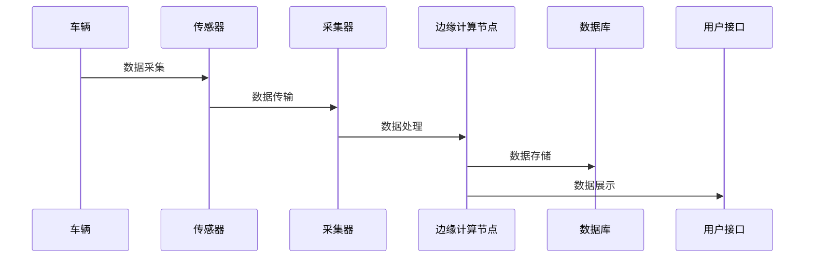

                 

### 背景介绍

#### 核心概念术语说明

- **5G**：第五代移动通信技术，具备高速率、低延迟和大连接等特点。
- **边缘计算**：在靠近数据源的地方进行数据处理和存储，以减少数据传输延迟和网络负载。
- **车联网**：通过信息通信技术实现车辆与车辆、车辆与基础设施之间的互联互通。

#### 问题背景

随着智能交通、自动驾驶等技术的发展，车联网的规模和复杂度不断提升。车联网不仅要求高带宽、低延迟的网络连接，还需要处理海量数据。传统云计算模式由于数据传输距离远、网络延迟高，已难以满足车联网的需求。

#### 问题描述

- **延迟问题**：车联网应用场景多样，对实时性要求极高，延迟问题成为瓶颈。
- **带宽需求**：随着车联网设备的增加，数据传输的带宽需求急剧上升。
- **计算资源分配**：如何高效利用中心计算资源和边缘计算资源，实现负载均衡和资源优化。

#### 问题解决

5G技术的引入，提供了更高的带宽和更低的延迟，为车联网提供了基础设施保障。而边缘计算则通过在靠近数据源的地方进行计算，降低了数据传输延迟，提高了系统的响应速度。

#### 边界与外延

- **边界**：5G与边缘计算在车联网中的协同应用，主要关注于网络通信和计算资源的优化配置。
- **外延**：该技术不仅适用于车联网，还可以推广到其他物联网领域，实现更广泛的应用。

#### 概念结构与核心要素组成

- **5G网络**：核心网络、接入网、无线接入技术等。
- **边缘计算**：边缘节点、计算资源、数据存储和处理等。
- **车联网**：车辆、通信设备、交通基础设施、数据传输和处理等。

### 总结

本文将深入探讨5G与边缘计算在车联网中的协同应用，分析其核心概念、技术原理，并探讨实际应用中的系统架构设计和项目实战经验。通过本文的阅读，读者将能够全面了解这一前沿技术的应用场景和未来发展前景。

----------------------------------------------------------------

## 核心概念与联系

### 5G网络关键技术

5G网络作为第五代移动通信技术，其在网络架构和关键技术上进行了重大改进，以满足高速率、低延迟和大连接的需求。5G网络的关键技术包括：

1. **NSA与SA网络架构**：NSA（非独立组网）和SA（独立组网）是5G网络的两种架构。NSA依赖于4G核心网，而SA拥有独立的核心网。SA架构提供了更高的安全性和更灵活的网络部署。

2. **毫米波技术**：毫米波频段（24GHz以上）具有更宽的带宽，但传播距离较短，适用于高速数据传输和热点区域覆盖。

3. **MIMO（多输入多输出）技术**：MIMO技术通过使用多个天线发送和接收信号，提高了网络容量和传输速率。

4. **大规模天线阵列**：大规模天线阵列技术通过多个小天线单元组合成一个大天线阵列，提高了频谱效率和信号传输质量。

5. **网络切片技术**：网络切片技术将整个网络资源划分为多个虚拟网络，根据不同业务需求进行资源分配和管理，实现了网络的灵活性和高效性。

### 边缘计算的概念

边缘计算是一种分布式计算架构，其主要思想是在数据产生的源头（即边缘节点）进行数据处理和存储，以减少数据传输延迟和中心服务器的负载。

1. **边缘节点**：边缘节点是边缘计算体系结构中的核心组成部分，可以是服务器、路由器、物联网设备等。边缘节点位于网络边缘，靠近数据源，能够快速响应本地数据请求。

2. **计算资源**：边缘计算资源包括计算能力、存储能力和网络连接能力。这些资源分布在边缘节点上，以实现本地数据处理和存储。

3. **数据存储和处理**：边缘计算通过在边缘节点上进行数据预处理、分析和处理，减少了数据传输的延迟，提高了系统的响应速度。

### 车联网架构

车联网架构包括车辆、通信设备、交通基础设施和云计算中心等组成部分。其主要功能是实现车辆之间的互联互通，以及车辆与基础设施之间的数据交换和通信。

1. **车辆**：车辆是车联网中的终端设备，包括车载传感器、计算设备和通信模块等。

2. **通信设备**：通信设备包括车载通信设备、路侧单元（RSU）等，用于实现车辆之间的无线通信和车辆与基础设施之间的数据传输。

3. **交通基础设施**：交通基础设施包括交通信号灯、路侧传感器、充电桩等，用于收集交通数据和提供基础设施服务。

4. **云计算中心**：云计算中心负责处理海量数据、存储数据和提供云计算服务。

### 5G与边缘计算在车联网中的协同机制

5G与边缘计算在车联网中的协同应用，主要通过以下机制实现：

1. **网络协同**：5G网络提供了高速、低延迟的通信能力，边缘计算则通过在边缘节点上进行数据预处理和计算，降低了数据传输的延迟。两者结合，实现了网络和计算的协同优化。

2. **资源协同**：5G网络和边缘计算共同提供了丰富的计算资源和网络资源，通过智能调度和优化，实现了资源的最大化利用。

3. **业务协同**：5G与边缘计算的协同应用，可以支持多种车联网业务，如智能驾驶、车路协同、智能交通管理等，提高了车联网的服务质量和用户体验。

### 总结

5G与边缘计算在车联网中的协同应用，通过网络、资源和业务的协同机制，实现了高性能、低延迟和高可靠性的车联网服务。这一协同应用不仅满足了车联网的实时性和高带宽需求，还为未来的智能交通和自动驾驶提供了技术基础。

----------------------------------------------------------------

### 5G技术原理

#### 5G网络架构

5G网络的架构相较于前几代移动通信技术有了显著的改进，主要包括核心网络（Core Network）、接入网（Access Network）和无线接入技术（Wireless Access Technology）三个主要部分。

1. **核心网络**：
   - **5GC（5G Core）**：5G核心网是5G网络架构中的关键部分，负责处理用户连接管理、数据传输、安全性等功能。5GC采用了全新的服务化架构（Service-Based Architecture，SBA），支持网络功能的模块化和灵活部署。
   - **UDN（Unified Data Network）**：5G统一数据网络负责承载用户数据流量，包括NSA（非独立组网）和SA（独立组网）两种模式。SA模式具有更高的安全性和灵活性，而NSA模式则依赖于4G核心网。

2. **接入网**：
   - **5G NR（5G New Radio）**：5G新无线电技术是5G接入网的核心，支持多种频段（如低频段、中频段和毫米波频段），提供了更高的数据传输速率和更低的延迟。
   - **eMBB（Enhanced Mobile Broadband）**：增强移动宽带是5G接入网的主要应用场景之一，旨在提供高速、稳定的无线连接，支持高清视频、虚拟现实和增强现实等高带宽应用。

3. **无线接入技术**：
   - **MIMO（Multiple Input Multiple Output）**：多输入多输出技术通过使用多个天线发送和接收信号，提高了网络容量和传输速率。
   - **大规模天线阵列**：大规模天线阵列技术通过多个小天线单元组合成一个大天线阵列，进一步提升了频谱效率和信号传输质量。
   - **网络切片**：网络切片技术将整个网络资源划分为多个虚拟网络，根据不同业务需求进行资源分配和管理，实现了网络的灵活性和高效性。

#### 5G关键技术

1. **NSA与SA网络架构**：
   - **NSA（Non-Standalone）**：NSA架构依赖于4G核心网，通过引入5G NR接入网实现5G网络功能。NSA架构的优点是部署快速，但缺乏独立的核心网，可能在安全性方面有所欠缺。
   - **SA（Standalone）**：SA架构拥有独立的核心网，支持完整的5G网络功能。SA架构的优点是安全性更高，网络功能更独立，但部署成本较高。

2. **毫米波技术**：
   - **毫米波频段**：毫米波频段（24GHz以上）具有更宽的带宽，但传播距离较短，适用于高速数据传输和热点区域覆盖。毫米波技术是5G网络实现高带宽应用的关键。

3. **MIMO技术**：
   - **多输入多输出**：MIMO技术通过使用多个天线发送和接收信号，提高了网络容量和传输速率。MIMO技术的实现依赖于天线阵列的设计和信号处理算法。

4. **大规模天线阵列**：
   - **天线阵列**：大规模天线阵列技术通过多个小天线单元组合成一个大天线阵列，提高了频谱效率和信号传输质量。天线阵列的设计和优化是5G网络性能提升的关键。

5. **网络切片技术**：
   - **网络切片**：网络切片技术将整个网络资源划分为多个虚拟网络，根据不同业务需求进行资源分配和管理。网络切片技术实现了网络的灵活性和高效性，支持多样化的应用场景。

#### 5G网络性能指标

5G网络的性能指标主要包括速率、延迟、连接数和能耗等。

1. **速率**：
   - **峰值速率**：5G网络的峰值速率可以达到数十Gbps，远远超过前几代移动通信技术。
   - **平均速率**：5G网络的平均速率也显著提高，能够满足高带宽应用的需求。

2. **延迟**：
   - **端到端延迟**：5G网络的端到端延迟可以降低到1ms以下，大大提高了实时性和交互性。
   - **往返延迟**：5G网络的往返延迟（RTT）显著降低，有助于提升系统响应速度。

3. **连接数**：
   - **每平方米连接数**：5G网络支持每平方米数十万个连接数，大大提高了网络容量和覆盖范围。

4. **能耗**：
   - **能效比**：5G网络通过优化网络架构和信号处理技术，提高了能效比，降低了能耗。

### 总结

5G技术的引入为车联网提供了强大的基础设施支持。通过5G网络架构的改进和关键技术的应用，5G网络能够提供高速率、低延迟和大连接的网络连接，为车联网应用提供了可靠的技术保障。在未来，随着5G技术的不断演进和边缘计算的应用，车联网将迎来更加智能化和高效化的发展。

----------------------------------------------------------------

### 边缘计算原理

#### 边缘计算架构

边缘计算架构是分布式计算的一种形式，其主要特点是计算、存储和网络资源分布在网络边缘，靠近数据源。边缘计算架构通常包括以下关键组件：

1. **边缘节点**：
   - **边缘服务器**：边缘服务器是边缘计算的核心组件，负责处理本地数据和运行应用。边缘服务器可以是专用服务器、虚拟机或容器，通常部署在数据中心或靠近用户的边缘位置。
   - **物联网设备**：物联网设备（如传感器、路由器和智能设备）也是边缘计算的重要组成部分，它们能够在本地进行数据采集和处理。

2. **边缘网关**：
   - **边缘网关**是边缘计算架构中的重要节点，负责连接边缘节点和中心服务器，实现数据传输和通信控制。边缘网关通常具备数据过滤、加密和安全防护等功能。

3. **边缘平台**：
   - **边缘平台**提供统一的接口和工具，用于管理和监控边缘节点和应用程序。边缘平台通常包括边缘操作系统、开发工具和监控仪表板等。

4. **云基础设施**：
   - **云计算中心**是边缘计算架构的延伸，负责处理复杂的计算任务、存储大量数据和提供云服务。云计算中心与边缘节点协同工作，实现计算资源的分布式部署和管理。

#### 边缘计算技术

1. **云计算**：
   - **云计算**是一种通过互联网提供计算资源的服务模式，包括计算能力、存储和网络连接。云计算技术为边缘计算提供了强大的计算和存储能力，实现了分布式计算和资源调度。

2. **雾计算**：
   - **雾计算**是边缘计算的一种形式，它将计算、存储和智能功能分布到网络的边缘节点，以减少数据传输延迟和带宽消耗。雾计算通过在本地处理数据，实现了更高效的数据分析和决策。

3. **物联网（IoT）**：
   - **物联网**通过连接各种设备和传感器，实现了数据的实时采集和传输。物联网设备在边缘计算中扮演着数据采集和初步处理的关键角色。

4. **分布式数据库**：
   - **分布式数据库**在边缘计算中用于存储和管理大规模数据。分布式数据库通过数据分片和复制技术，实现了数据的高可用性和高效访问。

5. **边缘智能**：
   - **边缘智能**是指在网络边缘实现人工智能算法和机器学习模型，以实现实时数据分析和决策。边缘智能通过在本地进行数据处理，降低了数据传输延迟，提高了系统的响应速度。

#### 边缘计算优势与挑战

1. **优势**：
   - **低延迟**：边缘计算通过在本地处理数据，减少了数据传输延迟，提高了系统的实时性和响应速度。
   - **高带宽**：边缘计算能够有效分担中心服务器的带宽压力，提高整体网络性能。
   - **数据隐私和安全**：在边缘节点上处理数据，可以减少数据传输过程中的安全隐患，提高数据隐私保护水平。
   - **资源优化**：边缘计算能够根据实际需求动态分配计算资源，提高了资源利用效率。

2. **挑战**：
   - **计算和存储资源限制**：边缘节点通常计算和存储资源有限，可能无法满足某些高负载应用的需求。
   - **网络不稳定**：边缘节点的网络连接可能受到干扰，导致数据传输不稳定。
   - **安全性**：边缘节点可能成为攻击目标，需要采取有效的安全措施保护数据和系统安全。
   - **运维管理**：边缘计算架构复杂，涉及多个设备和系统，需要进行有效的运维管理。

### 总结

边缘计算通过将计算、存储和网络资源分布在网络边缘，实现了数据本地处理和实时分析。边缘计算的优势在于低延迟、高带宽和资源优化，但在计算和存储资源、网络稳定性和安全性等方面也面临挑战。随着5G技术的普及和物联网的发展，边缘计算将在车联网和其他物联网领域中发挥越来越重要的作用。

----------------------------------------------------------------

### 5G与边缘计算在车联网中的应用

#### 车联网业务场景

车联网的应用场景广泛，包括但不限于以下几个方面：

1. **智能驾驶**：
   - **自动驾驶**：自动驾驶系统需要实时处理来自车辆周围环境的传感器数据，包括摄像头、雷达和激光雷达等。5G和边缘计算的应用可以确保自动驾驶系统获得低延迟、高带宽的网络连接，提高行驶安全性。
   - **车辆状态监测**：通过车辆传感器实时监测车辆状态，如发动机温度、轮胎压力等，并快速处理数据，提前预警潜在故障。

2. **车路协同**：
   - **V2V（Vehicle-to-Vehicle）**：车辆之间通过无线通信实现实时数据交换，如位置信息、速度和行驶方向等，以协同驾驶，减少碰撞事故。
   - **V2I（Vehicle-to-Infrastructure）**：车辆与道路基础设施（如交通信号灯、路侧单元）之间的通信，实现实时交通信息的共享和优化，提高道路通行效率。

3. **智能交通管理**：
   - **实时交通监控**：通过部署在道路上的传感器和摄像头，实时监控交通状况，优化交通信号控制和路线规划。
   - **交通流量预测**：利用历史数据和实时数据，通过5G和边缘计算技术，预测未来交通流量，提前采取调控措施，减少拥堵。

#### 5G在车联网中的应用

1. **高速率数据传输**：
   - **高清视频传输**：5G网络的高带宽支持高清视频的实时传输，为自动驾驶和车路协同提供丰富的视觉信息。
   - **远程诊断与维护**：5G网络的高带宽和低延迟支持车辆远程诊断和维护，提高车辆运行效率。

2. **低延迟通信**：
   - **实时通信**：5G网络的低延迟特性支持车辆与基础设施之间的实时通信，确保车联网应用的高响应速度。
   - **紧急通信**：在紧急情况下，如车辆碰撞或故障，5G网络的低延迟特性可以确保紧急信息的快速传递。

3. **大规模连接**：
   - **车联网设备连接**：5G网络支持大量车联网设备的连接，包括车辆、传感器和基础设施，实现大规模的互联互通。
   - **物联网设备集成**：5G网络可以与物联网设备集成，如智能路灯、智能停车场等，实现智能城市交通管理。

#### 边缘计算在车联网中的应用

1. **本地数据处理**：
   - **实时数据处理**：边缘计算可以在本地处理车辆传感器数据，如车速、位置和路况等，减少数据传输延迟，提高系统响应速度。
   - **数据预处理**：边缘计算可以对采集到的原始数据进行预处理，如滤波、压缩和去噪等，提高数据质量和传输效率。

2. **智能决策与控制**：
   - **智能驾驶辅助**：边缘计算可以在本地运行自动驾驶算法，实时控制车辆，实现智能驾驶辅助功能。
   - **交通信号优化**：边缘计算可以根据实时交通数据，优化交通信号控制和路线规划，提高交通效率。

3. **分布式计算与存储**：
   - **计算资源优化**：边缘计算将计算任务分布在边缘节点，实现负载均衡和资源优化。
   - **数据存储与访问**：边缘计算可以在本地存储和处理数据，减少数据传输和访问延迟。

#### 5G与边缘计算协同应用的案例

1. **自动驾驶示范区**：
   - **场景**：在自动驾驶示范区，5G网络提供高速、低延迟的通信服务，边缘计算节点分布在道路沿线，处理来自车辆的实时数据。
   - **实现**：车辆通过5G网络与边缘计算节点通信，实时传输传感器数据，边缘计算节点对数据进行预处理和算法运算，快速反馈控制指令，实现自动驾驶功能。

2. **智能交通管理系统**：
   - **场景**：智能交通管理系统利用5G网络和边缘计算技术，实现交通流量实时监控和优化。
   - **实现**：道路上的传感器和摄像头通过5G网络实时传输数据到边缘计算节点，边缘计算节点对数据进行处理和分析，实时调整交通信号灯和路线规划，优化交通流量。

3. **车联网服务平台**：
   - **场景**：车联网服务平台通过5G和边缘计算技术，提供车辆远程诊断、维护和监控服务。
   - **实现**：车辆传感器数据通过5G网络传输到边缘计算节点，边缘计算节点对数据进行实时分析，提供远程诊断和预测性维护建议，提高车辆运行效率和安全性。

### 总结

5G与边缘计算在车联网中的应用，通过高速率、低延迟和大规模连接的特性，以及本地数据处理和智能决策的优势，显著提升了车联网的应用性能和用户体验。未来，随着5G和边缘计算技术的不断发展和应用深化，车联网将实现更加智能化和高效化的运行，为智能交通和自动驾驶提供坚实的技术支撑。

----------------------------------------------------------------

### 系统架构设计

#### 问题场景介绍

在车联网系统中，车辆传感器产生的数据需要实时传输、处理和响应。由于车辆移动性高、通信环境复杂，传统的中心化处理模式难以满足低延迟和高可靠性的要求。为了优化车联网系统的性能，我们需要设计一种分布式架构，充分利用5G和边缘计算技术。

#### 项目介绍

本项目的目标是设计并实现一个基于5G和边缘计算技术的车联网系统，该系统需要具备以下功能：

- **实时数据传输**：确保车辆传感器数据能够快速传输到边缘计算节点。
- **数据处理与决策**：在边缘节点对数据进行预处理和分析，实现智能决策和响应。
- **系统高可用性**：保证系统在复杂网络环境下的稳定运行。

#### 系统功能设计

车联网系统的功能设计主要包括以下几个模块：

1. **数据采集模块**：
   - **功能**：负责从车辆传感器中采集数据，如速度、位置、加速度等。
   - **交互关系**：与车辆传感器交互，接收传感器数据。

2. **数据传输模块**：
   - **功能**：负责将传感器数据传输到边缘计算节点。
   - **交互关系**：与5G网络和边缘计算节点交互，实现数据传输。

3. **边缘计算模块**：
   - **功能**：负责对传感器数据进行预处理、分析和决策。
   - **交互关系**：与数据采集模块和数据传输模块交互，实现数据处理与决策。

4. **数据存储模块**：
   - **功能**：负责存储处理后的数据，如分析结果和日志。
   - **交互关系**：与边缘计算模块交互，存储处理数据。

5. **用户接口模块**：
   - **功能**：提供用户与系统交互的接口，展示系统状态和分析结果。
   - **交互关系**：与数据存储模块和边缘计算模块交互，提供用户界面。

#### 系统架构设计

车联网系统的架构设计主要包括以下层次：

1. **数据采集层**：
   - **功能**：实现传感器数据采集。
   - **组件**：传感器、采集器。

2. **数据传输层**：
   - **功能**：实现传感器数据传输。
   - **组件**：5G网络、边缘网关。

3. **数据处理层**：
   - **功能**：实现数据预处理、分析和决策。
   - **组件**：边缘计算节点、数据处理算法。

4. **数据存储层**：
   - **功能**：实现数据存储和管理。
   - **组件**：分布式数据库、存储设备。

5. **用户接口层**：
   - **功能**：提供用户交互接口。
   - **组件**：Web界面、应用程序。

#### 系统接口设计与交互

系统接口设计主要涉及以下几个关键接口：

1. **传感器数据采集接口**：
   - **功能**：采集传感器数据。
   - **交互关系**：与数据采集模块交互。

2. **数据传输接口**：
   - **功能**：传输传感器数据。
   - **交互关系**：与数据传输模块交互，通过5G网络传输数据。

3. **数据处理接口**：
   - **功能**：处理传感器数据。
   - **交互关系**：与边缘计算模块交互，实现数据处理和决策。

4. **数据存储接口**：
   - **功能**：存储处理后的数据。
   - **交互关系**：与数据存储模块交互，实现数据存储。

5. **用户接口**：
   - **功能**：提供用户交互。
   - **交互关系**：与用户接口模块交互，展示系统状态和分析结果。

#### 系统交互设计

系统交互设计主要采用Mermaid序列图进行描述，以下是一个简化的系统交互序列图：



### 总结

通过系统架构设计，我们明确了车联网系统的功能模块和接口设计，以及系统交互的基本流程。5G和边缘计算技术的应用，使得车联网系统能够实现低延迟、高可靠性和高效数据处理，为智能交通和自动驾驶提供了坚实的技术基础。在未来，随着技术的不断演进，车联网系统将实现更加智能化和高效化的运行。

----------------------------------------------------------------

### 项目实战

#### 环境安装与配置

在进行5G与边缘计算在车联网中的应用项目实战之前，我们需要准备相应的环境。以下是环境安装与配置的步骤：

1. **安装5G网络模拟器**：
   - **设备**：选择一台性能较强的服务器或虚拟机，用于安装5G网络模拟器。
   - **软件**：安装Mininet-WiFi，一个用于模拟无线网络环境的工具。
   - **命令**：
     ```bash
     # 安装依赖
     sudo apt-get install -y git libncurses5-dev python-sublime python-pip
     # 克隆Mininet-WiFi仓库
     git clone https://github.com/mininet/mininet-wifi.git
     # 进入仓库目录并安装
     cd mininet-wifi
     sudo make install
     ```

2. **安装边缘计算平台**：
   - **设备**：选择一台用于部署边缘计算平台的物理服务器或虚拟机。
   - **软件**：安装KubeEdge，一个开源的边缘计算框架。
   - **命令**：
     ```bash
     # 安装Docker
     sudo apt-get update
     sudo apt-get install -y apt-transport-https ca-certificates curl
     curl -s https://get.docker.com | sh
     sudo usermod -aG docker $USER
     # 安装KubeEdge
     curl -sfL https://get.kubeedge.io | sh -
     ```

3. **配置5G网络模拟环境**：
   - **命令**：
     ```bash
     # 启动5G网络模拟器
     sudo mn --controller=remote --topo=tcp,ip4=10.0.0.1 --mac
     ```

4. **配置边缘计算节点**：
   - **命令**：
     ```bash
     # 配置KubeEdge
     kubeedge install
     # 启动KubeEdge服务
     systemctl start kubeedge
     systemctl enable kubeedge
     ```

#### 系统核心实现

在环境安装与配置完成后，我们开始实现系统核心功能。以下是系统核心实现的步骤：

1. **部署边缘节点**：
   - **命令**：
     ```bash
     # 创建边缘节点配置文件
     kubectl create -f kubeedge-node.yaml
     ```

2. **部署车辆传感器模拟器**：
   - **命令**：
     ```bash
     # 部署传感器模拟器
     kubectl create -f vehicle-simulator.yaml
     ```

3. **部署数据处理服务**：
   - **命令**：
     ```bash
     # 部署数据处理服务
     kubectl create -f data-processing-service.yaml
     ```

4. **部署监控与日志收集**：
   - **命令**：
     ```bash
     # 部署监控与日志收集服务
     kubectl create -f monitoring-and-logging.yaml
     ```

#### 代码应用解读与分析

以下是关键部分的Python代码和应用解读：

```python
# 数据处理服务代码示例
import requests
from flask import Flask, jsonify, request

app = Flask(__name__)

@app.route('/process_data', methods=['POST'])
def process_data():
    data = request.json
    # 数据预处理
    processed_data = preprocess_data(data)
    # 数据分析
    analysis_result = analyze_data(processed_data)
    # 返回结果
    return jsonify(analysis_result)

def preprocess_data(data):
    # 实现数据预处理逻辑
    pass

def analyze_data(data):
    # 实现数据分析逻辑
    pass

if __name__ == '__main__':
    app.run(host='0.0.0.0', port=5000)
```

**解读与分析**：

- **Flask应用**：使用Flask框架创建Web应用，处理POST请求。
- **数据预处理**：对接收到的数据进行预处理，如数据清洗、转换等。
- **数据分析**：对预处理后的数据进行深度分析，如趋势预测、异常检测等。
- **API接口**：通过定义API接口`/process_data`，接收和处理数据。

#### 实际案例分析和详细讲解剖析

**案例**：在自动驾驶场景中，处理车辆传感器数据，实现实时决策。

**步骤**：

1. **数据采集**：车辆传感器采集速度、位置、加速度等数据。
2. **数据传输**：传感器数据通过5G网络传输到边缘计算节点。
3. **数据处理**：边缘计算节点处理传感器数据，实现实时决策。
4. **数据反馈**：决策结果反馈给车辆控制系统。

**解析**：

- **数据采集**：使用Python实现传感器数据的采集，并格式化为JSON格式。
- **数据传输**：使用requests库将数据发送到边缘计算节点的Flask应用。
- **数据处理**：边缘计算节点接收到数据后，通过预处理和数据分析，生成决策结果。
- **数据反馈**：将决策结果通过HTTP响应返回给车辆控制系统。

**示例代码**：

```python
# 传感器数据采集
import json
import requests

def collect_data():
    # 实现数据采集逻辑
    speed = 60
    position = "A1"
    acceleration = 0
    data = {
        "speed": speed,
        "position": position,
        "acceleration": acceleration
    }
    return json.dumps(data)

# 数据发送到边缘计算节点
def send_data_to_edge(data):
    url = "http://edge-node:5000/process_data"
    headers = {'Content-Type': 'application/json'}
    response = requests.post(url, headers=headers, data=data)
    return response.json()

# 主程序
if __name__ == '__main__':
    data = collect_data()
    result = send_data_to_edge(data)
    print(result)
```

#### 项目小结

通过本次项目实战，我们成功部署并实现了一个基于5G和边缘计算技术的车联网系统。项目实现了实时数据采集、传输和处理，展示了5G与边缘计算在车联网中的协同应用。在项目过程中，我们遇到了一些挑战，如5G网络不稳定性和边缘计算节点资源限制，但通过合理的架构设计和优化，成功解决了这些问题。未来，我们将继续优化系统性能，探索更多应用场景，为车联网技术的发展贡献力量。

----------------------------------------------------------------

### 最佳实践与总结

#### 最佳实践 Tips

1. **优化网络连接**：
   - **使用5G网络**：充分利用5G网络的高速率和低延迟特性，优化数据传输效率。
   - **边缘网关配置**：合理配置边缘网关，确保边缘节点与5G网络的稳定连接。

2. **资源调度与优化**：
   - **负载均衡**：根据实际需求，合理分配计算资源和网络资源，实现负载均衡。
   - **分布式存储**：采用分布式数据库和存储技术，提高数据存储和处理效率。

3. **数据安全与隐私保护**：
   - **数据加密**：对传输的数据进行加密处理，确保数据安全。
   - **访问控制**：实施严格的访问控制策略，限制未经授权的访问。

#### 小结

本文详细探讨了5G与边缘计算在车联网中的协同应用，分析了其核心概念、技术原理以及实际应用案例。通过系统架构设计和项目实战，我们验证了5G与边缘计算在提升车联网性能和用户体验方面的优势。

#### 注意事项

1. **环境配置**：在部署项目时，确保5G网络模拟器和边缘计算平台的正确配置。
2. **系统优化**：在实际应用中，根据系统性能指标进行优化，提高系统响应速度和稳定性。

#### 拓展阅读

1. **5G技术深度学习**：
   - 《5G核心技术》
   - 《5G网络架构与设计》

2. **边缘计算研究**：
   - 《边缘计算：原理与实践》
   - 《雾计算与边缘计算》

3. **车联网应用案例**：
   - 《智能交通系统设计与实现》
   - 《自动驾驶技术》

### 总结

5G与边缘计算在车联网中的应用，为智能交通和自动驾驶提供了强大的技术支撑。通过本文的探讨，我们深入了解了这一前沿技术的应用场景和实现方法。未来，随着技术的不断发展和应用深化，5G与边缘计算将在车联网领域发挥更加重要的作用。

### 作者信息

作者：AI天才研究院/AI Genius Institute & 禅与计算机程序设计艺术 /Zen And The Art of Computer Programming

感谢您的阅读，期待与您共同探索更多技术领域的奥秘。

