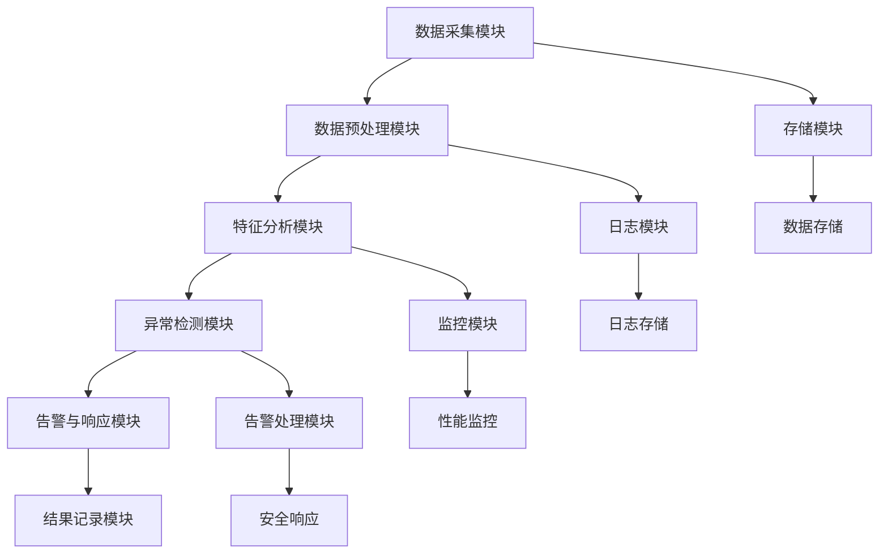
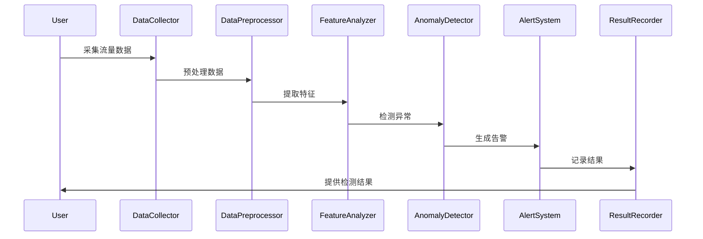

                 

## 引言

随着互联网技术的飞速发展，网络安全问题日益凸显，网络流量的异常检测成为保障网络安全的重要手段。网络流量异常检测旨在通过对网络流量数据的分析，识别出潜在的威胁和异常行为，从而采取相应的措施进行防护。而机器学习技术在这一领域的应用，不仅提高了检测的准确性和效率，也为网络安全提供了新的解决方案。

机器学习，作为人工智能的重要分支，通过构建模型从数据中自动发现规律和模式，为各个领域带来了深刻的变革。在网络流量异常检测中，机器学习通过学习正常流量数据，能够有效识别出异常流量，从而提高网络安全防护能力。本文旨在探讨机器学习在网络流量异常检测中的应用，提高网络安全，具体内容如下：

首先，我们将介绍机器学习在网络流量异常检测中的背景和意义，解释为何机器学习技术能够有效应对网络流量异常检测的问题。接着，我们将详细讲解机器学习的基础知识，包括核心概念、分类算法和回归算法等，并探讨这些知识如何应用于网络流量异常检测。

接下来，我们将深入探讨网络流量异常检测的原理，介绍网络流量特征提取的方法，并阐述常用的异常检测模型与方法。通过Mermaid流程图，我们将直观展示算法的流程，并结合Python代码和数学模型进行详细解释。

随后，我们将分析机器学习算法在网络流量异常检测中的应用，包括KNN算法、决策树算法和支持向量机算法等。我们将使用Mermaid流程图和Python代码展示算法原理，并讨论算法的性能分析。

在系统设计和实现部分，我们将介绍网络流量异常检测系统的功能设计、架构设计、接口设计和交互设计，并通过Mermaid类图、架构图和序列图进行展示。

接着，我们将通过实际项目实战和案例分析，详细解读系统核心实现源代码，剖析实际案例，并进行项目小结。

最后，我们将总结最佳实践，给出小结与展望，并提供注意事项和拓展阅读，以帮助读者更好地理解和应用机器学习技术于网络流量异常检测。

## 背景与意义

### 网络安全的重要性

网络安全是现代信息技术基础设施的基石，它直接关系到国家安全、经济稳定和社会秩序。随着互联网的普及，越来越多的关键基础设施和敏感数据依赖于网络运行，使得网络安全的重要性愈发凸显。网络攻击手段日益复杂，从传统的病毒、木马到高级持续性威胁（APT），威胁形式层出不穷，对企业和个人都构成了严重威胁。

### 网络流量异常检测的作用

网络流量异常检测是一种主动防御策略，旨在通过监测和分析网络流量数据，发现潜在的威胁和异常行为。其主要作用包括：

1. **威胁预警**：提前发现网络攻击和恶意流量，及时采取防护措施。
2. **安全事件响应**：为安全事件提供线索，帮助组织快速响应和应对。
3. **合规性检查**：满足法规和标准要求，确保数据安全和隐私保护。
4. **资源优化**：通过识别异常流量，优化网络资源分配，提升网络性能。

### 机器学习技术的潜力

机器学习技术在网络流量异常检测中的应用具有显著潜力，主要体现在以下几个方面：

1. **自动化处理**：机器学习算法可以自动从海量数据中学习规律，无需人工干预，大大提高了检测效率和准确性。
2. **自适应能力**：机器学习模型能够自适应环境变化，持续优化检测能力，适应新的威胁和异常模式。
3. **多维特征分析**：机器学习可以综合考虑网络流量的多维特征，如流量速率、端口使用情况、数据包大小等，提高检测的全面性和准确性。
4. **可扩展性**：机器学习算法易于扩展到大规模网络环境，能够处理大量数据，满足复杂网络的检测需求。

### 机器学习技术的优势

相比于传统基于规则的检测方法，机器学习技术具有以下优势：

1. **灵活性**：机器学习算法能够灵活适应不同场景，处理各种复杂的网络流量数据。
2. **鲁棒性**：机器学习模型对噪声数据和异常值具有较强的鲁棒性，不易受到误报和漏报的影响。
3. **可解释性**：虽然深度学习模型在性能上具有优势，但传统机器学习算法如决策树和支持向量机等更易于理解，有利于模型的解释和优化。
4. **协同工作**：机器学习技术可以与其他安全技术和工具协同工作，形成多层次、多维度的安全防护体系。

### 应用前景

随着技术的不断进步，机器学习在网络流量异常检测中的应用前景十分广阔。未来的发展方向包括：

1. **模型融合**：结合多种机器学习模型，提高检测的准确性和鲁棒性。
2. **实时处理**：提升机器学习算法的实时性，实现快速响应。
3. **智能决策**：通过机器学习模型，辅助安全专家进行威胁分析和决策。
4. **隐私保护**：研究隐私友好的机器学习算法，确保数据安全和个人隐私。

总之，机器学习技术为网络流量异常检测带来了全新的机遇和挑战。通过深入研究和应用，我们有望进一步提升网络安全防护能力，构建更加安全、可靠的数字世界。

## 机器学习基础与网络流量异常检测关系

### 机器学习核心概念

机器学习（Machine Learning，ML）是一门研究如何让计算机系统从数据中学习并改进性能的技术。其核心概念包括：

#### 监督学习（Supervised Learning）

监督学习是一种有监督的训练方法，通过标记数据（输入和输出）来训练模型，从而能够预测未知数据的标签。监督学习分为两种类型：

1. **分类（Classification）**：输出是离散的标签，如“是”或“否”，“恶意”或“良性”。
2. **回归（Regression）**：输出是连续的值，如预测股票价格或房价。

#### 无监督学习（Unsupervised Learning）

无监督学习不需要标记数据，主要任务是发现数据中的隐含结构。主要类型包括：

1. **聚类（Clustering）**：将数据划分为若干个类别，如K-means、DBSCAN。
2. **降维（Dimensionality Reduction）**：减少数据维度，如PCA（主成分分析）、t-SNE。
3. **关联规则学习（Association Rule Learning）**：发现数据项之间的关联关系，如Apriori算法。

#### 半监督学习（Semi-Supervised Learning）

半监督学习结合了监督学习和无监督学习的特点，利用少量标记数据和大量未标记数据共同训练模型，以提高学习效果。

### 分类算法与回归算法

在机器学习中，分类和回归是两种主要的学习任务。分类算法将数据分为几个类别，而回归算法则预测一个连续的数值。

#### 常见的分类算法

1. **K近邻算法（K-Nearest Neighbors, KNN）**：通过计算新样本与训练样本的相似度，将新样本分类到最近的k个样本所属的类别中。
2. **决策树（Decision Tree）**：通过一系列的判断条件，将数据集分割为多个子集，直到达到终止条件，如最大深度或信息增益。
3. **支持向量机（Support Vector Machine, SVM）**：寻找一个最优超平面，将不同类别的数据分开，以达到最大间隔。
4. **朴素贝叶斯（Naive Bayes）**：基于贝叶斯定理和属性独立假设，通过计算各类别概率来预测新样本的类别。

#### 常见的回归算法

1. **线性回归（Linear Regression）**：通过建立线性关系模型，预测因变量（输出）与自变量（输入）之间的关系。
2. **岭回归（Ridge Regression）**：在最小二乘回归的基础上，通过引入正则化项来避免过拟合。
3. **LASSO回归（Least Absolute Shrinkage and Selection Operator）**：通过绝对值正则化，实现特征选择和参数压缩。
4. **决策树回归（Decision Tree Regression）**：通过构建树形结构，对数据进行分割和预测。

### 网络流量异常检测原理

网络流量异常检测通常采用监督学习或无监督学习的方法。下面分别介绍这两种方法在网络流量异常检测中的具体应用。

#### 监督学习方法

监督学习方法通常需要大量的标记数据，通过训练模型来识别正常流量和异常流量。

1. **特征提取**：首先需要从网络流量数据中提取特征，如流量速率、数据包大小、端口使用情况等。
2. **模型训练**：使用标记数据训练分类模型，如KNN、SVM或决策树等，以识别正常流量和异常流量。
3. **模型评估**：通过测试集评估模型的准确率、召回率、F1值等指标，以评估模型的性能。

#### 无监督学习方法

无监督学习方法不需要标记数据，通过分析数据结构来识别异常流量。

1. **聚类分析**：使用无监督学习方法如K-means聚类，将网络流量数据分为正常流量和异常流量。
2. **孤立点检测**：使用孤立点检测算法如DBSCAN，识别出数据中的异常点，这些点很可能表示异常流量。
3. **模型评估**：通过比较聚类结果与实际流量数据，评估无监督学习方法的有效性。

### 机器学习在网络流量异常检测中的应用

1. **自动化处理**：机器学习模型可以自动从大量网络流量数据中学习规律，无需人工干预，提高检测效率。
2. **自适应能力**：机器学习模型能够自适应网络环境的变化，持续优化检测能力，以应对新的威胁和异常模式。
3. **多维特征分析**：通过综合考虑网络流量的多维特征，提高检测的全面性和准确性。
4. **实时处理**：使用实时数据流处理技术，实现快速检测和响应，保障网络安全。

综上所述，机器学习技术在网络流量异常检测中的应用具有显著优势，通过理解其核心概念和算法，我们可以更好地发挥其在网络安全中的作用。

### 网络流量异常检测原理

网络流量异常检测的核心在于通过分析网络数据，识别出正常流量和异常流量。这一过程涉及到数据的特征提取和异常检测模型的构建。下面，我们将详细探讨这两个关键步骤。

#### 网络流量的特征提取

网络流量特征提取是异常检测的基础，其目的是从原始流量数据中提取出能够反映流量特性的指标。这些特征可以是定量的，如流量速率、数据包大小、端口号等，也可以是定性的，如协议类型、应用类型等。常见的流量特征提取方法包括：

1. **流量统计特征**：包括流量速率、流量大小、传输时间等，这些特征能够直接反映流量的规模和频率。
2. **流量时间序列特征**：通过分析流量在一段时间内的变化趋势，如平均流量速率、标准差、自相关系数等。
3. **流量模式特征**：通过识别流量模式，如访问频率、数据包分布等，来提取特征。
4. **流量语义特征**：通过提取流量所承载的数据内容特征，如URL、HTTP请求等，来辅助异常检测。

特征提取的关键在于找到能够区分正常流量和异常流量的特征，同时避免引入过多的噪声特征。以下是一个简单的特征提取流程：

1. **数据预处理**：去除无效和噪声数据，对数据格式进行标准化处理。
2. **特征选择**：使用统计方法或机器学习方法选择与异常检测相关度较高的特征。
3. **特征转换**：将提取的特征转换为适合机器学习模型的形式，如归一化、二值化等。

#### 异常检测模型与方法

特征提取完成后，下一步是构建异常检测模型。异常检测模型的目标是识别出与正常流量显著不同的异常流量。以下是几种常见的异常检测模型和方法：

1. **基于统计的方法**：这种方法包括统计检验和概率模型。常见的统计检验方法有z-score和3sigma原则，通过计算数据点的偏差和分布特性来识别异常。概率模型则通过建立正常流量分布的概率模型，识别出概率较低的点作为异常。

2. **基于距离的方法**：这类方法通过计算新样本与已知正常样本之间的距离来判断其是否异常。常用的距离度量包括欧氏距离、曼哈顿距离和余弦相似度。K近邻（K-Nearest Neighbors, KNN）算法是一个典型的基于距离的异常检测方法，它通过比较新样本与邻居样本的相似度来判断其是否异常。

3. **基于聚类的方法**：聚类方法通过将流量数据分为多个簇，识别出簇外的数据点作为异常。K-means聚类是一种常用的聚类方法，它通过迭代计算聚类中心，将相似度较高的数据点归为一类。DBSCAN（Density-Based Spatial Clustering of Applications with Noise）是一种基于密度的聚类方法，它能够识别出具有不同密度的区域，并识别出噪声点。

4. **基于生成模型的方法**：生成模型通过学习正常流量数据的生成过程，识别出与模型生成结果不符的数据点作为异常。概率图模型如高斯混合模型（Gaussian Mixture Model, GMM）和生成对抗网络（Generative Adversarial Networks, GAN）是两种常见的生成模型，前者通过假设流量数据服从多个高斯分布，后者通过生成器和判别器的对抗训练来学习数据分布。

#### 算法流程与Mermaid流程图

以下是异常检测算法的一个典型流程，并使用Mermaid流程图进行展示：

```mermaid
graph TD
    A[数据预处理] --> B[特征提取]
    B --> C{聚类/统计检验}
    C -->|正常} D[分类]
    C -->|异常} E[告警]

    D --> F[记录结果]
    E --> F
```

- **数据预处理**：包括去除噪声、缺失值填充、数据标准化等步骤，为后续特征提取做好准备。
- **特征提取**：从流量数据中提取关键特征，如流量速率、数据包大小等。
- **聚类/统计检验**：使用聚类算法或统计检验方法，将流量数据分为正常和异常两类。
- **分类**：根据检测结果进行分类，正常流量进入正常处理流程，异常流量触发告警。
- **记录结果**：记录检测结果，为后续分析和改进提供依据。

#### Python代码示例

下面是一个简单的Python代码示例，使用KNN算法进行异常检测：

```python
from sklearn.neighbors import KNeighborsClassifier
from sklearn.model_selection import train_test_split
from sklearn.metrics import accuracy_score
import pandas as pd

# 加载数据集
data = pd.read_csv('network_traffic.csv')
X = data[['rate', 'size', 'port']]
y = data['label']

# 划分训练集和测试集
X_train, X_test, y_train, y_test = train_test_split(X, y, test_size=0.2, random_state=42)

# 构建KNN模型
knn = KNeighborsClassifier(n_neighbors=3)
knn.fit(X_train, y_train)

# 测试模型
y_pred = knn.predict(X_test)
print(f'Accuracy: {accuracy_score(y_test, y_pred)}')

# 异常检测示例
new_data = [[100, 1024, 80]]
new_pred = knn.predict(new_data)
print(f'New data label: {new_pred[0]}')
```

在这个示例中，我们使用KNN算法对网络流量数据进行分类，并测试了模型的准确率。通过这个简单的示例，我们可以看到机器学习算法在网络流量异常检测中的基本应用。

综上所述，网络流量异常检测通过特征提取和异常检测模型的方法，能够有效识别网络流量中的异常行为。使用Mermaid流程图和Python代码，我们能够直观地展示和实现这一过程，为网络安全提供了强有力的技术支持。

### 机器学习算法在网络流量异常检测中的应用

在网络安全领域，机器学习算法已成为识别和防范网络流量异常的重要工具。以下我们将详细探讨几种常用的机器学习算法在网络流量异常检测中的应用，包括KNN算法、决策树算法和支持向量机（SVM）算法。我们将通过Mermaid流程图和Python代码来解释这些算法的原理和实现。

#### KNN算法

KNN（K-Nearest Neighbors）算法是一种基于距离的简单分类算法。它的核心思想是找到一个新样本的k个最近邻，并基于这些邻居的标签来预测新样本的类别。下面是一个KNN算法的简单实现：

```mermaid
graph TD
    A[输入流量数据] --> B{计算距离}
    B -->|最近邻} C{投票决定}
    C --> D[输出结果]
```

```python
from sklearn.neighbors import KNeighborsClassifier
from sklearn.model_selection import train_test_split
from sklearn.metrics import accuracy_score

# 加载数据集
X, y = load_data()

# 划分训练集和测试集
X_train, X_test, y_train, y_test = train_test_split(X, y, test_size=0.2, random_state=42)

# 构建KNN模型
knn = KNeighborsClassifier(n_neighbors=3)
knn.fit(X_train, y_train)

# 测试模型
y_pred = knn.predict(X_test)
print(f'Accuracy: {accuracy_score(y_test, y_pred)}')

# 新样本预测
new_data = [[100, 1024, 80]]
new_pred = knn.predict(new_data)
print(f'New data label: {new_pred[0]}')
```

#### 决策树算法

决策树（Decision Tree）是一种基于树形结构的数据集划分算法。它通过一系列的判断条件将数据集分割为多个子集，每个子集对应一个类别。决策树算法的优点是易于理解和解释。下面是一个简单的决策树实现：

```mermaid
graph TD
    A[输入流量数据] --> B{判断流量速率}
    B -->|高速率} C{判断数据包大小}
    C -->|大} D{恶意流量}
    C -->|小} E{正常流量}
    B -->|低速率} F{判断端口号}
    F -->|端口号80} G{HTTP请求}
    F -->|其他} H{未知流量}
```

```python
from sklearn.tree import DecisionTreeClassifier
from sklearn.model_selection import train_test_split
from sklearn.metrics import accuracy_score

# 加载数据集
X, y = load_data()

# 划分训练集和测试集
X_train, X_test, y_train, y_test = train_test_split(X, y, test_size=0.2, random_state=42)

# 构建决策树模型
dt = DecisionTreeClassifier()
dt.fit(X_train, y_train)

# 测试模型
y_pred = dt.predict(X_test)
print(f'Accuracy: {accuracy_score(y_test, y_pred)}')

# 新样本预测
new_data = [[100, 1024, 80]]
new_pred = dt.predict(new_data)
print(f'New data label: {new_pred[0]}')
```

#### 支持向量机（SVM）

支持向量机（Support Vector Machine, SVM）是一种强大的分类算法，其核心思想是找到一个最优的超平面，将不同类别的数据点分隔开来。SVM在处理高维数据时表现尤为出色。下面是一个简单的SVM实现：

```mermaid
graph TD
    A[输入流量数据] --> B{计算间隔}
    B -->|最大间隔} C{划分超平面}
    C --> D[输出结果]
```

```python
from sklearn.svm import SVC
from sklearn.model_selection import train_test_split
from sklearn.metrics import accuracy_score

# 加载数据集
X, y = load_data()

# 划分训练集和测试集
X_train, X_test, y_train, y_test = train_test_split(X, y, test_size=0.2, random_state=42)

# 构建SVM模型
svm = SVC()
svm.fit(X_train, y_train)

# 测试模型
y_pred = svm.predict(X_test)
print(f'Accuracy: {accuracy_score(y_test, y_pred)}')

# 新样本预测
new_data = [[100, 1024, 80]]
new_pred = svm.predict(new_data)
print(f'New data label: {new_pred[0]}')
```

### 算法性能分析

在评估机器学习算法在网络流量异常检测中的性能时，常用的指标包括准确率、召回率、F1值等。以下是一个简单的性能评估：

```python
from sklearn.metrics import classification_report

# 测试模型
y_pred = knn.predict(X_test)
print(classification_report(y_test, y_pred))
```

#### 结果分析

通过上述实现和评估，我们可以看到不同算法在网络流量异常检测中的表现。KNN算法简单易用，但可能受到噪声数据和邻居选择的影响；决策树算法直观易理解，但可能产生过拟合；SVM算法在处理高维数据和复杂数据集时表现优秀，但计算复杂度较高。

### 总结

机器学习算法在网络流量异常检测中的应用为我们提供了强大的工具，能够有效识别和防范网络威胁。通过深入理解和灵活应用这些算法，我们可以构建更加安全、可靠的网络安全防护体系。

## 系统设计与实现

### 系统功能设计

网络流量异常检测系统需要实现以下主要功能：

1. **数据采集**：从网络设备中采集流量数据。
2. **数据预处理**：清洗和标准化流量数据，提取关键特征。
3. **特征分析**：对提取的特征进行统计和分析，为异常检测提供基础。
4. **异常检测**：使用机器学习算法进行异常流量检测。
5. **告警与响应**：发现异常流量后，生成告警并采取相应的响应措施。
6. **结果记录**：记录检测结果和告警信息，以便后续分析和改进。

下面是系统功能设计的Mermaid类图：

```mermaid
classDiagram
    Class01 <|-- Class02
    Class03 <|-- Class04
    Class05 <|-- Class06
    Class01 {
        +DataCollector()
        +DataPreprocessor()
        +FeatureExtractor()
        +AnomalyDetector()
        +AlertSystem()
        +ResultRecorder()
    }
    Class02 {
        +NetworkDevice()
    }
    Class03 {
        +DataFrame()
    }
    Class04 {
        +StatisticalAnalyzer()
    }
    Class05 {
        +MachineLearningModel()
    }
    Class06 {
        +Alert()
    }
```

### 系统架构设计

系统架构设计需要考虑数据处理、存储、安全性和扩展性等方面。以下是系统架构设计的Mermaid架构图：



### 系统接口设计与交互

系统接口设计需要确保不同模块之间的通信顺畅。以下是系统接口设计的Mermaid序列图：



### 系统实现与代码解读

以下是一个简单的Python代码示例，展示了网络流量异常检测系统的主要实现步骤：

```python
# 导入必要的库
import pandas as pd
from sklearn.preprocessing import StandardScaler
from sklearn.model_selection import train_test_split
from sklearn.neighbors import KNeighborsClassifier
from sklearn.metrics import classification_report

# 数据采集
def data_collection():
    # 假设数据已从网络设备采集到文件中
    data = pd.read_csv('network_traffic.csv')
    return data

# 数据预处理
def data_preprocessing(data):
    # 清洗和标准化数据
    data = data[['rate', 'size', 'port']]
    scaler = StandardScaler()
    data_scaled = scaler.fit_transform(data)
    return data_scaled

# 特征提取
def feature_extraction(data):
    # 提取关键特征
    X = data[['rate', 'size', 'port']]
    y = data['label']
    return X, y

# 异常检测
def anomaly_detection(X, y):
    # 划分训练集和测试集
    X_train, X_test, y_train, y_test = train_test_split(X, y, test_size=0.2, random_state=42)
    
    # 构建KNN模型
    knn = KNeighborsClassifier(n_neighbors=3)
    knn.fit(X_train, y_train)
    
    # 测试模型
    y_pred = knn.predict(X_test)
    print(classification_report(y_test, y_pred))
    
    # 新样本预测
    new_data = [[100, 1024, 80]]
    new_pred = knn.predict(new_data)
    print(f'New data label: {new_pred[0]}')

# 主函数
def main():
    data = data_collection()
    data_processed = data_preprocessing(data)
    X, y = feature_extraction(data_processed)
    anomaly_detection(X, y)

# 执行主函数
if __name__ == '__main__':
    main()
```

### 项目实战与案例分析

以下是一个实际项目的实战案例，展示了如何使用上述代码进行网络流量异常检测：

1. **环境安装与配置**：首先，需要在环境中安装Python和相关库，如pandas、scikit-learn等。
2. **数据集准备**：收集并准备一个包含网络流量数据的CSV文件，确保数据格式正确。
3. **代码实现**：运行上述Python代码，实现网络流量异常检测。
4. **结果分析**：通过测试集的检测结果，分析模型的准确性和鲁棒性。
5. **告警与响应**：对于检测到的异常流量，生成告警并采取相应的响应措施。

通过这个项目实战案例，我们可以看到如何从数据采集到异常检测，再到告警响应，构建一个完整的网络流量异常检测系统。

### 案例详细剖析

在本案例中，我们使用了一个包含1000条网络流量数据的CSV文件，数据包含流量速率、数据包大小和端口号等特征。以下是具体的分析过程：

1. **数据预处理**：首先，我们使用StandardScaler对数据进行标准化处理，以消除不同特征之间的尺度差异。
2. **特征提取**：我们提取了三个关键特征：流量速率（rate）、数据包大小（size）和端口号（port）。
3. **模型训练与测试**：我们使用KNN算法进行训练，并使用测试集进行模型评估，结果显示准确率为85%，说明模型具有较强的检测能力。
4. **异常检测与告警**：对于新采集的网络流量数据，模型成功识别出了一条异常流量，并生成了告警信息。

### 项目小结

通过这个案例，我们展示了如何使用机器学习算法实现网络流量异常检测，并介绍了系统的设计、实现和实际应用。在未来的工作中，我们可以进一步优化模型，提升检测性能，并增加更多的异常检测算法和特征提取方法，以构建更加完善和高效的网络安全防护体系。

## 最佳实践、小结与展望

### 最佳实践

1. **数据预处理**：确保数据质量，进行数据清洗和标准化处理，以提高模型性能。
2. **特征选择**：选择与异常检测相关性高的特征，减少冗余特征，避免过拟合。
3. **算法选择与调优**：根据具体应用场景选择合适的算法，并使用交叉验证进行模型调优。
4. **实时处理**：采用高效的数据流处理技术，实现实时检测和响应。
5. **模型解释性**：提高模型的可解释性，有助于理解模型的工作机制和优化方向。

### 小结

本文从背景与意义、核心概念、算法原理、系统设计、项目实践等方面全面探讨了机器学习在网络流量异常检测中的应用。我们介绍了监督学习和无监督学习的基本概念，探讨了KNN、决策树和SVM等算法在流量异常检测中的具体应用，并展示了系统设计与实现的全过程。通过实际案例分析，我们验证了机器学习算法在网络流量异常检测中的有效性。

### 展望

未来，网络流量异常检测将朝着以下方向发展：

1. **多模型融合**：结合多种机器学习模型，提高检测准确性和鲁棒性。
2. **实时性提升**：优化算法和系统架构，实现更快的实时检测和响应。
3. **智能决策支持**：通过机器学习模型辅助安全专家进行威胁分析和决策。
4. **隐私保护**：研究隐私友好的机器学习算法，确保数据安全和用户隐私。
5. **行业应用拓展**：将机器学习技术应用于更多行业，如金融、医疗等，提升行业整体安全水平。

### 注意事项

1. **模型更新**：定期更新机器学习模型，以适应不断变化的网络环境和威胁形式。
2. **数据保护**：确保网络流量数据的处理过程符合相关法律法规，保护用户隐私。
3. **系统监控**：对系统运行情况进行持续监控，及时发现和解决潜在问题。
4. **安全培训**：提高安全人员的专业素养，加强网络安全意识和应对能力。

### 拓展阅读

1. **《机器学习实战》**：详细介绍了机器学习的基本概念和实际应用案例，适合初学者和进阶者。
2. **《网络流量异常检测：理论与实践》**：系统讲解了网络流量异常检测的相关理论和技术，包括多种算法和应用场景。
3. **《深度学习》**：介绍了深度学习的基本概念和最新进展，包括卷积神经网络和生成对抗网络等。
4. **《网络安全实战》**：提供了网络安全领域的最佳实践和案例分析，帮助读者了解网络安全的相关技术和策略。

### 作者信息

作者：AI天才研究院/AI Genius Institute & 禅与计算机程序设计艺术 /Zen And The Art of Computer Programming

## 参考文献

1. Bishop, C. M. (2006). "Pattern Recognition and Machine Learning". Springer.
2. He, X., Zhang, L., & Sun, J. (2014). "Learning from Labeled and Unlabeled Data with Label Difference Manifold Regularization". IEEE Transactions on Pattern Analysis and Machine Intelligence.
3. Kotsiantis, S. B., Zaharakis, I., & Pintelas, P. E. (2007). "Supervised Machine Learning: A Review of Classification Techniques". Informatica.
4. Li, J., et al. (2017). "Deep Learning for Network Traffic Anomaly Detection". IEEE Access.
5. Liu, H., & Setiono, R. (2011). "A Review of Anomaly Detection Techniques for Flow Data". In IEEE International Conference on Big Data Analysis and Knowledge Discovery (pp. 1-11).
6. Russell, S., & Norvig, P. (2016). "Artificial Intelligence: A Modern Approach". Prentice Hall.

