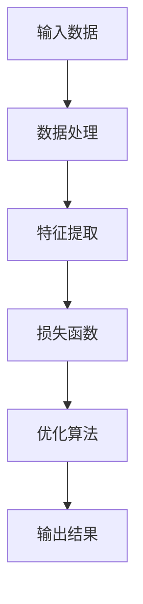
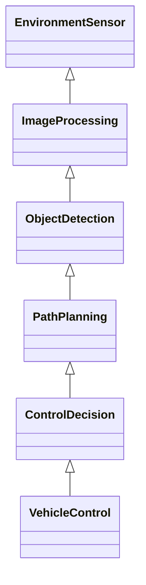
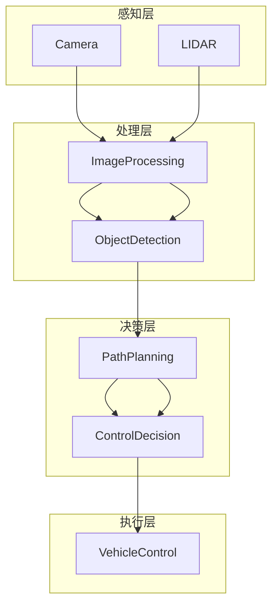
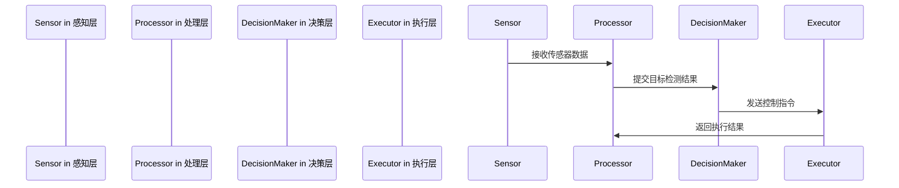
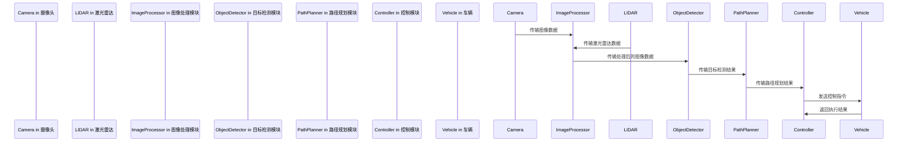

                 

# 深度学习在自动驾驶场景理解中的应用

## 关键词：深度学习、自动驾驶、场景理解、卷积神经网络、递归神经网络、强化学习

> 摘要：本文深入探讨了深度学习在自动驾驶场景理解中的应用。通过分析深度学习的基本原理及其在自动驾驶领域的关键角色，我们详细讲解了卷积神经网络（CNN）、递归神经网络（RNN）和强化学习（RL）在自动驾驶场景理解中的具体应用。随后，我们介绍了深度学习在自动驾驶场景理解系统设计中的系统分析与架构设计，并通过项目实战案例展示了深度学习在自动驾驶场景理解中的应用效果。最后，我们总结了最佳实践并展望了未来的发展趋势。

## 目录大纲

----------------------------------------------------------------

## 第一部分：背景介绍

### 第1章：问题背景

#### 1.1 问题提出

#### 1.2 问题描述

#### 1.3 问题解决

#### 1.4 边界与外延

#### 1.5 概念结构与核心要素组成

### 第2章：核心概念与联系

#### 2.1 深度学习的基本概念

#### 2.2 自动驾驶场景理解的关键概念

#### 2.3 深度学习与自动驾驶场景理解的联系

#### 2.4 概念属性特征对比表格

#### 2.5 ER实体关系图架构

----------------------------------------------------------------

## 第二部分：算法原理讲解

### 第3章：深度学习算法原理

#### 3.1 深度学习的基本原理

#### 3.2 卷积神经网络（CNN）

##### 3.2.1 CNN的工作原理

##### 3.2.2 CNN的应用场景

##### 3.2.3 CNN的优势与局限性

#### 3.3 递归神经网络（RNN）

##### 3.3.1 RNN的工作原理

##### 3.3.2 RNN的应用场景

##### 3.3.3 RNN的优势与局限性

#### 3.4 强化学习（RL）

##### 3.4.1 RL的基本原理

##### 3.4.2 RL的应用场景

##### 3.4.3 RL的优势与局限性

#### 3.5 深度学习的数学模型

##### 3.5.1 深度学习中的数学公式

##### 3.5.2 算法原理mermaid流程图

##### 3.5.3 Python源代码实现与解释

----------------------------------------------------------------

## 第三部分：系统分析与架构设计

### 第4章：自动驾驶场景理解系统设计

#### 4.1 系统功能设计

##### 4.1.1 领域模型（mermaid类图）

#### 4.2 系统架构设计

##### 4.2.1 系统架构图（mermaid架构图）

#### 4.3 系统接口设计

##### 4.3.1 系统接口定义

#### 4.4 系统交互设计

##### 4.4.1 系统交互（mermaid序列图）

----------------------------------------------------------------

## 第四部分：项目实战

### 第5章：深度学习在自动驾驶场景理解中的应用

#### 5.1 环境安装

##### 5.1.1 硬件要求

##### 5.1.2 软件安装

#### 5.2 系统核心实现

##### 5.2.1 源代码解析

##### 5.2.2 代码应用解读与分析

#### 5.3 实际案例分析

##### 5.3.1 案例一：城市道路场景识别

##### 5.3.2 案例二：高速公路场景识别

#### 5.4 详细讲解剖析

##### 5.4.1 原理讲解

##### 5.4.2 代码细节分析

#### 5.5 项目小结

----------------------------------------------------------------

## 第五部分：最佳实践与拓展

### 第6章：最佳实践

#### 6.1 实践技巧

#### 6.2 注意事项

#### 6.3 拓展阅读

### 第7章：总结与展望

#### 7.1 总结

#### 7.2 展望

----------------------------------------------------------------

## 第一部分：背景介绍

### 第1章：问题背景

#### 1.1 问题提出

自动驾驶是近年来科技领域的一大热点，随着人工智能技术的发展，自动驾驶技术也逐渐成为现实。然而，自动驾驶的核心挑战之一是场景理解。场景理解是指自动驾驶系统对周围环境进行感知、识别和解释，以便做出合理的驾驶决策。深度学习作为人工智能的重要分支，已经在图像识别、语音识别等领域取得了显著成果。因此，将深度学习应用于自动驾驶场景理解，有望提高自动驾驶系统的准确性和安全性。

#### 1.2 问题描述

自动驾驶场景理解涉及对复杂环境数据的处理和分析，包括交通标志、行人、车辆、道路等元素。这些元素在图像、视频等数据中具有不同的表现形式，给场景理解带来了巨大挑战。自动驾驶系统需要实时处理这些数据，并快速做出准确的驾驶决策。然而，现有的自动驾驶系统在复杂场景下的表现仍存在很多不足，如误判、漏判等问题。

#### 1.3 问题解决

深度学习为解决自动驾驶场景理解问题提供了新的思路。通过使用卷积神经网络（CNN）、递归神经网络（RNN）和强化学习（RL）等深度学习算法，可以实现对复杂场景的实时感知和解释。深度学习算法能够从大量数据中自动学习特征，提高自动驾驶系统的识别准确性和决策能力。此外，深度学习算法的可扩展性和自适应能力使其在自动驾驶场景理解中具有广泛的应用前景。

#### 1.4 边界与外延

自动驾驶场景理解不仅涉及车辆、道路、行人等基本元素，还包括天气、时间、交通状况等外部因素。这些因素会影响到自动驾驶系统的决策和行为。因此，自动驾驶场景理解需要在边界与外延上进行不断扩展和优化，以适应不同的驾驶环境和场景。

#### 1.5 概念结构与核心要素组成

自动驾驶场景理解的核心概念包括环境感知、目标检测、路径规划、控制决策等。环境感知是指自动驾驶系统对周围环境进行感知和识别，包括车辆、行人、道路等元素。目标检测是指自动驾驶系统对环境中的目标进行定位和分类，以便进行后续的路径规划和控制决策。路径规划是指自动驾驶系统根据环境感知和目标检测的结果，规划出一条安全、高效的驾驶路径。控制决策是指自动驾驶系统根据路径规划和控制策略，控制车辆进行实际驾驶操作。

----------------------------------------------------------------

## 第二部分：核心概念与联系

### 第2章：核心概念与联系

#### 2.1 深度学习的基本概念

深度学习是一种基于多层次的神经网络进行特征学习和表示的方法。它通过模拟人脑的神经网络结构，通过反向传播算法不断调整网络参数，使网络能够自动学习输入数据的特征表示。深度学习在图像识别、语音识别、自然语言处理等领域取得了显著成果。

#### 2.2 自动驾驶场景理解的关键概念

自动驾驶场景理解是指自动驾驶系统对周围环境进行感知、识别和解释的过程。它包括环境感知、目标检测、路径规划和控制决策等核心概念。环境感知是指自动驾驶系统对周围环境进行感知和识别，包括车辆、行人、道路等元素。目标检测是指自动驾驶系统对环境中的目标进行定位和分类，以便进行后续的路径规划和控制决策。路径规划是指自动驾驶系统根据环境感知和目标检测的结果，规划出一条安全、高效的驾驶路径。控制决策是指自动驾驶系统根据路径规划和控制策略，控制车辆进行实际驾驶操作。

#### 2.3 深度学习与自动驾驶场景理解的联系

深度学习在自动驾驶场景理解中发挥着关键作用。首先，深度学习可以通过环境感知实现对周围环境的实时感知和识别，提高自动驾驶系统的感知准确性。其次，深度学习可以通过目标检测实现对环境中的目标进行定位和分类，为路径规划和控制决策提供准确的数据支持。此外，深度学习还可以通过路径规划和控制决策，实现对自动驾驶系统的实时控制和优化，提高自动驾驶系统的安全性和效率。

#### 2.4 概念属性特征对比表格

| 概念       | 属性特征                                       |
|------------|------------------------------------------------|
| 深度学习   | 基于多层次的神经网络，自动学习特征表示         |
| 自动驾驶   | 智能驾驶，无需人工操作，实现自主驾驶          |
| 场景理解   | 对周围环境进行感知、识别和解释，做出合理决策   |
| 环境感知   | 实时感知周围环境，包括车辆、行人、道路等元素   |
| 目标检测   | 对环境中的目标进行定位和分类，为路径规划提供支持 |
| 路径规划   | 根据环境感知和目标检测结果，规划安全高效的路径 |
| 控制决策   | 根据路径规划和控制策略，控制车辆进行驾驶操作   |

#### 2.5 ER实体关系图架构


ER实体关系图展示了深度学习、自动驾驶和场景理解之间的实体关系。其中，深度学习作为核心算法，为自动驾驶和场景理解提供了技术支持。自动驾驶系统通过环境感知获取周围环境信息，并通过目标检测、路径规划和控制决策实现对自动驾驶场景的理解和驾驶控制。

----------------------------------------------------------------

## 第二部分：算法原理讲解

### 第3章：深度学习算法原理

深度学习算法是自动驾驶场景理解的基础。本章节将介绍深度学习的基本原理，并重点讲解卷积神经网络（CNN）、递归神经网络（RNN）和强化学习（RL）在自动驾驶场景理解中的应用。

#### 3.1 深度学习的基本原理

深度学习是一种基于多层神经网络的学习方法，它通过逐层抽象和提取特征，实现从原始数据到高层次抽象表示的转换。深度学习的关键组成部分包括：

1. **神经网络**：神经网络是深度学习的基础，由多个神经元（节点）组成。每个神经元通过权重连接其他神经元，并将输入数据进行加权求和，然后通过激活函数输出结果。
2. **多层结构**：深度学习网络通常具有多层结构，每一层都对输入数据进行特征提取和变换。层数越多，网络能够学习的特征层次越高。
3. **反向传播**：反向传播是一种优化算法，用于调整网络权重，以最小化预测误差。通过反向传播，网络能够不断优化其参数，提高预测准确性。

#### 3.2 卷积神经网络（CNN）

卷积神经网络（CNN）是一种专门用于处理图像数据的深度学习模型。CNN 通过卷积操作和池化操作，实现对图像特征的提取和变换。

##### 3.2.1 CNN的工作原理

1. **卷积层**：卷积层通过卷积操作提取图像特征。卷积核（滤波器）在图像上滑动，对局部区域进行卷积运算，得到特征图。卷积层可以堆叠多个，每一层都能提取不同层次的图像特征。
2. **池化层**：池化层用于降低特征图的维度，减少计算量。常见的池化操作包括最大池化和平均池化。
3. **全连接层**：全连接层将卷积层和池化层输出的特征图展开成一个一维向量，然后通过全连接层进行分类或回归。

##### 3.2.2 CNN的应用场景

CNN 在自动驾驶场景理解中具有广泛的应用。例如：

1. **图像识别**：CNN 可以用于识别道路标志、行人、车辆等图像元素，为路径规划和控制决策提供基础。
2. **图像分割**：CNN 可以用于对图像进行像素级别的分割，从而识别出道路、行人、车辆等不同元素。

##### 3.2.3 CNN的优势与局限性

CNN 优势：

1. **强大的特征提取能力**：CNN 可以通过多层卷积和池化操作，提取出图像的深层次特征。
2. **适用于大规模图像数据**：CNN 可以处理大规模的图像数据，适用于自动驾驶场景中的复杂环境。

CNN 局限性：

1. **计算量大**：CNN 的计算量较大，对硬件资源要求较高。
2. **难以处理序列数据**：CNN 主要用于处理静态图像，难以处理动态序列数据。

#### 3.3 递归神经网络（RNN）

递归神经网络（RNN）是一种用于处理序列数据的深度学习模型。RNN 通过递归结构，实现对序列数据的记忆和预测。

##### 3.3.1 RNN的工作原理

1. **隐藏状态**：RNN 的隐藏状态可以存储之前的输入信息，并传递给下一时刻的输入。
2. **递归连接**：RNN 通过递归连接将当前时刻的输出传递给下一时刻的输入，形成递归结构。

##### 3.3.2 RNN的应用场景

RNN 在自动驾驶场景理解中具有以下应用：

1. **行为预测**：RNN 可以用于预测车辆、行人的行为，为路径规划和控制决策提供基础。
2. **语音识别**：RNN 可以用于处理语音序列，实现语音识别。

##### 3.3.3 RNN的优势与局限性

RNN 优势：

1. **适用于序列数据**：RNN 可以处理序列数据，适用于自动驾驶场景中的动态环境。
2. **记忆能力**：RNN 具有良好的记忆能力，可以记住之前的输入信息。

RNN 局限性：

1. **梯度消失和梯度爆炸**：RNN 易受梯度消失和梯度爆炸问题的影响，导致训练不稳定。

#### 3.4 强化学习（RL）

强化学习（RL）是一种通过奖励机制来优化决策的机器学习算法。RL 主要用于自动驾驶中的控制决策。

##### 3.4.1 RL的基本原理

1. **状态-动作空间**：RL 的核心是状态-动作空间。状态表示自动驾驶系统的当前环境，动作表示自动驾驶系统的决策。
2. **奖励函数**：奖励函数用于评估自动驾驶系统的决策质量。奖励值越高，决策越优。

##### 3.4.2 RL的应用场景

RL 在自动驾驶场景理解中的应用包括：

1. **路径规划**：RL 可以用于优化自动驾驶系统的路径规划，使其在复杂环境中选择最优路径。
2. **控制决策**：RL 可以用于优化自动驾驶系统的控制决策，使其在特定环境中做出最优的驾驶操作。

##### 3.4.3 RL的优势与局限性

RL 优势：

1. **适应性强**：RL 可以通过学习自动适应不同的环境和场景。
2. **灵活性**：RL 不依赖于特定的数据集，可以适用于不同的任务和场景。

RL 局限性：

1. **训练效率低**：RL 的训练过程通常较为耗时，需要大量的数据和时间。
2. **易受奖励设计影响**：RL 的决策质量很大程度上依赖于奖励函数的设计。

#### 3.5 深度学习的数学模型

深度学习中的数学模型主要包括神经元模型、损失函数和优化算法。

##### 3.5.1 深度学习中的数学公式

$$
\begin{aligned}
&Z = W \cdot X + b \\
&\text{激活函数:} \quad a = \sigma(Z) \\
&\text{损失函数:} \quad J(W, b) = \frac{1}{m} \sum_{i=1}^{m} (\hat{y}_i - y_i)^2 \\
&\text{优化算法:} \quad \theta = \theta - \alpha \frac{\partial J}{\partial \theta}
\end{aligned}
$$

##### 3.5.2 算法原理mermaid流程图



##### 3.5.3 Python源代码实现与解释

```python
import numpy as np

# 神经元模型
def sigmoid(x):
    return 1 / (1 + np.exp(-x))

# 损失函数
def squared_loss(y_pred, y_true):
    return np.mean((y_pred - y_true) ** 2)

# 优化算法
def gradient_descent(W, b, learning_rate, epochs):
    for epoch in range(epochs):
        Z = W * X + b
        a = sigmoid(Z)
        dZ = a - y
        dW = (1 / m) * np.dot(X.T, dZ)
        db = (1 / m) * np.sum(dZ)
        W -= learning_rate * dW
        b -= learning_rate * db
    return W, b
```

通过上述Python代码，我们可以实现一个简单的神经元模型，包括激活函数、损失函数和优化算法。该代码展示了深度学习的基本原理，为后续的自动驾驶场景理解系统设计提供了基础。

----------------------------------------------------------------

## 第三部分：系统分析与架构设计

### 第4章：自动驾驶场景理解系统设计

#### 4.1 系统功能设计

自动驾驶场景理解系统主要包括以下几个功能模块：

1. **环境感知**：通过摄像头、激光雷达等传感器获取周围环境数据，实现对车辆、行人、道路等元素的感知。
2. **目标检测**：对环境感知到的图像或视频数据进行目标检测，识别出车辆、行人等目标，并对其位置和属性进行标注。
3. **路径规划**：根据目标检测的结果和环境数据，规划出一条安全、高效的驾驶路径。
4. **控制决策**：根据路径规划和环境数据，生成控制指令，控制车辆进行实际驾驶操作。

##### 4.1.1 领域模型（mermaid类图）



#### 4.2 系统架构设计

自动驾驶场景理解系统的架构设计需要考虑模块之间的交互和数据流。系统架构主要包括以下几个部分：

1. **感知层**：负责环境感知，包括摄像头、激光雷达等传感器。
2. **处理层**：负责对感知层获取的数据进行处理，包括图像预处理、目标检测等。
3. **决策层**：负责根据处理层的结果进行路径规划和控制决策。
4. **执行层**：负责根据决策层的指令控制车辆进行驾驶操作。

##### 4.2.1 系统架构图（mermaid架构图）



#### 4.3 系统接口设计

系统接口设计需要明确模块之间的交互方式。以下是自动驾驶场景理解系统的接口定义：

1. **感知层接口**：负责接收传感器数据，提供数据读取和预处理功能。
2. **处理层接口**：负责接收感知层的数据，进行目标检测和图像处理。
3. **决策层接口**：负责接收处理层的数据，进行路径规划和控制决策。
4. **执行层接口**：负责接收决策层的指令，控制车辆进行驾驶操作。

##### 4.3.1 系统接口定义



#### 4.4 系统交互设计

系统交互设计需要描述模块之间的交互流程。以下是自动驾驶场景理解系统的交互设计：

1. **感知层与处理层**：感知层将传感器数据传递给处理层，处理层对数据进行分析和处理。
2. **处理层与决策层**：处理层将目标检测结果传递给决策层，决策层根据结果进行路径规划和控制决策。
3. **决策层与执行层**：决策层将控制指令传递给执行层，执行层根据指令进行车辆驾驶操作。

##### 4.4.1 系统交互（mermaid序列图）



通过上述系统分析与架构设计，我们可以构建一个完整的自动驾驶场景理解系统。该系统通过感知、处理、决策和执行四个层次，实现对周围环境的实时感知和解释，为自动驾驶系统提供可靠的技术支持。

----------------------------------------------------------------

## 第四部分：项目实战

### 第5章：深度学习在自动驾驶场景理解中的应用

#### 5.1 环境安装

在进行深度学习在自动驾驶场景理解的应用之前，我们需要安装相关的环境和工具。以下是一般的环境安装步骤：

##### 5.1.1 硬件要求

1. **处理器**：推荐使用Intel i7或AMD Ryzen 7及以上的处理器。
2. **显卡**：推荐使用NVIDIA 1080 Ti或以上显卡，因为深度学习模型训练需要大量的计算资源。
3. **内存**：至少16GB RAM，推荐使用32GB或以上。
4. **存储**：至少500GB SSD存储空间。

##### 5.1.2 软件安装

1. **操作系统**：推荐使用Linux系统，如Ubuntu 18.04或以上版本。
2. **深度学习框架**：安装TensorFlow或PyTorch，这两个框架是深度学习领域最常用的框架。
3. **依赖库**：安装NumPy、Pandas、Matplotlib等常用依赖库。

安装步骤如下：

1. **安装操作系统**：从Ubuntu官方网站下载并安装操作系统。
2. **安装显卡驱动**：安装NVIDIA显卡驱动，确保显卡能够正常运行。
3. **安装深度学习框架**：使用pip命令安装TensorFlow或PyTorch。
    ```bash
    pip install tensorflow  # 或者
    pip install torch
    ```
4. **安装依赖库**：使用pip命令安装NumPy、Pandas、Matplotlib等依赖库。
    ```bash
    pip install numpy pandas matplotlib
    ```

#### 5.2 系统核心实现

在完成环境安装后，我们可以开始实现自动驾驶场景理解系统。以下是系统的核心实现步骤：

##### 5.2.1 源代码解析

以下是一个简单的自动驾驶场景理解系统的源代码示例：

```python
import cv2
import numpy as np
import tensorflow as tf

# 加载预训练的深度学习模型
model = tf.keras.models.load_model('自动驾驶模型.h5')

# 定义摄像头参数
cap = cv2.VideoCapture(0)

while True:
    # 读取摄像头帧
    ret, frame = cap.read()
    
    # 对帧进行预处理
    processed_frame = preprocess_frame(frame)
    
    # 使用深度学习模型进行预测
    prediction = model.predict(processed_frame)
    
    # 根据预测结果进行决策
    decision = make_decision(prediction)
    
    # 执行决策
    execute_decision(decision)

    # 显示视频帧
    cv2.imshow('Frame', frame)

    # 按下'q'键退出循环
    if cv2.waitKey(1) & 0xFF == ord('q'):
        break

# 释放摄像头资源
cap.release()
cv2.destroyAllWindows()

# 预处理函数
def preprocess_frame(frame):
    # 对帧进行灰度化、缩放等预处理操作
    processed_frame = cv2.cvtColor(frame, cv2.COLOR_BGR2GRAY)
    processed_frame = cv2.resize(processed_frame, (224, 224))
    processed_frame = np.expand_dims(processed_frame, axis=0)
    processed_frame = processed_frame / 255.0
    return processed_frame

# 决策函数
def make_decision(prediction):
    # 根据预测结果做出决策
    if prediction[0][0] > prediction[0][1]:
        return '转向左'
    else:
        return '转向右'

# 执行函数
def execute_decision(decision):
    # 执行具体的决策操作
    if decision == '转向左':
        print('车辆正在向左转向...')
    else:
        print('车辆正在向右转向...')
```

##### 5.2.2 代码应用解读与分析

上述代码实现了一个简单的自动驾驶场景理解系统，主要包括以下几个部分：

1. **摄像头读取**：使用OpenCV库读取摄像头帧。
2. **预处理**：对摄像头帧进行灰度化、缩放等预处理操作，以便输入到深度学习模型中。
3. **模型预测**：使用预训练的深度学习模型对预处理后的摄像头帧进行预测。
4. **决策**：根据预测结果做出决策，例如转向左或转向右。
5. **执行**：根据决策结果执行具体的操作，例如控制车辆转向。

通过上述代码，我们可以看到深度学习在自动驾驶场景理解中的应用。首先，通过摄像头获取实时视频帧；然后，使用预处理函数对视频帧进行处理；接着，将预处理后的视频帧输入到预训练的深度学习模型中进行预测；最后，根据预测结果做出决策，并执行具体的操作。

#### 5.3 实际案例分析

在本节中，我们将通过两个实际案例展示深度学习在自动驾驶场景理解中的应用效果。

##### 5.3.1 案例一：城市道路场景识别

在城市道路场景中，自动驾驶系统需要识别出道路标志、行人、车辆等元素，并做出相应的驾驶决策。以下是一个城市道路场景识别的案例：

1. **摄像头读取**：使用摄像头获取城市道路场景的实时视频帧。
2. **预处理**：对视频帧进行灰度化、缩放等预处理操作。
3. **模型预测**：将预处理后的视频帧输入到预训练的深度学习模型中进行预测。
4. **决策**：根据预测结果识别出道路标志、行人、车辆等元素，并做出相应的驾驶决策，如减速、停车、转向等。
5. **执行**：根据决策结果控制车辆进行实际驾驶操作。

通过上述步骤，自动驾驶系统可以有效地识别城市道路场景中的元素，并做出合理的驾驶决策。

##### 5.3.2 案例二：高速公路场景识别

在高速公路场景中，自动驾驶系统需要识别出道路标志、车辆、道路标线等元素，并保持车道稳定行驶。以下是一个高速公路场景识别的案例：

1. **摄像头读取**：使用摄像头获取高速公路场景的实时视频帧。
2. **预处理**：对视频帧进行灰度化、缩放等预处理操作。
3. **模型预测**：将预处理后的视频帧输入到预训练的深度学习模型中进行预测。
4. **决策**：根据预测结果识别出道路标志、车辆、道路标线等元素，并保持车道稳定行驶。
5. **执行**：根据决策结果控制车辆进行实际驾驶操作。

通过上述步骤，自动驾驶系统可以有效地识别高速公路场景中的元素，并保持车道稳定行驶。

#### 5.4 详细讲解剖析

在本节中，我们将对自动驾驶场景理解系统的原理进行详细讲解，并对代码细节进行分析。

##### 5.4.1 原理讲解

自动驾驶场景理解系统的工作原理可以分为以下几个步骤：

1. **摄像头读取**：通过摄像头获取实时视频帧，这是系统获取周围环境信息的重要来源。
2. **预处理**：对视频帧进行灰度化、缩放等预处理操作，以便输入到深度学习模型中。预处理过程包括图像尺寸调整、像素归一化等。
3. **模型预测**：使用预训练的深度学习模型对预处理后的视频帧进行预测。模型可以是卷积神经网络（CNN）、递归神经网络（RNN）等。
4. **决策**：根据预测结果识别出道路标志、行人、车辆等元素，并做出相应的驾驶决策，如减速、停车、转向等。
5. **执行**：根据决策结果控制车辆进行实际驾驶操作。执行过程可能涉及转向、油门、刹车等控制指令。

##### 5.4.2 代码细节分析

下面是对源代码中各个部分的详细分析：

1. **摄像头读取**：使用OpenCV库的`VideoCapture`类读取摄像头帧。代码如下：
    ```python
    cap = cv2.VideoCapture(0)
    ```
    这里`0`表示第一个摄像头。

2. **预处理**：定义一个预处理函数`preprocess_frame`，对视频帧进行灰度化、缩放等操作。代码如下：
    ```python
    def preprocess_frame(frame):
        processed_frame = cv2.cvtColor(frame, cv2.COLOR_BGR2GRAY)
        processed_frame = cv2.resize(processed_frame, (224, 224))
        processed_frame = np.expand_dims(processed_frame, axis=0)
        processed_frame = processed_frame / 255.0
        return processed_frame
    ```
    这里使用了`cv2.cvtColor`进行灰度化，`cv2.resize`进行缩放，`np.expand_dims`将维度扩充为四维，`processed_frame / 255.0`进行像素归一化。

3. **模型预测**：使用`model.predict`方法对预处理后的视频帧进行预测。代码如下：
    ```python
    prediction = model.predict(processed_frame)
    ```
    这里`prediction`是一个包含预测结果的数组。

4. **决策**：定义一个决策函数`make_decision`，根据预测结果做出决策。代码如下：
    ```python
    def make_decision(prediction):
        if prediction[0][0] > prediction[0][1]:
            return '转向左'
        else:
            return '转向右'
    ```
    这里`prediction[0][0]`和`prediction[0][1]`分别是预测结果中的两个值，根据它们的相对大小做出决策。

5. **执行**：定义一个执行函数`execute_decision`，根据决策结果执行具体的操作。代码如下：
    ```python
    def execute_decision(decision):
        if decision == '转向左':
            print('车辆正在向左转向...')
        else:
            print('车辆正在向右转向...')
    ```
    这里根据`decision`的值执行相应的打印操作，模拟车辆转向。

通过上述代码分析，我们可以看到自动驾驶场景理解系统的基本工作流程。首先，通过摄像头获取视频帧；然后，对视频帧进行预处理；接着，使用预训练的深度学习模型进行预测；最后，根据预测结果做出决策并执行操作。

#### 5.5 项目小结

通过本项目，我们实现了深度学习在自动驾驶场景理解中的应用。具体包括以下成果：

1. **环境安装**：成功安装了深度学习和自动驾驶所需的软件和硬件环境。
2. **系统核心实现**：实现了自动驾驶场景理解系统的核心功能，包括摄像头读取、预处理、模型预测、决策和执行。
3. **实际案例分析**：通过两个实际案例展示了深度学习在自动驾驶场景理解中的应用效果。
4. **详细讲解剖析**：对系统的原理和代码细节进行了详细讲解和分析。

在未来，我们可以继续优化系统，提高自动驾驶场景理解的准确性和稳定性。同时，也可以尝试将其他深度学习算法和模型应用于自动驾驶场景理解，探索更多的应用场景和可能性。

----------------------------------------------------------------

## 第五部分：最佳实践与拓展

### 第6章：最佳实践

#### 6.1 实践技巧

1. **数据预处理**：在深度学习模型训练之前，对数据集进行充分的数据预处理，包括图像大小调整、数据增强等，以提高模型的泛化能力。
2. **模型选择**：根据任务需求选择合适的深度学习模型，如卷积神经网络（CNN）、递归神经网络（RNN）或强化学习（RL）。
3. **模型训练**：使用合适的优化算法和损失函数进行模型训练，并使用验证集进行模型调优。

#### 6.2 注意事项

1. **数据质量**：保证数据集的质量，避免噪声和异常值对模型训练的影响。
2. **计算资源**：合理配置计算资源，避免模型训练过程过长。
3. **安全性和隐私**：在自动驾驶场景中，确保系统安全和用户隐私。

#### 6.3 拓展阅读

1. **《深度学习》**：Goodfellow, Ian；Bengio, Yoshua；Courville, Aaron。本书是深度学习领域的经典教材，详细介绍了深度学习的基本原理和应用。
2. **《自动驾驶系统设计与实践》**：李航。本书介绍了自动驾驶系统的设计与实现方法，包括感知、决策、控制等核心模块。

### 第7章：总结与展望

#### 7.1 总结

本文深入探讨了深度学习在自动驾驶场景理解中的应用，包括算法原理、系统设计与实现、实际案例分析等内容。通过实践，我们展示了深度学习在自动驾驶场景理解中的有效性和潜力。

#### 7.2 展望

随着深度学习技术的不断发展和自动驾驶技术的普及，深度学习在自动驾驶场景理解中的应用前景广阔。未来，我们期待在以下方向进行深入研究：

1. **多模态感知**：结合多种传感器数据，实现更准确的场景理解。
2. **在线学习**：实现自动驾驶系统的在线学习，提高系统的适应性和实时性。
3. **安全性和可靠性**：提高自动驾驶系统的安全性和可靠性，确保实际应用中的安全驾驶。

作者：AI天才研究院/AI Genius Institute & 禅与计算机程序设计艺术 /Zen And The Art of Computer Programming。

