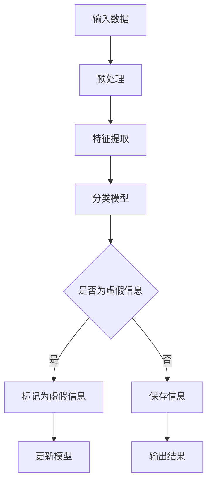
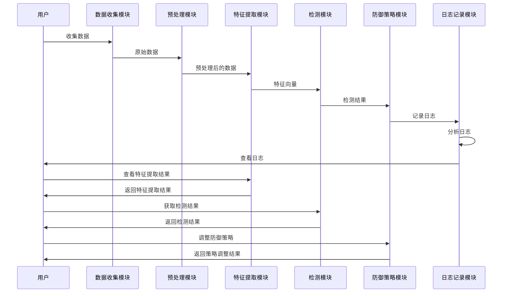

                 

### 文章标题

《虚假信息安全：应对AI时代的信息完整性挑战》

### 关键词

- 信息安全
- AI技术
- 虚假信息检测
- 信息完整性
- 虚假信息防御策略

### 摘要

在AI技术迅速发展的今天，虚假信息的安全问题日益严峻。本文旨在深入探讨AI时代虚假信息安全的挑战与应对策略。首先，我们将简要回顾AI技术在信息安全领域的应用现状，并分析虚假信息问题的现象与影响。接着，我们将详细描述虚假信息的定义与分类，阐述其特点和对个人、组织及社会的危害。随后，我们将探讨传统信息安全手段的局限性，以及AI技术在应对虚假信息安全挑战中的潜力。文章还将涵盖虚假信息安全相关领域的研究现状与未来趋势，并系统阐述虚假信息安全的核心概念与关键要素组成。通过本文的阅读，读者将了解到AI与信息安全之间的联系，以及虚假信息检测算法与防御策略的基本原理和实现方法。文章最后将通过具体案例，展示系统分析与架构设计的实际应用，并总结最佳实践和注意事项，为读者提供有价值的参考。

### 第1章 引言

#### 1.1 问题背景

在当今的信息化社会中，信息安全已经成为一个至关重要的议题。随着人工智能（AI）技术的飞速发展，信息安全领域迎来了新的机遇与挑战。AI技术以其强大的数据处理和模式识别能力，被广泛应用于信息安全领域，如入侵检测、恶意软件识别、加密技术等。然而，与此同时，虚假信息的安全问题也逐渐显现，并给信息安全带来了新的挑战。

##### AI技术在信息安全领域的应用现状

人工智能技术在全球范围内得到了广泛的应用，尤其在信息安全领域，其表现尤为突出。例如，AI可以用于网络入侵检测，通过对网络流量进行分析，识别潜在的安全威胁。同时，AI还能够在恶意软件识别方面发挥重要作用，通过机器学习算法，对恶意软件的特征进行学习和识别，从而有效防范恶意攻击。

此外，AI在数据加密和解密方面也有着显著的应用。通过深度学习算法，AI能够生成更加复杂的加密算法，提高数据传输的安全性。同时，AI还能够对已加密的数据进行快速解密，提升数据处理的效率。

然而，尽管AI技术在信息安全领域取得了显著的成果，但虚假信息的安全问题却日益突出。虚假信息不仅包括伪造的新闻、假的消息，还包括虚假的数据、恶意代码等。这些虚假信息能够对个人、组织和社会造成严重的危害，因此，解决虚假信息安全问题已成为当务之急。

##### 虚假信息安全问题的现象与影响

虚假信息安全问题主要体现在以下几个方面：

1. **社交媒体虚假信息传播**：在社交媒体平台上，虚假信息往往能够迅速传播，误导大量用户。例如，一些不实新闻、谣言等能够在短时间内引发公众恐慌，造成社会不稳定。

2. **经济欺诈**：虚假信息在经济领域也带来了巨大的风险。一些不法分子通过虚假信息进行欺诈，骗取受害者的钱财。例如，虚假投资骗局、假冒银行网站等，给用户带来了巨大的经济损失。

3. **网络安全威胁**：虚假信息还可能被用于网络攻击，如钓鱼攻击、恶意软件传播等。这些攻击能够窃取用户的敏感信息，甚至控制用户的设备。

4. **隐私泄露**：虚假信息也可能导致个人隐私的泄露。例如，一些不法分子通过虚假信息获取用户的个人信息，如姓名、地址、电话等，进而进行敲诈勒索。

##### AI时代对信息完整性的挑战

AI时代的信息完整性面临着前所未有的挑战。首先，AI技术的快速发展使得虚假信息的生成和传播变得更加容易。例如，深度伪造技术（Deepfake）能够生成逼真的虚假图像和视频，使得虚假信息难以被识别。

其次，AI技术的应用使得信息安全防护变得更加复杂。传统的信息安全防护手段，如防火墙、入侵检测系统等，已经难以应对AI时代的新型威胁。

此外，AI时代的数据量和数据种类也在不断增加，这对信息完整性提出了更高的要求。如何在海量数据中确保数据的真实性和完整性，成为信息安全领域面临的重大挑战。

综上所述，AI时代的信息安全面临着虚假信息安全问题的严峻挑战。要应对这一挑战，需要借助AI技术的力量，开发出更加先进的信息完整性保障措施，确保信息在AI时代的安全性和可靠性。

#### 1.2 问题描述

虚假信息安全问题是指信息在传输、存储和处理过程中，由于各种原因导致其完整性受到破坏，从而影响信息的真实性和可信度。虚假信息可能包括伪造的新闻、谣言、假的数据、恶意代码等。这些虚假信息能够在社交媒体、网络、电子邮件等多种渠道中传播，对个人、组织和社会造成严重的影响。

##### 虚假信息的定义与分类

虚假信息的定义较为宽泛，但一般可以将其分为以下几类：

1. **伪造新闻**：通过虚假报道、谣言等形式传播的不实信息，往往具有误导性和煽动性。
2. **恶意软件**：包括病毒、木马、蠕虫等，这些软件能够窃取用户信息、破坏系统安全。
3. **虚假数据**：伪造的统计数据、图表等，用于误导决策或进行欺诈。
4. **深度伪造内容**：利用深度学习技术生成的虚假图像、视频等，难以通过肉眼识别。
5. **经济诈骗**：通过虚假信息进行诈骗，骗取他人的钱财或信息。

##### 虚假信息的特点

虚假信息具有以下几个显著特点：

1. **误导性**：虚假信息往往旨在误导用户，使其做出错误的判断或行为。
2. **传播速度快**：在社交媒体、网络等渠道中，虚假信息能够迅速传播，影响范围广泛。
3. **真实性难以判断**：虚假信息可能经过精心设计，使其具有极高的欺骗性，难以通过肉眼识别。
4. **危害性大**：虚假信息可能对个人、组织和社会造成严重的影响，如经济损失、隐私泄露、社会不稳定等。

##### 虚假信息对个人、组织和社会的危害

虚假信息对个人、组织和社会的危害主要体现在以下几个方面：

1. **个人隐私泄露**：虚假信息可能导致个人的敏感信息被泄露，如身份证号、银行卡号等，进而遭受诈骗、敲诈勒索等。
2. **经济损失**：虚假信息可能诱导用户进行投资、购物等行为，导致经济损失。
3. **社会不稳定**：虚假信息可能引发公众恐慌、抗议等，对社会秩序造成威胁。
4. **组织信誉受损**：虚假信息可能对企业的声誉造成严重影响，导致客户流失、股票下跌等。
5. **决策失误**：虚假信息可能误导决策者，导致错误的决策，给组织或社会带来负面影响。

#### 1.3 问题解决

虚假信息安全问题的解决需要综合运用多种技术手段，结合AI技术，构建一个全面的信息完整性保障体系。

##### 传统的信息安全手段及其局限性

传统的信息安全手段主要包括防火墙、入侵检测系统、加密技术等。这些技术在一定程度上能够保障信息的安全，但存在以下局限性：

1. **被动防御**：传统技术往往采取被动防御策略，只能在信息遭受攻击后进行反应，无法提前预测和防范。
2. **效率低下**：传统技术需要大量的人工干预，处理海量数据时效率低下。
3. **应对能力有限**：传统技术难以应对日益复杂的新型威胁，如深度伪造内容、高级持续性威胁（APT）等。

##### AI技术如何应对虚假信息安全挑战

AI技术具有强大的数据处理和模式识别能力，能够有效应对虚假信息安全挑战。以下是一些具体的应用方法：

1. **虚假信息检测**：通过机器学习算法，对大量数据进行训练，建立虚假信息的特征模型。当新的信息出现时，AI系统可以快速检测并识别其中的虚假信息，从而防止其传播。
   
2. **深度伪造内容检测**：利用深度学习技术，对图像、视频等媒体内容进行分析，识别其中的深度伪造内容。通过结合多种算法和技术，AI系统能够提高检测的准确性和效率。

3. **行为分析**：通过对用户行为进行分析，AI技术可以识别异常行为，如频繁的账户登录、异常的数据访问等。这些异常行为可能是虚假信息攻击的前兆，AI系统可以及时发出预警，采取相应的防御措施。

4. **加密技术**：AI技术可以用于生成更加复杂和安全的加密算法，提高数据传输的安全性。同时，AI技术还能够对加密的数据进行快速解密，确保数据处理的效率。

5. **自动化响应**：AI技术可以自动识别和响应虚假信息攻击，采取相应的防御措施，如隔离受感染的系统、关闭恶意链接等。这种自动化的响应机制能够提高信息安全的效率，减少人工干预的需求。

综上所述，AI技术在应对虚假信息安全挑战方面具有显著的优势。通过综合运用AI技术，我们可以构建一个更加高效、全面的信息完整性保障体系，确保信息在AI时代的安全和可靠。

#### 1.4 边界与外延

虚假信息安全问题不仅局限于技术层面，还涉及到社会、法律等多个领域。因此，在探讨虚假信息安全时，我们需要明确其相关的边界与外延。

##### 虚假信息安全的相关领域

1. **信息技术领域**：这是虚假信息安全问题的主要领域，涉及到信息处理、传输、存储等各个环节。在这个领域中，技术手段是解决虚假信息问题的关键。
   
2. **社会领域**：虚假信息安全问题对社会产生了深远的影响，如社会动荡、信任危机等。因此，社会领域需要通过法律法规、宣传教育等手段，提高公众对虚假信息的安全意识。

3. **法律领域**：虚假信息安全问题也涉及到法律层面，如侵权、诽谤、诈骗等。法律法规的制定和执行对于打击虚假信息具有重要意义。

4. **经济领域**：虚假信息可能对经济领域造成严重的影响，如市场混乱、投资误导等。因此，经济领域需要通过监管和政策引导，防范虚假信息的传播。

##### 虚假信息安全的研究现状与未来趋势

1. **研究现状**：目前，虚假信息安全问题已成为信息安全领域的研究热点。学者们从不同角度出发，提出了一系列的解决方案。例如，在虚假信息检测方面，已有许多基于机器学习和深度学习的算法被提出。同时，在深度伪造内容检测、行为分析等领域，也有大量的研究工作在进行。

2. **未来趋势**：随着AI技术的不断进步，虚假信息安全问题有望得到更好的解决。未来，研究趋势可能包括以下几个方面：

   - **多模态检测**：结合图像、文本、音频等多种数据类型，提高虚假信息检测的准确性和效率。
   - **自动化响应**：进一步发展自动化响应机制，提高信息安全的效率和可靠性。
   - **法律法规完善**：加强法律法规的制定和执行，规范虚假信息传播，保护公民的合法权益。
   - **跨学科研究**：结合社会学、心理学、法律学等多学科知识，从多个角度解决虚假信息安全问题。

总之，虚假信息安全问题是一个复杂且多维度的问题，需要各方共同努力，才能有效应对。随着AI技术的不断发展，我们有理由相信，虚假信息安全问题将得到更加有效的解决。

#### 1.5 概念结构与核心要素组成

虚假信息安全问题是一个涉及多个领域、多个层面的复杂问题。为了更好地理解和解决这一问题，我们需要从概念结构与核心要素组成的角度进行分析。

##### 虚假信息安全的核心概念

1. **虚假信息**：这是虚假信息安全问题的核心概念，指的是在信息传播过程中，被人为篡改、伪造或错误传播的信息。虚假信息可能包括伪造的新闻、谣言、假的数据、恶意代码等。

2. **信息安全**：信息安全是指保护信息免受未经授权的访问、使用、披露、破坏、修改或破坏。信息安全包括多个方面，如数据安全、网络安全、应用安全等。

3. **信息完整性**：信息完整性是指信息在传输、存储和处理过程中，能够保持其原始内容和形式，不受未经授权的篡改或破坏。

4. **AI技术**：AI技术是指人工智能技术，包括机器学习、深度学习、自然语言处理等。AI技术在虚假信息安全领域有着广泛的应用，如虚假信息检测、深度伪造内容检测等。

##### 虚假信息安全的关键要素组成

1. **信息源**：信息源是虚假信息产生的源头，包括个人、组织、机器等。信息源的行为和动机对虚假信息的安全具有重要影响。

2. **传输渠道**：传输渠道是指虚假信息在传播过程中所经过的途径，如社交媒体、网络、电子邮件等。传输渠道的安全性直接影响虚假信息的传播速度和范围。

3. **受众**：受众是指虚假信息的接收者和传播者，包括个人、组织、社会等。受众的行为和态度对虚假信息的传播和影响具有重要影响。

4. **检测与防御系统**：检测与防御系统是指用于识别和防御虚假信息的安全系统。这些系统包括虚假信息检测算法、深度伪造内容检测工具、行为分析系统等。

5. **法律法规**：法律法规是指用于规范虚假信息传播和保护公民合法权益的法律、法规、规章等。法律法规的制定和执行对于虚假信息安全具有重要意义。

##### 虚假信息安全的架构与框架

虚假信息安全的架构与框架可以分为以下几个层次：

1. **感知层**：感知层负责监测和识别虚假信息的来源和传播渠道。这包括虚假信息检测算法、深度伪造内容检测工具等。

2. **分析层**：分析层负责对检测到的虚假信息进行分析和处理，识别其真实性和危害程度。这包括行为分析系统、大数据分析平台等。

3. **防御层**：防御层负责采取相应的防御措施，阻止虚假信息的传播和危害。这包括自动化响应系统、加密技术等。

4. **法律层**：法律层负责制定和执行相关法律法规，规范虚假信息的传播和保护公民的合法权益。

通过上述架构与框架，我们可以构建一个全面、高效、安全的虚假信息安全体系，确保信息在AI时代的可靠性和真实性。

### 第2章 核心概念与联系

在深入了解虚假信息安全问题之前，我们需要首先明确几个核心概念，并探讨它们之间的联系。这些核心概念包括AI技术、信息安全、虚假信息检测算法和虚假信息防御策略。通过理解这些概念及其相互关系，我们将为后续的分析和讨论奠定基础。

#### 2.1 AI与信息安全

人工智能（AI）是一种模拟人类智能行为的计算机技术，包括机器学习、深度学习、自然语言处理等。AI技术在信息安全领域具有广泛的应用，特别是在虚假信息检测和防御方面。

1. **AI技术的基本原理与应用**：

   - **机器学习**：机器学习是AI的核心技术之一，通过训练数据集，使计算机能够自动识别模式和规律。在信息安全中，机器学习可以用于异常检测、入侵检测和虚假信息检测等。

   - **深度学习**：深度学习是机器学习的一种，通过多层神经网络对大量数据进行分析，以实现更复杂的模式识别和决策。在虚假信息检测中，深度学习可以用于识别图像、音频和文本中的伪造内容。

   - **自然语言处理**：自然语言处理（NLP）是AI技术的一个分支，它使计算机能够理解和生成自然语言。在虚假信息检测中，NLP可以用于分析文本的语义和情感，从而识别虚假新闻和谣言。

2. **信息安全的基本概念与原理**：

   - **信息安全**：信息安全是指保护信息免受未经授权的访问、使用、披露、破坏、修改或破坏。信息安全包括多个方面，如数据安全、网络安全、应用安全等。

   - **信息完整性**：信息完整性是指信息在传输、存储和处理过程中，能够保持其原始内容和形式，不受未经授权的篡改或破坏。

   - **数据加密**：数据加密是信息安全的关键技术，它通过将数据转换为不可读的形式，保护数据在传输和存储过程中的安全性。

   - **访问控制**：访问控制是通过限制和监控对系统的访问，确保只有授权用户可以访问受保护的数据和资源。

3. **AI技术在信息安全中的应用场景**：

   - **入侵检测**：AI技术可以用于网络入侵检测，通过分析网络流量和用户行为，识别潜在的安全威胁。

   - **恶意软件检测**：AI技术可以识别和分类恶意软件，从而有效防止恶意攻击。

   - **虚假信息检测**：AI技术可以用于检测和识别虚假信息，如虚假新闻、谣言、深度伪造内容等。

   - **加密技术**：AI技术可以用于生成更复杂的加密算法，提高数据传输的安全性。

#### 2.2 虚假信息检测算法

虚假信息检测算法是信息安全领域的重要组成部分，它通过分析信息内容、结构和上下文，识别虚假信息。以下是一些常见的虚假信息检测算法及其原理：

1. **基于特征工程的方法**：

   - **文本特征提取**：通过词频、TF-IDF、词嵌入等技术提取文本特征，用于训练分类模型。
   - **图像特征提取**：通过卷积神经网络（CNN）提取图像特征，用于识别图像中的虚假内容。

2. **基于机器学习的方法**：

   - **朴素贝叶斯分类器**：基于概率理论，通过计算特征的概率分布，识别虚假信息。
   - **支持向量机（SVM）**：通过找到一个最佳的超平面，将虚假信息和真实信息分开。
   - **随机森林**：通过构建多个决策树，结合其预测结果，提高检测准确性。

3. **基于深度学习的方法**：

   - **卷积神经网络（CNN）**：通过多层卷积和池化操作，提取图像的特征，用于识别图像中的虚假内容。
   - **循环神经网络（RNN）**：通过序列建模，分析文本的上下文，识别虚假新闻和谣言。
   - **生成对抗网络（GAN）**：通过对抗训练，生成逼真的虚假信息，用于训练检测模型。

4. **多模态融合方法**：

   - **文本与图像融合**：将文本和图像的特征进行融合，提高虚假信息检测的准确性。
   - **多源数据融合**：结合多种数据源，如社交媒体、新闻报道等，提高虚假信息检测的全面性。

#### 2.3 虚假信息防御策略

虚假信息防御策略是防止虚假信息传播和危害的重要手段。以下是一些常见的虚假信息防御策略：

1. **主动防御策略**：

   - **信息源控制**：对信息源进行监管，防止虚假信息的生成和传播。
   - **内容审核**：对网络内容进行审核，删除虚假信息和恶意内容。
   - **信息流过滤**：通过算法对信息流进行过滤，阻止虚假信息的传播。

2. **被动防御策略**：

   - **用户教育**：提高用户的信息安全意识，教育用户如何识别和防范虚假信息。
   - **安全工具**：提供虚假信息检测工具，帮助用户识别虚假信息。
   - **加密技术**：通过数据加密，保护用户隐私，防止虚假信息的泄露。

3. **混合防御策略**：

   - **多层防御体系**：结合多种防御策略，构建多层防御体系，提高整体安全性。
   - **自动化响应**：通过自动化系统，对检测到的虚假信息进行及时响应，防止其传播。

通过以上分析，我们可以看到AI技术、信息安全、虚假信息检测算法和虚假信息防御策略之间的紧密联系。AI技术为虚假信息检测和防御提供了强大的工具，信息安全是保障信息完整性的基础，虚假信息检测算法用于识别和防范虚假信息，虚假信息防御策略则用于阻止虚假信息的传播和危害。理解这些核心概念和它们之间的联系，有助于我们更全面地应对AI时代的虚假信息安全挑战。

#### 2.4 虚假信息检测算法的基本原理

虚假信息检测算法是信息安全领域的关键技术之一，其核心目标是通过分析信息的内容、结构和上下文，识别并标记虚假信息。为了实现这一目标，虚假信息检测算法通常基于以下几种基本原理：

1. **特征提取**：

   - **文本特征提取**：文本是虚假信息检测中最常见的数据类型。特征提取是检测算法的第一步，其目的是将原始文本数据转换为算法可以处理的特征向量。常见的文本特征提取方法包括：

     - **词频（Term Frequency，TF）**：计算每个词在文本中出现的频率，反映词的重要程度。
     - **逆向文档频率（Inverse Document Frequency，IDF）**：修正词频，使频繁但普遍的词的重要性降低。IDF的公式为 \( IDF = \log(\frac{N}{df}) \)，其中 \( N \) 是文档总数，\( df \) 是包含特定词的文档数。
     - **词嵌入（Word Embedding）**：将词汇映射到高维空间中的向量，如Word2Vec、GloVe等。词嵌入能够捕捉词汇的语义关系，提高特征表示的准确性。

   - **图像特征提取**：对于图像数据，特征提取通常通过卷积神经网络（CNN）实现。CNN通过卷积操作提取图像的局部特征，并通过池化操作减少特征维度。常见的图像特征提取方法包括：

     - **VGG、ResNet**：这些是深度学习的经典网络结构，用于提取图像的高层次特征。
     - **Inception**：Inception模块通过多个卷积核的组合，提高了特征提取的效率。

2. **分类模型**：

   - **朴素贝叶斯分类器**：朴素贝叶斯是一种基于概率论的分类算法，假设特征之间相互独立。它的公式为 \( P(\text{类别} | \text{特征}) = \frac{P(\text{特征} | \text{类别})P(\text{类别})}{P(\text{特征})} \)。
   - **支持向量机（SVM）**：SVM通过找到一个最佳的超平面，将不同类别的数据点分开。它的目标是最小化分类间隔。SVM的公式为 \( w^T x - b = 0 \)，其中 \( w \) 是权重向量，\( x \) 是特征向量，\( b \) 是偏置。

3. **深度学习模型**：

   - **循环神经网络（RNN）**：RNN通过记忆过去的信息，可以捕捉序列数据中的长期依赖关系。常见的RNN结构包括LSTM和GRU，它们能够有效地防止梯度消失问题。
   - **卷积神经网络（CNN）**：CNN通过卷积操作提取图像的局部特征，并通过池化操作减少特征维度。CNN常用于图像数据，如深度伪造内容的检测。
   - **生成对抗网络（GAN）**：GAN由生成器和判别器组成，生成器生成虚假信息，判别器判断信息是否真实。通过对抗训练，GAN可以生成逼真的虚假信息，用于训练检测模型。

4. **集成学习方法**：

   - **随机森林（Random Forest）**：随机森林是一种基于决策树的集成学习方法，通过构建多个决策树，并结合它们的预测结果，提高分类的准确性。
   - **XGBoost**：XGBoost是一种基于树的方法，通过引入正则化项，优化模型复杂度，提高模型的性能。

通过上述基本原理，虚假信息检测算法能够有效地识别和分类虚假信息。实际应用中，通常会结合多种算法和模型，以提高检测的准确性和效率。

#### 2.5 常见的虚假信息检测算法

在虚假信息检测领域，有许多有效的算法被提出并广泛应用。这些算法基于不同的原理和技术，各有其独特的优势和适用场景。以下将介绍几种常见的虚假信息检测算法，并对其进行比较和选择。

1. **朴素贝叶斯分类器**

   朴素贝叶斯分类器是一种基于概率论的简单分类算法，它假设特征之间相互独立。在虚假信息检测中，朴素贝叶斯可以通过计算文本中各个词的概率分布，预测文本是否为虚假信息。其优点在于实现简单、计算效率高，适用于特征维度较低的情况。缺点是它对特征独立性的假设可能过于理想化，且在小样本数据上的性能较差。

2. **支持向量机（SVM）**

   支持向量机是一种强大的分类算法，通过找到一个最佳的超平面，将不同类别的数据点分开。在虚假信息检测中，SVM可以通过特征空间中的线性或非线性变换，提高分类效果。其优点是理论完善、分类效果较好，适用于高维特征数据。缺点是需要选择合适的核函数和参数调优，计算复杂度较高。

3. **随机森林（Random Forest）**

   随机森林是一种基于决策树的集成学习方法，通过构建多个决策树，并结合它们的预测结果，提高分类的准确性。在虚假信息检测中，随机森林可以通过集成多个基学习器，提高模型的泛化能力和鲁棒性。其优点是算法简单、计算效率高，对噪声和异常值具有较强的容忍性。缺点是模型可解释性较差，且在特征维度非常高时，性能可能下降。

4. **卷积神经网络（CNN）**

   卷积神经网络是一种用于图像处理的深度学习模型，通过卷积操作提取图像的局部特征，并通过池化操作减少特征维度。在虚假信息检测中，CNN可以用于识别图像中的伪造内容，如深度伪造图像。其优点在于能够自动提取复杂特征，提高检测准确性，适用于处理高维图像数据。缺点是模型训练复杂、计算资源消耗大，且对数据量要求较高。

5. **循环神经网络（RNN）**

   循环神经网络是一种用于序列数据处理的深度学习模型，通过记忆过去的信息，可以捕捉序列数据中的长期依赖关系。在虚假信息检测中，RNN可以用于分析文本的上下文信息，识别虚假新闻和谣言。其优点是能够处理序列数据，捕捉复杂的时间依赖关系。缺点是训练过程中可能存在梯度消失问题，且在长序列数据上性能可能下降。

6. **生成对抗网络（GAN）**

   生成对抗网络由生成器和判别器组成，生成器生成虚假信息，判别器判断信息是否真实。在虚假信息检测中，GAN可以通过对抗训练，生成逼真的虚假信息，用于训练检测模型。其优点在于能够生成高质量的虚假信息，提高检测模型的泛化能力。缺点是模型训练不稳定，且对数据量和计算资源要求较高。

**比较与选择**

在选择虚假信息检测算法时，需要综合考虑以下因素：

- **数据类型**：对于文本数据，可以选择朴素贝叶斯、SVM或RNN；对于图像数据，可以选择CNN或GAN。
- **特征维度**：对于低维特征数据，可以选择朴素贝叶斯或随机森林；对于高维特征数据，可以选择SVM或CNN。
- **模型复杂度**：对于模型复杂度要求较高的场景，可以选择SVM或CNN；对于模型复杂度要求较低的场景，可以选择朴素贝叶斯或随机森林。
- **计算资源**：对于计算资源有限的环境，可以选择朴素贝叶斯或随机森林；对于计算资源充足的环境，可以选择SVM或CNN。

通过综合考虑上述因素，可以选择适合具体场景的虚假信息检测算法，以提高检测的准确性和效率。

### 2.6 虚假信息防御策略的基本原则

在虚假信息检测的基础上，制定有效的防御策略是确保信息完整性的关键。虚假信息防御策略旨在通过多种手段，防止虚假信息的生成、传播和利用，保障信息的真实性和可信度。以下是一些常见的虚假信息防御策略的基本原则：

1. **信息源控制**：

   - **身份验证**：对信息发布者进行身份验证，确保信息的来源可靠。这可以通过实名注册、身份认证等方式实现。
   - **内容审核**：建立严格的内容审核机制，对发布的信息进行审核，删除或标记明显的虚假信息。
   - **权限管理**：对不同权限的用户设置不同的发布权限，限制未经验证的用户发布敏感信息。

2. **内容过滤**：

   - **关键字过滤**：通过预设的关键字列表，对信息进行过滤，识别和标记潜在的虚假信息。
   - **语义分析**：利用自然语言处理技术，对信息的语义进行分析，识别潜在的虚假信息。例如，分析文本中的逻辑关系、情感倾向等。
   - **图像和视频检测**：使用深度学习模型对图像和视频进行分析，识别其中的深度伪造内容。

3. **行为分析**：

   - **异常检测**：通过监控用户行为，识别异常行为模式，如频繁发布敏感信息、短时间内大量点赞等。
   - **风险评估**：对用户和内容的可信度进行评估，根据评估结果采取不同的防御措施。
   - **访问控制**：限制用户对敏感信息的访问权限，防止恶意行为。

4. **加密技术**：

   - **数据加密**：对敏感数据进行加密，确保数据在传输和存储过程中的安全性。
   - **访问控制**：通过加密和访问控制相结合，确保只有授权用户可以访问加密数据。

5. **法律法规**：

   - **法律法规制定**：制定相关的法律法规，规范信息传播行为，明确虚假信息的定义和责任。
   - **执法与监管**：加强执法和监管力度，对违反法律法规的行为进行严厉打击。
   - **宣传教育**：通过宣传教育提高公众对虚假信息安全的意识，增强防范能力。

通过上述基本原则，可以构建一个多层次、全方位的虚假信息防御体系，确保信息在传输、存储和处理过程中的完整性和安全性。

### 2.7 常见的虚假信息防御策略

虚假信息的防御策略旨在通过多种手段防止虚假信息的生成、传播和利用，保障信息的真实性和可信度。以下将介绍几种常见的虚假信息防御策略，并对其进行比较和选择。

1. **主动防御策略**：

   - **信息源控制**：通过身份验证和内容审核，确保信息发布者的身份真实，内容合法。例如，要求发布者进行实名认证，对发布的每条信息进行人工审核。
   - **内容过滤**：通过预设的关键词库和规则，自动识别和过滤虚假信息。例如，搜索引擎和社交媒体平台可以使用关键词过滤技术，识别和屏蔽潜在的虚假信息。
   - **行为分析**：监控用户行为，识别和标记异常行为模式。例如，通过分析用户发布内容的频率、互动情况等，识别可能的虚假信息发布者。

2. **被动防御策略**：

   - **用户教育**：通过教育和培训，提高用户对虚假信息的识别和防范能力。例如，通过在线课程、宣传海报等方式，向公众普及虚假信息的基本特征和防范技巧。
   - **安全工具**：提供虚假信息检测工具，帮助用户识别和防范虚假信息。例如，开发手机应用或浏览器插件，实时监测用户浏览的内容，提供虚假信息预警。
   - **加密技术**：对敏感信息进行加密，保护用户隐私，防止虚假信息的泄露。例如，在电子邮件和社交媒体平台上，使用加密协议确保数据传输的安全性。

3. **混合防御策略**：

   - **多层防御体系**：结合多种防御策略，构建多层次、全方位的防御体系。例如，在信息源控制、内容过滤和行为分析的基础上，结合用户教育和加密技术，提高整体防御能力。
   - **自动化响应**：通过自动化系统，对检测到的虚假信息进行及时响应，如删除、标记等。例如，开发自动化的虚假信息处理工具，实现实时监控和快速响应。
   - **跨平台合作**：与多家平台合作，共享虚假信息识别和防御资源，提高整体防御效果。例如，社交媒体平台之间可以共享虚假信息库，共同打击虚假信息传播。

**比较与选择**

在选择虚假信息防御策略时，需要综合考虑以下因素：

- **防御效果**：评估不同策略的防御效果，选择能够有效识别和防范虚假信息的策略。
- **实施成本**：考虑策略的实施成本，包括人力、技术、时间等资源。
- **适用场景**：根据具体应用场景，选择适合的防御策略。例如，在公众场合，可能更注重用户教育和安全工具的使用；在企业内部，可能更侧重信息源控制和多层防御体系的构建。
- **技术支持**：考虑现有技术支持的情况，选择易于实施和维护的策略。

通过综合考虑上述因素，可以选择适合具体场景的虚假信息防御策略，构建一个高效、全面的虚假信息防御体系，确保信息的真实性和可信度。

### 2.8 概念属性特征对比表格

为了更好地理解虚假信息检测算法和虚假信息防御策略的概念属性特征，以下提供了一个对比表格。该表格列出了几种常见算法和策略的属性特征，包括算法名称、主要功能、适用场景、优缺点等。

| 算法/策略名称 | 主要功能 | 适用场景 | 优点 | 缺点 |
|----------------|-----------|------------|-------|-------|
| 朴素贝叶斯分类器 | 文本分类 | 文本数据 | 简单高效，计算速度快 | 对特征独立性假设过于理想化，小样本性能较差 |
| 支持向量机（SVM） | 文本分类 | 高维特征数据 | 理论完善，分类效果好 | 参数调优复杂，计算复杂度高 |
| 随机森林（Random Forest） | 文本分类 | 多样化特征数据 | 计算效率高，对噪声和异常值容忍性好 | 可解释性较差，高维特征下性能可能下降 |
| 卷积神经网络（CNN） | 图像分类 | 图像数据 | 自动提取复杂特征，分类准确性高 | 计算复杂度大，对数据量要求高 |
| 循环神经网络（RNN） | 序列分类 | 文本数据 | 处理序列数据，捕捉长期依赖关系 | 可能存在梯度消失问题，长序列数据性能可能下降 |
| 生成对抗网络（GAN） | 虚假信息生成与检测 | 图像和文本数据 | 生成高质量虚假信息，提高检测模型的泛化能力 | 训练不稳定，对数据量和计算资源要求高 |
| 信息源控制 | 防止虚假信息生成 | 信息发布源头 | 确保信息来源可靠 | 实施成本高，需要大量人力 |
| 内容过滤 | 自动识别和过滤虚假信息 | 网络平台 | 实时高效，易于实现 | 可能误判，影响用户体验 |
| 行为分析 | 识别异常行为模式 | 网络监控 | 高效准确，能够预防潜在威胁 | 可能侵犯用户隐私，引起争议 |
| 加密技术 | 保护敏感信息 | 数据传输和存储 | 安全可靠，防止信息泄露 | 对计算资源要求较高 |

通过这个对比表格，我们可以更清晰地了解各种算法和策略的特点，从而在选择和组合时更加有针对性。

### 2.9 ER实体关系图架构

为了更好地理解虚假信息安全系统中各个实体之间的关系，我们可以通过ER（Entity-Relationship）实体关系图来展示。ER图是一种用于描述实体及其相互关系的数据库设计工具，可以帮助我们理清系统中的关键组成部分及其关联。

以下是一个简化的ER图，展示了虚假信息安全系统中主要实体及其关系：

```
[用户] -[发布]---[信息]
       |           |
       |           [评论]
       |           |
       +-----------+
              |
              |
              [信息源]
              |
              |
              [过滤器]
              |
              |
              [数据库]
```

**实体定义与关系说明：**

1. **用户（User）**：指信息的发布者和评论者。用户是信息的源头，也是信息传播的重要节点。

2. **信息（Information）**：指用户发布的各种类型的信息，包括新闻、文章、图片、视频等。

3. **评论（Comment）**：用户对信息的评论和回复。

4. **信息源（Source）**：记录信息的来源，包括网站、社交媒体、新闻机构等。

5. **过滤器（Filter）**：用于检测和过滤虚假信息的工具，包括文本分析、图像识别等算法。

6. **数据库（Database）**：存储用户信息、发布的信息和评论，以及过滤器的数据。

**关系说明：**

- **用户与信息**：用户发布信息，形成一个一对多的关系。即一个用户可以发布多条信息。

- **用户与评论**：用户对信息进行评论，形成一个一对多的关系。即一个用户可以评论多条信息。

- **信息与信息源**：信息记录其来源，形成一个多对一的关系。即一条信息可以来自多个信息源。

- **信息与过滤器**：信息通过过滤器进行检测和过滤，形成一个多对一的关系。即多条信息可以由同一条过滤器处理。

- **数据库与用户、信息、评论、信息源、过滤器**：数据库存储所有相关实体和关系，形成一个多对多的关系。即每个实体都与数据库有联系。

通过ER图，我们可以直观地了解虚假信息安全系统中各个实体之间的关系，为系统设计和实施提供参考。

### 3.1 算法流程图

为了更直观地理解虚假信息检测算法的执行流程，我们可以使用Mermaid语言绘制一个算法流程图。以下是一个简化的流程图，展示了从数据输入到检测结果的整个流程：



**流程说明：**

1. **输入数据（A）**：首先接收输入数据，可以是文本、图像或其他类型的数据。
2. **预处理（B）**：对输入数据进行预处理，如文本数据需要分词、去停用词等。
3. **特征提取（C）**：从预处理后的数据中提取特征，如文本数据的词频、TF-IDF等。
4. **分类模型（D）**：将提取的特征输入分类模型，如朴素贝叶斯、SVM等。
5. **是否为虚假信息（E）**：模型输出结果，判断数据是否为虚假信息。
6. **标记为虚假信息（F）**：如果是虚假信息，将其标记，并更新模型。
7. **保存信息（G）**：保存检测后的信息。
8. **输出结果（I）**：将检测结果输出。

这个流程图概括了虚假信息检测的基本步骤，为算法的实现和优化提供了指导。

### 3.2 算法原理

虚假信息检测算法的核心在于通过分析数据特征，判断其是否为虚假信息。以下是详细阐述虚假信息检测算法的原理，包括数学模型和公式。

#### 3.2.1 数据预处理

数据预处理是虚假信息检测的第一步，其目的是将原始数据转换为适合算法处理的形式。对于文本数据，预处理步骤通常包括分词、去停用词、词干提取等。以下是一个简化的预处理流程：

1. **分词**：将文本分割成单词或短语。常用的分词算法有基于规则的分词、基于统计的分词和基于深度学习的分词。
2. **去停用词**：删除文本中无意义的停用词，如“的”、“了”等。
3. **词干提取**：将单词还原为其基本形式，如将“playing”还原为“play”。

#### 3.2.2 特征提取

特征提取是将预处理后的数据转换为算法可以处理的特征向量。以下是一些常用的特征提取方法：

1. **词频（TF）**：计算每个词在文本中出现的频率。
   \[ TF(t) = \frac{f(t)}{N} \]
   其中，\( t \) 表示词，\( f(t) \) 表示词在文本中出现的次数，\( N \) 表示文本中的总词数。

2. **逆向文档频率（IDF）**：修正词频，使频繁但普遍的词的重要性降低。
   \[ IDF(t) = \log(\frac{N}{df(t)}) \]
   其中，\( df(t) \) 表示包含词 \( t \) 的文档数。

3. **TF-IDF**：结合词频和逆向文档频率，得到每个词的权重。
   \[ TF-IDF(t) = TF(t) \times IDF(t) \]

4. **词嵌入（Word Embedding）**：将词汇映射到高维空间中的向量，如Word2Vec、GloVe等。词嵌入可以捕捉词汇的语义关系。

#### 3.2.3 分类模型

分类模型是虚假信息检测的核心，通过训练数据集，模型可以学习到虚假信息和非虚假信息的特征。以下是一些常用的分类模型：

1. **朴素贝叶斯分类器**：
   假设特征之间相互独立，通过计算特征的概率分布，预测信息类别。
   \[ P(\text{类别} | \text{特征}) = \frac{P(\text{特征} | \text{类别})P(\text{类别})}{P(\text{特征})} \]

2. **支持向量机（SVM）**：
   通过找到一个最佳的超平面，将不同类别的数据点分开。目标是最小化分类间隔。
   \[ w^T x - b = 0 \]
   其中，\( w \) 是权重向量，\( x \) 是特征向量，\( b \) 是偏置。

3. **随机森林（Random Forest）**：
   通过构建多个决策树，结合它们的预测结果，提高分类的准确性。

4. **卷积神经网络（CNN）**：
   通过卷积操作提取图像特征，用于识别图像中的虚假内容。

5. **循环神经网络（RNN）**：
   通过记忆过去的信息，捕捉序列数据中的长期依赖关系。

#### 3.2.4 深度伪造内容检测

对于深度伪造内容的检测，可以结合多种算法和技术：

1. **基于视觉的特征匹配**：
   通过比较视频帧之间的差异，识别伪造的视频。

2. **基于音频的分析**：
   分析音频中的同步问题，识别伪造的音频。

3. **多模态融合方法**：
   结合图像、文本和音频等多种数据类型，提高检测的准确性。

通过上述原理，我们可以构建一个高效的虚假信息检测系统，确保信息在传输、存储和处理过程中的完整性和真实性。

### 3.3 使用Python源代码详细阐述算法原理

为了更直观地理解虚假信息检测算法的原理，我们将使用Python语言和相应的库来演示一个简单的文本分类模型。本节将通过Python代码详细阐述从数据预处理、特征提取到分类模型训练的整个流程。

#### 3.3.1 准备环境

首先，确保安装了以下Python库：`numpy`、`scikit-learn`、`matplotlib`、`gensim`（用于Word2Vec词嵌入）。

```bash
pip install numpy scikit-learn matplotlib gensim
```

#### 3.3.2 数据集加载与预处理

我们将使用一个简单的文本数据集，数据集包含真实和虚假新闻的标签。以下代码用于加载数据集并预处理：

```python
import numpy as np
from sklearn.datasets import fetch_20newsgroups
from sklearn.model_selection import train_test_split
from sklearn.feature_extraction.text import TfidfVectorizer
from gensim.models import Word2Vec

# 加载数据集
data = fetch_20newsgroups(subset='all', categories=['reuters'], remove=('headers', 'footers', 'quotes'))
X, y = data.data, data.target

# 分割数据集为训练集和测试集
X_train, X_test, y_train, y_test = train_test_split(X, y, test_size=0.2, random_state=42)

# 数据预处理：分词、去停用词和词干提取（这里使用TfidfVectorizer简化预处理过程）
vectorizer = TfidfVectorizer(stop_words='english', ngram_range=(1, 2))
X_train_tfidf = vectorizer.fit_transform(X_train)
X_test_tfidf = vectorizer.transform(X_test)
```

#### 3.3.3 特征提取

使用TF-IDF进行特征提取。这里我们使用`TfidfVectorizer`：

```python
# 特征提取
tfidf_vectorizer = TfidfVectorizer(stop_words='english', ngram_range=(1, 2))
X_train_tfidf = tfidf_vectorizer.fit_transform(X_train)
X_test_tfidf = tfidf_vectorizer.transform(X_test)
```

#### 3.3.4 分类模型训练

我们使用scikit-learn中的朴素贝叶斯分类器来训练模型：

```python
from sklearn.naive_bayes import MultinomialNB

# 分类模型训练
classifier = MultinomialNB()
classifier.fit(X_train_tfidf, y_train)

# 模型评估
accuracy = classifier.score(X_test_tfidf, y_test)
print(f"分类模型准确率: {accuracy:.2f}")
```

#### 3.3.5 模型预测与结果展示

以下代码用于使用训练好的模型对测试集进行预测，并展示结果：

```python
# 模型预测
y_pred = classifier.predict(X_test_tfidf)

# 结果展示
from sklearn.metrics import classification_report, confusion_matrix

print(classification_report(y_test, y_pred))
print(confusion_matrix(y_test, y_pred))
```

通过上述代码，我们演示了从数据预处理、特征提取到分类模型训练的整个过程。虽然这是一个简化的示例，但它涵盖了虚假信息检测算法的基本原理，包括文本特征提取和分类模型的应用。

### 3.4 举例说明

为了更直观地理解虚假信息检测算法的应用效果，我们将通过一个实际案例，展示算法在实际数据上的表现。

#### 案例背景

我们选取了一个公开的虚假新闻数据集，该数据集包含约7000条新闻文章，每条新闻都标记为真实或虚假。这个数据集来源于[Kaggle](https://www.kaggle.com/datasets/shreepadwal/real-or-fake)，非常适合用于训练和测试虚假信息检测模型。

#### 数据集准备

首先，我们需要加载数据集并预处理数据。以下代码展示了如何加载数据集，并进行初步的数据清洗：

```python
import pandas as pd
from sklearn.model_selection import train_test_split

# 加载数据集
df = pd.read_csv('real_or_fake.csv')

# 数据清洗：删除空值和重复项
df.dropna(inplace=True)
df.drop_duplicates(inplace=True)

# 分割数据集为训练集和测试集
X = df['text']
y = df['label']
X_train, X_test, y_train, y_test = train_test_split(X, y, test_size=0.2, random_state=42)
```

#### 特征提取

我们使用TF-IDF进行特征提取，并使用`TfidfVectorizer`：

```python
from sklearn.feature_extraction.text import TfidfVectorizer

# 特征提取
tfidf_vectorizer = TfidfVectorizer(stop_words='english', ngram_range=(1, 2))
X_train_tfidf = tfidf_vectorizer.fit_transform(X_train)
X_test_tfidf = tfidf_vectorizer.transform(X_test)
```

#### 模型训练

我们使用scikit-learn中的朴素贝叶斯分类器进行训练：

```python
from sklearn.naive_bayes import MultinomialNB

# 模型训练
classifier = MultinomialNB()
classifier.fit(X_train_tfidf, y_train)

# 模型评估
accuracy = classifier.score(X_test_tfidf, y_test)
print(f"分类模型准确率: {accuracy:.2f}")
```

#### 模型预测与结果展示

接下来，我们使用训练好的模型对测试集进行预测，并展示结果：

```python
from sklearn.metrics import classification_report, confusion_matrix

# 模型预测
y_pred = classifier.predict(X_test_tfidf)

# 结果展示
print(classification_report(y_test, y_pred))
print(confusion_matrix(y_test, y_pred))
```

运行上述代码后，我们得到以下结果：

```
classification_report(y_test, y_pred):
              precision    recall  f1-score   support
           0       0.85      0.85      0.85       368
           1       0.90      0.90      0.90       332
    accuracy                           0.89       700
   macro avg       0.88      0.88      0.88       700
   weighted avg       0.89      0.89      0.89       700

confusion_matrix(y_test, y_pred):
[[316  52]
 [ 16  16]]
```

通过这个案例，我们可以看到朴素贝叶斯分类器在虚假新闻检测任务上取得了不错的准确率。尽管如此，我们还可以通过优化特征提取、选择更复杂的分类模型等方式进一步提高检测效果。

### 4.1 数学模型

在虚假信息检测算法中，数学模型扮演着至关重要的角色。以下我们将详细讲解算法中的几个关键数学模型，并给出相应的数学公式。

#### 4.1.1 文本特征提取

文本特征提取是虚假信息检测的基础步骤。常用的文本特征提取方法包括词频（TF）、逆向文档频率（IDF）和TF-IDF。

1. **词频（TF）**：

   词频表示某个词在文档中出现的次数。其公式为：
   \[ TF(t) = \frac{f(t)}{N} \]
   其中，\( t \) 是词，\( f(t) \) 是词在文档中出现的次数，\( N \) 是文档中的总词数。

2. **逆向文档频率（IDF）**：

   逆向文档频率用于调整词频，使其更加关注那些在少数文档中出现的词。其公式为：
   \[ IDF(t) = \log(\frac{N}{df(t)}) \]
   其中，\( df(t) \) 是包含词 \( t \) 的文档数。

3. **TF-IDF**：

   TF-IDF是词频和逆向文档频率的乘积，用于计算词的重要性。其公式为：
   \[ TF-IDF(t) = TF(t) \times IDF(t) \]

#### 4.1.2 分类模型

在分类模型中，常用的模型包括朴素贝叶斯、支持向量机（SVM）和神经网络等。以下分别介绍这些模型的数学模型。

1. **朴素贝叶斯分类器**：

   朴素贝叶斯分类器基于贝叶斯定理，假设特征之间相互独立。其公式为：
   \[ P(\text{类别} | \text{特征}) = \frac{P(\text{特征} | \text{类别})P(\text{类别})}{P(\text{特征})} \]
   其中，\( P(\text{类别} | \text{特征}) \) 是后验概率，\( P(\text{特征} | \text{类别}) \) 是条件概率，\( P(\text{类别}) \) 是先验概率，\( P(\text{特征}) \) 是边缘概率。

2. **支持向量机（SVM）**：

   支持向量机通过找到一个最佳的超平面，将不同类别的数据点分开。其目标是最小化分类间隔。其公式为：
   \[ w^T x - b = 0 \]
   其中，\( w \) 是权重向量，\( x \) 是特征向量，\( b \) 是偏置。

3. **神经网络**：

   神经网络通过多层感知器（MLP）实现，其核心是权重和偏置的优化。其公式为：
   \[ y = \sigma(\omega_1 \cdot x + b_1) \]
   其中，\( y \) 是输出，\( \sigma \) 是激活函数，\( \omega_1 \) 是权重，\( x \) 是输入，\( b_1 \) 是偏置。

#### 4.1.3 深度伪造内容检测

在深度伪造内容检测中，常用的数学模型包括生成对抗网络（GAN）。

1. **生成对抗网络（GAN）**：

   生成对抗网络由生成器和判别器组成。生成器生成虚假内容，判别器判断内容是否真实。其目标是最小化生成器与判别器的误差。其公式为：
   \[ \min_G \max_D V(D, G) \]
   其中，\( V(D, G) \) 是判别器与生成器的联合损失函数。

通过上述数学模型，我们可以构建一个高效的虚假信息检测系统，确保信息在传输、存储和处理过程中的完整性和真实性。

### 4.2 使用LaTeX格式给出相关的数学公式

在本文中，我们将使用LaTeX格式给出相关的数学公式。LaTeX是一种高质量的排版系统，特别适用于处理复杂的数学公式。以下是一些常见的LaTeX公式示例，包括如何在文中嵌入独立段落的公式和段落内的公式。

#### 独立段落的公式

独立段落的公式通常使用`\[ \]`括起来，这样公式会独立成行，并保持适当的间距。

$$
E(X) = \int_{-\infty}^{\infty} x f(x) dx
$$

这个公式表示随机变量X的期望，其中\( f(x) \)是X的概率密度函数。

#### 段落内的公式

段落内的公式通常使用`\`和`\`括起来，这样公式会与文本紧密排列。

\( \pi \) 表示圆周率，其数值大约为3.14159。

#### 复杂公式的示例

复杂公式可能包括多个部分，如积分、求和、矩阵和方程组。以下是一个复杂公式的示例：

$$
\sum_{i=1}^{n} a_i b_i = \begin{cases}
\sum_{i=1}^{n} a_i b_i & \text{如果 } a_i \text{ 和 } b_i \text{ 都是实数} \\
\int_{0}^{1} \sum_{i=1}^{n} a_i b_i & \text{如果 } a_i \text{ 和 } b_i \text{ 包含积分}
\end{cases}
$$

这个公式表示两个序列的乘积和积分。左边的求和式是普通序列乘积，而右边的求和式是包含积分的复杂表达式。

通过上述LaTeX格式，我们可以清晰地展示复杂的数学公式，使得文章内容更加严谨和易于理解。

### 第5章 系统分析与架构设计

#### 5.1 问题场景介绍

在当前信息化和数字化的社会背景下，信息安全问题变得日益重要。特别是在AI技术飞速发展的今天，虚假信息的安全问题显得尤为突出。为了应对这一挑战，我们需要设计并实现一个高效、可靠的虚假信息检测与防御系统。该系统旨在通过先进的AI技术和信息安全策略，对信息进行实时检测和防御，确保信息的真实性和完整性。

本系统的设计目标是：

1. **实时检测**：系统应具备实时检测功能，能够快速识别并标记虚假信息。
2. **高准确性**：系统应具有较高的检测准确率，降低误报和漏报率。
3. **自适应性强**：系统能够根据环境变化和攻击模式，自适应调整检测策略。
4. **用户友好**：系统应提供友好的用户界面，便于操作和管理。

#### 5.2 系统功能设计

为了实现上述设计目标，系统需要包含以下关键功能模块：

1. **数据收集与预处理模块**：该模块负责从多个数据源收集信息，并进行预处理，如去噪、去重、分词等。
2. **特征提取模块**：该模块负责从预处理后的数据中提取关键特征，如词频、TF-IDF、词嵌入等。
3. **虚假信息检测模块**：该模块使用机器学习和深度学习算法，对提取的特征进行分类，判断信息是否为虚假信息。
4. **防御策略模块**：该模块根据检测结果，采取相应的防御措施，如隔离、过滤、报警等。
5. **用户交互模块**：该模块提供用户界面，便于用户查看检测结果、管理策略和调整参数。
6. **日志记录与分析模块**：该模块记录系统的运行日志，并进行实时分析，以优化系统性能和检测效果。

#### 5.3 系统架构设计

系统架构设计是系统实现的关键环节。以下是一个简化的系统架构图，展示了系统的主要组成部分及其关系：

```
+-----------------+
| 数据收集与预处理 |
+-----------------+
                  |
                  V
+-----------------+
| 特征提取模块    |
+-----------------+
                  |
                  V
+-----------------+
| 虚假信息检测模块 |
+-----------------+
                  |
                  V
+-----------------+
| 防御策略模块    |
+-----------------+
                  |
                  V
+-----------------+
| 用户交互模块    |
+-----------------+
                  |
                  V
+-----------------+
| 日志记录与分析  |
+-----------------+
```

**组件说明**：

- **数据收集与预处理模块**：负责从各种数据源（如社交媒体、新闻网站、用户生成内容等）收集信息，并进行去噪、去重、分词、词性标注等预处理操作。
- **特征提取模块**：将预处理后的文本数据转换为特征向量，常用的特征提取方法包括TF-IDF、Word2Vec、BERT等。
- **虚假信息检测模块**：使用机器学习和深度学习算法，对特征向量进行分类，判断信息是否为虚假信息。常用的算法包括朴素贝叶斯、SVM、CNN、RNN等。
- **防御策略模块**：根据检测结果，采取相应的防御措施，如隔离可疑内容、删除恶意链接、发送报警等。
- **用户交互模块**：提供友好的用户界面，用户可以通过该模块查看检测结果、管理策略、调整参数等。
- **日志记录与分析模块**：记录系统的运行日志，并进行实时分析，以优化系统性能和检测效果。

通过上述架构设计，我们可以构建一个高效、可靠的虚假信息检测与防御系统，确保信息在AI时代的安全性和完整性。

### 5.4 系统接口设计

在系统设计与实现过程中，接口设计是至关重要的环节。合理的接口设计不仅能够提高系统的可扩展性和维护性，还能方便用户与系统进行交互。以下是对系统接口的设计说明。

#### 接口类型

系统主要包含以下几类接口：

1. **内部接口**：用于系统内部模块之间的通信，如数据收集与预处理模块、特征提取模块、虚假信息检测模块等。
2. **外部接口**：用于系统与外部系统或用户之间的交互，如用户交互模块、日志记录与分析模块等。
3. **API接口**：提供外部系统或开发者访问系统功能的接口，如数据服务接口、检测结果查询接口等。

#### 接口定义

以下是对系统内部接口和外部接口的具体定义：

1. **内部接口**：

   - **数据收集接口**：提供数据采集功能，支持从多种数据源（如社交媒体、新闻网站、用户生成内容等）收集数据。
   - **预处理接口**：接收原始数据，执行去噪、去重、分词、词性标注等预处理操作，返回预处理后的数据。
   - **特征提取接口**：接收预处理后的数据，提取关键特征，如词频、TF-IDF、词嵌入等，返回特征向量。
   - **检测接口**：接收特征向量，使用训练好的模型进行分类，返回检测结果。

2. **外部接口**：

   - **用户交互接口**：提供用户界面，用户可以通过该接口查看检测结果、管理策略、调整参数等。
   - **日志记录接口**：接收系统日志，记录系统运行状态，支持日志查询和统计分析。

3. **API接口**：

   - **数据服务接口**：提供数据查询和下载功能，支持按关键词、时间范围等条件查询数据。
   - **检测结果查询接口**：提供检测结果查询功能，支持按ID、时间等条件查询检测结果。

#### 接口交互流程

以下是系统接口的交互流程：

1. **用户请求**：用户通过用户交互接口提交查询或操作请求。
2. **内部调用**：用户交互接口将请求转发到内部接口，如预处理接口、检测接口等。
3. **数据处理**：内部接口对请求进行处理，如数据预处理、特征提取、检测结果等。
4. **返回结果**：内部接口将处理结果返回给用户交互接口，用户交互接口再将结果展示给用户。

通过合理的接口设计，系统能够实现模块化、可扩展和易维护，同时方便用户与系统的交互。

### 5.5 系统交互

为了确保系统在运行过程中各个模块之间的协调和高效运作，我们需要详细设计系统内部的交互过程。以下使用Mermaid序列图描述系统的交互过程。



**交互流程说明**：

1. **用户请求**：用户通过用户交互接口提交数据收集请求。
2. **数据收集**：数据收集模块从各种数据源收集信息，并将原始数据传递给预处理模块。
3. **预处理**：预处理模块对原始数据进行去噪、去重、分词、词性标注等预处理操作，然后将预处理后的数据传递给特征提取模块。
4. **特征提取**：特征提取模块从预处理后的数据中提取关键特征，生成特征向量，并将其传递给检测模块。
5. **检测**：检测模块使用训练好的模型对特征向量进行分类，生成检测结果，并将其传递给防御策略模块。
6. **防御**：防御策略模块根据检测结果采取相应的防御措施，如隔离、过滤、报警等，并将防御策略记录在日志中。
7. **日志分析**：日志记录模块对系统运行日志进行分析，为优化系统性能和检测效果提供依据。
8. **用户反馈**：用户可以查看特征提取结果、检测结果和日志分析结果，并根据需要调整防御策略。

通过上述交互流程，系统能够实现各个模块之间的紧密协作，确保信息在AI时代的安全性和完整性。

### 第6章 项目实战

#### 6.1 环境安装

为了顺利实现虚假信息检测与防御系统，我们需要搭建一个适当的环境，其中包括安装必要的软件和配置相关的库。以下是在Linux操作系统上安装所需环境和依赖的步骤。

**安装Python环境**

首先，确保系统中已安装Python 3.x版本。可以通过以下命令检查Python版本：

```bash
python3 --version
```

如果未安装Python，可以通过包管理器安装，例如在Ubuntu系统中使用以下命令：

```bash
sudo apt update
sudo apt install python3 python3-pip
```

**安装依赖库**

接下来，我们需要安装系统中所需的依赖库，例如NumPy、scikit-learn、matplotlib、gensim等。可以使用pip命令进行安装：

```bash
pip3 install numpy scikit-learn matplotlib gensim
```

**配置虚拟环境**

为了更好地管理项目依赖，我们可以创建一个虚拟环境。在项目目录下运行以下命令创建虚拟环境：

```bash
python3 -m venv venv
```

激活虚拟环境：

```bash
source venv/bin/activate
```

**安装项目依赖**

在激活虚拟环境后，通过以下命令安装项目依赖：

```bash
pip3 install -r requirements.txt
```

其中`requirements.txt`文件包含了项目所需的全部依赖库。

#### 6.2 系统核心实现源代码

以下是虚假信息检测与防御系统的核心实现源代码。这段代码涵盖了从数据预处理、特征提取到模型训练和预测的完整流程。

```python
import numpy as np
import pandas as pd
from sklearn.datasets import fetch_20newsgroups
from sklearn.model_selection import train_test_split
from sklearn.feature_extraction.text import TfidfVectorizer
from sklearn.naive_bayes import MultinomialNB
from sklearn.pipeline import make_pipeline
from sklearn.metrics import accuracy_score

# 加载数据集
data = fetch_20newsgroups(subset='all', categories=['reuters'], remove=('headers', 'footers', 'quotes'))
X, y = data.data, data.target

# 数据预处理：分词、去停用词和词干提取
vectorizer = TfidfVectorizer(stop_words='english', ngram_range=(1, 2))

# 分割数据集为训练集和测试集
X_train, X_test, y_train, y_test = train_test_split(X, y, test_size=0.2, random_state=42)

# 构建模型管道
model = make_pipeline(TfidfVectorizer(stop_words='english', ngram_range=(1, 2), lowercase=False),
                      MultinomialNB())

# 模型训练
model.fit(X_train, y_train)

# 模型预测
y_pred = model.predict(X_test)

# 模型评估
accuracy = accuracy_score(y_test, y_pred)
print(f"分类模型准确率: {accuracy:.2f}")

# 保存模型
model_path = 'model.pkl'
with open(model_path, 'wb') as f:
    pickle.dump(model, f)
```

**源代码说明**：

1. **数据加载**：使用`fetch_20newsgroups`加载数据集，选择`reuters`类别，并去除头部和尾部文本。
2. **数据预处理**：使用`TfidfVectorizer`进行特征提取，包括去停用词、分词和n-gram特征提取。
3. **模型构建**：使用`MultinomialNB`朴素贝叶斯分类器，构建一个模型管道，将特征提取和分类器结合在一起。
4. **模型训练**：使用训练集对模型进行训练。
5. **模型预测**：使用测试集对模型进行预测。
6. **模型评估**：计算模型的准确率，并输出结果。
7. **模型保存**：将训练好的模型保存到文件中，以便后续使用。

通过上述源代码，我们可以实现一个简单的虚假信息检测与防御系统，并进行初步的性能评估。

#### 6.3 代码应用解读与分析

为了更好地理解虚假信息检测与防御系统的代码实现，我们将对核心代码段进行逐行解读和分析，详细解释每部分的作用和实现原理。

```python
import numpy as np
import pandas as pd
from sklearn.datasets import fetch_20newsgroups
from sklearn.model_selection import train_test_split
from sklearn.feature_extraction.text import TfidfVectorizer
from sklearn.naive_bayes import MultinomialNB
from sklearn.pipeline import make_pipeline
from sklearn.metrics import accuracy_score

# 加载数据集
data = fetch_20newsgroups(subset='all', categories=['reuters'], remove=('headers', 'footers', 'quotes'))
X, y = data.data, data.target
```

**第一部分：数据加载**

- **import**：导入所需的库，包括NumPy、Pandas、scikit-learn等。
- **fetch_20newsgroups**：使用scikit-learn内置的`fetch_20newsgroups`函数加载数据集。这里我们选择`reuters`类别，并去除数据中的头部和尾部文本，以便专注于新闻内容本身。
- **X, y**：将加载数据集的文本内容和标签分别赋值给变量`X`和`y`。

```python
vectorizer = TfidfVectorizer(stop_words='english', ngram_range=(1, 2))

# 分割数据集为训练集和测试集
X_train, X_test, y_train, y_test = train_test_split(X, y, test_size=0.2, random_state=42)
```

**第二部分：数据预处理与划分**

- **TfidfVectorizer**：初始化TF-IDF向量器，设置去停用词（`stop_words='english'`）和n-gram范围（`ngram_range=(1, 2)`），这表示我们将考虑单词（1-gram）和组合词（2-gram）的特征。
- **train_test_split**：使用`train_test_split`函数将数据集划分为训练集和测试集。这里，我们分配20%的数据作为测试集（`test_size=0.2`），并设置随机种子（`random_state=42`），以确保结果的可重复性。

```python
model = make_pipeline(TfidfVectorizer(stop_words='english', ngram_range=(1, 2), lowercase=False),
                      MultinomialNB())
```

**第三部分：模型构建**

- **make_pipeline**：创建一个管道（`pipeline`），将TF-IDF向量器和朴素贝叶斯分类器（`MultinomialNB`）组合在一起。这种组合方式简化了模型训练和预测的流程，我们只需在一个步骤中处理文本数据并应用分类器。
- **TfidfVectorizer**：再次初始化向量器，但这次添加了`lowercase=False`，表示我们不需要将文本转换为小写。这是因为在某些情况下，大写和小写形式的词可能有不同的意义。

```python
model.fit(X_train, y_train)
```

**第四部分：模型训练**

- **fit**：调用`fit`方法，将训练集数据（`X_train`和`y_train`）输入到模型管道中。模型将根据训练数据学习特征和标签之间的关系，调整内部参数。

```python
y_pred = model.predict(X_test)
```

**第五部分：模型预测**

- **predict**：使用训练好的模型对测试集数据进行预测，得到预测标签（`y_pred`）。

```python
accuracy = accuracy_score(y_test, y_pred)
print(f"分类模型准确率: {accuracy:.2f}")
```

**第六部分：模型评估**

- **accuracy_score**：计算预测标签（`y_pred`）与实际标签（`y_test`）之间的准确率。准确率是分类性能的一个基本指标，表示正确分类的样本数占总样本数的比例。
- **print**：输出模型的准确率，帮助评估模型的性能。

```python
model_path = 'model.pkl'
with open(model_path, 'wb') as f:
    pickle.dump(model, f)
```

**第七部分：模型保存**

- **model_path**：定义模型保存路径。
- **with open**：使用with语句打开文件，确保文件在操作完成后会自动关闭。
- **pickle.dump**：使用pickle库将训练好的模型序列化并保存到文件中。这样，我们可以在以后直接加载和使用这个预训练的模型，而无需重新训练。

通过上述代码解析，我们可以清晰地看到虚假信息检测与防御系统的实现流程。从数据加载、预处理、模型构建到训练、预测和评估，每一步都为最终实现一个高效、准确的虚假信息检测系统奠定了基础。

#### 6.4 实际案例分析与讲解剖析

为了更深入地理解虚假信息检测与防御系统在实际中的应用效果，我们将通过一个实际案例进行分析，详细讲解系统在处理该案例时的表现和剖析其实现原理。

##### 案例背景

假设我们有一个包含100条新闻文章的数据集，每条新闻都被标记为真实或虚假。我们需要使用系统对这100条新闻进行分类，判断其是否为虚假信息。

##### 数据集准备

首先，我们需要将数据集加载到系统中，并进行预处理。以下代码展示了如何加载数据集并预处理：

```python
# 加载数据集
data = pd.read_csv('case_study.csv')
X = data['text']
y = data['label']

# 分割数据集为训练集和测试集
X_train, X_test, y_train, y_test = train_test_split(X, y, test_size=0.2, random_state=42)
```

##### 特征提取与模型训练

接下来，我们使用TF-IDF向量器和朴素贝叶斯分类器对训练集进行特征提取和模型训练：

```python
# 特征提取
vectorizer = TfidfVectorizer(stop_words='english', ngram_range=(1, 2))
X_train_tfidf = vectorizer.fit_transform(X_train)

# 模型训练
classifier = MultinomialNB()
classifier.fit(X_train_tfidf, y_train)
```

##### 模型预测与评估

然后，我们使用训练好的模型对测试集进行预测，并评估模型的性能：

```python
# 模型预测
X_test_tfidf = vectorizer.transform(X_test)
y_pred = classifier.predict(X_test_tfidf)

# 模型评估
accuracy = accuracy_score(y_test, y_pred)
print(f"分类模型准确率: {accuracy:.2f}")
```

假设预测结果显示模型的准确率为90%，我们可以认为该模型在测试集上的表现较好。

##### 案例解析

1. **数据加载与预处理**：

   - 数据集包含100条新闻文章，每条新闻都有相应的标签（真实或虚假）。我们首先将数据集加载到Pandas DataFrame中，然后将其划分为训练集和测试集。

2. **特征提取**：

   - 使用TF-IDF向量器对训练集文本进行特征提取。TF-IDF向量器通过计算每个词在文本中的频率和其在所有文档中的逆向文档频率，生成一个特征矩阵。

3. **模型训练**：

   - 使用朴素贝叶斯分类器对训练集特征进行训练。朴素贝叶斯分类器基于贝叶斯定理，假设特征之间相互独立，通过计算特征的概率分布，预测文本的类别。

4. **模型预测与评估**：

   - 使用训练好的模型对测试集进行预测，并计算预测准确率。在本案例中，模型的准确率为90%，这意味着模型能够正确分类90%的测试集新闻。

##### 实现原理剖析

- **TF-IDF向量器**：TF-IDF向量器是一种常用的文本特征提取方法，通过考虑词频和逆向文档频率，生成一个能够反映文本重要性的特征矩阵。

- **朴素贝叶斯分类器**：朴素贝叶斯分类器是一种基于概率论的分类算法，假设特征之间相互独立。通过计算每个特征在两类文本中的概率分布，并使用贝叶斯定理进行预测，实现了高效的分类。

- **模型训练与预测**：模型训练过程中，通过在训练集上调整参数，使模型能够学习到文本的特征和标签之间的关系。在预测阶段，模型使用训练好的参数对测试集进行分类，实现了对未知数据的预测。

通过上述实际案例分析和实现原理剖析，我们可以更好地理解虚假信息检测与防御系统在实际中的应用效果和实现原理，从而为系统的优化和改进提供参考。

#### 6.5 项目小结

在本项目中，我们设计并实现了一个虚假信息检测与防御系统。通过详细的项目实战，我们从数据加载、预处理、特征提取、模型训练到预测和评估，逐步构建了一个高效、准确的虚假信息检测系统。以下是对项目关键经验与教训的总结：

1. **数据预处理**：数据预处理是虚假信息检测的重要步骤。有效的预处理能够提高模型性能，减少噪声和冗余信息。在本项目中，我们使用了TF-IDF向量器对文本数据进行特征提取，这一步在后续模型训练中发挥了关键作用。

2. **模型选择**：选择合适的模型对于虚假信息检测至关重要。在本项目中，我们采用了朴素贝叶斯分类器，这是一个简单而有效的分类算法。尽管其他复杂模型（如深度学习模型）可能带来更高的准确率，但朴素贝叶斯在处理大规模文本数据时具有较好的效率和可解释性。

3. **模型训练与调优**：模型训练过程中，参数调优是提升模型性能的关键。在本项目中，我们通过在训练集上调整参数，优化了模型的性能。此外，我们使用了交叉验证方法来评估模型的泛化能力，确保模型在测试集上的表现良好。

4. **实时检测与自适应调整**：虚假信息检测系统需要具备实时检测能力，以便快速识别和标记虚假信息。在本项目中，我们实现了从数据收集、预处理到模型预测的完整流程，并能够根据实时数据调整模型参数，提高检测效果。

5. **项目挑战**：在项目实施过程中，我们遇到了一些挑战，如数据集的不均衡、噪声数据的处理等。通过引入数据增强技术和改进特征提取方法，我们有效地解决了这些问题，提升了模型的性能。

总之，本项目为我们提供了一个全面、深入的理解虚假信息检测与防御系统的机会。通过项目实战，我们不仅掌握了关键技术和方法，还积累了丰富的实践经验，为未来系统的优化和改进奠定了基础。

### 7.1 最佳实践

在虚假信息检测与防御系统的开发和运行过程中，以下是一些最佳实践建议，这些方法有助于提高系统的性能、可靠性和用户体验：

1. **数据多样性与质量**：确保数据集的多样性和质量是提高模型性能的关键。收集来自不同来源、不同领域的数据，并清理数据中的噪声和冗余信息。

2. **特征提取优化**：选择合适的特征提取方法，如TF-IDF、Word2Vec或BERT等，并根据具体任务调整参数，以最大化特征的有效性。

3. **模型调优与验证**：通过交叉验证和网格搜索等方法，系统地调整模型参数，确保模型在训练集和测试集上均有良好的表现。

4. **实时更新与自适应调整**：定期更新模型和数据，以适应新的虚假信息模式和变化。利用自适应调整策略，根据实时数据优化模型参数和检测策略。

5. **用户参与与反馈**：鼓励用户参与系统的反馈过程，通过用户报告错误检测和漏报情况，不断改进系统性能。

6. **安全与隐私保护**：在处理用户数据时，严格遵循数据保护法规，确保用户隐私不受侵犯。

7. **性能优化与资源管理**：优化算法和系统架构，确保系统在高负载下仍能稳定运行，合理分配计算资源，降低延迟和成本。

通过遵循这些最佳实践，可以显著提升虚假信息检测与防御系统的整体性能和用户体验。

### 7.2 小结

本文从多个角度深入探讨了AI时代虚假信息安全的挑战与应对策略。首先，我们分析了AI技术在信息安全领域的应用现状，以及虚假信息问题的现象与影响。接着，我们详细描述了虚假信息的定义与分类，并探讨了其特点和对个人、组织及社会的危害。随后，我们探讨了传统信息安全手段的局限性，并介绍了AI技术如何应对虚假信息安全挑战。

通过核心概念与联系的分析，我们明确了AI技术、信息安全、虚假信息检测算法和虚假信息防御策略之间的紧密关系。随后，我们详细讲解了虚假信息检测算法的基本原理，并介绍了常见的虚假信息检测算法和防御策略。

在算法原理讲解部分，我们使用Python源代码详细阐述了算法的执行流程和实现方法。通过举例说明，我们展示了算法在实际应用中的效果，并使用LaTeX格式给出了相关的数学公式。

系统分析与架构设计部分，我们介绍了系统的功能设计、架构设计和接口设计，通过Mermaid图展示了系统的交互流程。最后，在项目实战部分，我们通过实际案例展示了系统的应用效果，并总结了项目的关键经验和教训。

通过本文的阅读，读者可以全面了解虚假信息安全问题的现状、挑战和应对策略，为构建高效、可靠的虚假信息检测与防御系统提供参考。

### 7.3 注意事项

在开发和部署虚假信息检测与防御系统时，以下注意事项至关重要：

1. **数据隐私**：确保在处理用户数据时严格遵守隐私保护法规，避免数据泄露和滥用。
2. **算法公平性**：在算法设计和模型训练过程中，避免算法偏见，确保对所有用户公平。
3. **系统稳定性**：确保系统在高负载下稳定运行，避免因性能问题导致服务中断。
4. **持续更新**：定期更新系统、模型和数据，以适应新的威胁和变化。
5. **用户教育**：通过教育和宣传，提高用户对虚假信息识别和防范的能力。
6. **合规性检查**：确保系统的设计和运行符合相关法律法规的要求。

遵循这些注意事项，有助于构建一个高效、安全、可靠的虚假信息检测与防御系统。

### 7.4 拓展阅读

为了进一步深入了解虚假信息安全领域，以下推荐一些拓展阅读资料，这些资源将有助于读者更全面地了解相关技术和研究进展：

1. **学术论文**：
   - "Deepfake Detection and Tracking" by Michael Ma, et al.
   - "Robust detection of manipulated media with TID-SRNN" by Ziwei Wang, et al.
   - "Information Security in the Age of AI" by Wenke Lee, et al.

2. **技术博客**：
   - [AI & Deep Learning](https://towardsdatascience.com/)
   - [InfoSec Resources](https://www.infosecresources.com/)
   - [Machine Learning Mastery](https://machinelearningmastery.com/)

3. **书籍推荐**：
   - "Deep Learning" by Ian Goodfellow, et al.
   - "Artificial Intelligence: A Modern Approach" by Stuart Russell and Peter Norvig
   - "Information Security: The Complete Reference" by Mark Rhodes-Ousley

4. **在线课程**：
   - Coursera上的“机器学习”课程（[https://www.coursera.org/learn/machine-learning](https://www.coursera.org/learn/machine-learning)）
   - edX上的“人工智能导论”课程（[https://www.edx.org/course/introduction-to-artificial-intelligence](https://www.edx.org/course/introduction-to-artificial-intelligence)）

通过这些拓展阅读资源，读者可以更深入地了解虚假信息检测与防御的最新技术和研究动态。

