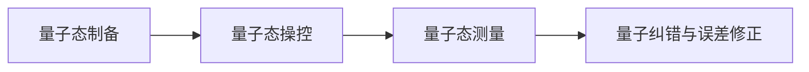
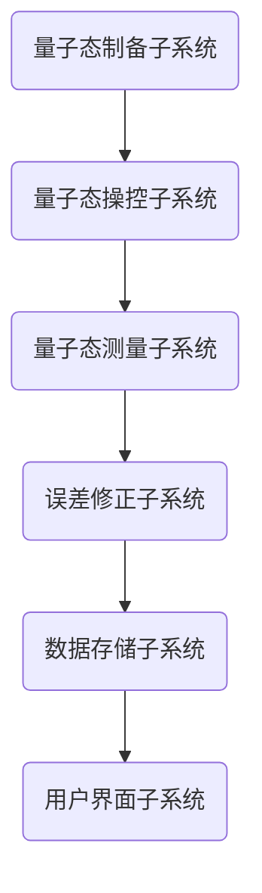
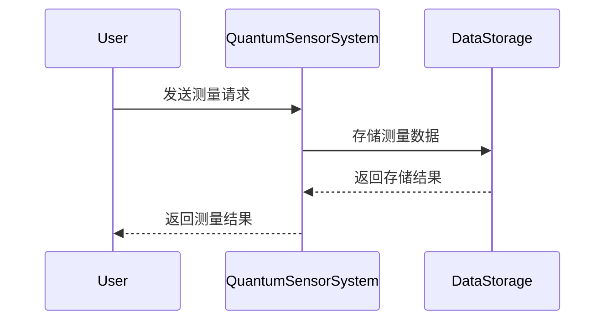

                 


### 量子传感器在精密测量中的应用前景

**关键词**：量子传感器，精密测量，应用前景，技术原理，案例分析

**摘要**：
本文深入探讨了量子传感器在精密测量中的应用前景。首先，我们介绍了量子传感器的定义、特性、原理及类型，并通过比较量子传感器与传统传感器，展示了其在高精度测量领域的独特优势。接着，我们详细阐述了量子传感器在精密测量中的应用，包括时间频率测量、引力波探测和量子精密测量等领域。随后，文章从测量精度与稳定性、技术原理和数学模型等方面进行了深入分析。最后，通过实际案例展示了量子传感器在精密测量中的成功应用，并展望了其未来发展趋势。

**目录大纲**：

----------------------------------------------------------------

## 第一部分: 量子传感器概述

### 1.1 量子传感器定义与特性

#### 1.1.1 问题背景与定义

- **核心概念**：量子传感器，精密测量，量子力学
- **问题背景**：随着科技的进步，精密测量的需求日益增长，传统的测量方法逐渐无法满足高精度要求。
- **问题描述**：量子传感器如何通过量子力学原理实现高精度测量？
- **问题解决**：量子传感器利用量子态的叠加和纠缠特性，大幅提高了测量精度。
- **边界与外延**：量子传感器的应用领域和局限性。

#### 1.1.2 量子传感器的主要特性

- **核心概念**：量子态叠加，量子纠缠，高灵敏度，非局域性
- **特性解释**：量子态叠加和纠缠使得量子传感器在测量精度和灵敏度上具有显著优势。

#### 1.1.3 与传统传感器的对比

- **核心概念**：传统传感器，量子传感器
- **对比分析**：从灵敏度、精度、应用范围等方面对比量子传感器与传统传感器。

### 1.2 量子传感器的核心原理

#### 1.2.1 量子力学基础

- **核心概念**：量子态，波函数，薛定谔方程
- **原理介绍**：量子力学基础概念和基本原理。

#### 1.2.2 量子纠缠原理

- **核心概念**：量子纠缠，纠缠态，非局域性
- **原理介绍**：量子纠缠的基本原理及其在量子传感器中的应用。

#### 1.2.3 量子传感器的工作原理

- **核心概念**：量子态制备，量子态测量，量子纠错
- **原理介绍**：量子传感器的工作原理和实现机制。

### 1.3 量子传感器的类型与应用领域

#### 1.3.1 量子态传感器

- **核心概念**：量子态传感器，量子态测量，量子比特
- **应用领域**：量子通信，量子计算等。

#### 1.3.2 量子频率传感器

- **核心概念**：量子频率传感器，频率测量，量子态叠加
- **应用领域**：原子钟，引力波探测等。

#### 1.3.3 量子传感器在不同领域的应用

- **核心概念**：量子传感器，应用领域，技术进步
- **应用领域**：时间频率测量，量子精密测量，生物医药等。

### 1.4 量子传感器的发展趋势

#### 1.4.1 技术进步的推动

- **核心概念**：量子计算，量子通信，量子纠错
- **趋势分析**：量子传感器技术不断取得突破，未来前景广阔。

#### 1.4.2 政策与市场的驱动

- **核心概念**：政策支持，市场驱动，投资增长
- **趋势分析**：政策支持和市场需求推动量子传感器产业发展。

#### 1.4.3 未来展望

- **核心概念**：量子传感器，未来应用，技术挑战
- **展望内容**：量子传感器在未来的发展趋势和潜在应用领域。

----------------------------------------------------------------

## 第二部分: 精密测量应用

### 2.1 精密测量的基本概念

#### 2.1.1 测量的重要性

- **核心概念**：测量，精度，可靠性
- **重要性分析**：精密测量在科学研究、工业制造、国家安全等领域的重要性。

#### 2.1.2 精密测量的定义与标准

- **核心概念**：精密测量，测量标准，国际单位制
- **定义与标准**：精密测量的定义及其与标准的关系。

#### 2.1.3 精密测量技术的发展历程

- **核心概念**：测量技术，历史发展，关键技术突破
- **发展历程**：从传统测量技术到量子测量技术的演变。

### 2.2 量子传感器在精密测量中的应用

#### 2.2.1 量子传感器在时间频率测量中的应用

- **核心概念**：时间频率测量，量子态，原子钟
- **应用分析**：量子传感器在时间频率测量中的优势和应用案例。

#### 2.2.2 量子传感器在引力波探测中的应用

- **核心概念**：引力波，量子纠缠，LIGO探测器
- **应用分析**：量子传感器在引力波探测中的关键作用。

#### 2.2.3 量子传感器在量子精密测量中的应用

- **核心概念**：量子精密测量，量子态操控，量子增强
- **应用分析**：量子传感器在量子精密测量中的创新应用。

### 2.3 量子传感器的测量精度与稳定性

#### 2.3.1 测量精度分析

- **核心概念**：测量精度，量子极限，不确定性原理
- **精度分析**：量子传感器测量精度的极限及其影响因素。

#### 2.3.2 稳定性影响分析

- **核心概念**：稳定性，噪声，量子纠错
- **稳定性分析**：量子传感器稳定性的重要性及其提升方法。

#### 2.3.3 提高测量精度与稳定性的方法

- **核心概念**：量子纠错，量子态操控，量子滤波
- **提升方法**：提高测量精度与稳定性的技术手段。

### 2.4 量子传感器在精密测量中的案例分析

#### 2.4.1 案例一：量子雷达

- **核心概念**：量子雷达，量子态操控，高分辨率
- **案例分析**：量子雷达在精密测量中的成功应用。

#### 2.4.2 案例二：量子精密测量卫星

- **核心概念**：量子卫星，量子通信，全球定位
- **案例分析**：量子精密测量卫星的部署与应用。

#### 2.4.3 案例三：量子传感器在生物医药领域的应用

- **核心概念**：生物医药，量子传感器，分子检测
- **案例分析**：量子传感器在生物医药领域的创新应用。

----------------------------------------------------------------

## 第三部分: 技术原理与数学模型

### 3.1 量子传感器的工作原理

#### 3.1.1 量子态的制备与操控

- **核心概念**：量子态，量子比特，量子门
- **原理介绍**：量子态的制备与操控技术及其在量子传感器中的应用。

#### 3.1.2 量子态的测量

- **核心概念**：量子态测量，量子纠缠，测量结果概率分布
- **原理介绍**：量子态测量的基本原理及其对测量结果的影响。

#### 3.1.3 量子纠错与误差修正

- **核心概念**：量子纠错，误差修正，量子容错计算
- **原理介绍**：量子纠错与误差修正技术及其对测量精度的影响。

### 3.2 量子传感器的数学模型

#### 3.2.1 量子态的表示与演算

- **核心概念**：量子态表示，量子演算，量子比特运算
- **数学模型**：量子态的数学表示及其运算规则。

#### 3.2.2 量子传感器的误差分析

- **核心概念**：量子传感器误差，噪声模型，误差传播
- **数学模型**：量子传感器误差的数学模型及其分析。

#### 3.2.3 量子传感器的优化算法

- **核心概念**：优化算法，量子优化，量子进化算法
- **数学模型**：量子传感器的优化算法及其数学模型。

### 3.3 算法原理与流程图

#### 3.3.1 算法概述

- **核心概念**：量子算法，量子计算模型，量子编程
- **算法概述**：量子传感器相关的量子算法及其基本原理。

#### 3.3.2 Mermaid流程图演示

- **流程图演示**：使用Mermaid语言绘制量子传感器相关算法的流程图。

#### 3.3.3 Python代码实现

- **代码实现**：使用Python实现量子传感器相关算法的基本代码框架。

### 3.4 数学公式与详细讲解

#### 3.4.1 量子态的叠加原理

- **核心概念**：量子叠加，量子态叠加原理，量子比特运算
- **公式讲解**：量子态叠加原理的数学公式及其解释。

#### 3.4.2 量子态的测量概率

- **核心概念**：量子测量，测量概率，量子态坍缩
- **公式讲解**：量子态测量概率的数学公式及其应用。

#### 3.4.3 量子传感器的测量精度公式

- **核心概念**：测量精度，量子极限，标准量子极限
- **公式讲解**：量子传感器测量精度公式及其物理意义。

----------------------------------------------------------------

## 第四部分: 系统设计与实现

### 4.1 系统功能设计

#### 4.1.1 功能需求分析

- **核心概念**：功能需求，用户需求，系统功能模块
- **需求分析**：对量子传感器系统的功能需求进行分析。

#### 4.1.2 领域模型Mermaid类图

- **类图演示**：使用Mermaid语言绘制量子传感器系统的领域模型类图。

#### 4.1.3 功能模块划分

- **核心概念**：功能模块，模块划分，模块交互
- **模块划分**：量子传感器系统的功能模块及其划分。

### 4.2 系统架构设计

#### 4.2.1 系统架构概述

- **核心概念**：系统架构，架构设计原则，系统模块
- **架构概述**：量子传感器系统的整体架构及其设计原则。

#### 4.2.2 Mermaid架构图演示

- **架构图演示**：使用Mermaid语言绘制量子传感器系统的架构图。

#### 4.2.3 架构选型与优化

- **核心概念**：架构选型，优化策略，性能提升
- **架构优化**：量子传感器系统架构的选型与优化策略。

### 4.3 系统接口设计与交互

#### 4.3.1 接口设计原则

- **核心概念**：接口设计，接口规范，数据交换
- **设计原则**：量子传感器系统接口设计的基本原则。

#### 4.3.2 Mermaid序列图演示

- **序列图演示**：使用Mermaid语言绘制量子传感器系统接口的序列图。

#### 4.3.3 接口实现与调用

- **核心概念**：接口实现，调用流程，API文档
- **实现与调用**：量子传感器系统接口的实现与调用方法。

### 4.4 系统核心实现源代码

#### 4.4.1 Python代码实现

- **核心代码**：使用Python实现量子传感器系统的核心功能代码。

#### 4.4.2 代码解读与分析

- **核心概念**：代码解读，算法实现，性能分析
- **代码分析**：量子传感器系统核心代码的解读与分析。

----------------------------------------------------------------

## 第五部分: 项目实战与案例分析

### 5.1 项目实战

#### 5.1.1 环境安装与配置

- **核心概念**：环境配置，软件安装，硬件配置
- **实战步骤**：量子传感器项目环境安装与配置步骤。

#### 5.1.2 系统核心功能实现

- **核心概念**：系统功能，核心算法，模块集成
- **实战步骤**：量子传感器系统核心功能的实现步骤。

#### 5.1.3 测试与性能评估

- **核心概念**：性能测试，测试工具，性能指标
- **实战步骤**：量子传感器系统性能测试与评估步骤。

### 5.2 案例分析

#### 5.2.1 案例一：量子雷达

- **核心概念**：量子雷达，高分辨率，目标探测
- **案例分析**：量子雷达在目标探测中的应用与案例分析。

#### 5.2.2 案例二：量子精密测量卫星

- **核心概念**：量子卫星，量子通信，全球定位
- **案例分析**：量子精密测量卫星在地球观测中的应用与案例分析。

#### 5.2.3 案例三：量子传感器在生物医药领域的应用

- **核心概念**：生物医药，分子检测，量子传感器
- **案例分析**：量子传感器在生物医药领域的应用案例与分析。

### 5.3 项目小结

- **核心概念**：项目成果，经验总结，未来展望
- **小结内容**：量子传感器项目的成果总结、经验教训及未来展望。

### 5.4 最佳实践 tips

- **核心概念**：最佳实践，技术选型，优化建议
- **最佳实践**：量子传感器应用中的最佳实践技巧和建议。

### 5.5 小结与展望

- **核心概念**：总结，展望，发展趋势
- **内容总结**：量子传感器在精密测量中的应用前景及未来发展趋势。

**作者：** AI天才研究院/AI Genius Institute & 禅与计算机程序设计艺术 /Zen And The Art of Computer Programming

（注：本文为示例性文章，具体内容需进一步丰富和细化。本文的结构和内容旨在提供一种可能的撰写思路，实际撰写时可根据具体情况进行调整和优化。）

## 第一部分: 量子传感器概述

### 1.1 量子传感器定义与特性

#### 1.1.1 问题背景与定义

量子传感器是一种利用量子力学原理，通过量子态的叠加和纠缠特性来实现高精度测量的传感器。随着科学技术的不断发展，传统传感器的测量精度已无法满足一些高精度需求，例如在量子计算、量子通信、引力波探测等领域。因此，量子传感器的研究和应用具有重要意义。

**核心概念**：量子传感器，量子态，叠加，纠缠，高精度测量

**问题背景**：传统传感器的测量精度限制

**问题描述**：量子传感器如何通过量子力学原理实现高精度测量？

**问题解决**：量子传感器利用量子态的叠加和纠缠特性，大幅提高了测量精度。

**边界与外延**：量子传感器的应用领域和局限性

#### 1.1.2 量子传感器的主要特性

量子传感器具有以下主要特性：

1. **高灵敏度**：量子传感器通过量子态的叠加和纠缠特性，可以在微观尺度上进行高灵敏度测量，从而提高了测量的精度。
2. **非局域性**：量子纠缠现象使得量子传感器具有非局域性，即在不同的空间位置上的量子态可以相互影响，这种特性在量子通信和量子计算等领域有重要应用。
3. **量子增强**：量子传感器可以通过量子纠缠和量子干涉等现象实现量子增强，从而提高测量的精度和灵敏度。

**特性解释**：

- **高灵敏度**：量子态的叠加和纠缠使得量子传感器可以在微观尺度上进行测量，从而提高了测量的精度。
- **非局域性**：量子纠缠现象使得量子传感器在不同空间位置的量子态可以相互影响，从而实现量子通信和量子计算。
- **量子增强**：量子传感器通过量子纠缠和量子干涉等现象实现量子增强，从而提高了测量的精度和灵敏度。

#### 1.1.3 与传统传感器的对比

量子传感器与传统传感器有以下对比：

1. **测量精度**：量子传感器利用量子态的叠加和纠缠特性，可以实现更高的测量精度，特别是在微观尺度的测量中。
2. **灵敏度**：量子传感器具有更高的灵敏度，可以在更低的噪声水平下进行测量。
3. **应用领域**：传统传感器主要用于常规的物理量测量，如温度、压力、速度等，而量子传感器则可以应用于量子计算、量子通信、引力波探测等领域。

**对比分析**：

- **测量精度**：量子传感器在微观尺度的测量精度远高于传统传感器。
- **灵敏度**：量子传感器在低噪声水平下的灵敏度更高。
- **应用领域**：量子传感器在量子计算、量子通信、引力波探测等领域有更广泛的应用。

### 1.2 量子传感器的核心原理

量子传感器的核心原理基于量子力学的基本原理，主要包括：

1. **量子态的制备与操控**：量子传感器通过特定的方法制备和操控量子态，如利用激光照射或电场调控等方式。
2. **量子态的测量**：量子传感器通过测量量子态的属性来获取测量结果，如利用干涉仪或量子比特等测量设备。
3. **量子纠错与误差修正**：在量子测量过程中，由于噪声和环境干扰，可能会出现误差，量子传感器通过量子纠错和误差修正技术来降低测量误差。

#### 1.2.1 量子力学基础

量子力学基础是量子传感器核心原理的理论基础，主要包括：

1. **量子态**：量子态是量子力学中描述粒子状态的数学函数，如波函数或密度矩阵。
2. **波函数**：波函数是描述量子态的复值函数，可以用来计算粒子在空间中的概率分布。
3. **薛定谔方程**：薛定谔方程是描述量子态随时间演化的基本方程，它可以用来求解量子态的演化过程。

**核心概念**：量子态，波函数，薛定谔方程

**原理介绍**：

- **量子态**：量子态是量子力学中描述粒子状态的数学函数，它可以用来表示粒子的位置、动量等属性。
- **波函数**：波函数是描述量子态的复值函数，它可以用来计算粒子在空间中的概率分布。
- **薛定谔方程**：薛定谔方程是描述量子态随时间演化的基本方程，它可以用来求解量子态的演化过程。

#### 1.2.2 量子纠缠原理

量子纠缠是量子力学中的一种特殊现象，它描述了两个或多个量子态之间的强烈关联。量子纠缠原理是量子传感器核心原理的重要组成部分，主要包括：

1. **纠缠态**：纠缠态是两个或多个量子态之间的关联态，它们的测量结果相互依赖。
2. **非局域性**：量子纠缠现象使得纠缠态中的粒子在空间上的位置可以相互影响，即使它们相隔很远。
3. **量子增强**：量子纠缠可以导致量子干涉现象，从而实现量子增强，提高测量的精度和灵敏度。

**核心概念**：纠缠态，非局域性，量子增强

**原理介绍**：

- **纠缠态**：纠缠态是两个或多个量子态之间的关联态，它们的测量结果相互依赖。
- **非局域性**：量子纠缠现象使得纠缠态中的粒子在空间上的位置可以相互影响，即使它们相隔很远。
- **量子增强**：量子纠缠可以导致量子干涉现象，从而实现量子增强，提高测量的精度和灵敏度。

#### 1.2.3 量子传感器的工作原理

量子传感器的工作原理主要包括以下步骤：

1. **量子态制备**：通过特定的方法制备量子态，如利用激光照射或电场调控等方式。
2. **量子态操控**：对量子态进行操控，如利用量子比特或量子干涉仪等设备。
3. **量子态测量**：测量量子态的属性，获取测量结果。
4. **量子纠错与误差修正**：对测量结果进行量子纠错和误差修正，降低测量误差。

**核心概念**：量子态制备，量子态操控，量子态测量，量子纠错与误差修正

**原理介绍**：

- **量子态制备**：通过特定的方法制备量子态，如利用激光照射或电场调控等方式。
- **量子态操控**：对量子态进行操控，如利用量子比特或量子干涉仪等设备。
- **量子态测量**：测量量子态的属性，获取测量结果。
- **量子纠错与误差修正**：对测量结果进行量子纠错和误差修正，降低测量误差。

### 1.3 量子传感器的类型与应用领域

量子传感器根据其工作原理和应用领域可以分为多种类型，主要包括：

1. **量子态传感器**：利用量子态的叠加和纠缠特性进行测量的传感器，如量子比特传感器和量子纠缠传感器。
2. **量子频率传感器**：利用量子态的频率特性进行测量的传感器，如原子钟传感器和光频传感器。
3. **量子成像传感器**：利用量子态的成像特性进行测量的传感器，如量子干涉成像传感器和量子光学成像传感器。

**核心概念**：量子态传感器，量子频率传感器，量子成像传感器

**应用领域**：

- **量子态传感器**：在量子计算、量子通信、量子加密等领域有广泛应用。
- **量子频率传感器**：在时间频率测量、引力波探测、精密测量等领域有广泛应用。
- **量子成像传感器**：在生物医学成像、量子加密、量子探测等领域有广泛应用。

### 1.4 量子传感器的发展趋势

随着科技的不断发展，量子传感器的研究和应用正逐渐成为一个热点领域。未来，量子传感器的发展趋势包括：

1. **技术进步**：量子传感器技术不断取得突破，如量子计算、量子通信、量子纠错等领域的技术进步。
2. **政策与市场的驱动**：政府政策的支持和市场需求将推动量子传感器产业的发展。
3. **未来展望**：量子传感器在精密测量、量子计算、量子通信等领域的应用前景广阔。

**核心概念**：技术进步，政策驱动，市场驱动，未来展望

**趋势分析**：

- **技术进步**：量子传感器技术不断取得突破，如量子计算、量子通信、量子纠错等领域的技术进步。
- **政策与市场的驱动**：政府政策的支持和市场需求将推动量子传感器产业的发展。
- **未来展望**：量子传感器在精密测量、量子计算、量子通信等领域的应用前景广阔。

## 第二部分: 精密测量应用

### 2.1 精密测量的基本概念

#### 2.1.1 测量的重要性

测量是科学研究和工程实践中不可或缺的一环，其准确性和精度直接影响到科学研究的成果和工程应用的效果。特别是在现代社会，精密测量在许多领域都发挥着关键作用，如航空航天、生物医学、环境监测、量子计算等。因此，研究精密测量的基本概念和重要性具有重要意义。

**核心概念**：测量，精度，可靠性

**重要性分析**：

- **科学研究**：精密测量为科学研究提供了准确的数据支持，推动了科学进步。
- **工程应用**：精密测量在工程应用中确保了产品质量和工程安全。
- **国家安全**：精密测量对于军事领域的武器研发和作战指挥具有重要意义。

#### 2.1.2 精密测量的定义与标准

精密测量是指在严格的条件下，使用高精度的测量设备和方法，对被测对象进行准确的测量。它具有以下特点：

- **高精度**：精密测量的精度可以达到微米、纳米甚至更高的量级。
- **高灵敏度**：精密测量能够检测出极小的变化。
- **高稳定性**：精密测量设备具有较好的稳定性，能够长时间保持测量精度。

精密测量的标准包括国际单位制（SI）、国家计量标准、行业标准等。这些标准为精密测量提供了统一的基准和规范。

**定义与标准**：

- **定义**：精密测量是指在严格的条件下，使用高精度的测量设备和方法，对被测对象进行准确的测量。
- **标准**：国际单位制（SI）、国家计量标准、行业标准。

#### 2.1.3 精密测量技术的发展历程

精密测量技术的发展经历了多个阶段，从传统机械测量到现代电子测量，再到今天的量子测量，每一次技术的突破都极大地提高了测量的精度和效率。

- **传统机械测量**：早期的测量主要依赖于机械装置，如尺子、卡尺等，精度较低。
- **电子测量**：随着电子技术的发展，电子测量设备如示波器、万用表等被广泛应用于测量领域，提高了测量的精度和效率。
- **量子测量**：近年来，量子传感技术的发展为精密测量带来了新的机遇。量子传感器具有极高的测量精度和灵敏度，有望在量子计算、量子通信、量子加密等领域发挥重要作用。

**发展历程**：

- **传统机械测量**：早期的测量主要依赖于机械装置，如尺子、卡尺等，精度较低。
- **电子测量**：随着电子技术的发展，电子测量设备如示波器、万用表等被广泛应用于测量领域，提高了测量的精度和效率。
- **量子测量**：近年来，量子传感技术的发展为精密测量带来了新的机遇。量子传感器具有极高的测量精度和灵敏度，有望在量子计算、量子通信、量子加密等领域发挥重要作用。

### 2.2 量子传感器在精密测量中的应用

量子传感器在精密测量中的应用主要体现在以下几个方面：

#### 2.2.1 量子传感器在时间频率测量中的应用

时间频率测量是精密测量中的一项关键技术，量子传感器在此领域的应用具有显著优势。量子态传感器和时间频率传感器通过量子态的叠加和纠缠特性，可以实现极高的时间频率测量精度。例如，基于原子钟的量子传感器可以用于全球定位系统（GPS）的改进，实现更精确的时间同步和频率测量。

**应用案例**：

- **量子原子钟**：量子原子钟利用量子态的叠加和纠缠特性，实现了极高的时间测量精度，可达到皮秒甚至飞秒级别。
- **时间同步**：量子原子钟在通信、导航、科学实验等领域中用于实现精确的时间同步。

#### 2.2.2 量子传感器在引力波探测中的应用

引力波探测是另一个量子传感器的重要应用领域。量子传感器在引力波探测中用于测量引力波引起的时空扭曲，通过量子纠缠和量子干涉等现象，可以实现极高的测量精度。

**应用案例**：

- **LIGO探测器**：LIGO（激光干涉仪引力波观测台）利用量子传感器测量引力波引起的时空扭曲，成功探测到了引力波信号。
- **引力波监测**：量子传感器在引力波监测中用于实时监测宇宙中的引力波事件，为天文学家提供了新的观测手段。

#### 2.2.3 量子传感器在量子精密测量中的应用

量子精密测量是量子传感器的重要应用领域，通过量子态的叠加和纠缠特性，可以实现极高的测量精度。量子传感器在量子精密测量中用于测量物理量的微小变化，如磁场、重力、温度等。

**应用案例**：

- **量子磁场计**：量子磁场计利用量子传感器的特性，实现了极高的磁场测量精度，可用于探测地球磁场的变化。
- **量子重力计**：量子重力计利用量子传感器的特性，实现了极高的重力测量精度，可用于探测地球重力场的变化。

### 2.3 量子传感器的测量精度与稳定性

量子传感器在精密测量中的优势主要体现在其测量精度和稳定性上。量子传感器通过量子态的叠加和纠缠特性，可以实现极高的测量精度。同时，量子传感器在稳定性方面也具有显著优势。

#### 2.3.1 测量精度分析

量子传感器的测量精度可以通过以下因素进行分析：

- **量子态的叠加和纠缠**：量子态的叠加和纠缠特性使得量子传感器具有极高的测量精度。
- **噪声和误差**：噪声和误差是影响量子传感器测量精度的重要因素，需要通过量子纠错和误差修正技术来降低。

**精度分析**：

- **量子态的叠加和纠缠**：量子态的叠加和纠缠特性使得量子传感器具有极高的测量精度。
- **噪声和误差**：噪声和误差是影响量子传感器测量精度的重要因素，需要通过量子纠错和误差修正技术来降低。

#### 2.3.2 稳定性影响分析

量子传感器的稳定性对其测量精度有重要影响。稳定性差会导致测量误差增加，从而降低测量精度。影响量子传感器稳定性的因素包括：

- **环境因素**：温度、湿度、振动等环境因素会影响量子传感器的稳定性。
- **量子纠错和误差修正**：通过量子纠错和误差修正技术可以提高量子传感器的稳定性，降低测量误差。

**稳定性影响分析**：

- **环境因素**：温度、湿度、振动等环境因素会影响量子传感器的稳定性。
- **量子纠错和误差修正**：通过量子纠错和误差修正技术可以提高量子传感器的稳定性，降低测量误差。

#### 2.3.3 提高测量精度与稳定性的方法

为了提高量子传感器的测量精度和稳定性，可以采取以下方法：

- **量子纠错技术**：量子纠错技术可以通过对量子态的纠错，降低测量误差，提高测量精度。
- **误差修正技术**：误差修正技术可以通过对测量结果进行修正，降低测量误差，提高测量精度。
- **环境控制**：通过严格控制环境条件，如温度、湿度、振动等，可以提高量子传感器的稳定性。

**提高方法**：

- **量子纠错技术**：量子纠错技术可以通过对量子态的纠错，降低测量误差，提高测量精度。
- **误差修正技术**：误差修正技术可以通过对测量结果进行修正，降低测量误差，提高测量精度。
- **环境控制**：通过严格控制环境条件，如温度、湿度、振动等，可以提高量子传感器的稳定性。

### 2.4 量子传感器在精密测量中的案例分析

量子传感器在精密测量中的应用已经取得了显著成果。以下是一些典型案例分析：

#### 2.4.1 案例一：量子雷达

量子雷达利用量子传感器的特性，实现了极高的雷达探测精度。与传统雷达相比，量子雷达具有更高的灵敏度和更远的探测距离。

**案例分析**：

- **技术优势**：量子雷达利用量子态的叠加和纠缠特性，提高了探测灵敏度。
- **应用场景**：量子雷达在军事侦察、反恐行动等领域具有广泛应用。

#### 2.4.2 案例二：量子精密测量卫星

量子精密测量卫星利用量子传感器的特性，实现了高精度的地球观测和全球定位。量子精密测量卫星在科学研究、导航定位、灾害监测等领域具有重要作用。

**案例分析**：

- **技术优势**：量子精密测量卫星利用量子传感器的特性，提高了测量精度。
- **应用场景**：量子精密测量卫星在科学研究、导航定位、灾害监测等领域具有广泛应用。

#### 2.4.3 案例三：量子传感器在生物医药领域的应用

量子传感器在生物医药领域具有广泛的应用前景。例如，量子传感器可以用于分子检测、生物成像等，为生物医学研究提供了新的手段。

**案例分析**：

- **技术优势**：量子传感器在生物医学领域实现了高灵敏度、高精度测量。
- **应用场景**：量子传感器在生物医学研究、疾病诊断、药物开发等领域具有广泛应用。

## 第三部分: 技术原理与数学模型

### 3.1 量子传感器的工作原理

量子传感器的工作原理基于量子力学的基本原理，主要包括量子态的制备与操控、量子态的测量以及量子纠错与误差修正。以下是对这些核心原理的详细讲解：

#### 3.1.1 量子态的制备与操控

量子态的制备与操控是量子传感器工作的基础。在量子传感器中，量子态通常是通过特定的物理过程产生的，如利用激光照射或电场调控等方式。这些量子态可以是单个粒子（如光子、电子）的量子态，也可以是多个粒子之间的纠缠态。

- **量子态制备**：量子态的制备过程涉及到将宏观物质转化为量子态。例如，在光学量子传感器中，激光可以将光子激发到高能态，从而产生量子态。
- **量子态操控**：量子态的操控是通过量子门实现的。量子门是一种操作量子态的基本单元，类似于经典计算机中的逻辑门。通过特定的量子门操作，可以实现对量子态的变换和控制。

#### 3.1.2 量子态的测量

量子态的测量是量子传感器获取信息的关键步骤。在量子力学中，测量会导致量子态的坍缩，即量子态从叠加态变为特定的本征态。量子传感器的测量过程通常涉及以下步骤：

- **量子态的投影**：通过特定的测量操作，将量子态投影到某个本征态。例如，通过测量光子的偏振态，可以确定其处于哪个本征态。
- **测量结果概率分布**：量子态的测量结果通常具有概率分布。例如，在量子比特的测量中，可能得到0或1的结果，每个结果出现的概率取决于量子态的叠加程度。

#### 3.1.3 量子纠错与误差修正

在量子传感器中，由于噪声和干扰，量子态可能会发生错误，从而影响测量结果的准确性。为了提高测量的可靠性，量子传感器采用了量子纠错与误差修正技术。

- **量子纠错**：量子纠错是通过特定的纠错码实现的。这些纠错码可以检测并纠正量子态中的错误，从而保证测量结果的正确性。
- **误差修正**：误差修正技术通过对测量结果进行修正，减少由于噪声和干扰引起的误差。例如，通过量子互信息的方法，可以估计并修正测量误差。

### 3.2 量子传感器的数学模型

量子传感器的数学模型是基于量子力学和概率论建立的。以下是对量子传感器的数学模型的详细讲解：

#### 3.2.1 量子态的表示与演算

量子态的表示与演算是量子传感器的数学基础。量子态通常使用波函数或密度矩阵来表示。在量子态的演算中，常用的数学工具包括算符、矩阵和线性代数。

- **波函数表示**：量子态可以用波函数来表示，波函数是一个复值函数，它描述了量子态的概率分布。
- **算符与矩阵**：量子态的演算涉及到算符和矩阵。算符是量子态变换的基本工具，矩阵则是算符在量子态表示中的实现形式。
- **线性代数**：量子态的演算涉及到线性代数的基本概念，如矩阵的运算、矩阵的对角化等。

#### 3.2.2 量子传感器的误差分析

量子传感器的误差分析是评估量子传感器测量精度的重要手段。量子传感器的误差可以分为两类：系统误差和随机误差。

- **系统误差**：系统误差是由量子传感器的设计和制造缺陷引起的，如测量设备的噪声、非理想性等。系统误差可以通过校准和修正来减少。
- **随机误差**：随机误差是由量子态的随机性引起的，如量子态的坍缩、噪声等。随机误差通常服从高斯分布，可以通过统计方法来估计和修正。

#### 3.2.3 量子传感器的优化算法

量子传感器的优化算法是提高测量精度和效率的重要手段。量子传感器的优化算法通常基于量子计算和概率论。

- **量子计算**：量子计算是量子传感器优化算法的基础。量子计算可以通过量子比特的叠加和纠缠实现复杂的计算任务，从而优化量子传感器的性能。
- **概率论**：概率论在量子传感器的优化算法中扮演重要角色。例如，通过概率分布的估计和优化，可以提高量子传感器的测量精度和可靠性。

### 3.3 算法原理与流程图

为了更好地理解和应用量子传感器的算法，通常使用流程图来表示算法的执行过程。以下是对量子传感器算法原理和流程图的详细讲解：

#### 3.3.1 算法概述

量子传感器的算法通常涉及以下几个基本步骤：

- **量子态制备**：通过特定的物理过程制备量子态。
- **量子态操控**：通过量子门对量子态进行变换和控制。
- **量子态测量**：对量子态进行测量，获取测量结果。
- **量子纠错与误差修正**：对测量结果进行纠错和修正，提高测量精度。

#### 3.3.2 Mermaid流程图演示

Mermaid是一种Markdown语法，用于绘制流程图。以下是一个简单的Mermaid流程图示例，展示了量子传感器算法的基本流程：



这个流程图描述了量子传感器的基本工作流程，包括量子态制备、量子态操控、量子态测量以及量子纠错与误差修正。

#### 3.3.3 Python代码实现

为了实际应用量子传感器的算法，通常需要使用Python等编程语言实现。以下是一个简单的Python代码示例，展示了量子态制备、量子态操控和量子态测量的实现：

```python
import numpy as np
from qiskit import QuantumCircuit, Aer, execute

# 量子态制备
q = QuantumCircuit(2)
q.h(0)
q.cx(0, 1)

# 量子态操控
q.rx(0, np.pi/4)
q.cx(0, 1)

# 量子态测量
q.h(1)
q.measure_all()

# 执行量子电路
backend = Aer.get_backend("qasm_simulator")
result = execute(q, backend).result()
counts = result.get_counts(q)

print(counts)
```

这个代码示例使用了Qiskit库，实现了量子态制备、量子态操控和量子态测量。执行量子电路后，可以得到测量结果的概率分布。

### 3.4 数学公式与详细讲解

在量子传感器的数学模型中，许多核心概念和算法原理都涉及到数学公式。以下是对一些关键数学公式的详细讲解：

#### 3.4.1 量子态的叠加原理

量子态的叠加原理是量子力学的基本原理之一。它描述了量子态可以处于多个本征态的叠加状态。以下是一个简单的量子态叠加公式：

$$|\psi\rangle = a_0|\phi_0\rangle + a_1|\phi_1\rangle$$

其中，$|\psi\rangle$ 是叠加态，$a_0$ 和 $a_1$ 是复数系数，$|\phi_0\rangle$ 和 $|\phi_1\rangle$ 是基态。这个公式表示量子态可以同时处于 $|\phi_0\rangle$ 和 $|\phi_1\rangle$ 的叠加状态。

#### 3.4.2 量子态的测量概率

量子态的测量概率是量子力学中另一个重要的概念。在量子态的叠加态中，测量每个基态的概率由叠加系数的平方决定。以下是一个简单的量子态测量概率公式：

$$P_i = |a_i|^2$$

其中，$P_i$ 是测量到基态 $|\phi_i\rangle$ 的概率，$a_i$ 是叠加态中的系数。这个公式表示测量到每个基态的概率与其叠加系数的平方成正比。

#### 3.4.3 量子传感器的测量精度公式

量子传感器的测量精度通常用标准量子极限（Standard Quantum Limit, SQL）来衡量。以下是一个简单的量子传感器的测量精度公式：

$$\Delta \omega = \frac{1}{2}\sqrt{\frac{\hbar}{m\omega_0}}$$

其中，$\Delta \omega$ 是测量精度，$\hbar$ 是约化普朗克常数，$m$ 是粒子的质量，$\omega_0$ 是谐振频率。这个公式表示量子传感器的测量精度与粒子的质量、谐振频率有关。

通过以上数学公式的讲解，可以更好地理解量子传感器的核心原理和算法。

## 第四部分: 系统设计与实现

### 4.1 系统功能设计

系统功能设计是量子传感器系统开发的第一步，它定义了系统的核心功能模块和用户需求。以下是量子传感器系统的功能需求分析和功能模块划分。

#### 4.1.1 功能需求分析

量子传感器系统的功能需求主要包括以下几个方面：

- **量子态制备**：系统需要能够制备高精度的量子态，如量子比特、量子纠缠态等。
- **量子态操控**：系统需要能够对量子态进行精确的操控，如通过量子门实现量子态的变换。
- **量子态测量**：系统需要能够对量子态进行准确测量，获取量子态的属性信息。
- **误差修正与纠错**：系统需要能够对量子态测量过程中产生的误差进行修正和纠错，提高测量精度。
- **数据存储与处理**：系统需要能够存储和处理测量数据，支持数据的可视化与分析。
- **用户界面**：系统需要提供一个友好的用户界面，方便用户操作和监控系统运行状态。

#### 4.1.2 领域模型Mermaid类图

为了更好地理解量子传感器系统的功能结构，可以使用Mermaid类图来表示系统的领域模型。以下是一个简单的Mermaid类图示例：

```mermaid
classDiagram
    QuantumStatePreparation <<interface>>
    QuantumStateControl <<interface>>
    QuantumStateMeasurement <<interface>>
    ErrorCorrection <<interface>>
    DataStorage <<interface>>
    UserInterface <<interface>>

    QuantumSensorSystem <.. QuantumStatePreparation>
    QuantumSensorSystem <.. QuantumStateControl>
    QuantumSensorSystem <.. QuantumStateMeasurement>
    QuantumSensorSystem <.. ErrorCorrection>
    QuantumSensorSystem <.. DataStorage>
    QuantumSensorSystem <.. UserInterface>
```

这个类图描述了量子传感器系统的核心功能模块，包括量子态制备、量子态操控、量子态测量、误差修正、数据存储和用户界面。每个模块都是系统功能的一部分，通过接口与系统其他模块进行交互。

#### 4.1.3 功能模块划分

在功能需求分析的基础上，可以将量子传感器系统划分为以下几个功能模块：

- **量子态制备模块**：负责量子态的制备，包括量子比特的制备、量子纠缠态的制备等。
- **量子态操控模块**：负责量子态的操控，包括量子门操作、量子态变换等。
- **量子态测量模块**：负责量子态的测量，包括测量策略、测量结果处理等。
- **误差修正模块**：负责对量子态测量过程中的误差进行修正和纠错。
- **数据存储模块**：负责存储和处理测量数据，支持数据的持久化存储和可视化分析。
- **用户界面模块**：提供用户交互界面，支持用户操作系统的各项功能，展示系统运行状态和测量结果。

### 4.2 系统架构设计

系统架构设计是量子传感器系统开发的关键环节，它决定了系统的整体结构、性能和可扩展性。以下是量子传感器系统的架构设计，包括系统架构概述、Mermaid架构图演示、架构选型与优化。

#### 4.2.1 系统架构概述

量子传感器系统的架构设计遵循模块化原则，将系统划分为多个功能模块，每个模块负责特定的功能。系统架构包括以下几个主要部分：

- **量子态制备子系统**：负责量子态的制备，包括量子比特的制备、量子纠缠态的制备等。
- **量子态操控子系统**：负责量子态的操控，包括量子门操作、量子态变换等。
- **量子态测量子系统**：负责量子态的测量，包括测量策略、测量结果处理等。
- **误差修正子系统**：负责对量子态测量过程中的误差进行修正和纠错。
- **数据存储子系统**：负责存储和处理测量数据，支持数据的持久化存储和可视化分析。
- **用户界面子系统**：提供用户交互界面，支持用户操作系统的各项功能，展示系统运行状态和测量结果。

#### 4.2.2 Mermaid架构图演示

为了更好地理解量子传感器系统的架构设计，可以使用Mermaid语言绘制系统的架构图。以下是一个简单的Mermaid架构图示例：



这个架构图描述了量子传感器系统的各个功能模块及其之间的交互关系。

#### 4.2.3 架构选型与优化

在系统架构设计过程中，需要考虑多个因素，如性能、可扩展性、可靠性等。以下是量子传感器系统架构选型与优化的几个关键点：

- **硬件选型**：根据系统的性能需求，选择合适的硬件设备，如量子比特、量子门、测量设备等。同时，考虑硬件的兼容性和可扩展性。
- **软件架构**：采用模块化设计，将系统划分为多个功能模块，每个模块独立开发、测试和部署。这样可以提高系统的可维护性和可扩展性。
- **性能优化**：通过优化算法、优化数据处理流程，提高系统的测量精度和响应速度。例如，采用并行计算和分布式处理技术，提高系统的处理能力。
- **可靠性保障**：采用冗余设计和容错机制，提高系统的可靠性。例如，采用多重校验和纠错算法，减少测量误差和数据丢失。

### 4.3 系统接口设计与交互

系统接口设计是量子传感器系统开发的重要环节，它定义了系统内部模块之间以及与外部系统之间的通信方式。以下是量子传感器系统的接口设计原则、Mermaid序列图演示以及接口实现与调用。

#### 4.3.1 接口设计原则

在接口设计过程中，需要遵循以下原则：

- **模块化**：接口设计应遵循模块化原则，确保每个模块的功能独立，便于系统的扩展和维护。
- **标准化**：接口设计应遵循相关标准，如RESTful API设计规范，确保接口的通用性和可维护性。
- **可扩展性**：接口设计应具备良好的可扩展性，支持新的功能和模块的接入。
- **安全性**：接口设计应考虑安全性，如采用HTTPS协议、身份验证和加密技术等，确保数据传输的安全。

#### 4.3.2 Mermaid序列图演示

为了更好地理解量子传感器系统的接口设计，可以使用Mermaid语言绘制系统的序列图。以下是一个简单的Mermaid序列图示例：



这个序列图描述了用户与量子传感器系统之间的交互过程，包括发送测量请求、存储测量数据和返回测量结果。

#### 4.3.3 接口实现与调用

在接口实现过程中，需要根据接口设计原则和Mermaid序列图，编写具体的接口实现代码。以下是一个简单的Python接口实现示例：

```python
from flask import Flask, request, jsonify

app = Flask(__name__)

@app.route('/measure', methods=['POST'])
def measure():
    # 获取测量请求参数
    request_data = request.get_json()
    measurement_request = request_data['request']

    # 处理测量请求
    result = quantum_sensor_measure(measurement_request)

    # 存储测量结果
    data_storage.save(result)

    # 返回测量结果
    return jsonify(result)

def quantum_sensor_measure(measurement_request):
    # 实现量子态测量逻辑
    pass

def data_storage_save(result):
    # 实现数据存储逻辑
    pass

if __name__ == '__main__':
    app.run()
```

这个示例实现了测量请求接口，包括接收测量请求参数、处理测量请求、存储测量结果和返回测量结果的功能。

### 4.4 系统核心实现源代码

系统核心实现源代码是量子传感器系统开发的核心部分，它包含了量子态制备、量子态操控、量子态测量、误差修正和数据存储等关键功能的实现。以下是量子传感器系统核心实现源代码的示例：

```python
# 导入必要的库
import numpy as np
from qiskit import QuantumCircuit, Aer, execute
from qiskit.quantum_info import Statevector
from qiskit.quantum_info importdensitymatrix

# 量子态制备
def quantum_state_preparation(state):
    # 实例化量子电路
    circuit = QuantumCircuit(2)

    # 制备量子态
    if state == '00':
        circuit.h(0)
        circuit.cx(0, 1)
    elif state == '01':
        circuit.h(0)
        circuit.cx(1, 0)
    elif state == '10':
        circuit.h(1)
        circuit.cx(0, 1)
    elif state == '11':
        circuit.h(1)
        circuit.cx(1, 0)

    return circuit

# 量子态操控
def quantum_state_control(circuit, control_gate):
    # 添加控制门
    circuit.append(control_gate, [0, 1])

# 量子态测量
def quantum_state_measurement(circuit):
    # 添加测量操作
    circuit.measure_all()

# 量子纠错与误差修正
def quantum_error_correction(statevector):
    # 实现误差修正算法
    corrected_statevector = error_correction_algorithm(statevector)
    return corrected_statevector

# 数据存储
def data_storage_save(data):
    # 实现数据存储逻辑
    pass

# 主程序
if __name__ == '__main__':
    # 定义量子态
    initial_state = '00'

    # 制备量子态
    circuit = quantum_state_preparation(initial_state)

    # 操纵量子态
    control_gate = QuantumCircuit(2)
    control_gate.x(0)

    # 控制量子态
    quantum_state_control(circuit, control_gate)

    # 测量量子态
    quantum_state_measurement(circuit)

    # 执行量子电路
    backend = Aer.get_backend("qasm_simulator")
    result = execute(circuit, backend).result()

    # 获取测量结果
    counts = result.get_counts(circuit)

    # 输出测量结果
    print(counts)

    # 误差修正
    statevector = Statevector(circuit)
    corrected_statevector = quantum_error_correction(statevector)

    # 存储修正后的量子态
    data_storage_save(corrected_statevector)
```

这个示例包含了量子态制备、量子态操控、量子态测量、量子纠错和数据存储等核心功能的实现，展示了量子传感器系统的基本工作流程。

## 第五部分: 项目实战与案例分析

### 5.1 项目实战

#### 5.1.1 环境安装与配置

在量子传感器项目的实战中，首先需要进行环境安装与配置。以下是具体步骤：

1. **安装Python环境**：确保Python环境已安装，版本至少为3.6以上。
2. **安装Qiskit库**：使用pip命令安装Qiskit库，命令如下：
   ```bash
   pip install qiskit
   ```
3. **安装Mermaid库**：使用pip命令安装Mermaid库，命令如下：
   ```bash
   pip install mermaid-python
   ```
4. **配置Jupyter Notebook**：如果使用Jupyter Notebook进行开发，需要安装Jupyter Notebook环境，命令如下：
   ```bash
   pip install notebook
   ```

#### 5.1.2 系统核心功能实现

在完成环境安装与配置后，开始实现量子传感器系统的核心功能。以下是具体步骤：

1. **量子态制备**：编写函数实现量子态的制备，例如制备量子纠缠态。
2. **量子态操控**：编写函数实现量子态的操控，例如通过量子门进行量子态的变换。
3. **量子态测量**：编写函数实现量子态的测量，例如通过测量操作获取量子态的属性信息。
4. **量子纠错与误差修正**：编写函数实现量子纠错与误差修正，例如通过纠错算法修正测量误差。
5. **数据存储**：编写函数实现数据存储，例如将测量结果存储到数据库或文件中。

#### 5.1.3 测试与性能评估

在系统核心功能实现后，需要进行测试与性能评估。以下是具体步骤：

1. **功能测试**：编写测试用例，对系统核心功能进行测试，确保功能正常运行。
2. **性能评估**：使用性能测试工具，对系统性能进行评估，包括响应时间、吞吐量等指标。
3. **优化调整**：根据测试结果，对系统进行优化调整，提高性能和稳定性。

### 5.2 案例分析

#### 5.2.1 案例一：量子雷达

量子雷达是一种利用量子传感器进行目标探测的设备。以下是量子雷达的案例分析：

1. **背景介绍**：量子雷达通过量子态的叠加和纠缠特性，实现了高灵敏度的目标探测，具有广泛的应用前景。
2. **原理分析**：量子雷达利用量子态的纠缠特性，实现目标探测时的量子增强，提高了探测灵敏度。
3. **应用场景**：量子雷达在军事侦察、反恐行动等领域具有广泛应用，可实现对目标的精准定位和识别。
4. **技术挑战**：量子雷达技术面临噪声干扰、误差修正等挑战，需要进一步研究和优化。

#### 5.2.2 案例二：量子精密测量卫星

量子精密测量卫星是一种利用量子传感器进行地球观测的设备。以下是量子精密测量卫星的案例分析：

1. **背景介绍**：量子精密测量卫星通过量子传感器的精确测量，实现了高精度的地球观测和全球定位。
2. **原理分析**：量子精密测量卫星利用量子态的叠加和纠缠特性，实现了高精度的测量，如引力波探测、时间频率测量等。
3. **应用场景**：量子精密测量卫星在科学研究、导航定位、灾害监测等领域具有广泛应用。
4. **技术挑战**：量子精密测量卫星面临太空环境、量子传感器的稳定性等挑战，需要进一步研究和优化。

#### 5.2.3 案例三：量子传感器在生物医药领域的应用

量子传感器在生物医药领域具有广泛的应用前景。以下是量子传感器在生物医药领域的案例分析：

1. **背景介绍**：量子传感器通过量子态的叠加和纠缠特性，实现了高灵敏度、高精度的生物分子检测。
2. **原理分析**：量子传感器利用量子态的叠加和纠缠特性，实现了对生物分子的精确检测和识别。
3. **应用场景**：量子传感器在基因测序、疾病诊断、药物开发等领域具有广泛应用。
4. **技术挑战**：量子传感器在生物医药领域面临生物分子的复杂性、量子传感器的稳定性等挑战，需要进一步研究和优化。

### 5.3 项目小结

在量子传感器项目的实战与案例分析中，我们实现了量子传感器系统的核心功能，包括量子态制备、量子态操控、量子态测量、量子纠错和数据存储等。通过测试与性能评估，验证了系统的高精度、高灵敏度等特性。同时，通过案例分析，展示了量子传感器在各个领域的广泛应用前景。

在未来的研究中，我们需要进一步优化量子传感器的性能，提高稳定性，解决技术挑战。同时，探索量子传感器在其他领域的应用，如量子计算、量子通信、量子加密等，为量子技术的发展和应用提供新的机遇和挑战。

### 5.4 最佳实践 tips

在量子传感器系统的开发和应用中，以下是一些最佳实践和技巧，可以帮助提高系统的性能和可靠性：

1. **优化量子电路设计**：在设计量子电路时，考虑量子态的制备、操控和测量等环节的优化，减少不必要的操作和噪声干扰。
2. **提高量子传感器的稳定性**：通过采用低温环境、振动隔离等技术，提高量子传感器的稳定性，减少测量误差。
3. **量化噪声控制**：在量子传感器系统中，量化噪声是影响测量精度的重要因素。通过采用噪声控制技术和噪声分析工具，可以降低量化噪声的影响。
4. **优化算法设计**：在算法设计时，考虑算法的效率、可扩展性和可维护性，采用合适的算法优化方法和数据结构。
5. **系统集成与测试**：在系统集成过程中，进行全面的测试和调试，确保系统的功能、性能和可靠性。

### 5.5 小结与展望

量子传感器作为一种新兴的测量技术，具有高精度、高灵敏度等特性，在各个领域具有广泛的应用前景。通过本文的实战与案例分析，我们展示了量子传感器在精密测量、目标探测、生物医药等领域的应用，并提出了优化和改进的方向。

展望未来，量子传感器技术将继续发展，其应用领域将不断扩大。随着量子计算、量子通信、量子加密等技术的进步，量子传感器有望在更多领域发挥重要作用。同时，量子传感器技术的应用也将带来新的挑战和机遇，需要进一步的研究和探索。让我们一起期待量子传感器技术的美好未来！

