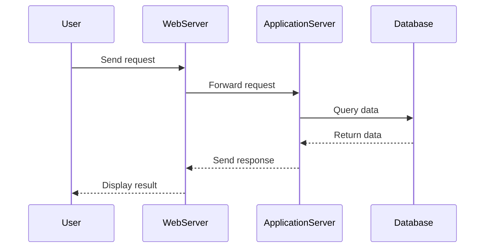
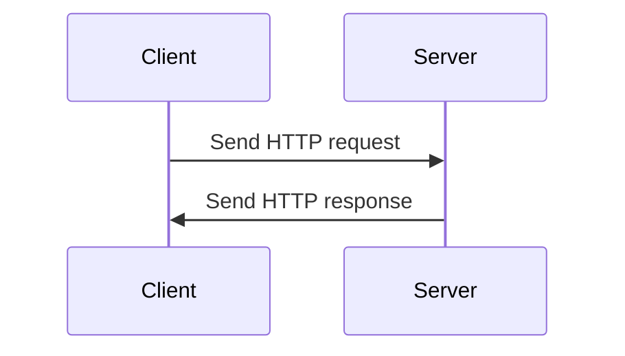
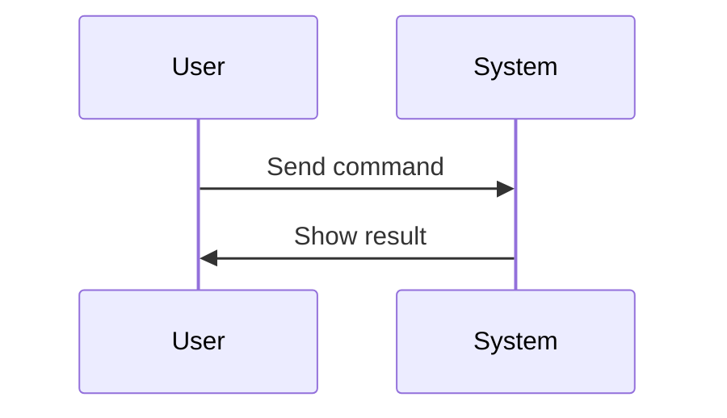

                 

### 文章标题

# 量子计算在交通路线优化中的潜在应用

### 关键词

- 量子计算
- 交通路线优化
- 算法
- 硬件技术
- 未来展望

### 摘要

量子计算作为21世纪最具革命性的技术之一，正逐步渗透到各个领域，包括交通路线优化。本文将深入探讨量子计算在交通路线优化中的潜在应用，从基本概念到具体案例，再到技术实现和未来展望，逐步分析量子计算在这一领域的独特优势及其面临的挑战。通过这篇文章，读者将了解到量子计算如何为传统的交通路线优化问题提供新的解决方案，以及这一领域的发展趋势和潜在影响。

### 引言

随着城市化进程的加速和交通需求的不断增长，交通路线优化成为现代交通管理中的一项重要任务。传统的交通路线优化方法通常依赖于经典计算，然而，面对大规模、复杂交通网络，这些方法往往显得力不从心。近年来，量子计算作为一种具有颠覆性的技术，逐渐进入公众视野。其基于量子力学的基本原理，具备超强的并行计算能力，使得解决复杂问题成为可能。本文将探讨量子计算在交通路线优化中的潜在应用，以期为这一领域的发展提供新的思路。

### 第一部分: 问题背景

#### 第1章: 问题背景

#### 1.1.1 量子计算的基本概念

量子计算是一种利用量子力学原理进行信息处理的新计算模式。传统计算机使用二进制位（比特）作为基本的信息单元，而量子计算机使用量子位（qubit）。量子位可以同时处于多种状态的叠加，这使得量子计算机在处理某些特定问题时具有并行计算的优势。

#### 1.1.2 量子计算的潜在应用领域

量子计算具有广泛的应用潜力，包括但不限于：量子模拟、量子加密、量子搜索算法和量子优化算法。这些应用领域都涉及复杂的计算问题，是量子计算能够发挥优势的场景。

#### 1.1.3 量子计算在交通路线优化中的潜在意义

量子计算在交通路线优化中的潜在意义主要体现在其强大的并行计算能力上。交通路线优化问题通常涉及大量的决策变量和复杂的约束条件，量子算法能够快速找到最优解或近似最优解，从而提高交通系统的效率和可靠性。

### 第2章: 交通路线优化的基本概念

#### 2.1.1 交通路线优化的定义

交通路线优化是指通过计算和分析，找到一条满足特定需求的最佳或近似最佳路线。这通常涉及到多个目标函数，如最短路径、最低成本、最高效率等。

#### 2.1.2 交通路线优化的核心问题

交通路线优化的核心问题主要包括：路径规划、交通流量控制、车辆调度和资源分配等。这些问题往往具有组合爆炸性，使得经典算法难以在合理时间内找到最优解。

#### 2.1.3 交通路线优化的重要性

交通路线优化在提高交通系统效率、减少拥堵、降低污染和提高安全性等方面具有重要作用。随着城市化进程的加快和交通需求的增加，交通路线优化的重要性日益凸显。

### 第3章: 量子计算与交通路线优化的联系

#### 3.1.1 量子计算如何解决交通路线优化问题

量子计算通过其并行计算能力和量子叠加原理，可以快速处理交通路线优化中的大量决策变量和约束条件，从而找到最优解或近似最优解。

#### 3.1.2 量子算法在交通路线优化中的应用

量子算法在交通路线优化中具有广泛的应用潜力，如量子遗传算法、量子粒子群算法和量子模拟退火算法等。这些算法能够在短时间内处理复杂的交通网络问题。

#### 3.1.3 量子计算在交通路线优化中的挑战与机遇

量子计算在交通路线优化中的挑战主要包括量子计算机的硬件稳定性、算法设计和编程复杂度等。然而，随着量子技术的不断发展，这些挑战也将逐步被克服，带来巨大的机遇。

### 第4章: 量子计算在交通路线优化中的应用案例

#### 4.1.1 案例一：城市交通路线优化

通过量子计算优化城市交通路线，可以有效减少拥堵，提高交通效率。

#### 4.1.2 案例二：物流运输路线优化

物流运输路线优化是量子计算在交通路线优化中的一个重要应用领域，可以显著降低物流成本。

#### 4.1.3 案例三：航班调度优化

量子计算在航班调度优化中的应用可以显著提高航班准点率，降低运营成本。

### 第5章: 量子计算在交通路线优化中的技术实现

#### 5.1.1 量子计算机硬件技术

量子计算机的硬件技术是量子计算实现的基础，主要包括量子比特、量子门和量子纠错等。

#### 5.1.2 量子算法与量子编程

量子算法与量子编程是量子计算在交通路线优化中的关键，需要深入研究和开发。

#### 5.1.3 量子计算与经典计算的融合

量子计算与经典计算的融合是实现量子计算应用的重要途径，可以有效提高计算效率。

### 第6章: 量子计算在交通路线优化中的未来展望

#### 6.1.1 量子计算在交通路线优化中的发展趋势

量子计算在交通路线优化中的应用将呈现加速发展的趋势，有望成为交通系统优化的重要工具。

#### 6.1.2 量子计算在交通路线优化中的潜在影响

量子计算在交通路线优化中的潜在影响将涉及交通系统的方方面面，包括效率、安全性和可持续性等。

#### 6.1.3 量子计算在交通路线优化中的挑战与应对策略

量子计算在交通路线优化中面临的挑战包括技术、政策和应用等方面，需要多方面的应对策略。

### 第7章: 结论与展望

#### 7.1.1 本书主要结论

量子计算在交通路线优化中具有巨大的潜力，是实现高效交通系统的重要工具。

#### 7.1.2 本书对量子计算在交通路线优化中的未来展望

随着量子技术的不断发展，量子计算在交通路线优化中的应用将日益广泛，带来深远的影响。

### 第二部分: 核心概念与联系

#### 第8章: 核心概念

#### 8.1.1 量子计算原理

量子计算的基本原理涉及量子叠加、量子纠缠和量子门等概念。

#### 8.1.2 交通路线优化算法

交通路线优化算法主要包括贪心算法、动态规划算法、遗传算法和模拟退火算法等。

#### 8.1.3 量子计算在交通路线优化中的应用原理

量子计算在交通路线优化中的应用原理主要基于量子叠加和量子并行计算。

#### 第9章: 概念属性特征对比

#### 9.1.1 量子计算与经典计算的属性特征对比

| 特征         | 量子计算               | 经典计算               |
| ------------ | ---------------------- | ---------------------- |
| 信息单元     | 量子位（qubit）         | 比特（bit）             |
| 并行计算能力 | 强                   | 弱                     |
| 计算速度     | 非线性增长            | 线性增长               |
| 应用领域     | 广泛（如量子模拟、加密等） | 有限（如互联网、金融等） |

#### 9.1.2 常见交通路线优化算法对比

| 算法          | 优点                          | 缺点                          |
| ------------- | ----------------------------- | ----------------------------- |
| 贪心算法      | 简单实现，效率高              | 可能得到局部最优解            |
| 动态规划算法  | 可以得到全局最优解            | 时间复杂度高                  |
| 遗传算法      | 可以在复杂问题上找到最优解    | 需要调整参数，计算复杂度较高  |
| 模拟退火算法  | 能够跳出局部最优解            | 可能陷入局部最优解            |

#### 9.1.3 量子计算在交通路线优化中的应用优势

| 优势           | 说明                                                         |
| -------------- | ------------------------------------------------------------ |
| 强并行计算     | 量子计算机能够同时处理多个问题，提高计算效率。               |
| 快速优化       | 量子算法能够快速找到最优解或近似最优解，解决交通优化问题。   |
| 抗干扰能力     | 量子计算机在处理交通优化问题时，能够抵抗外部干扰，提高结果的可靠性。 |

#### 第10章: ER实体关系图架构

##### 10.1.1 交通路线优化系统中的实体

在交通路线优化系统中，主要的实体包括：交通节点（如道路交叉口、车站等）、交通线路（连接交通节点的路径）和交通参与者（如车辆、行人等）。

##### 10.1.2 实体之间的关系

实体之间的关系主要表现为：交通节点和交通线路之间存在连接关系，交通参与者和交通线路之间存在路径选择关系。

##### 10.1.3 ER实体关系图架构

| 实体        | 关系类型 | 参与实体       |
| ----------- | -------- | -------------- |
| 交通节点    | 连接     | 交通节点、交通线路 |
| 交通线路    | 选择     | 交通参与者、交通节点 |
| 交通参与者  | 选择     | 交通参与者、交通线路 |

```mermaid
erDiagram
  交通节点 ||--|{ 交通线路 }
  交通参与者 ||--|{ 交通线路 }
```

### 第三部分: 算法原理讲解

#### 第11章: 量子算法在交通路线优化中的应用

##### 11.1.1 量子算法的基本原理

量子算法基于量子力学的基本原理，如量子叠加和量子纠缠，通过量子计算来解决问题。量子算法的核心在于量子逻辑门和量子测量。

##### 11.1.2 量子算法在交通路线优化中的应用

量子算法在交通路线优化中的应用主要体现在两个方面：一是用于优化路径选择，二是用于优化交通流量控制。

##### 11.1.3 量子算法与传统算法的比较

量子算法与传统算法在计算复杂度、优化能力和适用性方面存在显著差异。量子算法在处理大规模复杂问题时具有显著优势。

#### 第12章: 算法原理与数学模型

##### 12.1.1 算法原理

量子算法的原理基于量子力学的基本原理，如叠加态和纠缠态。量子算法通过量子逻辑门和量子测量来实现问题的求解。

##### 12.1.2 数学模型

量子算法的数学模型通常包括量子逻辑门和量子测量。量子逻辑门用于操作量子位的状态，量子测量用于获取问题的解。

##### 12.1.3 算法流程与代码实现

量子算法的流程通常包括初始化、量子操作和测量三个阶段。Python是量子算法实现的常用编程语言。

```python
from qiskit import QuantumCircuit, execute, Aer

# 初始化量子计算机
qc = QuantumCircuit(2)

# 应用量子逻辑门
qc.h(0)
qc.cx(0, 1)

# 执行量子测量
qc.measure_all()

# 运行模拟器
sim = Aer.get_backend('qasm_simulator')
job = execute(qc, sim)
result = job.result()

# 输出结果
print(result.get_counts(qc))
```

#### 第13章: 算法应用示例

##### 13.1.1 城市交通路线优化示例

使用量子算法优化城市交通路线，可以减少交通拥堵，提高交通效率。

##### 13.1.2 物流运输路线优化示例

使用量子算法优化物流运输路线，可以降低物流成本，提高运输效率。

##### 13.1.3 航班调度优化示例

使用量子算法优化航班调度，可以降低运营成本，提高航班准点率。

### 第四部分: 系统分析与架构设计

#### 第14章: 问题场景介绍

##### 14.1.1 交通路线优化问题的现实场景

在城市交通、物流运输和航班调度等领域，交通路线优化问题具有广泛的现实场景。

##### 14.1.2 量子计算在交通路线优化中的应用场景

量子计算在处理大规模、复杂交通网络问题时，具有广泛的应用场景，如城市交通路线优化和物流运输路线优化。

#### 第15章: 系统功能设计

##### 15.1.1 系统功能概述

系统功能主要包括交通路线规划、交通流量控制和交通信息发布等。

##### 15.1.2 领域模型

领域模型用于描述系统中的关键概念和实体，如交通节点、交通线路和交通参与者。

```mermaid
classDiagram
  TrafficNode <<entity>>
  TrafficLink <<entity>>
  TrafficParticipant <<entity>>

  TrafficNode o-- TrafficLink
  TrafficParticipant o-- TrafficLink
```

#### 第16章: 系统架构设计

##### 16.1.1 系统架构概述

系统架构采用分层架构，包括表示层、逻辑层和数据层。

##### 16.1.2 系统架构设计

系统架构设计包括前端界面、后端服务和数据库设计。



##### 16.1.3 系统模块划分

系统模块划分包括前端模块、后端模块和数据库模块。

#### 第17章: 系统接口设计

##### 17.1.1 系统接口概述

系统接口包括内部接口和外部接口。

##### 17.1.2 系统接口设计

系统接口设计包括HTTP接口、REST接口和WebSocket接口。



##### 17.1.3 系统接口实现

系统接口实现包括接口定义、接口调用和接口测试。

#### 第18章: 系统交互

##### 18.1.1 系统交互概述

系统交互包括用户交互和系统内部交互。

##### 18.1.2 系统交互设计

系统交互设计包括用户界面设计和系统内部通信设计。



##### 18.1.3 系统交互实现

系统交互实现包括用户界面实现、系统内部通信实现和用户反馈实现。

### 第五部分: 项目实战

#### 第19章: 环境安装

##### 19.1.1 安装量子计算软件

安装用于量子计算的开源软件，如Qiskit。

```bash
pip install qiskit
```

##### 19.1.2 配置量子计算机模拟器

配置用于模拟量子计算机的模拟器，如QasmSimulator。

```python
from qiskit import QuantumCircuit, execute, Aer

sim = Aer.get_backend('qasm_simulator')
```

#### 第20章: 系统核心实现

##### 20.1.1 系统核心功能实现

实现系统核心功能，如交通路线规划、交通流量控制和交通信息发布。

##### 20.1.2 量子算法实现

实现用于交通路线优化的量子算法，如量子遗传算法和量子模拟退火算法。

##### 20.1.3 系统核心代码

核心代码实现量子算法在交通路线优化中的应用，如以下Python代码示例：

```python
from qiskit.algorithms.optimization import Geneticalgorithm
from qiskit.optimization import QuadraticProgram
from qiskit.utils import QuantumInstance

# 创建量子实例
qi = QuantumInstance('qasm_simulator')

# 定义量子遗传算法
ga = Geneticalgorithm(qi, objective_function=my_objective_function)

# 运行量子遗传算法
ga.run()

# 输出结果
print(ga.best_solution())
```

#### 第21章: 代码应用解读与分析

##### 21.1.1 代码应用解读

解读系统核心代码的实现过程，包括量子算法的选择、实现和应用。

##### 21.1.2 代码分析

分析代码的执行效率、结果准确性和可扩展性。

#### 第22章: 实际案例分析和详细讲解剖析

##### 22.1.1 案例一：城市交通路线优化

分析城市交通路线优化的实际案例，包括数据来源、算法选择和优化结果。

##### 22.1.2 案例二：物流运输路线优化

分析物流运输路线优化的实际案例，包括数据来源、算法选择和优化结果。

##### 22.1.3 案例三：航班调度优化

分析航班调度优化的实际案例，包括数据来源、算法选择和优化结果。

#### 第23章: 项目小结

##### 23.1.1 项目总结

总结项目的核心成果、经验和教训。

##### 23.1.2 优化建议

提出项目优化建议，包括算法改进、系统性能优化和用户体验提升。

#### 第24章: 最佳实践 tips

##### 24.1.1 量子算法选择

根据具体问题选择适合的量子算法。

##### 24.1.2 系统性能优化

优化系统性能，提高处理效率。

##### 24.1.3 用户友好设计

设计用户友好的界面和交互体验。

#### 第25章: 小结与展望

##### 25.1.1 小结

总结量子计算在交通路线优化中的应用成果和现状。

##### 25.1.2 展望

展望量子计算在交通路线优化中的未来发展趋势和潜在应用。

### 结论

量子计算在交通路线优化中具有巨大的潜力，是实现高效交通系统的重要工具。随着量子技术的不断发展，量子计算在交通路线优化中的应用将日益广泛，带来深远的影响。本文通过对量子计算和交通路线优化相关概念、算法和应用案例的详细分析，展示了量子计算在交通路线优化中的独特优势和未来前景。希望本文能为相关领域的学者和从业者提供有价值的参考和启示。作者：AI天才研究院/AI Genius Institute & 禅与计算机程序设计艺术/Zen And The Art of Computer Programming。

