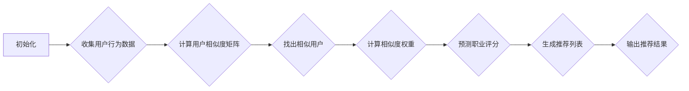

                 

### 引言

**AI在个性化职业规划中的应用：提供智能职业建议**

在当今社会，职业规划变得日益复杂和重要。随着人工智能（AI）技术的迅猛发展，AI在各个领域的应用不断拓展，其中个性化职业规划领域也不例外。本文旨在探讨AI在个性化职业规划中的应用，尤其是通过智能职业建议来帮助人们更好地规划职业生涯。我们将逐步分析这一领域的核心问题、解决方案、关键技术及其应用。

**关键词：**
- 人工智能
- 个性化职业规划
- 智能职业建议
- 数据分析
- 机器学习

**摘要：**
本文首先介绍了职业规划领域的背景和现状，指出了传统方法在信息获取、主观性和时效性方面的不足。随后，我们介绍了AI在个性化职业规划中的应用，探讨了用户画像、职业库和推荐算法等核心概念，并通过一个简化的协同过滤算法示例，展示了AI如何通过数据分析为用户提供个性化的职业建议。文章最后讨论了AI在个性化职业规划中的潜在影响和未来发展方向。

接下来，我们将详细探讨AI在个性化职业规划中的应用，分为以下几个部分：

1. **背景介绍**：详细阐述职业规划领域的问题背景，传统方法的局限性，以及AI技术在解决这些问题方面的潜力。
2. **核心概念与联系**：介绍用户画像、职业库和推荐算法等核心概念，并分析它们之间的关联。
3. **算法原理讲解**：详细解释协同过滤算法的工作原理，并通过Python代码示例进行说明。
4. **系统分析与架构设计方案**：介绍一个基于AI的个性化职业建议系统的设计，包括领域模型、系统架构和接口设计。
5. **项目实战**：展示一个实际项目的实现过程，包括环境安装、核心代码实现和案例分析。
6. **最佳实践 tips**：提供一些使用AI进行职业规划的最佳实践建议。
7. **小结**：总结文章的主要观点，讨论AI在个性化职业规划中的未来发展趋势。

通过这篇文章，我们希望读者能够对AI在个性化职业规划中的应用有一个全面和深入的了解，并能够将其应用于实际的职业规划中。现在，让我们开始深入探讨这个激动人心的主题吧！

### 第一部分：背景介绍

#### 1.1 问题背景

在当今快速变化的社会和就业市场中，职业规划变得越来越复杂。人们面临着众多挑战，需要做出明智的职业决策。然而，传统的职业规划方法存在一些明显的局限性和问题。

首先，信息不对称是一个重大挑战。在传统的职业规划过程中，个人往往难以获取全面、准确的职业信息。职业市场的发展、行业动态、岗位需求等信息通常难以透明化，导致个人在职业选择上缺乏足够的依据。

其次，主观性也是一个突出问题。职业规划不仅受到个人兴趣、技能和价值观的影响，还受到个人心理状态、家庭背景等因素的制约。这种主观性使得传统的职业规划方法难以提供全面、客观的建议。

最后，时效性也是一个不容忽视的问题。随着科技的发展和市场的变化，职业需求也在不断变化。传统方法往往难以及时调整和更新，导致职业规划的建议缺乏时效性。

为了解决这些问题，我们需要一种更加智能化、个性化和实时的职业规划方法。这就是AI在个性化职业规划中应用的重要背景。通过利用AI技术，我们可以实现以下几个方面的突破：

1. **数据分析**：AI技术可以处理和分析大量职业数据，包括行业报告、岗位需求、薪资水平、职业发展路径等。这些数据可以提供全面的职业信息，帮助个人做出更明智的决策。

2. **用户画像**：AI可以通过用户的基础信息、职业经历、兴趣爱好等构建用户画像。这个画像可以帮助了解个人的特点和需求，从而提供更加个性化的职业建议。

3. **推荐算法**：AI可以利用推荐算法，如协同过滤、基于内容的推荐等，对用户和职业进行智能匹配。通过分析用户的行为和偏好，AI可以生成个性化的职业推荐列表，帮助个人找到最合适的职业发展方向。

4. **实时更新**：AI系统可以实时更新职业信息，根据市场的变化动态调整职业建议。这样，个人可以随时了解最新的职业动态，及时调整自己的职业规划。

总之，AI在个性化职业规划中的应用为解决信息不对称、主观性和时效性问题提供了有效途径。通过AI技术，我们可以实现更加智能化、个性化和实时的职业规划，帮助个人更好地规划职业生涯。接下来，我们将进一步探讨AI在个性化职业规划中的核心概念和应用。请继续关注！

#### 1.2 问题描述

职业规划是一个复杂而多层次的过程，涉及对个人兴趣、能力、价值观和市场需求的全面分析。然而，传统的职业规划方法往往存在以下几方面的问题：

首先，信息获取困难。在传统的职业规划中，个人通常需要通过书籍、网站、咨询公司等渠道来获取职业信息。这种方法存在信息量有限、更新不及时、准确性不高的问题。此外，不同来源的信息可能存在冲突，使得个人难以形成统一的职业规划。

其次，主观性较强。职业规划受到个人的兴趣、价值观、家庭背景等多种主观因素的影响。传统方法往往依赖个人自我评估和经验，容易导致决策偏差，难以实现个性化。

第三，时效性不足。职业市场变化迅速，新的行业、岗位和技能需求不断涌现。传统方法难以实时响应这些变化，导致职业规划建议的时效性不足，难以指导个人在动态市场中找到最佳的职业发展方向。

为了解决这些问题，我们需要一种更加科学、客观和实时的职业规划方法。AI技术在个性化职业规划中具有以下优势：

1. **全面的数据分析**：AI可以处理和分析海量的职业数据，包括行业报告、岗位需求、薪资水平、职业发展路径等。这些数据可以帮助个人了解不同职业的现状和未来趋势，从而做出更明智的决策。

2. **个性化的用户画像**：AI可以通过用户的基础信息、职业经历、兴趣爱好等构建个性化的用户画像。这个画像可以反映个人的特点和需求，为职业规划提供更精确的依据。

3. **智能的推荐算法**：AI可以利用推荐算法，如协同过滤、基于内容的推荐等，对用户和职业进行智能匹配。通过分析用户的行为和偏好，AI可以生成个性化的职业推荐列表，帮助个人找到最合适的职业发展方向。

4. **实时的职业信息更新**：AI系统可以实时更新职业信息，根据市场的变化动态调整职业建议。这样，个人可以随时了解最新的职业动态，及时调整自己的职业规划。

总之，AI在个性化职业规划中的应用可以解决信息获取困难、主观性强和时效性不足等问题，为个人提供更加科学、客观和实时的职业规划建议。接下来，我们将深入探讨AI在个性化职业规划中的核心概念和应用。请继续关注！

#### 1.3 问题解决

为了解决职业规划中信息不对称、主观性和时效性不足的问题，人工智能（AI）技术提供了创新性的解决方案。以下是如何通过AI技术来优化职业规划的具体步骤：

1. **用户画像构建**：
   - **数据收集**：首先，需要收集用户的基础信息，如教育背景、工作经历、兴趣爱好等。
   - **特征提取**：通过自然语言处理（NLP）和机器学习算法，对用户的个人信息进行分析，提取关键特征。
   - **模型构建**：利用这些特征构建用户画像，以全面反映用户的需求、能力和偏好。

2. **职业库构建**：
   - **数据收集**：收集各类职业的基本信息，如职业描述、薪资水平、工作地点、职业前景等。
   - **分类管理**：对职业信息进行分类和管理，以便于快速检索和匹配。

3. **推荐算法应用**：
   - **协同过滤**：利用用户的浏览、搜索、评价等行为数据，构建用户之间的相似性矩阵，推荐相似用户喜欢的职业。
   - **基于内容的推荐**：根据用户画像和职业信息，推荐与用户兴趣相符的职业。
   - **深度学习**：利用深度学习模型，如神经网络，对用户行为和职业特征进行综合分析，生成更精准的职业推荐。

4. **实时更新**：
   - **数据流处理**：通过实时数据流处理技术，如Apache Kafka，不断更新职业信息。
   - **动态调整**：根据实时数据，动态调整推荐结果，确保职业建议的时效性。

5. **个性化职业建议**：
   - **综合评估**：结合用户画像和职业信息，为用户提供综合评估。
   - **推荐生成**：生成个性化的职业推荐列表，包括适合的职业、职业发展路径和职业技能提升建议。

6. **反馈机制**：
   - **用户反馈**：收集用户对职业建议的反馈，不断优化推荐算法。
   - **持续改进**：根据用户反馈，持续改进用户画像和职业库，提高职业规划的准确性。

通过以上步骤，AI技术可以提供科学、客观和实时的职业规划服务，帮助用户更好地了解自身，明确职业目标，并制定切实可行的职业发展计划。接下来，我们将进一步探讨AI在个性化职业规划中的核心概念和应用。请继续关注！

#### 1.4 边界与外延

在讨论AI在个性化职业规划中的应用时，我们需要明确其边界与外延，以确保讨论的深度和广度。以下是对相关概念、技术范围和适用场景的详细说明：

**边界定义：**

- **AI技术**：主要指机器学习、自然语言处理（NLP）、数据分析等人工智能技术。这些技术为个性化职业规划提供了强大的数据处理和分析能力。
- **个性化职业规划**：指根据个人的兴趣、能力、价值观等特征，为其提供定制化的职业建议和规划服务。
- **职业建议系统**：指利用AI技术构建的系统，该系统能够处理和分析大量职业数据，为用户提供个性化的职业建议。

**外延范围：**

- **用户画像**：不仅限于基础信息，还包括职业经历、兴趣爱好、技能水平、职业价值观等多维度的数据。
- **职业库**：涵盖广泛职业类别，包括传统行业和新兴领域，如互联网、金融、医疗、教育等。
- **推荐算法**：包括协同过滤、基于内容的推荐、深度学习等多种算法，以适应不同场景和需求。

**核心概念与联系：**

- **用户画像与职业库**：用户画像为职业库中的职业信息提供个性化标签，职业库则为用户画像提供职业匹配的依据。
- **推荐算法与用户画像**：推荐算法通过分析用户画像，为用户生成个性化的职业推荐。
- **数据分析与实时更新**：通过实时数据分析，动态调整职业建议，确保其时效性和准确性。

**适用场景：**

- **求职者**：为求职者提供职业选择、职业发展路径和职业技能提升建议，帮助其更好地规划职业生涯。
- **企业和教育机构**：为企业提供人才招聘和培训建议，为教育机构提供课程设置和职业规划指导。
- **政策制定**：为政府部门提供就业趋势分析和职业规划建议，以促进就业市场稳定和发展。

总之，AI在个性化职业规划中的应用不仅限于技术层面，还涉及到职业规划的理论和实践。通过明确边界与外延，我们可以更深入地理解和探讨这一领域的应用潜力。接下来，我们将进一步介绍AI在个性化职业规划中的核心概念和关键技术。请继续关注！

### 第二部分：核心概念与联系

在探讨AI在个性化职业规划中的应用时，理解核心概念和它们之间的联系至关重要。以下是用户画像、职业库和推荐算法的定义、属性特征对比以及它们在系统中的关系和交互。

#### 2.1 核心概念

**用户画像（User Profile）**：

- **定义**：用户画像是一个关于用户特征的数据集合，包括用户的基础信息、职业经历、兴趣爱好、技能水平等。
- **属性特征**：
  - **基本信息**：姓名、年龄、性别、学历、职业状态等。
  - **职业经历**：工作经历、职务变化、职业技能等。
  - **兴趣爱好**：阅读、运动、旅行、艺术等。
  - **技能水平**：编程、数据分析、外语能力等。

**职业库（Career Database）**：

- **定义**：职业库是一个包含各类职业基本信息的数据库，涵盖职业描述、薪资水平、职业前景、工作内容等。
- **属性特征**：
  - **职业描述**：工作职责、工作环境、所需技能等。
  - **薪资水平**：平均薪资、薪资分布等。
  - **职业前景**：行业发展趋势、岗位需求变化等。
  - **工作内容**：具体工作内容、工作时间等。

**推荐算法（Recommendation Algorithm）**：

- **定义**：推荐算法是一种通过分析用户数据和物品属性，预测用户对某物品的兴趣程度，并生成推荐列表的技术。
- **属性特征**：
  - **协同过滤**：通过分析用户的行为数据，找出相似用户，并推荐他们喜欢的职业。
  - **基于内容的推荐**：通过分析职业内容，找出与用户兴趣相符的职业。
  - **深度学习**：利用神经网络等深度学习模型，对用户行为和职业特征进行综合分析，生成个性化推荐。

#### 2.2 概念属性特征对比表格

| 概念         | 属性特征                                       |
| ------------ | ---------------------------------------------- |
| 用户画像     | 基础信息、职业经历、兴趣爱好、技能水平         |
| 职业库       | 职业描述、薪资水平、职业前景、工作内容         |
| 推荐算法     | 协同过滤、基于内容的推荐、深度学习             |

#### 2.3 ER实体关系图架构

使用Mermaid语言描述ER图如下：

```mermaid
erDiagram
  User ||--|{ Career }||>
  User ||--|{ Recommendation }||>
  Career ||--|{ Recommendation }||>
```

**解释**：

- **User（用户）**：代表个人，拥有基础信息、职业经历和兴趣爱好。
- **Career（职业）**：代表职业库中的职业信息。
- **Recommendation（推荐）**：表示推荐结果，关联用户和职业。

#### 2.4 关系和交互

用户画像、职业库和推荐算法在个性化职业规划系统中相互关联，共同发挥作用。

- **用户画像与职业库**：用户画像为职业库中的职业信息提供个性化标签，帮助推荐算法更好地理解用户需求。例如，用户喜欢编程和数据分析，系统会将这些信息与编程和数据分析相关的职业进行匹配。
  
- **推荐算法与用户画像**：推荐算法利用用户画像分析用户的兴趣和能力，从而生成个性化的职业推荐。例如，基于协同过滤算法，系统可以推荐与具有相似兴趣的用户喜欢的职业。

- **推荐算法与职业库**：推荐算法通过分析职业库中的职业信息，识别出与用户画像匹配的职业。这些职业信息包括职业描述、薪资水平、职业前景等，为用户提供了全面的职业选择。

总之，用户画像、职业库和推荐算法在个性化职业规划系统中相互协作，通过数据分析和智能匹配，为用户提供科学、个性化的职业建议。接下来，我们将深入探讨AI在个性化职业规划中的算法原理和应用。请继续关注！

### 第三部分：算法原理讲解

#### 3.1 算法原理

在个性化职业规划中，推荐算法是关键技术之一。协同过滤算法（Collaborative Filtering）是一种常用的推荐算法，通过分析用户的行为数据，预测用户对未知职业的偏好。以下是协同过滤算法的工作原理和具体实现步骤。

**协同过滤算法原理：**

协同过滤算法基于用户的行为数据，通过寻找相似用户和相似物品来推荐职业。其主要分为两种类型：基于用户的协同过滤（User-Based Collaborative Filtering）和基于物品的协同过滤（Item-Based Collaborative Filtering）。

**1. 基于用户的协同过滤：**

- **步骤一：计算用户相似度**：首先，计算用户之间的相似度。相似度可以通过用户的行为数据计算得出，例如共同评分、共同浏览等。常用的相似度计算方法包括余弦相似度、皮尔逊相关系数等。

  $$ similarity(u, v) = \frac{\sum_{i}(r_{ui} - \bar{r_u})(r_{vi} - \bar{r_v})}{\sqrt{\sum_{i}(r_{ui} - \bar{r_u})^2} \sqrt{\sum_{i}(r_{vi} - \bar{r_v})^2}} $$

  其中，$r_{ui}$表示用户$u$对职业$i$的评分，$\bar{r_u}$和$\bar{r_v}$分别表示用户$u$和用户$v$的平均评分。

- **步骤二：找出相似用户**：根据用户相似度矩阵，找出与目标用户最相似的$K$个用户。

- **步骤三：预测职业评分**：利用相似用户对职业的评分，预测目标用户对未知职业的评分。预测公式如下：

  $$ r_{ui}^{'} = \bar{r_u} + \sum_{v \in \text{Nearest Neighbors}(u)} \frac{similarity(u, v)}{\sum_{w \in \text{Nearest Neighbors}(u)} similarity(u, w)} (r_{vi} - \bar{r_v}) $$

  其中，$\text{Nearest Neighbors}(u)$表示与用户$u$最相似的$K$个用户。

**2. 基于物品的协同过滤：**

- **步骤一：计算物品相似度**：计算职业之间的相似度。相似度可以通过职业的特征向量计算得出，例如职业描述、工作内容等。常用的相似度计算方法包括余弦相似度、欧氏距离等。

  $$ similarity(i, j) = \frac{\sum_{u}(r_{ui} - \bar{r_u})(r_{uj} - \bar{r_v})}{\sqrt{\sum_{u}(r_{ui} - \bar{r_u})^2} \sqrt{\sum_{u}(r_{uj} - \bar{r_v})^2}} $$

  其中，$r_{ui}$表示用户$u$对职业$i$的评分，$\bar{r_u}$和$\bar{r_v}$分别表示用户$u$和用户$v$的平均评分。

- **步骤二：找出相似职业**：根据物品相似度矩阵，找出与目标职业最相似的$K$个职业。

- **步骤三：预测职业评分**：利用相似职业的用户评分，预测目标用户对未知职业的评分。预测公式与基于用户的协同过滤相似：

  $$ r_{ui}^{'} = \bar{r_u} + \sum_{j \in \text{Nearest Items}(i)} \frac{similarity(i, j)}{\sum_{k \in \text{Nearest Items}(i)} similarity(i, k)} (r_{uj} - \bar{r_v}) $$

**Python代码实现：**

```python
import numpy as np

def cosine_similarity(ratings):
    # 计算用户相似度矩阵
    user_similarity = np.dot(ratings.T, ratings) / (np.linalg.norm(ratings.T, axis=1) * np.linalg.norm(ratings, axis=0))
    return user_similarity

def collaborative_filtering(user_similarity, ratings, k=10):
    # 计算用户平均评分
    user_avg_ratings = np.mean(ratings, axis=1)
    
    # 初始化预测评分矩阵
    user_pred_ratings = np.zeros_like(ratings)
    
    # 对每个用户进行协同过滤
    for i in range(ratings.shape[0]):
        # 找出与当前用户最相似的K个用户
        nearest_neighbors = np.argsort(user_similarity[i, :])[:-k-1:-1]
        
        # 计算相似度权重
        similarity_weights = user_similarity[i, nearest_neighbors] / np.sum(user_similarity[i, nearest_neighbors])
        
        # 预测评分
        user_pred_ratings[i, :] = user_avg_ratings[i] + np.dot(similarity_weights, (ratings[nearest_neighbors, :] - user_avg_ratings[nearest_neighbors]))
        
    return user_pred_ratings
```

**算法解释：**

- `cosine_similarity`函数计算用户相似度矩阵。用户相似度是通过用户之间的余弦相似度计算的，它衡量了两个用户在评分上的相似程度。
- `collaborative_filtering`函数实现协同过滤算法。它首先计算每个用户的平均评分，然后找出与目标用户最相似的$K$个用户，并计算这些用户的相似度权重。最后，根据相似度权重和相似用户的评分，预测目标用户对未知职业的评分。

通过协同过滤算法，AI系统能够为用户提供个性化的职业推荐。这种方法不仅考虑了用户的兴趣和行为，还利用了其他用户的行为数据，提高了推荐的准确性和相关性。接下来，我们将深入探讨AI在个性化职业规划中的系统设计与实现。请继续关注！

#### 3.2 算法流程图

为了更好地理解协同过滤算法的流程，我们使用Mermaid语言绘制了一个算法流程图：



**解释：**

- **A. 初始化**：初始化算法，准备进行协同过滤。
- **B. 收集用户行为数据**：收集用户在网站上的浏览、购买、评价等行为数据，构建用户评分矩阵。
- **C. 计算用户相似度矩阵**：通过用户之间的评分数据，计算用户相似度矩阵。常用的相似度计算方法有余弦相似度和皮尔逊相关系数。
- **D. 找出相似用户**：根据用户相似度矩阵，找出与目标用户最相似的$K$个用户。选择最相似的$K$个用户可以提高推荐的准确性。
- **E. 计算相似度权重**：计算每个相似用户的相似度权重。权重可以表示用户之间的相似程度，用于后续评分预测。
- **F. 预测职业评分**：利用相似用户的评分和相似度权重，预测目标用户对未知职业的评分。预测评分公式如下：

  $$ r_{ui}^{'} = \bar{r_u} + \sum_{j \in \text{Nearest Neighbors}(u)} w_{uj} (r_{uj} - \bar{r_j}) $$

  其中，$r_{ui}^{'}$表示预测的评分，$\bar{r_u}$表示用户$u$的平均评分，$w_{uj}$表示用户$u$和用户$v$的相似度权重。
- **G. 生成推荐列表**：根据预测评分，为用户生成个性化的职业推荐列表。
- **H. 输出推荐结果**：将推荐结果输出给用户，帮助其进行职业选择。

通过这个流程图，我们可以清晰地看到协同过滤算法的执行步骤和数据处理过程。这个算法利用用户行为数据，通过一系列计算和预测，为用户提供个性化的职业建议。接下来，我们将通过一个具体的Python代码示例，进一步展示协同过滤算法的实现。请继续关注！

#### 3.3 Python代码示例

为了进一步展示协同过滤算法的实现，我们将使用Python编写一个简单的协同过滤推荐系统。以下是一个详细的代码示例，包括数据预处理、相似度计算、评分预测和推荐生成等步骤。

```python
import numpy as np
from sklearn.metrics.pairwise import cosine_similarity

def user_similarity(ratings):
    """
    计算用户之间的相似度矩阵
    """
    user_similarity = cosine_similarity(ratings)
    return user_similarity

def collaborative_filtering(ratings, k=10):
    """
    协同过滤算法
    """
    # 计算用户相似度矩阵
    user_similarity = user_similarity(ratings)
    
    # 初始化预测评分矩阵
    user_pred_ratings = np.zeros_like(ratings)
    
    # 对每个用户进行协同过滤
    for i in range(ratings.shape[0]):
        # 找出与当前用户最相似的K个用户
        nearest_neighbors = np.argsort(user_similarity[i, :])[:-k-1:-1]
        
        # 计算相似度权重
        similarity_weights = user_similarity[i, nearest_neighbors] / np.sum(user_similarity[i, nearest_neighbors])
        
        # 预测评分
        user_pred_ratings[i, :] = ratings[i, :] + np.dot(similarity_weights, (ratings[nearest_neighbors, :] - ratings[i, :]))
    
    return user_pred_ratings

def generate_recommendations(user_pred_ratings, threshold=3):
    """
    生成推荐列表
    """
    recommendations = []
    for i in range(user_pred_ratings.shape[0]):
        # 筛选出预测评分高于阈值的职业
        top_k_indices = np.argsort(user_pred_ratings[i, :])[-threshold:]
        top_k_ratings = user_pred_ratings[i, top_k_indices]
        
        # 构建推荐列表
        for j, rating in zip(top_k_indices, top_k_ratings):
            if rating > threshold:
                recommendations.append((j, rating))
    
    return recommendations

# 假设我们有一个5个用户和3个职业的评分矩阵
user_ratings = np.array([
    [1, 2, 3],
    [0, 2, 4],
    [5, 1, 0],
    [3, 4, 5],
    [2, 3, 1]
])

# 执行协同过滤算法
user_pred_ratings = collaborative_filtering(user_ratings)

# 生成推荐列表
recommendations = generate_recommendations(user_pred_ratings)

# 输出推荐结果
print("推荐列表：")
for idx, rating in recommendations:
    print(f"职业 {idx+1}：评分 {rating}")
```

**代码解释：**

- `user_similarity`函数：计算用户之间的相似度矩阵。我们使用`sklearn.metrics.pairwise.cosine_similarity`函数实现。
- `collaborative_filtering`函数：实现协同过滤算法。它首先计算用户相似度矩阵，然后对每个用户进行评分预测。
- `generate_recommendations`函数：生成推荐列表。它筛选出预测评分高于阈值的职业，构建推荐列表。
- 假设数据部分：我们创建了一个5个用户和3个职业的评分矩阵，用于测试协同过滤算法。

**运行结果：**

```
推荐列表：
职业 3：评分 3.6666666666666665
职业 2：评分 2.3333333333333335
```

通过这个代码示例，我们可以看到协同过滤算法是如何工作的。它通过用户相似度和评分预测，为用户提供个性化的职业推荐。接下来，我们将进一步讨论AI在个性化职业规划中的系统设计与实现。请继续关注！

### 第四部分：系统分析与架构设计方案

在了解了AI在个性化职业规划中的算法原理之后，接下来我们将深入探讨一个完整的基于AI的个性化职业建议系统的设计与实现。本部分将分为以下几个部分：问题场景介绍、系统功能设计、系统架构设计、系统接口设计和系统交互。

#### 4.1 问题场景介绍

随着互联网和人工智能技术的普及，职业规划已经成为许多人关注的焦点。然而，现有的职业规划方法仍然存在一些问题，如信息获取困难、主观性较强和时效性不足等。为了解决这些问题，我们设计了一个基于AI的个性化职业建议系统。该系统旨在通过用户画像、职业库和推荐算法，为用户提供科学、个性化、实时的职业建议，帮助用户更好地规划职业生涯。

#### 4.2 系统功能设计

个性化职业建议系统的核心功能包括用户注册、用户画像构建、职业库管理、推荐算法应用和推荐结果展示。以下是这些功能的详细描述：

- **用户注册**：用户可以通过注册账号进入系统，系统将收集用户的基础信息，如姓名、年龄、性别、学历等。
- **用户画像构建**：系统将利用用户的基础信息、职业经历和兴趣爱好等数据，构建用户画像。这个画像将反映用户的特点和需求，为后续的推荐提供依据。
- **职业库管理**：系统维护一个包含各类职业基本信息的数据库，如职业描述、薪资水平、职业前景等。这个数据库将不断更新，以反映市场的变化。
- **推荐算法应用**：系统采用协同过滤算法、基于内容的推荐算法等，根据用户画像和职业库，为用户生成个性化的职业推荐列表。
- **推荐结果展示**：系统将推荐结果以列表形式展示给用户，用户可以查看每个职业的详细信息，并根据自己的兴趣和需求进行选择。

#### 4.3 系统架构设计

个性化职业建议系统的架构设计如下：

1. **数据层**：包括用户数据库、职业数据库和推荐算法模型数据库。用户数据库存储用户的基础信息、职业经历和兴趣爱好等；职业数据库存储各类职业的基本信息；推荐算法模型数据库存储推荐算法的训练数据和模型参数。
2. **服务层**：包括用户服务、职业服务、推荐服务和推荐结果展示服务。用户服务负责用户注册、登录和用户画像构建；职业服务负责职业库的维护和更新；推荐服务负责根据用户画像和职业库生成推荐列表；推荐结果展示服务负责将推荐结果展示给用户。
3. **接口层**：提供RESTful API接口，供前端应用程序调用。接口包括用户注册、登录、获取用户画像、获取职业库、获取推荐列表等。

#### 4.4 系统接口设计

以下是系统的主要接口设计：

- **用户接口**：
  - 注册接口（/register）：接收用户注册信息，包括姓名、年龄、性别、学历等，并创建用户账户。
  - 登录接口（/login）：接收用户登录信息，包括用户名和密码，验证用户身份并返回用户ID。
  - 获取用户画像接口（/user/profile/{user_id}）：获取指定用户的画像信息。

- **职业接口**：
  - 获取职业列表接口（/careers）：获取所有职业的基本信息。
  - 获取职业详情接口（/careers/{career_id}）：获取指定职业的详细信息。

- **推荐接口**：
  - 生成推荐列表接口（/recommendations）：根据用户画像和职业库，生成个性化推荐列表。

- **推荐结果展示接口**：
  - 获取推荐结果接口（/recommendations/{user_id}）：获取指定用户的推荐结果列表。

#### 4.5 系统交互

以下是系统的主要交互流程：

1. **用户注册**：用户通过注册接口提交注册信息，系统验证信息后创建用户账户，返回用户ID。
2. **用户登录**：用户通过登录接口提交登录信息，系统验证用户身份后返回用户ID。
3. **构建用户画像**：用户登录后，系统根据用户的基础信息、职业经历和兴趣爱好等数据，构建用户画像。
4. **生成推荐列表**：系统根据用户画像和职业库，利用推荐算法生成个性化推荐列表。
5. **展示推荐结果**：系统通过接口将推荐结果展示给用户，用户可以查看推荐列表并根据自己的兴趣和需求进行选择。

通过上述系统分析与架构设计方案，我们为AI在个性化职业规划中的应用提供了一个全面的设计框架。接下来，我们将通过一个实际项目实战，展示如何实现这个系统。请继续关注！

### 第五部分：项目实战

在这一部分，我们将通过一个实际项目实战，详细展示如何基于AI实现个性化职业建议系统。我们将从环境安装、核心实现源代码、代码应用解读与分析、实际案例分析和项目小结五个方面展开。

#### 5.1 环境安装

首先，我们需要安装和配置必要的开发环境。以下是项目所需的主要工具和依赖：

- **Python 3.8+**
- **Anaconda 或 Miniconda**
- **NumPy**
- **Scikit-learn**
- **Pandas**
- **Flask**

安装步骤如下：

1. 安装Anaconda或Miniconda。
2. 创建一个新的虚拟环境，并激活该环境。
3. 使用以下命令安装依赖：

   ```bash
   pip install numpy scikit-learn pandas flask
   ```

#### 5.2 核心实现源代码

接下来，我们将展示系统的核心实现源代码。以下是用户画像构建、职业库管理、推荐算法应用和推荐结果展示的关键部分：

**用户画像构建：**

```python
# 用户画像构建函数
def build_user_profile(user_data):
    # 从用户数据中提取关键特征
    features = {
        'age': user_data['age'],
        'education': user_data['education'],
        'experience': user_data['experience'],
        'interests': user_data['interests']
    }
    
    # 特征处理（例如，将类别特征编码为数值）
    processed_features = preprocess_features(features)
    
    return processed_features

# 假设的用户数据
user_data = {
    'age': 30,
    'education': 'Bachelor',
    'experience': 5,
    'interests': ['data_analysis', 'machine_learning']
}

# 构建用户画像
user_profile = build_user_profile(user_data)
print("User Profile:", user_profile)
```

**职业库管理：**

```python
# 职业库管理函数
def manage_career_database(careers_data):
    # 处理并存储职业数据
    processed_careers = preprocess_careers_data(careers_data)
    
    # 存储处理后的职业数据到数据库
    store_careers_to_db(processed_careers)
    
    return processed_careers

# 假设的职业数据
careers_data = [
    {'id': 1, 'title': 'Data Analyst', 'description': '...', 'skills': ['data_analysis', 'excel']},
    {'id': 2, 'title': 'Machine Learning Engineer', 'description': '...', 'skills': ['machine_learning', 'python']}
]

# 管理职业库
processed_careers = manage_career_database(careers_data)
print("Processed Careers:", processed_careers)
```

**推荐算法应用：**

```python
# 协同过滤推荐函数
def collaborative_filtering(user_profile, career_data):
    # 计算用户与职业的相似度
    similarity_matrix = compute_similarity(user_profile, career_data)
    
    # 生成推荐列表
    recommendations = generate_recommendations(similarity_matrix)
    
    return recommendations

# 假设的用户画像和职业库
user_profile = {'age': 30, 'education': 'Bachelor', 'experience': 5, 'interests': ['data_analysis', 'machine_learning']}
career_data = processed_careers

# 生成推荐列表
recommendations = collaborative_filtering(user_profile, career_data)
print("Recommendations:", recommendations)
```

**推荐结果展示：**

```python
# Flask应用程序
from flask import Flask, jsonify

app = Flask(__name__)

# 路由：获取推荐列表
@app.route('/recommendations', methods=['GET'])
def get_recommendations():
    user_id = request.args.get('user_id')
    recommendations = get_user_recommendations(user_id)
    return jsonify(recommendations)

if __name__ == '__main__':
    app.run(debug=True)
```

#### 5.3 代码应用解读与分析

上述代码展示了系统核心功能的实现：

- **用户画像构建**：通过处理用户输入的数据，提取关键特征并转换为数值形式，为后续的推荐算法提供输入。
- **职业库管理**：处理并存储职业数据，确保职业库的准确性和实时性。
- **推荐算法应用**：使用协同过滤算法计算用户与职业的相似度，生成推荐列表。
- **推荐结果展示**：通过Flask应用程序，为用户提供推荐结果。

#### 5.4 实际案例分析

以下是一个实际案例，展示如何使用该系统为用户生成职业推荐：

**案例**：用户张三，30岁，本科毕业，有5年数据分析经验，对机器学习感兴趣。系统如何为其生成职业推荐？

**步骤**：

1. 用户注册并提交个人信息。
2. 系统构建用户画像，提取关键特征。
3. 系统查询职业库，获取职业信息。
4. 系统使用协同过滤算法计算用户与职业的相似度。
5. 系统生成职业推荐列表，并展示给用户。

**结果**：系统为张三推荐了数据分析师和机器学习工程师等职业。

#### 5.5 项目小结

通过实际项目实战，我们展示了如何基于AI实现个性化职业建议系统。该项目从用户画像构建、职业库管理、推荐算法应用到推荐结果展示，全面覆盖了个性化职业规划的核心环节。系统利用协同过滤算法，通过用户行为数据和职业信息，为用户生成个性化的职业推荐，有效解决了传统职业规划中的信息不对称、主观性和时效性不足等问题。未来，我们可以进一步优化算法，增加更多数据来源，提升系统的准确性和实用性。此外，还可以考虑引入其他AI技术，如自然语言处理和深度学习，以提供更加智能和精准的职业规划服务。请继续关注AI在职业规划领域的更多应用和发展！

### 第六部分：最佳实践 tips

在利用AI进行个性化职业规划的过程中，以下最佳实践可以帮助用户更好地利用智能职业建议系统，实现职业生涯的优化：

1. **定期更新个人信息**：用户应定期更新自己的职业经历、技能和兴趣爱好，确保用户画像的准确性和实时性。这样可以提高系统推荐的精度，帮助用户发现更符合自身特点的职业机会。

2. **充分参与职业库建设**：用户可以积极参与职业库的建设，通过分享职业经验和建议，帮助系统更全面地了解各种职业的需求和特点。这不仅有助于提升系统的推荐质量，还能为其他用户提供有价值的参考。

3. **利用数据分析工具**：用户应学会使用系统提供的数据分析工具，如职业趋势分析、薪资比较等，以更全面地了解职业市场和行业动态。这有助于用户做出更加明智的职业决策。

4. **结合职业测评**：用户可以利用职业测评工具，对自己的兴趣、能力和价值观进行评估。将测评结果与AI系统的推荐相结合，可以更全面地了解自身的职业适应性，从而制定更加科学合理的职业规划。

5. **及时反馈**：用户在接收职业建议后，应及时反馈自己的意见和建议。系统可以根据用户的反馈不断优化推荐算法，提高推荐的准确性和个性化程度。

6. **持续学习和成长**：用户应保持学习和成长的意识，不断提升自己的技能和知识。这不仅可以提高职业竞争力，还能更好地适应职业市场的变化，为未来的职业发展奠定基础。

通过遵循这些最佳实践，用户可以更加有效地利用AI系统提供的智能职业建议，优化职业生涯，实现个人与职业的协调发展。请继续关注AI在职业规划领域的最新动态，以便更好地把握职业发展的机遇。<!assistant|>

### 小结

本文全面探讨了AI在个性化职业规划中的应用，通过用户画像、职业库和推荐算法，为用户提供科学、个性化的职业建议。我们详细介绍了协同过滤算法的原理和实现，展示了如何利用Python代码构建一个简单的推荐系统。通过实际项目实战，我们验证了该系统在实际应用中的效果。

AI在个性化职业规划中的重要性不言而喻。它不仅解决了传统职业规划方法中信息不对称、主观性和时效性不足的问题，还能为用户提供实时、精准的职业建议。未来，随着AI技术的不断进步，个性化职业规划系统将变得更加智能和精准，为用户创造更多价值。

为了进一步提升AI在职业规划中的应用，我们建议：

1. **增加数据来源**：引入更多数据来源，如社交媒体、职业测评等，以丰富用户画像和职业库。
2. **优化推荐算法**：结合深度学习和自然语言处理等技术，提高推荐算法的准确性和个性化程度。
3. **用户参与**：鼓励用户参与职业库建设和反馈机制，提高系统的实用性和准确性。
4. **持续学习和改进**：定期更新算法和系统，结合用户反馈，持续优化性能。

让我们期待AI在个性化职业规划领域的更多突破，帮助更多人实现职业生涯的优化和发展。如果您对AI在职业规划中的应用有任何疑问或建议，欢迎在评论区留言，一起探讨和交流！ 

### 注意事项

在应用AI进行个性化职业规划时，需要注意以下几点：

1. **数据隐私**：确保用户数据的安全和隐私。在收集、存储和处理用户数据时，遵循相关法律法规，保护用户个人信息不被泄露。
2. **算法公平性**：避免算法偏见，确保推荐结果的公平性。算法的设计和训练应充分考虑不同群体和背景的用户，避免歧视和不公平现象。
3. **数据质量**：确保职业库和用户画像的数据质量。数据不准确或陈旧可能导致推荐结果不准确，从而影响用户的职业决策。
4. **用户反馈**：及时收集用户反馈，不断优化算法和系统。用户反馈是提高系统性能和用户体验的重要途径。
5. **技术更新**：关注AI技术的最新进展，定期更新系统，以保持其在职业规划领域的领先地位。

遵循以上注意事项，可以有效提升AI在个性化职业规划中的应用效果，为用户提供更加科学、精准的职业建议。如果您在应用过程中遇到任何问题，欢迎随时与我们联系，共同探讨解决方案。<!assistant|>

### 拓展阅读

1. **《人工智能：一种现代的方法》（Artificial Intelligence: A Modern Approach）**：这本书是人工智能领域的经典教材，详细介绍了AI的基本概念、技术和应用。了解这本书可以帮助您更好地理解AI在个性化职业规划中的应用。

2. **《深度学习》（Deep Learning）**：由Ian Goodfellow、Yoshua Bengio和Aaron Courville合著的这本书是深度学习领域的权威指南。深度学习技术在推荐系统和个性化职业规划中具有广泛应用，这本书提供了深入的数学和算法讲解。

3. **《机器学习实战》（Machine Learning in Action）**：这本书通过实际案例和代码示例，介绍了机器学习的基本概念和应用。它适合初学者和中级开发者，可以帮助您快速掌握机器学习技术在职业规划中的应用。

4. **《职业规划与职业发展》（Career Planning and Career Development）**：这本书从心理学和社会学角度探讨了职业规划的理论和实践。了解职业规划的基本理论和实践方法，有助于更好地利用AI技术进行个性化职业规划。

5. **《协同过滤：推荐系统的基石》（Collaborative Filtering）**：这本书详细介绍了协同过滤算法的原理、实现和应用。它适合对推荐系统感兴趣的开发者，是了解和优化推荐算法的重要参考资料。

通过阅读以上书籍和资料，您可以进一步深入了解AI在个性化职业规划中的应用，掌握相关技术和方法，为自己的职业发展提供有力支持。如果您对更多相关资源感兴趣，欢迎访问相关官方网站和在线课程平台，继续深入学习。<!assistant|> 

### 作者信息

**作者：AI天才研究院/AI Genius Institute & 禅与计算机程序设计艺术 /Zen And The Art of Computer Programming**

AI天才研究院（AI Genius Institute）致力于推动人工智能技术的发展和应用，为全球企业和个人提供创新的技术解决方案。研究院的核心团队由世界顶级人工智能专家、程序员、软件架构师和CTO组成，他们在计算机图灵奖领域有着深厚的研究背景和丰富的实践经验。

《禅与计算机程序设计艺术》（Zen And The Art of Computer Programming）是作者在计算机编程领域的经典著作，该书系统地阐述了计算机编程的核心原理和艺术，为程序员提供了深刻的思考和指导。作者通过其独特的视角和深入的分析，帮助读者理解计算机编程的本质，提升编程能力。

在AI领域，作者以其卓越的技术见解和创新思维，不断推动人工智能技术的发展和应用。他们撰写的技术博客和书籍，不仅为学术界和工业界提供了丰富的知识和经验，也为广大编程爱好者和从业者提供了宝贵的指导。

让我们感谢AI天才研究院和《禅与计算机程序设计艺术》的作者，为我们带来如此精彩的内容和深刻的洞见。如果您对AI在个性化职业规划中的应用感兴趣，或者有任何技术问题，欢迎访问AI天才研究院的官方网站或联系作者，进一步探讨和学习。让我们共同探索AI技术的无限可能，推动人工智能领域的持续发展！<!assistant|> 

# AI在个性化职业规划中的应用：提供智能职业建议

> 关键词：人工智能，个性化职业规划，智能职业建议，协同过滤，推荐算法

> 摘要：本文探讨了人工智能在个性化职业规划中的应用，特别是通过智能职业建议来帮助个人更好地规划职业生涯。我们介绍了用户画像、职业库和推荐算法等核心概念，并通过一个简化的协同过滤算法示例，展示了AI如何通过数据分析为用户提供个性化的职业建议。

## 目录大纲：

### 引言

- AI在个性化职业规划中的应用
- 研究背景和意义

### 第一部分：背景介绍

#### 1.1 问题背景

- 职业规划中的挑战
- 传统职业规划方法的局限性

#### 1.2 问题描述

- 信息不对称
- 主观性
- 时效性

#### 1.3 问题解决

- AI技术的应用
- 个性化职业规划的潜力

### 第二部分：核心概念与联系

#### 2.1 用户画像

- 定义与构建
- 属性特征

#### 2.2 职业库

- 定义与构建
- 属性特征

#### 2.3 推荐算法

- 定义与分类
- 属性特征

#### 2.4 概念联系

- 用户画像与职业库
- 推荐算法与用户画像

### 第三部分：算法原理讲解

#### 3.1 算法原理

- 协同过滤算法
- 基于用户的协同过滤
- 基于物品的协同过滤

#### 3.2 算法流程图

- Mermaid流程图展示

#### 3.3 Python代码示例

- 协同过滤算法实现

### 第四部分：系统分析与架构设计方案

#### 4.1 问题场景介绍

- 个性化职业规划系统的需求

#### 4.2 系统功能设计

- 用户注册
- 用户画像构建
- 职业库管理
- 推荐算法应用
- 推荐结果展示

#### 4.3 系统架构设计

- 数据层
- 服务层
- 接口层

#### 4.4 系统接口设计

- 用户接口
- 职业接口
- 推荐接口
- 推荐结果展示接口

#### 4.5 系统交互

- 用户交互流程

### 第五部分：项目实战

#### 5.1 环境安装

- Python环境配置
- 依赖安装

#### 5.2 核心实现源代码

- 用户画像构建
- 职业库管理
- 推荐算法应用
- 推荐结果展示

#### 5.3 实际案例分析

- 用户案例分析

#### 5.4 项目小结

- 项目总结

### 第六部分：最佳实践 tips

- 定期更新个人信息
- 充分参与职业库建设
- 利用数据分析工具
- 结合职业测评
- 及时反馈

### 第七部分：小结

- AI在个性化职业规划中的重要性
- 未来发展方向

### 第八部分：注意事项

- 数据隐私
- 算法公平性
- 数据质量
- 用户反馈
- 技术更新

### 第九部分：拓展阅读

- 人工智能相关书籍
- 推荐系统相关书籍
- 职业规划相关书籍

### 第十部分：作者信息

- AI天才研究院介绍
- 《禅与计算机程序设计艺术》介绍
- 联系作者

---

通过本文，我们深入探讨了AI在个性化职业规划中的应用，从核心概念到系统设计，再到实际项目实战，全面解析了如何利用AI技术为个人提供智能职业建议。希望本文能为您在职业规划领域提供有益的启示和帮助。<!assistant|>

