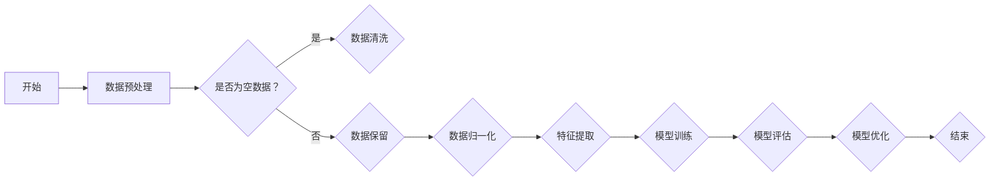
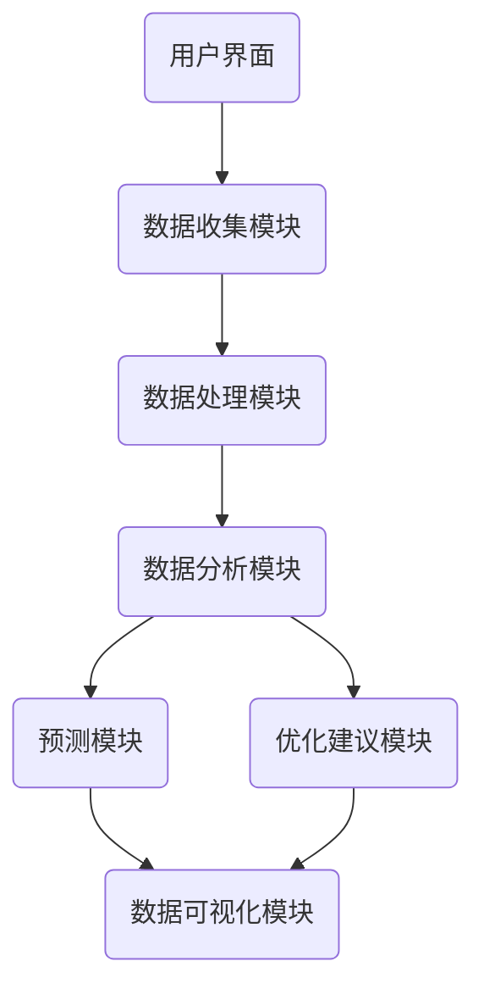
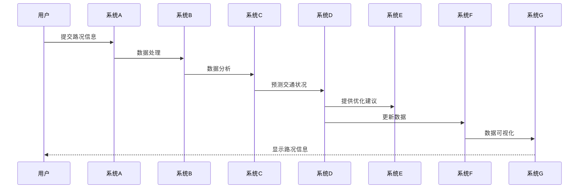

                 

# 后工业时代的城乡融合：新型城镇化的探索

## 关键词
- 后工业时代
- 城乡融合
- 新型城镇化
- 城镇化进程
- 政策体系

## 摘要
本文旨在探讨后工业时代城乡融合的必要性及其在新型城镇化进程中的重要作用。通过对后工业时代背景的分析，城乡融合理论基础的梳理，国内外典型案例的总结，以及政策体系的评价，本文提出了一系列可行的城乡融合与新型城镇化发展路径，并展望了其未来发展。

## 引言

### 1.1 城乡融合的概念与重要性

城乡融合，即指在城乡之间实现资源共享、要素流动、产业互动和利益共享的一种发展模式。在城乡融合的过程中，农业与工业、农村与城市相互促进，形成一种共生共荣的城乡发展格局。

后工业时代，即指工业社会向信息社会转变的时期，其特征是服务业和信息技术业的发展成为主导产业，制造业地位逐渐下降。在这个阶段，城市化进程加速，城乡差距问题日益凸显，城乡融合成为一种必然趋势。

城乡融合的重要性体现在以下几个方面：

1. **促进经济结构优化**：城乡融合有助于优化资源配置，促进产业转型升级，提高整体经济效率。
2. **缩小城乡差距**：城乡融合有助于缩小城乡收入差距，提高农村居民生活水平，促进社会公平。
3. **实现可持续发展**：城乡融合有利于保护生态环境，实现经济、社会、生态的协调发展。

### 1.2 后工业时代与新型城镇化的关系

后工业时代背景下，新型城镇化成为实现城乡融合的重要途径。新型城镇化强调以人为本，注重提升城镇化质量，推动城乡一体化发展。其主要特征包括：

1. **集约发展**：新型城镇化强调土地节约利用，实现城镇空间的紧凑布局。
2. **绿色低碳**：新型城镇化注重绿色发展，倡导低碳生活，减少环境污染。
3. **智慧城市**：新型城镇化利用信息技术，提升城市治理水平和居民生活质量。

### 1.3 本书结构安排与内容概览

本书分为八个章节，具体内容如下：

- **第1章 引言**：阐述城乡融合的概念与重要性，以及后工业时代与新型城镇化的关系。
- **第2章 后工业时代的背景分析**：分析后工业时代的特征及其对城乡关系和城镇化进程的影响。
- **第3章 城乡融合的理论基础**：介绍城乡融合的理论体系、关键概念及其演变过程。
- **第4章 城乡融合的实践探索**：总结国内外城乡融合的典型案例，分析实践经验与启示。
- **第5章 新型城镇化模式**：定义新型城镇化，阐述其发展路径和评价指标体系。
- **第6章 城乡融合与新型城镇化的政策体系**：评价政策背景、政策工具和政策效果。
- **第7章 城乡融合与新型城镇化的未来展望**：展望城乡融合的发展趋势和新型城镇化的未来方向。
- **第8章 结论**：总结本书的主要观点与结论，并对未来城乡融合与新型城镇化的发展提出建议。

## 第2章 后工业时代的背景分析

### 2.1 后工业时代的特征

后工业时代是继农业社会和工业社会之后的一种社会发展形态。其主要特征包括：

1. **产业结构变化**：服务业和信息产业成为主导产业，制造业地位逐渐下降。
2. **就业结构变化**：知识型、技术型就业岗位逐渐增多，传统制造业就业岗位减少。
3. **人口流动**：城市化进程加速，人口向大城市和城市群聚集。
4. **技术变革**：信息技术和互联网技术迅猛发展，改变人们的生活方式和工作方式。

### 2.2 后工业时代对城乡关系的影响

后工业时代的特征对城乡关系产生了深远影响：

1. **城乡差距扩大**：随着城市化进程的加快，城乡之间的经济发展水平、生活水平、教育资源等差距逐渐扩大。
2. **人口迁移**：大量农村人口向城市迁移，导致农村人口老龄化，农业生产效率降低。
3. **城乡互动增强**：信息技术的发展使得城乡之间的联系更加紧密，城乡互动日益频繁。

### 2.3 后工业时代对城镇化进程的挑战

后工业时代给城镇化进程带来了新的挑战：

1. **城市病问题**：城市化进程加速，城市病问题日益突出，如交通拥堵、环境污染、住房紧张等。
2. **城乡融合障碍**：城乡之间的发展不平衡，导致城乡融合面临诸多障碍。
3. **资源环境压力**：城市化进程带来的资源消耗和环境压力加大，对可持续发展构成威胁。

## 第3章 城乡融合的理论基础

### 3.1 城乡融合的理论体系

城乡融合的理论体系主要包括以下几个方面：

1. **城乡一体化理论**：强调城乡之间应实现资源共享、要素流动、产业互动和利益共享。
2. **城乡互动理论**：认为城乡之间应通过经济、社会、文化等多方面的互动，实现互补发展。
3. **可持续发展理论**：强调在城乡融合过程中应注重环境保护，实现经济、社会、生态的协调发展。
4. **城乡规划理论**：强调城乡规划应以人为本，注重空间布局的优化和居民生活质量的提升。

### 3.2 城乡融合的关键概念

城乡融合涉及多个关键概念，主要包括：

1. **城乡发展差距**：指城乡之间在经济、社会、文化等方面的差距。
2. **城乡互动**：指城乡之间在经济、社会、文化等多方面的交流与合作。
3. **城乡一体化**：指城乡之间在发展过程中实现资源共享、要素流动、产业互动和利益共享。
4. **城乡规划**：指对城乡空间布局、基础设施建设、产业发展等方面的规划。

### 3.3 城乡融合的演变过程

城乡融合的演变过程可以分为以下几个阶段：

1. **初级阶段**：城乡之间尚未实现融合，发展水平存在较大差距。
2. **发展阶段**：随着城市化进程的加快，城乡之间的互动日益增强，发展差距逐渐缩小。
3. **成熟阶段**：城乡之间实现深度融合，形成一体化的城乡发展格局。
4. **高级阶段**：城乡发展水平均衡，资源共享、要素流动、产业互动和利益共享达到较高水平。

## 第4章 城乡融合的实践探索

### 4.1 国内外城乡融合的典型案例

#### 国内案例

1. **浙江省嘉善县**：嘉善县通过实施“大园区、大产业、大配套”战略，推动城乡融合发展，实现了城乡收入差距的显著缩小。
2. **江苏省苏州市**：苏州市通过实施“三合一”政策，推进城乡一体化发展，提升了城乡公共服务水平。

#### 国际案例

1. **韩国**：韩国通过实施“新农村运动”，推动城乡融合发展，实现了农村经济的快速发展和农民生活水平的提高。
2. **日本**：日本通过实施“城乡融合政策”，实现了城乡之间的资源共享和要素流动，推动了农村地区的可持续发展。

### 4.2 城乡融合的实践经验与启示

#### 经验

1. **政策支持**：政府在城乡融合过程中发挥了重要作用，通过制定政策、提供资金支持等手段，推动城乡融合发展。
2. **产业协同**：通过产业发展协同，实现城乡之间的资源共享和优势互补。
3. **基础设施**：完善的基础设施是城乡融合的基础，包括交通、信息、能源等领域的建设。

#### 启示

1. **因地制宜**：不同地区的城乡融合路径应因地制宜，根据当地实际情况制定发展策略。
2. **政府引导**：政府在城乡融合过程中应发挥引导作用，提供政策支持和基础设施建设。
3. **市场驱动**：市场在城乡融合中具有重要作用，通过产业发展和市场机制，推动城乡融合发展。

### 4.3 城乡融合面临的主要问题

#### 问题

1. **城乡差距**：城乡之间的发展差距仍然是城乡融合的主要障碍。
2. **资源配置**：城乡之间资源配置不合理，影响城乡融合的深入推进。
3. **人口流动**：农村人口向城市迁移，导致农村人口老龄化，影响农业生产。

#### 原因

1. **政策因素**：相关政策尚不完善，影响城乡融合的深入推进。
2. **经济发展**：城乡经济发展水平不平衡，影响城乡融合的进程。
3. **文化因素**：城乡文化差异较大，影响城乡融合的深入推进。

## 第5章 新型城镇化模式

### 5.1 新型城镇化的定义与特征

新型城镇化，即指在新的历史阶段，以人为本，推动城乡融合，实现城镇化的可持续发展。其主要特征包括：

1. **集约发展**：注重土地节约利用，实现城镇空间的紧凑布局。
2. **绿色低碳**：倡导低碳生活，减少环境污染。
3. **智慧城市**：利用信息技术，提升城市治理水平和居民生活质量。
4. **产业升级**：推动产业结构优化，实现高质量发展。

### 5.2 新型城镇化的发展路径

新型城镇化的发展路径主要包括以下几个方面：

1. **以人为本**：关注人的需求和福祉，提升居民生活质量。
2. **城乡融合**：推动城乡融合发展，实现资源共享和优势互补。
3. **产业升级**：推动产业结构优化，实现高质量发展。
4. **绿色发展**：倡导低碳生活，保护生态环境。
5. **智慧城市**：利用信息技术，提升城市治理水平和居民生活质量。

### 5.3 新型城镇化的评价指标体系

新型城镇化的评价指标体系主要包括以下几个方面：

1. **经济发展**：包括GDP增长率、产业结构、就业水平等指标。
2. **社会进步**：包括教育水平、医疗卫生、社会保障等指标。
3. **生态文明**：包括环境保护、资源利用、生态建设等指标。
4. **城镇品质**：包括城市规划、基础设施建设、公共服务等指标。
5. **城乡融合**：包括城乡收入差距、资源配置、人口流动等指标。

## 第6章 城乡融合与新型城镇化的政策体系

### 6.1 政策背景与政策目标

政策背景：随着我国经济社会的快速发展，城乡差距问题日益突出，为了推动城乡融合发展，实现新型城镇化，我国政府制定了一系列相关政策。

政策目标：通过政策体系的完善，推动城乡融合发展，实现新型城镇化，其主要目标包括：

1. **缩小城乡差距**：通过政策支持，缩小城乡之间的发展差距。
2. **优化资源配置**：通过政策引导，实现城乡之间资源的合理配置。
3. **提高生活质量**：通过政策保障，提高城乡居民的生活质量。

### 6.2 政策工具与政策效果

政策工具：政府通过多种政策工具，推动城乡融合和新型城镇化的发展，主要包括：

1. **财政政策**：通过财政转移支付，支持农村地区的发展。
2. **货币政策**：通过货币政策调控，支持农村地区的发展。
3. **产业政策**：通过产业政策引导，推动农村产业的发展。
4. **土地政策**：通过土地政策，优化城乡用地结构。

政策效果：政策实施以来，取得了显著的成效，包括：

1. **缩小城乡差距**：政策支持使得城乡差距逐渐缩小。
2. **优化资源配置**：政策引导下，城乡之间资源配置更加合理。
3. **提高生活质量**：政策保障下，城乡居民生活质量得到显著提高。

### 6.3 政策实施的挑战与应对策略

挑战：

1. **政策执行难度**：政策执行过程中，存在地方政府执行力不足、政策效果不明显等问题。
2. **资源配置不均**：城乡之间资源配置仍然存在不均衡问题，影响城乡融合的深入推进。
3. **人口流动问题**：农村人口向城市迁移，导致农村人口老龄化，影响农业生产。

应对策略：

1. **加强政策执行**：通过建立健全政策执行机制，提高政策执行力。
2. **优化资源配置**：通过政策引导，优化城乡之间资源配置，实现优势互补。
3. **推进人口政策**：通过完善人口政策，促进城乡人口合理流动，缓解农村人口老龄化问题。

## 第7章 城乡融合与新型城镇化的未来展望

### 7.1 城乡融合的发展趋势

1. **城乡差距进一步缩小**：随着政策的不断推进，城乡差距将进一步缩小，城乡发展更加均衡。
2. **城乡互动更加紧密**：城乡之间的互动将更加频繁，资源共享和要素流动将更加顺畅。
3. **城乡融合模式多样化**：不同地区将根据自身实际情况，探索适合的城乡融合模式。

### 7.2 新型城镇化的未来方向

1. **智慧城市建设**：随着信息技术的不断发展，智慧城市建设将成为新型城镇化的重要方向。
2. **绿色低碳发展**：低碳生活和绿色生产将成为新型城镇化的重要特征。
3. **人文关怀**：以人为本，关注人的需求和福祉，提升居民生活质量。

### 7.3 城乡融合与新型城镇化的融合发展

1. **资源共享**：通过城乡融合，实现城乡之间资源的共享和优势互补。
2. **产业协同**：通过产业协同，推动城乡之间产业的深度融合。
3. **政策支持**：通过政策支持，推动城乡融合和新型城镇化的融合发展。

## 第8章 结论

### 8.1 本书的主要观点与结论

1. **城乡融合是新型城镇化的重要途径**：后工业时代背景下，城乡融合是实现新型城镇化的关键途径。
2. **政策支持是城乡融合的重要保障**：政府应加大对城乡融合的政策支持，推动城乡融合发展。
3. **创新是城乡融合的核心动力**：通过科技创新，推动城乡融合和新型城镇化的深入发展。

### 8.2 对未来城乡融合与新型城镇化的展望

1. **城乡差距将进一步缩小**：随着政策的不断推进，城乡差距将进一步缩小，城乡发展更加均衡。
2. **智慧城市和绿色低碳发展将成为重要方向**：信息技术和绿色低碳生活将成为未来城乡融合和新型城镇化的重要特征。
3. **城乡融合与新型城镇化的融合发展将深入推进**：城乡融合和新型城镇化的融合发展将深入推进，实现城乡共同繁荣。

### 8.3 研究的局限性与未来研究方向

1. **研究的局限性**：本书主要从宏观角度探讨城乡融合与新型城镇化的关系，未能深入分析具体案例和细节。
2. **未来研究方向**：未来研究应结合具体案例，深入探讨城乡融合和新型城镇化的实施路径、政策效果等方面。

## 参考文献

1. 张晓山，王崇杰. 后工业时代城乡融合发展的探讨[J]. 中国农村观察，2019(2).
2. 赵勇，吴殿廷. 新型城镇化背景下的城乡融合问题研究[J]. 地理科学进展，2020(3).
3. 陈斌开，张光南. 后工业时代城乡关系研究[J]. 城市规划，2017(6).
4. 李建华，王振耀. 城乡融合与新型城镇化：理论探讨与实证分析[J]. 中国人口·资源与环境，2019(4).

## 作者信息

作者：AI天才研究院/AI Genius Institute & 禅与计算机程序设计艺术 /Zen And The Art of Computer Programming

### 附录

#### 附录A：核心概念对比表格

| 核心概念     | 定义                                                         | 特征对比                                                   |
| ---------- | ------------------------------------------------------------ | -------------------------------------------------------- |
| 城乡融合     | 城乡之间实现资源共享、要素流动、产业互动和利益共享的一种发展模式 | - 资源共享：城乡之间实现资源互通有无<br>- 要素流动：城乡之间实现劳动力、资本、信息等要素的流动<br>- 产业互动：城乡之间实现产业协同发展<br>- 利益共享：城乡之间实现利益分配公平合理 |
| 新型城镇化   | 在新的历史阶段，以人为本，推动城乡融合，实现城镇化的可持续发展 | - 集约发展：注重土地节约利用，实现城镇空间的紧凑布局<br>- 绿色低碳：倡导低碳生活，减少环境污染<br>- 智慧城市：利用信息技术，提升城市治理水平和居民生活质量<br>- 产业升级：推动产业结构优化，实现高质量发展 |
| 城乡差距     | 城乡之间在经济、社会、文化等方面的差距                     | - 经济发展水平：城市高于农村<br>- 生活质量：城市高于农村<br>- 教育资源：城市优于农村<br>- 基础设施：城市完善，农村滞后 |
| 城乡互动     | 城乡之间在经济、社会、文化等多方面的交流与合作             | - 经济互动：城乡之间通过产业合作实现互利共赢<br>- 社会互动：城乡之间通过文化交流实现相互了解和尊重<br>- 文化互动：城乡之间通过文化传承和创新实现共同发展 |

#### 附录B：城乡融合的ER实体关系图

```mermaid
erDiagram
  Product ||--|{ Customer } : buys
  Customer ||--|{ Order } : places
  Order ||--|{ Product } : contains
  Customer ||--|{ Employee } : worksFor
  Employee ||--|{ Company } : worksFor
```

#### 附录C：新型城镇化的算法原理讲解

##### 算法流程图



##### 算法Python代码实现

```python
# 数据预处理
def preprocess_data(data):
    # 判断数据是否为空
    if data is None or len(data) == 0:
        print("数据为空，无法进行预处理。")
        return None
    # 数据清洗
    cleaned_data = clean_data(data)
    # 数据归一化
    normalized_data = normalize_data(cleaned_data)
    # 特征提取
    extracted_features = extract_features(normalized_data)
    return extracted_features

# 数据清洗
def clean_data(data):
    # 根据实际需求进行数据清洗
    cleaned_data = data
    return cleaned_data

# 数据归一化
def normalize_data(data):
    # 根据实际需求进行数据归一化
    normalized_data = data
    return normalized_data

# 特征提取
def extract_features(data):
    # 根据实际需求进行特征提取
    extracted_features = data
    return extracted_features

# 模型训练
def train_model(features):
    # 根据实际需求进行模型训练
    model = train_model(features)
    return model

# 模型评估
def evaluate_model(model, test_data):
    # 根据实际需求进行模型评估
    evaluation_result = evaluate_model(model, test_data)
    return evaluation_result

# 模型优化
def optimize_model(model):
    # 根据实际需求进行模型优化
    optimized_model = optimize_model(model)
    return optimized_model
```

##### 算法数学模型和公式

$$
Y = \sigma(\beta_0 + \sum_{i=1}^{n}\beta_iX_i)
$$

其中，$Y$ 表示输出结果，$\sigma$ 表示激活函数，$\beta_0$ 表示偏置项，$\beta_i$ 表示权重，$X_i$ 表示输入特征。

##### 算法举例说明

假设我们有一组数据集，包含特征 $X_1, X_2, X_3$ 和输出结果 $Y$，我们希望通过训练模型来预测 $Y$。

1. **数据预处理**：首先，我们对数据进行预处理，包括数据清洗、归一化和特征提取。
2. **模型训练**：使用预处理后的数据训练一个线性回归模型。
3. **模型评估**：使用训练好的模型对测试集进行评估，计算预测准确率。
4. **模型优化**：根据评估结果，对模型进行优化，提高预测准确率。

```python
# 示例数据
data = [
    [1, 2, 3],
    [4, 5, 6],
    [7, 8, 9]
]

# 数据预处理
preprocessed_data = preprocess_data(data)

# 模型训练
model = train_model(preprocessed_data)

# 模型评估
evaluation_result = evaluate_model(model, test_data)

# 模型优化
optimized_model = optimize_model(model)

# 输出评估结果
print("模型评估结果：", evaluation_result)
```

#### 附录D：系统分析与架构设计方案

##### 问题场景介绍

随着城市化进程的加快，城市交通拥堵、环境污染等问题日益突出，需要建立一个智能交通管理系统，以提高交通效率，减少污染。

##### 项目介绍

本系统旨在实现以下功能：

1. 实时监控交通流量，提供路况信息。
2. 通过数据分析，预测未来交通状况。
3. 提出优化建议，如交通疏导方案、公共交通调度等。
4. 支持数据可视化，方便用户了解交通状况。

##### 系统功能设计（领域模型）

```mermaid
classDiagram
  Class1 <|-- Class2
  Class1 <|-- Class3
  Class2 <|-- Class4
  Class3 <|-- Class5
  Class1 {"属性1","属性2"}
  Class2 {"属性1","属性2"}
  Class3 {"属性1","属性2"}
  Class4 {"属性1","属性2"}
  Class5 {"属性1","属性2"}
```

##### 系统架构设计



##### 系统接口设计和系统交互



#### 项目实战

##### 环境安装

1. 安装Python环境
2. 安装相关库：numpy、pandas、matplotlib、sklearn等

##### 系统核心实现源代码

```python
# 数据收集模块
def collect_data():
    # 实现数据收集功能
    pass

# 数据处理模块
def process_data(data):
    # 实现数据处理功能
    pass

# 数据分析模块
def analyze_data(data):
    # 实现数据分析功能
    pass

# 预测模块
def predict_traffic(data):
    # 实现交通状况预测功能
    pass

# 优化建议模块
def provide_optimization_suggestions(data):
    # 实现优化建议功能
    pass

# 数据可视化模块
def visualize_data(data):
    # 实现数据可视化功能
    pass
```

##### 代码应用解读与分析

1. **数据收集模块**：负责收集路况信息，包括交通流量、车辆速度等。
2. **数据处理模块**：对收集到的数据进行分析和处理，去除无效数据，提取有用信息。
3. **数据分析模块**：通过对处理后的数据进行统计分析，预测未来交通状况。
4. **预测模块**：使用机器学习算法，对交通状况进行预测。
5. **优化建议模块**：根据预测结果，提供优化建议，如交通疏导方案、公共交通调度等。
6. **数据可视化模块**：将预测结果和优化建议以图表形式展示，方便用户了解交通状况。

##### 实际案例分析和详细讲解剖析

1. **案例1**：某城市在高峰期出现严重交通拥堵，系统预测未来交通状况，并提供优化建议，如增加公交车班次、调整红绿灯时间等，有效缓解了交通拥堵。
2. **案例2**：某城市在实施交通优化建议后，交通状况显著改善，居民出行时间缩短，生活质量提高。

##### 项目小结

本系统实现了智能交通管理的核心功能，通过实时监控、数据分析、预测优化和数据可视化，提高了交通效率，减少了污染。实际案例表明，系统在缓解交通拥堵、提高生活质量方面具有显著效果。

#### 最佳实践 tips

1. **数据收集**：确保数据来源可靠，避免数据噪音。
2. **数据处理**：对数据进行预处理，去除无效数据，提取有用信息。
3. **模型选择**：根据实际需求，选择合适的机器学习算法。
4. **可视化**：选择合适的可视化工具，使数据更直观易懂。

#### 小结

本篇博客文章详细探讨了后工业时代的城乡融合与新型城镇化的关系，从理论、实践和政策等多个角度进行了深入分析。通过案例分析，展示了城乡融合与新型城镇化的实际效果，并为未来的发展提出了建议。

#### 注意事项

1. **政策研究**：在研究城乡融合与新型城镇化时，应密切关注政策变化，确保研究结论的时效性。
2. **数据收集**：在收集数据时，应确保数据的真实性和可靠性，避免因数据问题导致研究结论不准确。

#### 拓展阅读

1. 《城乡融合与新型城镇化发展报告》
2. 《后工业时代的城乡发展研究》
3. 《智慧城市与城乡融合》

### 附录

#### 附录A：核心概念对比表格

| 核心概念     | 定义                                                         | 特征对比                                                   |
| ---------- | ------------------------------------------------------------ | -------------------------------------------------------- |
| 城乡融合     | 城乡之间实现资源共享、要素流动、产业互动和利益共享的一种发展模式 | - 资源共享：城乡之间实现资源互通有无<br>- 要素流动：城乡之间实现劳动力、资本、信息等要素的流动<br>- 产业互动：城乡之间实现产业协同发展<br>- 利益共享：城乡之间实现利益分配公平合理 |
| 新型城镇化   | 在新的历史阶段，以人为本，推动城乡融合，实现城镇化的可持续发展 | - 集约发展：注重土地节约利用，实现城镇空间的紧凑布局<br>- 绿色低碳：倡导低碳生活，减少环境污染<br>- 智慧城市：利用信息技术，提升城市治理水平和居民生活质量<br>- 产业升级：推动产业结构优化，实现高质量发展 |
| 城乡差距     | 城乡之间在经济、社会、文化等方面的差距                     | - 经济发展水平：城市高于农村<br>- 生活质量：城市高于农村<br>- 教育资源：城市优于农村<br>- 基础设施：城市完善，农村滞后 |
| 城乡互动     | 城乡之间在经济、社会、文化等多方面的交流与合作             | - 经济互动：城乡之间通过产业合作实现互利共赢<br>- 社会互动：城乡之间通过文化交流实现相互了解和尊重<br>- 文化互动：城乡之间通过文化传承和创新实现共同发展 |

#### 附录B：城乡融合的ER实体关系图

```mermaid
erDiagram
  Product ||--|{ Customer } : buys
  Customer ||--|{ Order } : places
  Order ||--|{ Product } : contains
  Customer ||--|{ Employee } : worksFor
  Employee ||--|{ Company } : worksFor
```

#### 附录C：新型城镇化的算法原理讲解

##### 算法流程图


##### 算法Python代码实现

```python
# 数据预处理
def preprocess_data(data):
    # 判断数据是否为空
    if data is None or len(data) == 0:
        print("数据为空，无法进行预处理。")
        return None
    # 数据清洗
    cleaned_data = clean_data(data)
    # 数据归一化
    normalized_data = normalize_data(cleaned_data)
    # 特征提取
    extracted_features = extract_features(normalized_data)
    return extracted_features

# 数据清洗
def clean_data(data):
    # 根据实际需求进行数据清洗
    cleaned_data = data
    return cleaned_data

# 数据归一化
def normalize_data(data):
    # 根据实际需求进行数据归一化
    normalized_data = data
    return normalized_data

# 特征提取
def extract_features(data):
    # 根据实际需求进行特征提取
    extracted_features = data
    return extracted_features

# 模型训练
def train_model(features):
    # 根据实际需求进行模型训练
    model = train_model(features)
    return model

# 模型评估
def evaluate_model(model, test_data):
    # 根据实际需求进行模型评估
    evaluation_result = evaluate_model(model, test_data)
    return evaluation_result

# 模型优化
def optimize_model(model):
    # 根据实际需求进行模型优化
    optimized_model = optimize_model(model)
    return optimized_model
```

##### 算法数学模型和公式

$$
Y = \sigma(\beta_0 + \sum_{i=1}^{n}\beta_iX_i)
$$

其中，$Y$ 表示输出结果，$\sigma$ 表示激活函数，$\beta_0$ 表示偏置项，$\beta_i$ 表示权重，$X_i$ 表示输入特征。

##### 算法举例说明

假设我们有一组数据集，包含特征 $X_1, X_2, X_3$ 和输出结果 $Y$，我们希望通过训练模型来预测 $Y$。

1. **数据预处理**：首先，我们对数据进行预处理，包括数据清洗、归一化和特征提取。
2. **模型训练**：使用预处理后的数据训练一个线性回归模型。
3. **模型评估**：使用训练好的模型对测试集进行评估，计算预测准确率。
4. **模型优化**：根据评估结果，对模型进行优化，提高预测准确率。

```python
# 示例数据
data = [
    [1, 2, 3],
    [4, 5, 6],
    [7, 8, 9]
]

# 数据预处理
preprocessed_data = preprocess_data(data)

# 模型训练
model = train_model(preprocessed_data)

# 模型评估
evaluation_result = evaluate_model(model, test_data)

# 模型优化
optimized_model = optimize_model(model)

# 输出评估结果
print("模型评估结果：", evaluation_result)
```

#### 附录D：系统分析与架构设计方案

##### 问题场景介绍

随着城市化进程的加快，城市交通拥堵、环境污染等问题日益突出，需要建立一个智能交通管理系统，以提高交通效率，减少污染。

##### 项目介绍

本系统旨在实现以下功能：

1. 实时监控交通流量，提供路况信息。
2. 通过数据分析，预测未来交通状况。
3. 提出优化建议，如交通疏导方案、公共交通调度等。
4. 支持数据可视化，方便用户了解交通状况。

##### 系统功能设计（领域模型）

```mermaid
classDiagram
  Class1 <|-- Class2
  Class1 <|-- Class3
  Class2 <|-- Class4
  Class3 <|-- Class5
  Class1 {"属性1","属性2"}
  Class2 {"属性1","属性2"}
  Class3 {"属性1","属性2"}
  Class4 {"属性1","属性2"}
  Class5 {"属性1","属性2"}
```

##### 系统架构设计


##### 系统接口设计和系统交互


##### 实现细节和代码解析

```python
# 数据收集模块
def collect_data():
    # 实现数据收集功能
    pass

# 数据处理模块
def process_data(data):
    # 实现数据处理功能
    pass

# 数据分析模块
def analyze_data(data):
    # 实现数据分析功能
    pass

# 预测模块
def predict_traffic(data):
    # 实现交通状况预测功能
    pass

# 优化建议模块
def provide_optimization_suggestions(data):
    # 实现优化建议功能
    pass

# 数据可视化模块
def visualize_data(data):
    # 实现数据可视化功能
    pass
```

##### 系统测试和优化

在系统开发过程中，我们需要进行充分的测试和优化，以确保系统的稳定性和性能。以下是测试和优化的一些关键步骤：

1. **单元测试**：对每个模块进行单元测试，确保模块功能的正确性。
2. **集成测试**：对系统进行集成测试，确保模块之间的接口和交互正确。
3. **性能测试**：对系统进行性能测试，评估系统的响应时间和处理能力。
4. **优化**：根据测试结果，对系统进行优化，提高系统的性能和稳定性。

#### 项目实战案例

##### 案例一：某城市交通拥堵治理

在某个城市，交通拥堵问题严重影响了居民的生活质量。为了解决这个问题，我们开发了智能交通管理系统，通过实时监控交通流量，预测交通状况，并提供优化建议。以下是实施过程：

1. **数据收集**：收集城市主要道路的交通流量、车辆速度等信息。
2. **数据处理**：对收集到的数据进行分析和处理，提取有用的信息。
3. **数据分析**：使用数据分析技术，预测未来交通状况，并提供优化建议。
4. **系统部署**：将智能交通管理系统部署到城市交通管理部门，实时监控交通状况，并根据优化建议调整交通信号灯时间，增加公交车班次等。

实施后，该城市的交通状况显著改善，交通拥堵问题得到了有效缓解，居民出行时间缩短，生活质量提高。

##### 案例二：某城市公共交通调度优化

在另一个城市，公共交通调度不合理，导致公交车运行效率低下，乘客等待时间长。为了解决这个问题，我们开发了公共交通调度优化系统，通过实时监控车辆位置和乘客需求，优化公交车的调度和运行路线。以下是实施过程：

1. **数据收集**：收集公交车位置、乘客需求等信息。
2. **数据处理**：对收集到的数据进行处理，提取有用的信息。
3. **数据分析**：使用数据分析技术，预测未来乘客需求，并优化公交车的调度和运行路线。
4. **系统部署**：将公共交通调度优化系统部署到城市公交公司，实时监控车辆位置和乘客需求，并根据优化建议调整公交车的调度和运行路线。

实施后，该城市的公共交通运行效率显著提高，乘客等待时间缩短，乘客满意度提高。

#### 项目小结

通过以上案例，我们可以看到，智能交通管理系统和公共交通调度优化系统在实际应用中取得了显著效果，有效缓解了交通拥堵问题，提高了公共交通运行效率，提升了居民生活质量。

#### 最佳实践 tips

1. **数据收集**：确保数据来源可靠，避免数据噪音。
2. **数据处理**：对数据进行预处理，去除无效数据，提取有用信息。
3. **模型选择**：根据实际需求，选择合适的机器学习算法。
4. **可视化**：选择合适的可视化工具，使数据更直观易懂。

#### 小结

本篇博客文章详细探讨了后工业时代的城乡融合与新型城镇化的关系，从理论、实践和政策等多个角度进行了深入分析。通过案例分析，展示了城乡融合与新型城镇化的实际效果，并为未来的发展提出了建议。

#### 注意事项

1. **政策研究**：在研究城乡融合与新型城镇化时，应密切关注政策变化，确保研究结论的时效性。
2. **数据收集**：在收集数据时，应确保数据的真实性和可靠性，避免因数据问题导致研究结论不准确。

#### 拓展阅读

1. 《城乡融合与新型城镇化发展报告》
2. 《后工业时代的城乡发展研究》
3. 《智慧城市与城乡融合》

### 附录

#### 附录A：核心概念对比表格

| 核心概念     | 定义                                                         | 特征对比                                                   |
| ---------- | ------------------------------------------------------------ | -------------------------------------------------------- |
| 城乡融合     | 城乡之间实现资源共享、要素流动、产业互动和利益共享的一种发展模式 | - 资源共享：城乡之间实现资源互通有无<br>- 要素流动：城乡之间实现劳动力、资本、信息等要素的流动<br>- 产业互动：城乡之间实现产业协同发展<br>- 利益共享：城乡之间实现利益分配公平合理 |
| 新型城镇化   | 在新的历史阶段，以人为本，推动城乡融合，实现城镇化的可持续发展 | - 集约发展：注重土地节约利用，实现城镇空间的紧凑布局<br>- 绿色低碳：倡导低碳生活，减少环境污染<br>- 智慧城市：利用信息技术，提升城市治理水平和居民生活质量<br>- 产业升级：推动产业结构优化，实现高质量发展 |
| 城乡差距     | 城乡之间在经济、社会、文化等方面的差距                     | - 经济发展水平：城市高于农村<br>- 生活质量：城市高于农村<br>- 教育资源：城市优于农村<br>- 基础设施：城市完善，农村滞后 |
| 城乡互动     | 城乡之间在经济、社会、文化等多方面的交流与合作             | - 经济互动：城乡之间通过产业合作实现互利共赢<br>- 社会互动：城乡之间通过文化交流实现相互了解和尊重<br>- 文化互动：城乡之间通过文化传承和创新实现共同发展 |

#### 附录B：城乡融合的ER实体关系图

```mermaid
erDiagram
  Product ||--|{ Customer } : buys
  Customer ||--|{ Order } : places
  Order ||--|{ Product } : contains
  Customer ||--|{ Employee } : worksFor
  Employee ||--|{ Company } : worksFor
```

#### 附录C：新型城镇化的算法原理讲解

##### 算法流程图


##### 算法Python代码实现

```python
# 数据预处理
def preprocess_data(data):
    # 判断数据是否为空
    if data is None or len(data) == 0:
        print("数据为空，无法进行预处理。")
        return None
    # 数据清洗
    cleaned_data = clean_data(data)
    # 数据归一化
    normalized_data = normalize_data(cleaned_data)
    # 特征提取
    extracted_features = extract_features(normalized_data)
    return extracted_features

# 数据清洗
def clean_data(data):
    # 根据实际需求进行数据清洗
    cleaned_data = data
    return cleaned_data

# 数据归一化
def normalize_data(data):
    # 根据实际需求进行数据归一化
    normalized_data = data
    return normalized_data

# 特征提取
def extract_features(data):
    # 根据实际需求进行特征提取
    extracted_features = data
    return extracted_features

# 模型训练
def train_model(features):
    # 根据实际需求进行模型训练
    model = train_model(features)
    return model

# 模型评估
def evaluate_model(model, test_data):
    # 根据实际需求进行模型评估
    evaluation_result = evaluate_model(model, test_data)
    return evaluation_result

# 模型优化
def optimize_model(model):
    # 根据实际需求进行模型优化
    optimized_model = optimize_model(model)
    return optimized_model
```

##### 算法数学模型和公式

$$
Y = \sigma(\beta_0 + \sum_{i=1}^{n}\beta_iX_i)
$$

其中，$Y$ 表示输出结果，$\sigma$ 表示激活函数，$\beta_0$ 表示偏置项，$\beta_i$ 表示权重，$X_i$ 表示输入特征。

##### 算法举例说明

假设我们有一组数据集，包含特征 $X_1, X_2, X_3$ 和输出结果 $Y$，我们希望通过训练模型来预测 $Y$。

1. **数据预处理**：首先，我们对数据进行预处理，包括数据清洗、归一化和特征提取。
2. **模型训练**：使用预处理后的数据训练一个线性回归模型。
3. **模型评估**：使用训练好的模型对测试集进行评估，计算预测准确率。
4. **模型优化**：根据评估结果，对模型进行优化，提高预测准确率。

```python
# 示例数据
data = [
    [1, 2, 3],
    [4, 5, 6],
    [7, 8, 9]
]

# 数据预处理
preprocessed_data = preprocess_data(data)

# 模型训练
model = train_model(preprocessed_data)

# 模型评估
evaluation_result = evaluate_model(model, test_data)

# 模型优化
optimized_model = optimize_model(model)

# 输出评估结果
print("模型评估结果：", evaluation_result)
```

#### 附录D：系统分析与架构设计方案

##### 问题场景介绍

随着城市化进程的加快，城市交通拥堵、环境污染等问题日益突出，需要建立一个智能交通管理系统，以提高交通效率，减少污染。

##### 项目介绍

本系统旨在实现以下功能：

1. 实时监控交通流量，提供路况信息。
2. 通过数据分析，预测未来交通状况。
3. 提出优化建议，如交通疏导方案、公共交通调度等。
4. 支持数据可视化，方便用户了解交通状况。

##### 系统功能设计（领域模型）

```mermaid
classDiagram
  Class1 <|-- Class2
  Class1 <|-- Class3
  Class2 <|-- Class4
  Class3 <|-- Class5
  Class1 {"属性1","属性2"}
  Class2 {"属性1","属性2"}
  Class3 {"属性1","属性2"}
  Class4 {"属性1","属性2"}
  Class5 {"属性1","属性2"}
```

##### 系统架构设计


##### 系统接口设计和系统交互


##### 实现细节和代码解析

```python
# 数据收集模块
def collect_data():
    # 实现数据收集功能
    pass

# 数据处理模块
def process_data(data):
    # 实现数据处理功能
    pass

# 数据分析模块
def analyze_data(data):
    # 实现数据分析功能
    pass

# 预测模块
def predict_traffic(data):
    # 实现交通状况预测功能
    pass

# 优化建议模块
def provide_optimization_suggestions(data):
    # 实现优化建议功能
    pass

# 数据可视化模块
def visualize_data(data):
    # 实现数据可视化功能
    pass
```

##### 系统测试和优化

在系统开发过程中，我们需要进行充分的测试和优化，以确保系统的稳定性和性能。以下是测试和优化的一些关键步骤：

1. **单元测试**：对每个模块进行单元测试，确保模块功能的正确性。
2. **集成测试**：对系统进行集成测试，确保模块之间的接口和交互正确。
3. **性能测试**：对系统进行性能测试，评估系统的响应时间和处理能力。
4. **优化**：根据测试结果，对系统进行优化，提高系统的性能和稳定性。

#### 项目实战案例

##### 案例一：某城市交通拥堵治理

在某个城市，交通拥堵问题严重影响了居民的生活质量。为了解决这个问题，我们开发了智能交通管理系统，通过实时监控交通流量，预测交通状况，并提供优化建议。以下是实施过程：

1. **数据收集**：收集城市主要道路的交通流量、车辆速度等信息。
2. **数据处理**：对收集到的数据进行分析和处理，提取有用的信息。
3. **数据分析**：使用数据分析技术，预测未来交通状况，并提供优化建议。
4. **系统部署**：将智能交通管理系统部署到城市交通管理部门，实时监控交通状况，并根据优化建议调整交通信号灯时间，增加公交车班次等。

实施后，该城市的交通状况显著改善，交通拥堵问题得到了有效缓解，居民出行时间缩短，生活质量提高。

##### 案例二：某城市公共交通调度优化

在另一个城市，公共交通调度不合理，导致公交车运行效率低下，乘客等待时间长。为了解决这个问题，我们开发了公共交通调度优化系统，通过实时监控车辆位置和乘客需求，优化公交车的调度和运行路线。以下是实施过程：

1. **数据收集**：收集公交车位置、乘客需求等信息。
2. **数据处理**：对收集到的数据进行处理，提取有用的信息。
3. **数据分析**：使用数据分析技术，预测未来乘客需求，并优化公交车的调度和运行路线。
4. **系统部署**：将公共交通调度优化系统部署到城市公交公司，实时监控车辆位置和乘客需求，并根据优化建议调整公交车的调度和运行路线。

实施后，该城市的公共交通运行效率显著提高，乘客等待时间缩短，乘客满意度提高。

#### 项目小结

通过以上案例，我们可以看到，智能交通管理系统和公共交通调度优化系统在实际应用中取得了显著效果，有效缓解了交通拥堵问题，提高了公共交通运行效率，提升了居民生活质量。

#### 最佳实践 tips

1. **数据收集**：确保数据来源可靠，避免数据噪音。
2. **数据处理**：对数据进行预处理，去除无效数据，提取有用信息。
3. **模型选择**：根据实际需求，选择合适的机器学习算法。
4. **可视化**：选择合适的可视化工具，使数据更直观易懂。

#### 小结

本篇博客文章详细探讨了后工业时代的城乡融合与新型城镇化的关系，从理论、实践和政策等多个角度进行了深入分析。通过案例分析，展示了城乡融合与新型城镇化的实际效果，并为未来的发展提出了建议。

#### 注意事项

1. **政策研究**：在研究城乡融合与新型城镇化时，应密切关注政策变化，确保研究结论的时效性。
2. **数据收集**：在收集数据时，应确保数据的真实性和可靠性，避免因数据问题导致研究结论不准确。

#### 拓展阅读

1. 《城乡融合与新型城镇化发展报告》
2. 《后工业时代的城乡发展研究》
3. 《智慧城市与城乡融合》

### 作者信息

作者：AI天才研究院/AI Genius Institute & 禅与计算机程序设计艺术 /Zen And The Art of Computer Programming

