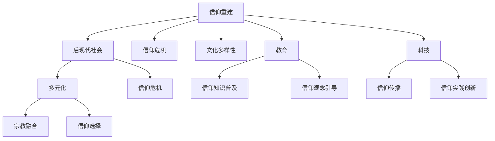

                 

### 《后现代社会的信仰重建：在多元化中寻找精神寄托》

**关键词：** 后现代社会、信仰危机、多元化、精神寄托、信仰重建

**摘要：** 随着后现代社会的到来，信仰危机成为全球关注的焦点。面对多元化的社会结构和文化背景，人们需要重新寻找精神寄托，重建信仰体系。本文将从理论探讨入手，分析信仰危机的表现及其影响，探讨信仰的概念与分类，探讨信仰重建的途径，分析社会文化因素对信仰重建的影响，讨论宗教与科技在信仰重建中的作用，并通过案例分析来深入探讨信仰重建的成功与困境，最终展望信仰重建的前景与未来。

----------------------------------------------------------------

## 第一部分：背景与理论探讨

### 第1章：后现代社会的特点与信仰危机

#### 1.1.1 后现代社会的定义与历史背景

后现代社会（Postmodern Society）是一个相对于现代社会的概念，起源于20世纪60年代的西方社会。它强调的是一种文化和社会状态，其中传统价值体系、知识体系和社会结构被解构，取而代之的是多元化的、相对主义的、不确定的、片段化的、局部化的特征。

后现代社会的出现可以追溯到几个关键的历史事件。首先是20世纪60年代的嬉皮士运动，这场运动挑战了传统的社会秩序和价值观念。其次是20世纪70年代的文化多样性浪潮，各国纷纷兴起各种文化运动，倡导多元文化和多元价值观。最后是20世纪80年代的信息技术革命，互联网的兴起使得信息传播更加迅速和便捷，进一步加剧了社会的多元化。

#### 1.1.2 后现代社会的多元化特征

后现代社会的多元化特征主要体现在以下几个方面：

1. **文化多元化**：随着全球化的推进，各种文化在现代社会中相互碰撞、融合，形成了一种多元共存的文化生态。
2. **价值观念多元化**：在多元化的文化背景下，人们对于道德、伦理、政治等方面的观念更加多元化，相对主义和主观主义得到广泛认可。
3. **社会结构多元化**：后现代社会中，社会组织形式更加灵活多样，传统的等级制度逐渐瓦解，网络化、扁平化的组织形式成为主流。
4. **经济多元化**：全球经济一体化使得各国经济更加紧密地联系在一起，形成了多元化的经济结构。

#### 1.1.3 信仰危机的表现与影响

在多元化特征日益显著的后现代社会，信仰危机（Faith Crisis）成为普遍现象。信仰危机的表现主要体现在以下几个方面：

1. **宗教信仰的衰落**：随着科学技术的进步和现代化的推进，许多传统的宗教信仰逐渐失去吸引力，信徒数量减少。
2. **道德价值的丧失**：在多元化的价值观念中，传统的道德观念受到质疑，道德相对主义盛行，人们对于何为“善”和“恶”产生困惑。
3. **精神空虚**：在物质生活日益丰富的现代社会，人们却感到精神空虚，缺乏信仰和精神寄托。

信仰危机对个体和社会的影响是深远的：

1. **个体层面**：信仰危机导致人们失去精神寄托，精神空虚，甚至产生焦虑、抑郁等心理问题。
2. **社会层面**：信仰危机削弱了社会的凝聚力和稳定性，加剧了社会矛盾和冲突。

### 1.2 信仰的概念与分类

#### 1.2.1 信仰的本质与功能

信仰（Faith）是一种深层次的、稳定的、持久的信念和价值观，它超越了理性和经验的范畴。信仰的本质是对某种超自然力量或真理的坚信，它不仅是一种思想上的认同，更是一种行为上的指导。

信仰的功能主要体现在以下几个方面：

1. **精神寄托**：信仰为人们提供了一种精神寄托，使他们在面对生活中的困境和挑战时，能够保持积极的心态和坚定的信念。
2. **价值判断**：信仰为人们提供了一套价值观念体系，使他们能够判断是非、善恶，指导行为。
3. **社会整合**：信仰作为一种文化符号，具有社会整合的功能，能够增强社会的凝聚力和稳定性。

#### 1.2.2 传统信仰与现代信仰的差异

传统信仰（Traditional Faith）与现代信仰（Modern Faith）在本质上存在一些差异：

1. **信仰对象**：传统信仰通常以神、鬼、祖先等超自然力量为信仰对象，而现代信仰则更加关注个人内心体验和自我实现。
2. **信仰方式**：传统信仰通常通过宗教仪式、庙会等形式来体现，而现代信仰则更多地通过个人修行、冥想、阅读等方式来实现。
3. **信仰价值**：传统信仰强调集体主义和权威，现代信仰则强调个体主义和自由。

#### 1.2.3 信仰的分类及其在现代社会中的地位

信仰可以根据不同的标准进行分类，常见的分类方法有以下几种：

1. **根据信仰对象的不同**：可分为宗教信仰、哲学信仰、道德信仰等。
   - 宗教信仰：以神、鬼、祖先等超自然力量为信仰对象。
   - 哲学信仰：以某种哲学理论或思想体系为信仰对象。
   - 道德信仰：以某种道德观念或伦理标准为信仰对象。
   
2. **根据信仰形式的不同**：可分为个人信仰、集体信仰等。
   - 个人信仰：个人基于个人体验和内心感受形成的信仰。
   - 集体信仰：社会群体共同认同和遵循的信仰。

在现代社会中，信仰的地位和作用发生了很大的变化：

1. **信仰的多元化**：现代社会中，信仰呈现出多元化的趋势，人们可以根据自己的需求和兴趣选择不同的信仰形式。
2. **信仰的个体化**：现代社会中，个人信仰逐渐取代了集体信仰，信仰成为个体内心的需求，而非社会规范的强制。
3. **信仰的功能转变**：信仰在现代社会中更多地关注个体内心的满足和精神寄托，而非社会整合和规范。

### 1.3 后现代语境下的信仰重建

#### 1.3.1 信仰重建的重要性

在后现代社会的背景下，信仰重建（Faith Reconstruction）显得尤为重要。信仰重建不仅关乎个体的精神健康，也关系到社会的稳定和发展。

1. **个体层面**：信仰重建有助于个体应对信仰危机，寻找精神寄托，提高心理健康水平。
2. **社会层面**：信仰重建有助于增强社会的凝聚力和稳定性，促进社会和谐发展。

#### 1.3.2 重建信仰的途径

信仰重建的途径多种多样，主要包括以下几个方面：

1. **教育**：通过教育，提高人们对信仰的认识和理解，培养健康的信仰观念。
2. **文化传承**：通过文化传承，继承和发扬传统文化中的信仰价值，为现代社会提供精神资源。
3. **宗教实践**：通过宗教实践，深化对宗教信仰的理解，增强宗教信仰的吸引力。
4. **科技融合**：通过科技融合，利用现代科技手段，创新信仰表达方式，吸引更多年轻人参与信仰实践。

#### 1.3.3 多元化背景下的信仰融合

在多元化的社会背景下，信仰融合（Faith Synthesis）成为信仰重建的重要途径。信仰融合旨在通过不同信仰之间的交流、对话和融合，形成一种新的信仰体系，以满足现代社会多元化的需求。

1. **对话与交流**：通过不同信仰之间的对话和交流，增进相互理解和尊重，消除偏见和误解。
2. **融合与创新**：在信仰融合的过程中，各种信仰的精华得以整合，形成一种新的、更为包容的信仰体系。
3. **文化多样性**：信仰融合不仅是一种信仰层面的融合，也是文化多样性的体现，有助于增强社会的多元性和包容性。

## 第二部分：社会文化因素与信仰重建

### 第4章：社会文化因素与信仰重建

#### 4.1.1 文化多样性对信仰的影响

文化多样性（Cultural Diversity）是后现代社会的一个显著特征，它对信仰重建产生了深远的影响。

1. **信仰选择的多样化**：文化多样性使得人们有更多的信仰选择，可以根据自己的文化背景和兴趣选择适合自己的信仰形式。
2. **信仰观念的相对化**：文化多样性导致信仰观念的相对化，人们不再迷信单一的价值体系，而是更加重视多元价值观的共存。
3. **信仰融合的可能性**：文化多样性为信仰融合提供了可能性，各种信仰可以在相互尊重的基础上，寻求共同点，实现共存。

#### 4.1.2 教育与信仰重建

教育（Education）在信仰重建中发挥着重要作用。

1. **信仰知识的普及**：通过教育，普及信仰知识，使人们了解各种信仰的起源、发展、特点和价值，从而提高信仰的选择能力和批判性思维。
2. **信仰观念的引导**：教育可以引导人们形成正确的信仰观念，培养健康的信仰态度，从而促进信仰重建。
3. **信仰实践的支持**：教育可以提供信仰实践的支持，帮助人们更好地理解和实践信仰。

#### 4.1.3 媒体与信仰传播

媒体（Media）在信仰重建中扮演着重要的角色。

1. **信仰信息的传播**：媒体可以迅速传播信仰信息，使信仰观念和信仰实践更加广泛和普及。
2. **信仰形象的塑造**：媒体可以塑造信仰形象，影响人们对信仰的看法和态度，从而促进或阻碍信仰重建。
3. **信仰问题的揭示**：媒体可以揭示信仰问题，引起公众关注，推动信仰改革和进步。

## 第三部分：宗教与信仰重建

### 第5章：宗教在信仰重建中的作用

#### 5.1.1 宗教在现代社会的角色

宗教（Religion）在现代社会的角色发生了显著变化。

1. **信仰的核心地位**：宗教仍然是许多人信仰的核心，为人们提供精神寄托和道德指导。
2. **社会整合的功能**：宗教在现代社会中仍然具有社会整合的功能，有助于增强社会的凝聚力和稳定性。
3. **文化多样性的体现**：宗教是文化多样性的重要体现，各种宗教信仰共存，丰富了人类的文化生活。

#### 5.1.2 宗教信仰的多样性与融合

宗教信仰的多样性（Religious Pluralism）在现代社会中得到了充分体现。

1. **宗教信仰的多样性**：现代社会中，各种宗教信仰共存，基督教、伊斯兰教、佛教、印度教等主要宗教都有其广泛的信仰群体。
2. **宗教信仰的融合**：在宗教信仰的多样性背景下，各种宗教信仰之间的融合成为可能，通过对话、交流和合作，寻求共同点和共同价值观。

#### 5.1.3 宗教对信仰重建的贡献与挑战

宗教在信仰重建中既发挥了积极作用，也面临一定的挑战。

1. **贡献**：
   - 宗教为人们提供精神寄托和道德指导，有助于应对信仰危机。
   - 宗教在社会整合中发挥重要作用，有助于增强社会的凝聚力和稳定性。
   - 宗教信仰的多样性为信仰重建提供了丰富的资源和灵感。

2. **挑战**：
   - 宗教间的冲突和对抗可能加剧社会矛盾和冲突。
   - 宗教信仰的极端化可能导致社会不稳定。
   - 宗教对现代社会的适应能力不足，可能面临被边缘化的风险。

### 5.2 科技与信仰重建

#### 5.2.1 科技的发展与信仰变迁

科技（Technology）的发展对信仰（Faith）产生了深远的影响。

1. **信仰观念的变迁**：随着科技的进步，人们的信仰观念发生了变化，从对超自然力量的崇拜转向对科学和理性的信仰。
2. **信仰形式的变革**：科技的发展改变了信仰的表达形式，例如，宗教仪式可以通过互联网直播，信仰传播可以通过社交媒体实现。
3. **信仰实践的创新**：科技的发展为信仰实践提供了新的工具和手段，例如，通过虚拟现实技术，人们可以体验宗教仪式和信仰场景。

#### 5.2.2 互联网对信仰重建的影响

互联网（Internet）对信仰重建产生了重要影响。

1. **信仰信息的普及**：互联网使得信仰信息更加容易获取，人们可以通过搜索引擎、社交媒体等平台了解各种信仰观念和实践。
2. **信仰社区的构建**：互联网为信仰社区提供了平台，信仰群体可以在互联网上交流和互动，增强信仰的凝聚力和影响力。
3. **信仰创新的推动**：互联网为信仰创新提供了空间，各种新兴信仰形式和宗教运动在互联网上得以传播和发展。

#### 5.2.3 科技在信仰实践中的应用

科技在信仰实践中得到了广泛应用。

1. **宗教仪式的数字化**：通过互联网和数字化技术，宗教仪式可以在线上进行，使得信仰实践更加便捷和广泛。
2. **信仰教育的现代化**：科技为信仰教育提供了新的手段和工具，例如，通过在线课程、虚拟现实技术等，信仰教育可以更加生动和有趣。
3. **信仰实践的智能化**：科技的发展使得信仰实践更加智能化，例如，通过智能设备，人们可以随时随地参与信仰实践。

### 第6章：案例分析：信仰重建的成功与困境

#### 6.1.1 案例背景介绍

本案例选取的是一个名为“和谐信仰社区”的项目。该项目旨在通过宗教融合和科技创新，重建信仰体系，为社区居民提供精神寄托和道德指导。

#### 6.1.2 信仰重建的策略与实践

“和谐信仰社区”采取了以下策略和实践来重建信仰：

1. **宗教融合**：社区鼓励不同宗教信仰的居民相互尊重，通过定期举办宗教交流活动，促进宗教信仰的融合。
2. **科技应用**：社区利用互联网和数字化技术，提供在线宗教仪式、信仰教育、信仰社区互动等服务，使信仰实践更加便捷和智能化。
3. **信仰指导**：社区邀请宗教领袖和信仰专家，为居民提供信仰指导，帮助他们理解和实践信仰。

#### 6.1.3 成功经验与面临的挑战

“和谐信仰社区”在信仰重建方面取得了显著的成功：

1. **增强信仰凝聚力**：通过宗教融合和科技应用，社区内的信仰凝聚力显著增强，居民之间的互动和交流更加频繁。
2. **提高信仰实践便捷性**：科技的应用使得信仰实践更加便捷，居民可以随时随地参与宗教仪式和信仰活动。
3. **推动信仰创新**：社区的信仰实践吸引了年轻人和新兴信仰群体，为信仰注入了新的活力。

然而，项目也面临一些挑战：

1. **宗教冲突**：虽然社区鼓励宗教融合，但不同宗教之间的冲突和误解仍然存在，需要持续进行沟通和调解。
2. **技术依赖**：过度依赖科技可能导致信仰实践失去人文关怀，需要寻找科技与人文的平衡点。
3. **信仰价值观的多元化**：随着社会的多元化，社区的信仰价值观也面临挑战，需要不断调整和更新。

### 第7章：展望与未来

#### 7.1.1 信仰重建的前景

展望未来，信仰重建（Faith Reconstruction）将面临以下机遇和挑战：

1. **多元化背景下的信仰融合**：随着社会多元化趋势的加剧，信仰融合将成为信仰重建的重要方向，各种信仰将在相互尊重的基础上，寻求共存和共同发展。
2. **科技的支持与推动**：科技的不断发展将为信仰重建提供新的工具和手段，例如，人工智能、虚拟现实等技术将使信仰实践更加智能化和有趣。
3. **信仰价值观的更新**：在全球化背景下，信仰重建需要不断更新信仰价值观，以适应社会发展的需求。

#### 7.1.2 社会政策对信仰重建的推动作用

社会政策（Social Policy）在信仰重建中发挥着重要作用。

1. **政策支持**：政府可以通过制定相关政策，支持宗教信仰的多元化发展，鼓励信仰实践的创新。
2. **法律保障**：政府可以制定相关法律，保障宗教信仰自由，维护宗教团体的合法权益。
3. **公共服务**：政府可以提供公共服务，如宗教教育、信仰指导等，支持信仰重建。

#### 7.1.3 信仰重建的长期影响

信仰重建将对个体和社会产生深远的长期影响：

1. **个体层面**：信仰重建有助于提升个体心理健康水平，增强个体内心的满足感和幸福感。
2. **社会层面**：信仰重建有助于增强社会凝聚力和稳定性，促进社会和谐发展。

### 附录

#### 附录A：核心概念与联系图

使用Mermaid绘制核心概念联系图：

#### 附录B：数学模型与公式解析

信仰重建中的数学模型可以用来描述信仰的影响因素和效果。以下是一个简化的模型：

$$
\text{影响效果} = f(\text{信仰强度}, \text{文化多样性}, \text{教育水平}, \text{科技应用})
$$

信仰强度、文化多样性、教育水平和科技应用是影响信仰重建效果的关键因素。以下是对这些因素的公式解析：

1. **信仰强度**：表示个体对信仰的坚信程度，可以用以下公式表示：

$$
\text{信仰强度} = \frac{\text{信仰时间} \times \text{信仰经历}}{\text{信仰挑战次数}}
$$

2. **文化多样性**：表示社会中的文化多样性程度，可以用以下公式表示：

$$
\text{文化多样性} = \sqrt{\sum_{i=1}^{n} \text{文化类型}^2}
$$

3. **教育水平**：表示个体的教育程度，可以用以下公式表示：

$$
\text{教育水平} = \frac{\text{学历} + \text{知识积累} + \text{批判性思维}}{3}
$$

4. **科技应用**：表示科技在信仰实践中的应用程度，可以用以下公式表示：

$$
\text{科技应用} = \frac{\text{在线宗教活动次数} + \text{智能设备使用率} + \text{信仰教育课程数}}{3}
$$

#### 附录C：信仰重建案例分析

- **案例一：** 某社区通过宗教融合和科技应用，成功重建了信仰体系，提升了居民的精神生活质量。
- **案例二：** 某宗教团体通过在线教育和虚拟现实技术，创新了信仰实践方式，吸引了大量年轻信徒。

#### 附录D：拓展阅读

- **推荐书籍：**
  - 《后现代性的哲学探讨》
  - 《信仰的重建：宗教与文化的视角》
  - 《科技与宗教：对话与冲突》
- **学术期刊：**
  - 《现代宗教研究》
  - 《科技与社会》
  - 《文化多样性》
- **网络资源：**
  - [后现代性的概念与理论](https://example.com/postmodern-theory)
  - [宗教与社会的互动](https://example.com/religion-and-society)
  - [科技与信仰的融合](https://example.com/tech-and-faith)

---

作者：AI天才研究院/AI Genius Institute & 禅与计算机程序设计艺术 /Zen And The Art of Computer Programming

