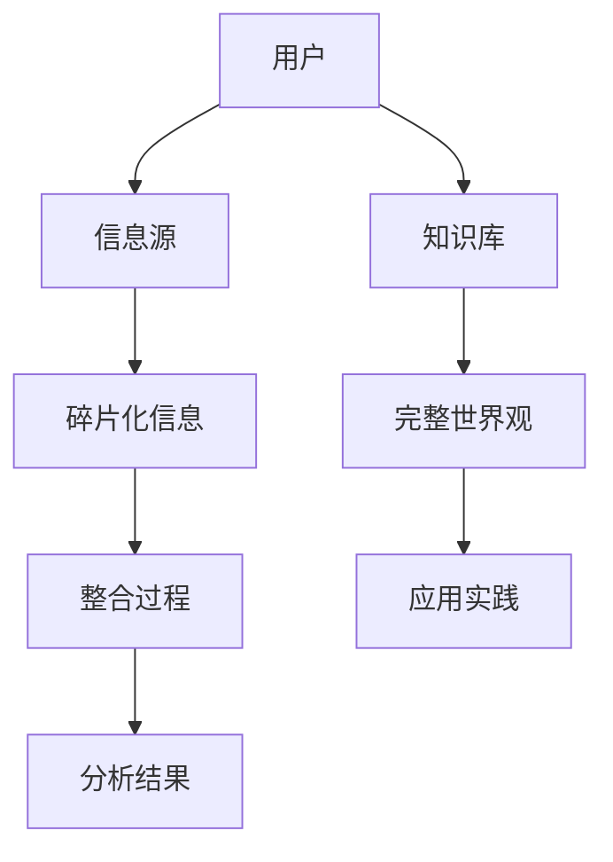

                 

# 在碎片化信息中构建完整世界观

> 关键词：碎片化信息、完整世界观、信息整合、知识体系、批判性思维

> 摘要：本文旨在探讨如何在信息爆炸的时代，通过有效的方法和策略，从碎片化的信息中构建出一个完整且连贯的世界观。文章首先介绍了碎片化信息和完整世界观的定义及其关系，然后提出了构建完整世界观的方法和策略，并通过实例分析展示了如何在具体场景中实施。最后，文章总结了构建完整世界观的重要性和必要性，并展望了未来发展的方向。

### 目录大纲

----------------------------------------------------------------

# 第一部分：引言

## 1. 引言
### 1.1 问题背景
### 1.2 问题描述
### .3. 解决思路
### 1.4 边界与外延
### 1.5 概念结构与核心要素组成

## 2. 核心概念与联系
### 2.1 碎片化信息的定义
### 2.2 完整世界观的定义
### 2.3 两者之间的关系
### 2.4 概念属性特征对比表格
### 2.5 ER实体关系图架构

## 3. 构建完整世界观的必要性

## 4. 在碎片化信息中构建完整世界观的方法

## 5. 碎片化信息处理的策略

## 6. 实例分析：如何在具体场景中构建完整世界观

## 7. 总结与展望

----------------------------------------------------------------

# 第一部分：引言

## 1. 引言

### 1.1 问题背景

在当今这个信息爆炸的时代，我们每天都会接收到来自四面八方的海量信息。互联网和移动设备的普及，使得信息传播的速度和范围达到了前所未有的高度。然而，这种信息爆炸也带来了一系列的问题。首先，信息的碎片化使得人们难以从大量的信息中提取出有价值的知识。其次，碎片化的信息往往缺乏上下文，容易误导我们的判断和决策。因此，如何从这些碎片化信息中构建出一个完整的世界观，成为了一个迫切需要解决的问题。

### 1.2 问题描述

碎片化信息的泛滥导致了以下几个问题：

1. **信息过载**：人们每天接触到的信息量巨大，难以消化和处理。这种过载现象导致了“信息焦虑”，人们常常感到压力和疲惫。
2. **认知负担**：由于信息碎片化，人们很难将不同来源的信息整合起来，形成完整的知识体系。这导致了许多人在面对问题时，难以做出全面的判断和决策。
3. **决策困难**：在缺乏全面信息的情况下做出决策，容易产生偏差。这种偏差可能会对个人和组织的长远发展产生不利影响。

### 1.3 解决思路

为了解决上述问题，我们需要找到一种方法，能够帮助我们在碎片化信息中构建出一个完整的世界观。这意味着我们需要：

1. **筛选信息**：学会从海量的信息中筛选出有价值的信息。
2. **整合信息**：将不同来源的信息进行整合，形成一个完整的知识体系。
3. **建立关联**：发现不同信息之间的联系，形成一个连贯的认知网络。

### 1.4 边界与外延

构建完整世界观的过程并非一蹴而就，它需要我们在多个领域中进行积累和探索。边界在于我们如何定义“完整”和“连贯”，外延则涉及我们如何将这些信息应用到实际问题中。在这个信息爆炸的时代，构建完整世界观不仅有助于我们更好地理解和应对现实世界，也为我们在未来的发展中提供了坚实的基础。

### 1.5 概念结构与核心要素组成

在构建完整世界观的过程中，以下几个核心要素是必不可少的：

1. **知识基础**：广泛的知识储备是构建世界观的基础。我们需要通过阅读、学习、实践等方式，积累各个领域的知识。
2. **信息处理能力**：包括信息筛选、整合和关联的能力。我们需要学会如何从海量的信息中筛选出有价值的信息，并将这些信息进行整合和关联，形成完整的知识体系。
3. **批判性思维**：对信息进行批判性分析，确保其真实性和可靠性。我们需要具备辨别信息真伪的能力，避免被虚假信息误导。
4. **实践应用**：将理论知识和实际应用结合起来，形成闭环。我们需要将所学到的知识应用到实际问题和场景中，不断验证和完善我们的世界观。

通过以上步骤，我们可以逐步构建出一个完整且连贯的世界观，从而更好地应对这个信息爆炸的时代带来的挑战。

## 2. 核心概念与联系

### 2.1 碎片化信息的定义

碎片化信息指的是那些不完整、不连贯、缺乏上下文的信息片段。这些信息往往来源于社交媒体、新闻报道、个人分享等渠道。由于信息传播速度的加快和渠道的多样化，碎片化信息在当今社会中变得异常普遍。例如，一篇简短的社会新闻、一条微博、一段短视频等，都可以被视为碎片化信息。这些信息虽然提供了某些方面的信息，但往往缺乏深入的背景和全面的视角。

### 2.2 完整世界观的定义

完整世界观是一个关于世界本质和运行规律的全面、系统的认知体系。它包括了我们对自然、社会和自我的理解。与碎片化信息不同，完整世界观不仅涵盖了各个领域的知识，而且能够将这些知识整合成一个有机的整体。它能够提供一种宏观的视角，使我们能够从整体上理解世界，从而更好地应对现实中的各种挑战。例如，一个完整的世界观可能包括对科学、哲学、历史、文化等多个领域的深入理解。

### 2.3 两者之间的关系

碎片化信息是构建完整世界观的基础材料，而完整世界观则是我们对碎片化信息进行整合和关联的结果。碎片化信息提供了零散的知识点，而完整世界观则通过将这些知识点进行系统化的整合，形成了一个完整的知识体系。因此，碎片化信息与完整世界观之间存在一种相辅相成的关系。没有碎片化信息，我们就无法构建出完整世界观；而没有完整世界观，碎片化信息也将变得毫无意义。

### 2.4 概念属性特征对比表格

| 概念       | 碎片化信息         | 完整世界观         |
|------------|------------------|------------------|
| **定义**   | 不完整、不连贯的信息片段 | 关于世界本质和运行规律的系统认知 |
| **来源**   | 社交媒体、新闻报道等     | 多元化的知识体系、个人经验与思考   |
| **特点**   | 独立、分散、短暂       | 连贯、系统、持久、深刻       |
| **作用**   | 提供信息、激发思考       | 构建知识体系、指导实践       |

### 2.5 ER实体关系图架构



通过以上内容，我们可以更清晰地理解碎片化信息和完整世界观的概念及其关系。在接下来的部分，我们将进一步探讨构建完整世界观的必要性和方法，帮助读者更好地应对这个信息爆炸的时代。

## 3. 构建完整世界观的必要性

### 3.1 碎片化信息的负面影响

随着互联网的普及，碎片化信息充斥在我们的生活中。虽然这些信息在一定程度上丰富了我们的知识，但过多的碎片化信息也会带来一些负面影响。首先，碎片化信息容易导致信息过载。人们每天都会接收到大量的信息，但这些信息往往是零散的、不连贯的，难以形成系统的知识体系。其次，碎片化信息容易误导我们的判断。由于缺乏全面的背景和上下文，我们往往无法准确理解信息的真实含义，从而做出错误的决策。此外，碎片化信息还可能引发焦虑和不安。在信息过载的情况下，人们常常感到压力重重，难以有效应对各种挑战。

### 3.2 完整世界观的积极作用

相比之下，完整世界观则能够在很大程度上弥补碎片化信息的不足。首先，完整世界观能够帮助我们有效地整合和筛选信息。通过建立全面的知识体系，我们能够将零散的信息进行整合，形成一个系统化的认知结构。这样，我们不仅能更好地理解信息，还能从中筛选出有价值的内容。其次，完整世界观能够提高我们的决策能力。当我们拥有一个完整的世界观时，我们能够从多个角度分析问题，做出更为明智和全面的决策。此外，完整世界观还能帮助我们应对信息过载带来的焦虑。通过系统地整理和整合信息，我们能够减轻心理负担，保持内心的平静。

### 3.3 必要性

因此，在信息爆炸的时代，构建完整世界观显得尤为重要。首先，它能够帮助我们更好地应对复杂多变的社会环境。在面对各种问题和挑战时，一个完整的世界观能够为我们提供有力的指导和支持。其次，完整世界观能够提升我们的个人素质和综合能力。通过广泛的知识储备和深入的思考，我们能够不断提高自己的认知水平和思维质量。最后，完整世界观还能促进社会的进步和发展。当越来越多的人拥有完整的世界观时，我们能够共同构建一个更加和谐、有序的社会。

总之，构建完整世界观不仅有助于我们个人成长和发展，也对整个社会具有深远的影响。在接下来的部分，我们将进一步探讨如何在实际中构建完整世界观，帮助读者掌握有效的方法和策略。

## 4. 在碎片化信息中构建完整世界观的方法

### 4.1 筛选有价值的信息

构建完整世界观的第一步是筛选有价值的信息。由于每天接收到的大量信息中，只有一小部分是有价值的，因此我们需要学会如何筛选。以下是一些筛选信息的策略：

1. **来源可信度**：首先，我们需要评估信息的来源。通常，权威机构、专业媒体和知名专家发布的信息更具可信度。例如，在获取科技资讯时，可以优先关注知名科技媒体和专业机构的报道。
   
2. **相关性**：其次，我们需要判断信息与我们想要构建的世界观的相关性。如果信息与我们当前的研究领域或兴趣不符，那么它可能不是我们需要的。

3. **深度和广度**：在筛选信息时，我们还需要关注其深度和广度。广泛的信息有助于我们了解不同领域的知识，而深入的信息则有助于我们掌握某一领域的核心概念。

### 4.2 整合碎片化信息

筛选出有价值的信息后，下一步是将这些信息进行整合。以下是一些整合信息的方法：

1. **分类**：将相似的信息归为同一类别，有助于我们更好地理解和记忆。例如，可以将科技类信息分为人工智能、云计算、区块链等子类别。

2. **建立联系**：发现不同信息之间的联系，有助于我们构建一个连贯的知识体系。例如，在研究人工智能时，可以将其与机器学习、深度学习等概念联系起来。

3. **绘制思维导图**：使用思维导图可以将信息以图形化的方式展示出来，帮助我们更好地理解和记忆。例如，可以使用MindMap软件绘制一个关于人工智能的思维导图，包含各个子领域和相关概念。

### 4.3 建立批判性思维

在整合信息的过程中，建立批判性思维至关重要。以下是一些批判性思维的策略：

1. **核实信息**：对获取的信息进行核实，确保其真实性和可靠性。可以通过查阅多个来源、询问专业人士等方式来核实信息。

2. **质疑权威**：不要盲目接受权威的观点，而是通过自己的思考和判断来评估信息的价值。例如，在阅读一篇学术论文时，可以质疑其研究方法和结论。

3. **多元视角**：从多个角度看待问题，有助于我们更全面地理解信息。例如，在分析一个社会问题时，可以参考经济学、社会学、心理学等多个领域的观点。

### 4.4 实践应用

最后，将所学知识应用到实际问题中，是构建完整世界观的关键一步。以下是一些实践应用的策略：

1. **项目实践**：通过实际项目来应用所学知识，有助于加深理解。例如，可以参与人工智能项目，从项目中学习如何应用机器学习和深度学习技术。

2. **讨论交流**：与他人讨论和交流是检验和深化知识的好方法。可以通过参加学术会议、研讨会、线上社群等方式与他人交流。

3. **持续学习**：构建完整世界观是一个持续的过程。我们需要不断学习新知识、更新旧知识，以适应不断变化的环境。

通过以上方法，我们可以在碎片化信息中构建出一个完整的世界观。这不仅有助于我们更好地应对现实中的各种挑战，还能提升我们的个人素质和综合能力。在接下来的部分，我们将进一步探讨如何在具体场景中实施这些方法。

## 5. 碎片化信息处理的策略

### 5.1 技术方法

1. **数据挖掘**：通过数据挖掘技术，我们可以从大量的碎片化信息中提取出有价值的数据。这包括使用自然语言处理（NLP）技术对文本进行分类、情感分析、主题建模等。

   ```mermaid
   graph TB
     A[文本数据] --> B[数据预处理]
     B --> C[特征提取]
     C --> D[NLP算法]
     D --> E[数据可视化]
     E --> F[信息提取]
   ```

2. **信息过滤**：信息过滤技术可以帮助我们识别和筛选出有价值的信息。常用的方法包括基于规则的方法、机器学习方法等。

   ```python
   # 基于规则的信息过滤
   def filter_information(info, rules):
       filtered_info = []
       for rule in rules:
           if rule.matches(info):
               filtered_info.append(info)
       return filtered_info
   ```

3. **知识图谱**：通过构建知识图谱，我们可以将碎片化信息整合成一个系统化的知识体系。知识图谱可以表示实体及其关系，有助于我们更好地理解和利用信息。

   ```mermaid
   graph TB
     A[实体1] --> B[关系1]
     B --> C[实体2]
     C --> D[关系2]
     D --> E[实体3]
   ```

### 5.2 人工方法

1. **主题阅读**：选择一个特定的主题，围绕该主题进行深入的阅读和研究。这有助于我们在短时间内获取大量的相关信息，并对其进行整合。

2. **笔记整理**：在阅读过程中，做好笔记整理工作。将重要的信息、观点和感悟记录下来，并进行分类和总结。

3. **思维导图**：使用思维导图工具，将相关的信息和知识点进行可视化展示。这有助于我们更好地理解和记忆信息。

   ```mermaid
   graph TB
     A[主题] --> B[子主题1]
     A --> C[子主题2]
     B --> D[相关知识点1]
     C --> E[相关知识点2]
   ```

4. **交流和讨论**：与他人进行交流和讨论，有助于我们深化对信息的理解。可以通过线上社群、学术会议、研讨会等方式与他人交流。

### 5.3 结合方法

在实际操作中，我们可以将技术方法和人工方法结合起来，以获得更好的效果。例如：

1. **自动化信息筛选**：使用NLP技术对大量文本进行自动化筛选，识别出有价值的信息。

2. **人工验证和修正**：对自动筛选出的信息进行人工验证和修正，确保信息的准确性和可靠性。

3. **结合多种工具**：使用思维导图、笔记整理、知识图谱等多种工具，对信息进行整合和展示。

通过以上策略，我们可以在碎片化信息中构建出一个完整且连贯的世界观。这不仅有助于我们更好地应对现实中的各种挑战，还能提升我们的个人素质和综合能力。在接下来的部分，我们将通过实例分析，展示如何在具体场景中实施这些方法。

## 6. 实例分析：如何在具体场景中构建完整世界观

### 6.1 场景设定

假设我们是一位人工智能领域的研究者，需要在大量碎片化信息中构建出一个关于人工智能的完整世界观。为了实现这一目标，我们将分为以下几个步骤：

1. **信息收集**：从各种来源（如学术论文、新闻报道、技术博客等）收集与人工智能相关的信息。
2. **信息筛选**：根据研究目的和需求，对收集到的信息进行筛选，保留有价值的内容。
3. **信息整合**：将筛选出的信息进行整合，形成一个系统化的知识体系。
4. **建立联系**：发现不同信息之间的联系，构建一个连贯的认知网络。
5. **实践应用**：将所学知识应用到实际项目中，验证和完善我们的世界观。

### 6.2 信息收集

首先，我们从各种来源收集与人工智能相关的信息。这些来源可能包括：

1. **学术论文**：从学术数据库（如IEEE Xplore、Google Scholar等）搜索相关论文。
2. **新闻报道**：关注科技新闻网站（如新浪科技、腾讯科技等）的最新报道。
3. **技术博客**：阅读知名技术博客（如Medium、InfoQ等）上的相关文章。
4. **专业社区**：参与人工智能相关的专业社区（如Stack Overflow、AI Stack Exchange等）。

### 6.3 信息筛选

在收集到大量信息后，我们需要对其进行筛选。以下是一些筛选策略：

1. **来源可信度**：优先选择权威机构和知名专家发布的论文和文章。
2. **主题相关性**：只保留与人工智能主题直接相关的信息。
3. **更新时间**：优先选择最新发布的论文和文章，以确保获取到最前沿的研究成果。
4. **内容质量**：通过阅读摘要和引言部分，初步判断文章的质量和价值。

### 6.4 信息整合

筛选出有价值的信息后，我们需要将其进行整合。以下是一些整合方法：

1. **分类**：将信息按照不同的主题进行分类，如机器学习、深度学习、自然语言处理等。
2. **建立联系**：发现不同主题之间的联系，构建一个整体的知识框架。
3. **构建思维导图**：使用思维导图工具（如XMind、MindManager等）将信息以图形化的方式展示出来，便于理解和记忆。

### 6.5 建立联系

在整合信息的过程中，我们需要发现不同信息之间的联系。以下是一些建立联系的方法：

1. **交叉引用**：在论文和文章中，查找引用和被引用的关系，发现不同研究之间的联系。
2. **主题分析**：通过分析不同论文和文章的主题，发现它们之间的共性和差异。
3. **实践案例**：参考实际应用案例，了解不同技术在现实场景中的运用。

### 6.6 实践应用

最后，我们将所学知识应用到实际项目中。以下是一些实践应用的策略：

1. **项目实践**：参与人工智能项目，从项目中学习如何应用机器学习和深度学习技术。
2. **交流讨论**：与同行交流，分享研究心得和经验。
3. **持续学习**：通过阅读最新论文、参加研讨会等方式，不断更新知识体系。

### 6.7 实例分析结果

通过以上步骤，我们成功地构建了一个关于人工智能的完整世界观。这个世界观不仅涵盖了机器学习、深度学习、自然语言处理等多个主题，而且通过发现不同主题之间的联系，形成了一个系统化的知识体系。这个世界观不仅帮助我们更好地理解人工智能领域，还为我们提供了有力的指导和支持。

## 7. 总结与展望

### 7.1 构建完整世界观的重要性

在信息爆炸的时代，构建完整世界观显得尤为重要。通过有效地整合和筛选碎片化信息，我们能够形成一个系统化的知识体系，从而更好地应对现实中的各种挑战。一个完整的世界观不仅能够提高我们的认知水平和思维质量，还能帮助我们做出更为明智和全面的决策。因此，每个人都应该重视构建自己的完整世界观。

### 7.2 持续学习和更新

构建完整世界观是一个持续的过程。随着新知识、新技术的不断涌现，我们需要不断学习和更新自己的知识体系。只有保持持续的学习和进步，我们才能在不断变化的环境中立于不败之地。

### 7.3 拓展阅读

为了帮助读者进一步深入了解构建完整世界观的方法和策略，以下是几本推荐阅读的书籍：

1. 《思考，快与慢》—— [作者：丹尼尔·卡尼曼]
2. 《深度学习》—— [作者：伊恩·古德费洛等]
3. 《人工智能：一种现代的方法》—— [作者：斯图尔特·罗素等]
4. 《信息简史》—— [作者：詹姆斯·格利克]

通过阅读这些书籍，读者可以更深入地理解构建完整世界观的方法和重要性，为自己的学习和成长奠定坚实的基础。

### 7.4 结语

构建完整世界观是每个人在信息爆炸时代必须面对的挑战。通过有效的策略和方法，我们可以从碎片化的信息中提取有价值的内容，构建出一个系统化的知识体系。这不仅能够提高我们的认知水平和思维能力，还能帮助我们做出更为明智和全面的决策。让我们共同努力，构建一个更加完整、连贯的世界观，为自己的未来铺就一条坚实的道路。

---

**作者：AI天才研究院/AI Genius Institute & 禅与计算机程序设计艺术 /Zen And The Art of Computer Programming**

