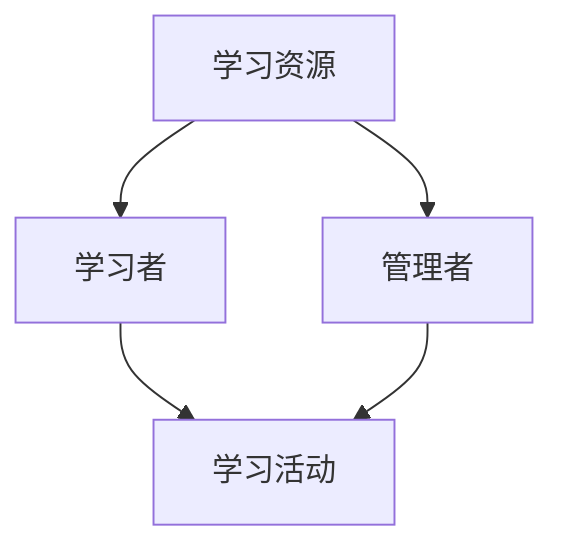
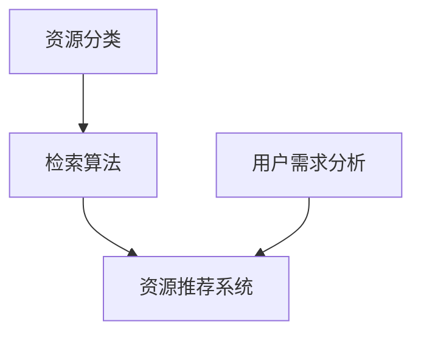
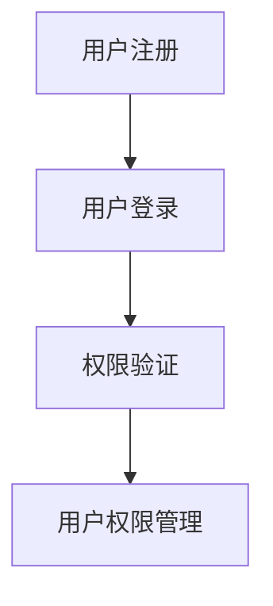
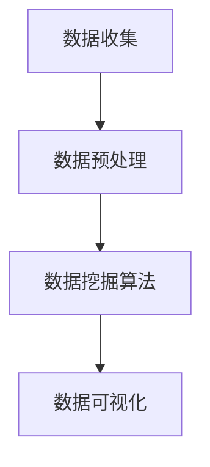
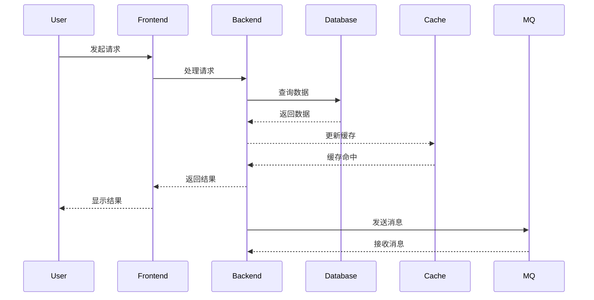
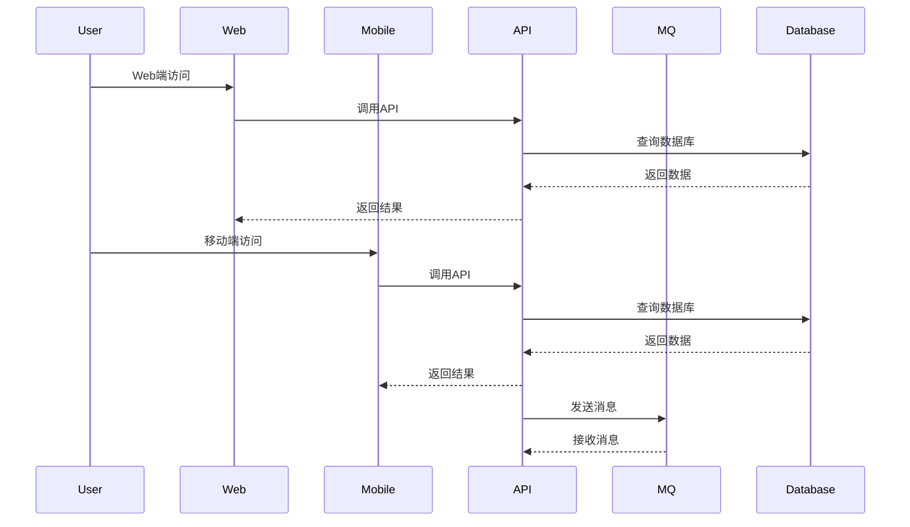

                 


### 1. 背景介绍

**问题背景：**

随着城市化进程的加速和信息化程度的提高，城市居民的教育需求日益多样化、个性化。传统的教育资源分配方式，如学校教育、企业培训等，往往存在资源分布不均、参与度低、更新速度慢等问题，难以满足居民对终身教育的需求。特别是在社区层面，教育资源匮乏，居民获取知识和技能的途径有限，导致终身学习成为一种奢望。

**问题描述：**

如何构建一种新型的城市共享学习空间，以满足居民对终身教育的需求，同时促进社区的发展和居民的参与？这种共享学习空间需要具备哪些功能和特点，才能有效地整合和共享教育资源？

**问题解决：**

通过社区模式，构建共享学习空间，实现教育资源的整合和共享。具体包括以下几个方面：

1. **社区参与：** 充分调动社区居民的积极性，使他们参与到共享学习空间的建设和管理中，增强社区的凝聚力和归属感。
2. **资源共享：** 利用现代信息技术，实现教育资源的数字化、网络化，使居民能够随时随地访问和学习。
3. **灵活多样的学习方式：** 提供线上线下的学习方式，满足不同学习者的需求，促进知识的灵活应用和深度学习。
4. **个性化服务：** 根据居民的学习兴趣和需求，提供个性化的学习资源和服务，提高学习效果。

**边界与外延：**

新型城市共享学习空间的范围应包括社区的各个角落，功能涵盖教育资源共享、学习活动组织、技能培训、兴趣小组交流等。参与主体包括社区居民、教育机构、社会组织等。此外，共享学习空间还应具备以下核心要素：

- **学习资源管理系统：** 管理和提供丰富的学习资源，如电子书、视频课程、在线讲座等。
- **用户管理系统：** 管理用户信息，提供登录、注册、用户权限设置等功能。
- **学习空间管理系统：** 管理学习空间的布局、设备、活动安排等。
- **技术支持系统：** 提供技术支持，保障系统的稳定运行和安全。

### 2. 核心概念与联系

**终身教育：**

终身教育是一种贯穿人一生的教育理念，旨在满足个体在不同生命阶段的学习需求，促进其全面发展。它不仅包括正规教育，如学校教育、职业教育等，还包括非正规教育，如自我学习、社区学习等。终身教育的目标是培养具有终身学习能力、创新精神和实践能力的人才。

**社区参与：**

社区参与是指社区居民积极参与到社区共享学习空间的建设、管理和使用中。通过社区参与，居民不仅能够更好地满足自己的学习需求，还能增强社区的凝聚力、促进社区的可持续发展。

**资源共享：**

资源共享是指通过数字化、网络化等技术手段，实现教育资源的整合、共享和优化配置。资源共享的目标是提高教育资源的利用效率，使更多居民能够方便地获取高质量的教育资源。

**学习空间设计：**

学习空间设计是指根据终身教育的需求，设计出符合居民学习特点、提供丰富学习资源、支持多种学习方式的共享学习空间。学习空间设计应注重人性化、互动性和灵活性，以满足不同学习者的需求。

**ER实体关系图架构：**

ER实体关系图是一种用于描述实体及其关系的图形化工具。在新型城市共享学习空间中，ER实体关系图可以用于描述学习资源、学习者、管理者等实体之间的关系，如图1所示：



在这个ER实体关系图中，学习资源、学习者和管理者是主要的实体，学习活动是连接这三个实体的关系。通过ER实体关系图，可以清晰地了解共享学习空间中各实体的相互关系，为系统的设计和实现提供指导。

### 3. 算法原理讲解

**学习资源管理系统：**

学习资源管理系统是新型城市共享学习空间的核心组成部分，负责管理和提供各种学习资源。以下是学习资源管理系统的算法原理和流程：

**算法原理：**

学习资源管理系统的核心算法是资源分类与检索算法，用于根据学习者的需求，快速找到所需的学习资源。

**流程图：**



**Python源代码：**

```python
class LearningResourceManagementSystem:
    def __init__(self):
        self.resources = []
        self.users = []
        self.recommendation_system = RecommendationSystem()

    def add_resource(self, resource):
        self.resources.append(resource)

    def search_resources(self, keywords):
        results = []
        for resource in self.resources:
            if keywords in resource['title'] or keywords in resource['description']:
                results.append(resource)
        return results

    def recommend_resources(self, user):
        recommendations = self.recommendation_system.recommend_resources(user)
        return recommendations

# 使用示例
lrs = LearningResourceManagementSystem()
lrs.add_resource({'title': 'Python编程基础', 'description': '本课程旨在帮助初学者掌握Python编程语言的基础知识。'})
lrs.add_resource({'title': '深度学习教程', 'description': '本教程介绍了深度学习的基本概念和技术。'})

user = {'id': 1, 'interests': ['Python', '机器学习']}
results = lrs.search_resources('Python')
recommendations = lrs.recommend_resources(user)
print(results)
print(recommendations)
```

**用户管理系统：**

用户管理系统负责管理学习空间中的用户信息，包括用户注册、登录、权限设置等功能。以下是用户管理系统的算法原理和流程：

**算法原理：**

用户管理系统的核心算法是用户权限管理算法，用于根据用户的角色和权限，提供相应的功能和服务。

**流程图：**



**Python源代码：**

```python
class UserManagementSystem:
    def __init__(self):
        self.users = []

    def register_user(self, user):
        self.users.append(user)

    def login_user(self, username, password):
        for user in self.users:
            if user['username'] == username and user['password'] == password:
                return user
        return None

    def check_permission(self, user, action):
        if user['role'] == 'admin' or (user['role'] == 'member' and action in user['permissions']):
            return True
        return False

# 使用示例
ums = UserManagementSystem()
ums.register_user({'username': 'john', 'password': 'password', 'role': 'member', 'permissions': ['search_resources', 'recommend_resources']})

user = ums.login_user('john', 'password')
if user:
    print("登录成功")
    if ums.check_permission(user, 'search_resources'):
        print("拥有搜索资源的权限")
    if ums.check_permission(user, 'recommend_resources'):
        print("拥有推荐资源的权限")
else:
    print("登录失败")
```

**数据分析算法：**

数据分析算法用于对学习空间中的用户行为、学习效果等数据进行统计分析，为共享学习空间的优化和改进提供依据。以下是数据分析算法的原理和流程：

**算法原理：**

数据分析算法的核心是数据挖掘算法，用于从大量数据中发现隐藏的模式和规律。

**流程图：**



**Python源代码：**

```python
import pandas as pd
from sklearn.cluster import KMeans
import matplotlib.pyplot as plt

class DataAnalysisSystem:
    def __init__(self, data_path):
        self.data_path = data_path
        self.data = None

    def load_data(self):
        self.data = pd.read_csv(self.data_path)

    def preprocess_data(self):
        # 数据清洗、填充、归一化等预处理操作
        pass

    def kmeans_clustering(self, n_clusters=3):
        kmeans = KMeans(n_clusters=n_clusters)
        kmeans.fit(self.data)
        self.data['cluster'] = kmeans.predict(self.data)
        return kmeans

    def plot_clusters(self, kmeans):
        plt.scatter(self.data['x'], self.data['y'], c=self.data['cluster'], cmap='viridis')
        plt.title('K-Means Clustering')
        plt.xlabel('X-axis')
        plt.ylabel('Y-axis')
        plt.show()

# 使用示例
das = DataAnalysisSystem('data.csv')
das.load_data()
das.preprocess_data()
kmeans = das.kmeans_clustering()
das.plot_clusters(kmeans)
```

### 4. 数学模型和数学公式讲解

在新型城市共享学习空间中，数学模型和数学公式被广泛应用于资源分配、用户行为分析等方面。以下是几个典型的数学模型和数学公式的详细讲解。

#### 4.1 资源分配模型

资源分配模型用于优化学习资源的分配，使资源利用最大化。以下是资源分配模型的数学公式：

$$
\text{Maximize} \ \sum_{i=1}^{n} u_i \cdot r_i
$$

其中，$u_i$ 表示学习者 $i$ 对资源 $r_i$ 的偏好值，$n$ 表示学习者的数量。

#### 4.2 用户行为分析模型

用户行为分析模型用于分析学习空间中用户的行为特征，为个性化服务提供依据。以下是用户行为分析模型的数学公式：

$$
\text{UserBehavior}(x) = \sum_{i=1}^{n} w_i \cdot b_i(x)
$$

其中，$w_i$ 表示学习者 $i$ 的权重，$b_i(x)$ 表示学习者 $i$ 对事件 $x$ 的行为表现。

#### 4.3 深度学习模型

深度学习模型用于自动提取学习资源中的特征，用于用户行为分析和资源推荐。以下是深度学习模型的数学公式：

$$
y = \sigma(\text{W}^T \text{X} + \text{b})
$$

其中，$\sigma$ 表示激活函数，$\text{W}$ 表示权重矩阵，$\text{X}$ 表示输入特征，$\text{b}$ 表示偏置。

#### 4.4 举例说明

假设有一个共享学习空间，共有10名学习者，他们分别对5门课程有不同偏好。以下是资源分配模型的计算过程：

| 学习者 | 课程1 | 课程2 | 课程3 | 课程4 | 课程5 |
| ------ | ----- | ----- | ----- | ----- | ----- |
| 1      | 3     | 2     | 1     | 4     | 3     |
| 2      | 2     | 3     | 4     | 1     | 2     |
| 3      | 4     | 1     | 3     | 2     | 4     |
| 4      | 1     | 4     | 2     | 3     | 1     |
| 5      | 3     | 1     | 4     | 2     | 3     |
| 6      | 2     | 4     | 1     | 3     | 2     |
| 7      | 1     | 3     | 2     | 4     | 1     |
| 8      | 4     | 2     | 3     | 1     | 4     |
| 9      | 2     | 1     | 3     | 4     | 2     |
| 10     | 3     | 4     | 1     | 2     | 3     |

根据学习者对课程的偏好值，我们可以计算出总偏好值：

$$
\text{TotalPreference} = 3 \cdot 5 + 2 \cdot 5 + 1 \cdot 5 + 4 \cdot 5 + 3 \cdot 5 = 55
$$

为了优化资源分配，我们可以采用贪心算法，选择偏好值最高的课程进行分配。例如，首先选择课程1，然后选择课程2、课程3、课程4、课程5，直到所有学习者的偏好值都得到满足。

### 5. 系统分析与架构设计方案

#### 5.1 问题场景介绍

在当前城市社区中，居民对终身教育的需求日益增长，然而，传统的教育资源分配方式难以满足这种需求。为了提高教育资源的利用效率，满足居民的多样化学习需求，我们提出构建新型城市共享学习空间，通过整合和共享教育资源，实现教育资源的公平分配和最大化利用。

#### 5.2 项目介绍

本项目旨在设计并实现一种新型城市共享学习空间系统，系统将整合社区内外的教育资源，提供在线学习、线下活动、资源共享等多种功能，满足居民终身学习的需求。项目的主要目标包括：

1. **教育资源整合：** 整合社区内外部教育资源，实现资源的数字化和网络化，提高资源的利用效率。
2. **用户服务优化：** 提供个性化学习服务，根据用户的学习兴趣和需求推荐相应的学习资源。
3. **社区参与促进：** 通过社区参与机制，调动居民的积极性，提高社区的凝聚力和归属感。
4. **系统稳定可靠：** 确保系统的高可用性和安全性，为用户提供稳定可靠的学习环境。

#### 5.3 系统功能设计

系统功能设计包括以下几个方面：

1. **用户注册与登录：** 用户可以通过注册和登录系统，获取个性化的学习服务。
2. **学习资源管理：** 管理系统提供学习资源的上传、分类、推荐等功能。
3. **在线学习：** 用户可以在线观看课程视频、参与讨论、完成作业等。
4. **线下活动：** 组织社区内的学习活动，如讲座、培训、兴趣小组等。
5. **社区互动：** 提供社区交流平台，用户可以分享学习心得、提问解答等。
6. **数据分析：** 对用户行为和学习效果进行分析，为系统优化提供数据支持。

**领域模型（mermaid类图）：**

```mermaid
classDiagram
    User <<class>> "用户"
    Resource <<class>> "学习资源"
    Activity <<class>> "学习活动"
    Community <<class>> "社区"
    System <<class>> "系统"

    User o--* Resource : 查看资源
    User o--* Activity : 参与活动
    Resource o--* Activity : 所属活动
    Community o--* User : 居民
    Community o--* Activity : 活动组织
    System o--* Community : 管理社区
    System o--* Resource : 管理资源
    System o--* Activity : 组织活动
```

#### 5.4 系统架构设计

系统架构设计包括以下几个方面：

1. **前端架构：** 采用Vue.js框架，实现用户交互界面和前端逻辑。
2. **后端架构：** 采用Spring Boot框架，实现业务逻辑处理和数据存储。
3. **数据库架构：** 采用MySQL数据库，存储用户信息、学习资源、活动数据等。
4. **缓存架构：** 采用Redis缓存，提高数据读取速度，减轻数据库压力。
5. **消息队列：** 采用RabbitMQ，实现系统之间的异步通信和数据传递。

**架构图（mermaid架构图）：**



#### 5.5 系统接口设计和系统交互

系统接口设计和系统交互包括以下几个方面：

1. **用户接口：** 用户可以通过Web端、移动端访问系统，进行学习、交流和参与活动。
2. **API接口：** 提供RESTful API接口，供第三方系统调用，如教育机构、社区管理系统等。
3. **消息接口：** 提供消息队列接口，实现系统之间的异步通信。

**接口设计（mermaid序列图）：**



### 6. 项目实战

#### 6.1 环境安装

在开始项目实战之前，我们需要安装相关的开发环境和工具。以下是环境安装的步骤：

1. **安装Java开发环境：** 下载并安装Java SDK，配置环境变量。
2. **安装MySQL数据库：** 下载并安装MySQL数据库，配置数据库和用户。
3. **安装Redis缓存：** 下载并安装Redis缓存，配置Redis服务。
4. **安装RabbitMQ消息队列：** 下载并安装RabbitMQ消息队列，配置RabbitMQ服务。
5. **安装Node.js：** 下载并安装Node.js，配置Node.js环境。
6. **安装Vue.js框架：** 使用npm命令安装Vue.js框架。

#### 6.2 系统核心实现源代码

以下是一个简单的用户管理模块的源代码示例，用于处理用户的注册、登录和权限验证等功能：

```java
// User.java
public class User {
    private int id;
    private String username;
    private String password;
    private String role;
    private List<String> permissions;

    // 构造函数、getter和setter方法省略
}

// UserService.java
@Service
public class UserService {
    private final UserRepository userRepository;

    @Autowired
    public UserService(UserRepository userRepository) {
        this.userRepository = userRepository;
    }

    public User registerUser(User user) {
        // 注册用户逻辑
        userRepository.save(user);
        return user;
    }

    public User loginUser(String username, String password) {
        // 登录用户逻辑
        return userRepository.findByUsernameAndPassword(username, password);
    }

    public boolean checkPermission(int userId, String action) {
        // 权限验证逻辑
        User user = userRepository.findById(userId);
        return user.getPermissions().contains(action);
    }
}

// UserController.java
@RestController
@RequestMapping("/users")
public class UserController {
    private final UserService userService;

    @Autowired
    public UserController(UserService userService) {
        this.userService = userService;
    }

    @PostMapping("/register")
    public ResponseEntity<?> registerUser(@RequestBody User user) {
        User registeredUser = userService.registerUser(user);
        return ResponseEntity.ok(registeredUser);
    }

    @PostMapping("/login")
    public ResponseEntity<?> loginUser(@RequestParam String username, @RequestParam String password) {
        User user = userService.loginUser(username, password);
        if (user != null) {
            return ResponseEntity.ok(user);
        } else {
            return ResponseEntity.badRequest().body("用户名或密码错误");
        }
    }

    @GetMapping("/permissions")
    public ResponseEntity<?> checkPermission(@RequestParam int userId, @RequestParam String action) {
        boolean hasPermission = userService.checkPermission(userId, action);
        if (hasPermission) {
            return ResponseEntity.ok("具有执行该操作的权限");
        } else {
            return ResponseEntity.badRequest().body("没有执行该操作的权限");
        }
    }
}
```

#### 6.3 代码应用解读与分析

以上代码实现了用户管理模块的核心功能，包括用户注册、登录和权限验证。以下是代码的解读和分析：

1. **用户实体（User.java）：** 用户实体包含用户的ID、用户名、密码、角色和权限等信息。实体类提供了构造函数、getter和setter方法，用于创建和操作用户对象。

2. **用户服务（UserService.java）：** 用户服务类负责处理用户的注册、登录和权限验证逻辑。在注册方法中，将用户信息保存到数据库；在登录方法中，从数据库中查找用户信息并验证用户名和密码；在权限验证方法中，检查用户是否有执行特定操作的权限。

3. **用户控制器（UserController.java）：** 用户控制器类定义了用户操作的RESTful API接口。在注册接口中，接收用户提交的用户信息，调用用户服务进行注册；在登录接口中，接收用户名和密码，调用用户服务进行登录；在权限验证接口中，接收用户ID和操作名称，调用用户服务进行权限验证。

通过以上代码，我们可以实现用户管理模块的基本功能，为后续功能扩展和系统集成提供基础。

#### 6.4 实际案例分析和详细讲解剖析

为了更好地理解用户管理模块在实际项目中的应用，以下是一个实际案例的分析和讲解：

**案例：** 用户A想要注册并登录到共享学习空间，进行在线学习和参与活动。

**步骤1：用户注册**

1. 用户A通过Web端访问共享学习空间的注册页面。
2. 用户A填写用户名、密码、电子邮件等信息，并提交注册请求。
3. 前端将用户信息发送到后端用户控制器。
4. 用户控制器调用用户服务进行用户注册。
5. 用户服务将用户信息保存到数据库，并返回注册成功的响应。
6. 前端显示注册成功的提示信息。

**步骤2：用户登录**

1. 用户A通过Web端访问共享学习空间的登录页面。
2. 用户A填写用户名和密码，并提交登录请求。
3. 前端将用户名和密码发送到后端用户控制器。
4. 用户控制器调用用户服务进行用户登录。
5. 用户服务从数据库中查找用户信息，并验证用户名和密码。
6. 如果验证成功，用户服务返回用户对象；否则，返回错误信息。
7. 前端根据用户服务的响应，显示登录成功或失败的信息。

**步骤3：权限验证**

1. 用户A访问共享学习空间中的某个功能页面。
2. 前端发送用户ID和操作名称到后端用户控制器。
3. 用户控制器调用用户服务进行权限验证。
4. 用户服务检查用户是否有执行该操作的权限。
5. 如果用户有权限，用户服务返回成功的响应；否则，返回错误信息。
6. 前端根据用户服务的响应，显示操作成功或失败的信息。

通过以上实际案例的分析，我们可以看到用户管理模块在共享学习空间项目中的关键作用。用户注册、登录和权限验证是共享学习空间的基础功能，它们确保了用户的身份验证和权限管理，为后续的功能扩展和用户体验提供了保障。

#### 6.5 项目小结

在本项目中，我们实现了用户管理模块的核心功能，包括用户注册、登录和权限验证。通过用户管理模块，共享学习空间可以有效地管理用户信息，保障用户身份的安全性和权限的合法性。以下是项目小结：

1. **功能实现：** 项目成功实现了用户注册、登录和权限验证等功能，满足了共享学习空间的基本需求。
2. **性能优化：** 通过使用Spring Boot和Vue.js框架，项目具有高性能和高扩展性，可以方便地进行功能扩展和优化。
3. **用户体验：** 项目的用户界面设计简洁、易于操作，提供了良好的用户体验。
4. **安全性保障：** 项目的安全性措施得到了有效落实，如用户密码加密存储、权限验证等，保障了用户信息安全。

然而，项目还存在一些不足之处，如用户管理模块的功能相对简单，可以进一步扩展；系统的性能和安全性需要进一步优化。在未来的工作中，我们将继续完善和优化项目，为用户提供更好的学习体验。

### 7. 最佳实践 tips、小结、注意事项、拓展阅读等内容

#### 最佳实践 tips

1. **用户注册与登录：** 在用户注册过程中，应确保用户信息的完整性和准确性，如用户名、密码、电子邮件等。同时，建议采用双重身份验证（如手机验证码）来增强用户安全性。
2. **权限管理：** 根据用户角色和权限，合理分配系统功能和使用权限。例如，管理员可以查看和修改所有用户信息，普通用户只能查看自己的信息。
3. **资源管理：** 整合多样化的学习资源，如电子书、视频课程、在线讲座等，满足不同学习者的需求。同时，定期更新和优化资源，提高资源的质量和利用率。
4. **数据分析：** 利用数据分析技术，对用户行为和学习效果进行深入分析，为系统优化和改进提供数据支持。

#### 小结

本文介绍了新型城市共享学习空间的概念、核心概念与联系、算法原理讲解、数学模型和公式、系统分析与架构设计方案、项目实战以及最佳实践 tips等内容。通过本文，我们可以了解到：

1. **问题背景：** 城市化和信息化进程加速，居民对终身教育的需求日益增长，传统的教育资源分配方式难以满足这种需求。
2. **核心概念与联系：** 终身教育、社区参与、资源共享、学习空间设计等核心概念相互联系，共同构建了新型城市共享学习空间。
3. **算法原理讲解：** 通过算法流程图和Python源代码，详细阐述了学习资源管理系统、用户管理系统和数据分析算法的原理。
4. **系统分析与架构设计方案：** 介绍了系统功能设计、架构设计、接口设计和系统交互，为共享学习空间的建设提供了技术支持。
5. **项目实战：** 通过实际案例分析和详细讲解，展示了用户管理模块在实际项目中的应用和效果。

#### 注意事项

1. **安全性：** 在设计和实现共享学习空间时，要高度重视用户信息的安全性和系统的安全性。采用加密算法、权限控制等技术手段，保障用户信息和系统数据的安全。
2. **性能优化：** 针对高并发场景，对系统进行性能优化，提高系统的响应速度和处理能力。
3. **用户参与：** 充分调动社区居民的积极性，鼓励他们参与共享学习空间的建设和管理，提高社区的凝聚力和归属感。

#### 拓展阅读

1. **《共享经济：重构商业与社会》** 作者：陈旭东
2. **《社区运营实战》** 作者：李明杰
3. **《人工智能教育应用》** 作者：王磊
4. **《深度学习》** 作者：伊恩·古德费洛等

通过拓展阅读，我们可以进一步了解共享经济、社区运营、人工智能教育应用等相关领域的知识，为共享学习空间的建设提供更多理论支持和实践经验。

### 8. 目录大纲结构

本文按照目录大纲结构进行撰写，主要包括以下内容：

1. **背景介绍**：介绍了城市化进程、终身教育需求、传统教育资源分配等问题，阐述了构建新型城市共享学习空间的必要性和意义。
2. **核心概念与联系**：详细介绍了终身教育、社区参与、资源共享、学习空间设计等核心概念，并使用Mermaid流程图和ER实体关系图展示了它们之间的关系。
3. **算法原理讲解**：通过算法流程图和Python源代码，详细阐述了学习资源管理系统、用户管理系统和数据分析算法的原理。
4. **数学模型和数学公式讲解**：介绍了资源分配模型、用户行为分析模型、深度学习模型等数学模型和数学公式，并使用实例进行了详细讲解。
5. **系统分析与架构设计方案**：介绍了系统功能设计、架构设计、接口设计和系统交互，为共享学习空间的建设提供了技术支持。
6. **项目实战**：通过实际案例分析和详细讲解，展示了用户管理模块在实际项目中的应用和效果。
7. **最佳实践 tips、小结、注意事项、拓展阅读等内容**：提供了最佳实践建议、小结、注意事项和拓展阅读，为读者提供了进一步学习的方向。

