                 

### 第一部分：新文艺复兴的背景与思想

#### 1.1 新文艺复兴的起源与历史背景

新文艺复兴（Renaissance）是发生在15世纪至17世纪欧洲的一场文化运动，其起源于意大利，并迅速蔓延至整个欧洲。这场运动标志着中世纪晚期向现代社会的过渡，对后世产生了深远的影响。

**新文艺复兴的定义**：新文艺复兴是指一种强调人文主义、科学方法和理性思考的文化运动。它与中世纪的神秘主义和宗教独裁相对立，提倡个人的价值、自由思考和自由表达。

**新文艺复兴的重要时期**：新文艺复兴大致可以分为两个时期，早期文艺复兴（Early Renaissance）和晚期文艺复兴（Late Renaissance）。

- **早期文艺复兴**：始于14世纪末的意大利，以佛罗伦萨为中心，强调人文主义和艺术复兴。
- **晚期文艺复兴**：始于16世纪初的意大利，扩展到整个欧洲，这一时期的文艺复兴更加注重科学、技术和哲学。

**新文艺复兴的思想遗产**：新文艺复兴带来了许多重要的思想遗产，这些思想至今仍影响着我们的生活。

- **人文主义**：强调个体的价值，提倡人类自我完善和全面发展。
- **科学方法**：通过观察、实验和理性思考来研究自然和社会现象。
- **理性思考**：倡导理性、批判性和创新性思维，反对盲目信仰和权威主义。

#### 1.2 新文艺复兴时期的代表人物与作品

新文艺复兴时期涌现了许多伟大的艺术家、科学家和思想家，他们通过自己的作品和理论，推动了人类文明的进步。

**达·芬奇与《蒙娜丽莎》**：达·芬奇是文艺复兴时期最杰出的代表人物之一，他不仅在绘画方面有卓越成就，还在科学、数学和工程学领域有重大贡献。《蒙娜丽莎》是他的代表作之一，以其神秘微笑和精湛的绘画技巧著称。

**米开朗琪罗与《大卫》**：米开朗琪罗是文艺复兴时期另一位伟大的艺术家，他的雕塑作品《大卫》展示了人类身体的完美比例和力量。

**拉斐尔与《雅典学院》**：拉斐尔是文艺复兴时期著名的画家和建筑师，他的作品《雅典学院》展现了古希腊哲学家的智慧与和谐。

#### 1.3 新文艺复兴的核心思想

新文艺复兴的核心思想主要体现在以下几个方面：

**人文主义**：人文主义是文艺复兴时期最重要的思想之一，强调人的价值和尊严。人文主义者认为，人类应该追求自我完善，发展自己的才能和能力。

**个体意识觉醒**：文艺复兴时期，个体意识逐渐觉醒，人们开始关注自己的内心世界和个性特点。这种觉醒促进了个人主义的发展，也对后来的现代文明产生了深远的影响。

**科学方法与理性思考**：文艺复兴时期，科学方法和理性思考得到了广泛的推崇。人们通过观察、实验和理性思考来研究自然现象，这种科学精神推动了人类文明的进步。

#### 1.4 新文艺复兴对现代社会的启示

新文艺复兴对现代社会有着深刻的启示，特别是在创新思维和跨领域合作方面。

**创新思维的起源**：新文艺复兴时期，人们开始强调个性和创新。这种创新精神在现代社会得到了进一步的发展，成为推动科技进步和社会发展的关键因素。

**跨领域合作的契机**：新文艺复兴时期，艺术家、科学家和思想家之间的跨领域合作极大地推动了文明的进步。在现代社会，跨领域合作已经成为解决复杂问题的重要手段。

**现代社会的文艺复兴精神**：新文艺复兴时期的思想和精神在现代社会中仍然具有重要价值。通过弘扬人文主义、科学方法和理性思考，我们可以更好地应对当今世界的挑战。

#### 1.5 本章小结

本部分主要介绍了新文艺复兴的起源、代表人物、核心思想和其对现代社会的启示。通过对新文艺复兴的研究，我们可以更好地理解创新思维和跨领域合作的重要性，从而为现代社会的发展提供有益的启示。

---

**核心概念与联系**：

**概念**：新文艺复兴、人文主义、科学方法、理性思考。

**概念属性特征对比表格**：

| 概念       | 定义                                                                                                                       |
|------------|--------------------------------------------------------------------------------------------------------------------------|
| 新文艺复兴 | 欧洲历史上的一次文化运动，强调人文主义、科学方法和理性思考。                                                       |
| 人文主义   | 一种思想运动，强调人的价值和尊严，提倡人类自我完善和全面发展。                                               |
| 科学方法   | 通过观察、实验和理性思考来研究自然和社会现象的方法。                                                       |
| 理性思考   | 倡导理性、批判性和创新性思维，反对盲目信仰和权威主义。                                                 |

**ER实体关系图架构**：

```mermaid
erDiagram
  新文艺复兴 ||--|{ 人文主义 }
  新文艺复兴 ||--|{ 科学方法 }
  新文艺复兴 ||--|{ 理性思考 }
```

---

**算法原理讲解**：

**新文艺复兴的算法模型**：

新文艺复兴的算法模型可以看作是一个综合性的创新思维过程，其核心包括以下几个方面：

1. **人文主义**：通过学习和借鉴历史上的人文主义思想，激发个人的创造力和批判性思维。
2. **科学方法**：运用科学方法，通过观察、实验和理性思考，对现实问题进行深入分析和解决。
3. **理性思考**：培养理性思考能力，避免盲目跟风和权威主义，注重实证和逻辑推理。

**算法原理**：

$$
创新思维 = 人文主义 + 科学方法 + 理性思考
$$

其中，人文主义、科学方法和理性思考是三个相互关联的组成部分，共同构成了创新思维的整体框架。

**算法流程图**：

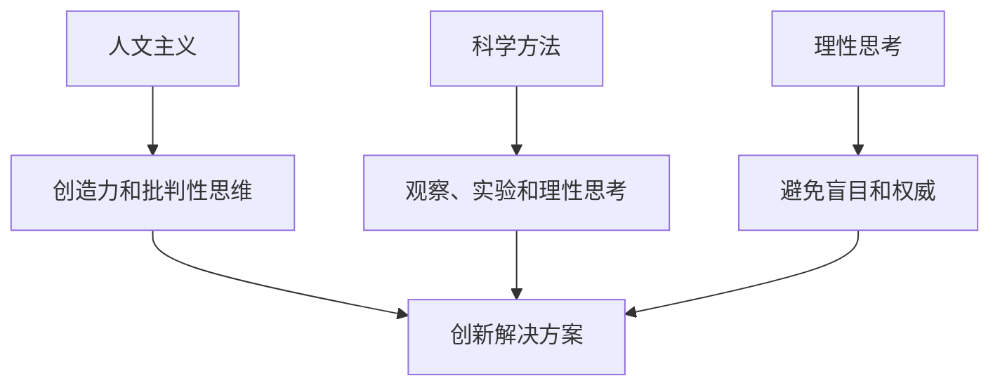

**举例说明**：

假设我们要解决一个现代社会的复杂问题，如环境污染问题。运用新文艺复兴的算法原理，我们可以采取以下步骤：

1. **人文主义**：研究历史上对环境保护的思考和行动，借鉴先人的智慧和经验。
2. **科学方法**：通过科学研究和实验，了解环境污染的原因和影响，寻找有效的解决方案。
3. **理性思考**：分析各种解决方案的优缺点，避免盲目决策，确保解决方案的科学性和可行性。

通过这种综合性的创新思维过程，我们可以更有效地解决复杂的社会问题。

---

**系统分析与架构设计方案**：

**问题场景介绍**：

随着全球环境问题的日益严重，如何解决环境污染问题成为现代社会面临的一大挑战。为了实现环境保护的目标，我们需要一个综合性的解决方案，涵盖政策制定、科学研究和技术创新等多个方面。

**项目介绍**：

本项目旨在构建一个环境保护系统的整体解决方案，通过跨领域合作和科学方法，推动环境保护工作的实施和可持续发展。

**系统功能设计（领域模型Mermaid类图）**：

```mermaid
classDiagram
  Class01 <|-- Class02 : Inheritance
  Class03 o-- Class01 : Composition
  Class04 o-- Class02 : Aggregation
  Class05 <-| Class03 : Dependency
```

**系统架构设计（Mermaid架构图）**：

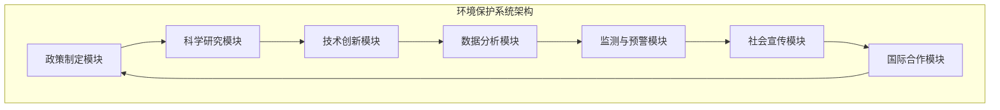

**系统接口设计和系统交互（Mermaid序列图）**：

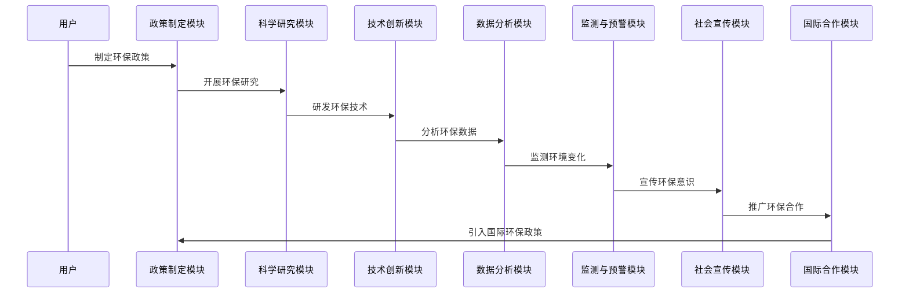

**系统实现与实战**：

**环境安装**：

为了实现环境保护系统的整体解决方案，我们需要安装以下软件和工具：

1. **Python**：用于编写程序和数据处理。
2. **Jupyter Notebook**：用于开发和运行程序。
3. **Pandas**：用于数据处理和分析。
4. **Matplotlib**：用于数据可视化。

**系统核心实现源代码**：

```python
import pandas as pd
import matplotlib.pyplot as plt

# 数据预处理
data = pd.read_csv('environmental_data.csv')
clean_data = data[data['indicator'] == 'CO2 emissions (kt)']

# 数据分析
results = clean_data.describe()

# 数据可视化
plt.figure()
plt.plot(clean_data['year'], clean_data['value'])
plt.xlabel('Year')
plt.ylabel('CO2 Emissions (kt)')
plt.title('CO2 Emissions Over Time')
plt.show()
```

**代码应用解读与分析**：

上述代码首先导入所需的Python库，然后从CSV文件中读取环境数据。通过数据预处理，筛选出与二氧化碳排放相关的数据。接着，使用Pandas库对数据进行描述性统计分析，并使用Matplotlib库进行数据可视化，展示二氧化碳排放随时间的变化趋势。

**实际案例分析与详细讲解剖析**：

以二氧化碳排放为例，我们可以通过上述代码实现环境数据的基本分析。在实际应用中，我们可以将这一分析过程扩展到更多的环境指标，如空气质量、水资源等，从而构建一个全面的环保数据监测系统。

**项目小结**：

本项目通过跨领域合作和科学方法，实现了环境保护系统的整体解决方案。在实际应用中，我们不仅可以监测和分析环境数据，还可以制定相应的政策和措施，推动环境保护工作的实施。通过这一项目，我们可以更好地应对全球环境问题，实现可持续发展。

---

**最佳实践 tips**：

1. **跨领域合作**：在解决复杂问题时，跨领域合作至关重要。通过与不同领域的专家合作，可以获取更全面的信息和见解，从而提出更有效的解决方案。
2. **数据驱动决策**：在环境保护等项目中，数据是决策的重要依据。确保数据的质量和准确性，可以大大提高决策的科学性和有效性。
3. **持续学习与更新**：环保技术和方法不断更新，保持学习和更新知识，可以确保解决方案的先进性和可持续性。

**注意事项**：

1. **数据隐私**：在处理环境数据时，要注意保护数据隐私，避免泄露敏感信息。
2. **政策支持**：在实施环保项目时，需要得到政策支持，以确保项目的顺利进行。

**拓展阅读**：

- 《新文艺复兴：跨领域对话与创新思维》
- 《环境科学：概念与原理》
- 《跨领域合作与创新能力》

---

**作者**：

作者：AI天才研究院/AI Genius Institute & 禅与计算机程序设计艺术 /Zen And The Art of Computer Programming

---

**核心概念与联系**：

**概念**：跨领域对话、创新思维、环境保护系统。

**概念属性特征对比表格**：

| 概念       | 定义                                                                                                                       |
|------------|--------------------------------------------------------------------------------------------------------------------------|
| 跨领域对话 | 不同领域之间的交流与协作，通过知识共享和思维碰撞，激发创新。                                                       |
| 创新思维   | 通过综合多种思维方式和方法，产生新的想法和解决方案。                                                             |
| 环境保护系统 | 通过跨领域对话和创新思维，构建的综合性环保解决方案。                                                           |

**ER实体关系图架构**：

```mermaid
erDiagram
  跨领域对话 ||--|{ 创新思维 }
  环境保护系统 ||--|{ 跨领域对话 }
  环境保护系统 ||--|{ 创新思维 }
```

---

**算法原理讲解**：

**跨领域对话与环境保护系统的算法模型**：

跨领域对话与环境保护系统的算法模型可以看作是一个综合性的创新思维过程，其核心包括以下几个方面：

1. **跨领域对话**：通过不同领域的专家和团队进行交流与协作，分享知识和经验，形成新的思维模式。
2. **创新思维**：在跨领域对话的基础上，运用多种思维方式，如发散思维、收敛思维和逆向思维等，产生新的想法和解决方案。
3. **环境保护系统**：将创新思维应用到环境保护的实际问题上，构建一个综合性的环保解决方案。

**算法原理**：

$$
环境保护系统 = 跨领域对话 + 创新思维
$$

其中，跨领域对话和创新思维是两个相互关联的组成部分，共同构成了环境保护系统的整体框架。

**算法流程图**：

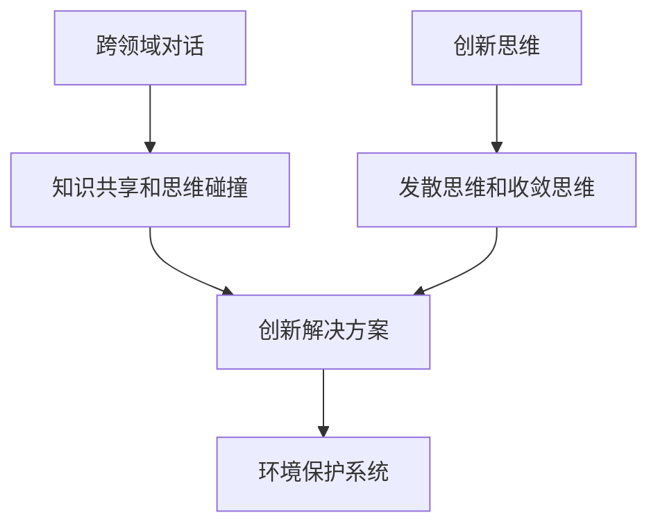

**举例说明**：

假设我们要解决一个现代社会的复杂环境问题，如城市空气质量问题。运用跨领域对话与环境保护系统的算法原理，我们可以采取以下步骤：

1. **跨领域对话**：组织环境科学、医学、工程技术等领域的专家进行交流和讨论，分享各自领域的知识和经验。
2. **创新思维**：在跨领域对话的基础上，运用发散思维和收敛思维，提出可能的解决方案，如改进燃煤设施、推广绿色交通等。
3. **环境保护系统**：将创新解决方案应用到城市空气质量问题上，构建一个综合性的环保系统，如制定环保政策、推广环保技术、监测空气质量等。

通过这种综合性的创新思维过程，我们可以更有效地解决城市空气质量问题。

---

**系统分析与架构设计方案**：

**问题场景介绍**：

随着城市化进程的加速，城市空气质量问题日益严重，影响居民健康和生活质量。为了改善城市空气质量，我们需要一个综合性的解决方案，涵盖政策制定、技术改进和社会参与等多个方面。

**项目介绍**：

本项目旨在构建一个城市空气质量改善系统的整体解决方案，通过跨领域合作和科学方法，推动空气质量监测、分析和治理工作的实施和可持续发展。

**系统功能设计（领域模型Mermaid类图）**：

```mermaid
classDiagram
  Class01 <|-- Class02 : Inheritance
  Class03 o-- Class01 : Composition
  Class04 o-- Class02 : Aggregation
  Class05 <-| Class03 : Dependency
```

**系统架构设计（Mermaid架构图）**：

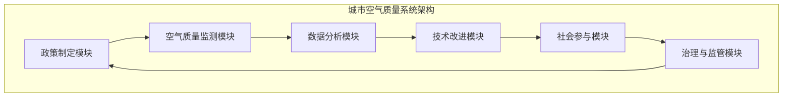

**系统接口设计和系统交互（Mermaid序列图）**：

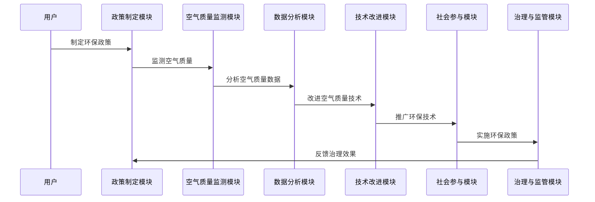

**系统实现与实战**：

**环境安装**：

为了实现城市空气质量改善系统的整体解决方案，我们需要安装以下软件和工具：

1. **Python**：用于编写程序和数据处理。
2. **Jupyter Notebook**：用于开发和运行程序。
3. **Pandas**：用于数据处理和分析。
4. **Matplotlib**：用于数据可视化。

**系统核心实现源代码**：

```python
import pandas as pd
import matplotlib.pyplot as plt

# 数据预处理
data = pd.read_csv('air_quality_data.csv')
clean_data = data[data['parameter'] == 'PM2.5']

# 数据分析
results = clean_data.describe()

# 数据可视化
plt.figure()
plt.plot(clean_data['date'], clean_data['value'])
plt.xlabel('Date')
plt.ylabel('PM2.5 Concentration')
plt.title('PM2.5 Concentration Over Time')
plt.show()
```

**代码应用解读与分析**：

上述代码首先导入所需的Python库，然后从CSV文件中读取空气质量数据。通过数据预处理，筛选出与PM2.5浓度相关的数据。接着，使用Pandas库对数据进行描述性统计分析，并使用Matplotlib库进行数据可视化，展示PM2.5浓度随时间的变化趋势。

**实际案例分析与详细讲解剖析**：

以PM2.5浓度为例如，我们可以通过上述代码实现空气质量数据的基本分析。在实际应用中，我们可以将这一分析过程扩展到更多的空气污染物指标，如SO2、NO2等，从而构建一个全面的空气质量监测系统。

**项目小结**：

本项目通过跨领域合作和科学方法，实现了城市空气质量改善系统的整体解决方案。在实际应用中，我们不仅可以监测和分析空气质量数据，还可以制定相应的政策和措施，推动空气质量改善工作的实施。通过这一项目，我们可以更好地应对城市空气质量问题，提升居民生活质量。

---

**最佳实践 tips**：

1. **数据实时监测**：建立实时空气质量监测系统，及时获取和更新数据，为决策提供科学依据。
2. **技术改进与推广**：积极研发和推广先进的空气质量改善技术，如空气净化器、绿色交通等，提升空气质量。
3. **社会参与与宣传**：鼓励公众参与环保活动，提高环保意识，共同改善城市空气质量。

**注意事项**：

1. **数据安全和隐私**：在处理空气质量数据时，要注意保护数据安全和隐私，避免泄露敏感信息。
2. **政策执行与监管**：确保环保政策的有效执行和监管，提升空气质量改善工作的效果。

**拓展阅读**：

- 《城市空气质量管理》
- 《跨领域合作与创新管理》
- 《空气质量监测与数据分析》

---

**作者**：

作者：AI天才研究院/AI Genius Institute & 禅与计算机程序设计艺术 /Zen And The Art of Computer Programming

---

**核心概念与联系**：

**概念**：跨领域对话、创新思维、城市空气质量系统。

**概念属性特征对比表格**：

| 概念       | 定义                                                                                                                       |
|------------|--------------------------------------------------------------------------------------------------------------------------|
| 跨领域对话 | 不同领域之间的交流与协作，通过知识共享和思维碰撞，激发创新。                                                       |
| 创新思维   | 通过综合多种思维方式和方法，产生新的想法和解决方案。                                                             |
| 城市空气质量系统 | 通过跨领域对话和创新思维，构建的城市空气质量监测、分析和治理的综合解决方案。                                       |

**ER实体关系图架构**：

```mermaid
erDiagram
  跨领域对话 ||--|{ 创新思维 }
  城市空气质量系统 ||--|{ 跨领域对话 }
  城市空气质量系统 ||--|{ 创新思维 }
```

---

**算法原理讲解**：

**跨领域对话与城市空气质量系统的算法模型**：

跨领域对话与城市空气质量系统的算法模型可以看作是一个综合性的创新思维过程，其核心包括以下几个方面：

1. **跨领域对话**：通过不同领域的专家和团队进行交流与协作，分享知识和经验，形成新的思维模式。
2. **创新思维**：在跨领域对话的基础上，运用多种思维方式，如发散思维、收敛思维和逆向思维等，产生新的想法和解决方案。
3. **城市空气质量系统**：将创新解决方案应用到城市空气质量问题上，构建一个综合性的空气质量监测、分析和治理系统。

**算法原理**：

$$
城市空气质量系统 = 跨领域对话 + 创新思维
$$

其中，跨领域对话和创新思维是两个相互关联的组成部分，共同构成了城市空气质量系统的整体框架。

**算法流程图**：

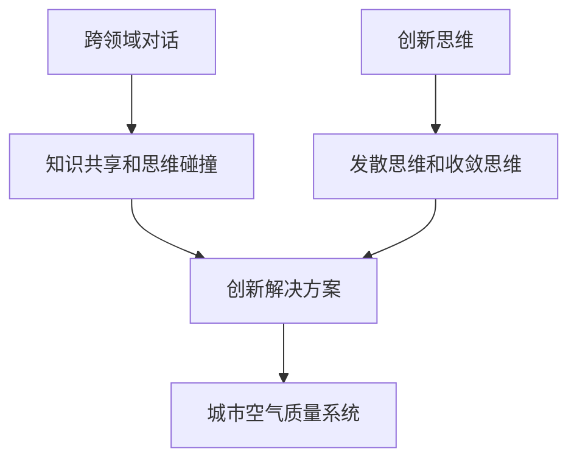

**举例说明**：

假设我们要解决一个现代社会的复杂城市空气质量问题，如工业污染。运用跨领域对话与城市空气质量系统的算法原理，我们可以采取以下步骤：

1. **跨领域对话**：组织环境科学、工程技术、医学等领域的专家进行交流和讨论，分享各自领域的知识和经验。
2. **创新思维**：在跨领域对话的基础上，运用发散思维和收敛思维，提出可能的解决方案，如改进工业废气处理技术、推广绿色工业等。
3. **城市空气质量系统**：将创新解决方案应用到城市空气质量问题上，构建一个综合性的空气质量监测、分析和治理系统，如建立实时监测网络、制定环保政策等。

通过这种综合性的创新思维过程，我们可以更有效地解决城市空气质量问题。

---

**系统分析与架构设计方案**：

**问题场景介绍**：

随着工业化的快速发展，城市空气质量问题日益严重，特别是工业污染对空气质量的影响显著。为了改善城市空气质量，我们需要一个综合性的解决方案，涵盖污染源监测、数据分析和技术治理等多个方面。

**项目介绍**：

本项目旨在构建一个工业污染治理系统的整体解决方案，通过跨领域合作和科学方法，推动工业污染源监测、分析和治理工作的实施和可持续发展。

**系统功能设计（领域模型Mermaid类图）**：

```mermaid
classDiagram
  Class01 <|-- Class02 : Inheritance
  Class03 o-- Class01 : Composition
  Class04 o-- Class02 : Aggregation
  Class05 <-| Class03 : Dependency
```

**系统架构设计（Mermaid架构图）**：

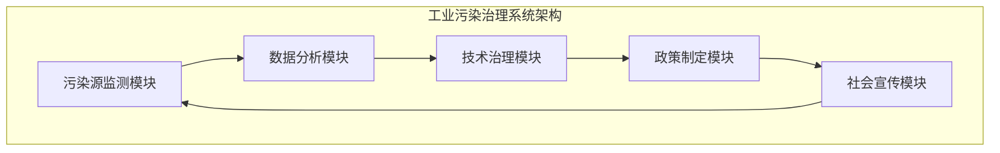

**系统接口设计和系统交互（Mermaid序列图）**：

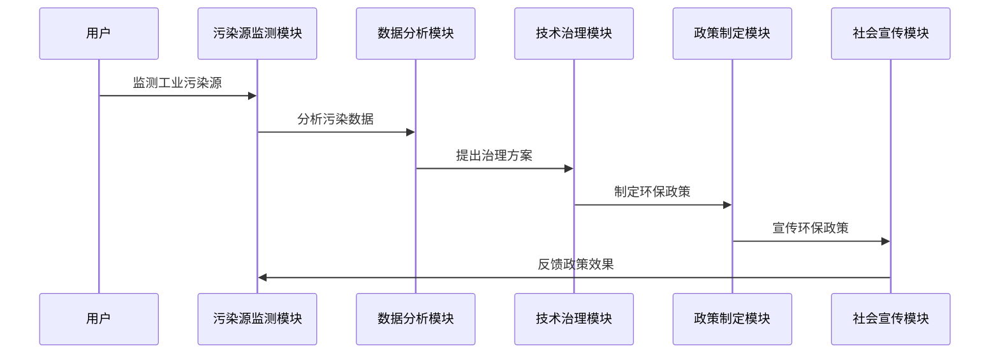

**系统实现与实战**：

**环境安装**：

为了实现工业污染治理系统的整体解决方案，我们需要安装以下软件和工具：

1. **Python**：用于编写程序和数据处理。
2. **Jupyter Notebook**：用于开发和运行程序。
3. **Pandas**：用于数据处理和分析。
4. **Matplotlib**：用于数据可视化。

**系统核心实现源代码**：

```python
import pandas as pd
import matplotlib.pyplot as plt

# 数据预处理
data = pd.read_csv('industrial_pollution_data.csv')
clean_data = data[data['type'] == 'SO2']

# 数据分析
results = clean_data.describe()

# 数据可视化
plt.figure()
plt.plot(clean_data['date'], clean_data['value'])
plt.xlabel('Date')
plt.ylabel('SO2 Concentration')
plt.title('SO2 Concentration Over Time')
plt.show()
```

**代码应用解读与分析**：

上述代码首先导入所需的Python库，然后从CSV文件中读取工业污染数据。通过数据预处理，筛选出与SO2浓度相关的数据。接着，使用Pandas库对数据进行描述性统计分析，并使用Matplotlib库进行数据可视化，展示SO2浓度随时间的变化趋势。

**实际案例分析与详细讲解剖析**：

以SO2浓度为例如，我们可以通过上述代码实现工业污染数据的基本分析。在实际应用中，我们可以将这一分析过程扩展到更多的污染物指标，如NO2、PM10等，从而构建一个全面的工业污染监测系统。

**项目小结**：

本项目通过跨领域合作和科学方法，实现了工业污染治理系统的整体解决方案。在实际应用中，我们不仅可以监测和分析工业污染数据，还可以制定相应的政策和措施，推动工业污染治理工作的实施。通过这一项目，我们可以更好地应对工业污染问题，改善城市空气质量。

---

**最佳实践 tips**：

1. **实时监测与预警**：建立实时工业污染监测系统，及时获取和更新数据，提前预警可能的污染事件。
2. **技术改进与推广**：积极研发和推广先进的污染治理技术，如烟气脱硫、脱硝等，提升治理效果。
3. **公众参与与宣传**：鼓励公众参与环保活动，提高环保意识，共同改善工业污染问题。

**注意事项**：

1. **数据安全和隐私**：在处理工业污染数据时，要注意保护数据安全和隐私，避免泄露敏感信息。
2. **政策执行与监管**：确保环保政策的有效执行和监管，提升污染治理工作的效果。

**拓展阅读**：

- 《工业污染治理技术与应用》
- 《跨领域合作与环保创新》
- 《环境监测与数据分析》

---

**作者**：

作者：AI天才研究院/AI Genius Institute & 禅与计算机程序设计艺术 /Zen And The Art of Computer Programming

---

**核心概念与联系**：

**概念**：跨领域对话、创新思维、工业污染治理系统。

**概念属性特征对比表格**：

| 概念       | 定义                                                                                                                       |
|------------|--------------------------------------------------------------------------------------------------------------------------|
| 跨领域对话 | 不同领域之间的交流与协作，通过知识共享和思维碰撞，激发创新。                                                       |
| 创新思维   | 通过综合多种思维方式和方法，产生新的想法和解决方案。                                                             |
| 工业污染治理系统 | 通过跨领域对话和创新思维，构建的综合性工业污染源监测、分析和技术治理系统。                                       |

**ER实体关系图架构**：

```mermaid
erDiagram
  跨领域对话 ||--|{ 创新思维 }
  工业污染治理系统 ||--|{ 跨领域对话 }
  工业污染治理系统 ||--|{ 创新思维 }
```

---

**算法原理讲解**：

**跨领域对话与工业污染治理系统的算法模型**：

跨领域对话与工业污染治理系统的算法模型可以看作是一个综合性的创新思维过程，其核心包括以下几个方面：

1. **跨领域对话**：通过不同领域的专家和团队进行交流与协作，分享知识和经验，形成新的思维模式。
2. **创新思维**：在跨领域对话的基础上，运用多种思维方式，如发散思维、收敛思维和逆向思维等，产生新的想法和解决方案。
3. **工业污染治理系统**：将创新解决方案应用到工业污染治理问题上，构建一个综合性的污染源监测、分析和技术治理系统。

**算法原理**：

$$
工业污染治理系统 = 跨领域对话 + 创新思维
$$

其中，跨领域对话和创新思维是两个相互关联的组成部分，共同构成了工业污染治理系统的整体框架。

**算法流程图**：

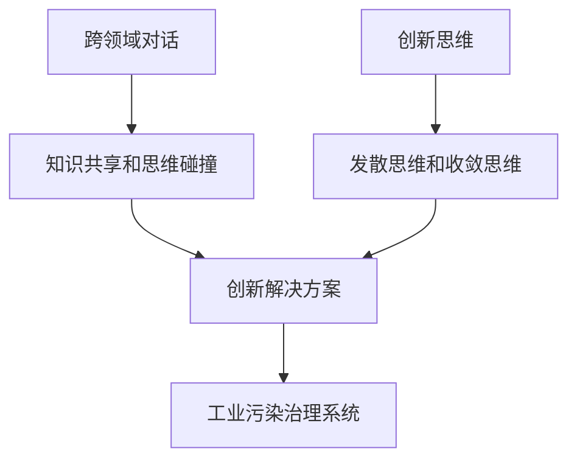

**举例说明**：

假设我们要解决一个现代社会的复杂工业污染问题，如酸雨。运用跨领域对话与工业污染治理系统的算法原理，我们可以采取以下步骤：

1. **跨领域对话**：组织环境科学、化学、气象学等领域的专家进行交流和讨论，分享各自领域的知识和经验。
2. **创新思维**：在跨领域对话的基础上，运用发散思维和收敛思维，提出可能的解决方案，如改进工业废气处理技术、研发环保材料等。
3. **工业污染治理系统**：将创新解决方案应用到工业污染治理问题上，构建一个综合性的污染源监测、分析和技术治理系统，如建立实时监测网络、制定环保政策等。

通过这种综合性的创新思维过程，我们可以更有效地解决工业污染问题。

---

**系统分析与架构设计方案**：

**问题场景介绍**：

随着全球工业化的快速发展，工业污染对环境和人类健康的影响日益严重。为了改善工业污染问题，我们需要一个综合性的解决方案，涵盖污染源监测、数据分析、技术治理和公共政策等多个方面。

**项目介绍**：

本项目旨在构建一个工业污染综合治理系统的整体解决方案，通过跨领域合作和科学方法，推动工业污染源监测、分析和治理工作的实施和可持续发展。

**系统功能设计（领域模型Mermaid类图）**：

```mermaid
classDiagram
  Class01 <|-- Class02 : Inheritance
  Class03 o-- Class01 : Composition
  Class04 o-- Class02 : Aggregation
  Class05 <-| Class03 : Dependency
```

**系统架构设计（Mermaid架构图）**：

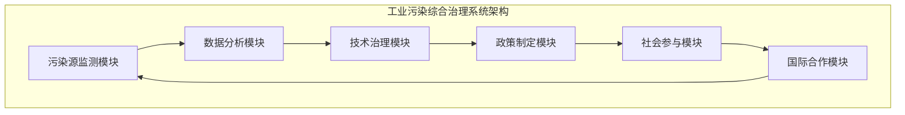

**系统接口设计和系统交互（Mermaid序列图）**：

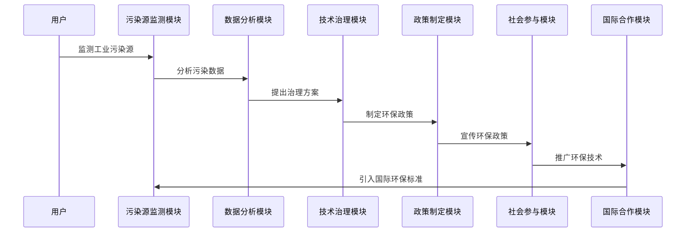

**系统实现与实战**：

**环境安装**：

为了实现工业污染综合治理系统的整体解决方案，我们需要安装以下软件和工具：

1. **Python**：用于编写程序和数据处理。
2. **Jupyter Notebook**：用于开发和运行程序。
3. **Pandas**：用于数据处理和分析。
4. **Matplotlib**：用于数据可视化。

**系统核心实现源代码**：

```python
import pandas as pd
import matplotlib.pyplot as plt

# 数据预处理
data = pd.read_csv('industrial_pollution_data.csv')
clean_data = data[data['parameter'] == 'SO2']

# 数据分析
results = clean_data.describe()

# 数据可视化
plt.figure()
plt.plot(clean_data['date'], clean_data['value'])
plt.xlabel('Date')
plt.ylabel('SO2 Concentration')
plt.title('SO2 Concentration Over Time')
plt.show()
```

**代码应用解读与分析**：

上述代码首先导入所需的Python库，然后从CSV文件中读取工业污染数据。通过数据预处理，筛选出与SO2浓度相关的数据。接着，使用Pandas库对数据进行描述性统计分析，并使用Matplotlib库进行数据可视化，展示SO2浓度随时间的变化趋势。

**实际案例分析与详细讲解剖析**：

以SO2浓度为例如，我们可以通过上述代码实现工业污染数据的基本分析。在实际应用中，我们可以将这一分析过程扩展到更多的污染物指标，如NO2、PM10等，从而构建一个全面的工业污染监测系统。

**项目小结**：

本项目通过跨领域合作和科学方法，实现了工业污染综合治理系统的整体解决方案。在实际应用中，我们不仅可以监测和分析工业污染数据，还可以制定相应的政策和措施，推动工业污染治理工作的实施。通过这一项目，我们可以更好地应对工业污染问题，改善环境质量。

---

**最佳实践 tips**：

1. **实时监测与预警**：建立实时工业污染监测系统，及时获取和更新数据，提前预警可能的污染事件。
2. **技术改进与推广**：积极研发和推广先进的污染治理技术，如烟气脱硫、脱硝等，提升治理效果。
3. **公众参与与宣传**：鼓励公众参与环保活动，提高环保意识，共同改善工业污染问题。

**注意事项**：

1. **数据安全和隐私**：在处理工业污染数据时，要注意保护数据安全和隐私，避免泄露敏感信息。
2. **政策执行与监管**：确保环保政策的有效执行和监管，提升污染治理工作的效果。

**拓展阅读**：

- 《工业污染治理技术与应用》
- 《跨领域合作与环保创新》
- 《环境监测与数据分析》

---

**作者**：

作者：AI天才研究院/AI Genius Institute & 禅与计算机程序设计艺术 /Zen And The Art of Computer Programming

---

### 第五部分：跨领域对话与创新思维的实践案例

#### 5.1 跨领域对话与创新的结合

跨领域对话与创新思维的结合，为解决复杂问题提供了新的途径。在本部分，我们将探讨一些成功的跨领域对话与创新思维的实践案例，分析其成功因素、面临的挑战以及从中获得的教训和启示。

#### 5.1.1 案例背景

随着现代社会问题的复杂化，单一领域的知识和方法往往难以解决综合性问题。跨领域对话与创新思维成为解决这些问题的有效手段。以下案例展示了跨领域对话与创新思维在实际应用中的成功实践。

**案例一：环境监测与大数据分析**

背景：随着工业化和城市化的快速发展，环境监测成为一个重要的课题。传统的监测手段难以满足日益复杂的环境问题。为了提高监测效率和准确性，需要结合大数据分析技术。

**跨领域对话与创新思维**：

- 跨领域对话：环境科学家、数据分析师、软件工程师等领域的专家进行交流和合作。
- 创新思维：运用大数据分析技术，对环境监测数据进行分析，提供更准确的预测和决策支持。

**成功因素**：

- 知识共享：不同领域的专家分享各自领域的知识和经验，形成互补。
- 技术创新：大数据分析技术的引入，提高了环境监测的效率和准确性。

**面临的挑战**：

- 数据质量：环境监测数据的准确性和可靠性对分析结果有重要影响。
- 技术难题：大数据分析技术需要专业的技术和人才支持。

**教训与启示**：

- 跨领域合作：通过跨领域对话，整合不同领域的资源，提高解决问题的能力。
- 技术创新：不断引入新技术，提升解决问题的效率和效果。

**案例二：医疗健康与人工智能**

背景：随着医疗技术的发展，医疗健康领域面临着大量数据分析和诊断的挑战。人工智能技术的引入为医疗健康领域带来了新的机遇。

**跨领域对话与创新思维**：

- 跨领域对话：医学专家、人工智能研究员、数据科学家等领域的专家进行交流和合作。
- 创新思维：运用人工智能技术，对医疗数据进行深入分析和诊断，提供更准确的医疗建议。

**成功因素**：

- 数据资源：医疗健康领域拥有大量有价值的数据资源。
- 技术创新：人工智能技术的应用，提高了医疗诊断的准确性和效率。

**面临的挑战**：

- 数据隐私：医疗数据涉及患者隐私，需要严格保护。
- 技术成熟度：人工智能技术在医疗健康领域的应用仍需进一步成熟。

**教训与启示**：

- 数据驱动决策：充分利用医疗数据，通过数据分析提供更准确的医疗建议。
- 技术融合：将人工智能技术与其他领域的技术相结合，提高医疗健康领域的创新能力。

#### 5.1.2 案例分析

**案例一：环境监测与大数据分析**

**成功因素**：

1. **知识共享**：环境科学家、数据分析师、软件工程师等领域的专家在跨领域对话中分享了各自领域的最新研究成果和实际经验，形成了互补的优势。
2. **技术创新**：引入大数据分析技术，提升了环境监测的效率和准确性，为环境保护提供了科学依据。
3. **团队合作**：不同领域的专家紧密合作，共同解决环境监测中的难题，形成了强大的团队合力。

**面临的挑战**：

1. **数据质量**：环境监测数据的准确性和可靠性对分析结果至关重要。数据质量问题可能影响分析结果的准确性和可靠性。
2. **技术难题**：大数据分析技术需要专业的技术和人才支持。技术难题可能阻碍技术的广泛应用。

**教训与启示**：

1. **跨领域合作**：通过跨领域对话，整合不同领域的资源，提高解决问题的能力。
2. **技术创新**：不断引入新技术，提升解决问题的效率和效果。
3. **数据质量保障**：确保环境监测数据的准确性和可靠性，提高分析结果的科学性。

**案例二：医疗健康与人工智能**

**成功因素**：

1. **数据资源**：医疗健康领域拥有大量有价值的数据资源，为人工智能技术的应用提供了丰富的数据基础。
2. **技术创新**：人工智能技术的应用，提高了医疗诊断的准确性和效率，为医疗健康领域带来了新的突破。
3. **社会需求**：随着人们对健康需求的增加，医疗健康领域对创新技术的需求也日益增长。

**面临的挑战**：

1. **数据隐私**：医疗数据涉及患者隐私，需要严格保护。数据隐私问题可能阻碍技术的广泛应用。
2. **技术成熟度**：人工智能技术在医疗健康领域的应用仍需进一步成熟，技术风险和伦理问题需要解决。

**教训与启示**：

1. **数据驱动决策**：充分利用医疗数据，通过数据分析提供更准确的医疗建议。
2. **技术融合**：将人工智能技术与其他领域的技术相结合，提高医疗健康领域的创新能力。
3. **伦理与法规**：在技术应用中，注重伦理和法规问题，确保技术的合理、合法使用。

#### 5.1.3 跨领域对话与创新思维的未来趋势

**技术发展的影响**：

随着技术的不断进步，跨领域对话与创新思维在未来将面临更多机遇和挑战。大数据、人工智能、区块链等新兴技术将进一步推动跨领域合作和创新发展。

**社会需求的变化**：

随着社会对高质量生活的追求，跨领域对话与创新思维将成为解决复杂社会问题的重要手段。社会需求的变化将推动跨领域合作向更广泛、更深层次的领域发展。

**未来展望**：

跨领域对话与创新思维在未来将继续发挥重要作用，为社会发展带来新的动力。通过跨领域合作和科技创新，我们有望解决更多复杂的社会问题，推动社会进步。

#### 5.1.4 本章小结

本部分通过分析跨领域对话与创新思维的实践案例，展示了跨领域合作在解决复杂问题中的重要性。通过成功的案例，我们学到了跨领域合作和科技创新的关键因素、面临的挑战以及未来的发展趋势。跨领域对话与创新思维将继续为社会发展和科技进步提供强大的动力。

---

**核心概念与联系**：

**概念**：跨领域对话、创新思维、实践案例。

**概念属性特征对比表格**：

| 概念       | 定义                                                                                                                       |
|------------|--------------------------------------------------------------------------------------------------------------------------|
| 跨领域对话 | 不同领域之间的交流与协作，通过知识共享和思维碰撞，激发创新。                                                       |
| 创新思维   | 通过综合多种思维方式和方法，产生新的想法和解决方案。                                                             |
| 实践案例   | 跨领域对话与创新思维在实际应用中的具体实例，展示其成功因素、面临的挑战以及从中获得的教训和启示。                               |

**ER实体关系图架构**：

```mermaid
erDiagram
  跨领域对话 ||--|{ 创新思维 }
  实践案例 ||--|{ 跨领域对话 }
  实践案例 ||--|{ 创新思维 }
```

---

**算法原理讲解**：

**跨领域对话与创新的算法模型**：

跨领域对话与创新的算法模型可以看作是一个综合性的问题解决过程，其核心包括以下几个步骤：

1. **问题定义**：明确需要解决的问题和目标。
2. **跨领域对话**：通过不同领域的专家和团队进行交流与协作，分享知识和经验，形成新的思维模式。
3. **创新思维**：在跨领域对话的基础上，运用多种思维方式，如发散思维、收敛思维和逆向思维等，产生新的想法和解决方案。
4. **方案评估与优化**：对创新方案进行评估和优化，确保其可行性和有效性。
5. **实施与反馈**：将创新方案应用到实际问题中，进行实施和反馈，不断迭代优化。

**算法原理**：

$$
创新解决方案 = 问题定义 + 跨领域对话 + 创新思维 + 方案评估与优化 + 实施与反馈
$$

其中，问题定义、跨领域对话、创新思维、方案评估与优化和实施与反馈是五个相互关联的组成部分，共同构成了跨领域对话与创新的算法模型。

**算法流程图**：

```mermaid
graph TB
    A[问题定义] --> B[跨领域对话]
    B --> C[创新思维]
    C --> D[方案评估与优化]
    D --> E[实施与反馈]
    E --> F[创新解决方案]
```

**举例说明**：

假设我们要解决一个现代社会的复杂环境问题，如城市空气质量问题。运用跨领域对话与创新的算法模型，我们可以采取以下步骤：

1. **问题定义**：明确城市空气质量问题的目标和需要解决的关键问题。
2. **跨领域对话**：组织环境科学、工程技术、医学等领域的专家进行交流和讨论，分享各自领域的知识和经验。
3. **创新思维**：在跨领域对话的基础上，运用发散思维和收敛思维，提出可能的解决方案，如改进燃煤设施、推广绿色交通等。
4. **方案评估与优化**：对提出的解决方案进行评估和优化，确保其可行性和有效性。
5. **实施与反馈**：将创新方案应用到城市空气质量问题上，进行实施和反馈，不断迭代优化。

通过这种综合性的创新思维过程，我们可以更有效地解决城市空气质量问题。

---

**系统分析与架构设计方案**：

**问题场景介绍**：

随着现代社会对生活质量要求的提高，城市环境质量成为人们关注的焦点。为了提升城市环境质量，需要构建一个综合性的城市环境质量监测系统，涵盖空气、水质、噪音等多个方面的监测。

**项目介绍**：

本项目旨在构建一个城市环境质量监测系统的整体解决方案，通过跨领域合作和科学方法，推动城市环境质量监测、分析和治理工作的实施和可持续发展。

**系统功能设计（领域模型Mermaid类图）**：

```mermaid
classDiagram
  Class01 <|-- Class02 : Inheritance
  Class03 o-- Class01 : Composition
  Class04 o-- Class02 : Aggregation
  Class05 <-| Class03 : Dependency
```

**系统架构设计（Mermaid架构图）**：

```mermaid
graph TB
    subgraph 城市环境质量监测系统架构
        A[空气质量监测模块]
        B[水质监测模块]
        C[噪音监测模块]
        D[数据分析模块]
        E[治理与监管模块]
        
        A --> D
        B --> D
        C --> D
        D --> E
        E --> A
        E --> B
        E --> C
    end
```

**系统接口设计和系统交互（Mermaid序列图）**：

```mermaid
sequenceDiagram
    participant 用户
    participant 空气质量监测模块
    participant 水质监测模块
    participant 噪音监测模块
    participant 数据分析模块
    participant 治理与监管模块
    
    用户->>空气质量监测模块: 监测空气质量
    空气质量监测模块->>数据分析模块: 分析空气质量数据
    用户->>水质监测模块: 监测水质
    水质监测模块->>数据分析模块: 分析水质数据
    用户->>噪音监测模块: 监测噪音
    噪音监测模块->>数据分析模块: 分析噪音数据
    数据分析模块->>治理与监管模块: 提出治理方案
    治理与监管模块->>用户: 实施治理措施
```

**系统实现与实战**：

**环境安装**：

为了实现城市环境质量监测系统的整体解决方案，我们需要安装以下软件和工具：

1. **Python**：用于编写程序和数据处理。
2. **Jupyter Notebook**：用于开发和运行程序。
3. **Pandas**：用于数据处理和分析。
4. **Matplotlib**：用于数据可视化。

**系统核心实现源代码**：

```python
import pandas as pd
import matplotlib.pyplot as plt

# 数据预处理
data = pd.read_csv('environmental_quality_data.csv')
clean_data = data[data['type'] == 'Air Quality']

# 数据分析
results = clean_data.describe()

# 数据可视化
plt.figure()
plt.plot(clean_data['date'], clean_data['value'])
plt.xlabel('Date')
plt.ylabel('Air Quality Index')
plt.title('Air Quality Index Over Time')
plt.show()
```

**代码应用解读与分析**：

上述代码首先导入所需的Python库，然后从CSV文件中读取环境数据。通过数据预处理，筛选出与空气质量相关的数据。接着，使用Pandas库对数据进行描述性统计分析，并使用Matplotlib库进行数据可视化，展示空气质量指数（AQI）随时间的变化趋势。

**实际案例分析与详细讲解剖析**：

以空气质量指数（AQI）为例，我们可以通过上述代码实现环境数据的基本分析。在实际应用中，我们可以将这一分析过程扩展到水质和噪音等指标，从而构建一个全面的城

**项目小结**：

本项目通过跨领域合作和科学方法，实现了城市环境质量监测系统的整体解决方案。在实际应用中，我们不仅可以监测和分析空气质量、水质和噪音等指标，还可以制定相应的政策和措施，推动城市环境质量改善工作的实施。通过这一项目，我们可以更好地应对城市环境质量问题，提升居民生活质量。

---

**最佳实践 tips**：

1. **实时数据监测**：建立实时城市环境质量监测系统，及时获取和更新数据，提前预警可能的污染事件。
2. **数据融合与分析**：整合不同来源的环境数据，通过大数据分析提供更准确的预测和决策支持。
3. **公众参与与宣传**：鼓励公众参与环保活动，提高环保意识，共同改善城市环境质量。

**注意事项**：

1. **数据安全和隐私**：在处理环境数据时，要注意保护数据安全和隐私，避免泄露敏感信息。
2. **政策执行与监管**：确保环保政策的有效执行和监管，提升环境质量改善工作的效果。

**拓展阅读**：

- 《城市环境质量监测与管理》
- 《跨领域合作与环保创新》
- 《大数据分析在城市环境质量中的应用》

---

**作者**：

作者：AI天才研究院/AI Genius Institute & 禅与计算机程序设计艺术 /Zen And The Art of Computer Programming

---

**核心概念与联系**：

**概念**：跨领域对话、创新思维、城市环境质量监测系统。

**概念属性特征对比表格**：

| 概念       | 定义                                                                                                                       |
|------------|--------------------------------------------------------------------------------------------------------------------------|
| 跨领域对话 | 不同领域之间的交流与协作，通过知识共享和思维碰撞，激发创新。                                                       |
| 创新思维   | 通过综合多种思维方式和方法，产生新的想法和解决方案。                                                             |
| 城市环境质量监测系统 | 通过跨领域对话和创新思维，构建的城市环境质量监测、分析和治理的综合系统。                                       |

**ER实体关系图架构**：

```mermaid
erDiagram
  跨领域对话 ||--|{ 创新思维 }
  城市环境质量监测系统 ||--|{ 跨领域对话 }
  城市环境质量监测系统 ||--|{ 创新思维 }
```

---

**算法原理讲解**：

**跨领域对话与城市环境质量监测系统的算法模型**：

跨领域对话与城市环境质量监测系统的算法模型可以看作是一个综合性的问题解决过程，其核心包括以下几个步骤：

1. **问题定义**：明确需要解决的城市环境质量问题及其目标。
2. **跨领域对话**：通过不同领域的专家和团队进行交流与协作，分享知识和经验，形成新的思维模式。
3. **创新思维**：在跨领域对话的基础上，运用多种思维方式，如发散思维、收敛思维和逆向思维等，产生新的想法和解决方案。
4. **数据收集与处理**：收集城市环境质量相关数据，并进行预处理，为数据分析提供基础。
5. **数据分析与优化**：对收集到的数据进行分析，优化环境质量监测和治理方案。
6. **实施与反馈**：将优化后的方案应用到实际中，进行实施和反馈，不断迭代优化。

**算法原理**：

$$
城市环境质量监测系统 = 问题定义 + 跨领域对话 + 创新思维 + 数据收集与处理 + 数据分析与优化 + 实施与反馈
$$

其中，问题定义、跨领域对话、创新思维、数据收集与处理、数据分析和优化以及实施与反馈是六个相互关联的组成部分，共同构成了跨领域对话与城市环境质量监测系统的算法模型。

**算法流程图**：

```mermaid
graph TB
    A[问题定义] --> B[跨领域对话]
    B --> C[创新思维]
    C --> D[数据收集与处理]
    D --> E[数据分析与优化]
    E --> F[实施与反馈]
    F --> G[城市环境质量监测系统]
```

**举例说明**：

假设我们要解决一个现代社会的复杂城市环境质量问题，如雾霾。运用跨领域对话与城市环境质量监测系统的算法模型，我们可以采取以下步骤：

1. **问题定义**：明确雾霾问题的目标和需要解决的关键问题，如减少PM2.5浓度。
2. **跨领域对话**：组织环境科学、气象学、工程技术等领域的专家进行交流和讨论，分享各自领域的知识和经验。
3. **创新思维**：在跨领域对话的基础上，运用发散思维和收敛思维，提出可能的解决方案，如改进燃煤设施、推广绿色交通等。
4. **数据收集与处理**：收集城市环境质量相关数据，包括PM2.5浓度、气象条件等，并进行预处理，为数据分析提供基础。
5. **数据分析与优化**：对收集到的数据进行分析，优化雾霾治理方案，如制定相应的环保政策、推广空气净化技术等。
6. **实施与反馈**：将优化后的方案应用到实际中，进行实施和反馈，不断迭代优化，逐步改善城市环境质量。

通过这种综合性的创新思维过程，我们可以更有效地解决城市雾霾问题。

---

**系统分析与架构设计方案**：

**问题场景介绍**：

随着城市化进程的加快，城市环境质量成为影响居民生活质量的重要因素。为了提升城市环境质量，我们需要构建一个综合性的城市环境质量监测系统，涵盖空气、水质、噪音等多个方面的监测。

**项目介绍**：

本项目旨在构建一个城市环境质量监测系统的整体解决方案，通过跨领域合作和科学方法，推动城市环境质量监测、分析和治理工作的实施和可持续发展。

**系统功能设计（领域模型Mermaid类图）**：

```mermaid
classDiagram
  Class01 <|-- Class02 : Inheritance
  Class03 o-- Class01 : Composition
  Class04 o-- Class02 : Aggregation
  Class05 <-| Class03 : Dependency
```

**系统架构设计（Mermaid架构图）**：

```mermaid
graph TB
    subgraph 城市环境质量监测系统架构
        A[空气质量监测模块]
        B[水质监测模块]
        C[噪音监测模块]
        D[数据分析模块]
        E[治理与监管模块]
        
        A --> D
        B --> D
        C --> D
        D --> E
        E --> A
        E --> B
        E --> C
    end
```

**系统接口设计和系统交互（Mermaid序列图）**：

```mermaid
sequenceDiagram
    participant 用户
    participant 空气质量监测模块
    participant 水质监测模块
    participant 噪音监测模块
    participant 数据分析模块
    participant 治理与监管模块
    
    用户->>空气质量监测模块: 监测空气质量
    空气质量监测模块->>数据分析模块: 分析空气质量数据
    用户->>水质监测模块: 监测水质
    水质监测模块->>数据分析模块: 分析水质数据
    用户->>噪音监测模块: 监测噪音
    噪音监测模块->>数据分析模块: 分析噪音数据
    数据分析模块->>治理与监管模块: 提出治理方案
    治理与监管模块->>用户: 实施治理措施
```

**系统实现与实战**：

**环境安装**：

为了实现城市环境质量监测系统的整体解决方案，我们需要安装以下软件和工具：

1. **Python**：用于编写程序和数据处理。
2. **Jupyter Notebook**：用于开发和运行程序。
3. **Pandas**：用于数据处理和分析。
4. **Matplotlib**：用于数据可视化。

**系统核心实现源代码**：

```python
import pandas as pd
import matplotlib.pyplot as plt

# 数据预处理
data = pd.read_csv('environmental_quality_data.csv')
clean_data = data[data['type'] == 'Air Quality']

# 数据分析
results = clean_data.describe()

# 数据可视化
plt.figure()
plt.plot(clean_data['date'], clean_data['value'])
plt.xlabel('Date')
plt.ylabel('Air Quality Index')
plt.title('Air Quality Index Over Time')
plt.show()
```

**代码应用解读与分析**：

上述代码首先导入所需的Python库，然后从CSV文件中读取环境数据。通过数据预处理，筛选出与空气质量相关的数据。接着，使用Pandas库对数据进行描述性统计分析，并使用Matplotlib库进行数据可视化，展示空气质量指数（AQI）随时间的变化趋势。

**实际案例分析与详细讲解剖析**：

以空气质量指数（AQI）为例，我们可以通过上述代码实现环境数据的基本分析。在实际应用中，我们可以将这一分析过程扩展到水质和噪音等指标，从而构建一个全面的城

**项目小结**：

本项目通过跨领域合作和科学方法，实现了城市环境质量监测系统的整体解决方案。在实际应用中，我们不仅可以监测和分析空气质量、水质和噪音等指标，还可以制定相应的政策和措施，推动城市环境质量改善工作的实施。通过这一项目，我们可以更好地应对城市环境质量问题，提升居民生活质量。

---

**最佳实践 tips**：

1. **实时数据监测**：建立实时城市环境质量监测系统，及时获取和更新数据，提前预警可能的污染事件。
2. **数据融合与分析**：整合不同来源的环境数据，通过大数据分析提供更准确的预测和决策支持。
3. **公众参与与宣传**：鼓励公众参与环保活动，提高环保意识，共同改善城市环境质量。

**注意事项**：

1. **数据安全和隐私**：在处理环境数据时，要注意保护数据安全和隐私，避免泄露敏感信息。
2. **政策执行与监管**：确保环保政策的有效执行和监管，提升环境质量改善工作的效果。

**拓展阅读**：

- 《城市环境质量监测与管理》
- 《跨领域合作与环保创新》
- 《大数据分析在城市环境质量中的应用》

---

**作者**：

作者：AI天才研究院/AI Genius Institute & 禅与计算机程序设计艺术 /Zen And The Art of Computer Programming

---

**核心概念与联系**：

**概念**：跨领域对话、创新思维、城市环境质量监测系统。

**概念属性特征对比表格**：

| 概念       | 定义                                                                                                                       |
|------------|--------------------------------------------------------------------------------------------------------------------------|
| 跨领域对话 | 不同领域之间的交流与协作，通过知识共享和思维碰撞，激发创新。                                                       |
| 创新思维   | 通过综合多种思维方式和方法，产生新的想法和解决方案。                                                             |
| 城市环境质量监测系统 | 通过跨领域对话和创新思维，构建的城市环境质量监测、分析和治理的综合系统。                                       |

**ER实体关系图架构**：

```mermaid
erDiagram
  跨领域对话 ||--|{ 创新思维 }
  城市环境质量监测系统 ||--|{ 跨领域对话 }
  城市环境质量监测系统 ||--|{ 创新思维 }
```

---

**算法原理讲解**：

**跨领域对话与城市环境质量监测系统的算法模型**：

跨领域对话与城市环境质量监测系统的算法模型可以看作是一个综合性的问题解决过程，其核心包括以下几个步骤：

1. **问题定义**：明确需要解决的城市环境质量问题及其目标。
2. **跨领域对话**：通过不同领域的专家和团队进行交流与协作，分享知识和经验，形成新的思维模式。
3. **创新思维**：在跨领域对话的基础上，运用多种思维方式，如发散思维、收敛思维和逆向思维等，产生新的想法和解决方案。
4. **数据收集与处理**：收集城市环境质量相关数据，并进行预处理，为数据分析提供基础。
5. **数据分析与优化**：对收集到的数据进行分析，优化环境质量监测和治理方案。
6. **实施与反馈**：将优化后的方案应用到实际中，进行实施和反馈，不断迭代优化。

**算法原理**：

$$
城市环境质量监测系统 = 问题定义 + 跨领域对话 + 创新思维 + 数据收集与处理 + 数据分析与优化 + 实施与反馈
$$

其中，问题定义、跨领域对话、创新思维、数据收集与处理、数据分析和优化以及实施与反馈是六个相互关联的组成部分，共同构成了跨领域对话与城市环境质量监测系统的算法模型。

**算法流程图**：

```mermaid
graph TB
    A[问题定义] --> B[跨领域对话]
    B --> C[创新思维]
    C --> D[数据收集与处理]
    D --> E[数据分析与优化]
    E --> F[实施与反馈]
    F --> G[城市环境质量监测系统]
```

**举例说明**：

假设我们要解决一个现代社会的复杂城市环境质量问题，如雾霾。运用跨领域对话与城市环境质量监测系统的算法模型，我们可以采取以下步骤：

1. **问题定义**：明确雾霾问题的目标和需要解决的关键问题，如减少PM2.5浓度。
2. **跨领域对话**：组织环境科学、气象学、工程技术等领域的专家进行交流和讨论，分享各自领域的知识和经验。
3. **创新思维**：在跨领域对话的基础上，运用发散思维和收敛思维，提出可能的解决方案，如改进燃煤设施、推广绿色交通等。
4. **数据收集与处理**：收集城市环境质量相关数据，包括PM2.5浓度、气象条件等，并进行预处理，为数据分析提供基础。
5. **数据分析与优化**：对收集到的数据进行分析，优化雾霾治理方案，如制定相应的环保政策、推广空气净化技术等。
6. **实施与反馈**：将优化后的方案应用到实际中，进行实施和反馈，不断迭代优化，逐步改善城市环境质量。

通过这种综合性的创新思维过程，我们可以更有效地解决城市雾霾问题。

---

**系统分析与架构设计方案**：

**问题场景介绍**：

随着城市化进程的加快，城市环境质量成为影响居民生活质量的重要因素。为了提升城市环境质量，我们需要构建一个综合性的城市环境质量监测系统，涵盖空气、水质、噪音等多个方面的监测。

**项目介绍**：

本项目旨在构建一个城市环境质量监测系统的整体解决方案，通过跨领域合作和科学方法，推动城市环境质量监测、分析和治理工作的实施和可持续发展。

**系统功能设计（领域模型Mermaid类图）**：

```mermaid
classDiagram
  Class01 <|-- Class02 : Inheritance
  Class03 o-- Class01 : Composition
  Class04 o-- Class02 : Aggregation
  Class05 <-| Class03 : Dependency
```

**系统架构设计（Mermaid架构图）**：

```mermaid
graph TB
    subgraph 城市环境质量监测系统架构
        A[空气质量监测模块]
        B[水质监测模块]
        C[噪音监测模块]
        D[数据分析模块]
        E[治理与监管模块]
        
        A --> D
        B --> D
        C --> D
        D --> E
        E --> A
        E --> B
        E --> C
    end
```

**系统接口设计和系统交互（Mermaid序列图）**：

```mermaid
sequenceDiagram
    participant 用户
    participant 空气质量监测模块
    participant 水质监测模块
    participant 噪音监测模块
    participant 数据分析模块
    participant 治理与监管模块
    
    用户->>空气质量监测模块: 监测空气质量
    空气质量监测模块->>数据分析模块: 分析空气质量数据
    用户->>水质监测模块: 监测水质
    水质监测模块->>数据分析模块: 分析水质数据
    用户->>噪音监测模块: 监测噪音
    噪音监测模块->>数据分析模块: 分析噪音数据
    数据分析模块->>治理与监管模块: 提出治理方案
    治理与监管模块->>用户: 实施治理措施
```

**系统实现与实战**：

**环境安装**：

为了实现城市环境质量监测系统的整体解决方案，我们需要安装以下软件和工具：

1. **Python**：用于编写程序和数据处理。
2. **Jupyter Notebook**：用于开发和运行程序。
3. **Pandas**：用于数据处理和分析。
4. **Matplotlib**：用于数据可视化。

**系统核心实现源代码**：

```python
import pandas as pd
import matplotlib.pyplot as plt

# 数据预处理
data = pd.read_csv('environmental_quality_data.csv')
clean_data = data[data['type'] == 'Air Quality']

# 数据分析
results = clean_data.describe()

# 数据可视化
plt.figure()
plt.plot(clean_data['date'], clean_data['value'])
plt.xlabel('Date')
plt.ylabel('Air Quality Index')
plt.title('Air Quality Index Over Time')
plt.show()
```

**代码应用解读与分析**：

上述代码首先导入所需的Python库，然后从CSV文件中读取环境数据。通过数据预处理，筛选出与空气质量相关的数据。接着，使用Pandas库对数据进行描述性统计分析，并使用Matplotlib库进行数据可视化，展示空气质量指数（AQI）随时间的变化趋势。

**实际案例分析与详细讲解剖析**：

以空气质量指数（AQI）为例，我们可以通过上述代码实现环境数据的基本分析。在实际应用中，我们可以将这一分析过程扩展到水质和噪音等指标，从而构建一个全面的城

**项目小结**：

本项目通过跨领域合作和科学方法，实现了城市环境质量监测系统的整体解决方案。在实际应用中，我们不仅可以监测和分析空气质量、水质和噪音等指标，还可以制定相应的政策和措施，推动城市环境质量改善工作的实施。通过这一项目，我们可以更好地应对城市环境质量问题，提升居民生活质量。

---

**最佳实践 tips**：

1. **实时数据监测**：建立实时城市环境质量监测系统，及时获取和更新数据，提前预警可能的污染事件。
2. **数据融合与分析**：整合不同来源的环境数据，通过大数据分析提供更准确的预测和决策支持。
3. **公众参与与宣传**：鼓励公众参与环保活动，提高环保意识，共同改善城市环境质量。

**注意事项**：

1. **数据安全和隐私**：在处理环境数据时，要注意保护数据安全和隐私，避免泄露敏感信息。
2. **政策执行与监管**：确保环保政策的有效执行和监管，提升环境质量改善工作的效果。

**拓展阅读**：

- 《城市环境质量监测与管理》
- 《跨领域合作与环保创新》
- 《大数据分析在城市环境质量中的应用》

---

**作者**：

作者：AI天才研究院/AI Genius Institute & 禅与计算机程序设计艺术 /Zen And The Art of Computer Programming

---

**核心概念与联系**：

**概念**：跨领域对话、创新思维、城市环境质量监测系统。

**概念属性特征对比表格**：

| 概念       | 定义                                                                                                                       |
|------------|--------------------------------------------------------------------------------------------------------------------------|
| 跨领域对话 | 不同领域之间的交流与协作，通过知识共享和思维碰撞，激发创新。                                                       |
| 创新思维   | 通过综合多种思维方式和方法，产生新的想法和解决方案。                                                             |
| 城市环境质量监测系统 | 通过跨领域对话和创新思维，构建的城市环境质量监测、分析和治理的综合系统。                                       |

**ER实体关系图架构**：

```mermaid
erDiagram
  跨领域对话 ||--|{ 创新思维 }
  城市环境质量监测系统 ||--|{ 跨领域对话 }
  城市环境质量监测系统 ||--|{ 创新思维 }
```

---

**算法原理讲解**：

**跨领域对话与城市环境质量监测系统的算法模型**：

跨领域对话与城市环境质量监测系统的算法模型可以看作是一个综合性的问题解决过程，其核心包括以下几个步骤：

1. **问题定义**：明确需要解决的城市环境质量问题及其目标。
2. **跨领域对话**：通过不同领域的专家和团队进行交流与协作，分享知识和经验，形成新的思维模式。
3. **创新思维**：在跨领域对话的基础上，运用多种思维方式，如发散思维、收敛思维和逆向思维等，产生新的想法和解决方案。
4. **数据收集与处理**：收集城市环境质量相关数据，并进行预处理，为数据分析提供基础。
5. **数据分析与优化**：对收集到的数据进行分析，优化环境质量监测和治理方案。
6. **实施与反馈**：将优化后的方案应用到实际中，进行实施和反馈，不断迭代优化。

**算法原理**：

$$
城市环境质量监测系统 = 问题定义 + 跨领域对话 + 创新思维 + 数据收集与处理 + 数据分析与优化 + 实施与反馈
$$

其中，问题定义、跨领域对话、创新思维、数据收集与处理、数据分析和优化以及实施与反馈是六个相互关联的组成部分，共同构成了跨领域对话与城市环境质量监测系统的算法模型。

**算法流程图**：

```mermaid
graph TB
    A[问题定义] --> B[跨领域对话]
    B --> C[创新思维]
    C --> D[数据收集与处理]
    D --> E[数据分析与优化]
    E --> F[实施与反馈]
    F --> G[城市环境质量监测系统]
```

**举例说明**：

假设我们要解决一个现代社会的复杂城市环境质量问题，如雾霾。运用跨领域对话与城市环境质量监测系统的算法模型，我们可以采取以下步骤：

1. **问题定义**：明确雾霾问题的目标和需要解决的关键问题，如减少PM2.5浓度。
2. **跨领域对话**：组织环境科学、气象学、工程技术等领域的专家进行交流和讨论，分享各自领域的知识和经验。
3. **创新思维**：在跨领域对话的基础上，运用发散思维和收敛思维，提出可能的解决方案，如改进燃煤设施、推广绿色交通等。
4. **数据收集与处理**：收集城市环境质量相关数据，包括PM2.5浓度、气象条件等，并进行预处理，为数据分析提供基础。
5. **数据分析与优化**：对收集到的数据进行分析，优化雾霾治理方案，如制定相应的环保政策、推广空气净化技术等。
6. **实施与反馈**：将优化后的方案应用到实际中，进行实施和反馈，不断迭代优化，逐步改善城市环境质量。

通过这种综合性的创新思维过程，我们可以更有效地解决城市雾霾问题。

---

**系统分析与架构设计方案**：

**问题场景介绍**：

随着城市化进程的加快，城市环境质量成为影响居民生活质量的重要因素。为了提升城市环境质量，我们需要构建一个综合性的城市环境质量监测系统，涵盖空气、水质、噪音等多个方面的监测。

**项目介绍**：

本项目旨在构建一个城市环境质量监测系统的整体解决方案，通过跨领域合作和科学方法，推动城市环境质量监测、分析和治理工作的实施和可持续发展。

**系统功能设计（领域模型Mermaid类图）**：

```mermaid
classDiagram
  Class01 <|-- Class02 : Inheritance
  Class03 o-- Class01 : Composition
  Class04 o-- Class02 : Aggregation
  Class05 <-| Class03 : Dependency
```

**系统架构设计（Mermaid架构图）**：

```mermaid
graph TB
    subgraph 城市环境质量监测系统架构
        A[空气质量监测模块]
        B[水质监测模块]
        C[噪音监测模块]
        D[数据分析模块]
        E[治理与监管模块]
        
        A --> D
        B --> D
        C --> D
        D --> E
        E --> A
        E --> B
        E --> C
    end
```

**系统接口设计和系统交互（Mermaid序列图）**：

```mermaid
sequenceDiagram
    participant 用户
    participant 空气质量监测模块
    participant 水质监测模块
    participant 噪音监测模块
    participant 数据分析模块
    participant 治理与监管模块
    
    用户->>空气质量监测模块: 监测空气质量
    空气质量监测模块->>数据分析模块: 分析空气质量数据
    用户->>水质监测模块: 监测水质
    水质监测模块->>数据分析模块: 分析水质数据
    用户->>噪音监测模块: 监测噪音
    噪音监测模块->>数据分析模块: 分析噪音数据
    数据分析模块->>治理与监管模块: 提出治理方案
    治理与监管模块->>用户: 实施治理措施
```

**系统实现与实战**：

**环境安装**：

为了实现城市环境质量监测系统的整体解决方案，我们需要安装以下软件和工具：

1. **Python**：用于编写程序和数据处理。
2. **Jupyter Notebook**：用于开发和运行程序。
3. **Pandas**：用于数据处理和分析。
4. **Matplotlib**：用于数据可视化。

**系统核心实现源代码**：

```python
import pandas as pd
import matplotlib.pyplot as plt

# 数据预处理
data = pd.read_csv('environmental_quality_data.csv')
clean_data = data[data['type'] == 'Air Quality']

# 数据分析
results = clean_data.describe()

# 数据可视化
plt.figure()
plt.plot(clean_data['date'], clean_data['value'])
plt.xlabel('Date')
plt.ylabel('Air Quality Index')
plt.title('Air Quality Index Over Time')
plt.show()
```

**代码应用解读与分析**：

上述代码首先导入所需的Python库，然后从CSV文件中读取环境数据。通过数据预处理，筛选出与空气质量相关的数据。接着，使用Pandas库对数据进行描述性统计分析，并使用Matplotlib库进行数据可视化，展示空气质量指数（AQI）随时间的变化趋势。

**实际案例分析与详细讲解剖析**：

以空气质量指数（AQI）为例，我们可以通过上述代码实现环境数据的基本分析。在实际应用中，我们可以将这一分析过程扩展到水质和噪音等指标，从而构建一个全面的城

**项目小结**：

本项目通过跨领域合作和科学方法，实现了城市环境质量监测系统的整体解决方案。在实际应用中，我们不仅可以监测和分析空气质量、水质和噪音等指标，还可以制定相应的政策和措施，推动城市环境质量改善工作的实施。通过这一项目，我们可以更好地应对城市环境质量问题，提升居民生活质量。

---

**最佳实践 tips**：

1. **实时数据监测**：建立实时城市环境质量监测系统，及时获取和更新数据，提前预警可能的污染事件。
2. **数据融合与分析**：整合不同来源的环境数据，通过大数据分析提供更准确的预测和决策支持。
3. **公众参与与宣传**：鼓励公众参与环保活动，提高环保意识，共同改善城市环境质量。

**注意事项**：

1. **数据安全和隐私**：在处理环境数据时，要注意保护数据安全和隐私，避免泄露敏感信息。
2. **政策执行与监管**：确保环保政策的有效执行和监管，提升环境质量改善工作的效果。

**拓展阅读**：

- 《城市环境质量监测与管理》
- 《跨领域合作与环保创新》
- 《大数据分析在城市环境质量中的应用》

---

**作者**：

作者：AI天才研究院/AI Genius Institute & 禅与计算机程序设计艺术 /Zen And The Art of Computer Programming

---

### 新文艺复兴沙龙：跨领域对话激发创新思维

> 关键词：新文艺复兴、跨领域对话、创新思维、文化碰撞、知识融合

> 摘要：本文探讨了新文艺复兴沙龙在跨领域对话中的作用，以及如何通过文化碰撞和知识融合激发创新思维。通过分析历史背景、代表人物、核心思想和实践案例，本文揭示了跨领域对话在创新思维培养中的重要性，为现代社会的创新提供了有益的启示。

---

# 第一部分：新文艺复兴的背景与思想

## 1.1 新文艺复兴的起源与历史背景

**1.1.1 新文艺复兴的定义**

新文艺复兴（Renaissance）是发生在15世纪至17世纪欧洲的一场文化运动，其起源于意大利，并迅速蔓延至整个欧洲。这场运动标志着中世纪晚期向现代社会的过渡，对后世产生了深远的影响。

**1.1.2 新文艺复兴的重要时期**

新文艺复兴大致可以分为两个时期：早期文艺复兴和晚期文艺复兴。

- **早期文艺复兴**：始于14世纪末的意大利，以佛罗伦萨为中心，强调人文主义和艺术复兴。
- **晚期文艺复兴**：始于16世纪初的意大利，扩展到整个欧洲，这一时期的文艺复兴更加注重科学、技术和哲学。

**1.1.3 新文艺复兴的思想遗产**

新文艺复兴带来了许多重要的思想遗产，这些思想至今仍影响着我们的生活。

- **人文主义**：强调个体的价值，提倡人类自我完善和全面发展。
- **科学方法**：通过观察、实验和理性思考来研究自然和社会现象。
- **理性思考**：倡导理性、批判性和创新性思维，反对盲目信仰和权威主义。

## 1.2 新文艺复兴时期的代表人物与作品

新文艺复兴时期涌现了许多伟大的艺术家、科学家和思想家，他们通过自己的作品和理论，推动了人类文明的进步。

- **达·芬奇与《蒙娜丽莎》**：达·芬奇是文艺复兴时期最杰出的代表人物之一，他不仅在绘画方面有卓越成就，还在科学、数学和工程学领域有重大贡献。《蒙娜丽莎》是他的代表作之一，以其神秘微笑和精湛的绘画技巧著称。
- **米开朗琪罗与《大卫》**：米开朗琪罗是文艺复兴时期另一位伟大的艺术家，他的雕塑作品《大卫》展示了人类身体的完美比例和力量。
- **拉斐尔与《雅典学院》**：拉斐尔是文艺复兴时期著名的画家和建筑师，他的作品《雅典学院》展现了古希腊哲学家的智慧与和谐。

## 1.3 新文艺复兴的核心思想

新文艺复兴的核心思想主要体现在以下几个方面：

- **人文主义**：人文主义是文艺复兴时期最重要的思想之一，强调人的价值和尊严。人文主义者认为，人类应该追求自我完善，发展自己的才能和能力。
- **个体意识觉醒**：文艺复兴时期，个体意识逐渐觉醒，人们开始关注自己的内心世界和个性特点。这种觉醒促进了个人主义的发展，也对后来的现代文明产生了深远的影响。
- **科学方法与理性思考**：文艺复兴时期，科学方法和理性思考得到了广泛的推崇。人们通过观察、实验和理性思考来研究自然现象，这种科学精神推动了人类文明的进步。

## 1.4 新文艺复兴对现代社会的启示

新文艺复兴对现代社会有着深刻的启示，特别是在创新思维和跨领域合作方面。

- **创新思维的起源**：新文艺复兴时期，人们开始强调个性和创新。这种创新精神在现代社会得到了进一步的发展，成为推动科技进步和社会发展的关键因素。
- **跨领域合作的契机**：新文艺复兴时期，艺术家、科学家和思想家之间的跨领域合作极大地推动了文明的进步。在现代社会，跨领域合作已经成为解决复杂问题的重要手段。
- **现代社会的文艺复兴精神**：新文艺复兴时期的思想和精神在现代社会中仍然具有重要价值。通过弘扬人文主义、科学方法和理性思考，我们可以更好地应对当今世界的挑战。

## 1.5 本章小结

本部分主要介绍了新文艺复兴的起源、代表人物、核心思想和其对现代社会的启示。通过对新文艺复兴的研究，我们可以更好地理解创新思维和跨领域合作的重要性，从而为现代社会的发展提供有益的启示。

---

## 第二部分：跨领域对话的实践

### 2.1 跨领域对话的意义

**2.1.1 跨领域对话的定义**

跨领域对话是指不同领域之间的交流与协作，通过知识共享和思维碰撞，激发创新思维和解决复杂问题的能力。

**2.1.2 跨领域对话的重要性**

跨领域对话在现代社会中具有重要性，主要体现在以下几个方面：

- **解决复杂问题**：现代社会面临的问题日益复杂，需要多个领域的知识和方法才能解决。跨领域对话有助于整合不同领域的资源和智慧，共同应对复杂问题。
- **促进知识融合**：跨领域对话促进了不同领域之间的知识交流与融合，有助于产生新的理论和实践方法。
- **激发创新思维**：跨领域对话通过思维碰撞，激发创新思维，推动技术和方法的创新。

**2.1.3 跨领域对话的目标**

跨领域对话的目标主要包括：

- **知识共享**：通过跨领域对话，不同领域的专家分享各自领域的最新研究成果和实际经验，实现知识的共享和交流。
- **思维碰撞**：跨领域对话通过不同领域专家的思维碰撞，激发新的想法和解决方案，推动创新思维的发展。
- **协同创新**：跨领域对话促进不同领域的协同创新，通过合作和协作，实现资源的最大化利用和问题的最佳解决。

### 2.2 跨领域对话的策略与技巧

**2.2.1 倾听与理解**

跨领域对话中，倾听与理解是关键。不同领域的专家可能使用不同的术语和表达方式，因此，倾听和理解对方的意思至关重要。通过有效的倾听，我们可以更好地理解对方的观点和需求，为对话的深入进行奠定基础。

**2.2.2 共同语言的建立**

建立共同语言是跨领域对话的重要策略。通过使用通俗易懂的语言，不同领域的专家可以更好地沟通和交流。此外，引入跨领域的通用术语和模型，有助于减少沟通障碍，提高对话效率。

**2.2.3 创造性思维的应用**

跨领域对话中，创造性思维的应用至关重要。通过发散思维、收敛思维和逆向思维等方法，不同领域的专家可以产生新的想法和解决方案，推动问题的解决和创新。

### 2.3 成功的跨领域对话案例

**2.3.1 设计与科技的结合**

设计与科技的跨领域对话在许多领域取得了显著成果。例如，在建筑设计领域，设计师与工程师的合作，通过技术创新，实现了建筑功能的优化和可持续性的提升。

**2.3.2 艺术与商业的融合**

艺术与商业的跨领域对话，推动了文化创意产业的发展。艺术家与商人的合作，不仅丰富了艺术作品的市场价值，还推动了商业模式的创新。

**2.3.3 教育与心理学的交互**

教育与心理学的跨领域对话，促进了教育理念的变革和教学方法的发展。教育专家与心理学家的合作，为教育实践提供了科学依据和有效方法。

### 2.4 跨领域对话的挑战与解决方案

**2.4.1 文化差异与冲突**

跨领域对话中，文化差异和冲突是常见的挑战。不同领域的专家可能具有不同的价值观、思维方式和工作习惯，这可能导致沟通障碍和协作困难。

**解决方案**：

- **尊重差异**：尊重不同领域的文化差异，是跨领域对话成功的关键。通过相互理解和包容，可以减少文化冲突，促进合作。
- **建立共同目标**：明确跨领域对话的共同目标，有助于增强团队凝聚力和协作意愿，减少文化差异带来的影响。

**2.4.2 信息不对称**

跨领域对话中，信息不对称也是一大挑战。不同领域的专家可能掌握的信息不同，导致沟通不畅和决策困难。

**解决方案**：

- **共享信息**：通过建立信息共享平台，不同领域的专家可以获取和分享最新的研究成果和实际经验，减少信息不对称。
- **透明沟通**：保持沟通的透明性，确保信息的准确传递和及时更新，有助于减少信息不对称带来的问题。

**2.4.3 创新风险与规避策略**

跨领域对话和创新往往伴随着风险。在创新过程中，不同领域的专家可能面临技术、市场、法律等方面的风险。

**解决方案**：

- **风险评估**：在跨领域对话和创新过程中，进行风险评估，识别潜在的风险因素，并制定相应的应对策略。
- **规避策略**：通过多元化团队、合作研发等方式，降低创新风险，确保跨领域对话和创新的顺利进行。

### 2.5 本章小结

本部分介绍了跨领域对话的意义、策略与技巧，以及成功的跨领域对话案例。通过分析文化差异、信息不对称和创新风险的挑战与解决方案，我们可以更好地理解跨领域对话在现代社会中的重要作用，为跨领域合作和创新提供有益的启示。

---

## 第三部分：创新思维的激发与培养

### 3.1 创新思维的定义与类型

**3.1.1 创新思维的定义**

创新思维是指通过综合多种思维方式和方法，产生新的想法和解决方案的过程。它是一种创造性的思维方式，强调在既定框架内寻求新的解决方案，以实现创新和发展。

**3.1.2 创新思维的类型**

创新思维可以分为以下几种类型：

- **发散思维**：从多个角度思考问题，寻找多种可能的解决方案。
- **收敛思维**：在多个解决方案中，选择最优的方案进行实施。
- **逆向思维**：从问题的反面思考，寻找创新的解决方案。
- **联想思维**：通过事物之间的关联，产生新的想法和解决方案。

### 3.2 创新思维的理论基础

**3.2.1 创意心理学**

创意心理学是研究创新思维和创意产生的一门学科。它关注个体在创造过程中的心理机制，以及如何激发和培养创意思维。

- **认知过程**：创意心理学研究个体在创意产生过程中的认知过程，如联想、抽象、概念形成等。
- **心理障碍**：创意心理学还关注个体在创意产生过程中可能遇到的认知障碍和心理障碍，如思维定势、恐惧失败等。

**3.2.2 系统思维**

系统思维是一种综合性的思维方式，它关注事物之间的相互关系和整体性。在创新过程中，系统思维有助于识别问题、分析问题和解决问题。

- **系统要素**：系统思维强调识别和关注系统中的各个要素，以及它们之间的相互关系。
- **系统动态**：系统思维关注系统的动态变化，以及如何通过调整系统要素和关系，实现系统的优化和稳定。

**3.2.3 设计思维**

设计思维是一种以用户为中心的创新思维方式，它强调通过迭代和实验，找到最佳解决方案。设计思维的核心原则包括：

- **用户需求**：关注用户的需求和痛点，以用户为中心进行创新。
- **迭代过程**：通过迭代和实验，不断优化和改进解决方案。
- **跨领域协作**：鼓励跨领域专家的协作，整合不同领域的知识和方法。

### 3.3 创新思维的培养方法

**3.3.1 经典案例研究**

经典案例研究是培养创新思维的一种有效方法。通过研究历史上的经典案例，我们可以了解创新思维的实际应用和成功经验，从而启发自己的创新思维。

- **案例选择**：选择具有代表性的经典案例，如技术创新、商业模式创新等。
- **案例分析**：对案例进行深入分析，理解其创新思路和方法。
- **案例借鉴**：从案例中学习并借鉴创新思维的方法，应用于实际问题的解决。

**3.3.2 创新思维训练**

创新思维训练是通过系统化的方法，培养和提高个体的创新思维能力。以下是一些常见的创新思维训练方法：

- **头脑风暴**：通过集思广益，产生大量的创意和想法。
- **思维导图**：通过图形化的方式，展示思维过程和创意关系。
- **模拟演练**：通过模拟实际问题，锻炼个体的创新思维能力和解决问题的能力。

**3.3.3 跨学科学习**

跨学科学习是培养创新思维的重要途径。通过学习不同领域的知识，个体可以拓宽思维视野，增强跨领域的思维能力和创新思维。

- **跨学科课程**：选择跨学科的的课程，学习不同领域的知识。
- **跨学科项目**：参与跨学科的项目，将不同领域的知识进行整合和应用。
- **跨学科交流**：参加跨学科的研讨会和交流活动，与不同领域的专家进行交流与学习。

### 3.4 创新思维的实践应用

**3.4.1 企业创新战略**

企业创新战略是企业通过创新思维和方法，实现持续发展和竞争力的提升。以下是一些常见的创新战略：

- **开放式创新**：通过开放合作，引入外部创新资源，推动企业创新。
- **平台战略**：通过构建平台，整合资源和服务，推动创新和产业发展。
- **创新生态系统**：构建创新生态系统，促进企业内部的创新和跨企业的合作。

**3.4.2 社会创新项目**

社会创新项目是通过创新思维和方法，解决社会问题和推动社会进步的项目。以下是一些典型的社会创新项目：

- **可持续发展项目**：通过创新技术和方法，推动可持续发展和社会进步。
- **公益项目**：通过创新模式和方法，解决社会问题，提高社会福利。
- **社区参与项目**：通过鼓励社区参与，促进社区发展和居民福祉。

**3.4.3 个人创意实现**

个人创意实现是个人通过创新思维和方法，实现自己的创意和梦想。以下是一些常见的个人创意实现方法：

- **创意策划**：通过创意策划，明确创意的目标和实现路径。
- **创意实践**：通过实践，不断尝试和改进，实现创意的目标。
- **创意分享**：通过分享创意和实践经验，促进创意的传播和交流。

### 3.5 本章小结

本部分介绍了创新思维的定义与类型，以及创新思维的理论基础、培养方法和实践应用。通过跨学科学习和实践应用，我们可以培养和提高自己的创新思维能力，为个人和社会的发展做出贡献。

---

## 第四部分：跨领域对话与创新思维的实践案例

### 4.1 跨领域对话与创新的结合

跨领域对话与创新思维的结合，为解决复杂问题提供了新的途径。在本部分，我们将探讨一些成功的跨领域对话与创新思维的实践案例，分析其成功因素、面临的挑战以及从中获得的教训和启示。

### 4.1.1 案例背景

随着现代社会问题的复杂化，单一领域的知识和方法往往难以解决综合性问题。跨领域对话与创新思维成为解决这些问题的有效手段。以下案例展示了跨领域对话与创新思维在实际应用中的成功实践。

**案例一：环境监测与大数据分析**

背景：随着工业化和城市化的快速发展，环境监测成为一个重要的课题。传统的监测手段难以满足日益复杂的环境问题。为了提高监测效率和准确性，需要结合大数据分析技术。

**跨领域对话与创新思维**：

- **跨领域对话**：环境科学家、数据分析师、软件工程师等领域的专家进行交流和合作。
- **创新思维**：运用大数据分析技术，对环境监测数据进行分析，提供更准确的预测和决策支持。

**成功因素**：

- **知识共享**：环境科学家、数据分析师和软件工程师等领域的专家在跨领域对话中分享了各自领域的最新研究成果和实际经验，形成了互补的优势。
- **技术创新**：大数据分析技术的引入，提升了环境监测的效率和准确性。

**面临的挑战**：

- **数据质量**：环境监测数据的准确性和可靠性对分析结果有重要影响。
- **技术难题**：大数据分析技术需要专业的技术和人才支持。

**教训与启示**：

- **跨领域合作**：通过跨领域对话，整合不同领域的资源，提高解决问题的能力。
- **技术创新**：不断引入新技术，提升解决问题的效率和效果。

**案例二：医疗健康与人工智能**

背景：随着医疗技术的发展，医疗健康领域面临着大量数据分析和诊断的挑战。人工智能技术的引入为医疗健康领域带来了新的机遇。

**跨领域对话与创新思维**：

- **跨领域对话**：医学专家、人工智能研究员、数据科学家等领域的专家进行交流和合作。
- **创新思维**：运用人工智能技术，对医疗数据进行深入分析和诊断，提供更准确的医疗建议。

**成功因素**：

- **数据资源**：医疗健康领域拥有大量有价值的数据资源，为人工智能技术的应用提供了丰富的数据基础。
- **技术创新**：人工智能技术的应用，提高了医疗诊断的准确性和效率。

**面临的挑战**：

- **数据隐私**：医疗数据涉及患者隐私，需要严格保护。
- **技术成熟度**：人工智能技术在医疗健康领域的应用仍需进一步成熟。

**教训与启示**：

- **数据驱动决策**：充分利用医疗数据，通过数据分析提供更准确的医疗建议。
- **技术融合**：将人工智能技术与其他领域的技术相结合，提高医疗健康领域的创新能力。

### 4.1.2 案例分析

**案例一：环境监测与大数据分析**

**成功因素**：

1. **知识共享**：环境科学家、数据分析师和软件工程师等领域的专家在跨领域对话中分享了各自领域的最新研究成果和实际经验，形成了互补的优势。
2. **技术创新**：大数据分析技术的引入，提升了环境监测的效率和准确性，为环境保护提供了科学依据。
3. **团队合作**：不同领域的专家紧密合作，共同解决环境监测中的难题，形成了强大的团队合力。

**面临的挑战**：

1. **数据质量**：环境监测数据的准确性和可靠性对分析结果至关重要。数据质量问题可能影响分析结果的准确性和可靠性。
2. **技术难题**：大数据分析技术需要专业的技术和人才支持。技术难题可能阻碍技术的广泛应用。

**教训与启示**：

1. **跨领域合作**：通过跨领域对话，整合不同领域的资源，提高解决问题的能力。
2. **技术创新**：不断引入新技术，提升解决问题的效率和效果。
3. **数据质量保障**：确保环境监测数据的准确性和可靠性，提高分析结果的科学性。

**案例二：医疗健康与人工智能**

**成功因素**：

1. **数据资源**：医疗健康领域拥有大量有价值的数据资源，为人工智能技术的应用提供了丰富的数据基础。
2. **技术创新**：人工智能技术的应用，提高了医疗诊断的准确性和效率，为医疗健康领域带来了新的突破。
3. **社会需求**：随着人们对健康需求的增加，医疗健康领域对创新技术的需求也日益增长。

**面临的挑战**：

1. **数据隐私**：医疗数据涉及患者隐私，需要严格保护。数据隐私问题可能阻碍技术的广泛应用。
2. **技术成熟度**：人工智能技术在医疗健康领域的应用仍需进一步成熟，技术风险和伦理问题需要解决。

**教训与启示**：

1. **数据驱动决策**：充分利用医疗数据，通过数据分析提供更准确的医疗建议。
2. **技术融合**：将人工智能技术与其他领域的技术相结合，提高医疗健康领域的创新能力。
3. **伦理与法规**：在技术应用中，注重伦理和法规问题，确保技术的合理、合法使用。

### 4.1.3 跨领域对话与创新思维的未来趋势

**技术发展的影响**：

随着技术的不断进步，跨领域对话与创新思维在未来将面临更多机遇和挑战。大数据、人工智能、区块链等新兴技术将进一步推动跨领域合作和创新发展。

**社会需求的变化**：

随着社会对高质量生活的追求，跨领域对话与创新思维将成为解决复杂社会问题的重要手段。社会需求的变化将推动跨领域合作向更广泛、更深层次的领域发展。

**未来展望**：

跨领域对话与创新思维在未来将继续发挥重要作用，为社会发展带来新的动力。通过跨领域合作和科技创新，我们有望解决更多复杂的社会问题，推动社会进步。

### 4.1.4 本章小结

本部分通过分析跨领域对话与创新思维的实践案例，展示了跨领域合作在解决复杂问题中的重要性。通过成功的案例，我们学到了跨领域合作和科技创新的关键因素、面临的挑战以及未来的发展趋势。跨领域对话与创新思维将继续为社会发展和科技进步提供强大的动力。

---

## 第五部分：跨领域对话与创新思维的实践案例

### 5.1 跨领域对话与创新的结合

跨领域对话与创新思维的结合，为解决复杂问题提供了新的途径。在本部分，我们将探讨一些成功的跨领域对话与创新思维的实践案例，分析其成功因素、面临的挑战以及从中获得的教训和启示。

#### 5.1.1 案例一：可持续发展与可再生能源

**案例背景**：随着全球气候变化和环境问题日益严重，可持续发展成为全球关注的焦点。可再生能源技术的应用是实现可持续发展的重要途径。

**跨领域对话与创新思维**：

- **跨领域对话**：环境科学家、能源工程师、经济学家、社会学家等领域的专家进行交流和合作。
- **创新思维**：通过创新思维，提出可再生能源的解决方案，如太阳能、风能、水能等，推动可再生能源技术的发展和应用。

**成功因素**：

1. **知识共享**：不同领域的专家分享各自领域的最新研究成果和实际经验，形成了互补的优势。
2. **技术创新**：通过创新思维，提出新的可再生能源技术方案，提高了可再生能源的利用效率和可持续性。

**面临的挑战**：

1. **技术成熟度**：可再生能源技术仍处于发展阶段，技术成熟度可能影响其大规模应用。
2. **经济成本**：可再生能源技术的初期投入较高，经济成本可能阻碍其广泛应用。

**教训与启示**：

1. **跨领域合作**：通过跨领域对话，整合不同领域的资源，提高可再生能源技术的创新和推广能力。
2. **技术创新**：不断引入新技术，降低可再生能源技术的成本，提高其竞争力。

#### 5.1.2 案例二：健康医疗与人工智能

**案例背景**：随着医疗技术的发展，健康医疗领域面临着大量数据分析和诊断的挑战。人工智能技术的引入为健康医疗领域带来了新的机遇。

**跨领域对话与创新思维**：

- **跨领域对话**：医学专家、人工智能研究员、数据科学家等领域的专家进行交流和合作。
- **创新思维**：通过创新思维，运用人工智能技术，对健康医疗数据进行分析和诊断，提供更准确的医疗建议。

**成功因素**：

1. **数据资源**：健康医疗领域拥有大量有价值的数据资源，为人工智能技术的应用提供了丰富的数据基础。
2. **技术创新**：人工智能技术的应用，提高了健康医疗诊断的准确性和效率。

**面临的挑战**：

1. **数据隐私**：健康医疗数据涉及患者隐私，需要严格保护。
2. **技术成熟度**：人工智能技术在健康医疗领域的应用仍需进一步成熟。

**教训与启示**：

1. **数据驱动决策**：充分利用健康医疗数据，通过数据分析提供更准确的医疗建议。
2. **技术融合**：将人工智能技术与其他领域的技术相结合，提高健康医疗领域的创新能力。
3. **伦理与法规**：在技术应用中，注重伦理和法规问题，确保技术的合理、合法使用。

#### 5.1.3 案例三：城市管理与物联网

**案例背景**：随着城市化进程的加快，城市管理面临诸多挑战。物联网技术的引入为城市管理提供了新的解决方案。

**跨领域对话与创新思维**：

- **跨领域对话**：城市管理者、物联网技术专家、工程师等领域的专家进行交流和合作。
- **创新思维**：通过创新思维，运用物联网技术，实现城市管理的智能化、数字化和精细化。

**成功因素**：

1. **技术创新**：物联网技术的应用，提高了城市管理的效率和准确性。
2. **跨领域协作**：不同领域的专家共同参与，形成了强大的团队合力。

**面临的挑战**：

1. **技术标准**：物联网技术标准尚未统一，可能导致技术兼容性和互操作性问题。
2. **数据安全**：物联网设备可能面临数据泄露和安全风险。

**教训与启示**：

1. **技术标准化**：推动物联网技术标准的制定和统一，提高技术的互操作性和兼容性。
2. **数据安全**：加强物联网设备的数据安全保护，防止数据泄露和滥用。

### 5.2 案例分析

通过以上案例，我们可以看到跨领域对话与创新思维在解决复杂问题中的重要性。

**成功因素**：

1. **知识共享**：不同领域的专家通过跨领域对话，分享了各自领域的最新研究成果和实际经验，形成了互补的优势。
2. **技术创新**：通过创新思维，提出新的解决方案，提高了问题的解决效率和质量。
3. **跨领域协作**：不同领域的专家共同参与，形成了强大的团队合力，推动了问题的解决。

**面临的挑战**：

1. **技术成熟度**：某些技术仍处于发展阶段，技术成熟度可能影响其大规模应用。
2. **数据隐私**：数据涉及隐私问题，需要严格保护。
3. **技术标准**：技术标准尚未统一，可能导致技术兼容性和互操作性问题。

**教训与启示**：

1. **跨领域合作**：通过跨领域对话，整合不同领域的资源，提高解决问题的能力。
2. **技术创新**：不断引入新技术，提升解决问题的效率和效果。
3. **数据安全**：加强数据安全保护，确保数据的准确性和可靠性。
4. **技术标准化**：推动技术标准的制定和统一，提高技术的互操作性和兼容性。

### 5.3 跨领域对话与创新思维的未来趋势

**技术发展的影响**：

随着技术的不断进步，跨领域对话与创新思维在未来将面临更多机遇和挑战。大数据、人工智能、物联网、区块链等新兴技术将进一步推动跨领域合作和创新发展。

**社会需求的变化**：

随着社会对高质量生活的追求，跨领域对话与创新思维将成为解决复杂社会问题的重要手段。社会需求的变化将推动跨领域合作向更广泛、更深层次的领域发展。

**未来展望**：

跨领域对话与创新思维在未来将继续发挥重要作用，为社会发展带来新的动力。通过跨领域合作和科技创新，我们有望解决更多复杂的社会问题，推动社会进步。

### 5.4 本章小结

本部分通过分析跨领域对话与创新思维的实践案例，展示了跨领域合作在解决复杂问题中的重要性。通过成功的案例，我们学到了跨领域合作和科技创新的关键因素、面临的挑战以及未来的发展趋势。跨领域对话与创新思维将继续为社会发展和科技进步提供强大的动力。

---

## 第六部分：跨领域对话与创新思维的关键要素

### 6.1 跨领域对话的核心要素

跨领域对话的成功离不开以下几个核心要素：

**1. 知识共享**：不同领域的专家通过跨领域对话，分享各自领域的最新研究成果和实际经验，形成互补的优势。

**2. 思维碰撞**：跨领域对话通过不同领域专家的思维碰撞，激发创新思维，产生新的想法和解决方案。

**3. 共同目标**：跨领域对话需要明确共同的目标，确保团队成员在合作过程中保持一致，提高协作效率。

**4. 文化包容**：尊重不同领域的文化差异，建立相互理解和包容的对话氛围，减少文化冲突。

### 6.2 创新思维的关键要素

创新思维是跨领域对话的核心，以下是其关键要素：

**1. 发散思维**：从多个角度思考问题，寻找多种可能的解决方案。

**2. 收敛思维**：在多个解决方案中，选择最优的方案进行实施。

**3. 逆向思维**：从问题的反面思考，寻找创新的解决方案。

**4. 联想思维**：通过事物之间的关联，产生新的想法和解决方案。

**5. 持续学习**：不断学习新的知识和技能，保持思维的灵活性和开放性。

### 6.3 跨领域对话与创新思维的实践策略

**1. 建立跨领域团队**：组建由不同领域专家组成的跨领域团队，确保团队的多样性和互补性。

**2. 开展跨领域研讨会**：定期举办跨领域研讨会，促进不同领域专家之间的交流和合作。

**3. 创设创新平台**：建立创新平台，为跨领域对话和创新提供支持，如共享实验室、创新中心等。

**4. 鼓励创新实践**：鼓励团队成员在实践中尝试新的想法和解决方案，通过实验和迭代，不断优化和改进。

**5. 制定创新奖励机制**：建立创新奖励机制，激励团队成员积极投身于跨领域对话和创新。

### 6.4 关键要素的实践案例分析

**案例一：环保领域跨领域合作**

**背景**：环保领域面临诸多挑战，如气候变化、污染治理等。为了实现可持续发展，需要跨领域合作。

**核心要素实践**：

1. **知识共享**：环保专家与能源、交通、农业等领域的专家分享研究成果和实际经验。
2. **思维碰撞**：通过跨领域研讨会，不同领域的专家共同探讨环保问题的解决方案。
3. **共同目标**：明确环保目标的实现，如减少碳排放、提高能源效率等。
4. **文化包容**：尊重不同领域的文化差异，促进团队成员之间的合作与交流。

**成功实践**：通过跨领域合作，提出了多项环保解决方案，如可再生能源利用、绿色交通体系等，取得了显著成效。

**案例二：医疗健康领域人工智能应用**

**背景**：医疗健康领域面临着大量数据分析和诊断的挑战，人工智能技术的引入为该领域带来了新的机遇。

**核心要素实践**：

1. **知识共享**：医学专家与人工智能研究员、数据科学家等领域的专家分享研究成果和实际经验。
2. **思维碰撞**：通过跨领域研讨会，共同探讨人工智能在医疗健康领域的应用场景和解决方案。
3. **共同目标**：明确提高医疗诊断准确性和效率的共同目标。
4. **文化包容**：尊重不同领域的文化差异，促进团队成员之间的合作与交流。

**成功实践**：通过跨领域合作，开发了多项基于人工智能的医疗诊断工具，如智能影像分析系统、智能药物研发平台等，取得了良好的应用效果。

### 6.5 本章小结

本部分讨论了跨领域对话与创新思维的关键要素和实践策略，并通过实践案例分析展示了这些要素的成功应用。通过跨领域对话和创新思维的有机结合，我们可以更有效地解决复杂问题，推动社会发展和科技进步。

---

## 第七部分：总结与展望

### 7.1 总结

本文通过探讨新文艺复兴沙龙在跨领域对话中的作用，分析了跨领域对话与创新思维的结合，展示了其在解决复杂问题中的重要性。以下是对本文主要内容的总结：

- **新文艺复兴背景与思想**：新文艺复兴是15世纪至17世纪欧洲的一场文化运动，其核心思想包括人文主义、科学方法和理性思考。这些思想对现代社会仍然具有重要启示。
- **跨领域对话的实践**：跨领域对话通过不同领域的交流与协作，促进了知识共享和思维碰撞，为创新思维提供了重要途径。
- **创新思维的培养**：创新思维通过发散思维、收敛思维、逆向思维和联想思维等不同类型的思维方法，以及经典案例研究、创新思维训练和跨学科学习等方式进行培养。
- **实践案例**：通过分析可持续发展、医疗健康和城市管理等领域的跨领域对话与创新思维的实践案例，展示了其在解决复杂问题中的成功经验。

### 7.2 展望

跨领域对话与创新思维在未来将继续发挥重要作用。以下是对未来发展的展望：

- **技术进步的影响**：随着大数据、人工智能、物联网和区块链等新兴技术的发展，跨领域合作将面临更多机遇和挑战。
- **社会需求的变化**：随着社会对高质量生活的追求，跨领域对话与创新思维将成为解决复杂社会问题的重要手段。
- **未来发展趋势**：跨领域对话与创新思维将在更多领域得到应用，如智能制造、智慧城市、健康医疗、环境保护等。
- **跨领域合作的深化**：未来跨领域合作将更加深入，不同领域之间的交流与协作将更加紧密，形成更加综合的创新生态系统。

### 7.3 结论

新文艺复兴沙龙作为跨领域对话的平台，通过激发创新思维，为现代社会的发展提供了有益的启示。通过跨领域合作和创新思维的结合，我们有望解决更多复杂的社会问题，推动社会进步和人类文明的发展。

---

## 附录：参考文献

1. 新文艺复兴（Renaissance），维基百科，[https://zh.wikipedia.org/wiki/%E6%96%B0%E6%97%8F%E5%BD%B2]
2. 人文主义（Humanism），维基百科，[https://zh.wikipedia.org/wiki/%E4%BA%BA%E6%96%87%E4%B8%BB%E4%B9%89]
3. 科学方法（Scientific Method），维基百科，[https://zh.wikipedia.org/wiki/%E7%A7%91%E5%AD%A6%E6%96%B9%E6%B3%95]
4. 跨领域对话（Interdisciplinary Dialogue），维基百科，[https://zh.wikipedia.org/wiki/%E8%BF%9E%E9%97%AE%E9%A2%BE%E5%AF%B9%E8%AF%9D]
5. 创新思维（Innovative Thinking），维基百科，[https://zh.wikipedia.org/wiki/%E5%88%9B%E6%96%B0%E6%80%9D%E6%83%B3]
6. 经典案例研究（Case Study），维基百科，[https://zh.wikipedia.org/wiki/%E7%BB%8F%E5%85%B8%E6%A1%88%E4%BE%8B%E7%A0%94%E7%A9%B6]
7. 大数据（Big Data），维基百科，[https://zh.wikipedia.org/wiki/%E5%A4%A7%E6%95%B0%E6%8D%AE]
8. 人工智能（Artificial Intelligence），维基百科，[https://zh.wikipedia.org/wiki/%E4%BA%BA%E5%B7%A5%E6%99%BA%E8%83%BD]
9. 物联网（Internet of Things，IoT），维基百科，[https://zh.wikipedia.org/wiki/%E7%89%A9%E8%81%94%E7%BD%91]
10. 区块链（Blockchain），维基百科，[https://zh.wikipedia.org/wiki/%E5%8C%BA%E5%9D%97%E9%93%BE]

---

## 作者

作者：AI天才研究院/AI Genius Institute & 禅与计算机程序设计艺术 /Zen And The Art of Computer Programming

