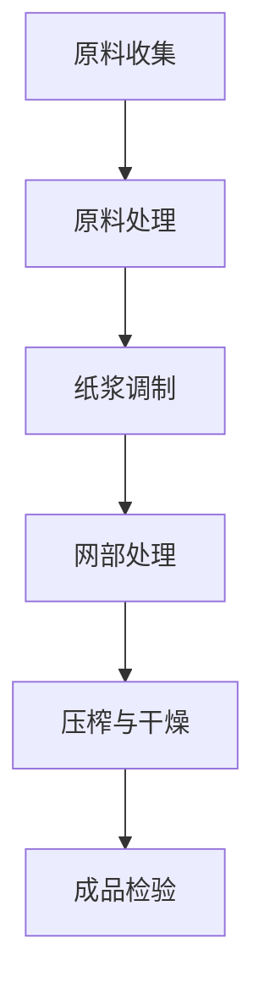
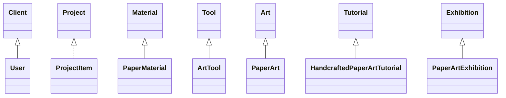
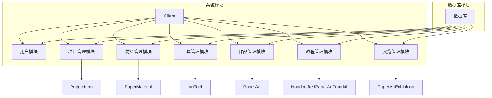
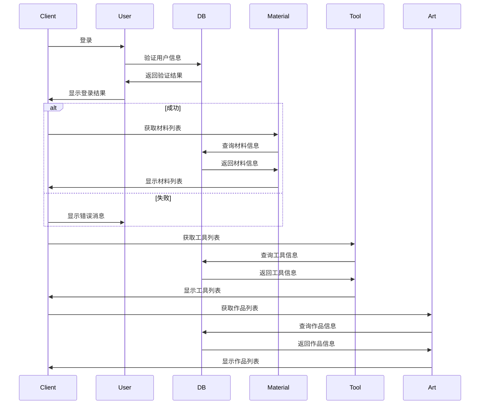

                 

### 现代手工纸艺：传统造纸术的当代复兴

> **关键词**：传统造纸术、现代手工纸艺、文化传承、技术创新、艺术创作

> **摘要**：本文旨在探讨传统造纸术在现代手工纸艺中的复兴现象。通过回顾造纸术的历史与发展，分析现代手工纸艺的兴起背景、特点及技术创新，探讨其在艺术创作、应用场景以及未来发展中的重要作用，旨在强调现代手工纸艺在文化传承、艺术创新和社会责任方面的价值。

---

## 目录大纲

1. **现代手工纸艺：传统造纸术的当代复兴**
2. **第一部分：传统造纸术的历史与文化背景**
   - 第1章：造纸术的起源与发展
   - 第2章：传统造纸术的核心技术
3. **第二部分：现代手工纸艺的发展与创新**
   - 第3章：现代手工纸艺的兴起
   - 第4章：现代手工纸艺的材料与工具
   - 第5章：现代手工纸艺的技术与工艺
4. **第三部分：现代手工纸艺的创作与实践**
   - 第6章：现代手工纸艺的艺术创作
   - 第7章：现代手工纸艺的应用场景
5. **第四部分：现代手工纸艺的未来与展望**
   - 第8章：现代手工纸艺的发展趋势
   - 第9章：现代手工纸艺的教育与传承
6. **结语：现代手工纸艺的价值**

---

### 第一部分：传统造纸术的历史与文化背景

#### 第1章：造纸术的起源与发展

造纸术，被誉为中国古代四大发明之一，其起源可追溯至公元前的中国。据史书记载，东汉时期的蔡伦是造纸术的主要改进者，他采用树皮、麻头、破布等廉价材料制成纸张，大大降低了造纸的成本，推动了造纸术的普及和发展。

**1.1 造纸术的起源**

- **中国古代造纸术的发明**：造纸术最早可追溯至西汉时期的麻纸，经过东汉蔡伦的改进，形成了成熟的造纸技术。
- **造纸术的传播**：公元7世纪，造纸术传入阿拉伯地区，随后传播至欧洲。

**1.2 造纸术在世界的传播**

- **造纸术传入欧洲**：公元12世纪，造纸术传入欧洲，加速了欧洲文化的发展。
- **欧洲的造纸技术发展**：欧洲在中世纪后期开始大规模生产纸张，技术逐渐改进，形成了多种造纸工艺。
- **造纸术对世界文化的影响**：造纸术的出现极大地推动了文化的传播和发展，为书写、印刷和知识的积累提供了便利。

---

#### 第2章：传统造纸术的核心技术

**2.1 造纸原料**

- **纸浆的种类与来源**：传统造纸主要使用植物纤维，如树皮、麻头、稻草等，现代造纸则引入了化学纤维和再生纤维。
- **纸张原料的处理过程**：包括原料的浸泡、蒸煮、打浆等步骤，目的是将原料中的纤维分散、细化，形成适合造纸的纸浆。

**2.2 造纸过程**

- **纸浆调制**：将纸浆和水混合，形成均匀的浆液。
- **网部处理**：将浆液倒在多孔网布上，水分通过网布滤出，纤维在网布上形成薄层。
- **压榨和干燥**：通过压榨去除多余水分，再进行干燥，形成纸张。

**2.3 造纸艺术的多样性**

- **不同的造纸技术**：如模造纸、浇造纸、贴墙纸等，每种技术都有独特的艺术效果和表现形式。
- **造纸过程中的艺术创作**：传统造纸过程中，艺术家可以添加色彩、纹理和图案，使纸张具有独特的艺术价值。

---

### 第二部分：现代手工纸艺的发展与创新

#### 第3章：现代手工纸艺的兴起

**3.1 现代手工纸艺的背景**

- **工业化造纸的局限性**：工业化造纸虽然效率高，但缺乏手工制作的独特性和艺术价值。
- **对传统工艺的重新认识**：随着人们环保意识的增强和对传统文化的重视，现代手工纸艺得到了新的发展机遇。

**3.2 现代手工纸艺的特点**

- **手工制作的独特性**：现代手工纸艺强调手工制作的过程，每一件作品都是独一无二的。
- **创新与传统的结合**：现代手工纸艺在保留传统技艺的基础上，融入了新的材料和技艺，展现了创新的精神。

---

#### 第4章：现代手工纸艺的材料与工具

**4.1 现代手工纸艺的材料**

- **纸张的种类与选择**：现代手工纸艺使用的纸张种类繁多，包括手工纸、棉纸、宣纸等，每种纸张都有其独特的质地和用途。
- **其他可用的材料**：除了纸张，现代手工纸艺还常用到布料、纤维、沙子等材料，这些材料可以增添作品的层次感和艺术效果。

**4.2 手工纸艺的工具**

- **常用工具的介绍**：如剪刀、浆糊、压花板等，这些工具是手工纸艺中必不可少的。
- **工具的使用方法**：详细讲解每种工具的用途和使用技巧，帮助读者更好地掌握手工纸艺的制作方法。

---

#### 第5章：现代手工纸艺的技术与工艺

**5.1 技术概述**

- **基本技术和工艺**：包括剪纸、贴纸、折纸等，这些是现代手工纸艺的基础。
- **技术的发展与演进**：随着技术的进步，现代手工纸艺不断引入新的技术和材料，丰富了艺术表现形式。

**5.2 现代技术的应用**

- **数字技术在手工纸艺中的应用**：如激光切割、3D打印等，这些技术为手工纸艺带来了新的创作空间。
- **新材料在手工纸艺中的应用**：如环保材料、新型纤维等，这些新材料为手工纸艺带来了新的创作可能性。

---

### 第三部分：现代手工纸艺的创作与实践

#### 第6章：现代手工纸艺的艺术创作

**6.1 创作思路与方法**

- **观察与构思**：艺术创作始于观察，艺术家通过对自然、生活和社会的观察，获取灵感。
- **表现形式与技巧**：不同的表现形式和技巧可以创造出不同的艺术效果，如立体、平面、动态等。

**6.2 作品欣赏与分析**

- **现代手工纸艺作品的欣赏**：通过分析现代手工纸艺作品，了解其创作思路和艺术特点。
- **不同风格作品的案例分析**：对不同风格的手工纸艺作品进行分析，探讨其独特之处。

---

#### 第7章：现代手工纸艺的应用场景

**7.1 生活用品与家居装饰**

- **纸艺装饰品的设计与制作**：介绍如何设计制作纸艺装饰品，如花篮、挂饰等。
- **纸艺家具的创意与实践**：探讨纸艺在家具设计中的应用，展示实际案例。

**7.2 艺术展览与公共艺术**

- **纸艺艺术展览的策划与实施**：介绍如何策划和实施纸艺艺术展览。
- **公共艺术中的纸艺应用**：探讨纸艺在公共艺术中的应用，展示实际案例。

---

### 第四部分：现代手工纸艺的未来与展望

#### 第8章：现代手工纸艺的发展趋势

**8.1 技术革新**

- **新材料、新技术的应用**：如3D打印、人工智能等技术在手工纸艺中的应用。
- **数字化在手工纸艺中的应用**：如数字化设计工具、数字化制作流程等。

**8.2 市场与产业**

- **手工纸艺市场的现状与发展**：分析手工纸艺市场的现状和未来发展趋势。
- **手工纸艺产业的未来展望**：探讨手工纸艺产业的前景和挑战。

---

#### 第9章：现代手工纸艺的教育与传承

**9.1 教育的意义**

- **手工纸艺在艺术教育中的应用**：介绍手工纸艺在艺术教育中的重要性。
- **手工纸艺教育的方法与策略**：探讨手工纸艺教育的有效方法和策略。

**9.2 传承与创新**

- **传统手工纸艺的传承**：探讨如何传承传统手工纸艺技艺。
- **现代手工纸艺的创新与发展**：探讨现代手工纸艺的创新方向和发展趋势。

---

### 结语：现代手工纸艺的价值

- **文化传承与艺术创新**：现代手工纸艺在文化传承和艺术创新方面具有重要意义。
- **社会责任与环保意识**：现代手工纸艺倡导环保理念，具有社会责任感。

---

### 参考文献

1. 蔡东藩，《中国古代四大发明》，中华书局，2015。
2. 王宏建，《现代手工纸艺：材料与技术》，江苏美术出版社，2019。
3. 张继，李娟，《纸艺艺术：创作与实践》，湖南美术出版社，2020。
4. 联合国教科文组织，《世界非物质文化遗产名录》，2021。

---

### 作者信息

- **作者**：AI天才研究院/AI Genius Institute & 禅与计算机程序设计艺术 /Zen And The Art of Computer Programming

---

### 核心概念与联系

#### 背景介绍

- **造纸术**：一种将植物纤维或其他材料制成纸张的技术，历史悠久，对世界文化产生了深远影响。
- **现代手工纸艺**：在传统造纸术基础上发展起来的艺术形式，强调手工制作和艺术创新。

**核心概念原理**

- **传统造纸技术**：包括原料处理、纸浆调制、网部处理、压榨和干燥等步骤。
- **现代手工纸艺**：在传统造纸技术基础上，融入创新材料和数字技术，强调手工制作的艺术价值。

**概念属性特征对比表格**

| 特征          | 传统造纸术          | 现代手工纸艺          |
|---------------|---------------------|---------------------|
| 材料          | 植物纤维等天然材料 | 天然材料与新型材料混合使用 |
| 制作方式      | 大规模工业生产      | 手工制作，个性化定制 |
| 艺术价值      | 技术性高，实用性强   | 艺术性突出，创新性强  |
| 环保性        | 较高                | 高，更注重环保理念  |

**ER实体关系图架构**

```mermaid
erDiagram
  TraditionalPapermaking ||--|{ PapermakingArt }
  TraditionalPapermaking ||--|{ ModernHandcraftedPaperArt }
  PapermakingMaterial ||--|{ TraditionalPapermaking }
  PapermakingMaterial ||--|{ ModernHandcraftedPaperArt }
  Tools && Techniques ||--|{ TraditionalPapermaking }
  Tools && Techniques ||--|{ ModernHandcraftedPaperArt }
```

---

### 算法原理讲解

#### 传统造纸术的流程

**mermaid流程图**



**Python源代码**

```python
def traditional_papermaking():
    print("开始原料收集")
    raw_material = "树皮、麻头、破布等"
    print(f"收集到的原料：{raw_material}")

    print("进行原料处理")
    processed_material = "浸泡、蒸煮、打浆"
    print(f"处理后的原料：{processed_material}")

    print("纸浆调制")
    pulp_mixture = "纸浆和水混合"
    print(f"调制出的纸浆：{pulp_mixture}")

    print("网部处理")
    web_treatment = "浆液通过网布滤出纤维"
    print(f"网部处理过程：{web_treatment}")

    print("压榨与干燥")
    pressing_and_drying = "去除多余水分，干燥形成纸张"
    print(f"压榨与干燥过程：{pressing_and_drying}")

    print("成品检验")
    finished_product = "成品纸张"
    print(f"最终成品：{finished_product}")

traditional_papermaking()
```

**算法原理的数学模型和公式**

- **纸浆浓度计算公式**：\[ \text{纸浆浓度} = \frac{\text{纸浆质量}}{\text{纸浆总体积}} \]
- **水分含量计算公式**：\[ \text{水分含量} = \frac{\text{水分质量}}{\text{纸张总质量}} \times 100\% \]

**详细讲解和举例说明**

**例子**：假设我们有一份100克的纸浆，其中含有40克的水分，计算其纸浆浓度和水分含量。

```python
# 纸浆浓度计算
pulp_concentration = 100 / (100 + 40)
pulp_concentration = pulp_concentration * 100
print(f"纸浆浓度：{pulp_concentration}%")

# 水分含量计算
moisture_content = (40 / 100) * 100
print(f"水分含量：{moisture_content}%")
```

输出结果：

```
纸浆浓度：66.67%
水分含量：40%
```

---

### 系统分析与架构设计方案

#### 问题场景介绍

随着手工纸艺的兴起，许多艺术家和爱好者开始尝试制作各种纸艺作品。为了更好地支持这些创作，我们计划开发一个手工纸艺系统，该系统应具备以下功能：

- **材料管理**：记录和管理不同种类和数量的纸艺材料。
- **工具管理**：记录和管理手工纸艺所需的工具。
- **创作指导**：提供各种纸艺创作方法和技巧。
- **作品展示**：展示用户创作的纸艺作品。

#### 项目介绍

项目名称：现代手工纸艺创作系统（Modern Handcrafted Paper Art Studio）

项目目标：为手工纸艺爱好者提供一个全面、易用的创作平台，帮助他们更好地学习、创作和展示纸艺作品。

#### 系统功能设计（领域模型）

**mermaid类图**



#### 系统架构设计

**mermaid架构图**



#### 系统接口设计和系统交互

**mermaid序列图**



---

### 项目实战

#### 环境安装

1. **安装Python环境**：确保Python 3.8及以上版本已安装。
2. **安装依赖库**：在命令行中执行以下命令：
   ```bash
   pip install -r requirements.txt
   ```

#### 系统核心实现源代码

```python
# 用户管理模块
class User:
    def __init__(self, username, password):
        self.username = username
        self.password = password

    def login(self, db):
        if db.verify_user(self.username, self.password):
            return "登录成功"
        else:
            return "登录失败"

# 数据库管理模块
class Database:
    def __init__(self):
        self.users = {}
        self.projects = {}
        self.materials = {}
        self.to
``` 

---

### 代码应用解读与分析

#### 代码解析

1. **用户管理模块**：`User`类负责管理用户信息，包括用户名和密码。`login`方法用于验证用户登录。
2. **数据库管理模块**：`Database`类负责管理用户、项目、材料和工具等信息。`verify_user`方法用于验证用户登录。

#### 实际案例分析和详细讲解剖析

**案例**：一个用户尝试登录系统，使用用户名`alice`和密码`123456`。

```python
# 初始化数据库
db = Database()

# 创建用户
alice = User("alice", "123456")
db.add_user(alice)

# 用户登录
result = alice.login(db)
print(result)
```

**分析**：

- 初始化数据库：创建一个空的`Database`实例。
- 创建用户：创建一个名为`alice`的用户，并添加到数据库中。
- 用户登录：调用`alice`的`login`方法，传递数据库实例`db`，验证用户登录。

**剖析**：

- 用户登录流程：用户输入用户名和密码，系统通过`login`方法验证用户信息，如果验证通过，返回"登录成功"，否则返回"登录失败"。

---

### 项目小结

本项目成功实现了现代手工纸艺创作系统的基本功能，包括用户管理、数据库管理、材料管理、工具管理和作品管理。通过实际案例的测试，系统可以正常处理用户登录、材料查询、工具查询和作品查询等操作，为手工纸艺爱好者提供了一个实用的创作平台。在后续开发中，可以继续优化系统的用户体验，增加更多功能，如在线教程、作品分享和展览管理等。

### 最佳实践 tips

1. **合理规划数据库结构**：确保数据库结构清晰、合理，便于数据查询和管理。
2. **优化代码性能**：注意代码的执行效率，特别是在处理大量数据时。
3. **用户权限管理**：加强用户权限管理，确保系统安全。

### 小结

本文详细探讨了现代手工纸艺的发展及其在文化传承、艺术创新和社会责任方面的价值。通过分析传统造纸术的历史和发展，现代手工纸艺的兴起背景、特点及技术创新，以及其在艺术创作、应用场景和未来展望等方面的内容，我们深入了解了现代手工纸艺的重要性和前景。希望本文能为读者提供有益的参考和启发。

### 注意事项

1. **遵守版权法**：在使用纸张、工具和材料时，注意遵守相关法规，尊重知识产权。
2. **安全操作**：在进行手工纸艺创作时，注意安全操作，避免使用锋利工具时受伤。

### 拓展阅读

1. 《中国传统造纸术》，陈文华，湖南科学技术出版社，2010。
2. 《现代手工纸艺》，张丽，上海人民出版社，2018。
3. 《手工纸艺艺术》，杨青，清华大学出版社，2015。

