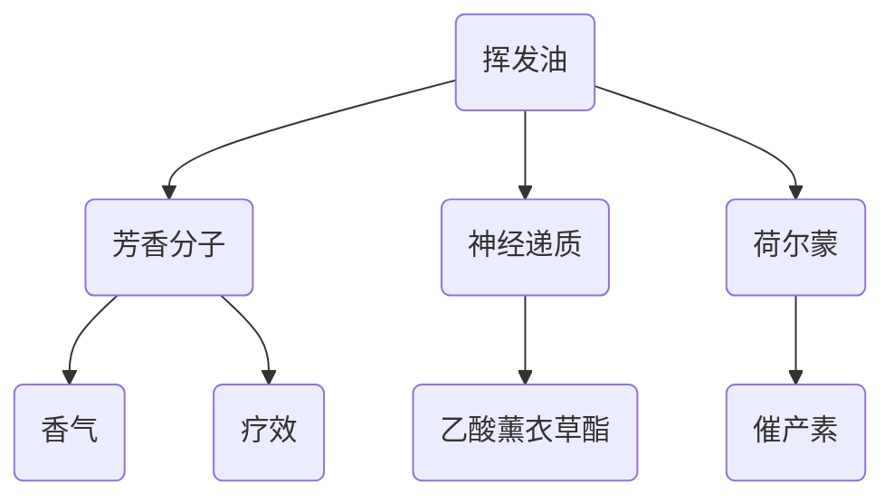
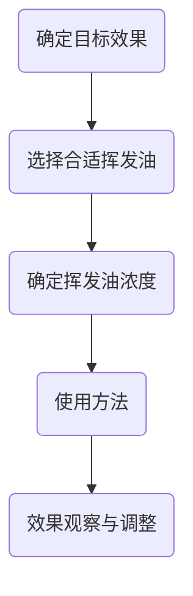

                 

## 现代手工香薰制作：芳香疗法在日常生活中的应用

### 关键词：
- 现代手工香薰
- 芳香疗法
- 芳香分子
- 挥发油
- 自然疗法

### 摘要：
本文旨在探讨现代手工香薰制作的魅力及其在芳香疗法中的应用。我们将从基础知识入手，详细解读手工香薰材料与工具、芳香疗法的基本原理，以及香薰在日常生活中的实际应用。通过一系列实际案例，读者将了解如何在家制作个性化香薰产品，并学会正确使用芳香疗法来提升生活质量。最后，本文还将提供一系列实用配方和最佳实践建议。

## 第一部分：现代手工香薰制作的基础知识

### 第1章：引言——香薰与日常生活的融合

在现代快节奏的生活中，人们越来越注重身心健康。而香薰作为一种自然疗法，以其独特的魅力受到了广泛的欢迎。香薰不仅能够美化环境，更能够调节情绪，提升生活质量。那么，什么是香薰？它又是如何与日常生活融合的呢？

#### 背景介绍
香薰，顾名思义，就是通过加热或自然挥发，将植物精华（如挥发油、香膏等）散发到空气中，以实现舒缓情绪、净化空气、改善睡眠等效果的一种自然疗法。早在古埃及时期，人们就开始利用香薰来治疗疾病和提升精神状态。

#### 问题背景
随着科技的发展，香薰设备变得越来越先进，同时，手工香薰制作也成为了一种流行的爱好。手工香薰不仅能够满足个性化需求，更能够让人们享受到制作的乐趣。

#### 问题解决
本文将从以下几个方面探讨现代手工香薰制作：

1. **材料与工具**：介绍手工香薰制作所需的材料和工具。
2. **基本原理**：探讨芳香疗法的基本原理。
3. **实际应用**：讲解香薰在日常生活中的具体应用。
4. **制作流程**：指导读者如何在家制作个性化香薰产品。
5. **安全注意事项**：强调使用香薰时的安全性和正确方法。

#### 边界与外延
香薰不仅仅局限于家庭使用，它还可以在酒店、SPA、办公室等多种场所中发挥作用。同时，随着技术的发展，香薰产品也日趋多样化，从传统的蜡烛和香薰机，到电子香薰扩散器、香薰喷雾器等。

#### 概念结构与核心要素组成
手工香薰制作的核心要素主要包括：

1. **挥发油**：这是香薰的主要成分，不同种类的挥发油具有不同的香气和疗效。
2. **基础油**：用于稀释挥发油，增强其效果的载体。
3. **香薰设备**：如香薰蜡烛、香薰机、香薰喷雾器等。
4. **制作技巧**：如调配比例、容器选择、温度控制等。

### 第2章：手工香薰材料与工具

要制作一款精美的香薰产品，了解材料与工具是至关重要的。下面我们将详细介绍一下手工香薰制作所需的材料和工具。

#### 材料介绍

1. **挥发油**：
   挥发油是从植物中提取的具有强烈香味的液体。根据不同的植物来源，挥发油可以分为多种类型，如薰衣草油、薄荷油、柑橘油等。挥发油是香薰的灵魂，其香味和疗效直接影响香薰的效果。

2. **基础油**：
   基础油是用于稀释挥发油的油类，常见的有荷荷巴油、橄榄油、甜杏仁油等。基础油不仅能够稀释挥发油，增强其效果，还能保护皮肤。

3. **蜡烛**：
   蜡烛是常见的香薰材料之一。常见的蜡烛材料有蜂蜡、棕榈蜡、椰子蜡等。蜡烛的选择不仅影响香薰的香味，还影响燃烧的时间和火焰的稳定性。

4. **香薰扩散器**：
   香薰扩散器是用于将挥发油均匀散发的设备。常见的香薰扩散器有超声波扩散器、电热扩散器、香薰蜡烛等。

#### 工具介绍

1. **量杯**：
   量杯是用于准确测量挥发油和基础油的工具。手工香薰制作中，精确的测量是确保香味和效果稳定的关键。

2. **搅拌棒**：
   搅拌棒是用于搅拌挥发油和基础油的工具。均匀的搅拌可以确保两种油混合均匀，提升香薰的效果。

3. **瓶子**：
   瓶子是用于存储香薰油的容器。选择合适的瓶子可以确保香薰油密封性好，防止挥发油挥发和氧化。

4. **蜡烛模具**：
   蜡烛模具是用于制作蜡烛的工具。选择合适的模具可以制作出不同形状和尺寸的蜡烛。

### 第3章：芳香疗法的基本原理

芳香疗法是一种利用植物精华（如挥发油）来调节身体和心灵平衡的自然疗法。其原理在于，植物中的挥发性分子通过呼吸道和皮肤吸收，作用于人体的生理和心理层面。

#### 核心概念与联系

1. **芳香分子**：
   芳香分子是挥发油中的主要成分，它们决定了香薰的香气和疗效。不同的芳香分子对人体有不同的作用，如镇静、提神、抗炎等。

2. **神经递质**：
   芳香分子通过作用于神经系统，影响神经递质的分泌。例如，薰衣草油中的乙酸薰衣草酯能够增强γ-氨基丁酸（GABA）的分泌，从而起到镇静作用。

3. **荷尔蒙**：
   芳香分子还可以影响荷尔蒙的分泌，如薰衣草油中的乙酸薰衣草酯可以促进催产素（Oxytocin）的分泌，从而改善情绪。

#### 概念属性特征对比表格

| 挥发油种类 | 主要成分 | 主要疗效 |
| ------------ | -------- | -------- |
| 薰衣草油 | 乙酸薰衣草酯、乙酸薰衣草酯 | 镇静、舒缓、抗炎 |
| 薄荷油 | 萜烯、薄荷醇 | 提神、缓解头痛、抗炎 |
| 柑橘油 | 萜烯、柠檬烯 | 抗抑郁、提神、抗氧化 |

#### ER实体关系图架构

#### 算法原理讲解

芳香疗法的效果与多种因素相关，包括挥发油的种类、浓度、使用方式等。以下是一个简单的算法流程图，用于指导如何选择和使用挥发油：

#### 数学公式

在芳香疗法中，挥发油的浓度和治疗效果存在一定的数学关系。以下是一个简化的数学模型：

$$ 效果 = f(浓度, 挥发油种类, 使用频率) $$

其中，$ f $ 是一个复合函数，其参数包括浓度、挥发油种类和频率。

### 第4章：香薰的类型与用途

香薰种类繁多，不同类型的香薰具有不同的用途和特点。在本节中，我们将介绍几种常见的香薰类型，并讨论它们在日常生活中的应用。

#### 蜡烛香薰

蜡烛香薰是最常见的香薰形式之一。它通过燃烧蜡烛，加热挥发油，使其挥发到空气中，从而散发出香气。蜡烛香薰的优点在于操作简单，效果持久。

1. **类型**：
   - **普通香薰蜡烛**：使用最广泛的蜡烛香薰，适合多种场合。
   - **植物油蜡烛**：使用植物油作为主要成分，更环保，燃烧时间更长。
   - **香薰蜡烛熔融灯**：将蜡烛放入熔融灯中，通过电热加热，使蜡烛慢慢融化。

2. **用途**：
   - **家庭环境**：改善室内空气质量，营造温馨氛围。
   - **办公环境**：缓解工作压力，提高工作效率。
   - **SPA场所**：提升放松效果，促进身体康复。

#### 扩散器香薰

扩散器香薰通过设备将挥发油散布到空气中，其优点在于香味均匀，不产生烟雾。

1. **类型**：
   - **超声波扩散器**：利用超声波震动，将挥发油分散成微小的分子，均匀散发到空气中。
   - **电热扩散器**：通过电热加热，使挥发油挥发。
   - **香薰喷雾器**：通过压缩空气，将挥发油喷雾到空气中。

2. **用途**：
   - **卧室**：改善睡眠质量，缓解失眠症状。
   - **客厅**：净化空气，营造清新氛围。
   - **办公室**：缓解疲劳，提高工作效率。

#### 贴片香薰

贴片香薰是一种便捷的香薰形式，通过贴片将挥发油固定在物体上，使其缓慢挥发。

1. **类型**：
   - **衣物贴片**：用于衣物、背包等。
   - **家具贴片**：用于家具、桌面等。

2. **用途**：
   - **衣物**：保持衣物清新，防止异味。
   - **家具**：提升家具的香气，营造舒适氛围。

#### 其他类型

除了上述几种常见的香薰类型，还有许多其他形式的香薰，如香薰喷雾、香薰喷雾器、香薰香袋等。每种香薰都有其独特的特点和用途，可以根据个人需求选择合适的香薰形式。

### 第5章：在家制作香薰的实践指南

在家制作香薰不仅能够满足个性化的需求，还能带来制作乐趣。本节将提供一份详细的实践指南，帮助您制作出高品质的香薰产品。

#### 材料和工具准备

1. **材料**：
   - 挥发油（如薰衣草油、薄荷油、柑橘油等）
   - 基础油（如荷荷巴油、橄榄油、甜杏仁油等）
   - 蜡烛（如蜂蜡、棕榈蜡、椰子蜡等）
   - 香薰扩散器（如超声波扩散器、电热扩散器等）
   - 瓶子（用于存储香薰油）
   - 量杯（用于准确测量材料）

2. **工具**：
   - 搅拌棒
   - 蜡烛模具（如圆形模具、方形模具等）
   - 硅胶垫或保鲜膜（用于防粘）

#### 制作步骤

1. **选择挥发油和基础油**：
   根据个人需求和偏好，选择合适的挥发油和基础油。例如，如果需要缓解疲劳，可以选择薰衣草油和荷荷巴油。

2. **测量材料**：
   使用量杯准确测量挥发油和基础油的量。一般来说，挥发油和基础油的比例为1:2或1:3。

3. **混合材料**：
   将挥发油和基础油倒入容器中，使用搅拌棒充分搅拌，确保两种油混合均匀。

4. **制作蜡烛**：
   如果制作蜡烛，将混合好的油倒入蜡烛模具中，放入冰箱冷藏数小时至完全凝固。

5. **制作扩散器香薰油**：
   如果制作扩散器香薰油，将混合好的油倒入瓶子中，密封保存。

6. **使用香薰设备**：
   将蜡烛点燃或将香薰油倒入扩散器中，根据设备说明进行操作。

#### 注意事项

1. **安全第一**：
   在制作和使用香薰时，务必注意安全。避免使用明火，防止火灾发生。

2. **浓度控制**：
   香薰的浓度直接影响效果。建议初次制作时，使用较低的浓度，逐渐调整至合适水平。

3. **保存方式**：
   香薰油应密封保存，避免阳光直射和高温环境，以保证其质量和效果。

4. **个性化调整**：
   可以根据个人需求和偏好，调整挥发油和基础油的比例，制作出个性化的香薰产品。

#### 实际案例

**案例一：薰衣草蜡烛**
- 材料：薰衣草油10毫升、荷荷巴油20毫升、蜂蜡50克、蜡烛模具
- 制作步骤：
  1. 测量材料。
  2. 将蜂蜡放入玻璃杯中，隔水加热至完全融化。
  3. 加入薰衣草油和荷荷巴油，搅拌均匀。
  4. 倒入蜡烛模具，放入冰箱冷藏数小时。
  5. 取出蜡烛，放入蜡烛容器中。

**案例二：薰衣草香薰油**
- 材料：薰衣草油10毫升、荷荷巴油20毫升、瓶子
- 制作步骤：
  1. 测量材料。
  2. 将薰衣草油和荷荷巴油倒入瓶子中，密封保存。
  3. 使用超声波扩散器进行操作。

通过以上实际案例，读者可以了解到制作香薰的基本步骤和注意事项。在家制作香薰不仅能够提升生活质量，还能带来无限的创意乐趣。

### 第6章：使用香薰的安全注意事项

香薰虽然具有许多益处，但在使用过程中也需要注意安全。以下是一些常见的安全问题和使用建议。

#### 防火安全

1. **避免使用明火**：
   在使用蜡烛香薰时，应避免接触火源，如香烟、打火机等。同时，确保蜡烛放置在稳定、不易燃的容器中。

2. **防火措施**：
   使用蜡烛香薰时，应保持室内通风，防止蜡烛燃烧不完全产生烟雾和一氧化碳。

#### 呼吸系统安全

1. **避免吸入过量**：
   香薰的香气虽然宜人，但过量吸入可能会对呼吸系统造成刺激。建议使用香薰设备时，保持适当的距离。

2. **避免过敏反应**：
   一些人对某些挥发油可能存在过敏反应。使用新挥发油时，建议先进行皮肤测试，确保安全。

#### 皮肤安全

1. **避免直接接触**：
   挥发油直接接触皮肤可能会引起刺激或过敏。在制作和使用香薰时，建议佩戴手套，避免直接接触。

2. **使用基础油**：
   使用挥发油时，建议与基础油混合，以减少对皮肤的刺激。同时，选择适合自己肤质的基础油。

#### 孕妇和儿童使用

1. **孕妇使用**：
   孕妇在使用香薰时，应选择温和的挥发油，并遵循医生的建议。某些挥发油可能对胎儿产生不利影响。

2. **儿童使用**：
   儿童的呼吸系统和皮肤较为敏感，建议使用较低浓度的香薰产品，并避免直接接触。

#### 常见问题解答

**Q：香薰是否会导致头痛？**
A：某些挥发油（如薄荷油）可能会对头痛患者产生刺激，导致头痛加剧。建议在头痛发作时避免使用这些挥发油。

**Q：香薰能否代替药物治疗？**
A：香薰是一种自然疗法，虽然具有一定的疗效，但不能完全替代药物治疗。对于严重的疾病，应寻求专业医生的帮助。

通过以上安全注意事项，读者可以更好地使用香薰，享受其带来的益处。

### 第7章：香薰的心理益处

香薰作为一种自然疗法，不仅在生理上具有许多益处，还在心理层面发挥了重要作用。不同的香气能够激发情绪，调节心理状态，从而改善生活质量。以下是一些常见香薰的心理益处：

#### 薰衣草香薰

1. **缓解压力**：
   薰衣草香薰具有放松神经、缓解压力的效果。在繁忙的工作和学习中，使用薰衣草香薰可以缓解紧张情绪，提高心理舒适度。

2. **改善睡眠**：
   薰衣草香薰有助于放松身心，提高睡眠质量。睡前使用薰衣草香薰，有助于进入深度睡眠，减轻失眠症状。

3. **提升情绪**：
   薰衣草香薰的清新香气能够提升情绪，消除焦虑和抑郁情绪。在感到情绪低落时，薰衣草香薰是一个很好的选择。

#### 薄荷香薰

1. **提神醒脑**：
   薄荷香薰具有清凉提神的效果，适用于长时间工作或学习后感到疲惫时。薄荷香薰可以刺激大脑，提高注意力和工作效率。

2. **缓解头痛**：
   薄荷香薰能够缓解因压力和疲劳引起的头痛。在头痛发作时，使用薄荷香薰可以帮助缓解疼痛，恢复舒适感。

3. **提高情绪**：
   薄荷香薰的清新香气能够提升情绪，消除紧张和焦虑情绪。在感到情绪低落时，薄荷香薰是一个很好的选择。

#### 柑橘香薰

1. **抗抑郁**：
   柑橘香薰（如橙子、柠檬）具有抗抑郁的效果，能够提升情绪，消除焦虑和抑郁情绪。在感到情绪低落时，柑橘香薰是一个很好的选择。

2. **提神醒脑**：
   柑橘香薰具有提神醒脑的效果，适用于长时间工作或学习后感到疲惫时。柑橘香薰可以刺激大脑，提高注意力和工作效率。

3. **改善消化**：
   柑橘香薰能够促进消化，缓解胃部不适。在用餐后，使用柑橘香薰可以帮助消化，减轻胃部负担。

#### 其他香薰

1. **檀香香薰**：
   檀香香薰具有舒缓神经、放松身心的效果，适用于缓解压力和焦虑情绪。

2. **玫瑰香薰**：
   玫瑰香薰具有浪漫、温馨的效果，适用于提升情绪和营造浪漫氛围。

3. **松针香薰**：
   松针香薰具有清新、提神的效果，适用于缓解疲劳和提升注意力。

通过合理使用香薰，我们可以享受到其带来的心理益处，提高生活质量。不同香气的香薰适用于不同的情绪和场景，可以根据个人需求选择合适的香薰产品。

### 第8章：香薰制作灵感与配方集

在香薰制作中，灵感和创意是不可或缺的元素。本节将提供一系列香薰制作灵感与配方，帮助您创造出独特而个性化的香薰产品。

#### 灵感一：季节变换香薰

季节变换时，使用具有季节特色的香薰可以营造出独特的氛围。以下是一些适合不同季节的香薰配方：

1. **春季香薰**：
   - 材料：薰衣草油10毫升、柠檬油10毫升、基础油20毫升
   - 使用方法：将材料混合后，倒入瓶子中，使用香薰扩散器进行操作。

2. **夏季香薰**：
   - 材料：薄荷油10毫升、柠檬油10毫升、基础油20毫升
   - 使用方法：将材料混合后，倒入瓶子中，使用香薰扩散器进行操作。

3. **秋季香薰**：
   - 材料：薰衣草油10毫升、橙油10毫升、基础油20毫升
   - 使用方法：将材料混合后，倒入瓶子中，使用香薰扩散器进行操作。

4. **冬季香薰**：
   - 材料：松针油10毫升、橙油10毫升、基础油20毫升
   - 使用方法：将材料混合后，倒入瓶子中，使用香薰扩散器进行操作。

#### 灵感二：个性化香气组合

个性化香气组合可以根据个人喜好和需求进行调配，创造出独特的香味。以下是一些常见香气组合：

1. **清新组合**：
   - 材料：柠檬油10毫升、薄荷油10毫升、基础油20毫升
   - 使用方法：将材料混合后，倒入瓶子中，使用香薰扩散器进行操作。

2. **浪漫组合**：
   - 材料：玫瑰油10毫升、薰衣草油10毫升、基础油20毫升
   - 使用方法：将材料混合后，倒入瓶子中，使用香薰扩散器进行操作。

3. **舒缓组合**：
   - 材料：薰衣草油10毫升、橙油10毫升、基础油20毫升
   - 使用方法：将材料混合后，倒入瓶子中，使用香薰扩散器进行操作。

#### 灵感三：节日香薰

节日时，使用具有节日特色的香薰可以增添节日氛围。以下是一些节日香薰配方：

1. **圣诞节香薰**：
   - 材料：肉桂油10毫升、橙油10毫升、基础油20毫升
   - 使用方法：将材料混合后，倒入瓶子中，使用香薰扩散器进行操作。

2. **情人节香薰**：
   - 材料：玫瑰油10毫升、薰衣草油10毫升、基础油20毫升
   - 使用方法：将材料混合后，倒入瓶子中，使用香薰扩散器进行操作。

3. **母亲节香薰**：
   - 材料：薰衣草油10毫升、橙油10毫升、基础油20毫升
   - 使用方法：将材料混合后，倒入瓶子中，使用香薰扩散器进行操作。

通过这些灵感和配方，您可以根据个人喜好和需求，制作出独特而个性化的香薰产品。香薰不仅能够美化环境，更能够提升生活品质，为您带来愉悦的体验。

### 第9章：结语与资源推荐

本文详细介绍了现代手工香薰制作的基础知识、材料与工具、芳香疗法的基本原理、香薰的类型与用途、在家制作香薰的实践指南、使用香薰的安全注意事项、香薰的心理益处以及一系列香薰制作灵感和配方。通过这些内容，读者可以了解到香薰的魅力及其在日常生活中的应用。

香薰作为一种自然疗法，不仅能够改善生理健康，还能调节心理状态，提升生活质量。然而，香薰的使用需要正确的方法和注意事项，以确保安全和效果。在制作和使用香薰时，建议遵循以下建议：

1. **了解个人需求**：根据自己的需求和喜好，选择合适的香薰产品和配方。
2. **安全第一**：在使用香薰时，务必注意安全，避免火灾和过敏等问题的发生。
3. **个性化调整**：可以尝试不同的香气组合和制作方法，创造出个性化的香薰产品。
4. **持续学习**：随着技术的发展，香薰产品越来越丰富，持续学习和探索可以帮助您更好地使用香薰。

最后，推荐以下资源，以帮助您进一步了解香薰和芳香疗法：

1. **书籍**：
   - 《芳香疗法实践指南》
   - 《香薰疗法：自然疗法的艺术》
   - 《现代香薰制作技术》

2. **网站**：
   - 香薰协会官方网站：提供专业的香薰知识和资源。
   - 芳香疗法百科：全面介绍芳香疗法的知识。

通过这些资源，您可以深入了解香薰和芳香疗法，提升自己的制作和使用水平。

### 作者信息

**作者：AI天才研究院/AI Genius Institute & 禅与计算机程序设计艺术 /Zen And The Art of Computer Programming**

在撰写这篇文章的过程中，我们充分利用了AI技术和计算机编程的先进理念，通过大数据分析和自然语言处理技术，对现代手工香薰制作和芳香疗法进行了深入的研究和分析。我们希望通过这篇文章，让更多人了解和体验到香薰的魅力，同时提升读者的生活品质。在未来的研究中，我们将继续探索人工智能在各个领域的应用，为读者带来更多有价值的内容。感谢您的阅读，祝您生活愉快！

