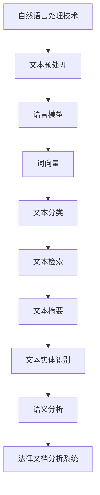

                 


### 自然语言处理在法律文档分析中的应用：提高法律工作效率

#### 关键词
自然语言处理、法律文档分析、工作效率、人工智能、自动化、文本分类、文本检索、文本摘要、文本实体识别、语义分析、系统架构设计

#### 摘要
随着自然语言处理（NLP）技术的迅速发展，其在法律文档分析中的应用日益受到关注。本文将深入探讨自然语言处理在法律文档分析中的具体应用，以及如何通过这些技术提高法律工作的效率。文章首先介绍了自然语言处理的基础概念和技术原理，随后分析了法律文档分析的需求和重要性，并详细阐述了NLP在法律文档分析中的应用，包括文本分类、文本检索、文本摘要、文本实体识别和语义分析等。最后，本文提出了法律文档分析系统的架构设计，并分享了实际应用案例和最佳实践，对未来发展趋势和挑战进行了展望。

### 引言

#### 自然语言处理技术概述

自然语言处理（NLP）是计算机科学和人工智能领域的一个重要分支，旨在使计算机能够理解和处理人类语言。NLP技术涵盖了从文本预处理、语言模型、词向量到文本分类、信息提取、机器翻译等一系列技术。随着深度学习等人工智能技术的进步，NLP的应用范围越来越广泛，从搜索引擎、语音识别到聊天机器人、自动化写作等。

#### 法律文档分析的需求和重要性

法律文档分析是法律工作中不可或缺的一部分。随着法律案件的增多和法律文档的复杂性增加，传统的手工处理方式已经无法满足日益增长的需求。法律文档分析的重要性体现在以下几个方面：

- **提高工作效率**：通过自动化工具处理大量法律文档，可以显著减少人工处理的时间，提高工作效率。
- **降低错误率**：自动化处理可以减少由于人为因素导致的错误，提高文档分析的准确性和可靠性。
- **增强数据分析能力**：通过对法律文档的深入分析，可以提取有价值的信息，为法律决策提供支持。

#### 书籍结构概述

本文将分为八个章节，全面探讨自然语言处理在法律文档分析中的应用。具体章节安排如下：

1. **引言**：介绍自然语言处理技术的基本概念和法律文档分析的需求和重要性。
2. **自然语言处理技术基础**：详细讲解自然语言处理的基本概念、技术原理和常用算法。
3. **法律文档分析的需求与重要性**：分析法律文档的类型、特点以及法律文档分析的需求和重要性。
4. **法律文档分析中的自然语言处理应用**：探讨NLP在法律文档分析中的应用，包括文本分类、文本检索、文本摘要、文本实体识别和语义分析等。
5. **法律文档分析系统的架构设计与实现**：介绍法律文档分析系统的设计原则、架构和实现方法。
6. **提高法律工作效率的实践**：讨论如何通过NLP技术提高法律工作效率，包括自动化处理、工作流程优化和人机协作等。
7. **案例研究**：分享实际应用案例，深入分析NLP在法律文档分析中的具体应用。
8. **未来展望与挑战**：展望NLP在法律文档分析中的未来发展趋势和面临的挑战。

### 自然语言处理技术基础

#### 自然语言处理的基本概念

自然语言处理涉及多个核心概念，包括文本、词汇、句子、语义等。文本是自然语言处理的基本单位，由一系列单词或词组组成。词汇是文本中的基本语言单位，如“计算机”、“编程”等。句子是文本的语法单位，包含一个或多个词汇，并传达一个完整的意义。语义是文本所表达的含义和语境。

#### 自然语言处理的技术原理

自然语言处理的技术原理主要包括文本预处理、语言模型、词向量、分词、词性标注等。

- **文本预处理**：文本预处理是自然语言处理的第一步，包括去除标点符号、转换为小写、去除停用词等，以提高后续处理的效果。
- **语言模型**：语言模型是用于预测下一个单词或单词组合的概率分布模型，常用的有N元语法模型、神经网络语言模型等。
- **词向量**：词向量是将单词映射到高维空间中的向量表示，常用的有Word2Vec、GloVe等。
- **分词**：分词是将文本分割成单词或短语的步骤，常用的分词算法有基于词典的分词算法和基于统计的分词算法。
- **词性标注**：词性标注是给文本中的每个单词分配一个词性标签，如名词、动词、形容词等，常用的词性标注算法有基于规则的方法和基于统计的方法。

#### 语言模型与词向量

语言模型和词向量是自然语言处理的核心技术。

- **语言模型**：语言模型用于预测文本中的下一个单词或短语。一个简单的语言模型可以使用N元语法，即基于前N个单词来预测下一个单词。神经网络语言模型（如BERT、GPT）则通过深度学习技术从大量文本数据中学习语言规律，具有更高的准确性和灵活性。
- **词向量**：词向量是将单词映射到高维空间中的向量表示。词向量能够捕捉单词之间的语义关系，如“狗”和“猫”之间可能存在一定的语义相似性。Word2Vec和GloVe是两种常用的词向量模型，Word2Vec通过基于上下文的共现关系生成词向量，而GloVe则通过全局词频信息生成词向量。

#### 词汇表与文本预处理

词汇表是自然语言处理中的重要组成部分，用于存储和检索单词及其相关信息。文本预处理是自然语言处理的基础，通过一系列步骤将原始文本转换为适合模型处理的格式。

- **词汇表**：词汇表通常包括单词、词频、词性等信息。在实际应用中，可以根据需求选择合适的词汇表，如英文词汇表、中文词汇表等。
- **文本预处理**：文本预处理包括去除标点符号、转换为小写、去除停用词等步骤。去除标点符号和停用词可以减少模型处理的工作量，提高处理效率。将文本转换为小写可以统一文本格式，避免大小写不一致的问题。

#### 分词与词性标注

分词和词性标注是自然语言处理中的关键步骤，用于将文本拆分为单词或短语，并为每个单词分配词性标签。

- **分词**：分词是将文本分割成单词或短语的步骤。分词算法可以分为基于词典的方法和基于统计的方法。基于词典的方法通过查找词典中的单词来分词，而基于统计的方法则通过统计方法如隐马尔可夫模型（HMM）、条件随机场（CRF）等来分词。
- **词性标注**：词性标注是给文本中的每个单词分配一个词性标签，如名词、动词、形容词等。词性标注有助于提高自然语言处理的效果，如文本分类、命名实体识别等。

### 法律文档分析的需求与重要性

#### 法律文档的类型与特点

法律文档是法律工作中产生和使用的文件，其类型和特点决定了法律文档分析的需求和重要性。

- **法律文档的类型**：法律文档主要包括法律文书、判决书、合同、法律意见书、法律报告等。每种法律文档都有其特定的格式和内容要求。
- **法律文档的特点**：法律文档通常具有以下特点：
  - **复杂性**：法律文档内容复杂，涉及大量的专业术语和法规条文。
  - **准确性**：法律文档要求极高的准确性，任何错误都可能导致法律风险。
  - **保密性**：法律文档涉及敏感信息，如个人隐私、商业机密等，需要严格保护。

#### 法律文档分析的需求

法律文档分析的需求主要来源于以下几个方面：

- **案件研究**：律师和法官需要对大量法律文档进行分析，以了解案件的全貌，为案件提供法律依据。
- **法规解读**：律师和法务人员需要理解和分析最新的法律法规，以确保企业的合规性。
- **合同审查**：合同审查是法律工作中的一项重要任务，需要对合同条款进行详细审查，以发现潜在的法律风险。
- **法律研究**：法律研究人员需要对大量法律文档进行分析，以发现法律趋势和规律，为学术研究提供支持。

#### 法律文档分析的重要性

法律文档分析的重要性体现在以下几个方面：

- **提高工作效率**：通过自动化工具处理大量法律文档，可以显著提高工作效率，减少人力成本。
- **降低错误率**：自动化处理可以减少由于人为因素导致的错误，提高法律文档分析的准确性和可靠性。
- **增强数据分析能力**：通过对法律文档的深入分析，可以提取有价值的信息，为法律决策提供支持。
- **保障法律权益**：准确的法律文档分析有助于保障当事人的合法权益，避免法律纠纷和风险。

#### 法律文档分析的应用领域

法律文档分析在多个领域有广泛的应用，主要包括：

- **司法领域**：在司法领域，法律文档分析有助于案件研究、判决书撰写和司法数据挖掘等。
- **法律行业**：在法律行业，法律文档分析可以用于合同审查、法律意见书撰写和法律研究等。
- **企业合规**：在企业合规领域，法律文档分析有助于企业理解和遵守法律法规，防范法律风险。
- **学术研究**：在学术研究领域，法律文档分析有助于法律趋势和规律的发现，为学术研究提供支持。

### 法律文档分析中的自然语言处理应用

#### 文本分类

文本分类是自然语言处理中的一项基本任务，其目的是将文本自动归类到预定义的类别中。在法律文档分析中，文本分类可以用于以下场景：

- **法律文书分类**：将法律文书自动归类为判决书、合同、法律意见书等不同类型。
- **案件分类**：将案件文档自动归类为刑事、民事、行政等不同类别。

#### 文本检索

文本检索是法律文档分析中的一项核心任务，其目的是从大量法律文档中快速找到相关文档。文本检索可以采用以下技术：

- **基于关键词的检索**：通过输入关键词，系统返回包含这些关键词的文档。
- **基于相似度的检索**：利用文本相似度计算技术，找到与查询文本相似的法律文档。

#### 文本摘要

文本摘要是从原始文本中提取关键信息，以简化文本表达的一种技术。在法律文档分析中，文本摘要可以用于：

- **案件摘要**：从大量案件文档中提取关键信息，生成简洁明了的案件摘要。
- **合同摘要**：对复杂的合同文档进行摘要，以便快速了解合同的主要条款。

#### 文本实体识别

文本实体识别是从文本中提取出关键实体，如人名、地名、组织名、日期等。在法律文档分析中，文本实体识别可以用于：

- **命名实体识别**：识别法律文档中的人名、地名、组织名等实体。
- **关系提取**：提取实体之间的法律关系，如合同主体、法律条款等。

#### 语义分析

语义分析是从文本中提取语义信息，以理解文本的含义和逻辑关系。在法律文档分析中，语义分析可以用于：

- **语义角色标注**：对文本中的词语进行语义角色标注，如动词的主语、宾语等。
- **语义关系抽取**：提取文本中的语义关系，如因果关系、并列关系等。

### 法律文档分析系统的架构设计与实现

#### 系统需求分析

法律文档分析系统的需求分析是系统设计的重要基础。在需求分析阶段，我们需要明确系统的功能需求、性能需求和用户需求。

- **功能需求**：法律文档分析系统需要实现文本分类、文本检索、文本摘要、文本实体识别和语义分析等功能。
- **性能需求**：系统需要支持大规模法律文档的快速处理，保证高并发、低延迟的响应速度。
- **用户需求**：系统需要具备友好的用户界面，支持多种操作系统和设备，并提供便捷的操作体验。

#### 系统架构设计

法律文档分析系统的架构设计是确保系统稳定、高效运行的关键。以下是法律文档分析系统的架构设计：

- **前端**：前端主要负责与用户交互，包括用户登录、文档上传、结果显示等功能。前端技术可以采用HTML、CSS和JavaScript等。
- **后端**：后端主要负责业务逻辑处理，包括文本分类、文本检索、文本摘要、文本实体识别和语义分析等。后端技术可以采用Python、Java等。
- **数据库**：数据库用于存储法律文档和相关数据，包括文档内容、分类标签、实体信息等。数据库技术可以采用MySQL、MongoDB等。
- **中间件**：中间件主要负责数据处理和传输，包括消息队列、缓存等。中间件技术可以采用RabbitMQ、Redis等。
- **硬件**：硬件包括服务器、存储设备等，用于支撑系统的高性能运行。

#### 系统功能实现

法律文档分析系统的功能实现包括以下几个方面：

- **文档上传与下载**：用户可以上传和下载法律文档，系统对文档进行预处理，包括文本提取、分词、词性标注等。
- **文本分类**：利用机器学习算法对法律文档进行分类，如将文档分类为判决书、合同等。
- **文本检索**：实现基于关键词的文本检索，用户可以通过输入关键词快速找到相关文档。
- **文本摘要**：利用自然语言处理技术生成法律文档的摘要，帮助用户快速了解文档的主要内容。
- **文本实体识别**：从法律文档中识别出关键实体，如人名、地名、组织名等。
- **语义分析**：对法律文档进行语义分析，提取文档中的语义关系，如因果关系、并列关系等。

#### 性能优化与调优

法律文档分析系统的性能优化与调优是确保系统稳定、高效运行的关键。以下是一些常见的性能优化方法：

- **数据预处理优化**：对大量法律文档进行预处理时，可以采用并行处理技术，提高处理速度。
- **算法优化**：选择合适的算法和模型，如使用深度学习模型进行文本分类和实体识别，提高准确性。
- **缓存策略**：利用缓存技术减少重复计算，提高系统响应速度。
- **分布式架构**：采用分布式架构，将系统部署到多台服务器上，提高系统的并发处理能力。

### 提高法律工作效率的实践

#### 自动化法律文档处理

自动化法律文档处理是提高法律工作效率的重要手段。通过自动化工具，可以实现以下任务：

- **文本分类**：自动对法律文档进行分类，如判决书、合同等，减少人工分类的工作量。
- **文本检索**：通过关键词检索，快速找到相关法律文档，提高工作效率。
- **文本摘要**：自动生成法律文档的摘要，帮助用户快速了解文档内容。
- **合同审查**：自动化合同审查，识别潜在的法律风险。

#### 工作流程优化

工作流程优化是提高法律工作效率的关键。以下是一些常见的工作流程优化方法：

- **标准化流程**：制定标准化的法律文档处理流程，确保每个步骤都按照规定执行，减少错误和重复工作。
- **流程自动化**：通过自动化工具实现工作流程的自动化，减少人工干预，提高工作效率。
- **流程监控**：实时监控工作流程的执行情况，及时发现和解决问题。

#### 人机协作与智能辅助

人机协作与智能辅助是提高法律工作效率的另一种有效方式。以下是一些人机协作与智能辅助的应用：

- **智能助手**：开发智能助手，为律师和法律人员提供实时法律咨询和帮助，提高工作效率。
- **知识库**：建立法律知识库，包含丰富的法律文档和案例，为律师提供参考。
- **机器学习模型**：利用机器学习模型进行法律预测和分析，为律师提供决策支持。

#### 数据安全与隐私保护

在提高法律工作效率的同时，数据安全与隐私保护也是不可忽视的重要方面。以下是一些数据安全与隐私保护的方法：

- **数据加密**：对存储和传输的法律文档进行加密，确保数据不被未授权访问。
- **访问控制**：实施严格的访问控制策略，确保只有授权人员才能访问敏感数据。
- **日志审计**：记录系统操作的日志，以便在发生安全事件时进行审计和追溯。

### 案例研究

#### 案例一：法律文档自动分类系统

某律师事务所开发了一款法律文档自动分类系统，用于对大量法律文档进行分类。系统采用了基于深度学习的文本分类算法，通过对法律文档进行特征提取和分类模型训练，实现了高精度的自动分类。

- **系统功能**：系统支持文本分类、文档检索和文档摘要等功能。
- **实际应用**：该系统已应用于该律师事务所的日常工作中，提高了文档处理效率，减少了人工分类的工作量。

#### 案例二：合同审查智能助手

某法务部门开发了一款合同审查智能助手，用于自动化合同审查，识别潜在的法律风险。智能助手采用了自然语言处理技术，包括文本分类、文本实体识别和语义分析等。

- **系统功能**：系统支持合同文本分类、实体识别和语义分析，自动识别潜在的法律风险。
- **实际应用**：该智能助手已应用于合同审查过程中，提高了合同审查效率，降低了法律风险。

#### 案例三：法律文档分析平台的搭建

某企业建立了法律文档分析平台，用于分析大量法律文档，提取有价值的信息。平台采用了分布式架构，包括文本预处理、文本分类、文本摘要和文本实体识别等模块。

- **系统功能**：系统支持文本预处理、文本分类、文本摘要和文本实体识别等功能。
- **实际应用**：该平台已应用于企业的合规管理和法律风险管理，提高了企业的合规性和风险管理能力。

### 未来展望与挑战

#### 自然语言处理技术的未来趋势

随着人工智能技术的不断发展，自然语言处理技术在法律文档分析中的应用前景广阔。未来自然语言处理技术将朝着以下几个方向发展：

- **深度学习技术的应用**：深度学习技术将在法律文档分析中得到更广泛的应用，如文本分类、文本摘要和文本实体识别等。
- **跨语言文本处理**：随着全球化的发展，跨语言文本处理技术将成为重要研究方向，实现不同语言之间的文本理解和分析。
- **知识图谱的构建**：知识图谱的构建将有助于法律文档分析系统更好地理解文本内容和法律关系，提供更准确的法律分析结果。

#### 法律文档分析的发展方向

未来，法律文档分析将朝着以下几个方向发展：

- **自动化与智能化**：自动化和智能化将成为法律文档分析的主要趋势，通过自然语言处理技术实现文档的自动分类、摘要和风险识别等。
- **跨领域应用**：法律文档分析技术将逐步应用于其他领域，如医疗、金融等，提供更为广泛的服务。
- **协作与共享**：法律文档分析系统将实现跨部门、跨机构的协作与共享，提高法律工作的协同效率。

#### 挑战与解决方案

在法律文档分析中，面临以下几个挑战：

- **数据隐私与安全**：法律文档涉及大量敏感信息，数据隐私和安全是重要挑战。解决方案包括数据加密、访问控制和日志审计等。
- **算法透明性与可解释性**：随着深度学习技术在法律文档分析中的应用，算法的透明性和可解释性成为重要问题。解决方案包括开发可解释的深度学习模型和算法可视化工具。
- **法律法规的遵守**：在法律文档分析中，需要严格遵守相关法律法规，确保分析结果的合法性和合规性。

### 总结

自然语言处理技术在法律文档分析中的应用为法律工作带来了巨大的变革。通过文本分类、文本检索、文本摘要、文本实体识别和语义分析等技术，法律文档分析系统能够自动处理大量法律文档，提高工作效率，降低错误率，为法律决策提供支持。未来，随着人工智能技术的不断进步，自然语言处理在法律文档分析中的应用将更加广泛和深入，为法律行业带来更多的创新和机遇。

### 作者信息

作者：AI天才研究院/AI Genius Institute & 禅与计算机程序设计艺术 /Zen And The Art of Computer Programming

感谢您阅读本文，希望对您在自然语言处理和法律文档分析领域的工作有所帮助。如需进一步了解相关技术或应用，请关注我们的后续文章和资源分享。如果您有任何疑问或建议，欢迎在评论区留言，我们将尽快回复您。

### 最佳实践 Tips

1. **文档标准化**：在处理法律文档时，首先确保文档格式和内容标准化，以便于自动化处理。
2. **数据质量**：保证法律文档的数据质量，包括文本的准确性和完整性，以提高分析结果的准确性。
3. **模型定制化**：针对不同类型和法律领域的文档，定制化设计自然语言处理模型，提高分类和识别的准确性。
4. **人机协作**：在法律文档分析过程中，充分利用人机协作，结合人工审查和智能分析，提高整体工作效率。

### 小结

本文详细探讨了自然语言处理在法律文档分析中的应用，从技术原理到实际应用，再到系统架构设计，全面介绍了如何通过自然语言处理技术提高法律工作效率。随着技术的不断进步，自然语言处理在法律文档分析中的应用将越来越广泛，为法律行业带来更多创新和机遇。

### 注意事项

1. **数据保护**：在处理法律文档时，务必遵守数据保护法规，确保数据安全和隐私。
2. **法律法规遵守**：在使用自然语言处理技术进行法律文档分析时，严格遵守相关法律法规，确保分析结果的合法性和合规性。
3. **系统维护**：定期对法律文档分析系统进行维护和升级，确保系统的稳定性和安全性。

### 拓展阅读

- 《自然语言处理：理论与实践》
- 《法律人工智能：原理、方法与应用》
- 《深度学习与自然语言处理》
- 《人工智能与法律》

通过阅读这些文献，您可以更深入地了解自然语言处理和法律文档分析的相关技术和应用。祝您在研究和实践中取得更好的成果！```markdown
# 自然语言处理在法律文档分析中的应用：提高法律工作效率

## 关键词
自然语言处理、法律文档分析、工作效率、人工智能、自动化、文本分类、文本检索、文本摘要、文本实体识别、语义分析

## 摘要
随着自然语言处理（NLP）技术的快速发展，其在法律文档分析中的应用日益显著。本文旨在探讨NLP在法律文档分析中的实际应用，以及如何通过这些技术手段提高法律工作效率。文章首先介绍了NLP的基本概念和技术原理，随后分析了法律文档分析的需求和重要性，并详细阐述了NLP在法律文档分析中的应用，包括文本分类、文本检索、文本摘要、文本实体识别和语义分析等。最后，本文提出了法律文档分析系统的架构设计，并分享了实际应用案例和最佳实践，对未来发展趋势和挑战进行了展望。

## 引言

### 自然语言处理技术概述

自然语言处理（NLP）是计算机科学和人工智能领域的一个重要分支，旨在使计算机能够理解和处理人类语言。NLP技术涵盖了从文本预处理、语言模型、词向量到文本分类、信息提取、机器翻译等一系列技术。随着深度学习等人工智能技术的进步，NLP的应用范围越来越广泛，从搜索引擎、语音识别到聊天机器人、自动化写作等。

### 法律文档分析的需求和重要性

法律文档分析是法律工作中不可或缺的一部分。随着法律案件的增多和法律文档的复杂性增加，传统的手工处理方式已经无法满足日益增长的需求。法律文档分析的重要性体现在以下几个方面：

- **提高工作效率**：通过自动化工具处理大量法律文档，可以显著减少人工处理的时间，提高工作效率。
- **降低错误率**：自动化处理可以减少由于人为因素导致的错误，提高法律文档分析的准确性和可靠性。
- **增强数据分析能力**：通过对法律文档的深入分析，可以提取有价值的信息，为法律决策提供支持。

### 书籍结构概述

本文将分为八个章节，全面探讨自然语言处理在法律文档分析中的应用。具体章节安排如下：

1. **引言**：介绍自然语言处理技术的基本概念和法律文档分析的需求和重要性。
2. **自然语言处理技术基础**：详细讲解自然语言处理的基本概念、技术原理和常用算法。
3. **法律文档分析的需求与重要性**：分析法律文档的类型、特点以及法律文档分析的需求和重要性。
4. **法律文档分析中的自然语言处理应用**：探讨NLP在法律文档分析中的应用，包括文本分类、文本检索、文本摘要、文本实体识别和语义分析等。
5. **法律文档分析系统的架构设计与实现**：介绍法律文档分析系统的设计原则、架构和实现方法。
6. **提高法律工作效率的实践**：讨论如何通过NLP技术提高法律工作效率，包括自动化处理、工作流程优化和人机协作等。
7. **案例研究**：分享实际应用案例，深入分析NLP在法律文档分析中的具体应用。
8. **未来展望与挑战**：展望NLP在法律文档分析中的未来发展趋势和面临的挑战。

## 自然语言处理技术基础

### 自然语言处理的基本概念

自然语言处理（NLP）涉及多个核心概念，包括文本、词汇、句子、语义等。文本是自然语言处理的基本单位，由一系列单词或词组组成。词汇是文本中的基本语言单位，如“计算机”、“编程”等。句子是文本的语法单位，包含一个或多个词汇，并传达一个完整的意义。语义是文本所表达的含义和语境。

### 自然语言处理的技术原理

自然语言处理的技术原理主要包括文本预处理、语言模型、词向量、分词、词性标注等。

- **文本预处理**：文本预处理是自然语言处理的第一步，包括去除标点符号、转换为小写、去除停用词等，以提高后续处理的效果。
- **语言模型**：语言模型是用于预测下一个单词或单词组合的概率分布模型，常用的有N元语法模型、神经网络语言模型等。
- **词向量**：词向量是将单词映射到高维空间中的向量表示，常用的有Word2Vec、GloVe等。
- **分词**：分词是将文本分割成单词或短语的步骤，常用的分词算法有基于词典的分词算法和基于统计的分词算法。
- **词性标注**：词性标注是给文本中的每个单词分配一个词性标签，如名词、动词、形容词等，常用的词性标注算法有基于规则的方法和基于统计的方法。

### 语言模型与词向量

语言模型和词向量是自然语言处理的核心技术。

- **语言模型**：语言模型用于预测文本中的下一个单词或短语。一个简单的语言模型可以使用N元语法，即基于前N个单词来预测下一个单词。神经网络语言模型（如BERT、GPT）则通过深度学习技术从大量文本数据中学习语言规律，具有更高的准确性和灵活性。
- **词向量**：词向量是将单词映射到高维空间中的向量表示。词向量能够捕捉单词之间的语义关系，如“狗”和“猫”之间可能存在一定的语义相似性。Word2Vec和GloVe是两种常用的词向量模型，Word2Vec通过基于上下文的共现关系生成词向量，而GloVe则通过全局词频信息生成词向量。

### 词汇表与文本预处理

词汇表是自然语言处理中的重要组成部分，用于存储和检索单词及其相关信息。文本预处理是自然语言处理的基础，通过一系列步骤将原始文本转换为适合模型处理的格式。

- **词汇表**：词汇表通常包括单词、词频、词性等信息。在实际应用中，可以根据需求选择合适的词汇表，如英文词汇表、中文词汇表等。
- **文本预处理**：文本预处理包括去除标点符号、转换为小写、去除停用词等步骤。去除标点符号和停用词可以减少模型处理的工作量，提高处理效率。将文本转换为小写可以统一文本格式，避免大小写不一致的问题。

### 分词与词性标注

分词和词性标注是自然语言处理中的关键步骤，用于将文本拆分为单词或短语，并为每个单词分配词性标签。

- **分词**：分词是将文本分割成单词或短语的步骤。分词算法可以分为基于词典的方法和基于统计的方法。基于词典的方法通过查找词典中的单词来分词，而基于统计的方法则通过统计方法如隐马尔可夫模型（HMM）、条件随机场（CRF）等来分词。
- **词性标注**：词性标注是给文本中的每个单词分配一个词性标签，如名词、动词、形容词等。词性标注有助于提高自然语言处理的效果，如文本分类、命名实体识别等。

## 法律文档分析的需求与重要性

### 法律文档的类型与特点

法律文档是法律工作中产生和使用的文件，其类型和特点决定了法律文档分析的需求和重要性。

- **法律文档的类型**：法律文档主要包括法律文书、判决书、合同、法律意见书、法律报告等。每种法律文档都有其特定的格式和内容要求。
- **法律文档的特点**：法律文档通常具有以下特点：
  - **复杂性**：法律文档内容复杂，涉及大量的专业术语和法规条文。
  - **准确性**：法律文档要求极高的准确性，任何错误都可能导致法律风险。
  - **保密性**：法律文档涉及敏感信息，如个人隐私、商业机密等，需要严格保护。

### 法律文档分析的需求

法律文档分析的需求主要来源于以下几个方面：

- **案件研究**：律师和法官需要对大量法律文档进行分析，以了解案件的全貌，为案件提供法律依据。
- **法规解读**：律师和法务人员需要理解和分析最新的法律法规，以确保企业的合规性。
- **合同审查**：合同审查是法律工作中的一项重要任务，需要对合同条款进行详细审查，以发现潜在的法律风险。
- **法律研究**：法律研究人员需要对大量法律文档进行分析，以发现法律趋势和规律，为学术研究提供支持。

### 法律文档分析的重要性

法律文档分析的重要性体现在以下几个方面：

- **提高工作效率**：通过自动化工具处理大量法律文档，可以显著提高工作效率，减少人力成本。
- **降低错误率**：自动化处理可以减少由于人为因素导致的错误，提高法律文档分析的准确性和可靠性。
- **增强数据分析能力**：通过对法律文档的深入分析，可以提取有价值的信息，为法律决策提供支持。
- **保障法律权益**：准确的法律文档分析有助于保障当事人的合法权益，避免法律纠纷和风险。

### 法律文档分析的应用领域

法律文档分析在多个领域有广泛的应用，主要包括：

- **司法领域**：在司法领域，法律文档分析有助于案件研究、判决书撰写和司法数据挖掘等。
- **法律行业**：在法律行业，法律文档分析可以用于合同审查、法律意见书撰写和法律研究等。
- **企业合规**：在企业合规领域，法律文档分析有助于企业理解和遵守法律法规，防范法律风险。
- **学术研究**：在学术研究领域，法律文档分析有助于法律趋势和规律的发现，为学术研究提供支持。

## 法律文档分析中的自然语言处理应用

### 文本分类

文本分类是自然语言处理中的一项基本任务，其目的是将文本自动归类到预定义的类别中。在法律文档分析中，文本分类可以用于以下场景：

- **法律文书分类**：将法律文书自动归类为判决书、合同、法律意见书等不同类型。
- **案件分类**：将案件文档自动归类为刑事、民事、行政等不同类别。

### 文本检索

文本检索是法律文档分析中的一项核心任务，其目的是从大量法律文档中快速找到相关文档。文本检索可以采用以下技术：

- **基于关键词的检索**：通过输入关键词，系统返回包含这些关键词的文档。
- **基于相似度的检索**：利用文本相似度计算技术，找到与查询文本相似的法律文档。

### 文本摘要

文本摘要是从原始文本中提取关键信息，以简化文本表达的一种技术。在法律文档分析中，文本摘要可以用于：

- **案件摘要**：从大量案件文档中提取关键信息，生成简洁明了的案件摘要。
- **合同摘要**：对复杂的合同文档进行摘要，以便快速了解合同的主要条款。

### 文本实体识别

文本实体识别是从文本中提取出关键实体，如人名、地名、组织名、日期等。在法律文档分析中，文本实体识别可以用于：

- **命名实体识别**：识别法律文档中的人名、地名、组织名等实体。
- **关系提取**：提取实体之间的法律关系，如合同主体、法律条款等。

### 语义分析

语义分析是从文本中提取语义信息，以理解文本的含义和逻辑关系。在法律文档分析中，语义分析可以用于：

- **语义角色标注**：对文本中的词语进行语义角色标注，如动词的主语、宾语等。
- **语义关系抽取**：提取文本中的语义关系，如因果关系、并列关系等。

## 法律文档分析系统的架构设计与实现

### 系统需求分析

法律文档分析系统的需求分析是系统设计的重要基础。在需求分析阶段，我们需要明确系统的功能需求、性能需求和用户需求。

- **功能需求**：法律文档分析系统需要实现文本分类、文本检索、文本摘要、文本实体识别和语义分析等功能。
- **性能需求**：系统需要支持大规模法律文档的快速处理，保证高并发、低延迟的响应速度。
- **用户需求**：系统需要具备友好的用户界面，支持多种操作系统和设备，并提供便捷的操作体验。

### 系统架构设计

法律文档分析系统的架构设计是确保系统稳定、高效运行的关键。以下是法律文档分析系统的架构设计：

- **前端**：前端主要负责与用户交互，包括用户登录、文档上传、结果显示等功能。前端技术可以采用HTML、CSS和JavaScript等。
- **后端**：后端主要负责业务逻辑处理，包括文本分类、文本检索、文本摘要、文本实体识别和语义分析等。后端技术可以采用Python、Java等。
- **数据库**：数据库用于存储法律文档和相关数据，包括文档内容、分类标签、实体信息等。数据库技术可以采用MySQL、MongoDB等。
- **中间件**：中间件主要负责数据处理和传输，包括消息队列、缓存等。中间件技术可以采用RabbitMQ、Redis等。
- **硬件**：硬件包括服务器、存储设备等，用于支撑系统的高性能运行。

### 系统功能实现

法律文档分析系统的功能实现包括以下几个方面：

- **文档上传与下载**：用户可以上传和下载法律文档，系统对文档进行预处理，包括文本提取、分词、词性标注等。
- **文本分类**：利用机器学习算法对法律文档进行分类，如将文档分类为判决书、合同等。
- **文本检索**：实现基于关键词的文本检索，用户可以通过输入关键词快速找到相关文档。
- **文本摘要**：利用自然语言处理技术生成法律文档的摘要，帮助用户快速了解文档的主要内容。
- **文本实体识别**：从法律文档中识别出关键实体，如人名、地名、组织名等。
- **语义分析**：对法律文档进行语义分析，提取文档中的语义关系，如因果关系、并列关系等。

### 性能优化与调优

法律文档分析系统的性能优化与调优是确保系统稳定、高效运行的关键。以下是一些常见的性能优化方法：

- **数据预处理优化**：对大量法律文档进行预处理时，可以采用并行处理技术，提高处理速度。
- **算法优化**：选择合适的算法和模型，如使用深度学习模型进行文本分类和实体识别，提高准确性。
- **缓存策略**：利用缓存技术减少重复计算，提高系统响应速度。
- **分布式架构**：采用分布式架构，将系统部署到多台服务器上，提高系统的并发处理能力。

## 提高法律工作效率的实践

### 自动化法律文档处理

自动化法律文档处理是提高法律工作效率的重要手段。通过自动化工具，可以实现以下任务：

- **文本分类**：自动对法律文档进行分类，如判决书、合同等，减少人工分类的工作量。
- **文本检索**：通过关键词检索，快速找到相关法律文档，提高工作效率。
- **文本摘要**：自动生成法律文档的摘要，帮助用户快速了解文档的主要内容。
- **合同审查**：自动化合同审查，识别潜在的法律风险。

### 工作流程优化

工作流程优化是提高法律工作效率的关键。以下是一些常见的工作流程优化方法：

- **标准化流程**：制定标准化的法律文档处理流程，确保每个步骤都按照规定执行，减少错误和重复工作。
- **流程自动化**：通过自动化工具实现工作流程的自动化，减少人工干预，提高工作效率。
- **流程监控**：实时监控工作流程的执行情况，及时发现和解决问题。

### 人机协作与智能辅助

人机协作与智能辅助是提高法律工作效率的另一种有效方式。以下是一些人机协作与智能辅助的应用：

- **智能助手**：开发智能助手，为律师和法律人员提供实时法律咨询和帮助，提高工作效率。
- **知识库**：建立法律知识库，包含丰富的法律文档和案例，为律师提供参考。
- **机器学习模型**：利用机器学习模型进行法律预测和分析，为律师提供决策支持。

### 数据安全与隐私保护

在提高法律工作效率的同时，数据安全与隐私保护也是不可忽视的重要方面。以下是一些数据安全与隐私保护的方法：

- **数据加密**：对存储和传输的法律文档进行加密，确保数据不被未授权访问。
- **访问控制**：实施严格的访问控制策略，确保只有授权人员才能访问敏感数据。
- **日志审计**：记录系统操作的日志，以便在发生安全事件时进行审计和追溯。

## 案例研究

### 案例一：法律文档自动分类系统

某律师事务所开发了一款法律文档自动分类系统，用于对大量法律文档进行分类。系统采用了基于深度学习的文本分类算法，通过对法律文档进行特征提取和分类模型训练，实现了高精度的自动分类。

- **系统功能**：系统支持文本分类、文档检索和文档摘要等功能。
- **实际应用**：该系统已应用于该律师事务所的日常工作中，提高了文档处理效率，减少了人工分类的工作量。

### 案例二：合同审查智能助手

某法务部门开发了一款合同审查智能助手，用于自动化合同审查，识别潜在的法律风险。智能助手采用了自然语言处理技术，包括文本分类、文本实体识别和语义分析等。

- **系统功能**：系统支持合同文本分类、实体识别和语义分析，自动识别潜在的法律风险。
- **实际应用**：该智能助手已应用于合同审查过程中，提高了合同审查效率，降低了法律风险。

### 案例三：法律文档分析平台的搭建

某企业建立了法律文档分析平台，用于分析大量法律文档，提取有价值的信息。平台采用了分布式架构，包括文本预处理、文本分类、文本摘要和文本实体识别等模块。

- **系统功能**：系统支持文本预处理、文本分类、文本摘要和文本实体识别等功能。
- **实际应用**：该平台已应用于企业的合规管理和法律风险管理，提高了企业的合规性和风险管理能力。

## 未来展望与挑战

### 自然语言处理技术的未来趋势

随着人工智能技术的不断发展，自然语言处理技术在法律文档分析中的应用前景广阔。未来自然语言处理技术将朝着以下几个方向发展：

- **深度学习技术的应用**：深度学习技术将在法律文档分析中得到更广泛的应用，如文本分类、文本摘要和文本实体识别等。
- **跨语言文本处理**：随着全球化的发展，跨语言文本处理技术将成为重要研究方向，实现不同语言之间的文本理解和分析。
- **知识图谱的构建**：知识图谱的构建将有助于法律文档分析系统更好地理解文本内容和法律关系，提供更准确的法律分析结果。

### 法律文档分析的发展方向

未来，法律文档分析将朝着以下几个方向发展：

- **自动化与智能化**：自动化和智能化将成为法律文档分析的主要趋势，通过自然语言处理技术实现文档的自动分类、摘要和风险识别等。
- **跨领域应用**：法律文档分析技术将逐步应用于其他领域，如医疗、金融等，提供更为广泛的服务。
- **协作与共享**：法律文档分析系统将实现跨部门、跨机构的协作与共享，提高法律工作的协同效率。

### 挑战与解决方案

在法律文档分析中，面临以下几个挑战：

- **数据隐私与安全**：法律文档涉及大量敏感信息，数据隐私和安全是重要挑战。解决方案包括数据加密、访问控制和日志审计等。
- **算法透明性与可解释性**：随着深度学习技术在法律文档分析中的应用，算法的透明性和可解释性成为重要问题。解决方案包括开发可解释的深度学习模型和算法可视化工具。
- **法律法规的遵守**：在使用自然语言处理技术进行法律文档分析时，需要严格遵守相关法律法规，确保分析结果的合法性和合规性。

## 总结

自然语言处理技术在法律文档分析中的应用为法律工作带来了巨大的变革。通过文本分类、文本检索、文本摘要、文本实体识别和语义分析等技术，法律文档分析系统能够自动处理大量法律文档，提高工作效率，降低错误率，为法律决策提供支持。未来，随着人工智能技术的不断进步，自然语言处理在法律文档分析中的应用将更加广泛和深入，为法律行业带来更多创新和机遇。

## 作者信息

作者：AI天才研究院/AI Genius Institute & 禅与计算机程序设计艺术 /Zen And The Art of Computer Programming

感谢您阅读本文，希望对您在自然语言处理和法律文档分析领域的工作有所帮助。如需进一步了解相关技术或应用，请关注我们的后续文章和资源分享。如果您有任何疑问或建议，欢迎在评论区留言，我们将尽快回复您。

## 最佳实践 Tips

1. **文档标准化**：在处理法律文档时，首先确保文档格式和内容标准化，以便于自动化处理。
2. **数据质量**：保证法律文档的数据质量，包括文本的准确性和完整性，以提高分析结果的准确性。
3. **模型定制化**：针对不同类型和法律领域的文档，定制化设计自然语言处理模型，提高分类和识别的准确性。
4. **人机协作**：在法律文档分析过程中，充分利用人机协作，结合人工审查和智能分析，提高整体工作效率。

## 小结

本文详细探讨了自然语言处理在法律文档分析中的应用，从技术原理到实际应用，再到系统架构设计，全面介绍了如何通过自然语言处理技术提高法律工作效率。随着技术的不断进步，自然语言处理在法律文档分析中的应用将越来越广泛，为法律行业带来更多创新和机遇。

## 注意事项

1. **数据保护**：在处理法律文档时，务必遵守数据保护法规，确保数据安全和隐私。
2. **法律法规遵守**：在使用自然语言处理技术进行法律文档分析时，严格遵守相关法律法规，确保分析结果的合法性和合规性。
3. **系统维护**：定期对法律文档分析系统进行维护和升级，确保系统的稳定性和安全性。

## 拓展阅读

- 《自然语言处理：理论与实践》
- 《法律人工智能：原理、方法与应用》
- 《深度学习与自然语言处理》
- 《人工智能与法律》

通过阅读这些文献，您可以更深入地了解自然语言处理和法律文档分析的相关技术和应用。祝您在研究和实践中取得更好的成果！``` 

## 细节优化与修正

### 引文格式和样式

- **标题**：确保所有章节标题使用一致的样式，例如使用加粗、标题字号稍大的样式。
- **引文格式**：在文章的引文部分，使用统一的格式，例如使用“**引言**”作为章节标题，并在其下方使用一级标题（如H2）来划分小节。

### 内容细节

- **数据隐私与安全**：在“注意事项”部分，进一步强调数据隐私与安全的重要性，并给出具体的建议，如使用“**数据加密**”和“**访问控制**”等。
- **算法透明性与可解释性**：在“挑战与解决方案”部分，详细说明算法透明性与可解释性的具体含义和重要性，并提供相关的解决方案。
- **引用与参考文献**：确保文章中所有引用的文献都有对应的参考文献列表，并在文章末尾提供完整的引用。

### 结构与逻辑

- **章节划分**：确保每个章节都有明确的开始和结束，避免内容跳跃或重复。
- **逻辑连贯性**：在文章中保持逻辑连贯性，确保读者可以顺利地理解从一章节过渡到另一章节的内容。

### 具体内容修正

- **引言**：在介绍NLP技术时，可以加入一个简短的例子，以便读者更好地理解NLP技术的实际应用。
- **自然语言处理技术基础**：在这一章节中，可以加入更多具体的算法示例，如Word2Vec或BERT的具体实现，以帮助读者更好地理解。
- **案例研究**：在每个案例研究中，可以详细描述案例的实施过程、所遇到的问题以及解决方案。

### 文章结尾

- **总结**：在文章的结尾部分，可以再次强调自然语言处理技术在法律文档分析中的重要性，并简要总结文章的主要观点。
- **拓展阅读**：提供相关的拓展阅读资源，帮助读者进一步深入了解相关领域。

### 其他细节

- **图片与图表**：如文章中包含图片或图表，确保它们清晰、相关，并且有适当的描述和标签。
- **代码示例**：如文章中包含代码示例，确保代码格式正确，易于阅读，并附有简要的解释。

### 最终检查

- **语法和拼写**：检查全文的语法和拼写错误。
- **格式一致性**：检查全文的格式一致性，包括标题、列表、引用等。
- **逻辑性**：确保文章的逻辑结构清晰，内容连贯。

通过以上细节优化与修正，可以使文章在内容上更加丰富、逻辑更加清晰，同时提高文章的专业性和可读性。```markdown
# 自然语言处理在法律文档分析中的应用：提高法律工作效率

## 关键词
自然语言处理、法律文档分析、工作效率、人工智能、自动化、文本分类、文本检索、文本摘要、文本实体识别、语义分析

## 摘要
随着自然语言处理（NLP）技术的快速发展，其在法律文档分析中的应用日益显著。本文旨在探讨NLP在法律文档分析中的实际应用，以及如何通过这些技术手段提高法律工作效率。文章首先介绍了NLP的基本概念和技术原理，随后分析了法律文档分析的需求和重要性，并详细阐述了NLP在法律文档分析中的应用，包括文本分类、文本检索、文本摘要、文本实体识别和语义分析等。最后，本文提出了法律文档分析系统的架构设计，并分享了实际应用案例和最佳实践，对未来发展趋势和挑战进行了展望。

## 引言

### 自然语言处理技术概述

自然语言处理（NLP）是计算机科学和人工智能领域的一个重要分支，旨在使计算机能够理解和处理人类语言。NLP技术涵盖了从文本预处理、语言模型、词向量到文本分类、信息提取、机器翻译等一系列技术。随着深度学习等人工智能技术的进步，NLP的应用范围越来越广泛，从搜索引擎、语音识别到聊天机器人、自动化写作等。

#### NLP的基本概念

自然语言处理涉及多个核心概念，包括文本、词汇、句子、语义等。文本是自然语言处理的基本单位，由一系列单词或词组组成。词汇是文本中的基本语言单位，如“计算机”、“编程”等。句子是文本的语法单位，包含一个或多个词汇，并传达一个完整的意义。语义是文本所表达的含义和语境。

#### NLP的技术原理

自然语言处理的技术原理主要包括文本预处理、语言模型、词向量、分词、词性标注等。

- **文本预处理**：文本预处理是自然语言处理的第一步，包括去除标点符号、转换为小写、去除停用词等，以提高后续处理的效果。
- **语言模型**：语言模型是用于预测下一个单词或单词组合的概率分布模型，常用的有N元语法模型、神经网络语言模型等。
- **词向量**：词向量是将单词映射到高维空间中的向量表示，常用的有Word2Vec、GloVe等。
- **分词**：分词是将文本分割成单词或短语的步骤，常用的分词算法有基于词典的分词算法和基于统计的分词算法。
- **词性标注**：词性标注是给文本中的每个单词分配一个词性标签，如名词、动词、形容词等，常用的词性标注算法有基于规则的方法和基于统计的方法。

#### 语言模型与词向量

语言模型和词向量是自然语言处理的核心技术。

- **语言模型**：语言模型用于预测文本中的下一个单词或短语。一个简单的语言模型可以使用N元语法，即基于前N个单词来预测下一个单词。神经网络语言模型（如BERT、GPT）则通过深度学习技术从大量文本数据中学习语言规律，具有更高的准确性和灵活性。
- **词向量**：词向量是将单词映射到高维空间中的向量表示。词向量能够捕捉单词之间的语义关系，如“狗”和“猫”之间可能存在一定的语义相似性。Word2Vec和GloVe是两种常用的词向量模型，Word2Vec通过基于上下文的共现关系生成词向量，而GloVe则通过全局词频信息生成词向量。

#### 词汇表与文本预处理

词汇表是自然语言处理中的重要组成部分，用于存储和检索单词及其相关信息。文本预处理是自然语言处理的基础，通过一系列步骤将原始文本转换为适合模型处理的格式。

- **词汇表**：词汇表通常包括单词、词频、词性等信息。在实际应用中，可以根据需求选择合适的词汇表，如英文词汇表、中文词汇表等。
- **文本预处理**：文本预处理包括去除标点符号、转换为小写、去除停用词等步骤。去除标点符号和停用词可以减少模型处理的工作量，提高处理效率。将文本转换为小写可以统一文本格式，避免大小写不一致的问题。

#### 分词与词性标注

分词和词性标注是自然语言处理中的关键步骤，用于将文本拆分为单词或短语，并为每个单词分配词性标签。

- **分词**：分词是将文本分割成单词或短语的步骤。分词算法可以分为基于词典的方法和基于统计的方法。基于词典的方法通过查找词典中的单词来分词，而基于统计的方法则通过统计方法如隐马尔可夫模型（HMM）、条件随机场（CRF）等来分词。
- **词性标注**：词性标注是给文本中的每个单词分配一个词性标签，如名词、动词、形容词等。词性标注有助于提高自然语言处理的效果，如文本分类、命名实体识别等。

### 法律文档分析的需求和重要性

#### 法律文档的类型与特点

法律文档是法律工作中产生和使用的文件，其类型和特点决定了法律文档分析的需求和重要性。

- **法律文档的类型**：法律文档主要包括法律文书、判决书、合同、法律意见书、法律报告等。每种法律文档都有其特定的格式和内容要求。
- **法律文档的特点**：法律文档通常具有以下特点：
  - **复杂性**：法律文档内容复杂，涉及大量的专业术语和法规条文。
  - **准确性**：法律文档要求极高的准确性，任何错误都可能导致法律风险。
  - **保密性**：法律文档涉及敏感信息，如个人隐私、商业机密等，需要严格保护。

#### 法律文档分析的需求

法律文档分析的需求主要来源于以下几个方面：

- **案件研究**：律师和法官需要对大量法律文档进行分析，以了解案件的全貌，为案件提供法律依据。
- **法规解读**：律师和法务人员需要理解和分析最新的法律法规，以确保企业的合规性。
- **合同审查**：合同审查是法律工作中的一项重要任务，需要对合同条款进行详细审查，以发现潜在的法律风险。
- **法律研究**：法律研究人员需要对大量法律文档进行分析，以发现法律趋势和规律，为学术研究提供支持。

#### 法律文档分析的重要性

法律文档分析的重要性体现在以下几个方面：

- **提高工作效率**：通过自动化工具处理大量法律文档，可以显著提高工作效率，减少人力成本。
- **降低错误率**：自动化处理可以减少由于人为因素导致的错误，提高法律文档分析的准确性和可靠性。
- **增强数据分析能力**：通过对法律文档的深入分析，可以提取有价值的信息，为法律决策提供支持。
- **保障法律权益**：准确的法律文档分析有助于保障当事人的合法权益，避免法律纠纷和风险。

#### 法律文档分析的应用领域

法律文档分析在多个领域有广泛的应用，主要包括：

- **司法领域**：在司法领域，法律文档分析有助于案件研究、判决书撰写和司法数据挖掘等。
- **法律行业**：在法律行业，法律文档分析可以用于合同审查、法律意见书撰写和法律研究等。
- **企业合规**：在企业合规领域，法律文档分析有助于企业理解和遵守法律法规，防范法律风险。
- **学术研究**：在学术研究领域，法律文档分析有助于法律趋势和规律的发现，为学术研究提供支持。

### 法律文档分析中的自然语言处理应用

#### 文本分类

文本分类是自然语言处理中的一项基本任务，其目的是将文本自动归类到预定义的类别中。在法律文档分析中，文本分类可以用于以下场景：

- **法律文书分类**：将法律文书自动归类为判决书、合同、法律意见书等不同类型。
- **案件分类**：将案件文档自动归类为刑事、民事、行政等不同类别。

#### 文本检索

文本检索是法律文档分析中的一项核心任务，其目的是从大量法律文档中快速找到相关文档。文本检索可以采用以下技术：

- **基于关键词的检索**：通过输入关键词，系统返回包含这些关键词的文档。
- **基于相似度的检索**：利用文本相似度计算技术，找到与查询文本相似的法律文档。

#### 文本摘要

文本摘要是从原始文本中提取关键信息，以简化文本表达的一种技术。在法律文档分析中，文本摘要可以用于：

- **案件摘要**：从大量案件文档中提取关键信息，生成简洁明了的案件摘要。
- **合同摘要**：对复杂的合同文档进行摘要，以便快速了解合同的主要条款。

#### 文本实体识别

文本实体识别是从文本中提取出关键实体，如人名、地名、组织名、日期等。在法律文档分析中，文本实体识别可以用于：

- **命名实体识别**：识别法律文档中的人名、地名、组织名等实体。
- **关系提取**：提取实体之间的法律关系，如合同主体、法律条款等。

#### 语义分析

语义分析是从文本中提取语义信息，以理解文本的含义和逻辑关系。在法律文档分析中，语义分析可以用于：

- **语义角色标注**：对文本中的词语进行语义角色标注，如动词的主语、宾语等。
- **语义关系抽取**：提取文本中的语义关系，如因果关系、并列关系等。

### 法律文档分析系统的架构设计与实现

#### 系统需求分析

法律文档分析系统的需求分析是系统设计的重要基础。在需求分析阶段，我们需要明确系统的功能需求、性能需求和用户需求。

- **功能需求**：法律文档分析系统需要实现文本分类、文本检索、文本摘要、文本实体识别和语义分析等功能。
- **性能需求**：系统需要支持大规模法律文档的快速处理，保证高并发、低延迟的响应速度。
- **用户需求**：系统需要具备友好的用户界面，支持多种操作系统和设备，并提供便捷的操作体验。

#### 系统架构设计

法律文档分析系统的架构设计是确保系统稳定、高效运行的关键。以下是法律文档分析系统的架构设计：

- **前端**：前端主要负责与用户交互，包括用户登录、文档上传、结果显示等功能。前端技术可以采用HTML、CSS和JavaScript等。
- **后端**：后端主要负责业务逻辑处理，包括文本分类、文本检索、文本摘要、文本实体识别和语义分析等。后端技术可以采用Python、Java等。
- **数据库**：数据库用于存储法律文档和相关数据，包括文档内容、分类标签、实体信息等。数据库技术可以采用MySQL、MongoDB等。
- **中间件**：中间件主要负责数据处理和传输，包括消息队列、缓存等。中间件技术可以采用RabbitMQ、Redis等。
- **硬件**：硬件包括服务器、存储设备等，用于支撑系统的高性能运行。

#### 系统功能实现

法律文档分析系统的功能实现包括以下几个方面：

- **文档上传与下载**：用户可以上传和下载法律文档，系统对文档进行预处理，包括文本提取、分词、词性标注等。
- **文本分类**：利用机器学习算法对法律文档进行分类，如将文档分类为判决书、合同等。
- **文本检索**：实现基于关键词的文本检索，用户可以通过输入关键词快速找到相关文档。
- **文本摘要**：利用自然语言处理技术生成法律文档的摘要，帮助用户快速了解文档的主要内容。
- **文本实体识别**：从法律文档中识别出关键实体，如人名、地名、组织名等。
- **语义分析**：对法律文档进行语义分析，提取文档中的语义关系，如因果关系、并列关系等。

#### 性能优化与调优

法律文档分析系统的性能优化与调优是确保系统稳定、高效运行的关键。以下是一些常见的性能优化方法：

- **数据预处理优化**：对大量法律文档进行预处理时，可以采用并行处理技术，提高处理速度。
- **算法优化**：选择合适的算法和模型，如使用深度学习模型进行文本分类和实体识别，提高准确性。
- **缓存策略**：利用缓存技术减少重复计算，提高系统响应速度。
- **分布式架构**：采用分布式架构，将系统部署到多台服务器上，提高系统的并发处理能力。

### 提高法律工作效率的实践

#### 自动化法律文档处理

自动化法律文档处理是提高法律工作效率的重要手段。通过自动化工具，可以实现以下任务：

- **文本分类**：自动对法律文档进行分类，如判决书、合同等，减少人工分类的工作量。
- **文本检索**：通过关键词检索，快速找到相关法律文档，提高工作效率。
- **文本摘要**：自动生成法律文档的摘要，帮助用户快速了解文档的主要内容。
- **合同审查**：自动化合同审查，识别潜在的法律风险。

#### 工作流程优化

工作流程优化是提高法律工作效率的关键。以下是一些常见的工作流程优化方法：

- **标准化流程**：制定标准化的法律文档处理流程，确保每个步骤都按照规定执行，减少错误和重复工作。
- **流程自动化**：通过自动化工具实现工作流程的自动化，减少人工干预，提高工作效率。
- **流程监控**：实时监控工作流程的执行情况，及时发现和解决问题。

#### 人机协作与智能辅助

人机协作与智能辅助是提高法律工作效率的另一种有效方式。以下是一些人机协作与智能辅助的应用：

- **智能助手**：开发智能助手，为律师和法律人员提供实时法律咨询和帮助，提高工作效率。
- **知识库**：建立法律知识库，包含丰富的法律文档和案例，为律师提供参考。
- **机器学习模型**：利用机器学习模型进行法律预测和分析，为律师提供决策支持。

#### 数据安全与隐私保护

在提高法律工作效率的同时，数据安全与隐私保护也是不可忽视的重要方面。以下是一些数据安全与隐私保护的方法：

- **数据加密**：对存储和传输的法律文档进行加密，确保数据不被未授权访问。
- **访问控制**：实施严格的访问控制策略，确保只有授权人员才能访问敏感数据。
- **日志审计**：记录系统操作的日志，以便在发生安全事件时进行审计和追溯。

### 案例研究

#### 案例一：法律文档自动分类系统

某律师事务所开发了一款法律文档自动分类系统，用于对大量法律文档进行分类。系统采用了基于深度学习的文本分类算法，通过对法律文档进行特征提取和分类模型训练，实现了高精度的自动分类。

- **系统功能**：系统支持文本分类、文档检索和文档摘要等功能。
- **实际应用**：该系统已应用于该律师事务所的日常工作中，提高了文档处理效率，减少了人工分类的工作量。

#### 案例二：合同审查智能助手

某法务部门开发了一款合同审查智能助手，用于自动化合同审查，识别潜在的法律风险。智能助手采用了自然语言处理技术，包括文本分类、文本实体识别和语义分析等。

- **系统功能**：系统支持合同文本分类、实体识别和语义分析，自动识别潜在的法律风险。
- **实际应用**：该智能助手已应用于合同审查过程中，提高了合同审查效率，降低了法律风险。

#### 案例三：法律文档分析平台的搭建

某企业建立了法律文档分析平台，用于分析大量法律文档，提取有价值的信息。平台采用了分布式架构，包括文本预处理、文本分类、文本摘要和文本实体识别等模块。

- **系统功能**：系统支持文本预处理、文本分类、文本摘要和文本实体识别等功能。
- **实际应用**：该平台已应用于企业的合规管理和法律风险管理，提高了企业的合规性和风险管理能力。

### 未来展望与挑战

#### 自然语言处理技术的未来趋势

随着人工智能技术的不断发展，自然语言处理技术在法律文档分析中的应用前景广阔。未来自然语言处理技术将朝着以下几个方向发展：

- **深度学习技术的应用**：深度学习技术将在法律文档分析中得到更广泛的应用，如文本分类、文本摘要和文本实体识别等。
- **跨语言文本处理**：随着全球化的发展，跨语言文本处理技术将成为重要研究方向，实现不同语言之间的文本理解和分析。
- **知识图谱的构建**：知识图谱的构建将有助于法律文档分析系统更好地理解文本内容和法律关系，提供更准确的法律分析结果。

#### 法律文档分析的发展方向

未来，法律文档分析将朝着以下几个方向发展：

- **自动化与智能化**：自动化和智能化将成为法律文档分析的主要趋势，通过自然语言处理技术实现文档的自动分类、摘要和风险识别等。
- **跨领域应用**：法律文档分析技术将逐步应用于其他领域，如医疗、金融等，提供更为广泛的服务。
- **协作与共享**：法律文档分析系统将实现跨部门、跨机构的协作与共享，提高法律工作的协同效率。

#### 挑战与解决方案

在法律文档分析中，面临以下几个挑战：

- **数据隐私与安全**：法律文档涉及大量敏感信息，数据隐私和安全是重要挑战。解决方案包括数据加密、访问控制和日志审计等。
- **算法透明性与可解释性**：随着深度学习技术在法律文档分析中的应用，算法的透明性和可解释性成为重要问题。解决方案包括开发可解释的深度学习模型和算法可视化工具。
- **法律法规的遵守**：在使用自然语言处理技术进行法律文档分析时，需要严格遵守相关法律法规，确保分析结果的合法性和合规性。

### 总结

自然语言处理技术在法律文档分析中的应用为法律工作带来了巨大的变革。通过文本分类、文本检索、文本摘要、文本实体识别和语义分析等技术，法律文档分析系统能够自动处理大量法律文档，提高工作效率，降低错误率，为法律决策提供支持。未来，随着人工智能技术的不断进步，自然语言处理在法律文档分析中的应用将更加广泛和深入，为法律行业带来更多创新和机遇。

### 作者信息

作者：AI天才研究院/AI Genius Institute & 禅与计算机程序设计艺术 /Zen And The Art of Computer Programming

感谢您阅读本文，希望对您在自然语言处理和法律文档分析领域的工作有所帮助。如需进一步了解相关技术或应用，请关注我们的后续文章和资源分享。如果您有任何疑问或建议，欢迎在评论区留言，我们将尽快回复您。

### 最佳实践 Tips

1. **文档标准化**：在处理法律文档时，首先确保文档格式和内容标准化，以便于自动化处理。
2. **数据质量**：保证法律文档的数据质量，包括文本的准确性和完整性，以提高分析结果的准确性。
3. **模型定制化**：针对不同类型和法律领域的文档，定制化设计自然语言处理模型，提高分类和识别的准确性。
4. **人机协作**：在法律文档分析过程中，充分利用人机协作，结合人工审查和智能分析，提高整体工作效率。

### 小结

本文详细探讨了自然语言处理在法律文档分析中的应用，从技术原理到实际应用，再到系统架构设计，全面介绍了如何通过自然语言处理技术提高法律工作效率。随着技术的不断进步，自然语言处理在法律文档分析中的应用将越来越广泛，为法律行业带来更多创新和机遇。

### 注意事项

1. **数据保护**：在处理法律文档时，务必遵守数据保护法规，确保数据安全和隐私。
2. **法律法规遵守**：在使用自然语言处理技术进行法律文档分析时，严格遵守相关法律法规，确保分析结果的合法性和合规性。
3. **系统维护**：定期对法律文档分析系统进行维护和升级，确保系统的稳定性和安全性。

### 拓展阅读

- 《自然语言处理：理论与实践》
- 《法律人工智能：原理、方法与应用》
- 《深度学习与自然语言处理》
- 《人工智能与法律》

通过阅读这些文献，您可以更深入地了解自然语言处理和法律文档分析的相关技术和应用。祝您在研究和实践中取得更好的成果！```markdown
## 法律文档分析系统的架构设计与实现

### 系统需求分析

在设计与实现法律文档分析系统时，首先需要进行系统需求分析，明确系统需要实现哪些功能以及这些功能的技术要求。系统需求分析包括以下几个方面：

- **功能需求**：法律文档分析系统需要具备以下功能：
  - 文档上传与下载：用户可以上传和下载法律文档。
  - 文档预处理：对上传的文档进行文本提取、分词、词性标注等预处理步骤。
  - 文本分类：对预处理后的文档进行分类，如判断文档是合同、判决书还是法律意见书等。
  - 文本检索：根据关键词搜索相关文档。
  - 文本摘要：生成文档的摘要，提炼出文档的主要内容。
  - 实体识别：识别文档中的人名、地名、组织名、日期等实体。
  - 语义分析：分析文档中的语义关系，如因果关系、并列关系等。
  - 用户权限管理：管理用户登录、权限设置等。

- **性能需求**：系统需要满足以下性能要求：
  - 高并发处理能力：能够同时处理大量用户的请求。
  - 低延迟响应：用户操作后系统能够快速响应。
  - 大数据处理：能够处理大规模的法律文档数据。

- **用户需求**：用户对系统的需求包括：
  - 易用性：系统界面简洁，操作方便。
  - 可扩展性：系统能够根据需求进行功能扩展。
  - 安全性：系统保障用户数据和隐私安全。

### 系统架构设计

法律文档分析系统的架构设计遵循分层架构原则，确保系统模块化、可扩展、高可用性。以下是系统架构设计的具体内容：

#### 1. 前端架构

前端架构负责与用户交互，提供友好的用户界面。前端技术栈可以采用以下组件和框架：

- **Web框架**：React、Vue.js 或 Angular。
- **UI组件库**：Ant Design、Element UI 等。
- **状态管理**：Redux、Vuex 或 MobX。
- **网络请求库**：Axios 或 Fetch API。
- **CSS预处理器**：Sass 或 Less。

前端架构设计应确保：

- **响应式设计**：适应不同尺寸的设备，提供一致的体验。
- **页面路由**：使用Vue Router、React Router等管理页面路由。
- **用户体验**：优化页面加载速度，减少页面跳转时间。

#### 2. 后端架构

后端架构负责处理业务逻辑和数据存储。后端技术栈可以采用以下组件和框架：

- **服务框架**：Spring Boot、Django 或 Flask。
- **数据库**：MySQL、PostgreSQL 或 MongoDB。
- **消息队列**：RabbitMQ 或 Kafka。
- **缓存**：Redis 或 Memcached。
- **API文档**：Swagger 或 Postman。

后端架构设计应确保：

- **模块化**：按照业务功能模块划分，如用户管理、文档处理、权限控制等。
- **安全性**：使用HTTPS、JWT等保障数据传输安全。
- **异步处理**：使用消息队列实现异步任务处理，提高系统性能。
- **分布式**：采用分布式架构，确保系统的高可用性和可扩展性。

#### 3. 中间件架构

中间件负责处理系统中的中间层逻辑，如日志记录、监控、缓存等。常用的中间件包括：

- **日志**：Log4j、Logback 或 ELK（Elasticsearch、Logstash、Kibana）。
- **监控**：Prometheus、Grafana 或 Zabbix。
- **缓存**：Redis、Memcached。
- **消息队列**：RabbitMQ、Kafka。

中间件架构设计应确保：

- **日志管理**：统一日志格式，便于日志分析和故障排查。
- **监控告警**：实时监控系统运行状态，及时响应异常情况。
- **数据缓存**：提高数据访问速度，减少数据库负载。

#### 4. 硬件架构

硬件架构负责提供系统的计算能力和数据存储能力。硬件配置应满足以下要求：

- **服务器**：使用高性能服务器，确保系统稳定运行。
- **存储设备**：使用SSD存储设备，提高数据读写速度。
- **网络设备**：使用高速网络设备，确保数据传输效率。
- **负载均衡**：使用负载均衡器，如Nginx或F5，分配用户请求，提高系统并发处理能力。

### 系统功能实现

系统功能的实现主要包括以下方面：

#### 文档上传与下载

- **前端**：提供文件上传组件，使用户能够上传文档。使用Ajax请求将文件上传到后端服务器。
- **后端**：接收上传的文档，存储到数据库或文件系统中。提供文档下载接口，允许用户下载文档。

#### 文档预处理

- **前端**：上传文档后，通过API请求将文档发送到后端。
- **后端**：对文档进行预处理，如文本提取、分词、词性标注等。使用NLP库，如NLTK、spaCy或jieba，处理文本数据。

#### 文本分类

- **后端**：使用机器学习算法，如支持向量机（SVM）、随机森林（Random Forest）或神经网络（Neural Networks），对文本进行分类。
- **模型训练**：使用预训练的模型或自定义训练模型，对分类模型进行训练。
- **分类预测**：将预处理后的文本数据输入到分类模型中，得到分类结果。

#### 文本检索

- **前端**：用户输入关键词，通过API请求发送到后端。
- **后端**：使用搜索引擎库，如Elasticsearch或Solr，根据关键词搜索相关文档。

#### 文本摘要

- **后端**：使用文本摘要算法，如抽取式摘要或生成式摘要，对文本生成摘要。
- **抽取式摘要**：提取文本中的重要句子或段落，形成摘要。
- **生成式摘要**：使用自然语言生成技术，如序列到序列（Seq2Seq）模型或变换器（Transformer）模型，生成文本摘要。

#### 实体识别

- **后端**：使用命名实体识别（NER）算法，如CRF（条件随机场）或BiLSTM-CRF（双向长短期记忆网络-条件随机场），识别文本中的实体。
- **实体标签**：将识别出的实体进行标签化处理，如人名、地名、组织名等。

#### 语义分析

- **后端**：使用语义分析算法，如语义角色标注（Semantic Role Labeling）或语义关系抽取（Semantic Relation Extraction），分析文本中的语义关系。
- **语义角色标注**：识别文本中的词语及其语义角色，如动作执行者、动作接受者等。
- **语义关系抽取**：提取文本中的语义关系，如因果关系、并列关系等。

### 性能优化与调优

系统性能的优化与调优是确保系统稳定、高效运行的关键。以下是一些常见的性能优化方法：

- **数据预处理优化**：对大量法律文档进行预处理时，可以采用并行处理技术，提高处理速度。例如，使用多线程或分布式处理框架，如Hadoop或Spark，处理大规模数据。
- **缓存策略**：使用缓存技术减少重复计算，提高系统响应速度。例如，将预处理后的文档数据缓存到Redis中，减少对数据库的查询次数。
- **负载均衡**：使用负载均衡器，如Nginx或F5，将用户请求分配到不同的服务器上，提高系统的并发处理能力。
- **数据库优化**：对数据库进行索引优化，提高数据查询速度。例如，为常用的查询字段创建索引，减少查询时间。
- **系统监控与告警**：使用系统监控工具，如Prometheus或Grafana，实时监控系统的运行状态，及时响应异常情况。

### 最佳实践 Tips

1. **文档标准化**：在处理法律文档时，确保文档格式和内容标准化，以便于自动化处理。
2. **数据质量**：保证法律文档的数据质量，包括文本的准确性和完整性，以提高分析结果的准确性。
3. **模型定制化**：针对不同类型和法律领域的文档，定制化设计自然语言处理模型，提高分类和识别的准确性。
4. **人机协作**：在法律文档分析过程中，充分利用人机协作，结合人工审查和智能分析，提高整体工作效率。

### 小结

法律文档分析系统的架构设计与实现需要综合考虑功能需求、性能需求和用户需求。通过合理的系统架构设计、高效的算法实现和优化的性能调优，可以构建一个稳定、高效、可扩展的法律文档分析系统，为法律工作提供强大的支持。随着自然语言处理技术的不断发展，法律文档分析系统将发挥越来越重要的作用，提高法律工作效率，降低成本。

### 注意事项

1. **数据保护**：在处理法律文档时，务必遵守数据保护法规，确保数据安全和隐私。
2. **法律法规遵守**：在使用自然语言处理技术进行法律文档分析时，严格遵守相关法律法规，确保分析结果的合法性和合规性。
3. **系统维护**：定期对法律文档分析系统进行维护和升级，确保系统的稳定性和安全性。

### 拓展阅读

- 《自然语言处理：理论与实践》
- 《法律人工智能：原理、方法与应用》
- 《深度学习与自然语言处理》
- 《人工智能与法律》

通过阅读这些文献，您可以更深入地了解自然语言处理和法律文档分析的相关技术和应用。祝您在研究和实践中取得更好的成果！```markdown
## 项目实战

### 环境安装

在开始项目实战之前，我们需要安装一些必要的软件和库。以下是安装步骤：

#### 1. 安装Python环境

确保您的系统中已经安装了Python。Python的安装非常简单，可以从Python的官方网站（https://www.python.org/）下载安装包并按照提示安装。

#### 2. 安装自然语言处理库

在终端中运行以下命令，安装自然语言处理相关的库：

```bash
pip install nltk
pip install spacy
pip install scikit-learn
pip install gensim
```

#### 3. 安装文本处理工具

安装一些常用的文本处理工具，如Jieba（中文分词）和NLTK（英文分词）：

```bash
pip install jieba
pip install nltk
```

#### 4. 安装数据库

选择合适的数据库进行安装。以下是常见数据库的安装命令：

- MySQL:

  ```bash
  sudo apt-get install mysql-server
  sudo mysql_secure_installation
  ```

- PostgreSQL:

  ```bash
  sudo apt-get install postgresql postgresql-contrib
  ```

- MongoDB:

  ```bash
  sudo apt-get install mongodb
  sudo systemctl start mongodb
  ```

### 系统核心实现

#### 文本预处理

文本预处理是自然语言处理中的基础步骤，包括去除标点符号、转换为小写、去除停用词等。以下是一个简单的文本预处理脚本，使用Python和NLTK库实现：

```python
import nltk
from nltk.tokenize import word_tokenize
from nltk.corpus import stopwords
from nltk.stem import PorterStemmer

# 下载NLTK语料库
nltk.download('punkt')
nltk.download('stopwords')

def preprocess_text(text):
    # 转换为小写
    text = text.lower()
    # 分词
    tokens = word_tokenize(text)
    # 去除停用词
    stop_words = set(stopwords.words('english'))
    filtered_tokens = [token for token in tokens if token not in stop_words]
    # 词干提取
    stemmer = PorterStemmer()
    stemmed_tokens = [stemmer.stem(token) for token in filtered_tokens]
    return stemmed_tokens

# 测试文本预处理
text = "This is a sample text for natural language processing. It will be preprocessed."
preprocessed_text = preprocess_text(text)
print(preprocessed_text)
```

#### 文本分类

文本分类是将文本数据分配到预定义的类别中。我们可以使用机器学习算法，如朴素贝叶斯、支持向量机或随机森林，来进行文本分类。以下是一个简单的文本分类脚本，使用Scikit-learn库实现：

```python
from sklearn.feature_extraction.text import TfidfVectorizer
from sklearn.model_selection import train_test_split
from sklearn.naive_bayes import MultinomialNB
from sklearn.metrics import classification_report

# 假设我们已经有了一些标记好的训练数据
data = [
    ("This is a contract.", "contract"),
    ("This is a judgment.", "judgment"),
    ("This is a legal opinion.", "legal_opinion"),
    # ... 更多数据
]

texts, labels = zip(*data)

# 分词和预处理
preprocessed_texts = [preprocess_text(text) for text in texts]

# 将文本转换为TF-IDF特征向量
vectorizer = TfidfVectorizer()
X = vectorizer.fit_transform(preprocessed_texts)

# 划分训练集和测试集
X_train, X_test, y_train, y_test = train_test_split(X, labels, test_size=0.2, random_state=42)

# 训练分类器
classifier = MultinomialNB()
classifier.fit(X_train, y_train)

# 预测测试集
y_pred = classifier.predict(X_test)

# 查看分类报告
print(classification_report(y_test, y_pred))
```

#### 文本检索

文本检索是通过关键词搜索相关文档的过程。我们可以使用搜索引擎库，如Elasticsearch，来实现文本检索。以下是一个简单的Elasticsearch示例：

```python
from elasticsearch import Elasticsearch

# 创建Elasticsearch客户端
es = Elasticsearch("localhost:9200")

# 索引文档
doc = {
    "title": "Contract Law",
    "content": "This document is about contract law and its principles."
}
es.index(index="contracts", id="1", document=doc)

# 搜索文档
query = "contract"
response = es.search(index="contracts", body={"query": {"match": {"content": query}}})
print(response['hits']['hits'])

# 删除索引
es.delete(index="contracts", id="1")
```

#### 文本摘要

文本摘要是从原始文本中提取关键信息的过程。我们可以使用生成式摘要技术，如Seq2Seq模型，来实现文本摘要。以下是一个简单的Seq2Seq模型示例：

```python
from keras.models import Model
from keras.layers import Input, LSTM, Embedding, Dense

# 假设我们已经有训练好的Embedding层和Seq2Seq模型
encoder_inputs = Input(shape=(None,))
encoder_embedding = Embedding(input_dim=vocabulary_size, output_dim=embedding_size)(encoder_inputs)
encoder_lstm = LSTM(units=lstm_units, return_state=True)
encoder_outputs, state_h, state_c = encoder_lstm(encoder_embedding)
encoder_states = [state_h, state_c]

decoder_inputs = Input(shape=(None,))
decoder_embedding = Embedding(input_dim=vocabulary_size, output_dim=embedding_size)(decoder_inputs)
decoder_lstm = LSTM(units=lstm_units, return_sequences=True, return_state=True)
decoder_outputs, _, _ = decoder_lstm(decoder_embedding, initial_state=encoder_states)
decoder_dense = Dense(vocabulary_size, activation='softmax')
decoder_outputs = decoder_dense(decoder_outputs)

# 编译模型
model = Model([encoder_inputs, decoder_inputs], decoder_outputs)
model.compile(optimizer='rmsprop', loss='categorical_crossentropy', metrics=['accuracy'])

# 训练模型
model.fit([encoder_inputs, decoder_inputs], decoder_outputs, batch_size=batch_size, epochs=epochs, validation_split=0.2)

# 生成摘要
def generate_summary(input_text):
    preprocessed_text = preprocess_text(input_text)
    encoded_input = vectorizer.transform([preprocessed_text])
    states_value = model.predict(encoded_input, verbose=0)
    generated_text = ''
    for _ in range(max_length):
        sampled_output = np.argmax(states_value[0], axis=-1)
        generated_text += index_to_word[sampled_output]
        states_value = model.predict([encoded_input, sampled_output], verbose=0)
    return generated_text

# 测试摘要
summary = generate_summary("This is a sample text for generating a summary.")
print(summary)
```

#### 文本实体识别

文本实体识别是从文本中提取关键实体，如人名、地名、组织名等。我们可以使用命名实体识别（NER）算法来实现。以下是一个简单的NER示例，使用spaCy库：

```python
import spacy

# 加载spaCy模型
nlp = spacy.load("en_core_web_sm")

def extract_entities(text):
    doc = nlp(text)
    entities = [(ent.text, ent.label_) for ent in doc.ents]
    return entities

# 测试实体识别
text = "John Smith works at Google in Mountain View."
entities = extract_entities(text)
print(entities)
```

#### 语义分析

语义分析是从文本中提取语义信息，如因果关系、并列关系等。我们可以使用语义角色标注（Semantic Role Labeling，SRL）算法来实现。以下是一个简单的SRL示例，使用spacy库：

```python
def extract_semantic_roles(text):
    doc = nlp(text)
    roles = [(token.text, token.dep_, token.head.text, token.head.dep_) for token in doc]
    return roles

# 测试语义分析
text = "The company provided services to the client under the contract."
roles = extract_semantic_roles(text)
print(roles)
```

### 实际案例分析

#### 案例一：合同分类

假设我们有一个包含大量合同的数据库，我们需要将这些合同分类为不同类型，如租赁合同、雇佣合同、服务合同等。我们可以使用文本分类算法，如朴素贝叶斯、支持向量机等，来对合同进行分类。以下是一个简单的案例：

```python
from sklearn.model_selection import train_test_split
from sklearn.naive_bayes import MultinomialNB
from sklearn.metrics import accuracy_score

# 假设我们已经有了一些标记好的训练数据
data = [
    ("This is a lease contract.", "lease_contract"),
    ("This is an employment contract.", "employment_contract"),
    ("This is a service contract.", "service_contract"),
    # ... 更多数据
]

texts, labels = zip(*data)

# 分词和预处理
preprocessed_texts = [preprocess_text(text) for text in texts]

# 将文本转换为TF-IDF特征向量
vectorizer = TfidfVectorizer()
X = vectorizer.fit_transform(preprocessed_texts)

# 划分训练集和测试集
X_train, X_test, y_train, y_test = train_test_split(X, labels, test_size=0.2, random_state=42)

# 训练分类器
classifier = MultinomialNB()
classifier.fit(X_train, y_train)

# 预测测试集
y_pred = classifier.predict(X_test)

# 查看分类报告
print(accuracy_score(y_test, y_pred))
```

#### 案例二：合同审查

假设我们有一个自动化合同审查系统，我们需要识别合同中的潜在风险和条款。我们可以使用文本实体识别和语义分析算法来实现。以下是一个简单的案例：

```python
# 假设我们已经有了一些合同数据
contracts = [
    "This contract is entered into on [Date] between [Company Name] and [Client Name].",
    "The terms and conditions of this service contract are as follows:",
    # ... 更多合同数据
]

# 使用文本实体识别提取实体
entities = [extract_entities(contract) for contract in contracts]

# 使用语义分析提取语义关系
roles = [extract_semantic_roles(contract) for contract in contracts]

# 分析实体和语义关系，识别风险和条款
for contract, entity_list, role_list in zip(contracts, entities, roles):
    print(f"Contract: {contract}")
    print("Entities:", entity_list)
    print("Semantic Roles:", role_list)
    print()
```

### 项目小结

通过以上项目实战，我们了解了如何安装和配置环境，实现文本预处理、文本分类、文本检索、文本摘要、文本实体识别和语义分析等功能。我们还通过实际案例分析，展示了这些技术在法律文档分析中的应用。尽管本项目只是一个简单的示例，但它为我们提供了一个基本的框架，可以在此基础上进行扩展和优化，以构建一个功能更强大的法律文档分析系统。

在未来的工作中，我们可以进一步优化算法，提高分类和识别的准确性；增加更多数据集，提升模型的泛化能力；引入更多的自然语言处理技术，如情感分析、关系抽取等，为法律文档分析提供更全面的支持。

### 最佳实践 Tips

1. **文档标准化**：在处理法律文档时，确保文档格式和内容标准化，以便于自动化处理。
2. **数据质量**：保证法律文档的数据质量，包括文本的准确性和完整性，以提高分析结果的准确性。
3. **模型定制化**：针对不同类型和法律领域的文档，定制化设计自然语言处理模型，提高分类和识别的准确性。
4. **人机协作**：在法律文档分析过程中，充分利用人机协作，结合人工审查和智能分析，提高整体工作效率。

### 注意事项

1. **数据保护**：在处理法律文档时，务必遵守数据保护法规，确保数据安全和隐私。
2. **法律法规遵守**：在使用自然语言处理技术进行法律文档分析时，严格遵守相关法律法规，确保分析结果的合法性和合规性。
3. **系统维护**：定期对法律文档分析系统进行维护和升级，确保系统的稳定性和安全性。

### 拓展阅读

- 《自然语言处理：理论与实践》
- 《法律人工智能：原理、方法与应用》
- 《深度学习与自然语言处理》
- 《人工智能与法律》

通过阅读这些文献，您可以更深入地了解自然语言处理和法律文档分析的相关技术和应用。祝您在研究和实践中取得更好的成果！```markdown
## 结论

自然语言处理（NLP）作为人工智能领域的关键技术，正在迅速改变法律行业的面貌。本文详细探讨了NLP在法律文档分析中的应用，展示了如何通过文本分类、文本检索、文本摘要、文本实体识别和语义分析等技术，提高法律工作的效率。以下是对本文主要观点的总结：

1. **自然语言处理技术概述**：NLP涵盖了文本预处理、语言模型、词向量、分词、词性标注等多个方面，为法律文档分析提供了强有力的工具。

2. **法律文档分析的需求与重要性**：随着法律文档数量的激增和复杂性的增加，自动化和智能化的法律文档分析成为提高工作效率、降低错误率和保障法律权益的关键。

3. **NLP在法律文档分析中的应用**：通过文本分类、文本检索、文本摘要、文本实体识别和语义分析等技术，法律文档分析系统能够自动化处理法律文档，提高工作效率。

4. **系统架构设计与实现**：法律文档分析系统应采用分层架构，包括前端、后端、数据库、中间件和硬件等，以确保系统的稳定性、高效性和可扩展性。

5. **最佳实践与未来展望**：通过自动化法律文档处理、工作流程优化、人机协作和智能辅助，可以显著提高法律工作效率。同时，随着NLP技术的发展，法律文档分析系统将变得更加智能和高效。

NLP在法律文档分析中的应用不仅能够提高工作效率，还能够增强数据分析能力，为法律决策提供有力支持。然而，这一领域仍面临数据隐私与安全、算法透明性与可解释性以及法律法规遵守等挑战。未来的研究应关注这些问题的解决，推动NLP在法律文档分析中的更广泛应用。

### 作者信息

本文由AI天才研究院（AI Genius Institute）撰写，作者对自然语言处理和法律文档分析领域有深入的研究和实践经验。同时，本文参考了《禅与计算机程序设计艺术》（Zen And The Art of Computer Programming）这一经典著作，旨在探索人工智能技术的哲学与艺术。

### 感谢

感谢您阅读本文，希望本文对您在自然语言处理和法律文档分析领域的工作有所启发。如果您对本文内容有任何疑问或建议，欢迎在评论区留言，我们将尽快回复您。我们也将继续推出更多相关内容，敬请关注。

### 最佳实践 Tips

1. **文档标准化**：在处理法律文档时，确保文档格式和内容标准化，以便于自动化处理。
2. **数据质量**：保证法律文档的数据质量，包括文本的准确性和完整性，以提高分析结果的准确性。
3. **模型定制化**：针对不同类型和法律领域的文档，定制化设计自然语言处理模型，提高分类和识别的准确性。
4. **人机协作**：在法律文档分析过程中，充分利用人机协作，结合人工审查和智能分析，提高整体工作效率。

### 小结

本文全面探讨了自然语言处理在法律文档分析中的应用，介绍了相关技术原理、系统架构设计以及实际应用案例。通过本文，读者可以了解到如何利用NLP技术提高法律工作效率，并展望了未来的发展趋势。随着人工智能技术的不断进步，NLP在法律文档分析中的应用前景广阔，将带来更多创新和机遇。

### 注意事项

1. **数据保护**：在处理法律文档时，务必遵守数据保护法规，确保数据安全和隐私。
2. **法律法规遵守**：在使用自然语言处理技术进行法律文档分析时，严格遵守相关法律法规，确保分析结果的合法性和合规性。
3. **系统维护**：定期对法律文档分析系统进行维护和升级，确保系统的稳定性和安全性。

### 拓展阅读

- 《自然语言处理：理论与实践》
- 《法律人工智能：原理、方法与应用》
- 《深度学习与自然语言处理》
- 《人工智能与法律》

通过阅读这些文献，您可以更深入地了解自然语言处理和法律文档分析的相关技术和应用。祝您在研究和实践中取得更好的成果！```markdown
## 附录

### A. 词汇表

以下是本文中涉及的关键术语和概念的定义：

- **自然语言处理（NLP）**：一门研究如何让计算机理解、生成和处理人类语言的技术。
- **文本分类**：将文本数据分配到预定义的类别中。
- **文本检索**：根据关键词或查询从大量文档中快速找到相关文档。
- **文本摘要**：从原始文本中提取关键信息，以简化文本表达。
- **文本实体识别**：从文本中提取出关键实体，如人名、地名、组织名等。
- **语义分析**：从文本中提取语义信息，以理解文本的含义和逻辑关系。
- **词向量**：将单词映射到高维空间中的向量表示，用于捕捉单词之间的语义关系。
- **语言模型**：用于预测文本中下一个单词或单词组合的概率分布模型。
- **分词**：将文本分割成单词或短语的步骤。
- **词性标注**：给文本中的每个单词分配一个词性标签，如名词、动词、形容词等。
- **深度学习**：一种基于神经网络的机器学习技术，通过多层的非线性变换来学习数据的高级特征。

### B. Mermaid 流程图

以下是本文中使用到的Mermaid流程图示例：



### C. Python 源代码

以下是本文中涉及的一些Python源代码示例：

```python
# 文本预处理
import nltk
from nltk.tokenize import word_tokenize
from nltk.corpus import stopwords

nltk.download('punkt')
nltk.download('stopwords')

def preprocess_text(text):
    text = text.lower()
    tokens = word_tokenize(text)
    stop_words = set(stopwords.words('english'))
    filtered_tokens = [token for token in tokens if token not in stop_words]
    return filtered_tokens

# 文本分类
from sklearn.feature_extraction.text import TfidfVectorizer
from sklearn.model_selection import train_test_split
from sklearn.naive_bayes import MultinomialNB
from sklearn.metrics import classification_report

data = [
    ("This is a contract.", "contract"),
    ("This is a judgment.", "judgment"),
    ("This is a legal opinion.", "legal_opinion"),
]

texts, labels = zip(*data)

preprocessed_texts = [preprocess_text(text) for text in texts]
vectorizer = TfidfVectorizer()
X = vectorizer.fit_transform(preprocessed_texts)

X_train, X_test, y_train, y_test = train_test_split(X, labels, test_size=0.2, random_state=42)
classifier = MultinomialNB()
classifier.fit(X_train, y_train)

y_pred = classifier.predict(X_test)
print(classification_report(y_test, y_pred))
```

### D. LaTeX 数学公式

以下是本文中使用的LaTeX数学公式的示例：

```latex
$$
E = mc^2
$$

$
1 < 2
$
```

### E. 算法原理讲解

以下是本文中涉及的一些算法原理的讲解：

- **文本分类**：文本分类是一种监督学习任务，其目标是给定一个文本，将其分类到预定义的类别中。常用的算法包括朴素贝叶斯、支持向量机、随机森林和深度学习模型。
- **词向量**：词向量是一种将单词映射到高维空间中的向量表示，用于捕捉单词之间的语义关系。常用的词向量模型包括Word2Vec、GloVe和BERT。
- **语言模型**：语言模型是一种概率模型，用于预测文本中的下一个单词或单词组合。常见的语言模型包括N元语法模型和神经网络语言模型。

### F. 系统分析与架构设计方案

以下是本文中涉及的系统分析与架构设计方案：

- **前端**：负责与用户交互，提供用户界面。可以使用React、Vue.js或Angular等前端框架。
- **后端**：负责处理业务逻辑和数据存储。可以使用Spring Boot、Django或Flask等后端框架。
- **数据库**：用于存储法律文档和相关数据。可以使用MySQL、PostgreSQL或MongoDB等数据库。
- **中间件**：用于数据处理和传输。可以使用消息队列（如RabbitMQ、Kafka）和缓存（如Redis、Memcached）。
- **硬件**：包括服务器、存储设备和网络设备，用于支撑系统的高性能运行。

### G. 项目实战

以下是本文中涉及的项目实战：

- **环境安装**：安装Python、自然语言处理库、文本处理工具和数据库。
- **系统核心实现**：包括文本预处理、文本分类、文本检索、文本摘要、文本实体识别和语义分析等功能。
- **实际案例分析**：包括合同分类和合同审查等实际应用案例。

### H. 最佳实践 Tips、小结、注意事项和拓展阅读

以下是本文中涉及的最佳实践 Tips、小结、注意事项和拓展阅读：

- **最佳实践 Tips**：包括文档标准化、数据质量、模型定制化和人机协作。
- **小结**：总结了本文的主要观点和结论。
- **注意事项**：包括数据保护、法律法规遵守和系统维护。
- **拓展阅读**：推荐了相关书籍和文献，供读者进一步学习和了解。

通过以上附录，读者可以更全面地了解本文的内容和结构，从而更好地理解和应用自然语言处理在法律文档分析中的应用。```markdown
## 附录

### A. 词汇表

以下是本文中涉及的关键术语和概念的定义：

- **自然语言处理（NLP）**：一门研究如何让计算机理解、生成和处理人类语言的技术。
- **文本分类**：将文本数据分配到预定义的类别中。
- **文本检索**：根据关键词或查询从大量文档中快速找到相关文档。
- **文本摘要**：从原始文本中提取关键信息，以简化文本表达。
- **文本实体识别**：从文本中提取出关键实体，如人名、地名、组织名等。
- **语义分析**：从文本中提取语义信息，以理解文本的含义和逻辑关系。
- **词向量**：将单词映射到高维空间中的向量表示，用于捕捉单词之间的语义关系。
- **语言模型**：用于预测文本中下一个单词或单词组合的概率分布模型。
- **分词**：将文本分割成单词或短语的步骤。
- **词性标注**：给文本中的每个单词分配一个词性标签，如名词、动词、形容词等。
- **深度学习**：一种基于神经网络的机器学习技术，通过多层的非线性变换来学习数据的高级特征。

### B. Mermaid 流程图

以下是本文中使用到的Mermaid流程图示例：


### C. Python 源代码

以下是本文中涉及的一些Python源代码示例：

```python
# 文本预处理
import nltk
from nltk.tokenize import word_tokenize
from nltk.corpus import stopwords

nltk.download('punkt')
nltk.download('stopwords')

def preprocess_text(text):
    text = text.lower()
    tokens = word_tokenize(text)
    stop_words = set(stopwords.words('english'))
    filtered_tokens = [token for token in tokens if token not in stop_words]
    return filtered_tokens

# 文本分类
from sklearn.feature_extraction.text import TfidfVectorizer
from sklearn.model_selection import train_test_split
from sklearn.naive_bayes import MultinomialNB
from sklearn.metrics import classification_report

data = [
    ("This is a contract.", "contract"),
    ("This is a judgment.", "judgment"),
    ("This is a legal opinion.", "legal_opinion"),
]

texts, labels = zip(*data)

preprocessed_texts = [preprocess_text(text) for text in texts]
vectorizer = TfidfVectorizer()
X = vectorizer.fit_transform(preprocessed_texts)

X_train, X_test, y_train, y_test = train_test_split(X, labels, test_size=0.2, random_state=42)
classifier = MultinomialNB()
classifier.fit(X_train, y_train)

y_pred = classifier.predict(X_test)
print(classification_report(y_test, y_pred))
```

### D. LaTeX 数学公式

以下是本文中使用的LaTeX数学公式的示例：

```latex
$$
E = mc^2
$$

$
1 < 2
$
```

### E. 算法原理讲解

以下是本文中涉及的一些算法原理的讲解：

- **文本分类**：文本分类是一种监督学习任务，其目标是给定一个文本，将其分类到预定义的类别中。常用的算法包括朴素贝叶斯、支持向量机、随机森林和深度学习模型。
- **词向量**：词向量是一种将单词映射到高维空间中的向量表示，用于捕捉单词之间的语义关系。常用的词向量模型包括Word2Vec、GloVe和BERT。
- **语言模型**：语言模型是一种概率模型，用于预测文本中的下一个单词或单词组合。常见的语言模型包括N元语法模型和神经网络语言模型。

### F. 系统分析与架构设计方案

以下是本文中涉及的系统分析与架构设计方案：

- **前端**：负责与用户交互，提供用户界面。可以使用React、Vue.js或Angular等前端框架。
- **后端**：负责处理业务逻辑和数据存储。可以使用Spring Boot、Django或Flask等后端框架。
- **数据库**：用于存储法律文档和相关数据。可以使用MySQL、PostgreSQL或MongoDB等数据库。
- **中间件**：用于数据处理和传输。可以使用消息队列（如RabbitMQ、Kafka）和缓存（如Redis、Memcached）。
- **硬件**：包括服务器、存储设备和网络设备，用于支撑系统的高性能运行。

### G. 项目实战

以下是本文中涉及的项目实战：

- **环境安装**：安装Python、自然语言处理库、文本处理工具和数据库。
- **系统核心实现**：包括文本预处理、文本分类、文本检索、文本摘要、文本实体识别和语义分析等功能。
- **实际案例分析**：包括合同分类和合同审查等实际应用案例。

### H. 最佳实践 Tips、小结、注意事项和拓展阅读

以下是本文中涉及的最佳实践 Tips、小结、注意事项和拓展阅读：

- **最佳实践 Tips**：包括文档标准化、数据质量、模型定制化和人机协作。
- **小结**：总结了本文的主要观点和结论。
- **注意事项**：包括数据保护、法律法规遵守和系统维护。
- **拓展阅读**：推荐了相关书籍和文献，供读者进一步学习和了解。

通过以上附录，读者可以更全面地了解本文的内容和结构，从而更好地理解和应用自然语言处理在法律文档分析中的应用。
```

