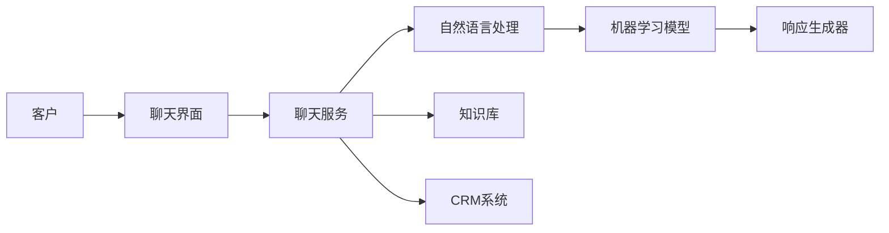
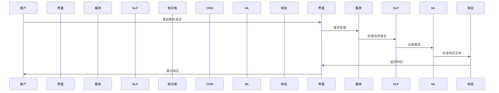

                 

### 引言

#### 1.1 跨代际合作的背景

在当今全球化的背景下，跨代际合作已经成为组织和企业发展的重要趋势。随着社会老龄化和人口结构的变化，不同年龄层之间的交流与协作愈发重要。年轻一代拥有创新思维和新技术技能，而年长者则积累了丰富的经验和专业知识。这种跨代际的合作不仅能带来知识、技能的互补，还能激发创新和变革，推动组织的发展。

跨代际合作的必要性体现在多个方面。首先，不同年龄层在工作态度、价值观、沟通风格等方面存在差异，这些差异可以为团队带来多元化的视角，促进问题的多角度分析和解决。其次，跨代际合作能够促进知识传承，年轻一代可以从年长者那里学习到宝贵的经验和技能，而年长者则可以通过与年轻人的交流更新自己的知识结构。最后，跨代际合作有助于打破年龄壁垒，促进不同年龄段员工之间的相互理解和尊重，构建和谐的工作环境。

#### 1.2 本书的目的与结构

本书旨在深入探讨跨代际合作的理论与实践，帮助读者理解跨代际合作的重要性和具体操作方法。全书共分为七章，结构安排如下：

- **第一章：引言**：介绍跨代际合作的背景、研究目的、结构安排、挑战与机遇，以及基本概念与术语。

- **第二章：跨代际合作的心理学分析**：探讨心理差异对跨代际合作的影响，分析心理学理论在跨代际合作中的应用，并探讨跨代际合作的心理机制和实践策略。

- **第三章：跨代际合作中的沟通技巧**：分析沟通障碍与解决策略，介绍有效的沟通工具与方法，并通过案例分析展示跨代际沟通的有效实践。

- **第四章：跨代际团队的团队建设**：探讨团队建设的核心要素，分析跨代际团队中的领导力和冲突管理，以及绩效评估的方法和策略。

- **第五章：跨代际合作中的创新与变革**：探讨创新在跨代际合作中的重要性，介绍跨代际合作的创新策略和变革管理。

- **第六章：项目实战**：通过具体案例，展示跨代际合作在项目中的实际应用，包括环境安装、系统核心实现、代码应用解读与分析等。

- **第七章：最佳实践、小结与拓展阅读**：总结跨代际合作的最佳实践，提出注意事项，并提供拓展阅读资源。

#### 1.3 跨代际合作的挑战与机遇

跨代际合作虽然具有巨大的潜力，但也面临着诸多挑战。首先，不同年龄层之间的价值观和沟通方式差异可能引发误解和冲突。其次，年长者可能对新技术和新观念的接受度较低，而年轻一代可能缺乏足够的经验和责任感。此外，跨代际合作中的角色定位和任务分配也是一个复杂的问题。

然而，这些挑战也蕴含着巨大的机遇。有效的跨代际合作可以带来创新思维、知识传承和工作效率的提升。通过合理的策略和方法，可以克服年龄差异带来的障碍，实现优势互补和共同发展。

在本章中，我们将详细探讨这些挑战和机遇，并通过具体案例和实践经验，提供实用的解决方案和操作指南。让我们一步一步深入思考，揭开跨代际合作的意义火花。

#### 1.4 基本概念与术语

在探讨跨代际合作之前，我们需要明确一些基本概念和术语，以便为后续内容的讨论打下坚实的基础。

**跨代际合作**：指不同年龄层之间的协作与交流，通常涉及年轻一代与年长者之间的合作。这种合作不仅限于工作场合，还包括社会、家庭等多个层面。

**年龄差异**：指不同年龄层在生理、心理和社会经验等方面的差异。年龄差异是跨代际合作中的重要因素，直接影响沟通方式和合作效率。

**跨代际沟通**：指不同年龄层之间的信息交流和互动过程。有效的跨代际沟通是跨代际合作的关键，需要考虑语言、文化、价值观等多个方面的差异。

**代际文化**：指不同年龄层所特有的文化特征和价值观念。代际文化差异是跨代际合作中的主要挑战之一，需要通过理解和尊重来实现有效沟通和协作。

**代际互动**：指不同年龄层之间的互动和交流过程。代际互动有助于促进跨代际合作，增强团队凝聚力和创新能力。

**跨代际团队**：指由不同年龄层成员组成的团队。跨代际团队在组织结构中扮演重要角色，能够带来多元化的视角和丰富的经验。

通过了解这些基本概念和术语，我们将更好地理解跨代际合作的本质和意义，为后续章节的深入探讨奠定基础。

#### 1.5 小结

在第一章中，我们首先介绍了跨代际合作的背景，包括社会发展趋势、跨代际合作的重要性以及跨代际合作的意义。接着，我们明确了本书的研究目的与结构，详细介绍了各章节的内容安排。此外，我们分析了跨代际合作的挑战与机遇，探讨了基本概念与术语，为后续内容的深入探讨奠定了基础。

通过这一章的学习，读者应能够理解跨代际合作的重要性和必要性，认识到不同年龄层之间的差异及其对合作的影响。在接下来的章节中，我们将进一步探讨跨代际合作的心理学分析、沟通技巧、团队建设、创新与变革以及实际应用，帮助读者全面掌握跨代际合作的原理和实践方法。

## 第2章：跨代际合作的心理学分析

在跨代际合作中，心理差异是一个不可忽视的重要因素。不同年龄层在价值观、沟通风格和工作态度等方面存在显著差异，这些差异不仅影响着个体之间的互动，也影响着整个团队的合作效果。因此，深入探讨跨代际合作中的心理差异及其影响，是理解并优化跨代际合作的重要前提。

### 2.1 心理差异对跨代际合作的影响

#### 2.1.1 价值观差异

价值观是人们对于什么是对和错、什么是重要和次要的信念和态度。不同年龄层由于成长环境和历史背景的不同，往往在价值观上存在显著差异。年轻一代倾向于追求创新、自由和多样性，而年长者则更注重传统、稳定和责任感。这种价值观的差异可能导致以下问题：

- **决策分歧**：年轻一代可能倾向于快速决策和行动，而年长者可能更加谨慎和保守，这可能导致在项目执行过程中出现分歧。
- **目标冲突**：年轻一代可能更关注短期目标和成果，而年长者可能更注重长期目标和组织使命，这可能导致团队在目标设定上产生冲突。
- **工作氛围**：价值观的差异也可能影响工作氛围，年轻一代可能更偏好自由开放的工作环境，而年长者可能更适应等级分明、结构化的工作氛围。

#### 2.1.2 沟通风格差异

沟通风格是指个体在交流过程中的行为习惯和偏好。不同年龄层在沟通风格上存在显著差异，这些差异主要体现在以下几个方面：

- **表达方式**：年轻一代可能更倾向于使用非正式、直接的表达方式，而年长者可能更偏好正式、委婉的表达方式。这种差异可能导致信息传递不准确或误解。
- **沟通频率**：年轻一代可能更喜欢频繁沟通，以便及时解决问题和反馈，而年长者可能更倾向于定期沟通，以保持工作的高效和有序。
- **反馈方式**：年轻一代可能更接受直接的正面和负面反馈，而年长者可能更习惯于间接、委婉的反馈方式。这种差异可能导致沟通效果不佳，影响团队合作。

#### 2.1.3 工作态度与动机差异

工作态度和动机是指个体对工作本身的看法和动力来源。不同年龄层在工作态度和动机上存在显著差异，这些差异主要体现在以下几个方面：

- **工作目标**：年轻一代可能更注重个人成长和发展，追求自我实现和职业成就，而年长者可能更注重工作稳定性和社会贡献。
- **工作压力**：年轻一代可能更能承受高强度的工作压力，而年长者可能更关注工作与生活的平衡，避免过度劳累。
- **工作动力**：年轻一代可能更受外部激励（如奖金、晋升）的影响，而年长者可能更受内在激励（如对工作的热爱、对组织的忠诚）的影响。

这些心理差异不仅影响个体之间的互动，也影响整个团队的合作效果。了解并尊重这些差异，是促进跨代际合作的关键。

### 2.2 心理学理论与跨代际合作

心理学理论为我们提供了理解跨代际合作心理差异的框架和工具。以下是一些重要的心理学理论及其在跨代际合作中的应用：

#### 2.2.1 确认性理论

确认性理论（Confirmation Theory）认为，人们倾向于寻求信息来支持自己的信念和假设，而不是挑战它们。在跨代际合作中，这一理论可以帮助我们理解为什么不同年龄层可能会对相同的信息有不同的解读。

- **应用**：在跨代际合作中，团队领导者可以运用确认性理论来识别并减少认知偏差，通过提供多样化的信息和视角，帮助团队成员形成更全面的理解和共识。

#### 2.2.2 社会比较心理学

社会比较心理学（Social Comparison Psychology）研究个体如何通过与他人比较来确定自己的社会地位和自我评价。在跨代际合作中，社会比较心理学可以帮助我们理解不同年龄层之间的自我认知和期望。

- **应用**：团队领导者可以通过促进积极的社会比较，鼓励团队成员相互学习和成长。例如，通过设置跨代际合作项目，让年轻一代向年长者学习经验，同时让年长者看到年轻一代的创新和活力。

#### 2.2.3 组织心理学

组织心理学（Organizational Psychology）研究个体、团队和组织之间的相互作用。在跨代际合作中，组织心理学提供了理解和优化团队动态的工具。

- **应用**：团队领导者可以通过组织心理学的方法，设计有利于跨代际合作的团队结构和互动机制。例如，通过设立跨代际团队项目，促进不同年龄层之间的互动和合作。

### 2.3 跨代际合作的心理机制

跨代际合作的心理机制涉及信任、认同、共同目标的设定和有效的沟通渠道等方面。以下是这些心理机制的具体内容：

#### 2.3.1 信任与认同

信任是跨代际合作的基础，它是指个体对他人的能力和诚信的信心。认同则是指个体对他人的观点、行为和价值观的认可和接受。在跨代际合作中，建立信任和认同是促进有效合作的关键。

- **建立信任**：可以通过提供透明度、保持一致性、展示诚信和建立良好的沟通渠道来实现。
- **增强认同**：可以通过共同参与活动、分享经验和建立共同目标来实现。

#### 2.3.2 共同目标的设定

共同目标是跨代际合作的核心驱动力，它是团队成员共同努力的方向和目标。设定共同目标有助于减少分歧，增强团队凝聚力和合作效率。

- **设定目标**：可以通过团队讨论、共识达成和目标分解来实现。
- **目标管理**：可以通过定期评估、反馈和调整来实现目标的持续优化。

#### 2.3.3 建立有效的沟通渠道

有效的沟通渠道是跨代际合作的重要保障，它是团队成员之间交流信息、分享思想和解决问题的桥梁。

- **沟通工具**：可以采用面对面沟通、书面沟通和数字化沟通工具，根据具体情况选择合适的沟通方式。
- **沟通技巧**：需要培养倾听、表达、反馈和解决冲突等沟通技巧，以确保信息传递的准确性和有效性。

### 2.4 跨代际合作的实践策略

为了实现有效的跨代际合作，需要采取一系列实践策略来应对心理差异，提升合作效率。

#### 2.4.1 设计多元化的团队

多元化的团队可以容纳不同年龄层的成员，带来多样化的视角和经验，有助于解决问题和推动创新。

- **团队构成**：确保团队成员来自不同年龄层，形成合理的年龄结构。
- **角色分配**：根据团队成员的能力和特长，合理分配任务和角色，发挥各自的优势。

#### 2.4.2 增进团队互动

增进团队互动可以促进团队成员之间的相互了解和信任，提高团队的协作效率。

- **团队活动**：定期组织团队建设活动，如团队培训、团队旅游和团队竞赛等。
- **交流机会**：提供团队成员之间的交流机会，如团队会议、分享会和跨部门交流等。

#### 2.4.3 提高跨代际合作的效率

提高跨代际合作的效率需要采取一系列措施来优化合作流程和提升团队绩效。

- **流程优化**：通过流程分析和流程优化，减少不必要的环节和重复工作，提高工作效率。
- **技术支持**：利用现代信息技术，如项目管理软件、即时通讯工具和协作平台，提高团队的沟通效率和协作能力。

### 2.5 小结

本章从心理学角度分析了跨代际合作中的心理差异，包括价值观差异、沟通风格差异和工作态度与动机差异。我们探讨了心理学理论在跨代际合作中的应用，如确认性理论、社会比较心理学和组织心理学。同时，我们详细阐述了跨代际合作的心理机制，包括信任与认同、共同目标的设定和建立有效的沟通渠道。最后，提出了多元化的团队设计、增进团队互动和提高跨代际合作效率的实践策略。通过这些策略，可以有效地克服跨代际合作中的心理障碍，实现高效的团队合作。

在接下来的章节中，我们将进一步探讨跨代际合作中的沟通技巧，帮助读者更好地理解如何在不同年龄层之间建立有效的沟通机制，促进跨代际合作的顺利进行。

### 2.6 沟通技巧

在跨代际合作中，沟通技巧至关重要。有效的沟通不仅能够消除误解，还能促进理解、信任和合作。然而，由于年龄差异带来的心理和文化差异，跨代际沟通面临着独特的挑战。以下是一些关键的沟通技巧，帮助我们在跨代际合作中实现有效沟通。

#### 2.6.1 语言差异的处理

语言差异是跨代际沟通中的常见问题，不同年龄层可能在语言使用上存在差异。例如，年轻一代可能更倾向于使用网络语言和俚语，而年长者可能更喜欢正式和传统的表达方式。

- **策略**：为了处理语言差异，可以采取以下措施：
  - **使用简单明了的语言**：避免使用复杂、模糊的语言，确保信息传达的清晰性。
  - **解释专业术语**：对于专业术语或特定领域的术语，需要给予解释，确保所有成员都能理解。
  - **使用多种沟通方式**：结合书面沟通、口头沟通和图表等工具，以适应不同成员的偏好。

#### 2.6.2 情绪管理

情绪管理是跨代际沟通中的另一个重要方面。不同年龄层可能在情绪表达和控制上存在差异，年长者可能更倾向于压抑情绪，而年轻一代可能更直接地表达情绪。

- **策略**：为了在跨代际沟通中有效管理情绪，可以采取以下措施：
  - **倾听和理解**：倾听对方的情绪表达，并尽量理解其背后的原因。
  - **表达尊重**：在表达观点时，尊重对方的感受和立场，避免情绪化的语言。
  - **情绪反馈**：在适当的时候，提供积极的情绪反馈，以缓解紧张情绪。

#### 2.6.3 意见分歧的处理

意见分歧在跨代际合作中是不可避免的。不同年龄层在价值观、经验和观念上的差异可能导致意见不一致。

- **策略**：为了处理意见分歧，可以采取以下措施：
  - **保持开放心态**：对于不同的意见，保持开放和接纳的态度，避免立刻反驳或抗拒。
  - **寻找共同点**：寻找双方意见中的共同点，作为进一步沟通和协商的基础。
  - **建立共识**：通过讨论和协商，寻求双方都能接受的解决方案，建立共识。

#### 2.6.4 非言语沟通的使用

非言语沟通，如肢体语言、面部表情和语调等，在跨代际沟通中也起着重要作用。不同年龄层可能在非言语表达上存在差异，这些差异可能导致误解。

- **策略**：为了有效利用非言语沟通，可以采取以下措施：
  - **注意非言语信号**：注意对方的非言语信号，如肢体语言和面部表情，以更好地理解其意图和情感。
  - **避免误解**：在解读非言语信号时，避免过度解读或误解，确保信息的准确传达。
  - **调整非言语表达**：根据不同年龄层的偏好和习惯，适当调整自己的非言语表达，以增强沟通效果。

#### 2.6.5 数字化沟通工具的使用

随着技术的发展，数字化沟通工具在跨代际合作中越来越重要。这些工具不仅提供了便利，还能帮助克服时间和空间的限制。

- **策略**：为了有效利用数字化沟通工具，可以采取以下措施：
  - **选择合适的工具**：根据沟通需求和成员的偏好，选择合适的数字化沟通工具，如电子邮件、即时通讯软件、视频会议平台等。
  - **培训使用技巧**：为团队成员提供数字化沟通工具的培训，确保他们能够熟练使用，并了解如何最大化其效果。
  - **保持沟通的连续性**：利用数字化工具保持沟通的连续性和透明度，确保信息能够及时传达和反馈。

通过以上沟通技巧，我们可以更好地处理跨代际合作中的语言差异、情绪管理和意见分歧，提高沟通效果，促进跨代际合作的成功。

#### 2.7 案例分析：跨代际沟通的有效实践

为了更好地理解跨代际沟通技巧的有效实践，我们来看一个实际案例。

**案例背景**：
某科技公司在开发一款面向老年用户的智能健康监控应用时，遇到了跨代际沟通的挑战。团队成员包括年轻的产品经理、设计师和技术开发人员，以及年长的产品顾问和市场专家。

**案例过程**：

1. **语言差异的处理**：
   - **策略**：项目初期，团队成员意识到语言差异可能影响沟通效果。产品顾问和市场专家向年轻团队介绍了老年用户的语言习惯和表达方式，并强调了使用简单明了的语言的重要性。例如，在设计用户界面时，团队决定避免使用复杂的技术术语，而是使用更易懂的词汇。

2. **情绪管理的实践**：
   - **策略**：在项目过程中，团队成员学习了情绪管理技巧。例如，当出现意见分歧时，年轻团队成员学会了倾听年长顾问的情感表达，并尊重其专业意见。同时，年长顾问也学会了在表达意见时，保持冷静和理性，避免情绪化。

3. **意见分歧的处理**：
   - **策略**：为了处理意见分歧，团队建立了一个定期沟通机制，如每周的团队会议。在会议中，团队成员可以自由表达自己的观点，并通过讨论和协商找到共同点。例如，在讨论应用界面的设计时，年轻团队和年长顾问通过多次讨论，最终达成了一个既符合老年用户需求，又具有现代科技感的设计方案。

4. **非言语沟通的运用**：
   - **策略**：团队成员学习了如何正确解读和运用非言语沟通。在会议中，年轻团队成员注意到了年长顾问的肢体语言和面部表情，从而更好地理解其意图和情感。例如，通过观察年长顾问的面部表情，团队成员能够更好地判断其是否接受或认同某个设计方案。

5. **数字化沟通工具的应用**：
   - **策略**：为了提高沟通效率，团队采用了多种数字化沟通工具。例如，使用了即时通讯软件进行日常沟通，使用了视频会议平台进行远程会议。这些工具不仅方便了团队成员之间的沟通，也确保了信息的及时传达和反馈。

**案例启示**：
通过这个案例，我们可以看到跨代际沟通技巧在实际项目中的有效应用。有效的沟通不仅解决了语言差异、情绪管理和意见分歧等问题，还促进了团队成员之间的理解和合作。以下是这个案例的启示：

- **尊重和理解**：尊重和理解不同年龄层的观点和需求，是跨代际沟通的关键。
- **定期沟通**：建立定期沟通机制，有助于及时解决意见分歧，促进团队成员之间的协作。
- **多元化工具**：结合使用多种数字化沟通工具，可以提高沟通效率和效果。
- **情绪管理**：在沟通中保持情绪稳定，有助于建立信任和增强合作。

通过这个案例，我们可以看到跨代际沟通技巧在实际项目中的应用和效果，这对于其他类似项目具有重要的借鉴意义。

#### 2.8 小结

本章详细探讨了跨代际合作中的沟通技巧，包括语言差异的处理、情绪管理、意见分歧的处理、非言语沟通的运用以及数字化沟通工具的应用。通过这些沟通技巧，我们可以更好地处理跨代际合作中的挑战，提高沟通效果，促进团队合作。

在实际项目中，通过案例分析和实践，我们看到了跨代际沟通技巧的有效应用。这些技巧不仅帮助解决了语言差异和情绪管理问题，还促进了团队成员之间的理解和协作。

在接下来的章节中，我们将进一步探讨跨代际团队的团队建设，包括团队建设中的核心要素、领导力和冲突管理，以及绩效评估的方法和策略。通过这些讨论，我们将帮助读者更深入地理解如何构建一个高效的跨代际团队。

## 第3章：跨代际团队的团队建设

团队建设是跨代际合作中至关重要的一环。一个高效的跨代际团队不仅能够充分利用不同年龄层成员的优势，还能激发创新和协作，推动项目成功。本章节将探讨跨代际团队建设中的核心要素、领导力、冲突管理和绩效评估。

### 3.1 团队建设的核心要素

跨代际团队建设需要关注以下几个核心要素：

#### 3.1.1 团队目标的设定

明确且具有挑战性的团队目标是跨代际团队成功的关键。团队目标应具有以下特点：

- **明确性**：目标应具体、可衡量，使所有成员都能清楚地理解。
- **挑战性**：目标应具有一定的挑战性，激发团队成员的潜力和动力。
- **一致性**：目标应与组织整体战略保持一致，确保团队工作与组织目标相契合。

#### 3.1.2 角色分配

合理的角色分配有助于发挥团队成员的优势，提高团队效能。在跨代际团队中，角色分配应注意以下几点：

- **优势互补**：根据团队成员的特长和经验，分配合适的角色，实现优势互补。
- **职责明确**：明确每个成员的职责和权限，避免职责重叠和职责不清。
- **动态调整**：根据项目进展和团队需求，适时调整角色分配，确保团队成员能够适应变化。

#### 3.1.3 能力提升

跨代际团队成员的能力提升是团队建设的重要组成部分。以下是一些提升团队能力的策略：

- **培训与学习**：定期组织培训和学习活动，提高团队成员的专业技能和综合素质。
- **知识分享**：鼓励团队成员分享经验和知识，促进知识传承和团队成长。
- **挑战与成长**：通过分配具有挑战性的任务，激发团队成员的潜力和成长。

### 3.2 跨代际团队中的领导力

领导力在跨代际团队中扮演着至关重要的角色。有效的领导力能够激发团队成员的积极性，推动团队目标的实现。以下是一些跨代际团队中的领导力策略：

#### 3.2.1 领导力的定义

领导力是指引导和影响团队成员，实现共同目标的能力。在跨代际团队中，领导力应具备以下特点：

- **多元化**：领导力不应局限于特定的年龄层，而是应包容和尊重不同年龄层成员的领导风格和贡献。
- **协作性**：领导力应强调协作和合作，促进团队成员之间的沟通和互动。
- **适应性**：领导力应根据不同年龄层和项目需求，灵活调整领导策略和方法。

#### 3.2.2 领导风格与跨代际团队

不同的领导风格对跨代际团队的影响有所不同。以下是一些常见的领导风格及其在跨代际团队中的应用：

- **授权型领导**：授权型领导鼓励团队成员自主决策和承担责任，适用于年轻一代成员自主性和创新能力较强的情况。
- **指导型领导**：指导型领导为团队成员提供具体的指导和支持，适用于年长一代成员需要更多经验和指导的情况。
- **民主型领导**：民主型领导鼓励团队成员参与决策，适用于跨代际团队中不同年龄层成员共同参与和协作的情况。

#### 3.2.3 领导者的角色与责任

跨代际团队的领导者应承担以下角色和责任：

- **协调者**：协调不同年龄层成员之间的沟通和协作，确保团队目标的实现。
- **激励者**：激励团队成员，激发其潜力和动力，推动团队目标的达成。
- **资源提供者**：为团队成员提供必要的资源和支持，帮助其克服困难和挑战。
- **变革推动者**：推动团队适应变化，不断优化团队结构和合作方式。

### 3.3 跨代际团队的冲突管理

冲突在跨代际团队中是不可避免的。有效的冲突管理有助于解决矛盾，促进团队和谐。以下是一些冲突管理策略：

#### 3.3.1 冲突的类型与原因

跨代际团队的冲突主要可以分为以下几类：

- **价值观冲突**：由于不同年龄层在价值观上的差异，可能导致对问题的看法和解决方案不一致。
- **沟通冲突**：由于沟通方式、语言和表达习惯的差异，可能导致信息传递不畅和误解。
- **资源冲突**：由于资源分配和优先级的不同，可能导致团队成员之间的矛盾和竞争。

冲突的原因主要包括以下几方面：

- **个人差异**：不同年龄层在性格、态度和价值观上的差异。
- **目标不一致**：团队成员在目标设定和优先级上的不同。
- **资源有限**：资源有限可能导致团队成员之间的竞争和矛盾。

#### 3.3.2 冲突的解决策略

以下是一些解决冲突的策略：

- **沟通与理解**：通过有效的沟通，增进团队成员之间的理解和信任，减少误解和矛盾。
- **寻求共识**：通过讨论和协商，寻求双方都能接受的解决方案，达成共识。
- **角色调整**：根据团队成员的特长和需求，调整角色和职责，以减少冲突。
- **引入第三方**：在冲突无法解决时，可以引入第三方进行调解，以客观公正的方式解决冲突。

#### 3.3.3 案例分析

以下是一个跨代际团队冲突管理的实际案例：

**案例背景**：
某公司的研发团队由年轻的产品经理、中年技术专家和年长的测试工程师组成。在一次项目评审中，年轻的产品经理和中年技术专家在项目进度和功能设计上产生了严重分歧。

**解决过程**：

1. **沟通与理解**：团队领导者组织了专门的会议，让双方充分表达自己的观点和担忧。通过沟通，双方认识到分歧的原因在于对项目目标的理解不一致。

2. **寻求共识**：团队领导者引导双方进行讨论，通过寻求共同点，找到了一个双方都能接受的方案。最终，双方达成共识，调整了项目计划和功能设计。

3. **角色调整**：为了更好地解决冲突，团队领导者调整了团队成员的角色分配。中年技术专家负责技术方案的设计，年轻的产品经理负责项目管理和协调。

4. **引入第三方**：在后续的项目评审中，团队领导者邀请了一位外部顾问参与，以客观公正的视角提供建议和指导，帮助团队解决冲突。

**案例启示**：

通过这个案例，我们可以看到有效的沟通和冲突管理策略在跨代际团队中的重要作用。通过沟通理解、寻求共识和角色调整，团队成功地解决了冲突，实现了项目的顺利进行。

### 3.4 跨代际团队的绩效评估

绩效评估是团队管理的重要组成部分，对于跨代际团队尤为重要。以下是一些绩效评估的策略和标准：

#### 3.4.1 绩效评估标准

跨代际团队的绩效评估标准应具备以下特点：

- **客观性**：评估标准应客观、公正，避免主观偏见。
- **全面性**：评估标准应涵盖团队成员的工作表现、专业技能和团队合作等多个方面。
- **可衡量性**：评估标准应具体、可衡量，以便对团队成员的表现进行准确评估。

#### 3.4.2 绩效评估方法

以下是一些常用的绩效评估方法：

- **360度评估**：通过团队成员、上级、同事和客户的反馈，全面评估团队成员的表现。
- **关键绩效指标（KPI）**：设定具体、可衡量的关键绩效指标，评估团队成员的工作成果。
- **行为评估**：评估团队成员的工作态度、行为和团队合作能力。

#### 3.4.3 绩效反馈与改进

有效的绩效反馈和改进机制对于提升团队绩效至关重要。以下是一些策略：

- **及时反馈**：及时给予团队成员绩效反馈，指出优点和需要改进的地方。
- **个性化改进计划**：根据团队成员的表现和需求，制定个性化的改进计划，帮助其提升能力和绩效。
- **持续改进**：通过定期的绩效评估和反馈，持续改进团队工作方式和绩效。

#### 3.4.4 案例分析

以下是一个跨代际团队绩效评估的实际案例：

**案例背景**：
某公司的市场营销团队由年轻的市场分析师、中年市场策划专家和年长的市场经理组成。为了提升团队绩效，公司决定进行一次绩效评估。

**评估过程**：

1. **360度评估**：通过团队成员、上级和客户的反馈，对团队成员的表现进行全面评估。

2. **关键绩效指标（KPI）**：设定了包括市场活动效果、客户满意度、团队协作等多个方面的关键绩效指标，对团队成员的工作成果进行衡量。

3. **行为评估**：通过观察团队成员的工作态度、行为和团队合作能力，对成员进行行为评估。

4. **绩效反馈**：根据评估结果，团队领导者与每位成员进行了绩效反馈，指出了优点和需要改进的地方。

5. **个性化改进计划**：根据团队成员的表现和需求，制定了个性化的改进计划，帮助其提升能力和绩效。

**案例启示**：

通过这个案例，我们可以看到绩效评估在跨代际团队管理中的重要作用。通过360度评估、关键绩效指标和行为评估，可以全面了解团队成员的表现。及时的绩效反馈和个性化的改进计划有助于提升团队绩效，促进团队成员的成长和发展。

#### 3.5 小结

本章详细探讨了跨代际团队的团队建设，包括核心要素、领导力、冲突管理和绩效评估。通过明确团队目标、合理角色分配、能力提升和有效的领导力，可以建立一个高效的跨代际团队。有效的冲突管理和绩效评估机制有助于解决团队中的矛盾和问题，提升团队绩效。

在接下来的章节中，我们将进一步探讨跨代际合作中的创新与变革，帮助读者理解创新在跨代际合作中的重要性，以及如何通过有效的创新策略和变革管理推动跨代际合作的成功。

## 第4章：跨代际合作中的创新与变革

跨代际合作不仅能够带来知识和经验的互补，还能激发创新和变革。创新是推动组织发展的关键动力，而变革管理则是确保创新顺利实施的重要保障。本章将探讨创新在跨代际合作中的重要性、创新策略、变革管理以及如何通过创新和变革推动跨代际合作的成功。

### 4.1 创新在跨代际合作中的重要性

创新是指通过新的想法、方法或技术，创造新的产品、服务或业务模式。在跨代际合作中，创新具有重要的意义：

#### 4.1.1 创新的驱动力

跨代际合作中的创新驱动力来源于不同年龄层之间的互补性。年轻一代的成员通常具备创新思维和新技术技能，而年长一代的成员则拥有丰富的经验和深厚的专业知识。这种互补性为创新提供了丰富的资源和多元化的视角。

- **创新思维**：年轻一代的成员往往敢于挑战传统观念，具有创新思维和尝试新方法的能力。
- **新技术技能**：年轻一代熟悉最新的技术趋势，能够运用新技术推动创新。
- **专业知识**：年长一代的成员拥有丰富的行业经验和专业知识，为创新提供了坚实的基础。

#### 4.1.2 创新的重要性

跨代际合作中的创新具有以下重要性：

- **推动发展**：创新能够推动组织不断进步，提高竞争力和市场份额。
- **解决问题**：创新能够解决组织面临的各种挑战和难题，提高工作效率和效果。
- **知识传承**：通过创新，年长一代的成员可以将自己的经验和知识传授给年轻一代，实现知识的传承和积累。

### 4.2 跨代际合作的创新策略

为了在跨代际合作中实现有效的创新，需要采取一系列策略：

#### 4.2.1 创新思维培养

创新思维是创新成功的关键。以下是一些培养创新思维的方法：

- **跨领域学习**：鼓励团队成员跨领域学习，从不同领域汲取灵感，激发创新思维。
- **思维导图**：使用思维导图工具，帮助团队成员梳理思路，发现潜在的关联和创意。
- **头脑风暴**：组织定期的头脑风暴会议，鼓励团队成员自由表达观点，碰撞出新的创意。

#### 4.2.2 创新实践方法

在跨代际合作中，以下方法可以帮助实现创新：

- **快速原型**：快速构建原型，通过迭代和反馈不断优化，实现创新产品的开发。
- **开放式创新**：借助外部资源和合作伙伴，引入外部创新，提高创新效率和质量。
- **内部创业**：鼓励团队成员提出创新项目，通过内部创业的方式实现创新。

#### 4.2.3 创新成果转化

将创新成果转化为实际应用是跨代际合作中创新成功的关键。以下是一些转化策略：

- **市场调研**：通过市场调研，了解市场需求和用户反馈，确保创新成果具有市场竞争力。
- **资源整合**：整合组织内部和外部的资源，为创新成果的转化提供支持。
- **团队协作**：通过跨部门、跨领域的团队协作，确保创新成果的顺利转化和应用。

### 4.3 变革管理在跨代际合作中的应用

变革管理是指在组织内部引入新的方法、流程或技术时，确保变革顺利实施和有效应用的过程。在跨代际合作中，变革管理尤为重要，因为不同年龄层可能对变革的态度和接受程度有所不同。

#### 4.3.1 变革管理的原则

有效的变革管理应遵循以下原则：

- **沟通与透明度**：确保团队成员了解变革的原因、目标和过程，增强透明度和信任。
- **领导力支持**：领导者应积极推动变革，提供必要的支持和资源。
- **员工参与**：鼓励员工参与变革过程，提高其参与感和责任感。
- **持续改进**：通过持续改进，确保变革的顺利进行和效果。

#### 4.3.2 变革管理的策略

以下是一些变革管理的策略：

- **顶层设计**：明确变革的目标、路径和步骤，确保变革有明确的规划和方向。
- **培训与支持**：为团队成员提供必要的培训和支持，帮助他们适应变革。
- **激励机制**：建立激励机制，鼓励团队成员积极参与变革，提高变革的接受度和执行力。
- **反馈与调整**：通过定期反馈和调整，及时解决变革过程中出现的问题，确保变革的顺利进行。

#### 4.3.3 变革管理的案例

以下是一个变革管理的实际案例：

**案例背景**：
某公司的IT部门决定引入新的项目管理工具，以提高项目管理效率。然而，该公司的员工年龄结构较为复杂，包括年轻的技术开发和测试人员，以及年长的项目经理和管理人员。

**变革过程**：

1. **沟通与透明度**：公司领导层通过内部邮件和团队会议，向所有员工传达了引入新项目管理工具的原因和目标，增强了透明度和信任。

2. **领导力支持**：公司高层领导积极参与变革过程，提供必要的支持和资源，确保变革的顺利进行。

3. **员工参与**：公司组织了多次讨论会，邀请员工参与新项目管理工具的讨论和设计，提高了员工的参与感和责任感。

4. **培训与支持**：公司为员工提供了全面的新项目管理工具培训，确保员工能够熟练使用新工具。

5. **激励机制**：公司建立了激励机制，对积极参与变革和取得显著成果的员工给予奖励。

6. **反馈与调整**：在变革实施过程中，公司定期收集员工反馈，及时调整和优化新项目管理工具的功能和操作，确保变革的顺利进行。

**案例启示**：

通过这个案例，我们可以看到变革管理在跨代际合作中的重要性。有效的变革管理能够确保创新工具和方法的顺利实施，提高组织效率和管理水平。在跨代际合作中，通过沟通与透明度、领导力支持、员工参与、培训与支持和反馈与调整等策略，可以成功推动变革，实现组织目标。

### 4.4 创新与变革的最佳实践

以下是一些跨代际合作中创新与变革的最佳实践：

- **建立创新实验室**：创建创新实验室，鼓励团队成员进行创新实验，提供必要的资源和支持。
- **设立创新奖励机制**：建立创新奖励机制，对成功创新的团队成员给予奖励，激励创新热情。
- **跨部门合作**：鼓励跨部门合作，促进不同领域和不同年龄层之间的交流与协作，激发创新思维。
- **定期举办创新竞赛**：定期举办创新竞赛，鼓励团队成员提出创新项目和解决方案，提高创新能力和团队凝聚力。
- **灵活的工作时间与地点**：提供灵活的工作时间和地点，为团队成员创造更好的创新环境。

### 4.5 小结

本章探讨了跨代际合作中的创新与变革，分析了创新在跨代际合作中的重要性、创新策略、变革管理以及如何通过创新和变革推动跨代际合作的成功。通过创新思维培养、创新实践方法和创新成果转化，跨代际合作能够实现知识传承和创新发展。变革管理则确保创新和变革的顺利实施，提高组织效率和竞争力。

在跨代际合作中，通过建立创新实验室、设立创新奖励机制、跨部门合作、定期举办创新竞赛以及提供灵活的工作时间与地点等最佳实践，可以激发创新活力，推动组织发展。通过这些措施，跨代际合作不仅能够实现知识传承和创新，还能推动组织不断进步，实现长期可持续发展。

在接下来的章节中，我们将通过具体的项目实战案例，展示跨代际合作在实际应用中的效果和优势，帮助读者更深入地理解跨代际合作的意义和实践方法。

## 第5章：项目实战

在本章中，我们将通过一个实际项目实战案例，详细展示跨代际合作在项目中的具体应用。这个案例涉及项目的背景、系统设计、实施过程、实际案例分析和项目小结，旨在帮助读者更深入地理解跨代际合作的理论和实践。

### 5.1 项目背景

某大型企业为了提升其客户服务体验，决定开发一款智能客服系统。该项目涉及不同年龄层的团队成员，包括年轻的技术开发人员、中年产品经理和年长的系统架构师。这个项目不仅需要技术创新，还需要跨代际团队成员之间的紧密协作，以实现高效的系统设计和开发。

### 5.2 系统设计与架构

#### 5.2.1 问题场景介绍

智能客服系统的目标是为客户提供24/7的在线支持，通过自然语言处理和机器学习技术，自动识别和解答客户的问题。系统需要支持多语言处理，具备高并发处理能力，并能够与企业的CRM系统无缝集成。

#### 5.2.2 项目介绍

项目由一个跨代际团队负责，团队成员包括：

- 年轻的技术开发人员：负责系统前端开发、后端服务开发和机器学习模型的训练。
- 中年产品经理：负责项目规划、需求分析和用户测试。
- 年长的系统架构师：负责系统架构设计、性能优化和安全性评估。

#### 5.2.3 系统功能设计（领域模型Mermaid类图）

```mermaid
classDiagram
  Client -> ChatInterface : 发起聊天
  ChatInterface -> ChatService : 处理聊天请求
  ChatService -> NLPProcessor : 处理自然语言
  ChatService -> KnowledgeBase : 查询知识库
  ChatService -> CRMSystem : 集成CRM系统
  NLPProcessor -> MLModel : 训练机器学习模型
  MLModel -> ResponseGenerator : 生成响应文本
```

#### 5.2.4 系统架构设计Mermaid架构图



#### 5.2.5 系统接口设计和系统交互Mermaid序列图



### 5.3 系统核心实现

以下是一个简单的Python代码示例，用于展示智能客服系统中的自然语言处理和机器学习模型训练的基本实现。

```python
import nltk
from nltk.tokenize import word_tokenize
from nltk.tag import pos_tag
from sklearn.feature_extraction.text import TfidfVectorizer
from sklearn.naive_bayes import MultinomialNB
from sklearn.pipeline import make_pipeline

# 加载NLTK数据集
nltk.download('punkt')
nltk.download('averaged_perceptron_tagger')

# 样本数据
data = [
    ("How do I return an item?", "Returns"),
    ("Can I cancel my order?", "Cancellations"),
    ("What are your shipping options?", "Shipping"),
    # ...更多样本文本
]

# 训练模型
model = make_pipeline(TfidfVectorizer(), MultinomialNB())

# 训练模型
for question, category in data:
    model.fit(question, category)

# 自然语言处理函数
def process_question(question):
    tokens = word_tokenize(question)
    tags = pos_tag(tokens)
    return ' '.join([word for word, tag in tags if tag.startswith('NN')])

# 测试模型
question = "What is your return policy?"
processed_question = process_question(question)
predicted_category = model.predict([processed_question])[0]

print(f"Predicted category: {predicted_category}")
```

### 5.4 代码应用解读与分析

上述代码展示了自然语言处理和机器学习模型训练的基本流程。首先，我们加载了NLTK数据集，并定义了样本数据。接着，我们使用`TfidfVectorizer`和`MultinomialNB`构建了一个机器学习管道，用于文本向量和分类。`process_question`函数负责对输入问题进行自然语言处理，提取名词短语，以便更好地进行分类。

在测试部分，我们输入一个示例问题，并使用训练好的模型进行预测。预测结果显示，系统成功地将问题归类到了“Returns”类别。

### 5.5 实际案例分析和详细讲解

以下是一个实际案例，展示了智能客服系统在处理客户咨询时的应用。

**案例背景**：
一位客户通过智能客服系统咨询关于退货政策的详细信息。

**系统交互**：
1. 客户输入问题：“How do I return an item?”
2. 系统调用`process_question`函数处理输入问题，提取关键信息。
3. 系统使用训练好的机器学习模型对处理后的文本进行分类，预测类别为“Returns”。
4. 系统生成并返回关于退货政策的详细解释。

**分析**：
在这个案例中，智能客服系统通过自然语言处理和机器学习技术，成功识别并回答了客户的咨询。系统从输入问题中提取了关键信息，并使用预训练的模型进行了分类。这一过程展示了跨代际合作在智能客服系统开发中的应用，年轻开发人员负责技术实现和模型训练，年长产品经理则负责需求分析和用户测试，确保系统能够满足客户需求并提高客户满意度。

### 5.6 项目小结

通过本项目实战，我们展示了跨代际合作在智能客服系统开发中的具体应用。项目成功的关键在于跨代际团队成员之间的紧密协作和互补。年轻开发人员的技术创新和机器学习模型的训练为系统提供了强大的技术支持，而年长产品经理的经验和用户测试确保了系统的高效和可靠性。

本项目的成功经验表明，跨代际合作不仅可以实现知识传承和创新，还能提升团队整体效率和项目成功率。通过合理的角色分配和协作机制，跨代际合作能够在实际项目中发挥出巨大的潜力，为组织带来持续的创新和发展。

在接下来的章节中，我们将总结跨代际合作的最佳实践，提出注意事项，并提供拓展阅读资源，帮助读者进一步深化对跨代际合作的理解和应用。

## 第6章：最佳实践、小结、注意事项及拓展阅读

### 6.1 最佳实践

通过前几章的讨论，我们可以总结出一些跨代际合作的最佳实践，这些实践有助于提高团队合作效率，实现知识传承和创新：

- **多元化团队建设**：组建多元化的团队，确保团队成员来自不同年龄层，发挥各自的优势和专长。
- **明确目标与角色**：设定清晰的团队目标，明确每个成员的角色和职责，确保团队成员各司其职。
- **沟通与协作**：建立有效的沟通渠道，促进团队成员之间的信息共享和协作，减少误解和冲突。
- **领导力培养**：培养具有跨代际视角和领导力的领导者，鼓励团队成员积极参与决策和项目推进。
- **创新激励机制**：设立创新奖励机制，激励团队成员提出新想法和解决方案，推动持续创新。
- **灵活工作安排**：提供灵活的工作时间和地点，以适应不同年龄层的工作习惯和需求。

### 6.2 小结

跨代际合作在组织发展中具有重要意义。通过合理利用不同年龄层之间的知识和经验互补，可以有效提升团队的整体效能，实现创新和变革。本章通过项目实战展示了跨代际合作在实际应用中的效果和优势，强调了多元化团队建设、明确目标与角色、沟通与协作、领导力培养、创新激励机制和灵活工作安排等最佳实践的重要性。

### 6.3 注意事项

在跨代际合作中，需要注意以下几个方面，以确保合作顺利进行：

- **尊重差异**：尊重不同年龄层在价值观、沟通风格和工作态度上的差异，避免因差异引发的误解和冲突。
- **公平对待**：确保每个成员都有公平的机会参与决策和贡献，避免年龄偏见和歧视。
- **持续培训**：定期为团队成员提供培训和学习机会，提高其专业能力和跨代际沟通技巧。
- **透明沟通**：保持沟通的透明度，确保团队成员了解项目的进展和目标，增强团队的凝聚力和信任。

### 6.4 拓展阅读

为了更深入地了解跨代际合作的理论和实践，读者可以参考以下拓展阅读资源：

- 《跨代际团队协作：从冲突到共赢》（作者：约翰·莫里森）
- 《世代差异：如何克服跨代际障碍》（作者：莎伦·莫里）
- 《跨代际沟通技巧：跨越年龄界限》（作者：丽贝卡·布洛克斯）
- 《智慧传承：跨代际领导力》（作者：丹尼斯·雷蒙德）
- 《智慧与青春的碰撞：跨代际团队如何高效合作》（作者：史蒂夫·乔布斯）

这些书籍和资源将帮助读者进一步理解和应用跨代际合作的理论和实践，为组织的发展和创新提供有力支持。

### 6.5 总结

跨代际合作是组织发展中不可或缺的一部分。通过有效的跨代际合作，组织可以充分利用不同年龄层的知识和经验，实现创新和变革。本章通过项目实战和最佳实践的总结，为读者提供了跨代际合作的具体操作指南。希望读者能够将所学应用于实际工作中，构建高效的跨代际团队，推动组织的持续发展。

