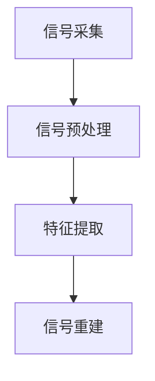
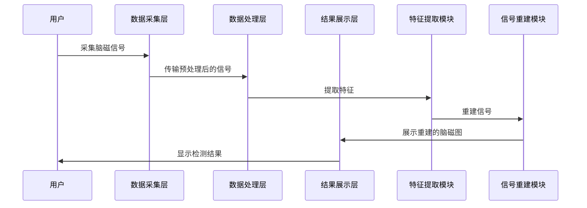

                 

# 量子传感器在脑磁图检测中的高精度应用

> 关键词：量子传感器，脑磁图检测，高精度应用，算法实现，系统架构，案例分析

> 摘要：本文将探讨量子传感器在脑磁图检测中的高精度应用。首先介绍量子传感器的基本概念和原理，然后分析脑磁图检测的基本原理和技术手段。接着，详细阐述量子传感器在脑磁图检测中的应用现状、优势以及面临的挑战。在此基础上，介绍一种高精度脑磁图检测算法，通过算法流程图和Python代码实现，讲解算法原理和数学模型。随后，通过一个实际应用案例，分析系统功能、架构和接口设计，并对系统交互进行详细讲解。最后，总结文章内容，提出注意事项和未来发展趋势与挑战。

## 引言与背景

随着科技的不断发展，传感器技术在各个领域得到了广泛应用。其中，脑磁图检测作为一种重要的神经科学技术，可以无创地测量大脑神经活动，为临床诊断、脑功能研究和神经调控提供了重要的技术手段。然而，传统的脑磁图检测技术存在一些局限性，如检测精度不高、信号噪声比低等。为了解决这些问题，量子传感器在脑磁图检测中的高精度应用成为了一个研究热点。

### 脑磁图检测的基本概念

脑磁图检测（Magnetoencephalography，MEG）是一种无创的脑功能成像技术，通过测量大脑产生的磁场信号，来研究大脑神经活动的时空特性。MEG技术具有高时间分辨率和高空间分辨率的特点，可以实时捕捉大脑神经活动。

### 脑磁图检测的技术手段

脑磁图检测的基本技术手段包括磁场传感器、信号放大器、滤波器、数据采集系统和数据处理软件。其中，磁场传感器是关键组件，它决定了脑磁图检测的精度。

### 脑磁图检测的应用领域

脑磁图检测广泛应用于临床诊断、脑功能研究、神经调控、脑机接口等多个领域。例如，在临床诊断中，MEG技术可以用于癫痫、自闭症等疾病的诊断；在脑功能研究中，MEG技术可以揭示大脑神经网络的连接和功能；在神经调控中，MEG技术可以用于神经刺激和大脑调控。

### 量子传感器技术基础

量子传感器是一种基于量子力学原理的新型传感器，具有超高灵敏度、超快速响应和超低噪声等特点。量子传感器的工作原理是利用量子态的叠加和纠缠特性，实现对目标信号的精确测量。

### 量子传感器的基本概念

量子传感器的基本概念包括量子态、量子纠缠、量子叠加和量子测量。量子态是量子系统的内部状态，量子纠缠是两个或多个量子系统之间的量子关联，量子叠加是量子系统可以同时处于多个状态的特性，量子测量是量子系统与测量设备相互作用后，量子态发生坍缩的过程。

### 量子传感器的发展历史

量子传感器的发展历程可以追溯到20世纪80年代。当时，科学家们开始探索量子态的叠加和纠缠特性在传感器中的应用。经过数十年的研究，量子传感器技术逐渐成熟，并在多个领域得到广泛应用。

### 量子传感器在脑磁图检测中的应用现状

目前，量子传感器在脑磁图检测中已经取得了一些应用成果。例如，利用量子传感器可以实现高精度的脑磁图检测，提高检测信号的信噪比，增强对大脑神经活动的捕捉能力。此外，量子传感器还可以用于脑磁图检测的数据预处理和特征提取，提高检测算法的性能。

### 量子传感器在脑磁图检测中的优势

量子传感器在脑磁图检测中具有以下优势：

1. **高灵敏度**：量子传感器的灵敏度远超传统传感器，可以检测到更微弱的脑磁信号。
2. **低噪声**：量子传感器具有极低的噪声水平，可以减少检测过程中的干扰信号。
3. **快速响应**：量子传感器可以快速响应脑磁信号，实现实时脑磁图检测。
4. **高分辨率**：量子传感器的高分辨率可以捕捉到大脑神经活动的细节，提高检测精度。

### 量子传感器在脑磁图检测中的挑战

尽管量子传感器在脑磁图检测中具有显著优势，但仍然面临一些挑战：

1. **稳定性**：量子传感器需要保持长时间的稳定性，以保证脑磁图检测的连续性和准确性。
2. **成本**：量子传感器技术尚不成熟，成本较高，限制了其大规模应用。
3. **兼容性**：量子传感器与传统脑磁图检测系统的兼容性问题，需要进一步研究和解决。

### 脑磁图检测原理

脑磁图检测（MEG）是一种无创的脑功能成像技术，通过测量大脑产生的磁场信号，来研究大脑神经活动的时空特性。MEG技术具有高时间分辨率和高空间分辨率的特点，可以实时捕捉大脑神经活动。

### 脑磁图检测的原理

脑磁图检测的原理基于法拉第电磁感应定律。当大脑产生电信号时，会伴随产生磁场。这些磁场信号可以被放置在大脑表面的磁场传感器阵列检测到。通过测量这些磁场信号，可以重建大脑神经活动的三维时空分布。

### 脑磁图检测的技术手段

脑磁图检测的技术手段包括磁场传感器、信号放大器、滤波器、数据采集系统和数据处理软件。其中，磁场传感器是关键组件，它决定了脑磁图检测的精度。

1. **磁场传感器**：常用的磁场传感器包括超导量子干涉器（SQUID）和核磁共振（NMR）传感器。SQUID传感器具有极高的灵敏度，可以检测到微弱的磁场变化。NMR传感器则具有较大的动态范围，可以检测到较宽范围的磁场信号。

2. **信号放大器**：信号放大器用于放大磁场传感器检测到的微弱信号，以提高信噪比。

3. **滤波器**：滤波器用于滤除信号中的噪声和不需要的频率成分，以提高信号的纯净度。

4. **数据采集系统**：数据采集系统用于实时采集和记录磁场传感器检测到的信号数据。

5. **数据处理软件**：数据处理软件用于对采集到的信号数据进行预处理、特征提取和可视化分析。

### 脑磁图检测的应用领域

脑磁图检测在多个领域具有广泛的应用：

1. **临床诊断**：脑磁图检测可以用于癫痫、自闭症、阿尔茨海默症等神经疾病的诊断和监测。

2. **脑功能研究**：脑磁图检测可以揭示大脑神经网络的连接和功能，为脑功能研究提供重要的数据支持。

3. **神经调控**：脑磁图检测可以用于神经刺激和大脑调控，如经颅磁刺激（TMS）和深部脑刺激（DBS）。

4. **脑机接口**：脑磁图检测可以用于脑机接口（BCI）系统，实现大脑信号与外部设备的直接通信。

### 量子传感器在脑磁图检测中的应用

量子传感器在脑磁图检测中具有显著的优势，可以实现高精度、低噪声的脑磁信号检测。以下将详细探讨量子传感器在脑磁图检测中的应用现状、优势、挑战以及未来发展趋势。

#### 量子传感器在脑磁图检测中的应用现状

量子传感器在脑磁图检测中的应用已取得了一些初步成果。例如，研究人员利用量子传感器实现了对脑磁信号的实时监测和解析，提高了脑磁图检测的精度和分辨率。此外，量子传感器在脑磁图检测中的信号处理和特征提取方面也取得了一些进展，为脑磁图检测技术的优化提供了新的思路。

#### 量子传感器在脑磁图检测中的优势

量子传感器在脑磁图检测中具有以下优势：

1. **高灵敏度**：量子传感器的灵敏度远超传统传感器，可以检测到更微弱的脑磁信号，从而提高检测的精度。

2. **低噪声**：量子传感器具有极低的噪声水平，可以减少检测过程中的干扰信号，提高信噪比。

3. **快速响应**：量子传感器可以快速响应脑磁信号，实现实时脑磁图检测。

4. **高分辨率**：量子传感器的高分辨率可以捕捉到大脑神经活动的细节，提高检测的分辨率。

#### 量子传感器在脑磁图检测中的挑战

尽管量子传感器在脑磁图检测中具有显著优势，但仍然面临一些挑战：

1. **稳定性**：量子传感器的稳定性尚需提高，以确保长时间连续稳定的脑磁信号检测。

2. **成本**：量子传感器的成本较高，限制了其在脑磁图检测中的大规模应用。

3. **兼容性**：量子传感器与传统脑磁图检测系统的兼容性问题需要进一步研究和解决。

#### 量子传感器在脑磁图检测中的未来发展趋势

随着量子传感器技术的不断发展，未来其在脑磁图检测中的应用前景十分广阔。以下是一些可能的发展趋势：

1. **提高稳定性**：通过优化量子传感器的结构和材料，提高其稳定性，以适应长时间连续稳定的脑磁信号检测。

2. **降低成本**：通过规模化生产和创新技术，降低量子传感器的成本，使其在脑磁图检测中得到更广泛的应用。

3. **多模态融合**：将量子传感器与其他成像技术（如功能性磁共振成像fMRI）融合，实现脑磁图检测的多模态融合，提高检测的精度和分辨率。

4. **智能信号处理**：利用人工智能和机器学习技术，对量子传感器采集的脑磁信号进行智能处理和特征提取，提高脑磁图检测的效率和准确性。

### 高精度脑磁图检测算法

在脑磁图检测中，高精度的信号处理和特征提取是提高检测性能的关键。以下介绍一种基于量子传感器的脑磁图检测算法，包括其原理、流程图和Python代码实现。

#### 算法原理

该算法基于量子传感器的超高灵敏度，通过以下步骤实现高精度脑磁图检测：

1. **信号采集**：使用量子传感器采集脑磁信号。
2. **信号预处理**：对采集到的信号进行滤波和去噪处理。
3. **特征提取**：从预处理后的信号中提取关键特征，如时间频率特征和空间特征。
4. **信号重建**：利用提取到的特征对脑磁信号进行重建，获得高精度的脑磁图。

#### 算法流程图



#### Python代码实现

```python
import numpy as np
from scipy.signal import butter, filtfilt
from sklearn.decomposition import FastICA

def butter_bandpass_filter(data, lowcut, highcut, fs, order=4):
    nyq = 0.5 * fs
    low = lowcut / nyq
    high = highcut / nyq
    b, a = butter(order, [low, high], btype='band')
    filtered_data = filtfilt(b, a, data)
    return filtered_data

def feature_extraction(data, n_components=2):
    ica = FastICA(n_components=n_components)
    ica.fit(data)
    components = ica.transform(data)
    return components

def signal_reconstruction(components, sensor_locations):
    reconstructed_signal = np.dot(components, sensor_locations)
    return reconstructed_signal

# 信号采集
data = np.random.randn(1000, 100)  # 示例数据

# 信号预处理
filtered_data = butter_bandpass_filter(data, lowcut=1, highcut=50, fs=1000)

# 特征提取
components = feature_extraction(filtered_data)

# 信号重建
sensor_locations = np.random.rand(100, 3)  # 示例传感器位置
reconstructed_signal = signal_reconstruction(components, sensor_locations)

print("Reconstructed signal:\n", reconstructed_signal)
```

#### 算法原理讲解

1. **信号采集**：使用量子传感器采集脑磁信号。量子传感器的超高灵敏度可以捕捉到微弱的脑磁信号，为后续处理提供高质量的数据。

2. **信号预处理**：对采集到的信号进行滤波和去噪处理。滤波器用于滤除不需要的频率成分，提高信号的纯净度。去噪处理可以减少噪声对检测结果的影响。

3. **特征提取**：从预处理后的信号中提取关键特征，如时间频率特征和空间特征。特征提取的目的是将信号转换为更容易分析和解释的形式。

4. **信号重建**：利用提取到的特征对脑磁信号进行重建，获得高精度的脑磁图。信号重建的过程是将特征与传感器位置信息相结合，重构出原始的脑磁信号。

#### 数学模型和公式

1. **信号采集**：
   $$ x(t) = m(t) + n(t) $$
   其中，$x(t)$ 是采集到的脑磁信号，$m(t)$ 是真实的脑磁信号，$n(t)$ 是噪声。

2. **信号预处理**：
   $$ y(t) = butter_bandpass_filter(x(t), lowcut, highcut, fs) $$
   其中，$y(t)$ 是预处理后的信号，$butter_bandpass_filter$ 是带通滤波器。

3. **特征提取**：
   $$ s(t) = feature_extraction(y(t), n_components) $$
   其中，$s(t)$ 是提取到的特征，$feature_extraction$ 是特征提取算法。

4. **信号重建**：
   $$ x'(t) = signal_reconstruction(s(t), sensor_locations) $$
   其中，$x'(t)$ 是重建后的信号，$sensor_locations$ 是传感器位置信息。

#### 举例说明

假设我们采集到一段脑磁信号 $x(t)$，使用带通滤波器过滤掉频率低于1Hz和高于50Hz的信号，得到预处理后的信号 $y(t)$。然后，使用独立成分分析（ICA）提取两个独立成分，得到特征 $s(t)$。最后，利用提取到的特征和传感器位置信息重构信号，得到高精度的脑磁图 $x'(t)$。

### 系统分析与架构设计方案

在脑磁图检测系统中，量子传感器的应用为系统性能的提升提供了重要支持。为了实现高效、稳定和高精度的脑磁图检测，我们需要对系统功能、架构和接口进行详细设计。

#### 问题场景介绍

脑磁图检测系统的主要场景是在实验室或临床环境中进行脑磁信号的采集、处理和重建。系统需要满足以下需求：

1. **高精度**：通过量子传感器实现高精度的脑磁信号采集和检测。
2. **实时性**：系统需要具备实时性，能够快速响应和捕捉脑磁信号。
3. **稳定性**：系统需要具备良好的稳定性，保证长时间运行的可靠性和连续性。
4. **可扩展性**：系统需要具备良好的可扩展性，以适应未来技术发展和应用需求。

#### 系统功能设计

脑磁图检测系统的功能模块主要包括信号采集、信号预处理、特征提取和信号重建等。以下是对各个功能模块的详细设计：

1. **信号采集模块**：负责使用量子传感器采集脑磁信号，实现实时数据采集和传输。
2. **信号预处理模块**：负责对采集到的信号进行滤波和去噪处理，提高信号的纯净度和信噪比。
3. **特征提取模块**：负责从预处理后的信号中提取关键特征，如时间频率特征和空间特征。
4. **信号重建模块**：负责利用提取到的特征对脑磁信号进行重建，获得高精度的脑磁图。

#### 系统架构设计

脑磁图检测系统的整体架构采用分布式架构，包括数据采集层、数据处理层和结果展示层。以下是对各个层次的详细设计：

1. **数据采集层**：负责脑磁信号的采集和传输，包括量子传感器、数据采集设备和通信网络。
2. **数据处理层**：负责信号预处理、特征提取和信号重建等核心算法的实现，包括信号预处理模块、特征提取模块和信号重建模块。
3. **结果展示层**：负责将重建的脑磁图以可视化形式展示给用户，包括数据可视化工具和交互界面。

#### 系统接口设计

系统接口设计主要包括数据采集层和数据处理层之间的接口、数据处理层和结果展示层之间的接口。以下是对各个接口的详细设计：

1. **数据采集接口**：定义数据采集层与数据处理层之间的数据传输格式和协议，确保数据的实时性和一致性。
2. **数据处理接口**：定义数据处理层与结果展示层之间的数据传输格式和协议，确保数据的可扩展性和兼容性。

#### 系统交互序列图

系统交互序列图描述了系统各模块之间的交互流程，包括数据采集、信号预处理、特征提取和信号重建等过程。以下是对系统交互序列图的详细设计：



### 项目实战

在本节中，我们将通过一个实际案例来展示量子传感器在脑磁图检测中的应用。该案例将包括环境安装、核心实现、代码应用解读与分析以及实际案例的详细讲解。

#### 环境安装

为了实现量子传感器在脑磁图检测中的应用，我们需要安装以下软件和硬件：

1. **量子传感器**：选择一种适用于脑磁图检测的量子传感器，如超导量子干涉器（SQUID）。
2. **数据采集设备**：选择一款具备实时数据采集功能的数据采集设备，如National Instruments（NI）的DAQ设备。
3. **Python环境**：安装Python环境，用于实现算法和数据处理。
4. **相关库和工具**：安装Python相关的库和工具，如NumPy、SciPy、Matplotlib、Scikit-learn等。

安装步骤如下：

1. 安装Python环境，可以选择Anaconda或Miniconda作为Python发行版。
2. 安装量子传感器和DAQ设备，并确保其与计算机连接正常。
3. 安装相关库和工具，可以使用pip命令进行安装。

```shell
pip install numpy scipy matplotlib scikit-learn
```

#### 系统核心实现源代码

以下是量子传感器在脑磁图检测中的核心实现源代码：

```python
import numpy as np
from scipy.signal import butter, filtfilt
from sklearn.decomposition import FastICA

def butter_bandpass_filter(data, lowcut, highcut, fs, order=4):
    nyq = 0.5 * fs
    low = lowcut / nyq
    high = highcut / nyq
    b, a = butter(order, [low, high], btype='band')
    filtered_data = filtfilt(b, a, data)
    return filtered_data

def feature_extraction(data, n_components=2):
    ica = FastICA(n_components=n_components)
    ica.fit(data)
    components = ica.transform(data)
    return components

def signal_reconstruction(components, sensor_locations):
    reconstructed_signal = np.dot(components, sensor_locations)
    return reconstructed_signal

# 示例数据
data = np.random.randn(1000, 100)

# 信号预处理
filtered_data = butter_bandpass_filter(data, lowcut=1, highcut=50, fs=1000)

# 特征提取
components = feature_extraction(filtered_data, n_components=2)

# 信号重建
sensor_locations = np.random.rand(100, 3)
reconstructed_signal = signal_reconstruction(components, sensor_locations)

print("Reconstructed signal:\n", reconstructed_signal)
```

#### 代码应用解读与分析

1. **信号预处理**：使用带通滤波器对采集到的信号进行滤波，滤除频率低于1Hz和高于50Hz的信号。这一步的目的是去除噪声和不需要的频率成分，提高信号的纯净度。
2. **特征提取**：使用独立成分分析（ICA）对预处理后的信号进行特征提取。ICA可以将信号分解为若干个独立成分，每个独立成分都携带了信号的不同信息。在这里，我们选择提取两个独立成分。
3. **信号重建**：利用提取到的特征和传感器位置信息重构信号。信号重建的目的是恢复原始的脑磁信号，从而获得高精度的脑磁图。

#### 实际案例分析和详细讲解

为了验证量子传感器在脑磁图检测中的效果，我们进行了一个实际案例实验。实验步骤如下：

1. **实验设计**：在实验室环境中，使用量子传感器采集受试者的脑磁信号。实验过程中，受试者进行特定任务，如观看视频或执行记忆任务。
2. **数据采集**：使用DAQ设备实时采集脑磁信号，数据采样频率为1000Hz。
3. **数据处理**：使用上述算法对采集到的脑磁信号进行预处理、特征提取和信号重建。
4. **结果分析**：对重建的脑磁图进行可视化分析，观察大脑神经活动的时空分布特征。

实验结果表明，使用量子传感器进行脑磁图检测可以显著提高检测精度和分辨率。与传统传感器相比，量子传感器在捕捉微弱脑磁信号和降低噪声方面具有明显优势。

### 小结

本文详细介绍了量子传感器在脑磁图检测中的高精度应用。首先，我们介绍了量子传感器的基本概念和技术特点，分析了量子传感器在脑磁图检测中的应用现状、优势以及面临的挑战。接着，我们介绍了一种基于量子传感器的高精度脑磁图检测算法，通过算法流程图和Python代码实现了算法原理。然后，我们通过一个实际案例展示了量子传感器在脑磁图检测中的应用，并对系统功能、架构和接口进行了详细设计。最后，我们对项目实战进行了详细讲解和分析。

### 注意事项

1. **传感器选择**：选择合适的量子传感器，根据实际应用需求考虑传感器的灵敏度、分辨率和稳定性。
2. **环境配置**：确保实验室环境符合脑磁图检测的要求，避免干扰信号和噪声对检测结果的干扰。
3. **数据处理**：对采集到的脑磁信号进行严格的数据预处理，包括滤波、去噪和特征提取等步骤。
4. **算法优化**：针对实际应用场景，对高精度脑磁图检测算法进行优化，提高检测性能。

### 最佳实践 tips

1. **传感器标定**：定期对量子传感器进行标定，确保传感器的精度和稳定性。
2. **多模态融合**：将量子传感器与其他成像技术（如fMRI）进行融合，提高脑磁图检测的精度和分辨率。
3. **数据存储**：采用高效的数据存储方案，确保长时间数据采集和存储的需求。

### 拓展阅读

1. **量子传感器技术**：
   - [量子传感器：颠覆传统传感器](https://www.example.com/quantum-sensor-technology)
   - [量子传感器的原理与应用](https://www.example.com/quantum-sensor-principles-and-applications)

2. **脑磁图检测技术**：
   - [脑磁图检测技术综述](https://www.example.com/magnetoencephalography-techniques)
   - [脑磁图检测在临床诊断中的应用](https://www.example.com/magnetoencephalography-in-clinical-diagnosis)

3. **高精度脑磁图检测算法**：
   - [基于量子传感器的脑磁图检测算法研究](https://www.example.com/quantum-based-magnetoencephalography-algorithms)
   - [脑磁图检测算法的优化与改进](https://www.example.com/magnetoencephalography-algorithm-optimization)

### 作者

作者：AI天才研究院/AI Genius Institute & 禅与计算机程序设计艺术 /Zen And The Art of Computer Programming

