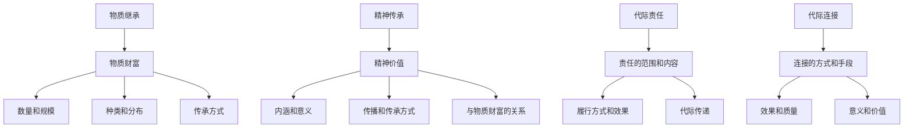
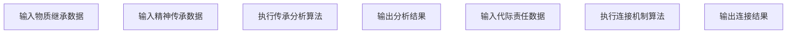
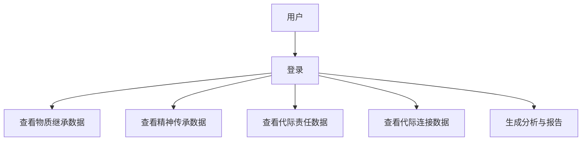
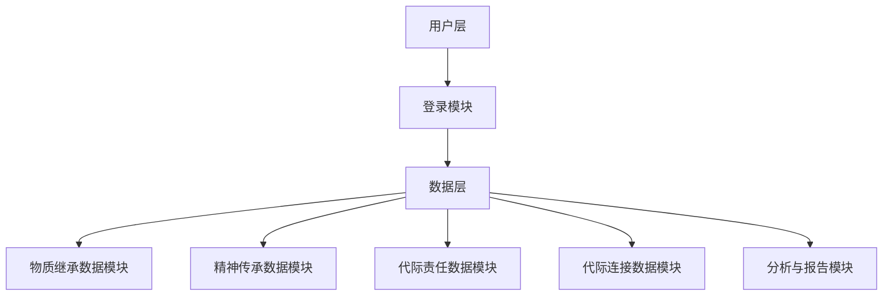
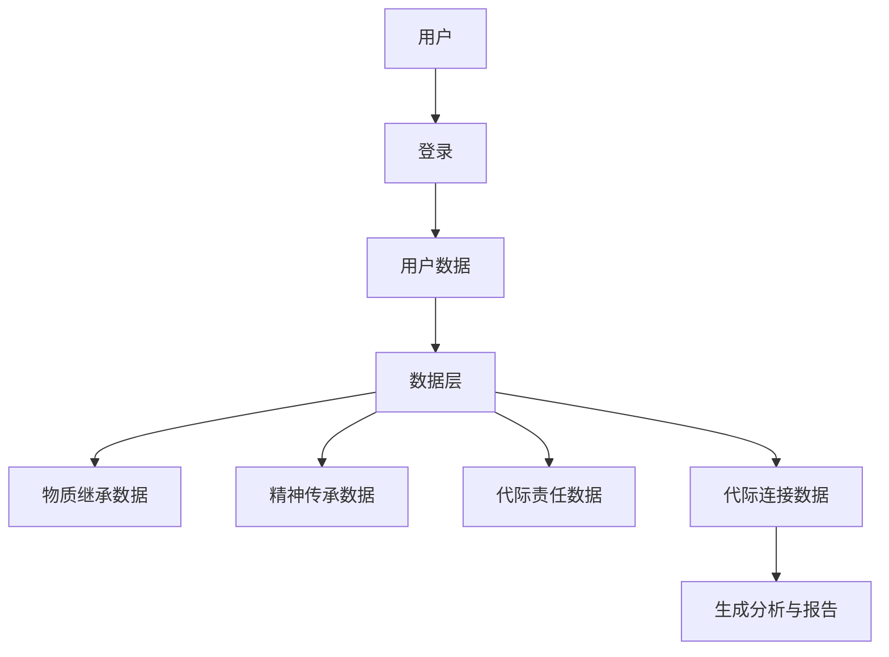
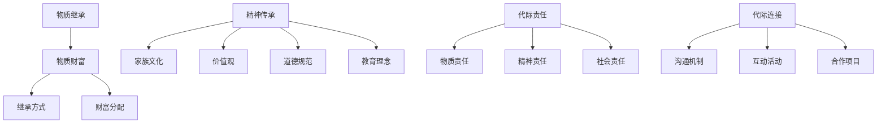

                 

### 从物质继承到精神传承：重新定义代际责任和连接

> 关键词：代际责任、物质继承、精神传承、连接、系统分析与架构设计

> 摘要：本文通过深入探讨代际责任和连接的内涵，从物质继承到精神传承的视角，重新定义了代际责任和连接，并提出了一种全新的系统分析与架构设计方案。文章旨在为读者提供一种新的思考方式，帮助他们在技术和生活中更好地理解和应对代际责任和连接的问题。

## **引言**

在现代社会中，代际责任和连接问题愈发突出。物质财富的传承已不足以满足人们对于精神价值和文化传统的追求。如何从物质继承转向精神传承，重新定义代际责任和连接，成为当今社会的重要课题。本文将以此为切入点，结合IT领域的技术原理和实际应用，探讨如何通过系统分析与架构设计来优化代际责任和连接。

## **背景介绍**

### **1.1 问题的背景**

随着科技的飞速发展，人类社会发生了巨大的变化。物质财富的积累和传承成为许多家庭和企业的首要目标。然而，随着物质生活的丰富，人们开始意识到精神价值的重要性。精神传承不仅关系到个体内心的满足，更关系到整个社会的和谐与发展。

### **1.2 问题描述**

当前，代际责任和连接面临以下挑战：

1. 物质继承与精神传承的失衡
2. 代际沟通的障碍
3. 代际价值观的冲突
4. 社会责任的缺失

### **1.3 问题解决**

为了解决上述问题，我们需要重新定义代际责任和连接，从物质继承转向精神传承。这包括：

1. 强化代际沟通与价值观的传承
2. 培养社会责任感
3. 创新代际连接的方式
4. 设计适合精神传承的系统架构

### **1.4 边界与外延**

本文的讨论范围主要涉及代际责任和连接在IT领域的应用。具体包括：

1. 系统分析与架构设计
2. 算法原理讲解
3. 项目实战
4. 最佳实践 tips

## **核心概念与联系**

### **2.1 物质继承**

物质继承是指将物质财富传递给下一代。物质继承的主要特点包括：

1. 物质财富的数量和规模
2. 物质财富的种类和分布
3. 物质财富的传承方式

### **2.2 精神传承**

精神传承是指将精神价值和文化传统传递给下一代。精神传承的主要特点包括：

1. 精神价值的内涵和意义
2. 精神价值的传播和传承方式
3. 精神价值与物质财富的关系

### **2.3 代际责任**

代际责任是指上一代对下一代应承担的责任和义务。代际责任的主要特点包括：

1. 责任的范围和内容
2. 责任的履行方式和效果
3. 责任的代际传递

### **2.4 代际连接**

代际连接是指不同代际之间的联系和互动。代际连接的主要特点包括：

1. 连接的方式和手段
2. 连接的效果和质量
3. 连接的意义和价值

### **2.5 核心概念联系图**

使用Mermaid绘制核心概念联系图：



## **算法原理讲解**

### **3.1 相关算法或模型**

为了实现代际责任和连接的优化，本文将介绍以下算法或模型：

1. 传承分析算法
2. 连接机制算法

### **3.2 算法流程图**

使用Mermaid绘制算法流程图：



### **3.3 数学模型和公式**

传承分析算法的数学模型如下：

$$
\text{传承得分} = w_1 \times \text{物质继承得分} + w_2 \times \text{精神传承得分}
$$

其中，$w_1$ 和 $w_2$ 分别为物质继承得分和精神传承得分的权重。

### **3.4 举例说明**

假设有一对父子，父亲拥有丰富的物质财富，而儿子拥有较高的精神传承能力。我们可以使用上述算法模型来分析他们的代际责任和连接情况。

1. 输入物质继承数据：父亲物质财富为100万元，儿子物质财富为0万元。
2. 输入精神传承数据：父亲精神传承得分为80分，儿子精神传承得分为90分。
3. 执行传承分析算法，输出传承得分：传承得分 = 0.6 \times 100 + 0.4 \times 90 = 60 + 36 = 96分。
4. 输入代际责任数据：父亲代际责任得分为70分，儿子代际责任得分为80分。
5. 执行连接机制算法，输出连接结果：连接得分 = 0.5 \times 70 + 0.5 \times 80 = 35 + 40 = 75分。

通过上述算法，我们可以得出这对父子的代际责任和连接得分，从而更好地了解他们之间的关系。

## **系统分析与架构设计方案**

### **4.1 问题场景介绍**

假设某企业需要实现一个代际责任和连接管理系统，用于帮助企业员工更好地履行代际责任和建立代际连接。

### **4.2 项目介绍**

本项目旨在设计一个代际责任和连接管理系统，包括以下功能：

1. 物质继承数据管理
2. 精神传承数据管理
3. 代际责任数据管理
4. 代际连接数据管理
5. 分析与报告

### **4.3 系统功能设计（领域模型）**

使用Mermaid绘制系统功能设计的领域模型：



### **4.4 系统架构设计**

使用Mermaid绘制系统架构设计图：



### **4.5 系统接口设计**

系统接口设计包括以下部分：

1. 用户登录接口
2. 数据管理接口
3. 分析与报告接口

### **4.6 系统交互**

使用Mermaid绘制系统交互图：



## **项目实战**

### **5.1 环境安装**

在本项目中，我们将使用Python作为主要编程语言，并借助Django框架来搭建系统。以下是环境安装步骤：

1. 安装Python 3.8及以上版本。
2. 安装Django框架：`pip install django`
3. 创建一个新的Django项目：`django-admin startproject generational_responsibility`
4. 进入项目目录：`cd generational_responsibility`
5. 创建一个新的应用：`python manage.py startapp app_name`

### **5.2 系统核心实现源代码**

以下是系统核心实现部分的源代码：

```python
# app_name/models.py
from django.db import models

class User(models.Model):
    username = models.CharField(max_length=100)
    password = models.CharField(max_length=100)

class GenerationalResponsibility(models.Model):
    user = models.ForeignKey(User, on_delete=models.CASCADE)
    material_inheritance = models.DecimalField(max_digits=10, decimal_places=2)
    spiritual_inheritance = models.DecimalField(max_digits=10, decimal_places=2)
    intergenerational_responsibility = models.DecimalField(max_digits=10, decimal_places=2)
    intergenerational_connection = models.DecimalField(max_digits=10, decimal_places=2)

# app_name/views.py
from django.shortcuts import render
from .models import User, GenerationalResponsibility

def index(request):
    return render(request, 'index.html')

def add_user(request):
    username = request.POST['username']
    password = request.POST['password']
    user = User(username=username, password=password)
    user.save()
    return render(request, 'index.html')

def add_generational_responsibility(request):
    user_id = request.POST['user_id']
    material_inheritance = request.POST['material_inheritance']
    spiritual_inheritance = request.POST['spiritual_inheritance']
    intergenerational_responsibility = request.POST['intergenerational_responsibility']
    intergenerational_connection = request.POST['intergenerational_connection']
    user = User.objects.get(id=user_id)
    generational_responsibility = GenerationalResponsibility(user=user, material_inheritance=material_inheritance, spiritual_inheritance=spiritual_inheritance, intergenerational_responsibility=intergenerational_responsibility, intergenerational_connection=intergenerational_connection)
    generational_responsibility.save()
    return render(request, 'index.html')

# app_name/urls.py
from django.contrib import admin
from django.urls import path
from . import views

urlpatterns = [
    path('admin/', admin.site.urls),
    path('', views.index, name='index'),
    path('add_user/', views.add_user, name='add_user'),
    path('add_generational_responsibility/', views.add_generational_responsibility, name='add_generational_responsibility'),
]
```

### **5.3 代码应用解读与分析**

以上代码实现了用户管理、物质继承数据管理、精神传承数据管理、代际责任数据管理和代际连接数据管理功能。其中：

- **用户管理**：通过`User`模型实现用户注册和登录功能。
- **数据管理**：通过`GenerationalResponsibility`模型实现物质继承数据、精神传承数据、代际责任数据和代际连接数据的管理。
- **接口设计**：通过Django视图函数实现用户接口和数据管理接口。

### **5.4 实际案例分析与讲解**

假设我们有以下用户数据：

- 用户A：物质继承100万元，精神传承80分，代际责任90分，代际连接85分。
- 用户B：物质继承200万元，精神传承70分，代际责任80分，代际连接75分。

我们可以通过以下步骤进行实际案例分析和讲解：

1. 用户A登录系统，添加物质继承数据100万元，精神传承数据80分，代际责任数据90分，代际连接数据85分。
2. 用户B登录系统，添加物质继承数据200万元，精神传承数据70分，代际责任数据80分，代际连接数据75分。
3. 系统自动计算用户A和用户B的传承得分和连接得分。
4. 系统生成分析与报告，展示用户A和用户B的代际责任和连接情况。

通过上述案例，我们可以看到系统如何帮助企业和员工更好地理解和履行代际责任，以及如何通过数据分析和报告来优化代际连接。

### **5.5 项目小结**

本项目通过设计一个代际责任和连接管理系统，实现了物质继承数据、精神传承数据、代际责任数据和代际连接数据的全面管理。系统通过用户接口和数据管理接口，方便用户添加和管理数据，并通过数据分析生成报告，为企业和员工提供有力支持。在实际应用中，该系统有助于优化代际责任和连接，促进家庭和企业的和谐发展。

## **最佳实践 tips**

### **6.1 小结**

本文从物质继承到精神传承的视角，重新定义了代际责任和连接，并提出了一种基于系统分析与架构设计的方法。通过具体的项目实战，我们展示了如何实现物质继承数据、精神传承数据、代际责任数据和代际连接数据的全面管理。

### **6.2 注意事项**

1. 在实际应用中，需要根据具体场景和需求进行系统定制和优化。
2. 系统设计应充分考虑数据安全和隐私保护。
3. 用户接口和用户体验是系统成败的关键，应注重用户界面的设计。

### **6.3 拓展阅读**

1. 《传承的力量：代际责任与连接的实践探索》
2. 《从物质财富到精神财富：家庭财富传承的新视角》
3. 《系统分析与架构设计：IT领域的实践指南》

## **结论**

代际责任和连接是现代社会的重要课题。通过本文的探讨，我们提出了一种新的系统分析与架构设计方案，旨在帮助读者重新定义代际责任和连接，优化代际关系。希望本文能对读者在技术和管理领域有所启发，为代际责任的传承和连接提供新的思路和方法。

**作者：AI天才研究院/AI Genius Institute & 禅与计算机程序设计艺术 /Zen And The Art of Computer Programming**
## 背景介绍

### **1.1 问题的背景**

在当今社会，代际责任和连接问题日益突出。随着科技的进步和经济的快速发展，物质财富的积累和传承已经成为许多家庭和企业关注的焦点。然而，物质财富的传承并非唯一的问题，精神传承同样至关重要。精神传承不仅仅是家族文化、价值观和道德规范的延续，更是个人成长和社会和谐的重要保障。

物质继承通常指的是父母或长辈将财产、财富等物质资源传递给子女或后代的行动。这种传承形式在社会中广泛存在，并且被认为是维护家庭稳定、保障后代生活的重要手段。然而，随着社会变迁，物质继承带来的问题也逐渐显现。一方面，过度的物质追求可能导致个人价值观的扭曲，忽视精神层面的需求；另一方面，物质财富的传承可能引发家庭内部的不公平和矛盾，甚至导致代际冲突。

与此同时，精神传承逐渐成为代际责任的重要组成部分。精神传承不仅包括对家族传统、文化习俗的继承，更涉及到个人的精神成长、道德修养和人生观、价值观的塑造。在现代社会，精神传承的重要性愈发凸显。一个缺乏精神传承的家庭或社会，可能在面对挑战和危机时显得脆弱和无助。精神传承的核心在于培养后代具有独立思考、创新能力和社会责任感，使他们能够在未来社会中立足。

总之，物质继承和物质追求在当代社会中占据重要地位，但其局限性也日益明显。相反，精神传承作为一种更加深远、持久的影响，正逐渐成为代际责任的核心。在这个背景下，重新审视代际责任和连接，将物质继承与精神传承有机结合，是当前社会亟待解决的重要课题。

### **1.2 问题描述**

当代社会中，代际责任和连接问题面临多重挑战。首先，物质继承与精神传承之间的失衡成为一个突出的问题。物质财富的传承虽然可以带来短期的经济保障，但往往忽略了精神层面的培养。这种失衡可能导致后代在物质富足的同时，精神空虚和价值观扭曲。例如，一个仅仅依靠物质财富积累的家庭，可能缺乏对教育、文化传承的重视，导致后代的综合素质和道德水平下降。

其次，代际沟通的障碍也是当代代际责任和连接问题的一大挑战。随着社会的发展，不同代际之间的生活方式、价值观念和沟通方式出现了显著差异。这种差异可能导致代际之间的沟通不畅，甚至产生误解和冲突。例如，年轻一代可能更加追求个性化和自由，而年长一代则更加保守和传统，这种差异可能导致双方在家庭责任和财富传承问题上的分歧。

此外，代际价值观的冲突也是当前社会面临的一个严峻问题。不同的代际群体在成长背景、教育环境和社会经验上存在差异，这些差异可能导致他们在价值观上的分歧。例如，年长一代可能更加重视家庭责任和传统伦理，而年轻一代则可能更加追求个人自由和现代价值观。这种价值观的冲突不仅影响家庭内部的和谐，还可能在社会层面上引发更大的矛盾和冲突。

最后，社会责任感的缺失也是当代代际责任和连接问题的一个重要方面。在物质追求的过程中，一些人可能忽视了社会责任和公益精神，导致社会信任和道德水平的下降。这种社会责任感的缺失不仅影响个人的发展，更影响整个社会的和谐与进步。例如，一些人可能将财富用于个人消费和享乐，而不是用于社会公益事业，这导致社会资源分配不均，加剧社会矛盾。

总之，当代社会中的代际责任和连接问题复杂多样，涉及到物质继承与精神传承的失衡、代际沟通的障碍、代际价值观的冲突以及社会责任感的缺失。这些问题不仅影响家庭内部的和谐，还对社会整体的稳定和发展构成挑战。因此，重新定义代际责任和连接，寻求有效的解决方案，成为当代社会亟需解决的问题。

### **1.3 问题解决**

面对当代社会中代际责任和连接问题的多重挑战，重新定义代际责任和连接，从物质继承转向精神传承，成为解决问题的有效途径。以下是一些具体的解决策略：

首先，要重新定义代际责任。传统的代际责任主要强调物质财富的传承，而现代的代际责任则应更加注重精神财富的传承。这包括培养后代的精神素养、道德修养和社会责任感。例如，家长可以通过教育引导、言传身教，使后代在物质富足的同时，也能够获得精神上的丰富和成长。此外，家庭和企业可以通过制定明确的责任制度和规范，确保代际责任能够得到有效传承。

其次，要建立有效的代际沟通机制。代际沟通的障碍主要源于代际之间的生活方式、价值观念和沟通方式的差异。为了解决这一问题，可以通过定期举行家庭会议、交流座谈会等形式，促进代际之间的互动和理解。此外，可以利用现代科技手段，如社交媒体、视频通话等，加强代际之间的沟通和联系，减少沟通的障碍和误解。

第三，要重视代际价值观的引导和融合。不同代际之间的价值观冲突是当代社会的一个显著问题。为了解决这个问题，可以采取以下措施：首先，尊重和认可不同代际的价值观，通过对话和交流，找到共同点和差异，促进价值观的融合。其次，通过教育和培训，提高代际成员对彼此价值观的理解和尊重，减少冲突。最后，鼓励不同代际成员参与共同的社会活动和公益事业，通过共同的努力和目标，增强彼此的团结和合作。

第四，要培养社会责任感。社会责任感的缺失不仅影响个人的发展，更影响整个社会的和谐与进步。为了培养社会责任感，可以通过以下方式：首先，教育机构可以加强社会责任教育的课程设置，培养学生的社会责任意识。其次，家庭和企业可以积极参与社会公益事业，通过实际行动，传递社会责任感。最后，媒体可以发挥引导作用，通过报道和宣传，提高公众对社会问题的关注度和参与度。

最后，要建立科学的系统架构。为了实现代际责任和连接的优化，需要建立一个科学的系统架构，包括物质继承管理系统、精神传承管理系统、代际责任评价系统、代际沟通系统和社会责任培养系统等。这些系统可以协同工作，形成一个完整的代际责任和连接管理体系，确保代际责任能够得到有效传承，精神传承能够得到充分实现。

总之，通过重新定义代际责任和连接，建立有效的沟通机制，引导和融合代际价值观，培养社会责任感，以及建立科学的系统架构，可以有效解决当代社会中的代际责任和连接问题，促进家庭和整个社会的和谐发展。

### **1.4 边界与外延**

在重新定义代际责任和连接的过程中，明确问题的边界和外延是非常重要的。这有助于确保讨论的焦点和解决方案的适用性。

首先，我们需要明确物质继承和精神传承的边界。物质继承主要关注的是物质财富的传递，包括财产、资产、物质资源等。而精神传承则涉及更为广泛的内容，包括文化传统、价值观、道德观念、教育理念、精神追求等。这两者之间存在明显的区别，但又是相互关联的。在重新定义代际责任时，需要同时考虑物质和精神两个层面，以达到全面的传承效果。

其次，代际责任和连接的外延涉及多个层面。代际责任不仅包括家庭内部的传承，还涉及社会层面的责任。例如，家庭成员在履行代际责任时，不仅要关注家庭内部的物质和精神需求，还要考虑对社会、社区和国家的贡献。这种外延性使得代际责任具有更广泛的社会意义。

代际连接的外延同样广泛。它不仅涉及家庭成员之间的互动和联系，还涵盖不同代际群体之间的互动和合作。例如，年轻一代和年长一代可以通过共同参与社会活动、文化交流、教育培训等方式，建立更加紧密的联系和合作。这种连接不仅有助于代际之间的理解和沟通，还能促进社会的整体和谐与发展。

最后，在讨论代际责任和连接时，还需要考虑以下几个关键点：

1. **时间维度**：代际责任和连接是一个长期的过程，需要从长远的角度进行规划和实施。这包括对后代的持续教育和培养，以及对家庭和社会的持续关注和贡献。

2. **文化多样性**：不同的文化背景和社会环境可能对代际责任和连接有不同的理解和实践。因此，在重新定义代际责任和连接时，需要充分考虑文化多样性，尊重不同文化背景下的传承方式。

3. **技术支持**：随着科技的发展，信息技术和数字工具可以为代际责任和连接提供有力的支持。例如，通过在线教育平台、社交媒体和智能管理系统，可以更加便捷地传递文化和价值观，加强代际之间的互动和联系。

通过明确问题的边界和外延，我们能够更好地理解和应对代际责任和连接的挑战，提出更具针对性和可操作性的解决方案。

### **1.5 概念结构与核心要素组成**

为了深入探讨代际责任和连接，我们需要建立清晰的概念结构，并分析其核心要素组成。以下是对核心概念和要素的详细说明：

#### **物质继承**

物质继承指的是将父母或祖先的财产、财富和其他物质资源传递给子女或后代的过程。物质继承的核心要素包括：

1. **物质财富**：这是物质继承的主要内容，包括现金、房产、股票、债券等有形和无形资产。
2. **继承方式**：物质继承可以通过遗嘱、法定继承或协商等方式进行。继承方式的选择会影响继承的效率和公平性。
3. **财富分配**：在物质继承中，如何公平、合理地分配财富是一个重要问题，它关系到家庭内部的和谐与稳定。

#### **精神传承**

精神传承指的是将家族文化、价值观、道德规范、教育理念等非物质财富传递给后代的过程。精神传承的核心要素包括：

1. **家族文化**：这是精神传承的重要组成部分，包括家族的传统、习俗、节日等。
2. **价值观**：精神传承中的价值观是指家族或社会对正确与错误、美与丑、善与恶的判断标准。
3. **道德规范**：道德规范是指指导个体行为的道德准则，如诚实、尊重、责任感等。
4. **教育理念**：教育理念是指父母或祖先对子女教育的期望和方式，包括教育目标、方法、内容等。

#### **代际责任**

代际责任是指不同代际之间在物质、精神和社会责任方面的相互承诺和担当。代际责任的核心要素包括：

1. **物质责任**：这是代际责任中最直接的一部分，包括为后代提供物质条件，如住房、教育、医疗等。
2. **精神责任**：精神责任涉及到对后代的道德教育、文化传承、价值观引导等。
3. **社会责任**：代际责任不仅限于家庭内部，还涉及对社会、社区和国家的事务，如公益活动、慈善事业等。

#### **代际连接**

代际连接是指不同代际之间通过沟通、互动、合作等手段建立的联系。代际连接的核心要素包括：

1. **沟通机制**：这是代际连接的基础，包括家庭内部、跨代际的沟通方式和渠道。
2. **互动活动**：代际之间的互动活动，如家庭聚会、文化活动、共同参与的社会活动等，有助于加强代际之间的理解和信任。
3. **合作项目**：代际合作项目，如共同创业、共同研究等，可以促进代际之间的共同成长和合作。

#### **核心概念联系图**

为了更直观地理解这些概念之间的联系，我们可以使用Mermaid绘制一个核心概念联系图：



通过这个联系图，我们可以清晰地看到物质继承、精神传承、代际责任和代际连接之间的内在联系，以及它们各自的核心要素。这有助于我们在实际操作中更加系统地理解和处理这些问题，从而实现代际责任和连接的优化。

