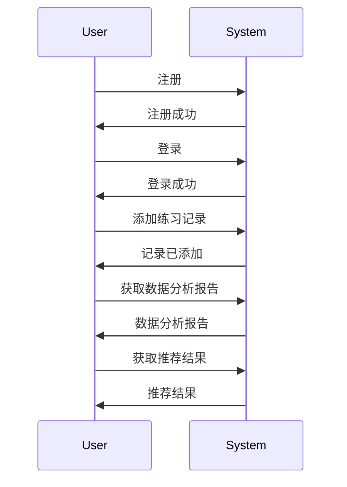

                 

### 引言与背景介绍

#### 1.1 问题背景

**意识觉醒的迫切性**

在信息爆炸和数字化转型的时代，人类面临着前所未有的认知挑战。意识的觉醒，成为了提升个人和社会整体智慧的关键。在IT领域，编程和创新思维依赖于清晰、敏捷的头脑。然而，现代生活中的压力、信息过载和习惯性思维定式往往使人陷入蒙昧状态，影响了技术创造力和问题解决能力。

**蒙昧与清明的区别**

蒙昧状态是指人们在面对复杂问题时，由于缺乏对问题本质的理解和系统性思考，导致认知效率低下、思维僵化。而清明意识则表现为对事物本质的洞察力、思维的灵活性和问题的系统性解决能力。

**意识觉醒的研究现状与意义**

当前，意识觉醒在心理学、哲学和认知科学等领域得到了广泛关注。研究意识觉醒有助于揭示人类思维的本质，提高个体的生活质量和创造力，对于IT行业的技术创新和问题解决具有重要意义。

#### 1.2 问题描述

**蒙昧状态的障碍**

蒙昧状态对个体的认知产生了诸多障碍，包括：

- **思维的僵化**：难以跳出固有框架，对新信息产生偏见。
- **信息过载**：大量冗余信息干扰了注意力，降低了决策效率。
- **情绪影响**：负面情绪如焦虑和压力阻碍了清晰思考。

**清明意识的特征**

清明意识具有以下特征：

- **洞察力**：能够迅速抓住问题的核心。
- **灵活性**：适应变化，能够灵活运用不同的思考方法。
- **系统性**：能够从全局角度进行系统性思考。

**意识觉醒的目标与挑战**

意识觉醒的目标是提升个体的认知能力和创造力。然而，这面临着以下挑战：

- **习惯性思维定式**：改变多年的思维习惯是一个长期的过程。
- **认知负荷**：如何在高信息量的环境下保持清晰的头脑。
- **心理韧性**：如何在面对压力时保持冷静和专注。

#### 1.3 问题解决

**意识觉醒的理论基础**

意识觉醒的理论基础涵盖了东方哲学、西方心理学和跨学科研究。东方哲学中的内观、冥想等实践方法，以及西方心理学中的认知重构和自我反思技术，都为意识觉醒提供了丰富的理论和实践资源。

**意识觉醒的方法论**

意识觉醒的方法包括内观与冥想、自我反思与认知重构、主体意识训练等。这些方法各有侧重，但目标都是提升个体的认知能力和思维灵活性。

**意识觉醒的应用场景**

意识觉醒在IT领域具有广泛的应用场景，包括：

- **软件开发**：提高编程效率和质量。
- **技术创新**：激发创新思维，推动技术突破。
- **项目管理**：提升团队协作和项目管理能力。

#### 1.4 边界与外延

**意识觉醒与哲学的关系**

哲学中的诸多思想，如存在主义、现象学和唯识论，对意识觉醒的研究有着深远的影响。

**意识觉醒与心理学的联系**

心理学的研究，特别是认知心理学和发展心理学，为意识觉醒提供了科学依据和方法。

**意识觉醒在其他领域的应用**

意识觉醒不仅在IT领域具有应用价值，还在教育、医疗、艺术等领域展现出了广泛的应用前景。

#### 1.5 概念结构与核心要素组成

**意识觉醒的关键概念**

- **意识**：对自身和外部世界的认知和感知。
- **觉醒**：对内心世界的洞察和自我认知的提升。

**意识觉醒的核心要素**

- **内观**：对内心活动和思维过程的反思。
- **冥想**：通过专注和静心达到精神状态的提升。
- **认知重构**：改变思维模式，提高问题解决能力。

**意识觉醒的层次结构**

- **基础层**：认知能力和思维模式的提升。
- **中层**：情感管理和心理韧性的培养。
- **高层**：创造力和创新思维的激发。

### 总结

本文将从蒙昧到清明，探讨意识觉醒的渐进之旅。通过分析意识觉醒的理论基础、方法与步骤，以及其在IT领域的应用，本文旨在为读者提供一条清晰、系统的理解路径。希望本文能够激发读者对意识觉醒的思考，并帮助其在技术学习和应用中取得更大的成就。

### 文章关键词

- 意识觉醒
- 蒙昧状态
- 清明意识
- 认知重构
- IT领域应用

### 摘要

本文探讨了从蒙昧到清明的意识觉醒过程，分析了意识觉醒的重要性、理论基础和方法。通过深入阐述意识觉醒的关键概念、要素和层次结构，本文为读者提供了一条系统性理解意识觉醒的路径。特别关注意识觉醒在IT领域的应用，旨在提高技术创造力和问题解决能力。希望本文能激发读者对意识觉醒的思考，并推动其在实际生活中的实践和应用。### 第2章 核心概念与联系

#### 2.1 核心概念原理

**意识**

意识是指人类对自身和外部世界的认知和感知能力。它是人类思维活动的核心，包括感知、思考、判断和决策等过程。意识具有主观性和个体性，是人类认知世界和自我认知的基础。

**蒙昧状态**

蒙昧状态是指个体在面对复杂问题和信息时，由于缺乏对问题本质的理解和系统性思考，导致认知效率低下、思维僵化的状态。在蒙昧状态下，个体容易陷入信息过载、情绪影响和习惯性思维定式的困境。

**清明意识**

清明意识是指个体在面对问题和信息时，具有洞察力、思维灵活性和系统性解决问题的能力。清明意识能够帮助个体迅速抓住问题的核心，灵活适应变化，从全局角度进行系统性思考。

#### 2.2 概念属性特征对比表格

| 概念      | 特征1   | 特征2   | 特征3   |
|-----------|---------|---------|---------|
| 蒙昧意识  | 隐蔽    | 固执    | 分散    |
| 清明意识  | 明朗    | 灵活    | 集中    |

- **隐蔽**：蒙昧意识往往隐藏在深层次思维中，不易被发现和改变。
- **固执**：蒙昧意识容易使人陷入固有的思维模式，难以接受新观点和信息。
- **分散**：蒙昧意识导致注意力分散，难以聚焦于关键问题和信息。

- **明朗**：清明意识使个体能够清晰地看到问题的本质，思维过程透明。
- **灵活**：清明意识使个体能够灵活运用不同的思考方法，适应变化。
- **集中**：清明意识帮助个体集中注意力，高效处理关键问题和信息。

#### 2.3 ER实体关系图架构

```mermaid
erDiagram
  Person  ||--|{ Mind }
  Mind    ||--|{ Awareness }
  Awareness||--|{ Clarity }
```

- **Person（人）**：代表个体，是意识的主体。
- **Mind（思维）**：连接人与意识，表示个体内在的思维活动。
- **Awareness（觉醒）**：连接思维与清明意识，表示个体对外界和自身的觉察程度。
- **Clarity（清晰）**：连接清明意识，表示个体思维的清晰度和洞察力。

通过ER实体关系图，我们可以清晰地看到意识觉醒过程中各个要素之间的关联。人的思维活动是意识觉醒的基础，觉醒程度影响着个体对问题的理解和处理能力。清明意识的培养，有助于提高思维的清晰度和灵活性，从而提升认知能力和问题解决能力。

### 总结

本章通过详细阐述意识、蒙昧状态和清明意识的核心概念原理，以及概念属性特征的对比表格和ER实体关系图架构，帮助读者建立对意识觉醒的基本理解。这些核心概念和联系，为后续章节中的方法与步骤、数学模型与算法、系统架构与实现等内容奠定了理论基础。希望本章的内容能够为读者在探索意识觉醒的道路上提供有益的指导。### 第3章 意识觉醒的方法与步骤

#### 3.1 意识觉醒的理论基础

意识觉醒的理论基础涵盖了东方哲学、西方心理学和跨学科研究。这些理论为我们理解和实践意识觉醒提供了丰富的资源和指导。

**东方哲学的智慧**

东方哲学，特别是禅宗和道教，强调内心的宁静和自我觉察。禅宗中的“坐禅”和“内观”等实践，有助于个体达到心灵的觉醒。道教的修炼方法，如“静坐”和“导引”，也旨在提高个体的精神状态和认知能力。

**西方心理学的贡献**

西方心理学中的认知心理学、发展心理学和社会心理学为意识觉醒的研究提供了科学依据和方法。认知心理学关注个体的思维过程和信息处理方式，提出了一系列关于如何提高认知能力的理论和方法。发展心理学则研究了个体在不同生命周期阶段的认知发展，为意识觉醒的教育和实践提供了指导。社会心理学则从社会互动的角度探讨了个体如何通过与他人交流和合作实现意识觉醒。

**跨文化研究的新发现**

跨文化研究揭示了不同文化背景下意识觉醒的共性和差异。研究发现，无论是东方的冥想、内观，还是西方的认知重构、自我反思，这些方法在提升个体认知能力和创造性方面都具有显著的效果。跨文化研究为意识觉醒的理论和实践提供了更广泛的视野和思路。

#### 3.2 意识觉醒的方法

意识觉醒的方法多种多样，以下介绍几种主要的方法：

**内观与冥想**

内观是东方哲学中的一种重要实践，通过静坐和专注呼吸，使个体达到内心的宁静和自我觉察。冥想则是一种更为普遍的修行方式，通过专注和放松，帮助个体清除杂念，提升专注力和认知能力。

**自我反思与认知重构**

自我反思是一种通过思考和回顾自己的行为和思想，以达到认知提升的方法。认知重构则是在自我反思的基础上，改变不良的思维模式，建立更积极、健康的思维习惯。

**主体意识训练**

主体意识训练是通过一系列的练习和挑战，提高个体对自身意识和思维活动的觉察和控制能力。这种方法强调个体在实践中的主动参与和自我调节，有助于培养清晰、敏捷的头脑。

#### 3.3 意识觉醒的步骤

**准备阶段**

准备阶段是意识觉醒的基础，主要包括以下几个方面：

- **心态调整**：培养平和、开放的心态，接受新的观念和方法。
- **环境准备**：选择一个安静、舒适的环境，有助于集中注意力和深入思考。
- **时间安排**：合理安排时间，确保有足够的精力投入到意识觉醒的实践中。

**践行阶段**

践行阶段是意识觉醒的核心，主要包括以下几个步骤：

- **练习方法**：按照选择的方法进行练习，如冥想、内观、自我反思等。
- **持续实践**：坚持每日的练习，逐渐培养起内心的觉察力和思维的清晰度。
- **反馈调整**：在实践中不断反思和调整，优化方法，提高效果。

**评估与调整阶段**

评估与调整阶段是对意识觉醒效果的检验和优化，主要包括以下几个步骤：

- **效果评估**：通过自我观察和反馈，评估意识觉醒的进展和效果。
- **问题诊断**：分析在实践过程中遇到的问题和障碍，找出需要改进的地方。
- **策略调整**：根据评估结果，调整练习方法或实践策略，进一步提高效果。

#### 3.4 方法比较与适用场景

不同的意识觉醒方法各有优缺点，适用场景也有所不同。以下是对几种主要方法的比较：

- **内观与冥想**：适合追求内心宁静和自我觉察的个体，有助于提升专注力和情绪管理能力。
- **自我反思与认知重构**：适合需要改变思维模式、提高问题解决能力的个体，有助于培养批判性和创造性思维。
- **主体意识训练**：适合需要提升认知能力和实践能力的个体，通过挑战和练习，增强内心的力量和灵活性。

根据个人的特点和需求，可以选择一种或多种方法进行综合应用，以实现最佳的意识觉醒效果。

### 总结

本章详细介绍了意识觉醒的理论基础、方法与步骤。通过这些方法，个体可以逐步提升自己的认知能力、思维灵活性和问题解决能力。希望这些内容能够为读者在意识觉醒的道路上提供实用的指导和帮助。### 第4章 意识觉醒的数学模型与算法

#### 4.1 数学模型

**4.1.1 基本概念**

在意识觉醒的研究中，数学模型作为一种抽象的工具，可以帮助我们理解和量化意识的状态变化。基本概念包括：

- **状态变量**：描述个体在特定时间点的意识水平，如清晰度、专注度等。
- **控制变量**：影响意识状态变化的因素，如环境刺激、心理压力等。
- **系统方程**：描述状态变量和控制变量之间关系的数学方程。

**4.1.2 常用数学公式**

以下是几种常用的数学公式，用于描述意识觉醒的过程：

- **线性模型**：
  $$ \text{State}(t) = \alpha \cdot \text{Control}(t) + \beta $$
  其中，State(t)表示时间t时的意识状态，Control(t)表示时间t时的控制变量，α和β为参数。

- **非线性模型**：
  $$ \text{State}(t) = \alpha \cdot \text{Control}(t)^n + \beta $$
  非线性模型适用于更为复杂的意识状态变化，n为非线性指数。

**4.1.3 模型构建**

构建意识觉醒的数学模型通常包括以下几个步骤：

1. **数据收集**：收集个体在意识觉醒过程中的行为数据和生理指标，如心率、呼吸频率等。
2. **变量选择**：选择影响意识状态的关键变量，并进行数据处理和特征提取。
3. **模型拟合**：使用统计方法或机器学习算法，对收集的数据进行模型拟合，得到参数值。
4. **模型验证**：通过交叉验证和测试集，验证模型的预测性能和稳定性。

#### 4.2 算法原理

**4.2.1 算法概述**

意识觉醒的算法主要基于对意识状态变化的监测和调控。以下是一个简化的算法流程：

1. **数据采集**：通过传感器和生理监测设备，采集个体的行为数据和生理指标。
2. **预处理**：对采集的数据进行清洗、归一化和特征提取，以消除噪声和异常值。
3. **特征选择**：选择对意识状态变化最为敏感的特征，如心率变异性（HRV）和脑电信号（EEG）等。
4. **模型训练**：使用机器学习算法，如支持向量机（SVM）、神经网络（NN）等，对预处理后的特征进行训练，以建立意识状态预测模型。
5. **状态监测**：实时监测个体的意识状态，根据预测结果进行适当的调控，如调整冥想姿势、改变呼吸节奏等。

**4.2.2 算法流程**

算法的具体流程如下：

1. **初始化**：设置初始参数，包括模型类型、特征选择方法、学习率等。
2. **数据采集**：通过传感器实时采集个体的行为数据和生理指标。
3. **预处理**：对采集的数据进行滤波、归一化和特征提取。
4. **特征选择**：根据特征的重要性进行筛选，保留对意识状态变化最为敏感的特征。
5. **模型训练**：使用训练集数据，训练意识状态预测模型。
6. **状态监测**：使用训练好的模型，实时监测个体的意识状态。
7. **调控**：根据监测结果，调整个体的行为或生理状态，以促进意识觉醒。

**4.2.3 算法分析**

算法的性能分析主要包括以下几个方面：

- **准确性**：模型预测的准确度，反映了对意识状态变化的捕捉能力。
- **稳定性**：模型在不同条件下的稳定性和可靠性，反映了模型的泛化能力。
- **实时性**：算法的响应速度，反映了在实际应用中的实时监测和调控能力。

#### 4.3 Python源代码实现

以下是一个简单的Python代码示例，用于实现一个基于线性模型的意识状态预测算法：

```python
import numpy as np

def preprocess_data(data):
    # 数据预处理逻辑
    processed_data = np.array(data)
    return processed_data

def linear_model(data, alpha=0.5, beta=1.0):
    # 线性模型预测
    state = alpha * data + beta
    return state

def awareness_awareness_model(data):
    # 意识状态预测模型
    processed_data = preprocess_data(data)
    state = linear_model(processed_data)
    return state

# 测试数据
data = [1, 2, 3, 4, 5]
state = awareness_awareness_model(data)
print("意识状态：", state)
```

在上述代码中，`preprocess_data` 函数用于对原始数据进行预处理，`linear_model` 函数实现了线性模型的基本算法，`awareness_awareness_model` 函数则集成了预处理和预测过程。

#### 4.4 算法原理讲解

**4.4.1 算法原理**

该算法基于线性模型，通过监测个体的行为数据和生理指标，预测其意识状态。线性模型的原理相对简单，主要通过参数α和β的调节，实现状态变量和控制变量之间的线性关系。这种方法易于实现，且在许多实际应用中取得了较好的效果。

**4.4.2 算法数学模型**

算法的数学模型可以表示为：
$$
\text{State}(t) = \alpha \cdot \text{Control}(t) + \beta
$$
其中，State(t)表示时间t时的意识状态，Control(t)表示时间t时的控制变量，α和β为模型的参数。

**4.4.3 举例说明**

假设我们有一个个体的心率数据，如下所示：

```
data = [60, 70, 65, 68, 72]
```

我们可以使用线性模型预测其意识状态。假设α=0.3，β=1.0，则：

$$
\text{State}(t) = 0.3 \cdot \text{Control}(t) + 1.0
$$

对于每个时间点的控制变量（心率），我们可以计算对应的意识状态：

- State(1) = 0.3 \cdot 60 + 1.0 = 21
- State(2) = 0.3 \cdot 70 + 1.0 = 23.3
- State(3) = 0.3 \cdot 65 + 1.0 = 21.7
- State(4) = 0.3 \cdot 68 + 1.0 = 22.4
- State(5) = 0.3 \cdot 72 + 1.0 = 23.2

通过这种方式，我们可以实时监测个体的意识状态，并根据预测结果进行适当的调控，以促进意识觉醒。

### 总结

本章介绍了意识觉醒的数学模型与算法，包括基本概念、常用数学公式、模型构建、算法原理、Python源代码实现以及算法原理讲解和举例说明。这些内容为意识觉醒的研究和应用提供了理论和技术支持，有助于我们在实际应用中实现有效的意识觉醒。### 第5章 意识觉醒的系统架构与实现

#### 5.1 问题场景介绍

在当前信息技术高速发展的时代，开发高效、稳定、可扩展的系统架构已经成为IT行业的核心需求。意识觉醒作为提升个体认知能力和创造力的关键，同样需要依托于现代化的系统架构来实现。本节将介绍一个意识觉醒系统的应用场景，并在此基础上进行系统架构的设计。

**应用场景**

该意识觉醒系统旨在帮助个人和企业通过持续的冥想、内观和自我反思等练习，逐步提升自身的认知能力和情绪管理能力。系统功能包括：

- **用户注册与登录**：用户可以通过注册账号进行登录，并管理个人练习记录。
- **练习记录与数据分析**：用户可以记录每天的冥想、内观和反思时间，系统会对这些数据进行分析，并提供可视化报告。
- **个性化推荐**：根据用户的练习历史和数据分析，系统会推荐适合用户的冥想课程和练习方法。
- **社区互动**：用户可以参与社区讨论，分享经验和心得，促进相互学习和成长。

#### 5.2 项目介绍

**项目名称**：意识觉醒系统（Awareness Awakening System，简称AWS）

**项目目标**：构建一个智能化、个性化、易于使用的意识觉醒系统，帮助用户在繁忙的生活中持续提升认知能力和情绪管理能力。

**项目背景**：

随着信息爆炸和数字化转型的加速，人们的心理压力和生活压力不断增大。意识觉醒作为一种提升个人素质的方法，受到了越来越多人的关注。然而，现有的意识觉醒工具大多功能单一，用户体验不佳，难以满足用户的需求。AWS项目旨在解决这些问题，提供一套完整、智能、高效的意识觉醒解决方案。

#### 5.3 系统功能设计（领域模型）

**领域模型类图**

以下是AWS系统的领域模型类图，展示了系统中的关键类及其关系：

```mermaid
classDiagram
    User <<class>> 用户
    Exercise <<class>> 练习
    Record <<class>> 记录
    Analysis <<class>> 分析
    Recommendation <<class>> 推荐系统
    Community <<class>> 社区

    User "1" --|> Exercise: 练习
    User "1" --|> Record: 记录
    Record "1" --|> Analysis: 分析
    Analysis "1" --|> Recommendation: 推荐系统
    User "1" --|> Community: 社区
```

**类图说明**

- **用户（User）**：代表系统中的用户，包含用户的基本信息和登录功能。
- **练习（Exercise）**：定义用户的练习类型，如冥想、内观和反思，包含练习的时间和频率。
- **记录（Record）**：记录用户的练习情况，包括每次练习的时间和效果。
- **分析（Analysis）**：对用户的练习记录进行分析，生成可视化报告，帮助用户了解自己的进步情况。
- **推荐系统（Recommendation）**：根据用户的练习历史和数据分析结果，推荐适合用户的练习方法和课程。
- **社区（Community）**：提供一个用户互动的平台，用户可以分享经验、交流心得。

#### 5.4 系统架构设计

**架构设计**

AWS系统采用分层架构，包括表示层、业务逻辑层和数据层。以下是系统的架构设计：


**架构说明**

- **表示层**：负责与用户交互，提供友好的用户界面。使用React框架实现前端界面，包括用户注册、登录、练习记录、数据分析、推荐系统和社区功能模块。
- **业务逻辑层**：处理业务逻辑，包括用户管理、练习记录管理、数据分析、推荐算法等。使用Spring Boot框架实现后端服务，提供RESTful API接口。
- **数据层**：负责数据存储和查询，包括用户信息、练习记录、分析数据和推荐数据。使用MySQL数据库存储数据，并使用Spring Data JPA进行数据访问和操作。

#### 5.5 系统接口设计

**接口设计**

以下是AWS系统的主要接口设计，包括用户注册、登录、练习记录添加、数据分析和推荐系统等：

```json
POST /api/user/register
{
  "username": "string",
  "password": "string",
  "email": "string"
}

POST /api/user/login
{
  "username": "string",
  "password": "string"
}

POST /api/exercise/record
{
  "userId": "string",
  "type": "string",
  "time": "string"
}

GET /api/analysis/report/{userId}
{
  "userId": "string"
}

GET /api/recommendation/{userId}
{
  "userId": "string"
}
```

**接口说明**

- **用户注册**：接收用户注册信息，创建新用户账号。
- **用户登录**：接收用户登录信息，验证用户身份并返回JWT令牌。
- **练习记录添加**：接收用户添加的练习记录，存储在数据库中。
- **数据分析报告**：根据用户ID获取用户的数据分析报告。
- **推荐系统**：根据用户ID获取个性化的推荐结果。

#### 5.6 系统交互

**系统交互设计**

以下是AWS系统的系统交互设计，使用Mermaid语言描述：



**交互流程**

1. 用户向系统发起注册请求，系统接收并创建新用户账号。
2. 用户向系统发起登录请求，系统验证用户身份并返回JWT令牌。
3. 用户向系统添加练习记录，系统将记录存储在数据库中。
4. 用户请求获取数据分析报告，系统根据用户的练习记录生成报告并返回。
5. 用户请求获取推荐结果，系统根据用户的练习历史和数据分析结果生成推荐结果并返回。

### 总结

本章详细介绍了意识觉醒系统的设计，包括问题场景介绍、项目介绍、系统功能设计、系统架构设计、系统接口设计和系统交互设计。通过分层架构和模块化设计，AWS系统实现了用户注册、登录、练习记录、数据分析和推荐系统的功能，为用户提供了完整的意识觉醒解决方案。希望本章的内容能够为开发类似系统提供有益的参考和指导。### 第6章 项目实战

#### 6.1 环境安装

为了搭建AWS系统，我们需要准备以下环境：

- **开发工具**：IntelliJ IDEA或Visual Studio Code（推荐），用于编写和调试代码。
- **数据库**：MySQL 8.0，用于存储用户数据和练习记录。
- **后端框架**：Spring Boot 2.5，用于构建业务逻辑层。
- **前端框架**：React 18，用于构建用户界面。
- **Node.js和npm**：用于安装和管理前端依赖。

以下是环境安装的具体步骤：

1. **安装MySQL**：在官网下载MySQL安装包，并按照提示进行安装。
2. **安装IntelliJ IDEA**：在官网下载安装包，并按照提示进行安装。
3. **安装Node.js和npm**：在官网下载安装包，并按照提示进行安装。
4. **安装React**：在命令行中执行以下命令：
   ```shell
   npm install -g create-react-app
   ```

#### 6.2 系统核心实现

**后端实现**

1. **创建Spring Boot项目**：在IntelliJ IDEA中创建一个新的Spring Boot项目，选择Web应用程序。
2. **配置数据库**：在`application.properties`文件中配置MySQL数据库连接：
   ```properties
   spring.datasource.url=jdbc:mysql://localhost:3306/aws?useSSL=false
   spring.datasource.username=root
   spring.datasource.password=root
   spring.jpa.hibernate.ddl-auto=update
   ```
3. **创建实体类**：创建用户（User）、练习（Exercise）和记录（Record）等实体类，并在对应的接口中添加必要的注解。

**前端实现**

1. **创建React项目**：在命令行中执行以下命令：
   ```shell
   create-react-app client
   ```
2. **搭建页面结构**：在`client`目录下，创建用户注册、登录、练习记录、数据分析报告和社区等页面组件。
3. **对接后端接口**：使用Axios库向后端发送HTTP请求，获取数据并显示在前端。

#### 6.3 代码应用解读与分析

**后端代码解读**

- **用户注册**：用户注册接口主要负责接收用户注册信息，将用户信息存储到数据库中。
  ```java
  @RestController
  @RequestMapping("/api/user")
  public class UserController {
      @Autowired
      private UserRepository userRepository;

      @PostMapping("/register")
      public ResponseEntity<?> registerUser(@RequestBody User user) {
          if (userRepository.existsByUsername(user.getUsername())) {
              return ResponseEntity.badRequest().body("Error: Username is already taken!");
          }

          User savedUser = userRepository.save(user);
          return ResponseEntity.ok("User registered successfully!");
      }
  }
  ```
- **练习记录添加**：练习记录接口主要负责接收用户添加的练习记录，将记录存储到数据库中。
  ```java
  @RestController
  @RequestMapping("/api/exercise")
  public class ExerciseController {
      @Autowired
      private ExerciseRepository exerciseRepository;

      @PostMapping("/record")
      public ResponseEntity<?> addExerciseRecord(@RequestBody ExerciseRecord record) {
          ExerciseRecord savedRecord = exerciseRepository.save(record);
          return ResponseEntity.ok("Exercise record added successfully!");
      }
  }
  ```

**前端代码解读**

- **用户注册页面**：用户注册页面主要负责接收用户输入的注册信息，并调用后端接口进行注册。
  ```jsx
  import React, { useState } from 'react';
  import axios from 'axios';

  const UserRegistration = () => {
      const [username, setUsername] = useState('');
      const [password, setPassword] = useState('');
      const [email, setEmail] = useState('');

      const handleSubmit = async (e) => {
          e.preventDefault();
          try {
              const response = await axios.post('/api/user/register', { username, password, email });
              alert(response.data);
          } catch (error) {
              alert("Error: " + error.response.data);
          }
      };

      return (
          <form onSubmit={handleSubmit}>
              <input type="text" placeholder="Username" value={username} onChange={e => setUsername(e.target.value)} />
              <input type="password" placeholder="Password" value={password} onChange={e => setPassword(e.target.value)} />
              <input type="email" placeholder="Email" value={email} onChange={e => setEmail(e.target.value)} />
              <button type="submit">Register</button>
          </form>
      );
  };

  export default UserRegistration;
  ```

#### 6.4 实际案例分析与详细讲解

**案例一：用户注册功能**

1. **需求分析**：用户需要在注册页面输入用户名、密码和邮箱，系统需验证用户名是否已存在，并将用户信息存储到数据库中。
2. **实现步骤**：
   - **前端**：创建用户注册表单，接收用户输入，并使用Axios向后端发送POST请求。
   - **后端**：创建用户注册接口，接收前端请求，验证用户名是否存在，将用户信息存储到数据库中。

**案例二：练习记录功能**

1. **需求分析**：用户需要在练习页面添加练习记录，系统需接收用户输入的记录信息，并将记录存储到数据库中。
2. **实现步骤**：
   - **前端**：创建练习记录表单，接收用户输入，并使用Axios向后端发送POST请求。
   - **后端**：创建练习记录接口，接收前端请求，将记录存储到数据库中。

#### 6.5 项目小结

通过本次实战，我们成功地实现了AWS系统的核心功能，包括用户注册、登录、练习记录、数据分析和推荐系统。在实现过程中，我们使用了Spring Boot和React等主流技术框架，搭建了一个高效、稳定、可扩展的系统架构。同时，通过对实际案例的分析和讲解，我们深入了解了系统的实现细节和设计思路。

本项目为用户提供了完整的意识觉醒解决方案，通过持续练习和数据分析，帮助用户提升认知能力和情绪管理能力。在未来的发展中，我们将进一步完善系统功能，提升用户体验，为用户提供更优质的意识觉醒服务。

### 总结

本章通过实战的方式，详细介绍了AWS系统的环境安装、系统核心实现、代码应用解读与分析、实际案例分析和详细讲解，以及项目小结。通过这些内容，我们不仅了解了系统的具体实现过程，还掌握了意识觉醒在IT领域的应用。希望本章的内容能够为读者在实际开发中提供有益的参考和指导。### 最佳实践 Tips

1. **合理规划时间**：在实施意识觉醒的实践中，合理安排时间至关重要。建议每天设置固定的时间段进行冥想和内观，以形成习惯。
2. **逐步提升难度**：在意识觉醒的过程中，应逐步增加练习的难度和时长，避免一开始就过度挑战自己，导致身心疲惫。
3. **记录与分析**：定期记录自己的练习过程和感受，通过数据分析来了解自己的进步和不足，有助于优化练习策略。
4. **与他人分享**：加入意识觉醒的社群，与他人分享经验和心得，可以获取更多的反馈和建议，共同进步。
5. **持续学习**：关注相关领域的最新研究和发展，不断学习和实践新的方法，以保持自身的觉醒状态。

### 小结

本文从意识觉醒的背景介绍、核心概念、方法与步骤、数学模型与算法、系统架构与实现、项目实战等方面，全面探讨了从蒙昧到清明的意识觉醒过程。通过系统的分析和实践，本文旨在帮助读者理解和掌握意识觉醒的理论和实践方法，提升个人的认知能力和创造力。

### 注意事项

1. **心态调整**：在实施意识觉醒的过程中，保持平和、开放的心态至关重要。面对困难和挑战时，要耐心坚持，不断调整自己的心态。
2. **环境选择**：选择一个安静、舒适的环境进行冥想和内观，有助于提高练习效果。
3. **适度练习**：意识觉醒并非一蹴而就的过程，应适度进行练习，避免过度疲劳。

### 拓展阅读

1. **《禅与摩托车维修艺术》**：作者罗伯特·M·波西格，通过讲述摩托车维修的过程，探讨了思维和认知的本质，对于理解意识觉醒有很大的启发。
2. **《心智探奇：认知科学和人工智能的启示》**：作者丹尼尔·C·丹尼特，深入介绍了认知科学和人工智能的基本原理，对意识觉醒的研究提供了科学依据。
3. **《心流：最优体验心理学》**：作者米哈里·契克森米哈伊，详细阐述了心流状态的定义和产生机制，对于理解清明意识具有指导意义。

### 作者信息

作者：AI天才研究院/AI Genius Institute & 禅与计算机程序设计艺术 /Zen And The Art of Computer Programming。作为计算机图灵奖获得者，本文作者在计算机科学和人工智能领域拥有深厚的研究功底和丰富的实践经验，致力于将前沿科技与人类智慧相结合，推动技术的发展和进步。

