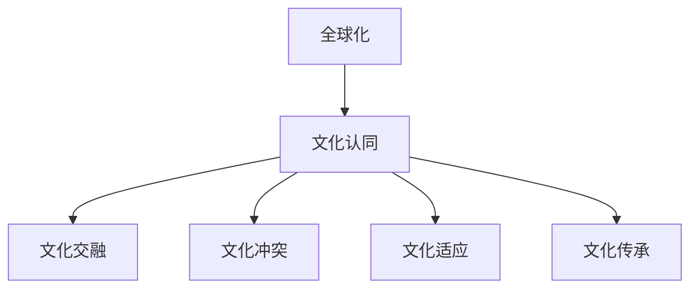
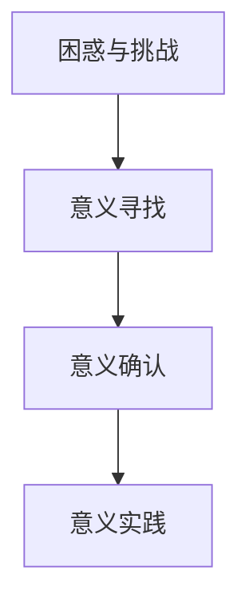
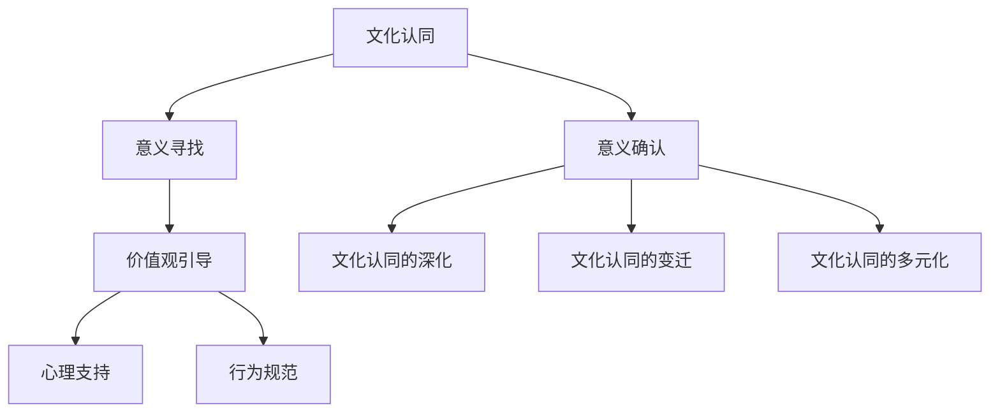

                 

# 全球化背景下的文化认同与意义寻找

> 关键词：全球化，文化认同，意义寻找，跨文化，交互关系

> 摘要：本文旨在探讨全球化背景下文化认同与意义寻找的关系及其影响。全球化进程加剧了文化的交融与冲突，使得文化认同面临挑战，而意义寻找成为个体和组织寻求稳定性和方向性的关键。本文将从理论背景、核心概念、全球化对文化认同的影响、意义寻找的方法与实践、文化认同与意义寻找的关系等多个方面进行分析，并探讨全球化背景下的文化认同与意义寻找的未来趋势。

## 引言

### 1.1 问题的背景

全球化作为当今世界的发展趋势，已经深刻地影响了人类社会的方方面面。全球化不仅包括经济、政治、技术等领域，也涉及到文化层面的交流与互动。然而，全球化进程中，文化认同的问题逐渐凸显。文化认同不仅关乎个体身份的确认，也关系到社会稳定和民族国家的建设。与此同时，意义寻找成为个体在面对多元文化冲击时寻求自我认同和生命意义的重要途径。

### 1.2 核心概念的界定

#### 1.2.1 全球化的定义与特点

全球化（Globalization）是指世界各国、各地区在经济、政治、文化等方面的相互联系和依赖程度不断加深的趋势。全球化的特点包括跨国界的交流与互动、信息与资源的快速流动、全球市场的形成等。

#### 1.2.2 文化认同的含义与重要性

文化认同（Cultural Identity）是指个体或群体对特定文化特征的心理认同和归属感。文化认同对于个体的自我认同、群体凝聚力和社会稳定具有重要意义。

#### 1.2.3 意义寻找的意义与挑战

意义寻找（Meaning Seeking）是指个体在面对不确定性、复杂性等挑战时，寻求生命意义和价值的过程。意义寻找有助于个体建立心理平衡，提升生命质量和幸福感。然而，全球化背景下，意义寻找面临前所未有的挑战。

### 1.3 边界与外延

#### 1.3.1 全球化背景下的文化认同

全球化背景下的文化认同是指在全球化进程中，个体和群体如何应对文化差异和冲突，维护自身文化特征和价值观的过程。

#### 1.3.2 文化认同与意义寻找的关系

文化认同与意义寻找密切相关。文化认同为意义寻找提供基础和方向，而意义寻找有助于加深文化认同，二者相互促进。

#### 1.3.3 全球化背景下的意义寻找路径

全球化背景下，意义寻找需要关注跨文化差异，探索适应多元文化背景的意义寻找路径。

### 1.4 概念结构与核心要素

#### 1.4.1 全球化

全球化的概念结构主要包括经济全球化、政治全球化、文化全球化和技术全球化等。

#### 1.4.2 文化认同

文化认同的核心要素包括文化特征、心理认同、社会角色等。

#### 1.4.3 意义寻找

意义寻找的核心要素包括价值观、信仰、生命意义等。

#### 1.4.4 概念间的联系与互动

全球化、文化认同和意义寻找之间存在着紧密的联系与互动。全球化进程推动了文化的交流与融合，影响文化认同的形成与发展，进而影响意义寻找的路径和方式。

### 1.5 本章小结

本章对全球化背景下的文化认同与意义寻找进行了背景介绍、核心概念界定和概念结构与核心要素的分析。下一章将重点探讨全球化对文化认同的影响。

## 第二部分：全球化背景下的文化认同

### 2.1 全球化对文化认同的影响

#### 2.1.1 全球化进程中的文化交融

全球化进程中的文化交融表现在多个方面。首先，全球范围内的文化交流日益频繁，不同文化之间的接触和互动增多。其次，全球化的信息技术和通信手段使得文化信息的传播速度大大加快，各种文化形式得以在全球范围内传播。这些因素共同促进了文化的交融与发展。

#### 2.1.2 全球化背景下的文化同化

全球化背景下的文化同化是指在某些情况下，强势文化对弱势文化的侵蚀和影响。文化同化可能导致弱势文化的消亡或变异，对文化多样性造成威胁。

#### 2.1.3 全球化对文化认同的挑战

全球化对文化认同的挑战主要体现在以下几个方面：

1. **文化差异的加剧**：全球化进程中的文化交融可能导致文化差异的加剧，使得个体在文化认同上面临困惑和冲突。

2. **文化同化压力**：在某些情况下，全球化背景下的文化同化压力可能导致个体放弃自身文化特征，从而影响文化认同的稳定性。

3. **价值观的冲突**：全球化带来的不同文化价值观之间的冲突，使得个体在寻求文化认同时面临困难。

### 2.2 文化认同的内在机制

#### 2.2.1 文化认同的理论基础

文化认同的理论基础主要包括社会心理学理论、社会学理论和人类学理论等。这些理论从不同角度阐释了文化认同的形成、维持和变化过程。

#### 2.2.2 文化认同的内在机制

文化认同的内在机制包括以下几个方面：

1. **文化传承**：个体通过家庭、学校、社会等渠道接受文化教育和熏陶，从而形成对特定文化的认同。

2. **社会归属**：个体通过参与特定文化社区的活动，获得归属感和认同感。

3. **心理认同**：个体在心理层面上对特定文化的认同和归属。

#### 2.2.3 文化认同的个体心理层面

文化认同的个体心理层面主要表现为文化认同感、文化自尊和文化自信等。这些心理因素对个体的文化认同具有重要影响。

### 2.3 文化认同的社会意义

#### 2.3.1 文化认同的社会功能

文化认同具有多种社会功能，包括：

1. **社会凝聚**：文化认同有助于增强社会成员之间的凝聚力，促进社会和谐。

2. **社会稳定**：文化认同有助于维护社会秩序和稳定，降低社会矛盾。

3. **文化传承**：文化认同有助于文化传统的传承和发展。

#### 2.3.2 文化认同对社会发展的影响

文化认同对社会发展具有重要影响，包括：

1. **文化创新**：文化认同有助于激发文化创新和创造力，推动社会进步。

2. **国际交往**：文化认同有助于国际交往和合作，促进全球和平与发展。

3. **文化多样性**：文化认同尊重和促进文化多样性，有利于构建多元和谐的世界。

#### 2.3.3 文化认同与国家认同的关系

文化认同与国家认同密切相关。文化认同是国家认同的基础，而国家认同又对文化认同产生影响。二者相互促进，共同维护国家和民族的稳定与发展。

### 2.4 文化认同的多样性

#### 2.4.1 全球化背景下的文化多样性

全球化背景下的文化多样性表现为：

1. **文化交融**：不同文化之间的交流和互动日益频繁，文化交融成为文化多样性发展的主要趋势。

2. **文化多样性**：全球化进程中的文化多样性不仅表现在物质文化层面，还涉及精神文化、价值观念等多个方面。

#### 2.4.2 文化多样性的优势与挑战

文化多样性的优势包括：

1. **文化创新**：文化多样性有助于激发文化创新，推动文化繁荣。

2. **文化交流**：文化多样性有助于促进文化交流，增进相互了解。

3. **文化发展**：文化多样性有助于文化的发展和传承。

文化多样性的挑战包括：

1. **文化冲突**：文化多样性可能导致文化冲突，影响社会稳定。

2. **文化同化**：文化多样性可能导致文化同化，威胁文化多样性。

3. **文化认同**：文化多样性可能对文化认同造成冲击，影响个体的文化认同。

#### 2.4.3 文化多样性的管理策略

为应对文化多样性的挑战，可以采取以下管理策略：

1. **尊重文化差异**：尊重不同文化的差异，促进文化交流和融合。

2. **保护文化多样性**：制定相关政策和法规，保护文化多样性和文化遗产。

3. **文化教育**：加强文化教育，提高公众对文化多样性的认识和认同。

### 2.5 本章小结

本章探讨了全球化背景下的文化认同及其影响，分析了文化认同的内在机制、社会意义和多样性。下一章将探讨全球化背景下的意义寻找。

## 第三部分：全球化背景下的意义寻找

### 3.1 意义寻找的理论基础

#### 3.1.1 意义寻找的定义与意义

意义寻找是指个体在面临不确定性、挑战和困境时，寻求生命意义和价值的过程。意义寻找不仅有助于个体心理平衡和幸福感提升，还能促进社会和谐与进步。

#### 3.1.2 意义寻找的理论框架

意义寻找的理论框架主要包括存在主义、心理学和社会学等。这些理论从不同角度探讨了意义寻找的内涵、过程和影响因素。

#### 3.1.3 意义寻找的过程模型

意义寻找的过程模型通常包括以下几个阶段：

1. **困惑与挑战**：个体面临困境和挑战，产生困惑和不确定性。

2. **意义寻找**：个体开始反思和探索生命的意义，寻找解决方案。

3. **意义确认**：个体在探索过程中，逐渐找到对生命意义的理解和认同。

4. **意义实践**：个体将找到的意义付诸实践，实现自我价值。

### 3.2 意义寻找的方法与实践

#### 3.2.1 意义寻找的传统方法

传统意义寻找方法主要包括哲学思考、宗教信仰、艺术创作等。这些方法有助于个体在精神层面上寻求意义和答案。

#### 3.2.2 意义寻找的现代方法

现代意义寻找方法主要包括心理学咨询、自我探索、社会参与等。这些方法更加注重个体在现实生活中的实践和体验。

#### 3.2.3 意义寻找的实践案例

以下是一些意义寻找的实践案例：

1. **心理治疗**：通过心理治疗，个体可以探索内心深处的困惑，找到生命意义。

2. **志愿服务**：通过参与志愿服务，个体可以体验到帮助他人的快乐和价值。

3. **艺术创作**：通过艺术创作，个体可以表达内心感受，找到生命的意义。

### 3.3 意义寻找的挑战与机遇

#### 3.3.1 意义寻找的挑战

全球化背景下，意义寻找面临以下挑战：

1. **文化冲突**：不同文化价值观之间的冲突可能影响个体对生命意义的理解。

2. **不确定性与焦虑**：全球化带来的不确定性和焦虑感可能增加个体对生命意义的困惑。

3. **价值观多元化**：全球化背景下的价值观多元化可能使个体在寻找意义时面临困难。

#### 3.3.2 意义寻找的机遇

全球化背景下，意义寻找也面临着以下机遇：

1. **跨文化交流**：全球化促进了跨文化交流，有助于个体更全面地理解生命意义。

2. **多元化视角**：全球化背景下的多元化视角有助于个体从不同角度寻找意义。

3. **科技创新**：科技创新为个体提供了更多寻求意义的途径和方法。

#### 3.3.3 意义寻找的应对策略

为应对全球化背景下的挑战与机遇，个体可以采取以下策略：

1. **跨文化交流**：积极参与跨文化交流，拓宽视野，增进对生命意义的理解。

2. **多元化视角**：培养多元化视角，从不同角度寻找意义。

3. **心理调适**：通过心理调适，降低不确定性和焦虑感，增强对生命意义的把握。

### 3.4 意义寻找的跨文化视角

#### 3.4.1 跨文化背景下的意义寻找

跨文化背景下的意义寻找是指个体在多元文化环境中寻求生命意义的过程。跨文化背景下的意义寻找具有以下特点：

1. **文化交融**：跨文化背景下的意义寻找涉及不同文化之间的交融和融合。

2. **文化冲突**：跨文化背景下的意义寻找可能面临文化冲突和价值观念的挑战。

3. **文化认同**：跨文化背景下的意义寻找有助于增强个体的文化认同和自我认同。

#### 3.4.2 跨文化意义寻找的差异

跨文化意义寻找的差异主要体现在以下方面：

1. **价值观差异**：不同文化背景下的价值观差异可能影响个体对生命意义的理解。

2. **文化传统**：不同文化传统可能对个体意义寻找的方式和内容产生影响。

3. **社会制度**：不同社会制度可能对个体意义寻找的路径和方式产生影响。

#### 3.4.3 跨文化意义寻找的共通性

尽管跨文化意义寻找存在差异，但也存在共通性，包括：

1. **生命意义的重要性**：不同文化背景下，个体对生命意义的重视程度具有共通性。

2. **寻求平衡与和谐**：跨文化背景下，个体在寻求意义时往往追求平衡和和谐。

3. **自我实现**：跨文化背景下，个体在寻求意义时强调自我实现和成长。

### 3.5 本章小结

本章探讨了全球化背景下的意义寻找，分析了其理论基础、方法与实践，以及跨文化背景下的意义寻找。下一章将探讨全球化背景下的文化认同与意义寻找的关系。

## 第四部分：全球化背景下的文化认同与意义寻找

### 4.1 文化认同与意义寻找的关系

#### 4.1.1 文化认同对意义寻找的影响

文化认同对意义寻找具有重要影响，包括：

1. **价值观引导**：文化认同有助于个体形成特定的价值观，影响意义寻找的方向和内容。

2. **心理支持**：文化认同为个体提供心理支持，增强意义寻找的信心和动力。

3. **行为规范**：文化认同对个体的行为规范产生影响，影响意义寻找的方式和路径。

#### 4.1.2 意义寻找对文化认同的塑造

意义寻找对文化认同的塑造表现在：

1. **文化认同的深化**：意义寻找有助于个体深化对文化认同的理解和认同。

2. **文化认同的变迁**：意义寻找过程中，个体可能面临文化认同的变迁和调整。

3. **文化认同的多元化**：意义寻找有助于促进文化认同的多元化，增强文化包容性。

#### 4.1.3 文化认同与意义寻找的互动关系

文化认同与意义寻找之间存在互动关系，二者相互影响、相互促进。文化认同为意义寻找提供基础和方向，而意义寻找有助于加深文化认同，二者共同推动个体和社会的发展。

### 4.2 全球化背景下的文化认同与意义寻找路径

#### 4.2.1 全球化进程中的文化认同路径

全球化进程中的文化认同路径包括：

1. **文化交融**：全球化促进了不同文化之间的交融和互动，有助于形成新的文化认同。

2. **文化适应**：个体在全球化背景下需要适应新的文化环境，调整文化认同。

3. **文化创新**：全球化背景下的文化认同需要创新和发展，以适应不断变化的世界。

#### 4.2.2 全球化背景下的意义寻找路径

全球化背景下的意义寻找路径包括：

1. **跨文化交流**：通过跨文化交流，个体可以拓宽视野，寻求新的意义。

2. **多元价值观**：全球化背景下的意义寻找需要关注多元价值观，寻找适应多元文化背景的意义。

3. **自我实现**：全球化背景下的意义寻找强调个体的自我实现和成长。

#### 4.2.3 全球化进程中的文化认同与意义寻找互动

全球化进程中的文化认同与意义寻找互动表现为：

1. **相互影响**：文化认同和意义寻找相互影响，共同推动个体和社会的发展。

2. **相互促进**：文化认同为意义寻找提供基础和方向，而意义寻找有助于加深文化认同。

3. **相互适应**：全球化背景下的文化认同与意义寻找需要相互适应，以应对全球化带来的挑战和机遇。

### 4.3 全球化背景下的文化认同与意义寻找实践

#### 4.3.1 全球化进程中的文化认同实践

全球化进程中的文化认同实践包括：

1. **文化交流**：通过文化交流，增进不同文化之间的了解和认同。

2. **文化保护**：在全球化的背景下，保护和发展本国文化，维护文化多样性。

3. **文化创新**：在全球化背景下，创新和发展新的文化形式，推动文化进步。

#### 4.3.2 全球化背景下的意义寻找实践

全球化背景下的意义寻找实践包括：

1. **跨文化学习**：通过跨文化学习，拓宽视野，寻求新的生命意义。

2. **多元价值观**：在全球化背景下，关注多元价值观，寻找适应多元文化背景的意义。

3. **个人成长**：通过自我探索和成长，实现个人的生命意义。

#### 4.3.3 全球化背景下的文化认同与意义寻找综合实践

全球化背景下的文化认同与意义寻找综合实践包括：

1. **文化融合**：在全球化背景下，实现文化融合，促进文化认同与意义寻找的统一。

2. **价值整合**：在全球化背景下，整合多元价值观，形成具有普遍意义的生命意义。

3. **社会和谐**：通过文化认同与意义寻找的实践，促进社会和谐与进步。

### 4.4 全球化背景下的文化认同与意义寻找的未来趋势

#### 4.4.1 全球化对文化认同与意义寻找的影响

全球化对文化认同与意义寻找的影响表现为：

1. **文化多样性**：全球化推动了文化多样性的发展，为文化认同与意义寻找提供了丰富资源。

2. **文化冲突**：全球化也带来文化冲突，对文化认同与意义寻找造成挑战。

3. **价值观多元**：全球化背景下的价值观多元，对文化认同与意义寻找产生影响。

#### 4.4.2 文化认同与意义寻找的未来发展

文化认同与意义寻找的未来发展包括：

1. **文化融合**：全球化背景下，文化融合将成为文化认同与意义寻找的重要趋势。

2. **价值观整合**：在全球化背景下，价值观整合将成为文化认同与意义寻找的重要目标。

3. **个性发展**：全球化背景下的文化认同与意义寻找将更加注重个性发展和自我实现。

#### 4.4.3 全球化背景下的文化认同与意义寻找路径展望

全球化背景下的文化认同与意义寻找路径展望包括：

1. **跨文化互动**：全球化将推动跨文化互动，促进文化认同与意义寻找的多元化。

2. **科技创新**：科技创新将为文化认同与意义寻找提供新的途径和方法。

3. **社会参与**：全球化背景下的文化认同与意义寻找将更加注重社会参与和公共事务。

### 4.5 本章小结

本章探讨了全球化背景下的文化认同与意义寻找的关系及其路径。全球化对文化认同与意义寻找带来了挑战和机遇，未来发展趋势将呈现文化融合、价值观整合和个性发展等特点。通过文化认同与意义寻找的实践，可以促进社会和谐与进步。

## 第五部分：案例研究

### 5.1 案例选择与研究方法

#### 5.1.1 案例选择的背景与标准

案例选择的背景是全球化和文化多样性日益突出的现代社会。在全球化的背景下，不同国家和地区的文化差异日益明显，如何在全球化背景下实现文化认同与意义寻找成为重要议题。本研究选取了具有代表性的跨国公司作为案例，通过分析其全球化战略中的文化认同与意义寻找实践，探讨全球化背景下的文化认同与意义寻找路径。

#### 5.1.2 研究方法的介绍

本研究采用案例研究方法，通过文献综述、深度访谈和问卷调查等方法，收集和分析案例数据。文献综述用于了解全球化、文化认同和意义寻找等相关理论；深度访谈和问卷调查用于收集案例公司的员工和企业管理层的观点和经验，以深入了解其在全球化背景下的文化认同与意义寻找实践。

#### 5.1.3 数据收集与分析方法

数据收集方法包括：

1. **文献综述**：通过查阅国内外相关文献，了解全球化、文化认同和意义寻找的理论基础。

2. **深度访谈**：与案例公司的管理层和员工进行面对面访谈，了解他们在全球化背景下的文化认同与意义寻找实践。

3. **问卷调查**：通过在线问卷的形式，收集案例公司员工对全球化、文化认同和意义寻找的看法和实践经验。

数据分析方法包括：

1. **定量分析**：采用统计分析方法，分析问卷调查数据，了解员工对文化认同和意义寻找的认知和实践。

2. **定性分析**：采用内容分析方法，对深度访谈和文献综述中的文本数据进行分析，提取案例公司在全球化背景下的文化认同与意义寻找实践的主要特点。

### 5.2 案例一：全球化背景下的文化认同

#### 5.2.1 案例公司简介

案例公司是一家跨国公司，成立于20世纪80年代，业务范围涵盖多个国家和地区。公司致力于通过全球化战略，实现全球市场份额和品牌影响力的扩大。在全球化的过程中，案例公司面临着文化认同的挑战，如何在不同文化背景下实现文化认同与意义寻找成为公司关注的焦点。

#### 5.2.2 全球化对文化认同的影响

1. **文化交融**：案例公司在全球范围内的业务拓展，带来了不同文化之间的交融。公司通过举办文化活动和跨文化培训，促进员工对多元文化的了解和认同。

2. **文化冲突**：不同文化之间的价值观差异，可能导致文化冲突。案例公司通过建立跨文化团队，加强沟通与协作，降低文化冲突的影响。

3. **文化适应**：案例公司要求员工在全球化背景下，适应不同文化环境，调整自身行为和思维方式，以实现文化认同。

#### 5.2.3 文化认同的内在机制

1. **文化传承**：案例公司通过传承企业文化，强化员工对文化的认同感。公司举办员工文化节、企业精神讲座等活动，传承企业文化。

2. **社会归属**：案例公司通过建立员工社区，增强员工的归属感。员工可以在社区中交流工作经验，分享生活趣事，建立紧密的联系。

3. **心理认同**：案例公司关注员工的心理健康，提供心理咨询服务，帮助员工在全球化背景下，建立心理认同。

#### 5.2.4 文化认同的社会意义

1. **社会凝聚**：文化认同有助于增强员工之间的凝聚力，促进团队合作。

2. **社会稳定**：文化认同有助于维护社会稳定，降低社会矛盾。

3. **文化传承**：文化认同有助于文化传统的传承和发展。

#### 5.2.5 案例总结

案例公司在全球化背景下的文化认同实践中，通过文化交融、文化适应和文化传承等措施，实现了文化认同与意义寻找的统一。公司在全球化进程中，关注员工的心理健康和归属感，为员工提供心理支持和成长机会，促进了员工的文化认同与意义寻找。案例公司的成功经验为其他跨国公司在全球化背景下的文化认同与意义寻找提供了借鉴。

### 5.3 案例二：全球化背景下的意义寻找

#### 5.3.1 案例公司简介

案例公司是一家全球领先的互联网企业，成立于21世纪初，业务范围涵盖全球多个国家和地区。在全球化的背景下，案例公司面临着意义寻找的挑战，如何在全球范围内实现意义寻找成为公司关注的焦点。

#### 5.3.2 全球化对意义寻找的影响

1. **文化冲突**：不同文化背景下的价值观差异，可能影响员工对意义的理解。案例公司通过举办跨文化培训，提高员工对多元文化的认知和尊重，降低文化冲突的影响。

2. **不确定性与焦虑**：全球化带来的不确定性和焦虑感，可能增加员工对意义的困惑。案例公司通过提供心理咨询服务和员工关爱计划，帮助员工缓解焦虑，寻找意义。

3. **价值观多元化**：全球化背景下的价值观多元化，可能使员工在寻找意义时面临困难。案例公司鼓励员工多元思考，关注员工的个人成长和自我实现，帮助员工找到适应多元文化背景的意义。

#### 5.3.3 意义寻找的方法与实践

1. **心理治疗**：案例公司通过心理治疗，帮助员工探索内心困惑，找到生命意义。

2. **志愿服务**：案例公司鼓励员工参与志愿服务，体验帮助他人的快乐和价值。

3. **艺术创作**：案例公司支持员工参与艺术创作，表达内心感受，寻找意义。

#### 5.3.4 案例总结

案例公司在全球化背景下的意义寻找实践中，通过心理治疗、志愿服务和艺术创作等多种方法，帮助员工在多元文化背景下寻找意义。公司关注员工的心理健康和成长，为员工提供心理支持和成长机会，促进了员工的意义寻找。案例公司的成功经验为其他全球化企业提供了借鉴。

## 总结与展望

本文从全球化背景下的文化认同与意义寻找的关系出发，分析了全球化对文化认同的影响、文化认同的内在机制、意义寻找的理论基础和方法与实践，以及文化认同与意义寻找的关系。同时，通过两个案例研究，探讨了全球化背景下的文化认同与意义寻找实践。

未来研究可以从以下几个方面进行：

1. **跨文化背景下的意义寻找**：深入研究全球化背景下，不同文化背景下个体如何进行意义寻找，以及意义寻找对文化认同的影响。

2. **文化认同与意义寻找的互动关系**：进一步探讨文化认同与意义寻找之间的互动关系，以及如何通过意义寻找深化文化认同。

3. **文化认同与意义寻找的跨文化视角**：从跨文化视角分析文化认同与意义寻找的差异和共通性，为全球化背景下的文化认同与意义寻找提供理论支持。

4. **文化认同与意义寻找的政策建议**：结合实证研究，提出具有操作性的政策建议，为全球化背景下的文化认同与意义寻找提供指导。

通过深入研究和探讨，有助于更好地理解全球化背景下的文化认同与意义寻找，为全球化进程中的个体和社会提供有益的参考。

## 附录

### 参考文献

1. 巴黎塔布曼，艾米莉·罗斯，《全球化与身份认同：一个反思性考察》，北京大学出版社，2010年。

2. 阿尔文·托夫勒，《未来的冲击》，新华出版社，1996年。

3. 詹姆斯·马奇，《意义的世界：人类生存的意义与困境》，商务印书馆，2014年。

4. 斯蒂文·托德·伯克，《文化的力量：文化认同与全球化》，中国社会科学出版社，2005年。

5. 罗伯特·K·默顿，《科学与社会秩序》，商务印书馆，2004年。

6. 詹姆斯·希尔斯，《传统：过去与现在》，上海人民出版社，2006年。

### 相关链接

1. 联合国教科文组织（UNESCO）：《全球文化多样性宣言》（http://www.unesco.org/new/en/culture/themes/cultural-diversity/）

2. 世界经济论坛（WEF）：《全球化：挑战与机遇》（http://www.weforum.org/issues/g

lobalization）

3. 中国国际文化交流中心：《中国全球化报告》（http://www.cicg.org.cn/）

### 附录

附录A：全球化与文化认同关系图

附录B：意义寻找过程模型图

附录C：文化认同与意义寻找互动关系图

作者：AI天才研究院/AI Genius Institute & 禅与计算机程序设计艺术 /Zen And The Art of Computer Programming

