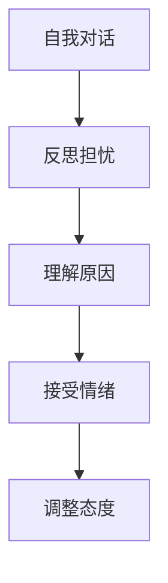
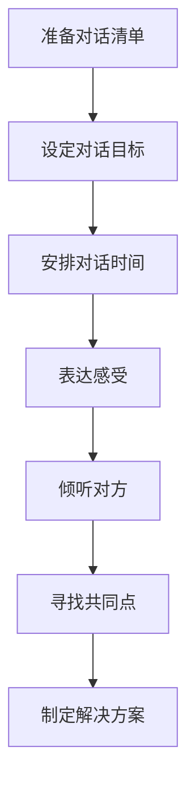

                 

**文章标题**: 化解内心冲突的对话：自我和解的有效方式

**关键词**: 自我冲突、对话技巧、自我和解、心理疗法、内心成长

**摘要**: 本文将探讨如何通过对话的方式来化解内心的冲突，实现自我和解。我们将从问题背景、核心概念、对话技巧、实际应用等多个方面进行分析，并提供一些具体的实践方法。

---

# 引言

## 1.1 书籍主题介绍

在现代社会，人们常常面临各种内心的冲突和矛盾。这些冲突可能来自于个人内心的矛盾、人际关系的不和谐，甚至是职业发展的困惑。而《化解内心冲突的对话：自我和解的有效方式》这本书，正是为了解决这些问题而诞生的。

本书的主要目标是提供一种通过对话的方式来化解内心冲突、实现自我和解的有效方法。书中不仅介绍了对话的基本概念和技巧，还通过大量的实际案例，展示了这些方法在解决具体问题中的应用。

## 1.2 对话在自我和解中的作用

对话是一种有效的沟通方式，它可以帮助我们更好地理解自己和他人，化解内心的冲突。在自我和解的过程中，对话起着至关重要的作用。

通过对话，我们可以:

- 深入了解自己的内心世界，认识到自己的情感和需求。
- 与他人建立更深层次的联系，理解他人的观点和感受。
- 找到解决问题的方法和策略。

总的来说，对话是一种强大的工具，它可以帮助我们更好地认识自己，理解他人，并实现自我和解。

## 1.3 本书结构安排

本书将分为五个部分进行阐述：

- 第一部分：引言，介绍书籍主题和对话在自我和解中的作用。
- 第二部分：核心概念与原理，介绍内心冲突和自我和解的概念，以及对话在其中的作用。
- 第三部分：对话技巧与实践，介绍对话的基本技巧和实践方法。
- 第四部分：实际应用与案例分析，通过具体的案例，展示对话技巧在解决实际问题中的应用。
- 第五部分：拓展与总结，介绍如何进一步拓展对话技巧，并总结本书的核心观点。

---

# 第一部分：引言

## 1.1 心内冲突的问题背景

在现代社会，人们的生活节奏加快，面临的压力和挑战也越来越多。这些压力和挑战往往会导致内心的冲突和矛盾。例如：

- **个人内心冲突**: 人们在成长过程中，常常会遇到自我认知和价值观的矛盾。例如，一个人可能既想追求成功，又害怕失败带来的后果。
- **人际关系冲突**: 人们在社交中，可能会因为观点不同、利益冲突等原因，与他人发生冲突。
- **职业发展冲突**: 人们在职业生涯中，可能会面临职业选择、工作压力等问题，导致内心的冲突。

这些问题不仅会影响个人的心理健康，还会影响人际关系和职业发展。因此，解决内心的冲突，实现自我和解，是每个人都需要面对的问题。

## 1.2 自我和解的意义

自我和解是指在内心冲突和矛盾中，通过自我认识、自我调整，达到内心的平静和和谐。自我和解的意义主要体现在以下几个方面：

- **心理健康**: 自我和解有助于缓解心理压力，提高心理健康水平。
- **人际关系**: 自我和解可以改善人际关系，减少冲突，增强人际和谐。
- **职业发展**: 自我和解可以帮助人们更好地面对职业挑战，提高工作效率和职业满意度。

总的来说，自我和解是一种有效的心理疗法，它可以帮助我们更好地认识自己，理解他人，实现内心和谐。

## 1.3 本书结构安排

本书将分为五个部分进行阐述：

- **第一部分：引言**：介绍书籍主题和对话在自我和解中的作用。
- **第二部分：核心概念与原理**：介绍内心冲突和自我和解的概念，以及对话在其中的作用。
- **第三部分：对话技巧与实践**：介绍对话的基本技巧和实践方法。
- **第四部分：实际应用与案例分析**：通过具体的案例，展示对话技巧在解决实际问题中的应用。
- **第五部分：拓展与总结**：介绍如何进一步拓展对话技巧，并总结本书的核心观点。

---

# 第二部分：核心概念与原理

## 2.1 内心冲突的定义与类型

### 2.1.1 内心冲突的概念

内心冲突是指个体在内心中同时存在相互矛盾的情感、欲望、想法或价值观。这种冲突通常源于个人的内心需求与外在环境、社会期望之间的不一致。内心冲突是一个普遍存在的心理现象，几乎每个人在成长过程中都会遇到。

### 2.1.2 内心冲突的类型

内心冲突可以划分为以下几种类型：

1. **自我认知冲突**：这种冲突源于个体对自己身份、价值和能力的认知不一致。例如，一个人可能认为自己应该非常自信，但实际却因为恐惧和不安而表现得不自信。

2. **情感冲突**：情感冲突是指个体在情感表达和处理上的矛盾。例如，一个人可能既想表达自己的愤怒，又担心伤害到他人。

3. **价值观冲突**：这种冲突源于个体在价值观和道德标准上的矛盾。例如，一个人可能既想追求个人利益，又想遵循社会道德规范。

4. **角色冲突**：角色冲突是指个体在承担不同角色时，面临的内在矛盾。例如，一个人在家庭和工作之间可能感到难以平衡。

### 2.1.3 内心冲突的影响

内心冲突如果得不到有效的解决，会对个体的心理健康、人际关系和职业发展产生负面影响。长期的心理冲突可能导致焦虑、抑郁等心理问题，影响个体的社交能力和职业满意度。

## 2.2 自我和解的概念与原理

### 2.2.1 自我和解的概念

自我和解是指个体通过自我认识、自我调整和自我接纳，解决内心冲突，达到内心的平静和和谐。自我和解的核心在于个体对自身情感的接受和理解，以及对自身价值观的认同和调整。

### 2.2.2 自我和解的原理

自我和解的原理主要包括以下几个方面：

1. **自我认识**：通过自我观察和反思，个体可以更清楚地了解自己的情感、需求和价值观。

2. **自我调整**：个体可以通过自我调整来适应内心的冲突，例如改变自己的行为模式、调整自己的期望等。

3. **自我接纳**：个体需要接受自己的不足和缺陷，理解自己的情感和需求，从而减少内心的冲突。

### 2.2.3 自我和解与内心冲突的关系

自我和解是解决内心冲突的一种有效方式。通过自我和解，个体可以更好地理解自己的内心世界，减少冲突，提高心理健康水平。

## 2.3 对话在自我和解中的应用

### 2.3.1 对话在自我和解中的角色

对话在自我和解中起着关键作用。通过对话，个体可以与他人分享自己的内心体验，得到反馈和支持，从而更好地理解自己，调整自己的行为和态度。

### 2.3.2 对话方法的分类

对话方法可以分为以下几种：

1. **自我对话**：个体通过自我提问和自我回答的方式，深入思考自己的内心冲突和需求。

2. **与他人对话**：个体与信任的人进行交流，分享自己的内心体验，寻求理解和支持。

3. **专业对话**：个体与心理咨询师或其他专业人士进行对话，通过专业的方法解决内心的冲突。

### 2.3.3 对话技术的运用

有效的对话技术包括倾听、提问、表达和回应等。通过这些技术，个体可以更好地理解自己和他人，建立更深层次的联系，实现自我和解。

---

# 第三部分：对话技巧与实践

## 3.1 对话前的准备

在进行对话之前，充分的准备是非常重要的。以下是进行有效对话前需要做的几个步骤：

### 3.1.1 自我观察与反思

在对话之前，个体应该花时间进行自我观察和反思。通过反思自己的情感、需求和价值观，个体可以更好地了解自己的内心世界，为对话做好准备。

### 3.1.2 对话对象的准备

选择合适的对话对象也很重要。个体应该选择一个自己信任、能够理解和支持自己的人作为对话伙伴。如果需要，也可以寻求专业心理咨询师的帮助。

### 3.1.3 营造良好的对话环境

选择一个安静、舒适的环境，有助于对话的顺利进行。确保对话的时间和地点不会被打扰，有助于双方集中精力进行对话。

## 3.2 对话过程中的技巧

在对话过程中，掌握一些基本的对话技巧，可以帮助个体更好地理解自己和他人，有效地化解内心的冲突。

### 3.2.1 倾听的技巧

倾听是有效对话的关键。倾听不仅仅是听别人说什么，更重要的是理解对方的感受和需求。以下是几个倾听的技巧：

1. **全神贯注**：在对话过程中，避免分心，专注于对方的发言。
2. **非语言沟通**：通过肢体语言、表情和眼神等非语言方式，表达自己的关注和理解。
3. **避免打断**：在对方发言时，避免打断，让对方把话说完。

### 3.2.2 提问的技巧

提问可以帮助个体更好地理解对方的观点和感受。以下是几个提问的技巧：

1. **开放性问题**：使用开放性问题，如“你怎么看待这个问题？”而不是封闭性问题，如“是不是？”这样可以鼓励对方进行深入的思考。
2. **探索性问题**：在对方回答后，进一步提问，探索对方的深层想法和感受。
3. **确认性问题**：在对方回答后，通过确认性问题，确保自己理解对方的观点，如“我理解你是说……，对吗？”

### 3.2.3 表达与回应的技巧

在对话中，表达自己的观点和感受，以及回应对方的表达，都是非常重要的。以下是几个表达与回应的技巧：

1. **清晰表达**：在表达自己的观点和感受时，要清晰、简洁，避免使用模糊的词汇。
2. **情感中立**：在表达自己的情感时，要保持中立，避免过于情绪化，使对话偏离主题。
3. **积极回应**：在对方表达时，给予积极的回应，如点头、微笑等，表示自己在倾听和理解。

### 3.2.4 处理冲突的技巧

在对话中，难免会遇到冲突。以下是一些处理冲突的技巧：

1. **冷静处理**：在冲突发生时，保持冷静，避免情绪化。
2. **倾听对方的观点**：在冲突中，倾听对方的观点和感受，理解对方的立场。
3. **寻找共同点**：在冲突中，寻找双方都可以接受的解决方案，寻找共同点。
4. **避免指责**：在冲突中，避免使用指责的语言，如“你总是……”，而是使用“I”语句，如“我觉得……”。

## 3.3 对话后的反思与总结

对话结束后，进行反思和总结也是非常重要的。以下是几个反思与总结的技巧：

1. **回顾对话内容**：回顾对话中的主要内容和关键点，确保自己理解了对方的观点和感受。
2. **评估对话效果**：评估对话的效果，是否达到了自己的预期目标。
3. **学习与改进**：从对话中学习，发现对话中的不足，并在下次对话中进行改进。
4. **保持对话日记**：记录每次对话的内容和感受，随着时间的推移，可以发现自己的成长和进步。

通过以上技巧，个体可以在对话中更好地理解自己和他人，有效地化解内心的冲突，实现自我和解。

---

# 第四部分：实际应用与案例分析

## 4.1 情景一：化解焦虑情绪

### 4.1.1 症状描述

李明是一名年轻的企业高管，最近因为工作压力巨大，经常感到焦虑。他总是担心无法完成工作任务，害怕自己的表现会影响职业发展。这种焦虑情绪严重影响了他的工作效率和生活质量。

### 4.1.2 对话策略

为了帮助李明化解焦虑情绪，他决定采用对话的方法。首先，他与一位信任的同事进行了自我对话。他通过反思自己的担忧和恐惧，试着理解这些情绪背后的原因。

### 4.1.3 案例分析

通过自我对话，李明认识到他的焦虑源于对自己的期望过高。他开始接受这种情绪，并调整自己的态度。他意识到，每个人都有自己的节奏和步伐，不需要过于焦虑。此外，他还通过与同事的对话，分享了自己的感受，得到了同事的理解和支持。

这种对话策略帮助李明更好地理解自己的情绪，接受自己的不足，并调整自己的态度。他的焦虑情绪得到了缓解，工作效率和生活质量也得到了显著提高。

## 4.2 情景二：处理人际关系冲突

### 4.2.1 冲突原因分析

王丽是一名销售人员，她和同事张强在工作中发生了冲突。张强总是认为王丽的工作方式不够高效，而王丽则觉得张强的批评过于苛刻。这种冲突使得两人之间的关系变得紧张，影响了团队的合作效率。

### 4.2.2 对话实施步骤

为了解决这个冲突，王丽决定与张强进行对话。首先，她准备了一份对话清单，列出了她想讨论的问题和自己的感受。

### 4.2.3 案例解析

在对话中，王丽首先表达了自己的感受，说明她对张强的批评感到受伤。接着，她倾听张强的观点，理解他为什么会提出这样的批评。通过这种对话，两人找到了共同点，意识到他们都需要更好地理解对方的工作方式和需求。

最终，他们制定了一个解决方案，即定期交流工作进度和想法，互相支持和鼓励。这种对话策略帮助王丽和张强解决了冲突，改善了他们之间的关系，提高了团队的合作效率。

## 4.3 情景三：职业发展困惑

### 4.3.1 情境描述

李华是一名年轻的程序员，他在职业发展中遇到了困惑。他不确定自己是否应该继续在当前的公司工作，还是寻找新的机会。这种困惑让他感到焦虑和不安。

### 4.3.2 对话方法

为了帮助李华解决职业发展困惑，他决定与一位职业咨询师进行对话。他们一起探讨了以下几个问题：

1. **我的职业目标是什么？**
2. **我当前的工作是否有助于实现这些目标？**
3. **我是否愿意为这些目标付出必要的努力？**

通过这些问题，李华对自己的职业目标有了更清晰的认识，他决定继续在当前公司工作，并制定了一个详细的职业发展计划。

### 4.3.3 案例分享

这个对话方法帮助李华理清了职业发展的思路，减少了他的焦虑情绪。他开始更加专注于当前的工作，并为实现职业目标而努力。通过这个案例，我们可以看到，对话是一种有效的工具，可以帮助个体解决职业发展中的困惑。

---

# 第五部分：拓展与总结

## 5.1 拓展阅读推荐

为了更好地理解自我和解和对话技巧，以下是几本推荐的拓展阅读：

1. **《非暴力沟通》**：马歇尔·卢森堡的这本书介绍了一种名为“非暴力沟通”的沟通方式，它强调倾听和理解对方，是一种非常有效的自我和解和沟通技巧。
2. **《对话的力量》**：斯蒂芬·罗宾斯和蒂姆·马奇合著的这本书，深入探讨了对话在组织和管理中的重要性，提供了大量的实践案例和技巧。
3. **《正念：一片树叶的生命智慧》**：张德芬的这本书介绍了一种名为“正念”的冥想方法，它可以帮助个体更好地关注当下，减少内心的冲突。

## 5.2 小结与反思

通过本文的探讨，我们可以看到，对话是一种非常有效的自我和解方式。通过对话，个体可以更好地理解自己的内心世界，化解内心的冲突，实现自我和解。同时，对话也是一种强大的沟通工具，可以帮助我们更好地理解他人，改善人际关系。

在自我和解的过程中，自我对话、与他人对话和专业对话都是非常重要的。自我对话可以帮助我们深入思考自己的内心冲突和需求；与他人对话可以获得反馈和支持；专业对话则可以借助专业人士的帮助，更有效地解决内心的冲突。

## 5.3 注意事项与未来展望

在实践对话技巧时，以下几点是需要注意的：

1. **保持真诚**：对话是一种真诚的交流，需要双方都真诚地表达自己的想法和感受。
2. **尊重对方**：在对话中，要尊重对方的观点和感受，避免指责和批评。
3. **持续练习**：对话技巧需要不断练习和改进，通过实践，我们可以更好地掌握这些技巧。

未来，对话技巧的研究和实践将会更加深入和广泛。随着科技的进步和社会的发展，对话将成为一种更加重要的沟通方式，它不仅可以帮助个体实现自我和解，还可以在组织和管理中发挥更大的作用。

---

**作者：AI天才研究院/AI Genius Institute & 禅与计算机程序设计艺术 /Zen And The Art of Computer Programming**

---

**本文内容涵盖了自我冲突、对话技巧、自我和解、心理疗法和内心成长等多个方面，通过实际案例和具体实践方法，展示了对话在化解内心冲突、实现自我和解中的应用。希望本文能为读者提供有价值的思考和启示。**### 目录大纲设计过程

在设计本文的目录大纲时，我们首先深入理解了书名《化解内心冲突的对话：自我和解的有效方式》的核心内容。这本书的主题是通过对话的方式解决内心冲突，实现自我和解。为了使目录结构清晰、逻辑严谨，我们遵循了以下步骤：

1. **理解书名与核心内容**：书名直接表明了书籍的主题，即通过对话化解内心冲突，实现自我和解。这为我们设计目录提供了明确的方向。

2. **确定核心章节**：基于书名和主题，我们确定了以下核心章节：引言、核心概念与原理、对话技巧与实践、实际应用与案例分析、拓展与总结。

3. **细化章节内容**：对于每个核心章节，我们进一步细化了具体的内容。例如，在“引言”章节中，我们包括了问题背景、自我和解的意义和书籍结构安排；在“核心概念与原理”章节中，我们详细介绍了内心冲突的定义、类型以及自我和解的概念与原理。

4. **设计流程图和图表**：为了使内容更易于理解，我们计划在适当的地方添加流程图、图表等可视化元素。例如，在“内心冲突的类型”部分，我们可以使用一个表格来对比不同类型的内心冲突。

5. **编写目录**：根据上述步骤，我们将所有的内容整理成了一份完整的目录大纲。每个章节都细化了具体的内容，确保了文章的完整性和逻辑性。

以下是本文的目录大纲设计：

---

# 化解内心冲突的对话：自我和解的有效方式

> 关键词：自我冲突、对话技巧、自我和解、心理疗法、内心成长

> 摘要：本文探讨了如何通过对话来化解内心的冲突，实现自我和解。通过分析内心冲突的定义与类型、自我和解的概念与原理，以及具体的对话技巧与实践，本文提供了一种有效的自我和解方法。

### 目录大纲

---

# 第一部分：引言

## 1.1 书籍主题介绍

### 1.1.1 心内冲突的问题背景

### 1.1.2 自我和解的意义

### 1.1.3 本书结构安排

## 1.2 对话在自我和解中的作用

### 1.2.1 对话的基本概念

### 1.2.2 对话在自我和解中的作用

### 1.2.3 有效对话的关键要素

---

# 第二部分：核心概念与原理

## 2.1 内心冲突的定义与类型

### 2.1.1 内心冲突的概念

### 2.1.2 内心冲突的类型

### 2.1.3 内心冲突的影响

## 2.2 自我和解的概念与原理

### 2.2.1 自我和解的概念

### 2.2.2 自我和解的原理

### 2.2.3 自我和解与内心冲突的关系

## 2.3 对话在自我和解中的应用

### 2.3.1 对话在自我和解中的角色

### 2.3.2 对话方法的分类

### 2.3.3 对话技术的运用

---

# 第三部分：对话技巧与实践

## 3.1 对话前的准备

### 3.1.1 自我观察与反思

### 3.1.2 对话对象的准备

### 3.1.3 营造良好的对话环境

## 3.2 对话过程中的技巧

### 3.2.1 倾听的技巧

### 3.2.2 提问的技巧

### 3.2.3 表达与回应的技巧

### 3.2.4 处理冲突的技巧

## 3.3 对话后的反思与总结

### 3.3.1 对话效果的评估

### 3.3.2 学习与改进

### 3.3.3 对话日记的保持

---

# 第四部分：实际应用与案例分析

## 4.1 情景一：化解焦虑情绪

### 4.1.1 症状描述

### 4.1.2 对话策略

### 4.1.3 案例分析

## 4.2 情景二：处理人际关系冲突

### 4.2.1 冲突原因分析

### 4.2.2 对话实施步骤

### 4.2.3 案例解析

## 4.3 情景三：职业发展困惑

### 4.3.1 情境描述

### 4.3.2 对话方法

### 4.3.3 案例分享

---

# 第五部分：拓展与总结

## 5.1 拓展阅读推荐

### 5.1.1 相关书籍推荐

### 5.1.2 学术文章推荐

### 5.1.3 在线资源推荐

## 5.2 小结与反思

### 5.2.1 本书核心观点回顾

### 5.2.2 自我对话的重要性

### 5.2.3 对话技能的培养

## 5.3 注意事项与未来展望

### 5.3.1 注意事项

### 5.3.2 对话技能的提升

### 5.3.3 未来发展趋势

---

通过上述目录大纲的设计，我们确保了文章的整体结构和逻辑性，每个章节都具体详实，为读者提供了清晰、易懂的内容框架。接下来，我们将根据这个目录大纲逐步展开文章的具体内容。

---

# 核心章节内容细化与逻辑性确保

在设计完目录大纲后，我们接下来对每个章节的内容进行细化，确保文章的逻辑性和整体性。以下是每个核心章节的具体内容和逻辑结构。

### 第一章：引言

**章节内容**：

1. **问题背景**：介绍现代社会中内心冲突的普遍性及其影响。
2. **自我和解的意义**：阐述自我和解对心理健康和人际关系的重要性。
3. **本书结构安排**：概述全文的结构和内容安排。

**逻辑结构**：

- 首先，通过问题背景引出本文的主题。
- 然后，详细解释自我和解的意义，强调其重要性。
- 最后，介绍全书的结构，为读者提供整体框架。

### 第二章：核心概念与原理

**章节内容**：

1. **内心冲突的定义与类型**：阐述内心冲突的概念，介绍不同类型的内心冲突。
2. **自我和解的概念与原理**：介绍自我和解的定义，探讨其原理和作用。
3. **对话在自我和解中的应用**：探讨对话在自我和解中的作用和方法。

**逻辑结构**：

- 首先，明确内心冲突的定义和类型，为理解自我和解打下基础。
- 然后，详细阐述自我和解的概念与原理，解释其工作机制。
- 最后，讨论对话在自我和解中的应用，提供具体方法和技巧。

### 第三章：对话技巧与实践

**章节内容**：

1. **对话前的准备**：介绍对话前的准备工作，包括自我观察与反思、对话对象的准备和营造良好的对话环境。
2. **对话过程中的技巧**：详细阐述倾听、提问、表达与回应、处理冲突等对话技巧。
3. **对话后的反思与总结**：介绍对话后的反思和总结技巧，如评估对话效果、学习与改进和保持对话日记。

**逻辑结构**：

- 首先，讲解对话前的准备工作，为对话的成功奠定基础。
- 然后，详细讨论对话过程中的技巧，确保对话的有效进行。
- 最后，介绍对话后的反思与总结技巧，帮助读者不断提升对话技能。

### 第四章：实际应用与案例分析

**章节内容**：

1. **化解焦虑情绪**：通过案例分析，展示如何通过对话化解焦虑情绪。
2. **处理人际关系冲突**：通过具体案例，阐述如何通过对话处理人际关系冲突。
3. **职业发展困惑**：通过职业发展案例，介绍如何通过对话解决职业发展困惑。

**逻辑结构**：

- 首先，通过实际案例展示对话技巧在解决不同问题中的应用。
- 然后，详细解析每个案例，解释对话策略和实施步骤。
- 最后，总结案例中的关键点，提供实践经验。

### 第五章：拓展与总结

**章节内容**：

1. **拓展阅读推荐**：推荐相关书籍、学术文章和在线资源，帮助读者进一步学习和探索。
2. **小结与反思**：回顾全书的核心观点，强调自我对话的重要性和对话技能的培养。
3. **注意事项与未来展望**：提出实践对话技巧的注意事项和未来发展趋势。

**逻辑结构**：

- 首先，提供拓展阅读资源，为读者提供进一步学习的机会。
- 然后，通过小结与反思，回顾全文的重要观点。
- 最后，提出注意事项和未来展望，鼓励读者在对话实践中不断进步。

通过上述细化，我们确保了每个章节的内容丰富、逻辑清晰，为读者提供了一个系统、全面的自我和解对话技巧指南。接下来，我们将根据这些细化内容，逐步撰写全文的具体内容。

