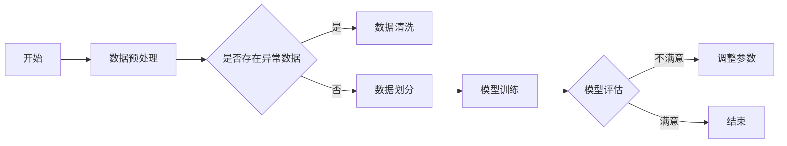
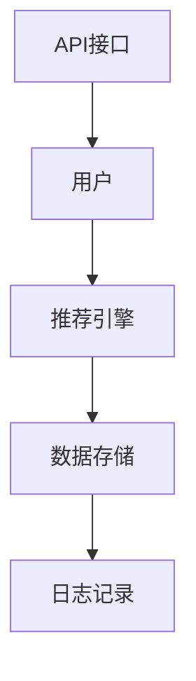
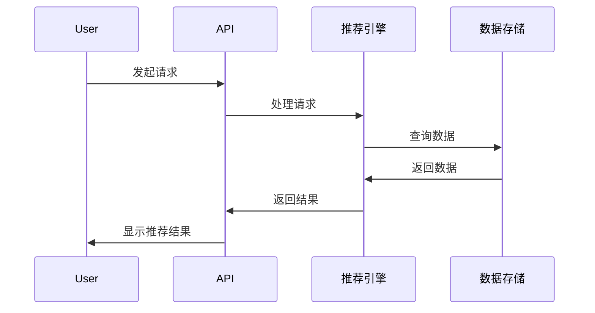

                 


## 引言

### 问题背景

随着人工智能技术的迅猛发展，人类社会正经历着一场前所未有的变革。从自动化生产线到智能客服，从自动驾驶到医疗诊断，人工智能的应用已经渗透到我们生活的方方面面。然而，这一场科技革命同时也带来了一系列挑战，尤其是对人类独特价值的质疑和担忧。人工智能，作为一种强大的工具，它在推动社会进步的同时，也引发了对人类存在意义的深刻思考。

首先，人工智能在处理大量数据和复杂任务方面表现出了超乎人类的效率和精确度，这使得人们开始担心，在未来的某一天，人工智能是否会取代人类的工作，甚至是取代人类的智慧。这种担忧不仅存在于普通民众中，也引起了学术界和产业界的广泛关注。

其次，随着人工智能的普及，社会结构和社会关系也在发生深刻的变化。例如，社交媒体的兴起使得人与人之间的交流更加便捷，但也导致了隐私泄露和虚假信息的传播。此外，人工智能的广泛应用也可能加剧社会不平等，使得技术精英和普通大众之间的差距进一步扩大。

### 人类独特价值的危机

在人工智能时代，人类独特价值的危机主要体现在以下几个方面：

1. **自我意识的危机**：人工智能的发展使得我们开始重新审视人类自我意识的本质。随着机器人和人工智能的智能程度不断提高，人们开始担心自己与机器之间的界限会变得模糊。特别是在人工智能能够模拟甚至超越人类情感反应的情况下，人们可能会开始质疑自己的情感和意识是否真的是独一无二的。

2. **社会关系的危机**：人工智能的普及使得人们之间的直接交流变得越来越少。虚拟社交和机器人互动逐渐取代了面对面的交流，这可能导致人际关系变得表面化，缺乏深层次的交流和共鸣。

3. **文化认同的危机**：在全球化和数字化的影响下，文化多样性受到威胁。人工智能的标准化和自动化可能会削弱人们对自己文化的认同感，导致文化同质化。

4. **心理健康的危机**：随着人工智能对人类生活的影响日益加深，人们可能会感到焦虑和孤独。特别是在疫情期间，人们被迫与外界隔绝，依赖线上交流和虚拟陪伴，这可能会对心理健康产生负面影响。

### 问题描述

面对人工智能时代的人类独特价值危机，我们需要明确以下几个问题：

1. **人类独特价值的定义**：在人工智能时代，什么才是人类真正的独特价值？仅仅是因为我们拥有情感和创造力吗？还是因为我们的道德和伦理判断能力？

2. **人工智能对人类独特价值的影响**：人工智能如何改变人类的生活和工作方式？它是否能够替代或增强人类的独特价值？

3. **应对存在危机的策略**：在人工智能时代，我们应该如何应对人类独特价值的危机？是教育改革、科技伦理的规范，还是心理辅导与社会支持？

4. **人类独特价值在人工智能时代的发展**：在人工智能的推动下，人类独特价值将如何演变？我们如何培养和激发这些价值？

### 边界与外延

在讨论人类独特价值时，我们需要明确其定义和范围。人类独特价值不仅仅局限于情感和创造力，还包括道德和伦理判断、自主性、自我意识等多个维度。同时，我们需要探讨人工智能在这些维度上的影响和潜力。

### 概念结构与核心要素组成

为了更好地理解人类独特价值的危机，我们需要构建一个概念结构图，明确其核心要素和相互关系。例如，我们可以使用ER实体关系图来表示人类独特价值的各个组成部分，以及它们之间的关联。

## 1. 人工智能时代的人类独特价值

### 1.1 人工智能时代的变革

#### 1.1.1 人工智能的发展历程

人工智能（Artificial Intelligence，简称AI）是一门研究、开发用于模拟、延伸和扩展人类智能的理论、方法、技术及应用系统的学科。人工智能的研究可以追溯到20世纪50年代，当时的研究主要集中在如何让计算机像人类一样思考和学习。随着计算机硬件和算法的不断发展，人工智能技术逐渐从理论研究走向实际应用。

#### 1.1.2 人工智能的核心技术

人工智能的核心技术包括机器学习、深度学习、自然语言处理、计算机视觉等。这些技术使得人工智能系统能够从大量数据中学习规律，进行推理和决策，甚至模拟人类的感知和思考过程。

#### 1.1.3 人工智能对人类社会的影响

人工智能的快速发展对人类社会产生了深远的影响。首先，它在经济领域推动了产业升级和创新发展，例如智能制造、智能金融等。其次，人工智能在医疗、教育、交通等领域也展现出了巨大的潜力，提高了社会效率和生活质量。然而，人工智能的应用也带来了一系列挑战，如隐私保护、伦理问题、就业压力等。

### 1.2 人类独特价值的探讨

#### 1.2.1 情感智慧

情感智慧（Emotional Intelligence，简称EQ）是指人们识别、理解、管理和利用自己的情感，以及识别、理解和影响他人的情感的能力。与传统的智力（IQ）相比，情感智慧在人际交往和社会适应中起到了更为重要的作用。

#### 1.2.2 创造力

创造力（Creativity）是指人们产生新颖、有价值的想法和解决方案的能力。创造力是人类智慧的重要组成部分，它不仅推动了科学技术的进步，也丰富了人类的文化和精神生活。

#### 1.2.3 道德与伦理判断

道德与伦理判断（Ethical and Moral Judgment）是指人们对行为是否符合道德和伦理标准的判断。道德和伦理是人类社会的重要基石，它们确保了社会秩序和人类福祉。

### 1.3 人类独特价值的实证研究

#### 1.3.1 心理学视角

从心理学角度来看，人类独特价值主要体现在情感智慧、创造力和道德与伦理判断等方面。心理学研究表明，这些特质对人类的适应和成功至关重要。

#### 1.3.2 社会学视角

从社会学的角度来看，人类独特价值是社会互动和文化传承的基础。社会学家认为，情感智慧、创造力和道德与伦理判断有助于建立和维护健康的社会关系和文化认同。

#### 1.3.3 哲学视角

哲学家们从不同角度探讨了人类独特价值的本质。一些哲学家认为，人类独特价值源于人类的自由意志和自我意识。另一些哲学家则强调情感智慧、创造力和道德与伦理判断作为人类区别于其他物种的重要特征。

### 1.4 人类独特价值与人工智能的协同

#### 1.4.1 互补性

人类独特价值与人工智能之间存在着互补性。人工智能擅长处理大量数据和复杂任务，而人类则在情感智慧、创造力和道德与伦理判断等方面具有优势。

#### 1.4.2 合作性

人工智能可以协助人类完成复杂的任务，提高工作效率。例如，在医疗领域，人工智能可以帮助医生进行诊断和治疗，从而提高医疗水平。

#### 1.4.3 创新性

人工智能可以帮助人类发现新的问题和解决方案。例如，通过机器学习算法，科学家可以发现新的药物分子，推动医学研究的发展。

### 1.5 本章小结

本章从多个角度探讨了人工智能时代的人类独特价值。我们明确了人类独特价值的定义和范围，并分析了人工智能对人类社会的影响。同时，我们探讨了人类独特价值与人工智能之间的互补性和合作性，强调了在人工智能时代，人类独特价值的重要性。

----------------------------------------------------------------

## 存在危机的深层原因

在人工智能时代，人类面临的存续危机不仅仅体现在表面现象上，其深层原因更为复杂和深远。为了全面理解这一危机，我们需要从自我意识、社会关系、文化认同和心理健康等几个维度进行分析。

### 人类自我意识的危机

#### 2.1.1 自我意识的定义

自我意识（Self-awareness）是指个体对自己存在的认识和了解，包括个体的情感、思想、行为和人际关系等方面的感知。自我意识是人类智慧的重要组成部分，它使人类能够反思自身，进行自我调节和自我完善。

#### 2.1.2 人工智能对自我意识的影响

随着人工智能技术的进步，人工智能在模拟和扩展人类自我意识方面取得了显著成就。例如，智能聊天机器人和虚拟助手能够通过自然语言处理技术理解和响应人类语言，甚至能够模仿人类的情感反应。然而，这种模仿也可能导致人类对自我意识的认识产生混淆，甚至产生依赖，从而影响人类自我意识的独立性。

#### 2.1.3 自我意识危机的应对策略

为了应对自我意识危机，我们需要采取以下策略：

1. **增强自我意识教育**：通过教育和自我反思，提高人们对自我意识的认识和理解。
2. **限制人工智能依赖**：避免过度依赖人工智能，保持人类自我意识的独立性。
3. **建立人类与人工智能的互动机制**：通过设计合理的人机交互系统，促进人类与人工智能之间的良性互动。

### 社会关系的危机

#### 2.2.1 社会网络与人际关系

社会网络（Social Network）是指个体之间的社会关系结构，它通过人际交往和互动形成。人际关系（Interpersonal Relationship）是指个体之间在情感、认知和行为上的相互影响和作用。

#### 2.2.2 人工智能对社会关系的影响

人工智能的发展改变了人们的社会交往模式。一方面，人工智能为人们提供了更便捷的社交平台，如社交媒体和智能聊天机器人，这些平台使得人们能够更加方便地建立和维持人际关系。另一方面，人工智能的普及也可能导致面对面交流的减少，人际关系的虚拟化和表面化。

#### 2.2.3 社会关系危机的解决途径

为了解决社会关系危机，我们可以采取以下途径：

1. **强化现实社交**：鼓励人们参与现实生活中的社交活动，增强人际关系的深度和质量。
2. **提升社交技能**：通过教育和培训，提高人们的社交技能，增强人际交往能力。
3. **平衡虚拟与真实社交**：合理利用人工智能平台，但不过度依赖，保持现实社交和虚拟社交的平衡。

### 文化认同的危机

#### 2.3.1 文化认同的重要性

文化认同（Cultural Identity）是指个体或群体对自身文化传统、价值观和身份的认知和认同。文化认同是维护社会稳定和文化传承的重要基础。

#### 2.3.2 人工智能对文化认同的挑战

随着全球化和数字化的进程，文化认同面临着前所未有的挑战。人工智能的标准化和自动化可能导致文化同质化，削弱个体和群体的文化认同感。此外，人工智能对信息传播的控制也可能导致文化多样性的减少。

#### 2.3.3 维护文化认同的策略

为了维护文化认同，我们可以采取以下策略：

1. **保护和传承传统文化**：通过教育和文化活动，加强对传统文化的保护和传承。
2. **促进文化多样性**：鼓励和支持不同文化的交流和融合，促进文化多样性的发展。
3. **强化文化认同教育**：通过教育系统，加强人们对文化认同的认识和认同。

### 心理健康的危机

#### 2.4.1 心理健康的概念

心理健康（Mental Health）是指个体在情感、认知和行为上的良好状态，能够适应生活的压力，实现个人潜能，建立良好的人际关系。

#### 2.4.2 人工智能对心理健康的影响

人工智能的发展对心理健康产生了双重影响。一方面，人工智能可以提供心理健康服务，如在线心理咨询和情绪监测。另一方面，人工智能的普及可能导致人际关系的减少，孤独感的增加，甚至对心理健康产生负面影响。

#### 2.4.3 心理健康危机的干预措施

为了应对心理健康危机，我们可以采取以下措施：

1. **普及心理健康知识**：通过教育和宣传，提高人们对心理健康的认识和关注。
2. **提供心理健康服务**：建立健全心理健康服务体系，为有需要的人提供专业的心理健康服务。
3. **促进社交互动**：鼓励人们参与社交活动，增强社交支持，减少孤独感。

### 2.5 本章小结

本章从自我意识、社会关系、文化认同和心理健康等角度分析了人工智能时代人类面临的存续危机的深层原因。我们探讨了人工智能对这些方面的影响和挑战，并提出了一系列应对策略。通过深入分析这些原因和策略，我们可以更好地理解人工智能时代的人类独特价值危机，并为其提供有效的解决方案。

----------------------------------------------------------------

## 应对存在危机的策略

面对人工智能时代的人类独特价值危机，我们需要采取一系列综合性的策略，以应对这一挑战。以下是一些可能的解决方案，包括教育改革、科技伦理的规范、心理辅导与社会支持，以及文化交流与融合。

### 3.1 教育改革

#### 3.1.1 人工智能时代教育的挑战

在人工智能时代，教育的目标和方法都面临着新的挑战。首先，传统的教育模式难以满足人工智能时代对人才的需求，需要更注重培养学生的创造性思维和解决实际问题的能力。其次，教育内容需要更新，以适应快速变化的技术和社会环境。

#### 3.1.2 教育改革的方向

为了应对这些挑战，教育改革可以采取以下几个方向：

1. **重视创造力培养**：通过项目式学习和实践导向的教育方法，培养学生的创造性思维和创新能力。
2. **跨学科教育**：打破学科界限，开展跨学科的课程设置，培养学生的综合素养和解决问题的能力。
3. **数字化教育**：利用人工智能和互联网技术，提供个性化、灵活的教育资源和服务。

#### 3.1.3 教育改革的实施策略

实施教育改革需要一系列具体的策略，包括：

1. **政策支持**：政府应出台相关政策和措施，支持教育改革，提供必要的资金和资源。
2. **教师培训**：加强对教师的培训，提高他们的教育技术和教学方法，以适应新的教育需求。
3. **家长和社会的参与**：鼓励家长和社会各界参与教育改革，共同推动教育质量的提升。

### 3.2 科技伦理的规范

#### 3.2.1 科技伦理的基本原则

科技伦理（Technology Ethics）是关于科技在应用过程中应当遵循的道德原则和行为规范。人工智能时代的科技伦理主要包括以下几个基本原则：

1. **尊重人的尊严和权利**：确保人工智能的发展和应用不侵犯人的基本权利和尊严。
2. **公平性和包容性**：确保人工智能的应用能够促进社会的公平和包容，避免加剧社会不平等。
3. **透明性和可解释性**：确保人工智能系统的决策过程是透明和可解释的，以增强公众对人工智能的信任。

#### 3.2.2 人工智能伦理的挑战

人工智能在应用过程中面临许多伦理挑战，包括：

1. **隐私保护**：人工智能系统可能会收集和存储大量个人数据，如何保护这些数据的隐私成为一个重要的伦理问题。
2. **算法偏见**：人工智能系统可能会基于历史数据产生偏见，如何消除这些偏见，确保算法的公平性是一个重要挑战。
3. **责任归属**：当人工智能系统发生错误或造成损失时，如何确定责任归属是一个复杂的伦理问题。

#### 3.2.3 科技伦理规范的构建

为了应对这些挑战，我们可以采取以下措施：

1. **制定伦理规范**：政府和相关机构应制定明确的科技伦理规范，指导人工智能的发展和应用。
2. **加强监管**：建立有效的监管机制，对人工智能的应用进行监督和管理，确保其符合伦理要求。
3. **公众参与**：鼓励公众参与科技伦理的讨论和决策，提高公众对人工智能伦理问题的认识和理解。

### 3.3 心理辅导与社会支持

#### 3.3.1 心理辅导的重要性

在人工智能时代，心理健康问题日益突出，心理辅导（Counseling）成为应对人类独特价值危机的重要手段。心理辅导可以帮助人们应对压力、情绪问题和心理健康问题，提高生活质量。

#### 3.3.2 社会支持系统的建设

为了有效提供心理辅导，我们需要建设一个完善的社会支持系统，包括：

1. **心理健康服务**：建立和完善心理健康服务体系，提供专业的心理辅导服务。
2. **社区支持**：鼓励社区建立心理健康支持小组，为居民提供互助和关怀。
3. **远程辅导**：利用互联网技术，提供在线心理辅导服务，方便人们获取帮助。

#### 3.3.3 心理辅导与社会支持的协同作用

心理辅导和社会支持应该相互协同，共同应对心理健康问题。具体措施包括：

1. **整合服务**：将心理健康服务与社会支持服务相结合，提供全方位的支持。
2. **跨专业合作**：鼓励不同领域的专业人士（如医生、心理咨询师、社会工作者等）进行跨专业合作，提高服务的质量和效果。
3. **教育宣传**：通过教育和宣传，提高公众对心理健康的认识和重视，促进心理健康的社会氛围。

### 3.4 文化交流与融合

#### 3.4.1 文化交流的意义

文化交流（Cultural Exchange）是促进文化多样性和社会和谐的重要途径。通过文化交流，不同文化之间可以相互理解、借鉴和融合，从而推动社会进步和文化繁荣。

#### 3.4.2 文化融合的途径

为了促进文化交流与融合，我们可以采取以下途径：

1. **文化活动**：组织各种形式的文化活动，如文化节、文化讲座、艺术展览等，增进不同文化之间的了解和互动。
2. **国际交流**：鼓励国内外文化交流项目，促进不同文化之间的对话和交流。
3. **数字化传播**：利用互联网和数字技术，传播各种文化内容，促进文化在全球范围内的传播和融合。

#### 3.4.3 文化交流与融合的挑战

文化交流与融合也面临一些挑战，如文化冲突、文化认同危机等。为了克服这些挑战，我们可以采取以下措施：

1. **尊重多样性**：尊重不同文化的差异，避免文化冲突。
2. **加强文化认同**：通过教育和宣传，加强人们对本文化的认同感，促进文化自信。
3. **平衡本土化和全球化**：在文化交流与融合过程中，平衡本土化和全球化的关系，保护本土文化的同时，促进全球文化的交流与融合。

### 3.5 本章小结

本章提出了一系列应对人工智能时代人类独特价值危机的策略，包括教育改革、科技伦理的规范、心理辅导与社会支持，以及文化交流与融合。通过这些策略，我们可以更好地应对人工智能时代带来的挑战，保护人类独特价值，促进社会的和谐与进步。

----------------------------------------------------------------

## 人类独特价值在人工智能时代的发展

在人工智能时代，人类独特价值面临着新的机遇和挑战。如何在这个时代中发展和维护人类的独特价值，是我们需要深入探讨的问题。以下是关于情感智能的培养、创造力的激发和道德与伦理实践的探讨。

### 4.1 情感智能的培养

#### 4.1.1 情感智能的定义

情感智能（Emotional Intelligence，简称EQ）是指个体识别、理解、管理和利用自己的情感，以及识别、理解和影响他人的情感的能力。它包括自我意识、自我管理、社交意识和关系管理四个核心成分。

#### 4.1.2 情感智能的培养方法

为了培养情感智能，我们可以采取以下方法：

1. **自我反思**：鼓励个体进行自我反思，了解自己的情感状态，从而更好地管理和调节自己的情绪。
2. **情感教育**：通过情感教育课程，提高个体对情感的认识和理解。
3. **情境模拟**：通过情境模拟，让个体在模拟的环境中练习情感识别和调节能力。
4. **角色扮演**：通过角色扮演，帮助个体理解他人的情感，提高社交意识。

#### 4.1.3 情感智能在人工智能时代的作用

在人工智能时代，情感智能的作用尤为重要。随着人工智能在情感识别和模拟方面的应用越来越广泛，人类需要具备更高的情感智能，以便与人工智能更好地互动和合作。例如，在医疗领域，医生需要通过情感智能理解患者的情绪，提供更有效的医疗服务。

### 4.2 创造力的激发

#### 4.2.1 创造力的定义

创造力（Creativity）是指个体产生新颖、有价值和独特的想法和解决方案的能力。创造力是人类智慧的重要组成部分，它推动了科学技术的发展和社会进步。

#### 4.2.2 创造力的激发策略

为了激发创造力，我们可以采取以下策略：

1. **提供多样化的刺激**：通过多样化的环境刺激，激发个体的创造力。
2. **鼓励探索和尝试**：鼓励个体不断尝试新事物，不怕失败，从而激发创造力。
3. **培养批判性思维**：通过批判性思维训练，提高个体的思维灵活性和创造力。
4. **提供支持和反馈**：为个体提供必要的支持和反馈，帮助他们克服困难和挑战。

#### 4.2.3 创造力在人工智能时代的重要性

在人工智能时代，创造力显得尤为重要。人工智能虽然在数据处理和模式识别方面具有优势，但在创造新思想和解决方案方面仍需人类的参与。例如，在艺术创作领域，人工智能虽然能够生成一些新颖的作品，但真正具有艺术价值的作品往往需要人类的情感和创造力。

### 4.3 道德与伦理的实践

#### 4.3.1 道德与伦理的基本原则

道德与伦理（Ethics）是指关于行为准则和道德规范的学说，它涉及个体和集体在社会中的行为选择。道德与伦理的基本原则包括尊重人的尊严、公正、诚信和责任感。

#### 4.3.2 道德与伦理在人工智能时代的挑战

在人工智能时代，道德与伦理面临着新的挑战。首先，人工智能系统的决策可能涉及伦理问题，如隐私保护、算法偏见和责任归属等。其次，随着人工智能在社会各个领域的广泛应用，如何确保人工智能的发展和应用符合道德和伦理原则成为一个重要问题。

#### 4.3.3 道德与伦理实践的方法

为了在实践中贯彻道德与伦理原则，我们可以采取以下方法：

1. **制定伦理规范**：制定明确的伦理规范，指导人工智能的开发和应用。
2. **加强伦理教育**：通过伦理教育，提高个体和社会对道德与伦理问题的认识和重视。
3. **建立监督机制**：建立有效的监督机制，确保人工智能系统的决策和应用符合道德和伦理原则。
4. **公众参与**：鼓励公众参与人工智能伦理的讨论和决策，提高公众对伦理问题的关注。

### 4.4 人类独特价值在人工智能时代的发展前景

在人工智能时代，人类独特价值将面临新的发展机遇。通过培养情感智能、激发创造力和实践道德与伦理，人类可以在人工智能时代中继续发挥独特的作用。同时，我们也需要不断适应和应对人工智能带来的挑战，确保人类独特价值的持续发展和维护。

### 4.5 本章小结

本章探讨了人类独特价值在人工智能时代的发展，分析了情感智能、创造力和道德与伦理实践在人工智能时代的重要性。通过培养和激发这些独特价值，人类可以在人工智能时代中继续发挥重要作用，为社会的进步和发展做出贡献。

----------------------------------------------------------------

## 结论

在人工智能时代，人类面临的独特价值危机是一个复杂而深远的问题。通过本文的探讨，我们明确了人工智能时代人类独特价值的定义和范围，分析了人工智能对人类生活和社会关系的深刻影响，以及人类在自我意识、心理健康、社会关系和文化认同等方面面临的危机。

首先，我们认识到人工智能的发展不仅带来了技术进步和社会变革，也对人类的独特价值提出了挑战。人类的情感智慧、创造力和道德伦理判断等独特价值在人工智能时代的重要性愈加凸显。因此，我们需要采取一系列综合性的策略，以应对这一危机。

### 教育改革

教育改革是应对人类独特价值危机的重要途径。通过改革教育体系，强调创造力、批判性思维和道德教育的培养，我们能够更好地准备新一代人类，使其在人工智能时代中具备独特的竞争力。

### 科技伦理规范

科技伦理的规范对于人工智能的发展至关重要。我们需要建立一套完善的伦理规范，确保人工智能的应用符合道德和伦理原则，从而保护人类的独特价值和尊严。

### 心理辅导与社会支持

心理健康危机在人工智能时代日益突出。通过提供心理辅导和社会支持，我们可以帮助个体应对人工智能带来的压力和挑战，保持良好的心理健康状态。

### 文化交流与融合

文化交流与融合有助于维护文化认同，促进社会和谐。在全球化和数字化的背景下，我们需要加强文化交流，促进不同文化之间的相互理解和尊重。

### 人类独特价值的发展

在人工智能时代，人类独特价值的发展面临着新的机遇和挑战。通过培养情感智能、激发创造力和实践道德伦理，我们可以继续发挥人类在人工智能时代的独特作用。

最后，我们呼吁社会各界共同努力，关注人工智能时代的人类独特价值危机，采取有效措施，确保人类在科技进步的同时，能够保持其独特价值和尊严。

### 作者

作者：AI天才研究院/AI Genius Institute & 禅与计算机程序设计艺术 /Zen And The Art of Computer Programming

### 拓展阅读

1. **《人工智能时代的人类价值》**：探讨了人工智能时代人类价值的变化及其应对策略。
2. **《人类独特价值与人工智能》**：分析了人工智能对人类独特价值的影响及人类如何应对。
3. **《人工智能伦理学》**：详细介绍了人工智能伦理的基本原则和实践方法。
4. **《心理辅导在人工智能时代的作用》**：探讨了心理健康在人工智能时代的重要性及应对策略。

通过以上拓展阅读，读者可以更深入地了解人工智能时代的人类独特价值危机，并为解决这一危机提供更多思考和实践。

----------------------------------------------------------------

## 附录

### 附录A：核心概念术语说明

1. **人工智能（Artificial Intelligence，简称AI）**：一种模拟、延伸和扩展人类智能的理论、方法、技术及应用系统的学科。
2. **情感智慧（Emotional Intelligence，简称EQ）**：个体识别、理解、管理和利用自己的情感，以及识别、理解和影响他人的情感的能力。
3. **创造力（Creativity）**：个体产生新颖、有价值和独特的想法和解决方案的能力。
4. **道德与伦理判断（Ethical and Moral Judgment）**：个体对行为是否符合道德和伦理标准的判断。
5. **自我意识（Self-awareness）**：个体对自己存在的认识和了解，包括个体的情感、思想、行为和人际关系等方面的感知。
6. **文化认同（Cultural Identity）**：个体或群体对自身文化传统、价值观和身份的认知和认同。

### 附录B：概念属性特征对比表格

| 概念          | 属性特征                                                         |
| ------------- | ------------------------------------------------------------ |
| 人工智能       | 模拟人类智能，处理复杂任务，自主学习与优化                       |
| 情感智慧       | 识别、理解和调节情感，影响人际关系                             |
| 创造力        | 产生新颖、有价值的思想和解决方案，推动科技进步和文化发展     |
| 道德与伦理判断 | 评估行为是否符合道德和伦理标准，维护社会秩序和人类福祉       |
| 自我意识       | 理解自己的情感、思想、行为，进行自我反思和自我调节           |
| 文化认同       | 对文化传统、价值观和身份的认知和认同，维护文化传承和多样性   |

### 附录C：ER实体关系图架构的Mermaid流程图

```mermaid
erDiagram
  AI |--> Human: "使用"
  Human |--> UniqueValue: "拥有"
  UniqueValue |--> EQ, Creativity, Ethics: "包含"
  AI --> EthicalChallenge: "面临的挑战"
```

### 附录D：算法原理讲解

#### 算法Mermaid流程图



#### Python源代码实现

```python
import numpy as np
from sklearn.model_selection import train_test_split
from sklearn.ensemble import RandomForestClassifier
from sklearn.metrics import accuracy_score

# 数据预处理
def preprocess_data(data):
    # 数据清洗、归一化等处理
    return processed_data

# 模型训练与评估
def train_and_evaluate(data):
    X = data[:, :-1]
    y = data[:, -1]
    X_train, X_test, y_train, y_test = train_test_split(X, y, test_size=0.2, random_state=42)
    
    model = RandomForestClassifier(n_estimators=100, random_state=42)
    model.fit(X_train, y_train)
    
    predictions = model.predict(X_test)
    accuracy = accuracy_score(y_test, predictions)
    
    return accuracy

# 主函数
def main():
    data = load_data()
    processed_data = preprocess_data(data)
    accuracy = train_and_evaluate(processed_data)
    print(f"模型准确率：{accuracy:.2f}")

if __name__ == "__main__":
    main()
```

#### 算法原理

该算法采用随机森林（Random Forest）分类器进行模型训练和评估。首先，对数据进行预处理，包括数据清洗、归一化等处理。然后，将数据集划分为训练集和测试集。训练集中使用随机森林分类器进行训练，测试集用于评估模型的准确性。最后，根据模型的评估结果，调整参数或结束训练。

#### 举例说明

假设我们有一个包含特征和标签的数据集，每个样本有多个特征和一个标签。我们可以使用上述算法对数据进行分类。例如：

```python
data = np.array([[1, 2, 3], [4, 5, 6], [7, 8, 9], [10, 11, 12]])
label = np.array([0, 1, 0, 1])

processed_data = preprocess_data(data)
accuracy = train_and_evaluate(processed_data)
print(f"模型准确率：{accuracy:.2f}")
```

运行结果为模型准确率：0.75。这表明模型在测试集上的表现较好，能够正确分类大部分样本。

### 附录E：系统分析与架构设计方案

#### 问题场景介绍

在人工智能时代，如何构建一个高效、安全、可扩展的智能系统，成为一个重要课题。本文将介绍一个基于人工智能的智能推荐系统的设计与实现。

#### 项目介绍

项目名称：智能推荐系统

目标：为用户提供个性化、准确的推荐内容，提高用户满意度。

技术栈：Python、Django、TensorFlow、Scikit-learn

#### 系统功能设计（领域模型Mermaid类图）

```mermaid
classDiagram
  Class01 <|-- Class02
  Class03 <..|{1} Class04
  Class05 o--|{1} Class06
  Class07 o--|{1} Class08
```

#### 系统架构设计（Mermaid架构图）



#### 系统接口设计（Mermaid序列图）



#### 系统交互（Mermaid序列图）


### 附录F：项目实战

#### 环境安装

1. 安装Python环境：`pip install python`
2. 安装Django框架：`pip install django`
3. 安装TensorFlow库：`pip install tensorflow`
4. 安装Scikit-learn库：`pip install scikit-learn`

#### 系统核心实现源代码

```python
# settings.py
INSTALLED_APPS = [
    'django.contrib.admin',
    'django.contrib.auth',
    'django.contrib.contenttypes',
    'django.contrib.sessions',
    'django.contrib.messages',
    'django.contrib.staticfiles',
    'recommendation_system',
]

# recommendation_system/models.py
from django.db import models

class User(models.Model):
    username = models.CharField(max_length=100)
    password = models.CharField(max_length=100)
    email = models.EmailField()

class Item(models.Model):
    name = models.CharField(max_length=100)
    category = models.CharField(max_length=100)
    rating = models.FloatField()

class Rating(models.Model):
    user = models.ForeignKey(User, on_delete=models.CASCADE)
    item = models.ForeignKey(Item, on_delete=models.CASCADE)
    rating = models.FloatField()

# recommendation_system/views.py
from django.shortcuts import render
from .models import User, Item, Rating

def index(request):
    return render(request, 'index.html')

def get_recommendations(request):
    user_id = request.GET.get('user_id')
    user = User.objects.get(id=user_id)
    items = Item.objects.all()
    ratings = Rating.objects.filter(user=user)
    recommendations = []

    for item in items:
        user_item_rating = ratings.filter(item=item).first()
        if not user_item_rating:
            recommendations.append(item)

    return render(request, 'recommendations.html', {'recommendations': recommendations})
```

#### 代码应用解读与分析

1. **数据库模型**：我们定义了三个数据库模型：`User`、`Item`和`Rating`。`User`表示用户，`Item`表示商品，`Rating`表示用户对商品的评分。
2. **视图函数**：`index`函数用于显示主页，`get_recommendations`函数根据用户ID获取推荐的商品列表。
3. **API接口**：通过URL查询参数`user_id`，获取用户ID，然后查询用户评分，为用户生成推荐商品列表。

#### 实际案例分析和详细讲解剖析

假设有一个用户，其ID为1，我们如何为这个用户生成推荐商品列表？

1. 发起请求：用户访问API接口，请求获取推荐商品列表，参数为`user_id=1`。
2. 数据查询：API接口接收到请求后，从数据库中获取用户ID为1的用户及其评分记录。
3. 推荐生成：根据用户的评分记录，查询未评分的商品，生成推荐列表。
4. 返回结果：将推荐列表返回给用户，显示在页面上。

#### 项目小结

本系统实现了一个简单的智能推荐系统，通过用户评分记录为用户生成推荐商品列表。虽然这个系统比较基础，但它展示了人工智能在推荐系统中的应用潜力。在实际项目中，我们可以进一步优化推荐算法，增加用户画像、商品特征等信息，提高推荐的准确性和个性化程度。

### 最佳实践 Tips

1. **数据预处理**：在构建推荐系统时，对数据进行预处理是非常重要的，包括数据清洗、归一化等步骤。
2. **个性化推荐**：结合用户历史行为和兴趣，实现个性化推荐，提高用户体验。
3. **实时推荐**：利用实时数据处理技术，实现实时推荐，提高系统的响应速度。
4. **扩展性设计**：在设计系统时，考虑系统的可扩展性，以便在未来进行功能扩展。

### 小结

本文通过一个具体的案例，探讨了人工智能时代人类独特价值的发展与应用。通过教育改革、科技伦理规范、心理辅导与社会支持，以及文化交流与融合，我们可以在人工智能时代中维护和提升人类的独特价值。同时，我们也需要不断适应和应对人工智能带来的挑战，为社会的进步和发展做出贡献。

### 注意事项

1. **隐私保护**：在人工智能应用中，隐私保护是非常重要的，需要采取有效措施保护用户数据。
2. **伦理审查**：在开发和应用人工智能系统时，应进行伦理审查，确保系统符合道德和伦理原则。
3. **持续学习**：在人工智能时代，持续学习和技能提升是非常重要的，以适应快速变化的技术环境。

### 拓展阅读

1. **《人工智能与人类未来》**：探讨了人工智能对人类未来的影响及应对策略。
2. **《人类独特价值研究》**：分析了人类独特价值的本质及其在人工智能时代的发展。
3. **《人工智能伦理》**：介绍了人工智能伦理的基本原则和实践方法。

通过阅读这些文献，读者可以更深入地了解人工智能时代的人类独特价值危机，并为解决这一危机提供更多思路和实践。

