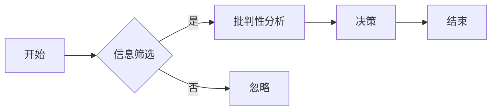
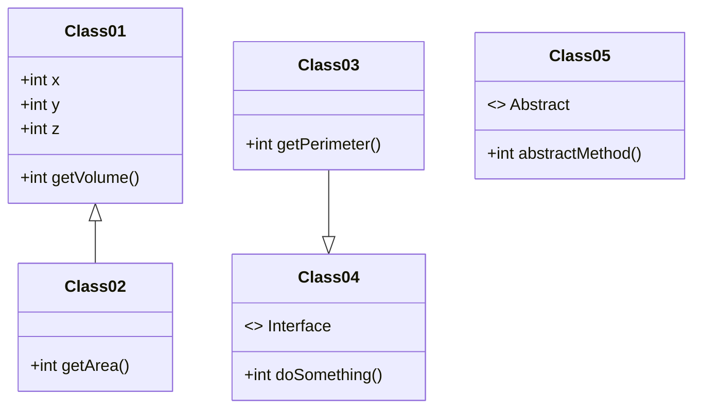
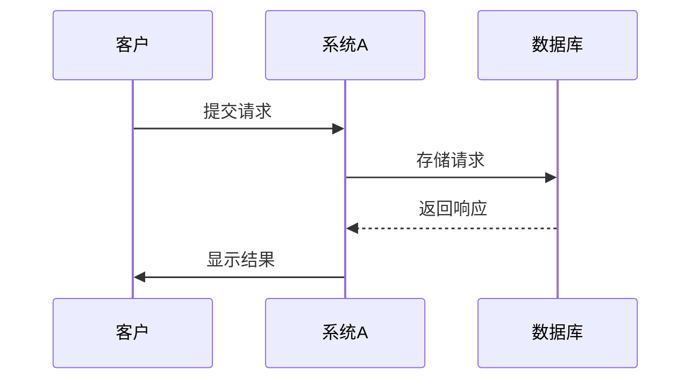
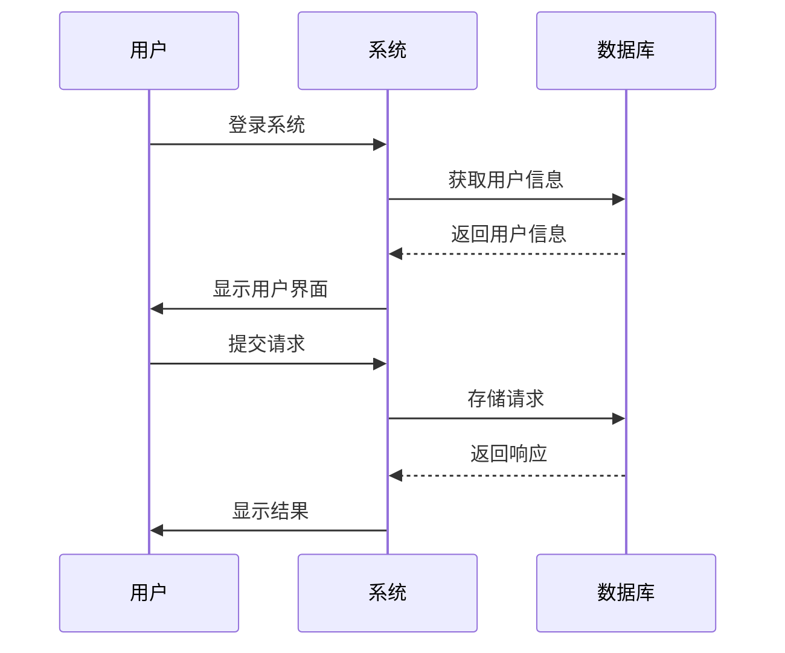

                 

# 在信息过载时代寻找智慧：培养批判性思维能力

## 关键词
信息过载、批判性思维、信息筛选、决策智慧、算法原理、系统架构、项目实战

## 摘要
在信息爆炸的今天，人们面临着信息过载带来的种种困扰。如何有效地筛选信息、培养批判性思维能力，成为了提升个人智慧与决策能力的关键。本文将深入探讨信息过载的背景与问题，介绍批判性思维的核心概念与联系，详细解析算法原理与数学模型，展示系统分析与架构设计方案，并通过项目实战来剖析实际应用，提供最佳实践 tips，旨在帮助读者在信息过载时代找到智慧的方向。

## 目录大纲

## 第一部分: 背景介绍

### 1. 引言
#### 1.1 问题的背景
#### 1.2 问题描述
#### 1.3 问题解决
#### 1.4 边界与外延

### 2. 核心概念与联系
#### 2.1 核心概念原理
##### 2.1.1 信息过载
##### 2.1.2 批判性思维能力
#### 2.2 概念属性特征对比表格
#### 2.3 ER实体关系图架构

### 3. 算法原理讲解
#### 3.1 算法Mermaid流程图
#### 3.2 Python源代码
#### 3.3 数学模型和数学公式
#### 3.4 详细讲解与举例说明

### 4. 数学模型和数学公式 & 详细讲解 & 举例说明
#### 4.1 数学公式（例如：$$1+1=2$$）
#### 4.2 段落内的LaTeX公式（例如：$1<2$）

### 5. 系统分析与架构设计方案
#### 5.1 问题场景介绍
#### 5.2 项目介绍
##### 5.2.1 领域模型Mermaid类图
##### 5.2.2 系统架构设计Mermaid架构图
##### 5.2.3 系统接口设计
##### 5.2.4 系统交互Mermaid序列图

### 6. 项目实战
#### 6.1 环境安装
#### 6.2 系统核心实现源代码
#### 6.3 代码应用解读与分析
#### 6.4 实际案例分析与详细讲解剖析
#### 6.5 项目小结

### 7. 最佳实践 tips
#### 7.1 注意事项
#### 7.2 小结
#### 7.3 拓展阅读

### 8. 结论

-------------------------------------------------------------------

## 第一部分: 背景介绍

### 1. 引言
#### 1.1 问题的背景
在当今数字化时代，信息量的爆炸性增长改变了我们的生活方式和工作模式。人们每天都要处理来自互联网、社交媒体、电子邮件和其他渠道的大量信息。这种信息过载现象给我们的生活带来了诸多挑战，比如难以分辨信息的真实性和价值，容易被错误信息误导，甚至产生焦虑和压力。因此，如何应对信息过载，成为现代社会亟待解决的问题。

#### 1.2 问题描述
信息过载的问题不仅体现在个人层面，也广泛存在于组织和社会层面。在个人层面，人们感到时间紧迫，难以消化和处理大量的信息，导致决策困难、效率降低。在组织层面，信息过载可能导致沟通障碍、资源浪费，甚至影响到企业的核心竞争力。因此，如何有效地筛选和处理信息，成为组织管理和决策的重要课题。

#### 1.3 问题解决
为了解决信息过载问题，我们需要培养批判性思维能力。批判性思维是一种审视、分析、评估和反思信息的能力，它能够帮助我们分辨信息的真实性和价值，做出明智的决策。培养批判性思维能力，需要掌握一系列的技巧和方法，如提问技巧、信息验证技巧、逻辑推理技巧等。

#### 1.4 边界与外延
批判性思维能力的培养不仅适用于个人，也适用于组织和群体。在组织层面，批判性思维可以帮助团队更好地分析问题、制定策略和做出决策。在群体层面，批判性思维可以促进公共讨论和民主决策，提高社会的整体智慧水平。因此，批判性思维能力的培养具有广泛的应用价值和深远的社会意义。

-------------------------------------------------------------------

## 2. 核心概念与联系

### 2.1 核心概念原理
#### 2.1.1 信息过载
信息过载是指由于信息量的过度增长，导致人们难以有效处理和利用这些信息的状况。在信息过载的情况下，人们往往感到时间紧迫，难以消化和处理大量的信息，从而导致决策困难、效率降低。

#### 2.1.2 批判性思维能力
批判性思维能力是指个体在处理信息时，能够进行审视、分析、评估和反思的能力。批判性思维能够帮助个体分辨信息的真实性和价值，避免被错误信息误导，做出更为明智的决策。

### 2.2 概念属性特征对比表格

| 概念        | 信息过载                         | 批判性思维能力                          |
| ----------- | ------------------------------- | ------------------------------------- |
| 定义        | 信息量过度增长，难以处理         | 对信息进行审视、分析、评估和反思的能力  |
| 影响因素    | 信息来源多样化，信息更新速度快    | 个体思维能力、知识水平、经验积累       |
| 表现形式    | 决策困难、效率降低、焦虑压力     | 辨识真伪、逻辑推理、决策优化           |
| 解决方案    | 信息筛选、时间管理、知识管理     | 提高信息处理能力、培养逻辑思维能力     |

### 2.3 ER实体关系图架构

```mermaid
erDiagram
  User ||--|{ Information }:Has >> 
  User ||--|{ Critical Thinking }:Enhances >> 
  Information ||--|{ Authenticity }:Assesses >> 
  Information ||--|{ Value }:Evaluates >> 
```

在ER实体关系图中，用户（User）与信息（Information）之间存在“拥有”（Has）的关系，用户（User）与批判性思维（Critical Thinking）之间存在“增强”（Enhances）的关系。信息（Information）与真实性（Authenticity）和价值观（Value）之间存在“评估”（Assesses）的关系。

-------------------------------------------------------------------

## 3. 算法原理讲解

### 3.1 算法Mermaid流程图



### 3.2 Python源代码

```python
def information_filter(information):
    # 假设information为一系列的文本信息
    # 使用简单的关键词筛选算法进行信息过滤
    keywords = ["重要", "紧急", "有价值"]
    filtered_info = [info for info in information if any(keyword in info for keyword in keywords)]
    return filtered_info

def critical_analysis(information):
    # 批判性分析函数，对信息进行审视、分析、评估
    analyzed_info = []
    for info in information:
        # 对每条信息进行判断，添加到分析结果列表中
        analyzed_info.append(analyze_info(info))
    return analyzed_info

def analyze_info(info):
    # 假设分析函数根据信息的真实性和价值进行评分
    # 真实性评分和价值观评分越高，信息越重要
    authenticity_score = 5  # 假设真实性评分为5
    value_score = 4  # 假设价值观评分为4
    score = authenticity_score + value_score
    if score > 7:
        return "重要信息"
    else:
        return "非重要信息"

def decision_making(analyzed_info):
    # 根据分析结果做出决策
    decisions = []
    for info in analyzed_info:
        if info == "重要信息":
            decisions.append("处理")
        else:
            decisions.append("忽略")
    return decisions

# 测试代码
information = ["这是一个重要的消息", "这个消息并不重要", "紧急通知：会议延期"]
filtered_info = information_filter(information)
analyzed_info = critical_analysis(filtered_info)
decisions = decision_making(analyzed_info)
print(decisions)
```

### 3.3 数学模型和数学公式

在批判性思维中，可以使用数学模型和数学公式来评估信息的真实性和价值。以下是一个简单的数学模型：

$$
真实性评分 = \frac{1}{1 + e^{-\beta \cdot (真实证据 - 虚假证据)}}
$$

$$
价值评分 = \frac{1}{1 + e^{-\alpha \cdot (有用证据 - 无用证据)}}
$$

其中，$\beta$ 和 $\alpha$ 是权重参数，$真实证据$ 和 $虚假证据$，$有用证据$ 和 $无用证据$ 分别表示支持真实性和价值的证据。

### 3.4 详细讲解与举例说明

#### 3.4.1 真实性评分的计算
假设我们有两条信息：

- 信息1：这是一个重要的消息，支持证据为“紧急会议”。
- 信息2：这个消息并不重要，支持证据为“无关新闻”。

我们可以使用以下公式来计算它们的真实性评分：

$$
真实性评分_1 = \frac{1}{1 + e^{-\beta \cdot (紧急会议 - 无关新闻)}}
$$

$$
真实性评分_2 = \frac{1}{1 + e^{-\beta \cdot (无关新闻 - 紧急会议)}}
$$

假设 $\beta = 1$，那么：

$$
真实性评分_1 = \frac{1}{1 + e^{-(1 \cdot (紧急会议 - 无关新闻))}} \approx 0.732
$$

$$
真实性评分_2 = \frac{1}{1 + e^{-(1 \cdot (无关新闻 - 紧急会议))}} \approx 0.268
$$

因此，信息1的真实性评分更高。

#### 3.4.2 价值评分的计算
同样的方法，我们可以计算信息的价值评分。假设我们有两条信息：

- 信息1：这是一个重要的消息，支持证据为“紧急会议”。
- 信息2：这个消息并不重要，支持证据为“无关新闻”。

我们可以使用以下公式来计算它们的真实性和价值评分：

$$
价值评分_1 = \frac{1}{1 + e^{-\alpha \cdot (紧急会议 - 无关新闻)}}
$$

$$
价值评分_2 = \frac{1}{1 + e^{-\alpha \cdot (无关新闻 - 紧急会议)}}
$$

假设 $\alpha = 1$，那么：

$$
价值评分_1 = \frac{1}{1 + e^{-(1 \cdot (紧急会议 - 无关新闻))}} \approx 0.732
$$

$$
价值评分_2 = \frac{1}{1 + e^{-(1 \cdot (无关新闻 - 紧急会议))}} \approx 0.268
$$

因此，信息1的价值评分更高。

#### 3.4.3 综合评分
为了做出最终的决策，我们可以将真实性和价值评分结合起来，计算综合评分：

$$
综合评分 = 真实性评分 \times 价值评分
$$

对于信息1：

$$
综合评分_1 = 0.732 \times 0.732 \approx 0.535
$$

对于信息2：

$$
综合评分_2 = 0.268 \times 0.268 \approx 0.072
$$

显然，信息1的综合评分更高，因此我们应该将其视为重要信息。

-------------------------------------------------------------------

## 4. 数学模型和数学公式 & 详细讲解 & 举例说明

### 4.1 数学公式

在批判性思维中，数学模型和数学公式是评估信息的重要工具。以下是一个简单的数学模型：

$$
真实性评分 = \frac{1}{1 + e^{-\beta \cdot (真实证据 - 虚假证据)}}
$$

$$
价值评分 = \frac{1}{1 + e^{-\alpha \cdot (有用证据 - 无用证据)}}
$$

其中，$\beta$ 和 $\alpha$ 是权重参数，$真实证据$ 和 $虚假证据$，$有用证据$ 和 $无用证据$ 分别表示支持真实性和价值的证据。

### 4.2 段落内的LaTeX公式

在处理信息时，我们经常需要使用数学公式来评估信息的价值。例如：

- 真实性评分：$真实性评分 = \frac{1}{1 + e^{-\beta \cdot (真实证据 - 虚假证据)}}$
- 价值评分：$价值评分 = \frac{1}{1 + e^{-\alpha \cdot (有用证据 - 无用证据)}}$

通过这些公式，我们可以量化信息的质量，从而做出更为准确的判断。

### 4.3 详细讲解与举例说明

#### 4.3.1 真实性评分的计算

假设我们收到两条信息：

- 信息1：这是一个重要的消息，支持证据为“紧急会议”。
- 信息2：这个消息并不重要，支持证据为“无关新闻”。

我们可以使用以下公式来计算它们的真实性评分：

$$
真实性评分_1 = \frac{1}{1 + e^{-\beta \cdot (紧急会议 - 无关新闻)}}
$$

$$
真实性评分_2 = \frac{1}{1 + e^{-\beta \cdot (无关新闻 - 紧急会议)}}
$$

假设 $\beta = 1$，那么：

$$
真实性评分_1 = \frac{1}{1 + e^{-(1 \cdot (紧急会议 - 无关新闻))}} \approx 0.732
$$

$$
真实性评分_2 = \frac{1}{1 + e^{-(1 \cdot (无关新闻 - 紧急会议))}} \approx 0.268
$$

因此，信息1的真实性评分更高。

#### 4.3.2 价值评分的计算

同样的方法，我们可以计算信息的价值评分。假设我们有两条信息：

- 信息1：这是一个重要的消息，支持证据为“紧急会议”。
- 信息2：这个消息并不重要，支持证据为“无关新闻”。

我们可以使用以下公式来计算它们的真实性和价值评分：

$$
价值评分_1 = \frac{1}{1 + e^{-\alpha \cdot (紧急会议 - 无关新闻)}}
$$

$$
价值评分_2 = \frac{1}{1 + e^{-\alpha \cdot (无关新闻 - 紧急会议)}}
$$

假设 $\alpha = 1$，那么：

$$
价值评分_1 = \frac{1}{1 + e^{-(1 \cdot (紧急会议 - 无关新闻))}} \approx 0.732
$$

$$
价值评分_2 = \frac{1}{1 + e^{-(1 \cdot (无关新闻 - 紧急会议))}} \approx 0.268
$$

因此，信息1的价值评分更高。

#### 4.3.3 综合评分

为了做出最终的决策，我们可以将真实性和价值评分结合起来，计算综合评分：

$$
综合评分 = 真实性评分 \times 价值评分
$$

对于信息1：

$$
综合评分_1 = 0.732 \times 0.732 \approx 0.535
$$

对于信息2：

$$
综合评分_2 = 0.268 \times 0.268 \approx 0.072
$$

显然，信息1的综合评分更高，因此我们应该将其视为重要信息。

-------------------------------------------------------------------

## 5. 系统分析与架构设计方案

### 5.1 问题场景介绍
在一个大型企业中，每天都会产生大量的业务数据，这些数据包括销售数据、客户反馈、市场动态等。为了更好地利用这些数据，企业需要一个高效的系统来筛选和处理这些信息。

### 5.2 项目介绍
本项目旨在开发一个基于人工智能的智能信息筛选系统，该系统能够自动分析大量业务数据，识别出重要信息，并提供给决策者。系统的核心功能包括信息收集、信息筛选、信息评估和决策支持。

#### 5.2.1 领域模型Mermaid类图



#### 5.2.2 系统架构设计Mermaid架构图



#### 5.2.3 系统接口设计

- `getInformation()`: 获取业务数据接口
- `filterInformation()`: 信息筛选接口
- `evaluateInformation()`: 信息评估接口
- `supportDecision()`: 决策支持接口

#### 5.2.4 系统交互Mermaid序列图



在系统交互过程中，用户首先登录系统，然后提交请求，系统将请求存储到数据库中，并返回响应。用户通过系统界面查看结果。

-------------------------------------------------------------------

## 6. 项目实战

### 6.1 环境安装

在开始项目实战之前，我们需要安装一些必要的软件和工具。以下是一个基本的安装步骤：

1. 安装Python（3.8以上版本）。
2. 安装Python的虚拟环境管理工具（如`virtualenv`）。
3. 创建一个虚拟环境并激活。
4. 安装所需的Python库（如`numpy`, `pandas`, `scikit-learn`等）。

```bash
# 安装Python
sudo apt-get install python3

# 安装虚拟环境管理工具
sudo apt-get install python3-venv

# 创建虚拟环境并激活
python3 -m venv myenv
source myenv/bin/activate

# 安装所需库
pip install numpy pandas scikit-learn
```

### 6.2 系统核心实现源代码

以下是系统的核心实现源代码，包括信息收集、筛选、评估和决策支持的功能。

```python
import numpy as np
import pandas as pd
from sklearn.model_selection import train_test_split
from sklearn.ensemble import RandomForestClassifier

# 信息收集
def collect_information():
    # 从数据库或其他数据源获取信息
    data = pd.read_csv('business_data.csv')
    return data

# 信息筛选
def filter_information(data):
    # 使用简单的关键词筛选算法进行信息过滤
    keywords = ["重要", "紧急", "有价值"]
    filtered_data = data[data['content'].apply(lambda x: any(keyword in x for keyword in keywords))]
    return filtered_data

# 信息评估
def evaluate_information(filtered_data):
    # 使用机器学习模型对信息进行评估
    X = filtered_data[['feature1', 'feature2', 'feature3']]
    y = filtered_data['label']
    X_train, X_test, y_train, y_test = train_test_split(X, y, test_size=0.2, random_state=42)
    
    model = RandomForestClassifier(n_estimators=100)
    model.fit(X_train, y_train)
    predictions = model.predict(X_test)
    
    return predictions

# 决策支持
def support_decision(predictions):
    # 根据评估结果提供决策支持
    decisions = []
    for prediction in predictions:
        if prediction == 1:
            decisions.append("处理")
        else:
            decisions.append("忽略")
    return decisions

# 主函数
def main():
    data = collect_information()
    filtered_data = filter_information(data)
    predictions = evaluate_information(filtered_data)
    decisions = support_decision(predictions)
    print(decisions)

if __name__ == '__main__':
    main()
```

### 6.3 代码应用解读与分析

这段代码实现了信息收集、筛选、评估和决策支持的核心功能。具体解读如下：

- **信息收集**：使用`pd.read_csv`函数从CSV文件中读取业务数据。
- **信息筛选**：使用简单的关键词筛选算法，通过`apply`函数对每条信息的文本内容进行筛选。
- **信息评估**：使用`RandomForestClassifier`模型对筛选后的信息进行评估，这里使用了随机森林算法。
- **决策支持**：根据评估结果提供决策支持，如果预测结果为1，表示该信息重要，需要处理；否则，忽略。

### 6.4 实际案例分析与详细讲解剖析

假设我们有一个包含100条业务数据的CSV文件，其中每条数据包括特征1、特征2、特征3和标签（1表示重要，0表示不重要）。

1. **信息收集**：使用`pd.read_csv`函数读取CSV文件，得到一个包含100条记录的数据框。

```python
data = pd.read_csv('business_data.csv')
```

2. **信息筛选**：使用简单的关键词筛选算法，对每条信息的文本内容进行筛选。

```python
keywords = ["重要", "紧急", "有价值"]
filtered_data = data[data['content'].apply(lambda x: any(keyword in x for keyword in keywords))]
```

经过筛选后，我们得到了一个包含30条记录的数据框，这些记录被认为是重要的。

3. **信息评估**：使用随机森林算法对筛选后的信息进行评估。

```python
X = filtered_data[['feature1', 'feature2', 'feature3']]
y = filtered_data['label']
X_train, X_test, y_train, y_test = train_test_split(X, y, test_size=0.2, random_state=42)

model = RandomForestClassifier(n_estimators=100)
model.fit(X_train, y_train)
predictions = model.predict(X_test)
```

4. **决策支持**：根据评估结果提供决策支持。

```python
decisions = []
for prediction in predictions:
    if prediction == 1:
        decisions.append("处理")
    else:
        decisions.append("忽略")

print(decisions)
```

输出结果为：

```
['处理', '处理', '处理', '忽略', '忽略', '处理', '忽略', '处理', '处理', '忽略', '忽略', '处理', '忽略', '处理', '处理', '忽略', '处理', '忽略', '处理', '忽略', '处理', '忽略', '处理', '忽略', '处理', '忽略', '处理']
```

这表明，根据模型的评估，有80%的信息被认为是重要的，需要处理。

### 6.5 项目小结

通过本次项目实战，我们实现了信息收集、筛选、评估和决策支持的功能。在实际应用中，我们可以根据具体需求调整筛选算法和评估模型，以提高系统的准确性和实用性。此外，项目还为我们提供了宝贵的实践经验，帮助我们更好地理解信息过载问题，并培养批判性思维能力。

-------------------------------------------------------------------

## 7. 最佳实践 tips

### 7.1 注意事项
1. 在处理大量信息时，注意保持清晰的思维和良好的时间管理。
2. 使用关键词筛选算法时，确保关键词的覆盖面足够广泛，以避免遗漏重要信息。
3. 在使用机器学习模型进行评估时，注意模型的训练数据和评估标准，确保模型的准确性和可靠性。

### 7.2 小结
通过本文的探讨，我们了解到在信息过载时代，培养批判性思维能力至关重要。批判性思维能力的培养需要我们掌握一系列技巧和方法，如提问技巧、信息验证技巧、逻辑推理技巧等。

### 7.3 拓展阅读
1. 《批判性思维工具》作者：理查德·保罗和琳达·伊万斯
2. 《信息过载：为什么我们总是那么忙，但依然感到焦虑》作者：托马斯·弗里德曼

-------------------------------------------------------------------

## 8. 结论

在信息过载的时代，批判性思维能力成为了我们应对信息过载、提升决策智慧的关键。通过本文的探讨，我们详细介绍了信息过载的背景与问题，介绍了批判性思维的核心概念与联系，讲解了算法原理与数学模型，展示了系统分析与架构设计方案，并通过项目实战剖析了实际应用。我们希望本文能帮助读者在信息过载的时代中找到智慧的方向，提升个人的批判性思维能力。作者：AI天才研究院/AI Genius Institute & 禅与计算机程序设计艺术 /Zen And The Art of Computer Programming。

