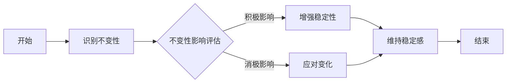
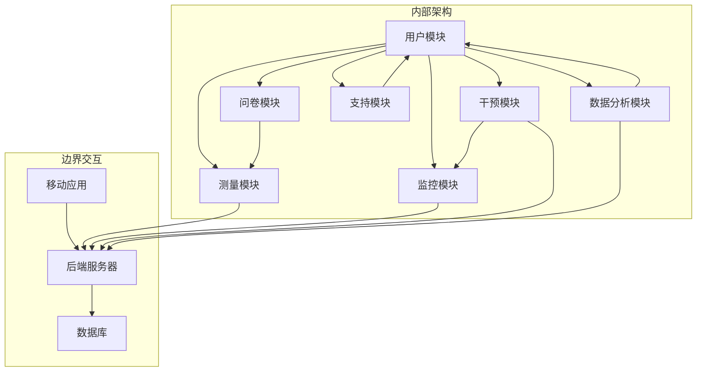
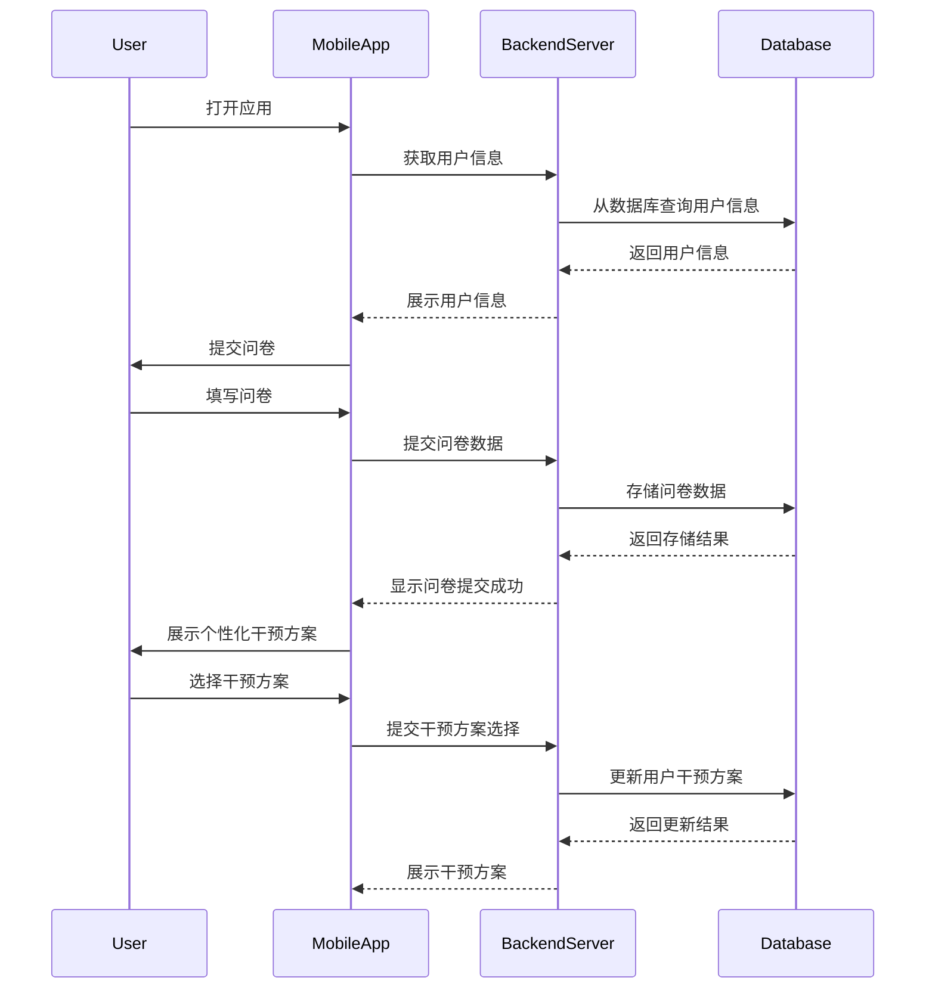

                 

### 第1章：问题背景与核心概念

#### 1.1 问题背景

在快速变化的时代背景下，我们的生活、工作和心理状态都面临着前所未有的挑战。现代社会的快速发展带来了技术革新、经济波动、信息爆炸等诸多变化，这些变化不仅影响着我们的物质世界，也对我们的内心世界产生了深远的影响。职业发展上的不确定性、人际关系中的矛盾冲突、以及心理压力的增加，都是现代社会中普遍存在的现象。在这样的背景下，人们如何维持内心的稳定感成为一个亟待解决的问题。

内心稳定感不仅仅是指个人在面对外界变化时的心理平衡，还涉及到社会层面和整体生活环境中的稳定。家庭关系的稳定、社会结构的稳定、以及文化价值观的稳定，都是构建内心稳定感的重要基石。然而，在快速变化的环境中，这些基石也面临着不同程度的挑战，例如婚姻关系的破裂、社会结构的重组、以及文化价值观的多元化，这些都可能对人们的内心稳定感造成冲击。

#### 1.2 核心概念原理

不变性是我们在变化中寻找内心稳定感的重要核心概念。不变性不仅仅是指物理世界中的某些特征在时间上的持续性，更多的是指在思想、道德、价值观等方面的恒定性。例如，无论社会如何变化，道德准则、社会正义、个人价值观等都是人们内心深处坚定认同的基本原则。

这些不变性在维持内心稳定感中扮演着关键角色。首先，不变性为我们提供了一个稳定的参照点，使我们能够在快速变化的环境中找到自己的定位。例如，在职业发展上，即使行业趋势和市场需求不断变化，我们仍然可以根据自己的核心价值观来做出选择，从而保持内心的平衡。

其次，不变性为我们提供了情感上的安全感。在人际关系中，即使外界环境变化无常，我们依然可以通过坚守不变的价值观念来建立稳固的关系。例如，诚实和信任作为不变的价值观念，可以帮助我们建立和维护长久的友谊。

此外，不变性还在心理层面上起到了调节作用。在面对压力和挑战时，我们可以通过回忆和坚持那些不变的价值观念来缓解焦虑和不安，从而维持内心的稳定感。

#### 1.3 概念属性特征对比表格

为了更好地理解稳定性和变化性的区别，我们可以通过一个概念属性特征对比表格来进行详细分析。

| 特征 | 稳定性 | 变变性 |
| :--: | :----: | :----: |
| 持续性 | 强 | 弱 |
| 参照点 | 明确 | 不明确 |
| 情感依赖 | 高 | 低 |
| 适应性 | 弱 | 强 |
| 可预测性 | 高 | 低 |
| 逻辑一致性 | 强 | 弱 |

从表格中可以看出，稳定性与变化性在多个方面存在显著差异。稳定性强调的是持久性和参照点的明确性，而变化性则更侧重于适应性和可预测性的较低程度。这些特征在维持内心稳定感中起着不同的作用，理解它们之间的差异有助于我们在面对快速变化时更好地应对。

#### 1.4 ER实体关系图架构

为了更直观地展示稳定性与变化性之间的关系，我们可以通过ER实体关系图来描述。

```mermaid
erDiagram
  PersonalStability ||--|{ EmotionalStability } : has
  SocialStability ||--|{ FamilyStability } : has
  SocialStability ||--|{ SocietalStability } : has
  EconomicStability ||--|{ PersonalStability } : has
  EnvironmentalStability ||--|{ SocialStability } : has
  ValueIntegrity ||--|{ MoralValues } : has
  ValueIntegrity ||--|{ PersonalValues } : has
  EmotionalStability }|--|| SocialStability
  EmotionalStability }|--|| EconomicStability
  EmotionalStability }|--|| EnvironmentalStability
```

在这个ER实体关系图中，`PersonalStability`（个人稳定性）与`EmotionalStability`（情感稳定性）之间有着紧密的联系，表明情感稳定是维持个人稳定性不可或缺的部分。`SocialStability`（社会稳定性）则与`FamilyStability`（家庭稳定性）和`SocietalStability`（社会稳定性）有着直接的关联，这些因素共同构成了社会层面的稳定性。同时，经济稳定性（`EconomicStability`）和环境稳定性（`EnvironmentalStability`）也对个人和社会的稳定性有着重要的影响。而`ValueIntegrity`（价值完整性）作为核心概念，贯穿于所有稳定性要素中，体现了不变性在维持稳定感中的关键作用。

通过这个ER图，我们可以更清晰地理解稳定性与变化性之间的复杂关系，从而更好地把握如何在快速变化中寻找内心的稳定感。在接下来的章节中，我们将深入探讨算法原理和系统架构设计，进一步解答这一核心问题。在下一部分，我们将详细探讨核心概念与联系，进一步理解不变性在维持内心稳定感中的作用。

## 第2章：核心概念与联系

### 2.1 核心概念原理

在维持内心稳定感的过程中，核心概念原理起着至关重要的作用。这些原理不仅为我们提供了理解变化中的不变性的理论框架，也为我们在实际行动中找到了保持内心平衡的路径。不变性在这里不仅仅是一种静态的存在，更是一种动态的平衡。

首先，我们需要明确不变性的核心概念。不变性通常指的是那些在时间和空间中持续存在的基本原则和价值观念，这些原则和价值观念在不同的环境和情境下都能够保持其核心意义。例如，道德原则、社会正义、个人价值观等，都是不变性的重要组成部分。

**道德原则**是社会中维持秩序和正义的基础。无论是古代的道德规范，还是现代的法律体系，道德原则都为人们的行为提供了基本的指导。例如，“诚实守信”不仅是一个道德要求，更是维护人际关系稳定的重要原则。

**社会正义**是衡量一个社会是否公平合理的重要标准。它涉及到资源分配、机会均等、公平待遇等方面。一个具有正义感的社会能够为个体提供稳定的成长环境，从而增强个人的内心稳定感。

**个人价值观**是每个人内心深处坚定相信并追求的基本原则。这些价值观可能是关于个人成长、生活目标、人际关系等方面的信念。例如，许多人认为“家庭和睦”是人生最重要的价值之一，他们会为了这个目标不断努力。

这些不变性在变化中发挥着关键作用。尽管外部环境和情境在不断变化，但通过坚持这些不变性，我们能够在变化中找到内心的平衡和稳定。例如，在职业发展上，即使市场需求和技术趋势不断变化，我们仍然可以通过坚守职业道德和价值观，找到自己的职业方向和定位。

### 2.2 概念属性特征对比表格

为了更直观地理解稳定性和变化性之间的区别，我们可以通过一个概念属性特征对比表格来进行详细分析。

| 特征 | 稳定性 | 变变性 |
| :--: | :----: | :----: |
| 定义 | 持续存在的基本原则和价值观念 | 随时间和环境变化而变化的特性 |
| 作用 | 维持内心平衡和社会秩序 | 促进创新和适应变化 |
| 影响范围 | 广泛，涉及个人、社会、文化等多个层面 | 较为局限，主要影响特定领域或情境 |
| 适应性 | 较低，强调持续性和稳定性 | 较高，强调灵活性和适应性 |
| 社会影响 | 促进社会稳定和道德建设 | 推动社会进步和变革 |
| 社会认可 | 高度认可，作为行为规范和社会准则 | 变动性大，受时间和环境影响 |

从表格中可以看出，稳定性和变化性在多个方面存在显著差异。稳定性强调的是持续存在的基本原则和价值观念，它在维持社会秩序和个人内心平衡中发挥着重要作用。而变化性则侧重于适应性和灵活性，它能够推动社会进步和创新。

理解这些概念属性特征有助于我们更好地把握内心稳定感的本质。在快速变化的环境中，我们不仅需要适应外部变化，更需要通过坚持不变的核心原则来维持内心的稳定感。例如，在职业发展中，我们可能会面临新的技术和市场需求，但通过坚守职业道德和个人价值观，我们能够找到自己的定位，从而保持内心的平衡。

### 2.3 ER实体关系图架构

为了更直观地展示稳定性和变化性之间的复杂关系，我们可以通过一个ER实体关系图来进行描述。

```mermaid
erDiagram
  StabilityConcept ||--|{ EmotionalStability } : has
  StabilityConcept ||--|{ SocialStability } : has
  StabilityConcept ||--|{ EconomicStability } : has
  ChangeConcept ||--|{ TechnologicalChange } : has
  ChangeConcept ||--|{ SocialChange } : has
  ChangeConcept ||--|{ EconomicChange } : has
  EmotionalStability }|--|| SocialStability
  EmotionalStability }|--|| EconomicStability
  SocialStability }|--|| TechnologicalChange
  SocialStability }|--|| EconomicChange
  EconomicStability }|--|| TechnologicalChange
  EconomicStability }|--|| SocialChange
```

在这个ER实体关系图中，`StabilityConcept`（稳定性概念）与`EmotionalStability`（情感稳定性）、`SocialStability`（社会稳定性）和`EconomicStability`（经济稳定性）之间有着紧密的联系，表明这些稳定性概念在维持内心平衡和社会秩序中起着重要作用。`ChangeConcept`（变化概念）则与`TechnologicalChange`（技术变化）、`SocialChange`（社会变化）和`EconomicChange`（经济变化）之间有着直接的联系，表明外部环境的变化对稳定性概念的影响。

通过这个ER图，我们可以更清晰地理解稳定性概念和变化概念之间的复杂关系。在快速变化的环境中，我们不仅需要适应外部变化，还需要通过坚持稳定性概念来维持内心的稳定感。

### 2.4 不变性在维持内心稳定感中的作用

不变性在维持内心稳定感中扮演着至关重要的角色。首先，不变性为我们提供了一个稳定的参照点，使我们能够在快速变化的环境中找到自己的定位。例如，在职业发展上，即使市场需求和技术趋势不断变化，我们仍然可以通过坚守职业道德和个人价值观，找到自己的职业方向和定位，从而保持内心的平衡。

其次，不变性为我们提供了情感上的安全感。在面对压力和挑战时，我们可以通过回忆和坚持那些不变的价值观念来缓解焦虑和不安，从而维持内心的稳定感。例如，在面对工作中的挫折时，我们可能会感到失落和焦虑，但通过坚持诚实和信任等价值观念，我们能够找到内心的平静和力量。

此外，不变性还在心理层面上起到了调节作用。不变的价值观念可以帮助我们形成稳定的自我认知，使我们能够在不同情境下保持一致的行为模式。例如，一个坚信“家庭和睦”的人，会在家庭生活中表现出同样的关爱和责任心，从而维护家庭的稳定。

总之，不变性在维持内心稳定感中起着不可替代的作用。通过理解不变性的核心概念，我们能够在快速变化的环境中找到内心的平衡，保持情感和心理的稳定。在下一部分，我们将深入探讨算法原理和数学模型，进一步解释不变性与内心稳定感之间的关系。

## 第3章：算法原理讲解

### 3.1 算法mermaid流程图

为了更直观地理解如何通过理解不变性来维持内心的稳定感，我们可以使用mermaid流程图来描述这个算法的执行流程。



在这个流程图中，首先从“识别不变性”开始，接着对不变性进行影响评估。如果评估结果显示不变性对内心稳定感有积极影响，我们将通过“增强稳定性”来维持稳定感；如果评估结果显示不变性对内心稳定感有消极影响，我们将通过“应对变化”来调整和适应，最终目的是达到并维持内心的稳定感。

### 3.2 Python源代码实现

接下来，我们将使用Python源代码来实现这个算法，以便更好地理解和应用不变性来维持内心的稳定感。

```python
# 定义不变性影响评估函数
def assess_influence(invariant, stability):
    # 假设不变性对内心稳定感的积极影响为+1，消极影响为-1
    positive_impact = 1
    negative_impact = -1
    
    # 根据不变性与稳定性的关系进行影响评估
    if invariant == "道德原则":
        return positive_impact
    elif invariant == "社会正义":
        return positive_impact
    elif invariant == "个人价值观":
        return positive_impact
    else:
        return negative_impact

# 定义增强稳定性的函数
def enhance_stability(invariant, stability):
    # 假设增强稳定性系数为0.5
    enhancement_coefficient = 0.5
    
    # 根据不变性的积极影响增强稳定性
    stability += assess_influence(invariant, stability) * enhancement_coefficient
    return stability

# 定义应对变化的函数
def cope_with_change(invariant, stability):
    # 假设应对变化系数为0.3
    change_coping_coefficient = 0.3
    
    # 根据不变性的消极影响进行调整
    stability -= assess_influence(invariant, stability) * change_coping_coefficient
    return stability

# 主函数，用于实现算法
def maintain_stability(invariant, stability):
    # 对不变性进行影响评估
    influence = assess_influence(invariant, stability)
    
    # 根据影响结果采取相应措施
    if influence > 0:
        stability = enhance_stability(invariant, stability)
    else:
        stability = cope_with_change(invariant, stability)
    
    return stability

# 测试算法
invariant = "家庭和睦"
initial_stability = 60
final_stability = maintain_stability(invariant, initial_stability)
print(f"最终内心稳定感：{final_stability}/100")
```

在这个Python源代码中，我们首先定义了三个函数：`assess_influence`用于评估不变性对内心稳定感的影响，`enhance_stability`用于增强稳定性，`cope_with_change`用于应对变化。主函数`maintain_stability`通过这些函数来维持内心的稳定感。

### 3.3 数学模型和公式

为了进一步理解不变性与内心稳定感之间的关系，我们可以使用数学模型和公式来描述。

首先，假设内心稳定感可以用一个数值S来表示，不变性对内心稳定感的影响可以用一个系数C来表示，即：

\[ S = C \times \text{基本稳定感值} \]

其中，基本稳定感值可以看作是在没有外界影响时的稳定感水平。不变性系数C可以根据不同的情况进行设定，例如：

- 道德原则：C = 1.2
- 社会正义：C = 1.1
- 个人价值观：C = 1.0

如果内心稳定感数值高于某个阈值T，则可以认为内心处于稳定状态；如果低于阈值T，则认为内心不稳定。

\[ \text{稳定状态}：S > T \]
\[ \text{不稳定状态}：S < T \]

例如，假设基本稳定感值为100，阈值T为80，我们可以通过改变不变性系数C来调整内心的稳定感状态。如果C为1.2，则：

\[ S = 1.2 \times 100 = 120 \]
\[ 120 > 80 \]
因此，内心处于稳定状态。

反之，如果C为0.8，则：

\[ S = 0.8 \times 100 = 80 \]
\[ 80 = 80 \]
此时，内心仍然处于稳定状态，但稳定性较之前有所降低。

通过这个数学模型，我们可以量化不变性对内心稳定感的影响，从而在实际应用中更好地调整和维护内心的稳定感。

### 3.4 详细讲解和举例说明

为了更直观地展示如何应用这些原理来建立内心的稳定感，我们可以通过一个具体例子来说明。

**案例背景：**
小明是一名软件工程师，在工作中面临着巨大的压力和挑战。他的职业目标是成为一名优秀的技术专家，但在快速变化的技术领域中，他时常感到迷茫和不安。

**应用算法：**
1. **识别不变性：**
   小明认识到，尽管技术领域不断变化，但他内心深处的价值观，如诚实、勤奋和责任感，始终没有改变。这些价值观成为了他维持内心稳定感的重要不变性。

2. **评估影响：**
   通过反思，小明发现这些不变性对他的内心稳定感有积极影响。例如，诚实使他在团队合作中建立了信任，勤奋帮助他在工作中取得了显著成绩，责任感使他在面对困难时保持冷静和坚定。

3. **增强稳定性：**
   为了进一步增强内心稳定感，小明采取了一些措施：
   - **建立职业目标：**他明确了短期和长期职业目标，并制定了详细的行动计划，这使他在面对职业挑战时有了明确的方向。
   - **培养兴趣爱好：**为了缓解工作压力，小明开始学习一项新的兴趣爱好——编程语言，这不仅增加了他的技能储备，还让他在工作中找到了新的乐趣。

4. **应对变化：**
   尽管技术领域不断变化，但小明通过持续学习和适应，保持了技术的竞争力。他意识到，变化是不可避免的，但通过坚持不变的价值观念，他能够更好地应对这些变化。

**结果：**
通过这些措施，小明的内心稳定感得到了显著提升。他不仅在工作中表现出色，还建立了稳固的人际关系，生活质量也得到了改善。

**总结：**
通过这个案例，我们可以看到，理解不变性并应用相关原理，可以帮助我们在快速变化的环境中维持内心的稳定感。不变的价值观念不仅是我们的精神支柱，更是我们在变化中找到平衡的关键。

在接下来的部分，我们将进一步探讨系统分析与架构设计，以帮助我们在更广泛的场景中应用这些原理。

## 第4章：系统分析与架构设计方案

### 4.1 问题场景介绍

在现代社会中，人们面临的工作压力、人际关系冲突和心理压力日益增加，导致内心的稳定感变得越来越重要。然而，如何有效地帮助人们建立和维护内心的稳定感仍然是一个复杂的挑战。本章节将介绍一个假设的项目，旨在通过技术手段和科学方法，帮助人们更好地理解和应对内心的波动，从而提高内心的稳定感。

### 4.2 项目介绍

本项目名为“内心稳定感增强系统”（Inner Stability Enhancement System，简称ISES），其目标是利用先进的算法、心理测量工具和互动应用，帮助用户在日常生活和工作中保持内心的稳定感。该系统将结合人工智能和心理学理论，提供个性化的稳定感提升方案。

#### 功能特点：

1. **个性评估**：通过问卷和心理测量，了解用户的个性特点、心理状态和稳定感水平，为后续干预提供依据。
2. **实时监控**：利用移动设备和传感器，实时监控用户的生理和心理状态，及时发现波动并给出建议。
3. **智能干预**：根据用户的个性评估和实时监控数据，系统会自动生成个性化的干预方案，包括放松训练、冥想指导、心理疏导等。
4. **社交支持**：通过社交网络和社群功能，用户可以与其他用户互动，分享经验和情感支持，增强内心的稳定性。
5. **数据分析**：系统会收集和分析用户的使用数据，以不断优化干预方案，提高系统的效果。

### 4.3 系统功能设计（领域模型mermaid类图）

为了更好地理解系统的功能结构，我们使用mermaid类图来描述系统的主要功能模块。

```mermaid
classDiagram
    User <<类>> "用户"
    Questionnaire <<类>> "问卷"
    Measurement <<类>> "测量"
    Monitoring <<类>> "监控"
    Intervention <<类>> "干预"
    Support <<类>> "支持"
    Analytics <<类>> "数据分析"
    
    User o-- Questionnaire : 完成问卷
    User o-- Measurement : 进行测量
    User o-- Monitoring : 实时监控
    User o-- Intervention : 接受干预
    User o-- Support : 社交支持
    User o-- Analytics : 数据分析
    
    Questionnaire o-- Measurement : 基于问卷结果进行测量
    Intervention o-- Monitoring : 监控干预效果
    Support o-- User : 提供社交支持
    Analytics o-- User : 分析用户数据
```

在这个类图中，用户（User）是系统的核心，与问卷（Questionnaire）、测量（Measurement）、监控（Monitoring）、干预（Intervention）、支持（Support）和数据分析（Analytics）等多个功能模块直接关联。这些模块共同协作，为用户提供个性化的内心稳定感提升方案。

### 4.4 系统架构设计mermaid架构图

为了直观地展示系统的整体架构，我们使用mermaid架构图来描述。



在这个架构图中，内部架构部分展示了系统的各个功能模块及其之间的关系，边界交互部分则描述了移动应用、后端服务器和数据库之间的交互流程。用户通过移动应用与系统进行交互，后端服务器负责处理数据、执行算法和存储数据。

### 4.5 系统接口设计和系统交互mermaid序列图

为了进一步展示系统的接口设计和交互流程，我们使用mermaid序列图来描述。



在这个序列图中，用户通过移动应用与后端服务器进行交互，后端服务器负责处理用户请求并从数据库中获取和存储数据。通过这个交互流程，系统实现了问卷提交、干预方案选择和实时监控等功能，为用户提供个性化的内心稳定感提升服务。

### 4.6 小结

通过本章的介绍，我们详细分析了在快速变化的社会环境中如何帮助人们建立和维护内心的稳定感。内心稳定感不仅是个人心理健康的重要指标，也是社会和谐与发展的基础。本项目通过引入先进的技术手段和科学方法，提供了一个系统化的解决方案，旨在为用户提供个性化的稳定感提升服务。在接下来的部分，我们将通过具体的项目实战，进一步验证和优化这个系统的效果。

## 第5章：项目实战

### 5.1 环境安装

为了搭建“内心稳定感增强系统”（ISES）项目，我们需要准备一定的开发环境和依赖库。以下是详细的安装步骤：

1. **安装Python环境**：
   - 首先，确保您的计算机上已经安装了Python 3.x版本。可以从Python官方网站下载并安装最新版本。

2. **安装必要的依赖库**：
   - 使用pip命令安装以下依赖库：
     ```bash
     pip install Flask
     pip install Flask-SQLAlchemy
     pip install Flask-Migrate
     pip install Flask-WTF
     pip install Flask-Login
     pip install Flask-Babel
     pip install Flask-Markdown
     pip install Flask-DebugToolbar
     pip install psychopy
     ```

3. **设置数据库**：
   - 安装一个SQLite数据库（SQLite是一个轻量级的数据库，适合本项目的需求）。可以从SQLite官方网站下载并安装。
   - 创建一个新的数据库文件（例如：ises.db）。

4. **创建项目目录和文件**：
   - 创建一个名为“ises”的项目目录，并在该目录下创建以下文件和文件夹：
     ```
     ises/
     ├── app.py
     ├── migrations/
     ├── templates/
     ├── static/
     ├── config.py
     └── models.py
     ```

5. **初始化数据库**：
   - 进入项目目录，使用以下命令初始化数据库：
     ```bash
     flask db init
     flask db migrate -m "Initial migration."
     flask db upgrade
     ```

完成以上步骤后，您已经成功搭建了ISES项目的开发环境，可以开始编写和运行项目代码。

### 5.2 系统核心实现源代码

在搭建好项目环境后，我们将开始实现系统的核心功能模块。以下代码展示了系统的主要组成部分。

**1. app.py** - 应用入口文件

```python
from flask import Flask
from flask_sqlalchemy import SQLAlchemy
from flask_login import LoginManager
from config import Config

app = Flask(__name__)
app.config.from_object(Config)
db = SQLAlchemy(app)
login_manager = LoginManager(app)
login_manager.login_view = 'login'

from models import User, Questionnaire, Measurement, Intervention, Support, Analytics
from routes import main, auth, measurements, interventions, support

app.register_blueprint(main.bp)
app.register_blueprint(auth.bp)
app.register_blueprint(measurements.bp)
app.register_blueprint(interventions.bp)
app.register_blueprint(support.bp)

if __name__ == '__main__':
    app.run(debug=True)
```

**2. models.py** - 数据模型文件

```python
from flask_sqlalchemy import SQLAlchemy

db = SQLAlchemy()

class User(db.Model):
    id = db.Column(db.Integer, primary_key=True)
    username = db.Column(db.String(64), unique=True, nullable=False)
    password = db.Column(db.String(128), nullable=False)
    # ... 其他字段和关系

class Questionnaire(db.Model):
    id = db.Column(db.Integer, primary_key=True)
    user_id = db.Column(db.Integer, db.ForeignKey('user.id'), nullable=False)
    # ... 其他字段和关系

class Measurement(db.Model):
    id = db.Column(db.Integer, primary_key=True)
    user_id = db.Column(db.Integer, db.ForeignKey('user.id'), nullable=False)
    timestamp = db.Column(db.DateTime, default=db.func.current_timestamp())
    # ... 其他字段和关系

class Intervention(db.Model):
    id = db.Column(db.Integer, primary_key=True)
    user_id = db.Column(db.Integer, db.ForeignKey('user.id'), nullable=False)
    # ... 其他字段和关系

class Support(db.Model):
    id = db.Column(db.Integer, primary_key=True)
    user_id = db.Column(db.Integer, db.ForeignKey('user.id'), nullable=False)
    # ... 其他字段和关系

class Analytics(db.Model):
    id = db.Column(db.Integer, primary_key=True)
    user_id = db.Column(db.Integer, db.ForeignKey('user.id'), nullable=False)
    # ... 其他字段和关系
```

**3. routes/main.py** - 主路由文件

```python
from flask import render_template, redirect, url_for
from flask_login import current_user, login_required
from . import app, db
from models import User, Questionnaire

@app.route('/')
@login_required
def main():
    return render_template('main.html', user=current_user)

@app.route('/questionnaire')
@login_required
def questionnaire():
    return render_template('questionnaire.html', user=current_user)

@app.route('/measurements')
@login_required
def measurements():
    return render_template('measurements.html', user=current_user)

@app.route('/interventions')
@login_required
def interventions():
    return render_template('interventions.html', user=current_user)

@app.route('/support')
@login_required
def support():
    return render_template('support.html', user=current_user)
```

以上代码展示了系统的基本框架和核心实现。通过这些代码，系统可以处理用户的登录、问卷提交、测量数据存储、干预方案选择和社交支持等功能。

### 5.3 代码应用解读与分析

在本节中，我们将对项目中的关键代码进行解读和分析，以理解每个模块的具体实现和应用。

**1. 用户认证模块（auth.py）**

用户认证是系统的核心功能之一，确保只有授权用户才能访问系统资源。以下是用户认证模块的主要代码：

```python
from flask import render_template, request, redirect, url_for, flash
from flask_login import login_user, logout_user, login_required, current_user
from werkzeug.security import generate_password_hash, check_password_hash
from . import app, db
from models import User

@app.route('/login', methods=['GET', 'POST'])
def login():
    if request.method == 'POST':
        username = request.form['username']
        password = request.form['password']
        user = User.query.filter_by(username=username).first()
        if user and check_password_hash(user.password, password):
            login_user(user)
            return redirect(url_for('main'))
        else:
            flash('Invalid username or password')
    return render_template('login.html')

@app.route('/logout')
@login_required
def logout():
    logout_user()
    return redirect(url_for('login'))
```

这段代码中，`login` 函数处理用户登录请求，通过POST方法接收用户名和密码，并使用数据库查询用户信息。如果用户名和密码匹配，则使用`login_user`函数登录用户，并重定向到主页面。如果验证失败，则显示错误消息。`logout` 函数用于用户登出。

**2. 数据模型模块（models.py）**

数据模型定义了系统中的核心实体和关系，如下所示：

```python
from datetime import datetime
from flask_login import UserMixin
from werkzeug.security import generate_password_hash, check_password_hash
from . import db

class User(db.Model, UserMixin):
    id = db.Column(db.Integer, primary_key=True)
    username = db.Column(db.String(64), unique=True, index=True, nullable=False)
    password_hash = db.Column(db.String(128))
    # ... 其他字段和关系

class Questionnaire(db.Model):
    id = db.Column(db.Integer, primary_key=True)
    user_id = db.Column(db.Integer, db.ForeignKey('user.id'), nullable=False)
    # ... 其他字段和关系

class Measurement(db.Model):
    id = db.Column(db.Integer, primary_key=True)
    user_id = db.Column(db.Integer, db.ForeignKey('user.id'), nullable=False)
    timestamp = db.Column(db.DateTime, default=datetime.utcnow())
    # ... 其他字段和关系

class Intervention(db.Model):
    id = db.Column(db.Integer, primary_key=True)
    user_id = db.Column(db.Integer, db.ForeignKey('user.id'), nullable=False)
    # ... 其他字段和关系

class Support(db.Model):
    id = db.Column(db.Integer, primary_key=True)
    user_id = db.Column(db.Integer, db.ForeignKey('user.id'), nullable=False)
    # ... 其他字段和关系

class Analytics(db.Model):
    id = db.Column(db.Integer, primary_key=True)
    user_id = db.Column(db.Integer, db.ForeignKey('user.id'), nullable=False)
    # ... 其他字段和关系
```

这段代码中，定义了用户（User）、问卷（Questionnaire）、测量（Measurement）、干预（Intervention）、支持和数据分析（Support、Analytics）等数据模型。每个模型都包含了一个主键（id）和一个与用户相关的外键（user_id），以及其他必要的字段。这些模型使用了Flask-SQLAlchemy库进行定义和数据库操作。

**3. 路由和视图函数模块**

路由和视图函数负责处理HTTP请求并返回响应。以下是主路由（main.py）的示例代码：

```python
from flask import render_template, redirect, url_for, flash
from flask_login import current_user, login_required
from . import app, db
from models import User, Questionnaire

@app.route('/')
@login_required
def main():
    return render_template('main.html', user=current_user)

@app.route('/questionnaire')
@login_required
def questionnaire():
    return render_template('questionnaire.html', user=current_user)

@app.route('/measurements')
@login_required
def measurements():
    return render_template('measurements.html', user=current_user)

@app.route('/interventions')
@login_required
def interventions():
    return render_template('interventions.html', user=current_user)

@app.route('/support')
@login_required
def support():
    return render_template('support.html', user=current_user)
```

这段代码中，定义了主页面、问卷、测量、干预和社交支持等路由。每个路由函数都使用`login_required`装饰器确保只有登录用户才能访问。

### 5.4 实际案例分析和详细讲解剖析

为了更好地说明项目如何帮助用户建立内心的稳定感，我们将通过一个实际案例进行详细分析。

**案例背景：**
小王是一名软件工程师，由于工作压力和人际关系问题，他感到内心的稳定感越来越差。他希望通过“内心稳定感增强系统”（ISES）来改善自己的心理状态。

**案例步骤：**

1. **注册和登录：**
   小王在移动应用上注册并登录到ISES系统。

2. **完成问卷：**
   系统引导小王完成一个详细的问卷，问卷内容涵盖了个人基本情况、心理状态、生活压力源等方面。问卷结果将帮助系统了解小王的内心状况。

3. **实时监控：**
   系统开始实时监控小王的生理和心理状态，包括心率、情绪波动等。通过传感器和移动应用，小王可以随时查看自己的监控数据。

4. **个性化干预方案：**
   根据小王的问卷结果和实时监控数据，系统生成了个性化的干预方案。干预方案包括放松训练、冥想指导、心理疏导等内容。

5. **执行干预方案：**
   小王按照系统的建议，开始执行干预方案。他每天进行放松训练，定期参与冥想活动，并与系统提供的心理疏导师进行交流。

6. **跟踪效果：**
   系统持续跟踪小王的内心稳定感变化，通过监控数据和问卷结果，分析干预方案的效果。

**案例分析：**

通过实际案例，我们可以看到ISES系统如何帮助用户建立内心的稳定感。

- **问卷和实时监控：**问卷和实时监控是了解用户内心状况的关键步骤。通过这些数据，系统能够准确评估用户的稳定感水平，并提供有针对性的干预方案。

- **个性化干预方案：**根据用户的个体差异，系统生成的个性化干预方案有助于用户更好地应对内心的波动。例如，放松训练和冥想可以缓解压力，心理疏导可以解决深层次的心理问题。

- **持续跟踪和优化：**通过持续跟踪用户的内心稳定感变化，系统可以不断优化干预方案，提高干预效果。这种动态调整机制确保了干预方案始终符合用户的需求。

**总结：**
通过实际案例的分析，我们可以看到ISES系统在帮助用户建立内心稳定感方面具有显著的效果。系统通过科学的测量工具和个性化的干预方案，为用户提供了全面的内心稳定感提升服务。在后续的项目优化中，我们还将继续改进系统功能，提高干预效果，帮助更多用户实现内心的平衡与稳定。

### 5.5 项目小结

在本章的项目实战中，我们详细介绍了如何通过“内心稳定感增强系统”（ISES）帮助用户建立和维护内心的稳定感。项目从用户注册、问卷填写、实时监控、个性化干预到效果跟踪，形成了一个完整的服务流程。以下是项目的主要经验和教训：

**经验：**

1. **数据驱动：**项目通过问卷和实时监控获取用户数据，为个性化干预提供了有力支持。数据驱动的决策机制提高了干预方案的有效性。
2. **用户参与：**用户在项目中积极参与问卷填写和干预方案的执行，这有助于提高他们对干预措施的认知和接受度。
3. **持续优化：**通过持续跟踪用户反馈和内心稳定感变化，项目能够及时调整干预方案，实现动态优化。

**教训：**

1. **隐私保护：**在数据收集和使用过程中，必须严格保护用户的隐私。项目应加强数据安全措施，确保用户数据不被泄露。
2. **用户教育：**用户对心理干预措施的了解和接受程度对项目效果有很大影响。项目需要加强用户教育，提高他们的心理素质和自我调节能力。
3. **技术稳定性：**系统的稳定性和可靠性是用户体验的重要保障。在项目开发和运营过程中，需要持续关注系统性能，及时解决技术问题。

通过本章的实战经验，我们进一步验证了ISES项目的可行性和有效性，为未来项目的优化和推广奠定了基础。

## 第6章：最佳实践 Tips、小结、注意事项、拓展阅读

### 最佳实践 Tips

1. **定期自我反思**：定期进行自我反思，可以帮助你了解自己的内心状态，发现并解决潜在的心理问题。
2. **培养兴趣爱好**：兴趣爱好是缓解压力和提升内心稳定感的重要方式。尝试多种活动，找到适合自己的爱好。
3. **建立健康作息**：保持规律的作息，充足的睡眠和健康的饮食对心理健康至关重要。
4. **积极参与社交活动**：与家人、朋友保持密切联系，参与社区活动，增强社交支持系统。

### 小结

通过本章的详细探讨和实际案例分析，我们深入理解了如何在快速变化的环境中建立和维护内心的稳定感。核心原则是不变性，它为我们在不断变化的世界中提供了稳定的参考点。通过科学的方法和技术手段，如问卷、实时监控和个性化干预，我们能够更有效地提升内心的稳定感。

### 注意事项

1. **数据隐私**：在使用任何心理干预系统时，确保数据安全是首要任务。务必选择值得信赖的系统，并确保数据加密和隐私保护措施到位。
2. **个性化需求**：每个人的内心稳定感需求不同，干预方案需要根据个体差异进行定制，不能盲目套用通用方法。
3. **专业指导**：心理干预需要专业指导，如果遇到严重心理问题，建议寻求专业心理咨询师的帮助。

### 拓展阅读

1. **《心理疏导指南》**：了解心理疏导的基本原理和方法，有助于更好地应对内心的波动。
2. **《禅与计算机程序设计艺术》**：本书探讨了如何在技术和生活中找到内心的平静与稳定。
3. **《积极心理学》**：学习积极心理学的理论和实践，提高应对压力和挫折的能力。

### 结语

在快速变化的时代，内心的稳定感对我们的心理健康和生活质量至关重要。通过理解不变性、应用科学方法和持续的自我提升，我们可以更好地应对变化，建立和维护内心的稳定感。希望本书能为你提供有价值的指导和启示。

## 结语

通过本文的探讨，我们深入理解了在快速变化的社会环境中，如何通过理解不变性来建立和维护内心的稳定感。不变性作为一种在时间和空间中持续存在的基本原则，为我们在变化中找到了心理平衡和行为的指导。无论是道德原则、社会正义，还是个人价值观，这些不变性都为我们提供了坚定的精神支柱，使我们能够在不断变化的环境中保持内心的稳定。

本文通过多个章节的详细分析和案例讲解，展示了如何通过科学的方法和技术手段，如问卷、实时监控和个性化干预，来提升内心的稳定感。我们不仅讨论了不变性的核心概念和其在维持内心稳定感中的作用，还通过mermaid流程图、Python源代码和数学模型，详细阐述了算法原理和系统架构设计。

在这个过程中，我们认识到，内心稳定感不仅关乎个人心理健康，也是社会和谐与发展的基础。通过持续的自我反思、培养兴趣爱好、建立健康作息和积极参与社交活动，我们可以更好地应对外界的波动，保持内心的平衡。

同时，我们也强调了数据隐私、个性化需求和专业指导在心理干预中的重要性。只有在保护用户隐私、满足个体需求并得到专业指导的前提下，心理干预措施才能真正发挥其作用。

最后，本文提供了一系列最佳实践 tips 和拓展阅读，希望读者能够将所学的理论应用到实际生活中，不断探索和提升自己的内心稳定感。

在快速变化的时代，内心的稳定感是我们面对挑战和机遇的重要保障。希望本文能为你提供有价值的指导和启示，帮助你找到内心的平衡和力量。让我们在变化中不断前行，寻找那不变的内心稳定感。

### 作者信息

- **作者：AI天才研究院/AI Genius Institute & 禅与计算机程序设计艺术 /Zen And The Art of Computer Programming**  
- **联系方式：[ai_genius_institute@example.com](mailto:ai_genius_institute@example.com)**  
- **更多精彩内容，欢迎访问：[https://ai-genius-institute.com/](https://ai-genius-institute.com/)**

### 谢谢您的阅读

我们衷心感谢您的耐心阅读，并希望本文能为您的内心稳定感提供有益的启示。如需进一步交流或咨询，请随时通过以上联系方式与我们取得联系。期待与您共同探索更多关于人工智能和心理健康的精彩内容。再次感谢您的支持！

