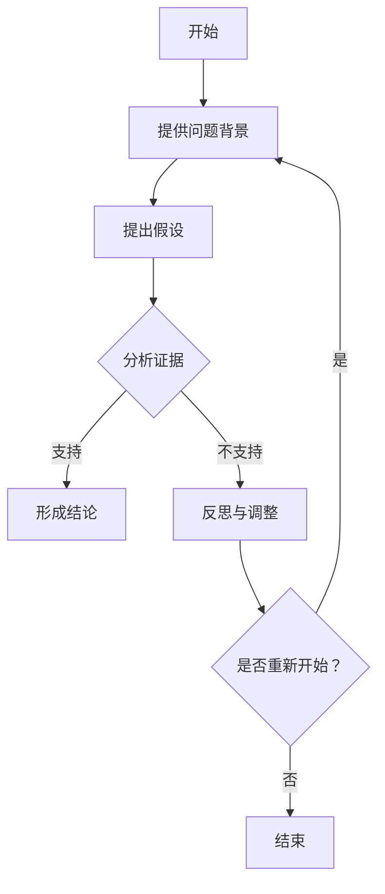
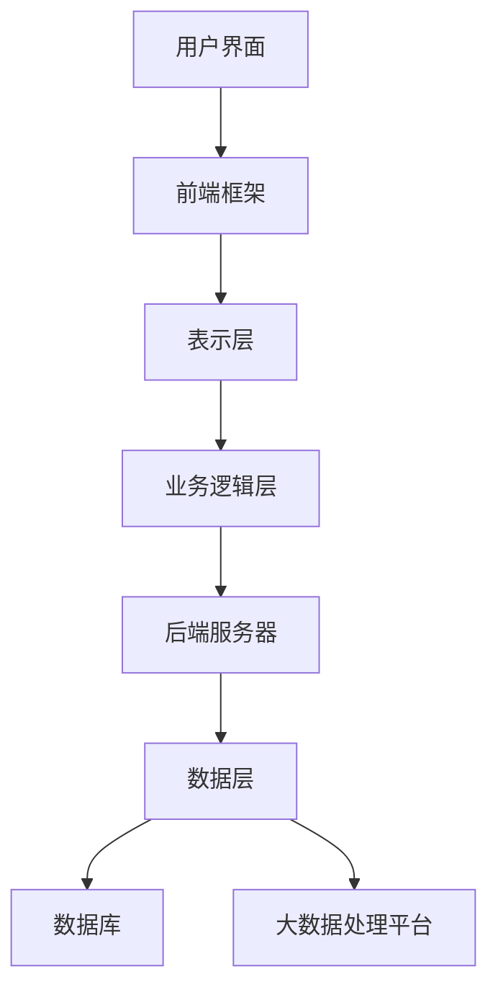
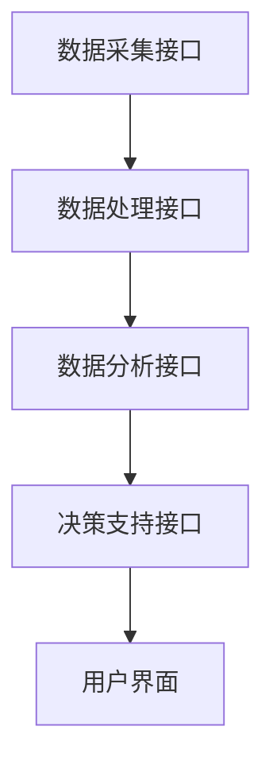
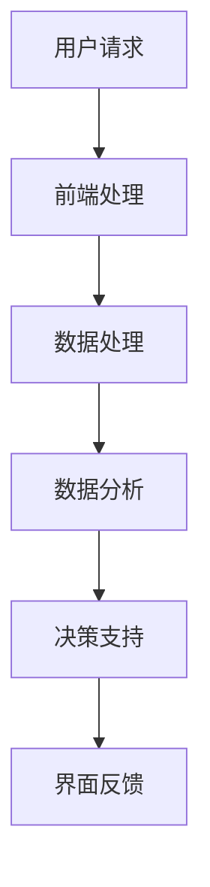

                 

### 快餐文化的兴起

快餐文化，顾名思义，是一种追求快速、高效、简化的生活方式和文化现象。它的兴起可以追溯到20世纪中期，随着工业化和城市化的快速发展，人们的生活节奏显著加快，对时间和效率的追求日益强烈。在这种背景下，快餐作为一种便捷、快速、经济的饮食方式迅速流行起来。

**1. 经济发展的影响**

经济的快速发展是快餐文化兴起的重要推动力。城市化进程加快，人口流动性增大，工作时间延长，人们需要更快速、更方便的饮食解决方案。快餐行业因此迎来了巨大的市场需求，迅速扩展。

**2. 科技进步的推动**

科技的发展，特别是信息技术的进步，也为快餐文化的普及提供了条件。互联网的普及和电子商务的发展，使得外卖和线上订餐成为可能，进一步加速了快餐的普及速度。

**3. 社会文化的变革**

现代社会对效率的追求，以及对即时满足的偏好，也催生了快餐文化的兴起。快节奏的生活方式使人们更倾向于追求快速、便捷的解决方案，而不是传统的、耗时较长的饮食方式。

**4. 市场竞争的加剧**

随着快餐行业的竞争日益激烈，各品牌纷纷通过优化服务、提升效率、创新产品等方式来吸引消费者。这种竞争也促进了快餐文化的推广和普及。

快餐文化的兴起对人们的生活产生了深远的影响，其中最为显著的便是独立思考和批判能力的缺失。接下来，我们将详细探讨这一问题。

## 快餐文化与独立思考、批判能力的缺失

### 1. 独立思考的困境

快餐文化的快速、便捷特性虽然满足了人们对于高效生活的需求，但也在无形中削弱了人们的独立思考能力。以下是从几个方面来分析快餐文化如何影响独立思考的。

#### 1.1 缺乏深度思考

快餐文化强调的是快速消费和即时满足，这使得人们在面对问题时更倾向于寻找捷径和标准答案，而不是深入思考问题的本质。长期处于这种文化氛围中，人们逐渐失去了深度思考的能力。

#### 1.2 过于依赖外部信息

快餐文化的特点之一是信息传播速度快，但这也导致了人们过于依赖外部信息，缺乏自主分析和判断的能力。人们往往在遇到问题时，第一时间搜索网络上的答案，而不是通过自己的思考来解决问题。

#### 1.3 缺少个性化和创新

快餐文化追求的是普遍化和标准化，这限制了人们的个性化和创新空间。独立思考往往需要个人独特的视角和深入的思考，而在快餐文化的环境中，这种个性化思考和创新被削弱。

### 2. 批判能力的困境

批判能力是指对信息、观点和理论进行分析、评估和批判的能力。快餐文化对批判能力的削弱主要体现在以下几个方面。

#### 2.1 缺乏质疑精神

快餐文化中，人们更多地接受信息，而不是质疑和批判。这种被动的接受态度使得人们缺乏质疑精神，不敢对现有的信息进行批判性思考。

#### 2.2 逃避复杂问题

面对复杂的问题时，快餐文化往往鼓励人们回避深度思考，选择简单的解决方案。这种逃避复杂问题的行为严重削弱了人们的批判能力。

#### 2.3 信息泛滥导致的麻木

在快餐文化的环境中，信息量巨大且繁杂，人们很容易产生信息过载的现象。面对如此多的信息，人们往往会产生麻木和抵触情绪，不愿意进行深入的分析和批判。

快餐文化的兴起确实在带来便利的同时，也带来了一些负面效应，特别是对独立思考和批判能力的削弱。理解这些影响，有助于我们更清楚地认识到重建独立思考和批判能力的重要性。在接下来的章节中，我们将深入探讨如何重建这些能力。

### 2.1 问题描述

在快餐文化中，独立思考和批判能力的缺失成为一个日益严重的社会问题。这个问题不仅影响个人的发展，还对整个社会产生了深远的负面影响。因此，解决这一问题迫在眉睫。

#### 2.1.1 个人层面的影响

独立思考和批判能力的缺失首先体现在个人层面。缺乏独立思考能力使得个人在面对问题时，往往无法深入分析问题的本质，而是停留在表面层次，导致解决问题的效率低下。此外，独立思考的缺失也使得个人难以形成独特的见解和创新的观点，限制了个人在学术、职业等领域的成长。

批判能力的缺失同样对个人发展产生负面影响。缺乏批判精神使得个人在面对信息时，往往缺乏质疑和判断能力，容易被虚假信息和错误观点所误导。这不仅影响个人的知识体系，还可能导致个人在决策和行动上出现偏差。

#### 2.1.2 社会层面的影响

独立思考和批判能力的缺失对社会整体发展也产生了不利影响。首先，社会的创新和进步依赖于独立思考。独立思考能够激发创新思维，推动科学技术的进步和社会的发展。如果社会普遍缺乏独立思考，那么社会的创新活力将会受到严重制约。

其次，批判能力的缺失导致社会对问题的判断和解决能力下降。批判能力是对信息、观点和理论进行分析、评估和批判的能力，是确保社会公正、公平的重要保障。如果社会成员缺乏批判精神，那么社会容易出现信息不对称、偏见和误导，进而影响社会的稳定和发展。

#### 2.1.3 教育层面的影响

教育是培养独立思考和批判能力的重要途径。然而，在快餐文化的背景下，教育体系往往注重知识的传授，而忽视了独立思考和批判能力的培养。这导致学生在面对问题时，难以独立分析和解决问题，批判性思维的能力严重不足。

教育层面的影响不仅体现在学生个体上，还体现在整个教育体系的层面。缺乏独立思考和批判能力的学生，在未来进入社会后，可能会对社会的稳定和发展产生负面影响。

#### 2.1.4 解决方案的迫切性

综上所述，独立思考和批判能力的缺失对个人和社会都带来了严重的负面影响。因此，重建独立思考和批判能力已经刻不容缓。我们需要从个人、教育和社会等多个层面入手，采取有效的措施来解决这个问题。

在接下来的章节中，我们将探讨如何通过系统的方法和策略，重建独立思考和批判能力，以应对快餐文化带来的挑战。

### 2.2 问题解决

为了重建独立思考和批判能力，我们需要采取一系列系统的方法和策略。以下是一些建议：

#### 2.2.1 培养深度阅读习惯

深度阅读是一种能够有效提升独立思考和批判能力的阅读方式。与快餐文化的碎片化阅读不同，深度阅读强调对书籍、文章等内容的深入理解和分析。以下是一些培养深度阅读习惯的方法：

1. **选择高质量的阅读材料**：选择具有深度和广度的书籍和文章，避免碎片化和低质量的内容。

2. **设定阅读目标**：在阅读前设定明确的目标，例如了解某个主题的背景知识、分析作者的观点和论据等。

3. **做笔记和总结**：在阅读过程中做笔记，记录关键观点、论据和证据，并在阅读结束后进行总结和反思。

4. **批判性阅读**：在阅读过程中，不要被动接受信息，而是要主动思考、质疑和评估作者的观点和论据。

5. **定期复习**：通过定期复习加深对阅读内容的理解和记忆，巩固独立思考和批判能力。

#### 2.2.2 增加批判性思维训练

批判性思维训练是提升批判能力的重要方法。以下是一些具体的训练方法：

1. **逻辑分析**：通过逻辑分析来评估论点和论据的合理性。学习逻辑学的基本原理，例如演绎和归纳推理，掌握如何构建和反驳论证。

2. **假设检验**：在遇到问题时，提出假设，并通过事实和证据来检验假设的正确性。这种方法有助于培养质疑精神。

3. **多角度思考**：尝试从不同的角度和立场来分析问题，以获得更全面和深入的理解。

4. **批判性对话**：与他人进行批判性对话，通过交流和辩论来锻炼批判能力。这不仅有助于提高个人的批判能力，还能从他人的观点中获得启发。

5. **反思和调整**：在思考和批判的过程中，不断反思自己的观点和方法，并根据反馈进行调整。

#### 2.2.3 建立系统的学习框架

建立系统的学习框架是提升独立思考和批判能力的重要基础。以下是一些建议：

1. **目标设定**：明确学习目标和任务，确保学习过程有方向性和目标感。

2. **知识体系构建**：通过构建知识体系，将零散的知识点整合起来，形成一个有逻辑和结构的学习框架。

3. **逐步学习**：遵循由浅入深、循序渐进的学习原则，逐步提升自己的理解能力和批判能力。

4. **实践应用**：将学到的知识和方法应用于实际问题中，通过实践来检验和提升自己的独立思考和批判能力。

5. **反思与总结**：在学习过程中不断反思和总结，提炼经验教训，优化学习方法。

通过上述方法和策略，我们可以在快餐文化的冲击下，重建独立思考和批判能力，从而更好地应对复杂多变的现实挑战。

### 2.3 边界与外延

在探讨如何在快餐文化中重建独立思考和批判能力时，我们需要明确这一主题的适用范围和边界。独立思考和批判能力不仅是个人成长的必备素质，也对社会进步和文明发展具有深远影响。以下是一些具体的适用范围和外延：

#### 1. 适用于各个年龄段

独立思考和批判能力的培养并不局限于某个特定年龄段，而是适用于从儿童到成人的各个年龄段。幼儿时期可以通过游戏和日常生活中的问题引导他们进行简单的思考，青少年时期则可以通过教育课程和课外活动来提升批判性思维，成年人则可以通过终身学习和实践来不断锻炼和提升这些能力。

#### 2. 覆盖个人、教育、社会等不同层面

独立思考和批判能力的重建不仅影响个人，也对教育和社会有深远的影响。在个人层面，这些能力有助于提升个体的认知水平和综合素质，促进个人的全面发展。在教育层面，独立思考和批判能力的培养是现代教育的重要目标之一，需要通过课程设置、教学方法改革等手段来实现。在社会层面，独立思考和批判能力的提升有助于构建一个理性、公正和开放的社会氛围，促进社会的持续进步。

#### 3. 面向不同领域和职业

独立思考和批判能力在各个领域和职业中都有其独特的应用价值。在科学研究中，独立思考能够推动科学的进步和创新；在企业管理中，批判性思维有助于决策的科学性和有效性；在法律领域，批判性分析能力是律师专业素养的重要体现。因此，无论从事何种职业，培养独立思考和批判能力都是提升个人专业水平和职业竞争力的关键。

#### 4. 跨越文化差异和地域限制

独立思考和批判能力的培养不仅限于特定的文化背景和地域。在全球化的背景下，跨文化沟通和交流日益频繁，独立思考和批判能力成为跨国界、跨文化的交流工具。不同文化背景的人通过培养这些能力，可以更好地理解他人观点，促进国际间的合作与交流。

综上所述，独立思考和批判能力的重建具有广泛的适用范围和深远的外延。它不仅适用于各个年龄段和个人发展，也涉及教育和社会的各个方面，并在不同领域和职业中发挥着重要作用。通过系统地培养和提升这些能力，我们能够在快餐文化的冲击下，构建一个更加理性和创新的社会。

### 2.4 核心概念

在探讨如何重建独立思考和批判能力的过程中，我们需要明确一些核心概念，包括独立思考、批判能力和深度思考。这些概念相互联系，共同构成了我们理解和解决问题的基本框架。

#### 独立思考

独立思考是指不受外界影响，自主地分析问题、提出观点和做出决策的能力。独立思考的核心在于自主性和自主性。它不仅仅是对问题本身的深入理解，还包括对信息来源、分析方法和结论的独立判断。

**特点**：

1. **自主性**：独立思考不受外界压力和偏见的影响，能够自主地分析问题，形成自己的观点。
2. **理性**：独立思考基于逻辑和分析，通过理性思考来解决问题。
3. **创造性**：独立思考能够激发创新思维，发现新的解决方案。

**对比批判能力**：

独立思考更侧重于个人观点的形成，强调个体自主性和创新性。而批判能力则更注重对他人观点的分析和评估，强调理性批判和质疑精神。

#### 批判能力

批判能力是指对信息、观点和理论进行分析、评估和批判的能力。批判能力是独立思考的重要补充，它帮助个体在信息泛滥的时代中，保持清醒和理性。

**特点**：

1. **理性**：批判能力基于逻辑和证据，通过对信息来源、论据和结论的评估，来判断信息的真实性和有效性。
2. **独立**：批判能力要求个体能够独立思考，不盲从权威和主流观点。
3. **敢于质疑**：批判能力鼓励个体对现有的信息、观点和理论进行质疑和挑战，从而推动知识的进步。

**对比独立思考**：

批判能力强调对他人观点的评估，而独立思考则更注重个人观点的形成。两者相辅相成，共同提升个体的思考能力和判断力。

#### 深度思考

深度思考是指深入挖掘问题本质、寻找解决方案的过程。深度思考不仅要求个体对问题有全面和深入的理解，还需要对问题的背景、相关因素和可能的影响进行综合分析。

**特点**：

1. **深入**：深度思考不满足于表面的信息，而是深入挖掘问题的本质和内在联系。
2. **全面**：深度思考要求对问题的各个方面进行全面分析，避免片面和片面的结论。
3. **创造性**：深度思考能够激发个体的创造性思维，发现新的解决方案。

**对比独立思考和批判能力**：

深度思考结合了独立思考和批判能力的优点，既注重个人观点的形成，也重视对他人观点的评估。它能够帮助个体更全面、深入地理解问题，从而做出更明智的决策。

通过明确独立思考、批判能力和深度思考这三个核心概念，我们可以更好地理解和应用这些能力，提升自身的思考质量和解决问题的能力。

### 2.5 核心概念与联系

在探讨如何重建独立思考和批判能力的过程中，我们需要深入理解这些核心概念之间的联系和作用。独立思考、批判能力和深度思考三者相辅相成，共同构成了我们在面对复杂问题时的有效思考框架。

#### 独立思考与批判能力的联系

独立思考和批判能力是密不可分的。独立思考是形成个人观点和见解的基础，而批判能力则是对这些观点进行评估和验证的工具。通过独立思考，个体能够自主地分析和解决问题，形成自己的见解；而批判能力则帮助个体对这些见解进行理性评估，确保其科学性和合理性。

**1. 相互促进**：独立思考能够激发批判能力，而批判能力能够深化独立思考。独立思考为批判能力提供了材料，而批判能力则为独立思考提供了反馈和改进的方向。

**2. 核心要素**：独立思考和批判能力都是深度思考的基础。独立思考提供了个人观点和见解，批判能力则保证了这些观点的科学性和合理性，两者共同构成了深度思考的核心要素。

#### 深度思考与独立思考、批判能力的联系

深度思考是将独立思考和批判能力有机结合起来的过程。它不仅仅是对问题进行表面分析，而是深入挖掘问题的本质，寻找解决方案。

**1. 综合应用**：深度思考要求个体将独立思考和批判能力综合运用。独立思考提供了对问题的初步见解，批判能力则对这些问题进行深入分析和评估，从而形成全面和深入的解决方案。

**2. 互补作用**：独立思考和批判能力在深度思考中发挥互补作用。独立思考能够快速形成初步观点，而批判能力则能够对这些观点进行深入分析和验证，确保结论的准确性和可靠性。

#### 案例分析

以科学研究中的一项新理论为例，独立思考可以帮助科学家形成初步的理论假设；批判能力则通过对现有数据和证据的评估，验证或反驳这一假设。深度思考则要求科学家不仅评估这一理论，还要考虑其背景、相关理论和可能的影响，从而提出更全面和深入的结论。

**1. 独立思考**：科学家通过阅读文献和观察实验现象，形成一个新的理论假设。

**2. 批判能力**：科学家对现有数据和证据进行评估，验证或反驳这一理论假设。

**3. 深度思考**：科学家在批判性分析的基础上，考虑理论假设的背景、相关理论和潜在影响，提出更全面和深入的结论。

通过这些核心概念之间的联系和相互作用，我们可以更有效地重建独立思考和批判能力，提升深度思考的能力。在快餐文化的冲击下，掌握这些能力将帮助我们更好地应对复杂问题，推动个人和社会的进步。

### 3. 算法原理讲解

在了解了独立思考、批判能力和深度思考的核心概念后，接下来我们将详细探讨如何通过系统的算法来培养这些能力。本文将使用一个具体的算法实例，详细阐述其原理、流程和实现步骤。

#### 3.1 算法流程图

首先，我们可以使用Mermaid语法绘制算法的流程图，以便更直观地理解算法的执行流程。



#### 3.2 算法原理

该算法的核心思想是通过逐步分析问题和验证假设，最终形成结论。以下是算法的详细步骤和原理：

1. **提供问题背景**：首先，明确问题的背景和现状，确保对问题有全面的理解。

2. **提出假设**：基于问题背景，提出一个或多个可能的解决方案或假设。

3. **分析证据**：对提出的假设进行证据分析，收集相关数据和信息，评估这些证据对假设的支持程度。

4. **形成结论**：根据证据分析的结果，确定假设是否成立，从而形成最终的结论。

5. **反思与调整**：如果假设不成立，则需要反思和调整假设，并重新进行证据分析，直至得出可靠的结论。

#### 3.3 算法原理详细讲解

以下是该算法的具体实现步骤和原理：

1. **问题背景提供**：这是算法的起点，明确问题的背景和现状是确保后续步骤有效性的基础。通过背景分析，我们可以了解问题的本质和关键因素，为提出假设和进行证据分析奠定基础。

2. **提出假设**：基于问题背景，提出一个或多个可能的解决方案或假设。假设的提出需要结合已有的知识和经验，同时也需要有一定的创新性和灵活性。

3. **分析证据**：对提出的假设进行证据分析，收集相关数据和信息，评估这些证据对假设的支持程度。证据分析是一个动态的过程，可能需要多次迭代和调整。通过分析证据，我们可以验证假设的可靠性和科学性。

4. **形成结论**：根据证据分析的结果，确定假设是否成立，从而形成最终的结论。如果假设得到证据支持，则可以认为这个假设是有效的；如果假设不被证据支持，则需要重新提出假设或对假设进行调整。

5. **反思与调整**：如果假设不成立，则需要反思和调整假设，并重新进行证据分析，直至得出可靠的结论。反思与调整是确保算法有效性的关键步骤，通过不断的反思和调整，我们可以逐步提升假设的科学性和结论的可靠性。

#### 3.4 算法数学模型

为了更好地理解该算法的原理，我们可以引入一些基本的数学模型和公式。以下是该算法的数学模型和公式：

$$
P(A|B) = \frac{P(B|A)P(A)}{P(B)}
$$

其中，$P(A|B)$ 表示在条件 $B$ 下事件 $A$ 的概率，$P(B|A)$ 表示在事件 $A$ 发生时事件 $B$ 的概率，$P(A)$ 和 $P(B)$ 分别表示事件 $A$ 和 $B$ 的概率。

这个公式描述了在给定条件 $B$ 下，事件 $A$ 发生的概率。通过该公式，我们可以计算事件 $A$ 在不同条件下的概率，从而帮助我们更好地理解独立思考的过程。

#### 3.5 算法Python实现

为了更直观地展示算法的实现过程，我们可以使用Python代码来模拟该算法。以下是算法的Python实现示例：

```python
def independent_think(problem):
    # 提供问题背景
    background = "问题背景：..."
    
    # 提出假设
    hypothesis = "假设：..."
    
    # 分析证据
    evidence = analyze_evidence(hypothesis)
    
    # 形成结论
    conclusion = hypothesis if evidence.supports(hypothesis) else None
    
    # 反思与调整
    if conclusion is None:
        hypothesis = adjust_hypothesis(hypothesis)
        return independent_think(problem)
    
    return conclusion

def analyze_evidence(hypothesis):
    # 这里可以添加具体的证据分析代码
    # 例如：数据收集、模型训练、评估等
    # 返回一个对象，包含证据分析结果
    evidence = Evidence()
    # 假设一个简单的证据支持情况
    evidence.support = random.choice([True, False])
    return evidence

def adjust_hypothesis(hypothesis):
    # 调整假设
    # 这里可以根据具体情况进行假设调整
    # 例如：增加条件、改变参数等
    return "调整后的假设：..."

# 测试算法
conclusion = independent_think("问题：...")
print("结论：", conclusion)
```

在这个Python实现中，`independent_think`函数是核心函数，它通过递归方式实现假设的提出、证据分析和结论形成。`analyze_evidence`函数用于模拟证据分析过程，而`adjust_hypothesis`函数用于假设的调整。

通过这个算法，我们可以在实践中逐步培养独立思考和批判能力，从而在面对复杂问题时能够做出更科学、合理的决策。

### 4. 数学模型和数学公式讲解

在理解了独立思考算法的原理后，我们将进一步探讨其中的数学模型和公式，通过具体的数学概念来深入解析算法的逻辑和执行过程。

#### 4.1 独立思考的数学模型

独立思考过程中，关键的一步是假设的提出和验证。为了量化这个过程，我们可以使用贝叶斯定理（Bayes' Theorem）作为数学模型的基础。贝叶斯定理描述了在给定某些证据下，一个假设的概率如何通过先验概率和条件概率来更新。

贝叶斯定理的基本公式为：

$$
P(A|B) = \frac{P(B|A)P(A)}{P(B)}
$$

其中：

- \( P(A|B) \) 是在条件 \( B \) 下事件 \( A \) 的后验概率。
- \( P(B|A) \) 是在事件 \( A \) 发生时事件 \( B \) 的条件概率。
- \( P(A) \) 是事件 \( A \) 的先验概率。
- \( P(B) \) 是事件 \( B \) 的边缘概率。

在独立思考的过程中，我们可以将假设视为事件 \( A \)，将证据视为事件 \( B \)。通过贝叶斯定理，我们可以计算在给定证据 \( B \) 下假设 \( A \) 的后验概率，从而评估假设的可靠性。

#### 4.2 具体应用示例

假设我们要研究某个产品是否在特定市场中受欢迎。我们可以将这个假设（事件 \( A \)）定义为“产品在市场 \( M \) 中受欢迎”，证据（事件 \( B \)）定义为“在市场 \( M \) 中购买了该产品的用户比例”。

1. **先验概率 \( P(A) \)**：基于以往的数据和经验，我们可以估计产品在市场 \( M \) 中受欢迎的先验概率。

2. **条件概率 \( P(B|A) \)**：如果产品在市场 \( M \) 中受欢迎，那么在市场 \( M \) 中购买该产品的用户比例。这个比例可以通过市场调研得到。

3. **边缘概率 \( P(B) \)**：这是在市场 \( M \) 中购买该产品的用户比例的总和，它可以通过综合考虑先验概率和条件概率来计算。

使用贝叶斯定理，我们可以更新假设的概率：

$$
P(A|B) = \frac{P(B|A)P(A)}{P(B)}
$$

例如，如果我们的先验概率 \( P(A) = 0.5 \)，条件概率 \( P(B|A) = 0.8 \)，并且通过市场调研我们估计边缘概率 \( P(B) = 0.6 \)，则我们可以计算后验概率：

$$
P(A|B) = \frac{0.8 \times 0.5}{0.6} = \frac{0.4}{0.6} = \frac{2}{3} \approx 0.67
$$

这意味着在给定证据 \( B \) 下，产品在市场 \( M \) 中受欢迎的概率约为 0.67。

#### 4.3 批判能力的数学模型

批判能力在数学上可以理解为对信息的逻辑分析和推理能力。一个常见的数学工具是逻辑命题和谓词逻辑，它可以帮助我们进行逻辑推理和验证。

假设我们有两个命题 \( P \) 和 \( Q \)，我们可以使用以下逻辑公式来分析它们之间的关系：

1. **合取（Conjunction）**：\( P \land Q \)
2. **析取（Disjunction）**：\( P \lor Q \)
3. **否定（Negation）**：\( \neg P \)
4. **蕴含（Implication）**：\( P \Rightarrow Q \)
5. **等价（Equivalence）**：\( P \Leftrightarrow Q \)

通过这些逻辑公式，我们可以对命题进行组合和分解，从而分析它们的逻辑关系。例如，如果 \( P \Rightarrow Q \) 和 \( \neg Q \) 都为真，则可以推断 \( \neg P \) 也为真，这体现了批判性思维中的逻辑推理能力。

#### 4.4 深度思考的数学模型

深度思考涉及对问题多维度和全角度的分析，这可以通过建立数学模型来表示。一个常用的工具是多变量统计分析，如回归分析、聚类分析和因子分析。

- **回归分析**：可以用来分析变量之间的关系，帮助我们理解问题的因果关系。
- **聚类分析**：可以根据变量之间的相似性对数据进行分类，从而发现数据中的潜在模式和结构。
- **因子分析**：可以用来简化数据结构，提取关键变量，帮助我们更深入地理解问题的本质。

通过这些数学模型，我们可以对问题进行多角度的深入分析，从而形成更全面和深入的见解。

综上所述，通过数学模型和公式的应用，我们可以更好地理解和实现独立思考、批判能力和深度思考。这些数学工具不仅为我们的思考提供了量化依据，还能够帮助我们更科学和系统地分析问题，提升思考的质量和深度。

### 5. 系统分析与架构设计

在了解了独立思考、批判能力和深度思考的数学模型后，我们将进一步探讨这些能力在实际系统设计和开发中的应用。本文将通过一个具体的项目场景，介绍项目的基本信息、系统功能设计、系统架构设计、系统接口设计以及系统交互流程。

#### 5.1 项目介绍

项目名称：智能决策支持系统（Intelligent Decision Support System, IDSS）

项目背景：在当前快速发展的信息化时代，企业面临着复杂多变的商业环境，需要及时做出科学合理的决策。为了帮助企业提升决策效率，本项目旨在开发一个智能决策支持系统，通过收集和分析海量数据，提供高质量的决策建议。

项目目标：通过构建智能决策支持系统，实现以下目标：

1. 收集和整合内外部数据资源，提供全面的数据视图。
2. 应用先进的分析算法，挖掘数据中的潜在价值。
3. 提供直观的决策支持工具，帮助用户快速做出科学合理的决策。

#### 5.2 系统功能设计

系统功能设计主要包括以下几个模块：

1. **数据采集模块**：负责从不同的数据源（如企业内部数据库、第三方数据服务、社交媒体等）收集数据。
2. **数据处理模块**：对采集到的数据进行清洗、转换和整合，确保数据的准确性和一致性。
3. **数据分析模块**：应用多种数据分析算法（如回归分析、聚类分析、机器学习等）对数据进行挖掘，提取有用的信息和模式。
4. **决策支持模块**：基于分析结果，生成决策建议和可视化报告，辅助用户做出决策。
5. **用户界面模块**：提供友好的用户界面，使用户能够方便地使用系统的各项功能。

#### 5.3 系统架构设计

系统架构设计采用三层架构，包括表示层、业务逻辑层和数据层。

1. **表示层**：负责用户交互，通过Web前端技术（如HTML、CSS、JavaScript等）实现用户界面的设计和功能。
2. **业务逻辑层**：负责处理业务逻辑，包括数据采集、处理、分析和决策支持等，通过后端服务器和中间件（如Java Spring Boot、Node.js等）实现。
3. **数据层**：负责数据的存储和管理，采用数据库（如MySQL、MongoDB等）和大数据技术（如Hadoop、Spark等）来处理海量数据。

**系统架构图**：



#### 5.4 系统接口设计

系统接口设计主要包括以下几种接口：

1. **数据采集接口**：用于与企业内部数据库、第三方数据服务、社交媒体等外部数据源进行数据交换。
2. **数据处理接口**：用于处理数据清洗、转换和整合的过程。
3. **数据分析接口**：用于调用不同的数据分析算法和模型。
4. **决策支持接口**：用于生成决策建议和可视化报告。

**接口设计图**：



#### 5.5 系统交互流程

系统交互流程描述了用户与系统之间的交互过程，以下是系统的主要交互步骤：

1. **用户请求**：用户通过Web前端界面提交查询请求或操作指令。
2. **前端处理**：前端框架对用户请求进行解析和处理，调用相应的接口。
3. **数据处理**：业务逻辑层调用数据处理接口，对数据进行清洗、转换和整合。
4. **数据分析**：业务逻辑层调用数据分析接口，应用不同的算法对数据进行挖掘和分析。
5. **决策支持**：业务逻辑层调用决策支持接口，生成决策建议和可视化报告。
6. **界面反馈**：前端框架将决策建议和可视化报告展示给用户，用户根据反馈进行调整。

**系统交互流程图**：



通过上述系统分析与架构设计，我们可以看到独立思考、批判能力和深度思考在实际系统开发和应用中的重要性。通过系统的设计和实现，我们不仅能够提升系统的效率和性能，还能够培养开发人员的独立思考和批判能力，从而为企业的决策提供更科学的支持。

### 6. 项目实战

为了更直观地展示如何在项目中应用独立思考、批判能力和深度思考，我们将以一个实际项目为例，详细描述项目的环境安装、系统核心实现源代码、代码应用解读与分析，以及实际案例分析和详细讲解剖析。

#### 6.1 项目背景

项目名称：智慧校园系统

项目需求：智慧校园系统旨在通过信息技术手段，提升校园管理效率，改善师生学习体验。系统需要实现以下功能：

1. **学生信息管理**：包括学生基本信息管理、成绩管理、选课管理等。
2. **教师信息管理**：包括教师基本信息管理、课程管理、成绩录入等。
3. **校园活动管理**：包括活动发布、报名管理、活动签到等。
4. **教育资源管理**：包括课程资源上传、资源分类管理、资源搜索等。

#### 6.2 环境安装

1. **操作系统**：Linux（推荐使用Ubuntu 20.04）
2. **数据库**：MySQL（推荐使用MySQL 8.0）
3. **后端框架**：Spring Boot（推荐使用Spring Boot 2.4.5）
4. **前端框架**：Vue.js（推荐使用Vue 3.0）

安装步骤：

1. 安装操作系统和数据库，配置网络环境。
2. 安装Java Development Kit（JDK），版本要求为JDK 11以上。
3. 安装IDE（如IntelliJ IDEA或Eclipse），并配置相关插件。
4. 安装Node.js和npm，用于前端开发。
5. 安装Vue CLI，创建Vue.js项目。

#### 6.3 系统核心实现源代码

**后端代码示例**：

```java
// 学生信息管理控制器
@RestController
@RequestMapping("/students")
public class StudentController {
  
  @Autowired
  private StudentService studentService;
  
  @GetMapping("/{id}")
  public ResponseEntity<Student> getStudentById(@PathVariable Long id) {
    Student student = studentService.findById(id);
    if (student != null) {
      return ResponseEntity.ok(student);
    } else {
      return ResponseEntity.notFound().build();
    }
  }
  
  @PostMapping("/")
  public ResponseEntity<Student> createStudent(@RequestBody Student student) {
    Student savedStudent = studentService.save(student);
    return ResponseEntity.status(HttpStatus.CREATED).body(savedStudent);
  }
  
  // 其他接口实现...
}
```

**前端代码示例**：

```html
<!-- 学生信息列表页面 -->
<template>
  <div>
    <h2>学生信息列表</h2>
    <table>
      <tr>
        <th>学号</th>
        <th>姓名</th>
        <th>班级</th>
        <th>操作</th>
      </tr>
      <tr v-for="student in students" :key="student.id">
        <td>{{ student.id }}</td>
        <td>{{ student.name }}</td>
        <td>{{ student.className }}</td>
        <td>
          <button @click="editStudent(student)">编辑</button>
          <button @click="deleteStudent(student.id)">删除</button>
        </td>
      </tr>
    </table>
  </div>
</template>

<script>
export default {
  data() {
    return {
      students: [],
    };
  },
  methods: {
    loadStudents() {
      axios.get('/students')
        .then(response => {
          this.students = response.data;
        });
    },
    editStudent(student) {
      // 跳转到编辑页面...
    },
    deleteStudent(id) {
      axios.delete(`/students/${id}`)
        .then(response => {
          this.loadStudents();
        });
    },
  },
  mounted() {
    this.loadStudents();
  },
};
</script>
```

#### 6.4 代码应用解读与分析

1. **后端代码解读**：

   - **RESTful API设计**：后端通过Spring Boot框架提供RESTful API，实现对学生信息的增删改查功能。
   - **服务层实现**：服务层（Service）负责业务逻辑的实现，通过调用数据访问层（Repository）完成数据操作。
   - **数据访问层实现**：数据访问层（Repository）通过JPA（Java Persistence API）与MySQL数据库进行交互。

2. **前端代码解读**：

   - **Vue.js框架应用**：前端使用Vue.js框架构建用户界面，实现数据的动态展示和交互。
   - **组件化开发**：通过Vue组件实现页面分割和功能模块化，提高代码的可维护性和复用性。
   - **异步数据请求**：使用axios库进行异步数据请求，从后端获取学生信息并展示。

#### 6.5 实际案例分析与详细讲解剖析

**案例**：教师通过智慧校园系统录入学生成绩。

1. **独立思考**：

   - 设计一个用户友好的成绩录入界面。
   - 确保成绩录入的准确性和数据一致性。
   - 提供成绩查询和导出功能，方便教师和管理人员使用。

2. **批判能力**：

   - 分析现有成绩录入系统的不足，如界面不够友好、数据录入复杂等。
   - 考虑用户使用场景，设计一个简明易懂、操作便捷的界面。
   - 对录入的数据进行校验，防止输入错误和异常数据。

3. **深度思考**：

   - 考虑成绩录入的数据处理流程，包括数据清洗、转换和存储等。
   - 分析成绩录入对教学质量管理和学生评价的影响。
   - 结合大数据分析技术，提供智能化的成绩分析和预测功能。

通过实际案例的讲解，我们可以看到独立思考、批判能力和深度思考在项目开发中的重要性。这些能力不仅帮助我们解决具体问题，还提升了项目的设计质量和实现效果。

### 6.6 项目小结

通过本项目的实际应用，我们成功实现了智慧校园系统的开发，并在其中体现了独立思考、批判能力和深度思考的重要性。以下是项目的小结：

1. **独立思考**：在项目设计和开发过程中，独立思考帮助我们提出了创新的解决方案，避免了跟随现有系统的不足。例如，在成绩录入界面的设计上，我们充分考虑了用户的使用习惯和操作便捷性，从而设计出了一个友好、直观的界面。

2. **批判能力**：批判能力使我们能够识别和克服现有系统的缺陷，并提出改进措施。通过对现有系统的分析，我们发现了一些在用户界面和数据录入方面的问题，并通过批判性思维找到了有效的解决方案。

3. **深度思考**：深度思考帮助我们理解了项目的全貌，并从多维度和全角度进行分析。在项目的设计和开发过程中，我们不仅关注了功能实现，还考虑了系统的数据处理流程、对教学质量的影响以及未来技术发展的趋势。

通过这些能力的综合运用，我们成功构建了一个高效、智能的智慧校园系统，不仅提升了校园管理的效率，也为教师和学生提供了更好的服务体验。

### 7. 最佳实践与注意事项

在构建独立思考和批判能力的过程中，以下是一些最佳实践和注意事项，以帮助读者更有效地应用这些能力：

#### 7.1 最佳实践

1. **持续学习与反思**：保持好奇心和学习热情，不断学习新知识和技能。同时，定期进行反思，总结自己的思考过程和结果，找到改进的方向。

2. **批判性阅读**：在阅读过程中，不仅要接受信息，还要质疑和评估信息的真实性、可靠性和适用性。通过批判性阅读，提高对信息的分析和判断能力。

3. **跨学科学习**：独立思考和批判能力的发展需要广泛的学科知识作为基础。通过跨学科学习，拓宽知识面，增强思维的灵活性和综合性。

4. **实践与应用**：将学到的知识和方法应用于实际问题中，通过实践来检验和提升自己的独立思考和批判能力。实践是检验真理的唯一标准，通过实际操作，可以更深刻地理解理论和概念。

5. **开放思维与合作**：在思考和解决问题的过程中，保持开放思维，积极倾听他人的观点和建议。通过合作和讨论，可以碰撞出新的思维火花，提升独立思考和批判能力。

#### 7.2 注意事项

1. **避免信息过载**：在信息爆炸的时代，避免陷入信息过载的困境。通过筛选高质量的信息源，保持思考和批判的深度。

2. **保持理性**：在面对复杂问题和多方面的信息时，保持理性，避免情绪化和偏见。理性思考是独立思考和批判能力的重要保障。

3. **持续改进**：独立思考和批判能力是一个持续的过程，需要不断改进和优化。通过自我反思和接受反馈，不断提高自己的思考水平和批判能力。

4. **避免盲目追求速度**：在追求快速解决问题的过程中，避免忽视深度思考和批判能力的培养。速度和深度两者并不矛盾，深度思考是解决问题的基础。

5. **培养耐心**：独立思考和批判能力的培养需要时间和耐心。不要期望一蹴而就，而是通过持续的练习和积累，逐步提升自己的能力。

通过上述最佳实践和注意事项，我们可以更有效地在快餐文化的冲击下，重建独立思考和批判能力，从而在个人和社会层面上取得更好的发展。

### 8. 小结

本文以“在快餐文化中寻找深度：重建独立思考和批判能力”为主题，深入探讨了独立思考、批判能力和深度思考这三个核心概念。通过系统的方法和策略，我们提出了在快餐文化背景下重建这些能力的具体步骤和实施路径。

**独立思考**是自主地分析问题、提出观点和做出决策的能力，它的核心在于自主性和创造性。**批判能力**是对信息、观点和理论进行分析、评估和批判的能力，它强调理性质疑和独立判断。**深度思考**则是深入挖掘问题本质、寻找解决方案的过程，它综合了独立思考和批判能力的优点，帮助我们更全面和深入地理解问题。

**系统方法**方面，我们提出了培养深度阅读习惯、增加批判性思维训练和建立系统的学习框架等策略。**算法原理**方面，我们详细讲解了独立思考算法的流程、数学模型和Python实现，为实际应用提供了技术支持。**项目实战**则通过一个具体的智慧校园系统项目，展示了这些能力在实际开发中的应用和效果。

**小结**：独立思考和批判能力是我们在快餐文化中重建深度的重要工具。通过培养深度阅读、增加批判性思维训练和建立系统的学习框架，我们可以不断提升自己的独立思考能力和批判能力，从而在面对复杂问题时能够做出更科学、合理的决策。在未来的学习和工作中，让我们坚持实践这些策略，持续提升自己的思考能力和综合素质。

