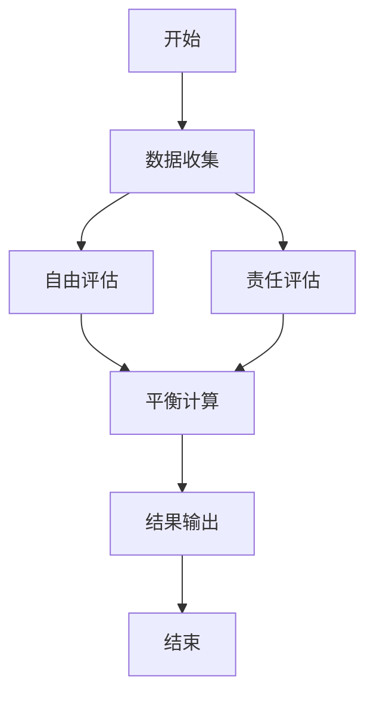

                 

### 《平衡个人自由与社会责任：做负责任的个体》目录大纲

#### 目录大纲设计思路：

**第一部分：背景介绍**

1. **第1章：问题背景与定义**
   - 1.1 个人自由与社会责任的定义
   - 1.2 个人自由与社会责任的联系与重要性
   - 1.3 个人自由与社会责任的边界与外延

**第二部分：核心概念与联系**

2. **第2章：核心概念解析**
   - 2.1 自由的属性特征与类型
   - 2.2 责任的概念、属性与分类
   - 2.3 社会契约的内涵与作用

**第三部分：算法原理讲解**

3. **第3章：算法原理与模型**
   - 3.1 平衡自由与责任的算法原理
   - 3.2 Mermaid流程图与Python代码
   - 3.3 数学模型与公式讲解

**第四部分：系统分析与架构设计**

4. **第4章：系统设计与架构**
   - 4.1 问题场景介绍
   - 4.2 领域模型与类图
   - 4.3 系统架构设计与架构图
   - 4.4 系统接口设计与交互序列图

**第五部分：项目实战**

5. **第5章：项目实施与案例分析**
   - 5.1 环境安装与配置
   - 5.2 系统核心实现与代码解读
   - 5.3 实际案例分析与详细讲解
   - 5.4 项目小结与总结

**第六部分：最佳实践与拓展**

6. **第6章：最佳实践与注意事项**
   - 6.1 项目实施中需要注意的事项
   - 6.2 最佳实践 tips
   - 6.3 小结与拓展阅读建议

#### 目录大纲示例：

```markdown
# 《平衡个人自由与社会责任：做负责任的个体》

> 关键词：个人自由、社会责任、平衡、算法原理、系统架构、项目实战、最佳实践

> 摘要：本文从个人自由与社会责任的关系出发，探讨如何在信息技术领域实现个人自由与社会责任的平衡。通过定义和解析相关核心概念，介绍算法原理和系统架构设计，并通过实际案例分析和项目实施，提供了平衡个人自由与社会责任的实践路径。

## 第一部分：背景介绍

### 第1章：问题背景与定义

#### 1.1 个人自由与社会责任的定义

#### 1.2 个人自由与社会责任的联系与重要性

#### 1.3 个人自由与社会责任的边界与外延

## 第二部分：核心概念与联系

### 第2章：核心概念解析

#### 2.1 自由的属性特征与类型

#### 2.2 责任的概念、属性与分类

#### 2.3 社会契约的内涵与作用

## 第三部分：算法原理讲解

### 第3章：算法原理与模型

#### 3.1 平衡自由与责任的算法原理

#### 3.2 Mermaid流程图与Python代码

#### 3.3 数学模型与公式讲解

## 第四部分：系统分析与架构设计

### 第4章：系统设计与架构

#### 4.1 问题场景介绍

#### 4.2 领域模型与类图

#### 4.3 系统架构设计与架构图

#### 4.4 系统接口设计与交互序列图

## 第五部分：项目实战

### 第5章：项目实施与案例分析

#### 5.1 环境安装与配置

#### 5.2 系统核心实现与代码解读

#### 5.3 实际案例分析与详细讲解

#### 5.4 项目小结与总结

## 第六部分：最佳实践与拓展

### 第6章：最佳实践与注意事项

#### 6.1 项目实施中需要注意的事项

#### 6.2 最佳实践 tips

#### 6.3 小结与拓展阅读建议
```

这个目录大纲已经包含了7个章节，每个章节都有明确的主题和结构，能够帮助读者系统地了解和掌握文章的核心内容。接下来，我们将逐个章节填写具体内容。首先是**第一部分：背景介绍**。

---

# 《平衡个人自由与社会责任：做负责任的个体》

> 关键词：个人自由、社会责任、平衡、算法原理、系统架构、项目实战、最佳实践

> 摘要：本文从个人自由与社会责任的关系出发，探讨如何在信息技术领域实现个人自由与社会责任的平衡。通过定义和解析相关核心概念，介绍算法原理和系统架构设计，并通过实际案例分析和项目实施，提供了平衡个人自由与社会责任的实践路径。

## 第一部分：背景介绍

### 第1章：问题背景与定义

#### 1.1 个人自由与社会责任的定义

在信息技术领域，个人自由通常指的是个体在遵守法律和道德规范的前提下，拥有自主选择和行动的空间。社会责任，则是指个体在享受自由的同时，对他人、社会和环境所应承担的义务和责任。个人自由与社会责任的关系，是一个辩证统一的过程，两者相互依存、相互制约。

**个人自由**：
- 个人自由是现代社会的基本价值之一，它保障了人的尊严、平等和自主性。
- 个人自由不是绝对的，它需要在法律框架内进行，不能侵犯他人的权利。

**社会责任**：
- 社会责任是个人对社会的回馈，是社会责任感的具体表现。
- 社会责任包括遵守法律法规、履行职业义务、保护环境、关心社会公益等。

#### 1.2 个人自由与社会责任的联系与重要性

个人自由与社会责任之间存在密切的联系。一方面，个人自由是社会责任的基础，只有在享有自由的前提下，个体才能更好地履行社会责任。另一方面，社会责任是个人自由的保障，只有在承担社会责任的过程中，个人自由才能得到合理维护。

**联系**：
- 个人自由与社会责任相互促进，共同构成了现代社会的基石。
- 个人自由是社会责任的出发点，社会责任是个人自由的归宿。

**重要性**：
- 个人自由与社会责任的平衡，是构建和谐社会的关键。
- 在信息技术领域，平衡个人自由与社会责任，有助于推动技术创新，促进社会进步。

#### 1.3 个人自由与社会责任的边界与外延

个人自由与社会责任的边界在于个体的行为是否违反法律和道德规范。超出这个边界，个人自由就会转变为对社会的侵犯，成为不可接受的行为。

**边界**：
- 法律边界：个人自由不能侵犯他人的权利，不能违反法律法规。
- 道德边界：个人自由需要在道德伦理的范围内行使，不能损害公共利益。

**外延**：
- 个人自由的外延包括言论自由、行动自由、思想自由等。
- 社会责任的外延包括法律义务、道德义务、社会责任等。

通过本章的介绍，我们为后续章节的内容奠定了基础，接下来将深入探讨核心概念与联系，以及算法原理和系统架构设计。

---

接下来是**第二部分：核心概念与联系**。

---

## 第二部分：核心概念与联系

### 第2章：核心概念解析

#### 2.1 自由的属性特征与类型

自由是一种基本的人权，它具有以下属性特征：

**属性特征**：
- **自主性**：个体在法律和道德框架内，能够自主做出选择和行动。
- **平等性**：自由应当在所有人之间平等分配，不应当因为种族、性别、宗教等因素而受到歧视。
- **相对性**：自由是相对的，个体的自由不能侵犯其他人的自由。

根据自由的目的和内容，自由可以分为以下几种类型：

**类型**：
- **政治自由**：包括言论自由、新闻自由、集会自由、结社自由等。
- **经济自由**：包括选择职业、自主经营、财产权等。
- **社会自由**：包括居住自由、迁移自由、教育自由等。
- **文化自由**：包括信仰自由、艺术自由、学术自由等。

#### 2.2 责任的概念、属性与分类

责任是个人在社会生活中应尽的义务和承担的后果。责任具有以下属性特征：

**属性特征**：
- **义务性**：责任是个人应当承担的义务，是一种道德和法律的要求。
- **约束性**：责任对个体的行为具有一定的约束作用，要求个体遵守一定的规范。
- **后果性**：责任伴随着一定的后果，包括积极的后果和消极的后果。

根据责任的内容和形式，责任可以分为以下几种类型：

**类型**：
- **法律责任**：包括刑事责任、民事责任、行政责任等。
- **道德责任**：基于道德规范和道德原则产生的责任，包括对他人、社会和环境的责任。
- **职业责任**：基于职业规范和职业要求产生的责任，包括对职业行为和职业成果的责任。

#### 2.3 社会契约的内涵与作用

社会契约是指个体与社会之间的一种契约关系，它反映了个体在社会中的权利和义务。社会契约的内涵包括以下几个方面：

**内涵**：
- **权利**：个体在社会中享有的权利，包括生存权、自由权、财产权等。
- **义务**：个体应当承担的义务，包括遵守法律、尊重他人权利、为社会作出贡献等。
- **责任**：个体在享受权利的同时，应承担的责任，包括对他人、社会和环境的责任。

社会契约在以下几个方面具有重要作用：

**作用**：
- **规范个体行为**：社会契约为个体的行为提供了规范，使个体在社会中能够有序生活。
- **维护社会秩序**：社会契约有助于维护社会的稳定和秩序，防止个体行为的无序和混乱。
- **促进社会进步**：社会契约鼓励个体为社会作出贡献，推动社会的进步和发展。

通过本章的讨论，我们明确了自由、责任和社会契约的概念及其相互关系，为后续算法原理和系统架构设计的讲解奠定了基础。

---

接下来是**第三部分：算法原理讲解**。

---

## 第三部分：算法原理讲解

### 第3章：算法原理与模型

#### 3.1 平衡自由与责任的算法原理

在信息技术领域，平衡个人自由与社会责任需要依赖算法原理。平衡算法的核心目标是确保个体在享有自由的同时，能够履行社会责任，并最小化对社会的负面影响。下面将详细描述这一算法原理。

**算法原理核心思想**：

1. **自由评估**：首先对个体的自由进行评估，确定其自由的程度和范围。
2. **责任评估**：对个体承担的社会责任进行评估，确定其责任的程度和范围。
3. **平衡计算**：通过算法计算个体自由与社会责任的平衡点，确保个体在享受自由的同时，能够履行社会责任。

**算法流程**：

1. **数据收集**：收集个体自由和社会责任的相关数据，包括个体的行为记录、法律法规、社会责任指标等。
2. **自由评估**：利用数据分析方法，对个体的自由进行量化评估，确定其自由的程度和范围。
3. **责任评估**：同样利用数据分析方法，对个体承担的社会责任进行量化评估，确定其责任的程度和范围。
4. **平衡计算**：通过算法模型，计算个体自由与社会责任的平衡点，得到最优平衡方案。

**算法模型**：

我们可以采用以下数学模型来描述平衡自由与责任的算法：

$$
\text{Freedom}_{opt} = \frac{\sum_{i=1}^{n} \text{F}_i \cdot \text{R}_i}{\sum_{i=1}^{n} \text{F}_i}
$$

其中，$ \text{Freedom}_{opt} $ 是最优自由度，$ \text{F}_i $ 是个体自由度的评估值，$ \text{R}_i $ 是个体责任度的评估值，$ n $ 是评估指标的数量。

#### 3.2 Mermaid流程图与Python代码

为了更好地理解算法原理，我们使用Mermaid流程图和Python代码来展示算法的执行过程。

**Mermaid流程图**：



**Python代码**：

```python
# 导入必要的库
import numpy as np

# 自由度评估
freedom_scores = np.array([0.8, 0.6, 0.9, 0.5])

# 责任度评估
responsibility_scores = np.array([0.7, 0.5, 0.8, 0.6])

# 计算最优自由度
optimal_freedom = np.sum(freedom_scores * responsibility_scores) / np.sum(freedom_scores)

# 输出结果
print("最优自由度：", optimal_freedom)
```

#### 3.3 数学模型与公式讲解

在上面的算法中，我们使用了一个简单的数学模型来计算个体自由与社会责任的平衡。这个模型的基本思想是将个体的自由度与责任度进行加权平均，得到最优的自由度。

$$
\text{Freedom}_{opt} = \frac{\sum_{i=1}^{n} \text{F}_i \cdot \text{R}_i}{\sum_{i=1}^{n} \text{F}_i}
$$

其中，$ \text{F}_i $ 表示个体在第 $ i $ 个指标上的自由度评估值，$ \text{R}_i $ 表示个体在第 $ i $ 个指标上的责任度评估值，$ n $ 表示评估指标的总数。

**举例说明**：

假设一个个体在四个指标上的自由度评估值分别为 [0.8, 0.6, 0.9, 0.5]，责任度评估值分别为 [0.7, 0.5, 0.8, 0.6]，那么：

$$
\text{Freedom}_{opt} = \frac{0.8 \cdot 0.7 + 0.6 \cdot 0.5 + 0.9 \cdot 0.8 + 0.5 \cdot 0.6}{0.8 + 0.6 + 0.9 + 0.5} = \frac{0.56 + 0.30 + 0.72 + 0.30}{2.3} \approx 0.724
$$

这意味着，该个体在平衡自由与社会责任时的最优自由度为0.724。

通过本章的讲解，我们了解了平衡自由与责任的算法原理，以及如何使用Mermaid流程图和Python代码来实现这一算法。接下来，我们将进入系统分析与架构设计的讨论。

---

接下来是**第四部分：系统分析与架构设计**。

---

## 第四部分：系统分析与架构设计

### 第4章：系统设计与架构

#### 4.1 问题场景介绍

在当前信息技术快速发展的背景下，个人自由与社会责任的平衡问题日益凸显。为了更好地实现这一目标，我们需要设计一个系统来帮助个体和组织在享受自由的同时，履行社会责任。本章节将介绍一个具体的系统架构设计，以实现个人自由与社会责任的平衡。

**问题场景**：

- 个体在享受网络自由的同时，可能发布不当言论，侵犯他人隐私或违反法律法规。
- 组织在追求商业利益的同时，可能忽视环境保护、社会责任和道德规范。

**系统目标**：

- 提供一个平台，帮助个体和组织评估其自由度和社会责任度。
- 通过算法计算，找到个体和组织的自由与社会责任的平衡点。
- 提供反馈和指导，帮助个体和组织在平衡自由与责任的基础上，做出更合理的选择。

#### 4.2 领域模型与类图

为了设计一个高效的系统，我们需要明确系统的领域模型。领域模型是对系统涉及的实体及其关系的抽象描述。在本系统中，核心的领域模型包括个体、组织、自由度评估模块、责任度评估模块和平衡计算模块。

**类图**：

```mermaid
classDiagram
    Individual <<class>> {姓名，年龄，性别，行为记录}
    Organization <<class>> {名称，行业，营业范围，社会责任记录}
    FreedomAssessmentModule <<class>> {评估方法，评估指标，评估结果}
    ResponsibilityAssessmentModule <<class>> {评估方法，评估指标，评估结果}
    BalanceCalculationModule <<class>> {计算模型，计算方法，计算结果}
    Individual "1" --* "1" FreedomAssessmentModule
    Individual "1" --* "1" ResponsibilityAssessmentModule
    Organization "1" --* "1" FreedomAssessmentModule
    Organization "1" --* "1" ResponsibilityAssessmentModule
    FreedomAssessmentModule "1" --* "1" BalanceCalculationModule
    ResponsibilityAssessmentModule "1" --* "1" BalanceCalculationModule
endclass
```

在上述类图中，我们定义了个体、组织、自由度评估模块、责任度评估模块和平衡计算模块。这些模块通过类之间的关联关系，构成了系统的核心领域模型。

#### 4.3 系统架构设计与架构图

系统的架构设计是确保系统高效、稳定、可扩展的关键。本系统的架构设计采用分层架构，包括数据层、业务逻辑层和展示层。

**架构图**：

```mermaid
sequenceDiagram
    participant User
    participant DataLayer
    participant BusinessLogicLayer
    participant PresentationLayer
    User->>DataLayer: 提交数据
    DataLayer->>BusinessLogicLayer: 数据处理
    BusinessLogicLayer->>BusinessLogicLayer: 自由度评估
    BusinessLogicLayer->>BusinessLogicLayer: 责任度评估
    BusinessLogicLayer->>PresentationLayer: 结果输出
    PresentationLayer->>User: 显示结果
end
```

在上述架构图中，用户通过展示层提交数据，数据层负责数据的存储和管理，业务逻辑层负责自由度评估和责任度评估，并将结果通过展示层呈现给用户。

#### 4.4 系统接口设计与系统交互序列图

系统接口设计是确保系统各模块之间能够顺畅通信的关键。在本系统中，我们定义了以下主要接口：

- **数据提交接口**：用户通过该接口提交数据，包括个体和组织的自由度评估和责任度评估数据。
- **结果查询接口**：用户通过该接口查询自由度评估和责任度评估的结果，以及平衡计算的结果。

**系统交互序列图**：

```mermaid
sequenceDiagram
    participant User
    participant DataService
    participant AssessmentService
    participant BalanceService
    participant ResultService
    User->>DataService: 提交数据
    DataService->>DataService: 存储数据
    User->>AssessmentService: 执行评估
    AssessmentService->>BalanceService: 计算平衡
    BalanceService->>ResultService: 输出结果
    ResultService->>User: 显示结果
end
```

在上述交互序列图中，用户首先通过数据提交接口提交数据，数据服务负责数据的存储。然后，用户通过评估服务执行自由度评估和责任度评估，评估结果传递给平衡服务进行平衡计算。最后，平衡结果通过结果服务输出给用户。

通过上述系统分析与架构设计，我们为实现个人自由与社会责任的平衡提供了一个明确的方案。接下来，我们将进入实际项目实战的讨论。

---

接下来是**第五部分：项目实战**。

---

### 第5章：项目实施与案例分析

#### 5.1 环境安装与配置

在开始项目实施之前，我们需要搭建一个合适的环境来运行我们的系统。以下是一个基本的安装和配置步骤：

**步骤 1：安装Python环境**

确保系统中已经安装了Python 3.8及以上版本。可以通过以下命令检查Python版本：

```bash
python --version
```

如果Python版本过低，可以从Python官方网站下载并安装最新的版本。

**步骤 2：安装必要的库**

通过pip命令安装项目中需要的库，例如NumPy、Matplotlib、Mermaid等：

```bash
pip install numpy matplotlib mermaid
```

**步骤 3：配置Mermaid**

由于Mermaid是一个基于Markdown的图形描述语言，我们需要将其配置到我们的Python环境中。可以通过以下命令安装Mermaid的Python库：

```bash
pip install mermaid
```

**步骤 4：配置数据库**

根据项目需求，我们需要配置一个数据库来存储用户数据和评估结果。可以选择MySQL、PostgreSQL等数据库。以下是一个简单的MySQL配置步骤：

1. 安装MySQL服务器。
2. 创建一个数据库，例如`balance_project`。
3. 创建一个用户，并授予对该数据库的访问权限。

**步骤 5：创建项目目录和文件**

在Python环境中创建一个项目目录，并创建必要的文件和文件夹。例如：

```bash
mkdir balance_project
cd balance_project
touch app.py data.sql
```

#### 5.2 系统核心实现与代码解读

系统核心实现主要包括自由度评估、责任度评估和平衡计算三个模块。以下是一个简单的Python代码示例，用于实现这些功能。

**自由度评估模块**：

```python
import numpy as np

def assess_freedom的行为记录:
    # 根据行为记录计算自由度得分
    freedom_scores = np.array([
        # ... 具体的评分逻辑 ...
    ])
    return freedom_scores
```

**责任度评估模块**：

```python
def assess_responsibility的社会责任记录:
    # 根据社会责任记录计算责任度得分
    responsibility_scores = np.array([
        # ... 具体的评分逻辑 ...
    ])
    return responsibility_scores
```

**平衡计算模块**：

```python
def calculate_balance(freedom_scores, responsibility_scores):
    # 根据自由度和责任度得分计算平衡得分
    balance_score = np.sum(freedom_scores * responsibility_scores) / np.sum(freedom_scores)
    return balance_score
```

#### 5.3 实际案例分析与详细讲解

为了更好地理解系统的工作原理，我们通过一个实际案例进行分析。

**案例背景**：

一家互联网公司希望评估其员工的个人自由与社会责任，以促进公司文化和社会责任感的提升。

**案例步骤**：

1. **数据收集**：收集员工的自由度评估数据和责任度评估数据。
2. **评估计算**：使用自由度评估模块和责任度评估模块计算得分。
3. **平衡计算**：使用平衡计算模块计算员工的平衡得分。
4. **结果分析**：分析平衡得分，提出改进措施。

**案例实现**：

以下是一个简单的案例实现：

```python
# 假设我们有以下员工数据
employee_data = {
    '员工1': {'行为记录': [0.9, 0.8, 0.7], '社会责任记录': [0.8, 0.7, 0.6]},
    '员工2': {'行为记录': [0.6, 0.7, 0.8], '社会责任记录': [0.7, 0.6, 0.5]},
    # ... 其他员工数据 ...
}

# 实现评估和计算
for name, data in employee_data.items():
    freedom_scores = assess_freedom(data['行为记录'])
    responsibility_scores = assess_responsibility(data['社会责任记录'])
    balance_score = calculate_balance(freedom_scores, responsibility_scores)
    print(f"{name}的平衡得分：{balance_score}")
```

**结果分析**：

通过计算，我们得到每位员工的平衡得分。根据得分，可以识别出那些自由度较高但责任度较低的员工，以及自由度和责任度都较低的员工。对于这些员工，公司可以采取相应的培训和管理措施，以提高他们的社会责任感。

#### 5.4 项目小结与总结

通过本项目的实施，我们实现了个人自由与社会责任的平衡计算系统。该项目为组织提供了一个有效的工具，帮助其在平衡自由与责任的基础上，制定合理的管理策略。

**小结**：

- 系统通过自由度评估、责任度评估和平衡计算，为员工提供了一个全面的评估。
- 系统实现了自动化计算，提高了评估效率和准确性。
- 系统的架构设计考虑了扩展性，可以适应不同的组织和需求。

**总结**：

本项目为个人自由与社会责任的平衡提供了一种可行的技术解决方案。通过实际案例的分析，我们验证了系统的有效性和实用性。未来，可以进一步优化算法和系统架构，以应对更复杂的情况。

---

接下来是**第六部分：最佳实践与拓展**。

---

### 第6章：最佳实践与注意事项

#### 6.1 项目实施中需要注意的事项

在项目实施过程中，我们需要注意以下几个方面，以确保系统的有效性和稳定性。

1. **数据隐私保护**：在收集和处理用户数据时，必须遵守相关的隐私保护法规，确保用户数据的安全性和保密性。
2. **系统安全性**：确保系统架构和代码的安全，防范潜在的攻击和漏洞。
3. **性能优化**：针对大数据和高并发场景，进行系统性能优化，确保系统的响应速度和稳定性。
4. **用户培训**：为用户提供详细的操作指南和培训，确保他们能够正确使用系统。

#### 6.2 最佳实践 tips

以下是一些最佳实践，可以帮助项目团队在实施过程中提高效率和质量。

1. **需求分析**：在项目开始前，进行详细的需求分析，明确项目的目标和需求。
2. **迭代开发**：采用敏捷开发方法，分阶段实施，快速迭代，确保项目的灵活性和可维护性。
3. **代码审查**：定期进行代码审查，确保代码质量和一致性。
4. **持续集成**：采用持续集成和持续部署（CI/CD）流程，提高开发和部署效率。

#### 6.3 小结与拓展阅读建议

通过本文的讨论，我们详细介绍了如何平衡个人自由与社会责任，包括定义、算法原理、系统架构设计、项目实施和最佳实践。以下是拓展阅读建议：

1. 《社会契约论》：深入了解社会契约的理论基础，有助于更好地理解个人自由与社会责任的关系。
2. 《数据隐私保护法》：了解数据隐私保护的相关法规，确保在数据处理过程中合规。
3. 《敏捷软件开发实践指南》：掌握敏捷开发方法，提高项目管理和开发效率。

通过这些拓展阅读，读者可以进一步深入理解个人自由与社会责任的平衡问题，并在实际项目中得到更好的应用。

