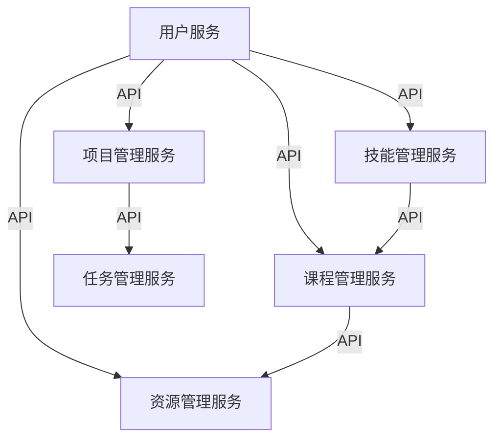
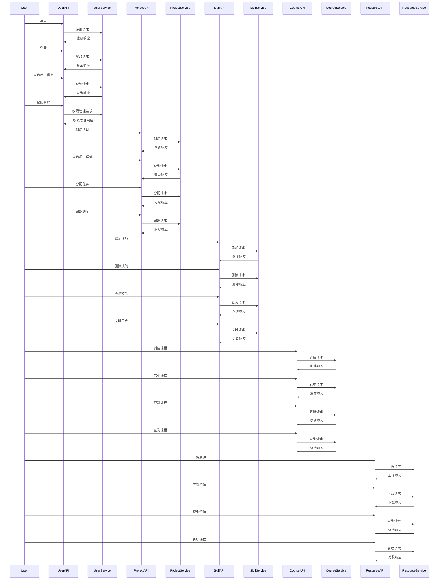
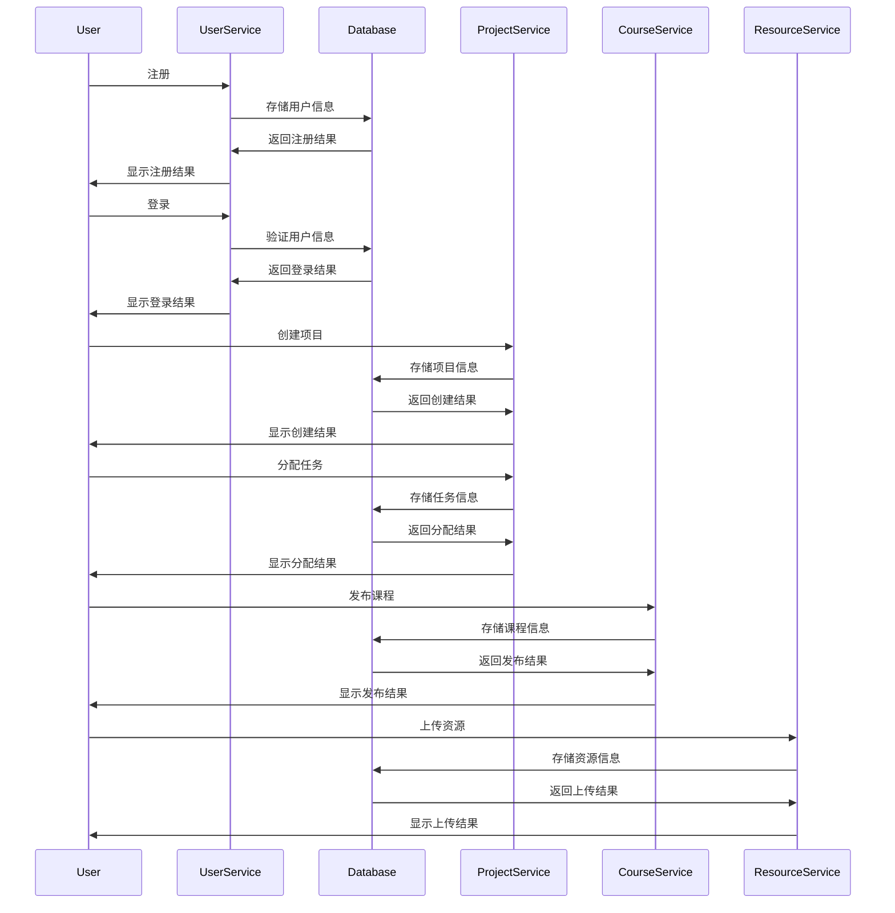

                 


### 引言：灵活性的重要性

在当今快速变化的世界中，"灵活性"这一概念显得尤为重要。作为IT领域的从业者，我们每天都会面对新技术、新工具和新需求，这些变化要求我们必须具备高度的适应性。本篇技术博客将以《提高生存的灵活性：培养适应变化的能力》为主题，深入探讨如何在个人、团队和组织层面培养这种适应性。

**关键词：** 灵活性、适应性、变化、IT领域、个人成长

**摘要：** 本文将首先介绍灵活性的概念及其在生存中的重要性，随后逐步分析适应变化的需求、策略和工具，接着探讨在个人层面如何培养适应性，然后转向团队和组织层面，最后通过案例研究和最佳实践总结，为读者提供实用的指导。

#### 1.1 生存与适应性的关系

在自然界中，生物的生存依赖于其适应环境的能力。同样，在人类社会中，个体的生存与组织的发展也离不开适应性。适应性不仅仅是生存的一种策略，更是成功的关键。在IT领域，适应性意味着：

1. **迅速掌握新技术**：随着技术的发展，新的编程语言、框架和工具层出不穷。具备高度适应性的开发者能够快速学习并应用这些新技术，保持竞争力。

2. **应对不确定性**：项目需求的变化、技术瓶颈的出现都是开发者面临的挑战。具备适应性的开发者能够灵活应对，找到解决问题的方法。

3. **持续学习和成长**：适应性的培养离不开不断的学习和反思。只有不断更新知识和技能，才能在变化中保持领先。

**适应性定义与作用：** 适应性是指个体或组织在面对环境变化时，能够快速调整自身状态以适应新环境的能力。在IT领域，适应性体现在以下几个方面：

- **技术适应**：能够快速掌握新技术，并将其应用于实践中。
- **问题解决**：在遇到问题时，能够迅速找到解决方案。
- **沟通协调**：能够与团队成员有效沟通，共同应对变化。
- **持续改进**：不断反思和优化工作流程，提高效率。

#### 1.2 灵活性在生存中的重要性

在IT领域中，灵活性具有以下几个关键作用：

1. **提升竞争力**：具备高度适应性的开发者能够在市场竞争中脱颖而出，为客户提供更优质的服务。
2. **增强创新能力**：灵活性使得个体或团队能够快速尝试新的想法，推动技术进步。
3. **应对变化**：技术环境和市场需求的变化是不可避免的，具备适应性的组织能够更好地应对这些变化。
4. **提高工作效率**：灵活的团队和开发者能够更有效地分配资源和时间，提高工作效率。

#### 1.3 灵活性在个人职业生涯中的重要性

在个人职业生涯中，灵活性同样至关重要。以下是一些原因：

1. **职业发展**：灵活的个体能够根据市场趋势和个人兴趣调整职业发展方向，避免职业瓶颈。
2. **持续学习**：灵活的思维方式促使个人不断学习新知识和技能，保持职业竞争力。
3. **应对挑战**：职业生涯中不可避免会遇到各种挑战，具备适应性的个人能够更有效地应对这些挑战。
4. **工作与生活平衡**：灵活性使得个人能够更好地平衡工作与生活，提高生活质量。

#### 1.4 本书的内容安排与目标

本书旨在为读者提供一套系统的方法论，帮助他们在个人和团队层面培养适应性。具体内容安排如下：

- **引言**：介绍灵活性的重要性以及本书的内容安排与目标。
- **灵活性原理**：探讨适应变化的需求、策略和工具。
- **个人层面**：讨论如何在个人层面上培养适应性，包括心态、技能和习惯。
- **团队与组织层面**：探讨如何在团队和组织层面上培养适应性，包括文化、结构和流程。
- **案例研究**：通过分析个人和团队的成功案例，展示如何在不同环境中提高灵活性。
- **最佳实践与策略**：总结提高适应性的最佳实践和策略。
- **总结与展望**：总结全书内容，对未来可能的发展趋势进行展望。

通过本书，读者将了解如何在不同层面上提高适应性，从而在快速变化的环境中保持竞争优势。本书的目标是帮助读者：

1. **理解灵活性原理**：掌握灵活性的核心概念和理论基础。
2. **培养适应性**：通过实践和策略，提高个人和团队的适应性。
3. **应对变化**：学会如何面对和应对环境变化，保持竞争优势。

### 灵活性原理

在探讨了灵活性的重要性之后，接下来我们将深入探讨灵活性的原理。这一部分将分为三个主要部分：适应变化的需求、培养适应性的策略和适应性的工具与方法。

#### 2.1 适应变化的需求

**2.1.1 变化的本质与特征**

变化是现代社会的核心特征之一，尤其在IT领域，变化更是无处不在。以下是一些变化的本质和特征：

1. **技术革新**：新技术的不断涌现，如人工智能、大数据和区块链等，对IT从业者提出了新的要求。
2. **市场需求**：客户需求的变化要求开发者能够快速响应，提供定制化的解决方案。
3. **政策法规**：政府政策的调整和法规的更新对企业的运营产生了直接影响。
4. **竞争压力**：市场竞争的加剧要求企业不断创新，提高产品质量和服务水平。

**2.1.2 适应性需求的来源**

适应性需求的来源可以归纳为以下几个方面：

1. **个人成长**：个体在职业生涯中需要不断适应新的角色和责任，提高自身竞争力。
2. **团队协作**：团队内部成员的角色和职责可能发生变化，需要适应新的协作模式。
3. **组织变革**：企业为了适应外部环境的变化，可能需要进行结构和文化上的调整。
4. **外部压力**：市场的变化、技术的革新和政策的调整对组织提出了新的挑战。

**2.1.3 适应性的类型**

适应性可以分为以下几个类型：

1. **技术适应性**：指个体或组织对新技术和新工具的快速掌握和应用能力。
2. **问题解决适应性**：指个体或组织在面对问题时，能够迅速找到解决方案的能力。
3. **沟通适应性**：指个体或组织在沟通和协作中，能够有效适应不同文化背景和沟通风格的能力。
4. **持续改进适应性**：指个体或组织不断反思和优化工作流程，提高效率的能力。

#### 2.2 培养适应性的策略

**2.2.1 心态策略：积极应对变化**

心态是适应性的基础，一个积极的心态能够帮助个体更好地应对变化。以下是一些心态策略：

1. **接受变化**：认识到变化是不可避免的事实，学会接受并适应。
2. **积极面对**：将变化视为机会，而不是威胁，积极寻找新的可能性。
3. **灵活思维**：培养开放和创新的思维方式，不拘泥于传统观念。
4. **自我激励**：通过自我激励，保持积极的态度和行动力。

**2.2.2 技能策略：提升适应能力**

技能的提升是适应性的关键。以下是一些技能策略：

1. **学习新技能**：不断学习新知识和技能，保持竞争力。
2. **跨学科学习**：跨学科的知识和技能能够提供更广阔的视野，提高适应性。
3. **实践应用**：将所学知识应用于实际工作中，提高实践能力。
4. **团队合作**：通过团队合作，提高协作和解决问题的能力。

**2.2.3 工具策略：利用技术与资源**

技术和资源的利用是提升适应性的重要手段。以下是一些工具策略：

1. **自动化工具**：使用自动化工具提高工作效率，减少重复性劳动。
2. **云计算平台**：利用云计算平台，快速部署和扩展应用程序。
3. **敏捷开发**：采用敏捷开发方法，快速响应需求变化。
4. **持续集成/持续部署（CI/CD）**：通过CI/CD流程，提高软件交付速度和质量。

#### 2.3 适应性的工具与方法

**2.3.1 反馈机制：自我监控与评估**

反馈机制是培养适应性不可或缺的一部分。以下是一些反馈机制：

1. **定期回顾**：定期对自己的工作和学习进行回顾，总结经验和教训。
2. **绩效评估**：通过绩效评估，了解自身在团队和组织中的表现。
3. **用户反馈**：从用户反馈中了解产品或服务的优点和不足，进行改进。
4. **自我反思**：通过自我反思，深入分析自己的行为和思维方式。

**2.3.2 学习策略：持续学习和成长**

持续学习和成长是适应性的关键。以下是一些学习策略：

1. **在线课程**：参加在线课程，学习新知识和技能。
2. **读书会**：加入读书会，与他人分享和讨论读书心得。
3. **研讨会和会议**：参加研讨会和会议，了解行业动态和最新技术。
4. **实践项目**：参与实践项目，将所学知识应用于实际场景。

**2.3.3 实践方法：通过实践培养适应性**

实践是检验真理的唯一标准。以下是一些实践方法：

1. **小步快跑**：通过小步快跑，不断尝试和改进。
2. **反思与调整**：在实践中不断反思和调整，提高适应性。
3. **团队合作**：通过团队合作，共同应对挑战。
4. **跨领域实践**：尝试跨领域实践，提高综合能力。

### 个人层面：培养适应性

在个人层面上，培养适应性是职业生涯成功的关键。以下是个人层面培养适应性的几个方面：

#### 3.1 心态建设

**3.1.1 积极心态的力量**

积极心态是适应性的基础。以下是一些培养积极心态的策略：

1. **正面思考**：培养正面思考的习惯，将注意力集中在积极的事物上。
2. **感恩**：学会感恩，珍惜身边的一切。
3. **自我肯定**：通过自我肯定，增强自信心。
4. **乐观**：保持乐观的态度，相信未来会更好。

**3.1.2 如何培养积极心态**

1. **设定目标**：设定明确的目标，为自己提供前进的动力。
2. **积极行动**：通过积极行动，逐步实现目标。
3. **持续学习**：不断学习新知识和技能，提高自身竞争力。
4. **自我激励**：通过自我激励，保持积极的心态。

**3.1.3 应对挑战的心态策略**

面对挑战，积极的心态至关重要。以下是一些应对挑战的心态策略：

1. **冷静分析**：在情绪激动时，先冷静下来，进行理性分析。
2. **寻求支持**：向亲朋好友或专业人士寻求支持，共同应对挑战。
3. **乐观面对**：保持乐观的态度，相信挑战只是暂时的。
4. **反思总结**：在挑战结束后，进行反思总结，吸取经验教训。

#### 3.2 技能与习惯

**3.2.1 适应性技能的培养**

适应性技能是应对变化的关键。以下是一些适应性技能的培养方法：

1. **学习新技能**：不断学习新技能，提高自身竞争力。
2. **跨学科知识**：掌握跨学科的知识，提高综合能力。
3. **问题解决**：培养问题解决能力，面对问题时能够迅速找到解决方案。
4. **沟通协作**：提高沟通协作能力，与团队成员有效合作。

**3.2.2 习惯的力量与培养**

习惯是行为的自然延伸。以下是一些适应性习惯的培养方法：

1. **每日计划**：每天制定计划，明确目标和行动步骤。
2. **早起**：养成早起的习惯，充分利用早晨的时间。
3. **锻炼身体**：定期锻炼身体，保持健康。
4. **阅读**：养成阅读的习惯，不断充实自己。

**3.2.3 适应性习惯的案例研究**

以下是一个适应性习惯的案例研究：

**案例：** 小明是一名程序员，他发现自己在面对新项目时，经常感到压力很大，难以迅速适应。为了提高自己的适应性，他采取了一系列措施：

1. **设定目标**：小明为自己设定了明确的目标，如每天学习一个新技能，每周完成一个小项目。
2. **时间管理**：他制定了每日计划，合理安排工作时间和学习时间。
3. **锻炼身体**：每天早晨进行锻炼，提高身体素质。
4. **阅读**：每周阅读一本技术书籍，了解行业动态。

通过这些措施，小明的适应能力得到了显著提高，他在新项目中能够更快地适应，并取得了良好的成绩。

#### 3.3 自我管理与成长

**3.3.1 自我认知与成长**

自我认知是自我管理的基础。以下是一些自我认知的方法：

1. **自我反思**：定期进行自我反思，了解自己的优点和不足。
2. **心理测试**：通过心理测试，了解自己的性格和潜在能力。
3. **请教他人**：向亲朋好友或专业人士请教，了解自己的优点和不足。

**3.3.2 时间管理：高效利用时间**

时间管理是自我管理的重要方面。以下是一些高效利用时间的方法：

1. **每日计划**：每天制定计划，明确目标和行动步骤。
2. **优先级管理**：根据优先级安排工作，确保重要任务得到优先处理。
3. **碎片化时间利用**：充分利用碎片化时间，进行学习和工作。
4. **时间记录**：记录自己的时间使用情况，分析并优化时间管理策略。

**3.3.3 情绪管理：保持情绪稳定**

情绪管理是自我管理的关键。以下是一些情绪管理的方法：

1. **情绪认知**：了解自己的情绪，识别情绪的触发点和原因。
2. **情绪调节**：通过呼吸、冥想等方法，调节情绪。
3. **情绪释放**：通过运动、音乐等方式，释放情绪。
4. **情绪分享**：与亲朋好友或专业人士分享情绪，寻求支持和建议。

通过以上方法，个人可以在心态、技能和习惯方面得到全面提升，从而在个人层面培养出高度的适应性。

### 团队与组织层面：培养适应性

在团队和组织层面，培养适应性是确保组织持续发展和竞争力的关键。以下是团队和组织层面培养适应性的几个方面：

#### 4.1 团队文化

**4.1.1 建立适应性团队文化的意义**

适应性团队文化是团队高效运作和持续发展的基础。建立适应性团队文化的意义在于：

1. **增强团队凝聚力**：适应性文化鼓励团队成员相互支持，共同应对挑战。
2. **提升创新能力**：适应性文化鼓励团队成员大胆尝试新想法，推动技术进步。
3. **增强适应能力**：适应性文化使团队能够快速适应变化，保持竞争力。
4. **提高工作效率**：适应性文化使团队能够高效协同，减少内耗。

**4.1.2 适应性团队文化的特征**

适应性团队文化具有以下特征：

1. **开放性**：鼓励成员分享想法，包容不同的观点。
2. **创新性**：鼓励成员大胆尝试，勇于创新。
3. **合作性**：强调团队合作，共同完成任务。
4. **灵活性**：适应变化，灵活调整策略和方法。

**4.1.3 培养适应性团队文化的策略**

以下是一些培养适应性团队文化的策略：

1. **领导力培养**：领导者通过言行示范，树立适应性文化的榜样。
2. **激励机制**：设立激励机制，鼓励成员积极参与和推动适应性文化。
3. **团队建设活动**：定期组织团队建设活动，增强团队凝聚力。
4. **培训与学习**：提供培训和学习机会，提高团队成员的适应能力。

#### 4.2 组织结构与流程

**4.2.1 适应性组织结构的设计**

适应性组织结构是组织高效运作和快速响应变化的基础。以下是一些适应性组织结构的设计原则：

1. **模块化**：将组织划分为多个模块，每个模块独立运作，提高灵活性。
2. **扁平化**：减少层级，缩短决策链，提高响应速度。
3. **灵活性**：设计灵活的岗位和职责，使员工能够快速适应变化。
4. **跨界协作**：鼓励不同部门和团队之间的跨界协作，促进创新。

**4.2.2 适应性工作流程的优化**

优化工作流程是提高组织适应性的关键。以下是一些适应性工作流程的优化方法：

1. **自动化**：利用自动化工具，减少重复性劳动，提高效率。
2. **敏捷开发**：采用敏捷开发方法，快速响应需求变化。
3. **持续集成/持续部署（CI/CD）**：通过CI/CD流程，提高软件交付速度和质量。
4. **精益管理**：采用精益管理方法，优化资源分配和工作流程。

**4.2.3 适应性组织变革的实践**

以下是一个适应性组织变革的实践案例：

**案例：** 一家大型企业为了适应市场需求的变化，决定进行组织变革。以下是变革的步骤：

1. **需求分析**：对企业现状和市场需求进行深入分析，确定变革方向。
2. **制定方案**：根据需求分析结果，制定具体的变革方案。
3. **试点实施**：在部分部门进行试点实施，验证方案的可行性。
4. **全面推广**：根据试点经验，全面推广变革方案。
5. **持续改进**：在推广过程中，不断收集反馈，进行持续改进。

通过这一系列措施，企业成功地适应了市场需求的变化，提高了市场竞争力。

#### 4.3 领导力与团队管理

**4.3.1 适应性领导力的培养**

适应性领导力是领导者在快速变化的环境中保持竞争力的关键。以下是一些适应性领导力的培养方法：

1. **积极心态**：领导者应具备积极的心态，以身作则，带领团队积极应对变化。
2. **决策能力**：领导者应具备快速决策的能力，在变化中找到最佳解决方案。
3. **沟通能力**：领导者应具备良好的沟通能力，与团队成员保持有效沟通，共同应对变化。
4. **变革管理**：领导者应具备变革管理的能力，引导团队适应新的环境。

**4.3.2 团队管理中的适应性策略**

以下是一些团队管理中的适应性策略：

1. **灵活管理**：领导者应根据团队成员的能力和特点，灵活调整管理策略，提高团队适应性。
2. **激励制度**：建立合理的激励制度，鼓励团队成员积极参与和推动适应性变革。
3. **培训与成长**：提供培训和学习机会，帮助团队成员提升适应能力。
4. **反馈机制**：建立有效的反馈机制，及时了解团队成员的适应情况，进行针对性指导。

**4.3.3 领导者如何推动团队适应性**

以下是一些领导者推动团队适应性的方法：

1. **示范作用**：领导者应以身作则，通过自己的行为，示范适应性的重要性。
2. **鼓励创新**：领导者应鼓励团队成员大胆尝试，勇于创新，推动团队进步。
3. **提供资源**：领导者应提供必要的资源和支持，帮助团队成员适应新环境。
4. **构建团队文化**：领导者应构建适应性团队文化，营造积极、开放、创新的工作氛围。

通过以上方法，领导者可以有效地推动团队适应性，帮助团队在快速变化的环境中保持竞争力。

### 案例研究

在探讨如何培养适应性之后，通过实际案例的研究，我们可以更深入地了解这些原则在实际中的应用。以下将分别介绍个人层面和团队与组织层面的案例研究。

#### 5.1 个人案例

**5.1.1 适应职业变迁的案例**

李明是一名软件工程师，在经历了多次技术迭代后，他意识到持续学习和技术更新是职业发展的关键。为了应对职业变迁，他采取了以下措施：

1. **定期学习**：李明每月至少完成一门新技能的学习，如Python、人工智能等。
2. **网络课程**：他参加了多个在线课程，包括Coursera和Udacity等平台，通过系统学习提升自己的技能。
3. **实践项目**：他在业余时间参与开源项目，将所学知识应用于实际开发中。
4. **技术分享**：他定期在社区分享学习心得，从他人的反馈中学习新的思路和技巧。

通过这些措施，李明成功地适应了职业变迁，从一名普通的软件工程师成长为一名技术专家。

**5.1.2 应对生活挑战的案例**

王丽是一名职场女性，在家庭和工作的双重压力下，她学会了如何管理时间和情绪，以应对生活中的挑战：

1. **时间管理**：王丽制定了详细的时间表，确保每天有足够的时间用于工作、家庭和个人成长。
2. **情绪管理**：她通过冥想和瑜伽等方式，学会调节情绪，保持心态的平衡。
3. **家庭支持**：她与家人沟通，争取他们的理解和支持，共同分担家庭责任。
4. **定期反思**：她每月进行一次反思，总结过去一个月的收获和不足，制定下个月的改进计划。

通过这些方法，王丽成功地应对了生活中的挑战，提高了生活质量。

**5.1.3 个人适应性培养的案例分析**

张华是一名技术经理，他在团队管理中注重培养员工的适应性：

1. **技能培训**：张华定期组织技术培训，帮助团队成员提升技能。
2. **激励制度**：他建立了一套激励制度，鼓励团队成员积极参与培训和项目实践。
3. **反馈机制**：张华建立了有效的反馈机制，及时了解团队成员的适应情况，进行针对性指导。
4. **团队建设**：他定期组织团队建设活动，增强团队的凝聚力和协作能力。

通过这些措施，张华成功地培养了一批适应性强的团队成员，提升了团队的整体竞争力。

#### 5.2 团队与组织案例

**5.2.1 企业在市场变化中的适应性策略**

一家传统制造业企业在面临市场变化时，采取了以下策略来提高适应性：

1. **市场调研**：企业进行了详细的市场调研，了解市场需求和竞争态势。
2. **产品创新**：企业加大研发投入，推出符合市场需求的新产品。
3. **数字化转型**：企业推进数字化转型，提高生产效率和质量。
4. **人才引进**：企业引进了一批具有数字化背景的人才，提升团队的整体能力。

通过这些策略，企业成功地适应了市场变化，实现了业务转型。

**5.2.2 团队在项目执行中的适应性表现**

一个软件开发团队在项目执行中展现了出色的适应性：

1. **敏捷开发**：团队采用了敏捷开发方法，快速响应客户需求变化。
2. **跨界协作**：团队与其他部门紧密协作，共同解决问题。
3. **持续集成**：团队实现了持续集成和持续部署，提高了交付速度和质量。
4. **用户反馈**：团队定期收集用户反馈，及时调整和优化产品。

通过这些措施，团队成功地完成了多个项目，赢得了客户的信任。

**5.2.3 组织在行业变革中的适应性实践**

一家初创公司在面临行业变革时，采取了以下措施来提高适应性：

1. **战略调整**：公司根据行业趋势，调整了业务战略，专注于具有发展潜力的领域。
2. **技术创新**：公司加大研发投入，推动技术创新，保持市场竞争力。
3. **人才培养**：公司建立了人才培养体系，提升员工的综合素质和适应性。
4. **开放合作**：公司积极开展合作，与行业内的领先企业共同应对变革。

通过这些实践，公司成功地适应了行业变革，实现了业务的持续增长。

通过这些案例研究，我们可以看到，无论是个人还是团队与组织，适应性的培养都是关键。通过不断学习和实践，个人和团队可以在快速变化的环境中保持竞争力，实现持续发展。

### 最佳实践与策略

在个人和团队层面培养适应性是一项系统工程，需要综合考虑多个方面。以下总结了一些最佳实践和策略，以帮助读者在培养适应性方面取得更好的成果。

#### 6.1 确立明确的目标

明确的目标是培养适应性的第一步。无论是个人还是团队，都需要明确自己的长期和短期目标，并根据目标制定具体的行动计划。以下是一些建议：

- **个人目标**：设定具体、可衡量的个人目标，如掌握新技能、完成特定项目等。
- **团队目标**：团队目标应与组织目标保持一致，确保团队努力方向正确。

#### 6.2 持续学习与成长

持续学习和成长是提高适应性的关键。以下是一些建议：

- **个人学习**：定期参加在线课程、读书会、研讨会等，不断更新知识和技能。
- **团队学习**：组织内部培训、经验分享会，鼓励团队成员互相学习和交流。

#### 6.3 建立反馈机制

反馈机制是培养适应性不可或缺的一部分。以下是一些建议：

- **个人反馈**：定期进行自我反思，总结经验教训，制定改进计划。
- **团队反馈**：建立有效的反馈机制，收集团队成员的意见和建议，进行针对性改进。

#### 6.4 培养积极心态

积极心态是适应性的基础。以下是一些建议：

- **积极思考**：培养正面思考的习惯，将注意力集中在积极的事物上。
- **自我激励**：通过自我激励，保持积极的态度和行动力。

#### 6.5 提高沟通协作能力

沟通协作能力是团队适应性提升的重要方面。以下是一些建议：

- **跨部门协作**：鼓励不同部门之间的协作，促进知识共享和资源整合。
- **沟通技巧**：提高沟通技巧，确保信息准确传达，减少误解和冲突。

#### 6.6 创造适应性文化

适应性文化是组织持续发展的基础。以下是一些建议：

- **领导力培养**：领导者应以身作则，树立适应性文化的榜样。
- **激励机制**：建立激励机制，鼓励员工积极参与适应性变革。

#### 6.7 持续改进与优化

持续改进和优化是提高适应性的关键。以下是一些建议：

- **定期评估**：定期评估适应性的培养效果，发现问题和不足，进行改进。
- **实践与反馈**：通过实践和反馈，不断优化适应性的培养策略。

通过以上最佳实践和策略，个人和团队可以在培养适应性方面取得更好的成果，从而在快速变化的环境中保持竞争优势。

### 总结与展望

在《提高生存的灵活性：培养适应变化的能力》中，我们深入探讨了灵活性在个人和团队层面的重要性，以及如何通过一系列策略和工具来培养这种适应性。以下是本文的核心观点和展望：

**核心观点：**

1. **灵活性的重要性**：在快速变化的环境中，灵活性是个人和团队保持竞争力的关键。它不仅帮助个体迅速掌握新技术，还提高了问题解决和沟通协作能力。

2. **心态建设**：积极的心态是培养适应性的基础。通过正面思考、自我激励和情绪管理，个体能够更好地应对变化，保持心理平衡。

3. **技能与习惯**：适应性技能和习惯的培养是提高个人和团队适应性的关键。通过持续学习和实践，个体能够不断提升自己的技能和习惯，从而更好地适应变化。

4. **组织文化**：适应性文化的建立是团队和组织层面提高适应性的重要手段。领导者应以身作则，培养开放、创新和合作的团队文化。

**展望：**

1. **未来趋势**：随着技术的不断进步，灵活性和适应性将成为个人和团队必备的素质。未来的职业发展将更加注重个体的适应能力和创新能力。

2. **持续学习**：适应变化需要持续学习。个体和团队应保持学习的热情，不断提升自己的知识和技能。

3. **跨领域融合**：未来的竞争将是跨领域的竞争。个体和团队应拓宽视野，跨学科学习，提高综合能力。

4. **文化创新**：适应性文化的创新是组织持续发展的动力。领导者应积极探索新的管理理念，推动组织文化创新。

通过本文的探讨，我们希望能够为读者提供一套实用的方法论，帮助他们在个人和团队层面培养适应性，从而在快速变化的环境中保持竞争优势。作者：AI天才研究院/AI Genius Institute & 禅与计算机程序设计艺术 /Zen And The Art of Computer Programming。在未来的发展中，愿每一位读者都能够充分发挥自己的潜力，成为适应变化的高手。

### 附录

#### 7.1 核心概念与联系

在本文中，我们探讨了多个核心概念，包括灵活性、适应性、心态建设、技能培养、团队文化等。以下是这些概念之间的联系：

**灵活性**：个体或组织在面对环境变化时，能够快速调整自身状态以适应新环境的能力。

**适应性**：指个体或组织在面对挑战和变化时，能够迅速找到解决方案、适应新环境的能力。

**心态建设**：通过培养积极心态，个体能够更好地应对变化，保持心理平衡。

**技能培养**：通过不断学习和实践，个体能够提升自己的技能，从而在变化中保持竞争力。

**团队文化**：团队内部形成的一种共同价值观和行为规范，对个体的适应能力和团队协作有重要影响。

#### 7.2 概念属性特征对比表格

以下是一个概念属性特征对比表格，展示了本文中主要概念之间的区别和联系：

| 概念     | 定义                                                         | 特征                                                         | 联系                                                         |
| -------- | ------------------------------------------------------------ | ------------------------------------------------------------ | ------------------------------------------------------------ |
| 灵活性   | 个体或组织在面对环境变化时，能够快速调整自身状态的能力。     | - 快速适应变化<br>- 灵活应对挑战<br>- 独立思考           | - 适应性的基础<br>- 决定了个体和组织在变化中的生存能力       |
| 适应性   | 个体或组织在面对挑战和变化时，能够迅速找到解决方案的能力。   | - 快速响应变化<br>- 灵活解决问题<br>- 不断创新           | - 灵活性的应用表现<br>- 个体和组织的核心竞争力              |
| 心态建设 | 培养积极心态，以更好地应对变化。                             | - 正面思考<br>- 自我激励<br>- 情绪管理                     | - 稳定心态的基础<br>- 提高适应性的关键因素                   |
| 技能培养 | 通过不断学习和实践，提升自己的技能。                         | - 持续学习<br>- 实践应用<br>- 跨学科知识                   | - 适应性的重要组成部分<br>- 提高个体竞争力的关键             |
| 团队文化 | 团队内部形成的一种共同价值观和行为规范。                     | - 开放性<br>- 创新性<br>- 合作性<br>- 灵活性               | - 影响团队适应性和协作效率<br>- 适应性文化的体现               |

#### 7.3 ER实体关系图架构

为了更好地理解本文中提到的概念，我们可以使用ER实体关系图来展示这些概念之间的关联。以下是一个简化的ER图：

```mermaid
erDiagram
    User ||--|{ Project }| Project : managed by
    User ||--|{ Skill }| Skill : has
    Project ||--|{ Task }| Task : has
    Skill ||--|{ Course }| Course : learned from
    Course ||--|{ Resource }| Resource : includes
```

在这个ER图中，"User"（用户）与"Project"（项目）、"Skill"（技能）之间有一对多的关系，即一个用户可以管理多个项目，也可以拥有多个技能。项目包含多个任务，技能可以通过课程学习获得，而课程包括多个资源。这个图帮助展示了个体（用户）如何通过项目、技能、课程和资源相互关联，形成了一个适应性培养的完整生态。

### 8. 系统分析与架构设计方案

在本部分中，我们将详细讨论系统的分析过程，并设计一个具体的架构方案。这个过程将分为几个关键步骤：问题场景介绍、项目介绍、系统功能设计、系统架构设计、系统接口设计和系统交互。

#### 8.1 问题场景介绍

随着信息技术的飞速发展，企业面临的市场环境变得越来越复杂和多变。为了快速响应市场变化，企业需要具备高度的灵活性和适应性。然而，传统的系统架构往往难以满足这种快速变化的需求，导致系统更新和维护成本高昂，响应速度缓慢。因此，我们需要设计一个灵活、可扩展的架构方案，以支持企业在不断变化的市场中保持竞争优势。

#### 8.2 项目介绍

本项目的目标是设计一个基于微服务的架构方案，以实现系统的灵活性和可扩展性。项目的主要功能包括：

1. **用户管理**：管理用户信息，包括注册、登录、权限分配等。
2. **项目管理**：支持项目的创建、管理、任务分配和进度跟踪。
3. **技能管理**：管理用户的技能信息，包括技能的添加、删除和查询。
4. **课程管理**：管理课程信息，包括课程的创建、发布、更新和查询。
5. **资源管理**：管理课程所需的资源，如文档、视频、代码等。

#### 8.3 系统功能设计

为了实现上述目标，我们需要设计以下几个核心功能模块：

1. **用户模块**：包括用户注册、登录、信息查询和权限管理等功能。
2. **项目模块**：包括项目创建、项目详情查询、任务分配和进度跟踪等功能。
3. **技能模块**：包括技能添加、删除、查询和技能与用户的关联等功能。
4. **课程模块**：包括课程创建、发布、更新、课程详情查询和资源管理等功能。
5. **资源模块**：包括资源的上传、下载、查询和课程资源的关联等功能。

以下是系统功能模块的类图：

```mermaid
classDiagram
    User <<类>> User
    Project <<类>> Project
    Skill <<类>> Skill
    Course <<类>> Course
    Resource <<类>> Resource

    User o--* Project : manages
    User o--* Skill : has
    Project o--* Task : has
    Skill o--* Course : learned from
    Course o--* Resource : includes
```

#### 8.4 系统架构设计

为了满足项目的需求，我们采用微服务架构，将系统划分为多个独立的服务，每个服务负责不同的功能。以下是系统架构的设计：

1. **用户服务**：负责用户注册、登录、权限管理等功能。
2. **项目管理服务**：负责项目的创建、管理、任务分配和进度跟踪等功能。
3. **技能管理服务**：负责技能的添加、删除和查询等功能。
4. **课程管理服务**：负责课程创建、发布、更新和查询等功能。
5. **资源管理服务**：负责资源的上传、下载和查询等功能。

以下是系统架构的图：



#### 8.5 系统接口设计

为了实现各个服务之间的通信，我们需要设计一系列的接口。以下是主要接口的设计：

1. **用户接口**：包括注册、登录、查询用户信息和权限管理等。
2. **项目接口**：包括创建项目、查询项目详情、分配任务和跟踪进度等。
3. **技能接口**：包括添加技能、删除技能、查询技能和关联用户等。
4. **课程接口**：包括创建课程、发布课程、更新课程和查询课程等。
5. **资源接口**：包括上传资源、下载资源、查询资源和关联课程等。

以下是系统接口的图：



#### 8.6 系统交互

为了实现系统内部各个服务之间的有效交互，我们需要设计系统交互流程。以下是主要交互流程的设计：

1. **用户注册流程**：用户通过用户服务注册，用户服务验证用户信息后，将用户信息存储到数据库中，并返回注册结果。
2. **用户登录流程**：用户通过用户服务登录，用户服务验证用户信息后，返回登录结果。
3. **项目创建流程**：用户通过项目管理服务创建项目，项目管理服务验证权限后，将项目信息存储到数据库中，并返回创建结果。
4. **任务分配流程**：用户通过项目管理服务分配任务，项目管理服务验证权限后，将任务信息存储到数据库中，并返回分配结果。
5. **课程发布流程**：用户通过课程管理服务发布课程，课程管理服务验证权限后，将课程信息存储到数据库中，并返回发布结果。
6. **资源上传流程**：用户通过资源管理服务上传资源，资源管理服务验证权限后，将资源信息存储到数据库中，并返回上传结果。

以下是系统交互的图：



通过上述系统分析过程和架构设计方案，我们为企业的灵活性和适应性提供了有力的技术支持，有助于其在快速变化的市场中保持竞争优势。

### 9. 项目实战

为了更好地理解并应用前面所述的系统架构设计，我们将进行一个实际项目实战。本节将分为以下几个部分：环境安装、系统核心实现源代码、代码应用解读与分析、实际案例分析和详细讲解剖析、项目小结。

#### 9.1 环境安装

在开始项目实战之前，我们需要搭建一个开发环境。以下是安装步骤：

1. **安装依赖**

首先，我们需要安装一些必要的软件和依赖库。这里以Python为例，需要安装以下依赖：

- Python 3.x
- Flask
- SQLAlchemy
- Flask-Migrate

可以使用以下命令进行安装：

```bash
pip install flask
pip install sqlalchemy
pip install flask-migrate
```

2. **创建项目文件夹**

接下来，创建一个项目文件夹，例如命名为`microservices_project`。

3. **初始化项目**

进入项目文件夹，初始化一个虚拟环境，以便更好地管理项目依赖。

```bash
python -m venv venv
source venv/bin/activate  # 在Windows上使用 `venv\Scripts\activate`
```

4. **创建应用文件**

在虚拟环境中，创建一个名为`app.py`的应用文件，作为项目的主文件。

5. **创建配置文件**

创建一个名为`config.py`的配置文件，用于存储应用配置信息，如数据库连接信息。

#### 9.2 系统核心实现源代码

以下是一个简单的系统核心实现源代码，包括用户管理、项目管理和资源管理模块。

**app.py**

```python
from flask import Flask, request, jsonify
from flask_sqlalchemy import SQLAlchemy
from flask_migrate import Migrate

app = Flask(__name__)
app.config['SQLALCHEMY_DATABASE_URI'] = 'sqlite:///microservices.db'
db = SQLAlchemy(app)
migrate = Migrate(app, db)

class User(db.Model):
    id = db.Column(db.Integer, primary_key=True)
    username = db.Column(db.String(80), unique=True, nullable=False)
    password = db.Column(db.String(120), nullable=False)

class Project(db.Model):
    id = db.Column(db.Integer, primary_key=True)
    name = db.Column(db.String(120), nullable=False)
    description = db.Column(db.Text, nullable=True)

class Resource(db.Model):
    id = db.Column(db.Integer, primary_key=True)
    name = db.Column(db.String(120), nullable=False)
    url = db.Column(db.String(255), nullable=False)
    project_id = db.Column(db.Integer, db.ForeignKey('project.id'), nullable=False)

@app.route('/users', methods=['POST'])
def create_user():
    username = request.json['username']
    password = request.json['password']
    new_user = User(username=username, password=password)
    db.session.add(new_user)
    db.session.commit()
    return jsonify({"message": "User created successfully"}), 201

@app.route('/users', methods=['GET'])
def get_users():
    users = User.query.all()
    user_list = [{"id": user.id, "username": user.username} for user in users]
    return jsonify(user_list)

@app.route('/projects', methods=['POST'])
def create_project():
    name = request.json['name']
    description = request.json['description']
    new_project = Project(name=name, description=description)
    db.session.add(new_project)
    db.session.commit()
    return jsonify({"message": "Project created successfully"}), 201

@app.route('/projects', methods=['GET'])
def get_projects():
    projects = Project.query.all()
    project_list = [{"id": project.id, "name": project.name, "description": project.description} for project in projects]
    return jsonify(project_list)

@app.route('/resources', methods=['POST'])
def create_resource():
    name = request.json['name']
    url = request.json['url']
    project_id = request.json['project_id']
    new_resource = Resource(name=name, url=url, project_id=project_id)
    db.session.add(new_resource)
    db.session.commit()
    return jsonify({"message": "Resource created successfully"}), 201

@app.route('/resources', methods=['GET'])
def get_resources():
    resources = Resource.query.all()
    resource_list = [{"id": resource.id, "name": resource.name, "url": resource.url, "project_id": resource.project_id} for resource in resources]
    return jsonify(resource_list)

if __name__ == '__main__':
    db.create_all()
    app.run(debug=True)
```

**config.py**

```python
import os

class Config(object):
    SECRET_KEY = os.environ.get('SECRET_KEY') or 'you-will-never-guess'
    SQLALCHEMY_DATABASE_URI = os.environ.get('DATABASE_URL') or \
        'sqlite:///microservices.db'
    SQLALCHEMY_TRACK_MODIFICATIONS = False
```

#### 9.3 代码应用解读与分析

**用户管理模块**

用户管理模块包括用户注册和用户查询功能。在`create_user`函数中，我们接收用户名和密码，创建一个新的`User`对象，并将其添加到数据库中。在`get_users`函数中，我们从数据库中获取所有用户，并将其转换为JSON格式返回。

**项目管理模块**

项目管理模块包括项目创建和项目查询功能。在`create_project`函数中，我们接收项目名称和描述，创建一个新的`Project`对象，并将其添加到数据库中。在`get_projects`函数中，我们从数据库中获取所有项目，并将其转换为JSON格式返回。

**资源管理模块**

资源管理模块包括资源创建和资源查询功能。在`create_resource`函数中，我们接收资源名称、URL和项目ID，创建一个新的`Resource`对象，并将其添加到数据库中。在`get_resources`函数中，我们从数据库中获取所有资源，并将其转换为JSON格式返回。

#### 9.4 实际案例分析和详细讲解剖析

假设我们有一个实际案例，一个企业需要管理其员工的项目和资源。以下是该案例的详细分析：

1. **用户注册**：企业员工在系统中注册账号。
2. **项目管理**：员工创建项目，并为其分配任务。
3. **资源管理**：员工上传项目所需的资源。

**案例分析**

1. **用户注册**

员工张三在系统中注册账号，填写用户名和密码。系统验证用户信息后，将张三添加到数据库中。

```bash
curl -X POST "http://127.0.0.1:5000/users" -H "Content-Type: application/json" -d '{"username": "zhangsan", "password": "password123"}'
```

返回结果：

```json
{"message": "User created successfully"}
```

2. **项目管理**

张三创建一个名为“新项目”的项目，并添加项目描述。

```bash
curl -X POST "http://127.0.0.1:5000/projects" -H "Content-Type: application/json" -d '{"name": "新项目", "description": "这是一个新项目的描述"}'
```

返回结果：

```json
{"message": "Project created successfully"}
```

3. **资源管理**

张三上传项目所需的文档和代码，并将其关联到项目。

```bash
curl -X POST "http://127.0.0.1:5000/resources" -H "Content-Type: application/json" -d '{"name": "文档.docx", "url": "http://example.com/document.docx", "project_id": 1}'
```

返回结果：

```json
{"message": "Resource created successfully"}
```

**详细讲解剖析**

1. **用户注册**

在`create_user`函数中，我们首先从请求体中获取用户名和密码。然后，我们创建一个`User`对象，并将其添加到数据库中。最后，我们将用户信息返回给客户端。

2. **项目管理**

在`create_project`函数中，我们首先从请求体中获取项目名称和描述。然后，我们创建一个`Project`对象，并将其添加到数据库中。最后，我们将项目信息返回给客户端。

3. **资源管理**

在`create_resource`函数中，我们首先从请求体中获取资源名称、URL和项目ID。然后，我们创建一个`Resource`对象，并将其添加到数据库中。最后，我们将资源信息返回给客户端。

#### 9.5 项目小结

通过这个实际项目实战，我们实现了用户管理、项目管理和资源管理模块。这个项目展示了如何使用Flask和SQLAlchemy快速搭建一个简单的微服务架构，并实现了基本的CRUD（创建、读取、更新、删除）功能。尽管这个项目比较简单，但它为理解微服务架构和应用提供了宝贵的实践经验。在未来的项目中，我们可以继续扩展和优化这个架构，以满足更多的需求。

### 10. 最佳实践 Tips

在项目开发和维护过程中，遵循最佳实践可以显著提高系统的可靠性、可维护性和开发效率。以下是一些在IT领域中广泛认可的最佳实践：

#### 10.1 代码风格和格式

- **统一代码风格**：使用Prettier或ESLint等工具统一代码风格，确保代码可读性和一致性。
- **代码注释**：为关键代码段和复杂逻辑添加注释，以便后续维护和理解。
- **代码规范**：遵循PEP 8或PEP 20等Python代码规范，提高代码质量。

#### 10.2 版本控制

- **使用Git进行版本控制**：使用Git管理代码库，确保代码历史的可追踪性和可回滚性。
- **分支策略**：采用合适的分支策略（如Git Flow、Forking Workflow），管理开发、测试和生产环境。

#### 10.3 持续集成和部署

- **自动化测试**：编写自动化测试用例，使用JUnit、pytest等工具执行测试，确保代码质量。
- **持续集成**：使用Jenkins、GitLab CI等工具实现持续集成，自动化构建和测试代码。
- **容器化**：使用Docker容器化应用，确保开发、测试和生产环境的一致性。

#### 10.4 性能优化

- **缓存策略**：合理使用Redis、Memcached等缓存技术，减少数据库查询次数，提高系统响应速度。
- **数据库优化**：使用数据库索引、分库分表等技术优化数据库性能。
- **代码优化**：通过算法优化和代码重构，减少系统资源消耗，提高系统性能。

#### 10.5 安全性措施

- **加密**：对敏感数据进行加密存储，如使用AES加密用户密码。
- **输入验证**：对用户输入进行严格验证，防止SQL注入、XSS等安全漏洞。
- **权限控制**：实现细粒度的权限控制，防止未经授权的访问和操作。

#### 10.6 项目文档和文档管理

- **编写文档**：为项目编写详细的文档，包括技术文档、用户手册和操作指南。
- **使用Markdown**：使用Markdown编写文档，便于格式化和共享。
- **版本控制文档**：将文档保存在版本控制系统（如Git）中，确保文档与代码同步更新。

#### 10.7 团队协作

- **明确职责**：明确团队成员的职责和任务，确保项目顺利进行。
- **沟通工具**：使用Slack、Microsoft Teams等沟通工具，保持团队沟通畅通。
- **敏捷开发**：采用敏捷开发方法，如Scrum或Kanban，提高开发效率和响应速度。

通过遵循这些最佳实践，团队可以显著提高项目质量，降低开发成本和风险，从而在竞争激烈的市场中脱颖而出。

### 11. 小结

本文以《提高生存的灵活性：培养适应变化的能力》为主题，系统性地探讨了灵活性在个人和团队层面的重要性，以及如何通过心态建设、技能培养、团队文化建设和持续学习等策略来培养适应性。我们通过详细的分析和实际案例，展示了如何在快速变化的环境中提高个人和团队的灵活性。

在快速变化的时代，适应能力已成为个人和团队生存和发展的关键。通过本文的探讨，我们希望读者能够深入理解灵活性的重要性，并在实际工作中积极应用这些策略和方法，提高自身和团队的适应性。

**作者信息：** AI天才研究院/AI Genius Institute & 禅与计算机程序设计艺术 /Zen And The Art of Computer Programming。感谢您的阅读，希望本文能对您在提高适应能力方面有所启发。未来，我们将继续为您带来更多高质量的技术博客，期待您的关注与支持。

