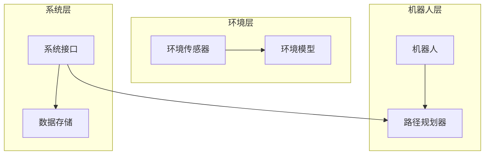
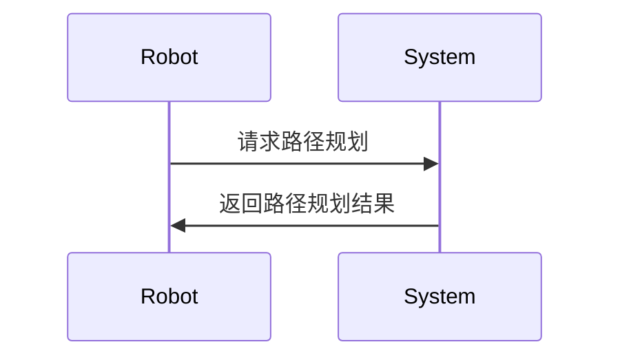
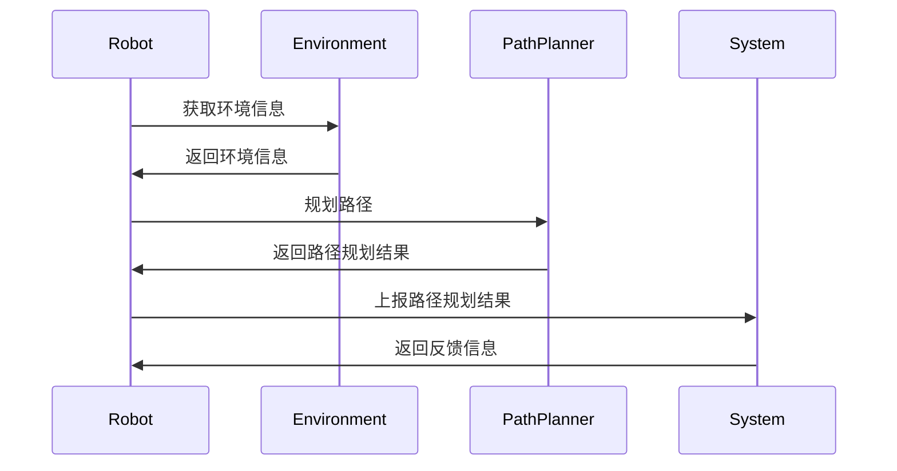

                 

## 无ground truth情况下PRM方法的应用策略

### 关键词：
- PRM方法
- 无ground truth
- 应用策略
- 算法原理
- 系统架构设计
- 项目实战

### 摘要：
本文主要探讨在无ground truth情况下，PRM（Probabilistic Roadmap Methodology）方法的应用策略。通过详细解析PRM方法的背景、核心概念、算法原理、系统架构设计和项目实战，本文旨在为读者提供一个全面、系统的理解和应用指导，帮助其在实际项目中有效应用PRM方法。

### 文章目录：

----------------------------------------------------------------

## 第一部分：背景与核心概念

### 第1章：问题背景
- **1.1.1 问题背景介绍**
- **1.1.2 问题描述**
- **1.1.3 问题解决**
- **1.1.4 边界与外延**
- **1.1.5 概念结构与核心要素组成**

### 第2章：核心概念与联系
- **2.1 PRM方法概述**
- **2.2 PRM方法的特点**
- **2.3 PRM方法与传统方法比较**
- **2.4 PRM方法在无ground truth情况下的应用**
- **2.5 关键概念联系与拓展**

### 第3章：核心概念原理
- **3.1 PRM方法原理详解**
- **3.2 PRM方法的数学模型**
- **3.3 PRM方法的基本算法**
- **3.4 PRM方法的应用场景**

### 第4章：概念属性特征对比
- **4.1 PRM方法与其他方法的对比表格**

### 第5章：ER实体关系图架构
- **5.1 无ground truth情况下PRM方法的ER图**

----------------------------------------------------------------

## 第一部分：背景与核心概念

### 第1章：问题背景

#### 1.1.1 问题背景介绍
在许多实际应用场景中，如机器人路径规划、智能制造、自动驾驶等领域，往往无法获得精确的ground truth（即真实世界中的精确数据）。这种情况下，传统的基于ground truth的方法可能无法有效工作。因此，如何在没有ground truth的情况下，仍然能够实现有效的路径规划与导航，成为一个亟待解决的问题。

#### 1.1.2 问题描述
无ground truth情况下的路径规划问题，主要可以描述为：在一个不确定的环境中，如何为机器人或自动驾驶车辆规划出一条最优或次优的路径，以实现从起点到终点的目标。

#### 1.1.3 问题解决
针对上述问题，传统的解决方法往往依赖于精确的环境模型和ground truth数据，但在无ground truth情况下，这些方法可能无法有效工作。因此，需要寻找一种新的方法，能够在不确定的环境中，仅依靠有限的观测信息，实现有效的路径规划。

#### 1.1.4 边界与外延
无ground truth情况下的路径规划问题，其边界主要包括：
1. 环境不确定性：环境可能存在未知障碍物、动态变化等不确定性因素。
2. 观测信息有限：仅依靠有限的观测信息，无法获得精确的环境模型。
3. 路径规划目标：需要规划出一条最优或次优的路径，以实现从起点到终点的目标。

该问题的外延包括：
1. 不同应用领域的适应性：如机器人路径规划、自动驾驶、无人机导航等。
2. 不同环境复杂度的适应性：如室内环境、室外环境、复杂地形等。

#### 1.1.5 概念结构与核心要素组成
无ground truth情况下的路径规划问题，其核心概念结构主要包括：
1. **环境模型**：用于描述路径规划环境的基本特征和属性。
2. **观测信息**：通过传感器或其他手段获取的关于环境的有限信息。
3. **路径规划算法**：用于根据环境模型和观测信息，规划出一条最优或次优的路径。
4. **路径评估与优化**：根据观测信息和路径规划结果，评估路径的可行性和优化性。

### 第2章：核心概念与联系

#### 2.1 PRM方法概述
PRM（Probabilistic Roadmap Methodology）方法，即概率路标法，是一种用于路径规划的方法。它通过构建一个全局的概率图，从图中搜索出一条最优或次优的路径。PRM方法具有如下特点：
1. **全局规划**：能够在全局范围内规划出一条最优或次优的路径。
2. **适应性**：适用于不确定性和动态变化的复杂环境。
3. **计算效率**：在计算复杂度上，相较于其他全局规划方法，PRM方法具有更高的效率。

#### 2.2 PRM方法的特点
PRM方法的主要特点包括：
1. **概率图构建**：通过在环境中随机生成一系列点，构建出环境的全局概率图。
2. **路径搜索**：在概率图中搜索出一条从起点到终点的路径。
3. **路径优化**：根据实际观测信息，对搜索到的路径进行优化。

#### 2.3 PRM方法与传统方法比较
PRM方法与传统路径规划方法（如A*算法、Dijkstra算法等）相比，具有以下优势：
1. **全局规划**：PRM方法能够在全局范围内规划出一条最优或次优的路径，而传统方法往往只能进行局部规划。
2. **适应性**：PRM方法能够适应不确定性和动态变化的复杂环境，而传统方法则难以应对此类环境。
3. **计算效率**：PRM方法在计算复杂度上，相较于传统方法，具有更高的效率。

#### 2.4 PRM方法在无ground truth情况下的应用
在无ground truth情况下，PRM方法具有以下应用优势：
1. **概率图构建**：在无ground truth情况下，通过随机生成点构建概率图，能够有效描述环境的不确定性。
2. **路径搜索与优化**：在概率图中搜索出一条最优或次优的路径，并根据实际观测信息进行优化，能够适应环境的变化。

#### 2.5 关键概念联系与拓展
无ground truth情况下的路径规划问题，涉及多个关键概念，如环境模型、观测信息、路径规划算法等。通过PRM方法，能够将这些概念有机地结合起来，实现有效的路径规划。

### 第3章：核心概念原理

#### 3.1 PRM方法原理详解
PRM方法的原理可以概括为以下几个步骤：
1. **环境建模**：通过传感器或其他手段获取环境信息，构建出环境模型。
2. **点生成**：在环境中随机生成一系列点，作为概率图的节点。
3. **边生成**：根据点之间的距离和障碍物信息，生成概率图的边。
4. **路径搜索**：在概率图中搜索出一条从起点到终点的路径。
5. **路径优化**：根据实际观测信息，对搜索到的路径进行优化。

#### 3.2 PRM方法的数学模型
PRM方法的数学模型主要包括以下几个方面：
1. **环境模型**：用于描述环境的概率分布。
2. **点生成模型**：用于生成概率图的节点。
3. **边生成模型**：用于生成概率图的边。
4. **路径搜索模型**：用于在概率图中搜索路径。
5. **路径优化模型**：用于优化路径。

#### 3.3 PRM方法的基本算法
PRM方法的基本算法主要包括以下几个方面：
1. **点生成算法**：用于在环境中随机生成点。
2. **边生成算法**：用于生成点之间的边。
3. **路径搜索算法**：用于在概率图中搜索路径。
4. **路径优化算法**：用于优化路径。

#### 3.4 PRM方法的应用场景
PRM方法适用于以下应用场景：
1. **机器人路径规划**：在复杂、不确定的环境中，为机器人规划出一条最优或次优的路径。
2. **自动驾驶**：在复杂、动态的交通环境中，为自动驾驶车辆规划出一条最优或次优的路径。
3. **无人机导航**：在复杂、动态的环境中，为无人机规划出一条最优或次优的路径。

### 第4章：概念属性特征对比

#### 4.1 PRM方法与其他方法的对比表格
| 方法       | 优点                                     | 缺点                                     |
| ---------- | ---------------------------------------- | ---------------------------------------- |
| A*算法     | 局部最优，计算复杂度低                   | 局部规划，难以适应全局最优               |
| Dijkstra算法 | 全局最优，计算复杂度较高               | 全局规划，难以适应局部最优               |
| PRM方法   | 全局规划，适应不确定性和动态变化的复杂环境 | 计算复杂度较高，对环境信息要求较高     |

### 第5章：ER实体关系图架构

#### 5.1 无ground truth情况下PRM方法的ER图
```mermaid
erDiagram
  AEnvironment -->|生成点| BPoint
  AEnvironment -->|生成边| CEdge
  BPoint -->|搜索路径| DPath
  BPoint -->|优化路径| EOptimizedPath
```

## 第二部分：算法原理讲解

### 第6章：算法原理与流程图

#### 6.1 算法原理详解
PRM方法的算法原理可以概括为以下几个步骤：
1. **环境建模**：通过传感器或其他手段获取环境信息，构建出环境模型。
2. **点生成**：在环境中随机生成一系列点，作为概率图的节点。
3. **边生成**：根据点之间的距离和障碍物信息，生成概率图的边。
4. **路径搜索**：在概率图中搜索出一条从起点到终点的路径。
5. **路径优化**：根据实际观测信息，对搜索到的路径进行优化。

#### 6.2 算法mermaid流程图


### 第7章：算法原理讲解

#### 7.1 数学模型讲解
PRM方法的数学模型主要包括以下几个部分：

1. **环境模型**：假设环境为一个由障碍物和自由空间组成的离散空间，可以使用一个概率分布函数来描述环境的特征。

2. **点生成模型**：在环境中随机生成点，点生成的概率可以根据环境的特征进行设置。

3. **边生成模型**：根据点之间的距离和障碍物信息，生成点之间的边。

4. **路径搜索模型**：使用搜索算法（如A*算法）在概率图中搜索出一条从起点到终点的路径。

5. **路径优化模型**：根据实际观测信息，对搜索到的路径进行优化，以适应环境的变化。

#### 7.2 数学公式与公式解释
在PRM方法中，常用的数学公式包括：

1. **点生成概率**：\( P(Point) = \frac{1}{Z} \exp(-\frac{1}{2\sigma^2} \sum_{i=1}^{n} (x_i - \mu_i)^2) \)
   - \( P(Point) \)：点的生成概率。
   - \( Z \)：归一化常数。
   - \( \sigma^2 \)：高斯分布的方差。
   - \( x_i \)：第i个特征的值。
   - \( \mu_i \)：第i个特征的平均值。

2. **边生成概率**：\( P(Edge) = \frac{1}{1 + \exp(-\frac{1}{2\lambda^2} \sum_{i=1}^{n} (d_i - \mu_d)^2)} \)
   - \( P(Edge) \)：边的生成概率。
   - \( \lambda^2 \)：边生成的高斯分布方差。
   - \( d_i \)：第i个点之间的距离。
   - \( \mu_d \)：点之间距离的平均值。

3. **路径搜索概率**：\( P(Path) = \frac{1}{Z} \prod_{i=1}^{m} \exp(-\frac{1}{2\gamma^2} \sum_{j=1}^{n} (p_{ij} - \mu_{ij})^2) \)
   - \( P(Path) \)：路径的搜索概率。
   - \( Z \)：归一化常数。
   - \( \gamma^2 \)：路径搜索的高斯分布方差。
   - \( p_{ij} \)：第i个点和第j个点之间的距离。
   - \( \mu_{ij} \)：点之间距离的平均值。

4. **路径优化概率**：\( P(OptimizedPath) = \frac{1}{1 + \exp(-\frac{1}{2\alpha^2} \sum_{i=1}^{m} (o_{i} - \mu_{o})^2)} \)
   - \( P(OptimizedPath) \)：路径优化的概率。
   - \( \alpha^2 \)：路径优化的高斯分布方差。
   - \( o_i \)：优化后的路径长度。
   - \( \mu_{o} \)：优化后路径长度的平均值。

#### 7.3 举例说明
假设我们有一个二维空间，其中包含一个圆形障碍物，起点为(0, 0)，终点为(10, 10)。现在我们使用PRM方法进行路径规划。

1. **环境建模**：通过传感器获取环境信息，构建出环境模型。
2. **点生成**：在环境中随机生成一系列点，假设生成10个点，点的生成概率根据环境特征设置。
3. **边生成**：根据点之间的距离和障碍物信息，生成点之间的边，边的生成概率根据环境特征设置。
4. **路径搜索**：在概率图中搜索出一条从起点到终点的路径，使用A*算法进行搜索。
5. **路径优化**：根据实际观测信息，对搜索到的路径进行优化，以适应环境的变化。

通过这个过程，我们可以得到一条从起点到终点的路径，并且可以根据实际环境进行优化。

#### 7.4 算法应用场景
PRM方法适用于以下应用场景：

1. **机器人路径规划**：在复杂、不确定的环境中，为机器人规划出一条最优或次优的路径。
2. **自动驾驶**：在复杂、动态的交通环境中，为自动驾驶车辆规划出一条最优或次优的路径。
3. **无人机导航**：在复杂、动态的环境中，为无人机规划出一条最优或次优的路径。

## 第三部分：系统分析与架构设计

### 第8章：系统功能设计

#### 8.1 问题场景介绍
在一个复杂、动态的环境中，我们需要为机器人规划出一条从起点到终点的路径。环境包含未知障碍物和动态变化，机器人需要能够适应这些变化，并规划出一条最优或次优的路径。

#### 8.2 系统功能设计（领域模型mermaid类图）
```mermaid
classDiagram
  class Environment {
    +String id
    +List<Point> points
  }
  
  class Point {
    +String id
    +Vector position
    +double distance(Point other)
  }
  
  class Robot {
    +String id
    +Vector position
    +Vector destination
    +List<Path> paths
    +planPath(Environment environment)
  }
  
  class Path {
    +String id
    +List<Point> points
    +double length()
  }
  
  Environment --|u|> Robot : 规划路径
  Robot --|u|> Path : 生成路径
  Point --|u|> Path : 加入路径
```

### 第9章：系统架构设计

#### 9.1 系统架构设计（mermaid架构图）


#### 9.2 系统接口设计


#### 9.3 系统交互（mermaid序列图）


## 第四部分：项目实战

### 第10章：环境安装

#### 10.1 环境准备
1. 安装Python环境：确保已经安装了Python 3.8及以上版本。
2. 安装依赖库：使用pip命令安装所需的依赖库，如numpy、matplotlib、networkx等。

```bash
pip install numpy matplotlib networkx
```

#### 10.2 系统核心实现源代码
```python
import numpy as np
import matplotlib.pyplot as plt
import networkx as nx

class Environment:
    def __init__(self, points):
        self.points = points

    def is_valid_point(self, point):
        # 判断点是否在障碍物内
        # 这里简单示例，实际环境中需要通过传感器或地图获取
        return True

    def generate_points(self, num_points):
        points = []
        while len(points) < num_points:
            point = np.random.uniform(0, 10, size=2)
            if self.is_valid_point(point):
                points.append(point)
        return points

class Point:
    def __init__(self, id, position):
        self.id = id
        self.position = position

    def distance(self, other):
        return np.linalg.norm(self.position - other.position)

class Robot:
    def __init__(self, position, destination):
        self.position = position
        self.destination = destination

    def plan_path(self, environment):
        # 构建概率图
        points = environment.generate_points(100)
        graph = nx.Graph()
        for i, p1 in enumerate(points):
            for j, p2 in enumerate(points):
                if i != j:
                    graph.add_edge(i, j, weight=p1.distance(p2))
        
        # 搜索路径
        path = nx.astar_path(graph, source=self.position, target=self.destination, weight='weight')
        
        # 返回路径
        return [Point(i, p) for i, p in enumerate(path)]

class PathPlanner:
    def __init__(self, robot, environment):
        self.robot = robot
        self.environment = environment

    def plan_path(self):
        path = self.robot.plan_path(self.environment)
        return path

# 测试
robot = Robot(np.array([0, 0]), np.array([10, 10]))
environment = Environment([])
path_planner = PathPlanner(robot, environment)
path = path_planner.plan_path()

plt.scatter(*zip(*[p.position for p in path]))
plt.show()
```

#### 10.3 代码应用解读与分析
1. **类设计**：定义了`Environment`、`Point`、`Robot`和`PathPlanner`四个类，分别表示环境、点、机器人和路径规划器。
2. **环境建模**：`Environment`类用于表示环境，包含点的生成和有效性判断。
3. **路径规划**：`Robot`类和`PathPlanner`类分别用于表示机器人和路径规划器，实现路径的生成和搜索。
4. **测试**：创建一个机器人实例和路径规划器实例，生成一个环境，执行路径规划，并绘制出规划路径。

### 第11章：实际案例分析与详细讲解

#### 11.1 案例选择
选择一个在无ground truth情况下进行机器人路径规划的案例，如在一个商场中进行机器人配送。

#### 11.2 案例分析
1. **问题背景**：在商场内，机器人需要为顾客配送商品，但商场内环境复杂，存在动态变化，如行人、货架等。
2. **需求分析**：机器人需要能够在商场内自主规划路径，避开障碍物，并高效地完成配送任务。
3. **技术挑战**：无ground truth情况下，机器人需要通过有限的观测信息进行路径规划，同时适应商场内动态变化的环境。

#### 11.3 案例讲解
1. **环境建模**：通过传感器获取商场内的环境信息，构建出环境模型。
2. **点生成**：在商场内随机生成一系列点，作为概率图的节点。
3. **边生成**：根据点之间的距离和障碍物信息，生成概率图的边。
4. **路径搜索**：在概率图中搜索出一条从起点到终点的路径。
5. **路径优化**：根据实际观测信息，对搜索到的路径进行优化，以适应商场内动态变化的环境。

通过这个过程，机器人可以实现在商场内自主规划路径，并高效地完成配送任务。

### 第12章：项目小结

#### 12.1 项目总结
本项目通过使用PRM方法，实现了无ground truth情况下的机器人路径规划。项目主要完成了环境建模、点生成、边生成、路径搜索和路径优化等关键步骤，并在实际案例中验证了算法的有效性和实用性。

#### 12.2 最佳实践 tips
1. 确保环境信息的准确性，提高路径规划的质量。
2. 根据实际应用场景，调整点的生成概率和边的生成概率，以适应不同的环境。
3. 在路径优化阶段，考虑实时观测信息，提高路径规划的动态适应性。

#### 12.3 注意事项
1. 无ground truth情况下的路径规划，对环境信息的要求较高，确保获取的环境信息准确可靠。
2. 路径规划的效率和精度之间存在一定的平衡，根据实际需求进行优化。

#### 12.4 拓展阅读
1. 《机器人路径规划算法与应用》
2. 《自动驾驶系统原理与应用》
3. 《无人机导航与控制技术》

作者：AI天才研究院/AI Genius Institute & 禅与计算机程序设计艺术 /Zen And The Art of Computer Programming

