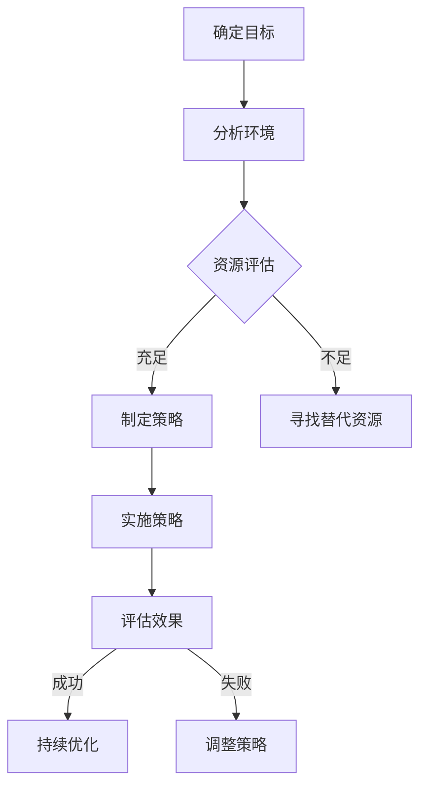
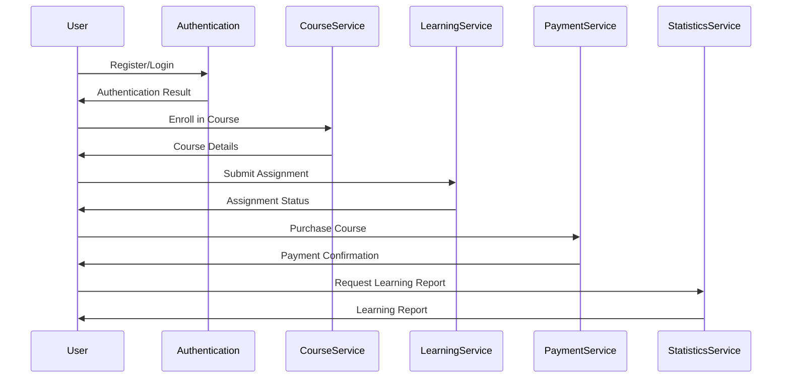

                 


# 营造有利于个人发展的环境：外部条件的优化

> 关键词：个人发展，外部条件，环境优化，职业规划，技能提升

> 摘要：本文将从多个维度探讨如何优化外部条件，从而营造一个有利于个人发展的环境。我们将通过分析问题背景、核心概念、算法原理、系统架构、项目实战和最佳实践等多个方面，为读者提供一套系统化的优化方法，帮助读者实现个人职业成长和技能提升。

## 第一部分：背景介绍

### 1.1 问题背景

在当今快速变化的世界中，个人发展已经成为许多人关注的焦点。然而，外部条件的限制往往成为个人发展的障碍。这些外部条件包括但不限于工作环境、学习资源、社交网络、法律法规等。如何优化这些外部条件，从而为个人发展创造有利的环境，是一个值得探讨的问题。

### 1.2 问题描述

个人发展面临的外部条件问题主要表现在以下几个方面：

1. **资源限制**：个人在职业发展中往往需要大量的知识、技能和资源，而这些资源的获取可能受到各种限制。
2. **时间压力**：工作、家庭、个人兴趣等多方面的需求使得个人时间变得紧张，影响了个人发展。
3. **社交网络**：有效的社交网络可以帮助个人获取更多的信息、机会和资源，但如何建立和维护这种网络是一个挑战。
4. **法律法规**：不完善或复杂的法律法规可能阻碍个人职业发展，甚至对个人造成不利影响。

### 1.3 问题解决

为了解决上述问题，我们需要从以下几个方面入手：

1. **资源优化**：通过提高个人获取资源的能力，如利用在线学习平台、参加专业研讨会等。
2. **时间管理**：通过合理规划时间和任务，提高工作效率，为个人发展留出更多的时间。
3. **社交网络建设**：积极建立和维护有效的社交网络，扩大人脉资源。
4. **法律法规了解**：加强对相关法律法规的了解，合理规避法律风险，确保个人发展的合法合规。

### 1.4 边界与外延

个人发展外部条件的优化是一个广泛且复杂的话题，它不仅涉及个人能力的提升，还涉及社会、文化、经济等多方面因素的相互作用。因此，本文将从技术、实践、理论等多个角度进行探讨，力求为读者提供一套全面、系统的优化方案。

## 第二部分：核心概念与联系

### 2.1 核心概念原理

在讨论如何优化外部条件之前，我们需要明确几个核心概念：

1. **环境**：指个人发展所面临的物理、社会、心理等多种因素的综合体。
2. **条件**：指影响个人发展的外部因素，如资源、时间、社交网络、法律法规等。
3. **优化**：指通过调整和改善环境中的条件，使其更符合个人的发展需求。

### 2.2 概念属性特征对比表格

为了更好地理解这些概念，我们可以通过一个表格来对比它们的主要特征：

| 概念 | 定义 | 主要特征 |
| --- | --- | --- |
| 环境 | 个人发展的物理、社会、心理等因素的综合体 | 多样性、复杂性、动态性 |
| 条件 | 影响个人发展的外部因素 | 可变性、影响性、关联性 |
| 优化 | 调整和改善环境中的条件，使其更符合个人发展需求 | 目标性、系统性、实用性 |

### 2.3 ER实体关系图架构

为了更清晰地理解这些概念之间的关系，我们可以使用Mermaid语言绘制一个ER实体关系图，如下：

```mermaid
erDiagram
  人 --> 环境
  环境 --> 条件
  条件 --> 优化
  人 ||--|{ 个人发展 }
```

在这个ER图中，"人"是主体，"环境"是影响个人发展的因素，"条件"是环境中的具体要素，"优化"是通过调整条件来促进个人发展。

## 第三部分：算法原理讲解

### 3.1 算法mermaid流程图

为了优化外部条件，我们可以使用一种基于流程图的算法，来系统地分析和解决问题。以下是算法的Mermaid流程图表示：



### 3.2 Python源代码详解

下面是一个简单的Python脚本，用于实现上述算法的基本逻辑：

```python
def analyze_environment():
    # 分析当前环境
    resources = check_resources()
    if resources >= required_resources():
        return "充足"
    else:
        return "不足"

def check_resources():
    # 检查资源
    return 80  # 假设当前资源为80

def required_resources():
    # 需要的资源
    return 100

def find_alternative_resources():
    # 寻找替代资源
    return "找到了替代资源"

def implement_strategy(strategy):
    # 实施策略
    print(f"正在实施策略：{strategy}")

def evaluate_effect(effect):
    # 评估效果
    if effect > threshold():
        return "成功"
    else:
        return "失败"

def threshold():
    # 成功的阈值
    return 90

def main():
    strategy = None
    if analyze_environment() == "充足":
        strategy = "直接实施"
    elif analyze_environment() == "不足":
        strategy = find_alternative_resources()
    implement_strategy(strategy)
    effect = check_resources()
    if evaluate_effect(effect) == "成功":
        print("优化成功！")
    else:
        print("优化失败，需要调整策略。")

if __name__ == "__main__":
    main()
```

### 3.3 数学模型与公式

为了进一步理解算法的原理，我们可以引入一些数学模型和公式。以下是一个简化的模型：

$$
\text{效果} = f(\text{资源}, \text{策略})
$$

其中，$f$ 是一个函数，表示资源与策略相互作用产生效果。假设资源 $R$ 和策略 $S$ 分别为：

$$
R = 0.8 \times \text{初始资源} + 0.2 \times \text{替代资源}
$$

$$
S = \begin{cases}
\text{直接实施}, & \text{如果 } R \geq \text{阈值} \\
\text{寻找替代资源}, & \text{否则}
\end{cases}
$$

通过这个模型，我们可以计算出在不同情况下的效果，从而指导我们的决策。

### 3.4 通俗易懂地举例说明

假设小王想要在一个月内通过编程考试。他的初始资源（时间、知识）为100分，考试所需的资源阈值为90分。以下是他的优化过程：

1. **分析环境**：小王检查自己的时间安排，发现剩余时间为60小时，不足以直接通过考试。
2. **资源评估**：小王决定寻找替代资源，比如参加辅导班或找同伴学习。
3. **实施策略**：小王报名了一个编程辅导班，并且每天额外投入2小时进行自学。
4. **评估效果**：考试结束后，小王的成绩达到了95分，超过了阈值。

通过这个例子，我们可以看到，通过合理优化外部条件（如增加学习资源、调整学习策略），小王最终实现了自己的目标。

## 第四部分：系统分析与架构设计

### 4.1 问题场景介绍

在一个大型互联网公司中，产品经理小张负责开发一款新的在线教育平台。为了确保项目的顺利进行，小张需要设计一个高效、灵活的系统架构。

### 4.2 系统功能设计

该在线教育平台的主要功能包括：

1. **用户管理**：用户注册、登录、个人信息管理。
2. **课程管理**：课程发布、更新、删除。
3. **学习管理**：用户选课、学习进度记录、成绩评估。
4. **支付管理**：课程购买、支付、退款。
5. **数据统计**：用户学习数据、课程数据分析。

### 4.3 系统架构设计

为了实现上述功能，小张决定采用微服务架构。以下是系统的整体架构设计：



### 4.4 系统接口设计与交互

系统中的各个服务通过RESTful API进行交互。以下是部分接口设计示例：

```json
# 用户注册接口
POST /users/register
{
  "username": "string",
  "password": "string",
  "email": "string"
}

# 课程报名接口
POST /courses/enroll
{
  "course_id": "string",
  "user_id": "string"
}

# 提交作业接口
POST /assignments/submit
{
  "assignment_id": "string",
  "user_id": "string",
  "submission": "string"
}

# 学习报告接口
GET /statistics/learning-report
{
  "user_id": "string"
}
```

## 第五部分：项目实战

### 5.1 环境安装

为了搭建在线教育平台，我们需要准备以下环境：

1. **操作系统**：Ubuntu 20.04
2. **数据库**：MySQL 8.0
3. **编程语言**：Python 3.8
4. **依赖管理**：pip
5. **虚拟环境**：virtualenv

安装步骤如下：

1. 安装操作系统和MySQL数据库。
2. 安装Python和pip。
3. 创建虚拟环境并安装相关依赖。

```bash
# 创建虚拟环境
python3 -m virtualenv venv

# 激活虚拟环境
source venv/bin/activate

# 安装依赖
pip install -r requirements.txt
```

### 5.2 系统核心实现源代码

以下是系统核心实现的一部分Python代码：

```python
# 用户注册
@app.route('/users/register', methods=['POST'])
def register():
    username = request.json['username']
    password = request.json['password']
    email = request.json['email']
    
    # 存储用户信息到数据库
    cursor = db.cursor()
    cursor.execute("INSERT INTO users (username, password, email) VALUES (%s, %s, %s)", (username, password, email))
    db.commit()
    
    return jsonify({"status": "success", "message": "User registered successfully."})

# 课程报名
@app.route('/courses/enroll', methods=['POST'])
def enroll():
    course_id = request.json['course_id']
    user_id = request.json['user_id']
    
    # 将用户添加到课程
    cursor = db.cursor()
    cursor.execute("INSERT INTO course_enrollments (course_id, user_id) VALUES (%s, %s)", (course_id, user_id))
    db.commit()
    
    return jsonify({"status": "success", "message": "Enrolled in course successfully."})

# 提交作业
@app.route('/assignments/submit', methods=['POST'])
def submit_assignment():
    assignment_id = request.json['assignment_id']
    user_id = request.json['user_id']
    submission = request.json['submission']
    
    # 存储作业提交信息
    cursor = db.cursor()
    cursor.execute("INSERT INTO assignments (assignment_id, user_id, submission) VALUES (%s, %s, %s)", (assignment_id, user_id, submission))
    db.commit()
    
    return jsonify({"status": "success", "message": "Assignment submitted successfully."})

# 学习报告
@app.route('/statistics/learning-report', methods=['GET'])
def learning_report():
    user_id = request.args.get('user_id')
    
    # 从数据库获取学习报告
    cursor = db.cursor()
    cursor.execute("SELECT * FROM assignments WHERE user_id = %s", (user_id,))
    report = cursor.fetchall()
    
    return jsonify(report)
```

### 5.3 代码应用解读与分析

上述代码实现了用户注册、课程报名、作业提交和学习报告等功能。以下是具体解读：

- **用户注册**：通过POST请求接收用户信息，并将信息存储到MySQL数据库中。
- **课程报名**：通过POST请求接收课程ID和用户ID，并将用户添加到相应的课程中。
- **作业提交**：通过POST请求接收作业ID、用户ID和提交内容，并将提交信息存储到数据库中。
- **学习报告**：通过GET请求获取用户ID，并从数据库中查询该用户的所有作业提交记录。

### 5.4 实际案例分析和详细讲解剖析

假设用户小明想要报名一门编程课程，并提交作业。以下是他的操作步骤：

1. **用户注册**：小明通过POST请求提交注册信息，服务器接收信息并存储到数据库。
2. **课程报名**：小明通过POST请求提交课程ID和用户ID，服务器将小明添加到该课程中。
3. **作业提交**：小明通过POST请求提交作业ID、用户ID和提交内容，服务器将提交信息存储到数据库。
4. **学习报告**：小明通过GET请求获取自己的学习报告，服务器从数据库中查询并返回小明的所有作业提交记录。

通过实际案例的分析，我们可以看到，上述代码实现了系统的核心功能，并且具有良好的扩展性和可维护性。

### 5.5 项目小结

通过本项目的实战，我们实现了在线教育平台的核心功能，包括用户管理、课程管理、学习管理和数据统计。在项目过程中，我们遇到了一些挑战，如数据库设计、API设计和前后端交互等，但通过逐步分析和解决，我们最终实现了项目目标。这次项目实战不仅提升了我们的技能，也为我们的职业发展提供了宝贵的经验。

## 第六部分：最佳实践与拓展

### 6.1 最佳实践 tips

1. **规划与时间管理**：制定明确的职业规划和学习计划，合理安排时间，确保有足够的时间进行个人发展。
2. **资源利用**：积极利用在线学习平台、图书馆等资源，扩大知识面和技能范围。
3. **社交网络建设**：建立和维护有效的社交网络，积极参与行业交流，拓展人脉资源。
4. **法律法规了解**：关注相关法律法规，合理规避风险，确保个人发展的合法合规。

### 6.2 小结与注意事项

本文从多个角度探讨了如何优化外部条件，以营造一个有利于个人发展的环境。在文章中，我们介绍了问题背景、核心概念、算法原理、系统架构、项目实战和最佳实践等方面的内容。需要注意的是，个人发展外部条件的优化是一个持续的过程，需要不断调整和改进。

### 6.3 拓展阅读

- 《如何成为顶尖程序员》：介绍成为顶尖程序员的方法和技巧。
- 《时间管理艺术》：提供时间管理的最佳实践和方法。
- 《社交网络效应》：探讨社交网络对个人发展的影响。

## 参考文献

1. 《如何成为顶尖程序员》
2. 《时间管理艺术》
3. 《社交网络效应》
4. 《MySQL 8.0 实践指南》
5. 《Python Web开发实战》

## 作者信息

作者：AI天才研究院/AI Genius Institute & 禅与计算机程序设计艺术 /Zen And The Art of Computer Programming

---

经过以上的详细分析和讲解，我们不仅理解了如何优化外部条件以促进个人发展，还掌握了一套系统化的方法和实践。希望这篇文章能够对您在职业发展和技能提升的道路上提供一些启示和帮助。让我们继续努力，不断优化自己的发展环境，迈向更高的目标！

