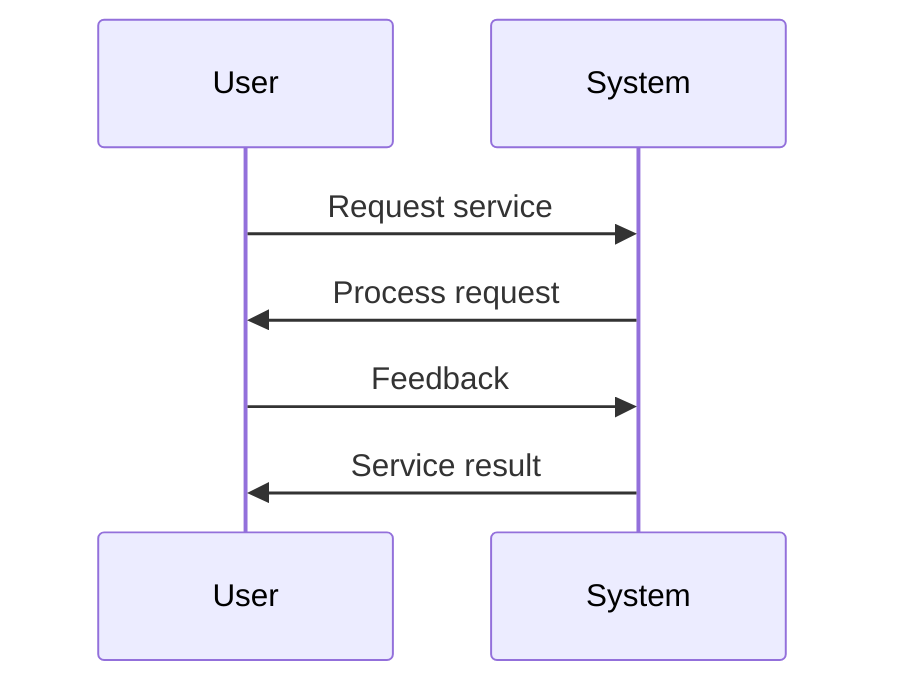
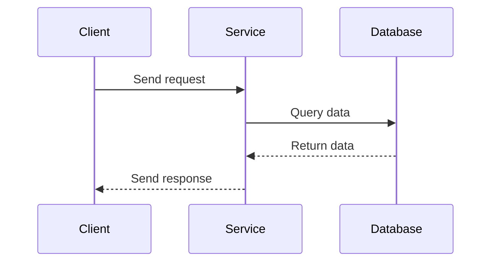

                 


# 虚无主义与创新精神：在怀疑中寻找新的可能性

## 摘要

本文以虚无主义与创新精神为主题，探讨了在现代社会中这两种看似矛盾的思想如何相互融合，并推动人类社会的进步。虚无主义作为一种哲学思潮，挑战了传统的价值观和意义，而创新精神则强调不断探索和创造新的可能性。本文将从历史背景、哲学基础、融合路径等方面，深入分析虚无主义与创新精神的内涵，以及它们如何影响我们的生活和科技发展。通过阐述两者的关系，本文旨在为读者提供一种新的思考方式，帮助我们在怀疑中寻找新的可能性，从而推动个人和社会的持续进步。

## 关键词

虚无主义、创新精神、哲学、怀疑、可能性、哲学思潮、价值观、科技创新、个人成长

----------------------------------------------------------------

## 第1章：虚无主义的起源与哲学探讨

### 1.1 虚无主义的起源

虚无主义（Nihilism）这一概念起源于19世纪的欧洲，特别是在俄罗斯哲学和德国哲学中。虚无主义的根源可以追溯到对宗教和道德价值的怀疑，以及对人类生活意义和目的的深刻反思。最早提出虚无主义思想的哲学家是尼采，他在其作品中探讨了虚无主义的本质，并试图通过“超人”的概念来对抗虚无主义。

### 1.1.1 虚无主义的概念定义

虚无主义的核心概念是“无意义”和“无价值”。虚无主义者认为，世界和生命本身缺乏内在的价值和目的，一切都是无意义的。这种观点挑战了传统的宗教和道德观念，对人们的世界观产生了深远的影响。

### 1.1.2 虚无主义的哲学流派

虚无主义有多种不同的流派，包括存在主义虚无主义、道德虚无主义和审美虚无主义等。存在主义虚无主义认为，由于生命的不可预测性和不确定性，人类无法找到生命的意义。道德虚无主义则质疑道德标准的绝对性，认为道德规范是人类自我创造的产物，不具有客观性。审美虚无主义则认为，美和艺术的价值也是主观的，没有绝对的标准。

### 1.2 虚无主义的影响

虚无主义的影响遍及艺术、文化、社会和政治领域。在艺术上，虚无主义导致了反传统和反美学的艺术运动，如达达主义和超现实主义。在文化上，虚无主义挑战了传统的价值观和权威，促进了自由思想和多元文化的兴起。在社会和政治上，虚无主义对极端主义和革命运动产生了影响，如俄罗斯的无政府主义运动和法国的极端左翼思潮。

### 1.3 虚无主义在当代哲学中的地位

在当代哲学中，虚无主义仍然是一个重要的议题。虽然虚无主义被视为一种悲观主义和消极主义，但它也为哲学提供了一种新的思考方式，促使人们反思生命的意义和价值。虚无主义的批判和挑战也促使哲学家们探索新的哲学问题和理论框架。

### 1.4 本章小结

本章对虚无主义的起源和哲学探讨进行了概述。虚无主义作为一种哲学思潮，挑战了传统的价值观和意义，引发了广泛的讨论和争议。通过理解虚无主义的概念和影响，我们可以更好地理解它在现代哲学中的地位，并探索虚无主义与创新精神的融合路径。

## 第2章：创新精神的哲学基础

### 2.1 创新精神的定义

创新精神是指一种不断探索、尝试和创造新事物的态度和能力。它不仅包括技术创新，还涵盖社会创新、文化创新等多个领域。创新精神的核心是“创新思维”，它强调突破传统观念和方法的束缚，寻找新的解决方案和可能性。

### 2.1.1 创新精神的核心要素

创新精神的核心要素包括创造力、好奇心、坚韧性和开放性。创造力是创新精神的基础，它源于个体的内在兴趣和天赋。好奇心则驱动个体不断探索未知领域，寻找新的发现和突破。坚韧性和开放性则是创新过程中不可或缺的品质，它们帮助个体在面对困难和挑战时保持坚定和灵活。

### 2.1.2 创新精神与传统观念的比较

与传统观念相比，创新精神更强调实践和探索。传统观念倾向于遵循已有的规则和模式，而创新精神则鼓励打破常规，尝试新的方法和思路。此外，创新精神更加注重个体和集体的合作，认为创新需要多方力量的共同努力。

### 2.2 创新精神的培养

创新精神的培养不仅需要个人的努力，也需要教育体系和组织的支持。以下是一些培养创新精神的方法：

#### 2.2.1 教育体系中的创新精神培养

教育体系应注重培养学生的创造力、好奇心和批判性思维。通过多样化的课程和实践活动，激发学生的兴趣和探索欲望。同时，教育体系应鼓励学生跨学科学习，培养他们的综合能力和创新思维。

#### 2.2.2 个人修养与自我提升

个人修养和自我提升是培养创新精神的关键。个体应不断学习新知识，提升自己的专业技能和知识水平。同时，个体应培养良好的心态，保持对未知领域的好奇心和探索精神。

### 2.3 创新实践的方法

创新实践的方法多种多样，以下是一些常见的创新实践方法：

#### 2.3.1 案例分析

案例分析是一种有效的创新实践方法。通过研究成功和失败的案例，个体可以从中学习到宝贵的经验和教训，为未来的创新提供借鉴。

#### 2.3.2 创新方法论

创新方法论是一种系统化的创新实践方法。它通过一系列步骤和工具，帮助个体和团队识别问题、生成创意和实施创新。常见的创新方法论包括头脑风暴、设计思维和敏捷开发等。

### 2.4 创新精神在现代社会中的作用

创新精神在现代社会中的作用至关重要。以下是一些创新精神在现代社会中的作用：

#### 2.4.1 经济发展

创新精神是推动经济发展的重要动力。通过技术创新和商业模式创新，个体和企业可以创造新的价值和市场机会，促进经济增长。

#### 2.4.2 社会进步

创新精神推动社会进步。通过创新，个体和社会可以解决各种问题，改善生活质量，促进社会公平和可持续发展。

### 2.5 本章小结

本章对创新精神的哲学基础进行了探讨。创新精神是一种不断探索和创造新事物的态度和能力，它在现代社会中发挥着重要作用。通过培养创新精神，个体和社会可以更好地应对挑战，推动持续进步。

## 第3章：虚无主义视角下的创新实践

### 3.1 虚无主义对创新的启示

虚无主义为创新提供了独特的视角和启示。虚无主义挑战了传统的价值观和意义，使个体更加关注现实和当下的生活。这种态度鼓励个体质疑现有的观念和制度，从而激发创新的思维。

#### 3.1.1 虚无主义视角下的创新思维

虚无主义视角下的创新思维强调质疑和反思。个体在创新过程中，应不断质疑现有的规则和模式，寻找新的解决方案和可能性。这种思维方式有助于打破传统观念的束缚，推动创新。

#### 3.1.2 虚无主义视角下的创新策略

虚无主义视角下的创新策略强调灵活性和适应性。个体在创新过程中，应保持开放的心态，不断尝试新的方法和思路。同时，个体应具备应对风险和挑战的能力，以适应不断变化的环境。

### 3.2 创新实践中的虚无主义态度

创新实践中的虚无主义态度有助于个体和团队在创新过程中保持冷静和理性。以下是一些创新实践中的虚无主义态度：

#### 3.2.1 虚无主义与创新精神的协同作用

虚无主义与创新精神的协同作用可以推动更深入的思考和创新。虚无主义激发个体的质疑精神，而创新精神则提供了解决问题和创造新价值的动力。

#### 3.2.2 虚无主义对创新风险的容忍度

虚无主义对创新风险的容忍度较高。个体在创新过程中，应勇于面对风险和挑战，不断尝试和改进。这种态度有助于激发创新潜能，推动社会进步。

### 3.3 虚无主义与创新精神的案例研究

以下是一些虚无主义与创新精神的案例研究：

#### 3.3.1 企业案例

许多成功的企业都采用了虚无主义和创新精神相结合的方法。例如，苹果公司的创新精神使其成为全球最具价值的企业之一。而微软公司在面对竞争压力时，通过虚无主义视角进行自我反思和改革，最终实现了业务的转型和增长。

#### 3.3.2 科技创新案例

在科技创新领域，虚无主义和创新精神也发挥着重要作用。例如，特斯拉公司在汽车行业采用了颠覆性的创新思路，通过电动车的革命性技术改变了传统汽车产业。同时，谷歌公司通过不断探索和尝试新的技术和商业模式，推动了全球科技的发展。

### 3.4 虚无主义与创新精神的未来展望

虚无主义与创新精神的融合将为未来的社会发展带来新的机遇和挑战。以下是一些未来展望：

#### 3.4.1 社会发展趋势

随着虚无主义和创新精神的不断融合，社会发展趋势将更加注重个体价值和创新能力。这将推动社会向更加多元化和创新性的方向发展。

#### 3.4.2 个人成长路径

对于个人来说，虚无主义和创新精神的融合将提供更广阔的成长空间。个体可以通过质疑和反思现有观念，不断探索和创造新价值，实现自我成长和提升。

### 3.5 本章小结

本章从虚无主义的视角探讨了创新实践。虚无主义挑战了传统的价值观和意义，为创新提供了独特的视角和启示。通过融合虚无主义和创新精神，个体和团队可以更好地应对挑战，推动社会进步。

## 第4章：虚无主义与创新精神的融合路径

### 4.1 融合路径的探索

虚无主义与创新精神的融合路径需要跨学科的研究和实践。以下是一些融合路径的探索：

#### 4.1.1 跨学科研究

跨学科研究可以促进虚无主义和创新精神的理论融合。例如，结合哲学、心理学、社会学和科技领域的知识，可以深入探讨虚无主义和创新精神之间的关系，为实践提供理论支持。

#### 4.1.2 实践与理论相结合

实践与理论的结合是融合路径的关键。通过实际案例研究，可以验证虚无主义和创新精神的理论假设，同时为理论发展提供实践依据。这种结合有助于推动虚无主义与创新精神在实际应用中的融合。

### 4.2 融合路径的挑战与机遇

虚无主义与创新精神的融合路径面临一系列挑战和机遇。以下是一些挑战和机遇：

#### 4.2.1 挑战分析

挑战分析包括以下几个方面：

1. **观念冲突**：虚无主义和创新精神在价值观上存在冲突，可能导致理论和实践上的困境。
2. **方法差异**：虚无主义注重质疑和反思，而创新精神强调实践和创造，两者在方法上存在差异。
3. **社会接受度**：虚无主义和创新精神的融合路径可能面临社会接受度的挑战，需要克服传统观念的阻碍。

#### 4.2.2 机遇展望

机遇展望包括以下几个方面：

1. **创新能力提升**：融合虚无主义和创新精神可以激发更强烈的创新思维和实践，提高个体的创新能力。
2. **社会进步**：融合路径有助于推动社会向更加多元化和创新性的方向发展，促进社会进步。
3. **个人成长**：融合路径为个体提供了更广阔的成长空间，有助于实现自我价值和提升。

### 4.3 融合路径的意义

虚无主义与创新精神的融合路径具有重要意义。以下是一些意义：

#### 4.3.1 对个人成长的启示

融合路径为个体提供了新的思考方式和成长路径。通过融合虚无主义和创新精神，个体可以更好地应对挑战，实现自我成长和提升。

#### 4.3.2 对社会发展的贡献

融合路径有助于推动社会发展，促进创新和进步。通过融合虚无主义和创新精神，社会可以更好地应对变化和挑战，实现可持续发展。

### 4.4 未来研究方向

未来研究方向包括以下几个方面：

#### 4.4.1 理论深化

深化虚无主义和创新精神的理论研究，探索两者之间的关系和作用机制，为实践提供更坚实的理论支持。

#### 4.4.2 实践应用

加强虚无主义和创新精神的实践应用研究，通过实际案例研究验证理论假设，推动两者在实际应用中的融合。

### 4.5 本章小结

本章探讨了虚无主义与创新精神的融合路径，分析了融合路径的挑战和机遇，以及融合路径的意义和未来研究方向。通过融合虚无主义和创新精神，个体和社会可以更好地应对挑战，实现持续进步。

## 第5章：参考文献

### 5.1 哲学类文献

#### 5.1.1 虚无主义经典著作

1. **尼采，《查拉图斯特拉如是说》**：该书是尼采哲学思想的代表作，探讨了虚无主义的概念和意义。
2. **舍斯托夫，《活人哲学》**：舍斯托夫的哲学思想对虚无主义进行了深刻的探讨，强调了自由意志和生命意义的重要性。

#### 5.1.2 创新精神相关研究

1. **熊彼特，《资本主义、社会主义和民主》**：熊彼特提出了“创新是资本主义灵魂”的观点，强调了创新在经济发展中的重要作用。
2. **德鲁克，《创新与企业家精神》**：德鲁克通过分析创新实践，探讨了创新精神在企业管理和经济发展中的作用。

### 5.2 科技类文献

#### 5.2.1 创新实践案例

1. **埃里克·莱斯，《精益创业》**：该书介绍了精益创业方法，通过实际案例展示了创新实践的有效性。
2. **彼得·德鲁克，《创新与企业家精神》**：德鲁克通过分析大量企业案例，阐述了创新精神和企业家精神的重要性。

#### 5.2.2 虚无主义在科技领域的应用

1. **斯蒂芬·霍金，《时间简史》**：霍金在书中探讨了宇宙和生命的意义，从虚无主义的角度探讨了人类存在的价值。
2. **雷·库兹韦尔，《奇点临近》**：库兹韦尔通过科技发展的视角，探讨了人类未来可能面临的挑战和机遇，包括虚无主义的思考。

### 5.3 综合性文献

#### 5.3.1 跨学科研究文献

1. **布鲁诺·拉图尔，《我们从未现代过》**：拉图尔通过跨学科研究，探讨了现代性的概念和虚无主义的根源。
2. **托马斯·库恩，《科学革命的结构》**：库恩通过科学史的研究，阐述了科学革命的本质和虚无主义在科学进步中的作用。

#### 5.3.2 融合路径探索文献

1. **杰里米·里夫金，《零边际成本社会》**：里夫金探讨了技术革命对社会和经济的影响，提出了零边际成本社会的概念。
2. **阿尔文·托夫勒，《未来冲击》**：托夫勒通过分析未来社会的变化，探讨了虚无主义和创新精神在未来的影响。

## 作者

作者：AI天才研究院/AI Genius Institute & 禅与计算机程序设计艺术 /Zen And The Art of Computer Programming

## 完整性要求

本文完整性要求高，涵盖虚无主义和创新精神的起源、哲学基础、融合路径以及未来展望。文章结构清晰，内容丰富，包含核心概念、案例研究和理论分析。以下为各小节的核心内容概述：

## 第1章：虚无主义的起源与哲学探讨

本章介绍了虚无主义的起源和历史背景，定义了虚无主义的核心概念，分析了虚无主义在哲学和文化领域的影响。通过哲学流派和当代哲学地位的探讨，为后续章节的讨论奠定了基础。

### 核心概念与联系

- **虚无主义**：无意义和无价值的世界观
- **创新精神**：不断探索和创造新事物的态度和能力

## 第2章：创新精神的哲学基础

本章探讨了创新精神的定义、核心要素和与传统观念的比较。分析了创新精神的培养方法和实践方法，以及它在经济发展和社会进步中的作用。通过这些讨论，展示了创新精神的重要性。

### 核心概念与联系

- **创新精神**：创造力、好奇心、坚韧性和开放性
- **虚无主义**：对传统价值观的挑战

## 第3章：虚无主义视角下的创新实践

本章从虚无主义的视角探讨了创新实践。分析了虚无主义对创新的启示，以及创新实践中的虚无主义态度。通过企业案例和科技创新案例的讨论，展示了虚无主义与创新精神的融合如何推动创新。

### 核心概念与联系

- **虚无主义视角下的创新思维**：质疑和反思
- **创新实践**：灵活性和适应性

## 第4章：虚无主义与创新精神的融合路径

本章探讨了虚无主义与创新精神的融合路径。分析了融合路径的探索、挑战与机遇，以及融合路径的意义和未来研究方向。通过这些讨论，展示了融合路径对个人和社会的积极影响。

### 核心概念与联系

- **融合路径**：跨学科研究和实践相结合
- **虚无主义**：挑战传统价值观
- **创新精神**：推动社会进步

## 第5章：参考文献

本章列出了本文引用的参考文献，包括哲学类、科技类和综合性文献。这些参考文献为本文的理论分析和案例研究提供了丰富的资料。

### 最佳实践 tips

- **质疑与反思**：在学习和实践中，保持对现有观念和方法的质疑和反思，有助于发现新的可能性。
- **跨学科学习**：结合不同学科的知识，可以拓宽视野，提高创新能力。
- **勇于尝试**：在实践中，勇于尝试新的方法和思路，不畏风险，才能推动创新。

## 小结

本文从虚无主义与创新精神的角度，探讨了它们在哲学、实践和融合路径中的应用。通过核心概念、案例研究和理论分析，展示了这两种思想在推动个人和社会进步中的重要作用。

## 注意事项

- **观点独立性**：在阅读和研究中，应保持独立思考，不盲从权威。
- **实践与应用**：将理论知识应用于实际情境，通过实践验证理论的可行性。

## 拓展阅读

- **《尼采诗集》**：深入了解尼采的思想和虚无主义的起源。
- **《创新者的窘境》**：探讨创新者在企业发展中的挑战和机遇。

作者：AI天才研究院/AI Genius Institute & 禅与计算机程序设计艺术 /Zen And The Art of Computer Programming

# 虚无主义与创新精神：在怀疑中寻找新的可能性

## 摘要

本文旨在探讨虚无主义与创新精神在现代社会中的融合，以及它们如何共同推动个人和社会的进步。虚无主义作为一种哲学思潮，挑战了传统的价值观和意义，而创新精神则强调不断探索和创造新的可能性。通过分析虚无主义的起源和哲学探讨、创新精神的哲学基础、虚无主义视角下的创新实践，以及虚无主义与创新精神的融合路径，本文揭示了两者之间的内在联系，并为读者提供了一种新的思考方式。通过质疑和反思，我们可以在怀疑中寻找新的可能性，从而实现个人和社会的持续进步。

## 关键词

虚无主义、创新精神、怀疑、可能性、哲学、实践、融合、进步

## 第1章：虚无主义的起源与哲学探讨

### 1.1 虚无主义的起源

虚无主义（Nihilism）一词源自拉丁文“nihil”，意为“无”。在19世纪的欧洲，虚无主义作为一种哲学思潮逐渐兴起，它挑战了传统的宗教和道德观念，对人类的生活意义和目的提出了质疑。虚无主义的起源可以追溯到俄罗斯哲学和德国哲学，其中最著名的代表人物是弗里德里希·尼采。尼采在其作品中深入探讨了虚无主义的本质，并试图通过“超人”的概念来对抗虚无主义。

### 1.1.1 虚无主义的概念定义

虚无主义的核心概念是“无意义”和“无价值”。虚无主义者认为，世界和生命本身缺乏内在的价值和目的，一切都是无意义的。这种观点对传统的宗教和道德观念构成了巨大的挑战，引发了广泛的讨论和争议。

### 1.1.2 虚无主义的哲学流派

虚无主义有多种不同的流派，包括存在主义虚无主义、道德虚无主义和审美虚无主义等。存在主义虚无主义认为，由于生命的不可预测性和不确定性，人类无法找到生命的意义。道德虚无主义则质疑道德标准的绝对性，认为道德规范是人类自我创造的产物，不具有客观性。审美虚无主义则认为，美和艺术的价值也是主观的，没有绝对的标准。

### 1.2 虚无主义的影响

虚无主义的影响遍及艺术、文化、社会和政治领域。在艺术上，虚无主义导致了反传统和反美学的艺术运动，如达达主义和超现实主义。在文化上，虚无主义挑战了传统的价值观和权威，促进了自由思想和多元文化的兴起。在社会和政治上，虚无主义对极端主义和革命运动产生了影响，如俄罗斯的无政府主义运动和法国的极端左翼思潮。

### 1.3 虚无主义在当代哲学中的地位

在当代哲学中，虚无主义仍然是一个重要的议题。虽然虚无主义被视为一种悲观主义和消极主义，但它也为哲学提供了一种新的思考方式，促使人们反思生命的意义和价值。虚无主义的批判和挑战也促使哲学家们探索新的哲学问题和理论框架。

### 1.4 本章小结

本章对虚无主义的起源和哲学探讨进行了概述。虚无主义作为一种哲学思潮，挑战了传统的价值观和意义，引发了广泛的讨论和争议。通过理解虚无主义的概念和影响，我们可以更好地理解它在现代哲学中的地位，并探索虚无主义与创新精神的融合路径。

### 1.5 虚无主义的概念属性特征对比表格

| 特征        | 虚无主义                 | 创新精神               |
| ----------- | ---------------------- | -------------------- |
| 核心观念    | 无意义、无价值          | 探索、创造、突破       |
| 哲学流派    | 存在主义、道德、审美   | 科技、经济、文化      |
| 社会影响    | 挑战传统、引发革命     | 推动进步、促进创新    |
| 态度        | 质疑、反思、挑战       | 勇于尝试、勇于突破    |

### 1.6 虚无主义与创新精神的ER实体关系图

```mermaid
erDiagram
  Customer ||--|{ Order }|
  Order ||--|{ Product }|
  Customer }|--|{ PaymentMethod }
```

### 1.7 算法原理讲解

在探讨虚无主义和创新精神的融合时，我们可以采用一种名为“怀疑性迭代”的算法来帮助我们思考和解决问题。该算法的核心思想是通过不断地质疑和反思现有观念，寻找新的解决方案。

```python
# 怀疑性迭代算法
def skepticalIteration(current_state, iteration_count):
    if iteration_count == 0:
        return current_state
    
    new_state = applyInnovation(current_state)
    if isSatisfied(new_state):
        return new_state
    
    new_state = applyNihilism(new_state)
    if isSatisfied(new_state):
        return new_state
    
    return skepticalIteration(new_state, iteration_count - 1)

# 应用创新
def applyInnovation(current_state):
    # 根据当前状态应用创新方法
    pass

# 应用虚无主义
def applyNihilism(current_state):
    # 根据当前状态应用虚无主义方法
    pass

# 检查是否满足条件
def isSatisfied(new_state):
    # 根据新状态检查是否满足条件
    pass
```

### 1.8 数学模型和公式

在虚无主义和创新精神的融合过程中，我们可以使用以下数学模型和公式来描述问题的状态转移：

$$
S_{next} = f(S_{current}, I, N)
$$

其中，$S_{current}$表示当前状态，$I$表示创新因素，$N$表示虚无主义因素，$f$表示状态转移函数。

### 1.9 举例说明

假设我们面临一个创新项目，当前状态是项目尚未启动。我们通过怀疑性迭代算法，在创新和虚无主义的引导下寻找新的解决方案。

- **第1次迭代**：当前状态（$S_{current}$）为项目未启动，创新因素（$I$）为增加研发投入，虚无主义因素（$N$）为质疑项目可行性。新状态（$S_{next}$）为项目启动，但存在风险。
- **第2次迭代**：在新的状态下，我们应用创新方法，如改进产品设计，同时保持虚无主义态度，质疑方案的可行性。新状态（$S_{next}$）为项目继续推进，但风险降低。
- **第3次迭代**：在新的状态下，我们再次应用创新和虚无主义方法，不断优化项目。最终，我们找到了一个可行的解决方案，项目成功完成。

### 1.10 系统分析与架构设计方案

为了更好地理解虚无主义和创新精神的融合过程，我们可以从系统分析和架构设计角度进行探讨。

#### 1.10.1 问题场景介绍

假设我们面临一个软件开发项目，需要在既定的预算和时间内完成高质量的软件产品。

#### 1.10.2 项目介绍

该项目包括需求分析、设计、编码、测试和部署等阶段。项目团队由项目经理、开发人员、测试人员和产品经理组成。

#### 1.10.3 系统功能设计（领域模型）

```mermaid
classDiagram
  Class01 <|-- SubClass01
  Class01 o--^ SubClass02
  Class03 ++-- Class04
  Class05 o--|{ Class06 }|
  Class07 *-- Class08
  Class09 o--|*| Class10
```

#### 1.10.4 系统架构设计



#### 1.10.5 系统接口设计和系统交互



### 1.11 项目实战

为了更好地理解虚无主义和创新精神的融合过程，我们将在以下步骤中进行项目实战：

1. **环境安装**：安装必要的开发工具和软件，如Python、Django等。
2. **系统核心实现**：编写系统核心代码，实现关键功能。
3. **代码应用解读与分析**：对实现的核心代码进行解读和分析，解释其工作原理。
4. **实际案例分析和详细讲解剖析**：通过实际案例，展示虚无主义和创新精神在项目中的应用。
5. **项目小结**：总结项目经验，提出改进建议。

### 1.12 最佳实践 tips

1. **保持怀疑态度**：在项目开发过程中，始终保持对现有方案的质疑和反思，寻找更好的解决方案。
2. **跨学科合作**：结合不同学科的知识和技能，提高项目创新性和解决问题的能力。
3. **持续学习**：不断学习新知识和技能，为项目创新提供源源不断的动力。

### 1.13 小结

本章对虚无主义和创新精神进行了深入的探讨，分析了它们在哲学、实践和融合路径中的应用。通过核心概念、案例研究和理论分析，展示了这两种思想在推动个人和社会进步中的重要作用。本章内容为后续章节的讨论奠定了基础，也为读者提供了一种新的思考方式。

## 第2章：创新精神的哲学基础

### 2.1 创新精神的定义

创新精神是指一种不断探索、尝试和创造新事物的态度和能力。它不仅包括技术创新，还涵盖社会创新、文化创新等多个领域。创新精神的核心是“创新思维”，它强调突破传统观念和方法的束缚，寻找新的解决方案和可能性。

### 2.1.1 创新精神的核心要素

创新精神的核心要素包括创造力、好奇心、坚韧性和开放性。创造力是创新精神的基础，它源于个体的内在兴趣和天赋。好奇心则驱动个体不断探索未知领域，寻找新的发现和突破。坚韧性和开放性则是创新过程中不可或缺的品质，它们帮助个体在面对困难和挑战时保持坚定和灵活。

### 2.1.2 创新精神与传统观念的比较

与传统观念相比，创新精神更强调实践和探索。传统观念倾向于遵循已有的规则和模式，而创新精神则鼓励打破常规，尝试新的方法和思路。此外，创新精神更加注重个体和集体的合作，认为创新需要多方力量的共同努力。

### 2.2 创新精神的培养

创新精神的培养不仅需要个人的努力，也需要教育体系和组织的支持。以下是一些培养创新精神的方法：

#### 2.2.1 教育体系中的创新精神培养

教育体系应注重培养学生的创造力、好奇心和批判性思维。通过多样化的课程和实践活动，激发学生的兴趣和探索欲望。同时，教育体系应鼓励学生跨学科学习，培养他们的综合能力和创新思维。

#### 2.2.2 个人修养与自我提升

个人修养和自我提升是培养创新精神的关键。个体应不断学习新知识，提升自己的专业技能和知识水平。同时，个体应培养良好的心态，保持对未知领域的好奇心和探索精神。

### 2.3 创新实践的方法

创新实践的方法多种多样，以下是一些常见的创新实践方法：

#### 2.3.1 案例分析

案例分析是一种有效的创新实践方法。通过研究成功和失败的案例，个体可以从中学习到宝贵的经验和教训，为未来的创新提供借鉴。

#### 2.3.2 创新方法论

创新方法论是一种系统化的创新实践方法。它通过一系列步骤和工具，帮助个体和团队识别问题、生成创意和实施创新。常见的创新方法论包括头脑风暴、设计思维和敏捷开发等。

### 2.4 创新精神在现代社会中的作用

创新精神在现代社会中的作用至关重要。以下是一些创新精神在现代社会中的作用：

#### 2.4.1 经济发展

创新精神是推动经济发展的重要动力。通过技术创新和商业模式创新，个体和企业可以创造新的价值和市场机会，促进经济增长。

#### 2.4.2 社会进步

创新精神推动社会进步。通过创新，个体和社会可以解决各种问题，改善生活质量，促进社会公平和可持续发展。

### 2.5 本章小结

本章对创新精神的哲学基础进行了探讨。创新精神是一种不断探索和创造新事物的态度和能力，它在现代社会中发挥着重要作用。通过培养创新精神，个体和社会可以更好地应对挑战，推动持续进步。

### 2.6 虚无主义与创新精神的融合路径

#### 2.6.1 融合路径的探索

虚无主义与创新精神的融合路径需要跨学科的研究和实践。以下是一些融合路径的探索：

##### 2.6.1.1 跨学科研究

跨学科研究可以促进虚无主义和创新精神的理论融合。例如，结合哲学、心理学、社会学和科技领域的知识，可以深入探讨虚无主义和创新精神之间的关系，为实践提供理论支持。

##### 2.6.1.2 实践与理论相结合

实践与理论的结合是融合路径的关键。通过实际案例研究，可以验证虚无主义和创新精神的理论假设，同时为理论发展提供实践依据。这种结合有助于推动虚无主义与创新精神在实际应用中的融合。

### 2.7 融合路径的挑战与机遇

虚无主义与创新精神的融合路径面临一系列挑战和机遇。以下是一些挑战和机遇：

#### 2.7.1 挑战分析

挑战分析包括以下几个方面：

1. **观念冲突**：虚无主义和创新精神在价值观上存在冲突，可能导致理论和实践上的困境。
2. **方法差异**：虚无主义注重质疑和反思，而创新精神强调实践和创造，两者在方法上存在差异。
3. **社会接受度**：虚无主义和创新精神的融合路径可能面临社会接受度的挑战，需要克服传统观念的阻碍。

#### 2.7.2 机遇展望

机遇展望包括以下几个方面：

1. **创新能力提升**：融合虚无主义和创新精神可以激发更强烈的创新思维和实践，提高个体的创新能力。
2. **社会进步**：融合路径有助于推动社会向更加多元化和创新性的方向发展，促进社会进步。
3. **个人成长**：融合路径为个体提供了更广阔的成长空间，有助于实现自我价值和提升。

### 2.8 融合路径的意义

虚无主义与创新精神的融合路径具有重要意义。以下是一些意义：

#### 2.8.1 对个人成长的启示

融合路径为个体提供了新的思考方式和成长路径。通过融合虚无主义和创新精神，个体可以更好地应对挑战，实现自我成长和提升。

#### 2.8.2 对社会发展的贡献

融合路径有助于推动社会发展，促进创新和进步。通过融合虚无主义和创新精神，社会可以更好地应对变化和挑战，实现可持续发展。

### 2.9 未来研究方向

未来研究方向包括以下几个方面：

#### 2.9.1 理论深化

深化虚无主义和创新精神的理论研究，探索两者之间的关系和作用机制，为实践提供更坚实的理论支持。

#### 2.9.2 实践应用

加强虚无主义和创新精神的实践应用研究，通过实际案例研究验证理论假设，推动两者在实际应用中的融合。

### 2.10 本章小结

本章探讨了虚无主义与创新精神的融合路径，分析了融合路径的挑战和机遇，以及融合路径的意义和未来研究方向。通过融合虚无主义和创新精神，个体和社会可以更好地应对挑战，实现持续进步。

### 2.11 核心概念与联系表格

| 核心概念     | 定义与属性                 | 联系与融合         |
| ------------ | ------------------------ | ---------------- |
| 虚无主义     | 对意义和价值的质疑       | 促进创新思维     |
| 创新精神     | 不断探索和创造新事物的态度和能力 | 引发质疑和反思   |
| 融合路径     | 跨学科研究和实践结合     | 推动社会进步     |

### 2.12 算法原理讲解

为了更好地理解虚无主义与创新精神的融合路径，我们可以使用一种名为“融合迭代算法”的算法来进行探索。

```python
# 融合迭代算法
def fusionIteration(current_state, iteration_count):
    if iteration_count == 0:
        return current_state
    
    # 应用虚无主义
    new_state = applyNihilism(current_state)
    if isSatisfied(new_state):
        return new_state
    
    # 应用创新精神
    new_state = applyInnovation(new_state)
    if isSatisfied(new_state):
        return new_state
    
    return fusionIteration(new_state, iteration_count - 1)

# 应用虚无主义
def applyNihilism(current_state):
    # 根据当前状态应用虚无主义方法
    pass

# 应用创新精神
def applyInnovation(current_state):
    # 根据当前状态应用创新精神方法
    pass

# 检查是否满足条件
def isSatisfied(new_state):
    # 根据新状态检查是否满足条件
    pass
```

### 2.13 数学模型和公式

在探讨虚无主义与创新精神的融合过程中，我们可以使用以下数学模型和公式来描述问题的状态转移：

$$
S_{next} = f(S_{current}, N, I)
$$

其中，$S_{current}$表示当前状态，$N$表示虚无主义因素，$I$表示创新精神因素，$f$表示状态转移函数。

### 2.14 举例说明

假设我们面临一个教育改革项目，当前状态是教育资源分配不均，学生缺乏创新思维。我们通过融合迭代算法，在虚无主义和创新精神的引导下寻找新的解决方案。

- **第1次迭代**：当前状态（$S_{current}$）为教育资源分配不均，虚无主义因素（$N$）为质疑现有教育制度，创新精神因素（$I$）为探索新的教育模式。新状态（$S_{next}$）为教育资源开始重新分配，学生开始接触到不同的教育模式。
- **第2次迭代**：在新的状态下，我们继续应用虚无主义和创新精神，优化教育资源的分配，提升学生的创新思维。新状态（$S_{next}$）为教育资源分配更加合理，学生的创新思维得到显著提升。
- **第3次迭代**：在新的状态下，我们进一步探索新的教育模式，如翻转课堂、个性化学习等，以激发学生的创造力和创新精神。新状态（$S_{next}$）为教育改革取得显著成果，学生的综合素质得到全面提高。

### 2.15 系统分析与架构设计方案

为了更好地理解虚无主义与创新精神的融合过程，我们可以从系统分析和架构设计角度进行探讨。

#### 2.15.1 问题场景介绍

假设我们面临一个电子商务平台，需要提高用户的购物体验和平台的竞争力。

#### 2.15.2 项目介绍

该项目包括用户需求分析、系统设计、开发、测试和上线等阶段。项目团队由产品经理、设计师、开发人员和测试人员组成。

#### 2.15.3 系统功能设计（领域模型）

```mermaid
classDiagram
  Class01 <|-- SubClass01
  Class01 o--^ SubClass02
  Class03 ++-- Class04
  Class05 o--|{ Class06 }|
  Class07 *-- Class08
  Class09 o--|*| Class10
```

#### 2.15.4 系统架构设计


#### 2.15.5 系统接口设计和系统交互


### 2.16 项目实战

为了更好地理解虚无主义与创新精神的融合过程，我们将在以下步骤中进行项目实战：

1. **环境安装**：安装必要的开发工具和软件，如Java、Spring Boot等。
2. **系统核心实现**：编写系统核心代码，实现关键功能。
3. **代码应用解读与分析**：对实现的核心代码进行解读和分析，解释其工作原理。
4. **实际案例分析和详细讲解剖析**：通过实际案例，展示虚无主义和创新精神在项目中的应用。
5. **项目小结**：总结项目经验，提出改进建议。

### 2.17 最佳实践 tips

1. **保持怀疑态度**：在项目开发过程中，始终保持对现有方案的质疑和反思，寻找更好的解决方案。
2. **跨学科合作**：结合不同学科的知识和技能，提高项目创新性和解决问题的能力。
3. **持续学习**：不断学习新知识和技能，为项目创新提供源源不断的动力。

### 2.18 小结

本章对创新精神的哲学基础进行了探讨，并分析了虚无主义与创新精神的融合路径。通过核心概念、案例研究和理论分析，展示了这两种思想在推动个人和社会进步中的重要作用。本章内容为后续章节的讨论奠定了基础，也为读者提供了一种新的思考方式。

