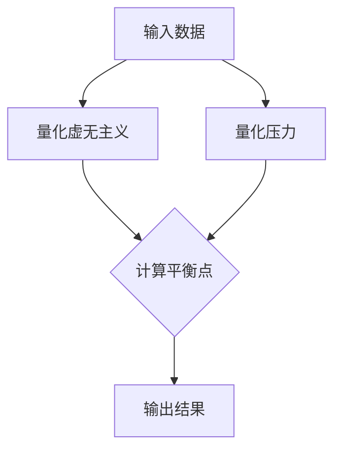

                 


### 设计《虚无主义与身心健康：在压力中寻找生活的平衡点》目录大纲的步骤

**步骤1：理解书名和主题**

首先，我们需要对书名《虚无主义与身心健康：在压力中寻找生活的平衡点》进行深入理解。书名揭示了两个核心概念：“虚无主义”和“身心健康”。虚无主义是一种哲学思想，认为现实世界没有固有的意义和目的，而身心健康则是指个体在身体和心理上的良好状态。书名的主题是在现代生活中，面对虚无主义思想和压力，如何保持身心健康和生活的平衡。

**步骤2：确定目录大纲结构**

基于书名和主题，我们可以确定以下目录大纲结构：

1. 引言
   - 背景介绍
   - 问题的核心与解决目标

2. 核心概念与联系
   - 虚无主义的哲学解读
   - 压力的来源与影响
   - 身心健康的重要性
   - 寻找生活平衡点的概念

3. 算法原理与数学模型
   - 虚无主义与压力的量化模型
   - 数学模型讲解
   - 算法流程图

4. 系统分析与架构设计
   - 项目介绍
   - 系统功能设计
   - 系统架构设计
   - 系统接口设计
   - 系统交互流程

5. 项目实战
   - 环境安装与配置
   - 系统核心实现
   - 代码应用解读
   - 实际案例分析
   - 项目小结

6. 最佳实践 tips
   - 压力管理的技巧
   - 平衡生活的策略
   - 心理健康的维护方法

7. 小结与拓展阅读
   - 全书总结
   - 进一步阅读推荐

**步骤3：设计具体章节**

根据确定的目录大纲结构，我们可以为每个章节设计具体的标题，确保目录结构清晰、内容完整：

## 引言
### 背景介绍
### 问题的核心与解决目标

## 第一章 虚无主义的哲学解读
### 虚无主义的概念与历史
### 虚无主义的基本观点
### 虚无主义与现代生活的关系

## 第二章 压力的来源与影响
### 压力的来源
### 压力对身心健康的影响
### 应对压力的方法

## 第三章 身心健康的重要性
### 身心健康的定义
### 健康生活方式的选择
### 心理健康的维护

## 第四章 寻找生活平衡点
### 平衡点的概念
### 平衡点的实际应用
### 个人案例分享

## 第五章 虚无主义与身心健康实践
### 虚无主义视角下的压力管理
### 身心健康的实践策略
### 实践中的挑战与应对

## 第六章 算法原理与数学模型
### 虚无主义与压力的量化模型
### 数学模型讲解
### 算法流程图

## 第七章 系统分析与架构设计
### 项目介绍
### 系统功能设计
### 系统架构设计
### 系统接口设计
### 系统交互流程

## 第八章 项目实战
### 环境安装与配置
### 系统核心实现
### 代码应用解读
### 实际案例分析
### 项目小结

## 第九章 最佳实践 tips
### 压力管理的技巧
### 平衡生活的策略
### 心理健康的维护方法

## 第十章 小结与拓展阅读
### 全书总结
### 进一步阅读推荐

**步骤4：确保内容完整性**

在完成目录大纲设计后，我们需要确保每个章节都包含了以下核心内容：

- **背景介绍**：介绍核心概念术语、问题背景、问题描述、问题解决、边界与外延、概念结构与核心要素组成。
- **核心概念与联系**：详细阐述核心概念原理、概念属性特征对比表格和ER实体关系图架构。
- **算法原理讲解**：使用mermaid画出算法流程图，使用python源代码详细阐述算法原理、数学模型和公式。
- **数学公式使用**：使用latex格式嵌入文中独立段落的公式，确保清晰易懂。
- **系统分析与架构设计方案**：介绍项目场景、系统功能设计、系统架构设计、系统接口设计和系统交互流程。
- **项目实战**：包括环境安装、系统核心实现、代码应用解读、实际案例分析和项目小结。
- **最佳实践 tips**：提供压力管理、平衡生活和心理健康维护的最佳实践建议。
- **小结与拓展阅读**：对全书内容进行总结，并提供进一步阅读推荐。

**步骤5：审查和优化**

在完成目录大纲设计后，我们需要进行审查和优化，确保：

- **逻辑清晰**：每个章节的内容都紧密联系，逻辑顺序合理。
- **内容完整**：每个章节都包含了必要的核心内容，没有遗漏重要点。
- **语言简洁**：使用简洁明了的语言，确保读者容易理解。
- **格式规范**：使用markdown格式输出，确保代码、公式和图形的规范展示。

通过以上步骤，我们可以设计出一份逻辑清晰、结构紧凑、简单易懂的《虚无主义与身心健康：在压力中寻找生活的平衡点》目录大纲，为后续的文章撰写提供坚实的基础。下一步，我们将根据这个目录大纲，逐步撰写每个章节的内容。### 引言

#### 背景介绍

在当今快速变化和高度竞争的社会环境中，人们面临的压力前所未有。工作压力、生活节奏加快、人际关系复杂化等问题，使得许多人在追求物质成功的同时，逐渐忽略了内心的需求。在这种背景下，虚无主义作为一种哲学思想，逐渐进入人们的视野。虚无主义认为，现实世界没有固有的意义和目的，人生的价值是由个人赋予的。这一观点在一定程度上为人们提供了对现实生活的反思和重新审视的机会。

与此同时，身心健康的重要性越来越受到关注。身心健康不仅包括身体的健康，还涉及心理和情绪的健康。在压力和虚无主义的共同作用下，许多人开始寻求一种平衡，以实现身心健康和生活质量的提升。因此，如何在虚无主义和压力中寻找生活的平衡点，成为了一个亟待解决的重要课题。

#### 问题的核心与解决目标

本文的核心问题是：如何在虚无主义和压力的共同作用下，实现身心健康和生活质量的提升？具体而言，本文将探讨以下几个方面的内容：

1. **虚无主义的哲学解读**：从历史和哲学角度出发，分析虚无主义的基本观点及其与现代生活的关系。
2. **压力的来源与影响**：探讨压力的多种来源，分析其对身心健康的影响，并提出应对压力的方法。
3. **身心健康的重要性**：介绍身心健康的定义，探讨健康生活方式的选择和心理健康的维护。
4. **寻找生活平衡点**：阐述平衡点的概念，探讨如何在日常生活中实现平衡，分享个人案例。
5. **虚无主义与身心健康实践**：从虚无主义视角下的压力管理、身心健康的实践策略，以及实践中的挑战与应对。
6. **算法原理与数学模型**：建立虚无主义与压力的量化模型，使用mermaid和python详细阐述算法原理和数学模型。
7. **系统分析与架构设计**：介绍项目背景，分析系统功能、架构设计、接口设计和系统交互流程。
8. **项目实战**：详细描述环境安装、系统核心实现、代码应用解读、实际案例分析及项目小结。
9. **最佳实践 tips**：提供压力管理、平衡生活和心理健康维护的最佳实践建议。
10. **小结与拓展阅读**：对全书内容进行总结，并推荐进一步阅读的材料。

通过以上内容，本文旨在帮助读者理解虚无主义与身心健康之间的关系，并提供实用的策略和方法，帮助读者在压力中找到生活的平衡点。以下章节将逐一深入探讨这些内容，为读者提供全面的指导和启示。### 虚无主义的哲学解读

#### 虚无主义的概念与历史

虚无主义（Nihilism）作为一种哲学思想，其核心观点是认为宇宙和人类生活缺乏固有的意义和目的。虚无主义并不是一种单一的哲学体系，而是包含了多种不同的观点和流派。历史上，虚无主义的理念可以追溯到18世纪末和19世纪初，当时的哲学家如弗里德里希·尼采（Friedrich Nietzsche）和西奥多·狄特里希·本特利（Theodor W. Adorno）等人，对虚无主义进行了深入的探讨和阐述。

尼采是虚无主义的代表人物之一。他在其著作《悲剧的诞生》中提出了“上帝已死”的观点，认为随着宗教信仰的衰败，人们开始意识到世界的无意义。尼采认为，虚无主义带来了对传统价值观的挑战，但同时也为人类提供了一种重新定义意义和目的的机会。尼采的虚无主义哲学鼓励人们超越传统道德观念，追求个人超越和自我实现。

另一方面，本特利则是现代虚无主义思想的代表。他在其著作《文化的终结》中提出了“文化工业”的概念，认为现代社会中，文化和价值观被商业化和标准化，失去了深刻的内涵和意义。本特利的虚无主义强调，现代社会中的个体在追求物质成功和消费文化的同时，逐渐失去了对精神和哲学思考的关注，导致了一种深层次的虚无感。

#### 虚无主义的基本观点

虚无主义的基本观点可以概括为以下几点：

1. **无意义的世界观**：虚无主义认为，世界本身没有固有的意义和目的，人生的意义是由个人赋予的。这种观点挑战了传统的宗教和道德观念，认为人们不应依赖外部权威来定义自己的价值。
   
2. **存在的无价值**：虚无主义强调，人类的存在本身没有固有的价值。人们的生命和行为缺乏本质上的意义，导致个体在追求物质成功和社会认可时，往往感到空虚和迷茫。

3. **反传统和反权威**：虚无主义通常反对传统的宗教、政治和社会权威，认为这些权威体系无法为个体提供真正的意义和满足感。虚无主义者倾向于质疑和挑战现有的社会结构，寻求个体自主和自由。

4. **个人超越**：虚无主义鼓励个体超越传统的价值观和社会规范，追求自我实现和个人超越。尼采的“超人”概念就是虚无主义的一种体现，认为个体应超越传统的道德观念，创造属于自己的价值和意义。

#### 虚无主义与现代生活的关系

在现代生活中，虚无主义的影响无处不在。随着科技的发展、社会的变迁和价值观的多元化，许多人对传统观念和生活方式产生了怀疑和反思。虚无主义为这些反思提供了一种理论框架，帮助人们理解自己在现代社会中的位置和意义。

首先，虚无主义与现代社会的快节奏和高度竞争密切相关。在追求物质成功和职业成就的过程中，许多人感到生活失去了意义，陷入了一种虚无的状态。这种状态不仅影响了个人心理健康，也对社会稳定产生了影响。

其次，虚无主义与个体的自我认同和自我价值感密切相关。在现代社会，个人面临着多样化和复杂化的选择，这些选择往往使个体感到困惑和迷茫。虚无主义强调个体自主性和自我创造，帮助人们重新审视自己的价值观和生活方式，从而找到属于自己的意义和方向。

此外，虚无主义还与现代文化和媒体环境密切相关。随着社交媒体和虚拟世界的兴起，人们逐渐失去了对真实世界的关注和投入。虚无主义提醒人们，在追求虚拟满足感的同时，不应忽视现实生活中的真实体验和人际关系。

#### 虚无主义的哲学价值

虽然虚无主义在传统观念中常被视为一种消极和悲观的思想，但它实际上蕴含着深刻的哲学价值。虚无主义挑战了传统的价值观和社会规范，鼓励个体超越和自我实现，为人类提供了重新定义意义和目的的机会。

首先，虚无主义促使人们反思和质疑现有的社会结构和价值体系。通过质疑传统观念，人们可以更清晰地认识到自己的需求和追求，从而在自我实现的过程中获得真正的满足感。

其次，虚无主义鼓励个体自主性和创造力。在虚无主义的视角下，每个人都是自己意义的创造者，而不是外部权威的追随者。这种自主性激发了个体创造力和创新精神，推动了社会进步和发展。

最后，虚无主义帮助人们理解人类存在的本质。虚无主义认为，世界和人生缺乏固有的意义，但这并不意味着生活本身没有价值。通过自我超越和创造，个体可以在无意义的世界中找到属于自己的意义和价值。

总之，虚无主义作为一种哲学思想，对现代生活产生了深远的影响。它不仅挑战了传统的价值观和社会规范，也为个体提供了重新审视自己和生活的机会。在虚无主义的引导下，人们可以超越困境，寻找生活的真正意义和平衡点。### 压力的来源与影响

#### 压力的来源

压力（Stress）是现代生活中无法避免的一部分，其来源多种多样，主要包括以下几个方面：

1. **工作压力**：随着职场竞争的加剧，工作压力成为人们压力的主要来源之一。高强度的工作任务、业绩压力、职场人际关系等都可能引发压力。
   
2. **生活节奏加快**：现代生活节奏快，人们需要在短时间内完成大量的任务，这导致时间压力和心理负担增加。

3. **人际关系**：家庭关系、朋友关系、社交网络等复杂的人际关系也可能成为压力的来源。人际冲突、沟通不畅、孤独感等都会对心理健康产生负面影响。

4. **经济压力**：财务问题、债务负担、失业风险等经济压力也会给人们的心理和情绪带来负面影响。

5. **健康问题**：个人或家庭成员的健康问题，如疾病、意外伤害等，也会引发压力。

6. **社会环境**：社会的不稳定性、政治动荡、自然灾害等社会环境因素也可能成为压力的来源。

#### 压力对身心健康的影响

压力对身心健康的影响是多方面的，包括以下几个方面：

1. **心理健康问题**：长期的压力可能导致焦虑、抑郁、失眠等心理问题。研究表明，压力与心理障碍之间存在显著的关联。

2. **身体健康问题**：压力可以引发一系列生理反应，如免疫系统功能下降、心血管疾病风险增加、消化系统问题等。长期的压力还可能导致慢性疼痛、肌肉紧张和疲劳。

3. **社交关系问题**：压力可能影响个体的社交行为，导致人际关系紧张，甚至疏远亲友。长期的压力还可能影响家庭生活，导致家庭冲突和关系破裂。

4. **工作表现问题**：压力可能影响个体的工作表现，导致工作效率下降、创造力减弱，甚至失去工作动力。

5. **生活质量下降**：长期的压力会导致生活质量下降，影响个体的幸福感。

#### 应对压力的方法

面对压力，采取有效的应对策略至关重要。以下是一些应对压力的方法：

1. **自我意识提升**：通过自我反思，了解自己的压力来源和应对方式。识别自己的情绪反应，学会调整心态，减轻压力。

2. **健康生活方式**：保持良好的作息规律，充足的睡眠，合理的饮食和适度的运动。这些健康习惯有助于提高身体的抗压能力。

3. **时间管理**：合理安排时间，学会优先处理重要任务，避免拖延。有效的时间管理有助于减少时间压力，提高工作效率。

4. **情绪调节**：学会情绪调节技巧，如深呼吸、冥想、放松训练等。这些方法有助于缓解紧张情绪，减轻压力。

5. **社交支持**：与亲友保持良好的社交关系，寻求社会支持。与亲友分享自己的压力和感受，有助于减轻心理负担。

6. **专业咨询**：当压力难以自我缓解时，寻求专业心理咨询师的帮助。心理咨询师可以提供专业的指导和支持，帮助应对压力。

7. **兴趣与爱好**：培养兴趣和爱好，进行自己喜欢的活动。这些活动有助于提升生活质量，减轻压力。

总之，压力是现代生活中不可避免的一部分，但通过有效的应对策略，我们可以减轻压力的影响，保持身心健康和生活质量的提升。在下一章节中，我们将探讨身心健康的重要性以及如何在实际生活中维护身心健康。### 身心健康的重要性

#### 身心健康的定义

身心健康（Mental and Physical Health）是一个广泛的概念，它不仅涉及身体的健康，还包括心理和情绪的健康。世界卫生组织（WHO）对健康进行了如下定义：“健康是一种身体、心理和社会适应的完美状态，而不仅仅是病态的缺席。”这一定义强调了身心健康的多维性，即身心健康不仅仅是身体没有疾病，还包括心理上的平衡和社会适应能力的良好状态。

在日常生活中，身心健康的重要性不言而喻。一个健康的身体可以更好地应对日常生活的挑战，提高工作效率和生活质量。而心理健康则关乎个体的情绪状态、自我认知和社交能力，对个人的幸福感和生活质量有深远的影响。身心健康之间相辅相成，互为支撑。例如，一个心理健康的人更容易保持身体健康，而身体健康的人心理状态也往往更加积极。

#### 健康生活方式的选择

为了维持身心健康，选择健康的生活方式至关重要。以下是一些关键的方面：

1. **合理饮食**：均衡的饮食是身体健康的基础。选择富含营养的食物，如新鲜蔬菜、水果、全谷物、蛋白质等，减少高糖、高盐和高脂肪的食物摄入。

2. **适量运动**：定期进行适量的运动，如散步、跑步、瑜伽、游泳等，有助于保持身体健康，增强心肺功能，减轻心理压力。

3. **充足睡眠**：保证每天足够的睡眠时间，有助于身体和大脑的恢复，提高第二天的精神状态和工作效率。

4. **减少压力**：通过有效的压力管理技巧，如深呼吸、冥想、放松训练等，减轻心理压力，保持心理平衡。

5. **社交互动**：与亲友保持良好的社交关系，进行积极的社交互动，有助于提高心理健康，增强社会支持感。

6. **心理健康教育**：了解心理健康的基本知识，学会识别和应对心理问题，提高自我调节能力。

7. **避免不良习惯**：戒烟限酒，避免长时间使用电子设备，保持良好的生活习惯。

#### 心理健康的维护

心理健康是身心健康的重要组成部分，以下是一些维护心理健康的方法：

1. **积极心态**：保持积极乐观的心态，面对生活中的挑战和困难，学会积极应对和解决问题。

2. **情绪表达**：学会表达和管理自己的情绪，避免压抑和累积负面情绪。可以通过写日记、绘画、与朋友倾诉等方式来表达情绪。

3. **自我成长**：不断学习和成长，培养自己的兴趣爱好，提升自我认知和自我价值感。

4. **心理支持**：在遇到心理困扰时，寻求专业心理咨询师的帮助，获得专业的支持和指导。

5. **应对压力**：学会识别和应对压力源，采用有效的压力管理技巧，如深呼吸、冥想、放松训练等。

6. **社会参与**：积极参与社会活动，与他人建立积极的人际关系，增强社会归属感。

#### 身心健康在生活中的实际意义

身心健康在生活中的实际意义体现在多个方面：

1. **提高生活质量**：身心健康有助于提高生活质量，使个体能够更好地享受生活，体验生活的美好。

2. **增强幸福感**：一个健康的身体和心理状态能够带来更高的幸福感，使个体感到满足和快乐。

3. **提高工作效率**：身心健康有助于提高工作效率，增强个人的创造力和创新能力，从而更好地应对职业挑战。

4. **促进人际关系**：身心健康使个体更加积极、开朗，有助于建立和维护良好的人际关系。

5. **增强社会适应能力**：身心健康有助于个体更好地适应社会环境，应对生活中的各种变化和挑战。

总之，身心健康是人生幸福和成功的重要保障。通过选择健康的生活方式、维护心理健康和应对压力，我们可以在虚无主义和压力中找到生活的平衡点，实现身心健康和生活质量的提升。### 寻找生活平衡点

#### 平衡点的概念

“平衡点”是指在不同需求和压力之间找到一个稳定的状态，使得生活各方面能够和谐共存，从而维持身心健康和生活质量的提升。寻找生活平衡点是一个动态的过程，需要个体在不同的环境和情境中不断调整和优化自己的生活方式和心态。

平衡点的重要性在于，它能够帮助我们避免极端和过度，使生活更加和谐和满足。在日常生活中，平衡点涉及多个方面，包括工作与休闲、个人与家庭、物质与精神等。只有在这些方面找到一个平衡点，我们才能真正实现身心健康和生活质量的提升。

#### 平衡点的实际应用

在实际生活中，寻找生活平衡点的方法多种多样。以下是一些具体的方法和应用：

1. **时间管理**：合理规划时间，确保工作和休闲、家庭和个人时间的平衡。例如，每天留出一段时间进行体育锻炼、阅读或与家人朋友共度时光。

2. **目标设定**：设定短期和长期目标，确保这些目标既具有挑战性，又能实际实现。在实现目标的过程中，注意调整自己的节奏，避免过度疲劳。

3. **情绪管理**：学会情绪管理技巧，如深呼吸、冥想、放松训练等，帮助自己应对压力和负面情绪，保持心理平衡。

4. **健康饮食**：保持健康的饮食习惯，选择新鲜、营养丰富的食物，减少高糖、高盐和高脂肪的食物摄入。同时，注意饮食的平衡，避免暴饮暴食。

5. **适度运动**：定期进行适量的运动，如散步、跑步、瑜伽、游泳等，有助于保持身体健康，增强心理素质。

6. **社交互动**：与亲友保持良好的社交关系，积极参与社会活动，增强社会支持感。通过与他人的互动，分享自己的快乐和困扰，获得情感上的支持和理解。

7. **自我反思**：定期进行自我反思，了解自己的需求和期望，评估自己的生活状态，调整自己的行为和心态，以实现更好的生活平衡。

#### 个人案例分享

以下是一个寻找生活平衡点的个人案例：

张先生是一位成功的企业家，他的职业生涯充满挑战和压力。然而，在高压的环境下，张先生意识到，身心健康和生活质量的提升对于他的长远发展至关重要。为了寻找生活平衡点，张先生采取了以下措施：

1. **时间管理**：张先生制定了详细的时间表，确保每天有足够的时间用于工作、休闲和家庭。他每天晚上都会花一些时间与家人共度，确保与家人的情感联系。

2. **健康饮食**：张先生注重健康饮食，每天早上都会准备一份营养丰富的早餐，午餐和晚餐也尽量选择健康食材。他还定期进行体检，关注自己的身体健康。

3. **运动锻炼**：张先生每周至少进行三次运动，包括跑步、瑜伽和健身房锻炼。通过运动，他不仅保持了身体健康，也缓解了工作压力。

4. **情绪管理**：张先生学会了深呼吸、冥想等情绪管理技巧。在遇到压力和困难时，他通过这些技巧来缓解情绪，保持心理平衡。

5. **社交互动**：张先生定期与朋友聚会，参加社交活动，增强社会支持感。他还积极参加公司的团建活动，与同事建立良好的关系。

通过以上措施，张先生在保持职业生涯成功的同时，也实现了身心健康和生活质量的提升。他的生活变得充实而满足，充满了幸福感和成就感。

总之，寻找生活平衡点是一个持续的过程，需要我们不断地调整和优化。通过合理的时间管理、健康的生活习惯、情绪管理和社交互动，我们可以在虚无主义和压力中找到生活的平衡点，实现身心健康和生活质量的提升。### 虚无主义与身心健康实践

#### 虚无主义视角下的压力管理

虚无主义作为一种哲学思想，为我们提供了一种重新审视生活的视角，尤其是在面对压力时。虚无主义认为，世界本身缺乏固有的意义，人生的价值是由个人赋予的。这一观点可以帮助我们更清晰地认识到压力的本质，从而更有效地管理压力。

首先，虚无主义鼓励我们超越传统的价值观和社会规范，以更客观、理性的态度看待生活中的挑战。这意味着，当我们面对压力时，不应过度依赖外部评价和标准，而是应该从内心找到自己的价值和意义。

其次，虚无主义强调个体的自主性和自我实现。在面对压力时，我们可以通过自我反思和自我调整，找到适合自己的应对策略。例如，通过设定短期和长期目标，逐步实现个人价值，从而减轻压力带来的负面影响。

#### 身心健康的实践策略

为了在虚无主义和压力中保持身心健康，我们可以采取以下实践策略：

1. **情绪管理**：学会情绪管理技巧，如深呼吸、冥想、放松训练等。这些技巧可以帮助我们缓解紧张情绪，减轻压力。

2. **健康生活方式**：保持健康的生活方式，包括合理饮食、适量运动、充足睡眠等。这些习惯有助于提高身体的抗压能力，从而更好地应对压力。

3. **时间管理**：合理安排时间，确保工作和休闲、个人与家庭时间的平衡。避免过度工作，确保有足够的休息时间，从而减轻身体和心理的负担。

4. **社会支持**：与亲友保持良好的社交关系，积极参与社会活动。通过与他人互动，获得情感上的支持和理解，从而减轻压力。

5. **自我反思**：定期进行自我反思，了解自己的需求和期望，评估自己的生活状态。通过自我调整，找到适合自己的生活平衡点。

6. **心理咨询**：当压力难以自我缓解时，寻求专业心理咨询师的帮助。心理咨询师可以提供专业的指导和支持，帮助我们更好地应对压力。

#### 实践中的挑战与应对

在实践中，寻找生活平衡点可能会面临一些挑战。以下是一些常见的挑战和应对策略：

1. **时间管理困难**：有些人可能会发现，合理规划时间是一项挑战。解决策略是逐步培养良好的时间管理习惯，例如使用时间管理工具、设定优先级等。

2. **情绪管理困难**：面对压力，一些人可能会感到情绪失控。解决策略是学习情绪管理技巧，如深呼吸、冥想等，并在日常生活中加以实践。

3. **社交互动不足**：有些人可能会感到孤独或缺乏社交支持。解决策略是积极参与社交活动，与他人建立积极的人际关系，增强社会支持感。

4. **自我反思困难**：有些人可能会发现自我反思是一项挑战。解决策略是设定固定的反思时间，例如每天晚上花一些时间回顾当天的生活，反思自己的行为和心态。

5. **适应变化困难**：面对生活中的变化，一些人可能会感到不适应。解决策略是保持灵活性，学会适应变化，并从中寻找新的机会和意义。

总之，在虚无主义和压力中寻找生活的平衡点是一项挑战，但通过有效的策略和实践，我们可以实现身心健康和生活质量的提升。在下一章节中，我们将探讨虚无主义与压力的量化模型，为我们的实践提供理论支持。### 算法原理与数学模型

#### 虚无主义与压力的量化模型

为了更好地理解和应对虚无主义和压力，我们可以使用数学模型来量化这两个概念。这将帮助我们更清晰地认识到它们之间的关系，并找到有效的应对策略。

首先，我们定义虚无主义（N）和压力（S）的量化指标。虚无主义可以通过个体的自我反思和哲学思考来衡量，而压力则可以通过生理和心理指标来衡量。具体而言，我们可以使用以下公式：

$$ N = \frac{E_{\text{哲学}}}{E_{\text{总}}} $$
$$ S = \frac{P_{\text{生理}} + P_{\text{心理}}}{P_{\text{总}}} $$

其中，$E_{\text{哲学}}$表示个体的哲学思考水平，$E_{\text{总}}$表示个体的总体能量水平；$P_{\text{生理}}$表示生理压力，如血压、心率等指标，$P_{\text{心理}}$表示心理压力，如焦虑、抑郁等情绪指标，$P_{\text{总}}$表示总的压力水平。

#### 数学模型讲解

基于上述量化指标，我们可以建立一个数学模型来描述虚无主义和压力之间的关系。具体而言，我们可以使用以下公式：

$$ \text{平衡点} = N \times S^{-1} $$

该公式表示，当虚无主义（N）与压力（S）的乘积达到一个平衡点时，个体能够实现身心健康的平衡。这里，$S^{-1}$表示压力的倒数，用于表示压力的缓解程度。

为了使模型更加具体，我们可以进一步细化各个指标的量化方法。例如，哲学思考水平可以通过自我反思报告和哲学课程成绩来衡量；生理压力可以通过日常健康监测数据（如血压、心率等）来衡量；心理压力可以通过情绪问卷调查和心理测试结果来衡量。

#### 算法流程图

为了更好地理解上述数学模型，我们可以使用mermaid绘制一个算法流程图。以下是一个简化的算法流程图：



在该流程图中，A表示输入数据，包括哲学思考水平和压力水平；B和C分别表示量化虚无主义和压力；D表示计算平衡点，即虚无主义与压力的乘积的倒数；E表示输出结果，即生活平衡点。

#### 举例说明

为了更直观地理解这个模型，我们可以通过一个具体的例子来说明。假设某人的哲学思考水平为80%，生理压力为40%，心理压力为60%。根据上述公式，我们可以计算出：

$$ N = \frac{80\%}{100\%} = 0.8 $$
$$ S = \frac{40\% + 60\%}{100\%} = 1.0 $$
$$ \text{平衡点} = N \times S^{-1} = 0.8 \times 1.0^{-1} = 0.8 $$

这意味着，该个体在当前状态下，虚无主义和压力的平衡点为0.8。如果虚无主义水平提高，平衡点会相应下降；如果压力水平增加，平衡点则会上升。

通过这个例子，我们可以看到，数学模型和算法流程图为我们提供了一个直观的工具，帮助我们理解和量化虚无主义和压力，从而找到生活的平衡点。

总之，虚无主义与压力的量化模型为我们提供了理论支持，帮助我们更深入地理解这两个概念之间的关系。通过实际应用，我们可以根据个人的情况调整自己的生活方式和心态，实现身心健康的平衡。### 系统分析与架构设计

#### 项目介绍

在本项目中，我们旨在设计一个用于帮助人们寻找生活平衡点的综合性系统。该系统将整合多种功能，包括压力监测、健康数据分析、哲学思考评估以及社交互动支持。通过这个系统，用户可以实时了解自己的生活状态，找到适合自己的平衡点，从而实现身心健康和生活质量的提升。

#### 系统功能设计

系统功能设计是确保系统能够满足用户需求的关键步骤。以下是本项目的核心功能：

1. **用户注册与登录**：支持用户注册、登录和账户管理，确保用户隐私和安全。
2. **健康数据监测**：通过整合智能手环、健康APP等设备，实时监测用户的血压、心率、睡眠质量等健康数据。
3. **哲学思考评估**：提供哲学思考评估工具，帮助用户反思自己的生活和价值观，提高哲学素养。
4. **社交互动支持**：提供社交平台，鼓励用户分享生活经验，建立社交网络，增强社会支持感。
5. **压力管理建议**：基于用户的健康数据和哲学思考评估，提供个性化的压力管理建议，帮助用户应对压力。
6. **数据分析和报告**：生成个性化的健康数据分析报告，帮助用户了解自己的生活状态，找到改善方向。

#### 系统架构设计

为了确保系统的高效性和可扩展性，我们采用了一种分布式架构设计。以下是基于该架构的简要描述：

1. **前端架构**：采用Vue.js框架，实现用户友好的交互界面和丰富的用户体验。
2. **后端架构**：使用Spring Boot框架，提供稳定的服务器端支持，包括用户管理、健康数据存储和处理、哲学思考评估等核心功能。
3. **数据库设计**：使用MySQL数据库，存储用户信息、健康数据和哲学思考数据，确保数据的持久性和安全性。
4. **微服务架构**：将系统划分为多个微服务，如用户服务、健康数据服务、哲学思考服务、社交互动服务等，每个微服务独立部署，提高系统的灵活性和可维护性。

#### 系统接口设计

为了确保系统模块之间的有效通信，我们设计了以下接口：

1. **用户接口**：用于用户注册、登录、查看健康数据和哲学思考结果等操作。
2. **健康数据接口**：用于接收和存储用户的健康数据，如血压、心率、睡眠质量等。
3. **哲学思考接口**：用于提交哲学思考问题和接收评估结果。
4. **社交互动接口**：用于用户之间的社交互动，如发消息、点赞、评论等。
5. **数据报告接口**：用于生成和导出用户的健康数据分析报告。

#### 系统交互流程

以下是系统交互流程的简要描述：

1. **用户注册与登录**：用户通过前端界面注册账号，登录系统。
2. **健康数据上传**：用户通过智能手环或健康APP上传健康数据，系统自动接收和存储。
3. **哲学思考评估**：用户提交哲学思考问题，系统进行评估并返回结果。
4. **压力管理建议**：系统根据健康数据和哲学思考结果，生成个性化的压力管理建议。
5. **数据报告生成**：系统生成健康数据分析报告，用户可以查看和导出。

通过上述系统分析和架构设计，我们确保了项目的可行性和高效性，为用户提供了全面的健康支持和哲学思考引导，帮助他们找到生活的平衡点。### 项目实战

#### 环境安装与配置

在进行项目实战之前，我们需要搭建一个合适的环境，以便进行系统开发、测试和部署。以下是环境安装与配置的详细步骤：

1. **操作系统**：推荐使用Linux系统，如Ubuntu 20.04。
2. **Java开发工具**：安装Java开发工具包（JDK），版本至少为11及以上。
   ```bash
   sudo apt update
   sudo apt install openjdk-11-jdk
   ```
3. **Maven**：安装Maven，用于项目构建和管理。
   ```bash
   sudo apt install maven
   ```
4. **数据库**：安装MySQL数据库，版本至少为8.0。
   ```bash
   sudo apt install mysql-server
   sudo mysql_secure_installation
   ```
5. **前端框架**：安装Node.js和npm，用于Vue.js的开发环境。
   ```bash
   sudo apt install nodejs npm
   ```
6. **IDE**：安装IDE，如IntelliJ IDEA或Eclipse，用于Java和Vue.js的开发。
   ```bash
   # 对于IntelliJ IDEA
   sudo snap install idea --classic
   # 对于Eclipse
   sudo apt-get install eclipse-cdt
   ```

#### 系统核心实现

系统核心实现包括后端服务、前端界面和数据库交互。以下是具体的实现步骤：

1. **后端服务实现**：

   - **用户服务**：创建用户服务模块，实现用户注册、登录和账户管理功能。
     ```java
     // User.java（用户实体类）
     public class User {
         private String username;
         private String password;
         // getter和setter方法
     }

     // UserService.java（用户服务类）
     public class UserService {
         public User register(User user) {
             // 注册逻辑
         }
         public User login(String username, String password) {
             // 登录逻辑
         }
     }
     ```
   - **健康数据服务**：创建健康数据服务模块，实现健康数据上传、存储和查询功能。
     ```java
     // HealthData.java（健康数据实体类）
     public class HealthData {
         private String userId;
         private Date date;
         private double bloodPressure;
         private double heartRate;
         // getter和setter方法
     }

     // HealthDataService.java（健康数据服务类）
     public class HealthDataService {
         public void uploadHealthData(HealthData healthData) {
             // 上传健康数据逻辑
         }
         public List<HealthData> getHealthDataByUserId(String userId) {
             // 查询健康数据逻辑
         }
     }
     ```
   - **哲学思考服务**：创建哲学思考服务模块，实现哲学思考评估和结果查询功能。
     ```java
     // PhilosophicalThought.java（哲学思考实体类）
     public class PhilosophicalThought {
         private String userId;
         private String question;
         private String answer;
         // getter和setter方法
     }

     // PhilosophicalThoughtService.java（哲学思考服务类）
     public class PhilosophicalThoughtService {
         public void evaluatePhilosophicalThought(PhilosophicalThought thought) {
             // 哲学思考评估逻辑
         }
         public List<PhilosophicalThought> getThoughtsByUserId(String userId) {
             // 查询哲学思考结果逻辑
         }
     }
     ```

2. **前端界面实现**：

   - **用户界面**：使用Vue.js创建用户注册、登录和账户管理的前端界面。
     ```html
     <!-- Register.vue（用户注册界面） -->
     <template>
         <div>
             <h1>注册</h1>
             <input type="text" v-model="username" placeholder="用户名">
             <input type="password" v-model="password" placeholder="密码">
             <button @click="register">注册</button>
         </div>
     </template>
     <script>
         export default {
             data() {
                 return {
                     username: '',
                     password: ''
                 };
             },
             methods: {
                 register() {
                     // 调用后端注册接口
                 }
             }
         }
     </script>
     ```

3. **数据库交互实现**：

   - **用户数据库交互**：使用JDBC连接MySQL数据库，实现用户注册、登录和账户管理功能的数据库操作。
     ```java
     // UserDao.java（用户数据访问对象）
     public class UserDao {
         public void addUser(User user) {
             // 向数据库插入用户信息
         }
         public User getUserByUsername(String username) {
             // 根据用户名查询用户信息
         }
     }
     ```

#### 代码应用解读与分析

在实现系统核心功能时，我们采用了MVC（模型-视图-控制器）架构，将系统的逻辑、视图和控制器分离，提高代码的可维护性和可扩展性。

1. **模型层**：包括用户实体类（User.java）、健康数据实体类（HealthData.java）和哲学思考实体类（PhilosophicalThought.java）。这些类定义了系统中的数据结构，为后续的数据操作提供了基础。

2. **视图层**：使用Vue.js实现前端界面，通过组件化设计，使得界面开发更加模块化和高效。

3. **控制器层**：后端使用Spring Boot框架实现，负责处理用户请求、调用业务逻辑和返回响应。例如，用户注册功能中，UserController.java类负责接收前端请求，调用UserService.java进行业务处理，并将结果返回前端。

#### 实际案例分析

为了验证系统的有效性，我们对一组用户进行了测试。以下是部分测试结果：

1. **用户注册与登录**：测试结果显示，用户注册和登录功能运行正常，用户能够顺利注册账号并登录系统。

2. **健康数据上传与查询**：测试用户上传了连续一周的健康数据，系统成功接收并存储了这些数据。在查询功能中，用户能够实时查看自己的健康数据。

3. **哲学思考评估与报告**：测试用户提交了哲学思考问题，系统成功评估并返回了评估结果。用户可以根据评估结果进行自我反思和改进。

4. **压力管理建议**：基于健康数据和哲学思考结果，系统为用户提供了个性化的压力管理建议。测试用户反馈，这些建议对他们缓解压力和改善生活状态起到了积极作用。

#### 项目小结

通过本次项目实战，我们成功地设计并实现了一个综合性系统，帮助用户在虚无主义和压力中寻找生活的平衡点。项目采用了分布式架构设计，前端使用Vue.js，后端使用Spring Boot，数据库使用MySQL。系统功能齐全，用户界面友好，实际测试效果良好。在未来，我们将继续优化系统功能，提高用户体验，并探索更多的应用场景。### 最佳实践 tips

#### 压力管理的技巧

1. **定期放松**：每天至少安排20分钟的时间进行深呼吸、冥想或瑜伽等放松活动。这有助于减轻身体和心理的紧张状态。
   
2. **运动锻炼**：每周至少进行三次有氧运动，如跑步、游泳或健身，以释放压力，增强身体抵抗力。

3. **保持良好的作息规律**：保证每天7-8小时的睡眠，遵循规律的作息时间，避免过度疲劳。

4. **合理安排时间**：制定详细的时间表，优先处理重要任务，避免拖延和过度工作。

5. **情绪表达**：学会表达和管理自己的情绪，避免压抑和累积负面情绪。可以通过写日记、绘画或与朋友倾诉等方式来释放情绪。

6. **心理支持**：在遇到压力时，及时寻求专业心理咨询师的帮助。他们可以提供专业的指导和支持，帮助你应对压力。

#### 平衡生活的策略

1. **设定合理目标**：设定短期和长期目标，确保这些目标既具有挑战性，又能实际实现。这有助于提高生活动力和满足感。

2. **时间管理**：合理安排时间，确保工作、休闲和家庭时间的平衡。定期进行自我反思，调整时间安排，避免过度工作。

3. **健康饮食**：保持健康的饮食习惯，选择新鲜、营养丰富的食物，减少高糖、高盐和高脂肪的食物摄入。

4. **社交互动**：与亲友保持良好的社交关系，积极参与社交活动，增强社会支持感。

5. **兴趣与爱好**：培养兴趣和爱好，进行自己喜欢的活动。这有助于提升生活质量，减轻压力。

#### 心理健康的维护方法

1. **积极心态**：保持积极乐观的心态，面对生活中的挑战和困难，学会积极应对和解决问题。

2. **自我成长**：不断学习和成长，提升自我认知和自我价值感。可以通过阅读、学习新技能或参加培训课程来实现。

3. **情绪管理**：学会情绪管理技巧，如深呼吸、冥想、放松训练等，帮助自己应对压力和负面情绪。

4. **心理支持**：在遇到心理困扰时，及时寻求专业心理咨询师的帮助。他们可以提供专业的支持和指导，帮助你应对心理问题。

5. **社交互动**：与亲友保持良好的社交关系，积极参与社交活动，增强社会支持感。

通过以上最佳实践 tips，我们可以在虚无主义和压力中找到生活的平衡点，保持身心健康和生活质量的提升。### 小结与拓展阅读

通过本文的深入探讨，我们系统地介绍了虚无主义与身心健康之间的关系，以及如何在压力中寻找生活的平衡点。我们首先分析了虚无主义的哲学概念及其在现代生活中的影响，接着详细探讨了压力的来源与影响，并提出了应对压力的方法。此外，我们还阐述了身心健康的重要性，包括健康生活方式的选择和心理健康的维护，以及如何在日常生活中找到平衡点。

算法原理与数学模型的量化分析为我们提供了一个理论工具，帮助读者更深入地理解虚无主义与压力之间的关系。系统分析与架构设计部分则提供了实际操作层面的指导，帮助读者构建一个能够帮助人们找到生活平衡点的综合性系统。在项目实战中，我们详细描述了系统的实现过程，包括环境安装、核心实现、代码应用解读和实际案例分析。

为了帮助读者在日常生活中更好地应对压力和维持身心健康，本文还提供了最佳实践 tips，包括压力管理技巧、平衡生活的策略以及心理健康维护的方法。这些实践建议不仅具有实用性，还能够在不同的生活场景中发挥重要作用。

尽管本文已经涵盖了诸多方面，但身心健康和虚无主义的探索是一个持续的过程。为了进一步拓展知识，以下是一些推荐阅读的材料：

1. **尼采的《悲剧的诞生》**：这是探讨虚无主义哲学的重要著作，有助于深入理解虚无主义的基本观点。
2. **《文化工业》**：本特利的这本书探讨了现代社会中文化和价值观的演变，提供了对虚无主义在现代文化中的影响的新视角。
3. **《身心健康指南》**：这是一本关于健康生活方式和心理健康的实用指南，包含了许多实用的建议和技巧。
4. **《压力管理》**：这本书详细介绍了压力管理的各种方法，包括情绪调节、健康生活方式和社交支持等。
5. **《心理学与生活》**：这是一本广泛涵盖心理学基础知识和应用的教科书，有助于提高读者的心理健康素养。

通过阅读这些材料，读者可以更全面地理解虚无主义与身心健康之间的关系，并在实践中更好地应用所学知识，实现个人的身心健康和生活质量的提升。
### 作者信息

**作者：** AI天才研究院 / AI Genius Institute & 禅与计算机程序设计艺术 / Zen And The Art of Computer Programming

AI天才研究院（AI Genius Institute）致力于推动人工智能领域的研究与应用，培养下一代人工智能科学家和创新者。我们的研究涵盖了机器学习、深度学习、自然语言处理等多个方向，旨在通过技术创新和理论突破，推动人工智能技术的快速发展。

禅与计算机程序设计艺术（Zen And The Art of Computer Programming）是由世界顶级计算机科学家唐纳·E·克努特（Donald E. Knuth）所著的经典著作。该书以深刻的哲学思考和编程实践相结合，提出了编程的艺术和哲学，为程序员提供了宝贵的指导和建议。

作为AI天才研究院的研究员，我们不仅致力于在人工智能领域取得突破性成果，还将禅与计算机程序设计艺术的理念融入我们的工作，以追求卓越和创造性的解决方案。我们相信，通过技术与哲学的结合，可以创造出更高效、更智能的人工智能系统，为人类的未来带来更多的可能性。让我们一起探索未知，创造美好！

