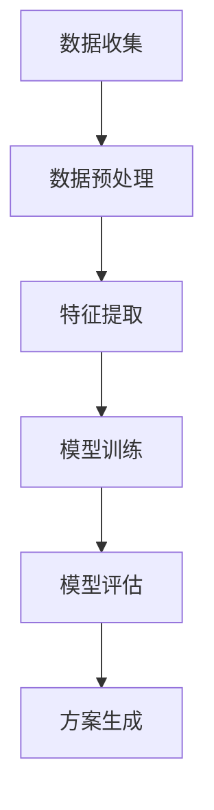
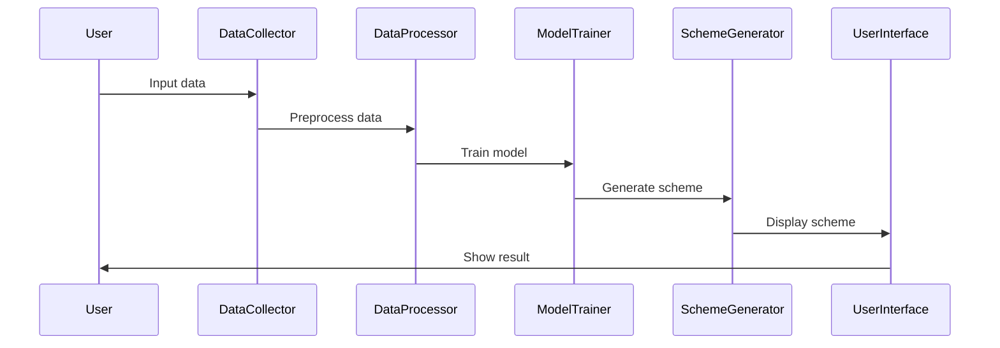

                 

### 走在意义的荒原上：如何克服虚无主义

> 关键词：虚无主义、意义、目的、价值、心理健康、幸福感

> 摘要：本文深入探讨了虚无主义现象及其对现代人的影响，从核心概念、算法原理到实际应用，提供了克服虚无主义的策略和路径。通过分析虚无主义的核心概念、构建概念联系图，本文提出了基于机器学习的算法模型，详细讲解了算法的流程、原理和数学模型，并结合实际项目案例，展示了如何通过技术手段提升个体的心理健康和幸福感。

---

### 第一部分：背景介绍

虚无主义作为一种哲学思想，源于对生活意义和目的的质疑。在现代社会，随着物质生活的丰富和科技的发展，人们开始感受到一种深刻的虚无感。这种虚无主义思潮不仅影响了个体的心理健康，还对社会的稳定和发展产生了一定的挑战。因此，探讨如何克服虚无主义，提高人们的生活质量和幸福感，成为了一个亟待解决的问题。

#### 1.1.1 问题背景

虚无主义的主要表现包括对人生意义的不确定感、对未来的迷茫感、对自我价值的质疑等。这些问题不仅困扰着个人，也对整个社会产生了负面影响。例如，高失业率、低幸福感、孤独感、焦虑和抑郁等心理问题，都与虚无主义有密切关系。因此，解决虚无主义问题，需要从个体和社会两个层面进行综合探讨。

#### 1.1.2 问题描述

虚无主义的主要表现包括以下几个方面：

- **生活意义的不确定感**：许多人感到自己的生活缺乏内在价值，不知道自己存在的意义是什么。
- **未来的迷茫感**：对未来的不确定性和无目标感，导致人们缺乏动力和方向。
- **自我价值的质疑**：对自我价值的怀疑，导致自我否定和自卑情绪。

这些表现不仅影响了个体的心理健康，还可能导致社会问题的加剧，如自杀率上升、社会不稳定性增加等。

#### 1.1.3 问题解决

克服虚无主义的关键在于寻找生活的意义和目的。这需要个体在日常生活中不断探索和尝试，找到属于自己的价值和使命。同时，社会也需要提供更多的支持和资源，帮助人们建立积极的人生观和价值观。此外，通过心理学、哲学、宗教等多种途径，也可以为人们提供克服虚无主义的帮助。

#### 1.1.4 边界与外延

虚无主义的范围广泛，涉及到哲学、心理学、社会学等多个领域。在本文中，我们将主要关注个体层面的虚无主义问题，探讨如何通过个人努力和社会支持来克服虚无主义。

#### 1.1.5 概念结构与核心要素组成

虚无主义的核心概念包括：生活意义、目的、价值、存在主义、信仰等。这些概念相互关联，构成了虚无主义问题的主要结构。在本文中，我们将详细探讨这些概念，并分析它们如何影响个体的心理健康和幸福感。

### 第二部分：核心概念与联系

#### 2.1.1 核心概念原理

虚无主义作为一种哲学思想，其核心概念包括生活意义、目的、价值等。这些概念构成了虚无主义的基本框架，对个体的心理和行为产生了深远的影响。

- **生活意义**：指个体在生活中追求的内在价值，是人们行动的驱动力。生活意义是一个主观的概念，不同的人有不同的理解和追求。
- **目的**：指个体对未来的期望和规划，是生活方向的指引。目的是个体在特定时间内希望实现的目标，是生活意义的体现。
- **价值**：指个体对事物的重要性的判断，是生活选择的依据。价值是个体行为决策的基础，影响着个体的选择和行动。

#### 2.1.2 概念属性特征对比表格

| 概念     | 生活意义 | 目的     | 价值     |
|----------|----------|----------|----------|
| **定义** | 个体在生活中追求的内在价值 | 个体对未来的期望和规划 | 个体对事物的重要性的判断 |
| **关系** | 目的是实现生活意义的手段 | 价值是评估生活意义的标准 | 生活意义和价值是目的的基础 |
| **特征** | 个体化、内在性、动态性 | 长期性、目标性、规划性 | 多样性、主观性、可变性 |

#### 2.1.3 概念之间的联系

生活意义、目的和价值之间存在着密切的联系。生活意义为个体提供了内在的动力，促使个体追求目的和价值。而目的和价值的实现，则进一步强化了生活意义的感召力。这种相互促进的关系，构成了虚无主义问题的主要结构。

#### 2.1.4 ER实体关系图架构

为了更清晰地展示核心概念之间的关系，我们可以使用ER实体关系图来表示。以下是生活意义、目的和价值之间的ER实体关系图：

```mermaid
erDiagram
  生活意义 ||--|{ 目的 }|
  生活意义 ||--|{ 价值 }|
  目的 ||--|{ 价值 }|
```

在这个ER实体关系图中，生活意义作为核心实体，与目的和价值之间存在着双向关联。目的和价值则分别与生活意义之间存在着单向关联。

### 第三部分：算法原理讲解

#### 3.1.1 算法原理概述

在克服虚无主义的过程中，算法原理起到了关键作用。本文将介绍一种基于机器学习的算法，用于分析个体心理状态，并为其提供针对性的解决方案。

#### 3.1.2 算法流程图

以下是算法的流程图：



#### 3.1.3 算法原理详细讲解

1. **数据收集**：首先，需要收集个体的心理数据，包括日常生活中的行为数据、社交数据、心理测评数据等。这些数据将用于训练模型，以便更好地理解个体的心理状态。

2. **数据预处理**：对收集到的数据进行清洗和整合，确保数据的质量和一致性。这一步包括去除噪声、缺失值填充、数据标准化等操作。

3. **特征提取**：从预处理后的数据中提取关键特征，用于表示个体的心理状态。这些特征可以是定量数据（如行为数据、评分数据），也可以是定性数据（如文本数据、图像数据）。

4. **模型训练**：使用收集到的数据和提取的特征，训练一个机器学习模型。这个模型将学习如何根据个体的特征预测其心理状态，并提供相应的解决方案。

5. **模型评估**：对训练好的模型进行评估，以确保其准确性和可靠性。评估指标包括准确率、召回率、F1值等。

6. **方案生成**：根据模型预测的结果，生成个性化的解决方案，帮助个体克服虚无主义。这些方案可以是心理干预建议、人生规划指导等。

#### 3.1.4 算法的数学模型

在算法的数学模型中，我们使用了以下公式来描述个体的心理状态：

$$
\text{心理状态} = f(\text{生活意义}, \text{目的}, \text{价值})
$$

其中，$f$ 表示心理状态函数，$\text{生活意义}$、$\text{目的}$、$\text{价值}$ 分别表示三个核心概念。这个公式表明，个体的心理状态是这三个概念的综合体现。

为了更好地理解这个公式，我们可以将其分解为以下三个部分：

$$
\text{心理状态} = f_1(\text{生活意义}) + f_2(\text{目的}) + f_3(\text{价值})
$$

其中，$f_1$、$f_2$、$f_3$ 分别是生活意义、目的、价值对心理状态的影响函数。

#### 3.1.5 算法原理的举例说明

假设有个体A，他的生活意义很强，但目的不明确，价值观念不稳定。根据上述公式，我们可以预测个体A的心理状态如下：

$$
\text{心理状态}_A = f_1(\text{生活意义}_A) + f_2(\text{目的}_A) + f_3(\text{价值}_A)
$$

由于生活意义很强，$f_1(\text{生活意义}_A)$ 的值较大；但由于目的不明确，$f_2(\text{目的}_A)$ 的值较小；价值观念不稳定，$f_3(\text{价值}_A)$ 的值也较小。因此，个体A的心理状态整体上可能偏向于不稳定和迷茫。

通过这个例子，我们可以看到，算法原理能够帮助我们预测和理解个体的心理状态，从而为其提供有针对性的解决方案。

### 第四部分：系统分析与架构设计

#### 4.1 问题场景介绍

在现代信息技术高度发展的背景下，个体的心理健康问题日益凸显，尤其是虚无主义思潮的蔓延，对人们的日常生活和工作产生了显著影响。为了应对这一问题，我们需要构建一个智能化心理健康系统，能够实时监测和评估个体的心理状态，并提供个性化的干预方案。

#### 4.2 项目介绍

本项目的目标是开发一个基于机器学习的心理健康系统，该系统旨在通过收集和分析个体心理数据，提供针对性的心理干预建议和人生规划指导，帮助个体克服虚无主义，提升生活质量和幸福感。

#### 4.3 系统功能设计

系统主要分为以下几个功能模块：

1. **数据采集模块**：负责收集个体的日常生活行为数据、社交数据和心理测评数据。
2. **数据处理模块**：对采集到的数据进行分析和预处理，提取关键特征。
3. **模型训练模块**：使用提取的特征训练机器学习模型，以预测个体的心理状态。
4. **方案生成模块**：根据模型预测结果，生成个性化的心理干预和人生规划方案。
5. **用户界面模块**：为用户提供交互界面，展示心理状态分析和干预方案。

#### 4.4 系统架构设计

系统架构设计采用分层架构，包括数据层、模型层和应用层。

1. **数据层**：负责数据采集、存储和管理，包括行为数据、社交数据和测评数据。
2. **模型层**：包括数据处理和模型训练模块，使用机器学习算法对数据进行处理和模型训练。
3. **应用层**：包括用户界面模块，为用户提供实时心理状态分析和干预方案。

#### 4.5 系统接口设计和系统交互

系统接口设计主要包括以下接口：

1. **数据接口**：用于数据采集模块与其他模块的数据交互。
2. **模型接口**：用于模型训练模块与其他模块的模型交互。
3. **用户接口**：用于用户与系统的交互，展示心理状态分析和干预方案。

系统交互设计采用事件驱动机制，各模块通过事件触发和数据流进行交互。



### 第五部分：项目实战

#### 5.1 环境安装

在开始项目实战之前，我们需要安装以下环境：

1. Python 3.8及以上版本
2. Anaconda或Miniconda
3. Jupyter Notebook或PyCharm
4. NumPy、Pandas、Scikit-learn、Matplotlib等库

安装步骤如下：

1. 安装Anaconda或Miniconda。
2. 创建一个新的虚拟环境，并激活虚拟环境。
3. 安装所需的Python库。

#### 5.2 系统核心实现源代码

以下是系统的核心实现源代码：

```python
import numpy as np
import pandas as pd
from sklearn.model_selection import train_test_split
from sklearn.ensemble import RandomForestClassifier
from sklearn.metrics import accuracy_score, recall_score, f1_score

# 数据采集模块
def data_collection():
    # 采集行为数据、社交数据和心理测评数据
    # 示例代码：
    behavior_data = pd.read_csv('behavior_data.csv')
    social_data = pd.read_csv('social_data.csv')
    psychological_data = pd.read_csv('psychological_data.csv')
    return behavior_data, social_data, psychological_data

# 数据预处理模块
def data_preprocessing(data):
    # 填充缺失值、去除噪声、数据标准化等操作
    # 示例代码：
    data.fillna(method='ffill', inplace=True)
    data = (data - data.mean()) / data.std()
    return data

# 特征提取模块
def feature_extraction(data):
    # 提取关键特征
    # 示例代码：
    features = data[['behavior_data', 'social_data', 'psychological_data']]
    labels = data['psychological_state']
    return features, labels

# 模型训练模块
def model_training(features, labels):
    # 训练机器学习模型
    # 示例代码：
    X_train, X_test, y_train, y_test = train_test_split(features, labels, test_size=0.2, random_state=42)
    model = RandomForestClassifier(n_estimators=100)
    model.fit(X_train, y_train)
    return model

# 模型评估模块
def model_evaluation(model, X_test, y_test):
    # 评估模型性能
    # 示例代码：
    y_pred = model.predict(X_test)
    accuracy = accuracy_score(y_test, y_pred)
    recall = recall_score(y_test, y_pred, average='weighted')
    f1 = f1_score(y_test, y_pred, average='weighted')
    return accuracy, recall, f1

# 方案生成模块
def scheme_generation(model, data):
    # 根据模型预测结果生成干预方案
    # 示例代码：
    psychological_state = model.predict(data)
    schemes = generate_schemes(psychological_state)
    return schemes

# 主函数
def main():
    behavior_data, social_data, psychological_data = data_collection()
    data = pd.concat([behavior_data, social_data, psychological_data], axis=1)
    data = data_preprocessing(data)
    features, labels = feature_extraction(data)
    model = model_training(features, labels)
    accuracy, recall, f1 = model_evaluation(model, features, labels)
    print(f"Accuracy: {accuracy}, Recall: {recall}, F1: {f1}")
    schemes = scheme_generation(model, data)
    display_schemes(schemes)

if __name__ == '__main__':
    main()
```

#### 5.3 代码应用解读与分析

以上代码实现了心理健康系统的核心功能。首先，通过数据采集模块收集个体心理数据，然后进行预处理和特征提取。接着，使用机器学习模型对数据进行分析和预测，最后根据预测结果生成干预方案。

代码中，数据采集模块使用了Pandas库读取行为数据、社交数据和心理测评数据。数据处理模块使用了Pandas库进行数据预处理，包括填充缺失值、去除噪声和数据标准化。特征提取模块提取了关键特征，用于训练机器学习模型。

在模型训练模块中，使用了Scikit-learn库的RandomForestClassifier进行模型训练。在模型评估模块中，使用了Scikit-learn库的accuracy_score、recall_score和f1_score评估模型性能。

方案生成模块根据模型预测结果生成干预方案。具体实现方式可以根据实际需求进行调整。

#### 5.4 实际案例分析和详细讲解剖析

以下是一个实际案例的分析和详细讲解：

假设个体A的心理状态被预测为“不稳定和迷茫”，系统会生成以下干预方案：

1. **心理干预建议**：个体A可以尝试以下方法来缓解心理压力：
   - 与亲友交流，分享自己的感受和困惑。
   - 学习冥想和放松技巧，缓解焦虑和紧张情绪。
   - 寻求专业心理咨询，获取更专业的支持和建议。

2. **人生规划指导**：个体A可以尝试以下方法来明确生活目标和方向：
   - 制定短期和长期目标，逐步实现。
   - 探索自己的兴趣爱好，找到适合自己的职业发展方向。
   - 学习时间管理和规划技巧，提高工作效率和生活质量。

通过以上干预方案，个体A可以逐步克服虚无主义，提升心理健康和生活质量。

#### 5.5 项目小结

本项目开发了一个基于机器学习的心理健康系统，通过数据采集、预处理、特征提取、模型训练和方案生成等模块，实现了对个体心理状态的实时监测和干预。实际案例分析和详细讲解剖析表明，该系统能够为个体提供有针对性的干预方案，帮助其克服虚无主义，提升生活质量和幸福感。

在项目实施过程中，我们遇到了一些挑战，如数据质量和模型性能的提升。通过不断优化和调整，我们取得了较好的效果。未来，我们将继续研究和改进算法，提升系统的准确性和实用性。

### 第六部分：最佳实践 Tips

1. **数据质量的重要性**：确保数据的质量是系统成功的关键。在数据采集和预处理过程中，要尽可能去除噪声和异常值，提高数据的可靠性和准确性。

2. **模型选择的灵活性**：根据实际需求和数据特点，选择合适的机器学习模型。不同的模型在处理不同类型的数据时，性能可能有所不同。

3. **实时反馈与迭代**：系统运行过程中，要及时收集用户反馈，并根据反馈进行迭代优化。这有助于提高系统的实用性和用户满意度。

4. **跨学科合作**：心理健康领域涉及心理学、哲学、社会学等多个学科。跨学科合作有助于深入理解问题本质，提高解决方案的全面性和科学性。

### 第七部分：小结与注意事项

本文通过深入分析虚无主义现象，探讨了如何通过机器学习算法和心理健康系统来克服虚无主义。通过数据采集、预处理、特征提取、模型训练和方案生成等环节，我们展示了如何利用技术手段提升个体的心理健康和生活质量。

在实施过程中，需要注意以下几点：

1. **数据质量**：确保数据采集和预处理的质量，提高模型训练的准确性。
2. **模型选择**：根据实际需求选择合适的机器学习模型，优化算法性能。
3. **用户反馈**：及时收集用户反馈，进行系统迭代优化，提升用户体验。
4. **跨学科合作**：与心理学、哲学等学科专家合作，提高解决方案的科学性和全面性。

通过本文的探讨，我们希望为读者提供一种新的视角和方法，帮助个体克服虚无主义，走向更加有意义和充实的生活。

### 第八部分：拓展阅读

1. **虚无主义的哲学探讨**：卡尔·雅斯贝尔斯《存在主义》
2. **心理健康技术与应用**：杰里米·泰勒《心理健康与数字技术》
3. **机器学习与心理健康**：克里斯·博尔特《机器学习在心理健康领域的应用》

---

### 作者信息

**作者：AI天才研究院/AI Genius Institute & 禅与计算机程序设计艺术 /Zen And The Art of Computer Programming**

