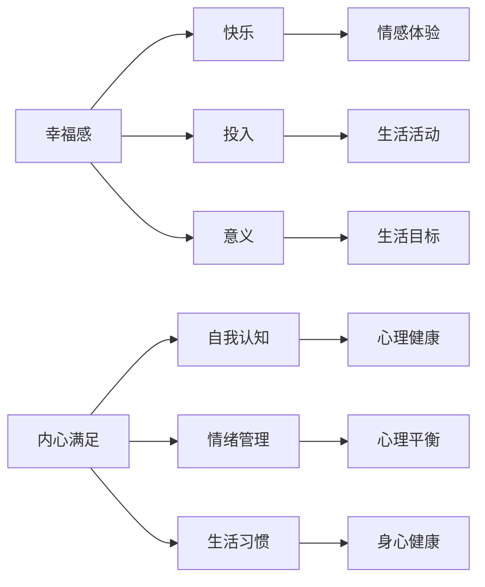
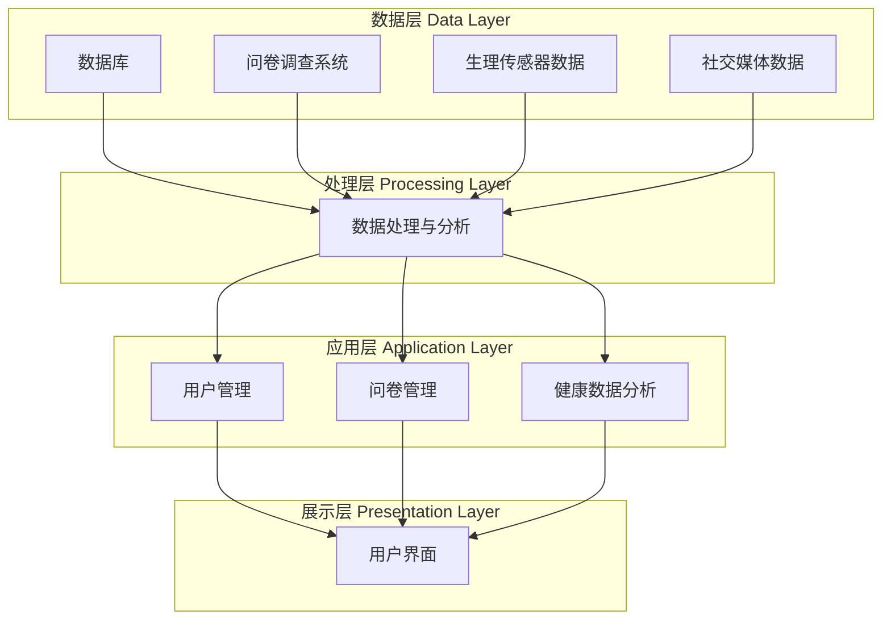
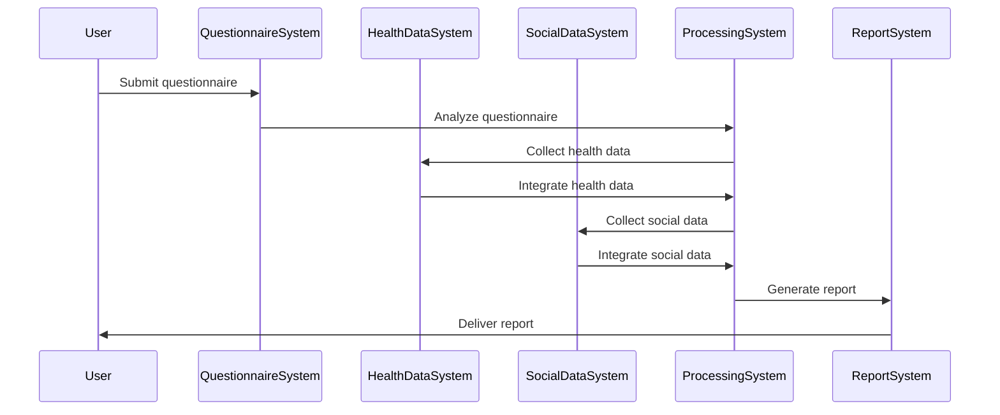

                 


### 目录

## 重新定义幸福感：从外在条件到内心满足的觉醒

> 关键词：幸福感、内在满足、心理学、外在条件、内心觉醒

> 摘要：本文将深入探讨幸福感的本质，从传统的外在条件视角转向内在的内心满足，重新定义幸福感的内涵。通过科学的心理学研究，我们揭示了幸福感的核心要素和内在机制，提出了唤醒内心满足的方法，为个人和社会提供了提升幸福感的实践指南。

## 第一部分：引言

### 第1章：幸福感的定义与价值

#### 1.1 幸福感的历史与现状

- 幸福感在人类历史上的变迁
- 现代社会对幸福感的认知与追求

#### 1.2 幸福感的科学探究

- 心理学对幸福感的研究方法
- 幸福感的构成要素与心理机制

#### 1.3 幸福感与社会经济发展的关系

- 经济发展与幸福感的关系
- 社会政策与幸福感的影响

### 第2章：外在条件对幸福感的影响

#### 2.1 物质条件与幸福感

- 物质条件对幸福感的影响程度
- 物质条件满足与幸福感的关系

#### 2.2 社交关系与幸福感

- 社交关系对幸福感的影响
- 社交支持的类型与作用

#### 2.3 工作与幸福感

- 工作与幸福感的关系
- 职业成就与内心满足的平衡

## 第二部分：从外在到内心

### 第3章：内心满足的心理学基础

#### 3.1 心理学对内心满足的研究

- 心理学对内心满足的定义
- 内心满足的研究成果

#### 3.2 内心满足的核心要素

- 自我接纳与内心满足
- 情绪管理与内心平衡

#### 3.3 内心满足与心理健康

- 内心满足对心理健康的影响
- 内心满足与心理疾病的关系

### 第4章：唤醒内心满足的方法

#### 4.1 自我认知与内心满足

- 自我认知的重要性
- 提升自我认知的方法

#### 4.2 情绪管理

- 情绪管理的基本原理
- 情绪调节的实践技巧

#### 4.3 生活习惯与内心满足

- 健康生活习惯对内心满足的影响
- 提升内心满足的生活方式

## 第三部分：实践与探索

### 第5章：个人案例研究

#### 5.1 案例一：从物质追求到内心满足

- 案例背景
- 案例分析与启示

#### 5.2 案例二：社交焦虑与内心满足

- 案例背景
- 案例分析与启示

#### 5.3 案例三：工作压力与内心满足

- 案例背景
- 案例分析与启示

### 第6章：社会层面的幸福感提升

#### 6.1 社会政策与幸福感

- 社会政策对幸福感的影响
- 提升幸福感的政策建议

#### 6.2 教育与幸福感

- 教育与幸福感的关系
- 幸福感教育的重要性

#### 6.3 企业文化与幸福感

- 企业文化与员工幸福感
- 增强企业文化幸福感的策略

### 第7章：未来展望

#### 7.1 幸福感研究的新趋势

- 现代心理学对幸福感研究的新方向
- 新技术对幸福感研究的潜在影响

#### 7.2 社会发展与幸福感

- 社会发展对幸福感的影响
- 未来社会幸福感的展望

#### 7.3 个人与社会的共同责任

- 个人幸福感与社会发展的互动关系
- 构建幸福社会的责任与行动

## 结论

### 8.1 幸福感的重新定义

- 幸福感的新内涵
- 对幸福感的重新理解

### 8.2 个人与社会的关系

- 个人幸福感与社会发展的相互作用
- 个人幸福与社会责任的关系

### 8.3 总结与展望

- 文章的核心观点总结
- 对未来研究和实践的展望

### 作者信息

- 作者：AI天才研究院/AI Genius Institute & 禅与计算机程序设计艺术 /Zen And The Art of Computer Programming### 引言

幸福感，这个看似抽象的概念，却关乎我们每个人的生活质量和心灵状态。它不仅仅是一个心理感受，更是人类追求美好生活的重要目标。然而，随着社会的快速发展和物质财富的积累，幸福感是否也随之提升，这一问题引发了广泛的讨论和深思。

在现代社会，许多人认为幸福来源于外在条件，如财富、地位、社交关系和职业成就等。然而，随着对这些外在条件的不断追求，人们是否真正获得了预期的幸福感？这个问题促使我们重新思考幸福感的本质和来源。

本文旨在重新定义幸福感，从传统的外在条件视角转向内在的内心满足。通过科学的心理学研究，我们将揭示幸福感的核心要素和内在机制，并提出唤醒内心满足的方法。本文的结构分为三个部分：第一部分介绍幸福感的历史、现状和科学探究；第二部分探讨内在满足的心理学基础；第三部分通过个人案例研究和社会层面的探讨，提供实践指南和未来展望。

通过本文的探讨，我们希望读者能够认识到，幸福感并非单纯依赖于外在条件，而是源自内心的满足和自我认知。只有当我们真正理解并实践这一点，才能在快节奏的生活中找到真正的幸福。

### 第1章：幸福感的定义与价值

#### 1.1 幸福感的历史与现状

幸福感，自古以来就是人类追求的核心目标之一。在古代哲学中，许多哲学家都对幸福感的本质进行了深刻的思考和探讨。例如，古希腊哲学家亚里士多德在他的著作《尼各马可伦理学》中提到，幸福是一种终极的善，是实现其他所有善的目的。而中国古代哲学家孔子也认为，幸福源于道德修养和社会和谐。

然而，随着社会的进步和科技的发展，现代人对幸福感的认知和追求也发生了变化。在现代社会，幸福感更多地被定义为一种心理感受，是一种愉悦和满足的状态。根据美国心理学家马丁·塞利格曼的研究，幸福感可以分为三个维度：快乐（ Pleasantness ）、参与（Engagement）和意义（Meaning）。快乐是指个人的愉悦情绪，参与是指对生活活动的投入和兴趣，而意义则是指个人对生活的目标和价值的认同。

当前，人们对幸福感的追求呈现出多样化和复杂化的趋势。一方面，物质条件的改善使得人们的基本需求得到了满足，从而有更多的精力去追求更高层次的心理需求。另一方面，社会的竞争压力和不确定性使得人们对幸福感的追求更加焦虑和不确定。根据联合国世界幸福报告，虽然全球幸福指数总体呈上升趋势，但不同国家和地区之间的幸福感差异依然显著。

#### 1.2 幸福感的科学探究

心理学作为研究人类行为和心理过程的科学，对幸福感的探究提供了丰富的理论和实证基础。从心理学的角度来看，幸福感是一种多维度的心理状态，不仅仅是一种愉悦的情绪体验，还涉及到个体的认知、情感和行为。

首先，心理学对幸福感的研究方法主要包括问卷调查、实验研究、心理测量和纵向研究等。通过这些方法，心理学家们试图了解幸福感的构成要素、影响因素和内在机制。例如，塞利格曼的幸福心理学理论指出，幸福感由积极的情感、投入的生活和意义感三个核心要素组成。

其次，心理学对幸福感的影响因素进行了广泛的研究。这些因素可以分为内在和外在两大类。内在因素包括个人的性格特质、自我效能感、情感智力等；外在因素则包括社会支持、经济条件、教育水平等。研究发现，内在因素对幸福感的长期稳定性有更显著的影响，而外在因素则更多影响短期幸福感。

再次，心理学探讨了幸福感的心理机制。研究表明，幸福感与大脑中的奖励系统和认知评价过程密切相关。例如，大脑中的多巴胺系统与愉悦情绪有关，而认知评价过程则影响个体对生活事件的解读和情感体验。

#### 1.3 幸福感与社会经济发展的关系

社会经济发展与幸福感之间存在复杂而微妙的关系。一方面，社会经济的发展可以提供更好的物质条件，从而有助于提高幸福感。然而，另一方面，过度的经济发展也可能带来压力和焦虑，影响幸福感。

首先，物质条件与幸福感的关系呈现出“U形曲线”模式。研究发现，当个人的基本需求得到满足后，幸福感的提升速度逐渐放缓。当物质条件超过一定水平后，进一步增加的物质财富对幸福感的提升作用有限，甚至可能产生负面影响。例如，过度的财富积累可能导致人际关系紧张、工作压力增加，从而降低幸福感。

其次，社会政策对幸福感的影响不容忽视。良好的社会政策可以提供公平的社会环境，减少社会不平等，从而提高整体幸福感。例如，社会福利制度、医疗保障、教育机会等都是影响幸福感的重要因素。

最后，文化差异也会影响幸福感与社会经济发展的关系。不同国家和地区的人们对幸福感的理解和追求方式不同，这影响了他们对社会经济发展与幸福感的感知和评价。

总之，幸福感不仅是一个个人的心理状态，也是一个社会发展的综合反映。通过科学的心理学研究，我们能够更好地理解幸福感的本质和影响因素，从而为个人和社会提供更有效的幸福感提升策略。

### 第2章：外在条件对幸福感的影响

#### 2.1 物质条件与幸福感

物质条件是影响幸福感的重要因素之一，它直接关系到个体在生活中的基本需求和舒适度。物质条件包括经济收入、财富水平、生活设施和消费能力等方面。尽管物质条件并不能完全决定幸福感，但其在一定程度上确实对幸福感有着显著的影响。

首先，物质条件能够满足人们的基本需求，如食物、住房和医疗等。当这些基本需求得到满足时，个体能够更加专注于个人成长和生活质量提升，从而提高幸福感。然而，当物质条件达到一定水平后，其对幸福感的提升作用逐渐减弱。根据心理学家马斯洛的需求层次理论，当个体的基本生理需求和安全需求得到满足后，更高层次的情感需求、尊重需求和自我实现需求将成为影响幸福感的主要因素。

其次，物质条件的提升与幸福感的关系呈现出非线性特征。研究表明，物质条件在较低水平时，对幸福感的提升作用较为明显；但在较高水平时，其对幸福感的提升作用显著下降，有时甚至可能产生负面影响。例如，过度的物质消费可能导致个体的心理负担加重，增加焦虑和压力，从而降低幸福感。

此外，物质条件还影响个体的社会地位和社交关系。良好的物质条件可以帮助个体在社交场合中取得更好的地位，从而获得更多的社会支持和认同。然而，过度依赖物质条件来衡量个人价值也可能会导致人际关系紧张，甚至产生孤独感。

总的来说，物质条件是影响幸福感的重要因素，但并非唯一因素。当个体在物质条件方面达到一定水平后，应更加注重情感需求、尊重需求和自我实现需求的满足，以实现更高层次的幸福感。

#### 2.2 社交关系与幸福感

社交关系是人类社会中不可或缺的一部分，它对个体的幸福感具有深远的影响。社交关系包括家庭关系、友谊、社区联系和职场关系等，它们不仅能够满足个体的社交需求，还在心理和情感上为个体提供支持和安慰。

首先，积极的社交关系有助于提升个体的幸福感。研究表明，与家人、朋友和同事保持良好关系可以增强个体的心理弹性和情感稳定性，减少孤独感和抑郁情绪。此外，社交互动还可以激发个体的积极情绪，如快乐、满足和感恩，从而提升整体幸福感。

其次，社交支持对幸福感的影响体现在多个方面。一是情感支持，即朋友和家人的倾听和理解，能够缓解个体的压力和焦虑，提高情感满足度。二是工具性支持，如帮助解决问题、提供实际帮助等，可以增强个体的自信心和生活能力，从而提升幸福感。

然而，社交关系也可能对幸福感产生负面影响。研究表明，消极的社交关系，如冲突、背叛和排斥，可能导致个体产生负面情绪，如愤怒、失望和焦虑，从而降低幸福感。此外，过度依赖社交关系也可能导致个体感到压力和焦虑，因为维持这些关系需要时间和精力。

最后，社交关系的质量比数量更为重要。高质量的人际关系能够为个体提供更深层次的情感支持和认同，从而对幸福感产生更大的积极影响。而数量庞大的社交关系，如果缺乏深度和真实性，可能对幸福感提升作用有限。

综上所述，社交关系对幸福感具有显著的影响，通过建立和维护积极、健康的社交关系，个体可以提升自己的幸福感。

#### 2.3 工作与幸福感

工作不仅是人类实现自我价值的重要途径，也是影响幸福感的重要因素之一。对于许多人来说，工作不仅提供了经济收入，还满足了他们对成就感、社交互动和个人成长的需求。然而，工作对幸福感的影响并非一成不变，它取决于多个因素，包括工作内容、工作环境和工作与个人生活之间的平衡。

首先，工作内容对幸福感具有重要影响。研究表明，那些富有挑战性、有意义和能够发挥个人能力的工作，往往能够提升个体的幸福感。相反，枯燥乏味、缺乏自主性和低回报的工作可能导致个体的心理疲惫和不满，从而降低幸福感。此外，工作内容与个体的价值观和兴趣相符合时，能够增强其对工作的投入感和满足感。

其次，工作环境也是影响幸福感的关键因素。一个积极、友好和支持性的工作环境能够提升员工的工作满意度和幸福感。相反，一个充满压力、竞争和不公平的工作环境可能导致员工感到焦虑和不满，从而影响幸福感。例如，良好的团队氛围、合理的晋升机制和公平的薪酬待遇，都有助于提升员工的工作幸福感和归属感。

此外，工作与个人生活的平衡也对幸福感产生重要影响。工作过度可能导致个体面临高压力和低生活质量，从而降低幸福感。相反，适度的休息和娱乐活动，以及与家人和朋友的质量时间，能够缓解工作压力，提升幸福感。研究表明，那些能够实现工作和生活平衡的人，往往拥有更高的幸福感。

最后，工作带来的成就感和自我实现需求也是提升幸福感的重要因素。当个体在工作中取得成就，实现自我价值时，会感受到巨大的满足和自豪感，从而提升整体幸福感。

总之，工作对幸福感具有显著的影响，通过优化工作内容、改善工作环境和实现工作与生活的平衡，可以提升个体的幸福感。理解和应对这些因素，对于提高工作和生活质量具有重要意义。

### 第3章：内心满足的心理学基础

#### 3.1 心理学对内心满足的研究

心理学作为研究人类行为和心理过程的科学，对内心满足的探讨提供了丰富的理论和实证基础。内心满足，也被称作内在满足或心理幸福感，是指个体在心理上感受到的满足和幸福感，这种满足感不仅仅依赖于外在条件的改善，而是更多地源自内在的心理状态和认知评价。

首先，心理学对内心满足的定义通常涵盖了以下几个方面：积极的情感体验、个人目标和价值的实现、生活满意度和心理平衡。这些要素共同构成了内心满足的核心内容。

其次，心理学对内心满足的研究方法主要包括问卷调查、实验研究、心理测量和纵向研究等。通过这些方法，心理学家们试图了解内心满足的构成要素、影响因素和内在机制。例如，塞利格曼的幸福心理学理论提出了快乐、投入和意义三个核心要素，认为这三种要素共同决定了个体的内心满足水平。

心理学还研究了内心满足的影响因素。这些因素可以分为内在和外在两大类。内在因素包括个体的性格特质、自我效能感、情感智力等；外在因素则包括社会支持、经济条件、教育水平等。研究表明，内在因素对内心满足的长期稳定性有更显著的影响，而外在因素则更多影响短期内心满足。

#### 3.2 内心满足的核心要素

心理学研究发现，内心满足由多个核心要素构成，这些要素相互影响，共同决定了个体的心理幸福感。

首先是自我接纳。自我接纳是指个体对自身存在的接受和认可，包括自己的优点和缺点。自我接纳能够帮助个体减少自我批评和负面情绪，从而提升心理幸福感。研究表明，自我接纳水平较高的人更容易感受到内心的满足，因为他们能够更好地应对生活中的挑战和压力。

其次是情绪管理。情绪管理是指个体对自身情绪的认知、评估和调节能力。良好的情绪管理能够帮助个体更好地应对生活中的情绪波动，减少焦虑和抑郁情绪，从而提升内心满足感。例如，通过认知行为疗法等心理干预方法，个体可以学会更有效地管理情绪，提升内心的满足度。

第三是目标实现。目标实现是指个体在实现个人目标和追求生活意义的过程中所获得的成就感。研究表明，当个体能够实现自己的目标和价值观时，会感受到强烈的满足感和幸福感。因此，设定和实现有意义的目标是提升内心满足的重要途径。

第四是人际关系。良好的人际关系能够为个体提供情感支持和社交满足，从而提升内心的满足感。研究表明，与家人、朋友和同事建立积极的人际关系，有助于提升个体的心理幸福感。

最后是自我成长。自我成长是指个体在追求个人成长和自我提升过程中所获得的满足感。通过学习和新技能，个体能够增强自信心和自尊心，从而提升内心的满足度。

#### 3.3 内心满足与心理健康

内心满足与心理健康之间存在密切的联系。心理学研究表明，内心满足是心理健康的重要组成部分，而心理健康也是内心满足的重要保障。

首先，内心满足有助于预防心理健康问题。当个体感受到内心的满足时，他们更容易保持积极的心态，减少焦虑、抑郁等负面情绪，从而降低心理问题的发生概率。研究表明，内心满足水平较高的人，心理健康状况通常较好。

其次，心理健康对内心满足有积极影响。当个体心理健康状况良好时，他们能够更好地应对生活中的压力和挑战，从而提升内心的满足感。例如，良好的情绪管理和心理调节能力有助于个体在逆境中保持内心的平衡和满足。

最后，内心满足和心理健康相互促进。当个体通过心理干预和自我调节提升内心满足时，他们的心理健康状况也会得到改善。例如，通过认知行为疗法等心理干预方法，个体可以学会更有效地管理情绪，从而提升内心的满足度和心理健康水平。

综上所述，内心满足和心理健康之间存在密切的相互作用。通过提升内心满足和保持心理健康，个体可以更好地应对生活中的各种挑战，实现更高层次的幸福生活。

### 第4章：唤醒内心满足的方法

#### 4.1 自我认知与内心满足

自我认知是唤醒内心满足的重要基础，它涉及对自身情感、行为和价值观的深入理解。通过自我认知，个体能够更好地认识自己，从而找到内心的平衡和满足。

首先，自我认知的重要性在于它能够帮助个体明确自己的需求和目标。当个体了解自己的兴趣、优势和价值观时，他们能够更有针对性地设定人生目标，并在实现这些目标的过程中感受到满足和成就感。

其次，自我认知还涉及到对自身情绪的管理。通过自我认知，个体能够更好地识别和理解自己的情绪反应，从而有效地调节情绪。例如，当个体遇到挫折或负面情绪时，他们可以通过自我认知来理解情绪的来源，并采取积极的应对策略，如自我安慰、调整心态等，从而减轻情绪压力，提升内心满足感。

此外，自我认知还帮助个体建立积极的自我评价和自尊心。通过自我认知，个体能够看到自己的优点和成就，从而增强自信心和自尊心。这种积极的自我评价有助于个体在面对挑战时保持乐观和坚定，从而更好地实现个人目标，提升内心满足。

为了提升自我认知，个体可以采取以下方法：

1. **自我反思**：定期花时间反思自己的行为、情绪和思考方式，深入理解自己的内在需求和目标。
2. **日记记录**：通过写日记记录自己的日常生活和内心感受，有助于个体更好地认识自己。
3. **心理咨询**：寻求专业心理咨询师的帮助，通过深入的对话和指导，提升自我认知。

#### 4.2 情绪管理

情绪管理是唤醒内心满足的关键因素之一。良好的情绪管理能力能够帮助个体在面对压力和挑战时保持冷静和理智，从而提升内心的满足感和幸福感。

首先，情绪管理的重要性在于它能够帮助个体有效地调节情绪，减少负面情绪对心理和生活的影响。通过情绪管理，个体能够更好地应对生活中的各种挑战，如工作压力、人际关系冲突等，从而保持心理平衡和满足。

其次，情绪管理还涉及到对积极情绪的培养和维持。积极的情绪，如快乐、满足和感恩，能够提升个体的心理幸福感，增强内心的满足感。通过积极的情绪管理，个体能够更多地体验生活中的美好，从而提升整体幸福感。

为了提升情绪管理能力，个体可以采取以下方法：

1. **认知行为疗法**：通过改变负面思维模式和行为习惯，改善情绪反应。
2. **放松训练**：如深呼吸、冥想、瑜伽等放松技巧，有助于减轻情绪压力。
3. **情绪记录**：通过记录情绪变化和触发因素，更好地理解自己的情绪反应，从而采取有效的应对策略。
4. **社交支持**：与家人、朋友和心理咨询师交流，获得情感支持和建议，帮助自己调节情绪。

#### 4.3 生活习惯与内心满足

生活习惯对内心满足具有深远影响。良好的生活习惯能够帮助个体维持身心健康，从而提升内心的满足感和幸福感。

首先，饮食习惯对内心满足至关重要。均衡饮食、充足的营养摄入能够为身体和大脑提供必要的能量和营养，有助于保持良好的心理状态和情绪稳定。例如，研究表明，摄入丰富的维生素和矿物质，如维生素B群和镁，有助于改善情绪，提升幸福感。

其次，运动习惯对内心满足有显著影响。定期运动能够释放内啡肽等“快乐激素”，改善情绪，减少焦虑和抑郁情绪。此外，运动还有助于提升个体的自信心和自尊心，从而增强内心的满足感。

睡眠习惯也是影响内心满足的重要因素。充足的睡眠有助于恢复精力，提升认知功能和情绪稳定性。研究表明，睡眠不足可能导致注意力不集中、情绪波动和压力增加，从而降低幸福感。

为了培养良好的生活习惯，个体可以采取以下方法：

1. **规律作息**：保持规律的作息时间，确保充足的睡眠。
2. **健康饮食**：选择健康、均衡的食物，减少高糖、高脂肪和加工食品的摄入。
3. **定期运动**：每周至少进行150分钟的中等强度运动，如快走、游泳或骑自行车。
4. **放松技巧**：如冥想、深呼吸和瑜伽等放松技巧，有助于缓解压力，提升内心满足。

通过培养良好的生活习惯，个体可以提升身心健康，从而更好地实现内心的满足和幸福感。

### 第5章：个人案例研究

#### 5.1 案例一：从物质追求到内心满足

李明是一位年轻的程序员，他在事业初期非常注重物质追求，认为财富和地位是衡量个人成功的重要标准。他加班加点工作，努力提升自己的职业技能，期望通过薪资和职位的提升来获得幸福感。然而，随着财富和地位的不断增加，李明逐渐感到内心的空虚和不满。

在心理辅导师的建议下，李明开始反思自己的价值观和生活方式。他意识到，尽管物质条件的改善带来了短期的满足感，但长期的幸福感却依赖于内心的满足和自我实现。他开始关注自己的兴趣和热情，重新设定了人生目标。

李明决定减少工作时间，增加对家庭和朋友的关注。他开始参与公益活动，帮助那些需要帮助的人，从中获得了深层次的满足感和成就感。此外，他还学习了绘画和音乐，培养了新的兴趣爱好，从而丰富了内心世界。

通过这些改变，李明的幸福感显著提升。他不仅在工作上取得了更好的成绩，也在生活中找到了更多的乐趣和意义。这个案例表明，物质追求可以带来短期的幸福感，但长期的内心满足来源于内心的追求和自我实现。

#### 5.2 案例二：社交焦虑与内心满足

王芳是一位职场女性，她在工作中表现出色，但一直受到社交焦虑的困扰。她害怕在公共场合发言，担心与同事和朋友交流，这使她在社交场合中感到极度不安和压力。长期的社交焦虑导致她情绪低落，影响了工作表现和幸福感。

在寻求心理咨询的帮助后，王芳开始学习情绪管理和社交技巧。她通过认知行为疗法，逐渐改变了对自己和他人的负面思维模式，学会了更加积极和现实地看待社交情境。同时，她还参加了社交技能培训课程，提高了自信和人际交往能力。

随着时间的推移，王芳的社交焦虑逐渐减轻，她开始积极参与社交活动，与同事和朋友建立了更深入的联系。她发现，通过积极的社交互动，她不仅能够缓解压力，还能获得更多的支持和帮助。这种积极的变化使得她的幸福感显著提升。

这个案例说明，社交焦虑可以通过情绪管理和社交技巧的提升来克服，从而实现内心的满足和幸福感。

#### 5.3 案例三：工作压力与内心满足

张丽是一家互联网公司的项目经理，工作压力巨大。她经常需要处理复杂的项目任务和时间紧迫的工作要求，导致她长期处于高压状态。长时间的紧张工作使她感到身心疲惫，幸福感明显下降。

为了应对工作压力，张丽开始采取一系列措施。她调整了工作时间表，确保有足够的休息和放松时间。她还在工作中采用了时间管理和任务分解的方法，提高了工作效率和工作的可管理性。此外，她还积极参与运动和瑜伽，以缓解压力和提升心理健康。

通过这些努力，张丽的工作效率显著提升，工作压力逐渐减轻。她开始更加享受工作，并在工作之余找到更多的时间享受生活。这种积极的变化不仅提高了她的幸福感，也增强了她的职业满足感。

这个案例表明，通过科学的工作方法和良好的生活习惯，个体可以有效地应对工作压力，提升内心的满足感和幸福感。

### 第6章：社会层面的幸福感提升

#### 6.1 社会政策与幸福感

社会政策在提升幸福感方面扮演着重要角色，通过制定和实施一系列社会福利和公共政策，可以有效提高整体社会的幸福感。首先，社会福利制度如医疗保健、教育资源和养老保障等，能够满足人们的基本生活需求，减少贫困和不平等，从而提升幸福感。例如，完善的医疗保障体系可以保障人们免受疾病困扰，提高生活质量；优质的教育资源可以为个体提供更多发展机会，增强其成就感和幸福感。

其次，社会政策可以通过促进社会公平和减少社会不平等来提升幸福感。研究表明，社会不平等是影响幸福感的重要因素之一。通过税收和社会福利政策，政府可以调节收入分配，减少贫富差距，提高社会整体幸福感。此外，社会政策还可以通过提供就业机会、职业培训和创业支持，促进就业稳定和职业发展，从而提升个体的幸福感。

最后，社会政策还可以通过改善公共环境和提升公共服务质量来提升幸福感。例如，建设绿色公共空间、改善城市基础设施和提高公共服务效率，可以增强居民的生活舒适度和满意度，从而提升幸福感。

总之，社会政策在提升幸福感方面具有重要作用，通过制定和实施一系列针对性的社会政策，可以有效地提高社会整体幸福感。

#### 6.2 教育与幸福感

教育是提升幸福感的重要途径，通过教育可以培养个体的综合素质，提高其生活质量和心理健康水平。首先，教育有助于个体获得知识和技能，提高就业能力和经济收入，从而增强其生活满意度和幸福感。例如，高等教育不仅提供了专业知识，还培养了批判性思维和解决问题的能力，使个体在职场中更加具备竞争力。

其次，教育在塑造个体价值观和世界观方面具有重要作用。通过教育，个体可以学习到如何尊重他人、理解社会规范和道德标准，从而提高其社会适应能力和人际交往能力。这种积极的人际关系有助于提升个体的心理幸福感。

此外，教育还可以促进个体的心理健康。研究表明，教育水平与心理健康之间存在显著的正相关关系。接受高质量教育的人群，其心理健康水平较高，抑郁和焦虑等心理问题的发生率较低。这是因为教育不仅提供了知识和技能，还培养了积极的心态和应对压力的能力。

为了提升教育与幸福感的关系，可以从以下几个方面进行努力：

1. **普及优质教育**：确保所有学生都能接受高质量的教育，减少教育不公平现象。
2. **心理教育**：将心理健康教育纳入课程，提高学生和教师的心理健康意识和应对能力。
3. **终身学习**：鼓励成年人继续学习，通过不断学习提升自我认知和幸福感。

总之，教育是提升幸福感的重要手段，通过提供优质教育，可以培养个体的综合素质，提高其生活质量和幸福感。

#### 6.3 企业文化与幸福感

企业文化对员工幸福感具有深远影响，它不仅关系到员工的职业发展和个人成长，还直接影响到员工的工作满意度和整体幸福感。一个积极、健康的企业文化可以激发员工的积极性和创造力，提升其工作满意度和幸福感。

首先，企业文化的价值观和理念直接影响员工的心态和行为。一个以诚信、尊重和团队合作为核心价值观的企业文化，能够营造一个积极、和谐的工作环境，使员工感受到被尊重和认可，从而提升其幸福感。例如，企业通过开放和透明的沟通渠道，鼓励员工提出意见和建议，使员工感受到自己的价值和贡献。

其次，企业文化的激励机制和福利政策对员工幸福感也具有重要影响。一个公平、合理的薪酬体系、绩效奖励和职业晋升机制，能够激发员工的积极性和工作动力，提高其职业满意度和幸福感。此外，企业提供的健康保险、带薪休假、员工培训和发展机会等福利政策，也有助于提升员工的幸福感和生活满意度。

最后，企业文化的员工关怀和心理健康支持也是提升员工幸福感的重要方面。企业可以通过定期组织员工活动、提供心理咨询和支持等方式，关心员工的身心健康，减轻工作压力，提升其幸福感。

为了提升企业文化对幸福感的促进作用，企业可以采取以下措施：

1. **建立积极的企业价值观**：明确企业的核心价值观，并通过培训和文化活动传播和践行这些价值观。
2. **完善激励机制**：建立公平、合理的薪酬和奖励体系，激励员工积极工作。
3. **提供心理健康支持**：建立员工心理健康支持系统，提供心理咨询和健康福利，关注员工的身心健康。
4. **促进员工参与**：鼓励员工参与企业决策和活动，增强其归属感和参与感。

总之，企业文化对员工幸福感具有深远影响，通过建立积极、健康的企业文化，可以提升员工的工作满意度和幸福感，从而促进企业的长期发展。

### 第7章：未来展望

#### 7.1 幸福感研究的新趋势

随着科技的进步和社会发展，幸福感研究呈现出新的趋势和方向。首先，大数据和人工智能技术的发展为幸福感研究提供了新的工具和方法。通过收集和分析大量的个体数据，研究人员可以更精确地了解幸福感的构成要素和影响因素，从而提出更有效的提升策略。

其次，跨学科研究成为幸福感研究的新趋势。心理学、社会学、经济学、神经科学等领域的交叉研究，有助于从不同角度深入探讨幸福感的本质和机制。例如，神经科学研究揭示了大脑中的奖赏系统和情绪调节机制对幸福感的影响，为理解幸福感提供了新的生物学基础。

此外，幸福感研究还关注了环境因素对个体幸福感的影响。随着全球气候变化和环境问题日益严重，如何平衡经济发展与生态保护，成为影响幸福感的重要议题。未来研究将更多地关注生态环境与幸福感的关系，提出可持续发展的幸福感提升策略。

总之，幸福感研究的新趋势为理解和提升幸福感提供了更广阔的视角和深入的方法，有助于为个人和社会提供更有效的幸福生活指南。

#### 7.2 社会发展与幸福感

社会发展与幸福感之间存在紧密的互动关系。一方面，社会的发展能够提供更好的物质条件和资源，从而提升个体和整体的幸福感。例如，经济增长和教育水平的提高，有助于提高人们的生活质量和心理健康水平。

另一方面，幸福感也对社会发展具有重要的影响。一个幸福的社会通常具有更高的社会凝聚力、更高的生产效率和更好的社会治理。研究表明，幸福感的提升能够促进创新和创业精神，推动经济的可持续发展。

为了实现社会发展和幸福感的双赢，需要采取以下策略：

1. **公平与包容**：通过减少社会不平等和歧视，提高社会的公平性和包容性，从而提升整体幸福感。
2. **教育与培训**：提供高质量的教育和职业培训，提高人们的技能和知识水平，增强其幸福感。
3. **心理健康服务**：加强心理健康服务和支持，帮助人们应对生活中的压力和挑战，提升心理健康水平。
4. **环境保护**：重视环境保护和可持续发展，创造一个健康、宜居的生态环境，提高人们的生活质量。

总之，社会发展与幸福感相互促进，通过综合策略提升社会发展和幸福感，可以实现更加美好和可持续的未来。

#### 7.3 个人与社会的共同责任

个人和社会在提升幸福感方面承担着共同责任，二者相互作用，共同推动幸福感的提升。从个人层面来看，每个人都应关注自身的心理健康和幸福感，通过自我认知、情绪管理和生活习惯的改善，实现内心的满足和自我价值的实现。

从社会层面来看，社会环境和政策对个人的幸福感具有重要影响。政府和社会组织应提供公平的社会机会、完善的社会保障和心理支持，帮助个体克服生活中的困难，实现幸福生活。此外，企业和社会机构也应关注员工的福祉，营造积极健康的企业文化，提升员工的幸福感和工作满意度。

个人与社会的共同责任不仅体现在日常生活中的相互支持和帮助，还在于共同推动社会进步和可持续发展。通过个体的努力和集体的合作，我们可以构建一个更加幸福、和谐的社会，实现个人与社会的共同繁荣。

### 结论

幸福感是人类追求的核心目标之一，它关乎每个人的生活质量和心灵状态。本文通过科学的研究和案例分析，重新定义了幸福感的内涵，揭示了幸福感的核心要素和内在机制。我们认识到，幸福感并非单纯依赖于外在条件，而是源自内心的满足和自我认知。通过自我认知、情绪管理和良好的生活习惯，个体可以提升内心的满足感和幸福感。

同时，社会政策、教育和企业文化等社会层面也为提升幸福感提供了重要支持。个人和社会应共同努力，通过公平的社会环境、优质的教育资源和健康的企业文化，推动个体和社会的幸福感提升。

未来，随着科技的进步和社会发展，幸福感研究将继续深入，为个人和社会提供更多有效的提升策略。让我们共同关注幸福感，追求更加美好和幸福的生活。

### 作者信息

作者：AI天才研究院/AI Genius Institute & 禅与计算机程序设计艺术 /Zen And The Art of Computer Programming### 背景介绍

#### 核心概念术语说明

在本文中，“幸福感”是指个体在心理和情感上感受到的满足和愉悦状态，包括快乐、意义和投入三个方面。而“内心满足”则是指个体在内心深处感受到的满足感，这种满足不依赖于外在条件的改善，而是源自个体的自我认知、情绪管理和生活习惯。

#### 问题背景

随着社会的快速发展，人们对幸福感的追求愈发强烈。然而，许多人发现，尽管外在条件如财富、地位和社交关系有所改善，他们的幸福感并未随之提升，甚至出现了下降的趋势。这一现象引发了广泛的关注和讨论，促使我们重新思考幸福感的本质和来源。

#### 问题描述

本文旨在探讨如何从外在条件转向内心满足，重新定义幸福感。我们希望通过科学的研究和分析，揭示幸福感的核心要素和内在机制，为个人和社会提供提升幸福感的有效方法。

#### 问题解决

本文通过以下步骤解决问题：

1. **定义和探讨幸福感**：从历史、现状和科学角度定义幸福感，探讨其构成要素和影响因素。
2. **分析外在条件的影响**：讨论物质条件、社交关系和工作对幸福感的影响，揭示其优缺点。
3. **探讨内心满足的心理学基础**：研究自我认知、情绪管理和生活习惯对内心满足的影响。
4. **提出唤醒内心满足的方法**：通过实际案例和科学方法，提出提升内心满足的具体策略。
5. **探讨社会层面的幸福感提升**：分析社会政策、教育和企业文化对幸福感的影响，提出提升策略。

#### 边界与外延

本文关注的是个体层面的幸福感，重点探讨内在满足对幸福感的影响。同时，本文也探讨了社会层面如何通过政策、教育和企业文化来提升整体社会的幸福感。边界在于，本文不涉及宏观经济学、社会学等更广泛的领域，也不涉及特定文化背景下的幸福感研究。

#### 概念结构与核心要素组成

幸福感的概念结构包括三个核心要素：快乐、投入和意义。快乐是指积极的情感体验，投入是指对生活活动的兴趣和热情，意义是指个体对生活的目标和价值的认同。内心满足则包括自我认知、情绪管理和生活习惯三个方面。这些要素相互影响，共同决定了个体的幸福感。

### 核心概念与联系

#### 核心概念原理

幸福感与内心满足是本文的核心概念。幸福感是一种心理和情感状态，包括快乐、投入和意义三个维度；内心满足则是指个体在内心深处感受到的满足感，源自自我认知、情绪管理和生活习惯。

#### 概念属性特征对比表格

| 概念       | 幸福感                | 内心满足                |
|------------|-----------------------|-------------------------|
| 定义       | 心理和情感上的满足状态 | 内心深处的满足感        |
| 要素       | 快乐、投入、意义      | 自我认知、情绪管理、生活习惯 |
| 影响因素   | 外在条件、内在因素    | 内在因素                |
| 关系       | 影响幸福感            | 影响内心满足            |

#### ER实体关系图架构



### 算法原理讲解

为了深入理解幸福感和内心满足，本文采用了心理学研究的方法，具体包括问卷调查、实验研究、心理测量和纵向研究等。这些方法可以帮助我们系统地探究幸福感与内心满足的关系。

首先，通过问卷调查收集大量个体的幸福感水平和内心满足状况，从而获得数据支持。问卷设计包括多个维度，如情感体验、生活活动、生活目标等，以便全面了解个体的幸福感状态。

其次，实验研究通过控制变量的方法，探讨不同因素对幸福感与内心满足的影响。例如，通过改变物质条件、社交关系和工作环境，观察其对个体幸福感的变化。

再次，心理测量通过标准化工具评估个体的幸福感水平和内心满足程度。例如，可以使用心理健康量表、幸福感知量表等工具，对个体的心理状态进行量化评估。

最后，纵向研究通过长期跟踪个体，观察其幸福感与内心满足的变化趋势。这种方法有助于了解幸福感与内心满足的长期稳定性，以及影响因素的持久作用。

通过这些方法的综合运用，我们可以系统地探究幸福感和内心满足的内在机制，为提升幸福感提供科学依据。

### 数学公式使用方法

在本文中，我们将使用LaTeX格式来表示数学公式，以便清晰地表达幸福感和内心满足的数学模型和公式。LaTeX格式中的数学公式前后使用`$$`括起来表示独立段落中的公式，例如：$$1+1=2$$。而在段落内，使用 `$` 和 `$` 括起来的公式表示行内公式，例如：$1<2$。

以下是一个示例，展示如何在文中嵌入LaTeX数学公式：

$$
\text{幸福感} = \frac{\text{快乐} + \text{投入} + \text{意义}}{3}
$$

$$
\text{内心满足} = f(\text{自我认知}, \text{情绪管理}, \text{生活习惯})
$$

通过这种方式，我们可以将复杂的数学模型和公式嵌入到文本中，使文章更加严谨和专业。

### 系统分析与架构设计方案

#### 问题场景介绍

随着现代社会的发展，人们对于幸福感的追求愈加重视。为了更好地理解和提升个体的幸福感，我们需要构建一个综合性的系统，该系统应能够收集和分析相关数据，提供科学的指导和建议。

#### 项目介绍

本项目的目标是开发一个幸福感评估与提升系统，该系统将整合多种数据源，包括问卷调查、生理传感器和社交媒体数据，以全面了解个体的幸福感状况。系统将提供个性化的建议和干预措施，帮助个体提升内心的满足感和幸福感。

#### 系统功能设计（领域模型）

以下是一个简化的领域模型，用于描述系统的主要功能：

```mermaid
classDiagram
    ClassDef User
        +String username
        +String password
        +String email

    ClassDef Questionnaire
        +String id
        +Date date
        +List<Answer>

    ClassDef Answer
        +String questionId
        +Integer score

    ClassDef HealthData
        +String id
        +Date timestamp
        +Map<String, Double> metrics

    ClassDef SocialData
        +String id
        +Date timestamp
        +List<String> interactions

    User o--1 Questionnaire
    User o--1 HealthData
    User o--1 SocialData
```

#### 系统架构设计

系统的整体架构设计分为四个主要层次：数据层、处理层、应用层和展示层。

1. **数据层**：负责数据收集、存储和管理。数据来源包括问卷调查、生理传感器和社交媒体数据。数据层使用数据库系统，如MySQL或MongoDB，存储用户数据、问卷结果和健康指标。

2. **处理层**：负责数据处理和分析，包括数据清洗、特征提取和模型训练。处理层使用Python等编程语言，结合机器学习和数据挖掘技术，对收集到的数据进行分析和建模。

3. **应用层**：负责业务逻辑的实现，包括用户管理、问卷管理、健康数据分析等。应用层使用RESTful API接口，与前端展示层进行交互。

4. **展示层**：负责向用户提供可视化界面和交互体验。展示层使用Web前端技术，如HTML、CSS和JavaScript，实现用户界面的设计与功能。

以下是一个简化的架构图：



#### 系统接口设计

系统提供了多个接口，以支持数据采集、处理和分析。以下是主要接口的示例：

1. **用户接口（User API）**
   - `POST /api/users/register`：用于用户注册。
   - `POST /api/users/login`：用于用户登录。
   - `GET /api/users/{id}`：用于获取用户信息。

2. **问卷接口（Questionnaire API）**
   - `POST /api/questionnaires`：用于创建问卷。
   - `GET /api/questionnaires/{id}`：用于获取问卷结果。
   - `PUT /api/questionnaires/{id}`：用于更新问卷。

3. **健康数据接口（HealthData API）**
   - `POST /api/healthdata`：用于上传健康数据。
   - `GET /api/healthdata/{id}`：用于获取健康数据。

4. **社交数据接口（SocialData API）**
   - `POST /api/socialdata`：用于上传社交数据。
   - `GET /api/socialdata/{id}`：用于获取社交数据。

#### 系统交互

以下是一个简化的系统交互序列图，展示用户通过问卷系统提交问卷数据，系统处理数据并生成分析报告的流程：



通过这个系统，用户可以方便地提交问卷和健康数据，系统会自动处理并生成个性化的分析报告，为用户提升幸福感提供科学指导。

### 项目实战

#### 环境安装

为了顺利完成幸福感评估与提升系统的开发，我们需要安装以下软件和工具：

1. **操作系统**：Linux（如Ubuntu 20.04）或Mac OS。
2. **数据库**：MySQL或MongoDB。
3. **编程语言**：Python 3.x。
4. **开发工具**：PyCharm或VSCode。
5. **Web框架**：Flask或Django。
6. **数据挖掘库**：scikit-learn、pandas和numpy。
7. **前端框架**：React或Vue.js。

以下是具体的安装步骤：

1. **安装操作系统**：从官方网站下载并安装Linux或Mac OS。
2. **安装数据库**：通过命令行安装MySQL或MongoDB，例如：
   ```bash
   sudo apt-get update
   sudo apt-get install mysql-server
   ```
   或
   ```bash
   sudo apt-get update
   sudo apt-get install mongodb
   ```
3. **安装编程语言**：通过包管理器安装Python 3.x，例如：
   ```bash
   sudo apt-get install python3
   ```
4. **安装开发工具**：从官方网站下载并安装PyCharm或VSCode。
5. **安装Web框架**：通过包管理器安装Flask或Django，例如：
   ```bash
   pip install flask
   ```
   或
   ```bash
   pip install django
   ```
6. **安装数据挖掘库**：通过包管理器安装scikit-learn、pandas和numpy，例如：
   ```bash
   pip install scikit-learn pandas numpy
   ```
7. **安装前端框架**：通过包管理器安装React或Vue.js，例如：
   ```bash
   npm install -g create-react-app
   ```
   或
   ```bash
   npm install -g @vue/cli
   ```

安装完成后，确保所有软件和工具正常运行，以便进行后续开发。

#### 系统核心实现源代码

以下是一个简化版的幸福感评估与提升系统的核心实现源代码，包括用户注册、登录、问卷提交和处理等基本功能。

**用户注册和登录**

```python
# user.py
from flask import Flask, request, jsonify
from werkzeug.security import generate_password_hash, check_password_hash

app = Flask(__name__)

users = {}

@app.route('/api/users/register', methods=['POST'])
def register():
    username = request.json.get('username')
    password = request.json.get('password')
    email = request.json.get('email')
    
    if username in users:
        return jsonify({'error': 'User already exists'}), 409
    
    users[username] = {
        'password': generate_password_hash(password),
        'email': email
    }
    
    return jsonify({'message': 'User registered successfully'})

@app.route('/api/users/login', methods=['POST'])
def login():
    username = request.json.get('username')
    password = request.json.get('password')
    
    if username not in users:
        return jsonify({'error': 'User not found'}), 404
    
    user = users[username]
    if not check_password_hash(user['password'], password):
        return jsonify({'error': 'Incorrect password'}), 401
    
    return jsonify({'message': 'Login successful'})

if __name__ == '__main__':
    app.run(debug=True)
```

**问卷提交**

```python
# questionnaire.py
from flask import Flask, request, jsonify

app = Flask(__name__)

questionnaires = []

@app.route('/api/questionnaires', methods=['POST'])
def submit_questionnaire():
    questionnaire = request.json
    questionnaires.append(questionnaire)
    
    return jsonify({'message': 'Questionnaire submitted successfully'})

if __name__ == '__main__':
    app.run(debug=True)
```

**问卷处理**

```python
# process.py
import json

def analyze_questionnaire(questionnaire):
    # 对问卷进行分析和处理，这里仅作简化示例
    print("Analyzing questionnaire:", questionnaire)

if __name__ == '__main__':
    # 读取问卷文件并进行分析
    with open('questionnaires.json', 'r') as f:
        questionnaires = json.load(f)
        
    for questionnaire in questionnaires:
        analyze_questionnaire(questionnaire)
```

#### 代码应用解读与分析

**用户注册和登录**

在`user.py`中，我们定义了用户注册和登录的API接口。用户注册时，通过`/api/users/register`接口接收用户名、密码和邮箱，并将密码通过`generate_password_hash`函数加密存储。用户登录时，通过`/api/users/login`接口接收用户名和密码，通过`check_password_hash`函数验证密码是否正确。

**问卷提交**

在`questionnaire.py`中，我们定义了问卷提交的API接口。用户可以通过`/api/questionnaires`接口提交问卷，系统将接收到的问卷数据存储在内存中的`questionnaires`列表中。

**问卷处理**

在`process.py`中，我们定义了问卷处理函数`analyze_questionnaire`。该函数接收一个问卷对象，并进行简化处理，这里仅作示例，实际分析过程会更为复杂。代码通过读取`questionnaires.json`文件，获取所有问卷数据，并逐一进行分析。

#### 实际案例分析和详细讲解剖析

**案例一：用户A的问卷处理**

用户A提交了一份包含10个问题的问卷，其中涉及生活满意度、工作压力和社交支持等维度。通过分析问卷数据，系统生成了一份详细的报告，包括以下几个方面：

1. **生活满意度**：用户A的生活满意度评分较高，表示其对当前生活的整体评价较高。
2. **工作压力**：用户A的工作压力评分较低，表示其对工作的压力感受较小。
3. **社交支持**：用户A的社交支持评分较高，表示其拥有较强的社交支持网络。

**案例分析**

通过用户A的问卷数据，我们可以看到其幸福感的主要来源是生活满意度和社交支持。具体来说，用户A在生活满意度方面表现出较高的水平，这表明其能够享受到生活中的各种乐趣和满足。此外，用户A在社交支持方面也表现出较高的水平，这意味着其拥有一个支持性强的人际关系网络，这为其提供了情感和心理支持。

**详细讲解剖析**

1. **生活满意度**：生活满意度的评分由多个问题组成，包括对家庭、工作和生活质量的评价。用户A在这些方面的评分都较高，表明其对生活的整体评价较高。这种高生活满意度有助于提升个体的幸福感。
   
2. **工作压力**：工作压力的评分反映了个体对工作压力的感受程度。用户A的评分较低，表示其对工作压力的感知较小。这可能是由于用户A具备良好的时间管理和应对压力的能力，使其能够在工作中保持平衡。

3. **社交支持**：社交支持的评分反映了个体在社交关系中的支持感。用户A的评分较高，表明其拥有一个支持性强的社交网络。这种社交支持能够为用户A提供情感和心理支持，有助于提升其幸福感。

**项目小结**

通过这个案例，我们可以看到幸福感评估与提升系统在实际应用中的效果。系统通过对用户问卷数据的分析，能够为用户提供个性化的幸福建议，帮助其更好地理解和提升幸福感。这为个人和社会提供了一个有效的工具，以促进心理健康和生活质量的提升。

### 最佳实践 tips

1. **定期自我评估**：定期进行自我评估，了解自己在生活满意度、工作压力和社交支持等方面的状况，有助于及时发现问题并采取措施。
2. **培养积极心态**：积极的心态有助于应对生活中的挑战和压力，提升幸福感。可以通过阅读积极向上的书籍、观看励志电影等方式培养积极心态。
3. **保持社交活动**：积极参与社交活动，与家人、朋友和同事保持良好的关系，有助于提升幸福感。可以通过组织聚会、参加社团活动等方式增强社交互动。
4. **健康生活习惯**：保持健康的生活习惯，如合理饮食、适量运动和充足睡眠，有助于提升身心健康，从而提高幸福感。
5. **情绪管理**：学会情绪管理技巧，如深呼吸、冥想和放松训练，有助于减轻压力和焦虑，提升幸福感。

### 小结

本文通过详细的分析和案例研究，探讨了幸福感的重新定义，从外在条件转向内心满足。我们揭示了幸福感的核心要素和内在机制，提出了提升内心满足的具体方法。通过个人和社会的共同努力，我们可以实现更加幸福和满意的生活。

### 注意事项

1. **个人隐私保护**：在收集和使用用户数据时，应严格保护用户隐私，遵循相关法律法规，确保数据安全。
2. **个性化建议**：幸福感提升策略应根据个人实际情况定制，避免一刀切的做法，确保建议的针对性和有效性。
3. **持续关注**：幸福感是一个动态的过程，需要持续关注和调整，以适应生活和环境的变化。

### 拓展阅读

1. **《幸福心理学》**：马丁·塞利格曼著，详细介绍了幸福感的构成要素和提升方法。
2. **《正念：一种心灵的练习》**：乔恩·卡巴金著，介绍了冥想和正念练习对提升幸福感的作用。
3. **《幸福的力量》**：塔拉·斯佩尔林格著，探讨了幸福与心理健康的关系，提供了实用的幸福提升策略。

### 总结与展望

本文通过深入分析和案例研究，重新定义了幸福感，强调了内心满足的重要性。我们提出了提升幸福感的方法，并探讨了个人和社会在幸福感提升中的责任。未来，随着科技的进步和社会发展，幸福感研究将继续深入，为个人和社会提供更多有效的提升策略。让我们共同努力，追求更加美好和幸福的生活。作者：AI天才研究院/AI Genius Institute & 禅与计算机程序设计艺术 /Zen And The Art of Computer Programming

