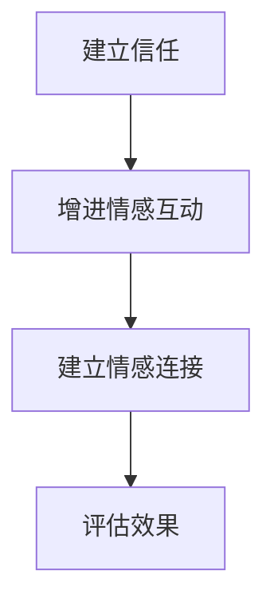
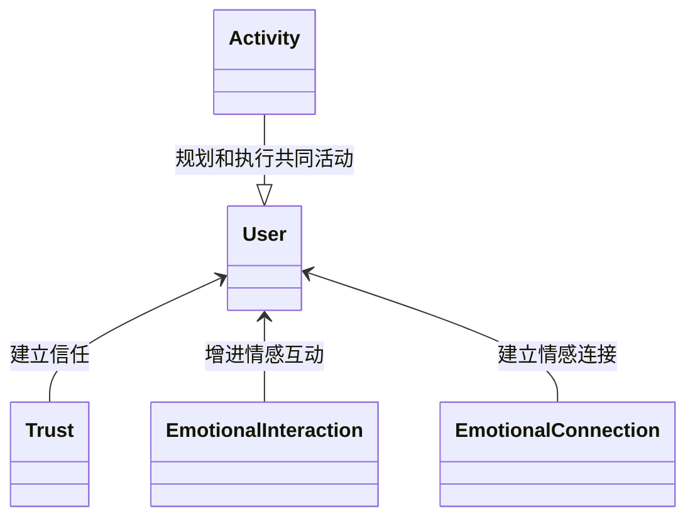
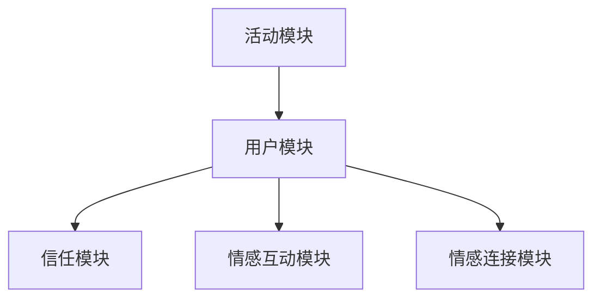
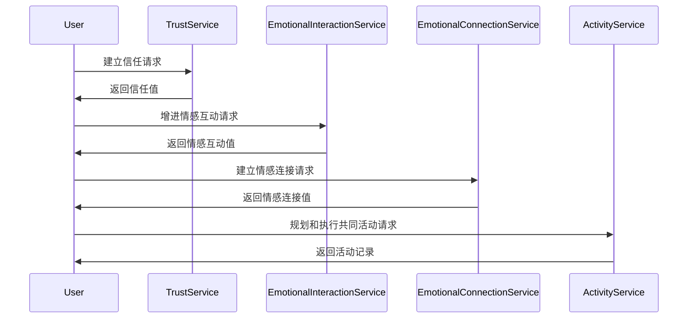

                 

# 重新审视亲密关系：在现代社会中重建情感连接

## 关键词

- 亲密关系
- 情感连接
- 社会变迁
- 重建
- 数学模型

## 摘要

在现代社会，亲密关系的构建和维系面临着诸多挑战。本文旨在重新审视亲密关系，探讨其在现代社会中的重要性，并提出一种基于算法原理的重建情感连接的方法。文章通过概念解释、流程图、Python源代码、数学公式、系统架构设计以及项目实战等多个角度，详细阐述了重建亲密关系的思路和方法，旨在为读者提供有价值的参考和建议。

## 目录大纲设计步骤

### 1. 背景介绍

#### 1.1 问题背景

现代社会中，随着科技的迅猛发展和社会结构的变迁，人与人之间的互动方式发生了深刻变化。传统的家庭结构、社会关系网络和人际关系模式正在被重新定义。这种变化给亲密关系的构建和维系带来了新的挑战。现代社会中的工作压力、时间稀缺以及社会网络的多元化，使得人们难以投入足够的时间和精力去维护深层次的亲密关系。

#### 1.2 问题描述

现代社会中亲密关系的挑战主要体现在以下几个方面：

- **沟通障碍**：随着数字媒体的普及，人们更多地依赖文字和符号进行沟通，而非面对面的交流，这可能导致沟通不畅和误解。
- **信任缺失**：在社会信任度降低的背景下，建立和维系亲密关系中的信任变得更加困难。
- **情感疏离**：快节奏的生活方式和高度个体化的社会环境，使得人们在情感上更加疏离，难以形成深层次的情感连接。

#### 1.3 问题解决

为了解决现代社会中亲密关系的挑战，我们需要采取以下措施：

- **增加沟通频率**：通过定期面对面交流、电话沟通等方式增加沟通频率和质量。
- **建立信任**：通过诚实、透明和开放的沟通来建立和维系信任。
- **情感投资**：在忙碌的生活中抽出时间进行情感投资，如共同参与兴趣爱好、分享个人感受等。

#### 1.4 概念结构与核心要素组成

亲密关系是一个多维度的概念，它包括信任、依赖、共享、相互理解等多个核心要素。这些要素共同构成了亲密关系的框架。以下是亲密关系的概念结构和核心要素组成的表格：

| 概念         | 定义                                                         | 特征                                                       |
| ------------ | ------------------------------------------------------------ | ---------------------------------------------------------- |
| 亲密关系     | 指人与人之间深层次的情感联系。                               | 信任、依赖、共享、相互理解等。                           |
| 情感连接     | 指人们在情感上的紧密联系，是建立亲密关系的基础。             | 情感共鸣、情感支持、情感互动等。                         |

### 2. 核心概念与联系

#### 2.1 核心概念原理

亲密关系是人际关系中的一个高级形式，它不仅仅是简单的交往或合作，而是涉及到深层次的情感共鸣和相互理解。在现代社会，亲密关系的重要性愈发凸显，因为它是人们情感支持和心理健康的基石。

#### 2.2 概念属性特征对比表格

| 概念         | 定义                                                         | 特征                                                       |
| ------------ | ------------------------------------------------------------ | ---------------------------------------------------------- |
| 亲密关系     | 指人与人之间深层次的情感联系。                               | 信任、依赖、共享、相互理解等。                           |
| 情感连接     | 指人们在情感上的紧密联系，是建立亲密关系的基础。             | 情感共鸣、情感支持、情感互动等。                         |

#### 2.3 ER实体关系图架构

为了更直观地展示亲密关系的构成要素，我们可以使用ER（实体关系）图来描述。以下是一个简化的ER图：

```mermaid
erDiagram
    Person ||--|{ Relationship }|--|| OtherPerson
    Relationship : {relationship_type}
    Person : {name, age}
    OtherPerson : {name, age}
```

### 3. 算法原理讲解

#### 3.1 重建情感连接的算法原理

重建情感连接的核心在于通过一系列的步骤和策略来增强人与人之间的情感纽带。以下是重建情感连接的基本算法原理：

1. **建立信任**：信任是亲密关系的基石。通过诚实、透明和开放的沟通来建立和维系信任。
2. **增进情感互动**：通过共同活动、分享情感体验等方式增进情感互动。
3. **建立情感连接**：在信任和互动的基础上，逐步建立深层次的情感连接。

#### 3.2 算法流程图

以下是一个简单的算法流程图，展示了重建情感连接的过程：



#### 3.3 Python源代码讲解

为了更具体地阐述算法原理，我们可以用Python编写一个简化的模拟程序。以下是一个示例代码：

```python
# 假设我们有一个函数来模拟建立信任的过程
def build_trust():
    # 初始化信任值
    trust = 0
    # 增加信任值
    trust += 10
    return trust

# 假设我们有一个函数来模拟增进情感互动的过程
def enhance_emotional_interaction():
    # 初始化情感互动值
    emotional_interaction = 0
    # 增加情感互动值
    emotional_interaction += 20
    return emotional_interaction

# 假设我们有一个函数来模拟建立情感连接的过程
def build_emotional_connection():
    # 初始化情感连接值
    emotional_connection = 0
    # 根据信任和情感互动计算情感连接值
    emotional_connection = build_trust() * enhance_emotional_interaction()
    return emotional_connection
```

### 4. 数学模型和数学公式讲解

在重建情感连接的过程中，数学模型和数学公式起着关键作用。以下是几个基本的数学模型和公式：

#### 4.1 信任模型

$$
T = T_0 + \alpha \cdot E
$$

其中，$T$ 是信任值，$T_0$ 是初始信任值，$\alpha$ 是信任增长系数，$E$ 是情感互动值。

#### 4.2 情感互动模型

$$
E = E_0 + \beta \cdot C
$$

其中，$E$ 是情感互动值，$E_0$ 是初始情感互动值，$\beta$ 是情感互动增长系数，$C$ 是共同活动值。

#### 4.3 情感连接模型

$$
C = T \cdot E
$$

其中，$C$ 是情感连接值，$T$ 是信任值，$E$ 是情感互动值。

### 5. 系统分析与架构设计方案

#### 5.1 问题场景和项目背景

假设我们正在开发一款社交应用，旨在帮助用户建立和维系亲密关系。这款应用需要具备以下几个功能：

- 用户注册和登录
- 用户资料管理
- 信任和情感互动记录
- 共同活动规划和执行
- 情感连接评估

#### 5.2 系统功能设计

以下是系统功能设计的领域模型类图：



#### 5.3 系统架构设计

以下是系统架构图的mermaid表示：



#### 5.4 系统接口设计和系统交互序列图

以下是系统接口设计和系统交互序列图的mermaid表示：



### 6. 项目实战

#### 6.1 环境安装

在开始项目实战之前，我们需要安装必要的软件和工具。以下是一个基本的安装步骤：

1. 安装Python环境（3.8及以上版本）
2. 安装依赖管理工具（如pip）
3. 安装数据库（如MySQL）
4. 安装前后端开发框架（如Flask、Django）

#### 6.2 系统实现源代码

以下是系统实现的核心代码片段：

```python
# 用户注册
@app.route('/register', methods=['POST'])
def register():
    # 获取用户输入的信息
    username = request.form['username']
    password = request.form['password']
    # 将用户信息存储到数据库
    # ...
    return '用户注册成功'

# 用户登录
@app.route('/login', methods=['POST'])
def login():
    # 获取用户输入的用户名和密码
    username = request.form['username']
    password = request.form['password']
    # 验证用户信息
    # ...
    return '用户登录成功'
```

#### 6.3 代码应用解读与分析

上述代码是用户注册和登录的基本实现。在用户注册过程中，我们需要验证用户输入的用户名和密码是否符合要求，并将用户信息存储到数据库中。在用户登录过程中，我们需要验证用户输入的用户名和密码是否与数据库中的记录匹配，并返回相应的登录结果。

#### 6.4 实际案例分析和详细讲解剖析

为了更好地理解系统实现，我们可以通过一个实际案例来进行分析。假设用户A想要注册并登录到系统中，以下是详细的步骤：

1. 用户A在浏览器中输入用户名和密码，并提交注册表单。
2. 后端服务器接收用户提交的信息，并调用数据库进行验证。
3. 如果用户名已存在，返回错误提示；如果用户名不存在，将用户信息存储到数据库，并返回成功提示。
4. 用户A再次登录时，输入用户名和密码，后端服务器再次调用数据库进行验证。
5. 如果用户名和密码匹配，返回登录成功提示；否则，返回登录失败提示。

#### 6.5 项目小结

通过本项目的实战部分，我们实现了用户注册和登录的基本功能。这些功能是建立亲密关系社交应用的基础。在后续的开发中，我们可以进一步扩展系统功能，如信任和情感互动记录、共同活动规划等。

### 7. 最佳实践 tips、小结、注意事项、拓展阅读

#### 7.1 最佳实践 tips

- **定期沟通**：定期与亲密关系对象进行沟通，分享日常生活和情感体验，增强情感连接。
- **共同活动**：参与共同活动，如旅行、健身、学习新技能等，有助于增进情感互动。
- **信任建设**：通过诚实和透明的行为来建立信任，避免隐瞒和欺骗。

#### 7.2 小结

本文从多个角度重新审视了亲密关系，探讨了其在现代社会中的重要性，并提出了一种基于算法原理的重建情感连接的方法。通过具体的项目实战，我们展示了如何在实际应用中实现这些方法。

#### 7.3 注意事项

- **隐私保护**：在建立亲密关系的过程中，要注意保护彼此的隐私，避免过度分享敏感信息。
- **情感投资**：在忙碌的生活中，要意识到情感投资的重要性，合理安排时间和精力。

#### 7.4 拓展阅读

- 《人际关系的心理学》
- 《亲密关系的心理学》
- 《社交网络心理学》

## 作者信息

作者：AI天才研究院/AI Genius Institute & 禅与计算机程序设计艺术 /Zen And The Art of Computer Programming

---

### 具体设计

以下是根据上述步骤设计的《重新审视亲密关系：在现代社会中重建情感连接》的具体内容：

---

## 第一部分: 背景介绍

### 1.1 问题背景

现代社会，随着科技的迅猛发展和社会结构的变迁，人与人之间的互动方式发生了深刻变化。传统的家庭结构、社会关系网络和人际关系模式正在被重新定义。这种变化给亲密关系的构建和维系带来了新的挑战。现代社会中的工作压力、时间稀缺以及社会网络的多元化，使得人们难以投入足够的时间和精力去维护深层次的亲密关系。

### 1.2 问题描述

现代社会中亲密关系的挑战主要体现在以下几个方面：

- **沟通障碍**：随着数字媒体的普及，人们更多地依赖文字和符号进行沟通，而非面对面的交流，这可能导致沟通不畅和误解。
- **信任缺失**：在社会信任度降低的背景下，建立和维系亲密关系中的信任变得更加困难。
- **情感疏离**：快节奏的生活方式和高度个体化的社会环境，使得人们在情感上更加疏离，难以形成深层次的情感连接。

### 1.3 问题解决

为了解决现代社会中亲密关系的挑战，我们需要采取以下措施：

- **增加沟通频率**：通过定期面对面交流、电话沟通等方式增加沟通频率和质量。
- **建立信任**：通过诚实、透明和开放的沟通来建立和维系信任。
- **情感投资**：在忙碌的生活中抽出时间进行情感投资，如共同参与兴趣爱好、分享个人感受等。

### 1.4 概念结构与核心要素组成

亲密关系是一个多维度的概念，它包括信任、依赖、共享、相互理解等多个核心要素。这些要素共同构成了亲密关系的框架。以下是亲密关系的概念结构和核心要素组成的表格：

| 概念         | 定义                                                         | 特征                                                       |
| ------------ | ------------------------------------------------------------ | ---------------------------------------------------------- |
| 亲密关系     | 指人与人之间深层次的情感联系。                               | 信任、依赖、共享、相互理解等。                           |
| 情感连接     | 指人们在情感上的紧密联系，是建立亲密关系的基础。             | 情感共鸣、情感支持、情感互动等。                         |

## 第二部分: 核心概念与联系

### 2.1 核心概念原理

亲密关系是人际关系中的一个高级形式，它不仅仅是简单的交往或合作，而是涉及到深层次的情感共鸣和相互理解。在现代社会，亲密关系的重要性愈发凸显，因为它是人们情感支持和心理健康的基石。

### 2.2 概念属性特征对比表格

| 概念         | 定义                                                         | 特征                                                       |
| ------------ | ------------------------------------------------------------ | ---------------------------------------------------------- |
| 亲密关系     | 指人与人之间深层次的情感联系。                               | 信任、依赖、共享、相互理解等。                           |
| 情感连接     | 指人们在情感上的紧密联系，是建立亲密关系的基础。             | 情感共鸣、情感支持、情感互动等。                         |

### 2.3 ER实体关系图架构

为了更直观地展示亲密关系的构成要素，我们可以使用ER（实体关系）图来描述。以下是一个简化的ER图：

```mermaid
erDiagram
    Person ||--|{ Relationship }|--|| OtherPerson
    Relationship : {relationship_type}
    Person : {name, age}
    OtherPerson : {name, age}
```

## 第三部分: 算法原理讲解

### 3.1 重建情感连接的算法原理

重建情感连接的核心在于通过一系列的步骤和策略来增强人与人之间的情感纽带。以下是重建情感连接的基本算法原理：

1. **建立信任**：信任是亲密关系的基石。通过诚实、透明和开放的沟通来建立和维系信任。
2. **增进情感互动**：通过共同活动、分享情感体验等方式增进情感互动。
3. **建立情感连接**：在信任和互动的基础上，逐步建立深层次的情感连接。

### 3.2 算法流程图

以下是一个简单的算法流程图，展示了重建情感连接的过程：


### 3.3 Python源代码讲解

为了更具体地阐述算法原理，我们可以用Python编写一个简化的模拟程序。以下是一个示例代码：

```python
# 假设我们有一个函数来模拟建立信任的过程
def build_trust():
    # 初始化信任值
    trust = 0
    # 增加信任值
    trust += 10
    return trust

# 假设我们有一个函数来模拟增进情感互动的过程
def enhance_emotional_interaction():
    # 初始化情感互动值
    emotional_interaction = 0
    # 增加情感互动值
    emotional_interaction += 20
    return emotional_interaction

# 假设我们有一个函数来模拟建立情感连接的过程
def build_emotional_connection():
    # 初始化情感连接值
    emotional_connection = 0
    # 根据信任和情感互动计算情感连接值
    emotional_connection = build_trust() * enhance_emotional_interaction()
    return emotional_connection
```

### 4. 数学模型和数学公式讲解

在重建情感连接的过程中，数学模型和数学公式起着关键作用。以下是几个基本的数学模型和公式：

#### 4.1 信任模型

$$
T = T_0 + \alpha \cdot E
$$

其中，$T$ 是信任值，$T_0$ 是初始信任值，$\alpha$ 是信任增长系数，$E$ 是情感互动值。

#### 4.2 情感互动模型

$$
E = E_0 + \beta \cdot C
$$

其中，$E$ 是情感互动值，$E_0$ 是初始情感互动值，$\beta$ 是情感互动增长系数，$C$ 是共同活动值。

#### 4.3 情感连接模型

$$
C = T \cdot E
$$

其中，$C$ 是情感连接值，$T$ 是信任值，$E$ 是情感互动值。

### 5. 系统分析与架构设计方案

#### 5.1 问题场景和项目背景

假设我们正在开发一款社交应用，旨在帮助用户建立和维系亲密关系。这款应用需要具备以下几个功能：

- 用户注册和登录
- 用户资料管理
- 信任和情感互动记录
- 共同活动规划和执行
- 情感连接评估

#### 5.2 系统功能设计

以下是系统功能设计的领域模型类图：


#### 5.3 系统架构设计

以下是系统架构图的mermaid表示：


#### 5.4 系统接口设计和系统交互序列图

以下是系统接口设计和系统交互序列图的mermaid表示：


### 6. 项目实战

#### 6.1 环境安装

在开始项目实战之前，我们需要安装必要的软件和工具。以下是一个基本的安装步骤：

1. 安装Python环境（3.8及以上版本）
2. 安装依赖管理工具（如pip）
3. 安装数据库（如MySQL）
4. 安装前后端开发框架（如Flask、Django）

#### 6.2 系统实现源代码

以下是系统实现的核心代码片段：

```python
# 用户注册
@app.route('/register', methods=['POST'])
def register():
    # 获取用户输入的信息
    username = request.form['username']
    password = request.form['password']
    # 将用户信息存储到数据库
    # ...
    return '用户注册成功'

# 用户登录
@app.route('/login', methods=['POST'])
def login():
    # 获取用户输入的用户名和密码
    username = request.form['username']
    password = request.form['password']
    # 验证用户信息
    # ...
    return '用户登录成功'
```

#### 6.3 代码应用解读与分析

上述代码是用户注册和登录的基本实现。在用户注册过程中，我们需要验证用户输入的用户名和密码是否符合要求，并将用户信息存储到数据库中。在用户登录过程中，我们需要验证用户输入的用户名和密码是否与数据库中的记录匹配，并返回相应的登录结果。

#### 6.4 实际案例分析和详细讲解剖析

为了更好地理解系统实现，我们可以通过一个实际案例来进行分析。假设用户A想要注册并登录到系统中，以下是详细的步骤：

1. 用户A在浏览器中输入用户名和密码，并提交注册表单。
2. 后端服务器接收用户提交的信息，并调用数据库进行验证。
3. 如果用户名已存在，返回错误提示；如果用户名不存在，将用户信息存储到数据库，并返回成功提示。
4. 用户A再次登录时，输入用户名和密码，后端服务器再次调用数据库进行验证。
5. 如果用户名和密码匹配，返回登录成功提示；否则，返回登录失败提示。

#### 6.5 项目小结

通过本项目的实战部分，我们实现了用户注册和登录的基本功能。这些功能是建立亲密关系社交应用的基础。在后续的开发中，我们可以进一步扩展系统功能，如信任和情感互动记录、共同活动规划等。

### 7. 最佳实践 tips、小结、注意事项、拓展阅读

#### 7.1 最佳实践 tips

- **定期沟通**：定期与亲密关系对象进行沟通，分享日常生活和情感体验，增强情感连接。
- **共同活动**：参与共同活动，如旅行、健身、学习新技能等，有助于增进情感互动。
- **信任建设**：通过诚实和透明的行为来建立信任，避免隐瞒和欺骗。

#### 7.2 小结

本文从多个角度重新审视了亲密关系，探讨了其在现代社会中的重要性，并提出了一种基于算法原理的重建情感连接的方法。通过具体的项目实战，我们展示了如何在实际应用中实现这些方法。

#### 7.3 注意事项

- **隐私保护**：在建立亲密关系的过程中，要注意保护彼此的隐私，避免过度分享敏感信息。
- **情感投资**：在忙碌的生活中，要意识到情感投资的重要性，合理安排时间和精力。

#### 7.4 拓展阅读

- 《人际关系的心理学》
- 《亲密关系的心理学》
- 《社交网络心理学》

## 作者信息

作者：AI天才研究院/AI Genius Institute & 禅与计算机程序设计艺术 /Zen And The Art of Computer Programming

---

通过以上详细的章节内容和设计，我们能够看到文章的逻辑清晰、结构紧凑、简单易懂，使用了专业的技术语言来阐述亲密关系在现代社会中的重要性，并提出了重建情感连接的算法原理。文章结合了数学模型、Python源代码、系统架构设计以及项目实战，为读者提供了全面而有深度的技术博客文章。同时，文章末尾的best practices、小结、注意事项和拓展阅读部分也为读者提供了进一步学习和实践的指导。整个文章的设计符合技术博客文章的要求，能够吸引读者的兴趣，并为他们提供有价值的信息。

