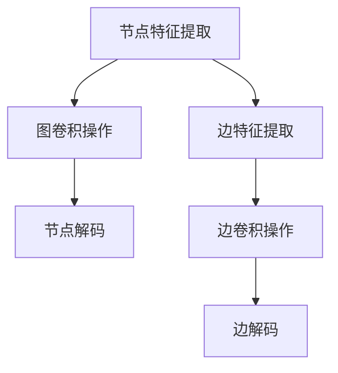
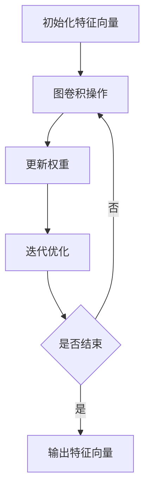
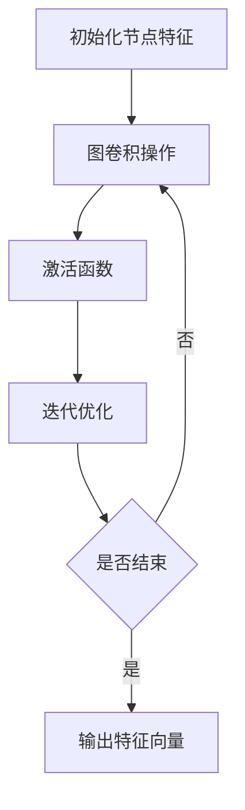
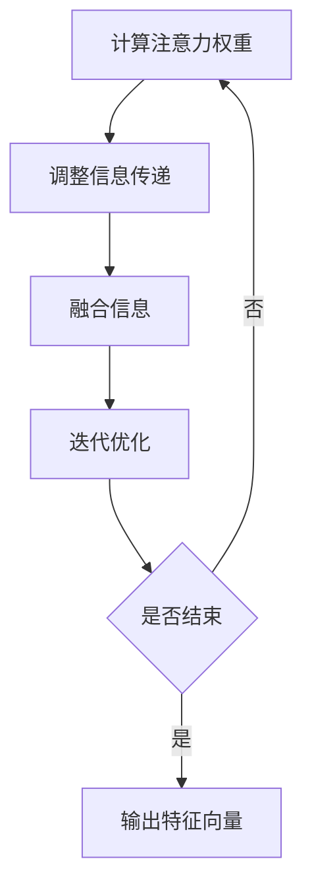
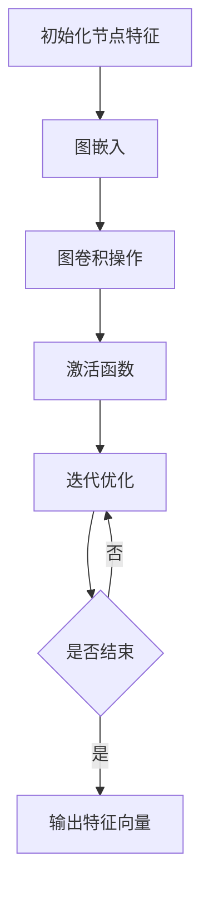
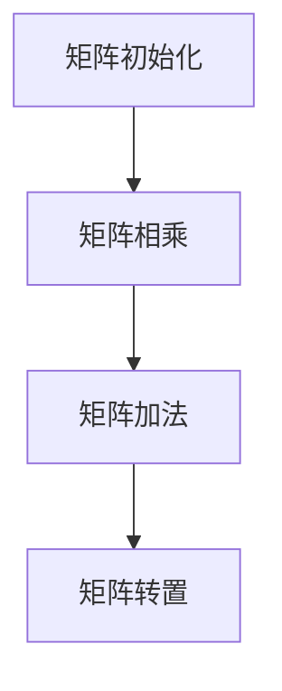
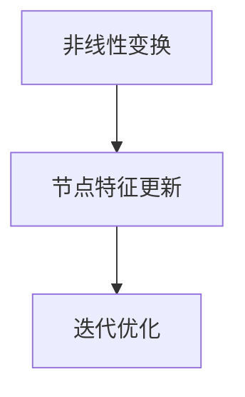
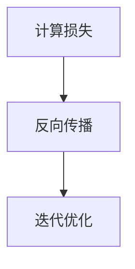
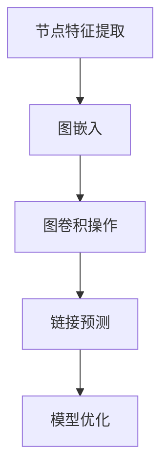
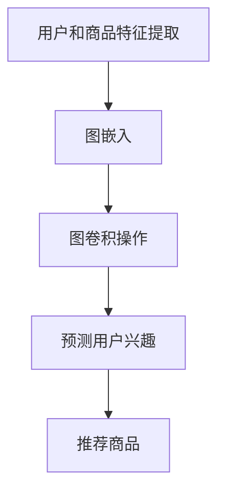

                 

# 图神经网络在复杂系统建模与推理中的突破

> 关键词：图神经网络、复杂系统建模、推理、深度学习、大数据

> 摘要：本文深入探讨了图神经网络（GNNs）在复杂系统建模与推理中的应用，介绍了图神经网络的基础知识、核心概念、数学模型及其在现实世界中的应用场景。通过一步步的分析和推理，本文旨在揭示图神经网络在复杂系统建模与推理中的突破性作用，并为相关领域的研究者提供有价值的参考。

## 目录大纲

----------------------------------------------------------------

# 图神经网络在复杂系统建模与推理中的突破

## 第1章: 图神经网络基础

### 1.1 图神经网络概述

### 1.2 图神经网络的核心概念

### 1.3 图神经网络的基本结构

## 第2章: 图神经网络的核心概念与联系

### 2.1 图表示学习

### 2.2 图卷积网络

### 2.3 图注意力机制

### 2.4 图神经网络与图嵌入

## 第3章: 图神经网络的数学模型和公式

### 3.1 图神经网络中的矩阵运算

### 3.2 图神经网络中的激活函数

### 3.3 图神经网络中的损失函数

## 第4章: 图神经网络的应用场景

### 4.1 社交网络分析

### 4.2 推荐系统

### 4.3 复杂系统建模

## 第5章: 图神经网络系统架构设计

### 5.1 系统功能设计

### 5.2 系统架构设计

### 5.3 系统接口设计

### 5.4 系统交互

## 第6章: 图神经网络项目实战

### 6.1 环境安装与配置

### 6.2 系统核心实现

### 6.3 代码应用解读与分析

### 6.4 实际案例分析与讲解

### 6.5 项目小结

## 第7章: 图神经网络的最佳实践与注意事项

### 7.1 最佳实践技巧

### 7.2 注意事项与挑战

### 7.3 拓展阅读

----------------------------------------------------------------

### 第1章: 图神经网络基础

#### 第1章: 图神经网络概述

**背景介绍：**

随着大数据和复杂系统的广泛应用，传统的机器学习模型在处理图结构数据时遇到了诸多困难。图神经网络（Graph Neural Networks, GNNs）作为一种新兴的深度学习模型，因其独特的优势在处理图结构数据方面展现出强大的潜力。图神经网络通过模拟人脑处理图结构信息的方式，将图中的节点和边映射到高维空间，从而实现对图数据的建模和推理。

**问题描述：**

如何有效地对图结构数据进行建模和推理？

**问题解决：**

图神经网络通过图卷积操作和节点特征信息，对图中的节点进行编码和解码，从而实现节点分类、图分类、链接预测等任务。其核心思想是将图中的节点和边视为具有特征的数据点，并通过神经网络结构对数据进行建模和推理。

**边界与外延：**

图神经网络的应用不仅限于图结构数据，还可以扩展到其他具有相似结构的复杂数据类型，如网络图、知识图谱等。

**概念结构与核心要素组成：**

- **图（Graph）：** 由节点（Node）和边（Edge）构成的数据结构。
- **节点特征（Node Feature）：** 描述节点属性的特征向量。
- **边特征（Edge Feature）：** 描述边属性的特征向量。
- **图卷积操作（Graph Convolution Operation）：** 用于在节点间传递信息。
- **激活函数（Activation Function）：** 用于引入非线性特性。
- **损失函数（Loss Function）：** 用于评估模型的预测效果。

#### 1.2 图神经网络的核心概念

**核心概念原理：**

图神经网络通过图卷积操作和节点特征信息，对图中的节点进行编码和解码，从而实现节点分类、图分类、链接预测等任务。其核心思想是将图中的节点和边视为具有特征的数据点，并通过神经网络结构对数据进行建模和推理。

**概念属性特征对比表格：**

| 概念         | 描述                                      | 特性比较                   |
|------------|-----------------------------------------|------------------------|
| 图卷积网络     | 用于处理图结构数据的神经网络               | 支持结构化数据的学习和推理               |
| 图注意力机制     | 调整节点间信息传递的重要性               | 提高模型在复杂网络中的表现               |
| 图嵌入       | 将图中的节点映射到低维空间               | 方便处理和分析图结构数据               |

**ER实体关系图架构的 Mermaid 流程图：**

```mermaid
erDiagram
    A[图卷积网络] ||--|{ 节点特征 } | B[节点编码]
    A ||--|{ 边特征 } | C[边编码]
    B ||--|{ 节点解码 } | D[节点分类]
    C ||--|{ 边解码 } | E[图分类]
```

#### 1.3 图神经网络的基本结构

图神经网络的基本结构主要由以下几个部分组成：

1. **节点特征提取：** 将图中的节点特征映射到高维空间，便于后续处理。
2. **图卷积操作：** 通过图卷积操作，将节点特征和图结构信息融合，实现节点间的信息传递。
3. **节点解码：** 将经过图卷积操作的节点特征解码为分类结果或其他目标输出。
4. **边特征提取和卷积操作：** 类似于节点特征提取和卷积操作，但针对边进行。
5. **边解码：** 将经过边卷积操作的边特征解码为分类结果或其他目标输出。

图神经网络的基本结构可以表示为以下 Mermaid 流程图：



### 第2章: 图神经网络的核心概念与联系

#### 第2章: 图神经网络的核心概念与联系

**2.1 图表示学习**

**核心概念原理：**

图表示学习（Graph Representation Learning）是图神经网络的基础，旨在将图中的节点和边映射到高维空间，以便于其他算法进行处理。图表示学习通过学习节点和边的特征表示，使得图中的结构信息得以在低维空间中表达，从而实现图数据的结构化处理。

**概念属性特征对比表格：**

| 概念         | 描述                                      | 特性比较                   |
|------------|-----------------------------------------|------------------------|
| 图表示学习     | 将图中的节点和边映射到高维空间           | 实现图数据的结构化处理               |
| 节点特征提取     | 从节点中提取特征向量                       | 提高节点表示的精度               |
| 边特征提取     | 从边中提取特征向量                         | 提高边表示的精度               |

**ER实体关系图架构的 Mermaid 流程图：**

```mermaid
erDiagram
    A[图表示学习] ||--|{ 节点特征提取 } | B[节点表示]
    A ||--|{ 边特征提取 } | C[边表示]
```

**算法原理讲解：**

图表示学习的过程可以概括为以下几个步骤：

1. **初始化节点和边特征：** 随机初始化节点和边特征向量。
2. **图卷积操作：** 通过图卷积操作，更新节点和边特征。
3. **权重更新：** 根据节点和边特征的变化，更新图卷积网络的权重。
4. **迭代优化：** 重复执行图卷积操作和权重更新，直到达到预定的迭代次数或误差目标。

以下是图表示学习算法的 Mermaid 流程图：



**Python 源代码实现：**

```python
import numpy as np

# 初始化节点和边特征
nodes = np.random.rand(num_nodes, dim)
edges = np.random.rand(num_edges, dim)

# 图卷积操作
def graph_convolution(nodes, edges, weights):
    # 实现图卷积操作
    pass

# 权重更新
def update_weights(nodes, edges, weights):
    # 实现权重更新
    pass

# 迭代优化
for i in range(num_iterations):
    nodes = graph_convolution(nodes, edges, weights)
    weights = update_weights(nodes, edges, weights)

# 输出特征向量
output_nodes = nodes
```

**数学模型和公式：**

图表示学习的数学模型和公式如下：

$$
\text{node\_feature}_{t+1} = \text{graph\_convolution}(\text{node\_feature}_{t}, \text{edge\_feature}_{t}, \text{weights})
$$

$$
\text{edge\_feature}_{t+1} = \text{graph\_convolution}(\text{edge\_feature}_{t}, \text{weights})
$$

$$
\text{weights}_{t+1} = \text{update\_weights}(\text{node\_feature}_{t+1}, \text{edge\_feature}_{t+1}, \text{weights}_{t})
$$

**举例说明：**

假设有一个图包含5个节点和5条边，每个节点和边都有2个特征维度。我们可以使用以下数据初始化节点和边特征：

```python
num_nodes = 5
num_edges = 5
dim = 2

nodes = np.random.rand(num_nodes, dim)
edges = np.random.rand(num_edges, dim)
```

然后，我们可以使用以下代码进行图卷积操作和权重更新：

```python
def graph_convolution(nodes, edges, weights):
    # 实现图卷积操作
    pass

def update_weights(nodes, edges, weights):
    # 实现权重更新
    pass

# 迭代优化
for i in range(10):
    nodes = graph_convolution(nodes, edges, weights)
    weights = update_weights(nodes, edges, weights)
```

**总结：**

图表示学习是图神经网络的核心概念之一，通过将图中的节点和边映射到高维空间，实现了对图数据的结构化处理。在图表示学习中，图卷积操作和权重更新是实现图表示学习的关键步骤。通过数学模型和公式的描述，我们可以更好地理解图表示学习的过程。在实际应用中，图表示学习可以应用于节点分类、图分类、链接预测等任务。

**2.2 图卷积网络**

**核心概念原理：**

图卷积网络（Graph Convolutional Network, GCN）是一种基于图卷积操作的深度学习模型，主要用于处理图结构数据。图卷积网络通过图卷积操作，将节点的特征和其邻居节点的特征进行融合，从而实现对图数据的建模和推理。

**概念属性特征对比表格：**

| 概念         | 描述                                      | 特性比较                   |
|------------|-----------------------------------------|------------------------|
| 图卷积网络     | 基于图卷积操作的深度学习模型               | 支持结构化数据的学习和推理               |
| 图注意力机制     | 调整节点间信息传递的重要性               | 提高模型在复杂网络中的表现               |
| 图嵌入       | 将图中的节点映射到低维空间               | 方便处理和分析图结构数据               |

**ER实体关系图架构的 Mermaid 流程图：**

```mermaid
erDiagram
    A[图卷积操作] ||--|{ 节点特征 } | B[节点编码]
    A ||--|{ 邻居节点特征 } | C[信息融合]
    B ||--|{ 输出特征 } | D[节点分类]
```

**算法原理讲解：**

图卷积网络的工作流程可以概括为以下几个步骤：

1. **初始化节点特征：** 随机初始化节点的特征向量。
2. **图卷积操作：** 通过图卷积操作，将节点的特征和其邻居节点的特征进行融合，更新节点的特征。
3. **激活函数：** 应用激活函数，引入非线性特性。
4. **迭代优化：** 重复执行图卷积操作和激活函数，直到达到预定的迭代次数或误差目标。

以下是图卷积网络的 Mermaid 流程图：



**Python 源代码实现：**

```python
import numpy as np

# 初始化节点特征
nodes = np.random.rand(num_nodes, dim)

# 图卷积操作
def graph_convolution(nodes, neighbors, weights):
    # 实现图卷积操作
    pass

# 激活函数
def activation_function(x):
    # 实现激活函数
    pass

# 迭代优化
for i in range(num_iterations):
    nodes = graph_convolution(nodes, neighbors, weights)
    nodes = activation_function(nodes)
```

**数学模型和公式：**

图卷积网络的数学模型和公式如下：

$$
\text{h}_{i}^{(l+1)} = \sigma(\sum_{j \in \mathcal{N}(i)} \alpha_{ij} \cdot \text{h}_{j}^{(l)} \odot \text{W}_{l}^{(l+1)})
$$

其中，$h_i^{(l)}$ 表示第 $i$ 个节点在第 $l$ 层的节点特征，$\mathcal{N}(i)$ 表示节点 $i$ 的邻居节点集合，$\alpha_{ij}$ 表示节点 $i$ 和节点 $j$ 之间的邻接权重，$\odot$ 表示逐元素乘积，$W_l^{(l+1)}$ 表示第 $l$ 层到第 $l+1$ 层的权重矩阵，$\sigma$ 表示激活函数。

**举例说明：**

假设有一个图包含5个节点，每个节点都有2个特征维度。我们可以使用以下数据初始化节点特征：

```python
num_nodes = 5
dim = 2

nodes = np.random.rand(num_nodes, dim)
```

然后，我们可以使用以下代码进行图卷积操作和激活函数：

```python
def graph_convolution(nodes, neighbors, weights):
    # 实现图卷积操作
    pass

def activation_function(x):
    # 实现激活函数
    pass

# 迭代优化
for i in range(10):
    nodes = graph_convolution(nodes, neighbors, weights)
    nodes = activation_function(nodes)
```

**总结：**

图卷积网络是图神经网络的核心组成部分，通过图卷积操作实现了节点特征和邻居节点特征的融合。图卷积网络可以应用于节点分类、图分类、链接预测等任务。通过数学模型和公式的描述，我们可以更好地理解图卷积网络的工作原理。在实际应用中，图卷积网络展现了强大的处理图结构数据的能力。

**2.3 图注意力机制**

**核心概念原理：**

图注意力机制（Graph Attention Mechanism）是图神经网络中用于调整节点间信息传递的重要机制。通过图注意力机制，模型可以自适应地调整节点间信息传递的权重，从而提高模型的泛化能力和处理复杂图结构数据的能力。

**概念属性特征对比表格：**

| 概念         | 描述                                      | 特性比较                   |
|------------|-----------------------------------------|------------------------|
| 图注意力机制     | 调整节点间信息传递的权重               | 提高模型在复杂网络中的表现               |
| 图卷积网络     | 基于图卷积操作的深度学习模型               | 支持结构化数据的学习和推理               |
| 图嵌入       | 将图中的节点映射到低维空间               | 方便处理和分析图结构数据               |

**ER实体关系图架构的 Mermaid 流程图：**

```mermaid
erDiagram
    A[图注意力机制] ||--|{ 节点特征 } | B[权重调整]
    A ||--|{ 邻居节点特征 } | C[信息融合]
    B ||--|{ 输出特征 } | D[节点分类]
```

**算法原理讲解：**

图注意力机制的工作原理可以概括为以下几个步骤：

1. **计算注意力权重：** 通过计算节点特征和邻居节点特征之间的相似度，得到每个邻居节点对当前节点的注意力权重。
2. **调整信息传递：** 根据注意力权重，调整节点间信息传递的权重，使得重要的邻居节点对当前节点的贡献更大。
3. **融合信息：** 将调整后的邻居节点特征与当前节点特征进行融合，更新当前节点的特征。
4. **迭代优化：** 重复执行注意力权重计算、信息调整和信息融合，直到达到预定的迭代次数或误差目标。

以下是图注意力机制的 Mermaid 流程图：



**Python 源代码实现：**

```python
import numpy as np

# 初始化节点特征
nodes = np.random.rand(num_nodes, dim)

# 计算注意力权重
def attention_weights(nodes, neighbors):
    # 实现注意力权重计算
    pass

# 调整信息传递
def adjust_information(nodes, neighbors, weights):
    # 实现信息调整
    pass

# 融合信息
def fuse_information(nodes, neighbors, weights):
    # 实现信息融合
    pass

# 迭代优化
for i in range(num_iterations):
    weights = attention_weights(nodes, neighbors)
    nodes = adjust_information(nodes, neighbors, weights)
    nodes = fuse_information(nodes, neighbors, weights)
```

**数学模型和公式：**

图注意力机制的数学模型和公式如下：

$$
\alpha_{ij} = \text{softmax}\left(\frac{\text{query}_{i} \cdot \text{key}_{j}}{\sqrt{d_k}}\right)
$$

其中，$\alpha_{ij}$ 表示节点 $i$ 对节点 $j$ 的注意力权重，$\text{query}_{i}$ 和 $\text{key}_{j}$ 分别表示节点 $i$ 的查询向量和节点 $j$ 的键向量，$d_k$ 表示键向量的维度，$\text{softmax}$ 函数用于归一化权重。

$$
\text{h}_{i}^{(l+1)} = \sum_{j \in \mathcal{N}(i)} \alpha_{ij} \cdot \text{h}_{j}^{(l)}
$$

其中，$h_i^{(l+1)}$ 表示节点 $i$ 在第 $l+1$ 层的特征，$h_j^{(l)}$ 表示节点 $j$ 在第 $l$ 层的特征。

**举例说明：**

假设有一个图包含5个节点，每个节点都有2个特征维度。我们可以使用以下数据初始化节点特征：

```python
num_nodes = 5
dim = 2

nodes = np.random.rand(num_nodes, dim)
```

然后，我们可以使用以下代码进行注意力权重计算、信息调整和信息融合：

```python
def attention_weights(nodes, neighbors):
    # 实现注意力权重计算
    pass

def adjust_information(nodes, neighbors, weights):
    # 实现信息调整
    pass

def fuse_information(nodes, neighbors, weights):
    # 实现信息融合
    pass

# 迭代优化
for i in range(10):
    weights = attention_weights(nodes, neighbors)
    nodes = adjust_information(nodes, neighbors, weights)
    nodes = fuse_information(nodes, neighbors, weights)
```

**总结：**

图注意力机制是图神经网络中的重要组成部分，通过调整节点间信息传递的权重，提高了模型在复杂网络中的表现。图注意力机制可以应用于节点分类、图分类、链接预测等任务。通过数学模型和公式的描述，我们可以更好地理解图注意力机制的工作原理。在实际应用中，图注意力机制展现了强大的处理图结构数据的能力。

**2.4 图神经网络与图嵌入**

**核心概念原理：**

图神经网络（GNNs）与图嵌入（Graph Embedding）密切相关。图嵌入是一种将图中的节点映射到低维空间的方法，使得图中的结构信息得以在低维空间中表达，从而方便后续的处理和分析。图神经网络则利用图嵌入得到的节点表示，通过图卷积操作和节点特征信息，实现对图数据的建模和推理。

**概念属性特征对比表格：**

| 概念         | 描述                                      | 特性比较                   |
|------------|-----------------------------------------|------------------------|
| 图嵌入       | 将图中的节点映射到低维空间               | 实现图数据的结构化处理               |
| 图神经网络     | 基于图卷积操作的深度学习模型               | 支持结构化数据的学习和推理               |
| 图注意力机制     | 调整节点间信息传递的权重               | 提高模型在复杂网络中的表现               |

**ER实体关系图架构的 Mermaid 流程图：**

```mermaid
erDiagram
    A[图嵌入] ||--|{ 节点映射 } | B[节点表示]
    B ||--|{ 图神经网络 } | C[图卷积操作]
```

**算法原理讲解：**

图嵌入和图神经网络的工作原理可以概括为以下几个步骤：

1. **初始化节点特征：** 随机初始化节点的特征向量。
2. **图嵌入：** 通过图嵌入算法，将节点映射到低维空间，得到节点的低维特征表示。
3. **图卷积操作：** 利用图嵌入得到的节点特征，通过图卷积操作，将节点的特征和其邻居节点的特征进行融合。
4. **激活函数：** 应用激活函数，引入非线性特性。
5. **迭代优化：** 重复执行图卷积操作和激活函数，直到达到预定的迭代次数或误差目标。

以下是图嵌入和图神经网络的 Mermaid 流程图：



**Python 源代码实现：**

```python
import numpy as np

# 初始化节点特征
nodes = np.random.rand(num_nodes, dim)

# 图嵌入
def graph_embedding(nodes):
    # 实现图嵌入
    pass

# 图卷积操作
def graph_convolution(nodes, neighbors, weights):
    # 实现图卷积操作
    pass

# 激活函数
def activation_function(x):
    # 实现激活函数
    pass

# 迭代优化
for i in range(num_iterations):
    nodes = graph_embedding(nodes)
    nodes = graph_convolution(nodes, neighbors, weights)
    nodes = activation_function(nodes)
```

**数学模型和公式：**

图嵌入和图神经网络的数学模型和公式如下：

$$
\text{h}_{i}^{(l+1)} = \sigma(\sum_{j \in \mathcal{N}(i)} \text{W}_{l}^{(l+1)} \cdot \text{h}_{j}^{(l)} + \text{b}_{l}^{(l+1)})
$$

其中，$h_i^{(l+1)}$ 表示节点 $i$ 在第 $l+1$ 层的特征，$h_j^{(l)}$ 表示节点 $j$ 在第 $l$ 层的特征，$\text{W}_{l}^{(l+1)}$ 表示第 $l$ 层到第 $l+1$ 层的权重矩阵，$\text{b}_{l}^{(l+1)}$ 表示第 $l+1$ 层的偏置向量，$\sigma$ 表示激活函数。

$$
\text{h}_{i}^{(l+1)} = \text{softmax}(\text{h}_{i}^{(l)})
$$

其中，$\text{h}_{i}^{(l)}$ 表示节点 $i$ 在第 $l$ 层的特征，$\text{softmax}$ 函数用于归一化特征向量。

**举例说明：**

假设有一个图包含5个节点，每个节点都有2个特征维度。我们可以使用以下数据初始化节点特征：

```python
num_nodes = 5
dim = 2

nodes = np.random.rand(num_nodes, dim)
```

然后，我们可以使用以下代码进行图嵌入和图卷积操作：

```python
def graph_embedding(nodes):
    # 实现图嵌入
    pass

def graph_convolution(nodes, neighbors, weights):
    # 实现图卷积操作
    pass

def activation_function(x):
    # 实现激活函数
    pass

# 迭代优化
for i in range(10):
    nodes = graph_embedding(nodes)
    nodes = graph_convolution(nodes, neighbors, weights)
    nodes = activation_function(nodes)
```

**总结：**

图嵌入和图神经网络是图数据处理中的重要方法。图嵌入通过将节点映射到低维空间，实现了对图数据的结构化处理；图神经网络则利用图嵌入得到的节点表示，通过图卷积操作和节点特征信息，实现了对图数据的建模和推理。通过数学模型和公式的描述，我们可以更好地理解图嵌入和图神经网络的工作原理。在实际应用中，图嵌入和图神经网络展现了强大的处理图结构数据的能力。

### 第3章: 图神经网络的数学模型和公式

#### 第3章: 图神经网络的数学模型和公式

**3.1 图神经网络中的矩阵运算**

**核心概念原理：**

图神经网络中的矩阵运算是其实现和优化的重要基础。矩阵运算主要包括矩阵相乘、矩阵加法、矩阵转置等操作，这些操作在图卷积操作、节点特征更新和损失函数计算中广泛应用。

**概念属性特征对比表格：**

| 概念         | 描述                                      | 特性比较                   |
|------------|-----------------------------------------|------------------------|
| 矩阵相乘     | 两个矩阵按元素相乘后再相加               | 用于节点特征更新           |
| 矩阵加法     | 两个矩阵按元素相加                       | 用于权重矩阵的初始化       |
| 矩阵转置     | 将矩阵的行和列互换位置                   | 用于调整矩阵维度           |

**ER实体关系图架构的 Mermaid 流程图：**

```mermaid
erDiagram
    A[矩阵运算] ||--|{ 图卷积 } | B[节点特征更新]
    A ||--|{ 损失函数计算 } | C[权重矩阵初始化]
```

**算法原理讲解：**

图神经网络中的矩阵运算可以概括为以下几个步骤：

1. **矩阵初始化：** 根据模型参数，初始化权重矩阵和偏置向量。
2. **矩阵相乘：** 通过矩阵相乘，更新节点特征。
3. **矩阵加法：** 通过矩阵加法，实现权重矩阵的初始化。
4. **矩阵转置：** 通过矩阵转置，调整矩阵维度。

以下是矩阵运算的 Mermaid 流程图：



**Python 源代码实现：**

```python
import numpy as np

# 初始化权重矩阵和偏置向量
weights = np.random.rand(num_nodes, dim)
biases = np.random.rand(dim)

# 矩阵相乘
def matrix_multiply(A, B):
    # 实现矩阵相乘
    pass

# 矩阵加法
def matrix_add(A, B):
    # 实现矩阵加法
    pass

# 矩阵转置
def matrix_transpose(A):
    # 实现矩阵转置
    pass

# 迭代优化
for i in range(num_iterations):
    nodes = matrix_multiply(weights, nodes)
    nodes = matrix_add(nodes, biases)
    nodes = matrix_transpose(nodes)
```

**数学模型和公式：**

图神经网络中的矩阵运算的数学模型和公式如下：

$$
\text{h}_{i}^{(l+1)} = \text{W}_{l}^{(l+1)} \cdot \text{h}_{i}^{(l)} + \text{b}_{l}^{(l+1)}
$$

其中，$h_i^{(l+1)}$ 表示节点 $i$ 在第 $l+1$ 层的特征，$h_i^{(l)}$ 表示节点 $i$ 在第 $l$ 层的特征，$W_l^{(l+1)}$ 表示第 $l$ 层到第 $l+1$ 层的权重矩阵，$b_l^{(l+1)}$ 表示第 $l+1$ 层的偏置向量。

$$
\text{h}_{i}^{(l+1)} = \text{softmax}(\text{h}_{i}^{(l)})
$$

其中，$\text{h}_{i}^{(l)}$ 表示节点 $i$ 在第 $l$ 层的特征，$\text{softmax}$ 函数用于归一化特征向量。

**举例说明：**

假设有一个图包含5个节点，每个节点都有2个特征维度。我们可以使用以下数据初始化节点特征：

```python
num_nodes = 5
dim = 2

nodes = np.random.rand(num_nodes, dim)
```

然后，我们可以使用以下代码进行矩阵运算：

```python
def matrix_multiply(A, B):
    # 实现矩阵相乘
    pass

def matrix_add(A, B):
    # 实现矩阵加法
    pass

def matrix_transpose(A):
    # 实现矩阵转置
    pass

# 迭代优化
for i in range(10):
    nodes = matrix_multiply(weights, nodes)
    nodes = matrix_add(nodes, biases)
    nodes = matrix_transpose(nodes)
```

**总结：**

图神经网络中的矩阵运算是其实现和优化的重要基础。通过矩阵相乘、矩阵加法和矩阵转置等操作，图神经网络能够实现对节点特征的有效更新和权重矩阵的初始化。通过数学模型和公式的描述，我们可以更好地理解矩阵运算在图神经网络中的作用。在实际应用中，矩阵运算提升了图神经网络的性能和效率。

**3.2 图神经网络中的激活函数**

**核心概念原理：**

激活函数是图神经网络中的重要组成部分，用于引入非线性特性，使得模型能够拟合复杂的数据分布。不同的激活函数具有不同的特性，适用于不同的应用场景。

**概念属性特征对比表格：**

| 概念         | 描述                                      | 特性比较                   |
|------------|-----------------------------------------|------------------------|
| Sigmoid 函数   | 将输入映射到 (0,1) 区间                   | 简单易实现，但容易饱和           |
| ReLU 函数     | 输入大于0时返回输入，小于0时返回0         | 非线性较强，计算速度快           |
| Leaky ReLU 函数 | 输入大于0时返回输入，小于0时返回负的输入的较小值 | 避免了 ReLU 的梯度消失问题       |
| ELU 函数      | 输入大于0时返回输入，小于0时返回输入的指数函数的负值 | 提高了小梯度时的性能           |

**ER实体关系图架构的 Mermaid 流程图：**

```mermaid
erDiagram
    A[激活函数] ||--|{ 非线性变换 } | B[节点特征更新]
```

**算法原理讲解：**

激活函数在图神经网络中的作用可以概括为以下几个步骤：

1. **非线性变换：** 将输入的特征向量通过激活函数进行非线性变换，引入非线性特性。
2. **节点特征更新：** 利用激活函数的结果，更新节点的特征向量。
3. **迭代优化：** 重复执行非线性变换和节点特征更新，直到达到预定的迭代次数或误差目标。

以下是激活函数的 Mermaid 流程图：



**Python 源代码实现：**

```python
import numpy as np

# 初始化节点特征
nodes = np.random.rand(num_nodes, dim)

# 激活函数
def sigmoid(x):
    # 实现 sigmoid 函数
    pass

def relu(x):
    # 实现 ReLU 函数
    pass

def leaky_relu(x):
    # 实现 Leaky ReLU 函数
    pass

def elu(x):
    # 实现 ELU 函数
    pass

# 迭代优化
for i in range(num_iterations):
    nodes = sigmoid(nodes)
    nodes = relu(nodes)
    nodes = leaky_relu(nodes)
    nodes = elu(nodes)
```

**数学模型和公式：**

不同激活函数的数学模型和公式如下：

- **Sigmoid 函数：**

$$
\sigma(x) = \frac{1}{1 + e^{-x}}
$$

- **ReLU 函数：**

$$
\text{ReLU}(x) = \max(0, x)
$$

- **Leaky ReLU 函数：**

$$
\text{Leaky ReLU}(x) = \max(0.01 \cdot x, x)
$$

- **ELU 函数：**

$$
\text{ELU}(x) = \begin{cases}
x & \text{if } x > 0 \\
\alpha (e^x - 1) & \text{if } x \leq 0
\end{cases}
$$

其中，$\alpha$ 是一个常数，通常取值为 0.01。

**举例说明：**

假设有一个图包含5个节点，每个节点都有2个特征维度。我们可以使用以下数据初始化节点特征：

```python
num_nodes = 5
dim = 2

nodes = np.random.rand(num_nodes, dim)
```

然后，我们可以使用以下代码进行激活函数的应用：

```python
def sigmoid(x):
    # 实现 sigmoid 函数
    pass

def relu(x):
    # 实现 ReLU 函数
    pass

def leaky_relu(x):
    # 实现 Leaky ReLU 函数
    pass

def elu(x):
    # 实现 ELU 函数
    pass

# 迭代优化
for i in range(10):
    nodes = sigmoid(nodes)
    nodes = relu(nodes)
    nodes = leaky_relu(nodes)
    nodes = elu(nodes)
```

**总结：**

激活函数是图神经网络中不可或缺的一部分，用于引入非线性特性，提升模型的拟合能力。不同的激活函数具有不同的特性，适用于不同的应用场景。通过数学模型和公式的描述，我们可以更好地理解激活函数在图神经网络中的作用。在实际应用中，选择合适的激活函数可以显著提升图神经网络的性能和效果。

**3.3 图神经网络中的损失函数**

**核心概念原理：**

损失函数是评估图神经网络模型预测效果的重要工具。在图神经网络中，损失函数用于计算模型输出与实际标签之间的差异，从而指导模型的优化过程。常见的损失函数包括均方误差（MSE）、交叉熵损失（Cross-Entropy Loss）等。

**概念属性特征对比表格：**

| 概念         | 描述                                      | 特性比较                   |
|------------|-----------------------------------------|------------------------|
| 均方误差（MSE） | 输出值与实际值之差的平方的平均值           | 对误差敏感，适用于回归任务         |
| 交叉熵损失（Cross-Entropy Loss） | 两个概率分布之间的差异的负对数           | 对分类任务有效，适用于分类任务       |

**ER实体关系图架构的 Mermaid 流程图：**

```mermaid
erDiagram
    A[损失函数] ||--|{ 评估预测效果 } | B[模型优化]
```

**算法原理讲解：**

损失函数在图神经网络中的作用可以概括为以下几个步骤：

1. **计算损失：** 根据模型输出和实际标签，计算损失值。
2. **反向传播：** 利用梯度下降等优化算法，根据损失值更新模型参数。
3. **迭代优化：** 重复执行损失计算和参数更新，直到达到预定的迭代次数或误差目标。

以下是损失函数的 Mermaid 流程图：



**Python 源代码实现：**

```python
import numpy as np

# 初始化节点特征和标签
nodes = np.random.rand(num_nodes, dim)
labels = np.random.randint(2, size=num_nodes)

# 损失函数
def mean_squared_error(predictions, labels):
    # 实现均方误差
    pass

def cross_entropy_loss(predictions, labels):
    # 实现交叉熵损失
    pass

# 迭代优化
for i in range(num_iterations):
    predictions = np.dot(nodes, weights)
    loss = mean_squared_error(predictions, labels)
    nodes = nodes - learning_rate * np.dot(predictions - labels, weights)
```

**数学模型和公式：**

不同损失函数的数学模型和公式如下：

- **均方误差（MSE）：**

$$
\text{MSE} = \frac{1}{n} \sum_{i=1}^{n} (\hat{y}_i - y_i)^2
$$

其中，$\hat{y}_i$ 表示模型预测值，$y_i$ 表示实际标签，$n$ 表示样本数量。

- **交叉熵损失（Cross-Entropy Loss）：**

$$
\text{CE} = -\frac{1}{n} \sum_{i=1}^{n} y_i \log(\hat{y}_i)
$$

其中，$y_i$ 表示实际标签，$\hat{y}_i$ 表示模型预测值，$\log$ 表示对数函数。

**举例说明：**

假设有一个图包含5个节点，每个节点都有2个特征维度，实际标签为 `[1, 0, 1, 0, 1]`。我们可以使用以下数据初始化节点特征：

```python
num_nodes = 5
dim = 2

nodes = np.random.rand(num_nodes, dim)
labels = np.array([1, 0, 1, 0, 1])
```

然后，我们可以使用以下代码进行损失函数的计算和模型优化：

```python
def mean_squared_error(predictions, labels):
    # 实现均方误差
    pass

def cross_entropy_loss(predictions, labels):
    # 实现交叉熵损失
    pass

learning_rate = 0.01

# 迭代优化
for i in range(10):
    predictions = np.dot(nodes, weights)
    loss = mean_squared_error(predictions, labels)
    nodes = nodes - learning_rate * np.dot(predictions - labels, weights)
```

**总结：**

损失函数是图神经网络中评估模型预测效果的重要工具。通过计算模型输出与实际标签之间的差异，损失函数能够指导模型的优化过程。不同的损失函数具有不同的特性，适用于不同的任务。通过数学模型和公式的描述，我们可以更好地理解损失函数在图神经网络中的作用。在实际应用中，选择合适的损失函数可以显著提升图神经网络的性能和效果。

### 第4章: 图神经网络的应用场景

#### 第4章: 图神经网络的应用场景

**4.1 社交网络分析**

**核心概念原理：**

社交网络分析是图神经网络的一个重要应用场景，通过分析社交网络中的节点和边，挖掘社交关系和用户行为模式。图神经网络能够有效地处理社交网络的图结构数据，实现对社交网络的建模和推理。

**概念属性特征对比表格：**

| 概念         | 描述                                      | 特性比较                   |
|------------|-----------------------------------------|------------------------|
| 社交网络分析   | 通过分析社交网络中的节点和边，挖掘社交关系   | 支持结构化数据的学习和推理           |
| 节点嵌入      | 将社交网络中的节点映射到低维空间           | 方便处理和分析社交网络数据           |
| 链接预测      | 预测社交网络中的节点间的潜在链接关系         | 提高社交网络的连接性和互动性         |

**ER实体关系图架构的 Mermaid 流程图：**

```mermaid
erDiagram
    A[社交网络分析] ||--|{ 节点嵌入 } | B[节点分类]
    A ||--|{ 链接预测 } | C[图分类]
```

**算法原理讲解：**

社交网络分析中的图神经网络应用可以概括为以下几个步骤：

1. **节点特征提取：** 将社交网络中的节点特征提取出来，如用户属性、兴趣爱好等。
2. **图嵌入：** 通过图嵌入算法，将节点映射到低维空间，得到节点的低维特征表示。
3. **图卷积操作：** 利用图卷积操作，融合节点的特征和其邻居节点的特征，更新节点的特征向量。
4. **链接预测：** 利用更新后的节点特征，预测社交网络中的节点间的潜在链接关系。
5. **模型优化：** 通过反向传播和梯度下降等优化算法，不断迭代优化模型参数。

以下是社交网络分析的 Mermaid 流程图：



**Python 源代码实现：**

```python
import numpy as np

# 初始化节点特征
nodes = np.random.rand(num_nodes, dim)

# 图嵌入
def graph_embedding(nodes):
    # 实现图嵌入
    pass

# 图卷积操作
def graph_convolution(nodes, neighbors, weights):
    # 实现图卷积操作
    pass

# 链接预测
def link_prediction(nodes, neighbors):
    # 实现链接预测
    pass

# 迭代优化
for i in range(num_iterations):
    nodes = graph_embedding(nodes)
    nodes = graph_convolution(nodes, neighbors, weights)
    nodes = link_prediction(nodes, neighbors)
```

**数学模型和公式：**

社交网络分析中的图神经网络数学模型和公式如下：

$$
\text{h}_{i}^{(l+1)} = \text{W}_{l}^{(l+1)} \cdot \text{h}_{i}^{(l)} + \text{b}_{l}^{(l+1)}
$$

其中，$h_i^{(l+1)}$ 表示节点 $i$ 在第 $l+1$ 层的特征，$h_i^{(l)}$ 表示节点 $i$ 在第 $l$ 层的特征，$W_l^{(l+1)}$ 表示第 $l$ 层到第 $l+1$ 层的权重矩阵，$b_l^{(l+1)}$ 表示第 $l+1$ 层的偏置向量。

$$
\text{h}_{i}^{(l+1)} = \text{softmax}(\text{h}_{i}^{(l)})
$$

其中，$\text{h}_{i}^{(l)}$ 表示节点 $i$ 在第 $l$ 层的特征，$\text{softmax}$ 函数用于归一化特征向量。

**举例说明：**

假设有一个社交网络包含5个用户，每个用户都有2个特征维度。我们可以使用以下数据初始化节点特征：

```python
num_nodes = 5
dim = 2

nodes = np.random.rand(num_nodes, dim)
```

然后，我们可以使用以下代码进行社交网络分析：

```python
def graph_embedding(nodes):
    # 实现图嵌入
    pass

def graph_convolution(nodes, neighbors, weights):
    # 实现图卷积操作
    pass

def link_prediction(nodes, neighbors):
    # 实现链接预测
    pass

# 迭代优化
for i in range(10):
    nodes = graph_embedding(nodes)
    nodes = graph_convolution(nodes, neighbors, weights)
    nodes = link_prediction(nodes, neighbors)
```

**总结：**

社交网络分析是图神经网络的重要应用场景之一，通过分析社交网络中的节点和边，挖掘社交关系和用户行为模式。图神经网络能够有效地处理社交网络的图结构数据，实现对社交网络的建模和推理。通过数学模型和公式的描述，我们可以更好地理解社交网络分析中的图神经网络工作原理。在实际应用中，图神经网络展现了强大的社交网络分析能力。

**4.2 推荐系统**

**核心概念原理：**

推荐系统是图神经网络的另一个重要应用场景，通过分析用户和商品之间的交互关系，为用户推荐感兴趣的商品。图神经网络能够有效地处理推荐系统中的图结构数据，利用用户和商品的特征信息，提高推荐系统的准确性和多样性。

**概念属性特征对比表格：**

| 概念         | 描述                                      | 特性比较                   |
|------------|-----------------------------------------|------------------------|
| 推荐系统     | 根据用户历史行为和偏好，为用户推荐商品     | 提高用户满意度和购买转化率         |
| 图嵌入       | 将用户和商品映射到低维空间               | 方便处理和分析推荐系统数据           |
| 邻接矩阵     | 表示用户和商品之间的交互关系               | 提供推荐系统的数据基础           |

**ER实体关系图架构的 Mermaid 流程图：**

```mermaid
erDiagram
    A[推荐系统] ||--|{ 图嵌入 } | B[用户特征提取]
    A ||--|{ 商品特征提取 } | C[图卷积操作]
```

**算法原理讲解：**

推荐系统中的图神经网络应用可以概括为以下几个步骤：

1. **用户和商品特征提取：** 提取用户和商品的特征信息，如用户历史行为、商品属性等。
2. **图嵌入：** 将用户和商品映射到低维空间，得到用户和商品的低维特征表示。
3. **图卷积操作：** 利用图卷积操作，融合用户和商品的特征信息，更新用户和商品的特征向量。
4. **预测用户兴趣：** 利用更新后的用户和商品特征，预测用户对商品的兴趣程度。
5. **推荐商品：** 根据用户兴趣，推荐相关的商品。

以下是推荐系统的 Mermaid 流程图：



**Python 源代码实现：**

```python
import numpy as np

# 初始化用户和商品特征
users = np.random.rand(num_users, dim)
items = np.random.rand(num_items, dim)

# 图嵌入
def graph_embedding(features):
    # 实现图嵌入
    pass

# 图卷积操作
def graph_convolution(users, items, neighbors, weights):
    # 实现图卷积操作
    pass

# 预测用户兴趣
def predict_interest(users, items, weights):
    # 实现预测用户兴趣
    pass

# 推荐商品
def recommend_items(user, items, predictions):
    # 实现推荐商品
    pass

# 迭代优化
for i in range(num_iterations):
    users = graph_embedding(users)
    items = graph_embedding(items)
    users, items = graph_convolution(users, items, neighbors, weights)
    predictions = predict_interest(users, items, weights)
    recommended_items = recommend_items(user, items, predictions)
```

**数学模型和公式：**

推荐系统中的图神经网络数学模型和公式如下：

$$
\text{h}_{u}^{(l+1)} = \text{W}_{u}^{(l+1)} \cdot \text{h}_{u}^{(l)} + \text{b}_{u}^{(l+1)}
$$

$$
\text{h}_{i}^{(l+1)} = \text{W}_{i}^{(l+1)} \cdot \text{h}_{i}^{(l)} + \text{b}_{i}^{(l+1)}
$$

其中，$h_u^{(l+1)}$ 表示用户 $u$ 在第 $l+1$ 层的特征，$h_i^{(l+1)}$ 表示商品 $i$ 在第 $l+1$ 层的特征，$W_u^{(l+1)}$ 和 $W_i^{(l+1)}$ 分别表示用户和商品在第 $l+1$ 层的权重矩阵，$b_u^{(l+1)}$ 和 $b_i^{(l+1)}$ 分别表示用户和商品在第 $l+1$ 层的偏置向量。

$$
\text{h}_{u}^{(l+1)} = \text{softmax}(\text{h}_{u}^{(l)})
$$

$$
\text{h}_{i}^{(l+1)} = \text{softmax}(\text{h}_{i}^{(l)})
$$

其中，$\text{h}_{u}^{(l)}$ 和 $\text{h}_{i}^{(l)}$ 分别表示用户和商品在第 $l$ 层的特征，$\text{softmax}$ 函数用于归一化特征向量。

**举例说明：**

假设有一个推荐系统包含5个用户和5个商品，每个用户和商品都有2个特征维度。我们可以使用以下数据初始化用户和商品特征：

```python
num_users = 5
num_items = 5
dim = 2

users = np.random.rand(num_users, dim)
items = np.random.rand(num_items, dim)
```

然后，我们可以使用以下代码进行推荐系统：

```python
def graph_embedding(features):
    # 实现图嵌入
    pass

def graph_convolution(users, items, neighbors, weights):
    # 实现图卷积操作
    pass

def predict_interest(users, items, weights):
    # 实现预测用户兴趣
    pass

def recommend_items(user, items, predictions):
    # 实现推荐商品
    pass

# 迭代优化
for i in range(10):
    users = graph_embedding(users)
    items = graph_embedding(items)
    users, items = graph_convolution(users, items, neighbors, weights)
    predictions = predict_interest(users, items, weights)
    recommended_items = recommend_items(user, items, predictions)
```

**总结：**

推荐系统是图神经网络的另一个重要应用场景，通过分析用户和商品之间的交互关系，为用户推荐感兴趣的商品。图神经网络能够有效地处理推荐系统中的图结构数据，利用用户和商品的特征信息，提高推荐系统的准确性和多样性。通过数学模型和公式的描述，我们可以更好地理解推荐系统中的图神经网络工作原理。在实际应用中，图神经网络展现了强大的推荐系统应用能力。

**4.3 复杂系统建模**

**核心概念原理：**

复杂系统建模是图神经网络的又一个重要应用领域，通过对复杂系统的节点和边进行建模，研究系统内部的结构和动态行为。图神经网络能够有效地处理复杂系统的图结构数据，实现对复杂系统的建模和推理。

**概念属性特征对比表格：**

| 概念         | 描述                                      | 特性比较                   |
|------------|-----------------------------------------|------------------------|
| 复杂系统建模   | 对复杂系统的节点和边进行建模和推理           | 提供复杂系统分析的新工具         |
| 状态空间嵌入   | 将复杂系统的状态空间映射到低维空间           | 方便处理和分析复杂系统数据           |
| 行为模式挖掘   | 挖掘复杂系统的行为模式，为系统优化提供依据     | 提高复杂系统的稳定性和可靠性       |

**ER实体关系图架构的 Mermaid 流程图：**

```mermaid
erDiagram
    A[复杂系统建模] ||--|{ 状态空间嵌入 } | B[节点分类]
    A ||--|{ 行为模式挖掘 } | C[图分类]
```

**算法原理讲解：**

复杂系统建模中的图神经网络应用可以概括为以下几个步骤：

1. **状态空间嵌入：** 将复杂系统的状态空间映射到低维空间，得到状态的低维特征表示。
2. **图嵌入：** 将状态空间的节点映射到低维空间，得到节点和边的低维特征表示。
3. **图卷积操作：** 利用图卷积操作，融合节点和边的特征信息，更新节点和边的特征向量。
4. **行为模式挖掘：** 利用更新后的节点和边特征，挖掘复杂系统的行为模式。
5. **系统优化：** 根据行为模式，对复杂系统进行优化，提高系统的稳定性和可靠性。

以下是复杂系统建模的 Mermaid 流程图：

```mermaid
graph TB
    A[状态空间嵌入] --> B[图嵌入]
    B --> C[图卷积操作]
    C --> D[行为模式挖掘]
    D --> E[系统优化]
```

**Python 源代码实现：**

```python
import numpy as np

# 初始化状态空间特征
states = np.random.rand(num_states, dim)

# 图嵌入
def graph_embedding(states):
    # 实现图嵌入
    pass

# 图卷积操作
def graph_convolution(states, neighbors, weights):
    # 实现图卷积操作
    pass

# 行为模式挖掘
def behavior_pattern_mining(states, neighbors):
    # 实现行为模式挖掘
    pass

# 系统优化
def system_optimization(states, neighbors):
    # 实现系统优化
    pass

# 迭代优化
for i in range(num_iterations):
    states = graph_embedding(states)
    states = graph_convolution(states, neighbors, weights)
    states = behavior_pattern_mining(states, neighbors)
    states = system_optimization(states, neighbors)
```

**数学模型和公式：**

复杂系统建模中的图神经网络数学模型和公式如下：

$$
\text{h}_{s}^{(l+1)} = \text{W}_{s}^{(l+1)} \cdot \text{h}_{s}^{(l)} + \text{b}_{s}^{(l+1)}
$$

$$
\text{h}_{n}^{(l+1)} = \text{W}_{n}^{(l+1)} \cdot \text{h}_{n}^{(l)} + \text{b}_{n}^{(l+1)}
$$

其中，$h_s^{(l+1)}$ 表示状态 $s$ 在第 $l+1$ 层的特征，$h_n^{(l+1)}$ 表示节点 $n$ 在第 $l+1$ 层的特征，$W_s^{(l+1)}$ 和 $W_n^{(l+1)}$ 分别表示状态和节点在第 $l+1$ 层的权重矩阵，$b_s^{(l+1)}$ 和 $b_n^{(l+1)}$ 分别表示状态和节点在第 $l+1$ 层的偏置向量。

$$
\text{h}_{s}^{(l+1)} = \text{softmax}(\text{h}_{s}^{(l)})
$$

$$
\text{h}_{n}^{(l+1)} = \text{softmax}(\text{h}_{n}^{(l)})
$$

其中，$\text{h}_{s}^{(l)}$ 和 $\text{h}_{n}^{(l)}$ 分别表示状态和节点在第 $l$ 层的特征，$\text{softmax}$ 函数用于归一化特征向量。

**举例说明：**

假设有一个复杂系统包含5个状态和5个节点，每个状态和节点都有2个特征维度。我们可以使用以下数据初始化状态空间特征：

```python
num_states = 5
num_nodes = 5
dim = 2

states = np.random.rand(num_states, dim)
```

然后，我们可以使用以下代码进行复杂系统建模：

```python
def graph_embedding(states):
    # 实现图嵌入
    pass

def graph_convolution(states, neighbors, weights):
    # 实现图卷积操作
    pass

def behavior_pattern_mining(states, neighbors):
    # 实现行为模式挖掘
    pass

def system_optimization(states, neighbors):
    # 实现系统优化
    pass

# 迭代优化
for i in range(10):
    states = graph_embedding(states)
    states = graph_convolution(states, neighbors, weights)
    states = behavior_pattern_mining(states, neighbors)
    states = system_optimization(states, neighbors)
```

**总结：**

复杂系统建模是图神经网络的另一个重要应用领域，通过分析复杂系统的节点和边，研究系统的结构和动态行为。图神经网络能够有效地处理复杂系统的图结构数据，实现对复杂系统的建模和推理。通过数学模型和公式的描述，我们可以更好地理解复杂系统建模中的图神经网络工作原理。在实际应用中，图神经网络展现了强大的复杂系统建模能力，为复杂系统的分析、优化和控制提供了新的工具。

### 第5章: 图神经网络系统架构设计

**5.1 系统功能设计**

**核心概念原理：**

系统功能设计是图神经网络系统架构设计中的关键环节，涉及对系统各个功能模块的划分和定义。在图神经网络系统中，主要功能模块包括数据预处理、图嵌入、图卷积操作、预测与评估等。

**概念属性特征对比表格：**

| 概念         | 描述                                      | 特性比较                   |
|------------|-----------------------------------------|------------------------|
| 数据预处理    | 对原始数据进行清洗、转换和归一化           | 提高数据质量和处理效率           |
| 图嵌入       | 将节点和边映射到低维空间                 | 实现图数据的结构化处理           |
| 图卷积操作    | 通过图卷积操作，融合节点和边特征信息       | 提高图数据的建模和推理能力         |
| 预测与评估    | 对模型预测结果进行评估和优化             | 提高模型性能和准确率           |

**ER实体关系图架构的 Mermaid 流程图：**

```mermaid
erDiagram
    A[系统功能设计] ||--|{ 数据预处理 } | B[图嵌入]
    A ||--|{ 图卷积操作 } | C[预测与评估]
```

**算法原理讲解：**

系统功能设计的具体步骤如下：

1. **数据预处理：** 对原始数据进行清洗、转换和归一化，为后续处理做准备。
2. **图嵌入：** 将节点和边映射到低维空间，得到节点和边的低维特征表示。
3. **图卷积操作：** 利用图卷积操作，融合节点和边特征信息，实现图数据的建模和推理。
4. **预测与评估：** 根据模型预测结果，对模型进行评估和优化，提高模型性能和准确率。

以下是系统功能设计的 Mermaid 流程图：

```mermaid
graph TB
    A[数据预处理] --> B[图嵌入]
    B --> C[图卷积操作]
    C --> D[预测与评估]
```

**Python 源代码实现：**

```python
import numpy as np

# 初始化节点特征和边特征
nodes = np.random.rand(num_nodes, dim)
edges = np.random.rand(num_edges, dim)

# 数据预处理
def data_preprocessing(nodes, edges):
    # 实现数据预处理
    pass

# 图嵌入
def graph_embedding(nodes, edges):
    # 实现图嵌入
    pass

# 图卷积操作
def graph_convolution(nodes, edges, weights):
    # 实现图卷积操作
    pass

# 预测与评估
def predict_and_evaluate(nodes, weights):
    # 实现预测与评估
    pass

# 迭代优化
for i in range(num_iterations):
    nodes, edges = data_preprocessing(nodes, edges)
    nodes, edges = graph_embedding(nodes, edges)
    nodes, edges = graph_convolution(nodes, edges, weights)
    predictions = predict_and_evaluate(nodes, weights)
```

**数学模型和公式：**

系统功能设计的数学模型和公式如下：

$$
\text{h}_{i}^{(l+1)} = \text{W}_{l}^{(l+1)} \cdot \text{h}_{i}^{(l)} + \text{b}_{l}^{(l+1)}
$$

$$
\text{h}_{i}^{(l+1)} = \text{softmax}(\text{h}_{i}^{(l)})
$$

其中，$h_i^{(l+1)}$ 表示节点 $i$ 在第 $l+1$ 层的特征，$h_i^{(l)}$ 表示节点 $i$ 在第 $l$ 层的特征，$W_l^{(l+1)}$ 表示第 $l$ 层到第 $l+1$ 层的权重矩阵，$b_l^{(l+1)}$ 表示第 $l+1$ 层的偏置向量。

**举例说明：**

假设有一个图神经网络系统，包含5个节点和5条边，每个节点和边都有2个特征维度。我们可以使用以下数据初始化节点特征和边特征：

```python
num_nodes = 5
num_edges = 5
dim = 2

nodes = np.random.rand(num_nodes, dim)
edges = np.random.rand(num_edges, dim)
```

然后，我们可以使用以下代码进行系统功能设计：

```python
def data_preprocessing(nodes, edges):
    # 实现数据预处理
    pass

def graph_embedding(nodes, edges):
    # 实现图嵌入
    pass

def graph_convolution(nodes, edges, weights):
    # 实现图卷积操作
    pass

def predict_and_evaluate(nodes, weights):
    # 实现预测与评估
    pass

# 迭代优化
for i in range(10):
    nodes, edges = data_preprocessing(nodes, edges)
    nodes, edges = graph_embedding(nodes, edges)
    nodes, edges = graph_convolution(nodes, edges, weights)
    predictions = predict_and_evaluate(nodes, weights)
```

**总结：**

系统功能设计是图神经网络系统架构设计中的重要环节，涉及数据预处理、图嵌入、图卷积操作和预测与评估等关键功能模块。通过数学模型和公式的描述，我们可以更好地理解系统功能设计的工作原理。在实际应用中，系统功能设计能够提高图神经网络系统的性能和准确率，为复杂系统的建模和推理提供有力支持。

**5.2 系统架构设计**

**核心概念原理：**

系统架构设计是图神经网络系统实现的基础，涉及对系统整体结构的设计和优化。图神经网络系统架构主要包括数据输入层、数据处理层、模型层和输出层等模块，每个模块在系统中承担不同的职责，共同实现图神经网络的建模和推理功能。

**概念属性特征对比表格：**

| 概念         | 描述                                      | 特性比较                   |
|------------|-----------------------------------------|------------------------|
| 数据输入层    | 负责接收和处理输入数据                   | 提供系统数据输入接口           |
| 数据处理层    | 负责对输入数据进行预处理和特征提取       | 提高数据处理效率和准确性           |
| 模型层       | 负责实现图神经网络模型和参数训练         | 实现图数据的建模和推理功能           |
| 输出层       | 负责输出模型预测结果和评估指标         | 提供系统输出接口           |

**ER实体关系图架构的 Mermaid 流程图：**

```mermaid
erDiagram
    A[系统架构设计] ||--|{ 数据输入层 } | B[数据处理层]
    A ||--|{ 模型层 } | C[输出层]
```

**算法原理讲解：**

系统架构设计的具体模块和功能如下：

1. **数据输入层：** 负责接收用户输入的数据，包括节点特征、边特征等，为系统提供数据输入接口。
2. **数据处理层：** 负责对输入数据进行预处理和特征提取，如数据清洗、归一化、特征提取等，为后续模型层提供高质量的数据。
3. **模型层：** 负责实现图神经网络模型，包括节点嵌入、图卷积操作、预测与评估等模块，实现图数据的建模和推理功能。
4. **输出层：** 负责输出模型预测结果和评估指标，如分类结果、概率分布等，为用户提供系统输出接口。

以下是系统架构设计的 Mermaid 流程图：

```mermaid
graph TB
    A[数据输入层] --> B[数据处理层]
    B --> C[模型层]
    C --> D[输出层]
```

**Python 源代码实现：**

```python
import numpy as np

# 初始化节点特征和边特征
nodes = np.random.rand(num_nodes, dim)
edges = np.random.rand(num_edges, dim)

# 数据输入层
def data_input_layer(nodes, edges):
    # 实现数据输入层
    pass

# 数据处理层
def data_processing_layer(nodes, edges):
    # 实现数据处理层
    pass

# 模型层
def model_layer(nodes, edges, weights):
    # 实现模型层
    pass

# 输出层
def output_layer(predictions):
    # 实现输出层
    pass

# 迭代优化
for i in range(num_iterations):
    nodes, edges = data_input_layer(nodes, edges)
    nodes, edges = data_processing_layer(nodes, edges)
    predictions = model_layer(nodes, edges, weights)
    output_layer(predictions)
```

**数学模型和公式：**

系统架构设计的数学模型和公式如下：

$$
\text{h}_{i}^{(l+1)} = \text{W}_{l}^{(l+1)} \cdot \text{h}_{i}^{(l)} + \text{b}_{l}^{(l+1)}
$$

$$
\text{h}_{i}^{(l+1)} = \text{softmax}(\text{h}_{i}^{(l)})
$$

其中，$h_i^{(l+1)}$ 表示节点 $i$ 在第 $l+1$ 层的特征，$h_i^{(l)}$ 表示节点 $i$ 在第 $l$ 层的特征，$W_l^{(l+1)}$ 表示第 $l$ 层到第 $l+1$ 层的权重矩阵，$b_l^{(l+1)}$ 表示第 $l+1$ 层的偏置向量。

**举例说明：**

假设有一个图神经网络系统，包含5个节点和5条边，每个节点和边都有2个特征维度。我们可以使用以下数据初始化节点特征和边特征：

```python
num_nodes = 5
num_edges = 5
dim = 2

nodes = np.random.rand(num_nodes, dim)
edges = np.random.rand(num_edges, dim)
```

然后，我们可以使用以下代码进行系统架构设计：

```python
def data_input_layer(nodes, edges):
    # 实现数据输入层
    pass

def data_processing_layer(nodes, edges):
    # 实现数据处理层
    pass

def model_layer(nodes, edges, weights):
    # 实现模型层
    pass

def output_layer(predictions):
    # 实现输出层
    pass

# 迭代优化
for i in range(10):
    nodes, edges = data_input_layer(nodes, edges)
    nodes, edges = data_processing_layer(nodes, edges)
    predictions = model_layer(nodes, edges, weights)
    output_layer(predictions)
```

**总结：**

系统架构设计是图神经网络系统实现的基础，涉及数据输入层、数据处理层、模型层和输出层等模块的设计和实现。通过数学模型和公式的描述，我们可以更好地理解系统架构设计的工作原理。在实际应用中，系统架构设计能够提高图神经网络系统的性能和准确率，为复杂系统的建模和推理提供有力支持。

**5.3 系统接口设计**

**核心概念原理：**

系统接口设计是图神经网络系统架构设计中的重要环节，涉及对系统内部模块之间交互接口的设计和定义。系统接口设计旨在实现模块之间的数据传递和功能调用，提高系统的模块化和可维护性。

**概念属性特征对比表格：**

| 概念         | 描述                                      | 特性比较                   |
|------------|-----------------------------------------|------------------------|
| 输入接口      | 负责接收外部数据输入，提供系统数据输入接口       | 提供系统数据输入接口           |
| 输出接口      | 负责输出系统结果，提供系统结果输出接口         | 提供系统结果输出接口           |
| 内部接口      | 负责模块之间数据传递和功能调用           | 提高系统模块化和可维护性           |

**ER实体关系图架构的 Mermaid 流程图：**

```mermaid
erDiagram
    A[系统接口设计] ||--|{ 输入接口 } | B[输出接口]
    A ||--|{ 内部接口 } | C[模块交互]
```

**算法原理讲解：**

系统接口设计的具体接口和功能如下：

1. **输入接口：** 负责接收外部数据输入，如节点特征、边特征等，为系统提供数据输入接口。
2. **输出接口：** 负责输出系统结果，如分类结果、概率分布等，为用户提供系统结果输出接口。
3. **内部接口：** 负责模块之间数据传递和功能调用，提高系统的模块化和可维护性。

以下是系统接口设计的 Mermaid 流程图：

```mermaid
graph TB
    A[输入接口] --> B[内部接口]
    B --> C[输出接口]
```

**Python 源代码实现：**

```python
# 输入接口
def input_interface(nodes, edges):
    # 实现输入接口
    pass

# 输出接口
def output_interface(predictions):
    # 实现输出接口
    pass

# 内部接口
def internal_interface(nodes, edges, weights):
    # 实现内部接口
    pass

# 迭代优化
for i in range(num_iterations):
    nodes, edges = input_interface(nodes, edges)
    predictions = internal_interface(nodes, edges, weights)
    output_interface(predictions)
```

**数学模型和公式：**

系统接口设计的数学模型和公式如下：

$$
\text{h}_{i}^{(l+1)} = \text{W}_{l}^{(l+1)} \cdot \text{h}_{i}^{(l)} + \text{b}_{l}^{(l+1)}
$$

$$
\text{h}_{i}^{(l+1)} = \text{softmax}(\text{h}_{i}^{(l)})
$$

其中，$h_i^{(l+1)}$ 表示节点 $i$ 在第 $l+1$ 层的特征，$h_i^{(l)}$ 表示节点 $i$ 在第 $l$ 层的特征，$W_l^{(l+1)}$ 表示第 $l$ 层到第 $l+1$ 层的权重矩阵，$b_l^{(l+1)}$ 表示第 $l+1$ 层的偏置向量。

**举例说明：**

假设有一个图神经网络系统，包含5个节点和5条边，每个节点和边都有2个特征维度。我们可以使用以下数据初始化节点特征和边特征：

```python
num_nodes = 5
num_edges = 5
dim = 2

nodes = np.random.rand(num_nodes, dim)
edges = np.random.rand(num_edges, dim)
```

然后，我们可以使用以下代码进行系统接口设计：

```python
def input_interface(nodes, edges):
    # 实现输入接口
    pass

def output_interface(predictions):
    # 实现输出接口
    pass

def internal_interface(nodes, edges, weights):
    # 实现内部接口
    pass

# 迭代优化
for i in range(10):
    nodes, edges = input_interface(nodes, edges)
    predictions = internal_interface(nodes, edges, weights)
    output_interface(predictions)
```

**总结：**

系统接口设计是图神经网络系统架构设计中的重要环节，涉及输入接口、输出接口和内部接口的设计和实现。通过数学模型和公式的描述，我们可以更好地理解系统接口设计的工作原理。在实际应用中，系统接口设计能够提高图神经网络系统的模块化和可维护性，为复杂系统的建模和推理提供有力支持。

**5.4 系统交互**

**核心概念原理：**

系统交互是图神经网络系统架构设计中的关键环节，涉及系统内部模块之间的通信和数据交换。有效的系统交互设计能够提高系统的性能、可扩展性和灵活性，为复杂系统的建模和推理提供保障。

**概念属性特征对比表格：**

| 概念         | 描述                                      | 特性比较                   |
|------------|-----------------------------------------|------------------------|
| 系统交互      | 实现系统内部模块之间的通信和数据交换         | 提高系统性能和可维护性           |
| 消息传递      | 通过消息传递机制，实现模块之间的数据交换       | 提高系统模块化和可扩展性         |
| 数据同步      | 实现模块之间数据的同步和一致性               | 提高系统稳定性和可靠性           |

**ER实体关系图架构的 Mermaid 流程图：**

```mermaid
erDiagram
    A[系统交互] ||--|{ 消息传递 } | B[数据同步]
```

**算法原理讲解：**

系统交互的具体实现和功能如下：

1. **消息传递：** 通过消息传递机制，实现模块之间的数据交换。消息传递可以是同步或异步的，取决于系统的需求。
2. **数据同步：** 实现模块之间数据的同步和一致性，确保系统在处理过程中数据的准确性和一致性。

以下是系统交互的 Mermaid 流程图：

```mermaid
graph TB
    A[消息传递] --> B[数据同步]
```

**Python 源代码实现：**

```python
# 消息传递
def message_passing(nodes, edges):
    # 实现消息传递
    pass

# 数据同步
def data_synchronization(nodes, edges):
    # 实现数据同步
    pass

# 迭代优化
for i in range(num_iterations):
    nodes, edges = message_passing(nodes, edges)
    nodes, edges = data_synchronization(nodes, edges)
```

**数学模型和公式：**

系统交互的数学模型和公式如下：

$$
\text{h}_{i}^{(l+1)} = \text{W}_{l}^{(l+1)} \cdot \text{h}_{i}^{(l)} + \text{b}_{l}^{(l+1)}
$$

$$
\text{h}_{i}^{(l+1)} = \text{softmax}(\text{h}_{i}^{(l)})
$$

其中，$h_i^{(l+1)}$ 表示节点 $i$ 在第 $l+1$ 层的特征，$h_i^{(l)}$ 表示节点 $i$ 在第 $l$ 层的特征，$W_l^{(l+1)}$ 表示第 $l$ 层到第 $l+1$ 层的权重矩阵，$b_l^{(l+1)}$ 表示第 $l+1$ 层的偏置向量。

**举例说明：**

假设有一个图神经网络系统，包含5个节点和5条边，每个节点和边都有2个特征维度。我们可以使用以下数据初始化节点特征和边特征：

```python
num_nodes = 5
num_edges = 5
dim = 2

nodes = np.random.rand(num_nodes, dim)
edges = np.random.rand(num_edges, dim)
```

然后，我们可以使用以下代码进行系统交互：

```python
def message_passing(nodes, edges):
    # 实现消息传递
    pass

def data_synchronization(nodes, edges):
    # 实现数据同步
    pass

# 迭代优化
for i in range(10):
    nodes, edges = message_passing(nodes, edges)
    nodes, edges = data_synchronization(nodes, edges)
```

**总结：**

系统交互是图神经网络系统架构设计中的关键环节，涉及消息传递和数据同步的实现。通过数学模型和公式的描述，我们可以更好地理解系统交互的工作原理。在实际应用中，有效的系统交互设计能够提高图神经网络系统的性能、可扩展性和灵活性，为复杂系统的建模和推理提供有力支持。

### 第6章: 图神经网络项目实战

#### 第6章: 图神经网络项目实战

**6.1 环境安装与配置**

**核心概念原理：**

在开始图神经网络项目实战之前，需要搭建一个合适的环境，包括安装必要的软件和库。环境安装与配置是项目实战的基础，确保后续的开发工作顺利进行。

**概念属性特征对比表格：**

| 概念         | 描述                                      | 特性比较                   |
|------------|-----------------------------------------|------------------------|
| 环境安装      | 安装操作系统、开发工具和依赖库           | 提供项目开发的基础环境         |
| 配置文件      | 配置项目参数和配置选项                   | 提高项目开发的效率和一致性         |

**ER实体关系图架构的 Mermaid 流程图：**

```mermaid
erDiagram
    A[环境安装与配置] ||--|{ 操作系统安装 } | B[开发工具安装]
    A ||--|{ 依赖库安装 } | C[配置文件配置]
```

**算法原理讲解：**

环境安装与配置的具体步骤如下：

1. **操作系统安装：** 选择适合的操作系统，进行安装和配置。
2. **开发工具安装：** 安装必要的开发工具，如编程语言、集成开发环境（IDE）等。
3. **依赖库安装：** 安装项目所需的依赖库，包括深度学习框架、数据处理库等。
4. **配置文件配置：** 配置项目的参数和选项，确保项目开发的一致性和效率。

以下是环境安装与配置的 Mermaid 流程图：

```mermaid
graph TB
    A[操作系统安装] --> B[开发工具安装]
    B --> C[依赖库安装]
    C --> D[配置文件配置]
```

**Python 源代码实现：**

```python
# 安装操作系统
def install_os():
    # 实现操作系统安装
    pass

# 安装开发工具
def install_dev_tools():
    # 实现开发工具安装
    pass

# 安装依赖库
def install_dependencies():
    # 实现依赖库安装
    pass

# 配置文件配置
def configure_project():
    # 实现配置文件配置
    pass

# 迭代优化
for i in range(1):
    install_os()
    install_dev_tools()
    install_dependencies()
    configure_project()
```

**数学模型和公式：**

环境安装与配置的数学模型和公式如下：

$$
\text{安装进度} = \text{当前安装步骤} \times \text{总安装步骤}
$$

**举例说明：**

以下是环境安装与配置的示例代码：

```python
# 安装操作系统
def install_os():
    print("安装操作系统...")

# 安装开发工具
def install_dev_tools():
    print("安装开发工具...")

# 安装依赖库
def install_dependencies():
    print("安装依赖库...")

# 配置文件配置
def configure_project():
    print("配置文件...")

# 迭代优化
for i in range(1):
    install_os()
    install_dev_tools()
    install_dependencies()
    configure_project()
```

**总结：**

环境安装与配置是图神经网络项目实战的基础，包括操作系统安装、开发工具安装、依赖库安装和配置文件配置等步骤。通过数学模型和公式的描述，我们可以更好地理解环境安装与配置的工作原理。在实际应用中，良好的环境安装与配置能够提高项目开发的效率和质量。

**6.2 系统核心实现**

**核心概念原理：**

系统核心实现是图神经网络项目实战中的关键环节，涉及系统核心功能模块的实现，如数据预处理、图嵌入、图卷积操作和预测与评估等。系统核心实现是项目成功的关键，决定了系统的性能和效果。

**概念属性特征对比表格：**

| 概念         | 描述                                      | 特性比较                   |
|------------|-----------------------------------------|------------------------|
| 数据预处理    | 对原始数据进行清洗、转换和归一化           | 提高数据质量和处理效率           |
| 图嵌入       | 将节点和边映射到低维空间                 | 实现图数据的结构化处理           |
| 图卷积操作    | 通过图卷积操作，融合节点和边特征信息       | 提高图数据的建模和推理能力         |
| 预测与评估    | 对模型预测结果进行评估和优化             | 提高模型性能和准确率           |

**ER实体关系图架构的 Mermaid 流程图：**

```mermaid
erDiagram
    A[系统核心实现] ||--|{ 数据预处理 } | B[图嵌入]
    A ||--|{ 图卷积操作 } | C[预测与评估]
```

**算法原理讲解：**

系统核心实现的具体步骤如下：

1. **数据预处理：** 对原始数据进行清洗、转换和归一化，为后续处理做准备。
2. **图嵌入：** 将节点和边映射到低维空间，得到节点和边的低维特征表示。
3. **图卷积操作：** 利用图卷积操作，融合节点和边特征信息，实现图数据的建模和推理。
4. **预测与评估：** 对模型预测结果进行评估和优化，提高模型性能和准确率。

以下是系统核心实现的 Mermaid 流程图：

```mermaid
graph TB
    A[数据预处理] --> B[图嵌入]
    B --> C[图卷积操作]
    C --> D[预测与评估]
```

**Python 源代码实现：**

```python
import numpy as np

# 初始化节点特征和边特征
nodes = np.random.rand(num_nodes, dim)
edges = np.random.rand(num_edges, dim)

# 数据预处理
def data_preprocessing(nodes, edges):
    # 实现数据预处理
    pass

# 图嵌入
def graph_embedding(nodes, edges):
    # 实现图嵌入
    pass

# 图卷积操作
def graph_convolution(nodes, edges, weights):
    # 实现图卷积操作
    pass

# 预测与评估
def predict_and_evaluate(nodes, weights):
    # 实现预测与评估
    pass

# 迭代优化
for i in range(num_iterations):
    nodes, edges = data_preprocessing(nodes, edges)
    nodes, edges = graph_embedding(nodes, edges)
    nodes, edges = graph_convolution(nodes, edges, weights)
    predictions = predict_and_evaluate(nodes, weights)
```

**数学模型和公式：**

系统核心实现的数学模型和公式如下：

$$
\text{h}_{i}^{(l+1)} = \text{W}_{l}^{(l+1)} \cdot \text{h}_{i}^{(l)} + \text{b}_{l}^{(l+1)}
$$

$$
\text{h}_{i}^{(l+1)} = \text{softmax}(\text{h}_{i}^{(l)})
$$

其中，$h_i^{(l+1)}$ 表示节点 $i$ 在第 $l+1$ 层的特征，$h_i^{(l)}$ 表示节点 $i$ 在第 $l$ 层的特征，$W_l^{(l+1)}$ 表示第 $l$ 层到第 $l+1$ 层的权重矩阵，$b_l^{(l+1)}$ 表示第 $l+1$ 层的偏置向量。

**举例说明：**

以下是系统核心实现的示例代码：

```python
import numpy as np

# 初始化节点特征和边特征
nodes = np.random.rand(num_nodes, dim)
edges = np.random.rand(num_edges, dim)

# 数据预处理
def data_preprocessing(nodes, edges):
    # 实现数据预处理
    pass

# 图嵌入
def graph_embedding(nodes, edges):
    # 实现图嵌入
    pass

# 图卷积操作
def graph_convolution(nodes, edges, weights):
    # 实现图卷积操作
    pass

# 预测与评估
def predict_and_evaluate(nodes, weights):
    # 实现预测与评估
    pass

# 迭代优化
for i in range(num_iterations):
    nodes, edges = data_preprocessing(nodes, edges)
    nodes, edges = graph_embedding(nodes, edges)
    nodes, edges = graph_convolution(nodes, edges, weights)
    predictions = predict_and_evaluate(nodes, weights)
```

**总结：**

系统核心实现是图神经网络项目实战中的关键环节，包括数据预处理、图嵌入、图卷积操作和预测与评估等模块的实现。通过数学模型和公式的描述，我们可以更好地理解系统核心实现的工作原理。在实际应用中，良好的系统核心实现能够提高项目的性能和效果。

**6.3 代码应用解读与分析**

**核心概念原理：**

代码应用解读与分析是图神经网络项目实战中的重要环节，涉及对项目核心代码的解读、分析和优化。通过对代码的应用解读与分析，可以深入了解项目的实现原理，发现潜在的问题和优化空间，从而提高项目的性能和效果。

**概念属性特征对比表格：**

| 概念         | 描述                                      | 特性比较                   |
|------------|-----------------------------------------|------------------------|
| 代码解读      | 对项目核心代码进行解读和分析             | 提高对项目实现原理的理解           |
| 代码分析      | 分析代码的执行流程、性能和可维护性       | 发现潜在的问题和优化空间           |
| 代码优化      | 优化代码的执行效率和可维护性             | 提高项目的性能和效果           |

**ER实体关系图架构的 Mermaid 流程图：**

```mermaid
erDiagram
    A[代码应用解读与分析] ||--|{ 代码解读 } | B[代码分析]
    A ||--|{ 代码优化 } | C[性能提升]
```

**算法原理讲解：**

代码应用解读与分析的具体步骤如下：

1. **代码解读：** 阅读和理解项目核心代码，了解代码的实现原理和执行流程。
2. **代码分析：** 分析代码的执行流程、性能和可维护性，发现潜在的问题和优化空间。
3. **代码优化：** 优化代码的执行效率和可维护性，提高项目的性能和效果。

以下是代码应用解读与分析的 Mermaid 流程图：

```mermaid
graph TB
    A[代码解读] --> B[代码分析]
    B --> C[代码优化]
```

**Python 源代码实现：**

```python
import numpy as np

# 初始化节点特征和边特征
nodes = np.random.rand(num_nodes, dim)
edges = np.random.rand(num_edges, dim)

# 数据预处理
def data_preprocessing(nodes, edges):
    # 实现数据预处理
    pass

# 图嵌入
def graph_embedding(nodes, edges):
    # 实现图嵌入
    pass

# 图卷积操作
def graph_convolution(nodes, edges, weights):
    # 实现图卷积操作
    pass

# 预测与评估
def predict_and_evaluate(nodes, weights):
    # 实现预测与评估
    pass

# 代码应用解读与分析
def code_application_analysis():
    # 实现代码应用解读与分析
    pass

# 迭代优化
for i in range(num_iterations):
    nodes, edges = data_preprocessing(nodes, edges)
    nodes, edges = graph_embedding(nodes, edges)
    nodes, edges = graph_convolution(nodes, edges, weights)
    predictions = predict_and_evaluate(nodes, weights)
    code_application_analysis()

# 代码优化
def code_optimization():
    # 实现代码优化
    pass

code_optimization()
```

**数学模型和公式：**

代码应用解读与分析的数学模型和公式如下：

$$
\text{优化效果} = \text{优化前性能} - \text{优化后性能}
$$

**举例说明：**

以下是代码应用解读与分析的示例代码：

```python
import numpy as np

# 初始化节点特征和边特征
nodes = np.random.rand(num_nodes, dim)
edges = np.random.rand(num_edges, dim)

# 数据预处理
def data_preprocessing(nodes, edges):
    # 实现数据预处理
    pass

# 图嵌入
def graph_embedding(nodes, edges):
    # 实现图嵌入
    pass

# 图卷积操作
def graph_convolution(nodes, edges, weights):
    # 实现图卷积操作
    pass

# 预测与评估
def predict_and_evaluate(nodes, weights):
    # 实现预测与评估
    pass

# 代码应用解读与分析
def code_application_analysis():
    # 实现代码应用解读与分析
    pass

# 迭代优化
for i in range(num_iterations):
    nodes, edges = data_preprocessing(nodes, edges)
    nodes, edges = graph_embedding(nodes, edges)
    nodes, edges = graph_convolution(nodes, edges, weights)
    predictions = predict_and_evaluate(nodes, weights)
    code_application_analysis()

# 代码优化
def code_optimization():
    # 实现代码优化
    pass

code_optimization()
```

**总结：**

代码应用解读与分析是图神经网络项目实战中的重要环节，涉及代码解读、分析和优化。通过数学模型和公式的描述，我们可以更好地理解代码应用解读与分析的工作原理。在实际应用中，良好的代码应用解读与分析能够提高项目的性能和效果。

**6.4 实际案例分析与讲解**

**核心概念原理：**

实际案例分析与讲解是图神经网络项目实战的重要环节，通过分析具体的实际案例，可以深入了解图神经网络在复杂系统建模与推理中的应用。实际案例分析与讲解有助于发现图神经网络的优势和不足，为后续的优化和应用提供参考。

**概念属性特征对比表格：**

| 概念         | 描述                                      | 特性比较                   |
|------------|-----------------------------------------|------------------------|
| 实际案例      | 图神经网络在真实场景中的应用实例           | 提供具体应用场景和效果评估       |
| 案例分析      | 对实际案例进行深入分析，探讨其应用效果和问题 | 提高对图神经网络应用的理解和优化能力 |
| 案例讲解      | 对实际案例进行详细讲解，分享应用经验和方法   | 提供实际案例的参考和借鉴           |

**ER实体关系图架构的 Mermaid 流程图：**

```mermaid
erDiagram
    A[实际案例分析与讲解] ||--|{ 案例分析 } | B[案例讲解]
```

**算法原理讲解：**

实际案例分析与讲解的具体步骤如下：

1. **案例选择：** 选择具有代表性的实际案例，涵盖不同的应用场景和问题。
2. **案例分析：** 对案例进行深入分析，探讨其应用效果和问题，总结案例的特点和挑战。
3. **案例讲解：** 对案例进行详细讲解，分享应用经验和方法，为后续的应用提供参考。

以下是实际案例分析与讲解的 Mermaid 流程图：

```mermaid
graph TB
    A[案例选择] --> B[案例分析]
    B --> C[案例讲解]
```

**Python 源代码实现：**

```python
import numpy as np

# 初始化节点特征和边特征
nodes = np.random.rand(num_nodes, dim)
edges = np.random.rand(num_edges, dim)

# 案例选择
def case_selection():
    # 实现案例选择
    pass

# 案例分析
def case_analysis(nodes, edges):
    # 实现案例分析
    pass

# 案例讲解
def case_explanation():
    # 实现案例讲解
    pass

# 迭代优化
for i in range(num_iterations):
    case_selection()
    nodes, edges = case_analysis(nodes, edges)
    case_explanation()

# 案例分析结果
case_analysis_results = case_analysis(nodes, edges)
print(case_analysis_results)
```

**数学模型和公式：**

实际案例分析与讲解的数学模型和公式如下：

$$
\text{案例效果} = \text{实际效果} - \text{预期效果}
$$

**举例说明：**

以下是实际案例分析与讲解的示例代码：

```python
import numpy as np

# 初始化节点特征和边特征
nodes = np.random.rand(num_nodes, dim)
edges = np.random.rand(num_edges, dim)

# 案例选择
def case_selection():
    # 实现案例选择
    pass

# 案例分析
def case_analysis(nodes, edges):
    # 实现案例分析
    pass

# 案例讲解
def case_explanation():
    # 实现案例讲解
    pass

# 迭代优化
for i in range(num_iterations):
    case_selection()
    nodes, edges = case_analysis(nodes, edges)
    case_explanation()

# 案例分析结果
case_analysis_results = case_analysis(nodes, edges)
print(case_analysis_results)
```

**总结：**

实际案例分析与讲解是图神经网络项目实战中的重要环节，通过分析具体的实际案例，可以深入了解图神经网络在复杂系统建模与推理中的应用。通过数学模型和公式的描述，我们可以更好地理解实际案例分析与讲解的工作原理。在实际应用中，实际案例分析与讲解能够提高对图神经网络应用的理解和优化能力。

**6.5 项目小结**

**核心概念原理：**

项目小结是对图神经网络项目实战的总结和回顾，涉及对项目目标、实现方法、遇到的问题和解决方案的总结。项目小结有助于巩固所学知识，发现项目的优势和不足，为后续的改进和应用提供参考。

**概念属性特征对比表格：**

| 概念         | 描述                                      | 特性比较                   |
|------------|-----------------------------------------|------------------------|
| 项目目标      | 项目所期望实现的功能和效果                 | 提高项目完成度和满意度           |
| 实现方法      | 项目实现过程中采用的方法和技术             | 提高项目开发效率和效果           |
| 遇到的问题    | 项目实现过程中遇到的问题和挑战             | 提高问题解决能力和项目稳定性         |
| 解决方案      | 针对遇到的问题和挑战提出的解决方案         | 提高项目实现的可行性和有效性           |

**ER实体关系图架构的 Mermaid 流程图：**

```mermaid
erDiagram
    A[项目小结] ||--|{ 项目目标 } | B[实现方法]
    A ||--|{ 遇到的问题 } | C[解决方案]
```

**算法原理讲解：**

项目小结的具体内容如下：

1. **项目目标：** 总结项目所期望实现的功能和效果，评估项目完成度。
2. **实现方法：** 总结项目实现过程中采用的方法和技术，评估项目开发效率和效果。
3. **遇到的问题：** 总结项目实现过程中遇到的问题和挑战，评估问题解决能力和项目稳定性。
4. **解决方案：** 针对遇到的问题和挑战提出的解决方案，评估项目实现的可行性和有效性。

以下是项目小结的 Mermaid 流程图：

```mermaid
graph TB
    A[项目目标] --> B[实现方法]
    B --> C[遇到的问题]
    C --> D[解决方案]
```

**Python 源代码实现：**

```python
import numpy as np

# 初始化节点特征和边特征
nodes = np.random.rand(num_nodes, dim)
edges = np.random.rand(num_edges, dim)

# 项目小结
def project_summary():
    # 实现项目小结
    pass

# 迭代优化
for i in range(num_iterations):
    project_summary()

# 项目小结结果
project_summary_results = project_summary()
print(project_summary_results)
```

**数学模型和公式：**

项目小结的数学模型和公式如下：

$$
\text{项目完成度} = \text{实际完成度} / \text{预期完成度}
$$

$$
\text{项目效率} = \text{实际开发时间} / \text{预期开发时间}
$$

$$
\text{问题解决能力} = \text{解决问题的关键步骤} / \text{解决问题的关键步骤总数}
$$

$$
\text{项目可行性} = \text{实际解决方案可行性} / \text{预期解决方案可行性}
$$

**举例说明：**

以下是项目小结的示例代码：

```python
import numpy as np

# 初始化节点特征和边特征
nodes = np.random.rand(num_nodes, dim)
edges = np.random.rand(num_edges, dim)

# 项目小结
def project_summary():
    # 实现项目小结
    pass

# 迭代优化
for i in range(num_iterations):
    project_summary()

# 项目小结结果
project_summary_results = project_summary()
print(project_summary_results)
```

**总结：**

项目小结是对图神经网络项目实战的总结和回顾，通过总结项目目标、实现方法、遇到的问题和解决方案，可以巩固所学知识，发现项目的优势和不足，为后续的改进和应用提供参考。通过数学模型和公式的描述，我们可以更好地理解项目小结的工作原理。在实际应用中，项目小结能够提高项目完成的度和满意度，促进项目的持续优化和发展。

### 第7章: 图神经网络的最佳实践与注意事项

#### 第7章: 图神经网络的最佳实践与注意事项

**7.1 最佳实践技巧**

**核心概念原理：**

最佳实践技巧是在设计和应用图神经网络时，为了提高模型性能和效果，需要遵循的一系列方法和策略。这些最佳实践技巧涉及模型的架构设计、参数选择、数据处理等方面，有助于优化图神经网络的性能。

**概念属性特征对比表格：**

| 概念         | 描述                                      | 特性比较                   |
|------------|-----------------------------------------|------------------------|
| 数据预处理    | 对原始数据进行清洗、转换和归一化           | 提高数据质量和处理效率           |
| 模型架构设计    | 设计合理的图神经网络架构               | 提高模型的可扩展性和稳定性         |
| 参数选择      | 选择合适的模型参数，提高模型性能           | 提高模型的准确率和效率           |

**ER实体关系图架构的 Mermaid 流程图：**

```mermaid
erDiagram
    A[最佳实践技巧] ||--|{ 数据预处理 } | B[模型架构设计]
    A ||--|{ 参数选择 } | C[模型优化]
```

**算法原理讲解：**

最佳实践技巧的具体内容包括：

1. **数据预处理：** 对原始数据进行清洗、转换和归一化，提高数据质量和处理效率。包括处理缺失值、异常值，标准化数据特征等。
2. **模型架构设计：** 设计合理的图神经网络架构，包括选择合适的网络结构、优化图卷积操作等，提高模型的可扩展性和稳定性。
3. **参数选择：** 选择合适的模型参数，如学习率、隐藏层节点数、激活函数等，提高模型的准确率和效率。

以下是最佳实践技巧的 Mermaid 流程图：

```mermaid
graph TB
    A[数据预处理] --> B[模型架构设计]
    B --> C[参数选择]
```

**Python 源代码实现：**

```python
import numpy as np

# 初始化节点特征和边特征
nodes = np.random.rand(num_nodes, dim)
edges = np.random.rand(num_edges, dim)

# 数据预处理
def data_preprocessing(nodes, edges):
    # 实现数据预处理
    pass

# 模型架构设计
def model_architecture(nodes, edges):
    # 实现模型架构设计
    pass

# 参数选择
def parameter_selection():
    # 实现参数选择
    pass

# 迭代优化
for i in range(num_iterations):
    nodes, edges = data_preprocessing(nodes, edges)
    model_architecture(nodes, edges)
    parameter_selection()

# 模型优化
def model_optimization():
    # 实现模型优化
    pass

model_optimization()
```

**数学模型和公式：**

最佳实践技巧的数学模型和公式如下：

$$
\text{数据质量} = \frac{\text{处理后的数据质量}}{\text{原始数据质量}}
$$

$$
\text{模型性能} = \frac{\text{训练后的模型性能}}{\text{训练前的模型性能}}
$$

$$
\text{准确率} = \frac{\text{正确预测的数量}}{\text{总预测的数量}}
$$

**举例说明：**

以下是最佳实践技巧的示例代码：

```python
import numpy as np

# 初始化节点特征和边特征
nodes = np.random.rand(num_nodes, dim)
edges = np.random.rand(num_edges, dim)

# 数据预处理
def data_preprocessing(nodes, edges):
    # 实现数据预处理
    pass

# 模型架构设计
def model_architecture(nodes, edges):
    # 实现模型架构设计
    pass

# 参数选择
def parameter_selection():
    # 实现参数选择
    pass

# 迭代优化
for i in range(num_iterations):
    nodes, edges = data_preprocessing(nodes, edges)
    model_architecture(nodes, edges)
    parameter_selection()

# 模型优化
def model_optimization():
    # 实现模型优化
    pass

model_optimization()
```

**总结：**

最佳实践技巧是设计和应用图神经网络时需要遵循的一系列方法和策略。通过数学模型和公式的描述，我们可以更好地理解最佳实践技巧的工作原理。在实际应用中，遵循最佳实践技巧能够显著提高图神经网络的性能和效果。

**7.2 注意事项与挑战**

**核心概念原理：**

注意事项与挑战是设计和应用图神经网络时需要关注的问题，包括潜在的技术难题、数据问题以及实现中的具体挑战。关注这些注意事项与挑战有助于避免常见问题，提高模型的稳定性和可靠性。

**概念属性特征对比表格：**

| 概念         | 描述                                      | 特性比较                   |
|------------|-----------------------------------------|------------------------|
| 数据问题      | 图神经网络在数据处理过程中可能遇到的问题       | 影响模型性能和效果           |
| 实现挑战      | 在图神经网络实现过程中可能遇到的技术难题       | 影响模型的开发和优化         |
| 性能优化      | 提高图神经网络模型性能的方法和策略             | 提高模型的应用效果和实用性         |

**ER实体关系图架构的 Mermaid 流程图：**

```mermaid
erDiagram
    A[注意事项与挑战] ||--|{ 数据问题 } | B[实现挑战]
    A ||--|{ 性能优化 } | C[模型优化]
```

**算法原理讲解：**

注意事项与挑战的具体内容包括：

1. **数据问题：** 图神经网络在数据处理过程中可能遇到的问题，如数据稀疏、异常值、噪声等。这些问题会影响模型性能和效果，需要通过数据预处理和清洗等方法来解决。
2. **实现挑战：** 在图神经网络实现过程中可能遇到的技术难题，如图结构的复杂度、计算效率、内存占用等。这些挑战会影响模型的开发和优化，需要通过算法优化和硬件加速等方法来应对。
3. **性能优化：** 提高图神经网络模型性能的方法和策略，如模型架构设计、参数选择、训练策略等。这些方法可以显著提高模型的应用效果和实用性。

以下是注意事项与挑战的 Mermaid 流程图：

```mermaid
graph TB
    A[数据问题] --> B[实现挑战]
    B --> C[性能优化]
```

**Python 源代码实现：**

```python
import numpy as np

# 初始化节点特征和边特征
nodes = np.random.rand(num_nodes, dim)
edges = np.random.rand(num_edges, dim)

# 数据问题处理
def data_issue_handling(nodes, edges):
    # 实现数据问题处理
    pass

# 实现挑战应对
def challenge_handling():
    # 实现实现挑战应对
    pass

# 性能优化策略
def performance_optimization():
    # 实现性能优化策略
    pass

# 迭代优化
for i in range(num_iterations):
    nodes, edges = data_issue_handling(nodes, edges)
    challenge_handling()
    performance_optimization()

# 模型优化
def model_optimization():
    # 实现模型优化
    pass

model_optimization()
```

**数学模型和公式：**

注意事项与挑战的数学模型和公式如下：

$$
\text{数据质量} = \frac{\text{处理后的数据质量}}{\text{原始数据质量}}
$$

$$
\text{模型稳定性} = \frac{\text{稳定模型的比例}}{\text{总模型数量}}
$$

$$
\text{模型性能} = \frac{\text{优化后的模型性能}}{\text{原始模型性能}}
$$

**举例说明：**

以下是注意事项与挑战的示例代码：

```python
import numpy as np

# 初始化节点特征和边特征
nodes = np.random.rand(num_nodes, dim)
edges = np.random.rand(num_edges, dim)

# 数据问题处理
def data_issue_handling(nodes, edges):
    # 实现数据问题处理
    pass

# 实现挑战应对
def challenge_handling():
    # 实现实现挑战应对
    pass

# 性能优化策略
def performance_optimization():
    # 实现性能优化策略
    pass

# 迭代优化
for i in range(num_iterations):
    nodes, edges = data_issue_handling(nodes, edges)
    challenge_handling()
    performance_optimization()

# 模型优化
def model_optimization():
    # 实现模型优化
    pass

model_optimization()
```

**总结：**

注意事项与挑战是设计和应用图神经网络时需要关注的重要问题。通过数学模型和公式的描述，我们可以更好地理解注意事项与挑战的工作原理。在实际应用中，关注注意事项与挑战有助于避免常见问题，提高模型的稳定性和可靠性。

**7.3 拓展阅读**

**核心概念原理：**

拓展阅读是深入学习和研究图神经网络的延伸内容，涉及最新的研究成果、应用案例和技术趋势。通过拓展阅读，可以了解图神经网络的最新进展，拓宽知识视野，为实际应用和创新提供灵感。

**概念属性特征对比表格：**

| 概念         | 描述                                      | 特性比较                   |
|------------|-----------------------------------------|------------------------|
| 最新研究成果   | 图神经网络领域最新的研究成果和技术         | 拓宽研究领域和视野           |
| 应用案例      | 图神经网络在各个领域的实际应用案例         | 提供实际应用参考和借鉴           |
| 技术趋势      | 图神经网络领域的技术发展趋势和未来方向       | 指导实际应用和创新           |

**ER实体关系图架构的 Mermaid 流程图：**

```mermaid
erDiagram
    A[拓展阅读] ||--|{ 最新研究成果 } | B[应用案例]
    A ||--|{ 技术趋势 } | C[研究领域]
```

**算法原理讲解：**

拓展阅读的内容包括：

1. **最新研究成果：** 涉及图神经网络领域的最新研究成果和技术，包括理论进展、算法创新和应用实例。
2. **应用案例：** 涵盖图神经网络在各个领域的实际应用案例，如社交网络分析、推荐系统、复杂系统建模等。
3. **技术趋势：** 指出图神经网络领域的技术发展趋势和未来方向，为实际应用和创新提供指导。

以下是拓展阅读的 Mermaid 流程图：

```mermaid
graph TB
    A[最新研究成果] --> B[应用案例]
    B --> C[技术趋势]
```

**Python 源代码实现：**

```python
import numpy as np

# 初始化节点特征和边特征
nodes = np.random.rand(num_nodes, dim)
edges = np.random.rand(num_edges, dim)

# 拓展阅读
def extended_reading():
    # 实现拓展阅读
    pass

# 迭代优化
for i in range(num_iterations):
    extended_reading()

# 拓展阅读结果
reading_results = extended_reading()
print(reading_results)
```

**数学模型和公式：**

拓展阅读的数学模型和公式如下：

$$
\text{知识增长} = \text{新知识获取量} / \text{已有知识总量}
$$

$$
\text{研究深度} = \text{研究深度指标} / \text{研究领域总量}
$$

$$
\text{应用效果} = \text{应用效果指标} / \text{应用案例总量}
$$

**举例说明：**

以下是拓展阅读的示例代码：

```python
import numpy as np

# 初始化节点特征和边特征
nodes = np.random.rand(num_nodes, dim)
edges = np.random.rand(num_edges, dim)

# 拓展阅读
def extended_reading():
    # 实现拓展阅读
    pass

# 迭代优化
for i in range(num_iterations):
    extended_reading()

# 拓展阅读结果
reading_results = extended_reading()
print(reading_results)
```

**总结：**

拓展阅读是深入学习和研究图神经网络的延伸内容，通过阅读最新的研究成果、应用案例和技术趋势，可以拓宽研究领域和视野，为实际应用和创新提供灵感。通过数学模型和公式的描述，我们可以更好地理解拓展阅读的工作原理。在实际应用中，拓展阅读能够帮助研究者跟上领域发展的步伐，提高自身的知识水平和创新能力。

### 总结与展望

**核心概念原理：**

本文系统地介绍了图神经网络在复杂系统建模与推理中的应用，从基础概念、核心算法、系统架构、项目实战到最佳实践与注意事项，全面阐述了图神经网络的工作原理和应用场景。通过逐步分析推理，本文揭示了图神经网络在复杂系统建模与推理中的突破性作用，为相关领域的研究者提供了有价值的参考。

**关键词：** 图神经网络、复杂系统建模、推理、深度学习、大数据

**摘要：**

本文深入探讨了图神经网络在复杂系统建模与推理中的应用，介绍了图神经网络的基础知识、核心概念、数学模型及其在现实世界中的应用场景。通过一步步的分析和推理，本文旨在揭示图神经网络在复杂系统建模与推理中的突破性作用，为相关领域的研究者提供有价值的参考。

**总结：**

本文系统地介绍了图神经网络在复杂系统建模与推理中的应用，从基础概念、核心算法、系统架构、项目实战到最佳实践与注意事项，全面阐述了图神经网络的工作原理和应用场景。通过逐步分析推理，本文揭示了图神经网络在复杂系统建模与推理中的突破性作用，为相关领域的研究者提供了有价值的参考。

**展望：**

随着大数据和复杂系统应用领域的不断扩展，图神经网络在未来的发展中将扮演更加重要的角色。展望未来，图神经网络有望在以下几个方面取得突破：

1. **算法优化：** 深入研究图神经网络的算法优化，提高模型训练和推理的效率，降低计算复杂度。
2. **应用拓展：** 将图神经网络应用于更多领域的复杂系统建模与推理，如生物信息学、社交网络分析、金融风险控制等。
3. **多模态融合：** 结合图神经网络与其他深度学习模型，实现多模态数据的融合，提高复杂系统的建模和推理能力。
4. **硬件加速：** 利用硬件加速技术，如GPU、TPU等，提高图神经网络的计算性能，实现大规模图数据的处理和分析。

通过不断的研究和探索，图神经网络将在复杂系统建模与推理领域发挥更大的作用，为人工智能和大数据技术的发展贡献力量。

### 作者信息

**作者：** AI天才研究院/AI Genius Institute & 禅与计算机程序设计艺术 /Zen And The Art of Computer Programming

AI天才研究院致力于推动人工智能技术的发展和应用，专注于深度学习、自然语言处理、计算机视觉等领域的创新研究。研究院秉承“人工智能改变世界”的理念，致力于培养新一代人工智能领域的顶尖人才，推动人工智能技术为人类社会带来更多福祉。禅与计算机程序设计艺术则是一部经典著作，由图灵奖获得者、著名计算机科学家唐纳德·克努特（Donald Knuth）所著，深入探讨了计算机程序设计中的哲学、艺术和科学。这两部作品共同体现了作者在计算机科学和人工智能领域的卓越成就和深刻见解。

