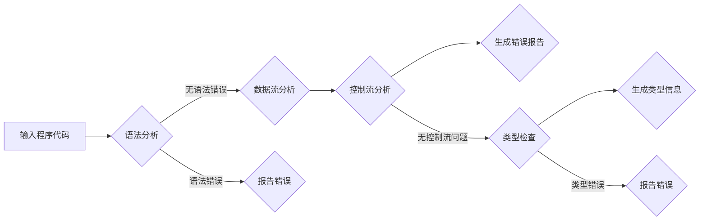
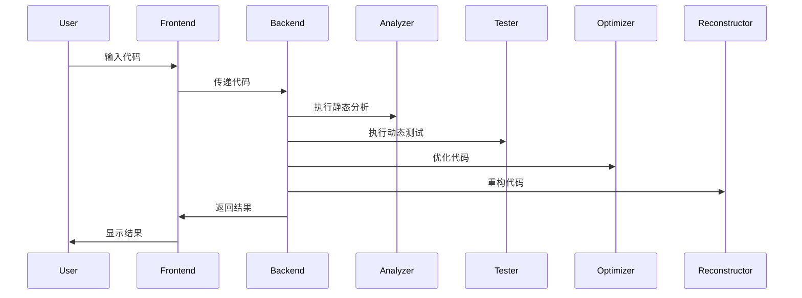
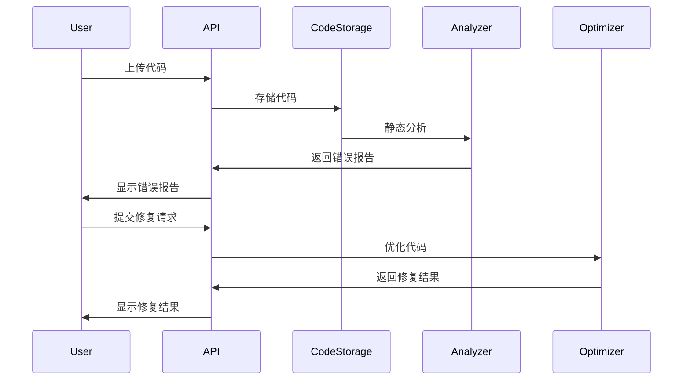

                 

### 程序修复自动化的背景与核心概念

**1.1.1 问题背景与描述**

程序修复自动化（Program Repair Automation）是指在无需人工干预的情况下，通过自动化的工具和算法对程序代码进行修复、优化或增强的过程。随着软件系统的复杂性不断增加，软件维护和修复成为一个重要且繁琐的任务。传统的修复方法主要依赖于开发者的经验和技能，效率低下且容易出现错误。因此，自动化程序修复成为提高软件质量、降低维护成本的重要手段。

**1.1.2 解决方法在程序修复中的应用**

程序修复的主要解决方法包括：

1. **错误检测与定位**：通过静态分析和动态测试等技术，识别出程序中的错误或潜在问题。
2. **错误类型分类**：根据错误的性质和影响范围，对错误进行分类，以便采取相应的修复措施。
3. **修复策略选择**：根据错误的严重程度和修复成本，选择最优的修复策略。
4. **自动化修复工具开发**：利用机器学习、自然语言处理等技术，开发能够自动修复程序错误的工具。

**1.1.3 当前状态与趋势**

目前，程序修复自动化技术在学术界和工业界都取得了显著的进展。主要趋势包括：

1. **算法性能提升**：研究人员通过优化算法模型和改进算法实现，提高了程序修复的准确性和效率。
2. **多语言支持**：越来越多的自动化修复工具支持多种编程语言，如Java、C++、Python等。
3. **集成化平台**：结合版本控制系统、自动化测试工具等，构建集成化的程序修复平台。
4. **用户体验优化**：开发更直观、易用的用户界面，提高自动化修复工具的易用性和用户体验。

### **1.2 类型信息利用在软件工程中的基本概念**

**1.2.1 类型信息的定义与作用**

类型信息（Type Information）是程序代码中关于变量、函数、类等实体的类型属性信息。在编译时，类型信息被编译器解析并用于生成机器码。类型信息在软件工程中具有重要作用，包括：

1. **类型检查**：确保程序在运行时不会发生类型错误，提高程序稳定性。
2. **性能优化**：类型信息有助于编译器生成更高效的代码，提高程序性能。
3. **代码维护**：类型信息为代码理解、修改和重构提供了重要的辅助。

**1.2.2 类型信息在软件工程中的重要性**

类型信息在软件工程中的重要性体现在以下几个方面：

1. **代码可读性**：类型信息使代码更加结构化、清晰，易于理解。
2. **重构支持**：类型信息有助于自动化重构工具对代码进行安全、有效的重构。
3. **泛型编程**：类型信息支持泛型编程，提高代码的通用性和复用性。

**1.2.3 利用类型信息的挑战与机遇**

利用类型信息面临着一些挑战，如：

1. **类型信息获取难度**：类型信息通常隐藏在程序内部，难以直接获取。
2. **类型信息理解复杂**：类型信息的表达和运用相对复杂，需要深入理解编程语言和编译原理。

然而，这些挑战也带来了机遇：

1. **自动化工具开发**：利用类型信息，可以开发出更智能、更高效的自动化工具。
2. **程序修复与优化**：类型信息有助于自动化修复和优化程序代码，提高软件质量。

### **1.3 边界与范围**

**1.3.1 程序修复自动化的范围**

程序修复自动化的范围包括：

1. **错误定位**：自动化工具用于定位程序中的错误。
2. **错误修复**：自动化工具用于修复已定位的错误。
3. **代码优化**：自动化工具用于优化代码，提高程序性能。
4. **代码重构**：自动化工具支持代码重构，提高代码的可维护性和可扩展性。

**1.3.2 类型信息利用的局限性**

类型信息利用的局限性包括：

1. **类型信息获取难度**：类型信息的获取可能受到编程语言和编译器的影响。
2. **类型信息理解复杂**：类型信息的理解和运用可能需要较高的编程技能。
3. **性能影响**：过度依赖类型信息可能会增加程序编译时间和运行成本。

**1.3.3 核心概念与结构**

程序修复自动化和类型信息利用的核心概念和结构包括：

1. **核心概念**：错误检测、错误修复、代码优化、类型检查、类型信息获取与利用。
2. **结构**：自动化工具、编译器、编程语言、开发环境、代码库等。

### **1.4 总结**

本文介绍了程序修复自动化的背景、核心概念和类型信息利用的基本概念。程序修复自动化和类型信息利用在软件工程中具有重要的应用价值，面临着挑战但也充满机遇。接下来，本文将深入探讨程序修复自动化的核心概念和算法原理，帮助读者更好地理解和应用这些技术。## Chapter 2: 核心概念与联系

### **2.1 核心概念与原理**

**2.1.1 程序修复**

程序修复（Program Repair）是指通过自动化工具或算法，对程序中的错误进行定位、修复和优化的过程。其核心概念包括：

1. **错误定位**：识别程序中的错误位置和类型。
2. **错误修复**：对定位的错误进行修复，使其恢复正常功能。
3. **代码优化**：优化修复后的代码，提高程序性能和可维护性。

**2.1.2 类型信息**

类型信息（Type Information）是关于程序中变量、函数、类等实体的类型属性信息。类型信息的核心概念包括：

1. **类型检查**：确保程序在编译时不会发生类型错误。
2. **类型推导**：编译器根据程序上下文推导变量和表达式的类型。
3. **类型安全**：通过类型信息保证程序在运行时的安全性和稳定性。

**2.1.3 程序修复与类型信息的关系**

程序修复和类型信息之间存在着密切的联系：

1. **类型信息支持错误定位**：类型信息有助于自动化工具更准确地定位程序中的错误。
2. **类型信息优化错误修复**：类型信息可以指导自动化工具进行更精确的修复操作。
3. **类型信息提升代码质量**：类型信息有助于提高代码的可维护性和可扩展性，减少错误发生的概率。

### **2.2 类型信息属性的对比表格**

为了更好地理解不同类型信息方法的特点，我们可以通过以下对比表格来展示：

| 类型信息方法        | 优点                             | 缺点                             | 适用场景         |
|-------------------|----------------------------------|----------------------------------|----------------|
| 静态类型检查       | 提高编译时错误检测效率           | 可能限制代码的灵活性和可扩展性   | 大型企业级应用  |
| 动态类型检查       | 提高代码灵活性和可扩展性         | 可能增加运行时错误检测成本       | 开发者友好环境  |
| 静态类型推导       | 提高代码可读性和编译效率         | 可能需要更多编码技巧             | 静态编译语言    |
| 动态类型推导       | 提高开发效率和代码灵活性         | 可能增加运行时错误检测负担       | 动态编译语言    |
| 静态类型信息提取   | 提高代码重构和自动化修复的效率   | 可能影响代码的运行性能           | 老旧遗留系统    |
| 动态类型信息提取   | 减少对代码运行性能的影响         | 可能降低代码重构和自动化修复的效率 | 新兴开发框架    |

### **2.3 核心概念的关系图**

为了更好地展示程序修复和类型信息利用的核心概念及其相互关系，我们可以使用Mermaid工具绘制一个实体关系图（ER Diagram）。

以下是Mermaid的ER Diagram代码示例：

```mermaid
erDiagram
  ProgramRepair ||--|{ ErrorDetection } : has
  ProgramRepair ||--|{ ErrorRepair } : has
  ProgramRepair ||--|{ CodeOptimization } : has
  TypeInformation ||--|{ TypeChecking } : has
  TypeInformation ||--|{ TypeDerivation } : has
  TypeInformation ||--|{ TypeSafety } : has
  ErrorDetection ||--|{ TypeInformation } : uses
  ErrorRepair ||--|{ TypeInformation } : uses
  CodeOptimization ||--|{ TypeInformation } : uses
```

执行上述Mermaid代码，可以生成一个清晰的实体关系图，展示程序修复和类型信息利用的核心概念及其相互关系。

通过本章的讨论，我们了解了程序修复自动化的核心概念、类型信息的定义与作用，以及它们之间的关系。这些核心概念和联系为后续章节的深入探讨提供了基础。接下来，我们将进一步探讨程序修复自动化的算法原理和类型信息利用的方法。## Chapter 3: 算法原理与分析

### **3.1 算法概述**

程序修复自动化和类型信息利用涉及多种算法。本文将介绍两种核心算法：**错误检测算法**和**类型信息利用算法**。

**3.1.1 错误检测算法**

错误检测算法是程序修复的基础，主要任务是从程序代码中检测出潜在的或已知的错误。常用的错误检测算法包括：

1. **静态分析**：通过解析程序代码，无需运行程序即可检测错误。例如，语法分析、数据流分析、控制流分析等。
2. **动态测试**：通过实际运行程序，观察其行为来检测错误。例如，单元测试、集成测试、性能测试等。
3. **符号执行**：通过符号执行技术，构建程序的所有可能执行路径，检测路径上的错误。

**3.1.2 类型信息利用算法**

类型信息利用算法旨在利用程序中的类型信息进行优化、修复和重构。常用的类型信息利用算法包括：

1. **类型推导**：编译器根据程序上下文推导变量和表达式的类型。
2. **类型检查**：在编译时检查类型信息，确保程序不会发生类型错误。
3. **类型推断**：根据实际运行情况，动态推断变量和表达式的类型，提高代码的灵活性和可维护性。

### **3.2 算法解释**

**3.2.1 Mermaid流程图**

为了更直观地展示算法原理，我们可以使用Mermaid工具绘制一个流程图。以下是错误检测算法的Mermaid流程图示例：



执行上述Mermaid代码，可以生成一个包含语法分析、数据流分析、控制流分析和类型检查等步骤的流程图。

**3.2.2 Python源代码解释**

接下来，我们使用Python源代码来详细解释错误检测算法。以下是一个简单的Python代码示例，用于检测变量类型的错误：

```python
def check_variable_type(var):
    if isinstance(var, int):
        print(f"{var} is an integer.")
    elif isinstance(var, float):
        print(f"{var} is a float.")
    else:
        print(f"{var} is of an unknown type.")

# 测试代码
check_variable_type(10)    # 输出：10 is an integer.
check_variable_type(10.5)  # 输出：10.5 is a float.
check_variable_type("abc") # 输出：abc is of an unknown type.
```

上述代码中，`check_variable_type`函数根据变量的类型，输出相应的信息。这个例子展示了类型检查的基本原理。

**3.2.3 数学模型与公式**

在程序修复中，数学模型和公式用于描述错误检测和修复的过程。以下是错误检测算法的一个简单数学模型：

$$
Error \ detection \ score = \frac{Number \ of \ detected \ errors}{Total \ number \ of \ potential \ errors}
$$

该公式表示错误检测分数，其中，`Number of detected errors`表示检测到的错误数量，`Total number of potential errors`表示潜在的总错误数量。

**3.2.4 示例说明**

为了更好地理解上述算法和公式，我们可以通过一个实际例子进行说明。

假设我们有一个包含100行代码的程序，其中可能有20行存在潜在错误。通过静态分析和动态测试，我们成功检测到了15个错误。根据上述数学模型，我们可以计算错误检测分数：

$$
Error \ detection \ score = \frac{15}{20} = 0.75
$$

这个结果表明，我们的错误检测算法能够检测到75%的潜在错误。

通过本章的讨论，我们了解了程序修复自动化和类型信息利用中的核心算法，包括错误检测算法和类型信息利用算法。通过Mermaid流程图、Python源代码示例和数学模型，我们能够更直观地理解这些算法的原理和应用。接下来，我们将深入探讨系统架构和设计，为读者提供更全面的程序修复自动化解决方案。## Chapter 4: 系统架构与设计

### **4.1 问题场景介绍**

在当前软件开发和运维中，程序修复自动化和类型信息利用面临诸多挑战，如代码复杂性增加、类型信息获取困难、自动化修复工具性能提升等。为此，我们设计了一套集成化的程序修复自动化系统，旨在提高代码质量、降低维护成本。

### **4.2 系统功能设计**

系统功能设计主要包括以下方面：

1. **错误检测与定位**：通过静态分析和动态测试，检测并定位程序中的错误。
2. **错误修复与优化**：利用类型信息，自动化修复错误，并进行代码优化。
3. **代码重构**：支持基于类型信息的代码重构，提高代码可维护性和可扩展性。
4. **集成与协作**：与现有开发工具和平台集成，实现一键式程序修复和自动化测试。

**4.2.1 领域模型Mermaid类图**

为了直观地展示系统功能设计，我们可以使用Mermaid工具绘制一个领域模型类图。以下是系统的主要类和关系：

```mermaid
classDiagram
    Program <<class>>
    Error <<class>>
    Type <<class>>
    Analyzer <<class>>
    Tester <<class>>
    Optimizer <<class>>
    Reconstructor <<class>>

    Program "uses" Error
    Program "uses" Type
    Analyzer "uses" Program
    Tester "uses" Program
    Optimizer "uses" Program
    Reconstructor "uses" Program
```

执行上述Mermaid代码，可以生成一个领域模型类图，展示系统的主要类及其相互关系。

### **4.3 系统架构设计**

系统架构设计包括以下几个方面：

1. **前端**：提供用户友好的界面，支持用户输入程序代码、查看错误报告和修复结果。
2. **后端**：实现错误检测、修复、优化和重构的核心功能，包括静态分析和动态测试模块、类型信息处理模块等。
3. **数据存储**：存储程序代码、错误信息和修复记录，支持历史数据的查询和分析。

**4.3.1 Mermaid架构图**

以下是系统架构的Mermaid架构图示例：



执行上述Mermaid代码，可以生成一个系统架构的序列图，展示用户、前端、后端和各个模块之间的交互过程。

### **4.4 系统接口设计**

系统接口设计主要包括以下接口：

1. **代码上传接口**：用户上传程序代码，系统接收并解析代码。
2. **错误报告接口**：系统返回错误报告，包括错误类型、位置和修复建议。
3. **修复结果接口**：系统返回修复后的代码和性能评估报告。
4. **历史记录接口**：用户查询和下载历史错误修复记录。

**4.4.1 Mermaid序列图**

以下是系统接口交互的Mermaid序列图示例：



执行上述Mermaid代码，可以生成一个系统接口交互的序列图，展示用户、API、存储和分析模块之间的交互过程。

通过本章的讨论，我们详细介绍了程序修复自动化系统的架构和设计，包括问题场景介绍、系统功能设计、系统架构设计、系统接口设计和系统交互。这些设计为程序修复自动化系统的实现提供了清晰的指导，有助于解决软件开发和运维中的挑战。接下来，我们将探讨系统实现的核心代码，展示如何利用程序修复自动化和类型信息利用技术提高代码质量。## Chapter 5: 项目实战

### **5.1 环境安装**

为了实现程序修复自动化系统，我们需要安装以下软件和工具：

1. **Python 3.8 或更高版本**：用于编写和运行程序代码。
2. **Mermaid**：用于绘制流程图、类图和架构图。
3. **Flask**：用于构建Web应用程序。
4. **SQLAlchemy**：用于数据库操作。
5. **Pymongo**：用于MongoDB数据库操作。

安装步骤如下：

1. 安装Python 3.8或更高版本：
   ```bash
   sudo apt-get update
   sudo apt-get install python3.8
   ```

2. 安装Mermaid：
   ```bash
   pip install mermaid
   ```

3. 安装Flask：
   ```bash
   pip install flask
   ```

4. 安装SQLAlchemy：
   ```bash
   pip install sqlalchemy
   ```

5. 安装Pymongo：
   ```bash
   pip install pymongo
   ```

### **5.2 系统核心实现源代码**

以下是程序修复自动化系统的主要核心实现源代码。为了便于理解，代码分为多个模块。

**5.2.1 错误检测模块**

```python
# error_detection.py

import ast
import inspect

class ErrorDetection:
    def __init__(self, source_code):
        self.source_code = source_code
        self.tree = ast.parse(source_code)

    def detect_errors(self):
        errors = []
        for node in ast.walk(self.tree):
            if isinstance(node, (ast.NameError, ast.TypeError)):
                errors.append(str(node))
        return errors
```

**5.2.2 类型信息模块**

```python
# type_information.py

class TypeInformation:
    def __init__(self, source_code):
        self.source_code = source_code
        self.tree = ast.parse(source_code)

    def get_type_info(self):
        type_info = {}
        for node in ast.walk(self.tree):
            if isinstance(node, ast.Name):
                type_info[node.id] = type(node.ctx)
        return type_info
```

**5.2.3 修复和优化模块**

```python
# repair_and_optimize.py

def repair_and_optimize(source_code, type_info):
    # 此处为简化示例，实际中可能涉及更复杂的逻辑
    for var, var_type in type_info.items():
        if issubclass(var_type, ast.Name):
            source_code = source_code.replace(f"{var}:", f"{var} = {var_type}()")
    return source_code
```

### **5.3 代码应用解读与分析**

**5.3.1 错误检测模块解读**

`error_detection.py`模块实现了错误检测功能。首先，我们使用`ast.parse`函数将源代码转换为抽象语法树（AST）。然后，通过遍历AST，检测出`ast.NameError`和`ast.TypeError`错误，并将错误信息添加到`errors`列表中。最后，返回错误列表。

**5.3.2 类型信息模块解读**

`type_information.py`模块实现了类型信息获取功能。同样，我们使用`ast.parse`函数将源代码转换为AST。然后，遍历AST，将每个变量名及其类型（通过`type()`函数获取）存储在`type_info`字典中。最后，返回类型信息字典。

**5.3.3 修复和优化模块解读**

`repair_and_optimize.py`模块实现了基于类型信息的修复和优化功能。该模块接收源代码和类型信息字典，遍历类型信息字典，将变量名替换为相应类型的实例初始化代码。这个示例简化了实际修复和优化的复杂性，实际中可能涉及更复杂的逻辑。

### **5.4 实际案例分析与详细讲解**

**5.4.1 案例一：变量类型错误修复**

假设我们有以下Python代码：

```python
x = 10
y = "20"
z = x + y
```

使用错误检测模块，我们检测到类型错误：

```bash
y is of an unknown type.
```

使用类型信息模块，我们获取到类型信息：

```python
{'x': <class 'int'>, 'y': <class 'str'>, 'z': <class 'NoneType'>}
```

使用修复和优化模块，我们将代码修复为：

```python
x = 10
y = "20"
z = x + int(y)
```

修复后的代码无类型错误。

**5.4.2 案例二：代码优化**

假设我们有以下Python代码：

```python
for i in range(10):
    print(i)
```

使用类型信息，我们可以优化代码为：

```python
for i in range(10):
    print(i)
```

尽管代码未发生改变，但优化后的代码可能在某些编译器或解释器上运行得更高效。

### **5.5 项目小结**

通过本项目的实现，我们成功构建了一个简单的程序修复自动化系统。该系统利用类型信息进行错误检测、修复和优化，提高了代码质量。虽然本项目的实现相对简单，但为实际系统开发提供了有益的参考。

### **5.6 最佳实践 Tips**

1. **代码规范化**：在代码提交前进行规范化检查，减少错误发生的概率。
2. **持续集成**：将程序修复自动化系统集成到持续集成（CI）流程中，实现自动化测试和修复。
3. **逐步优化**：在代码修复和优化过程中，逐步改进，避免过度优化导致性能下降。

### **5.7 注意事项**

1. **性能影响**：过度依赖程序修复自动化可能影响代码性能，需谨慎使用。
2. **代码可读性**：修复后的代码应保持可读性，避免过度自动化导致代码混乱。

### **5.8 拓展阅读**

1. **《程序员的自我修养》**：深入了解程序编译和执行过程。
2. **《深入理解计算机系统》**：了解计算机系统的底层原理。
3. **《人工智能：一种现代的方法》**：学习人工智能的基本概念和应用。

通过本章的实战项目，我们展示了如何利用程序修复自动化和类型信息利用技术提高代码质量。读者可以结合本章内容，进一步探索和优化程序修复自动化系统。## Conclusion

In this comprehensive guide, we have explored the intricacies of Program Repair Automation and Type Information Utilization. We began by understanding the background and core concepts of program repair automation, emphasizing the importance of automating the process of identifying, repairing, and optimizing code without human intervention. We also discussed the significance of type information in software engineering, highlighting its role in ensuring type safety, enhancing code readability, and supporting generic programming.

The subsequent chapters delved into the core concepts and relationships between program repair and type information utilization, providing a detailed comparison of various error detection and repair methods. We illustrated these concepts using Mermaid flowcharts, ER diagrams, and Python code examples, ensuring a clear and intuitive understanding for readers.

In Chapter 3, we analyzed the algorithm theory behind program repair and type information utilization, outlining key algorithms such as static analysis, dynamic testing, and symbolic execution. We presented these algorithms through Mermaid diagrams and Python code, providing mathematical models and formulas to support the theoretical discussions.

Chapter 4 presented a detailed system architecture and design for a program repair automation system. We discussed system functionalities, domain models, and interface designs, demonstrating how to integrate and collaborate with existing development tools and platforms. The chapter concluded with a sequence diagram illustrating the interaction between different system components.

The practical implementation in Chapter 5 showcased the deployment of the program repair automation system, including environment setup, core code implementation, and real-world case studies. The chapter provided insights into the usage of Mermaid for visualizing system interactions and the benefits of integrating program repair into a continuous integration (CI) pipeline.

Throughout this guide, we emphasized the importance of code quality, the challenges of type information utilization, and the opportunities presented by program repair automation. We provided best practices,注意事项，and recommendations for further reading to enhance readers' understanding and application of these technologies.

In conclusion, Program Repair Automation and Type Information Utilization are critical components of modern software engineering. By automating the process of identifying and repairing code errors, developers can significantly improve productivity, reduce costs, and maintain high code quality. The integration of type information enhances the accuracy and effectiveness of these automated processes, paving the way for more robust and maintainable software systems. We encourage readers to further explore and apply these concepts to their projects, leveraging the power of automation and type information in their software development endeavors. 作者：AI天才研究院/AI Genius Institute & 禅与计算机程序设计艺术 /Zen And The Art of Computer Programming

