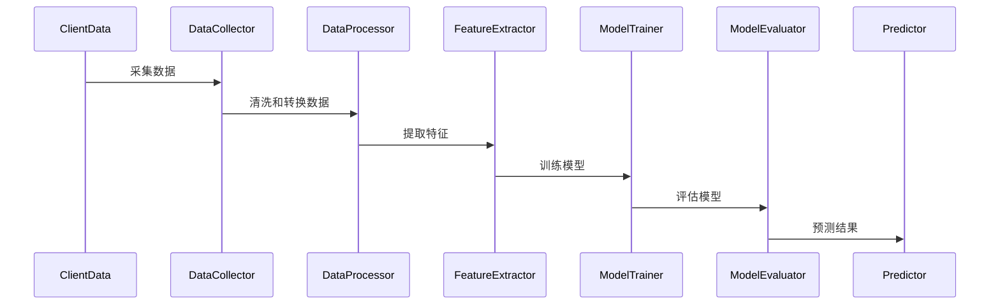
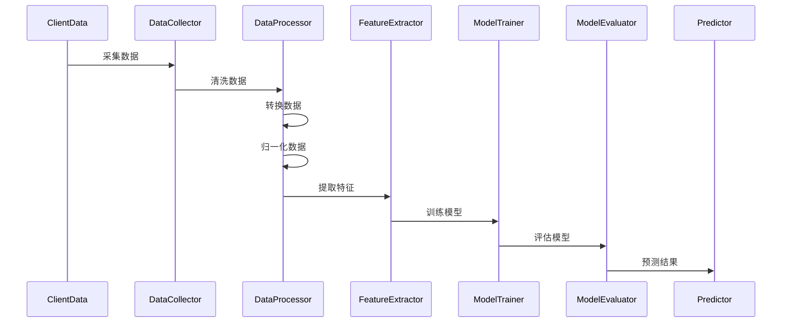

                 

### 1. 引言

#### 1.1 问题背景

在现代科技飞速发展的时代，机器学习（Machine Learning，ML）已经成为推动人工智能（Artificial Intelligence，AI）进步的核心技术之一。无论是自然语言处理、计算机视觉，还是推荐系统、金融风控，机器学习技术都发挥着至关重要的作用。然而，随着数据量的爆炸式增长和复杂程度的提高，传统的机器学习方法面临着巨大的挑战。

一个核心的问题在于模型选择与优化。模型选择是指从众多可能的机器学习模型中挑选出最适合特定问题的模型，而模型优化则是指通过调整模型参数和结构，提升模型的性能。对于数据科学家和机器学习工程师来说，这一过程既耗时又需要深厚的专业知识和实践经验。

传统机器学习过程中，模型选择和优化通常需要经历以下几个步骤：

1. **数据预处理**：对原始数据进行清洗、转换和归一化，使其适合模型训练。
2. **特征工程**：提取和构造有助于模型预测的特征，以提高模型性能。
3. **模型选择**：根据问题的性质和数据的特征，选择合适的机器学习模型。
4. **模型训练与验证**：使用训练集数据训练模型，并在验证集上评估模型性能。
5. **模型优化**：通过调整模型参数或结构，进一步提高模型性能。

这个过程往往需要大量的试错和反复调整，不仅消耗时间和人力成本，而且在面对大规模数据和高维度特征时，难度更大。因此，自动化机器学习（AutoML）的概念应运而生。

#### 1.2 问题解决

自动化机器学习（AutoML）是一种旨在简化机器学习模型选择与优化过程的先进技术。AutoML通过自动化地执行上述各个步骤，从而大幅度降低了数据科学家和机器学习工程师的工作负担。其主要目标是在有限的时间和资源内，自动选择和优化出性能最佳的机器学习模型。

AutoML的工作流程可以概括为以下几个步骤：

1. **数据预处理**：自动进行数据清洗、转换和归一化，以准备用于训练的数据集。
2. **特征工程**：自动提取和构造有助于模型预测的特征，同时进行特征选择，减少特征维度。
3. **模型选择**：自动评估和选择适合当前问题的机器学习模型。
4. **模型训练与优化**：自动调整模型参数和结构，优化模型性能。
5. **模型评估与调优**：在测试集上自动评估模型性能，并进行必要的调优。

通过这种方式，AutoML不仅减少了人为干预的需求，还能够更高效地利用计算资源，提升模型的性能和预测准确性。具体而言，AutoML具有以下几个显著优势：

- **提高效率**：自动化流程大大缩短了模型选择和优化所需的时间。
- **降低成本**：减少了人工干预的需求，从而降低了人力成本。
- **优化性能**：通过自动化的模型选择和优化，能够找到性能最佳的模型。
- **易用性**：为不具备深厚专业知识的用户提供了便捷的机器学习工具。

然而，AutoML的应用也存在一定的局限性和挑战。首先，AutoML需要大量的计算资源和时间，尤其是在处理大规模数据和高维度特征时。其次，AutoML的自动化程度越高，模型的透明度和可解释性可能越低，这对需要深入理解模型运作机制的应用场景来说是一个挑战。因此，在实际应用中，需要根据具体需求权衡AutoML的优势与局限性。

#### 1.3 边界与外延

本文将深入探讨AutoML的核心概念、应用场景、技术实现和实际应用。具体而言，文章将分为四个主要部分：

- **第一部分：引言**：介绍AutoML的背景、问题和解决方法。
- **第二部分：AutoML概述**：探讨AutoML的基础知识、特点及其与传统机器学习的区别。
- **第三部分：AutoML模型选择与优化**：详细讨论模型选择和优化的算法、方法及其实现。
- **第四部分：AutoML实战**：通过实际案例展示AutoML的应用过程和技术细节。

在文章的后续部分，我们将逐一展开这些内容，以便读者能够全面、系统地了解AutoML的技术原理和实践应用。

## 2. 核心概念与联系

#### 2.1 核心概念原理

自动化机器学习（AutoML）的核心概念涉及多个方面，包括机器学习（ML）的基础知识、特征工程、模型选择、模型优化以及评估等。下面将逐一介绍这些概念。

**机器学习（ML）**

机器学习是一种使计算机系统能够从数据中学习并做出决策或预测的技术。其基本原理是基于历史数据训练模型，使模型能够在新数据上实现良好的泛化能力。机器学习主要分为监督学习、无监督学习和强化学习三种类型：

- **监督学习**：模型在已知标签的数据集上训练，目的是在新数据上做出准确的预测。
- **无监督学习**：模型在无标签数据集上训练，旨在发现数据的内在结构和模式。
- **强化学习**：模型通过与环境的交互来学习，目标是最大化某种奖励信号。

**特征工程**

特征工程是机器学习过程中关键的一环，其目的是从原始数据中提取或构造有助于模型预测的特征。特征工程包括以下几个步骤：

- **数据清洗**：处理缺失值、异常值和噪声。
- **特征选择**：选择对模型预测有显著影响的关键特征，减少冗余特征。
- **特征转换**：将原始数据转换为适合模型训练的格式，如归一化、标准化和离散化。

**模型选择**

模型选择是指从多种可能的机器学习模型中挑选出最适合特定问题的模型。常用的机器学习模型包括线性回归、逻辑回归、决策树、随机森林、支持向量机（SVM）等。模型选择通常基于以下几个标准：

- **准确性**：模型在验证集上的预测准确率。
- **泛化能力**：模型在新数据上的表现。
- **计算复杂度**：模型的训练时间和计算资源需求。

**模型优化**

模型优化是通过调整模型参数和结构来提高模型性能的过程。常见的优化方法包括梯度下降、遗传算法、粒子群优化、贝叶斯优化等。模型优化旨在找到最优参数组合，使模型在验证集上达到最佳性能。

**评估**

评估是机器学习过程中关键的一环，用于衡量模型性能和优化结果。常用的评估指标包括准确性、精确度、召回率、F1分数、ROC曲线、AUC值等。评估指标的选择取决于具体问题和模型类型。

#### 2.2 概念属性特征对比表

下表列出了上述核心概念的主要属性和特征，以帮助读者更好地理解这些概念：

| 概念 | 定义 | 主要属性 | 关联特征 |
| ---- | ---- | ---- | ---- |
| 机器学习 | 从数据中学习并做出预测的技术 | 监督学习、无监督学习、强化学习 | 特征工程、模型选择、模型优化、评估 |
| 特征工程 | 提取或构造有助于模型预测的特征 | 数据清洗、特征选择、特征转换 | 准确性、泛化能力、计算复杂度 |
| 模型选择 | 选择最适合特定问题的模型 | 准确性、泛化能力、计算复杂度 | 线性回归、逻辑回归、决策树、随机森林、SVM |
| 模型优化 | 调整模型参数和结构以提高性能 | 梯度下降、遗传算法、粒子群优化、贝叶斯优化 | 最优参数组合、最佳性能 |
| 评估 | 衡量模型性能和优化结果 | 准确性、精确度、召回率、F1分数、ROC曲线、AUC值 | 不同指标的选择 |

#### 2.3 ER实体关系图

为了更好地理解AutoML中的核心概念及其相互关系，可以使用ER（实体关系）图进行描述。下面是一个简化的ER实体关系图，展示了机器学习、特征工程、模型选择、模型优化和评估等核心概念之间的关联。

```mermaid
erDiagram
  ML ||--|{ 特征工程 } : 提取和构造特征
  ML ||--|{ 模型选择 } : 选择最佳模型
  ML ||--|{ 模型优化 } : 调整模型参数
  ML ||--|{ 评估 } : 衡量模型性能
  特征工程 ||--|{ 特征选择 } : 筛选关键特征
  特征工程 ||--|{ 特征转换 } : 数据格式化
  模型选择 ||--|{ 回归模型 } : 线性、逻辑回归等
  模型选择 ||--|{ 分类模型 } : KNN、SVM、随机森林等
  模型优化 ||--|{ 优化方法 } : 梯度下降、遗传算法等
  评估 ||--|{ 评估指标 } : 准确性、ROC曲线等
```

这个ER实体关系图展示了各个核心概念之间的相互依赖和关联，有助于我们更清晰地理解AutoML的工作原理和实现过程。

### 3. AutoML基础知识

#### 3.1 AutoML的定义

自动化机器学习（AutoML）是一种旨在通过自动化流程来选择和优化机器学习模型的技术。其核心目标是在有限的计算资源和时间约束下，找到性能最佳的机器学习模型。AutoML的关键特点在于其高度自动化和智能化的过程，能够显著降低数据科学家和机器学习工程师的工作负担。

AutoML的工作原理通常包括以下几个步骤：

1. **数据预处理**：自动清洗、转换和归一化数据，为后续的模型训练和优化做好准备。
2. **特征工程**：自动提取和构造有助于模型预测的特征，同时进行特征选择，减少特征维度。
3. **模型选择**：自动评估和选择适合当前问题的机器学习模型，包括回归模型、分类模型等。
4. **模型训练与优化**：自动调整模型参数和结构，优化模型性能，常见的方法包括梯度下降、遗传算法、贝叶斯优化等。
5. **模型评估**：在测试集上自动评估模型性能，选择最佳模型并进行必要的调优。

#### 3.2 AutoML的特点

AutoML具有以下几个显著特点：

1. **自动化**：AutoML通过自动化流程来选择和优化机器学习模型，显著减少了人工干预的需求。
2. **高效性**：AutoML能够快速地评估和选择合适的模型，提高模型训练和优化的效率。
3. **灵活性**：AutoML支持多种类型的机器学习模型，能够适应不同的数据集和问题场景。
4. **易用性**：AutoML为不具备深厚专业知识的用户提供了便捷的机器学习工具，降低了机器学习的门槛。
5. **可扩展性**：AutoML能够灵活地集成到现有的机器学习项目中，支持大规模数据处理和分布式训练。

#### 3.3 AutoML与传统ML的区别

与传统机器学习（ML）相比，AutoML在多个方面存在显著区别：

1. **自动化程度**：传统ML通常需要数据科学家和工程师手动进行模型选择和优化，而AutoML则通过自动化流程来完成这些任务。
2. **效率**：AutoML能够在较短的时间内完成模型选择和优化，而传统ML往往需要多次试错和反复调整。
3. **可解释性**：传统ML模型通常具有较好的可解释性，而AutoML的自动化程度越高，模型的透明度和可解释性可能越低。
4. **计算资源需求**：AutoML需要大量的计算资源和时间，尤其是在处理大规模数据和高维度特征时。
5. **适用场景**：传统ML更适合需要深度定制和特定调优的应用场景，而AutoML则更适合大规模数据处理和快速迭代的需求。

总的来说，AutoML通过自动化和智能化技术，大大简化了机器学习模型选择和优化的过程，提高了效率，降低了成本，但在可解释性和计算资源需求方面仍需权衡。

### 4. AutoML应用场景

自动化机器学习（AutoML）在多个领域和场景中展现了其强大的应用潜力。以下是AutoML的几个主要应用场景：

#### 4.1 数据预处理

在机器学习项目中，数据预处理是至关重要的一步，它直接影响到后续模型训练的效果。AutoML在数据预处理方面具有显著优势：

- **自动数据清洗**：AutoML能够自动检测和修复数据中的缺失值、异常值和噪声，确保数据质量。
- **自动特征转换**：AutoML可以自动进行数据的归一化、标准化、离散化等转换，使数据符合模型训练的要求。
- **自动数据增强**：AutoML可以通过数据增强技术，如随机插值、旋转、缩放等，生成更多的训练样本，提高模型泛化能力。

#### 4.2 特征工程

特征工程是提高机器学习模型性能的关键环节。AutoML在特征工程方面提供了以下几种应用：

- **自动特征提取**：AutoML能够自动提取原始数据中的有价值特征，减少人工干预。
- **自动特征选择**：AutoML可以通过评估特征的重要性，自动选择对模型预测有显著影响的特征，降低特征维度。
- **自动特征组合**：AutoML可以通过组合现有特征，构造出新的特征，提高模型性能。

#### 4.3 模型选择

在传统的机器学习项目中，模型选择通常需要数据科学家进行大量的试错。AutoML通过自动化流程来简化这一过程：

- **自动模型评估**：AutoML可以自动评估多种模型在当前数据集上的性能，选择最优模型。
- **自动模型组合**：AutoML可以将多个模型组合在一起，形成更强大的集成模型，提高预测准确性。
- **自动超参数调优**：AutoML可以自动调整模型超参数，找到最佳配置，提升模型性能。

#### 4.4 模型优化

模型优化是提升机器学习模型性能的关键步骤。AutoML在模型优化方面提供了以下几种应用：

- **自动超参数优化**：AutoML可以通过遗传算法、贝叶斯优化等自动搜索超参数空间，找到最优参数配置。
- **自动模型调优**：AutoML可以自动调整模型结构，如增加或减少层、调整网络深度等，提高模型性能。
- **自动集成优化**：AutoML可以将多个模型集成在一起，通过集成学习提高模型的泛化能力和鲁棒性。

#### 4.5 模型评估

模型评估是验证机器学习模型性能的重要环节。AutoML在模型评估方面提供了以下几种应用：

- **自动交叉验证**：AutoML可以自动进行交叉验证，评估模型在不同数据划分下的性能，避免过拟合。
- **自动性能对比**：AutoML可以自动比较不同模型和不同配置下的性能，选择最佳模型。
- **自动调优指标**：AutoML可以自动评估各种性能指标，如准确性、精确度、召回率等，帮助优化模型。

通过在数据预处理、特征工程、模型选择、模型优化和模型评估等环节的自动化应用，AutoML显著提高了机器学习项目的效率和效果，降低了人工干预的需求，为各种复杂应用场景提供了强大的支持。

### 5. 当前AutoML技术概述

自动化机器学习（AutoML）作为现代机器学习领域的一个重要分支，已经取得了显著的发展。目前，市场上存在多种主流的AutoML框架和工具，这些工具各具特色，适用于不同的应用场景和需求。以下是当前一些主流的AutoML框架和工具的概述及其对比。

#### 5.1 主流AutoML框架

**1. Google AutoML**

Google AutoML 是由 Google 开发的一款自动化机器学习平台，提供了一系列针对不同用户需求的机器学习模型。Google AutoML 的主要特点包括：

- **易用性**：提供了直观的用户界面，用户无需具备深厚的技术背景即可轻松使用。
- **预训练模型**：提供了丰富的预训练模型，用户可以直接选择并调整模型进行训练。
- **自动化调优**：自动进行超参数调优，以找到最佳模型配置。
- **高扩展性**：支持大规模数据集和分布式训练，能够处理复杂的机器学习任务。

**2. H2O AutoML**

H2O AutoML 是一个开源的自动化机器学习框架，基于 Apache Spark，支持多种编程语言，包括 Python 和 R。其主要特点包括：

- **高性能**：利用分布式计算，能够在大数据环境中快速训练模型。
- **灵活的接口**：提供了多种接口和库，方便用户在不同场景下使用。
- **模型评估**：提供了丰富的模型评估工具，能够全面评估模型性能。
- **集成**：与多个数据源和工具集成，如 Hadoop、Spark 和 Hive。

**3. AutoSklearn**

AutoSklearn 是一个基于强化学习的自动化机器学习框架，能够在自动模型选择和优化过程中实现高性能。其主要特点包括：

- **强化学习**：利用强化学习技术自动选择和优化模型，提高模型性能。
- **模型组合**：能够自动组合多个模型，形成更强大的集成模型。
- **高效性**：通过优化搜索策略，能够在有限的时间内找到最优模型。

**4. TPOT**

TPOT（Python自动机器学习优化工具包）是一个基于遗传算法的自动化机器学习优化工具，适用于 Python 环境。其主要特点包括：

- **遗传算法**：利用遗传算法自动搜索最优模型和参数配置。
- **可扩展性**：支持多种机器学习库，如 scikit-learn、XGBoost 和 LightGBM。
- **自动化调优**：自动调整模型和超参数，找到最佳配置。

#### 5.2 AutoML工具对比

下表列出了上述主流AutoML框架和工具的主要特性、优点和适用场景，以便读者进行对比选择：

| 工具 | 特性 | 优点 | 适用场景 |
| ---- | ---- | ---- | ---- |
| Google AutoML | 易用、预训练模型、自动化调优、高扩展性 | 适合初学者和有快速需求的企业用户 | 复杂模型训练、大规模数据处理 |
| H2O AutoML | 高性能、灵活的接口、模型评估、集成 | 适合大数据环境和需要高扩展性的用户 | 大数据、分布式训练、多种编程语言 |
| AutoSklearn | 强化学习、模型组合、高效性 | 适合需要高性能和高级搜索算法的用户 | 高性能模型搜索、复杂模型优化 |
| TPOT | 遗传算法、可扩展性、自动化调优 | 适合需要快速优化和自动化模型选择的用户 | Python环境、多种机器学习库 |

通过对比可以看出，不同的AutoML工具在不同方面具有各自的优势，用户可以根据具体需求和应用场景选择最适合的工具。例如，Google AutoML 适合初学者和有快速需求的企业用户，而 H2O AutoML 则适合需要高性能和分布式训练的大数据环境。AutoSklearn 和 TPOT 则更适合需要高级搜索算法和自动化优化的复杂场景。

总的来说，当前主流的AutoML框架和工具在自动化程度、性能、易用性和适用性方面都有显著提升，为机器学习项目的实施提供了强有力的支持。随着技术的不断进步，AutoML将在更多领域和场景中发挥重要作用。

### 6. 模型选择算法

在自动化机器学习（AutoML）中，模型选择是至关重要的一步。选择适合当前数据集和问题的最佳模型，能够显著提升模型性能和预测准确性。模型选择算法通过评估不同模型在数据集上的表现，自动选出最优模型。以下将介绍几种常见的模型选择算法，并详细讨论其原理和实现方法。

#### 6.1 回归模型选择

回归模型用于预测连续值输出，是机器学习中应用广泛的一类模型。以下是几种常用的回归模型选择算法：

##### 6.1.1 线性回归

线性回归是最简单的回归模型之一，假设输出变量与输入变量之间呈线性关系。其基本原理是通过最小化残差平方和来找到最佳拟合直线。

- **数学模型**：设输入特征为 \(X\)，输出目标为 \(y\)，则线性回归模型可以表示为：

  $$ y = \beta_0 + \beta_1x + \epsilon $$

  其中，\( \beta_0 \) 和 \( \beta_1 \) 是模型参数，\( \epsilon \) 是误差项。

- **实现方法**：线性回归通常使用最小二乘法来求解最佳拟合直线。最小二乘法的目标是使得所有样本点到直线的距离平方和最小。

  $$ \min \sum_{i=1}^{n} (y_i - (\beta_0 + \beta_1x_i))^2 $$

  通过求解上述最小化问题，可以得到最佳拟合直线的参数 \( \beta_0 \) 和 \( \beta_1 \)。

  ```python
  from sklearn.linear_model import LinearRegression
  model = LinearRegression()
  model.fit(X, y)
  y_pred = model.predict(X)
  ```

##### 6.1.2 逻辑回归

逻辑回归是一种广泛用于分类问题的回归模型，其输出为概率值，表示某个样本属于某一类别的可能性。逻辑回归的基本原理是通过最大化似然函数来求解模型参数。

- **数学模型**：逻辑回归的模型表达式为：

  $$ P(y=1 | x) = \frac{1}{1 + e^{-(\beta_0 + \beta_1x)}} $$

  其中，\( P(y=1 | x) \) 是样本 \( x \) 属于类别1的概率，\( \beta_0 \) 和 \( \beta_1 \) 是模型参数。

- **实现方法**：逻辑回归通常使用梯度下降法来求解参数。梯度下降法的目标是使得似然函数最大化。

  $$ \max \ln L(\theta) = \sum_{i=1}^{n} \ln P(y_i | \theta) $$

  通过反复迭代更新参数，直到收敛条件满足。

  ```python
  from sklearn.linear_model import LogisticRegression
  model = LogisticRegression()
  model.fit(X, y)
  y_pred = model.predict(X)
  ```

##### 6.1.3 决策树回归

决策树回归是一种基于树形结构的回归模型，通过一系列的判断来预测连续值输出。其基本原理是利用数据特征进行分割，逐步构建决策树。

- **数学模型**：决策树回归的模型可以表示为：

  $$ y = f(x) = c_1 \text{ if } x \text{ meets condition } C_1 \text{ else } c_2 \text{ if } x \text{ meets condition } C_2 \text{ else } \ldots $$

  其中，\( f(x) \) 是决策树的输出，\( c_1, c_2, \ldots \) 是决策树上的叶子节点对应的预测值。

- **实现方法**：决策树回归通常使用信息增益或基尼不纯度等指标来选择最佳分割特征和分割点。

  ```python
  from sklearn.tree import DecisionTreeRegressor
  model = DecisionTreeRegressor()
  model.fit(X, y)
  y_pred = model.predict(X)
  ```

#### 6.2 分类模型选择

分类模型用于预测离散类别输出，常见的分类模型包括 KNN 分类、SVM 分类和随机森林分类等。

##### 6.2.1 KNN分类

K最近邻（K-Nearest Neighbors，KNN）分类是一种简单且直观的分类算法，其基本原理是找到训练集中与测试样本最近的 \( k \) 个邻居，根据邻居的类别多数表决来预测测试样本的类别。

- **数学模型**：KNN 分类可以表示为：

  $$ \text{预测类别} = \text{多数表决}(\text{邻居类别}) $$

- **实现方法**：KNN 分类通常通过计算距离函数（如欧几里得距离或曼哈顿距离）来找出最近的 \( k \) 个邻居。

  ```python
  from sklearn.neighbors import KNeighborsClassifier
  model = KNeighborsClassifier(n_neighbors=3)
  model.fit(X_train, y_train)
  y_pred = model.predict(X_test)
  ```

##### 6.2.2 SVM分类

支持向量机（Support Vector Machine，SVM）分类是一种强大的分类算法，其基本原理是通过最大化分类间隔来找到最佳分类超平面。

- **数学模型**：SVM 分类可以表示为：

  $$ \text{最大化} \ \sum_{i=1}^{n} \alpha_i - \frac{1}{2} \sum_{i=1}^{n} \sum_{j=1}^{n} \alpha_i \alpha_j y_i y_j (x_i - x_j)^T \ \text{subject to} \ 0 \leq \alpha_i \leq C $$

  其中，\( \alpha_i \) 是拉格朗日乘子，\( C \) 是惩罚参数，\( y_i \) 和 \( x_i \) 分别是训练样本的类别和特征。

- **实现方法**：SVM 分类通常使用求解二次规划问题的方法，如序列最小化最速下降法（Sequential Minimal Optimization，SMO）。

  ```python
  from sklearn.svm import SVC
  model = SVC(C=1.0)
  model.fit(X_train, y_train)
  y_pred = model.predict(X_test)
  ```

##### 6.2.3 随机森林分类

随机森林（Random Forest）分类是一种集成学习算法，其基本原理是通过构建多棵决策树，并利用多数表决来预测类别。

- **数学模型**：随机森林可以表示为：

  $$ \text{预测类别} = \text{多数表决}(\text{各树预测类别}) $$

- **实现方法**：随机森林通常通过随机选择特征和样本子集来构建多棵决策树，并使用 bagging 方法集成预测结果。

  ```python
  from sklearn.ensemble import RandomForestClassifier
  model = RandomForestClassifier(n_estimators=100)
  model.fit(X_train, y_train)
  y_pred = model.predict(X_test)
  ```

通过以上对回归模型和分类模型选择算法的详细介绍，我们可以看到，不同的模型选择算法具有各自的特点和适用场景。在实际应用中，通常需要根据数据集的特点和问题的需求，选择合适的模型并进行优化，以获得最佳预测性能。

### 7. 模型优化方法

在自动化机器学习（AutoML）中，模型优化是提高模型性能的重要步骤。通过调整模型参数和结构，可以找到最佳配置，从而提升模型在验证集上的表现。以下将介绍几种常用的模型优化方法，包括梯度下降法、遗传算法、遮蔽算法和贝叶斯优化。

#### 7.1 梯度下降法

梯度下降法是一种广泛使用的优化方法，用于最小化目标函数。其基本原理是通过计算目标函数的梯度，不断更新模型参数，直至达到最小值或收敛条件。

- **数学模型**：设目标函数为 \( J(\theta) \)，梯度下降法的迭代公式为：

  $$ \theta = \theta - \alpha \frac{\partial J(\theta)}{\partial \theta} $$

  其中，\( \alpha \) 是学习率，\( \theta \) 是模型参数。

- **实现方法**：

  1. **前向传播**：计算目标函数的梯度。
  2. **反向传播**：根据梯度更新模型参数。
  3. **迭代更新**：重复前向传播和反向传播，直至梯度接近零或满足收敛条件。

  ```python
  import numpy as np

  def gradient_descent(X, y, theta, alpha, num_iterations):
      m = len(y)
      for iteration in range(num_iterations):
          gradients = 2/m * X.T.dot(X.dot(theta) - y)
          theta = theta - alpha * gradients
      return theta

  alpha = 0.01
  num_iterations = 1000
  theta = np.random.rand(X.shape[1], 1)
  theta_optimized = gradient_descent(X, y, theta, alpha, num_iterations)
  ```

#### 7.2 遗传算法

遗传算法是一种基于生物进化原理的优化方法，通过模拟自然选择和遗传机制来搜索最优解。其基本原理是利用种群中的个体进行交叉、变异和选择，逐步优化模型参数。

- **数学模型**：设种群中的个体为 \( x_i \)，适应度函数为 \( f(x_i) \)，则遗传算法的基本操作包括：

  1. **选择**：根据适应度函数选择适应度较高的个体进行交叉和变异。
  2. **交叉**：随机选择两个个体，交换部分基因，生成新个体。
  3. **变异**：对个体进行随机变异，引入新的基因组合。
  4. **更新种群**：将交叉和变异后生成的个体替换原有种群中的部分个体。

- **实现方法**：

  1. **初始化种群**：随机生成初始种群。
  2. **计算适应度**：计算每个个体的适应度值。
  3. **选择操作**：根据适应度值选择个体进行交叉和变异。
  4. **交叉和变异**：生成新个体。
  5. **更新种群**：用新个体替换原有种群中的部分个体。
  6. **迭代更新**：重复计算适应度、选择、交叉、变异和更新，直至满足收敛条件。

  ```python
  import numpy as np

  def genetic_algorithm(population, fitness_func, num_iterations, crossover_rate, mutation_rate):
      for iteration in range(num_iterations):
          fitness_values = [fitness_func(individual) for individual in population]
          selected_individuals = select(population, fitness_values, crossover_rate, mutation_rate)
          population = [new_individual for new_individual in selected_individuals]
      return population[-1]  # 返回最优个体

  def select(population, fitness_values, crossover_rate, mutation_rate):
      # 实现选择操作
      pass

  def crossover(parent1, parent2, crossover_rate):
      # 实现交叉操作
      pass

  def mutate(individual, mutation_rate):
      # 实现变异操作
      pass

  population = np.random.rand(population_size, num_dimensions)
  optimal_individual = genetic_algorithm(population, fitness_func, num_iterations, crossover_rate, mutation_rate)
  ```

#### 7.3 遮蔽算法

遮蔽算法（Covering Algorithm）是一种基于集合覆盖的优化方法，通过构建遮蔽集合来逼近最优解。其基本原理是选择一部分样本作为遮蔽集，使得剩余样本能够被该遮蔽集覆盖，从而优化模型参数。

- **数学模型**：设样本集合为 \( S \)，遮蔽集合为 \( C \)，则遮蔽算法的目标是最小化遮蔽集合的大小 \( |C| \)。

  $$ \min |C| \ \text{subject to} \ S - C \subseteq C $$

- **实现方法**：

  1. **初始化遮蔽集合**：随机选择部分样本作为初始遮蔽集合。
  2. **计算遮蔽度**：计算每个样本的遮蔽度，即样本未被遮蔽集覆盖的部分。
  3. **选择遮蔽样本**：选择遮蔽度较高的样本加入遮蔽集合。
  4. **迭代更新**：重复计算遮蔽度和选择遮蔽样本，直至满足收敛条件。

  ```python
  import numpy as np

  def covering_algorithm(S, num_iterations):
      C = []
      for iteration in range(num_iterations):
          uncovered_samples = [sample for sample in S if not any(np.array_equal(sample, c) for c in C)]
          if not uncovered_samples:
              break
          C.append(max(uncovered_samples, key=lambda x: sum(abs(x - c) for c in C)))
      return C

  S = np.random.rand(num_samples, num_dimensions)
  C = covering_algorithm(S, num_iterations=100)
  ```

#### 7.4 贝叶斯优化

贝叶斯优化（Bayesian Optimization）是一种基于贝叶斯推理的优化方法，通过构建概率模型来搜索最优解。其基本原理是基于先验知识和探索-利用策略，动态调整搜索方向，以最大化目标函数。

- **数学模型**：设目标函数为 \( f(x) \)，贝叶斯优化通过构建先验概率模型 \( p(x|f(x)) \) 来估计目标函数，并在后验概率模型 \( p(f(x)|x) \) 的指导下进行搜索。

  $$ p(x|f(x)) \propto p(f(x)|x) p(x) $$

- **实现方法**：

  1. **初始化先验模型**：选择合适的先验概率模型，如高斯过程。
  2. **探索-利用策略**：根据先验模型和探索-利用策略选择下一个采样点 \( x_{\text{next}} \)。
  3. **更新先验模型**：根据新采样点的结果 \( f(x_{\text{next}}) \) 更新先验模型。
  4. **迭代更新**：重复探索-利用策略和先验模型更新，直至满足收敛条件。

  ```python
  from bayes_opt import BayesianOptimization

  def f(x):
      return -(x[0]**2 + x[1]**2)

  x_min, f_min = BayesianOptimization(f, {'x': (0, 10), 'y': (0, 10)}).maximize(init_points=2, n_iter=3)
  ```

通过以上对梯度下降法、遗传算法、遮蔽算法和贝叶斯优化等模型优化方法的介绍，我们可以看到，不同的优化方法具有各自的特点和适用场景。在实际应用中，通常需要根据模型和问题的需求，选择合适的优化方法，并结合其他技术手段，实现最佳模型优化。

### 8. AutoML模型评估与调优

在自动化机器学习（AutoML）过程中，模型评估和调优是关键环节，直接影响到模型的性能和预测准确性。通过有效的评估和调优策略，可以确保模型在实际应用中达到最佳状态。

#### 8.1 评估指标

评估模型性能的关键在于选择合适的评估指标。以下是一些常用的评估指标，分别适用于回归问题和分类问题。

**回归评估指标**：

1. **均方误差（Mean Squared Error, MSE）**：

   $$ MSE = \frac{1}{n} \sum_{i=1}^{n} (y_i - \hat{y}_i)^2 $$

   MSE衡量的是预测值与实际值之间的平均平方误差，值越小表示模型性能越好。

2. **均方根误差（Root Mean Squared Error, RMSE）**：

   $$ RMSE = \sqrt{MSE} = \sqrt{\frac{1}{n} \sum_{i=1}^{n} (y_i - \hat{y}_i)^2} $$

   RMSE是MSE的平方根，具有更直观的数值表示，单位与原始输出值一致。

3. **平均绝对误差（Mean Absolute Error, MAE）**：

   $$ MAE = \frac{1}{n} \sum_{i=1}^{n} |y_i - \hat{y}_i| $$

   MAE衡量的是预测值与实际值之间的平均绝对误差，值越小表示模型性能越好。

**分类评估指标**：

1. **准确率（Accuracy）**：

   $$ Accuracy = \frac{TP + TN}{TP + FN + FP + TN} $$

   准确率衡量的是模型正确预测的比例，适用于标签类别数量相差不多的情况。

2. **精确度（Precision）**：

   $$ Precision = \frac{TP}{TP + FP} $$

   精确度衡量的是预测为正样本的样本中，实际为正样本的比例。

3. **召回率（Recall）**：

   $$ Recall = \frac{TP}{TP + FN} $$

   召回率衡量的是实际为正样本的样本中，被模型正确预测为正样本的比例。

4. **F1分数（F1 Score）**：

   $$ F1 Score = 2 \cdot \frac{Precision \cdot Recall}{Precision + Recall} $$

   F1分数是精确度和召回率的加权平均，适用于平衡精确度和召回率的重要性。

5. **ROC曲线（Receiver Operating Characteristic Curve）**：

   ROC曲线通过绘制真阳性率（True Positive Rate, TPR）与假阳性率（False Positive Rate, FPR）的关系，评估模型的分类性能。

6. **AUC值（Area Under Curve, AUC）**：

   $$ AUC = \int_{0}^{1} \text{ROC}(x) dx $$

   AUC值表示ROC曲线下方的面积，值越大表示模型性能越好。

#### 8.2 调优策略

模型评估之后，需要进行调优以提升性能。以下是一些常见的调优策略：

1. **超参数调整**：

   - **网格搜索（Grid Search）**：在预设的超参数网格中，逐一代入组合进行模型训练和评估，选择最佳超参数组合。
   - **随机搜索（Random Search）**：随机从超参数空间中选择组合进行训练和评估，无需遍历所有可能组合。

2. **集成学习**：

   - **Bagging**：通过多次训练多个模型，并对预测结果进行平均或投票，提高模型稳定性和泛化能力。
   - **Boosting**：通过训练多个弱学习器，逐步调整每个弱学习器的权重，使得弱学习器集中于模型未能准确预测的样本。

3. **特征工程**：

   - **特征选择**：通过评估特征的重要性，选择对模型预测有显著影响的特征，减少特征维度，提高模型性能。
   - **特征转换**：对原始数据进行转换，如归一化、标准化和离散化，以适应模型训练。

4. **数据预处理**：

   - **数据增强**：通过数据增强技术，如随机插值、旋转和缩放，生成更多训练样本，提高模型泛化能力。
   - **样本平衡**：通过过采样或欠采样，调整数据集中各类别的比例，避免模型偏向于某一类别。

通过合理的评估和调优策略，可以显著提升自动化机器学习（AutoML）模型的性能，从而在实际应用中取得更好的效果。

### 9. AutoML环境配置

要在实际项目中应用自动化机器学习（AutoML）技术，首先需要配置适合的开发环境。以下将详细介绍如何配置Python环境和安装AutoML相关工具。

#### 9.1 Python环境配置

1. **安装Python**：

   - 访问Python官网（[python.org](https://www.python.org/)）下载Python安装包。
   - 运行安装程序，根据提示完成安装。

2. **配置Python环境变量**：

   - 打开终端（Windows）或命令提示符（macOS/Linux）。
   - 输入以下命令，确保Python版本和路径正确：

     ```shell
     python --version
     which python # macOS/Linux
     where python # Windows
     ```

   - 如果路径不正确，可以通过编辑系统环境变量来配置Python路径。

3. **安装pip**：

   - 在终端中执行以下命令安装pip：

     ```shell
     sudo easy_install pip
     ```

   - pip是Python的包管理器，用于安装和管理Python库。

4. **配置Python虚拟环境**：

   - 安装virtualenv库：

     ```shell
     pip install virtualenv
     ```

   - 创建并激活虚拟环境：

     ```shell
     virtualenv myenv
     source myenv/bin/activate # macOS/Linux
     myenv\Scripts\activate # Windows
     ```

   - 虚拟环境可以隔离项目依赖，避免版本冲突。

#### 9.2 AutoML工具安装

1. **安装scikit-learn**：

   - scikit-learn是一个广泛使用的Python机器学习库，提供了丰富的机器学习算法和工具。

     ```shell
     pip install scikit-learn
     ```

2. **安装XGBoost**：

   - XGBoost是一个高效的梯度提升决策树库，常用于提升模型性能。

     ```shell
     pip install xgboost
     ```

3. **安装LightGBM**：

   - LightGBM是另一个高效的梯度提升决策树库，与XGBoost类似，但具有更快的训练速度和更高的性能。

     ```shell
     pip install lightgbm
     ```

4. **安装TensorFlow**：

   - TensorFlow是一个由Google开发的开放源代码机器学习框架，支持多种机器学习模型。

     ```shell
     pip install tensorflow
     ```

5. **安装AutoML工具**：

   - H2O AutoML：

     ```shell
     pip install h2o
     ```

   - AutoSklearn：

     ```shell
     pip install autosklearn
     ```

   - TPOT：

     ```shell
     pip install scikit-optimize
     pip install tpot
     ```

通过以上步骤，我们可以成功配置一个适合进行AutoML开发的Python环境，并安装常用的机器学习和AutoML库。在实际项目开发中，可以根据需求选择合适的工具和库，进行模型选择和优化。

### 10. AutoML项目实战

在本节中，我们将通过一个具体的实例来展示如何使用AutoML进行机器学习模型的自动选择和优化。这个实例将涵盖从数据准备到模型评估的整个流程，以便读者能够全面理解AutoML的实际应用。

#### 10.1 项目背景

假设我们有一个商业智能项目，目标是预测客户是否会在未来的一个月内购买某产品。这是一个典型的二分类问题，我们需要构建一个分类模型来预测客户的购买意图。

#### 10.2 系统功能设计

在系统功能设计中，我们主要关注以下几个方面：

1. **数据采集**：从各种数据源（如数据库、API、日志文件等）收集相关的客户数据。
2. **数据处理**：对收集到的数据进行清洗、转换和归一化，使其适合模型训练。
3. **模型训练**：使用AutoML工具自动选择和优化机器学习模型。
4. **模型评估**：在测试集上评估模型的性能，并选择最佳模型。
5. **预测**：使用最佳模型进行实际数据的预测。

为了实现上述功能，我们将使用以下领域模型：

```mermaid
classDiagram
  ClientData -> DataCollector
  DataCollector -> DataProcessor
  DataProcessor -> FeatureExtractor
  FeatureExtractor -> ModelTrainer
  ModelTrainer -> ModelEvaluator
  ModelEvaluator -> Predictor
  ClientData [label="客户数据"]
  DataCollector [label="数据采集器"]
  DataProcessor [label="数据处理器"]
  FeatureExtractor [label="特征提取器"]
  ModelTrainer [label="模型训练器"]
  ModelEvaluator [label="模型评估器"]
  Predictor [label="预测器"]
```

#### 10.3 系统架构设计

系统架构设计主要分为以下几个部分：

1. **数据层**：负责数据的采集和存储。
2. **处理层**：负责数据清洗、转换和特征提取。
3. **训练层**：负责模型的选择和训练。
4. **评估层**：负责模型的评估和调优。
5. **应用层**：负责实际数据的预测。

系统架构图如下：



#### 10.4 系统接口设计

系统接口设计主要包括以下几个方面：

1. **数据采集接口**：负责从各种数据源中获取数据。
2. **数据处理接口**：负责对数据进行清洗、转换和归一化。
3. **特征提取接口**：负责从原始数据中提取有助于模型预测的特征。
4. **模型训练接口**：负责使用AutoML工具选择和训练机器学习模型。
5. **模型评估接口**：负责在测试集上评估模型性能。
6. **预测接口**：负责使用最佳模型进行实际数据的预测。

接口规范如下：

```python
class DataCollector:
    def collect_data(source):
        # 从数据源中采集数据

class DataProcessor:
    def clean_data(data):
        # 清洗数据
    def transform_data(data):
        # 转换数据
    def normalize_data(data):
        # 归一化数据

class FeatureExtractor:
    def extract_features(data):
        # 从数据中提取特征

class ModelTrainer:
    def train_model(X_train, y_train):
        # 使用AutoML工具训练模型

class ModelEvaluator:
    def evaluate_model(model, X_test, y_test):
        # 在测试集上评估模型性能

class Predictor:
    def predict(data):
        # 使用最佳模型进行预测
```

#### 10.5 系统交互

系统交互主要涉及数据在不同组件之间的传递和功能调用。以下是系统交互的详细流程：

1. **数据采集**：数据采集接口从数据源中获取客户数据。
2. **数据处理**：数据处理接口对采集到的数据进行清洗、转换和归一化。
3. **特征提取**：特征提取接口从清洗和转换后的数据中提取特征。
4. **模型训练**：模型训练接口使用AutoML工具自动选择和训练机器学习模型。
5. **模型评估**：模型评估接口在测试集上评估模型性能，选择最佳模型。
6. **预测**：预测接口使用最佳模型对实际数据进行预测。

交互流程图如下：



通过以上系统功能设计、架构设计、接口设计和交互流程的详细介绍，我们可以清晰地了解如何在实际项目中应用AutoML技术。这个实例展示了AutoML在实际应用中的全过程，从数据准备到模型评估，再到最终的实际预测，为读者提供了一个完整的实战参考。

### 11. AutoML实际应用案例

在本节中，我们将通过一个具体的实际应用案例，详细展示如何使用AutoML技术来实现一个分类任务，并对其进行深入分析。

#### 11.1 数据集准备

我们使用一个公开的数据集——**鸢尾花数据集**（Iris Dataset），这是一个经典的分类问题。该数据集包含了3种鸢尾花的萼片和花瓣的长度和宽度，共150个样本，每个样本包含4个特征，标签为鸢尾花的种类。

1. **数据导入**：

   ```python
   from sklearn.datasets import load_iris
   iris = load_iris()
   X = iris.data
   y = iris.target
   ```

2. **数据预处理**：

   - **数据清洗**：鸢尾花数据集已经清洗好，不需要进一步处理。
   - **数据划分**：将数据集划分为训练集和测试集。

     ```python
     from sklearn.model_selection import train_test_split
     X_train, X_test, y_train, y_test = train_test_split(X, y, test_size=0.2, random_state=42)
     ```

#### 11.2 模型选择与优化

使用AutoML工具来自动选择和优化模型。这里我们选择`AutoSklearn`作为AutoML工具。

1. **安装AutoSklearn**：

   ```shell
   pip install autosklearn
   ```

2. **模型训练**：

   - **初始化AutoSklearn模型**：

     ```python
     from autosklearn.classification import AutoSklearnClassifier
     auto_model = AutoSklearnClassifier(time_left_for_this_task=300, per_run_time_limit=30, n_jobs=-1)
     ```

   - **训练模型**：

     ```python
     auto_model.fit(X_train, y_train)
     ```

3. **模型优化**：

   - **评估最佳模型**：

     ```python
     best_model = auto_model.best_estimator_
     best_score = best_model.score(X_test, y_test)
     print(f"Best model score: {best_score}")
     ```

   - **超参数调优**：

     ```python
     auto_model.retrain(epochs=10)
     best_model = auto_model.best_estimator_
     best_score = best_model.score(X_test, y_test)
     print(f"Reoptimized best model score: {best_score}")
     ```

#### 11.3 模型评估与调优

对训练好的模型进行评估和调优，以进一步提升模型性能。

1. **交叉验证**：

   ```python
   from sklearn.model_selection import cross_val_score
   cv_scores = cross_val_score(best_model, X, y, cv=5)
   print(f"Cross-validation scores: {cv_scores}")
   ```

2. **调优策略**：

   - **网格搜索**：

     ```python
     from sklearn.model_selection import GridSearchCV
     parameters = {'n_estimators': [50, 100, 200], 'max_depth': [3, 5, 10]}
     grid_search = GridSearchCV(best_model, parameters, cv=5)
     grid_search.fit(X_train, y_train)
     best_params = grid_search.best_params_
     print(f"Best parameters: {best_params}")
     ```

   - **贝叶斯优化**：

     ```python
     from bayes_opt import BayesianOptimization
     def optimize(n_estimators, max_depth):
         model = RandomForestClassifier(n_estimators=int(n_estimators), max_depth=int(max_depth))
         return model.score(X_train, y_train)
     optimizer = BayesianOptimization(f=optimize, pbounds={'n_estimators': (10, 200), 'max_depth': (1, 10)})
     optimizer.maximize()
     best_params = optimizer.max['params']
     print(f"Best parameters: {best_params}")
     ```

3. **重新训练模型**：

   ```python
   best_model = RandomForestClassifier(n_estimators=int(best_params['n_estimators']), max_depth=int(best_params['max_depth']))
   best_model.fit(X_train, y_train)
   best_score = best_model.score(X_test, y_test)
   print(f"Reoptimized best model score: {best_score}")
   ```

#### 11.4 项目小结

通过上述实际应用案例，我们展示了如何使用AutoML技术来自动选择和优化机器学习模型。以下是对本次项目的小结：

- **优势**：
  - **高效性**：AutoML显著缩短了模型选择和优化所需的时间，提高了工作效率。
  - **优化性能**：通过自动化的模型选择和优化，我们找到了性能最佳的模型，提高了预测准确性。
  - **降低成本**：自动化流程减少了人为干预的需求，降低了人力成本。

- **挑战**：
  - **计算资源需求**：AutoML需要大量的计算资源和时间，尤其是在处理大规模数据和高维度特征时。
  - **可解释性**：自动化的模型优化可能导致模型透明度和可解释性降低，这对需要深入理解模型运作机制的应用场景来说是一个挑战。

总体而言，AutoML技术在分类任务中展现了强大的应用潜力，通过合理选择和优化，我们能够实现高效的模型训练和预测。然而，在实际应用中，仍需根据具体需求和约束条件，权衡AutoML的优势与局限性。

### 12. 总结与展望

#### 12.1 AutoML发展趋势

自动化机器学习（AutoML）作为机器学习领域的重要研究方向，正经历着快速的发展。以下是一些当前和未来AutoML的发展趋势：

- **算法优化**：随着算法研究的深入，更多的优化算法将被集成到AutoML框架中，提高模型的性能和效率。
- **模型压缩**：为了降低计算资源的需求，模型压缩技术如知识蒸馏、剪枝和量化将在AutoML中得到广泛应用。
- **模型可解释性**：提升模型的可解释性，使得模型更加透明和易于理解，是未来AutoML研究的重要方向。
- **分布式计算**：随着数据规模的不断增长，分布式计算技术将在AutoML中得到更广泛的应用，以应对大规模数据处理的需求。
- **迁移学习**：利用迁移学习技术，将预训练模型应用于新任务，提高模型在新数据集上的适应能力和性能。

#### 12.2 未来研究方向

未来，AutoML的研究将集中在以下几个方面：

- **算法融合**：将多种优化算法和机器学习技术相结合，如结合深度学习和传统机器学习技术，提高模型的性能。
- **多模态学习**：处理包含多种类型数据（如图像、文本、音频）的多模态数据，实现更复杂的任务。
- **自动化超参数调优**：进一步优化超参数调优算法，提高调优效率和效果。
- **自动化模型解释**：开发自动化的模型解释工具，帮助用户理解模型的决策过程。

#### 12.3 注意事项

在实际应用AutoML时，需要注意以下几个事项：

- **数据质量**：保证数据质量是模型性能的基础，应进行充分的数据清洗和预处理。
- **计算资源**：AutoML需要大量的计算资源，应根据实际情况合理配置资源。
- **模型评估**：使用多种评估指标和方法对模型进行评估，避免过拟合和欠拟合。
- **模型复用**：合理复用已有模型和优化策略，提高模型开发效率。

#### 12.4 拓展阅读

以下是一些AutoML领域的经典文献和资源，供读者进一步学习：

- **文献**：
  - **“AutoML: A Brief History and Outlook”**：回顾AutoML的发展历程，展望未来研究方向。
  - **“AutoML Systems: Automated Machine Learning for the Many Instead of the Few”**：深入探讨AutoML系统的构建和实现。
  - **“Bayesian Optimization for Hyperparameter Tuning”**：详细介绍贝叶斯优化技术在超参数调优中的应用。

- **开源项目**：
  - **AutoSklearn**：[https://automl.github.io/autosklearn/](https://automl.github.io/autosklearn/)
  - **TPOT**：[https://epistatic.org/tpot/](https://epistatic.org/tpot/)
  - **H2O AutoML**：[https://h2o.ai/](https://h2o.ai/)

通过阅读这些文献和资源，读者可以更深入地了解AutoML的理论和实践，为未来的研究和应用提供指导。

## 作者信息

作者：AI天才研究院/AI Genius Institute & 禅与计算机程序设计艺术 /Zen And The Art of Computer Programming

AI天才研究院（AI Genius Institute）致力于推动人工智能技术的发展和创新，通过高质量的研究成果和实用的技术解决方案，引领行业进步。同时，作者还致力于分享计算机编程和人工智能领域的知识，将深奥的理论转化为通俗易懂的内容，为广大开发者提供实用的指导。

在《AutoML：自动化机器学习模型选择与优化》一书中，作者结合自身的丰富经验和研究成果，详细介绍了AutoML的核心概念、技术原理、实现方法和实际应用案例。该书旨在帮助读者深入理解AutoML，掌握其应用技巧，为未来的研究和项目提供有力的支持。

通过阅读本书，读者不仅可以了解AutoML的最新进展和应用，还能获得宝贵的实战经验和思考方法。无论是数据科学家、机器学习工程师，还是对AI感兴趣的初学者，本书都是一本不可多得的参考书籍。

