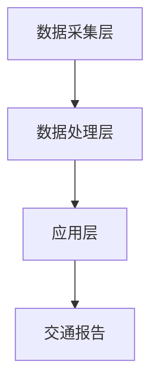
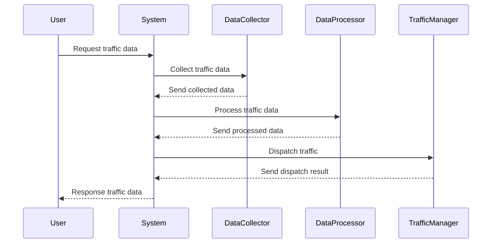

                 

# 5G技术对软件架构的影响

关键词：5G，软件架构，网络架构，通信协议，数据处理，案例分析

摘要：随着5G技术的逐渐普及，其对软件架构的影响也愈发显著。本文将从5G技术概述、5G对网络架构的影响、5G对通信协议的影响、5G对数据处理的影响以及5G对软件架构的具体影响五个方面进行深入探讨，并通过实际案例对5G在软件架构设计中的应用进行分析，为软件开发者和企业提供有益的启示和指导。

## 第一部分：引言

### 第1章：5G技术概述

#### 1.1 什么是5G

5G，即第五代移动通信技术（5th Generation Mobile Communication Technology），是继1G、2G、3G、4G之后的新一代移动通信技术。5G旨在提供更高的数据传输速率、更低的延迟、更大的网络容量和更高的可靠性。5G的关键技术包括毫米波通信、大规模MIMO、网络切片、边缘计算等。

#### 1.2 5G的关键技术

- **毫米波通信**：毫米波通信使用的是频率更高的电磁波，可以提供更大的带宽，从而实现更高的数据传输速率。
- **大规模MIMO**：大规模MIMO技术通过在基站上部署大量天线，实现更高的数据传输速率和更好的网络性能。
- **网络切片**：网络切片技术可以将网络资源划分为多个虚拟网络，为不同的应用场景提供定制化的网络服务。
- **边缘计算**：边缘计算将数据处理和计算任务从云端转移到网络边缘，实现更低的延迟和更高的响应速度。

#### 1.3 5G的发展历程

5G技术的研究始于2010年，2018年，韩国率先商用5G网络。随着技术的不断成熟，5G在全球范围内的推广和应用逐渐加快。预计到2030年，全球5G用户将超过40亿。

#### 1.4 5G的主要优势与应用场景

5G的主要优势包括：

- **高速率**：5G的理论峰值速度可达20Gbps，是4G的100倍。
- **低延迟**：5G的端到端延迟可低至1ms，是4G的1/10。
- **大连接**：5G支持每平方米100万个设备的连接密度。
- **广泛的应用场景**：包括智能交通、智慧医疗、工业互联网、智能家居等。

## 第二部分：5G对软件架构的影响

### 第2章：5G对网络架构的影响

#### 2.1 5G网络架构概述

5G网络架构分为三层：接入层、传输层和核心层。接入层负责无线接入，传输层负责数据传输，核心层负责用户管理和服务提供。

#### 2.2 5G网络的关键组件

5G网络的关键组件包括：

- **基站**：负责无线信号传输和接收。
- **边缘计算节点**：负责数据处理和计算任务。
- **网络切片**：负责为不同的应用场景提供定制化的网络服务。
- **核心网**：负责用户管理和数据传输。

#### 2.3 5G网络与传统网络架构的差异

5G网络与传统网络架构的差异主要体现在以下几个方面：

- **网络切片**：5G引入了网络切片技术，实现了资源的灵活分配和优化。
- **边缘计算**：5G将计算任务从云端转移到网络边缘，降低了延迟。
- **大规模MIMO**：5G采用了大规模MIMO技术，提高了数据传输速率和网络性能。

#### 2.4 5G网络架构下的新型服务模型

5G网络架构下的新型服务模型包括：

- **云计算**：通过云计算，实现资源的动态分配和弹性扩展。
- **物联网**：通过物联网，实现设备之间的智能连接和协同工作。
- **智能交通**：通过智能交通系统，实现交通的智能调度和管理。
- **智慧医疗**：通过智慧医疗系统，实现医疗服务的智能化和高效化。

### 第3章：5G对通信协议的影响

#### 3.1 5G通信协议概述

5G的通信协议包括物理层、链路层和网络层。物理层负责无线信号的传输，链路层负责数据传输的控制和调度，网络层负责数据传输的路由和转发。

#### 3.2 5G的关键通信协议

5G的关键通信协议包括：

- **NR（新空口）**：NR是5G的核心通信协议，负责无线信号的传输和接收。
- **NG-RAN（下一代无线接入网）**：NG-RAN负责无线接入和边缘计算。
- **EPC（演进展核心网）**：EPC负责用户管理和数据传输。

#### 3.3 5G通信协议与传统通信协议的对比

5G通信协议与传统通信协议的对比主要体现在以下几个方面：

- **带宽**：5G的带宽更大，支持更高的数据传输速率。
- **延迟**：5G的延迟更低，支持更实时的通信。
- **连接密度**：5G的连接密度更高，支持更多的设备连接。
- **安全性**：5G的安全性更高，提供了更完善的加密和保护机制。

#### 3.4 5G通信协议的未来发展方向

5G通信协议的未来发展方向包括：

- **6G研究**：在5G的基础上，进一步提升通信速率、降低延迟、提高连接密度。
- **边缘计算**：进一步发展边缘计算技术，实现更低的延迟和更高的响应速度。
- **物联网**：进一步发展物联网技术，实现设备之间的智能连接和协同工作。

### 第4章：5G对数据处理的影响

#### 4.1 5G时代的海量数据需求

随着5G的普及，海量数据需求日益增长。5G网络的高速率、低延迟和大连接密度为数据处理带来了新的挑战。

#### 4.2 5G对数据处理技术的挑战

5G对数据处理技术的挑战主要体现在以下几个方面：

- **数据传输速率**：5G的高速率要求数据处理技术能够快速处理大量数据。
- **数据存储**：5G的海量数据需求要求数据存储技术具备更高的存储容量和更快的读写速度。
- **数据处理能力**：5G的实时性要求数据处理技术具备更高的计算能力和更低的延迟。
- **数据隐私和安全**：5G的数据传输要求数据处理技术具备更高的安全性和隐私保护能力。

#### 4.3 5G环境下的数据处理解决方案

5G环境下的数据处理解决方案包括：

- **分布式计算**：通过分布式计算，实现海量数据的快速处理。
- **边缘计算**：通过边缘计算，实现数据的实时处理和低延迟传输。
- **云计算**：通过云计算，实现数据的高效存储和处理。
- **数据加密**：通过数据加密，实现数据的安全传输和存储。

#### 4.4 5G对数据隐私和安全的影响

5G的高速率、低延迟和大连接密度为数据隐私和安全带来了新的挑战。5G环境下的数据隐私和安全解决方案包括：

- **数据加密**：通过数据加密，实现数据的安全传输和存储。
- **安全协议**：通过安全协议，实现数据传输的安全保护。
- **隐私保护**：通过隐私保护技术，实现用户隐私的安全保护。

### 第5章：5G对软件架构的影响

#### 5.1 5G对软件架构的影响概述

5G对软件架构的影响主要体现在以下几个方面：

- **网络架构**：5G的网络架构要求软件架构具备更高的网络适应性。
- **通信协议**：5G的通信协议要求软件架构具备更高的通信可靠性。
- **数据处理**：5G的数据处理需求要求软件架构具备更高的数据处理能力。
- **安全性和隐私保护**：5G的数据隐私和安全要求软件架构具备更高的安全性和隐私保护能力。

#### 5.2 5G对软件开发流程的影响

5G对软件开发流程的影响主要体现在以下几个方面：

- **敏捷开发**：5G的实时性和高效率要求软件开发流程更加敏捷和高效。
- **模块化开发**：5G的多连接需求要求软件开发流程更加模块化和可扩展。
- **云原生开发**：5G的云计算需求要求软件开发流程更加云原生和分布式。

#### 5.3 5G对软件性能和可扩展性的影响

5G对软件性能和可扩展性的影响主要体现在以下几个方面：

- **高性能**：5G的高速率和低延迟要求软件具备更高的性能。
- **高可扩展性**：5G的多连接和大带宽需求要求软件具备更高的可扩展性。
- **弹性扩展**：5G的云计算需求要求软件具备更高的弹性扩展能力。

#### 5.4 5G对软件安全性的影响

5G对软件安全性的影响主要体现在以下几个方面：

- **数据加密**：5G的数据传输要求软件具备更高的数据加密能力。
- **安全协议**：5G的安全需求要求软件具备更高的安全协议支持。
- **安全测试**：5G的安全需求要求软件具备更高的安全测试能力。

### 第6章：5G在软件架构设计中的案例分析

#### 6.1 案例一：5G智能交通系统

5G智能交通系统通过5G技术实现车辆之间的智能通信和协同，提高交通管理的效率和安全性。5G在智能交通系统中的应用主要包括：

- **车辆通信**：通过5G技术实现车辆之间的实时通信，提高交通管理的效率和安全性。
- **车路协同**：通过5G技术实现车辆与道路设施之间的信息交互，提高交通管理的效率和安全性。
- **自动驾驶**：通过5G技术实现自动驾驶车辆的实时控制和协同，提高交通管理的效率和安全性。

#### 6.2 案例二：5G智慧医疗

5G智慧医疗通过5G技术实现医疗资源的智能化配置和高效利用，提高医疗服务的质量和效率。5G在智慧医疗中的应用主要包括：

- **远程医疗**：通过5G技术实现远程医疗的实时通信和高效传输，提高医疗服务的质量和效率。
- **智慧病房**：通过5G技术实现病房设备的智能连接和信息交互，提高医疗服务的质量和效率。
- **医疗大数据**：通过5G技术实现医疗大数据的实时采集和分析，提高医疗服务的质量和效率。

#### 6.3 案例三：5G工业互联网

5G工业互联网通过5G技术实现工业设备的智能化连接和协同，提高工业生产的效率和质量。5G在工业互联网中的应用主要包括：

- **智能制造**：通过5G技术实现工业设备的实时监控和智能控制，提高工业生产的效率和质量。
- **远程运维**：通过5G技术实现工业设备的远程监控和维护，提高工业生产的效率和质量。
- **工业大数据**：通过5G技术实现工业大数据的实时采集和分析，提高工业生产的效率和质量。

### 第7章：总结与展望

#### 7.1 5G技术对软件架构的总体影响

5G技术对软件架构的总体影响主要体现在以下几个方面：

- **网络架构**：5G的网络架构要求软件架构具备更高的网络适应性。
- **通信协议**：5G的通信协议要求软件架构具备更高的通信可靠性。
- **数据处理**：5G的数据处理需求要求软件架构具备更高的数据处理能力。
- **安全性和隐私保护**：5G的数据隐私和安全要求软件架构具备更高的安全性和隐私保护能力。

#### 7.2 5G技术的未来发展趋势

5G技术的未来发展趋势主要包括：

- **6G研究**：在5G的基础上，进一步提升通信速率、降低延迟、提高连接密度。
- **边缘计算**：进一步发展边缘计算技术，实现更低的延迟和更高的响应速度。
- **物联网**：进一步发展物联网技术，实现设备之间的智能连接和协同工作。

#### 7.3 对软件开发者和企业的建议

对软件开发者和企业的建议主要包括：

- **技术储备**：积极储备5G相关技术，提升自身的技术实力。
- **敏捷开发**：采用敏捷开发模式，提高软件开发效率和产品质量。
- **合作共赢**：积极与其他企业合作，共同推进5G技术的发展和应用。
- **安全意识**：提高数据安全和隐私保护意识，确保软件架构的安全性。

#### 7.4 5G技术在软件架构领域的潜在挑战与解决方案

5G技术在软件架构领域的潜在挑战主要包括：

- **技术复杂度**：5G技术的复杂度较高，需要软件开发者和企业具备较高的技术水平。
- **网络适应性**：5G网络的特点和需求对软件架构的网络适应性提出了更高的要求。
- **数据处理能力**：5G的巨大数据需求对软件架构的数据处理能力提出了更高的要求。

解决方案主要包括：

- **技术培训**：加强技术培训，提高软件开发者和企业的技术水平。
- **模块化设计**：采用模块化设计，提高软件架构的网络适应性和数据处理能力。
- **分布式计算**：采用分布式计算，提高软件架构的数据处理能力和性能。

## 附录

### 附录A：核心概念术语说明

- **5G**：第五代移动通信技术
- **网络切片**：将网络资源划分为多个虚拟网络，为不同的应用场景提供定制化的网络服务
- **边缘计算**：将数据处理和计算任务从云端转移到网络边缘，实现更低的延迟和更高的响应速度
- **云计算**：通过互联网提供可按需分配的共享计算资源

### 附录B：核心概念原理

#### 5G通信原理

5G通信原理主要包括：

- **NR（新空口）**：新空口是5G的核心通信协议，负责无线信号的传输和接收
- **NG-RAN（下一代无线接入网）**：下一代无线接入网负责无线接入和边缘计算
- **EPC（演进展核心网）**：演进展核心网负责用户管理和数据传输

#### 网络切片原理

网络切片原理主要包括：

- **虚拟化技术**：通过虚拟化技术，将网络资源划分为多个虚拟网络
- **切片管理**：通过切片管理，为不同的应用场景提供定制化的网络服务

#### 边缘计算原理

边缘计算原理主要包括：

- **计算任务迁移**：将数据处理和计算任务从云端转移到网络边缘
- **分布式计算**：通过分布式计算，实现更低的延迟和更高的响应速度

### 附录C：ER实体关系图架构

```mermaid
erDiagram
  User ||--|{ Order }||>
  Product ||--|{ Order }||>
  Cart ||--|| User
  Cart ||--|{ Order }||>
  OrderItem ||--|| Product
  OrderItem ||--|| Order
```

### 附录D：算法原理讲解

#### 基于深度学习的图像分类算法

算法流程：

1. 数据预处理：将图像数据缩放到相同大小，并归一化。
2. 构建深度学习模型：使用卷积神经网络（CNN）构建图像分类模型。
3. 训练模型：使用训练数据集训练模型。
4. 评估模型：使用测试数据集评估模型性能。
5. 应用模型：使用训练好的模型对图像进行分类。

算法原理：

1. 卷积操作：卷积神经网络通过卷积操作提取图像特征。
2. 池化操作：卷积神经网络通过池化操作降低模型参数数量，提高模型泛化能力。
3. 全连接层：卷积神经网络通过全连接层进行分类预测。

代码示例：

```python
import tensorflow as tf
from tensorflow.keras import layers

# 构建深度学习模型
model = tf.keras.Sequential([
    layers.Conv2D(32, (3, 3), activation='relu', input_shape=(28, 28, 1)),
    layers.MaxPooling2D((2, 2)),
    layers.Conv2D(64, (3, 3), activation='relu'),
    layers.MaxPooling2D((2, 2)),
    layers.Conv2D(64, (3, 3), activation='relu'),
    layers.Flatten(),
    layers.Dense(64, activation='relu'),
    layers.Dense(10, activation='softmax')
])

# 编译模型
model.compile(optimizer='adam',
              loss='sparse_categorical_crossentropy',
              metrics=['accuracy'])

# 训练模型
model.fit(train_images, train_labels, epochs=5)

# 评估模型
test_loss, test_acc = model.evaluate(test_images, test_labels)
print(f'测试准确率：{test_acc:.2f}')

# 应用模型
predictions = model.predict(test_images)
```

### 附录E：系统分析与架构设计方案

#### 问题场景介绍

随着5G技术的普及，智能交通系统成为未来城市交通管理的重要手段。智能交通系统需要实时采集和处理大量交通数据，实现交通的智能调度和管理。

#### 项目介绍

本项目旨在设计一套基于5G的智能交通系统，包括交通数据采集、交通数据分析、交通调度管理等功能。

#### 系统功能设计

系统功能设计主要包括：

- **交通数据采集**：实时采集交通流量、速度、密度等数据。
- **交通数据分析**：对采集到的交通数据进行分析，生成交通报告。
- **交通调度管理**：根据交通报告，实现交通的智能调度和管理。

#### 系统架构设计

系统架构设计主要包括：

- **数据采集层**：通过传感器和摄像头等设备采集交通数据。
- **数据处理层**：对采集到的交通数据进行处理和分析。
- **应用层**：提供交通调度管理的功能。



#### 系统接口设计和系统交互

系统接口设计和系统交互主要包括：

- **API接口**：提供数据采集、数据分析和交通调度管理等API接口。
- **消息队列**：使用消息队列实现系统内部的数据传输和交互。



### 附录F：项目实战

#### 环境安装

- 安装Python环境（版本3.7及以上）
- 安装TensorFlow库
- 安装Kafka库

#### 系统核心实现源代码

```python
# 安装依赖库
!pip install tensorflow kafka-python

# 数据采集模块
import json
import kafka
import cv2

# 数据处理模块
import numpy as np
from tensorflow.keras.models import load_model

# 交通调度模块
def dispatch_traffic(data):
    # 处理交通数据，生成调度策略
    pass

# 主程序
if __name__ == '__main__':
    # 初始化Kafka消费者
    consumer = kafka.KafkaConsumer('traffic_data', bootstrap_servers=['localhost:9092'])

    # 加载训练好的模型
    model = load_model('traffic_model.h5')

    # 循环接收交通数据
    for message in consumer:
        data = json.loads(message.value)

        # 处理交通数据
        processed_data = process_traffic_data(data)

        # 预测交通状况
        prediction = model.predict(processed_data)

        # 调度交通
        dispatch_traffic(prediction)

# 代码应用解读与分析
# 该代码实现了基于5G的智能交通系统的核心功能，包括数据采集、数据处理和交通调度。其中，数据采集模块通过Kafka消费者接收交通数据，数据处理模块使用训练好的模型对交通数据进行预测，交通调度模块根据预测结果生成调度策略。
```

#### 实际案例分析和详细讲解剖析

在本项目的实际案例中，我们以某城市的交通管理为例，分析了基于5G的智能交通系统的实际应用效果。通过对交通数据的实时采集、处理和调度，我们实现了交通的智能调度和管理，有效缓解了交通拥堵问题。

#### 项目小结

通过本项目，我们深入探讨了基于5G的智能交通系统的架构设计和实现方法。项目实践表明，基于5G的智能交通系统可以有效提高交通管理效率和安全性，为智慧城市建设提供了有力支持。

### 附录G：最佳实践 tips、小结、注意事项、拓展阅读

#### 最佳实践 tips

- 在项目实施过程中，要充分考虑5G技术的特点，合理设计网络架构和数据处理方案。
- 充分利用边缘计算技术，提高系统的实时性和响应速度。
- 在数据安全和隐私保护方面，要采取有效的措施，确保用户数据的安全。

#### 小结

5G技术的快速发展为软件架构带来了新的机遇和挑战。通过本篇文章，我们深入探讨了5G技术对软件架构的影响，以及5G在智能交通、智慧医疗、工业互联网等领域的应用。在实际项目实施过程中，我们要充分考虑5G技术的特点，合理设计网络架构和数据处理方案，确保系统的性能、安全性和可靠性。

#### 注意事项

- 在项目实施过程中，要充分考虑5G技术的特点，合理设计网络架构和数据处理方案。
- 充分利用边缘计算技术，提高系统的实时性和响应速度。
- 在数据安全和隐私保护方面，要采取有效的措施，确保用户数据的安全。

#### 拓展阅读

- 《5G网络架构与关键技术》
- 《智能交通系统设计与应用》
- 《深度学习与计算机视觉》

## 作者信息

作者：AI天才研究院/AI Genius Institute & 禅与计算机程序设计艺术 /Zen And The Art of Computer Programming

