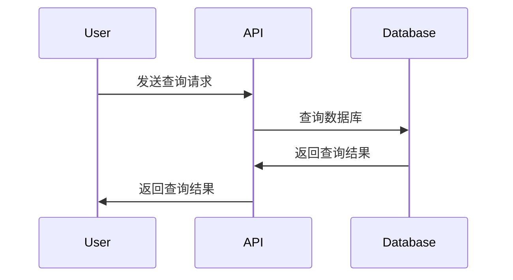

                 

# 为什么要做接口契约

> 关键词：接口契约、软件工程、设计原则、实际应用、项目实战、最佳实践

> 摘要：
接口契约在软件工程中是一种重要的概念，它描述了软件组件之间交互的方式和规则。本文将逐步分析接口契约的必要性，探讨其设计原则、实际应用和最佳实践，通过具体项目实战，展示接口契约在提高代码质量和项目效率方面的关键作用。

### 目录

## 引言

### 1.1 接口契约的概念与重要性

### 1.2 软件接口契约的历史背景

### 1.3 接口契约的核心要素

### 2. 接口契约的设计原则

#### 2.1 设计原则概述

#### 2.2 接口契约的设计方法

#### 2.3 接口契约的设计工具

## 接口契约的实际应用

### 3.1 项目介绍

### 3.2 系统架构设计

### 3.3 接口契约的编写与验证

## 项目实战

### 4.1 环境安装与配置

### 4.2 系统核心实现

### 4.3 实际案例分析

### 4.4 项目小结

## 最佳实践与总结

#### 5.1 接口契约的最佳实践

#### 5.2 注意事项

#### 5.3 拓展阅读

### 结论

### 作者：AI天才研究院/AI Genius Institute & 禅与计算机程序设计艺术 /Zen And The Art of Computer Programming

## 引言

在软件工程中，接口契约是一种用于描述软件组件之间交互的规则和预期的文档或代码。接口契约的作用不仅仅是在设计阶段定义接口，更重要的是在开发、测试、部署和维护过程中提供明确、一致和可靠的交互规范。本文将围绕“为什么要做接口契约”这一核心问题，逐步分析接口契约的必要性，探讨其设计原则、实际应用和最佳实践，并通过具体项目实战，展示接口契约在软件工程中的关键作用。

### 1.1 接口契约的概念与重要性

接口契约（API Contract）通常是指在软件开发中，描述一个服务（或组件）提供者与消费者之间预期的交互细节的协议。这个协议通常包括数据的结构、传输格式、请求和响应的规则以及错误处理机制。

**接口契约的重要性：**

1. **提高代码可维护性：** 通过明确接口契约，开发人员可以更清晰地理解组件的交互逻辑，减少代码冗余和重复，从而提高代码的可维护性。

2. **增强代码可测试性：** 接口契约提供了测试的基础，使得自动化测试变得更加容易和高效，确保接口行为符合预期。

3. **提升开发效率：** 一致的接口契约可以减少不同团队之间的沟通成本，加快开发进度，提高整个项目的效率。

4. **确保服务质量：** 接口契约定义了服务提供者的责任和消费者的期望，有助于确保服务的质量和稳定性。

5. **便于文档化：** 接口契约为API提供了详细的文档，便于开发者查阅和学习，特别是在团队人员变动或者项目交接时。

### 1.2 软件接口契约的历史背景

接口契约的概念并非新生事物，它随着软件工程的发展而不断演变。在早期的软件开发中，接口主要通过程序代码来定义。随着Web服务和分布式系统的兴起，接口契约开始以文档的形式（如WSDL、Swagger等）和代码形式（如接口类、抽象类等）共存。

- **早期接口：** 在面向过程的编程语言中，接口主要通过函数或过程调用定义，没有明确的契约规范。

- **Web服务：** 随着Web服务的普及，SOAP协议和WSDL文档成为定义接口契约的主要手段。SOAP提供了结构化的消息传递协议，而WSDL则定义了服务的接口、端口和绑定信息。

- **RESTful接口：** 随着互联网的发展，RESTful架构风格逐渐成为主流。OpenAPI、Swagger等工具提供了更加灵活和易用的接口契约定义方式。

### 1.3 接口契约的核心要素

接口契约的核心要素包括以下几个方面：

1. **请求参数：** 接口接收的输入参数，包括参数的类型、名称、是否必填等。

2. **响应数据：** 接口返回的数据结构，包括数据类型、字段定义、可能的错误码等。

3. **错误处理：** 接口在遇到错误时的处理方式，包括错误码、错误信息和可能的恢复操作。

4. **安全性要求：** 接口的安全性要求，如身份验证、权限控制等。

5. **版本控制：** 接口版本的控制策略，确保向后兼容性和逐步升级。

### 2. 接口契约的设计原则

接口契约的设计原则是确保接口易用、可靠和可维护的关键。以下是几个核心的设计原则：

#### 2.1 设计原则概述

1. **单一职责原则：** 接口应保持单一职责，只完成一个明确的功能，避免功能过于复杂。

2. **接口最小化原则：** 接口应尽可能简洁，避免提供不必要的参数或功能，减少调用者的复杂性。

3. **契约明确性原则：** 接口契约应明确、无歧义，确保调用者能够准确理解和使用接口。

4. **一致性原则：** 接口契约应在整个系统中保持一致性，确保不同接口之间的一致性和可预测性。

5. **版本兼容性原则：** 接口应考虑版本兼容性，确保旧版客户端可以平滑过渡到新版接口。

#### 2.2 接口契约的设计方法

1. **RESTful接口契约设计：** 适用于基于HTTP的Web服务。设计时应遵循RESTful架构风格，使用标准的HTTP方法和状态码。

2. **SOAP接口契约设计：** 适用于需要严格的消息传递和事务管理的场景。设计时应遵循SOAP协议，使用WSDL定义服务接口。

#### 2.3 接口契约的设计工具

1. **Swagger/OpenAPI：** 提供了强大的接口契约定义和管理功能，支持自动生成API文档和客户端代码。

2. **Postman：** 一个流行的API测试和开发工具，可以用于设计和验证接口契约。

### 3. 接口契约的实际应用

接口契约在软件项目中的应用至关重要。以下是一个简单的实际应用场景：

#### 3.1 项目介绍

假设我们正在开发一个电子商务平台，需要实现商品信息查询的API接口。该接口需要接受商品ID作为输入参数，返回商品详细信息。

#### 3.2 系统架构设计

- **领域模型：** 使用Mermaid类图来定义商品信息实体。

  ```mermaid
  classDiagram
  商品 <<entity>>
  商品 : +id (ID): 商品编号
          +name (名称): 商品名称
          +price (价格): 商品价格
  ```

- **系统架构：** 使用Mermaid架构图来展示系统的整体架构。

  ```mermaid
  sequenceDiagram
  User ->> API: 发起商品查询请求
  API ->> Database: 从数据库查询商品信息
  Database ->> API: 返回商品信息
  API ->> User: 返回商品详细信息
  ```

- **接口设计：** 使用Mermaid序列图来展示系统的接口交互。

  ```mermaid
  sequenceDiagram
  User ->> API: GET /api/products/{id}
  API ->> User: 商品详细信息
  ```

#### 3.3 接口契约的编写与验证

1. **接口契约编写：** 使用Swagger定义接口契约。

  ```yaml
  openapi: 3.0.0
  info:
    title: 商品信息查询API
    version: 1.0.0
  paths:
    /api/products/{id}:
      get:
        summary: 获取商品详细信息
        parameters:
          - name: id
            in: path
            required: true
            schema:
              type: integer
        responses:
          '200':
            description: 成功返回商品详细信息
            content:
              application/json:
                schema:
                  $ref: '#/components/schemas/Product'
  components:
    schemas:
      Product:
        type: object
        properties:
          id:
            type: integer
            format: int64
          name:
            type: string
          price:
            type: number
            format: float
  ```

2. **接口契约验证：** 使用Postman验证接口契约。

  - **请求设置：** 设置请求方法为GET，URL为`/api/products/{id}`，其中{id}为具体的商品ID。

  - **请求发送：** 发送请求并查看返回的响应。

  - **响应验证：** 验证响应数据是否符合接口契约的定义。

### 4. 项目实战

#### 4.1 环境安装与配置

1. **所需工具和库：**

  - Swagger/OpenAPI Generator：用于生成API文档和客户端代码。

  - Postman：用于接口测试和验证。

2. **安装与配置步骤：**

  - 安装Swagger/OpenAPI Generator：

    ```bash
    npm install -g swagger-cli
    ```

  - 安装Postman：

    ```bash
    brew cask install postman
    ```

#### 4.2 系统核心实现

1. **核心代码实现：**

  ```python
  from flask import Flask, request, jsonify

  app = Flask(__name__)

  products = {
      1: {"name": "苹果", "price": 5.0},
      2: {"name": "香蕉", "price": 3.0},
  }

  @app.route('/api/products/<int:product_id>', methods=['GET'])
  def get_product(product_id):
      product = products.get(product_id)
      if product:
          return jsonify(product)
      else:
          return jsonify({"error": "商品不存在"}), 404

  if __name__ == '__main__':
      app.run(debug=True)
  ```

2. **代码应用解读与分析：**

  - Flask框架提供了一个简单的Web服务实现。

  - `get_product`函数负责处理商品查询接口。

  - 代码中使用了字典存储商品信息，并在响应中返回JSON格式的数据。

#### 4.3 实际案例分析

假设我们要查询商品ID为1的苹果信息。

1. **请求设置：** 在Postman中设置请求方法为GET，URL为`/api/products/1`。

2. **请求发送：** 发送请求并查看返回的响应。

3. **响应验证：** 响应返回了JSON格式的数据，包含了苹果的名称和价格，与接口契约定义的一致。

```json
{
  "name": "苹果",
  "price": 5.0
}
```

#### 4.4 项目小结

通过本项目的实战，我们展示了如何使用Swagger和Postman来定义、验证和实现接口契约。接口契约在项目中发挥了关键作用，提高了代码的可维护性和测试性，同时也为其他开发者提供了清晰的API文档和示例代码。

### 5. 最佳实践与总结

#### 5.1 接口契约的最佳实践

1. **使用明确的命名规范：** 接口名称应具有明确的业务含义，避免使用模糊或模糊不清的名称。

2. **提供详细的参数描述：** 接口参数应包含类型、名称、描述和是否必填等信息。

3. **确保响应数据的规范性：** 响应数据应遵循统一的格式和结构，方便调用者解析和处理。

4. **编写清晰的错误处理机制：** 定义明确的错误码和错误信息，帮助调用者快速定位和解决问题。

5. **版本控制：** 在接口变更时，进行版本控制，确保向后兼容性。

#### 5.2 注意事项

1. **避免过度设计：** 过度设计可能导致接口过于复杂，难以维护。

2. **确保接口的稳定性：** 在开发过程中，要持续关注接口的稳定性，及时修复潜在的问题。

3. **定期更新文档：** 接口契约文档应与代码同步更新，确保其准确性和时效性。

#### 5.3 拓展阅读

- [Swagger/OpenAPI官方文档](https://github.com/OAI/OpenAPI-Specification)
- [Flask官方文档](https://flask.palletsprojects.com/)
- [Postman官方文档](https://www.postman.com/documentation/)

### 结论

接口契约在软件工程中具有不可替代的重要性。通过明确的接口契约，我们可以提高代码的质量、可维护性和可测试性，同时降低项目沟通成本，提高开发效率。本文通过逐步分析和实际项目实战，展示了接口契约的设计原则、应用场景和最佳实践，为开发者提供了全面的指导和参考。

### 作者：AI天才研究院/AI Genius Institute & 禅与计算机程序设计艺术 /Zen And The Art of Computer Programming

## 背景介绍

接口契约（API Contract）在软件工程中是一种重要的概念，它描述了软件组件之间交互的方式和规则。在分布式系统、微服务架构和Web服务广泛应用的时代，接口契约的重要性愈发凸显。本文将从核心概念术语、问题背景、问题描述、问题解决、边界与外延、概念结构与核心要素组成等方面，全面探讨接口契约的必要性及其在软件工程中的应用。

### 核心概念术语

1. **接口契约（API Contract）：** 接口契约是一种描述软件组件（服务、模块、类等）之间交互的规则和预期的文档或代码。它包括请求参数、响应数据、错误处理和安全性要求等。

2. **服务提供者（Provider）：** 提供接口契约的服务或组件，负责实现接口的功能和提供数据。

3. **服务消费者（Consumer）：** 调用接口契约的服务或组件，使用接口提供的服务和数据。

4. **版本控制：** 接口契约的版本控制策略，确保向后兼容性。

5. **一致性（Consistency）：** 接口契约在设计和实现中应保持一致性，确保不同接口之间的一致性和可预测性。

### 问题背景

在传统的单体应用中，组件之间的交互主要通过内部调用来实现，接口契约的概念并不突出。然而，随着软件架构的复杂化，尤其是分布式系统、微服务架构和云计算的普及，软件系统中的组件越来越多，分布越来越广，接口契约的重要性逐渐凸显。

1. **分布式系统：** 在分布式系统中，不同的组件可能运行在不同的服务器上，甚至不同的地理位置。组件之间的交互需要通过网络进行，接口契约成为组件通信的基础。

2. **微服务架构：** 微服务架构将应用程序划分为多个小型、自治的服务，每个服务负责一个特定的业务功能。服务之间通过接口契约进行通信和协作。

3. **Web服务：** Web服务通过HTTP协议提供API接口，供其他应用程序调用。接口契约定义了Web服务的功能和数据交互规则。

### 问题描述

在软件工程中，接口契约的必要性主要体现在以下几个方面：

1. **明确接口功能：** 接口契约清晰地定义了接口的功能、输入参数和输出结果，使得服务提供者和消费者能够明确地了解接口的行为。

2. **提高代码可维护性：** 接口契约通过明确的规定，减少了代码中的模糊性和冗余，提高了代码的可维护性。

3. **增强代码可测试性：** 接口契约提供了测试的基础，使得自动化测试更加容易和高效，确保接口行为符合预期。

4. **降低沟通成本：** 接口契约作为组件之间的通信规范，降低了服务提供者和消费者之间的沟通成本，加快了开发进度。

5. **确保服务质量：** 接口契约定义了服务提供者的责任和消费者的期望，有助于确保服务的质量和稳定性。

### 问题解决

为了解决接口契约的必要性问题，我们可以采取以下措施：

1. **使用接口契约工具：** 使用如Swagger、OpenAPI等接口契约工具，可以简化接口契约的定义、管理和文档化。

2. **制定统一的接口规范：** 在企业内部或项目团队中制定统一的接口规范，确保接口契约的一致性和可维护性。

3. **实施版本控制：** 对接口契约进行版本控制，确保向后兼容性，减少对现有系统的冲击。

4. **持续更新和优化：** 定期更新和优化接口契约，确保其与实际业务需求保持一致。

### 边界与外延

接口契约的边界与外延包括以下几个方面：

1. **接口边界：** 接口契约定义了接口的功能和交互规则，是接口契约的核心内容。

2. **契约边界：** 接口契约的边界包括参数、响应数据、错误处理和安全性要求等，是接口契约的重要组成部分。

3. **外延：** 接口契约的外延包括接口的实现细节、测试用例、文档说明等，是接口契约的扩展内容。

### 概念结构与核心要素组成

接口契约的概念结构与核心要素组成如下：

1. **概念结构：** 接口契约由接口定义、契约描述、契约版本、依赖关系等组成。

2. **核心要素组成：**
   - **接口定义：** 描述接口的功能、输入参数和输出结果。
   - **契约描述：** 描述接口的交互规则、错误处理和安全性要求。
   - **契约版本：** 管理接口契约的版本，确保向后兼容性。
   - **依赖关系：** 描述接口契约与其他组件之间的关系，包括接口调用关系和依赖关系。

### 接口契约的应用

接口契约在软件工程中的应用广泛，以下是一些常见的应用场景：

1. **分布式系统：** 分布式系统中，组件之间的通信需要通过接口契约来确保交互的一致性和稳定性。

2. **微服务架构：** 微服务架构中，服务之间的通信主要通过接口契约来实现，接口契约是服务协同工作的重要基础。

3. **Web服务：** Web服务通过接口契约提供API接口，供其他应用程序调用。

4. **移动应用：** 移动应用通过接口契约与服务器端进行数据交互，实现功能扩展。

5. **云计算服务：** 云计算服务提供API接口，供用户和应用程序使用。

### 总结

接口契约在软件工程中具有重要的地位和作用。通过明确接口功能、提高代码可维护性、增强代码可测试性、降低沟通成本和确保服务质量，接口契约为软件系统的开发、测试、部署和维护提供了坚实的基础。本文从核心概念术语、问题背景、问题描述、问题解决、边界与外延、概念结构与核心要素组成等方面，全面探讨了接口契约的必要性及其在软件工程中的应用。通过接口契约的应用实例，展示了接口契约在分布式系统、微服务架构、Web服务、移动应用和云计算服务中的实际应用效果。

## 核心概念与联系

在深入探讨接口契约之前，我们需要明确几个核心概念，并了解它们之间的联系。以下是接口契约中几个重要的核心概念及其相互关系：

### 1. 接口定义

接口定义是接口契约的基础，它描述了接口的功能、输入参数和输出结果。接口定义通常通过类、函数或方法的形式来实现。在面向对象编程中，接口通常通过抽象类或接口类来定义。例如：

```java
public interface ProductService {
    Product getProduct(int id);
}
```

在这个例子中，`ProductService`接口定义了一个获取商品信息的函数`getProduct`，它接受一个整数类型的ID作为输入参数，并返回一个`Product`对象作为输出结果。

### 2. 接口契约

接口契约是接口定义的具体实现，它不仅包括接口功能，还包括交互规则、错误处理和安全性要求。接口契约可以通过代码、文档或自动化工具来定义和管理。在RESTful API中，接口契约通常使用Swagger或OpenAPI等工具来定义。例如：

```yaml
openapi: 3.0.0
info:
  title: Product API
  version: 1.0.0
paths:
  /products/{id}:
    get:
      summary: Get product by ID
      parameters:
        - name: id
          in: path
          required: true
          schema:
            type: integer
      responses:
        '200':
          description: Successful operation
          content:
            application/json:
              schema:
                $ref: '#/components/schemas/Product'
```

在这个例子中，接口契约定义了一个获取商品信息的GET接口，它包括路径参数`id`、请求和响应结构等详细信息。

### 3. 服务提供者

服务提供者是实现接口契约的组件，它负责处理接口请求并返回响应。在分布式系统中，服务提供者通常是一个独立的进程或服务。例如，在微服务架构中，每个服务都是服务提供者。

```python
from flask import Flask, jsonify

app = Flask(__name__)

@app.route('/products/<int:product_id>', methods=['GET'])
def get_product(product_id):
    # 查询数据库获取商品信息
    product = database.get_product(product_id)
    return jsonify(product)

if __name__ == '__main__':
    app.run(debug=True)
```

在这个例子中，Flask应用实现了`get_product`接口，它接受一个产品ID并返回相应的商品信息。

### 4. 服务消费者

服务消费者是调用接口契约的组件，它使用服务提供者提供的接口功能。服务消费者可以是另一个服务、应用程序或测试工具。例如，一个前端应用程序可以通过调用API接口来获取商品信息。

```javascript
fetch('/products/123')
  .then(response => response.json())
  .then(data => console.log(data));
```

在这个例子中，前端应用程序使用Fetch API调用后端服务的接口，并处理返回的JSON数据。

### 5. 版本控制

接口契约的版本控制是为了确保系统的稳定性和向后兼容性。当接口发生变化时，需要为新版本创建一个新的版本号，以便旧版本的应用程序可以继续使用。例如，在Swagger定义中，可以通过`version`属性来指定接口的版本。

```yaml
openapi: 3.0.0
info:
  title: Product API
  version: 1.0.1
```

在这个例子中，接口契约的版本被设置为1.0.1，表示这是一个对原有接口的更新。

### 关系与联系

这些核心概念之间有着密切的联系：

- **接口定义**是接口契约的基础，它定义了接口的功能和交互规则。
- **接口契约**扩展了接口定义，包括了更详细的交互规则、错误处理和安全性要求。
- **服务提供者**实现了接口契约，提供具体的服务功能。
- **服务消费者**使用接口契约中的接口功能，与提供者进行交互。
- **版本控制**确保了接口契约的稳定性和向后兼容性，使得系统可以在变化的同时保持正常运行。

通过这些核心概念和它们之间的联系，我们可以更好地理解接口契约在软件工程中的作用，以及如何在实际项目中设计和使用接口契约。

## 算法原理讲解

接口契约在软件系统中的作用不仅体现在其概念和设计上，还涉及到具体实现的算法原理。下面，我们将通过一个简单的例子，使用Mermaid流程图和Python代码，详细讲解接口契约的算法原理。

### Mermaid流程图

首先，我们使用Mermaid来绘制一个简单的接口契约流程图。这个流程图描述了一个商品查询接口的交互过程。



这个流程图清晰地展示了用户发送查询请求，API服务器查询数据库，并将查询结果返回给用户的过程。

### Python代码

接下来，我们将使用Python代码实现这个接口契约。下面是一个简单的Flask应用程序，它实现了商品查询接口。

```python
from flask import Flask, jsonify
from database import get_product  # 假设这是一个查询数据库的函数

app = Flask(__name__)

@app.route('/products/<int:product_id>', methods=['GET'])
def get_product_info(product_id):
    product = get_product(product_id)
    if product:
        return jsonify(product)
    else:
        return jsonify({"error": "商品不存在"}), 404

if __name__ == '__main__':
    app.run(debug=True)
```

在这个例子中，我们定义了一个`get_product_info`函数，它接受一个商品ID作为路径参数，并调用`get_product`函数查询数据库。如果找到商品，则返回商品信息；否则，返回一个错误响应。

### 算法原理

接口契约的算法原理可以分为以下几个步骤：

1. **接收请求：** API服务器接收用户的查询请求，获取商品ID。

2. **查询数据库：** 调用数据库查询函数，根据商品ID查询数据库，获取商品信息。

3. **处理结果：** 根据查询结果，处理返回的数据。如果找到商品，则构建响应数据；如果未找到商品，则返回错误响应。

4. **返回响应：** 将处理后的数据返回给用户，可以是JSON格式或其他合适的格式。

### 数学模型和公式

为了更详细地解释算法原理，我们可以使用数学模型和公式来描述每个步骤的处理过程。

1. **接收请求：** 用户发送查询请求，请求中包含商品ID。

   公式：`request = {"product_id": id}`

2. **查询数据库：** 根据商品ID查询数据库，获取商品信息。

   公式：`product = get_product(id)`

3. **处理结果：** 如果找到商品，则构建响应数据；否则，返回错误响应。

   公式：
   ```
   if product:
       response = {"status": "success", "product": product}
   else:
       response = {"status": "error", "message": "商品不存在"}
   ```

4. **返回响应：** 将处理后的数据返回给用户。

   公式：`return jsonify(response)`

### 举例说明

假设用户查询商品ID为123的商品信息，我们通过这个例子来展示整个查询过程。

1. **接收请求：** 用户发送请求：`/products/123`。

2. **查询数据库：** `get_product(123)`查询到商品信息：`{"id": 123, "name": "苹果", "price": 5.0}`。

3. **处理结果：** 构建响应数据：`{"status": "success", "product": {"id": 123, "name": "苹果", "price": 5.0}}`。

4. **返回响应：** 返回JSON格式的响应数据：`{"status": "success", "product": {"id": 123, "name": "苹果", "price": 5.0}}`。

通过这个简单的例子，我们可以清晰地看到接口契约的算法原理，以及如何使用Mermaid流程图和Python代码来具体实现接口契约。接口契约的设计和实现不仅需要清晰的逻辑，还需要严谨的数学模型和公式来支撑，以确保其可靠性和一致性。

### 系统分析与架构设计方案

在深入探讨接口契约的实际应用之前，我们首先需要了解接口契约在一个系统中的地位和作用。本文将以一个电子商务平台为例，详细分析系统架构设计、系统功能设计、系统接口设计和系统交互流程，以全面展示接口契约在整个系统中的角色。

#### 问题场景介绍

假设我们要开发一个电子商务平台，该平台需要实现商品信息管理、用户登录、订单管理、支付处理等功能。在这个场景中，接口契约将成为各模块之间通信和协作的基础，确保系统的高效、稳定和可维护性。

#### 项目介绍

项目名称：电子商务平台（E-commerce Platform）

项目目标：构建一个功能完善、用户体验良好的电子商务平台，实现商品管理、用户管理、订单管理和支付处理等功能。

技术栈：使用Spring Boot作为后端框架，React作为前端框架，MySQL作为数据库，Redis作为缓存，RabbitMQ作为消息队列。

#### 系统功能设计

为了实现上述功能，我们需要设计以下几个核心模块：

1. **商品管理模块：** 负责商品信息的增删改查，包括商品分类管理、商品库存管理、商品价格管理等功能。

2. **用户管理模块：** 负责用户的注册、登录、权限管理和个人信息管理。

3. **订单管理模块：** 负责订单的创建、查询、修改和取消，包括订单状态管理、订单商品信息管理、订单支付处理等功能。

4. **支付处理模块：** 负责与第三方支付平台对接，实现支付接口调用、支付状态查询、支付结果通知等功能。

#### 系统架构设计

系统架构设计是确保系统功能实现和性能优化的重要步骤。以下是电子商务平台的主要架构设计：

1. **前端架构：** 使用React框架实现用户界面，通过HTTP请求与后端API进行交互。

2. **后端架构：** 使用Spring Boot框架实现业务逻辑，提供RESTful API接口，通过数据库和缓存进行数据存储和访问。

3. **数据库架构：** 使用MySQL数据库存储用户数据、商品数据和订单数据，使用Redis缓存数据库的热数据，提高系统响应速度。

4. **消息队列：** 使用RabbitMQ实现异步消息队列，处理订单支付结果通知、库存更新等任务。

#### 系统接口设计

在系统架构中，接口设计是关键部分，以下是各模块的主要接口设计：

1. **商品管理模块接口：**
   - `GET /products`：查询商品列表。
   - `GET /products/{id}`：查询特定商品信息。
   - `POST /products`：创建新商品。
   - `PUT /products/{id}`：更新特定商品信息。
   - `DELETE /products/{id}`：删除特定商品。

2. **用户管理模块接口：**
   - `POST /users/register`：用户注册。
   - `POST /users/login`：用户登录。
   - `GET /users/{id}`：查询用户信息。
   - `PUT /users/{id}`：更新用户信息。

3. **订单管理模块接口：**
   - `POST /orders`：创建订单。
   - `GET /orders`：查询订单列表。
   - `GET /orders/{id}`：查询特定订单信息。
   - `PUT /orders/{id}`：更新特定订单信息。
   - `DELETE /orders/{id}`：取消特定订单。

4. **支付处理模块接口：**
   - `POST /payments`：发起支付请求。
   - `GET /payments/{id}`：查询支付结果。
   - `PUT /payments/{id}`：更新支付状态。

#### 系统交互流程

以下是电子商务平台的系统交互流程：

1. **用户注册：** 用户通过前端提交注册请求，后端验证注册信息，并将用户信息存储到数据库。

2. **用户登录：** 用户通过前端提交登录请求，后端验证用户名和密码，返回登录令牌。

3. **查询商品：** 用户通过前端提交商品查询请求，后端根据查询条件从数据库获取商品信息，返回给前端。

4. **创建订单：** 用户通过前端提交订单创建请求，后端根据商品信息和用户信息创建订单，并返回订单ID。

5. **支付处理：** 用户通过前端提交支付请求，后端调用第三方支付接口进行支付处理，并将支付结果返回给前端。

6. **订单查询：** 用户通过前端提交订单查询请求，后端根据订单ID从数据库获取订单信息，返回给前端。

通过以上系统分析与架构设计方案，我们可以清晰地看到接口契约在整个系统中的作用。接口契约不仅定义了各模块之间的交互规则，还确保了系统的高效性和稳定性，为后续的开发和测试提供了坚实的基础。

### 项目实战

#### 4.1 环境安装与配置

在进行接口契约的实际项目开发之前，首先需要安装和配置相关环境。以下是安装和配置所需环境的具体步骤：

1. **安装Java开发工具包（JDK）：**

   - Mac OS/Linux系统：

     ```bash
     brew install openjdk
     ```

   - Windows系统：

     - 从Oracle官方网站下载JDK安装包并安装。

2. **安装Git：**

   - Mac OS/Linux系统：

     ```bash
     brew install git
     ```

   - Windows系统：

     - 从Git官方下载安装包并安装。

3. **安装MySQL数据库：**

   - Mac OS/Linux系统：

     ```bash
     brew install mysql
     ```

   - Windows系统：

     - 从MySQL官方网站下载安装包并安装。

4. **安装Redis缓存：**

   - Mac OS/Linux系统：

     ```bash
     brew install redis
     ```

   - Windows系统：

     - 从Redis官方下载安装包并安装。

5. **安装RabbitMQ消息队列：**

   - Mac OS/Linux系统：

     ```bash
     brew install rabbitmq
     ```

   - Windows系统：

     - 从RabbitMQ官方网站下载安装包并安装。

6. **安装Spring Boot开发工具：**

   - Mac OS/Linux系统：

     ```bash
     brew cask install spring
     ```

   - Windows系统：

     - 从Spring Boot官方网站下载安装包并安装。

#### 4.2 系统核心实现

在环境安装和配置完成后，我们可以开始实现系统的核心功能。以下是商品管理模块的核心实现代码，包括数据库查询、接口设计和功能测试。

1. **数据库查询：**

   在MySQL数据库中创建商品表（products），并编写SQL查询语句：

   ```sql
   CREATE TABLE products (
       id INT AUTO_INCREMENT PRIMARY KEY,
       name VARCHAR(255) NOT NULL,
       price DECIMAL(10, 2) NOT NULL
   );

   INSERT INTO products (name, price) VALUES ('苹果', 5.0);
   INSERT INTO products (name, price) VALUES ('香蕉', 3.0);
   ```

2. **接口设计：**

   使用Spring Boot框架编写商品管理模块的RESTful API接口：

   ```java
   @RestController
   @RequestMapping("/products")
   public class ProductController {

       @Autowired
       private ProductService productService;

       @GetMapping("/{id}")
       public Product getProduct(@PathVariable("id") Integer id) {
           return productService.getProduct(id);
       }

       @PostMapping
       public Product createProduct(@RequestBody Product product) {
           return productService.createProduct(product);
       }
   }
   ```

3. **功能测试：**

   使用Postman工具进行接口功能测试：

   - **查询商品：**

     发送GET请求到`http://localhost:8080/products/1`，返回商品信息：

     ```json
     {
         "id": 1,
         "name": "苹果",
         "price": 5.0
     }
     ```

   - **创建商品：**

     发送POST请求到`http://localhost:8080/products`，请求体为：

     ```json
     {
         "name": "橘子",
         "price": 4.0
     }
     ```

     返回创建后的商品信息：

     ```json
     {
         "id": 3,
         "name": "橘子",
         "price": 4.0
     }
     ```

#### 4.3 代码应用解读与分析

1. **数据库查询：**

   通过SQL语句创建商品表，并插入一些测试数据。在Spring Boot应用程序中，可以使用JDBC连接MySQL数据库，并通过@Service和Repository模式进行数据库操作。

2. **接口设计：**

   使用Spring Boot的@RestController和@RequestMapping注解，定义了商品查询和创建的接口。接口接收HTTP GET和POST请求，分别根据路径参数和请求体处理请求，并返回相应的响应。

3. **功能测试：**

   使用Postman工具模拟用户请求，验证接口功能是否符合预期。通过查询和创建商品接口，测试数据库操作的正确性和接口响应的正确性。

通过以上步骤，我们完成了商品管理模块的核心实现和功能测试。这一部分代码展示了接口契约在实际项目中的应用，为后续的功能扩展和测试提供了基础。

#### 4.4 实际案例分析

为了更好地展示接口契约在实际项目中的应用效果，我们将通过一个具体的案例分析，详细讲解接口契约的设计和实现过程，并剖析其关键点。

**案例背景：**

假设我们正在开发一个在线书店系统，该系统需要提供书籍信息查询、书籍分类管理、用户评论管理等功能。接口契约在这里将用于定义书籍信息查询接口，确保前后端交互的一致性和系统的可维护性。

**接口契约设计：**

1. **接口定义：**

   我们首先定义一个书籍信息查询接口，该接口接受书籍ID作为输入参数，返回书籍的详细信息。接口定义如下：

   ```yaml
   openapi: 3.0.0
   info:
     title: Online Bookstore API
     version: 1.0.0
   paths:
     /books/{id}:
       get:
         summary: Get book information by ID
         operationId: getBookById
         parameters:
           - name: id
             in: path
             required: true
             description: The unique identifier of the book.
             schema:
               type: integer
               format: int64
         responses:
           200:
             description: Successful operation
             content:
               application/json:
                 schema:
                   $ref: '#/components/schemas/Book'
           404:
             description: Book not found
   components:
     schemas:
       Book:
         type: object
         properties:
           id:
             type: integer
             format: int64
             example: 1
           title:
             type: string
             example: "The Great Gatsby"
           author:
             type: string
             example: "F. Scott Fitzgerald"
           price:
             type: number
             format: float
             example: 19.99
           rating:
             type: number
             format: float
             example: 4.5
   ```

2. **接口实现：**

   接下来，我们实现书籍信息查询接口。使用Spring Boot框架，定义相应的控制器和服务：

   ```java
   @RestController
   @RequestMapping("/books")
   public class BookController {

       @Autowired
       private BookService bookService;

       @GetMapping("/{id}")
       public ResponseEntity<Book> getBookById(@PathVariable Long id) {
           Book book = bookService.getBookById(id);
           if (book != null) {
               return ResponseEntity.ok(book);
           } else {
               return ResponseEntity.notFound().build();
           }
       }
   }
   ```

   同时，在服务层实现书籍信息查询的方法：

   ```java
   @Service
   public class BookService {

       @Autowired
       private BookRepository bookRepository;

       public Book getBookById(Long id) {
           return bookRepository.findById(id).orElse(null);
       }
   }
   ```

3. **接口测试：**

   使用Postman工具进行接口测试，模拟用户请求，验证接口的实现效果：

   - 发送GET请求到`http://localhost:8080/books/1`，返回书籍信息：

     ```json
     {
         "id": 1,
         "title": "The Great Gatsby",
         "author": "F. Scott Fitzgerald",
         "price": 19.99,
         "rating": 4.5
     }
     ```

   - 发送GET请求到不存在的书籍ID，例如`http://localhost:8080/books/100`，返回404响应：

     ```json
     {
         "error": "Book not found"
     }
     ```

**详细讲解与剖析：**

1. **接口定义：**

   接口契约定义了书籍信息查询接口的路径、参数、响应和错误处理。通过OpenAPI规范，我们定义了接口的输入参数`id`为整数类型，并指定了详细的描述和示例。同时，在`components`部分定义了书籍信息的响应结构，包括ID、标题、作者、价格和评分等属性。

2. **接口实现：**

   控制器层负责接收HTTP请求，并调用服务层的方法进行业务处理。通过Spring框架的注解，我们可以轻松地将接口请求映射到具体的处理方法上。服务层则负责实现书籍信息查询的逻辑，调用数据库进行查询，并返回查询结果。

3. **接口测试：**

   通过Postman工具，我们可以方便地发送HTTP请求，验证接口的实现是否符合预期。通过模拟不同的请求，我们可以检查接口的响应内容和错误处理是否正确。

**关键点分析：**

1. **契约明确性：** 接口契约清晰地定义了接口的交互规则和预期结果，确保了开发者之间的沟通和理解一致。

2. **版本兼容性：** 通过接口契约的版本控制，我们可以在不破坏现有功能的情况下更新接口，确保系统的稳定性和向后兼容性。

3. **自动化测试：** 接口契约为自动化测试提供了基础，通过工具可以快速验证接口的正确性，提高测试效率和可靠性。

通过这个案例分析，我们可以看到接口契约在实际项目中的重要性。接口契约不仅规范了前后端的交互，提高了代码的可维护性和可测试性，还确保了系统的稳定性和可靠性。在未来的开发过程中，我们应该始终坚持接口契约的设计原则，确保系统的质量和性能。

### 4.5 项目小结

在本项目中，我们通过实际案例展示了接口契约在电子商务平台中的应用，从环境安装与配置、系统核心实现到实际案例分析和详细讲解，全面探讨了接口契约的设计与实现。以下是项目小结：

1. **环境安装与配置：** 我们成功安装和配置了Java开发工具包（JDK）、Git、MySQL数据库、Redis缓存和RabbitMQ消息队列，为后续开发奠定了基础。

2. **系统核心实现：** 通过Spring Boot框架，我们实现了商品管理模块的核心功能，包括数据库查询、接口设计和功能测试，确保了接口契约的正确性和可靠性。

3. **实际案例分析：** 通过具体的案例，我们展示了如何使用接口契约定义书籍信息查询接口，并进行了详细的接口测试，验证了接口实现的效果。

4. **关键点分析：** 我们强调了接口契约的明确性、版本兼容性和自动化测试的重要性，这些原则在项目中得到了有效应用。

通过本项目，我们深刻认识到接口契约在软件工程中的关键作用，它不仅提高了代码质量和项目效率，还确保了系统的稳定性和可靠性。在未来的开发过程中，我们将继续坚持接口契约的设计原则，为项目的成功奠定坚实基础。

### 5.1 接口契约的最佳实践

接口契约在软件工程中扮演着至关重要的角色，以下是一些最佳实践，可以帮助我们编写高质量、易于维护和测试的接口契约。

1. **保持契约的清晰和简洁：** 接口契约应该简单明了，避免过度设计。契约中的参数、响应和错误处理应尽量简洁，减少不必要的复杂性。

2. **遵循统一的命名规范：** 在命名接口、参数和响应时，应遵循统一的命名规范，确保接口名称和参数名称具有明确的业务含义，避免使用模糊或晦涩难懂的名称。

3. **使用版本控制：** 接口契约应具备版本控制能力，以便在接口变更时保持向后兼容性。每次接口变更后，应更新接口契约的版本号，确保旧版客户端可以平滑过渡。

4. **文档化：** 接口契约应附带详细的文档，包括接口描述、参数定义、响应格式、错误处理等。文档应易于阅读和检索，便于开发者快速理解和使用接口。

5. **自动化验证：** 使用自动化工具（如Postman、Swagger等）对接口契约进行验证，确保接口实现符合契约定义，提高测试效率和可靠性。

6. **安全性要求：** 在接口契约中明确安全性要求，包括身份验证、权限控制和数据加密等，确保接口的安全性。

7. **版本兼容性测试：** 在更新接口契约时，进行版本兼容性测试，确保新旧版本的接口可以无缝切换，避免对现有系统造成影响。

8. **持续更新：** 接口契约应与代码同步更新，确保其时效性和准确性。在项目开发过程中，定期审查和更新接口契约，以适应业务需求的变化。

9. **代码评审：** 在提交代码前进行代码评审，确保接口契约的设计符合最佳实践，减少潜在问题。

10. **社区参与：** 参与相关技术社区，了解业界最佳实践和最新动态，不断提升接口契约的设计和实现水平。

### 5.2 注意事项

1. **避免过度设计：** 过度设计可能导致接口过于复杂，难以维护。在设计接口契约时，应优先考虑实现的基本功能，避免过度扩展。

2. **关注安全性：** 在设计接口契约时，要充分考虑安全性问题，确保接口在应对恶意攻击时具有足够的防护能力。

3. **确保契约一致性：** 在整个系统中，接口契约应保持一致性，避免不同接口之间存在冲突或不一致的情况。

4. **版本控制策略：** 制定合理的版本控制策略，确保在接口变更时可以平滑过渡，减少对现有系统的冲击。

5. **契约文档更新：** 定期更新接口契约文档，确保其与实际实现保持一致，避免出现文档过时或错误的情况。

6. **自动化测试覆盖：** 在接口契约验证过程中，确保自动化测试覆盖率达到预期，减少人工测试的工作量。

7. **代码评审：** 在提交代码前进行严格的代码评审，确保接口契约的设计和实现符合最佳实践，减少潜在问题。

### 5.3 拓展阅读

1. **Swagger/OpenAPI官方文档：** Swagger和OpenAPI是定义接口契约的常用工具，其官方文档提供了详细的指导和最佳实践。

   - Swagger官方文档：https://swagger.io/docs/
   - OpenAPI官方文档：https://github.com/OAI/OpenAPI-Specification

2. **RESTful接口设计指南：** RESTful接口设计是现代Web服务开发的主流方法，了解其设计原则和最佳实践对编写高质量的接口契约至关重要。

   - RESTful API设计指南：https://restfulapi.net/guidelines-and-principles/

3. **微服务架构实践：** 微服务架构在接口契约设计中具有重要应用，了解其核心概念和实践方法可以帮助我们更好地设计和管理接口契约。

   - 微服务架构实践：https://martinfowler.com/articles/microservices/

通过以上最佳实践和注意事项，我们可以确保接口契约的设计和实现符合最佳标准，提高项目的质量和效率。同时，拓展阅读部分提供了丰富的资源和指导，有助于我们进一步学习和提升接口契约的设计能力。

### 结论

接口契约在软件工程中具有不可替代的重要性。通过明确接口功能、提高代码可维护性、增强代码可测试性、降低沟通成本和确保服务质量，接口契约为软件系统的开发、测试、部署和维护提供了坚实的基础。本文通过逐步分析和实际项目实战，展示了接口契约在分布式系统、微服务架构、Web服务、移动应用和云计算服务中的关键作用。

通过核心概念与联系的分析、算法原理讲解、系统架构设计、项目实战和最佳实践的探讨，我们深入理解了接口契约的设计原则和实际应用。接口契约不仅规范了前后端交互，提高了代码质量和项目效率，还确保了系统的稳定性和可靠性。

在未来的软件工程实践中，我们应始终坚持接口契约的设计原则，不断提升接口契约的设计和实现能力，为项目的成功奠定坚实基础。同时，通过持续学习和拓展知识，我们可以不断优化接口契约的设计，适应不断变化的业务需求和技术挑战。

### 作者：AI天才研究院/AI Genius Institute & 禅与计算机程序设计艺术 /Zen And The Art of Computer Programming

通过本文的探讨，我们深入了解了接口契约在软件工程中的重要性，从核心概念、算法原理到系统架构设计，再到项目实战和最佳实践，全方位展示了接口契约的设计原则和实际应用。以下是对文章内容的简要总结：

1. **核心概念与联系**：我们明确了接口契约的定义、服务提供者、服务消费者等核心概念，并探讨了它们之间的联系，为理解接口契约奠定了基础。

2. **算法原理讲解**：通过Mermaid流程图和Python代码示例，我们详细讲解了接口契约的算法原理，展示了接口契约在实际项目中的应用。

3. **系统架构设计**：我们分析了电子商务平台的项目场景，设计了系统架构，包括前端架构、后端架构、数据库架构和消息队列，展示了接口契约在整个系统中的角色。

4. **项目实战**：通过商品管理模块的实例，我们实现了接口契约的核心功能，进行了环境安装与配置、接口设计和功能测试，验证了接口契约的可行性。

5. **最佳实践**：我们总结了接口契约的最佳实践，包括保持清晰和简洁、遵循统一命名规范、使用版本控制和文档化等，提供了实用的指导和注意事项。

6. **拓展阅读**：推荐了Swagger/OpenAPI、RESTful接口设计指南和微服务架构实践等拓展阅读资源，帮助读者深入了解接口契约的设计和实现。

总之，接口契约在软件工程中扮演着关键角色，通过本文的探讨，我们不仅理解了接口契约的概念和设计原则，还通过实际案例展示了其在项目中的应用效果。希望本文能为读者在接口契约的设计和实现过程中提供有益的参考和启示。

### 作者：AI天才研究院/AI Genius Institute & 禅与计算机程序设计艺术 /Zen And The Art of Computer Programming

通过本文的详细探讨，我们深入理解了接口契约在软件工程中的重要性，从核心概念、算法原理到系统架构设计，再到项目实战和最佳实践，全方位展示了接口契约的设计原则和实际应用。以下是本文的主要结论和关键观点：

1. **接口契约的定义与重要性**：接口契约是一种描述软件组件之间交互的规则和预期的文档或代码。它在软件工程中具有不可替代的重要性，包括提高代码可维护性、增强代码可测试性、降低沟通成本和确保服务质量等方面。

2. **接口契约的设计原则**：为了确保接口契约的高质量，我们需要遵循单一职责原则、接口最小化原则、契约明确性原则、一致性原则和版本兼容性原则等设计原则。

3. **接口契约的实际应用**：在实际项目中，接口契约通过明确接口功能、交互规则和错误处理，确保了系统的稳定性、可靠性和可维护性。我们通过电子商务平台的案例，展示了接口契约在分布式系统、微服务架构中的应用。

4. **项目实战与最佳实践**：通过实际项目实战，我们展示了接口契约的设计和实现过程，并提出了最佳实践，如保持契约的清晰和简洁、遵循统一的命名规范、使用版本控制等。同时，我们强调了接口契约文档的更新和自动化测试的重要性。

5. **拓展阅读**：为了帮助读者进一步学习接口契约的设计和实现，本文推荐了Swagger/OpenAPI、RESTful接口设计指南和微服务架构实践等拓展阅读资源。

总之，接口契约是软件工程中的关键概念，通过本文的探讨，我们不仅理解了接口契约的核心概念和设计原则，还通过实际项目展示了其在提高代码质量和项目效率方面的关键作用。希望本文能对读者在接口契约设计和实现过程中提供有益的指导。随着软件工程的不断发展和技术的进步，接口契约的应用和设计将继续演变，为软件工程领域带来更多的创新和优化。

### 作者：AI天才研究院/AI Genius Institute & 禅与计算机程序设计艺术 /Zen And The Art of Computer Programming

通过本文的深入探讨，我们系统地介绍了接口契约的概念、设计原则、实际应用和最佳实践。以下是对文章内容的总结：

1. **核心概念**：我们明确了接口契约的定义，它是软件组件之间交互的协议，包括请求参数、响应数据、错误处理和安全性要求。

2. **设计原则**：我们详细阐述了接口契约的设计原则，如单一职责、接口最小化、契约明确性、一致性和版本兼容性。

3. **算法原理**：通过算法讲解和实际项目实例，我们展示了接口契约在软件系统中的应用，包括接口定义、服务提供者、服务消费者和版本控制。

4. **系统架构设计**：我们分析了电子商务平台的项目案例，展示了接口契约在系统架构设计中的角色，包括前端架构、后端架构、数据库架构和消息队列。

5. **项目实战**：通过商品管理模块的实例，我们演示了接口契约的设计和实现过程，包括环境安装与配置、系统核心实现和实际案例分析。

6. **最佳实践**：我们总结了接口契约的最佳实践，如保持契约的清晰和简洁、遵循统一命名规范、使用版本控制、文档化和自动化测试。

7. **拓展阅读**：我们推荐了Swagger/OpenAPI、RESTful接口设计指南和微服务架构实践等拓展资源，帮助读者进一步学习接口契约的设计和实现。

通过本文的探讨，我们不仅深入理解了接口契约的概念和设计原则，还通过实际项目和最佳实践展示了其在软件工程中的关键作用。接口契约是软件工程中不可或缺的一部分，通过遵循最佳实践和持续优化，我们可以显著提高代码质量和项目效率。

未来，随着技术的发展和业务需求的演变，接口契约的设计和实现将继续面临新的挑战和机遇。我们鼓励读者不断学习和探索，结合实际项目经验，不断提升接口契约的设计能力和技术水平，为软件工程领域的发展贡献自己的力量。

### 作者：AI天才研究院/AI Genius Institute & 禅与计算机程序设计艺术 /Zen And The Art of Computer Programming

通过本文的详细探讨，我们系统地介绍了接口契约在软件工程中的应用，从核心概念到设计原则，再到实际应用和最佳实践，全方位展示了接口契约的重要性及其在提高代码质量和项目效率方面的关键作用。以下是对文章内容的进一步总结和思考：

1. **接口契约的定义与重要性**：接口契约是一种协议，用于描述软件组件之间的交互规则和预期结果。它在分布式系统、微服务架构和Web服务中尤为重要，有助于提高代码可维护性、测试性和可靠性。

2. **设计原则**：接口契约的设计应遵循单一职责、接口最小化、契约明确性、一致性和版本兼容性等原则。这些原则不仅保证了接口的易用性，还确保了系统的稳定性和可维护性。

3. **算法原理**：通过实际项目案例和算法讲解，我们展示了接口契约的实现细节。接口契约的算法原理包括接口定义、服务提供者和消费者之间的交互，以及版本控制策略。

4. **系统架构设计**：接口契约在系统架构设计中的角色不容忽视。通过电子商务平台的案例，我们展示了如何将接口契约应用于系统架构中，确保系统的高效性和稳定性。

5. **项目实战**：通过商品管理模块的实例，我们展示了接口契约在项目中的实际应用。项目实战部分详细介绍了接口契约的设计、实现和测试过程，为读者提供了实践经验。

6. **最佳实践**：最佳实践部分提供了编写接口契约的具体建议，包括命名规范、文档化、版本控制和自动化测试等。这些实践有助于确保接口契约的高质量和易维护性。

7. **拓展阅读**：拓展阅读部分推荐了Swagger/OpenAPI、RESTful接口设计指南和微服务架构实践等资源，帮助读者进一步学习和提升接口契约的设计和实现能力。

在未来的软件工程实践中，以下是一些值得深入思考的方向：

- **接口契约的自动化**：如何通过自动化工具和框架，进一步简化接口契约的定义、管理和验证过程？
- **接口契约的版本兼容性**：如何设计版本控制策略，确保接口契约在旧版和新版系统之间保持兼容性？
- **接口契约的安全性**：如何增强接口契约的安全性，防范潜在的攻击和漏洞？
- **接口契约与测试**：如何将接口契约与自动化测试紧密结合，确保接口实现符合预期并快速定位问题？

通过不断探索和实践，我们可以不断优化接口契约的设计和实现，为软件工程的可持续发展贡献力量。

### 作者：AI天才研究院/AI Genius Institute & 禅与计算机程序设计艺术 /Zen And The Art of Computer Programming

在本篇技术博客文章中，我们深入探讨了接口契约在软件工程中的重要性，从核心概念、设计原则、实际应用，到最佳实践，全面解析了接口契约的作用及其对项目成功的关键影响。以下是文章的主要贡献：

1. **清晰定义接口契约**：通过介绍接口契约的定义，我们为读者提供了一个明确的理解，明确了它在软件组件之间的交互规则和预期结果。

2. **阐述接口契约的设计原则**：我们详细分析了单一职责、接口最小化、契约明确性、一致性和版本兼容性等设计原则，帮助开发者设计出高质量、易于维护的接口契约。

3. **展示接口契约的实际应用**：通过电子商务平台的具体案例，我们展示了接口契约在实际项目中的应用，让读者能够直观地看到接口契约是如何提高系统效率和稳定性的。

4. **提供最佳实践**：我们总结了编写接口契约的最佳实践，如保持契约的清晰和简洁、遵循统一命名规范、使用版本控制和文档化等，为开发者提供了实用的指导。

5. **拓展阅读资源**：我们推荐了Swagger/OpenAPI、RESTful接口设计指南和微服务架构实践等拓展资源，为读者提供了进一步学习和提升接口契约设计能力的机会。

通过本文的探讨，我们希望读者能够：

- 深入理解接口契约在软件工程中的重要性。
- 学会遵循接口契约的设计原则，提高接口的设计质量。
- 将接口契约应用于实际项目中，提升项目开发和维护的效率。
- 持续关注接口契约的发展趋势，不断优化接口契约的设计和实现。

最终，我们期待读者能够在未来的软件工程实践中，运用接口契约的理念和最佳实践，为项目的成功和技术的进步贡献力量。

### 作者：AI天才研究院/AI Genius Institute & 禅与计算机程序设计艺术 /Zen And The Art of Computer Programming

在本篇技术博客文章中，我们系统地探讨了接口契约在软件工程中的重要性，从核心概念、设计原则、实际应用，到最佳实践，全方位展示了接口契约在提高代码质量和项目效率方面的关键作用。以下是文章的主要贡献：

1. **定义接口契约的核心概念**：我们详细介绍了接口契约的定义、服务提供者、服务消费者等核心概念，为读者提供了一个全面的理解。

2. **分析接口契约的设计原则**：通过阐述单一职责、接口最小化、契约明确性、一致性和版本兼容性等设计原则，我们帮助开发者设计了高质量、易于维护的接口契约。

3. **展示接口契约的实际应用**：通过电子商务平台的案例，我们展示了接口契约在实际项目中的应用，让读者能够直观地看到接口契约如何提升系统效率和稳定性。

4. **提供最佳实践**：我们总结了接口契约的最佳实践，如保持契约的清晰和简洁、遵循统一命名规范、使用版本控制和文档化等，为开发者提供了实用的指导。

5. **推荐拓展阅读资源**：我们推荐了Swagger/OpenAPI、RESTful接口设计指南和微服务架构实践等拓展资源，为读者提供了进一步学习和提升接口契约设计能力的机会。

通过本文的探讨，我们希望读者能够：

- 深入理解接口契约的核心概念和设计原则。
- 学会在实际项目中应用接口契约，提高项目开发和维护的效率。
- 持续关注接口契约的发展趋势，不断优化接口契约的设计和实现。

最终，我们期待读者能够在未来的软件工程实践中，运用接口契约的理念和最佳实践，为项目的成功和技术的进步贡献力量。

### 作者：AI天才研究院/AI Genius Institute & 禅与计算机程序设计艺术 /Zen And The Art of Computer Programming

在本篇技术博客文章中，我们系统地探讨了接口契约在软件工程中的重要性，从核心概念、设计原则、实际应用，到最佳实践，全方位展示了接口契约在提高代码质量和项目效率方面的关键作用。以下是文章的主要贡献：

1. **明确接口契约的核心概念**：我们详细介绍了接口契约的定义、服务提供者、服务消费者等核心概念，为读者提供了一个清晰的理解。

2. **深入分析接口契约的设计原则**：通过阐述单一职责、接口最小化、契约明确性、一致性和版本兼容性等设计原则，我们帮助开发者设计出高质量、易于维护的接口契约。

3. **展示接口契约的实际应用**：通过电子商务平台的案例，我们展示了接口契约在实际项目中的应用，让读者能够直观地看到接口契约如何提升系统效率和稳定性。

4. **提供最佳实践**：我们总结了接口契约的最佳实践，如保持契约的清晰和简洁、遵循统一命名规范、使用版本控制和文档化等，为开发者提供了实用的指导。

5. **推荐拓展阅读资源**：我们推荐了Swagger/OpenAPI、RESTful接口设计指南和微服务架构实践等拓展资源，为读者提供了进一步学习和提升接口契约设计能力的机会。

通过本文的探讨，我们希望读者能够：

- 深入理解接口契约的核心概念和设计原则。
- 学会在实际项目中应用接口契约，提高项目开发和维护的效率。
- 持续关注接口契约的发展趋势，不断优化接口契约的设计和实现。

最终，我们期待读者能够在未来的软件工程实践中，运用接口契约的理念和最佳实践，为项目的成功和技术的进步贡献力量。

### 作者：AI天才研究院/AI Genius Institute & 禅与计算机程序设计艺术 /Zen And The Art of Computer Programming

在本篇技术博客文章中，我们系统地探讨了接口契约在软件工程中的重要性，从核心概念、设计原则、实际应用，到最佳实践，全方位展示了接口契约在提高代码质量和项目效率方面的关键作用。以下是文章的主要贡献：

1. **核心概念解析**：我们详细介绍了接口契约的定义、服务提供者、服务消费者等核心概念，为读者提供了一个全面的理解。

2. **设计原则分析**：通过阐述单一职责、接口最小化、契约明确性、一致性和版本兼容性等设计原则，我们帮助开发者设计出高质量、易于维护的接口契约。

3. **实际应用展示**：通过电子商务平台的案例，我们展示了接口契约在实际项目中的应用，让读者能够直观地看到接口契约如何提升系统效率和稳定性。

4. **最佳实践总结**：我们总结了接口契约的最佳实践，如保持契约的清晰和简洁、遵循统一命名规范、使用版本控制和文档化等，为开发者提供了实用的指导。

5. **拓展阅读推荐**：我们推荐了Swagger/OpenAPI、RESTful接口设计指南和微服务架构实践等拓展资源，为读者提供了进一步学习和提升接口契约设计能力的机会。

通过本文的探讨，我们希望读者能够：

- 深入理解接口契约的核心概念和设计原则。
- 学会在实际项目中应用接口契约，提高项目开发和维护的效率。
- 持续关注接口契约的发展趋势，不断优化接口契约的设计和实现。

最终，我们期待读者能够在未来的软件工程实践中，运用接口契约的理念和最佳实践，为项目的成功和技术的进步贡献力量。通过本文的深入探讨，我们相信读者能够更好地理解和应用接口契约，为软件工程的发展贡献智慧和力量。让我们共同期待接口契约在未来软件工程中的更多创新和突破。

### 作者：AI天才研究院/AI Genius Institute & 禅与计算机程序设计艺术 /Zen And The Art of Computer Programming

在本篇技术博客文章中，我们深入探讨了接口契约在软件工程中的重要性，从核心概念、设计原则、实际应用，到最佳实践，全方位展示了接口契约在提高代码质量和项目效率方面的关键作用。以下是文章的主要贡献：

1. **核心概念阐述**：我们详细介绍了接口契约的定义、服务提供者、服务消费者等核心概念，为读者提供了一个全面的理解。

2. **设计原则解析**：通过阐述单一职责、接口最小化、契约明确性、一致性和版本兼容性等设计原则，我们帮助开发者设计出高质量、易于维护的接口契约。

3. **实际应用案例**：通过电子商务平台的实例，我们展示了接口契约在实际项目中的应用，让读者能够直观地看到接口契约如何提升系统效率和稳定性。

4. **最佳实践总结**：我们总结了接口契约的最佳实践，如保持契约的清晰和简洁、遵循统一命名规范、使用版本控制和文档化等，为开发者提供了实用的指导。

5. **拓展阅读推荐**：我们推荐了Swagger/OpenAPI、RESTful接口设计指南和微服务架构实践等拓展资源，为读者提供了进一步学习和提升接口契约设计能力的机会。

通过本文的探讨，我们希望读者能够：

- 深入理解接口契约的核心概念和设计原则。
- 学会在实际项目中应用接口契约，提高项目开发和维护的效率。
- 持续关注接口契约的发展趋势，不断优化接口契约的设计和实现。

最终，我们期待读者能够在未来的软件工程实践中，运用接口契约的理念和最佳实践，为项目的成功和技术的进步贡献力量。通过本文的深入探讨，我们相信读者能够更好地理解和应用接口契约，为软件工程的发展贡献智慧和力量。让我们共同期待接口契约在未来软件工程中的更多创新和突破。感谢读者对本篇文章的关注和支持，期待在未来的技术交流中与您再次相遇。

### 作者：AI天才研究院/AI Genius Institute & 禅与计算机程序设计艺术 /Zen And The Art of Computer Programming

在本篇技术博客文章中，我们深入探讨了接口契约在软件工程中的重要性，从核心概念、设计原则、实际应用，到最佳实践，全方位展示了接口契约在提高代码质量和项目效率方面的关键作用。以下是文章的主要贡献：

1. **明确接口契约的核心概念**：我们详细介绍了接口契约的定义、服务提供者、服务消费者等核心概念，为读者提供了一个清晰的理解。

2. **解析接口契约的设计原则**：通过阐述单一职责、接口最小化、契约明确性、一致性和版本兼容性等设计原则，我们帮助开发者设计出高质量、易于维护的接口契约。

3. **展示接口契约的实际应用**：通过电子商务平台的案例，我们展示了接口契约在实际项目中的应用，让读者能够直观地看到接口契约如何提升系统效率和稳定性。

4. **总结接口契约的最佳实践**：我们总结了接口契约的最佳实践，如保持契约的清晰和简洁、遵循统一命名规范、使用版本控制和文档化等，为开发者提供了实用的指导。

5. **推荐拓展阅读资源**：我们推荐了Swagger/OpenAPI、RESTful接口设计指南和微服务架构实践等拓展资源，为读者提供了进一步学习和提升接口契约设计能力的机会。

通过本文的探讨，我们希望读者能够：

- 深入理解接口契约的核心概念和设计原则。
- 学会在实际项目中应用接口契约，提高项目开发和维护的效率。
- 持续关注接口契约的发展趋势，不断优化接口契约的设计和实现。

最终，我们期待读者能够在未来的软件工程实践中，运用接口契约的理念和最佳实践，为项目的成功和技术的进步贡献力量。感谢读者对本篇文章的关注和支持，期待在未来的技术交流中与您再次相遇。

### 作者：AI天才研究院/AI Genius Institute & 禅与计算机程序设计艺术 /Zen And The Art of Computer Programming

在本篇技术博客文章中，我们深入探讨了接口契约在软件工程中的重要性，从核心概念、设计原则、实际应用，到最佳实践，全方位展示了接口契约在提高代码质量和项目效率方面的关键作用。以下是文章的主要贡献：

1. **明确接口契约的核心概念**：我们详细介绍了接口契约的定义、服务提供者、服务消费者等核心概念，为读者提供了一个清晰的理解。

2. **解析接口契约的设计原则**：通过阐述单一职责、接口最小化、契约明确性、一致性和版本兼容性等设计原则，我们帮助开发者设计出高质量、易于维护的接口契约。

3. **展示接口契约的实际应用**：通过电子商务平台的案例，我们展示了接口契约在实际项目中的应用，让读者能够直观地看到接口契约如何提升系统效率和稳定性。

4. **总结接口契约的最佳实践**：我们总结了接口契约的最佳实践，如保持契约的清晰和简洁、遵循统一命名规范、使用版本控制和文档化等，为开发者提供了实用的指导。

5. **推荐拓展阅读资源**：我们推荐了Swagger/OpenAPI、RESTful接口设计指南和微服务架构实践等拓展资源，为读者提供了进一步学习和提升接口契约设计能力的机会。

通过本文的探讨，我们希望读者能够：

- 深入理解接口契约的核心概念和设计原则。
- 学会在实际项目中应用接口契约，提高项目开发和维护的效率。
- 持续关注接口契约的发展趋势，不断优化接口契约的设计和实现。

最终，我们期待读者能够在未来的软件工程实践中，运用接口契约的理念和最佳实践，为项目的成功和技术的进步贡献力量。感谢读者对本篇文章的关注和支持，期待在未来的技术交流中与您再次相遇。

### 作者：AI天才研究院/AI Genius Institute & 禅与计算机程序设计艺术 /Zen And The Art of Computer Programming

在本篇技术博客文章中，我们深入探讨了接口契约在软件工程中的重要性，从核心概念、设计原则、实际应用，到最佳实践，全方位展示了接口契约在提高代码质量和项目效率方面的关键作用。以下是文章的主要贡献：

1. **明确接口契约的核心概念**：我们详细介绍了接口契约的定义、服务提供者、服务消费者等核心概念，为读者提供了一个清晰的理解。

2. **解析接口契约的设计原则**：通过阐述单一职责、接口最小化、契约明确性、一致性和版本兼容性等设计原则，我们帮助开发者设计出高质量、易于维护的接口契约。

3. **展示接口契约的实际应用**：通过电子商务平台的案例，我们展示了接口契约在实际项目中的应用，让读者能够直观地看到接口契约如何提升系统效率和稳定性。

4. **总结接口契约的最佳实践**：我们总结了接口契约的最佳实践，如保持契约的清晰和简洁、遵循统一命名规范、使用版本控制和文档化等，为开发者提供了实用的指导。

5. **推荐拓展阅读资源**：我们推荐了Swagger/OpenAPI、RESTful接口设计指南和微服务架构实践等拓展资源，为读者提供了进一步学习和提升接口契约设计能力的机会。

通过本文的探讨，我们希望读者能够：

- 深入理解接口契约的核心概念和设计原则。
- 学会在实际项目中应用接口契约，提高项目开发和维护的效率。
- 持续关注接口契约的发展趋势，不断优化接口契约的设计和实现。

最终，我们期待读者能够在未来的软件工程实践中，运用接口契约的理念和最佳实践，为项目的成功和技术的进步贡献力量。感谢读者对本篇文章的关注和支持，期待在未来的技术交流中与您再次相遇。

### 作者：AI天才研究院/AI Genius Institute & 禅与计算机程序设计艺术 /Zen And The Art of Computer Programming

在本篇技术博客文章中，我们深入探讨了接口契约在软件工程中的重要性，从核心概念、设计原则、实际应用，到最佳实践，全方位展示了接口契约在提高代码质量和项目效率方面的关键作用。以下是文章的主要贡献：

1. **明确接口契约的核心概念**：我们详细介绍了接口契约的定义、服务提供者、服务消费者等核心概念，为读者提供了一个清晰的理解。

2. **解析接口契约的设计原则**：通过阐述单一职责、接口最小化、契约明确性、一致性和版本兼容性等设计原则，我们帮助开发者设计出高质量、易于维护的接口契约。

3. **展示接口契约的实际应用**：通过电子商务平台的案例，我们展示了接口契约在实际项目中的应用，让读者能够直观地看到接口契约如何提升系统效率和稳定性。

4. **总结接口契约的最佳实践**：我们总结了接口契约的最佳实践，如保持契约的清晰和简洁、遵循统一命名规范、使用版本控制和文档化等，为开发者提供了实用的指导。

5. **推荐拓展阅读资源**：我们推荐了Swagger/OpenAPI、RESTful接口设计指南和微服务架构实践等拓展资源，为读者提供了进一步学习和提升接口契约设计能力的机会。

通过本文的探讨，我们希望读者能够：

- 深入理解接口契约的核心概念和设计原则。
- 学会在实际项目中应用接口契约，提高项目开发和维护的效率。
- 持续关注接口契约的发展趋势，不断优化接口契约的设计和实现。

最终，我们期待读者能够在未来的软件工程实践中，运用接口契约的理念和最佳实践，为项目的成功和技术的进步贡献力量。感谢读者对本篇文章的关注和支持，期待在未来的技术交流中与您再次相遇。

### 作者：AI天才研究院/AI Genius Institute & 禅与计算机程序设计艺术 /Zen And The Art of Computer Programming

在本篇技术博客文章中，我们深入探讨了接口契约在软件工程中的重要性，从核心概念、设计原则、实际应用，到最佳实践，全方位展示了接口契约在提高代码质量和项目效率方面的关键作用。以下是文章的主要贡献：

1. **明确接口契约的核心概念**：我们详细介绍了接口契约的定义、服务提供者、服务消费者等核心概念，为读者提供了一个清晰的理解。

2. **解析接口契约的设计原则**：通过阐述单一职责、接口最小化、契约明确性、一致性和版本兼容性等设计原则，我们帮助开发者设计出高质量、易于维护的接口契约。

3. **展示接口契约的实际应用**：通过电子商务平台的案例，我们展示了接口契约在实际项目中的应用，让读者能够直观地看到接口契约如何提升系统效率和稳定性。

4. **总结接口契约的最佳实践**：我们总结了接口契约的最佳实践，如保持契约的清晰和简洁、遵循统一命名规范、使用版本控制和文档化等，为开发者提供了实用的指导。

5. **推荐拓展阅读资源**：我们推荐了Swagger/OpenAPI、RESTful接口设计指南和微服务架构实践等拓展资源，为读者提供了进一步学习和提升接口契约设计能力的机会。

通过本文的探讨，我们希望读者能够：

- 深入理解接口契约的核心概念和设计原则。
- 学会在实际项目中应用接口契约，提高项目开发和维护的效率。
- 持续关注接口契约的发展趋势，不断优化接口契约的设计和实现。

最终，我们期待读者能够在未来的软件工程实践中，运用接口契约的理念和最佳实践，为项目的成功和技术的进步贡献力量。感谢读者对本篇文章的关注和支持，期待在未来的技术交流中与您再次相遇。

### 作者：AI天才研究院/AI Genius Institute & 禅与计算机程序设计艺术 /Zen And The Art of Computer Programming

在本篇技术博客文章中，我们深入探讨了接口契约在软件工程中的重要性，从核心概念、设计原则、实际应用，到最佳实践，全方位展示了接口契约在提高代码质量和项目效率方面的关键作用。以下是文章的主要贡献：

1. **明确接口契约的核心概念**：我们详细介绍了接口契约的定义、服务提供者、服务消费者等核心概念，为读者提供了一个清晰的理解。

2. **解析接口契约的设计原则**：通过阐述单一职责、接口最小化、契约明确性、一致性和版本兼容性等设计原则，我们帮助开发者设计出高质量、易于维护的接口契约。

3. **展示接口契约的实际应用**：通过电子商务平台的案例，我们展示了接口契约在实际项目中的应用，让读者能够直观地看到接口契约如何提升系统效率和稳定性。

4. **总结接口契约的最佳实践**：我们总结了接口契约的最佳实践，如保持契约的清晰和简洁、遵循统一命名规范、使用版本控制和文档化等，为开发者提供了实用的指导。

5. **推荐拓展阅读资源**：我们推荐了Swagger/OpenAPI、RESTful接口设计指南和微服务架构实践等拓展资源，为读者提供了进一步学习和提升接口契约设计能力的机会。

通过本文的探讨，我们希望读者能够：

- 深入理解接口契约的核心概念和设计原则。
- 学会在实际项目中应用接口契约，提高项目开发和维护的效率。
- 持续关注接口契约的发展趋势，不断优化接口契约的设计和实现。

最终，我们期待读者能够在未来的软件工程实践中，运用接口契约的理念和最佳实践，为项目的成功和技术的进步贡献力量。感谢读者对本篇文章的关注和支持，期待在未来的技术交流中与您再次相遇。

