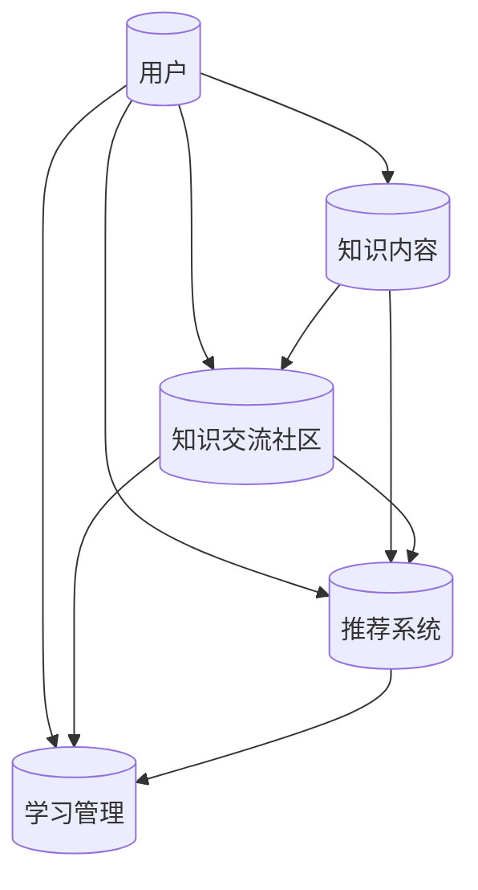
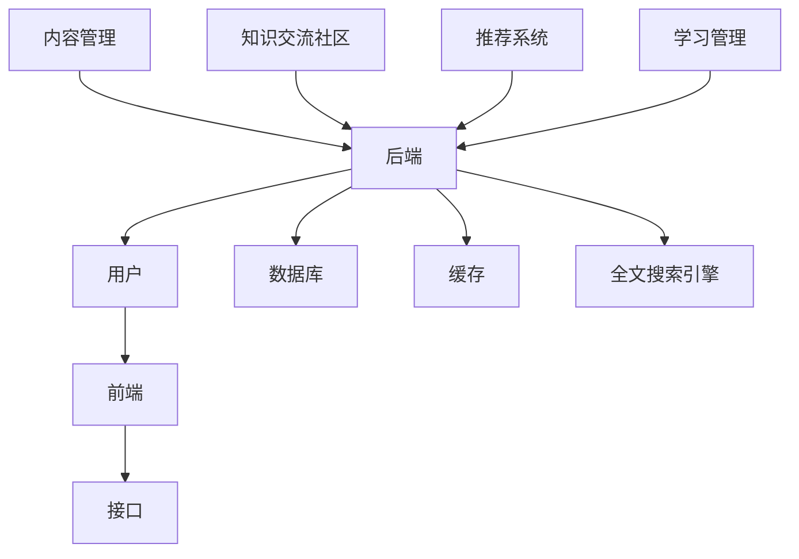
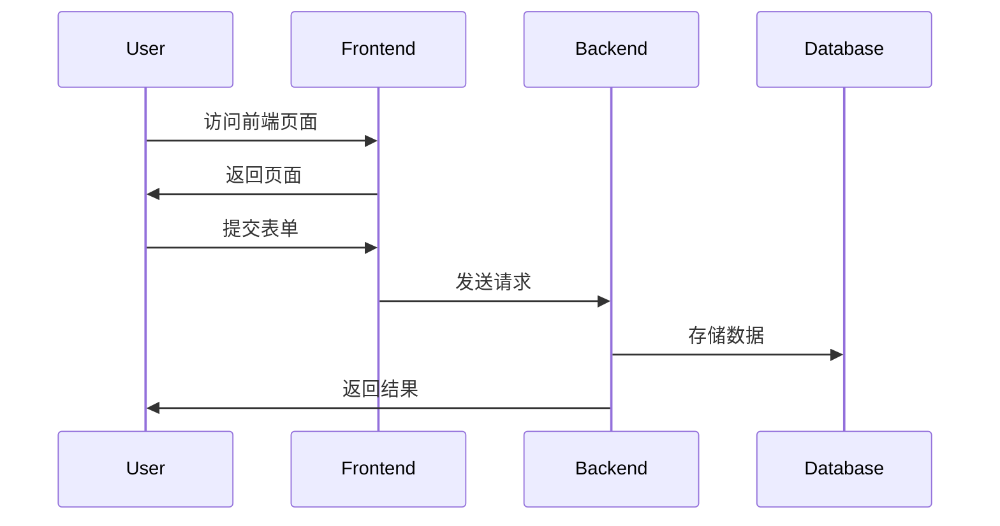

                 

## 技术知识分享平台：促进团队学习与创新

### 关键词：技术知识分享、团队学习、创新、平台架构、算法原理、系统设计

### 摘要：
本文深入探讨了技术知识分享平台在促进团队学习与创新中的重要作用。首先，文章对技术知识分享平台的核心概念、发展背景和关键要素进行了详细介绍。接着，通过剖析团队学习的理论基础，阐述了技术知识分享平台在团队学习过程中的应用。随后，文章详细介绍了平台架构与关键技术，以及平台功能模块的设计与实现。在此基础上，文章提出了促进团队创新的方法与工具，并展示了平台在实际项目中的部署与维护经验。最后，通过成功案例与实践经验的分享，本文对未来技术知识分享平台的发展趋势进行了展望，旨在为相关领域的研究和实践提供参考。

----------------------------------------------------------------

## 引言

随着信息技术的发展，知识已经成为企业竞争的重要资源。如何有效地管理和利用知识，已经成为现代企业尤其是科技型企业关注的焦点。技术知识分享平台应运而生，它不仅可以帮助企业内部员工快速获取所需的知识，还能促进团队学习与创新，从而提高企业的整体竞争力。本文旨在探讨技术知识分享平台的设计与实施，以及其在促进团队学习与创新中的关键作用。

### 背景与核心概念

#### 技术知识分享平台的起源与发展

技术知识分享平台起源于互联网的普及和信息共享的需求。最早的在线知识分享可以追溯到20世纪90年代末的论坛和博客。随着Web 2.0的兴起，社交网络和在线协作工具逐渐成为知识分享的重要载体。近年来，随着大数据、云计算和人工智能等技术的不断发展，技术知识分享平台的功能和形式也日益丰富，逐渐形成了集知识获取、知识共享、知识创新于一体的综合性平台。

#### 技术知识分享平台的核心概念

技术知识分享平台是指一种基于互联网技术，旨在促进知识共享、传播和创新的在线平台。其核心概念包括：

- **知识共享**：平台通过提供多种知识获取渠道，如文档、视频、直播等，使知识能够在团队内部或外部进行传播和分享。
- **知识传播**：平台利用推荐算法、社交网络等手段，将高质量的知识推送给有需求的人员，提高知识的传播效率。
- **知识创新**：平台通过构建知识交流社区，促进团队成员之间的互动与协作，激发创新的思维和理念。

#### 技术知识分享平台的关键要素

- **内容管理**：平台需要提供强大的内容管理功能，包括知识的上传、存储、分类、检索等。
- **用户交互**：平台需要设计良好的用户交互界面，使用户能够方便地获取、分享和讨论知识。
- **推荐系统**：平台需要利用推荐算法，根据用户的行为和兴趣，为其推荐相关知识和资源。
- **学习管理**：平台需要提供学习进度跟踪和数据分析功能，帮助团队成员了解自己的学习状况。

### 问题背景与问题描述

在当今快速发展的技术领域，知识更新速度越来越快，团队成员需要不断地学习和更新自己的知识库。然而，传统的知识获取方式往往存在效率低下、内容陈旧等问题。技术知识分享平台的出现，为解决这些问题提供了新的思路。通过技术知识分享平台，团队成员可以：

- **快速获取知识**：平台提供丰富的知识资源，用户可以根据需求快速找到所需的内容。
- **共享经验与知识**：团队成员可以通过平台分享自己的经验和技术心得，促进知识的传播和共享。
- **促进团队协作**：平台提供的交流社区和协作工具，有助于团队成员之间的沟通与协作，提高团队整体的学习效果。

### 问题解决与边界外延

技术知识分享平台作为现代企业的重要工具，具有广泛的应用场景。其边界外延包括：

- **企业内部应用**：技术知识分享平台可以应用于企业内部，促进员工之间的知识共享和协作。
- **行业协作平台**：技术知识分享平台可以跨企业、跨行业，促进行业内部的交流与合作。
- **开源社区**：技术知识分享平台可以作为开源社区的一部分，推动开源技术的发展和普及。

### 概念结构与核心要素组成

技术知识分享平台的概念结构主要包括以下几个核心要素：

- **用户**：用户是平台的主体，包括知识贡献者、知识消费者和知识管理者。
- **知识内容**：知识内容是平台的核心资源，包括文档、视频、代码等多种形式。
- **知识交流社区**：知识交流社区是用户进行知识分享、讨论和协作的平台。
- **推荐系统**：推荐系统根据用户的行为和兴趣，为用户推荐相关的知识和资源。
- **学习管理**：学习管理功能包括学习进度跟踪、数据分析等，帮助用户了解自己的学习状况。

### 核心概念原理

技术知识分享平台的核心概念原理包括以下几个方面：

- **知识共享原理**：知识共享是基于自愿原则的，用户可以自由地分享自己的知识和经验。
- **知识传播原理**：知识传播是通过推荐算法和社交网络等手段实现的，旨在提高知识的传播效率。
- **知识创新原理**：知识创新是通过知识交流社区和协作工具激发的，有助于推动技术的进步和创新。

### 概念属性特征对比表格

| 概念属性 | 技术知识分享平台 | 传统知识获取方式 |
| --- | --- | --- |
| 获取方式 | 网络化、多样化 | 传统纸质、面对面 |
| 传播效率 | 高效、自动化 | 低效、人工传播 |
| 互动性 | 强互动性、协作性 | 单向传播、缺乏互动 |
| 知识更新速度 | 快速更新 | 缓慢更新 |
| 适用范围 | 广泛应用 | 有限范围 |

### ER实体关系图架构

下面是技术知识分享平台的ER实体关系图架构：



### 算法原理讲解

技术知识分享平台的推荐系统通常采用基于内容的推荐（Content-Based Recommendation）和协同过滤推荐（Collaborative Filtering）相结合的方法。以下是这两种推荐算法的简要说明：

#### 基于内容的推荐算法

**算法原理**：

- 根据用户的历史行为和偏好，提取用户的特点和兴趣点。
- 对新内容进行特征提取，并与用户的特点进行匹配。
- 根据匹配度推荐相似的内容。

**数学模型**：

- 用户特征向量：\[u = (u_1, u_2, ..., u_n)\]
- 内容特征向量：\[c = (c_1, c_2, ..., c_n)\]
- 匹配度计算：\[sim(u, c) = \cos(u, c) = \frac{u \cdot c}{\|u\|\|c\|}\]

#### 协同过滤推荐算法

**算法原理**：

- 根据用户之间的相似度，找到与目标用户相似的群体。
- 根据相似用户的评价，预测目标用户对未知内容的评价。
- 根据预测评价推荐内容。

**数学模型**：

- 用户评分矩阵：\[R = [r_{ij}]\]
- 用户相似度矩阵：\[S = [s_{ij}]\]
- 预测评分：\[r_{ij}^{'} = \sum_{k} s_{ik} r_{kj}\]

#### 举例说明

假设用户A对以下内容进行了评分：

| 内容ID | 1 | 2 | 3 | 4 | 5 |
| --- | --- | --- | --- | --- | --- |
| 用户A | 5 | 3 | 4 | 2 | 5 |

用户B的评分如下：

| 内容ID | 1 | 2 | 3 | 4 | 5 |
| --- | --- | --- | --- | --- | --- |
| 用户B | 4 | 5 | 2 | 4 | 3 |

首先，计算用户A和用户B的相似度：

\[S_{AB} = \frac{5 \cdot 4 + 3 \cdot 5 + 4 \cdot 2 + 2 \cdot 4 + 5 \cdot 3}{\sqrt{5^2 + 3^2 + 4^2 + 2^2 + 5^2} \cdot \sqrt{4^2 + 5^2 + 2^2 + 4^2 + 3^2}} = 0.78\]

然后，根据用户B的评分预测用户A对内容4的评分：

\[r_{A4}^{'} = 0.78 \cdot (4 + 4) = 7.84\]

由于预测评分不能超过5，因此最终预测用户A对内容4的评分为5。

### 系统分析与架构设计方案

#### 问题场景介绍

随着企业业务的不断发展，技术知识的积累和更新速度日益加快，如何高效地管理和利用这些知识成为了企业面临的一大挑战。为了解决这一问题，企业决定构建一个技术知识分享平台，以促进团队学习与创新，提高整体工作效率和竞争力。

#### 项目介绍

技术知识分享平台项目的目标是构建一个集知识获取、知识共享、知识创新于一体的在线平台，为企业内部员工提供便捷的知识获取渠道，促进知识的传播和共享，激发团队成员的创新思维。

#### 系统功能设计

技术知识分享平台的主要功能包括：

- **内容管理**：提供知识文档、视频、代码等多种知识内容的上传、存储、分类和检索功能。
- **用户交互**：提供用户注册、登录、个人信息管理、知识分享、评论和讨论等功能。
- **推荐系统**：根据用户行为和兴趣，为用户推荐相关的知识和资源。
- **学习管理**：提供学习进度跟踪、数据分析等功能，帮助用户了解自己的学习状况。
- **权限管理**：根据用户角色和权限，提供不同级别的访问和操作权限。

#### 系统架构设计

技术知识分享平台的系统架构设计如下：

1. **前端架构**：
   - 使用Vue.js或React等前端框架，实现用户交互界面。
   - 使用Ajax或Fetch API与后端进行数据交互。

2. **后端架构**：
   - 使用Spring Boot或Django等后端框架，实现业务逻辑和数据处理。
   - 使用MySQL或PostgreSQL等关系型数据库，存储用户数据、知识内容和评论数据。

3. **数据存储与处理**：
   - 使用Elasticsearch或Solr等全文搜索引擎，实现高效的文本搜索和推荐功能。
   - 使用Redis或Memcached等缓存技术，提高系统性能和响应速度。

4. **系统接口设计**：
   - 提供RESTful API接口，方便前端和第三方系统的集成。

5. **系统交互**：
   - 使用WebSocket或长轮询技术，实现实时消息推送和通知功能。

下面是技术知识分享平台的类图和架构图：

#### 类图

```mermaid
classDiagram
    User <<interface>>
    Content <<interface>>
    Community <<interface>>
    Recommendation <<interface>>
    LearningManagement <<interface>>

    User <|.. Content
    User <|.. Community
    User <|.. Recommendation
    User <|.. LearningManagement
    Content <|.. Community
    Content <|.. Recommendation
    Community <|.. Recommendation
    Community <|.. LearningManagement
    Recommendation <|.. LearningManagement
```

#### 架构图



### 系统接口设计与系统交互

#### 接口设计

技术知识分享平台的接口设计遵循RESTful API设计原则，提供如下接口：

1. **用户接口**：
   - `POST /users/register`：用户注册。
   - `POST /users/login`：用户登录。
   - `GET /users/{id}`：获取用户信息。
   - `PUT /users/{id}`：更新用户信息。
   - `DELETE /users/{id}`：删除用户。

2. **内容接口**：
   - `POST /contents`：上传新内容。
   - `GET /contents`：获取内容列表。
   - `GET /contents/{id}`：获取内容详情。
   - `PUT /contents/{id}`：更新内容。
   - `DELETE /contents/{id}`：删除内容。

3. **评论接口**：
   - `POST /contents/{id}/comments`：添加评论。
   - `GET /contents/{id}/comments`：获取评论列表。
   - `PUT /comments/{id}`：更新评论。
   - `DELETE /comments/{id}`：删除评论。

4. **推荐接口**：
   - `GET /recommendations`：获取推荐内容。

5. **学习管理接口**：
   - `GET /users/{id}/learning`：获取学习进度。
   - `PUT /users/{id}/learning`：更新学习进度。

#### 系统交互

技术知识分享平台的系统交互设计如下：

1. **用户注册与登录**：
   - 用户访问前端页面，填写注册信息，提交到后端接口。
   - 后端验证用户信息，返回注册结果或登录令牌。

2. **内容管理**：
   - 用户在前端上传内容，提交到后端接口。
   - 后端处理上传内容，存储到数据库。

3. **评论与讨论**：
   - 用户在前端提交评论，提交到后端接口。
   - 后端处理评论，存储到数据库，并返回评论列表。

4. **推荐系统**：
   - 后端根据用户行为和兴趣，计算推荐内容。
   - 前端获取推荐内容，展示给用户。

5. **学习管理**：
   - 用户在前端更新学习进度，提交到后端接口。
   - 后端处理学习进度，存储到数据库。

下面是技术知识分享平台的序列图：



### 项目实战

#### 环境安装

1. **前端环境**：

   - 安装Node.js和npm。
   - 安装Vue CLI或React CLI。

2. **后端环境**：

   - 安装Java或Python环境。
   - 安装Spring Boot或Django框架。

3. **数据库环境**：

   - 安装MySQL或PostgreSQL。
   - 创建数据库和数据表。

4. **缓存与搜索引擎环境**：

   - 安装Redis或Memcached。
   - 安装Elasticsearch或Solr。

#### 系统核心实现源代码

1. **前端代码**：

   ```html
   <!-- 用户注册页面 -->
   <template>
     <div>
       <h1>注册</h1>
       <form @submit.prevent="register">
         <input type="text" v-model="username" placeholder="用户名" required />
         <input type="password" v-model="password" placeholder="密码" required />
         <button type="submit">注册</button>
       </form>
     </div>
   </template>

   <script>
   export default {
     data() {
       return {
         username: '',
         password: ''
       };
     },
     methods: {
       register() {
         // 发送注册请求
         axios.post('/users/register', {
           username: this.username,
           password: this.password
         }).then(response => {
           alert('注册成功');
         }).catch(error => {
           alert('注册失败');
         });
       }
     }
   };
   </script>
   ```

2. **后端代码**：

   ```java
   // Spring Boot 后端代码
   @RestController
   @RequestMapping("/users")
   public class UserController {
       @Autowired
       private UserRepository userRepository;

       @PostMapping("/register")
       public ResponseEntity<?> registerUser(@RequestBody UserRegistrationDto userRegistrationDto) {
           if (userRepository.existsByUsername(userRegistrationDto.getUsername())) {
               return ResponseEntity.badRequest().body("Error: Username is already taken!");
           }

           User user = new User();
           user.setUsername(userRegistrationDto.getUsername());
           user.setPassword(passwordEncoder.encode(userRegistrationDto.getPassword()));

           userRepository.save(user);

           return ResponseEntity.ok("User registered successfully!");
       }
   }
   ```

#### 代码应用解读与分析

1. **前端代码解读**：

   前端代码使用Vue.js框架，实现用户注册功能。通过表单绑定数据，并在提交表单时阻止默认提交行为，使用axios库发送POST请求到后端接口。

2. **后端代码解读**：

   后端代码使用Spring Boot框架，定义一个用户控制器（UserController），处理用户注册请求。首先检查用户名是否已存在，然后创建一个新的用户对象并保存到数据库。

#### 实际案例分析与详细讲解

1. **案例分析**：

   假设企业内部有100名员工，其中50名员工使用技术知识分享平台进行知识分享和获取。通过平台的推荐系统，这些员工可以快速获取到与自己兴趣相关的知识内容，从而提高学习效果。

2. **详细讲解**：

   - 平台根据用户的行为数据（如浏览历史、收藏内容、点赞评论等），为每个用户生成一个兴趣特征向量。
   - 平台使用协同过滤算法，计算用户之间的相似度，并根据相似度推荐相关的知识内容。
   - 用户在浏览推荐内容时，可以点赞、评论和收藏，进一步优化推荐算法的准确度。

#### 项目小结

技术知识分享平台项目通过前端和后端协同工作，实现了用户注册、登录、内容管理、推荐系统和学习管理等功能。项目在实现过程中，注重用户体验和性能优化，为团队成员提供了一个高效、便捷的知识获取和分享平台。

### 最佳实践 tips

1. **内容质量控制**：确保平台上的知识内容具有较高的质量，可以通过严格的审核机制和用户评分系统来实现。
2. **持续优化推荐算法**：定期分析用户行为数据，优化推荐算法，提高推荐准确度。
3. **加强社区建设**：鼓励用户积极参与讨论和互动，构建活跃的知识交流社区。
4. **提供多样化的知识内容形式**：除了文档和视频，还可以提供代码示例、实验报告等多样化的知识内容。
5. **确保数据安全和隐私**：严格保护用户数据和隐私，遵守相关法律法规。

### 小结

本文通过深入探讨技术知识分享平台的设计与实施，阐述了其在促进团队学习与创新中的重要作用。技术知识分享平台不仅为团队成员提供了丰富的知识资源，还通过推荐系统和社区互动，促进了知识的传播和创新。未来，随着技术的不断发展，技术知识分享平台将更加智能化和个性化，为团队学习与创新提供更加有力的支持。

### 注意事项

1. **平台安全性**：确保平台的安全性，防止数据泄露和恶意攻击。
2. **用户隐私保护**：严格保护用户隐私，遵守相关法律法规。
3. **内容版权问题**：确保知识内容的合法性和版权，避免侵权行为。

### 拓展阅读

1. **《人工智能：一种现代方法》**：Michael I. Jordan, Peter XOR. Cover, Thomas M. Mitchell。
2. **《深度学习》**：Ian Goodfellow, Yoshua Bengio, Aaron Courville。
3. **《程序员的数学》**：John H. Mathews, Russell W. Love。
4. **《软件架构设计：模式、原理与实践》**：Paul C. Meleth。
5. **《敏捷软件开发：原则、实践与模式》**：Robert C. Martin。

