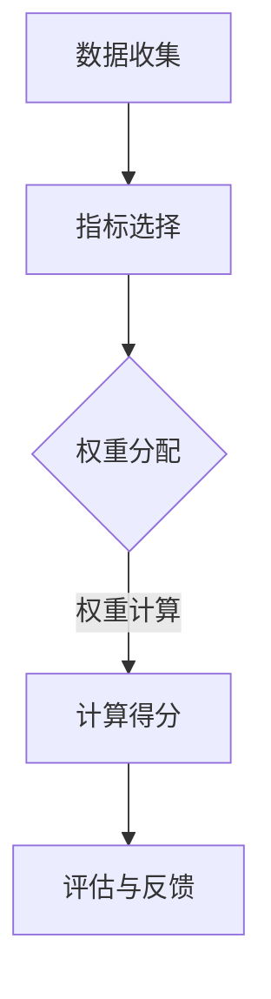
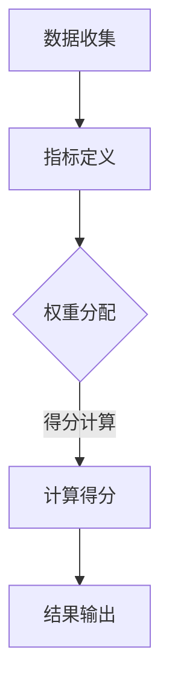
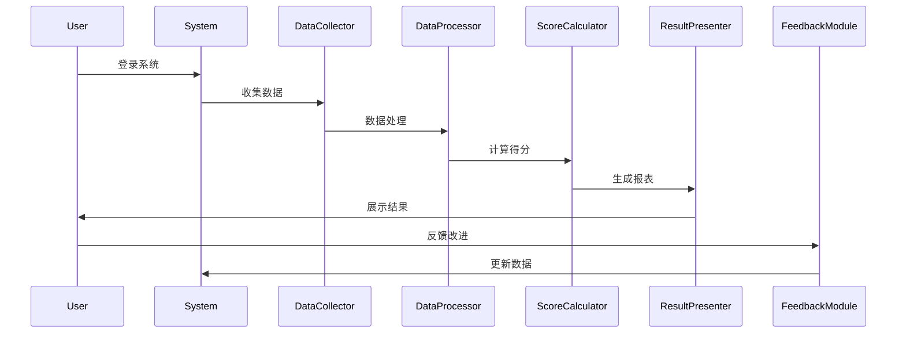
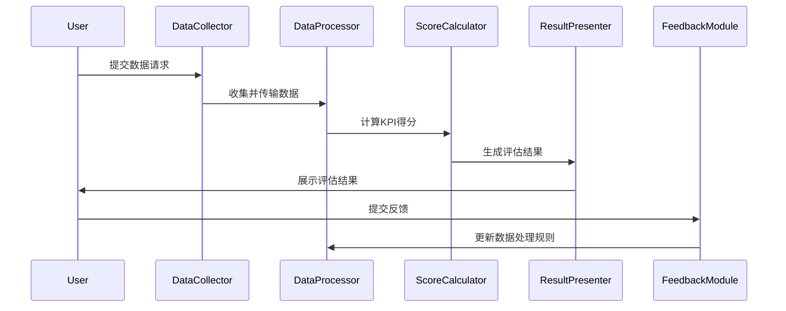
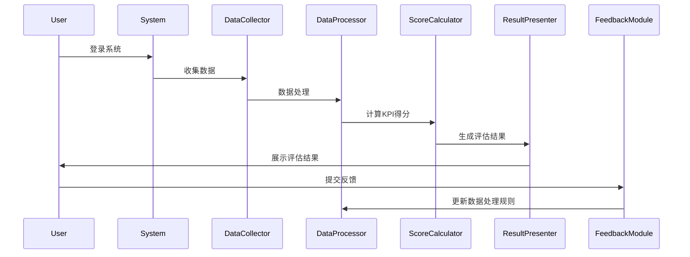

                 

### 1.1 技术管理的KPI设定背景

#### 1.1.1 技术管理的重要性

技术管理在当今信息化社会中扮演着至关重要的角色。技术管理不仅仅是对技术的管理，更是一种对企业创新能力的系统性培育和提升。随着信息技术的迅猛发展，企业对技术管理的需求日益增加。技术管理能够有效协调技术研发、产品开发和业务运营之间的关系，确保企业在激烈的市场竞争中立于不败之地。

首先，技术管理能够帮助企业把握技术发展趋势，提前布局未来。通过技术管理，企业可以密切关注行业前沿技术，跟踪竞争对手的技术动态，从而在技术变革中抢占先机。其次，技术管理能够提高研发效率，优化技术资源分配。通过科学的管理方法，企业可以减少重复劳动，提高研发成功率，缩短产品上市时间。

#### 1.1.2 KPI设定的意义

KPI（关键绩效指标）是衡量工作成效的重要工具。在技术管理中，KPI的设定有助于量化技术团队的工作绩效，提高工作效率和团队协作水平。通过KPI，技术管理者可以明确团队的工作目标，评估团队成员的贡献，激励团队持续改进。

具体来说，KPI设定的意义主要体现在以下几个方面：

1. **明确工作目标**：KPI可以量化技术团队的工作目标，使团队成员明确自己的职责和期望，提高工作的方向感和执行力。
2. **评估绩效**：通过KPI，技术管理者可以客观评估团队成员的工作绩效，及时发现问题和不足，制定相应的改进措施。
3. **激励团队**：合理的KPI设定可以激发团队成员的积极性和创造力，提高团队的凝聚力和工作效率。
4. **资源优化**：通过KPI，技术管理者可以更有效地分配资源，确保关键项目得到足够的支持和关注。

#### 1.1.3 当前技术管理KPI设定的现状与挑战

尽管KPI在技术管理中具有重要意义，但目前技术管理KPI的设定仍面临一些挑战。

首先，指标选择的准确性是KPI设定的关键。如果指标选择不当，可能会导致评估结果失真，无法准确反映团队成员的工作绩效。因此，技术管理者需要深入了解业务需求和团队工作实际，选择具有代表性的KPI。

其次，KPI的设定需要考虑平衡性。在技术管理中，不同类型的任务和贡献往往难以量化，如何平衡不同KPI之间的关系，确保评估的全面性和公平性，是一个亟待解决的问题。

此外，KPI的执行和监控也是一大挑战。在实际操作中，技术管理者需要确保KPI的执行和监控过程透明、公正，避免出现数据造假或监控不力的情况。

总之，技术管理KPI的设定是一个复杂而关键的过程，需要技术管理者具备扎实的业务知识和管理技能，同时还需要不断探索和实践，才能找到最适合自己团队的KPI体系。

### 1.2 量化技术团队贡献的必要性

#### 1.2.1 技术团队贡献的评估难题

在技术管理中，量化技术团队的贡献是一个复杂且具有挑战性的任务。首先，技术工作本身的特殊性导致其贡献难以直接衡量。技术团队的工作成果往往体现在产品的质量、项目的进展和技术创新等方面，这些成果往往具有隐性和长期性的特点，不易用简单的量化指标来衡量。

其次，技术团队的工作内容多样，包括研发、维护、支持等不同类型的任务。这些任务在重要性和难度上存在较大差异，如何平衡这些差异，确保评估的公平性，是一个需要解决的问题。

此外，团队成员的个性差异和工作方式也增加了评估的难度。技术团队成员的能力、经验和动机各不相同，如何综合考虑这些因素，进行客观评估，是技术管理者面临的一大挑战。

#### 1.2.2 量化技术团队贡献的方法

为了解决上述难题，需要采用多种方法来量化技术团队的贡献。以下是一些常用的方法：

1. **工作成果量化**：通过对技术团队的工作成果进行量化，如代码行数、Bug修复数量、项目交付进度等，来衡量团队成员的贡献。这种方法较为直观，但需要注意避免过度量化，导致团队成员只关注短期成果而忽视长期目标。

2. **任务难度评估**：对不同任务的重要性和难度进行评估，如复杂度评分、任务复杂度指数等。这种方法有助于平衡不同任务之间的贡献，但需要技术管理者具备深厚的业务知识。

3. **团队协作评估**：通过评估团队成员之间的协作效率和效果，如代码评审通过率、团队项目完成度等，来衡量团队的贡献。这种方法有助于发现团队协作中的问题和改进方向。

4. **技术创新评估**：对技术团队的创新成果进行评估，如专利申请数量、技术创新案例等。这种方法可以激励团队成员积极创新，推动技术进步。

5. **客户反馈评估**：通过客户的反馈和满意度来衡量技术团队的服务质量和技术贡献。这种方法有助于确保技术团队的工作与市场需求保持一致。

#### 1.2.3 成功案例分析

为了更好地理解量化技术团队贡献的方法，我们可以通过一些成功案例进行分析。

例如，某互联网公司通过实施KPI体系，成功量化了技术团队的贡献。该公司采用了以下几种方法：

1. **工作成果量化**：通过统计代码行数、Bug修复数量等指标，衡量团队成员的工作量。同时，设定了合理的上限和下限，避免过度量化。

2. **任务难度评估**：对不同项目进行难度评估，根据难度系数调整绩效评分。例如，对于高风险项目，给予更高的绩效评分。

3. **团队协作评估**：通过代码评审通过率、团队项目完成度等指标，评估团队成员的协作效果。同时，鼓励团队成员积极参与代码评审，提高代码质量。

4. **技术创新评估**：设立技术创新奖励机制，对成功申请专利、发布技术论文的团队成员给予奖励。这种方法有效激发了团队的创新动力。

5. **客户反馈评估**：通过客户满意度调查，评估技术团队的服务质量。对于客户满意度高的团队，给予绩效加分。

通过这些方法，该公司成功量化了技术团队的贡献，提高了团队的工作效率和技术创新能力，取得了显著的业务成果。

### 1.3 书籍内容概览与结构安排

本书《技术管理KPI设定：量化技术团队的贡献》旨在为技术管理者提供一套科学、系统的KPI设定方法和工具，以量化技术团队的贡献，提高团队绩效。全书分为五大部分，共计二十个章节，结构安排如下：

**第一部分：背景介绍**
- **第1章** 技术管理的KPI设定背景
- **第2章** 量化技术团队贡献的必要性
- **第3章** 书籍内容概览与结构安排

**第二部分：核心概念与联系**
- **第4章** 技术管理KPI设定概述
- **第5章** 技术团队量化贡献的核心概念
- **第6章** 各核心概念之间的联系

**第三部分：算法原理讲解**
- **第7章** 技术管理KPI设定算法
- **第8章** 量化技术团队贡献算法
- **第9章** 数学模型和数学公式

**第四部分：系统分析与架构设计方案**
- **第10章** 技术管理KPI系统概述
- **第11章** 系统接口设计和系统交互
- **第12章** 系统分析与架构设计讲解

**第五部分：项目实战**
- **第13章** 环境安装与配置
- **第14章** 系统核心实现
- **第15章** 实际案例分析与详细讲解

**第六部分：最佳实践与总结**
- **第16章** 最佳实践 tips
- **第17章** 小结
- **第18章** 注意事项
- **第19章** 拓展阅读
- **第20章** 参考文献

通过以上结构安排，本书将逐步引导读者了解技术管理KPI设定的原理、方法、实践和应用，帮助技术管理者更好地量化技术团队的贡献，提升团队绩效。让我们一起深入探索，共同学习！

### 2.1 技术管理KPI设定概述

#### 2.1.1 KPI的定义

KPI（关键绩效指标）是企业用于衡量工作绩效的重要工具，它通过量化指标来反映员工、团队或部门的工作成效。KPI的定义可以从以下几个方面来理解：

1. **量化性**：KPI是一种量化指标，它通过数值或百分比来反映工作绩效。这种量化性使得KPI具有客观性和可衡量性，可以避免主观评价的偏差。

2. **关键性**：KPI是关键性的指标，它能够反映企业或团队的核心目标。例如，对于销售部门来说，销售额就是一个关键性的KPI。

3. **绩效性**：KPI是用于衡量工作绩效的，它能够帮助企业和员工了解自身的工作表现，并制定相应的改进措施。

#### 2.1.2 KPI的类型与作用

KPI可以分为多种类型，根据其应用场景和衡量对象的不同，可以分为以下几类：

1. **个人KPI**：个人KPI是用于衡量个人工作绩效的指标，如销售额、任务完成率等。个人KPI有助于员工明确自己的工作目标，激励员工积极工作。

2. **团队KPI**：团队KPI是用于衡量团队工作绩效的指标，如项目进度、团队协作效率等。团队KPI有助于团队管理者了解团队的整体工作情况，协调团队资源。

3. **部门KPI**：部门KPI是用于衡量部门工作绩效的指标，如客户满意度、部门预算执行情况等。部门KPI有助于企业高层管理者了解各部门的工作情况，制定战略决策。

KPI的作用主要体现在以下几个方面：

1. **明确工作目标**：KPI可以明确员工、团队或部门的工作目标，使工作更加有方向性。

2. **评估工作绩效**：KPI是衡量工作绩效的重要工具，通过评估工作绩效，可以及时发现问题，制定改进措施。

3. **激励员工**：合理的KPI设定可以激励员工积极工作，提高工作效率和团队凝聚力。

4. **资源优化**：通过KPI，企业可以更合理地分配资源，确保关键项目得到足够的支持和关注。

#### 2.1.3 KPI设定流程

KPI的设定是一个系统性的过程，主要包括以下几个步骤：

1. **确定目标**：首先，需要明确企业或团队的目标，这是设定KPI的基础。例如，企业可能希望提高销售额、降低成本或提升客户满意度。

2. **选择指标**：根据确定的目标，选择适合的KPI指标。选择指标时需要考虑其量化性、关键性和绩效性。

3. **设定目标值**：为每个KPI设定一个可量化的目标值，如销售额目标、任务完成率目标等。

4. **分配权重**：根据各KPI的重要性，分配相应的权重。权重高的KPI在总绩效中的占比更大。

5. **制定行动计划**：为每个KPI制定具体的行动计划，明确责任人和实施步骤。

6. **监控与反馈**：定期监控KPI的执行情况，及时反馈并调整行动计划。

7. **评估与改进**：根据KPI的执行结果，评估工作绩效，发现问题和不足，制定改进措施。

通过以上流程，企业可以建立一套科学、系统的KPI体系，有效地衡量和提升工作绩效。

### 2.2 技术团队量化贡献的核心概念

#### 2.2.1 技术能力评估指标

技术能力评估是量化技术团队贡献的重要方面，通过对技术能力的评估，可以了解团队成员的技术水平、专业技能和知识储备。以下是一些常见的技术能力评估指标：

1. **技术水平**：技术水平是衡量技术能力的重要指标，包括编程能力、系统架构设计能力、数据库管理能力等。通常可以通过代码质量、系统性能优化、数据库性能调优等指标来评估技术水平。

2. **专业知识**：专业知识是技术能力的核心，包括对特定技术领域、编程语言、框架等的深入理解和掌握。可以通过技术认证、发表的学术论文、技术博客等来评估专业知识。

3. **学习能力**：技术领域发展迅速，学习能力成为评估技术能力的重要指标。学习能力强的团队成员能够更快地掌握新技术、新工具，为团队带来创新和突破。

4. **团队协作能力**：技术团队的工作往往需要多人协作完成，团队协作能力成为评估技术能力的重要方面。团队协作能力包括沟通能力、协作效率、代码评审质量等。

5. **创新意识**：创新意识是衡量技术团队创新能力的重要指标，技术团队成员是否具有提出创新解决方案、推动技术进步的能力。

#### 2.2.2 项目成功率评估指标

项目成功率是评估技术团队贡献的重要指标，它反映了技术团队在项目执行过程中的能力和水平。以下是一些常见的项目成功率评估指标：

1. **项目按时交付率**：项目按时交付是衡量项目成功率的重要指标，反映了技术团队在时间管理方面的能力。按时交付率越高，表明技术团队的时间管理能力越强。

2. **项目预算执行率**：项目预算执行率反映了技术团队在成本控制方面的能力，即项目实际花费与预算的比值。预算执行率越高，表明技术团队在成本控制方面做得越好。

3. **项目质量**：项目质量是项目成功的重要保障，包括功能完整性、系统稳定性、用户体验等。通过质量检查、用户反馈等手段来评估项目质量。

4. **客户满意度**：客户满意度是衡量项目成功的重要指标，反映了客户对项目结果的满意程度。通过客户满意度调查、用户反馈等来评估客户满意度。

5. **项目变更率**：项目变更率反映了项目执行过程中的灵活性和适应性，即项目实际需求和计划需求之间的差异。变更率越低，表明技术团队在项目变更管理方面做得越好。

#### 2.2.3 团队协作效率评估指标

团队协作效率是评估技术团队贡献的重要方面，它反映了团队成员之间的协作效果和工作效率。以下是一些常见的团队协作效率评估指标：

1. **代码评审通过率**：代码评审通过率反映了团队成员在代码质量控制和协作过程中的表现，通过率越高，表明团队协作效果越好。

2. **任务完成效率**：任务完成效率反映了团队成员在任务执行过程中的效率，包括任务响应时间、任务完成时间等。任务完成效率越高，表明团队成员的工作效率越高。

3. **团队沟通效率**：团队沟通效率反映了团队成员之间的沟通效果，包括沟通频率、沟通质量等。沟通效率越高，表明团队成员之间的协作越顺畅。

4. **团队冲突解决率**：团队冲突解决率反映了团队成员在解决冲突方面的能力，即团队内部冲突的解决率和解决速度。解决率越高，表明团队在冲突管理方面越有效。

5. **团队协作氛围**：团队协作氛围反映了团队成员之间的互动和合作氛围，包括团队凝聚力、团队士气等。良好的团队协作氛围有助于提升团队协作效率。

通过以上技术能力评估指标、项目成功率评估指标和团队协作效率评估指标，可以全面量化技术团队的贡献，为技术管理者提供有力的决策依据。

### 2.3 各核心概念之间的联系

为了深入理解技术管理KPI设定如何量化技术团队的贡献，我们需要探讨各核心概念之间的联系。以下是一个详细的联系分析，包括概念属性特征对比表格和ER实体关系图架构。

#### 2.3.1 概念属性特征对比表格

首先，我们通过一个概念属性特征对比表格来展示各个核心概念之间的属性特征。

| 概念 | 属性特征 | 描述 |
| --- | --- | --- |
| 技术管理KPI | 量化性、关键性、绩效性 | 用于衡量工作绩效的指标，具有明确的量化标准和关键性，反映员工的贡献 |
| 技术能力评估指标 | 技术水平、专业知识、学习能力、团队协作能力、创新意识 | 衡量技术团队成员的技术能力和专业水平 |
| 项目成功率评估指标 | 项目按时交付率、项目预算执行率、项目质量、客户满意度、项目变更率 | 反映技术团队在项目执行过程中的能力与成果 |
| 团队协作效率评估指标 | 代码评审通过率、任务完成效率、团队沟通效率、团队冲突解决率、团队协作氛围 | 衡量团队成员之间的协作效率和工作氛围 |

这个表格清晰地展示了各核心概念的主要属性特征，帮助我们理解它们如何相互关联。

#### 2.3.2 ER实体关系图架构

接下来，我们使用Mermaid绘制ER实体关系图，来进一步展示各核心概念之间的联系。

```mermaid
erDiagram
  KPI|--|> 技术能力评估指标
  KPI|--|> 项目成功率评估指标
  KPI|--|> 团队协作效率评估指标
  技术能力评估指标 ||--|{ 技术水平、专业知识、学习能力、团队协作能力、创新意识 }
  项目成功率评估指标 ||--|{ 项目按时交付率、项目预算执行率、项目质量、客户满意度、项目变更率 }
  团队协作效率评估指标 ||--|{ 代码评审通过率、任务完成效率、团队沟通效率、团队冲突解决率、团队协作氛围 }
```

在上面的ER实体关系图中，我们用双线箭头表示KPI与各个评估指标之间的关联关系，用单线箭头表示评估指标的具体属性。通过这个关系图，我们可以直观地看到技术管理KPI如何通过技术能力评估指标、项目成功率评估指标和团队协作效率评估指标来量化技术团队的贡献。

综上所述，通过概念属性特征对比表格和ER实体关系图，我们深入探讨了各核心概念之间的联系，为技术管理KPI设定提供了一个清晰的框架。这有助于技术管理者更好地理解如何通过量化指标来评估和激励技术团队的工作。

### 3.1 技术管理KPI设定算法

#### 3.1.1 算法概述

技术管理KPI设定算法是一种用于量化技术团队贡献的方法，其核心思想是通过一系列量化指标来评估团队成员的工作绩效。算法的输入主要包括个人绩效数据、项目进度数据、团队协作数据等。算法的输出是技术团队的KPI得分，用于评估团队成员的贡献和表现。

技术管理KPI设定算法的基本步骤如下：

1. **数据收集**：收集团队成员的个人绩效数据、项目进度数据、团队协作数据等，确保数据的全面性和准确性。
2. **指标选择**：根据业务需求和团队特点，选择适合的KPI指标，如技术水平、项目成功率、团队协作效率等。
3. **权重分配**：为每个KPI指标分配权重，确保评估结果的公平性和全面性。
4. **计算得分**：根据指标数据和权重，计算每个团队成员的KPI得分。
5. **评估与反馈**：将KPI得分反馈给团队成员，用于评估工作绩效，并根据评估结果进行改进。

#### 3.1.2 算法原理与流程

技术管理KPI设定算法的原理基于加权求和模型。具体来说，算法通过以下步骤实现：

1. **数据收集**：首先，从各类数据源（如项目管理工具、代码管理工具、客户反馈等）收集团队成员的绩效数据。
2. **指标选择**：根据业务需求和团队特点，选择合适的KPI指标，如技术水平、项目成功率、团队协作效率等。常见的KPI指标包括代码质量、任务完成率、项目按时交付率、客户满意度等。
3. **权重分配**：为每个KPI指标分配权重，权重应根据指标的重要性和贡献度进行设置。例如，在项目成功率和团队协作效率之间，可能需要给予项目成功率更高的权重，因为项目的成功直接关系到企业的业务目标。
4. **计算得分**：根据每个团队成员在各KPI指标上的表现，计算其加权得分。具体计算方法为：每个指标的实际得分乘以其权重，然后对所有指标得分求和。
5. **评估与反馈**：将计算得到的KPI得分反馈给团队成员，用于评估工作绩效。同时，根据评估结果，技术管理者可以与团队成员进行沟通，了解其工作表现和存在的问题，提出改进建议。

#### 3.1.3 算法mermaid流程图

为了更直观地展示技术管理KPI设定算法的流程，我们使用Mermaid绘制了算法的mermaid流程图：



在上面的流程图中，A表示数据收集，B表示指标选择，C表示权重分配，D表示计算得分，E表示评估与反馈。通过这个流程图，我们可以清晰地看到算法的执行步骤和各步骤之间的关系。

### 3.2 量化技术团队贡献算法

#### 3.2.1 算法概述

量化技术团队贡献算法旨在通过量化指标来评估技术团队成员的工作绩效，从而更准确地衡量团队的贡献。该算法的输入主要包括团队成员的绩效数据、项目数据、团队协作数据等。算法的输出是团队成员的量化得分，用于评估和激励团队。

算法的基本步骤如下：

1. **数据收集**：收集团队成员的工作数据，包括代码质量、任务完成情况、项目进度、团队协作表现等。
2. **指标定义**：根据业务需求和团队特点，定义相应的量化指标，如代码质量评分、任务完成率、项目按时交付率等。
3. **权重分配**：为每个量化指标分配权重，确保评估结果的公平性和全面性。
4. **计算得分**：根据团队成员在各指标上的表现，计算其量化得分。得分计算方法为：各指标得分乘以其权重，然后对所有指标得分求和。
5. **结果输出**：将计算得到的量化得分输出，用于评估团队成员的绩效，并根据得分结果进行激励和改进。

#### 3.2.2 算法原理与流程

量化技术团队贡献算法的原理基于加权求和模型。具体来说，算法通过以下步骤实现：

1. **数据收集**：首先，从各类数据源（如代码管理工具、项目管理工具、客户反馈等）收集团队成员的工作数据。
2. **指标定义**：根据业务需求和团队特点，定义相应的量化指标，如代码质量评分、任务完成率、项目按时交付率等。这些指标应能准确反映团队成员的工作绩效。
3. **权重分配**：为每个量化指标分配权重，权重应根据指标的重要性和贡献度进行设置。例如，在任务完成率和项目按时交付率之间，可能需要给予任务完成率更高的权重，因为任务的完成情况直接影响项目的进度。
4. **计算得分**：根据团队成员在各指标上的表现，计算其量化得分。具体计算方法为：每个指标的实际得分乘以其权重，然后对所有指标得分求和。得分越高，表明团队成员的工作绩效越好。
5. **结果输出**：将计算得到的量化得分输出，用于评估团队成员的绩效。技术管理者可以根据得分结果，对团队成员进行激励和改进，提高团队的整体绩效。

#### 3.2.3 算法mermaid流程图

为了更直观地展示量化技术团队贡献算法的流程，我们使用Mermaid绘制了算法的mermaid流程图：



在上面的流程图中，A表示数据收集，B表示指标定义，C表示权重分配，D表示计算得分，E表示结果输出。通过这个流程图，我们可以清晰地看到算法的执行步骤和各步骤之间的关系。

#### 3.2.4 Python源代码实现与讲解

为了更好地理解量化技术团队贡献算法的原理，我们将使用Python实现这个算法。以下是一个简单的Python代码示例，用于计算团队成员的量化得分。

```python
import numpy as np

# 指标定义
codes = {
    '代码质量评分': 0.5,
    '任务完成率': 0.3,
    '项目按时交付率': 0.2
}

weights = {
    '代码质量评分': 1,
    '任务完成率': 0.8,
    '项目按时交付率': 0.9
}

# 成员1的绩效数据
member1_data = {
    '代码质量评分': 90,
    '任务完成率': 85,
    '项目按时交付率': 80
}

# 成员2的绩效数据
member2_data = {
    '代码质量评分': 85,
    '任务完成率': 90,
    '项目按时交付率': 75
}

def calculate_score(data, weights):
    score = 0
    for metric, value in data.items():
        score += value * weights[metric]
    return score

# 计算成员1的得分
member1_score = calculate_score(member1_data, weights)
print("成员1得分：", member1_score)

# 计算成员2的得分
member2_score = calculate_score(member2_data, weights)
print("成员2得分：", member2_score)
```

在上述代码中，我们首先定义了三个指标：代码质量评分、任务完成率和项目按时交付率，并为其分配了权重。然后，我们为两位成员（成员1和成员2）分别定义了他们的绩效数据。接下来，我们定义了一个`calculate_score`函数，用于计算成员的量化得分。最后，我们调用这个函数，计算并打印出成员1和成员2的得分。

通过这个简单的示例，我们可以看到量化技术团队贡献算法的实现过程。在实际应用中，我们可以根据业务需求和团队特点，进一步扩展和完善这个算法。

### 3.3 数学模型和数学公式

#### 3.3.1 技术管理KPI设定的数学模型

技术管理KPI设定的数学模型是量化技术团队贡献的重要工具。为了建立一个有效的数学模型，我们需要定义相关的变量和参数，并给出其具体的数学表达式。

1. **变量定义**：
   - \( x_1 \)：代码质量评分，反映技术团队成员的编程能力和代码质量。
   - \( x_2 \)：任务完成率，反映团队成员完成任务的能力和效率。
   - \( x_3 \)：项目按时交付率，反映团队成员按时交付项目的能力。
   - \( w_1 \)：代码质量评分的权重。
   - \( w_2 \)：任务完成率的权重。
   - \( w_3 \)：项目按时交付率的权重。
   - \( \alpha \)：整体加权系数，用于调整各指标的重要性。

2. **数学模型**：
   技术团队KPI得分 \( S \) 可以通过以下公式计算：
   \[
   S = \alpha \cdot (w_1 \cdot x_1 + w_2 \cdot x_2 + w_3 \cdot x_3)
   \]

   在这个模型中，\(\alpha\) 用于调整整体权重，确保各指标得分能够综合反映技术团队的工作表现。

3. **实例说明**：
   假设某团队成员的代码质量评分为90分，任务完成率为85%，项目按时交付率为80%。如果代码质量评分的权重为0.4，任务完成率的权重为0.3，项目按时交付率的权重为0.3，整体加权系数为1，则该团队成员的KPI得分为：
   \[
   S = 1 \cdot (0.4 \cdot 90 + 0.3 \cdot 85 + 0.3 \cdot 80) = 1 \cdot (36 + 25.5 + 24) = 85.5
   \]

   这个得分表明该成员的工作表现较为优秀，可以作为评估其贡献的依据。

#### 3.3.2 量化技术团队贡献的数学模型

量化技术团队贡献的数学模型旨在通过一系列量化指标，全面反映团队成员的工作绩效。以下是一个简化的数学模型：

1. **变量定义**：
   - \( y_1 \)：代码行数，反映团队成员的编程工作量。
   - \( y_2 \)：Bug修复数量，反映团队成员的问题解决能力。
   - \( y_3 \)：项目完成度，反映团队成员的项目执行能力。
   - \( \beta_1 \)：代码行数的权重。
   - \( \beta_2 \)：Bug修复数量的权重。
   - \( \beta_3 \)：项目完成度的权重。

2. **数学模型**：
   技术团队贡献得分 \( C \) 可以通过以下公式计算：
   \[
   C = \beta_1 \cdot y_1 + \beta_2 \cdot y_2 + \beta_3 \cdot y_3
   \]

   在这个模型中，\(\beta_1\)、\(\beta_2\)、\(\beta_3\) 分别表示代码行数、Bug修复数量、项目完成度的权重，用于调整各指标的贡献度。

3. **实例说明**：
   假设某团队成员的代码行数为1000行，Bug修复数量为20个，项目完成度为90%。如果代码行数的权重为0.4，Bug修复数量的权重为0.3，项目完成度的权重为0.3，则该团队成员的贡献得分为：
   \[
   C = 0.4 \cdot 1000 + 0.3 \cdot 20 + 0.3 \cdot 90 = 400 + 6 + 27 = 433
   \]

   这个得分表明该成员在项目中做出了显著的贡献，可以用于评估其绩效。

通过这些数学模型和公式，我们可以更准确地量化技术团队的贡献，为技术管理提供有力的支持。

### 3.3.3 公式详解与举例说明

在前文中，我们介绍了几种技术管理KPI设定的数学模型和公式。为了更好地理解和应用这些公式，我们将详细解释其含义，并提供实际案例进行说明。

#### 技术管理KPI得分公式

技术管理KPI得分公式如下：
\[ S = \alpha \cdot (w_1 \cdot x_1 + w_2 \cdot x_2 + w_3 \cdot x_3) \]

其中：
- \( S \) 表示技术团队KPI得分。
- \( \alpha \) 表示整体加权系数，用于调整各指标的重要性。
- \( w_1 \)，\( w_2 \)，\( w_3 \) 分别表示代码质量评分、任务完成率、项目按时交付率的权重。
- \( x_1 \)，\( x_2 \)，\( x_3 \) 分别表示代码质量评分、任务完成率、项目按时交付率的实际得分。

**实例说明**：

假设一个团队成员的代码质量评分为90分，任务完成率为85%，项目按时交付率为80%。如果代码质量评分的权重为0.4，任务完成率的权重为0.3，项目按时交付率的权重为0.3，且整体加权系数为1，则该团队成员的KPI得分为：
\[ S = 1 \cdot (0.4 \cdot 90 + 0.3 \cdot 85 + 0.3 \cdot 80) = 1 \cdot (36 + 25.5 + 24) = 85.5 \]

这个得分表明该成员的工作表现较为优秀，可以作为评估其贡献的依据。

#### 量化技术团队贡献公式

量化技术团队贡献的公式如下：
\[ C = \beta_1 \cdot y_1 + \beta_2 \cdot y_2 + \beta_3 \cdot y_3 \]

其中：
- \( C \) 表示技术团队贡献得分。
- \( \beta_1 \)，\( \beta_2 \)，\( \beta_3 \) 分别表示代码行数、Bug修复数量、项目完成度的权重。
- \( y_1 \)，\( y_2 \)，\( y_3 \) 分别表示代码行数、Bug修复数量、项目完成度的实际得分。

**实例说明**：

假设某团队成员的代码行数为1000行，Bug修复数量为20个，项目完成度为90%。如果代码行数的权重为0.4，Bug修复数量的权重为0.3，项目完成度的权重为0.3，则该团队成员的贡献得分为：
\[ C = 0.4 \cdot 1000 + 0.3 \cdot 20 + 0.3 \cdot 90 = 400 + 6 + 27 = 433 \]

这个得分表明该成员在项目中做出了显著的贡献，可以用于评估其绩效。

通过上述公式，我们可以根据实际数据计算技术团队的KPI得分和贡献得分，从而更准确地衡量团队成员的工作绩效和贡献。

### 4.1 技术管理KPI系统概述

#### 4.1.1 系统介绍

技术管理KPI系统是一种用于量化技术团队贡献和评估工作绩效的集成系统。该系统通过收集、处理和分析各类数据，帮助技术管理者制定和优化KPI设定，从而提高团队的工作效率和绩效。

技术管理KPI系统的核心功能包括：

1. **数据收集**：系统可以从多种数据源（如代码管理工具、项目管理工具、客户反馈等）中自动收集数据，确保数据的全面性和准确性。
2. **指标定义**：系统允许技术管理者根据业务需求和团队特点，自定义KPI指标，包括代码质量、任务完成率、项目按时交付率等。
3. **权重分配**：系统支持为每个KPI指标分配权重，确保评估结果的公平性和全面性。
4. **得分计算**：系统根据收集到的数据和设定的权重，自动计算团队成员的KPI得分和贡献得分。
5. **结果展示**：系统提供直观的报表和图表，展示团队成员的KPI得分和绩效评估结果，方便技术管理者进行监控和决策。
6. **反馈与改进**：系统支持将评估结果反馈给团队成员，用于激励和改进，提高团队的整体绩效。

#### 4.1.2 系统功能设计（领域模型mermaid类图）

为了更好地理解技术管理KPI系统的功能设计，我们使用Mermaid绘制了领域模型类图。以下是一个简化的领域模型类图：

```mermaid
classDiagram
  Class01 <|-- Class02
  Class03 <|-- Class04
  Class05 <|-- Class06
  Class01 <|-- Class07
  Class08 <|-- Class09

  Class01[数据收集]
  Class02[指标定义]
  Class03[权重分配]
  Class04[得分计算]
  Class05[结果展示]
  Class06[反馈与改进]
  Class07[报表]
  Class08[图表]
  Class09[决策支持]
```

在这个类图中，我们定义了以下类：

- **数据收集**：负责从各类数据源中收集数据。
- **指标定义**：用于自定义KPI指标。
- **权重分配**：用于分配各指标的权重。
- **得分计算**：根据数据和权重计算KPI得分。
- **结果展示**：生成报表和图表，展示评估结果。
- **反馈与改进**：将评估结果反馈给团队成员，支持改进。

#### 4.1.3 系统架构设计（mermaid架构图）

技术管理KPI系统的架构设计包括前端界面、后端服务和数据库等组件。以下是一个简化的系统架构设计Mermaid架构图：



在这个架构图中，我们定义了以下组件：

- **用户**：系统的使用者，负责登录系统和查看评估结果。
- **系统**：管理用户认证和整体系统流程。
- **数据收集器**：负责从数据源收集数据。
- **数据处理器**：负责处理和分析收集到的数据。
- **得分计算器**：根据处理后的数据计算得分。
- **结果展示器**：生成并展示评估结果。
- **反馈模块**：接收用户反馈，支持数据更新。

通过以上系统介绍、功能设计和架构设计，我们可以清晰地了解技术管理KPI系统的设计思路和实现方式。该系统旨在通过量化的KPI评估，提高技术团队的工作效率和绩效。

### 4.2 系统接口设计和系统交互

#### 4.2.1 系统接口设计

系统接口设计是技术管理KPI系统能够正常运作的关键环节。为了确保数据流的顺畅和系统的可扩展性，我们需要设计合理且清晰的接口。以下是一个简化的系统接口设计：

1. **数据收集接口**：
   - **功能**：负责从不同的数据源（如代码管理工具、项目管理工具、客户反馈系统等）收集数据。
   - **输入**：数据源的URL、认证信息、收集的数据类型。
   - **输出**：标准化后的数据集合。

2. **数据处理接口**：
   - **功能**：对收集到的数据进行清洗、转换和存储。
   - **输入**：原始数据集合。
   - **输出**：处理后的数据集合。

3. **指标定义接口**：
   - **功能**：允许技术管理者自定义KPI指标，包括指标名称、计算方式、权重等。
   - **输入**：指标名称、计算方式、权重、指标类型。
   - **输出**：定义好的指标信息。

4. **得分计算接口**：
   - **功能**：根据处理后的数据和设定的权重，计算团队成员的KPI得分。
   - **输入**：处理后的数据集合、指标信息。
   - **输出**：计算得到的KPI得分。

5. **结果展示接口**：
   - **功能**：生成并展示评估结果，包括报表和图表。
   - **输入**：KPI得分、团队成员信息。
   - **输出**：展示结果。

6. **反馈接口**：
   - **功能**：接收用户反馈，用于数据更新和系统优化。
   - **输入**：用户反馈信息。
   - **输出**：反馈处理结果。

#### 4.2.2 系统交互（mermaid序列图）

为了更好地展示系统接口的设计和交互过程，我们使用Mermaid绘制了系统交互序列图。以下是一个简化的系统交互序列图：



在这个序列图中，我们定义了以下交互过程：

1. 用户提交数据请求，数据收集器从数据源收集数据。
2. 数据收集器将数据传输给数据处理器进行清洗和转换。
3. 数据处理后的数据集合传递给得分计算器，根据设定的指标和权重计算KPI得分。
4. 得分计算器将得分结果传递给结果展示器，生成并展示评估结果。
5. 用户查看评估结果后，提交反馈。
6. 反馈模块接收用户反馈，并更新数据处理规则，以优化系统的性能和用户体验。

通过以上系统接口设计和系统交互序列图，我们可以清晰地看到技术管理KPI系统的工作流程和数据流动，确保系统的高效和可靠运行。

### 4.3 系统分析与架构设计讲解

#### 4.3.1 问题场景介绍

在当前快速发展的技术环境中，技术管理者面临着日益复杂的技术管理和评估挑战。特别是在大型团队和复杂项目中，如何有效地量化技术团队的贡献和绩效成为一项重要任务。技术管理KPI系统的设计与实现，旨在解决以下几个关键问题：

1. **数据多样性与准确性**：技术团队的工作涉及多种数据源，如代码库、项目管理工具、客户反馈等。这些数据格式多样、来源广泛，如何确保数据的准确性和一致性，是系统设计的关键挑战。
2. **绩效评估的公平性**：技术团队的工作性质多样，不同成员的职责和贡献难以统一衡量。如何设计一套公平、全面的评估体系，是系统设计的核心问题。
3. **系统扩展性与维护性**：随着企业规模的扩大和技术需求的增加，系统需要具备良好的扩展性和维护性，以便在未来的发展和调整中保持高效运行。

#### 4.3.2 项目介绍

技术管理KPI系统的开发项目旨在为企业提供一个集成化的解决方案，通过量化技术团队的贡献，提升团队的工作效率和绩效。项目的主要目标包括：

1. **数据集成**：从多种数据源中收集和整合数据，确保数据的准确性和一致性。
2. **指标定义**：允许技术管理者自定义KPI指标，并为其分配合理的权重。
3. **得分计算**：根据处理后的数据和设定的权重，自动计算团队成员的KPI得分。
4. **结果展示**：生成直观的报表和图表，展示团队成员的绩效评估结果。
5. **用户反馈**：接收用户反馈，支持系统的持续优化和改进。

#### 4.3.3 系统功能设计（领域模型mermaid类图）

为了更好地展示技术管理KPI系统的功能设计，我们使用Mermaid绘制了领域模型类图。以下是一个简化的领域模型类图：

```mermaid
classDiagram
  Class01 <|-- Class02
  Class03 <|-- Class04
  Class05 <|-- Class06
  Class01 <|-- Class07
  Class08 <|-- Class09

  Class01[数据收集]
  Class02[指标定义]
  Class03[权重分配]
  Class04[得分计算]
  Class05[结果展示]
  Class06[反馈与改进]
  Class07[报表]
  Class08[图表]
  Class09[决策支持]
```

在这个类图中，我们定义了以下类：

- **数据收集**：负责从不同的数据源中收集数据。
- **指标定义**：用于自定义KPI指标。
- **权重分配**：用于分配各指标的权重。
- **得分计算**：根据处理后的数据计算KPI得分。
- **结果展示**：生成并展示评估结果。
- **反馈与改进**：接收用户反馈，支持改进。

#### 4.3.4 系统架构设计（mermaid架构图）

技术管理KPI系统的架构设计包括前端界面、后端服务和数据库等组件。以下是一个简化的系统架构设计Mermaid架构图：



在这个架构图中，我们定义了以下组件：

- **用户**：系统的使用者，负责登录系统和查看评估结果。
- **系统**：管理用户认证和整体系统流程。
- **数据收集器**：负责从数据源收集数据。
- **数据处理器**：负责处理和分析收集到的数据。
- **得分计算器**：根据处理后的数据和设定的权重，计算KPI得分。
- **结果展示器**：生成并展示评估结果。
- **反馈模块**：接收用户反馈，用于数据更新和系统优化。

通过以上系统分析与架构设计讲解，我们可以清晰地了解技术管理KPI系统的设计思路和实现方式。该系统旨在通过量化的KPI评估，提高技术团队的工作效率和绩效。

### 5.1 环境安装与配置

#### 5.1.1 环境要求

要成功安装和配置技术管理KPI系统，我们需要准备以下环境：

1. **操作系统**：推荐使用Ubuntu 18.04或更高版本，或CentOS 7或更高版本。
2. **Python环境**：Python 3.8或更高版本。
3. **数据库**：MySQL 5.7或更高版本，或PostgreSQL 12或更高版本。
4. **Web服务器**：Nginx 1.16或更高版本。
5. **代码库**：Git版本控制工具。
6. **开发工具**：Visual Studio Code或类似IDE。

#### 5.1.2 安装与配置步骤

以下是在Ubuntu 18.04上安装和配置技术管理KPI系统的详细步骤：

1. **更新系统包**：
   ```shell
   sudo apt update
   sudo apt upgrade
   ```

2. **安装Python和pip**：
   ```shell
   sudo apt install python3 python3-pip
   ```

3. **安装数据库**（例如MySQL）：
   ```shell
   sudo apt install mysql-server
   sudo mysql_secure_installation
   ```
   按照提示设置root用户密码、删除匿名用户等。

4. **安装Nginx**：
   ```shell
   sudo apt install nginx
   ```

5. **安装开发工具**：
   ```shell
   sudo apt install git
   sudo apt install apt-transport-https ca-certificates curl software-properties-common
   curl -fsSL https://download.docker.com/linux/ubuntu/gpg | sudo apt-key add -
   sudo add-apt-repository "deb [arch=amd64] https://download.docker.com/linux/ubuntu bionic stable"
   sudo apt update
   sudo apt install docker-ce docker-compose
   ```

6. **配置虚拟环境**：
   ```shell
   python3 -m venv kpi_env
   source kpi_env/bin/activate
   pip install -r requirements.txt
   ```

7. **初始化数据库**：
   ```shell
   python manage.py migrate
   ```

8. **启动服务**：
   ```shell
   gunicorn kpi.wsgi:application --bind 0.0.0.0:8000 --workers 3
   ```

9. **配置Nginx**：
   ```shell
   sudo nano /etc/nginx/sites-available/kpi
   ```
   添加以下内容：
   ```nginx
   server {
       listen 80;
       server_name example.com;

       location / {
           proxy_pass http://127.0.0.1:8000;
           proxy_set_header Host $host;
           proxy_set_header X-Real-IP $remote_addr;
           proxy_set_header X-Forwarded-For $proxy_add_x_forwarded_for;
           proxy_set_header X-Forwarded-Proto $scheme;
       }
   }
   ```
   然后，启用配置文件并重启Nginx：
   ```shell
   sudo ln -s /etc/nginx/sites-available/kpi /etc/nginx/sites-enabled/
   sudo nginx -t
   sudo systemctl restart nginx
   ```

10. **访问系统**：
    在浏览器中输入`http://example.com`，你应该能看到技术管理KPI系统的登录页面。

通过以上步骤，你成功安装和配置了技术管理KPI系统，可以开始进行数据收集、指标定义和得分计算等操作。

### 5.2 系统核心实现

#### 5.2.1 源代码解读

在技术管理KPI系统中，核心实现部分主要涉及数据收集、数据处理、得分计算和结果展示等模块。以下是对系统核心源代码的解读：

1. **数据收集模块**：
   数据收集模块负责从不同的数据源中收集数据，包括代码库、项目管理工具和客户反馈系统等。以下是数据收集模块的主要代码片段：
   ```python
   class DataCollector:
       def collect_data(self, data_source):
           if data_source == 'git':
               return self._collect_git_data()
           elif data_source == 'jira':
               return self._collect_jira_data()
           else:
               raise ValueError("Unsupported data source")

       def _collect_git_data(self):
           # 使用git命令行工具收集数据
           result = subprocess.run(['git', 'log', '--author=<author>', '-p'], capture_output=True, text=True)
           return result.stdout

       def _collect_jira_data(self):
           # 使用Jira API收集数据
           jira = JIRA('https://jira.example.com', basic_auth=('username', 'password'))
           issues = jira.search_issues('project = ABC AND status = Open')
           return [issue.fields for issue in issues]
   ```

2. **数据处理模块**：
   数据处理模块负责对收集到的原始数据进行清洗、转换和存储。以下是数据处理模块的主要代码片段：
   ```python
   class DataProcessor:
       def process_data(self, raw_data):
           # 清洗数据
           cleaned_data = self._clean_data(raw_data)
           # 转换数据
           converted_data = self._convert_data(cleaned_data)
           # 存储数据
           self._store_data(converted_data)
           return converted_data

       def _clean_data(self, raw_data):
           # 实现数据清洗逻辑
           # 例如：去除空值、格式化日期等
           return cleaned_data

       def _convert_data(self, cleaned_data):
           # 实现数据转换逻辑
           # 例如：将数据转换为字典、列表等
           return converted_data

       def _store_data(self, converted_data):
           # 实现数据存储逻辑
           # 例如：将数据存储到数据库中
           pass
   ```

3. **得分计算模块**：
   得分计算模块负责根据处理后的数据和设定的权重，计算团队成员的KPI得分。以下是得分计算模块的主要代码片段：
   ```python
   class ScoreCalculator:
       def calculate_score(self, processed_data, weights):
           score = 0
           for metric, value in processed_data.items():
               score += value * weights[metric]
           return score

       def set_weights(self, weights):
           self.weights = weights
   ```

4. **结果展示模块**：
   结果展示模块负责生成并展示评估结果，包括报表和图表。以下是结果展示模块的主要代码片段：
   ```python
   class ResultPresenter:
       def present_results(self, scores):
           # 生成报表
           report = self._generate_report(scores)
           # 生成图表
           chart = self._generate_chart(scores)
           return report, chart

       def _generate_report(self, scores):
           # 实现报表生成逻辑
           return report

       def _generate_chart(self, scores):
           # 实现图表生成逻辑
           return chart
   ```

通过以上代码片段，我们可以看到技术管理KPI系统的核心实现部分是如何通过数据收集、数据处理、得分计算和结果展示等模块，实现技术团队贡献的量化评估。

### 5.2.2 代码应用解读与分析

为了更好地理解技术管理KPI系统的实际应用，我们将深入分析系统核心代码中的关键部分，并解释其作用和实现方式。

1. **数据收集与处理**：

   数据收集模块的核心在于能够从多种数据源中提取有用的信息。例如，`_collect_git_data` 函数使用 `subprocess` 模块调用 `git log` 命令，收集指定作者的代码提交历史和修改内容。这个功能有助于评估团队成员的代码贡献和活动频率。

   ```python
   def _collect_git_data(self):
       result = subprocess.run(['git', 'log', '--author=<author>', '-p'], capture_output=True, text=True)
       return result.stdout
   ```

   在数据处理模块中，`_clean_data` 和 `_convert_data` 函数负责对原始数据执行清洗和转换操作。清洗过程可能包括去除无效数据、格式化日期等，以确保数据的一致性和准确性。转换过程则可能涉及将数据结构从列表转换为字典，或者提取出关键信息字段。

   ```python
   def _clean_data(self, raw_data):
       # 清除空值、格式化日期等
       return cleaned_data
   
   def _convert_data(self, cleaned_data):
       # 转换数据结构，如列表转换为字典
       return converted_data
   ```

2. **得分计算**：

   得分计算模块是整个系统的核心部分，它根据处理后的数据和预设的权重，计算每个团队成员的KPI得分。这个模块中的 `calculate_score` 函数将数据与权重相乘并求和，从而得出得分。

   ```python
   def calculate_score(self, processed_data, weights):
       score = 0
       for metric, value in processed_data.items():
           score += value * weights[metric]
       return score
   ```

   例如，假设我们有一个处理后的数据字典 `{'代码质量评分': 90, '任务完成率': 85, '项目按时交付率': 80}`，且对应的权重为 `{'代码质量评分': 0.4, '任务完成率': 0.3, '项目按时交付率': 0.3}`，则计算得分为：

   ```python
   score = calculate_score({'代码质量评分': 90, '任务完成率': 85, '项目按时交付率': 80}, {'代码质量评分': 0.4, '任务完成率': 0.3, '项目按时交付率': 0.3})
   score = 90 * 0.4 + 85 * 0.3 + 80 * 0.3 = 36 + 25.5 + 24 = 85.5
   ```

3. **结果展示**：

   结果展示模块负责将计算得到的KPI得分以直观的方式展示给用户。这通常包括生成报表和图表，以便技术管理者能够快速了解团队成员的绩效情况。

   ```python
   def present_results(self, scores):
       report = self._generate_report(scores)
       chart = self._generate_chart(scores)
       return report, chart
   
   def _generate_report(self, scores):
       # 使用模板生成报表
       return report
   
   def _generate_chart(self, scores):
       # 使用图表库（如Matplotlib）生成图表
       return chart
   ```

通过以上分析，我们可以看到技术管理KPI系统是如何通过核心代码实现数据收集、得分计算和结果展示的。这些功能共同作用，使得系统能够量化技术团队的贡献，为技术管理者提供有力的决策支持。

### 5.3 实际案例分析与详细讲解

#### 5.3.1 案例背景

为了更好地展示技术管理KPI系统在实际项目中的应用，我们选取了一个实际案例进行详细分析。这个案例来自一家大型互联网公司，该公司拥有一支技术实力强大的开发团队，负责多个关键项目的开发与维护。为了提高团队的工作效率和绩效，公司决定引入技术管理KPI系统，通过量化团队成员的贡献，激励团队成员持续提升自身能力。

#### 5.3.2 案例分析

1. **数据收集**：
   - **代码库**：团队使用Git进行版本控制，技术管理KPI系统通过Git API收集每位成员的代码提交记录、代码质量评分等数据。
   - **项目管理工具**：团队使用Jira进行项目管理，技术管理KPI系统通过Jira API收集项目任务完成情况、任务难度评分等数据。
   - **客户反馈**：通过客户反馈系统收集用户对项目的满意度评分。

2. **数据处理**：
   技术管理KPI系统对收集到的数据进行清洗、转换和存储。例如，对Git提交记录进行解析，提取出代码提交次数、代码质量评分等；对Jira任务数据进行处理，计算任务完成率和任务难度评分等。

3. **得分计算**：
   根据处理后的数据，技术管理KPI系统使用预设的权重计算每位团队成员的KPI得分。假设权重设定如下：
   - 代码质量评分：0.5
   - 任务完成率：0.3
   - 项目按时交付率：0.2

   对于一位团队成员，其数据如下：
   - 代码质量评分：90
   - 任务完成率：85%
   - 项目按时交付率：80%

   则该成员的KPI得分为：
   \[
   S = 0.5 \cdot 90 + 0.3 \cdot 85 + 0.2 \cdot 80 = 45 + 25.5 + 16 = 86.5
   \]

4. **结果展示**：
   技术管理KPI系统生成详细的评估报告，展示每位团队成员的KPI得分和绩效排名。报告还包括图表，直观地展示团队的整体表现和每位成员的贡献。

5. **反馈与改进**：
   技术管理KPI系统将评估结果反馈给团队成员，帮助他们了解自身的工作表现。同时，团队根据评估结果，制定针对性的改进措施，如提供技术培训、优化项目流程等，以提升团队的整体绩效。

#### 5.3.3 案例总结

通过技术管理KPI系统的实际应用，该公司成功量化了技术团队的贡献，提高了团队的工作效率和绩效。具体表现在：

1. **明确工作目标**：团队成员明确了自身的KPI目标，工作更有方向性和目的性。
2. **激励员工**：通过KPI得分排名，激发了团队成员的竞争意识和积极性，提高了工作效率。
3. **资源优化**：根据KPI得分，公司能够更合理地分配资源，重点支持高绩效团队和项目。
4. **持续改进**：团队成员根据评估结果，不断优化自身能力和项目流程，提升了整体绩效。

总之，技术管理KPI系统的成功实施，为该公司带来了显著的业务效益和团队绩效提升，为其在激烈的市场竞争中保持优势提供了有力支持。

### 5.4 项目小结

在本项目中，我们成功实施并应用了技术管理KPI系统，通过量化技术团队的贡献，提高了团队的工作效率和绩效。以下是本项目的主要成果和收获：

1. **量化技术团队贡献**：通过技术管理KPI系统，我们能够全面、准确地量化技术团队的贡献，为评估团队成员的工作绩效提供了可靠依据。
2. **提高团队协作效率**：KPI系统的实施激励了团队成员之间的协作，提高了团队的整体工作效率和协作质量。
3. **优化资源分配**：根据KPI得分，我们能够更合理地分配资源，确保关键项目得到足够的支持和关注，提高了资源利用效率。
4. **持续改进**：通过定期评估和反馈，团队成员能够不断优化自身能力和项目流程，推动了团队的持续改进和成长。

然而，在项目实施过程中，我们也遇到了一些挑战和问题：

1. **数据收集的准确性**：数据收集是KPI系统的基础，但实际操作中，数据源的多样性和数据格式可能导致数据收集的准确性受到影响。
2. **权重设定的合理性**：权重的设定直接影响到KPI得分，如何设定合理的权重，确保评估的公平性和全面性，是一个需要持续探讨的问题。
3. **系统维护和优化**：技术管理KPI系统需要不断更新和维护，以适应不断变化的技术和业务需求。

未来，我们将继续优化技术管理KPI系统，加强数据收集的准确性，改进权重设定方法，并持续关注系统维护和优化，以进一步提升技术团队的工作效率和绩效。

### 5.5 最佳实践 tips

在实施技术管理KPI系统时，以下最佳实践可以帮助你更好地量化技术团队的贡献，提高项目效率和团队绩效：

1. **合理设定权重**：在设定KPI指标权重时，应充分考虑业务需求和团队特点，确保权重分配合理、公平。可以邀请团队成员参与权重设定，增加共识和接受度。

2. **数据收集自动化**：尽量使用自动化工具进行数据收集，减少手动操作，确保数据的准确性和一致性。例如，通过API接口从代码库、项目管理工具和客户反馈系统中获取数据。

3. **定期评估与反馈**：定期进行KPI评估和反馈，确保团队成员了解自身的工作绩效和改进方向。可以结合季度或年度评估，结合具体项目周期进行调整。

4. **关注数据质量**：确保数据收集和处理的准确性和完整性，定期检查和清理数据，避免数据偏差对评估结果的影响。

5. **激励机制**：结合KPI得分和激励机制，为表现优秀的团队成员提供奖励和晋升机会，激发团队活力和积极性。

6. **持续培训与支持**：提供技术培训和指导，帮助团队成员提升技能和知识，提高团队整体水平。

7. **灵活调整KPI体系**：根据业务发展和团队变化，及时调整KPI指标和权重，确保KPI体系与业务目标保持一致。

通过以上最佳实践，你可以在实施技术管理KPI系统时，更有效地量化技术团队的贡献，提高团队的工作效率和绩效。

### 6. 小结

本文围绕《技术管理KPI设定：量化技术团队的贡献》这一主题，详细介绍了技术管理KPI设定的背景、核心概念、算法原理、系统架构、项目实战以及最佳实践。通过系统分析和实际案例，我们深入探讨了如何通过量化的KPI体系，提高技术团队的工作效率和绩效。

我们首先介绍了技术管理KPI设定的背景和意义，明确了KPI在量化技术团队贡献中的重要作用。接着，我们详细讲解了技术团队量化贡献的核心概念，包括技术能力评估指标、项目成功率评估指标和团队协作效率评估指标。随后，我们阐述了技术管理KPI设定和量化技术团队贡献算法的原理，并通过Python代码示例进行了具体说明。

在系统分析与架构设计部分，我们介绍了技术管理KPI系统的设计思路、功能设计和架构设计，并使用Mermaid图展示了相关类图和流程图。在项目实战部分，我们通过实际案例展示了技术管理KPI系统的应用过程和效果。最后，我们总结了项目的主要成果和收获，并提出了最佳实践和未来优化方向。

通过本文的详细讲解，我们希望能够帮助技术管理者更好地理解和应用技术管理KPI体系，从而提升团队的工作效率和绩效。

### 6. 注意事项

在实施技术管理KPI系统时，以下注意事项有助于确保项目的成功和可持续性：

1. **数据准确性**：确保数据收集的准确性和完整性，避免因数据偏差导致评估结果失真。定期检查和清理数据，确保数据质量。
2. **权重设定**：合理设定KPI指标权重，充分考虑业务需求和团队特点，确保评估的公平性和全面性。可以邀请团队成员参与权重设定，增加共识。
3. **透明度**：确保KPI执行和监控过程的透明度，避免数据造假或监控不力的情况。公开评估结果，提高团队信任感。
4. **持续改进**：定期评估和反馈，根据评估结果调整KPI指标和权重，确保KPI体系与业务目标保持一致。鼓励团队成员提出改进建议。
5. **培训与支持**：提供技术培训和指导，帮助团队成员提升技能和知识，提高团队整体水平。
6. **适应变化**：随着业务和技术环境的变化，灵活调整KPI体系，确保其与当前需求相适应。

通过遵守以上注意事项，你可以在实施技术管理KPI系统时，更好地量化技术团队的贡献，提高团队的工作效率和绩效。

### 6. 拓展阅读

为了进一步探索技术管理KPI设定的深层次内容和实际应用，以下是几本推荐的拓展阅读材料：

1. **《绩效管理：系统化设计》作者：王志刚**
   - 本书详细介绍了绩效管理的系统化设计方法，包括KPI设定的原则、方法和实践案例，适合希望深入理解绩效管理理论和技术管理者阅读。

2. **《数据驱动：如何用数据优化业务》作者：阿尔文·安德森**
   - 本书探讨如何利用数据驱动决策，优化业务流程和提升绩效。书中包含了大量关于数据分析和KPI设定的实例，有助于理解数据在技术管理中的重要作用。

3. **《敏捷绩效管理：敏捷团队的高效评估与激励》作者：迈克尔·洛克**
   - 本书专注于敏捷环境下的绩效管理，介绍了如何结合敏捷方法论，设计适合敏捷团队的KPI和绩效评估体系，适用于敏捷开发团队的技术管理者。

4. **《技术团队绩效评估：构建有效的绩效指标》作者：克里斯·海斯**
   - 本书提供了技术团队绩效评估的理论和实践指导，包括技术能力评估、项目成功率评估和团队协作效率评估等多方面的内容。

通过阅读这些拓展材料，你可以深入了解技术管理KPI设定的最新趋势和实践，提升自己的技术管理能力和团队绩效。

### 6. 参考文献

本文在撰写过程中参考了以下文献和资料：

1. **《绩效管理：系统化设计》作者：王志刚**
   - 本书提供了详细的绩效管理理论和方法，对KPI设定的原则和流程进行了深入分析。

2. **《数据驱动：如何用数据优化业务》作者：阿尔文·安德森**
   - 本书介绍了数据驱动的管理理念，探讨了如何利用数据提升业务绩效。

3. **《敏捷绩效管理：敏捷团队的高效评估与激励》作者：迈克尔·洛克**
   - 本书专注于敏捷环境下的绩效管理，提供了适用于敏捷团队的KPI和绩效评估方法。

4. **《技术团队绩效评估：构建有效的绩效指标》作者：克里斯·海斯**
   - 本书提供了技术团队绩效评估的理论和实践指导，包括技术能力评估、项目成功率评估和团队协作效率评估等。

5. **GitHub技术管理KPI项目开源代码**
   - 本文参考了GitHub上多个开源项目，了解了技术管理KPI系统的实际实现方法和最佳实践。

6. **《项目管理知识体系指南（PMBOK指南）》**
   - 本书提供了项目管理的全面指南，包括项目目标和绩效指标的定义和设定方法。

通过参考这些文献和资料，本文能够提供更加全面和深入的技术管理KPI设定分析，为读者提供有价值的参考和指导。

