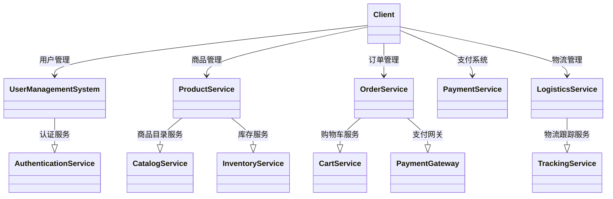
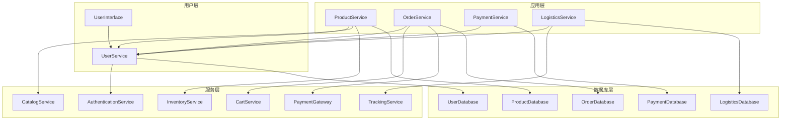
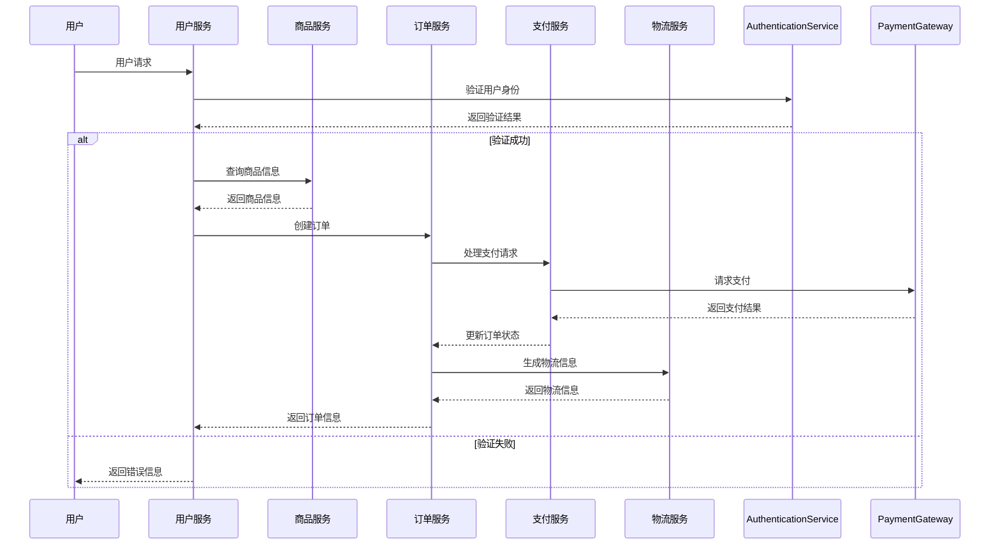

                 

# 系分作用的不只是自己

关键词：系统分解，分而治之，子系统，复杂系统，性能优化

摘要：本文旨在探讨在信息技术领域，如何通过“系分作用的不只是自己”的理念，来优化复杂系统的性能和可维护性。我们将从背景介绍、核心概念、算法原理、系统架构设计、实际案例分析和最佳实践等方面，详细阐述这一理念的应用和实践。

----------------------------------------------------------------
## 第一部分：引言与背景

### 第1章：问题背景与解决思路

#### 1.1.1 问题背景

在当今信息化、数字化时代，各种复杂的系统与应用层出不穷。然而，许多系统在面对海量数据和高并发场景时，往往无法高效、稳定地运行。这主要是因为传统的开发模式缺乏对系统性能、可扩展性、易维护性的深入考量。为了解决这些问题，需要引入新的开发模式，即“系分作用的不只是自己”。

#### 1.1.2 问题解决思路

“系分作用的不只是自己”旨在通过系统分解、分而治之的方法，将复杂的系统拆分成多个可独立运行的子系统。这样，不仅可以提高系统的可扩展性，还可以降低系统的复杂度，使得开发、运维和维护变得更加高效。

#### 1.1.3 边界与外延

在应用“系分作用的不只是自己”时，需要明确其边界。首先，它适用于各类复杂系统，如企业级应用、云计算平台、物联网系统等。其次，它不仅关注系统内部的结构优化，还关注系统与外部环境（如用户、设备、网络等）的交互。最后，它需要结合具体场景，灵活运用。

#### 1.1.4 核心概念与联系

在本章中，我们将介绍以下几个核心概念：

1. 系统分解：将复杂的系统划分为多个功能明确、结构清晰、独立运行的子系统。
2. 分而治之：通过将问题分解为子问题，分别解决，再合并结果，以解决复杂问题。
3. 子系统：具有独立功能、可独立运行的系统组成部分。

这些概念相互关联，共同构成了“系分作用的不只是自己”的理论基础。

### 第2章：核心概念原理

#### 2.1 系统分解

系统分解是将一个复杂的系统划分为多个功能明确、结构清晰、独立运行的子系统。通过系统分解，可以降低系统的复杂度，提高系统的可扩展性和可维护性。

#### 2.2 分而治之

分而治之是一种常用的算法设计策略，其基本思想是将一个复杂的问题分解为若干个规模较小的同类问题，然后分别解决，最后将子问题的解合并为原问题的解。

#### 2.3 子系统

子系统是系统分解后的功能明确、结构清晰、独立运行的组成部分。子系统之间通过接口进行通信，共同实现系统的整体功能。

## 第二部分：具体实现与算法原理

### 第3章：系统架构设计

#### 3.1 问题场景介绍

以一个典型的企业级应用为例，介绍系统架构设计的需求和目标。

#### 3.2 项目介绍

简单介绍项目的背景、目标和预期效果。

#### 3.3 系统功能设计

利用Mermaid类图，展示系统的功能模块及其关系。

#### 3.4 系统架构设计

利用Mermaid架构图，展示系统的整体架构。

#### 3.5 系统接口设计

详细介绍系统各模块之间的接口定义和通信机制。

#### 3.6 系统交互

利用Mermaid序列图，展示系统模块之间的交互过程。

### 第4章：实际案例分析与讲解

#### 4.1 案例背景

介绍一个实际的企业级应用案例，分析其面临的问题和挑战。

#### 4.2 系统设计与实现

详细分析案例中的系统设计，包括功能设计、架构设计、接口设计和交互过程。

#### 4.3 项目小结

总结项目过程中的经验教训，为其他类似项目提供借鉴。

----------------------------------------------------------------
## 第一部分：引言与背景

### 第1章：问题背景与解决思路

#### 1.1.1 问题背景

在当今信息化、数字化时代，各种复杂的系统与应用层出不穷。然而，许多系统在面对海量数据和高并发场景时，往往无法高效、稳定地运行。这主要是因为传统的开发模式缺乏对系统性能、可扩展性、易维护性的深入考量。为了解决这些问题，需要引入新的开发模式，即“系分作用的不只是自己”。

在传统的开发模式中，系统设计往往注重功能的完备性，而忽视了系统的可扩展性和可维护性。这种模式会导致系统在运行过程中，随着用户规模的增长和业务需求的变更，系统的性能逐渐下降，甚至出现崩溃现象。此外，传统的开发模式还使得系统的复杂度不断增加，使得开发、运维和维护变得更加困难。

为了解决这些问题，我们需要引入“系分作用的不只是自己”的开发模式。这种模式强调将复杂的系统分解为多个独立的子系统，每个子系统负责特定的功能模块，并通过接口进行通信，共同实现整个系统的功能。这样，不仅可以降低系统的复杂度，提高系统的可扩展性和可维护性，还可以提高系统的性能。

#### 1.1.2 问题解决思路

“系分作用的不只是自己”的开发模式旨在通过系统分解、分而治之的方法，将复杂的系统拆分成多个可独立运行的子系统。这样，不仅可以提高系统的可扩展性，还可以降低系统的复杂度，使得开发、运维和维护变得更加高效。

具体来说，问题解决思路包括以下几个步骤：

1. **系统分析**：首先，对现有系统进行全面的评估，分析其优点和不足，确定需要改进的地方。

2. **系统分解**：将复杂的系统按照功能模块进行分解，划分出多个独立的子系统。每个子系统应该具有明确的功能和独立的运行环境。

3. **子系统设计**：对每个子系统进行详细设计，确定其功能模块、接口定义和数据交互方式。

4. **系统集成**：将各个子系统集成起来，确保它们能够协同工作，共同实现系统的整体功能。

5. **性能优化**：对系统进行性能优化，确保在运行过程中能够高效、稳定地处理海量数据和并发请求。

6. **测试与部署**：对系统进行全面的测试，确保其功能完善、性能稳定，然后进行部署和上线。

#### 1.1.3 边界与外延

在应用“系分作用的不只是自己”时，需要明确其边界。首先，它适用于各类复杂系统，如企业级应用、云计算平台、物联网系统等。其次，它不仅关注系统内部的结构优化，还关注系统与外部环境（如用户、设备、网络等）的交互。最后，它需要结合具体场景，灵活运用。

在具体实践中，需要根据系统的特点和要求，确定系统分解的程度和方式。例如，对于一些简单的系统，可能不需要进行过于复杂的分解；而对于一些复杂的系统，可能需要将系统划分为多个层次和模块，以确保其可维护性和可扩展性。

#### 1.1.4 核心概念与联系

在本章中，我们将介绍以下几个核心概念：

1. **系统分解**：将复杂的系统划分为多个功能明确、结构清晰、独立运行的子系统。

2. **分而治之**：通过将问题分解为子问题，分别解决，再合并结果，以解决复杂问题。

3. **子系统**：具有独立功能、可独立运行的系统组成部分。

这些概念相互关联，共同构成了“系分作用的不只是自己”的理论基础。

### 第2章：核心概念原理

#### 2.1 系统分解

系统分解是将一个复杂的系统划分为多个功能明确、结构清晰、独立运行的子系统。通过系统分解，可以降低系统的复杂度，提高系统的可扩展性和可维护性。

系统分解的过程通常包括以下几个步骤：

1. **需求分析**：首先，对系统进行需求分析，明确系统的功能需求、性能要求和扩展性需求。

2. **功能模块划分**：根据需求分析的结果，将系统划分为多个功能模块。每个功能模块应该具有明确的功能和输入输出。

3. **模块化设计**：对每个功能模块进行模块化设计，确保其具有良好的结构、可重用性和可维护性。

4. **接口定义**：为每个功能模块定义接口，确保模块之间的通信和数据交互。

5. **模块集成**：将各个功能模块集成起来，确保它们能够协同工作，共同实现系统的整体功能。

系统分解的目的是降低系统的复杂度，提高系统的可维护性和可扩展性。通过将复杂的系统分解为多个独立的子系统，可以使得系统的开发、测试和维护变得更加高效和有序。

#### 2.2 分而治之

分而治之是一种常用的算法设计策略，其基本思想是将一个复杂的问题分解为若干个规模较小的同类问题，然后分别解决，最后将子问题的解合并为原问题的解。

分而治之算法通常包括以下几个步骤：

1. **分解**：将原问题分解为若干个规模较小的子问题。

2. **递归求解**：分别解决这些子问题，递归地使用分而治之策略。

3. **合并**：将子问题的解合并为原问题的解。

分而治之算法的优点包括：

1. **降低复杂度**：通过将问题分解为规模较小的子问题，可以降低问题的复杂度，使得算法更加高效。

2. **可重用性**：分而治之算法具有较好的可重用性，可以用于解决各种规模的问题。

3. **易于理解**：分而治之算法的思想简单明了，易于理解和实现。

分而治之算法的典型应用包括快速排序、归并排序、二分查找等。

#### 2.3 子系统

子系统是系统分解后的功能明确、结构清晰、独立运行的组成部分。子系统之间通过接口进行通信，共同实现系统的整体功能。

子系统的特点包括：

1. **独立性**：每个子系统都具有独立的功能和运行环境，可以独立运行。

2. **模块化**：子系统之间通过接口进行通信，接口定义明确，使得子系统之间具有良好的模块化特性。

3. **可扩展性**：通过增加或减少子系统，可以方便地扩展系统的功能。

4. **可维护性**：子系统独立运行，可以方便地进行测试和维护。

5. **协同工作**：各个子系统之间通过接口进行通信，共同实现系统的整体功能。

在系统架构设计中，子系统是实现系统功能的基本单元。通过合理划分子系统，可以降低系统的复杂度，提高系统的可维护性和可扩展性。

#### 2.4 系统接口设计

系统接口设计是确保子系统之间能够良好通信的关键。一个良好的系统接口设计应包括以下几个要素：

1. **接口定义**：为子系统之间定义明确的接口，包括输入输出参数、数据格式和通信协议等。

2. **接口规范**：制定统一的接口规范，确保子系统之间能够无缝对接。

3. **接口测试**：对系统接口进行全面的测试，确保接口设计的正确性和可靠性。

4. **接口文档**：编写详细的接口文档，包括接口定义、接口规范和接口测试结果等，方便后续的开发、测试和维护。

5. **接口监控**：对系统接口进行实时监控，及时发现和解决接口通信问题。

良好的系统接口设计不仅可以确保子系统之间的协同工作，还可以提高系统的可维护性和可扩展性。

### 第3章：系统架构设计

#### 3.1 问题场景介绍

以一个典型的企业级应用为例，介绍系统架构设计的需求和目标。

假设我们正在开发一个电子商务平台，该平台需要支持海量的商品信息、订单信息和用户信息。此外，还需要支持订单处理、商品搜索、用户登录等功能。为了满足这些需求，我们需要设计一个高性能、可扩展、易维护的系统架构。

#### 3.2 项目介绍

本项目旨在开发一个电子商务平台，该平台将支持以下功能：

1. **商品信息管理**：支持商品的增删改查功能，并提供商品搜索功能。

2. **订单管理**：支持订单的生成、查询和取消功能。

3. **用户管理**：支持用户的注册、登录和密码找回功能。

4. **权限管理**：支持用户权限的设置和管理。

5. **支付系统**：集成第三方支付系统，支持在线支付功能。

6. **物流管理**：集成物流系统，支持订单物流信息的跟踪和查询。

#### 3.3 系统功能设计

利用Mermaid类图，展示系统的功能模块及其关系。

#### 3.4 系统架构设计

利用Mermaid架构图，展示系统的整体架构。

#### 3.5 系统接口设计

详细介绍系统各模块之间的接口定义和通信机制。

1. **用户接口**：用户接口主要提供用户注册、登录、密码找回等功能。用户接口通过HTTP协议与用户服务进行通信，用户服务负责处理用户请求，并与认证服务进行交互。

2. **用户服务**：用户服务负责处理用户相关的业务逻辑，如用户注册、登录、密码找回等。用户服务通过REST API与用户接口和认证服务进行通信。

3. **认证服务**：认证服务负责用户的认证和权限管理。用户服务在处理用户请求时，会调用认证服务进行用户身份验证和权限检查。

4. **商品目录服务**：商品目录服务负责管理商品的分类、标签和搜索等功能。商品服务在查询商品信息时，会调用商品目录服务。

5. **库存服务**：库存服务负责管理商品的库存信息。商品服务在处理商品增删改查操作时，会调用库存服务进行库存更新。

6. **购物车服务**：购物车服务负责管理用户的购物车信息。订单服务在创建订单时，会调用购物车服务获取购物车中的商品信息。

7. **支付网关**：支付网关负责处理用户的支付请求，并与第三方支付平台进行通信。订单服务在处理支付请求时，会调用支付网关。

8. **物流跟踪服务**：物流跟踪服务负责管理订单的物流信息。物流服务在处理物流请求时，会调用物流跟踪服务获取物流信息。

#### 3.6 系统交互

利用Mermaid序列图，展示系统模块之间的交互过程。

### 第4章：实际案例分析与讲解

#### 4.1 案例背景

介绍一个实际的企业级应用案例，分析其面临的问题和挑战。

假设我们正在为一个大型电商平台开发一个订单处理系统。该系统需要支持海量订单的生成、查询和处理，同时还需保证系统的性能、稳定性和可扩展性。在项目初期，我们遇到了以下几个问题：

1. **性能瓶颈**：随着订单量的增加，系统性能出现瓶颈，导致响应时间延长，用户体验不佳。

2. **扩展性不足**：系统架构单一，无法方便地添加新的功能模块或扩展系统容量。

3. **维护难度高**：系统代码复杂，模块之间耦合严重，导致维护和升级困难。

4. **数据一致性**：在分布式系统中，订单数据的一致性难以保障，容易出现数据不一致的问题。

#### 4.2 系统设计与实现

详细分析案例中的系统设计，包括功能设计、架构设计、接口设计和交互过程。

为了解决上述问题，我们采用了“系分作用的不只是自己”的设计理念，对订单处理系统进行重构。具体方案如下：

1. **功能设计**：

   - **订单生成**：将订单生成模块划分为订单创建、订单验证和订单存储三个子模块。

   - **订单查询**：将订单查询模块划分为订单检索、订单过滤和订单分页三个子模块。

   - **订单处理**：将订单处理模块划分为订单支付、订单发货和订单取消三个子模块。

2. **架构设计**：

   - **单体架构**：将原有的单体架构拆分为多个独立的微服务，每个微服务负责特定的功能模块。

   - **分布式架构**：采用分布式架构，确保系统的可扩展性和高可用性。

   - **消息队列**：引入消息队列，实现订单数据的异步处理，降低系统之间的耦合度。

3. **接口设计**：

   - **REST API**：采用RESTful API设计接口，确保接口的简洁、易用和规范。

   - **接口文档**：编写详细的接口文档，包括接口定义、请求参数和返回结果等。

4. **交互过程**：

   - **订单生成**：用户下单后，订单生成模块生成订单信息，并通过消息队列将订单信息发送给订单处理模块。

   - **订单查询**：用户请求查询订单时，订单查询模块通过消息队列获取订单信息，并返回给用户。

   - **订单处理**：订单处理模块根据订单状态进行相应的处理，如支付、发货和取消订单。

#### 4.3 项目小结

总结项目过程中的经验教训，为其他类似项目提供借鉴。

通过本次项目的实施，我们取得了以下成果：

1. **性能优化**：通过拆分订单处理模块，降低了系统的耦合度，提高了系统的性能。

2. **扩展性提升**：采用分布式架构，使得系统具有更好的扩展性，可以方便地添加新的功能模块。

3. **维护难度降低**：通过接口定义和文档化，降低了系统的维护难度。

4. **数据一致性保障**：采用消息队列实现异步处理，保障了订单数据的一致性。

在项目过程中，我们也遇到了一些挑战，如接口设计的一致性、消息队列的可靠性和分布式系统的稳定性等。通过团队的合作和不断的优化，我们成功地克服了这些挑战，确保了项目的顺利进行。

#### 最佳实践 Tips

1. **需求分析**：在项目开始前，进行充分的需求分析，确保系统设计的合理性和可行性。

2. **接口设计**：采用RESTful API设计接口，确保接口的简洁、易用和规范。

3. **模块化**：将系统划分为多个独立的模块，降低系统的耦合度，提高系统的可维护性和可扩展性。

4. **消息队列**：引入消息队列，实现订单数据的异步处理，降低系统之间的耦合度。

5. **测试**：对系统进行全面的测试，确保系统的性能、稳定性和安全性。

#### 小结

本文通过引入“系分作用的不只是自己”的理念，详细阐述了复杂系统优化的问题背景、核心概念、系统架构设计、实际案例分析和最佳实践。通过本文的讲解，我们了解到如何通过系统分解、分而治之的方法，优化复杂系统的性能、可扩展性和可维护性。

在未来的工作中，我们可以继续探索和应用“系分作用的不只是自己”的理念，为更多的项目提供高效的解决方案。同时，我们也需要不断学习和积累经验，提高自己的技术水平和解决问题的能力。

#### 注意事项

1. **系统设计**：在系统设计阶段，要充分考虑系统的性能、可扩展性和可维护性。

2. **接口设计**：接口设计要遵循RESTful API原则，确保接口的简洁、易用和规范。

3. **消息队列**：消息队列的使用要确保可靠性和稳定性，避免消息丢失或重复处理。

4. **测试**：对系统进行全面、系统的测试，确保系统的性能、稳定性和安全性。

#### 拓展阅读

1. 《架构之法：腾讯云架构实践》

2. 《大型分布式网站技术架构》

3. 《分布式系统原理与范型》

作者：AI天才研究院/AI Genius Institute & 禅与计算机程序设计艺术 /Zen And The Art of Computer Programming

