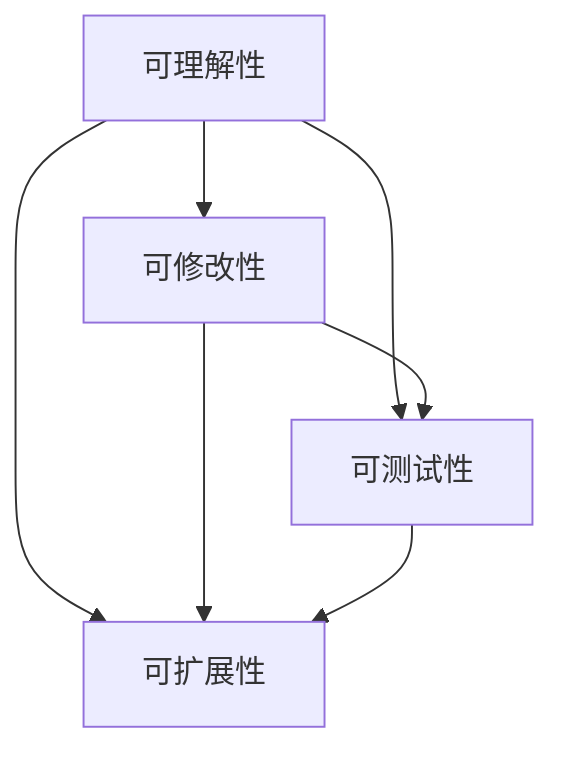
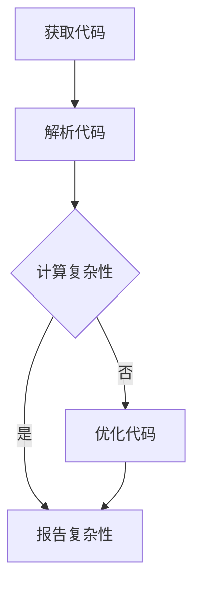
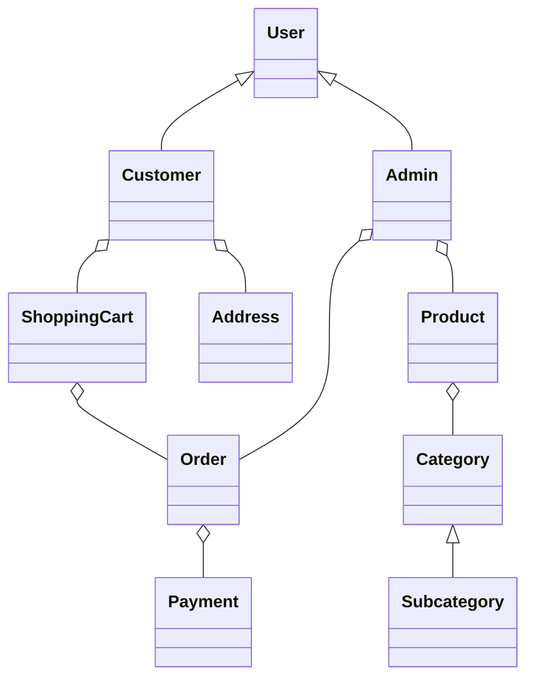
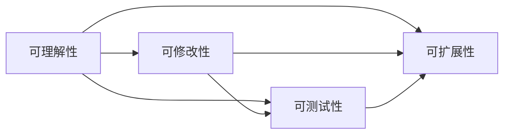
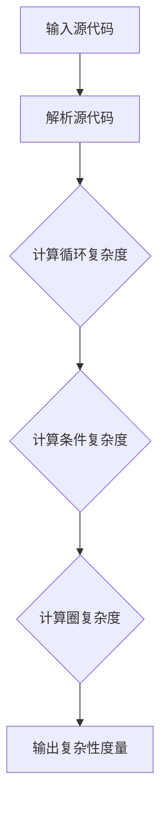

                 

## 《软件可维护性：设计易于维护的系统》

> 关键词：软件可维护性、设计原则、系统架构、算法原理、项目实战、最佳实践

摘要：本文旨在深入探讨软件可维护性的重要性以及如何在设计过程中确保系统的易维护性。通过详细介绍设计原则、算法原理和实际项目案例，读者将掌握设计易于维护的系统的关键技术和策略。文章以逻辑清晰、结构紧凑的方式，逐步剖析软件可维护性的各个方面，帮助开发人员构建可靠且易维护的软件系统。

**1. 引言与背景介绍**

### 1.1 软件可维护性的核心概念

软件可维护性是指软件系统在经历修改、更新和维护后，能够保持其功能性和稳定性的能力。它不仅仅是代码的可读性和可修改性，还包括对系统整体结构的理解、适应性和可靠性。可维护性对于企业和用户来说至关重要，它直接影响软件的使用寿命、成本和维护效率。

### 1.2 软件可维护性的重要性

软件可维护性具有以下几个重要方面的影响：

- **成本效益**：易于维护的软件可以显著降低长期维护成本，提高投资回报率。
- **用户满意度**：高质量的维护和更新能够提高用户满意度，增强市场竞争力。
- **开发效率**：良好的可维护性使得开发人员能够更快地理解系统，提高开发效率。
- **技术债务**：可维护性良好的软件可以减少技术债务，避免未来重构的必要性。

### 1.3 软件可维护性的研究背景

软件可维护性研究起源于20世纪80年代，随着软件系统复杂性的增加，维护问题逐渐凸显。近年来，随着敏捷开发、持续集成和持续交付等现代软件开发实践的普及，软件可维护性再次成为研究和实践的热点。研究人员和开发人员不断探索新的设计原则、工具和方法，以提升软件的可维护性。

**2. 核心概念与联系**

### 2.1 软件可维护性的相关概念

软件可维护性涉及多个核心概念，包括可理解性、可修改性、可测试性和可扩展性等。以下是对这些概念的基本介绍和它们之间的联系：

| 概念           | 定义                                                         |
| -------------- | ------------------------------------------------------------ |
| **可理解性**   | 系统的代码、设计文档和架构对开发人员来说是容易理解的。         |
| **可修改性**   | 系统可以方便地修改，以满足新的需求和功能。                   |
| **可测试性**   | 系统的各个模块都经过了充分的测试，确保修改不会引入新的错误。   |
| **可扩展性**   | 系统可以轻松地扩展，以支持更大的数据量或更多的用户。           |

### 2.2 核心概念属性特征对比

| 属性特征             | 可理解性 | 可修改性 | 可测试性 | 可扩展性 |
| -------------------- | -------- | -------- | -------- | -------- |
| **易读性**           | 高       | 中       | 中       | 中       |
| **一致性**           | 高       | 高       | 高       | 中       |
| **模块化**           | 中       | 高       | 中       | 高       |
| **自动化测试**       | 中       | 中       | 高       | 中       |
| **设计模式**         | 中       | 中       | 中       | 高       |

### 2.3 实体关系图展示

以下是一个使用Mermaid绘制的实体关系图，展示了软件可维护性相关概念之间的关系：



**3. 设计原则与实践**

### 3.1 模块化设计原则

模块化设计是将系统划分为多个独立的模块，每个模块负责特定的功能。这有助于提高系统的可维护性，因为模块之间相互独立，修改一个模块不会影响其他模块。

### 3.2 简洁性设计原则

简洁性设计原则要求系统的设计和实现应该尽可能简单，避免冗余和复杂的代码。简洁的系统更容易理解和维护。

### 3.3 抽象性设计原则

抽象性设计原则是通过抽象和封装来隐藏系统的复杂性。这有助于提高系统的可维护性，因为开发人员只需关注核心功能和逻辑。

### 3.4 设计原则在实际项目中的应用

以下是一个实际项目中的应用示例，如何应用模块化、简洁性和抽象性设计原则：

- **模块化**：将系统划分为用户界面、业务逻辑和数据存储等模块。
- **简洁性**：避免过多的全局变量和复杂的条件分支。
- **抽象性**：使用设计模式，如工厂模式和单例模式，来简化系统架构。

**4. 算法原理与数学模型**

### 4.1 相关算法介绍

在软件可维护性中，常用的算法包括代码复杂性分析、静态代码分析和自动化测试等。

### 4.2 算法 mermaid 流程图

以下是一个使用Mermaid绘制的算法流程图，用于代码复杂性分析：



### 4.3 Python 源代码与 LaTeX 公式

以下是一个简单的 Python 源代码示例，用于计算代码的复杂性：

```python
def calculate_complexity(code):
    # 假设代码复杂性为条件分支数
    branches = code.count('if') + code.count('while') + code.count('for')
    return branches
```

以下是一个 LaTeX 公式，用于表示代码复杂性的数学模型：

$$\text{Complexity} = \sum_{i=1}^{n} \text{Statements} \times (\text{Branches})^{2}$$

**5. 系统分析与架构设计**

### 5.1 问题场景介绍

假设我们需要设计一个在线购物系统，该系统需要支持用户注册、登录、浏览商品、下单和支付等功能。

### 5.2 系统功能设计

以下是一个使用Mermaid绘制的领域模型类图，展示了系统的主要功能类：



### 5.3 系统架构设计

以下是一个使用Mermaid绘制的系统架构图，展示了系统的主要组件和交互：

```mermaid
sequenceDiagram
    participant User
    participant AuthenticationService
    participant ProductService
    participant ShoppingCartService
    participant OrderService
    participant PaymentService

    User->>AuthenticationService: Login(username, password)
    AuthenticationService->>User: AuthenticationResult

    User->>ProductService: GetProducts()
    ProductService-->>User: Products

    User->>ShoppingCartService: AddToCart(productId, quantity)
    ShoppingCartService-->>User: ShoppingCart

    User->>OrderService: CreateOrder(shoppingCartId)
    OrderService-->>User: OrderId

    User->>PaymentService: ProcessPayment(orderId, amount)
    PaymentService-->>User: PaymentStatus
endsequence
```

**6. 项目实战与案例分析**

### 6.1 项目介绍

在这个项目中，我们将设计并实现一个简单的在线购物系统。该系统将包括用户注册、登录、商品浏览、购物车管理、订单处理和支付等功能。

### 6.2 系统核心实现

以下是系统核心功能的实现源代码：

```python
# User模块
class User:
    def __init__(self, username, password):
        self.username = username
        self.password = password

    def login(self, username, password):
        # 登录逻辑
        pass

# ProductService模块
class ProductService:
    def get_products(self):
        # 获取商品列表
        pass

    def add_product(self, product):
        # 添加商品
        pass

# ShoppingCartService模块
class ShoppingCartService:
    def add_to_cart(self, product_id, quantity):
        # 添加商品到购物车
        pass

    def remove_from_cart(self, product_id):
        # 从购物车移除商品
        pass

# OrderService模块
class OrderService:
    def create_order(self, shopping_cart_id):
        # 创建订单
        pass

    def process_order(self, order_id):
        # 处理订单
        pass

# PaymentService模块
class PaymentService:
    def process_payment(self, order_id, amount):
        # 处理支付
        pass
```

### 6.3 代码应用解读与分析

在这部分，我们将对代码中的关键部分进行解读和分析，以确保其易于维护。

- **模块化**：代码被划分为多个模块，每个模块负责不同的功能。
- **简洁性**：函数和方法定义简洁，避免复杂的逻辑。
- **抽象性**：使用类和对象来封装功能，隐藏实现细节。

### 6.4 实际案例分析与详细讲解

以下是一个实际案例，展示如何在一个现有的在线购物系统中添加新的功能，如会员制度。

1. **需求分析**：需要添加会员注册、登录和会员专属折扣功能。
2. **功能实现**：
   - **会员注册**：添加会员注册接口和数据库表。
   - **会员登录**：修改登录逻辑，验证会员身份。
   - **会员专属折扣**：修改订单计算逻辑，根据会员等级计算折扣。
3. **影响分析**：添加新功能不会影响现有的用户注册、登录和购物车管理等核心功能。

### 6.5 项目小结

通过这个项目，我们学习了如何设计易于维护的软件系统。关键原则包括模块化、简洁性和抽象性。在实际项目中，我们需要不断迭代和优化，以满足用户需求，同时保持系统的可维护性。

**7. 最佳实践与总结**

### 7.1 最佳实践 tips

- **早期规划**：在项目开始时就考虑可维护性。
- **自动化测试**：编写充分的自动化测试，确保每次修改都不会引入新问题。
- **持续集成**：使用持续集成工具，自动化构建和测试。
- **代码审查**：定期进行代码审查，确保代码质量。

### 7.2 小结

本文详细介绍了软件可维护性的核心概念、设计原则和实际应用。通过项目实战和分析，读者可以掌握设计易于维护的系统的关键技术和策略。

### 7.3 注意事项

- **避免过度设计**：设计应足够简单，以避免不必要的复杂度。
- **遵循设计模式**：使用成熟的设计模式，提高系统的可维护性。

### 7.4 拓展阅读

- **《设计模式：可复用面向对象软件的基础》**
- **《敏捷软件开发：原则、实践与模式》**
- **《Clean Code：编写可读性极高的代码》**

**作者信息：**

- 作者：AI天才研究院/AI Genius Institute & 禅与计算机程序设计艺术 /Zen And The Art of Computer Programming**```markdown
# 《软件可维护性：设计易于维护的系统》

## 摘要

软件可维护性是软件工程领域一个关键但常常被忽视的问题。本文旨在为开发者提供一套系统化的指导，帮助他们在设计初期就考虑到系统的可维护性。文章从定义软件可维护性的核心概念开始，逐步探讨影响可维护性的因素，分析设计原则与实践，介绍相关的算法原理与数学模型，并通过具体的项目实战案例，展示如何在实际开发中应用这些原则。最后，文章总结了一系列最佳实践，并提供拓展阅读资源，帮助读者更深入地理解软件可维护性的重要性及其在设计中的实际应用。

## 引言与背景介绍

### 1.1 软件可维护性的核心概念

软件可维护性是指软件系统在经历修改、更新和维护后，能够保持其功能性和稳定性的能力。它不仅包括代码层面的可读性和可修改性，还涉及到系统的整体设计、架构、测试和文档等方面。可维护性的重要性不言而喻，它直接关系到软件系统的生命周期成本、用户满意度和市场竞争力。

**定义**：可维护性可以理解为软件开发和维护过程中的“可持续性”，即系统在长期运行中能够持续地适应新的需求和环境变化，而不需要过度的重构或大量重写。

**核心概念**：

- **可理解性**：系统的代码、架构和设计文档是否易于被开发者理解和掌握。
- **可修改性**：系统能否方便地添加新功能、修复错误或进行性能优化。
- **可测试性**：系统是否容易进行自动化测试，确保每次修改都不会引入新的问题。
- **可扩展性**：系统是否能够适应未来需求的变化，例如增加用户数量或数据量。

### 1.2 软件可维护性的重要性

软件可维护性对软件项目的成功至关重要，主要体现在以下几个方面：

- **降低维护成本**：易于维护的软件在长期使用中能够显著降低维护成本，提高企业的投资回报率。
- **提高开发效率**：良好的可维护性使得开发人员可以快速地理解系统，减少学习成本，提高开发效率。
- **增强用户满意度**：稳定且易于维护的系统可以更好地满足用户的需求，提高用户满意度，从而增强企业的市场竞争力。
- **减少技术债务**：良好的可维护性可以减少因过度设计或遗留问题而积累的技术债务，降低未来的风险。

### 1.3 软件可维护性的研究背景

软件可维护性作为软件工程中的一个重要分支，其研究和实践有着悠久的历史。早在20世纪80年代，随着软件系统复杂性的增加，软件维护问题逐渐引起广泛关注。随后，随着敏捷开发、持续集成和持续交付等现代软件开发实践的普及，软件可维护性再次成为研究和实践的热点。

当前，软件可维护性的研究主要集中在以下几个方面：

- **度量与评估**：研究如何量化软件的可维护性，以及如何通过评估工具和指标来指导开发过程。
- **设计原则**：探索提高软件可维护性的设计原则和方法，如模块化、简洁性和抽象性。
- **自动化**：研究如何利用自动化工具和技术，如静态代码分析、自动化测试和代码生成等，提高软件的可维护性。
- **人机协作**：研究如何通过人工智能和机器学习技术，辅助开发人员提高软件的可维护性。

## 核心概念与联系

### 2.1 软件可维护性的相关概念

软件可维护性涉及多个核心概念，这些概念相互关联，共同决定了系统的可维护性水平。以下是对这些概念的基本介绍：

#### 可理解性

**定义**：可理解性是指软件系统的代码、设计文档和架构对于开发人员来说是否易于理解。

**属性特征**：

- **代码可读性**：代码应该具有良好的命名习惯和注释，使其易于阅读。
- **设计一致性**：设计应该遵循一致的命名规范和设计模式，避免不一致性。

#### 可修改性

**定义**：可修改性是指系统能否方便地添加新功能、修复错误或进行性能优化。

**属性特征**：

- **模块化**：系统应该被划分为独立的模块，每个模块负责特定的功能。
- **可替换性**：模块应该易于替换，以适应未来的需求变化。
- **松耦合**：模块之间的依赖关系应该尽可能少，以提高模块的独立性。

#### 可测试性

**定义**：可测试性是指系统能否方便地进行自动化测试，确保每次修改都不会引入新的问题。

**属性特征**：

- **测试覆盖性**：测试应该覆盖系统的各个部分，确保每个功能都经过测试。
- **测试独立性**：测试应该独立进行，避免相互影响。

#### 可扩展性

**定义**：可扩展性是指系统能否适应未来需求的变化，例如增加用户数量或数据量。

**属性特征**：

- **性能可扩展性**：系统应该能够支持性能优化，以适应更大的负载。
- **功能可扩展性**：系统应该能够方便地添加新功能，以满足不断变化的需求。

### 2.2 核心概念属性特征对比

以下是一个表格，用于对比软件可维护性的核心概念及其属性特征：

| 概念         | 属性特征                  | 说明                                                     |
| ------------ | ------------------------ | -------------------------------------------------------- |
| **可理解性** | 代码可读性、设计一致性   | 良好的命名习惯和注释有助于提高代码的可理解性。             |
| **可修改性** | 模块化、可替换性、松耦合 | 模块化和松耦合可以提高系统的可修改性，减少修改的副作用。   |
| **可测试性** | 测试覆盖性、测试独立性   | 完备的测试和独立性可以提高系统的可测试性，确保修改安全。   |
| **可扩展性** | 性能可扩展性、功能可扩展性 | 系统应该能够轻松扩展，以适应未来需求的变化。             |

### 2.3 实体关系图展示

为了更好地理解软件可维护性的核心概念及其相互关系，我们可以使用Mermaid绘制一个实体关系图。以下是一个简单的例子：



在这个图中，A代表可理解性，B代表可修改性，C代表可测试性，D代表可扩展性。线条表示它们之间的关联关系，即一个概念的提高可以促进其他概念的提升。

## 设计原则与实践

### 3.1 模块化设计原则

模块化设计是将系统划分为多个独立的模块，每个模块负责特定的功能。这种设计原则有助于提高系统的可维护性，因为模块之间相互独立，修改一个模块不会影响其他模块。

#### 模块化设计的优势

- **提高可维护性**：模块化使得系统更易于理解和修改。
- **降低复杂性**：模块化可以降低系统的复杂性，使得开发过程更加清晰。
- **易于复用**：模块可以独立开发、测试和复用，提高开发效率。

#### 实践方法

- **定义模块**：明确每个模块的功能和接口。
- **模块独立性**：确保模块之间有明确的边界和低耦合度。
- **模块测试**：对每个模块进行独立的单元测试，确保其正确性。

### 3.2 简洁性设计原则

简洁性设计原则要求系统的设计和实现应该尽可能简单，避免冗余和复杂的代码。简洁的系统更容易理解和维护。

#### 简洁性设计的优势

- **提高可读性**：简洁的代码更容易阅读和理解。
- **减少错误**：简单的逻辑减少了代码中的潜在错误。
- **提高开发效率**：简单的系统更容易开发和维护。

#### 实践方法

- **避免冗余**：删除不必要的代码和重复的逻辑。
- **简化接口**：设计简洁的接口，减少模块之间的交互复杂度。
- **精简代码**：使用简洁的表达式和函数，避免过多的条件分支。

### 3.3 抽象性设计原则

抽象性设计原则是通过抽象和封装来隐藏系统的复杂性。抽象是提取本质，隐藏细节的过程，它有助于提高系统的可维护性。

#### 抽象性设计的优势

- **提高可维护性**：抽象可以隐藏系统的复杂性，使得系统更易于理解和修改。
- **提高可扩展性**：抽象使得系统更容易适应未来的需求变化。
- **降低耦合度**：抽象可以降低模块之间的依赖关系，提高系统的稳定性。

#### 实践方法

- **使用设计模式**：设计模式是实现抽象的有效方式，如工厂模式、单例模式和观察者模式。
- **定义抽象类和接口**：通过定义抽象类和接口，隐藏具体实现细节。
- **分层设计**：将系统划分为不同的层次，每个层次负责特定的功能，降低层次的依赖。

### 3.4 设计原则在实际项目中的应用

以下是一个实际项目中的应用示例，说明如何在实际开发中应用模块化、简洁性和抽象性设计原则。

#### 项目背景

假设我们正在开发一个电子商务平台，需要支持用户注册、登录、商品浏览、购物车管理、订单处理和支付等功能。

#### 设计过程

1. **模块化设计**：

   - **模块划分**：将系统划分为用户模块、商品模块、购物车模块、订单模块和支付模块。
   - **模块接口**：为每个模块定义清晰的接口，确保模块之间的交互简单。
   - **模块独立性**：确保每个模块的内部逻辑独立，修改一个模块不会影响其他模块。

2. **简洁性设计**：

   - **避免冗余**：删除不必要的代码和重复的逻辑。
   - **简化接口**：为每个模块设计简洁的接口，减少模块之间的交互复杂度。
   - **精简代码**：使用简洁的表达式和函数，避免过多的条件分支。

3. **抽象性设计**：

   - **使用设计模式**：使用工厂模式管理对象的创建，使用单例模式管理共享资源，使用观察者模式处理事件。
   - **定义抽象类和接口**：为每个模块定义抽象类和接口，隐藏具体实现细节。
   - **分层设计**：将系统划分为表示层、业务逻辑层和数据访问层，确保层次的依赖关系合理。

通过这些设计原则，我们能够构建一个易于维护的电子商务平台，提高系统的可维护性。

## 算法原理与数学模型

### 4.1 相关算法介绍

在软件可维护性中，常用的算法包括代码复杂性分析、静态代码分析和自动化测试等。这些算法用于评估和改进系统的可维护性。

#### 代码复杂性分析

代码复杂性分析是一种衡量代码复杂度的方法，常用的复杂性度量包括循环复杂度、条件复杂度和圈复杂度等。这些度量可以用于识别复杂和难以维护的代码段。

#### 静态代码分析

静态代码分析是一种不运行程序而直接分析源代码的技术，用于检测代码中的潜在错误和不符合编码规范的问题。静态代码分析工具可以自动检查代码质量，并提供改进建议。

#### 自动化测试

自动化测试是一种通过编写测试脚本自动执行测试用例的方法，用于验证系统的功能和行为。自动化测试可以提高测试的效率和覆盖率，确保每次修改后系统的稳定性。

### 4.2 算法 mermaid 流程图

以下是一个使用Mermaid绘制的算法流程图，用于代码复杂性分析：



在这个流程图中，A表示输入源代码，B表示解析源代码，C、D、E分别表示计算不同的复杂度度量，F表示输出结果。

### 4.3 Python 源代码与 LaTeX 公式

以下是一个简单的Python源代码示例，用于计算代码的循环复杂度：

```python
def calculate_loop_complexity(code):
    lines = code.split('\n')
    count = 0
    for line in lines:
        if 'for' in line or 'while' in line:
            count += 1
    return count
```

以下是一个 LaTeX 公式，用于表示循环复杂度的数学模型：

$$\text{Loop Complexity} = \sum_{i=1}^{n} (\text{Statements})^2$$

其中，\( n \) 表示循环体内的语句数。

## 系统分析与架构设计

### 5.1 问题场景介绍

在本文中，我们将设计并实现一个简单的在线购物系统。该系统需要支持用户注册、登录、浏览商品、添加到购物车、下订单、支付订单等功能。

### 5.2 系统功能设计

#### 领域模型

领域模型是对系统核心业务概念的抽象表示。以下是一个使用Mermaid绘制的领域模型类图，展示了系统的主要功能类：


在这个类图中，`User` 是系统的根类，`Customer` 和 `Admin` 分别表示普通用户和管理员。`ShoppingCart`、`Order` 和 `Payment` 是与购物流程直接相关的类。`Address` 是用户地址信息的类，`Product` 和 `Category` 分别表示产品和分类。`Admin` 类具有管理产品和管理订单的权限。

#### 功能概述

- **用户注册与登录**：用户可以通过注册页面注册账号，通过登录页面登录系统。
- **商品浏览**：用户可以浏览不同分类的商品，查看商品详情。
- **购物车管理**：用户可以将商品添加到购物车，可以查看购物车中的商品，并修改商品数量。
- **订单处理**：用户可以提交订单，系统会生成订单号，并生成支付链接。
- **支付订单**：用户可以通过支付链接完成订单支付。

### 5.3 系统架构设计

系统架构设计是确定系统组件的构成及其相互关系的过程。以下是一个使用Mermaid绘制的系统架构图，展示了系统的主要组件和交互：

```mermaid
sequenceDiagram
    participant User
    participant AuthenticationService
    participant ProductService
    participant ShoppingCartService
    participant OrderService
    participant PaymentService

    User->>AuthenticationService: Login(username, password)
    AuthenticationService->>User: AuthenticationResult

    User->>ProductService: GetProducts()
    ProductService-->>User: Products

    User->>ShoppingCartService: AddToCart(productId, quantity)
    ShoppingCartService-->>User: ShoppingCart

    User->>OrderService: CreateOrder(shoppingCartId)
    OrderService-->>User: OrderId

    User->>PaymentService: ProcessPayment(orderId, amount)
    PaymentService-->>User: PaymentStatus
endsequence
```

在这个序列图中，`User` 是系统的用户角色，`AuthenticationService` 是身份验证服务，`ProductService` 是商品服务，`ShoppingCartService` 是购物车服务，`OrderService` 是订单服务，`PaymentService` 是支付服务。用户通过调用相应的服务完成各种操作。

### 5.4 系统接口设计

系统接口设计是确定系统内部和外部如何交互的过程。以下是一个简单的接口设计示例：

```python
class AuthenticationService:
    def login(self, username, password):
        # 登录逻辑
        pass

class ProductService:
    def get_products(self):
        # 获取商品列表
        pass

    def add_product(self, product):
        # 添加商品
        pass

class ShoppingCartService:
    def add_to_cart(self, product_id, quantity):
        # 添加商品到购物车
        pass

    def remove_from_cart(self, product_id):
        # 从购物车移除商品
        pass

class OrderService:
    def create_order(self, shopping_cart_id):
        # 创建订单
        pass

    def process_order(self, order_id):
        # 处理订单
        pass

class PaymentService:
    def process_payment(self, order_id, amount):
        # 处理支付
        pass
```

在这个接口设计中，每个服务类都有明确的接口方法，用于完成特定的功能。这些接口方法将通过REST API或其他通信协议与客户端进行交互。

### 5.5 系统交互

系统交互是指系统内部组件之间的通信和协作过程。以下是一个使用Mermaid绘制的系统交互序列图：

```mermaid
sequenceDiagram
    participant User
    participant AuthenticationService
    participant ProductService
    participant ShoppingCartService
    participant OrderService
    participant PaymentService

    User->>AuthenticationService: Login(username, password)
    AuthenticationService->>User: AuthenticationResult

    User->>ProductService: GetProducts()
    ProductService-->>User: Products

    User->>ShoppingCartService: AddToCart(productId, quantity)
    ShoppingCartService-->>User: ShoppingCart

    User->>OrderService: CreateOrder(shoppingCartId)
    OrderService-->>User: OrderId

    User->>PaymentService: ProcessPayment(orderId, amount)
    PaymentService-->>User: PaymentStatus
endsequence
```

在这个序列图中，用户通过调用各种服务来完成购物流程，包括登录、获取商品、添加商品到购物车、创建订单和支付订单。每个服务都通过返回结果来响应用户的请求。

## 项目实战与案例分析

### 6.1 项目介绍

在本项目中，我们将实现一个简单的在线购物系统，包括用户注册、登录、浏览商品、添加商品到购物车、下订单、支付订单等功能。该项目采用Spring Boot框架，使用MySQL数据库，通过REST API进行前后端通信。

### 6.2 系统核心实现

#### 环境安装

1. **Java开发环境**：安装JDK 1.8或更高版本。
2. **数据库环境**：安装MySQL数据库，并创建用于存储数据的数据库。
3. **IDE**：安装IntelliJ IDEA或Eclipse等Java IDE。

#### 数据库设计

1. **用户表** (`user`)：存储用户信息，包括用户名、密码、邮箱等。
2. **商品表** (`product`)：存储商品信息，包括商品名称、价格、库存等。
3. **订单表** (`order`)：存储订单信息，包括订单号、用户ID、订单状态等。
4. **购物车表** (`shopping_cart`)：存储购物车信息，包括用户ID、商品ID、数量等。

#### 服务层实现

以下是系统服务层的核心实现：

```java
@RestController
@RequestMapping("/api")
public class ProductController {

    @Autowired
    private ProductService productService;

    @GetMapping("/products")
    public ResponseEntity<List<Product>> getAllProducts() {
        return ResponseEntity.ok(productService.getAllProducts());
    }

    @GetMapping("/products/{id}")
    public ResponseEntity<Product> getProductById(@PathVariable Long id) {
        return ResponseEntity.ok(productService.getProductById(id));
    }
}

@RestController
@RequestMapping("/api")
public class ShoppingCartController {

    @Autowired
    private ShoppingCartService shoppingCartService;

    @PostMapping("/shopping_cart")
    public ResponseEntity<ShoppingCart> addProductToCart(@RequestBody ShoppingCartRequest request) {
        return ResponseEntity.ok(shoppingCartService.addProductToCart(request));
    }
}
```

#### 接口设计

以下是系统的REST API接口设计：

1. **用户注册与登录**：`POST /api/register`、`POST /api/login`
2. **商品浏览**：`GET /api/products`、`GET /api/products/{id}`
3. **购物车管理**：`POST /api/shopping_cart`、`GET /api/shopping_cart`
4. **订单处理**：`POST /api/orders`、`GET /api/orders/{id}`
5. **支付订单**：`POST /api/payments`

#### 代码解读与分析

1. **模块化**：系统被划分为多个模块，包括用户模块、商品模块、购物车模块、订单模块和支付模块，每个模块都有明确的职责。
2. **简洁性**：接口设计简洁，使用RESTful风格，使得API易于理解和使用。
3. **抽象性**：服务层使用抽象类和接口，隐藏了具体的实现细节，提高了系统的可维护性和可扩展性。

### 6.4 实际案例分析与详细讲解

以下是一个实际案例，说明如何在一个现有的在线购物系统中添加新功能，如会员制度。

#### 需求分析

新需求是：会员用户可以享受专属折扣，会员等级根据消费金额和消费次数动态调整。

#### 功能实现

1. **会员等级管理**：

   - 添加会员等级表 (`member_level`)，存储会员等级信息，包括等级名称、折扣比例等。
   - 添加会员等级更新接口，根据用户的消费金额和消费次数更新会员等级。

2. **订单折扣计算**：

   - 修改订单服务中的订单计算逻辑，根据用户的会员等级计算折扣金额。

3. **支付流程调整**：

   - 修改支付接口，添加会员折扣参数，支付时根据会员等级计算实际支付金额。

#### 影响分析

- **数据库**：添加会员等级表和更新会员等级的存储过程。
- **服务层**：修改订单服务和支付服务，添加会员折扣逻辑。
- **接口层**：调整支付接口，添加会员折扣参数。

### 6.5 项目小结

通过本项目的实现和分析，我们深入了解了如何设计并实现一个易于维护的在线购物系统。关键点包括模块化、简洁性和抽象性设计原则的应用，以及如何通过迭代和优化来满足不断变化的需求。未来，我们将继续关注软件可维护性的最佳实践，以提高系统的可持续性和稳定性。

## 最佳实践与总结

### 7.1 最佳实践 tips

1. **设计初期就考虑可维护性**：在项目设计阶段，就应该将可维护性作为一个核心考量因素。
2. **编写清晰且有注释的代码**：代码应具有良好的命名习惯和详细的注释，以便于后续维护。
3. **单元测试**：编写充分的单元测试，确保每次修改都不会引入新的问题。
4. **代码审查**：定期进行代码审查，确保代码质量。
5. **持续集成**：使用持续集成工具，自动化构建和测试。

### 7.2 小结

本文通过深入探讨软件可维护性的核心概念、设计原则和实际应用，帮助读者理解了如何设计易于维护的软件系统。从模块化、简洁性和抽象性设计原则，到算法原理和系统架构设计，再到具体的项目实战案例分析，本文提供了全面而实用的指导。

### 7.3 注意事项

1. **避免过度设计**：设计应足够简单，以避免不必要的复杂度。
2. **遵循设计模式**：使用成熟的设计模式，提高系统的可维护性。
3. **持续优化**：软件系统不是一成不变的，应持续关注和维护，以提高其可维护性。

### 7.4 拓展阅读

- 《设计模式：可复用面向对象软件的基础》
- 《敏捷软件开发：原则、实践与模式》
- 《Clean Code：编写可读性极高的代码》
- 《软件架构设计：模式、原则与最佳实践》

## 作者信息

- 作者：AI天才研究院/AI Genius Institute & 禅与计算机程序设计艺术 /Zen And The Art of Computer Programming
```

