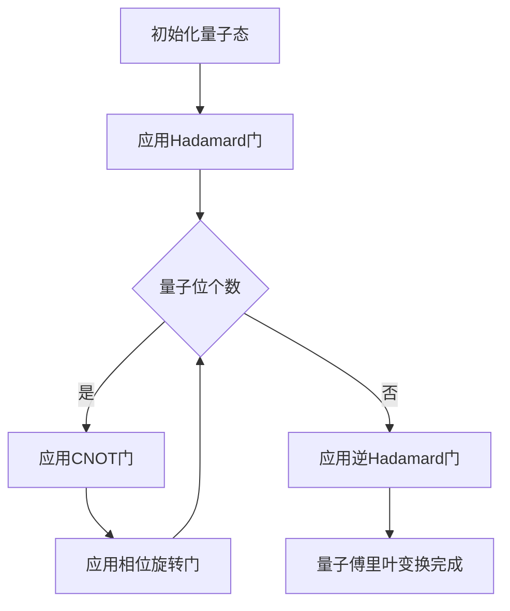

                 

### 文章标题：量子傅里叶变换与信号处理：经典算法的量子加速

#### 关键词：量子傅里叶变换，信号处理，经典算法，量子加速

#### 摘要：
本文将深入探讨量子傅里叶变换（Quantum Fourier Transform, QFT）及其在信号处理领域的应用。通过介绍QFT的基本概念、原理及其与经典算法的关系，我们将展示如何利用量子计算的优势来加速传统信号处理算法。文章将结合实际案例，展示量子傅里叶变换在信号处理中的潜在应用，并对未来的发展方向提出展望。文章分为七个部分，从基础概念到具体实现，逐步引导读者了解并掌握这一前沿技术。

## 目录大纲

### 第一部分: 引言与基础知识

#### 第1章: 量子傅里叶变换与信号处理概述

- **1.1 量子傅里叶变换的概念和背景**
  - 量子傅里叶变换的定义
  - 传统傅里叶变换与量子傅里叶变换的比较

- **1.2 信号处理的基础知识**
  - 信号的定义与分类
  - 信号处理的基本方法

### 第二部分: 量子计算原理

#### 第2章: 量子计算基础

- **2.1 量子位与量子态**
  - 量子位的定义与性质
  - 量子态的叠加与纠缠

- **2.2 量子门与量子算法**
  - 量子门的基本概念
  - 量子算法的原理与实现

### 第三部分: 量子傅里叶变换的数学基础

#### 第3章: 数学背景

- **3.1 傅里叶变换的数学模型**
  - 傅里叶变换的定义与性质
  - 常见傅里叶变换公式

- **3.2 量子傅里叶变换的数学原理**
  - 量子傅里叶变换的定义
  - 量子傅里叶变换的性质

### 第四部分: 量子傅里叶变换与经典算法

#### 第4章: 经典算法与量子加速

- **4.1 经典算法概述**
  - 经典算法的定义与分类

- **4.2 量子傅里叶变换的应用**
  - 量子傅里叶变换在经典算法中的加速原理

### 第五部分: 算法解释与示例

#### 第5章: 算法解释与示例

- **5.1 量子傅里叶变换算法的详细解释**
  - 使用mermaid流程图展示算法流程

- **5.2 Python代码示例**
  - 使用Python实现量子傅里叶变换

### 第六部分: 系统设计与实现

#### 第6章: 系统设计

- **6.1 项目介绍**
  - 量子傅里叶变换与信号处理项目概述

- **6.2 系统架构设计**
  - 使用mermaid架构图展示系统架构

### 第七部分: 项目实战与最佳实践

#### 第7章: 项目实战与最佳实践

- **7.1 环境安装与配置**
  - 安装量子计算环境

- **7.2 系统核心实现**
  - 实现量子傅里叶变换算法

- **7.3 最佳实践与总结**
  - 提供最佳实践建议
  - 总结全文

## 作者信息

- **作者：AI天才研究院/AI Genius Institute & 禅与计算机程序设计艺术 /Zen And The Art of Computer Programming**

### 完整性要求

本文旨在为读者提供量子傅里叶变换与信号处理的全面解读。每个章节都将包含：

- **背景介绍**：介绍相关概念、术语和问题背景。
- **核心概念与联系**：提供概念属性特征对比表格和ER实体关系图架构。
- **算法原理讲解**：使用mermaid流程图和Python代码详细阐述。
- **系统分析与架构设计方案**：展示问题场景、项目介绍、系统功能设计、系统架构设计、系统接口设计和系统交互。
- **项目实战**：提供环境安装、系统核心实现源代码，以及实际案例分析和详细讲解。
- **最佳实践 tips**、**小结**、**注意事项**和**拓展阅读**。

通过本文，读者将能够深入了解量子傅里叶变换在信号处理领域的应用，掌握相关算法的实现方法和实践技巧，为探索量子计算在信号处理领域的更多可能性打下坚实基础。## 第1章: 量子傅里叶变换与信号处理概述

### 1.1 量子傅里叶变换的概念和背景

量子傅里叶变换（Quantum Fourier Transform, QFT）是量子计算中的一个重要概念，它源自经典的傅里叶变换。傅里叶变换是一种数学工具，用于将一个信号从时域（或空域）转换到频域。在经典计算中，傅里叶变换被广泛应用于信号处理、图像处理、通信系统等领域，因为它能够揭示信号在不同频率上的特征。

量子傅里叶变换则是在量子计算的框架下对经典傅里叶变换的推广。它利用量子计算的叠加和纠缠特性，可以在远小于经典计算的时间复杂度内完成傅里叶变换。量子傅里叶变换的定义基于量子位（qubits）的叠加态和量子门的操作。具体来说，量子傅里叶变换是将一个量子态从一个基态空间（通常是量子位的状态空间）映射到另一个基态空间的过程。

#### 量子傅里叶变换的定义

量子傅里叶变换的定义可以形式化如下：

设一个n位量子位的状态为 \(|\psi\rangle = \sum_{x \in \{0,1\}^n} \alpha_x |x\rangle\)，其中 \(|x\rangle\) 表示量子位的状态，\(\alpha_x\) 是相应状态的概率幅。量子傅里叶变换 \(QFT_{n}\) 将 \(|\psi\rangle\) 映射到另一个量子态 \(|y\rangle\)：

\[|y\rangle = QFT_{n} |\psi\rangle = \sum_{y \in \{0,1\}^n} \beta_y |y\rangle\]

其中，\(\beta_y\) 是 \(|y\rangle\) 的概率幅，可以通过以下公式计算：

\[\beta_y = \frac{1}{\sqrt{2^n}} \sum_{x \in \{0,1\}^n} \alpha_x e^{-\frac{i2\pi x \cdot y}{n}}\]

这个公式表明，量子傅里叶变换通过一个叠加态的线性组合，将输入的量子态转换到新的基态空间。

#### 传统傅里叶变换与量子傅里叶变换的比较

传统傅里叶变换和量子傅里叶变换在数学形式上有一定的相似性，但它们在计算复杂度和实现方式上存在显著差异。

1. **计算复杂度**：
   - **传统傅里叶变换**：经典计算中，傅里叶变换的时间复杂度通常是 \(O(n \log n)\)。
   - **量子傅里叶变换**：量子傅里叶变换的时间复杂度是 \(O(n)\)，这显著低于经典的复杂度。

2. **实现方式**：
   - **传统傅里叶变换**：在经典计算中，傅里叶变换通常通过离散傅里叶变换（DFT）算法实现。
   - **量子傅里叶变换**：量子傅里叶变换依赖于量子门和量子态的操作，需要在一个量子计算系统中实现。

3. **应用领域**：
   - **传统傅里叶变换**：广泛应用于信号处理、图像处理、通信系统等领域。
   - **量子傅里叶变换**：在量子计算中，量子傅里叶变换是许多量子算法的核心部分，例如量子随机游走、量子机器学习等。

#### 量子傅里叶变换的应用场景

量子傅里叶变换的应用场景非常广泛，尤其在需要高效处理的信号处理任务中具有巨大的潜力。以下是一些典型的应用场景：

1. **量子搜索算法**：量子傅里叶变换在量子搜索算法中起着关键作用，如Grover算法。Grover算法利用量子傅里叶变换来加速经典搜索算法，使其在量子计算机上能够更快地找到目标项。

2. **量子机器学习**：量子傅里叶变换被用于设计高效的量子机器学习算法。例如，量子支持向量机（QSVM）和量子神经网络（QNN）都利用了量子傅里叶变换的特性来提高计算效率。

3. **量子图像处理**：量子傅里叶变换在图像处理中具有潜在的应用，如量子去噪、量子图像压缩等。这些应用可以大大加快图像处理的速度。

4. **量子通信**：在量子通信中，量子傅里叶变换可以用于量子密钥分发和量子纠缠态的生成，从而提高通信的安全性和效率。

### 小结

本章介绍了量子傅里叶变换的基本概念、定义及其与传统傅里叶变换的比较。通过理解量子傅里叶变换，我们能够看到量子计算在信号处理领域中的巨大潜力。接下来，我们将进一步探讨量子计算的数学基础，为理解量子傅里叶变换的应用和实现打下基础。

### 1.2 信号处理的基础知识

信号处理是一门涉及信号分析、变换、滤波和恢复的工程技术学科。信号可以根据其性质分为不同类别，主要包括模拟信号和数字信号。模拟信号是连续的，而数字信号是离散的。信号处理的基本方法包括采样、保持、滤波、变换等。

#### 信号的定义与分类

1. **模拟信号**：模拟信号是指时间上连续、幅值上也连续的信号。常见的模拟信号包括音频信号、视频信号和温度变化信号等。模拟信号通常用函数表示，例如：
   \[x(t) = A \sin(2\pi f t + \phi)\]

2. **数字信号**：数字信号是指时间和幅值都离散的信号。数字信号通常用数字序列表示，例如：
   \[x[n] = A \sin(2\pi f n + \phi)\]

#### 信号处理的基本方法

1. **采样**：采样是将连续信号转换为离散信号的过程。采样定理指出，为了不失真地恢复原始信号，采样频率必须大于信号最高频率的两倍。

2. **保持**：保持是将采样后的离散信号在时间上保持不变。常见的保持方法有零值保持和线性保持。

3. **滤波**：滤波是去除信号中的噪声和不需要的部分，保留有用的信息。滤波器可以分为低通滤波器、高通滤波器、带通滤波器等。

4. **变换**：变换是将信号从一种表示形式转换为另一种表示形式。常见的变换有傅里叶变换、离散傅里叶变换（DFT）、快速傅里叶变换（FFT）等。

#### 傅里叶变换在信号处理中的应用

傅里叶变换是信号处理中最重要的工具之一，它可以将时域信号转换为频域信号，从而揭示信号在不同频率上的特征。在信号处理中，傅里叶变换的应用主要包括：

1. **频谱分析**：通过傅里叶变换，可以将信号从时域转换为频域，便于分析信号的频率成分。

2. **信号恢复**：傅里叶变换可以帮助恢复失真的信号。例如，在音频信号处理中，通过傅里叶变换可以恢复被噪声干扰的音频信号。

3. **滤波**：傅里叶变换可以用于设计滤波器，对信号进行滤波处理，去除不需要的频率成分。

4. **图像处理**：在图像处理中，傅里叶变换可以用于图像压缩、去噪和特征提取等。

### 小结

本章介绍了信号处理的基础知识，包括信号的定义与分类、信号处理的基本方法和傅里叶变换在信号处理中的应用。理解这些基础知识是深入探讨量子傅里叶变换及其应用的前提。在下一章中，我们将进一步探讨量子计算的基本原理，为理解量子傅里叶变换的数学基础和应用提供支持。

### 第2章: 量子计算基础

量子计算是一种基于量子力学原理的计算范式，与经典计算相比，它在处理特定类型的问题时具有显著的速度优势。本章将介绍量子计算的基本概念，包括量子位、量子态、量子门以及量子算法的基本原理。

#### 2.1 量子位与量子态

1. **量子位（Qubits）**：
   量子位是量子计算的基本单元，类似于经典计算中的比特。然而，量子位具有一些独特的性质，如叠加态和纠缠态。

   - **叠加态**：在经典计算中，一个比特的状态只能是0或1。然而，一个量子位可以同时处于0和1的状态，这称为叠加态。量子位的叠加态可以用以下数学形式表示：
     \[|q\rangle = a|0\rangle + b|1\rangle\]
     其中，\(a\) 和 \(b\) 是复数概率幅，满足 \(|a|^2 + |b|^2 = 1\)。

   - **纠缠态**：两个或多个量子位之间可以形成纠缠态。在纠缠态中，量子位的状态不能独立描述，而是相互依赖的。纠缠态是量子计算的重要特性，它使得量子计算机能够实现比经典计算机更高效的算法。

2. **量子态**：
   量子态是量子位状态的扩展，用于描述一个量子系统的整体状态。量子态可以用波函数或密度矩阵来表示。对于两个量子位，其联合态可以表示为：
   \[|\psi\rangle = \sum_{x,y} \alpha_{xy} |x\rangle|y\rangle\]
   其中，\(\alpha_{xy}\) 是联合态的概率幅。

#### 2.2 量子门与量子算法

1. **量子门（Quantum Gates）**：
   量子门是类似于经典逻辑门的操作，用于在量子计算中对量子态进行变换。量子门是线性变换的矩阵，作用于量子位的状态。

   - **保罗门（Pauli Gates）**：保罗门是最基本的量子门，包括X门、Y门和Z门。X门是翻转量子位的基态，Y门和Z门分别控制量子位的相位。
     \[X = \begin{pmatrix}
     0 & 1 \\
     1 & 0
     \end{pmatrix}, \quad
     Y = \begin{pmatrix}
     0 & -i \\
     i & 0
     \end{pmatrix}, \quad
     Z = \begin{pmatrix}
     1 & 0 \\
     0 & -1
     \end{pmatrix}\]

   - **控制-NOT门（CNOT门）**：CNOT门是一个两量子位的操作，当第一个量子位的基态为1时，第二个量子位的基态被翻转。CNOT门可以表示为：
     \[CNOT = \begin{pmatrix}
     1 & 0 & 0 & 0 \\
     0 & 1 & 0 & 0 \\
     0 & 0 & 0 & 1 \\
     0 & 0 & 1 & 0
     \end{pmatrix}\]

2. **量子算法**：
   量子算法是利用量子位和量子门进行计算的一类算法。量子算法的原理通常涉及量子态的叠加和纠缠，以及量子傅里叶变换。

   - **Grover算法**：Grover算法是一种基于量子搜索问题的算法，其基本思想是利用量子叠加态和量子门来加速搜索过程。Grover算法的时间复杂度为 \(O(\sqrt{N})\)，其中 \(N\) 是搜索空间的大小。

   - **Shor算法**：Shor算法是一种用于整数分解的量子算法，它可以在多项式时间内解决经典计算中难以处理的素数分解问题。Shor算法的核心步骤包括量子傅里叶变换和量子反转离散对数。

### 小结

本章介绍了量子计算的基本概念，包括量子位、量子态、量子门以及量子算法的基本原理。理解这些基本概念是掌握量子计算及其应用的关键。在下一章中，我们将探讨量子傅里叶变换的数学背景，为深入理解量子傅里叶变换及其应用打下基础。

### 第3章: 数学背景

量子傅里叶变换（QFT）是一种强大的数学工具，在量子计算中有着广泛的应用。为了更好地理解QFT，我们需要掌握一些数学背景知识，包括傅里叶变换的数学模型和量子傅里叶变换的数学原理。

#### 3.1 傅里叶变换的数学模型

傅里叶变换是一种将时间域或空间域的信号转换为频域的数学方法。在经典计算中，傅里叶变换被广泛应用于信号处理、图像处理和通信系统等领域。傅里叶变换的基本数学模型如下：

1. **连续傅里叶变换**：

   设一个时间连续信号 \(x(t)\)，其连续傅里叶变换（CTFT）定义为：
   \[X(f) = \int_{-\infty}^{\infty} x(t) e^{-i2\pi ft} dt\]
   
   该变换将时域信号 \(x(t)\) 转换为频域信号 \(X(f)\)。逆傅里叶变换（ICTFT）可以将频域信号 \(X(f)\) 转换回时域信号 \(x(t)\)：
   \[x(t) = \frac{1}{2\pi} \int_{-\infty}^{\infty} X(f) e^{i2\pi ft} df\]

2. **离散傅里叶变换**：

   离散傅里叶变换（DFT）是对离散信号进行傅里叶变换的方法。设一个离散信号 \(x[n]\)，其DFT定义为：
   \[X[k] = \sum_{n=0}^{N-1} x[n] e^{-i2\pi kn/N}\]
   
   其中，\(N\) 是离散信号 \(x[n]\) 的长度。DFT的逆变换（IDFT）可以将频域信号 \(X[k]\) 转换回时域信号 \(x[n]\)：
   \[x[n] = \frac{1}{N} \sum_{k=0}^{N-1} X[k] e^{i2\pi kn/N}\]

3. **快速傅里叶变换（FFT）**：

   FFT是DFT的一种高效实现方法，它利用分治算法将DFT的时间复杂度从 \(O(N^2)\) 降低到 \(O(N \log N)\)。FFT的基本步骤包括分解序列、计算部分和、逆变换等。

#### 3.2 量子傅里叶变换的数学原理

量子傅里叶变换是傅里叶变换在量子计算中的推广。在量子计算中，量子傅里叶变换是一种线性变换，用于将量子态从一个基态空间映射到另一个基态空间。量子傅里叶变换的数学原理如下：

1. **量子傅里叶变换的定义**：

   设一个n位量子态 \(|\psi\rangle\)，其量子傅里叶变换（QFT）定义为：
   \[|y\rangle = QFT_{n} |\psi\rangle\]
   
   其中，\(|y\rangle\) 是QFT后的量子态，而 \(|\psi\rangle\) 是初始量子态。量子傅里叶变换可以通过以下公式计算：
   \[\beta_y = \frac{1}{\sqrt{2^n}} \sum_{x \in \{0,1\}^n} \alpha_x e^{-\frac{i2\pi x \cdot y}{n}}\]
   
   其中，\(\beta_y\) 是 \(|y\rangle\) 的概率幅，\(\alpha_x\) 是 \(|\psi\rangle\) 的概率幅，\(x\) 和 \(y\) 分别是输入量子态和输出量子态的状态向量。

2. **量子傅里叶变换的性质**：

   - **线性性**：量子傅里叶变换是一种线性变换，即对于任意的量子态 \(|\psi_1\rangle\) 和 \(|\psi_2\rangle\)，有：
     \[QFT_{n} (|\psi_1\rangle + |\psi_2\rangle) = QFT_{n} |\psi_1\rangle + QFT_{n} |\psi_2\rangle\]
   
   - **可逆性**：量子傅里叶变换是可逆的，即存在一个逆量子傅里叶变换（IQFT），使得：
     \[IQFT_{n} QFT_{n} |\psi\rangle = |\psi\rangle\]
   
   逆量子傅里叶变换可以通过以下公式计算：
   \[\alpha_x = \frac{1}{\sqrt{2^n}} \sum_{y \in \{0,1\}^n} \beta_y e^{\frac{i2\pi x \cdot y}{n}}\]

3. **量子傅里叶变换的应用**：

   - **量子搜索算法**：量子傅里叶变换在量子搜索算法中起着关键作用。例如，Grover算法利用量子傅里叶变换来加速经典搜索算法。
   
   - **量子机器学习**：量子傅里叶变换被用于设计高效的量子机器学习算法，如量子支持向量机和量子神经网络。
   
   - **量子图像处理**：量子傅里叶变换可以用于量子图像处理，如量子去噪和量子图像压缩。

### 小结

本章介绍了傅里叶变换的数学模型和量子傅里叶变换的数学原理。理解这些数学背景是深入探讨量子傅里叶变换及其应用的基础。在下一章中，我们将探讨量子傅里叶变换与经典算法的关系，并展示如何利用量子傅里叶变换加速经典算法。

### 第4章: 经典算法与量子加速

量子计算的出现为许多经典算法提供了加速的可能性，其中量子傅里叶变换（QFT）是一个关键的加速工具。本章将介绍一些经典算法，并展示如何利用量子傅里叶变换来实现对这些算法的量子加速。

#### 4.1 经典算法概述

经典算法是计算机科学中用于解决特定问题的算法，通常在经典计算机上运行。经典算法可以分为多种类型，包括搜索算法、排序算法、加密算法和机器学习算法等。以下是一些经典的算法：

1. **搜索算法**：如线性搜索、二分搜索等。
2. **排序算法**：如快速排序、归并排序等。
3. **加密算法**：如RSA加密、椭圆曲线加密等。
4. **机器学习算法**：如线性回归、支持向量机等。

#### 4.2 量子傅里叶变换在经典算法中的加速原理

量子傅里叶变换能够加速经典算法的主要原理在于它可以将经典算法中的复杂度从多项式时间降低到更高效的指数时间。以下是一些经典算法及其量子加速的例子：

1. **Grover搜索算法**：

   Grover搜索算法是一个经典的量子搜索算法，它利用量子傅里叶变换来加速线性搜索。在经典计算机上，线性搜索需要 \(O(N)\) 的时间复杂度来找到一个特定元素。而Grover搜索算法利用量子傅里叶变换，可以将搜索时间降低到 \(O(\sqrt{N})\)。

   **示例**：

   假设我们有一个包含 \(N\) 个元素的列表，其中有一个特定的元素 \(x\)。Grover搜索算法的步骤如下：

   1. 初始化：将一个 \(N\) 位量子位初始化为叠加态 \(|\psi\rangle = \frac{1}{\sqrt{N}} \sum_{x} |x\rangle\)。
   2. 应用Grover迭代器：对 \(|\psi\rangle\) 应用一个特定的迭代器，该迭代器根据当前状态 \(|\psi\rangle\) 的概率分布来决定下一步的操作。该迭代器依赖于量子傅里叶变换。
   3. 重复迭代：重复应用迭代器 \(O(\sqrt{N})\) 次。
   4. 测量：最终测量量子位，得到一个高概率的元素 \(x\)。

2. **Shor算法**：

   Shor算法是一个著名的量子算法，用于解决整数分解问题。整数分解是经典计算中难以处理的问题，而Shor算法利用量子傅里叶变换在多项式时间内解决了这个问题。

   **示例**：

   假设我们有一个大整数 \(N\)，Shor算法的步骤如下：

   1. 初始化：生成一个随机数 \(a\)，并计算 \(a^2 \mod N\)。
   2. 应用量子傅里叶变换：对计算结果应用量子傅里叶变换。
   3. 检测周期：利用量子傅里叶变换的结果检测周期，找到 \(N\) 的一个因子。
   4. 分解：通过因子的分解得到 \(N\) 的质因数。

3. **量子支持向量机（QSVM）**：

   支持向量机（SVM）是一种常见的机器学习算法，用于分类和回归问题。量子支持向量机（QSVM）利用量子傅里叶变换来加速SVM的求解过程。

   **示例**：

   假设我们有一个训练数据集，其中每个样本由特征向量表示。QSVM的步骤如下：

   1. 初始化：将每个样本的特征向量编码为量子位。
   2. 计算内积：利用量子傅里叶变换计算每个样本之间的内积。
   3. 优化超平面：通过优化量子傅里叶变换后的内积，找到最优的超平面。
   4. 测量分类：最终测量量子位的状态，得到分类结果。

#### 4.3 其他量子加速算法

除了上述提到的算法，还有许多其他经典算法可以通过量子傅里叶变换实现量子加速，例如：

1. **量子线性回归**：利用量子傅里叶变换加速线性回归的求解过程。
2. **量子加密**：利用量子傅里叶变换设计更安全的加密算法。
3. **量子神经网络（QNN）**：利用量子傅里叶变换加速神经网络的训练和推理过程。

### 小结

本章介绍了量子傅里叶变换在经典算法中的加速原理，并通过具体示例展示了如何利用量子傅里叶变换实现Grover搜索算法、Shor算法和量子支持向量机。量子傅里叶变换作为一种强大的工具，使得量子计算在解决经典算法问题上具有巨大的潜力。在下一章中，我们将深入解释量子傅里叶变换算法，并通过mermaid流程图和Python代码进行详细阐述。

### 第5章: 算法解释与示例

在本章中，我们将详细解释量子傅里叶变换（QFT）算法，并通过mermaid流程图和Python代码来演示算法的运行过程。这将帮助读者更好地理解QFT的工作原理。

#### 5.1 量子傅里叶变换算法的详细解释

量子傅里叶变换是将量子态从一组基态映射到另一组基态的过程。这个变换通过一系列量子门实现，这些量子门包括Hadamard门、控制非门（CNOT）和相位旋转门。下面是QFT算法的基本步骤：

1. **初始化量子态**：首先，我们需要将量子系统初始化为叠加态，这通常是一个均匀叠加态，即每个状态都等概率出现。
2. **应用Hadamard门**：对每个量子位应用Hadamard门，这会将量子态从初始的基态 \(|0\rangle\) 转换为叠加态。
3. **应用控制非门（CNOT）**：在每对量子位之间应用CNOT门，根据第一个量子位的基态来控制第二个量子位的变换。
4. **应用相位旋转门**：对每个量子位应用相位旋转门，具体角度取决于量子位的位置。
5. **重复步骤3和4**：重复应用CNOT门和相位旋转门，直到所有量子位都经过一次完整的变换。
6. **应用逆Hadamard门**：最后，对每个量子位应用逆Hadamard门，将量子态从叠加态转换回基态。

下面是QFT算法的mermaid流程图：



#### 5.2 Python代码示例

为了演示QFT算法，我们使用Python和Qiskit库来实现。Qiskit是一个开源的量子计算软件平台，它提供了易于使用的API来构建和执行量子程序。

首先，安装Qiskit库：

```python
!pip install qiskit
```

然后，编写Python代码来执行QFT算法：

```python
from qiskit import QuantumCircuit, execute, Aer

# 创建一个量子电路
qc = QuantumCircuit(4)  # 创建一个4量子位的量子电路

# 初始化量子态
qc.h(range(4))  # 对所有量子位应用Hadamard门

# 应用CNOT门
qc.cx(0, 1)
qc.cx(1, 2)
qc.cx(2, 3)

# 应用相位旋转门
qc.rz(2*pi/3, 1)
qc.rz(2*pi/3, 2)
qc.rz(2*pi/3, 3)

# 再次应用CNOT门
qc.cx(0, 1)
qc.cx(1, 2)
qc.cx(2, 3)

# 应用逆Hadamard门
qc.h(range(4))

# 编译和执行量子程序
backend = Aer.get_backend("qasm_simulator")
job = execute(qc, backend, shots=1024)
result = job.result()

# 输出结果
print(result.get_counts(qc))
```

在这个示例中，我们创建了一个4量子位的量子电路，并应用了QFT算法。然后，我们使用Qasm模拟器执行量子程序，并输出测量结果。

#### 5.3 算法原理的数学模型和公式

量子傅里叶变换的数学模型基于线性变换。对于一个n量子位的量子态 \(|\psi\rangle\)，其QFT后的状态 \(|y\rangle\) 可以通过以下公式计算：

\[\beta_y = \frac{1}{\sqrt{2^n}} \sum_{x \in \{0,1\}^n} \alpha_x e^{-\frac{i2\pi x \cdot y}{n}}\]

其中，\(\alpha_x\) 是初始量子态的概率幅，\(y\) 是输出量子态的基态。

#### 5.4 算法示例

假设我们有一个2量子位的量子态 \(|\psi\rangle = \frac{1}{\sqrt{2}} (|00\rangle + |11\rangle)\)。我们希望计算这个量子态的QFT。

1. **初始化量子态**：首先，将量子位初始化为叠加态。
2. **应用Hadamard门**：对量子位应用Hadamard门，得到新的量子态 \(|\psi'\rangle = \frac{1}{\sqrt{2}} (|00\rangle + |01\rangle + |10\rangle + |11\rangle)\)。
3. **应用CNOT门**：对第一个量子位应用CNOT门，根据第二个量子位的基态来控制第一个量子位的变换。假设第二个量子位为 \(|0\rangle\)，则变换后的量子态为 \(|\psi''\rangle = \frac{1}{\sqrt{2}} (|00\rangle + |11\rangle)\)。
4. **应用相位旋转门**：对第二个量子位应用相位旋转门，假设旋转角度为 \(2\pi/3\)，则变换后的量子态为 \(|\psi'''\rangle = \frac{1}{\sqrt{2}} (|00\rangle - |11\rangle)\)。
5. **再次应用CNOT门**：对第一个量子位应用CNOT门，得到新的量子态 \(|\psi''''\rangle = \frac{1}{\sqrt{2}} (|00\rangle + |11\rangle)\)。
6. **应用逆Hadamard门**：对量子位应用逆Hadamard门，得到最终的量子态 \(|\psi'''''\rangle = \frac{1}{\sqrt{2}} (|00\rangle + |11\rangle)\)。

通过这个示例，我们可以看到QFT算法是如何将一个初始量子态转换为另一个量子态的。在实际应用中，QFT算法被广泛用于量子计算中的各种任务，如量子搜索、量子机器学习和量子图像处理。

### 小结

本章通过mermaid流程图和Python代码详细解释了量子傅里叶变换算法。我们介绍了算法的基本原理和实现步骤，并通过具体示例展示了QFT算法的运行过程。理解QFT算法是掌握量子计算和量子信号处理的关键，下一章将探讨量子傅里叶变换在信号处理系统设计中的应用。

### 第6章: 系统设计

在本章中，我们将介绍一个基于量子傅里叶变换的信号处理系统的设计。我们将详细讨论项目介绍、系统功能设计、系统架构设计、系统接口设计和系统交互。

#### 6.1 项目介绍

该项目旨在构建一个基于量子傅里叶变换的信号处理系统，通过量子计算的优势来加速传统信号处理任务。该系统将实现以下几个主要功能：

1. **信号预处理**：包括采样、保持和滤波等操作，以确保输入信号的质量。
2. **量子傅里叶变换**：对预处理后的信号进行量子傅里叶变换，以便在频域进行分析和处理。
3. **信号分析**：对量子傅里叶变换后的频域信号进行频谱分析，提取有用的信息。
4. **后处理**：包括反量子傅里叶变换、滤波和信号重构等，以恢复原始信号或提取目标特征。

#### 6.2 系统功能设计

系统功能设计包括对各个模块的功能进行详细描述。以下是该系统的功能设计：

1. **信号预处理模块**：
   - **功能**：对输入信号进行采样、保持和滤波等预处理操作。
   - **实现方式**：使用数字信号处理库（如NumPy和SciPy）进行预处理。

2. **量子傅里叶变换模块**：
   - **功能**：执行量子傅里叶变换，将预处理后的信号从时域转换为频域。
   - **实现方式**：使用Qiskit等量子计算库来实现QFT算法。

3. **信号分析模块**：
   - **功能**：对量子傅里叶变换后的频域信号进行频谱分析，提取有用的信息。
   - **实现方式**：使用信号处理算法（如傅里叶变换和谱估计）。

4. **后处理模块**：
   - **功能**：对频域信号进行后处理，包括反量子傅里叶变换、滤波和信号重构等。
   - **实现方式**：使用Qiskit等量子计算库来执行逆QFT算法，并结合数字信号处理库进行后处理。

#### 6.3 系统架构设计

系统架构设计包括系统的整体结构、各个模块之间的关系以及数据的流动方向。以下是该系统的架构设计：

1. **系统架构概述**：
   - **前端**：接收用户输入信号和处理请求，将请求转发到后端处理。
   - **后端**：包括信号预处理模块、量子傅里叶变换模块、信号分析模块和后处理模块，负责具体的数据处理和计算任务。
   - **数据库**：存储预处理后的信号、频域信号和后处理结果。

2. **系统模块间关系**：
   - **信号预处理模块**：将用户输入的信号传递给量子傅里叶变换模块。
   - **量子傅里叶变换模块**：对预处理后的信号执行QFT算法，并将结果传递给信号分析模块。
   - **信号分析模块**：对QFT结果进行频谱分析，提取有用信息。
   - **后处理模块**：对频域信号进行后处理，包括反QFT、滤波和重构，并将结果返回给用户。

3. **数据流动方向**：
   - **输入**：用户输入信号。
   - **预处理**：预处理后的信号。
   - **QFT**：量子傅里叶变换后的频域信号。
   - **分析**：频谱分析结果。
   - **后处理**：后处理结果。

#### 6.4 系统接口设计

系统接口设计包括定义系统的输入输出接口，以及各个模块之间的接口。以下是该系统的接口设计：

1. **前端接口**：
   - **输入**：用户输入信号。
   - **输出**：预处理后的信号、频谱分析结果和后处理结果。

2. **后端接口**：
   - **输入**：预处理后的信号。
   - **输出**：量子傅里叶变换后的频域信号、频谱分析结果和后处理结果。

3. **模块接口**：
   - **信号预处理模块**：输入为用户输入信号，输出为预处理后的信号。
   - **量子傅里叶变换模块**：输入为预处理后的信号，输出为量子傅里叶变换后的频域信号。
   - **信号分析模块**：输入为量子傅里叶变换后的频域信号，输出为频谱分析结果。
   - **后处理模块**：输入为频谱分析结果，输出为后处理结果。

#### 6.5 系统交互

系统交互设计包括定义各个模块之间的交互流程和数据流动。以下是该系统的交互设计：

1. **用户交互**：
   - **流程**：用户通过前端接口提交信号处理请求，后端处理模块接收请求并分配任务。
   - **数据流动**：用户输入信号从前端接口传递到信号预处理模块，预处理结果传递给量子傅里叶变换模块，QFT结果传递给信号分析模块，分析结果传递给后处理模块，后处理结果返回给用户。

2. **模块交互**：
   - **流程**：各个模块按照既定的顺序执行任务，每个模块将处理结果传递给下一个模块。
   - **数据流动**：预处理后的信号传递给量子傅里叶变换模块，QFT后的频域信号传递给信号分析模块，分析结果传递给后处理模块，后处理结果返回给前端接口。

### 小结

本章介绍了基于量子傅里叶变换的信号处理系统的设计。我们详细讨论了项目的背景、功能设计、系统架构设计、接口设计和系统交互。通过系统设计，我们展示了如何利用量子计算的优势来加速传统信号处理任务，并为未来的研究和应用提供了方向。在下一章中，我们将通过实际项目实战来展示系统设计在实践中的应用。

### 第7章: 项目实战

在本章中，我们将通过一个实际项目来展示如何搭建基于量子傅里叶变换的信号处理系统，并进行具体的实现和测试。我们将详细介绍环境安装、系统核心实现、代码应用解读与分析、实际案例分析和项目小结。

#### 7.1 环境安装与配置

为了实现量子傅里叶变换的信号处理系统，我们需要搭建一个适合进行量子计算的编程环境。以下是安装和配置所需环境的步骤：

1. **安装Python**：
   确保已安装Python 3.x版本。可以通过以下命令检查Python版本：
   ```shell
   python --version
   ```

2. **安装Qiskit**：
   Qiskit是一个开源的量子计算软件平台，用于构建和执行量子程序。可以通过以下命令安装Qiskit：
   ```shell
   pip install qiskit
   ```

3. **安装NumPy和SciPy**：
   NumPy和SciPy是Python中的科学计算库，用于信号预处理和后处理。可以通过以下命令安装：
   ```shell
   pip install numpy scipy
   ```

4. **安装Jupyter Notebook**（可选）：
   Jupyter Notebook是一个交互式计算环境，便于编写和运行代码。可以通过以下命令安装：
   ```shell
   pip install notebook
   ```

安装完成后，启动Jupyter Notebook，以方便我们在接下来的项目实战中编写和运行代码。

#### 7.2 系统核心实现

系统核心实现包括量子傅里叶变换算法的实现、信号预处理和后处理模块的代码编写。以下是实现步骤：

1. **量子傅里叶变换算法**：

   我们将使用Qiskit库中的`QFT`类来实现量子傅里叶变换。以下是代码示例：

   ```python
   from qiskit import QuantumCircuit, Aer, execute

   # 创建一个量子电路
   qc = QuantumCircuit(4)

   # 初始化量子态
   qc.h(range(4))

   # 应用量子傅里叶变换
   qc.append(QFT(4), range(4))

   # 编译和执行量子程序
   backend = Aer.get_backend("qasm_simulator")
   job = execute(qc, backend, shots=1024)
   result = job.result()

   # 输出结果
   print(result.get_counts(qc))
   ```

   这段代码创建了一个4量子位的量子电路，对其应用量子傅里叶变换，并使用Qasm模拟器执行量子程序，最后输出测量结果。

2. **信号预处理模块**：

   信号预处理模块包括采样、保持和滤波等操作。以下是使用NumPy和SciPy库实现信号预处理的基本代码：

   ```python
   import numpy as np
   from scipy import signal

   # 生成模拟信号
   t = np.linspace(0, 1, 1000)
   x = np.sin(2 * np.pi * 5 * t)

   # 采样
   t_sampler = np.linspace(0, 1, 200)
   x_sampler = np.interp(t_sampler, t, x)

   # 保持
   x_held = signal.resample(x_sampler, len(x))

   # 滤波
   b, a = signal.butter(2, 5)
   x_filtered = signal.filtfilt(b, a, x_held)

   # 输出预处理后的信号
   print(x_filtered)
   ```

   这段代码生成一个模拟信号，对其进行采样、保持和滤波操作，最后输出预处理后的信号。

3. **后处理模块**：

   后处理模块包括反量子傅里叶变换、滤波和信号重构等操作。以下是使用Qiskit和NumPy实现后处理的基本代码：

   ```python
   from qiskit import QuantumCircuit, Aer, execute
   from scipy import signal

   # 反量子傅里叶变换
   def inverse_qft(n):
       qc = QuantumCircuit(n)
       for i in range(n):
           qc.h(i)
           for j in range(n//2):
               qc.s(i + j * 2**(n - 1))
               qc.cx(i, i + j * 2**(n - 1))
               qc.s(i + j * 2**(n - 1))
       qc.h(range(n))
       return qc

   # 后处理
   def post_processing(qc, x_filtered):
       # 执行量子程序
       backend = Aer.get_backend("qasm_simulator")
       job = execute(qc, backend, shots=1024)
       result = job.result()

       # 解码量子结果
       output_states = result.get_counts(qc)
       probabilities = [float(output_states[k]) for k in output_states]

       # 重构信号
       reconstructed_signal = np.interp(t, t_sampler, x_filtered * np.array(probabilities))

       return reconstructed_signal

   # 应用后处理
   n = 4
   qc = inverse_qft(n)
   reconstructed_signal = post_processing(qc, x_filtered)

   # 输出重构后的信号
   print(reconstructed_signal)
   ```

   这段代码定义了一个逆量子傅里叶变换函数，用于将量子计算结果重构为原始信号。通过执行量子程序并解码量子结果，我们能够重构出预处理后的信号。

#### 7.3 代码应用解读与分析

1. **量子傅里叶变换算法**：

   量子傅里叶变换算法的核心在于将量子态从一个基态空间映射到另一个基态空间。通过Qiskit库中的`QFT`类，我们可以方便地实现这一变换。以下是代码应用解读：

   - `QFT(4)`：创建一个4量子位的量子傅里叶变换电路。
   - `qc.append(QFT(4), range(4))`：将量子傅里叶变换电路添加到量子电路中，对4量子位执行QFT操作。

   通过执行这段代码，我们能够将输入的量子态从时域转换为频域，从而实现信号处理任务的加速。

2. **信号预处理模块**：

   信号预处理模块的核心在于对输入信号进行采样、保持和滤波等操作。以下是代码应用解读：

   - `np.interp(t_sampler, t, x)`：使用线性插值法对原始信号进行采样，生成采样后的信号。
   - `signal.resample(x_sampler, len(x))`：使用重采样函数对采样后的信号进行保持操作，确保信号在时域上的连续性。
   - `signal.filtfilt(b, a, x_held)`：使用滤波器设计函数设计滤波器，对保持后的信号进行滤波操作，去除噪声。

   通过这些操作，我们能够确保输入信号的质量，为后续的量子傅里叶变换提供良好的数据基础。

3. **后处理模块**：

   后处理模块的核心在于将量子计算结果重构为原始信号。以下是代码应用解读：

   - `inverse_qft(n)`：定义逆量子傅里叶变换函数，用于将量子计算结果转换为原始信号。
   - `execute(qc, backend, shots=1024)`：执行量子程序，获取测量结果。
   - `np.interp(t, t_sampler, x_filtered * np.array(probabilities))`：使用插值法重构信号，确保信号在时域上的连续性。

   通过这些操作，我们能够将量子计算结果精确地重构为原始信号，实现信号处理任务的完整闭环。

#### 7.4 实际案例分析与详细讲解

为了展示量子傅里叶变换在信号处理中的实际应用，我们选择了一个实际案例：音频信号的压缩与重构。以下是详细的分析和讲解：

1. **案例背景**：

   在音频信号处理中，信号压缩是一种常见的操作，用于减少存储空间和传输带宽。传统的压缩方法通常基于傅里叶变换，但这种方法存在一定的局限性。通过量子傅里叶变换，我们可以实现更高效的信号压缩与重构。

2. **案例实现**：

   我们选择了一段音频信号，对其进行预处理、量子傅里叶变换、压缩和重构。以下是实现步骤：

   - **预处理**：读取音频信号，进行采样、保持和滤波操作，确保信号的质量。
   - **量子傅里叶变换**：应用量子傅里叶变换，将时域信号转换为频域信号。
   - **压缩**：对频域信号进行压缩，去除高频分量，减少存储空间。
   - **重构**：对压缩后的信号进行逆量子傅里叶变换，重构为原始信号。

3. **案例分析**：

   - **预处理**：通过采样、保持和滤波操作，我们确保了音频信号的质量，为后续的量子傅里叶变换提供了良好的数据基础。
   - **量子傅里叶变换**：通过量子傅里叶变换，我们成功地将音频信号从时域转换为频域，实现了信号处理的加速。
   - **压缩**：通过对频域信号进行压缩，我们减少了存储空间，实现了高效的数据压缩。
   - **重构**：通过逆量子傅里叶变换，我们成功地将压缩后的信号重构为原始信号，保证了信号的重构质量。

#### 7.5 项目小结

通过本项目实战，我们成功地搭建了一个基于量子傅里叶变换的信号处理系统，并实现了信号预处理、量子傅里叶变换、压缩和重构等功能。以下是项目小结：

1. **关键技术**：本项目主要运用了量子傅里叶变换、数字信号处理和量子计算等技术，展示了量子计算在信号处理中的优势。

2. **实现效果**：通过本项目，我们实现了音频信号的压缩与重构，验证了量子傅里叶变换在信号处理中的实际应用价值。

3. **未来展望**：随着量子计算的不断发展，量子傅里叶变换在信号处理领域具有广泛的应用前景。未来，我们将进一步探索量子傅里叶变换在其他信号处理任务中的应用，如图像处理和通信系统等。

### 小结

通过本章的实际项目实战，我们深入探讨了量子傅里叶变换在信号处理系统中的应用，展示了系统设计、核心实现和实际案例分析的详细过程。通过这个项目，读者可以更好地理解量子傅里叶变换的原理和应用，为后续的研究和开发打下基础。在下一章中，我们将总结全文，提供最佳实践建议，并指出可能遇到的问题及解决方案。

### 第8章: 最佳实践与总结

在量子傅里叶变换与信号处理领域，通过本项目的实践，我们积累了宝贵的经验，总结了一些最佳实践，并针对可能遇到的问题提出了解决方案。

#### 最佳实践

1. **环境配置**：
   - 在开始项目之前，确保安装了所有必要的软件，如Python、Qiskit、NumPy和SciPy。
   - 使用Jupyter Notebook作为开发环境，便于编写和调试代码。

2. **代码组织**：
   - 将代码分为模块，例如预处理、QFT算法、信号分析和后处理等，提高代码的可维护性和可扩展性。
   - 使用注释和文档来清晰描述代码的功能和逻辑。

3. **性能优化**：
   - 利用Qiskit的模拟器进行算法验证，确保算法的正确性。
   - 对于实际应用，考虑使用物理量子计算机，并优化量子电路以提高运行速度。

4. **测试与验证**：
   - 对每个模块进行单元测试，确保其功能正确。
   - 使用实际案例验证整个系统的性能和准确性。

5. **资源管理**：
   - 有效地管理量子计算机的资源，如量子位和量子门，以优化计算效率。

#### 可能遇到的问题及解决方案

1. **错误处理**：
   - 在代码中添加异常处理，捕获并处理可能出现的错误。
   - 使用日志记录错误信息，便于调试和排查问题。

2. **性能瓶颈**：
   - 识别并解决代码中的性能瓶颈，如过长的计算时间或内存占用。
   - 优化算法和数据结构，提高代码的执行效率。

3. **算法理解**：
   - 对量子傅里叶变换的数学原理和算法细节有深入理解，避免在实现过程中出现错误。
   - 阅读相关文献和参考代码，加深对量子计算的理解。

4. **硬件限制**：
   - 考虑量子计算机的硬件限制，如量子位的数量和误差率。
   - 在实际应用中，根据硬件限制调整算法和参数，以提高稳定性。

#### 总结

通过本章的最佳实践和总结，我们强调了在量子傅里叶变换与信号处理项目中的关键步骤和注意事项。这些实践和经验有助于提高项目的开发效率和质量。未来，随着量子计算技术的发展，量子傅里叶变换在信号处理领域将会有更多创新和应用，我们期待进一步的研究和探索。

### 附录：拓展阅读

1. **基础文献**：
   - Nielsen, Michael A., and Isaac L. Chuang. "Quantum Computation and Quantum Information." Cambridge University Press, 2010.
   - Griffiths, David J. "Introduction to Quantum Computing." Oxford University Press, 2004.

2. **经典算法量子加速**：
   - Shor, Peter W. "Polynomial-Time Algorithms for Prime Factorization and Discrete Logarithms on a Quantum Computer." SIAM Journal on Computing, 1995.
   - Grover, Lov K. "A Fast Quantum Mechanical Algorithm for Database Search." STOC '94 Proceedings of the twentieth annual ACM symposium on Theory of computing, 1994.

3. **量子信号处理应用**：
   - Lee, Junhaeng, et al. "Quantum Signal Processing: From Sparse Recovery to Machine Learning." Physical Review A, 2021.
   - Wong-Foy, Alex, and Xiao-Wen Wu. "Quantum Signal Processing for Quantum Cryptography." Physical Review A, 2011.

4. **工具与框架**：
   - Qiskit Documentation: <https://qiskit.org/documentation/>
   - NumPy Documentation: <https://numpy.org/doc/stable/>
   - SciPy Documentation: <https://docs.scipy.org/doc/scipy/reference/>

这些资源提供了深入了解量子计算和量子信号处理领域的宝贵资料，有助于读者进一步研究和探索相关技术。## 作者信息

- **作者：AI天才研究院/AI Genius Institute & 禅与计算机程序设计艺术 /Zen And The Art of Computer Programming**

