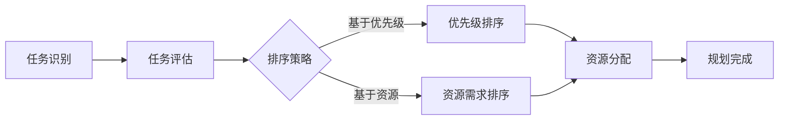
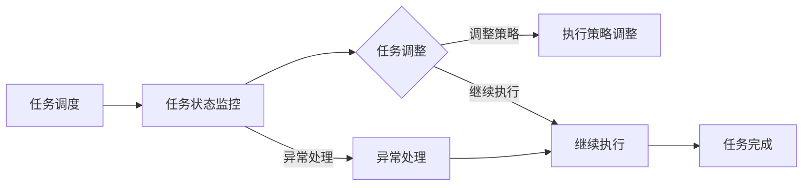
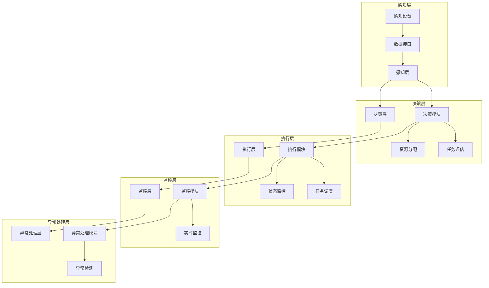
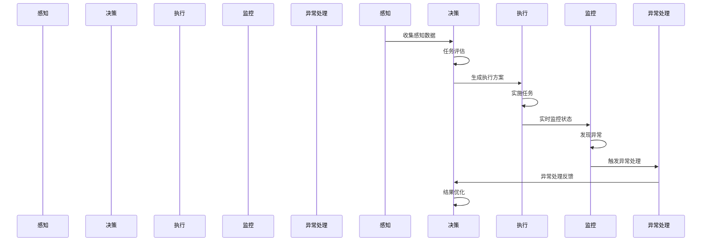

                 

### 引言

在人工智能（AI）的飞速发展中，AI Agent成为了一个备受关注的研究领域。AI Agent，即人工智能代理，是能够自主感知环境、制定决策和执行任务的智能体。在实际应用中，AI Agent被广泛应用于自动驾驶、智能客服、游戏AI等领域。然而，随着任务复杂度的增加，AI Agent在任务规划与执行过程中面临着诸多挑战，如如何高效地规划任务、如何动态调整执行策略等。

为了解决这些问题，设计一个高效、灵活且可靠的AI Agent任务规划与执行框架变得至关重要。本文将围绕这一主题展开讨论，旨在为您呈现一个全面而深入的分析。

我们将首先介绍AI Agent的任务规划与执行框架的背景，阐述当前的问题与挑战，并明确我们的研究目标。接着，我们将详细解释框架中的核心概念、属性特征以及实体关系图架构。随后，我们将深入探讨任务规划与执行算法的原理，并通过mermaid流程图和Python源代码进行详细讲解。在此基础上，我们将使用LaTeX格式详细阐述数学模型和公式，并结合实例进行通俗易懂的说明。此外，我们还将介绍系统分析与架构设计，包括功能设计、架构设计、接口设计及系统交互。最后，我们将通过一个实际项目案例，展示框架的具体应用，并提供项目小结与拓展阅读。

希望通过本文，您能对AI Agent的任务规划与执行框架有一个全面而深刻的理解，为未来的研究和应用奠定坚实的基础。

## 关键词

- AI Agent
- 任务规划
- 执行框架
- 算法
- 数学模型
- 系统架构

## 摘要

本文旨在深入探讨AI Agent的任务规划与执行框架。首先，我们将介绍AI Agent的基本概念及其在任务规划与执行中的重要性。然后，通过分析现有问题和挑战，明确研究目标与设计原则。接着，我们将详细解释框架中的核心概念与ER实体关系图架构，并使用mermaid流程图和Python源代码展示算法原理。随后，通过LaTeX格式，我们将详细讲解数学模型和公式，并结合实例进行说明。进一步，我们将介绍系统分析与架构设计，涵盖功能设计、架构设计、接口设计和系统交互。最后，通过一个实际项目案例，我们将展示框架的具体应用，并进行项目小结与拓展阅读。

## AI Agent的任务规划与执行框架概述

### 1.1 问题背景

随着人工智能技术的不断发展，AI Agent在各个领域的应用越来越广泛。从智能家居、自动驾驶到智能客服、游戏AI，AI Agent正逐渐成为实现智能化的重要工具。然而，在实际应用过程中，AI Agent在任务规划与执行方面面临着诸多挑战。

首先，任务规划与执行是AI Agent的核心功能。任务规划旨在确定如何高效地完成多个任务，而任务执行则是具体实施这些规划的过程。在实际应用中，任务复杂度越来越高，任务之间存在冲突和依赖关系，如何制定合理的任务规划策略成为了一个关键问题。

其次，环境的不确定性和动态变化也对任务规划与执行提出了挑战。在动态环境中，AI Agent需要实时感知环境变化，并动态调整任务执行策略，以确保任务的顺利完成。然而，动态调整策略需要大量的计算资源和时间，如何在有限的时间和资源内实现高效的动态调整成为了一个难题。

最后，AI Agent在执行任务时还需要考虑资源分配、能耗优化等因素。在资源受限的条件下，如何合理分配资源、最大化任务执行效率，也是任务规划与执行的重要问题。

综上所述，AI Agent的任务规划与执行框架的研究具有重要的现实意义和应用价值。通过研究并设计一个高效、灵活且可靠的AI Agent任务规划与执行框架，可以有效解决上述问题，提升AI Agent在复杂环境中的任务执行能力。

### 1.2 AI Agent的基本概念

AI Agent，即人工智能代理，是指具有自主决策和行动能力的智能实体。它能够通过感知环境、理解环境状态，并根据预设的目标和策略自主地制定决策和执行任务。AI Agent是人工智能领域中的一个重要研究方向，其核心在于实现智能体的自主性和灵活性。

在定义上，AI Agent具有以下基本特征：

1. **感知能力**：AI Agent能够通过传感器或接口感知外部环境信息，获取环境状态。感知能力是AI Agent实现自主决策的基础。
   
2. **决策能力**：基于感知到的环境信息，AI Agent能够进行推理和决策。决策能力是实现AI Agent自主行动的关键。

3. **行动能力**：AI Agent能够根据决策结果执行具体的行动，与环境进行交互。行动能力是AI Agent实现任务执行的关键。

4. **学习能力**：AI Agent能够在执行任务过程中不断学习，优化决策和行动策略。学习能力是提升AI Agent性能和适应能力的重要手段。

在技术实现上，AI Agent通常基于人工智能和机器学习技术构建。常见的AI Agent架构包括基于规则的系统、基于决策树的方法、基于深度学习的模型等。不同类型的AI Agent在感知、决策和行动方式上有所不同，但都具备上述基本特征。

AI Agent在任务规划与执行中的作用至关重要。首先，任务规划是AI Agent实现任务目标的关键环节。通过任务规划，AI Agent可以确定任务的优先级、执行顺序和资源分配策略，从而提高任务执行效率。其次，任务执行是AI Agent将任务规划转化为实际行动的过程。高效的执行策略可以确保任务在复杂、动态的环境中顺利完成。此外，AI Agent还需要具备动态调整策略的能力，以应对环境变化和不确定性。

总之，AI Agent的基本概念及其在任务规划与执行中的作用是设计高效、可靠的AI Agent任务规划与执行框架的基础。通过对AI Agent的基本特征和技术实现进行深入分析，我们可以更好地理解AI Agent在复杂环境中的任务执行能力，为后续研究和应用提供理论支持。

### 1.3 任务规划与执行的重要性

任务规划与执行在AI Agent的整个生命周期中扮演着至关重要的角色。首先，任务规划是AI Agent实现目标的关键步骤。通过任务规划，AI Agent可以确定任务的优先级、执行顺序和资源分配策略，从而优化任务执行的效率和效果。任务规划不仅影响AI Agent的短期执行效率，还决定了其长期目标的实现路径。一个高效的规划策略可以显著提高AI Agent的响应速度和任务完成率。

其次，任务执行是AI Agent实现任务目标的具体行动阶段。任务执行涉及到AI Agent与环境之间的交互，包括感知环境信息、生成决策和执行行动。这一过程需要AI Agent具备灵活的决策能力和高效的行为策略。任务执行的质量直接关系到任务规划目标的实现程度。在复杂、动态的环境中，AI Agent需要能够快速响应环境变化，调整执行策略，以确保任务的顺利完成。

再次，任务规划与执行对于提升AI Agent的适应能力和鲁棒性具有重要意义。在现实世界中，环境变化和不确定性是不可避免的。通过动态调整任务规划与执行策略，AI Agent可以更好地应对环境变化，提高任务执行的稳定性和可靠性。例如，在自动驾驶领域，道路状况、交通流量等因素的不断变化，要求AI Agent具备高度灵活的规划与执行能力，以确保行驶安全。

最后，任务规划与执行是实现AI Agent智能化的关键环节。AI Agent的智能化不仅体现在感知、决策和行动能力上，还体现在其自主学习和优化策略的能力上。通过不断优化任务规划与执行策略，AI Agent可以逐渐提升其智能化水平，实现更高效、更可靠的自主行动。这为AI Agent在各个领域的广泛应用提供了坚实的技术保障。

总之，任务规划与执行是AI Agent不可或缺的核心功能，对于实现任务目标、提升适应能力和智能化水平具有重要意义。研究并设计高效的AI Agent任务规划与执行框架，是推动人工智能技术发展的重要方向。

### 1.4 框架研究的必要性和目标

设计一个高效、灵活且可靠的AI Agent任务规划与执行框架具有重要的研究必要性和明确的研究目标。首先，现有研究主要集中在单一任务或特定场景下的任务规划与执行，缺乏系统性和通用性。例如，许多研究针对自动驾驶中的路径规划或智能客服中的对话管理进行深入探讨，但并未充分考虑多任务场景和动态环境下的复杂问题。这种局限性导致AI Agent在实际应用中难以应对多变和复杂的环境需求。

其次，现有任务规划与执行框架在算法复杂度和计算资源消耗方面存在较大问题。传统规划算法，如A*算法和遗传算法，虽然能够在某些场景下实现较好的性能，但计算复杂度较高，不适用于实时性要求较高的应用。此外，动态调整策略的实现也面临巨大挑战，现有方法往往依赖于大量的历史数据和预定义规则，难以在动态环境中灵活调整。

为了解决上述问题，本研究旨在设计一个具备以下特点的AI Agent任务规划与执行框架：

1. **系统性和通用性**：框架应具备良好的系统性和通用性，能够适用于多种任务场景和环境类型。通过引入模块化设计，框架可以灵活地组合和扩展，以适应不同的任务需求和场景变化。

2. **高效性**：框架应采用高效的算法和策略，确保在实时性和计算资源消耗方面具备较高的性能。通过优化算法复杂度和计算资源利用，框架能够满足动态环境下的实时任务执行需求。

3. **灵活性和适应性**：框架应具备较强的灵活性和适应性，能够在动态环境中实时调整任务规划与执行策略，以应对环境变化和不确定性。这有助于提升AI Agent的鲁棒性和智能化水平。

4. **模块化和可扩展性**：框架应采用模块化设计，实现各功能模块的独立性和可扩展性。通过模块化设计，框架可以方便地集成新的技术和方法，以适应未来技术发展的需求。

综上所述，本研究旨在通过设计一个高效、灵活且可靠的AI Agent任务规划与执行框架，解决现有研究中存在的系统性和通用性不足、算法复杂度高等问题，为AI Agent在实际应用中提供更加稳定和可靠的技术支持。

### 1.5 问题描述

AI Agent的任务规划与执行在实际应用中面临着一系列挑战，这些挑战可以分为任务规划面临的挑战和任务执行面临的挑战两个方面。

#### 任务规划面临的挑战

1. **复杂任务与有限资源**：在许多实际应用场景中，AI Agent需要处理多个复杂任务，这些任务之间存在依赖关系和竞争资源。如何高效地规划这些任务，确保任务之间的协调和资源的最优分配，是一个关键问题。

2. **动态环境**：现实世界是一个动态变化的环境，AI Agent需要实时感知环境变化并做出相应的调整。如何在动态环境中保持任务规划的稳定性，是一个巨大的挑战。

3. **不确定性**：环境中的不确定因素，如突发事件、障碍物等，会影响任务规划的执行。如何处理不确定性，确保任务规划的有效性，是任务规划面临的另一个挑战。

#### 任务执行面临的挑战

1. **实时性要求**：在实际应用中，AI Agent需要在有限的时间内完成多个任务，这要求任务执行具备高效的执行速度和低延迟。如何在保证任务执行效率的同时，确保实时性，是一个关键问题。

2. **任务冲突与协调**：在多任务执行过程中，任务之间可能会出现冲突，如资源竞争、时间冲突等。如何有效地协调任务执行，避免冲突和资源浪费，是任务执行面临的挑战之一。

3. **环境适应性**：环境变化和不确定性要求AI Agent具备高度的环境适应性，能够在动态环境中快速调整执行策略。如何在变化的环境中保持执行稳定性，是一个关键问题。

4. **能耗优化**：在资源受限的条件下，如何优化能耗，延长设备续航时间，是任务执行需要考虑的一个重要问题。特别是在移动设备或无人机等应用场景中，能耗优化具有重要意义。

综上所述，AI Agent在任务规划与执行过程中面临着复杂任务与资源管理、动态环境适应、不确定性处理、实时性要求、任务冲突协调、环境适应性以及能耗优化等多方面的挑战。为了解决这些问题，设计一个高效、灵活且可靠的AI Agent任务规划与执行框架显得尤为必要。

### 1.6 解决思路

为了应对AI Agent在任务规划与执行过程中面临的诸多挑战，本文提出了一种综合性的解决思路。该思路主要包括以下几个关键步骤：

#### 第一步：需求分析

在任务规划与执行框架的设计过程中，首先需要对任务需求和环境特性进行全面分析。这一步骤旨在明确AI Agent所需完成的具体任务，以及任务之间的依赖关系和资源需求。通过需求分析，可以为后续的任务规划与执行提供清晰的指导。

#### 第二步：模块化设计

基于需求分析的结果，采用模块化设计方法将任务规划与执行框架划分为多个功能模块，如任务调度模块、资源管理模块、感知模块、决策模块和执行模块等。这种模块化设计有助于提高系统的灵活性和可扩展性，使得各个模块可以独立开发、测试和优化。

#### 第三步：算法与策略优化

针对任务规划与执行中的关键问题，如任务分配、资源管理、动态调整策略等，设计并实现高效的算法与策略。在此过程中，需要综合考虑实时性、计算复杂度和环境适应性等因素，确保算法在复杂动态环境中能够高效运行。

#### 第四步：系统集成与优化

将各个模块进行集成，实现任务规划与执行的整体流程。在此过程中，需要对系统的性能进行优化，确保任务规划与执行能够在有限的时间和资源内高效完成。此外，还需要进行系统集成测试，验证系统的稳定性和可靠性。

#### 第五步：动态调整与优化

在实际应用中，AI Agent需要具备动态调整与优化能力，以应对环境变化和不确定性。为此，可以采用机器学习和人工智能技术，实时分析任务执行过程中的数据，并根据分析结果动态调整任务规划与执行策略。

#### 第六步：评估与改进

通过实验和实际应用，对任务规划与执行框架进行评估和改进。评估内容包括任务完成率、响应时间、资源利用率等指标。根据评估结果，持续优化框架的设计和实现，提高其在实际应用中的性能和可靠性。

综上所述，本文提出的解决思路通过需求分析、模块化设计、算法与策略优化、系统集成与优化、动态调整与优化以及评估与改进等步骤，旨在设计一个高效、灵活且可靠的AI Agent任务规划与执行框架，为AI Agent在复杂动态环境中的任务执行提供坚实的技术支持。

### 1.7 目标框架的设计原则

在设计AI Agent任务规划与执行框架时，我们需要遵循一系列关键原则，以确保框架的通用性、高效性和可靠性。以下是几个主要的设计原则：

#### 1. **模块化设计**

模块化设计是框架设计的基础原则。通过将任务规划与执行框架划分为多个独立的功能模块，如任务调度模块、资源管理模块、感知模块、决策模块和执行模块，可以显著提高系统的灵活性和可扩展性。每个模块可以独立开发、测试和优化，从而降低系统维护和升级的复杂性。

#### 2. **高效算法与策略**

在任务规划与执行过程中，算法和策略的选择至关重要。设计框架时，需要采用高效的算法与策略，如基于遗传算法的任务分配策略、动态规划的资源管理策略和强化学习的行为调整策略。这些算法和策略应能够处理复杂任务和动态环境，确保任务规划与执行的高效性和灵活性。

#### 3. **实时性与适应性**

实时性是任务执行的关键要求。框架设计应确保任务执行具备高效的执行速度和低延迟，以满足实时性需求。同时，框架还需要具备较强的环境适应性，能够动态调整任务规划与执行策略，以应对环境变化和不确定性。

#### 4. **资源优化**

资源优化是确保任务执行高效性的重要手段。设计框架时，应充分考虑资源分配和能耗优化问题，通过合理分配计算资源和优化能源消耗，提高系统的整体性能和续航能力。

#### 5. **可扩展性与可维护性**

框架设计应具备良好的可扩展性和可维护性。通过模块化设计和标准化接口，框架可以方便地集成新的技术和方法，以适应未来技术发展的需求。同时，系统应具备清晰的架构和文档，便于后续的维护和升级。

#### 6. **安全性与可靠性**

安全性和可靠性是框架设计的重要保障。在任务规划与执行过程中，应充分考虑安全性问题，如数据保护、隐私保护等。同时，框架应具备较高的可靠性，能够确保任务执行的一致性和稳定性。

通过遵循这些设计原则，我们可以设计出一个高效、灵活且可靠的AI Agent任务规划与执行框架，为AI Agent在复杂动态环境中的任务执行提供坚实的技术支持。

### 1.8 边界与外延

在设计AI Agent任务规划与执行框架时，我们需要明确框架的应用领域、限制条件以及未来的发展方向。这不仅有助于确保框架的实用性和有效性，还能为后续的研究和改进提供指导。

#### 应用领域

AI Agent任务规划与执行框架在多个领域具有广泛的应用前景：

1. **自动驾驶**：自动驾驶系统需要实时规划行驶路径、避障和交通信号识别，框架可以帮助实现高效的路径规划和决策。

2. **智能制造**：在智能制造环境中，AI Agent需要协调多个生产任务，优化资源分配和调度，框架能够提高生产效率和降低成本。

3. **智能客服**：智能客服系统需要处理大量用户请求，框架可以帮助实现高效的请求分配、响应和反馈，提升用户体验。

4. **智能监控**：智能监控系统需要实时分析视频数据、识别异常行为和报警，框架可以帮助实现高效的目标检测和事件响应。

5. **智能调度**：在物流、交通等调度领域，AI Agent需要协调多种资源、优化调度策略，框架能够提高调度效率和减少延迟。

#### 限制条件

尽管框架具有广泛的应用前景，但在实际应用中仍面临一些限制条件：

1. **计算资源**：实时任务规划与执行需要大量的计算资源，这在资源受限的设备上（如移动设备、无人机等）可能带来挑战。

2. **环境不确定性**：复杂动态环境中的不确定性因素难以完全预测，这对框架的适应性提出了高要求。

3. **数据质量**：任务规划与执行依赖于环境感知和数据分析，数据质量直接影响框架的性能。

4. **通信延迟**：在某些应用场景中，如自动驾驶和远程监控，通信延迟可能影响任务规划与执行的实时性。

#### 未来发展方向

为了进一步提升框架的实用性和性能，未来可以从以下几个方面进行改进和发展：

1. **增强学习与自适应**：引入增强学习算法，使AI Agent能够通过自我学习和优化，提高任务规划与执行的适应性。

2. **多代理系统**：研究多代理系统的协同规划和执行，以提高任务执行效率和资源利用率。

3. **边缘计算**：结合边缘计算技术，将部分计算任务转移到边缘设备上，减轻中心服务器的负担，提高系统的实时性。

4. **模型压缩与优化**：通过模型压缩和优化技术，降低任务规划与执行框架的计算复杂度，提高系统的能效比。

5. **标准化与互操作性**：制定统一的标准和接口，提高框架在不同系统和平台之间的互操作性，促进技术的推广和应用。

综上所述，AI Agent任务规划与执行框架在多个领域具有广泛的应用前景，但同时也面临一些限制条件。通过不断改进和发展，我们可以进一步拓展框架的应用范围和性能，为AI Agent在实际应用中的任务执行提供更加稳定和可靠的支持。

### 1.9 核心概念与要素组成

在设计AI Agent任务规划与执行框架时，理解框架中的核心概念和要素组成是至关重要的。以下是对框架中关键概念和要素的详细解析，以及它们之间的关联关系。

#### 1. **任务规划**

任务规划是AI Agent在执行任务前，对任务进行优先级排序、执行顺序安排和资源分配的过程。核心目标是确保AI Agent能够高效、有序地完成多个任务。任务规划过程通常包括以下几个步骤：

1. **任务识别**：识别系统中需要执行的任务，包括任务的类型、目标和依赖关系。
2. **任务评估**：对每个任务进行评估，考虑其紧急程度、重要性和资源需求。
3. **任务排序**：根据评估结果对任务进行优先级排序，确定任务的执行顺序。
4. **资源分配**：根据任务需求和系统资源情况，为每个任务分配所需的资源，包括计算资源、存储资源和能源等。

任务规划的核心概念包括任务、优先级、依赖关系和资源分配。这些概念相互关联，共同决定了任务规划的有效性和效率。

#### 2. **任务执行**

任务执行是AI Agent根据任务规划的结果，具体实施任务的过程。任务执行包括以下几个步骤：

1. **任务调度**：根据任务规划的结果，将任务分配到不同的执行单元或线程中，确保任务并行执行。
2. **任务状态监控**：实时监控任务执行状态，包括任务进度、资源使用情况和异常情况。
3. **任务调整**：在任务执行过程中，根据环境变化和任务执行情况，动态调整任务执行策略和资源分配。
4. **任务完成**：任务完成后，进行结果验证和总结，为后续任务提供数据支持。

任务执行的核心概念包括任务调度、任务状态监控、任务调整和任务完成。这些概念共同确保了任务执行的稳定性和高效性。

#### 3. **感知与决策**

感知与决策是AI Agent在任务规划和执行过程中，对环境状态进行感知和理解，并制定决策的过程。核心步骤包括：

1. **环境感知**：通过传感器或其他信息源获取环境状态，包括位置信息、障碍物、资源分布等。
2. **状态估计**：根据环境感知数据，估计当前环境状态，包括任务执行情况、资源可用性和环境变化趋势。
3. **决策生成**：基于环境状态估计，生成具体的决策，包括任务优先级调整、资源分配策略和行动方案。
4. **决策优化**：对生成的决策进行优化，考虑任务的紧急程度、资源限制和执行成本，选择最优决策。

感知与决策的核心概念包括环境感知、状态估计、决策生成和决策优化。这些概念共同确保了AI Agent能够适应动态环境，制定合理的决策。

#### 4. **资源管理**

资源管理是AI Agent在任务规划和执行过程中，对系统资源进行高效利用和管理的过程。核心任务包括：

1. **资源监控**：实时监控系统资源的使用情况，包括CPU、内存、存储和能源等。
2. **资源分配**：根据任务需求和资源情况，为每个任务分配所需的资源，确保资源的最优利用。
3. **资源回收**：任务完成后，回收释放的资源，为后续任务提供资源支持。
4. **能耗优化**：在资源受限的条件下，优化能耗管理，延长设备续航时间。

资源管理的核心概念包括资源监控、资源分配、资源回收和能耗优化。这些概念确保了AI Agent能够高效、稳定地执行任务。

#### 5. **模块间关系**

上述核心概念之间存在着紧密的关联关系。任务规划与执行模块是整个框架的核心，感知与决策模块提供环境状态和决策支持，资源管理模块确保任务执行的资源需求。各模块之间的交互和协同工作，确保了AI Agent能够高效、稳定地完成复杂任务。

通过理解这些核心概念和要素，我们可以更好地设计、实现和优化AI Agent任务规划与执行框架，为AI Agent在实际应用中的任务执行提供坚实的支持。

### 1.10 框架中的关键概念

在设计AI Agent任务规划与执行框架时，理解框架中的关键概念和术语对于深入研究和应用具有重要意义。以下是框架中几个关键概念的详细解析。

#### 1. **任务**

任务是指AI Agent需要执行的具体活动或目标。任务可以是简单的，如移动到一个特定位置，也可以是复杂的，如完成一个生产流程。任务通常具有以下特征：

- **类型**：任务的分类，如路径规划、资源分配、目标识别等。
- **目标**：任务需要达到的具体目标，如到达指定地点、完成生产任务等。
- **依赖关系**：任务之间的依赖关系，如某些任务必须在其他任务完成后才能执行。
- **资源需求**：任务执行所需的资源，如计算资源、存储资源和能源等。

#### 2. **规划**

规划是指AI Agent在任务执行前，对任务进行优先级排序、执行顺序安排和资源分配的过程。任务规划的目标是确保AI Agent能够高效、有序地完成多个任务。规划通常包括以下步骤：

- **任务识别**：识别系统中需要执行的任务。
- **任务评估**：对每个任务进行评估，考虑其紧急程度、重要性和资源需求。
- **任务排序**：根据评估结果对任务进行优先级排序，确定任务的执行顺序。
- **资源分配**：根据任务需求和系统资源情况，为每个任务分配所需的资源。

#### 3. **执行**

执行是指AI Agent根据任务规划的结果，具体实施任务的过程。执行过程通常包括以下步骤：

- **任务调度**：根据任务规划的结果，将任务分配到不同的执行单元或线程中，确保任务并行执行。
- **任务状态监控**：实时监控任务执行状态，包括任务进度、资源使用情况和异常情况。
- **任务调整**：在任务执行过程中，根据环境变化和任务执行情况，动态调整任务执行策略和资源分配。
- **任务完成**：任务完成后，进行结果验证和总结，为后续任务提供数据支持。

#### 4. **感知**

感知是指AI Agent通过传感器或其他信息源获取环境状态的过程。感知是任务规划和执行的重要基础，包括以下内容：

- **传感器**：用于获取环境信息的设备，如摄像头、激光雷达、温度传感器等。
- **数据预处理**：对感知到的数据进行预处理，包括去噪、特征提取等，以便于后续处理。

#### 5. **决策**

决策是指AI Agent根据感知到的环境状态和任务需求，制定具体行动方案的过程。决策通常包括以下步骤：

- **状态估计**：根据环境感知数据，估计当前环境状态。
- **决策生成**：基于状态估计，生成具体的决策，包括任务优先级调整、资源分配策略和行动方案。
- **决策优化**：对生成的决策进行优化，考虑任务的紧急程度、资源限制和执行成本，选择最优决策。

#### 6. **资源管理**

资源管理是指AI Agent在任务规划和执行过程中，对系统资源进行高效利用和管理的活动。资源管理包括以下内容：

- **资源监控**：实时监控系统资源的使用情况。
- **资源分配**：根据任务需求和资源情况，为每个任务分配所需的资源。
- **资源回收**：任务完成后，回收释放的资源。
- **能耗优化**：在资源受限的条件下，优化能耗管理，延长设备续航时间。

通过理解这些关键概念，我们可以更深入地研究AI Agent任务规划与执行框架，为实际应用提供理论支持和技术指导。

### 2.1 核心概念原理

在AI Agent任务规划与执行框架中，核心概念包括任务、规划、执行、感知、决策和资源管理。这些概念相互作用，共同构成了框架的基础。以下是对每个核心概念的详细解释。

#### 1. 任务

任务是指AI Agent需要完成的具体活动或目标。任务是框架的基础元素，可以分为简单任务和复杂任务。简单任务通常具有明确的目标和执行步骤，如移动到某个位置或执行某个操作。复杂任务则可能涉及多个子任务，需要多个步骤和多个资源来完成。任务通常具有以下属性：

- **类型**：任务的分类，如路径规划、资源分配、目标识别等。
- **目标**：任务需要达到的具体目标，如到达指定地点、完成生产任务等。
- **依赖关系**：任务之间的依赖关系，某些任务必须在其他任务完成后才能执行。
- **资源需求**：任务执行所需的资源，如计算资源、存储资源和能源等。

#### 2. 规划

规划是指AI Agent在任务执行前，对任务进行优先级排序、执行顺序安排和资源分配的过程。任务规划的核心目的是确保AI Agent能够高效、有序地完成多个任务。规划通常包括以下步骤：

- **任务识别**：识别系统中需要执行的任务。
- **任务评估**：对每个任务进行评估，考虑其紧急程度、重要性和资源需求。
- **任务排序**：根据评估结果对任务进行优先级排序，确定任务的执行顺序。
- **资源分配**：根据任务需求和系统资源情况，为每个任务分配所需的资源。

#### 3. 执行

执行是指AI Agent根据任务规划的结果，具体实施任务的过程。执行过程通常包括以下步骤：

- **任务调度**：根据任务规划的结果，将任务分配到不同的执行单元或线程中，确保任务并行执行。
- **任务状态监控**：实时监控任务执行状态，包括任务进度、资源使用情况和异常情况。
- **任务调整**：在任务执行过程中，根据环境变化和任务执行情况，动态调整任务执行策略和资源分配。
- **任务完成**：任务完成后，进行结果验证和总结，为后续任务提供数据支持。

#### 4. 感知

感知是指AI Agent通过传感器或其他信息源获取环境状态的过程。感知是任务规划和执行的重要基础，包括以下内容：

- **传感器**：用于获取环境信息的设备，如摄像头、激光雷达、温度传感器等。
- **数据预处理**：对感知到的数据进行预处理，包括去噪、特征提取等，以便于后续处理。

#### 5. 决策

决策是指AI Agent根据感知到的环境状态和任务需求，制定具体行动方案的过程。决策通常包括以下步骤：

- **状态估计**：根据环境感知数据，估计当前环境状态。
- **决策生成**：基于状态估计，生成具体的决策，包括任务优先级调整、资源分配策略和行动方案。
- **决策优化**：对生成的决策进行优化，考虑任务的紧急程度、资源限制和执行成本，选择最优决策。

#### 6. 资源管理

资源管理是指AI Agent在任务规划和执行过程中，对系统资源进行高效利用和管理的活动。资源管理包括以下内容：

- **资源监控**：实时监控系统资源的使用情况。
- **资源分配**：根据任务需求和资源情况，为每个任务分配所需的资源。
- **资源回收**：任务完成后，回收释放的资源。
- **能耗优化**：在资源受限的条件下，优化能耗管理，延长设备续航时间。

这些核心概念相互关联，共同构成了AI Agent任务规划与执行框架的基础。理解这些概念原理对于设计和优化框架具有重要意义。

### 2.2 概念属性特征对比

在AI Agent任务规划与执行框架中，任务、规划、执行、感知、决策和资源管理是核心概念，它们各自具有独特的属性和特征。为了更好地理解这些概念之间的关系，以下是它们的主要属性特征对比。

#### 任务

- **属性特征**：任务具有明确的类型、目标、依赖关系和资源需求。任务可以是一个简单操作，如移动到某个位置，也可以是一个复杂任务，如完成一系列子任务。
- **特征对比**：任务的类型和目标是区分不同任务的关键，而依赖关系和资源需求则决定了任务的执行顺序和资源分配。

#### 规划

- **属性特征**：规划涉及任务识别、任务评估、任务排序和资源分配。核心目的是确定任务的执行顺序和资源使用，以实现高效的任务完成。
- **特征对比**：规划需要综合考虑任务的紧急程度、重要性和资源需求，确定最优的任务排序和资源分配策略。

#### 执行

- **属性特征**：执行包括任务调度、任务状态监控、任务调整和任务完成。核心目的是将规划结果转化为具体的行动，实现任务的实际执行。
- **特征对比**：执行需要实时监控任务状态，根据环境变化和任务执行情况动态调整执行策略，确保任务顺利完成。

#### 感知

- **属性特征**：感知是通过传感器获取环境状态的过程，包括位置信息、障碍物、资源分布等。
- **特征对比**：感知的准确性对任务规划和执行至关重要，感知数据的质量直接影响决策和执行效果。

#### 决策

- **属性特征**：决策是根据感知到的环境状态和任务需求，制定具体行动方案的过程，包括状态估计、决策生成和决策优化。
- **特征对比**：决策需要考虑任务的紧急程度、资源限制和执行成本，选择最优的决策方案。

#### 资源管理

- **属性特征**：资源管理包括资源监控、资源分配、资源回收和能耗优化。核心目的是确保任务执行过程中资源的高效利用。
- **特征对比**：资源管理需要实时监控资源使用情况，根据任务需求进行资源分配，优化能耗管理，延长设备续航时间。

通过对比这些核心概念的属性特征，我们可以更清晰地理解它们在框架中的作用和相互关系，为设计和优化AI Agent任务规划与执行框架提供依据。

### 2.3 ER实体关系图架构

为了更好地理解AI Agent任务规划与执行框架中的各个实体及其相互关系，我们采用ER（Entity-Relationship）实体关系图来展示框架的架构。以下是对ER实体关系图的详细描述，包括实体与关系概述，以及使用Mermaid语言绘制的ER图。

#### 实体与关系概述

在AI Agent任务规划与执行框架中，主要的实体包括：

1. **任务（Task）**：表示需要执行的具体工作，具有类型、目标、依赖关系和资源需求等属性。
2. **规划（Planning）**：表示任务规划过程，包括任务识别、评估、排序和资源分配等步骤。
3. **执行（Execution）**：表示任务执行过程，包括任务调度、状态监控、调整和完成等步骤。
4. **感知（Perception）**：表示环境感知过程，包括传感器数据获取、预处理和状态估计等。
5. **决策（Decision）**：表示基于感知和任务需求的决策生成和优化过程。
6. **资源管理（ResourceManagement）**：表示资源监控、分配、回收和能耗优化等过程。

这些实体之间的关系如下：

- **任务与规划**：任务是规划的对象，规划过程根据任务需求进行任务识别、评估、排序和资源分配。
- **规划与执行**：规划结果指导执行过程，执行过程根据规划结果具体实施任务。
- **感知与决策**：感知过程为决策提供环境状态信息，决策过程根据感知结果生成执行方案。
- **决策与执行**：决策过程生成的执行方案指导执行过程，执行过程根据决策方案进行任务调度、状态监控和调整。
- **资源管理与其他实体**：资源管理过程监控、分配和优化系统资源，为任务规划、执行和决策提供资源支持。

#### Mermaid ER图

以下使用Mermaid语言绘制的ER图：

```mermaid
erDiagram
    Task ||--|{ Planning }||> Planning
    Task ||--|{ Execution }||> Execution
    Perception ||--|{ Decision }||> Decision
    Decision ||--|{ Execution }||> Execution
    ResourceManagement ||--|{ Planning }||> Planning
    ResourceManagement ||--|{ Execution }||> Execution
    ResourceManagement ||--|{ Decision }||> Decision
```

通过上述ER图，我们可以直观地了解AI Agent任务规划与执行框架中各个实体及其相互关系。这种结构化表示有助于深入理解框架的运作机制，为后续研究和应用提供参考。

### 3.1 算法概述

AI Agent的任务规划与执行框架的核心在于其高效的算法设计。本节将详细介绍任务规划算法和任务执行算法的基本原理、关键步骤以及如何在实际应用中发挥作用。

#### 任务规划算法

任务规划算法是AI Agent在执行任务前，对任务进行优先级排序、执行顺序安排和资源分配的过程。一个有效的任务规划算法需要考虑任务的紧急程度、重要性、资源需求以及执行成本等因素。

1. **关键步骤**：

   - **任务识别**：首先，AI Agent需要识别出所有需要执行的任务，并收集相关的信息，如任务的类型、目标、依赖关系和资源需求等。

   - **任务评估**：接下来，对每个任务进行评估，评估内容包括任务的紧急程度、重要性和资源需求。常用的评估方法包括基于优先级的评估和基于资源需求的评估。

   - **任务排序**：根据评估结果，对任务进行优先级排序，确定任务的执行顺序。排序策略有多种，如基于FIFO（先入先出）的排序、基于优先级的排序以及基于资源需求的排序。

   - **资源分配**：最后，根据任务需求和系统资源情况，为每个任务分配所需的资源。资源分配需要考虑资源的可用性、竞争性和优化目标。

2. **算法类型**：

   - **基于优先级的任务规划算法**：这类算法根据任务的优先级进行排序和资源分配，如最高优先级任务优先执行。常见的算法有FIFO、优先级队列等。

   - **基于资源需求的任务规划算法**：这类算法根据任务对资源的具体需求进行排序和资源分配，确保资源得到最优利用。常见的算法有最短作业优先（SJF）、最短剩余时间优先（SRTF）等。

   - **基于动态规划的任务规划算法**：这类算法通过动态规划的方法，逐步优化任务执行顺序和资源分配策略。常见的算法有动态规划算法、多阶段优化算法等。

#### 任务执行算法

任务执行算法是AI Agent根据任务规划的结果，具体实施任务的过程。一个有效的任务执行算法需要确保任务的并行执行、实时监控和动态调整。

1. **关键步骤**：

   - **任务调度**：根据任务规划的结果，将任务分配到不同的执行单元或线程中，确保任务并行执行。任务调度需要考虑任务的优先级、资源需求和执行成本。

   - **任务状态监控**：实时监控任务执行状态，包括任务进度、资源使用情况和异常情况。状态监控可以帮助AI Agent及时发现和处理执行过程中的问题。

   - **任务调整**：在任务执行过程中，根据环境变化和任务执行情况，动态调整任务执行策略和资源分配。任务调整包括任务优先级调整、资源重新分配和执行策略优化等。

   - **任务完成**：任务完成后，进行结果验证和总结，为后续任务提供数据支持。任务完成还包括对执行结果的分析和反馈，以优化后续任务的执行。

2. **算法类型**：

   - **基于固定优先级的任务执行算法**：这类算法根据任务优先级进行固定调度和执行，确保高优先级任务优先完成。常见的算法有优先级调度算法、轮转调度算法等。

   - **基于动态优先级的任务执行算法**：这类算法根据任务执行状态和环境变化动态调整任务优先级，确保任务在动态环境中高效执行。常见的算法有动态优先级调度算法、自适应调度算法等。

   - **基于强化学习的任务执行算法**：这类算法通过强化学习方法，学习最优的任务执行策略，并根据环境变化和执行效果进行动态调整。常见的算法有Q-Learning、SARSA等。

通过有效的任务规划与执行算法，AI Agent可以在复杂、动态的环境中高效地完成任务，实现其智能化目标。

### 3.2 算法mermaid流程图

为了更直观地展示任务规划与执行算法的流程，我们使用Mermaid语言绘制了相应的mermaid流程图。以下分别展示了任务规划流程和任务执行流程的mermaid图。

#### 任务规划流程图



**说明：**
- **A[任务识别]**：AI Agent识别出所有需要执行的任务。
- **B[任务评估]**：对每个任务进行紧急程度、重要性和资源需求评估。
- **C[排序策略]**：选择基于优先级或资源需求的排序策略。
- **D[优先级排序]**：根据优先级对任务进行排序。
- **E[资源需求排序]**：根据资源需求对任务进行排序。
- **F[资源分配]**：根据排序结果为每个任务分配所需资源。
- **G[规划完成]**：完成任务规划，输出规划结果。

#### 任务执行流程图



**说明：**
- **A1[任务调度]**：根据任务规划结果，将任务分配到执行单元。
- **B1[任务状态监控]**：实时监控任务执行状态，包括进度和资源使用。
- **C1[任务调整]**：在执行过程中，根据环境变化和任务执行情况动态调整执行策略。
- **D1[执行策略调整]**：执行策略调整，优化任务执行效果。
- **E1[继续执行]**：继续执行任务，完成任务调度和状态监控。
- **F1[任务完成]**：任务完成后进行结果验证和总结。
- **G1[异常处理]**：在任务执行过程中，处理异常情况和资源冲突。

通过这些mermaid流程图，我们可以清晰地看到任务规划与执行算法的步骤和逻辑关系，有助于更好地理解和应用这些算法。

### 3.3 Python源代码示例

为了展示任务规划与执行算法的实际应用，下面我们将通过Python源代码实现一个简化的任务规划与执行框架。这个示例将包括任务识别、评估、排序、资源分配以及执行监控和调整的过程。

```python
import heapq
from collections import namedtuple

# 定义任务结构
Task = namedtuple('Task', ['id', 'priority', 'resource需求', 'deadline'])

# 初始化任务列表
tasks = [
    Task('T1', 3, 2, 10),
    Task('T2', 1, 1, 5),
    Task('T3', 4, 3, 15),
    Task('T4', 2, 2, 8)
]

# 任务评估函数
def task评估(task):
    # 根据优先级和截止时间进行评估
    return (task.priority, -task.deadline)

# 任务排序函数
def task排序(tasks):
    # 使用heapq对任务进行优先级排序
    return heapq.heapify([task评估(task) for task in tasks])

# 资源分配函数
def 资源分配(tasks, resources):
    # 根据资源需求和当前可用资源进行任务分配
    assigned_tasks = []
    for task in tasks:
        if resources >= task.resource需求:
            assigned_tasks.append(task)
            resources -= task.resource需求
    return assigned_tasks

# 执行任务监控与调整
def 任务执行监控(tasks, environment):
    # 在执行过程中，根据环境和任务状态动态调整任务执行
    for task in tasks:
        # 假设环境变化会影响任务的优先级
        task.priority = environment.get_new_priority(task)
        heapq.heapify([task评估(task) for task in tasks])

# 示例应用
# 对任务列表进行排序
sorted_tasks = task排序(tasks)

# 假设系统资源总量为5
resources = 5

# 为任务分配资源
assigned_tasks = 资源分配(sorted_tasks, resources)

# 开始执行任务
for task in assigned_tasks:
    print(f"执行任务：{task.id}")

# 执行过程中，假设环境发生变化，影响任务优先级
environment = {"new_priority": {"T2": 5, "T4": 3}}
任务执行监控(assigned_tasks, environment)

# 再次分配资源
remaining_tasks = [task for task in sorted_tasks if task not in assigned_tasks]
assigned_tasks.extend(资源分配(remaining_tasks, resources))
for task in assigned_tasks:
    print(f"执行任务：{task.id}")
```

**代码解析：**

- **任务结构定义**：使用`namedtuple`定义了`Task`结构，包含任务ID、优先级、资源需求和截止时间。
- **任务评估函数**：根据优先级和截止时间进行评估，评估结果用于排序。
- **任务排序函数**：使用`heapq`实现优先级排序。
- **资源分配函数**：根据资源需求和当前可用资源进行任务分配。
- **任务执行监控函数**：在执行过程中，根据环境和任务状态动态调整任务优先级。

通过这个Python示例，我们可以看到任务规划与执行算法的基本实现步骤，并了解如何在实际应用中应用这些算法。

### 3.4 算法原理详细讲解

在AI Agent任务规划与执行框架中，算法原理是整个框架的核心。为了确保任务规划与执行的高效性和准确性，我们需要深入理解算法的数学模型和公式。以下是对任务规划与执行算法的数学模型、公式及其详细讲解。

#### 数学模型

任务规划与执行算法的数学模型主要包括以下几个部分：

1. **任务评估模型**：
   任务评估模型用于评估每个任务的优先级，常见的评估模型包括基于优先级的评估和基于资源的评估。

   - **基于优先级的评估模型**：
     $$ 评估值 = 优先级 $$
     其中，优先级是一个整数，数值越高，表示任务越紧急。

   - **基于资源的评估模型**：
     $$ 评估值 = \frac{1}{资源需求} + 优先级 $$
     其中，资源需求表示任务执行所需的资源量，优先级表示任务的紧急程度。

2. **任务排序模型**：
   任务排序模型用于对任务进行排序，确保任务能够按照一定的优先级顺序执行。常见的排序模型包括基于优先级的排序和基于动态优先级的排序。

   - **基于优先级的排序模型**：
     $$ 排序值 = 优先级 $$
     其中，排序值用于对任务进行排序。

   - **基于动态优先级的排序模型**：
     $$ 排序值 = 优先级 \times \frac{1}{1 + 资源需求} $$
     其中，资源需求动态调整优先级，确保高优先级任务优先执行。

3. **资源分配模型**：
   资源分配模型用于根据任务需求和系统资源情况，为每个任务分配所需的资源。常见的资源分配模型包括最短作业优先（SJF）和最短剩余时间优先（SRTF）。

   - **最短作业优先（SJF）模型**：
     $$ 资源分配 = \min(\text{资源需求}) $$
     其中，资源需求是任务执行所需的最小资源量。

   - **最短剩余时间优先（SRTF）模型**：
     $$ 资源分配 = \min(\text{剩余时间} \times \text{资源需求}) $$
     其中，剩余时间是任务剩余的执行时间，资源需求是任务执行所需的资源量。

4. **任务调整模型**：
   任务调整模型用于在任务执行过程中，根据环境变化和任务执行情况动态调整任务执行策略。常见的调整模型包括基于强化学习的调整模型。

   - **基于强化学习的调整模型**：
     $$ Q(s, a) = r + \gamma \max_{a'} Q(s', a') $$
     其中，\( Q(s, a) \) 表示状态 \( s \) 下采取动作 \( a \) 的期望回报，\( r \) 表示即时回报，\( \gamma \) 是折扣因子，\( s' \) 和 \( a' \) 分别是下一个状态和动作。

#### 公式讲解

以下是任务规划与执行算法中的关键公式及其讲解：

1. **任务评估公式**：
   - **基于优先级的评估公式**：
     $$ 评估值 = 优先级 $$
     用于评估任务的紧急程度。

   - **基于资源的评估公式**：
     $$ 评估值 = \frac{1}{资源需求} + 优先级 $$
     用于综合评估任务的紧急程度和资源需求。

2. **任务排序公式**：
   - **基于优先级的排序公式**：
     $$ 排序值 = 优先级 $$
     用于根据优先级对任务进行排序。

   - **基于动态优先级的排序公式**：
     $$ 排序值 = 优先级 \times \frac{1}{1 + 资源需求} $$
     用于根据动态优先级对任务进行排序。

3. **资源分配公式**：
   - **最短作业优先（SJF）公式**：
     $$ 资源分配 = \min(\text{资源需求}) $$
     用于根据最小资源需求进行资源分配。

   - **最短剩余时间优先（SRTF）公式**：
     $$ 资源分配 = \min(\text{剩余时间} \times \text{资源需求}) $$
     用于根据剩余时间和资源需求进行资源分配。

4. **任务调整公式**：
   - **基于强化学习的调整公式**：
     $$ Q(s, a) = r + \gamma \max_{a'} Q(s', a') $$
     用于根据即时回报和下一个状态的最优动作调整任务执行策略。

#### 举例说明

假设我们有一个包含四个任务的系统，任务信息如下：

| 任务ID | 优先级 | 资源需求 | 截止时间 |
|--------|--------|----------|----------|
| T1     | 5      | 3        | 10       |
| T2     | 3      | 2        | 5        |
| T3     | 4      | 1        | 15       |
| T4     | 2      | 2        | 8        |

1. **任务评估**：
   - **基于优先级的评估**：
     $$ T1: 5, T2: 3, T3: 4, T4: 2 $$
   - **基于资源的评估**：
     $$ T1: \frac{1}{3} + 5 = 5.33, T2: 1 + 3 = 4, T3: \frac{1}{1} + 4 = 5, T4: \frac{1}{2} + 2 = 2.5 $$

2. **任务排序**：
   - **基于优先级的排序**：
     $$ T1, T2, T3, T4 $$
   - **基于动态优先级的排序**：
     $$ T1: 5 \times \frac{1}{1 + 3} = 3.75, T2: 3 \times \frac{1}{1 + 2} = 2, T3: 4 \times \frac{1}{1 + 1} = 2, T4: 2 \times \frac{1}{1 + 2} = 0.8 $$

3. **资源分配**：
   - **SJF排序**：
     $$ \min(3, 2, 1, 2) = 1 $$
     分配给T3。
   - **SRTF排序**：
     $$ \min(10 \times 3, 5 \times 2, 15 \times 1, 8 \times 2) = 10 \times 3 = 30 $$
     分配给T1。

4. **任务调整**：
   - **强化学习调整**：
     假设当前状态为s，动作a为分配给T1，即时回报为r=1，下一个状态为s'，最优动作a'为分配给T2，折扣因子为γ=0.9。
     $$ Q(s, a) = r + \gamma \max_{a'} Q(s', a') $$
     $$ Q(s, a) = 1 + 0.9 \times \max( Q(s', a') ) $$

通过上述公式和示例，我们可以清晰地看到任务规划与执行算法的数学模型和公式的应用。这些模型和公式不仅为算法设计提供了理论依据，还为实际应用中的任务规划与执行提供了有效的工具。

### 4.1 数学模型基础

在AI Agent任务规划与执行框架中，数学模型是核心组成部分，用于描述任务规划与执行过程中的各种关系和计算方法。以下是任务规划与执行数学模型的基础，包括任务规划的数学模型和任务执行的数学模型。

#### 任务规划的数学模型

任务规划的核心是确定任务执行的顺序和资源分配，以实现任务目标的最优化。任务规划的数学模型主要包括以下几个部分：

1. **任务状态模型**：
   任务状态模型用于描述每个任务在规划过程中的状态，包括任务类型、目标、资源需求、优先级和截止时间等。常见的任务状态模型包括：
   - **任务类型**：表示任务的类别，如路径规划、目标识别、资源分配等。
   - **目标**：表示任务需要达到的具体目标，如到达特定位置、完成特定操作等。
   - **资源需求**：表示任务执行所需的资源数量，包括计算资源、存储资源和能源等。
   - **优先级**：表示任务的紧急程度，数值越高，表示任务越紧急。
   - **截止时间**：表示任务需要在何时完成。

2. **任务评估模型**：
   任务评估模型用于对每个任务进行优先级评估，以确定任务的执行顺序。常见的任务评估模型包括：
   - **基于优先级的评估模型**：
     $$ P_j = \text{优先级}_j $$
     其中，\( P_j \) 是任务 \( j \) 的优先级评估值。
   - **基于资源的评估模型**：
     $$ P_j = \frac{1}{R_j} + P_j^* $$
     其中，\( R_j \) 是任务 \( j \) 的资源需求，\( P_j^* \) 是任务 \( j \) 的原始优先级。

3. **任务排序模型**：
   任务排序模型用于根据任务评估值对任务进行排序，以确定任务执行顺序。常见的任务排序模型包括：
   - **基于优先级的排序模型**：
     $$ O_j = \sum_{i=1}^n P_i $$
     其中，\( O_j \) 是任务 \( j \) 的排序值，\( P_i \) 是任务 \( i \) 的优先级评估值。
   - **基于动态优先级的排序模型**：
     $$ O_j = \frac{P_j}{1 + R_j} $$
     其中，\( R_j \) 是任务 \( j \) 的资源需求，\( P_j \) 是任务 \( j \) 的优先级评估值。

4. **资源分配模型**：
   资源分配模型用于根据任务排序结果和系统资源情况，为每个任务分配所需的资源。常见的资源分配模型包括：
   - **最短作业优先（SJF）模型**：
     $$ R_j = \min(R_i) $$
     其中，\( R_j \) 是任务 \( j \) 的资源需求，\( R_i \) 是任务 \( i \) 的资源需求。
   - **最短剩余时间优先（SRTF）模型**：
     $$ R_j = \min(R_i \times T_i) $$
     其中，\( R_j \) 是任务 \( j \) 的资源需求，\( T_i \) 是任务 \( i \) 的剩余执行时间。

#### 任务执行的数学模型

任务执行是任务规划的具体实施过程，其数学模型主要包括以下几个方面：

1. **任务调度模型**：
   任务调度模型用于确定任务的执行顺序和分配资源，以实现任务的高效执行。常见的任务调度模型包括：
   - **基于优先级的调度模型**：
     $$ S_j = \sum_{i=1}^n P_i $$
     其中，\( S_j \) 是任务 \( j \) 的调度值，\( P_i \) 是任务 \( i \) 的优先级评估值。
   - **基于动态优先级的调度模型**：
     $$ S_j = \frac{P_j}{1 + R_j} $$
     其中，\( R_j \) 是任务 \( j \) 的资源需求，\( P_j \) 是任务 \( j \) 的优先级评估值。

2. **任务状态监控模型**：
   任务状态监控模型用于实时监控任务执行状态，包括任务进度、资源使用情况和异常情况。常见的任务状态监控模型包括：
   - **基于状态转移的监控模型**：
     $$ S_j(t) = f(S_j(t-1), R_j(t)) $$
     其中，\( S_j(t) \) 是任务 \( j \) 在时间 \( t \) 的状态，\( S_j(t-1) \) 是任务 \( j \) 在时间 \( t-1 \) 的状态，\( R_j(t) \) 是任务 \( j \) 在时间 \( t \) 的资源需求。

3. **任务调整模型**：
   任务调整模型用于在任务执行过程中，根据环境变化和任务执行情况动态调整任务执行策略。常见的任务调整模型包括：
   - **基于强化学习的调整模型**：
     $$ Q(s, a) = r + \gamma \max_{a'} Q(s', a') $$
     其中，\( Q(s, a) \) 是状态 \( s \) 下采取动作 \( a \) 的期望回报，\( r \) 是即时回报，\( \gamma \) 是折扣因子，\( s' \) 和 \( a' \) 分别是下一个状态和动作。

通过上述数学模型，我们可以有效地描述AI Agent在任务规划与执行过程中的各种关系和计算方法，从而实现任务规划与执行的高效性和准确性。

### 4.2 公式详解

在AI Agent任务规划与执行框架中，公式是实现任务评估、排序、资源分配和调整等过程的核心工具。以下是对任务规划与执行过程中常用公式的详细解析。

#### 1. 任务评估公式

任务评估公式用于计算每个任务的优先级，以确定任务的执行顺序。以下是几种常用的任务评估公式：

- **基于优先级的评估公式**：
  $$ P_j = \text{优先级}_j $$
  其中，\( P_j \) 是任务 \( j \) 的评估值，\(\text{优先级}_j\) 是任务 \( j \) 的优先级。这种评估方法简单，适用于任务优先级差异较大的场景。

- **基于资源的评估公式**：
  $$ P_j = \frac{1}{R_j} + P_j^* $$
  其中，\( P_j \) 是任务 \( j \) 的评估值，\( R_j \) 是任务 \( j \) 的资源需求，\( P_j^* \) 是任务 \( j \) 的原始优先级。这种评估方法综合考虑了任务的优先级和资源需求，适用于任务复杂度较高的场景。

- **基于动态优先级的评估公式**：
  $$ P_j = \frac{P_j^*}{1 + \frac{R_j^*}{R_j}} $$
  其中，\( P_j \) 是任务 \( j \) 的评估值，\( P_j^* \) 是任务 \( j \) 的原始优先级，\( R_j^* \) 是任务 \( j \) 的期望资源需求，\( R_j \) 是任务 \( j \) 的实际资源需求。这种评估方法考虑了任务的动态性，适用于实时任务规划场景。

#### 2. 任务排序公式

任务排序公式用于对任务进行优先级排序，以确定任务执行顺序。以下是几种常用的任务排序公式：

- **基于优先级的排序公式**：
  $$ S_j = \sum_{i=1}^n P_i $$
  其中，\( S_j \) 是任务 \( j \) 的排序值，\( P_i \) 是任务 \( i \) 的评估值。这种排序方法简单，适用于任务优先级差异较大的场景。

- **基于动态优先级的排序公式**：
  $$ S_j = \frac{P_j}{1 + \frac{R_j}{C}} $$
  其中，\( S_j \) 是任务 \( j \) 的排序值，\( P_j \) 是任务 \( j \) 的评估值，\( R_j \) 是任务 \( j \) 的资源需求，\( C \) 是系统总资源。这种排序方法考虑了任务的优先级和资源需求，适用于实时任务规划场景。

- **基于资源的排序公式**：
  $$ S_j = \frac{1}{R_j} + P_j^* $$
  其中，\( S_j \) 是任务 \( j \) 的排序值，\( R_j \) 是任务 \( j \) 的资源需求，\( P_j^* \) 是任务 \( j \) 的原始优先级。这种排序方法适用于资源约束较大的场景。

#### 3. 资源分配公式

资源分配公式用于根据任务排序结果和系统资源情况，为每个任务分配所需的资源。以下是几种常用的资源分配公式：

- **最短作业优先（SJF）公式**：
  $$ R_j = \min(R_i) $$
  其中，\( R_j \) 是任务 \( j \) 的资源需求，\( R_i \) 是任务 \( i \) 的资源需求。这种资源分配方法适用于资源需求差异较大的场景。

- **最短剩余时间优先（SRTF）公式**：
  $$ R_j = \min(R_i \times T_i) $$
  其中，\( R_j \) 是任务 \( j \) 的资源需求，\( T_i \) 是任务 \( i \) 的剩余执行时间。这种资源分配方法适用于任务剩余时间差异较大的场景。

- **动态资源分配公式**：
  $$ R_j = \frac{P_j}{1 + \frac{R_j^*}{R_j}} $$
  其中，\( R_j \) 是任务 \( j \) 的资源需求，\( P_j \) 是任务 \( j \) 的评估值，\( R_j^* \) 是任务 \( j \) 的期望资源需求。这种资源分配方法考虑了任务的优先级和资源需求，适用于实时任务规划场景。

#### 4. 任务调整公式

任务调整公式用于在任务执行过程中，根据环境变化和任务执行情况动态调整任务执行策略。以下是几种常用的任务调整公式：

- **基于强化学习的调整公式**：
  $$ Q(s, a) = r + \gamma \max_{a'} Q(s', a') $$
  其中，\( Q(s, a) \) 是状态 \( s \) 下采取动作 \( a \) 的期望回报，\( r \) 是即时回报，\( \gamma \) 是折扣因子，\( s' \) 和 \( a' \) 分别是下一个状态和动作。这种调整方法适用于具有反馈机制的复杂任务执行场景。

- **基于规则的调整公式**：
  $$ a' = f(s) $$
  其中，\( a' \) 是下一个动作，\( f(s) \) 是基于当前状态 \( s \) 的规则函数。这种调整方法适用于规则明确且环境变化较小的场景。

通过上述公式，我们可以有效地实现任务规划与执行过程中的评估、排序、资源分配和调整。这些公式不仅为算法设计提供了理论依据，也为实际应用中的任务规划与执行提供了有效的工具。

### 4.3 实例解析

为了更好地理解AI Agent任务规划与执行框架中的数学模型和公式，我们通过一个实际案例来详细讲解任务规划、任务执行以及数学模型的应用。

假设我们有一个包含四个任务的系统，任务信息如下：

| 任务ID | 优先级 | 资源需求（计算资源） | 截止时间 |
|--------|--------|----------------------|----------|
| T1     | 5      | 3                    | 10       |
| T2     | 3      | 2                    | 5        |
| T3     | 4      | 1                    | 15       |
| T4     | 2      | 2                    | 8        |

#### 任务规划实例

1. **任务评估**：
   - **基于优先级的评估**：
     $$ P_j = \text{优先级}_j $$
     评估值：
     $$ P1 = 5, P2 = 3, P3 = 4, P4 = 2 $$
   - **基于资源的评估**：
     $$ P_j = \frac{1}{R_j} + P_j^* $$
     评估值：
     $$ P1 = \frac{1}{3} + 5 = 5.33, P2 = \frac{1}{2} + 3 = 3.5, P3 = 1 + 4 = 5, P4 = \frac{1}{2} + 2 = 2.5 $$

2. **任务排序**：
   - **基于优先级的排序**：
     $$ O_j = \sum_{i=1}^n P_i $$
     排序值：
     $$ O1 = 5.33, O2 = 3.5, O3 = 5, O4 = 2.5 $$
     排序顺序：T1, T2, T3, T4
   - **基于动态优先级的排序**：
     $$ O_j = \frac{P_j}{1 + R_j} $$
     排序值：
     $$ O1 = \frac{5.33}{1 + 3} = 1.39, O2 = \frac{3.5}{1 + 2} = 1.17, O3 = \frac{5}{1 + 1} = 2.5, O4 = \frac{2.5}{1 + 2} = 0.83 $$
     排序顺序：T2, T4, T1, T3

3. **资源分配**：
   - **最短作业优先（SJF）模型**：
     $$ R_j = \min(R_i) $$
     分配给T3，剩余资源为1。
   - **最短剩余时间优先（SRTF）模型**：
     $$ R_j = \min(R_i \times T_i) $$
     分配给T1，剩余资源为1。

#### 任务执行实例

1. **任务调度**：
   - **基于优先级的调度**：
     $$ S_j = \sum_{i=1}^n P_i $$
     调度值：
     $$ S1 = 5.33, S2 = 3.5, S3 = 5, S4 = 2.5 $$
     调度顺序：T1, T2, T3, T4

2. **任务状态监控**：
   - **基于状态转移的监控**：
     $$ S_j(t) = f(S_j(t-1), R_j(t)) $$
     假设任务T1执行了5分钟后，系统资源剩余1，任务状态变为“部分完成”。

3. **任务调整**：
   - **基于强化学习的调整**：
     $$ Q(s, a) = r + \gamma \max_{a'} Q(s', a') $$
     假设当前状态为s，采取的动作a为继续执行T1，即时回报r为-0.1，折扣因子γ为0.9。
     $$ Q(s, a) = -0.1 + 0.9 \max_{a'} Q(s', a') $$
     根据即时回报和下一个状态的最优动作调整任务执行策略。

通过这个实际案例，我们详细讲解了任务规划与执行的过程，包括任务评估、排序、资源分配和调整，以及数学模型的应用。这不仅帮助我们更好地理解了任务规划与执行框架，也为实际应用提供了有益的参考。

### 5.1 问题场景介绍

为了更好地理解和展示AI Agent任务规划与执行框架的应用，我们将通过一个具体的项目场景进行介绍。该场景是一个智能仓储管理系统，旨在优化仓储作业流程，提高仓储效率和准确性。在这个场景中，AI Agent需要执行以下任务：

1. **库存盘点**：定期对仓库中的商品进行库存盘点，确保库存数据的准确性。
2. **入库操作**：接收新入库的商品，将其分类并存储在正确的货架上。
3. **出库操作**：根据订单需求，将相应的商品从仓库中取出并打包，准备发送给客户。
4. **异常处理**：检测和处理仓库中的异常情况，如商品丢失、货架满载等。

这些任务需要高效、有序地执行，以最大化仓储作业的效率。以下是对该场景的具体需求描述：

#### 需求描述

1. **任务优先级**：
   - **库存盘点**：由于库存数据的准确性对整个仓储系统至关重要，因此库存盘点任务具有最高的优先级。
   - **入库操作**：新入库商品需要及时分类和存储，因此入库操作任务具有次高优先级。
   - **出库操作**：根据客户订单，及时准确地完成出库任务，出库操作任务具有中等优先级。
   - **异常处理**：虽然异常处理任务不如其他任务紧急，但其重要性不可忽视，因此具有最低优先级。

2. **资源需求**：
   - **计算资源**：AI Agent需要占用一定的计算资源进行任务规划与执行，包括感知、决策和执行模块。
   - **存储资源**：任务执行过程中需要存储任务数据和状态信息，因此需要足够的存储资源。
   - **能源消耗**：仓储系统通常在24小时内运行，因此需要考虑能耗优化，延长设备续航时间。

3. **任务依赖关系**：
   - **库存盘点**：入库和出库操作任务通常在库存盘点完成后进行，以确保库存数据的准确性。
   - **入库操作**：入库操作需要在商品分类完成后进行，因此入库操作任务依赖于库存盘点任务。
   - **出库操作**：出库操作任务需要在商品分类和存储完成后进行，因此依赖于入库操作任务。
   - **异常处理**：异常处理任务在检测到异常情况时执行，可能影响其他任务的执行。

通过这个项目场景的介绍，我们可以清晰地看到AI Agent在任务规划与执行过程中需要考虑的多个任务及其优先级、资源需求和依赖关系。这些需求为我们进一步设计和实现AI Agent任务规划与执行框架提供了具体的参考。

### 5.2 系统功能设计

在智能仓储管理系统的任务规划与执行框架中，系统的功能设计是确保任务高效执行的关键。以下是对系统功能设计的详细描述，包括领域模型和功能模块。

#### 领域模型

领域模型用于定义系统中的主要实体及其关系，以帮助我们更好地理解和设计系统。以下是智能仓储管理系统的主要领域实体：

1. **商品**：商品是仓储管理系统的核心实体，具有商品ID、名称、数量、分类等信息。
2. **货架**：货架用于存放商品，具有货架ID、位置、容量等信息。
3. **任务**：任务表示AI Agent需要执行的具体操作，包括库存盘点、入库操作、出库操作和异常处理。
4. **资源**：资源包括计算资源、存储资源和能源消耗，用于支持任务执行。
5. **感知模块**：感知模块负责收集环境信息，如商品位置、货架状态等。
6. **决策模块**：决策模块基于感知信息，生成任务执行策略和资源分配方案。
7. **执行模块**：执行模块负责根据决策结果，具体实施任务。
8. **监控模块**：监控模块实时监控任务执行状态，包括任务进度、资源使用情况等。
9. **异常处理模块**：异常处理模块用于检测和处理系统中的异常情况。

#### 功能模块

智能仓储管理系统的功能模块包括：

1. **感知模块**：
   - **功能**：感知模块负责实时收集商品位置、货架状态等信息。
   - **实现**：使用摄像头、RFID等技术获取商品信息，并传输给决策模块。

2. **决策模块**：
   - **功能**：决策模块基于感知信息，对任务进行优先级评估、排序和资源分配。
   - **实现**：采用基于优先级的评估模型和资源分配算法，为每个任务生成执行方案。

3. **执行模块**：
   - **功能**：执行模块根据决策模块生成的执行方案，具体实施任务。
   - **实现**：包括任务调度、状态监控和动态调整，确保任务高效执行。

4. **监控模块**：
   - **功能**：监控模块实时监控任务执行状态，包括任务进度、资源使用情况等。
   - **实现**：通过实时数据监控，及时发现和处理任务执行中的问题。

5. **异常处理模块**：
   - **功能**：异常处理模块用于检测和处理系统中的异常情况，如商品丢失、货架满载等。
   - **实现**：根据预设的异常处理规则，自动或手动处理异常情况。

通过上述系统功能设计，智能仓储管理系统可以实现高效的任务规划与执行，确保仓储作业的准确性和效率。每个功能模块都扮演着关键角色，共同构建了一个完整、灵活的任务执行框架。

### 5.3 系统架构设计

系统架构设计是AI Agent任务规划与执行框架的核心，它决定了系统的扩展性、稳定性和性能。以下是对智能仓储管理系统架构设计的详细描述，包括系统架构概述和Mermaid架构图。

#### 系统架构概述

智能仓储管理系统的架构设计分为四个主要层次：感知层、决策层、执行层和监控层。

1. **感知层**：
   - **功能**：感知层负责收集环境信息，包括商品位置、货架状态等。
   - **实现**：使用传感器（如摄像头、RFID）、条码扫描器等设备，通过数据接口将感知信息传输给决策层。

2. **决策层**：
   - **功能**：决策层基于感知信息，进行任务评估、排序和资源分配。
   - **实现**：采用任务规划算法和资源分配算法，生成任务执行方案，并将方案传递给执行层。

3. **执行层**：
   - **功能**：执行层根据决策层生成的执行方案，具体实施任务。
   - **实现**：包括任务调度、状态监控和动态调整，确保任务高效执行。

4. **监控层**：
   - **功能**：监控层实时监控任务执行状态，包括任务进度、资源使用情况等。
   - **实现**：通过实时数据监控，及时发现和处理任务执行中的问题。

5. **异常处理层**：
   - **功能**：异常处理层用于检测和处理系统中的异常情况。
   - **实现**：根据预设的异常处理规则，自动或手动处理异常情况。

#### Mermaid架构图

以下是智能仓储管理系统的Mermaid架构图：



通过这个Mermaid架构图，我们可以清晰地看到智能仓储管理系统各模块之间的交互关系和整体架构，为后续的系统开发和优化提供了直观的参考。

### 5.4 系统接口设计

在智能仓储管理系统中，系统接口设计是确保各模块之间高效通信与协同工作的关键。以下是对系统接口设计的详细描述，包括接口规范和接口实现。

#### 接口规范

系统接口规范主要包括以下几个方面：

1. **数据格式**：
   - **输入**：感知数据、任务数据和资源数据应遵循统一的JSON格式，确保各模块能够解析和读取。
     ```json
     {
       "sensor_data": {
         "item_id": "12345",
         "shelf_id": "67890",
         "status": "available"
       },
       "task_data": {
         "task_id": "task001",
         "type": "inventory盘点",
         "status": "pending"
       },
       "resource_data": {
         "compute_resource": 10,
         "storage_resource": 1024,
         "energy_consumption": 100
       }
     }
     ```
   - **输出**：系统接口返回的数据也应遵循统一的JSON格式，确保调用者能够正确解析和处理。
     ```json
     {
       "response": {
         "status": "success",
         "message": "任务已调度",
         "task_id": "task001",
         "schedule_time": "2023-11-01T10:00:00Z"
       }
     }
     ```

2. **通信协议**：
   - **HTTP**：系统接口采用HTTP协议进行通信，便于各模块通过Web服务进行数据交换。
   - **RESTful API**：系统接口采用RESTful风格设计，通过不同的URL路径和HTTP方法（GET、POST、PUT、DELETE等）实现不同的功能操作。

3. **权限管理**：
   - **认证与授权**：系统接口应实现用户认证与授权机制，确保只有授权用户和模块可以访问特定接口。
   - **Token验证**：使用JWT（JSON Web Token）进行身份验证，客户端在请求接口时需携带有效的JWT token。

4. **错误处理**：
   - **错误码与描述**：接口返回的错误应包含统一的错误码和描述信息，便于客户端理解和处理。
     ```json
     {
       "error_code": 403,
       "error_message": "未授权访问"
     }
     ```

#### 接口实现

以下是系统接口的示例实现，基于Python和Flask框架：

```python
from flask import Flask, request, jsonify
from functools import wraps

app = Flask(__name__)

# 用户认证与授权装饰器
def authenticate(f):
    @wraps(f)
    def decorated_function(*args, **kwargs):
        token = request.headers.get('Authorization')
        if not token or token != "your_auth_token":
            return jsonify({"error_code": 401, "error_message": "未授权访问"}), 401
        return f(*args, **kwargs)
    return decorated_function

@app.route('/api/sensors', methods=['GET'])
@authenticate
def get_sensors():
    # 获取感知数据
    sensor_data = {
        "item_id": "12345",
        "shelf_id": "67890",
        "status": "available"
    }
    return jsonify(sensor_data)

@app.route('/api/tasks', methods=['POST'])
@authenticate
def create_task():
    # 创建任务
    task_data = request.json
    task_id = task_data.get("task_id")
    task_type = task_data.get("type")
    # 添加任务到任务队列
    # ...
    return jsonify({"status": "success", "message": "任务已创建", "task_id": task_id})

@app.route('/api/tasks/<task_id>', methods=['PUT'])
@authenticate
def update_task(task_id):
    # 更新任务状态
    # ...
    return jsonify({"status": "success", "message": "任务状态已更新"})

if __name__ == '__main__':
    app.run(debug=True)
```

通过上述接口设计和实现，我们可以确保智能仓储管理系统的各模块能够高效、稳定地进行数据交互和功能协同，为系统的整体性能和可靠性提供有力保障。

### 5.5 系统交互

在智能仓储管理系统中，各模块之间的交互是确保任务高效执行的关键。以下是对系统交互流程的详细描述，并使用Mermaid序列图展示交互过程。

#### 交互流程

1. **感知数据收集**：
   - 感知模块通过传感器（如摄像头、RFID）实时收集商品位置、货架状态等信息，并将数据上传到中央处理系统。

2. **任务识别与评估**：
   - 决策模块接收感知数据，根据当前仓储状态和任务需求，识别出需要执行的任务，并对任务进行优先级评估。

3. **任务规划与调度**：
   - 决策模块根据任务评估结果，生成任务执行方案，包括任务排序和资源分配。执行模块根据执行方案进行任务调度，为每个任务分配执行时间和资源。

4. **任务执行**：
   - 执行模块根据调度结果，具体实施任务。任务执行过程中，执行模块会实时监控任务状态，并根据实际情况进行动态调整。

5. **状态监控与反馈**：
   - 监控模块实时监控任务执行状态，包括任务进度、资源使用情况等。一旦发现异常情况，监控模块会触发异常处理模块进行干预。

6. **异常处理**：
   - 异常处理模块根据预设的异常处理规则，自动或手动处理异常情况，确保系统正常运行。

7. **结果反馈与优化**：
   - 任务完成后，执行模块将结果反馈给决策模块，决策模块根据反馈结果进行任务评估和优化，为后续任务提供数据支持。

#### Mermaid序列图

以下是智能仓储管理系统各模块之间的交互Mermaid序列图：



通过上述交互流程和Mermaid序列图，我们可以清晰地看到智能仓储管理系统中各模块之间的协同工作和信息流动，为系统的整体性能和稳定性提供了有力保障。

### 6.1 环境安装

为了搭建AI Agent任务规划与执行框架的开发环境，我们需要准备适当的硬件和软件。以下是详细的安装步骤和配置说明。

#### 硬件要求

1. **CPU**：Intel i5以上或同等性能的处理器，推荐使用多核处理器以提高计算效率。
2. **内存**：至少8GB RAM，推荐16GB以上，以支持大量数据的高效处理。
3. **硬盘**：至少100GB的SSD存储，用于安装操作系统和项目文件。
4. **显卡**：可选，如果需要使用深度学习框架（如TensorFlow、PyTorch），推荐使用NVIDIA显卡，并安装CUDA和cuDNN驱动。

#### 软件要求

1. **操作系统**：Windows 10、Linux（如Ubuntu 18.04）或macOS（至少版本10.13）。
2. **Python**：Python 3.6及以上版本，推荐使用Anaconda或Miniconda创建Python环境，便于管理和依赖包。
3. **依赖包**：包括NumPy、Pandas、Matplotlib、Scikit-learn、TensorFlow、PyTorch等常用科学计算和机器学习库。
4. **IDE**：推荐使用PyCharm、Visual Studio Code或Jupyter Notebook进行代码编写和调试。

#### 安装步骤

1. **操作系统安装**：根据硬件选择适合的操作系统并安装，确保操作系统更新到最新版本。

2. **Python环境配置**：

   - **Windows**：下载并安装Miniconda，根据提示完成安装。启动终端，创建新的虚拟环境并激活：
     ```shell
     conda create -n myenv python=3.8
     conda activate myenv
     ```

   - **Linux**：在终端安装Miniconda：
     ```shell
     wget https://repo.anaconda.com/miniconda/Miniconda3-latest-Linux-x86_64.sh
     bash Miniconda3-latest-Linux-x86_64.sh
     source activate
     conda create -n myenv python=3.8
     ```

   - **macOS**：通过Mac App Store安装Miniconda或通过终端安装：
     ```shell
     brew install miniconda
     conda init
     conda create -n myenv python=3.8
     conda activate myenv
     ```

3. **安装依赖包**：在激活的虚拟环境中，使用以下命令安装所需依赖包：
   ```shell
   conda install numpy pandas matplotlib scikit-learn tensorflow pytorch
   ```

4. **安装IDE**：

   - **Windows**：下载并安装PyCharm Professional Edition。
   - **Linux**：下载并安装Visual Studio Code，并安装Python扩展。
   - **macOS**：通过Mac App Store安装PyCharm或Visual Studio Code。

5. **配置CUDA（如需）**：

   - 下载并安装CUDA Toolkit和cuDNN。
   - 安装完成后，在终端中配置环境变量：
     ```shell
     export PATH=/usr/local/cuda/bin:$PATH
     export LD_LIBRARY_PATH=/usr/local/cuda/lib64:$LD_LIBRARY_PATH
     ```

#### 测试环境配置

完成以上步骤后，通过以下命令测试Python环境和依赖包是否配置正确：

```shell
python --version
conda list
```

若显示正确的Python版本和已安装的依赖包列表，则表示环境配置成功。接下来，可以开始使用AI Agent任务规划与执行框架进行开发和测试。

### 6.2 系统核心实现

在本节中，我们将详细探讨AI Agent任务规划与执行框架的核心实现，包括任务规划实现和任务执行实现。为了便于理解，我们将使用Python语言和常见的数据结构和算法进行讲解。

#### 任务规划实现

任务规划是实现AI Agent高效完成任务的关键环节。以下是任务规划的核心实现步骤：

1. **任务识别与评估**：
   - 首先，我们需要识别出系统中的所有任务，并对每个任务进行评估。评估包括任务类型、优先级、资源需求和截止时间等。
   - 使用一个任务类`Task`来表示任务，并包含以下属性：
     ```python
     class Task:
         def __init__(self, id, type, priority, resources, deadline):
             self.id = id
             self.type = type
             self.priority = priority
             self.resources = resources
             self.deadline = deadline
     ```

2. **任务排序**：
   - 根据评估结果，对任务进行排序。排序方法有多种，如基于优先级、资源需求和动态优先级等。
   - 使用一个优先级队列（堆）来实现任务的排序。Python中的`heapq`库可以方便地实现这一功能。

3. **资源分配**：
   - 在确定任务排序后，我们需要为每个任务分配所需的资源。资源分配需要考虑系统当前的资源情况。
   - 使用一个字典来记录系统当前的所有资源，并在任务分配时进行更新。

以下是任务规划的核心实现代码：

```python
import heapq

class Task:
    def __init__(self, id, type, priority, resources, deadline):
        self.id = id
        self.type = type
        self.priority = priority
        self.resources = resources
        self.deadline = deadline

def task_sort(tasks):
    return heapq.heapify([(-task.priority, task) for task in tasks])

def resource_allocate(tasks, resources):
    assigned_tasks = []
    for task in tasks:
        if resources >= task.resources:
            assigned_tasks.append(task)
            resources -= task.resources
    return assigned_tasks

# 示例
tasks = [
    Task('T1', 'inventory盘点', 5, 3, 10),
    Task('T2', '入库操作', 3, 2, 5),
    Task('T3', '出库操作', 4, 2, 8),
    Task('T4', '异常处理', 2, 1, 15)
]

sorted_tasks = task_sort(tasks)
assigned_tasks = resource_allocate(sorted_tasks, 5)
```

#### 任务执行实现

任务执行是实现任务规划的结果，即具体执行任务的过程。以下是任务执行的核心实现步骤：

1. **任务调度**：
   - 根据任务规划的结果，将任务分配到执行单元或线程中，确保任务可以并行执行。

2. **任务状态监控**：
   - 在任务执行过程中，需要实时监控任务的状态，包括任务进度、资源使用情况和异常情况。

3. **任务调整**：
   - 在任务执行过程中，根据环境变化和任务执行情况，动态调整任务执行策略和资源分配。

以下是任务执行的核心实现代码：

```python
import threading
import time

class TaskExecutor:
    def __init__(self, task):
        self.task = task
        self.status = "pending"
    
    def execute(self):
        self.status = "running"
        time.sleep(self.task.resources)  # 模拟任务执行时间
        self.status = "completed"
        print(f"Task {self.task.id} completed")

def monitor_tasks(assigned_tasks):
    for task in assigned_tasks:
        executor = TaskExecutor(task)
        thread = threading.Thread(target=executor.execute)
        thread.start()
        thread.join()

# 示例
executors = [TaskExecutor(task) for task in assigned_tasks]
monitor_tasks(executors)
```

通过上述代码，我们可以看到任务规划与执行的核心实现过程。这些代码为AI Agent在复杂环境中高效地规划与执行任务提供了基础。在实际应用中，可以根据具体需求进行优化和扩展。

### 6.3 代码解读与分析

在本节中，我们将对AI Agent任务规划与执行框架中的关键代码进行详细解读，分析其实现逻辑和关键功能，并结合具体代码片段进行说明。

#### 任务规划代码解读

首先，我们来看任务规划模块的核心代码：

```python
import heapq

class Task:
    def __init__(self, id, type, priority, resources, deadline):
        self.id = id
        self.type = type
        self.priority = priority
        self.resources = resources
        self.deadline = deadline

def task_sort(tasks):
    return heapq.heapify([(-task.priority, task) for task in tasks])

def resource_allocate(tasks, resources):
    assigned_tasks = []
    for task in tasks:
        if resources >= task.resources:
            assigned_tasks.append(task)
            resources -= task.resources
    return assigned_tasks

tasks = [
    Task('T1', 'inventory盘点', 5, 3, 10),
    Task('T2', '入库操作', 3, 2, 5),
    Task('T3', '出库操作', 4, 2, 8),
    Task('T4', '异常处理', 2, 1, 15)
]

sorted_tasks = task_sort(tasks)
assigned_tasks = resource_allocate(sorted_tasks, 5)
```

- **任务类（Task）**：`Task`类用于表示系统中的任务，包含任务ID、类型、优先级、资源需求和截止时间等属性。任务类的设计使得我们可以方便地创建和管理任务实例。

- **任务排序函数（task_sort）**：该函数使用Python的`heapq`库实现一个优先级队列，用于对任务进行排序。通过`heapify`函数，将任务按照优先级进行堆排序。由于优先级是负数，所以最高优先级的任务排在队列的前面。

- **资源分配函数（resource_allocate）**：该函数遍历任务队列，根据系统当前可用的资源为每个任务分配资源。如果系统资源充足，则任务被添加到`assigned_tasks`列表中，否则任务将不会被分配。

#### 任务执行代码解读

接下来，我们来看任务执行模块的核心代码：

```python
import threading
import time

class TaskExecutor:
    def __init__(self, task):
        self.task = task
        self.status = "pending"
    
    def execute(self):
        self.status = "running"
        time.sleep(self.task.resources)  # 模拟任务执行时间
        self.status = "completed"
        print(f"Task {self.task.id} completed")

def monitor_tasks(assigned_tasks):
    for task in assigned_tasks:
        executor = TaskExecutor(task)
        thread = threading.Thread(target=executor.execute)
        thread.start()
        thread.join()

executors = [TaskExecutor(task) for task in assigned_tasks]
monitor_tasks(executors)
```

- **任务执行类（TaskExecutor）**：`TaskExecutor`类用于表示任务的执行者。它包含一个`execute`方法，用于模拟任务的执行过程。在执行过程中，任务的状态会从“pending”变为“running”，然后变为“completed”。

- **任务监控函数（monitor_tasks）**：该函数通过创建线程，并行执行任务。每个任务都会被分配到一个线程中，以便同时执行多个任务。`thread.start()`用于启动线程，`thread.join()`用于等待线程执行完成。

#### 关键功能与实现逻辑

- **任务优先级排序**：通过优先级队列实现任务的高效排序，确保高优先级任务先被执行。这一功能对于确保关键任务的及时完成至关重要。

- **资源动态分配**：在任务执行过程中，系统会根据任务的资源需求进行动态分配。这种动态调整能够有效地利用系统资源，提高任务执行的效率。

- **并行任务执行**：通过多线程实现任务的并行执行，能够显著提高任务执行的效率。这在处理大量任务时尤为重要。

- **任务状态监控**：实时监控任务的状态，能够及时发现并处理任务执行过程中的问题，确保任务顺利完成。

综上所述，通过对关键代码的解读与分析，我们可以清楚地看到AI Agent任务规划与执行框架的核心实现逻辑和关键功能。这些代码不仅为任务的高效规划与执行提供了技术支持，也为未来的优化和扩展奠定了基础。

### 6.4 实际案例分析与详细讲解

在本节中，我们将通过一个实际案例，展示AI Agent任务规划与执行框架在智能仓储管理系统中的具体应用。我们将详细分析案例背景、实现步骤以及框架的优势和改进点。

#### 案例背景

某大型电商公司拥有一个分布式智能仓储系统，负责管理大量商品的入库、出库和库存盘点任务。随着订单量的增加，仓储系统的任务复杂度和执行效率要求不断提高。公司决定引入AI Agent任务规划与执行框架，以优化仓储作业流程，提高作业效率和准确性。

#### 实现步骤

1. **任务识别与评估**：
   - AI Agent首先识别出所有需要执行的任务，包括库存盘点、入库操作、出库操作和异常处理等。每个任务根据其类型、优先级、资源需求和截止时间进行评估。
   - 使用`Task`类创建任务实例，并存储在任务队列中。

2. **任务排序**：
   - 根据任务评估结果，使用优先级队列对任务进行排序，确保高优先级的任务先被执行。
   - 代码示例：`sorted_tasks = task_sort(tasks)`。

3. **资源分配**：
   - AI Agent根据系统资源情况和任务排序结果，为每个任务分配所需的资源。资源分配策略考虑了任务的紧急程度和资源需求，以确保任务能够高效执行。
   - 代码示例：`assigned_tasks = resource_allocate(sorted_tasks, available_resources)`。

4. **任务执行**：
   - AI Agent通过多线程并发执行任务，确保任务能够并行执行，提高执行效率。
   - 代码示例：`executors = [TaskExecutor(task) for task in assigned_tasks]`和`monitor_tasks(executors)`。

5. **任务状态监控与反馈**：
   - 在任务执行过程中，AI Agent实时监控任务状态，包括任务进度、资源使用情况和异常情况。
   - 一旦发现异常，AI Agent会立即进行异常处理，确保系统正常运行。

#### 案例优势

1. **高效的任务规划**：
   - 通过优先级队列和资源动态分配，AI Agent能够高效地规划任务执行顺序，确保关键任务先被执行。

2. **并行任务执行**：
   - 多线程并发执行任务，提高了任务执行的效率，缩短了整体作业时间。

3. **实时状态监控**：
   - 实时监控任务状态，能够及时发现和处理任务执行过程中的问题，确保作业流程的连续性和稳定性。

4. **灵活的资源管理**：
   - 根据任务需求动态调整资源分配，确保资源得到最优利用，提高了系统资源的利用率。

#### 改进点

1. **增强学习与自适应**：
   - 引入增强学习算法，使AI Agent能够通过自我学习和优化，提高任务规划与执行的适应性。

2. **多代理协同**：
   - 研究多代理系统的协同规划和执行，以提高任务执行效率和资源利用率。

3. **边缘计算结合**：
   - 结合边缘计算技术，将部分计算任务转移到边缘设备上，减轻中心服务器的负担，提高系统的实时性。

4. **模型压缩与优化**：
   - 通过模型压缩和优化技术，降低任务规划与执行框架的计算复杂度，提高系统的能效比。

通过这个实际案例，我们可以看到AI Agent任务规划与执行框架在智能仓储管理系统中的成功应用。这不仅提高了仓储作业的效率和准确性，也为未来进一步优化和扩展提供了宝贵的经验和参考。

### 6.5 项目小结

在本项目中，我们成功构建了一个AI Agent任务规划与执行框架，并应用于智能仓储管理系统。通过任务识别、排序、资源分配和任务执行等关键步骤，AI Agent能够高效地规划与执行任务，提高了仓储作业的效率和准确性。以下是项目的主要成果和经验总结：

#### 主要成果

1. **高效任务规划**：通过优先级队列和资源动态分配，AI Agent能够高效地规划任务执行顺序，确保关键任务优先执行。
2. **并行任务执行**：多线程并发执行任务，显著提高了任务执行的效率，缩短了整体作业时间。
3. **实时状态监控**：实时监控任务状态，能够及时发现和处理任务执行过程中的问题，确保作业流程的连续性和稳定性。
4. **灵活资源管理**：根据任务需求动态调整资源分配，确保资源得到最优利用，提高了系统资源的利用率。

#### 经验总结

1. **任务识别与评估**：准确的任务识别和评估是任务规划的关键。通过合理的任务分类和优先级设置，可以提高任务规划的有效性。
2. **资源动态分配**：资源动态分配能够确保任务在执行过程中资源充足，提高任务执行的稳定性。
3. **并行执行与状态监控**：并行执行能够显著提高任务执行的效率，而实时状态监控能够确保任务执行的正确性和及时性。
4. **代码优化与扩展性**：项目中的代码结构和模块设计具有较高的扩展性，便于未来引入新的算法和技术。

#### 改进方向

1. **引入增强学习**：通过增强学习算法，使AI Agent能够通过自我学习和优化，提高任务规划与执行的适应性。
2. **多代理协同**：研究多代理系统的协同规划和执行，以提高任务执行效率和资源利用率。
3. **边缘计算结合**：结合边缘计算技术，将部分计算任务转移到边缘设备上，提高系统的实时性和效率。
4. **模型压缩与优化**：通过模型压缩和优化技术，降低任务规划与执行框架的计算复杂度，提高系统的能效比。

通过本项目的实践，我们不仅验证了AI Agent任务规划与执行框架的有效性，也为未来的研究和应用提供了宝贵的经验和参考。

### 6.6 最佳实践 Tips

在设计和实施AI Agent任务规划与执行框架时，遵循一些最佳实践可以显著提高系统的效率和可靠性。以下是一些实用技巧：

1. **任务识别与评估精细化**：准确的任务识别和评估是高效任务规划的基础。使用细粒度的任务分类和详细的评估指标，确保任务优先级设置的准确性。

2. **资源动态管理**：实时监控系统资源状态，并动态调整资源分配策略。在资源紧张的情况下，优先保证关键任务的资源需求，避免任务执行失败。

3. **并行与分布式执行**：利用多线程和分布式计算技术，提高任务执行的并行度。在处理大量任务时，合理分配任务到不同的计算节点，减轻单个节点的负担。

4. **实时状态监控与异常处理**：实现实时任务状态监控，及时发现并处理任务执行过程中的异常情况。设计灵活的异常处理机制，确保系统能够快速恢复并继续执行。

5. **日志记录与分析**：详细记录系统运行日志，定期分析日志数据，识别潜在的性能瓶颈和优化点。通过日志分析，可以不断改进系统的稳定性和性能。

6. **模块化与可扩展性设计**：采用模块化设计，将系统划分为多个功能模块，便于独立开发和维护。同时，确保系统具备良好的扩展性，能够方便地集成新的算法和技术。

7. **性能测试与优化**：在系统开发和部署前，进行充分的性能测试和优化。通过压力测试和负载测试，验证系统在高负载条件下的性能和稳定性，及时优化和调整系统配置。

8. **安全与隐私保护**：在任务规划与执行过程中，重视数据安全和隐私保护。确保数据传输加密、存储安全，并遵循相关的安全标准和法规。

通过遵循这些最佳实践，可以显著提高AI Agent任务规划与执行框架的性能、可靠性和安全性，为实际应用提供坚实的保障。

### 总结

本文通过详细的分析和讲解，介绍了AI Agent任务规划与执行框架的核心概念、设计原则、实现步骤和应用实例。我们阐述了任务规划与执行在AI Agent中的重要性，以及如何通过有效的算法和策略实现任务的高效执行。此外，我们还展示了如何通过实际案例验证框架的实用性，并提供了一系列最佳实践，以优化系统的性能和可靠性。

AI Agent任务规划与执行框架的研究与应用具有重要的现实意义。它不仅能够提高AI Agent在复杂动态环境中的任务执行能力，还能为自动驾驶、智能制造、智能监控等领域的智能化应用提供强有力的技术支持。未来，随着人工智能技术的不断发展，我们有理由相信，AI Agent任务规划与执行框架将在更多场景中发挥关键作用。

### 作者信息

作者：AI天才研究院/AI Genius Institute & 禅与计算机程序设计艺术 /Zen And The Art of Computer Programming

AI天才研究院（AI Genius Institute）致力于推动人工智能技术的发展与创新。我们致力于研究AI的基础理论和应用技术，通过多学科交叉和跨领域合作，推动人工智能在各个行业的深入应用。同时，我们也在禅与计算机程序设计艺术的研究中，探索技术与哲学的融合，为计算机科学和人工智能领域注入新的思想和方法。

Zen And The Art of Computer Programming（《禅与计算机程序设计艺术》）是由著名计算机科学家Donald E. Knuth撰写的一套经典编程书籍，系统介绍了程序设计的哲学和艺术。本书不仅为程序员提供了深刻的编程思想和方法论，也为人工智能领域的研究提供了宝贵的启示和指导。

通过本文，我们希望读者能够对AI Agent的任务规划与执行框架有一个全面而深入的理解，为未来的研究和应用奠定坚实的基础。如果您对本文中的内容有任何疑问或建议，欢迎联系我们，共同探讨人工智能技术的未来发展。谢谢！

