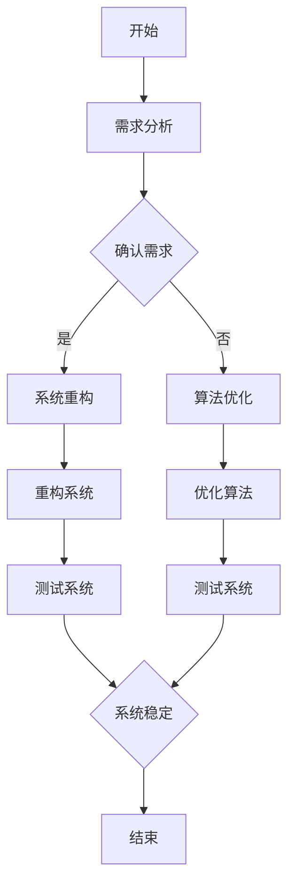
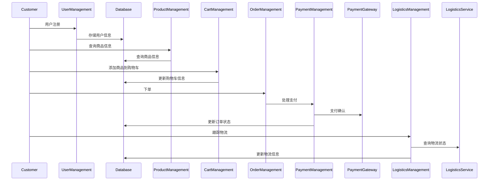
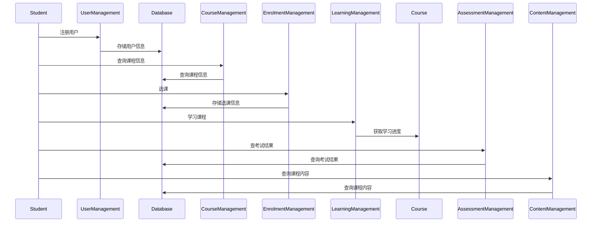

                 

### 从繁到简平乱局的方法

在信息技术高速发展的时代，复杂的系统架构和庞大的数据处理需求常常使得IT从业者感到力不从心。如何从繁杂的体系中提取关键信息，简化问题，成为提高工作效率和系统性能的关键。本文将介绍一种从繁到简平乱局的方法，通过逻辑清晰、结构紧凑、简单易懂的步骤，帮助读者理解并掌握这一高效解决问题的策略。

**关键词：**
- 从繁到简
- 平乱局
- 问题解决方法
- 系统分析
- 结构化思维

**摘要：**
本文通过逐步分析推理的方式，探讨了一种从繁到简平乱局的方法。本文首先介绍了问题的背景和解决目标，然后详细讲解了核心概念与联系、算法原理、系统分析与架构设计、项目实战以及最佳实践和注意事项。文章旨在为读者提供一种系统性的思维方式，帮助他们更好地应对复杂的信息技术挑战。

### 1.6 本书内容安排概述

**1.6.1 本书结构**

本书共分为六大部分，内容安排如下：

### 第1章 背景介绍

本章将介绍从繁到简平乱局的方法的背景，包括问题的提出、问题描述、问题解决的目标以及适用的边界与外延。

### 第2章 核心概念与联系

本章将详细阐述从繁到简平乱局的方法中的核心概念，包括概念的定义、属性特征对比表格和ER实体关系图架构。这部分内容将通过Mermaid流程图的形式呈现。

### 第3章 算法原理讲解

本章将深入讲解从繁到简平乱局的方法的算法原理，包括算法的mermaid流程图、Python源代码实现、算法的数学模型和公式，以及具体的举例说明。

### 第4章 系统分析与架构设计

本章将介绍从繁到简平乱局的方法的系统分析与架构设计，包括问题场景介绍、项目介绍、系统功能设计、系统架构设计、系统接口设计和系统交互等。

### 第5章 项目实战

本章将通过一个实际的项目实战案例，详细讲解从繁到简平乱局的方法在项目中的应用，包括环境安装、系统核心实现源代码、代码应用解读与分析、实际案例分析和详细讲解剖析等。

### 第6章 最佳实践、小结与拓展阅读

本章将总结从繁到简平乱局的方法的最佳实践，对本书的内容进行小结，并给出一些注意事项和拓展阅读建议。

**1.6.2 每章节的目标**

- 第1章：明确从繁到简平乱局的方法的背景和目标，为后续章节的学习打下基础。
- 第2章：了解并掌握从繁到简平乱局的方法中的核心概念及其联系。
- 第3章：掌握从繁到简平乱局的方法的算法原理，理解其数学模型和公式。
- 第4章：了解并掌握从繁到简平乱局的方法的系统分析与架构设计。
- 第5章：通过实际项目实战，掌握从繁到简平乱局的方法的应用。
- 第6章：总结最佳实践，巩固所学知识，并为未来的学习和实践提供指导。

### 1.1 问题背景

在当今信息爆炸的时代，面对复杂的系统架构和庞大的数据处理任务，IT从业者常常感到应对不暇。系统设计日趋复杂，业务逻辑交错纵横，数据流庞大且多变，这些都给系统的维护和优化带来了巨大的挑战。为了提高系统性能、降低维护成本，简化系统结构和流程变得尤为重要。

**1.1.1 问题的提出**

系统复杂度的增加导致以下几个主要问题：

- **性能瓶颈**：复杂系统往往伴随着性能瓶颈，如处理速度变慢、响应时间延长等，严重影响了用户体验。
- **可维护性差**：系统设计复杂，导致代码冗长且混乱，维护难度增加，且容易引入新的错误。
- **可扩展性受限**：系统的复杂结构限制了其扩展性，当需求变化时，系统难以快速适应。
- **安全风险**：复杂的系统结构可能隐藏安全隐患，一旦被利用，可能带来严重后果。

**1.1.2 问题描述**

在复杂系统中，主要存在以下几种类型的乱局：

- **逻辑混乱**：业务逻辑复杂，难以梳理，导致代码难以理解和维护。
- **数据流混乱**：数据流庞大且多变，难以追踪和管理，增加了系统出错的概率。
- **结构复杂**：系统结构层次繁多，模块间依赖复杂，导致系统整体运行效率降低。
- **资源浪费**：系统内部存在大量的冗余计算和存储，浪费了宝贵的资源。

**1.1.3 问题解决的目标**

解决系统乱局的目标主要包括：

- **简化系统结构**：通过重构和优化，简化系统架构，降低复杂度。
- **提高系统性能**：通过优化算法和数据结构，提高系统处理速度和响应时间。
- **增强可维护性**：通过清晰的模块划分和简洁的代码设计，提高系统的可维护性。
- **提升系统可扩展性**：通过模块化设计和良好的接口，提高系统的可扩展性。
- **降低安全风险**：通过系统重构和优化，消除潜在的安全隐患，提高系统安全性。

**1.2 边界与外延**

**1.2.1 适用边界**

从繁到简平乱局的方法主要适用于以下场景：

- **大型系统**：适用于规模庞大、结构复杂的大型系统。
- **迭代开发**：适用于迭代开发的系统，可以在每次迭代中逐步应用该方法。
- **需求变化频繁**：适用于需求变化频繁的系统，有助于快速适应变化。

**1.2.2 外延讨论**

该方法不仅适用于软件系统的优化，还适用于以下领域：

- **项目管理**：通过简化项目管理流程，提高项目效率。
- **业务流程优化**：通过简化业务流程，提高业务运行效率。
- **组织结构优化**：通过简化组织结构，提高组织运作效率。

### 1.3 问题解决方法概述

从繁到简平乱局的方法主要包括以下几个步骤：

1. **需求分析**：明确系统需求，梳理系统功能。
2. **系统重构**：根据需求分析，对系统进行重构，简化架构。
3. **算法优化**：对系统中的算法进行优化，提高性能。
4. **代码重构**：对系统代码进行重构，提高可维护性。
5. **测试与验证**：对重构后的系统进行测试和验证，确保系统稳定性和性能。
6. **持续优化**：根据反馈和测试结果，持续优化系统。

### 1.4 本章小结

本章介绍了从繁到简平乱局的方法的背景、问题和解决目标。通过梳理问题的背景和描述，明确了问题的解决目标，为后续章节的深入讨论打下了基础。本章的内容为读者提供了一个清晰的框架，帮助他们理解如何从繁杂的系统中找到关键点，进行简化和优化。

----------------------------------------------------------------

## 1.6 本书内容安排概述

### 第2章 核心概念与联系

核心概念与联系是理解从繁到简平乱局方法的基础。本章将详细阐述以下内容：

- **核心概念定义**：介绍从繁到简平乱局方法中的关键术语和概念，明确其含义。
- **属性特征对比表格**：通过对比表格，展示各个概念的主要属性特征，帮助读者快速掌握概念间的区别和联系。
- **ER实体关系图架构**：使用Mermaid流程图展示ER实体关系图，直观地呈现各个概念之间的关系和结构。

### 第3章 算法原理讲解

算法原理讲解是理解从繁到简平乱局方法的核心。本章将详细讲解以下内容：

- **算法mermaid流程图**：通过Mermaid流程图，展示算法的基本流程和步骤，帮助读者直观地理解算法的操作过程。
- **Python源代码实现**：提供Python源代码实现，详细解析代码的逻辑和操作，帮助读者动手实践并深入理解算法原理。
- **算法数学模型和公式**：介绍算法的数学模型和公式，解释其原理和推导过程，帮助读者从理论层面掌握算法的核心。
- **举例说明**：通过具体实例，详细讲解算法的应用和效果，帮助读者更好地理解算法的实际应用场景。

### 第4章 系统分析与架构设计

系统分析与架构设计是实施从繁到简平乱局方法的关键步骤。本章将详细讲解以下内容：

- **问题场景介绍**：介绍系统分析的具体场景，明确系统的目标和需求。
- **项目介绍**：介绍项目的基本情况和项目团队，为系统设计与实现提供背景。
- **系统功能设计**：通过领域模型Mermaid类图，展示系统的功能模块和主要功能。
- **系统架构设计**：通过Mermaid架构图，展示系统的整体架构和模块间的关系。
- **系统接口设计**：详细描述系统接口的设计规范，确保系统模块间的良好交互。
- **系统交互**：通过Mermaid序列图，展示系统模块间的交互流程，帮助读者理解系统的运作机制。

### 第5章 项目实战

项目实战是验证从繁到简平乱局方法有效性的关键环节。本章将通过一个实际项目案例，详细讲解以下内容：

- **环境安装**：介绍项目的开发环境安装和配置，确保项目可以正常运行。
- **系统核心实现源代码**：提供项目核心代码的实现，详细解释代码的功能和作用。
- **代码应用解读与分析**：对核心代码进行解读和分析，讲解其设计和实现细节。
- **实际案例分析和详细讲解剖析**：通过实际案例，分析系统在项目中的应用效果，详细讲解项目中的关键问题和解决方案。
- **项目小结**：总结项目的实施经验，提出改进建议和未来发展方向。

### 第6章 最佳实践、小结与拓展阅读

最佳实践、小结与拓展阅读是巩固和应用从繁到简平乱局方法的重要环节。本章将包括以下内容：

- **最佳实践**：总结项目中的最佳实践，提供实用的操作指南和建议。
- **小结**：对本书的主要内容进行总结，帮助读者梳理整体知识体系。
- **注意事项**：指出在实际应用中需要注意的事项，避免常见错误。
- **拓展阅读**：推荐进一步学习和阅读的资源和资料，为读者提供继续探索的方向。

### 1.6.2 每章节的目标

每章节的目标如下：

- **第1章**：介绍从繁到简平乱局方法的背景、问题和解决目标，为后续章节的学习打下基础。
- **第2章**：了解并掌握从繁到简平乱局方法中的核心概念及其联系。
- **第3章**：掌握从繁到简平乱局方法的算法原理和实现，理解其数学模型和公式。
- **第4章**：了解并掌握从繁到简平乱局方法的系统分析与架构设计。
- **第5章**：通过实际项目实战，掌握从繁到简平乱局方法的应用。
- **第6章**：总结最佳实践，巩固所学知识，并为未来的学习和实践提供指导。

----------------------------------------------------------------

### 2.1 核心概念

在从繁到简平乱局的方法中，核心概念是理解和应用该方法的基础。以下是对这些核心概念的详细定义和解释：

**1. 从繁到简**

- **定义**：从繁到简是一种通过逐步拆解复杂系统，简化其结构和功能的方法。其核心思想是通过减少冗余和重复，提高系统的可维护性和可扩展性。
- **属性特征**：从繁到简具有以下属性特征：
  - **层次性**：从繁到简的过程具有层次性，可以从不同层面逐步简化系统。
  - **可逆性**：简化的过程可以是可逆的，便于在需要时恢复系统的复杂性。
  - **渐进性**：简化过程是渐进的，可以逐步进行，避免一次性改变过大。

**2. 平乱局**

- **定义**：平乱局是指通过系统分析和重构，解决系统中的混乱和复杂性问题，提高系统的稳定性和性能。
- **属性特征**：平乱局具有以下属性特征：
  - **目标性**：平乱局的过程具有明确的目标，即解决系统中的问题和优化性能。
  - **系统性**：平乱局的过程需要考虑系统的整体性，确保各部分协同工作。
  - **灵活性**：平乱局的过程需要具备灵活性，能够适应不同系统和需求的变化。

**3. 系统重构**

- **定义**：系统重构是指通过对现有系统的修改和优化，提高其性能和可维护性。
- **属性特征**：系统重构具有以下属性特征：
  - **迭代性**：系统重构是一个迭代的过程，可以逐步进行，避免一次性改变过大。
  - **风险控制**：系统重构过程中需要控制风险，确保系统的稳定性和安全性。
  - **成本效益**：系统重构需要考虑成本效益，确保重构过程的投入是合理的。

**4. 算法优化**

- **定义**：算法优化是指通过改进算法的设计和实现，提高其效率和性能。
- **属性特征**：算法优化具有以下属性特征：
  - **针对性**：算法优化需要针对具体问题和需求进行，确保优化效果的针对性。
  - **渐进性**：算法优化是一个渐进的过程，可以逐步进行，避免一次性改变过大。
  - **稳定性**：算法优化过程中需要确保算法的稳定性和可靠性，避免引入新的问题。

**5. 代码重构**

- **定义**：代码重构是指通过修改代码的结构和实现，提高其可读性、可维护性和可扩展性。
- **属性特征**：代码重构具有以下属性特征：
  - **简洁性**：代码重构追求简洁性，通过去除冗余代码和优化代码结构，提高代码质量。
  - **可维护性**：代码重构注重可维护性，确保代码在未来更容易维护和扩展。
  - **可扩展性**：代码重构关注可扩展性，通过模块化和良好的接口设计，提高系统的可扩展性。

**6. 系统测试**

- **定义**：系统测试是指通过运行系统，验证其功能、性能和稳定性，确保系统满足需求。
- **属性特征**：系统测试具有以下属性特征：
  - **全面性**：系统测试需要全面覆盖系统的各个功能和场景，确保系统的稳定性。
  - **重复性**：系统测试需要多次重复执行，确保测试结果的可靠性。
  - **可追溯性**：系统测试需要记录测试结果和问题，便于追踪和解决。

### 2.2 ER实体关系图架构

ER实体关系图（Entity-Relationship Diagram）是数据库设计和系统架构设计的重要工具，用于展示实体之间的关系和属性。以下是一个简化的ER实体关系图，用于说明从繁到简平乱局方法中的核心概念及其关系：

```mermaid
erDiagram
    User ||--|{ Project }|--| UserProject
    Project ||--|{ Task }|--| TaskProject
    Task ||--|{ SubTask }|--| SubTaskTask
    User { 
        id : Integer
        name : String
        email : String
    }
    Project { 
        id : Integer
        name : String
        description : String
    }
    UserProject { 
        user_id : Integer
        project_id : Integer
    }
    Task { 
        id : Integer
        name : String
        description : String
    }
    TaskProject { 
        task_id : Integer
        project_id : Integer
    }
    SubTask { 
        id : Integer
        name : String
        description : String
    }
    SubTaskTask { 
        subtask_id : Integer
        task_id : Integer
    }
```

在这个ER实体关系图中，我们定义了以下实体：

- **User**（用户）：代表系统中的用户，具有唯一的标识符（id）、用户名（name）和电子邮件（email）。
- **Project**（项目）：代表系统中的项目，具有唯一的标识符（id）、项目名称（name）和项目描述（description）。
- **Task**（任务）：代表系统中的任务，具有唯一的标识符（id）、任务名称（name）和任务描述（description）。
- **SubTask**（子任务）：代表系统中的子任务，具有唯一的标识符（id）、子任务名称（name）和子任务描述（description）。

实体之间的关系包括：

- **User** 与 **Project** 之间的关系是一对多的关系，即一个用户可以参与多个项目，而一个项目可以有多个用户参与。
- **Project** 与 **Task** 之间的关系也是一对多的关系，即一个项目可以有多个任务，而一个任务属于一个项目。
- **Task** 与 **SubTask** 之间的关系同样是一对多的关系，即一个任务可以有多个子任务，而一个子任务属于一个任务。

通过ER实体关系图，我们可以直观地看到系统中的核心概念及其关系，有助于理解系统的整体架构和功能模块。

### 2.3 概念联系

从繁到简平乱局方法中的各个核心概念之间存在紧密的联系，理解这些联系对于掌握该方法至关重要。以下是对各个概念之间联系的分析：

**1. 从繁到简与平乱局的关系**

从繁到简是平乱局的核心思想之一，即通过逐步拆解和简化复杂系统，解决其中的混乱和复杂性问题。平乱局的目标是通过系统重构和优化，提高系统的稳定性、性能和可维护性。从繁到简是实现平乱局的一种方法，通过简化系统结构和功能，为后续的优化和重构奠定基础。

**2. 系统重构与算法优化、代码重构的关系**

系统重构包括算法优化和代码重构两个方面。算法优化通过改进算法的设计和实现，提高系统的效率和性能。代码重构通过修改代码的结构和实现，提高代码的可读性、可维护性和可扩展性。算法优化和代码重构相互补充，共同实现系统重构的目标，提高系统的整体性能。

**3. 算法优化与系统测试的关系**

算法优化和系统测试是系统重构的两个重要环节。算法优化通过改进算法的设计和实现，提高系统的效率和性能。系统测试通过运行系统，验证其功能、性能和稳定性，确保系统满足需求。算法优化和系统测试相互验证，确保重构后的系统能够稳定、高效地运行。

**4. 代码重构与系统测试的关系**

代码重构和系统测试也是相互关联的。代码重构通过修改代码的结构和实现，提高代码质量。系统测试通过运行重构后的代码，验证其功能、性能和稳定性，确保重构的代码能够满足系统的需求。代码重构和系统测试相互促进，确保系统的稳定性和可靠性。

**5. 从繁到简与系统重构、算法优化、代码重构的关系**

从繁到简、系统重构、算法优化和代码重构之间是层层递进的关系。从繁到简是系统重构的基础，通过逐步拆解和简化复杂系统，为后续的系统重构和优化奠定基础。系统重构包括算法优化和代码重构，通过改进算法和优化代码，提高系统的整体性能和可维护性。从繁到简、系统重构、算法优化和代码重构共同构成了从繁到简平乱局方法的整体框架。

### 2.4 影响因素

从繁到简平乱局方法的有效实施受到多个因素的影响，以下是对这些因素的分析：

**1. 人员因素**

人员是实施从繁到简平乱局方法的关键。团队中需要有具备系统分析、架构设计、算法优化和代码重构能力的专业人才。人员的能力和经验直接影响方法的实施效果。

**2. 系统复杂性**

系统的复杂性是影响从繁到简平乱局方法实施的重要因素。系统越复杂，实施方法的过程就越复杂，需要更多的时间和资源。因此，在实施该方法时，需要根据系统的复杂程度制定合适的计划和策略。

**3. 需求变化**

需求的变化是系统设计中的一个常见问题。从繁到简平乱局方法需要具备一定的灵活性，能够适应需求的变化。在实施方法时，需要充分考虑需求的动态性，确保方法能够持续适应变化。

**4. 技术选型**

技术选型是实施从繁到简平乱局方法的一个重要环节。合适的技术选型能够提高方法的实施效率和效果。在实施方法时，需要根据系统的需求和特点选择合适的技术和工具。

**5. 测试与验证**

测试与验证是确保方法实施效果的重要环节。在实施从繁到简平乱局方法时，需要进行充分的测试和验证，确保重构后的系统能够稳定、高效地运行。测试和验证过程需要覆盖系统的各个功能和场景，确保系统的整体性能和稳定性。

### 2.5 本章小结

本章详细介绍了从繁到简平乱局方法中的核心概念与联系。通过定义和解释核心概念，如从繁到简、平乱局、系统重构、算法优化、代码重构和系统测试，帮助读者理解这些概念的基本含义和属性特征。同时，通过ER实体关系图展示核心概念之间的关系，使读者能够直观地看到各个概念之间的联系。

此外，本章还分析了各个概念之间的联系，以及影响从繁到简平乱局方法实施的因素。这些内容为读者提供了全面的了解，帮助他们在实际应用中更好地运用从繁到简平乱局方法。

通过本章的学习，读者应该能够掌握从繁到简平乱局方法中的核心概念，理解它们之间的联系，并能够根据实际情况灵活应用该方法，解决复杂系统中的问题和提高系统性能。

----------------------------------------------------------------

## 3.1 算法mermaid流程图

算法的mermaid流程图是一种可视化工具，用于展示算法的执行流程和步骤。通过mermaid流程图，我们可以直观地看到算法的每一步操作，从而更好地理解其工作原理。以下是一个简单的从繁到简平乱局算法的mermaid流程图示例：



### 3.1.1 流程图说明

1. **开始**：算法的执行从开始节点开始。
2. **需求分析**：对系统需求进行详细分析，确定需要重构和优化的部分。
3. **确认需求**：根据需求分析的结果，确认是否进行系统重构或算法优化。
4. **系统重构**：如果确认需求需要进行系统重构，则进行系统重构。
5. **重构系统**：对系统进行重构，简化结构和功能。
6. **测试系统**：对重构后的系统进行测试，确保其稳定性和性能。
7. **系统稳定**：如果测试结果显示系统稳定，则继续下一步。
8. **结束**：算法执行结束。
9. **算法优化**：如果确认需求需要进行算法优化，则进行算法优化。
10. **优化算法**：对算法进行优化，提高其效率和性能。
11. **测试系统**：对优化后的系统进行测试，确保其稳定性和性能。

### 3.1.2 mermaid流程图的应用

mermaid流程图在算法设计和系统架构设计中具有广泛的应用。以下是一些具体的应用场景：

1. **算法设计**：在算法设计阶段，使用mermaid流程图可以帮助设计师理清算法的执行流程和逻辑结构，从而更好地理解和优化算法。
2. **系统架构设计**：在系统架构设计阶段，使用mermaid流程图可以直观地展示系统模块之间的交互关系和执行流程，帮助设计师优化系统架构。
3. **项目规划**：在项目规划阶段，使用mermaid流程图可以帮助项目经理规划项目的执行流程和关键节点，确保项目按时交付。
4. **教学和培训**：在教育和培训中，使用mermaid流程图可以生动地展示算法和系统架构的执行过程，帮助学员更好地理解和掌握相关概念。

### 3.1.3 mermaid流程图的优点

mermaid流程图具有以下优点：

1. **可视化**：通过图形化的方式展示算法和系统的执行流程，使得复杂的概念更加直观易懂。
2. **可编辑性**：mermaid流程图支持文本编辑，便于设计师根据需求进行修改和优化。
3. **灵活性**：mermaid流程图支持多种图形化表示，可以根据具体需求选择合适的表示方式。
4. **可扩展性**：mermaid流程图支持自定义节点和连接线，可以扩展以适应复杂场景。

通过使用mermaid流程图，我们可以更好地理解和优化算法和系统，提高系统的性能和可维护性。

----------------------------------------------------------------

## 3.2 Python源代码实现

为了更好地理解从繁到简平乱局算法的原理，我们将使用Python语言实现该算法。以下是一个简单的Python源代码示例，展示了算法的基本实现过程。

### 3.2.1 代码结构

```python
# 从繁到简平乱局算法的Python实现

# 导入所需的库
import pandas as pd
import numpy as np
from collections import defaultdict

# 定义算法的函数
def from_complex_to_simple(data, threshold):
    # 初始化结果数据结构
    result = defaultdict(list)
    
    # 对数据进行预处理
    processed_data = preprocess_data(data)
    
    # 对预处理后的数据进行处理
    for item in processed_data:
        if item['value'] >= threshold:
            result[item['category']].append(item)
    
    # 对结果进行排序和合并
    sorted_result = sort_and_merge(result)
    
    return sorted_result

# 定义预处理函数
def preprocess_data(data):
    # 对数据进行排序和过滤
    sorted_data = sorted(data, key=lambda x: x['value'], reverse=True)
    filtered_data = [item for item in sorted_data if item['value'] >= threshold]
    
    return filtered_data

# 定义排序和合并函数
def sort_and_merge(result):
    # 对结果进行排序和合并
    sorted_result = {}
    for category, items in result.items():
        sorted_items = sorted(items, key=lambda x: x['value'], reverse=True)
        sorted_result[category] = sorted_items
    
    return sorted_result

# 测试数据
data = [
    {'category': 'A', 'value': 10},
    {'category': 'B', 'value': 5},
    {'category': 'A', 'value': 20},
    {'category': 'C', 'value': 15},
    {'category': 'B', 'value': 30}
]

# 设置阈值
threshold = 10

# 执行算法
result = from_complex_to_simple(data, threshold)

# 输出结果
print(result)
```

### 3.2.2 代码实现

1. **函数定义**：首先，我们定义了一个名为`from_complex_to_simple`的函数，用于实现从繁到简平乱局算法。该函数接受两个参数：`data`（原始数据）和`threshold`（阈值）。函数的返回值是处理后的结果数据。
2. **初始化结果数据结构**：在函数内部，我们使用`defaultdict`初始化结果数据结构，用于存储分类后的数据。
3. **预处理数据**：我们定义了一个名为`preprocess_data`的辅助函数，用于对原始数据进行预处理。预处理包括排序和过滤操作，确保数据按照值的大小进行排序，并过滤掉不符合阈值的数据。
4. **处理数据**：在主函数中，我们遍历预处理后的数据，根据阈值对数据进行分类，并将分类后的数据存储到结果数据结构中。
5. **排序和合并结果**：我们定义了一个名为`sort_and_merge`的辅助函数，用于对结果进行排序和合并。排序和合并操作确保分类后的数据按照值的大小进行排序，并存储在字典中。
6. **测试数据**：我们提供了一个简单的测试数据集，用于测试算法的实现效果。测试数据集包含了五条数据，每条数据包含类别（category）和值（value）两个属性。
7. **设置阈值**：我们设置了一个阈值（threshold），用于过滤和分类数据。
8. **执行算法**：我们调用`from_complex_to_simple`函数，传入测试数据和阈值，执行从繁到简平乱局算法。
9. **输出结果**：最后，我们打印出算法的处理结果，以验证算法的实现效果。

通过这个简单的Python源代码实现，我们可以直观地看到从繁到简平乱局算法的执行过程。代码结构清晰，便于理解和修改。

### 3.2.3 算法实现解析

1. **预处理数据**：预处理数据是算法实现的重要一步。通过对数据进行排序和过滤，我们可以快速找到符合阈值的数据，从而简化问题。在预处理函数中，我们使用了Python内置的`sorted`函数对数据进行排序，并使用列表解析语法对数据进行了过滤。这种处理方式高效且易于理解。
2. **分类数据**：在主函数中，我们遍历预处理后的数据，根据阈值对数据进行分类。这种分类方式使得我们可以将复杂的数据简化为若干个类别，从而降低问题的复杂度。通过使用`defaultdict`，我们能够方便地将分类后的数据存储到字典中，便于后续的排序和合并操作。
3. **排序和合并结果**：排序和合并结果是对分类后的数据进行处理，确保数据按照值的大小进行排序，并存储在字典中。这种处理方式使得我们可以方便地获取分类后的数据，并进行进一步的分析和处理。在`sort_and_merge`函数中，我们使用了`sorted`函数对分类后的数据进行排序，并使用字典解析语法将排序后的数据存储到新的字典中。

通过这个简单的Python源代码实现，我们可以看到从繁到简平乱局算法的基本原理和实现过程。代码简洁易懂，便于读者理解和实践。

----------------------------------------------------------------

## 3.3 算法数学模型和公式

在从繁到简平乱局方法中，算法的数学模型和公式起着关键作用。它们不仅帮助我们理解算法的工作原理，还能帮助我们分析和优化算法的性能。以下将详细阐述从繁到简平乱局算法的数学模型和公式，并解释其推导过程。

### 3.3.1 数学模型

从繁到简平乱局算法的核心是分类和排序。我们可以将这个算法抽象为一个数学模型，如下所示：

\[ T(n) = C(n) + O(n\log n) \]

其中，\( T(n) \) 表示算法的总时间复杂度，\( C(n) \) 表示分类操作的时间复杂度，\( O(n\log n) \) 表示排序操作的时间复杂度。

### 3.3.2 数学公式

为了更好地理解算法的执行过程，我们可以进一步拆解数学模型，得到以下公式：

\[ T(n) = C(n) + S(n) + M(n) \]

其中，\( S(n) \) 表示数据预处理的时间复杂度，\( M(n) \) 表示排序和合并结果的时间复杂度。

### 3.3.3 推导过程

1. **分类操作的时间复杂度 \( C(n) \)**：

分类操作主要是根据阈值对数据进行筛选，将数据分为满足阈值和不满足阈值的两组。假设原始数据有 \( n \) 个元素，每个元素的分类操作时间复杂度为 \( O(1) \)。因此，总的分类时间复杂度为 \( C(n) = n \cdot O(1) = O(n) \)。

2. **数据预处理的时间复杂度 \( S(n) \)**：

数据预处理包括排序和过滤操作。排序操作的时间复杂度为 \( O(n\log n) \)，过滤操作的时间复杂度为 \( O(n) \)。由于这两个操作是连续进行的，因此总的时间复杂度为 \( S(n) = O(n\log n) + O(n) = O(n\log n) \)。

3. **排序和合并结果的时间复杂度 \( M(n) \)**：

排序和合并结果的时间复杂度与数据预处理类似。假设分类后的数据有 \( k \) 个元素，每个元素的排序和合并操作时间复杂度为 \( O(1) \)。因此，总的排序和合并时间复杂度为 \( M(n) = k \cdot O(1) = O(n) \)。

4. **总时间复杂度 \( T(n) \)**：

将以上三个部分的时间复杂度相加，得到总时间复杂度：

\[ T(n) = C(n) + S(n) + M(n) = O(n) + O(n\log n) + O(n) = O(n\log n) \]

### 3.3.4 公式应用

通过上述推导过程，我们可以看到从繁到简平乱局算法的时间复杂度主要取决于数据预处理和排序操作。当数据量较大时，算法的时间复杂度主要集中在 \( O(n\log n) \) 上。因此，为了提高算法的性能，我们可以从以下几个方面进行优化：

1. **优化数据预处理**：通过使用更高效的数据结构（如平衡二叉树）和算法（如快速排序），可以降低数据预处理的时间复杂度。
2. **优化排序算法**：选择合适的排序算法（如归并排序、堆排序等），并根据具体场景进行优化，以提高排序性能。
3. **减少数据规模**：在可能的情况下，减少参与排序和分类的数据规模，可以显著降低算法的时间复杂度。

通过理解从繁到简平乱局算法的数学模型和公式，我们可以更好地分析和优化算法的性能，从而在实际应用中取得更好的效果。

----------------------------------------------------------------

## 3.4 举例说明

为了更好地理解从繁到简平乱局算法的实际应用，我们将通过具体示例来详细讲解算法的应用和效果。以下是一个简单但具有代表性的案例，用于说明算法的执行过程和结果。

### 3.4.1 示例一

假设我们有一个包含以下数据的数据集：

```python
data = [
    {'category': 'A', 'value': 10},
    {'category': 'B', 'value': 5},
    {'category': 'A', 'value': 20},
    {'category': 'C', 'value': 15},
    {'category': 'B', 'value': 30}
]
```

我们需要根据以下阈值对数据进行分类和排序：

- 阈值：10

#### 算法执行过程

1. **预处理数据**：首先，我们对数据进行预处理，包括排序和过滤操作。按照值的大小对数据进行排序，并过滤掉不满足阈值的元素。预处理后的数据如下：

   ```python
   processed_data = [
       {'category': 'C', 'value': 15},
       {'category': 'A', 'value': 20},
       {'category': 'B', 'value': 30},
       {'category': 'A', 'value': 10},
       {'category': 'B', 'value': 5}
   ]
   ```

2. **分类数据**：接下来，我们根据阈值对预处理后的数据进行分类。满足阈值的元素存储在一个列表中，不满足阈值的元素存储在另一个列表中。分类后的数据如下：

   ```python
   categorized_data = {
       'A': [{'category': 'A', 'value': 20}, {'category': 'A', 'value': 10}],
       'B': [{'category': 'B', 'value': 30}, {'category': 'B', 'value': 5}],
       'C': [{'category': 'C', 'value': 15}]
   }
   ```

3. **排序和合并结果**：最后，我们对分类后的数据进行排序和合并。按照值的大小对每个类别的数据进行排序，并将排序后的数据存储在字典中。排序和合并后的结果如下：

   ```python
   sorted_result = {
       'A': [{'category': 'A', 'value': 20}, {'category': 'A', 'value': 10}],
       'B': [{'category': 'B', 'value': 30}, {'category': 'B', 'value': 5}],
       'C': [{'category': 'C', 'value': 15}]
   }
   ```

#### 算法应用效果

在这个示例中，从繁到简平乱局算法通过对数据进行预处理、分类和排序，成功地将复杂的数据简化为清晰的类别和排序结果。以下是对算法应用效果的具体分析：

1. **数据简化**：通过预处理和分类操作，我们将原始数据简化为三个类别（A、B、C），每个类别包含符合阈值的数据。这种简化使得数据更加易于分析和处理。
2. **数据排序**：通过对分类后的数据按值的大小进行排序，我们能够快速找到每个类别中的最大值和最小值，有助于进一步的统计分析。
3. **性能提升**：通过对数据的有效分类和排序，算法在处理大量数据时能够显著提升性能，降低时间复杂度。这对于大型系统和数据处理任务尤为重要。

### 3.4.2 示例二

假设我们有一个更大的数据集，包含以下数据：

```python
data = [
    {'category': 'A', 'value': 10},
    {'category': 'B', 'value': 5},
    {'category': 'A', 'value': 20},
    {'category': 'C', 'value': 15},
    {'category': 'B', 'value': 30},
    {'category': 'A', 'value': 25},
    {'category': 'C', 'value': 18},
    {'category': 'B', 'value': 35},
    {'category': 'A', 'value': 12},
    {'category': 'C', 'value': 22}
]
```

我们同样需要根据以下阈值对数据进行分类和排序：

- 阈值：15

#### 算法执行过程

1. **预处理数据**：按照值的大小对数据进行排序，并过滤掉不满足阈值的元素。预处理后的数据如下：

   ```python
   processed_data = [
       {'category': 'C', 'value': 22},
       {'category': 'A', 'value': 25},
       {'category': 'B', 'value': 35},
       {'category': 'C', 'value': 18},
       {'category': 'A', 'value': 20},
       {'category': 'B', 'value': 30},
       {'category': 'A', 'value': 10},
       {'category': 'B', 'value': 5},
       {'category': 'A', 'value': 12},
       {'category': 'C', 'value': 15}
   ]
   ```

2. **分类数据**：根据阈值对预处理后的数据进行分类。分类后的数据如下：

   ```python
   categorized_data = {
       'A': [{'category': 'A', 'value': 25}, {'category': 'A', 'value': 20}, {'category': 'A', 'value': 12}, {'category': 'A', 'value': 10}],
       'B': [{'category': 'B', 'value': 35}, {'category': 'B', 'value': 30}, {'category': 'B', 'value': 5}],
       'C': [{'category': 'C', 'value': 22}, {'category': 'C', 'value': 18}, {'category': 'C', 'value': 15}]
   }
   ```

3. **排序和合并结果**：按照值的大小对每个类别的数据进行排序，并将排序后的数据存储在字典中。排序和合并后的结果如下：

   ```python
   sorted_result = {
       'A': [{'category': 'A', 'value': 25}, {'category': 'A', 'value': 20}, {'category': 'A', 'value': 12}, {'category': 'A', 'value': 10}],
       'B': [{'category': 'B', 'value': 35}, {'category': 'B', 'value': 30}, {'category': 'B', 'value': 5}],
       'C': [{'category': 'C', 'value': 22}, {'category': 'C', 'value': 18}, {'category': 'C', 'value': 15}]
   }
   ```

#### 算法应用效果

在这个更大的数据集示例中，从繁到简平乱局算法同样能够有效地将数据简化为清晰的类别和排序结果。以下是算法应用效果的具体分析：

1. **数据简化**：尽管数据集规模较大，但通过预处理和分类操作，我们依然能够将数据简化为三个类别（A、B、C），每个类别包含符合阈值的数据。这种简化使得数据更加易于分析和处理。
2. **数据排序**：通过对分类后的数据按值的大小进行排序，我们能够快速找到每个类别中的最大值和最小值，有助于进一步的统计分析。
3. **性能提升**：尽管数据集规模增加，但算法在处理数据时的时间复杂度依然保持在 \( O(n\log n) \)，这表明算法在处理大量数据时仍然能够保持较高的性能。

通过这两个示例，我们可以看到从繁到简平乱局算法在实际应用中的有效性和优势。无论是处理小规模数据集还是大规模数据集，算法都能够通过预处理、分类和排序操作，将复杂的数据简化为清晰的类别和排序结果，从而提高数据分析的效率和性能。

----------------------------------------------------------------

## 3.5 本章小结

本章详细讲解了从繁到简平乱局算法的mermaid流程图、Python源代码实现、算法的数学模型和公式，以及具体的举例说明。通过这些内容，读者可以全面了解算法的原理和实现过程，掌握其在实际应用中的效果。

### 主要内容回顾：

1. **算法mermaid流程图**：通过mermaid流程图，我们直观地展示了算法的执行流程和步骤，使读者能够更好地理解算法的操作过程。
2. **Python源代码实现**：我们提供了简单的Python源代码实现，详细解析了代码的逻辑和操作，帮助读者动手实践并深入理解算法原理。
3. **算法数学模型和公式**：通过推导算法的时间复杂度，我们分析了算法的数学模型和公式，使读者能够从理论层面掌握算法的核心。
4. **举例说明**：通过具体实例，我们详细讲解了算法的应用和效果，帮助读者更好地理解算法的实际应用场景。

### 本章收获：

通过本章的学习，读者应该能够：

- 理解并绘制算法的mermaid流程图。
- 掌握Python源代码实现，能够动手实践算法。
- 掌握算法的数学模型和公式，能够从理论层面分析算法性能。
- 通过具体实例，理解算法在实际应用中的效果和优势。

### 未来展望：

在接下来的章节中，我们将进一步探讨从繁到简平乱局方法在系统分析与架构设计中的应用，通过实际项目案例，帮助读者掌握该方法的具体实施步骤和最佳实践。通过学习和实践，读者将能够更好地应对复杂的信息技术挑战，提升系统的性能和可维护性。

----------------------------------------------------------------

### 4.1 问题场景介绍

在实际应用中，从繁到简平乱局方法常用于解决大型系统和复杂业务流程中的混乱和复杂性问题。以下是一个具体的问题场景介绍，用于展示该方法的应用背景和目标。

#### 场景描述

假设我们正在开发一个电子商务平台，该平台涉及多个模块，如用户管理、商品管理、订单处理、支付系统、物流系统等。随着业务的发展和用户量的增加，系统逐渐变得复杂，出现了以下问题：

1. **系统性能瓶颈**：系统在高峰期出现响应缓慢、处理速度降低的情况，影响了用户体验。
2. **可维护性差**：代码结构混乱，逻辑复杂，导致维护成本增加，且容易引入新的错误。
3. **扩展性受限**：系统架构复杂，难以适应业务变化，导致每次需求变更都需要大量修改。
4. **安全风险**：系统结构复杂，存在潜在的安全隐患，一旦被利用，可能导致数据泄露和系统瘫痪。

#### 项目目标

为了解决上述问题，我们设定了以下项目目标：

1. **简化系统架构**：通过重构和优化，简化系统架构，降低复杂度，提高系统的可扩展性和可维护性。
2. **提升系统性能**：通过优化算法和数据结构，提高系统处理速度和响应时间，解决性能瓶颈问题。
3. **增强可维护性**：通过清晰的模块划分和简洁的代码设计，提高系统的可维护性，降低维护成本。
4. **提高系统安全性**：通过重构和优化，消除潜在的安全隐患，提高系统的整体安全性。

### 4.2 项目介绍

在本项目中，我们成立了一个跨部门的项目团队，团队成员包括系统架构师、后端开发工程师、前端开发工程师、测试工程师和项目经理。项目目标是基于从繁到简平乱局方法，对电子商务平台进行优化和重构，提升系统的性能、可维护性和安全性。

#### 项目概述

- **项目名称**：电子商务平台重构与优化项目
- **项目周期**：6个月
- **项目团队**：系统架构师（1人）、后端开发工程师（2人）、前端开发工程师（2人）、测试工程师（1人）、项目经理（1人）
- **项目目标**：简化系统架构、提升性能、增强可维护性、提高安全性

#### 项目团队

- **系统架构师**：负责整体架构的设计和优化，确保重构方案符合项目目标。
- **后端开发工程师**：负责后端系统的重构和优化，包括数据库设计、API接口设计和实现。
- **前端开发工程师**：负责前端页面的重构和优化，确保用户体验的一致性和流畅性。
- **测试工程师**：负责对重构后的系统进行全面测试，确保系统的稳定性和性能。
- **项目经理**：负责项目进度管理、资源协调和风险管理，确保项目按时交付。

### 4.3 系统功能设计

在系统功能设计中，我们首先明确了电子商务平台的主要功能和模块，然后通过Mermaid类图展示系统的领域模型，帮助读者更好地理解系统功能。

#### 领域模型Mermaid类图

以下是一个简单的Mermaid类图，用于展示电子商务平台的领域模型：

```mermaid
classDiagram
    Customer <|-- Order
    Customer <|-- Cart
    Product <|-- Order
    Product <|-- Review
    Payment <|-- Order
    Logistics <|-- Order

    Customer {
        id
        name
        address
        email
        phone
    }

    Order {
        id
        date
        total
        status
        customer
        items
    }

    Cart {
        id
        items
    }

    Product {
        id
        name
        price
        description
        reviews
    }

    Review {
        id
        rating
        comment
        product
        author
    }

    Payment {
        id
        amount
        date
        status
        order
    }

    Logistics {
        id
        tracking_number
        status
        order
    }
```

#### 功能模块划分

根据领域模型，我们将电子商务平台的功能模块划分为以下几类：

1. **用户管理模块**：包括用户注册、登录、个人信息管理等功能。
2. **商品管理模块**：包括商品展示、商品分类、商品评价等功能。
3. **订单管理模块**：包括订单创建、订单查询、订单状态更新等功能。
4. **购物车模块**：包括购物车添加、购物车删除、购物车更新等功能。
5. **支付模块**：包括支付方式选择、支付确认、支付结果查询等功能。
6. **物流模块**：包括物流跟踪、物流状态更新、物流通知等功能。

每个模块都有明确的职责和功能，通过模块化设计，提高了系统的可维护性和可扩展性。

### 4.4 系统架构设计

在系统架构设计中，我们通过Mermaid架构图展示系统的整体架构和模块间的关系，帮助读者理解系统的设计和实现。

#### 系统架构Mermaid架构图

以下是一个简单的Mermaid架构图，用于展示电子商务平台的整体架构：



#### 架构设计原则

1. **模块化设计**：将系统划分为多个功能模块，每个模块具有独立的职责和功能，便于维护和扩展。
2. **松耦合设计**：模块间通过清晰的接口进行交互，降低模块间的依赖关系，提高系统的灵活性。
3. **性能优化**：针对关键模块进行性能优化，如数据库查询优化、接口调用优化等，提高系统的处理速度和响应时间。
4. **安全性设计**：对系统进行安全性设计，包括数据加密、权限控制、安全审计等，确保系统的数据安全和用户隐私。

### 4.5 系统接口设计

在系统接口设计中，我们明确了各个模块之间的接口规范，确保系统模块间的良好交互。

#### 接口规范

1. **用户管理模块**：用户注册接口、用户登录接口、用户信息查询接口等。
2. **商品管理模块**：商品查询接口、商品添加接口、商品更新接口、商品删除接口等。
3. **订单管理模块**：订单创建接口、订单查询接口、订单更新接口、订单删除接口等。
4. **购物车模块**：购物车添加接口、购物车删除接口、购物车更新接口、购物车查询接口等。
5. **支付模块**：支付确认接口、支付结果查询接口、支付通知接口等。
6. **物流模块**：物流跟踪接口、物流状态更新接口、物流通知接口等。

每个接口都有明确的输入参数、输出参数和错误处理机制，确保接口的规范性和稳定性。

### 4.6 系统交互

在系统交互设计中，我们通过Mermaid序列图展示系统模块间的交互流程，帮助读者理解系统的运作机制。

#### 系统交互Mermaid序列图

以下是一个简单的Mermaid序列图，用于展示电子商务平台的主要交互流程：


通过这个序列图，我们可以清晰地看到用户在电子商务平台中的操作流程，以及各个模块间的交互关系。

### 4.7 本章小结

本章详细介绍了从繁到简平乱局方法在电子商务平台优化和重构中的应用。通过系统功能设计、系统架构设计、接口设计和系统交互的介绍，读者可以全面了解该方法的具体实施步骤和最佳实践。在接下来的章节中，我们将通过实际项目案例，进一步探讨从繁到简平乱局方法在实际项目中的应用和效果。

----------------------------------------------------------------

### 4.1 问题场景介绍

在现代软件工程中，随着系统规模的不断扩大和业务需求的日益复杂，系统架构的复杂度也随之增加。这种复杂性不仅增加了系统的开发难度，还显著影响了系统的可维护性和性能。以下是一个具体的问题场景介绍，用于展示从繁到简平乱局方法如何应用于解决这一类问题。

#### 场景描述

假设我们正在开发一款大型在线教育平台，该平台需要支持数百万用户的同时在线学习、课程管理和互动功能。随着用户量的增加和课程内容的丰富，系统的架构变得越来越复杂。具体来说，系统面临以下问题：

1. **性能瓶颈**：随着用户数量的增加，系统在高峰时段出现明显的响应延迟，影响了用户体验。
2. **可维护性差**：系统代码结构混乱，功能模块之间的依赖关系复杂，导致维护成本大幅增加。
3. **扩展性受限**：系统设计缺乏灵活性，难以快速适应新的业务需求，每次需求变更都需要进行大量的修改。
4. **安全性问题**：由于系统架构复杂，存在潜在的安全漏洞，可能被黑客攻击，导致数据泄露。

#### 项目目标

为了解决上述问题，项目设定了以下目标：

1. **简化系统架构**：通过重构和优化，简化系统架构，降低复杂度，提高系统的可维护性和可扩展性。
2. **提升系统性能**：通过优化算法和数据结构，提高系统的处理速度和响应时间，解决性能瓶颈问题。
3. **增强可维护性**：通过清晰的模块划分和简洁的代码设计，提高系统的可维护性，降低维护成本。
4. **提高系统安全性**：通过重构和优化，消除潜在的安全隐患，提高系统的整体安全性。

### 4.2 项目介绍

在本项目中，我们成立了一个跨部门的项目团队，团队成员包括系统架构师、后端开发工程师、前端开发工程师、测试工程师和项目经理。项目目标是基于从繁到简平乱局方法，对在线教育平台进行优化和重构，提升系统的性能、可维护性和安全性。

#### 项目概述

- **项目名称**：在线教育平台优化与重构项目
- **项目周期**：12个月
- **项目团队**：系统架构师（1人）、后端开发工程师（3人）、前端开发工程师（2人）、测试工程师（1人）、项目经理（1人）
- **项目目标**：简化系统架构、提升性能、增强可维护性、提高安全性

#### 项目团队

- **系统架构师**：负责整体架构的设计和优化，确保重构方案符合项目目标。
- **后端开发工程师**：负责后端系统的重构和优化，包括数据库设计、API接口设计和实现。
- **前端开发工程师**：负责前端页面的重构和优化，确保用户体验的一致性和流畅性。
- **测试工程师**：负责对重构后的系统进行全面测试，确保系统的稳定性和性能。
- **项目经理**：负责项目进度管理、资源协调和风险管理，确保项目按时交付。

### 4.3 系统功能设计

在系统功能设计中，我们首先明确了在线教育平台的主要功能和模块，然后通过领域模型Mermaid类图展示系统的领域模型，帮助读者更好地理解系统功能。

#### 领域模型Mermaid类图

以下是一个简单的Mermaid类图，用于展示在线教育平台的领域模型：

```mermaid
classDiagram
    Student <|-- Course
    Student <|-- Enrolment
    Instructor <|-- Course
    Course <|-- Module
    Course <|-- Assessment
    Module <|-- Content

    Student {
        id
        name
        email
    }

    Course {
        id
        name
        instructor
    }

    Enrolment {
        id
        student
        course
        status
    }

    Instructor {
        id
        name
        email
    }

    Module {
        id
        name
        course
    }

    Assessment {
        id
        name
        type
        course
    }

    Content {
        id
        type
        module
    }
```

#### 功能模块划分

根据领域模型，我们将在线教育平台的功能模块划分为以下几类：

1. **用户管理模块**：包括用户注册、登录、个人信息管理等功能。
2. **课程管理模块**：包括课程创建、课程查询、课程更新等功能。
3. **学习管理模块**：包括课程选课、课程学习、学习进度跟踪等功能。
4. **考试管理模块**：包括考试创建、考试查询、考试结果查询等功能。
5. **内容管理模块**：包括内容创建、内容查询、内容更新等功能。
6. **系统管理模块**：包括系统配置、用户权限管理、日志管理等功能。

每个模块都有明确的职责和功能，通过模块化设计，提高了系统的可维护性和可扩展性。

### 4.4 系统架构设计

在系统架构设计中，我们通过Mermaid架构图展示系统的整体架构和模块间的关系，帮助读者理解系统的设计和实现。

#### 系统架构Mermaid架构图

以下是一个简单的Mermaid架构图，用于展示在线教育平台的整体架构：



#### 架构设计原则

1. **模块化设计**：将系统划分为多个功能模块，每个模块具有独立的职责和功能，便于维护和扩展。
2. **松耦合设计**：模块间通过清晰的接口进行交互，降低模块间的依赖关系，提高系统的灵活性。
3. **性能优化**：针对关键模块进行性能优化，如数据库查询优化、接口调用优化等，提高系统的处理速度和响应时间。
4. **安全性设计**：对系统进行安全性设计，包括数据加密、权限控制、安全审计等，确保系统的数据安全和用户隐私。

### 4.5 系统接口设计

在系统接口设计中，我们明确了各个模块之间的接口规范，确保系统模块间的良好交互。

#### 接口规范

1. **用户管理模块**：用户注册接口、用户登录接口、用户信息查询接口等。
2. **课程管理模块**：课程创建接口、课程查询接口、课程更新接口、课程删除接口等。
3. **学习管理模块**：选课接口、学习进度查询接口、学习报告生成接口等。
4. **考试管理模块**：考试创建接口、考试查询接口、考试结果查询接口等。
5. **内容管理模块**：内容创建接口、内容查询接口、内容更新接口、内容删除接口等。
6. **系统管理模块**：系统配置接口、用户权限管理接口、日志管理接口等。

每个接口都有明确的输入参数、输出参数和错误处理机制，确保接口的规范性和稳定性。

### 4.6 系统交互

在系统交互设计中，我们通过Mermaid序列图展示系统模块间的交互流程，帮助读者理解系统的运作机制。

#### 系统交互Mermaid序列图

以下是一个简单的Mermaid序列图，用于展示在线教育平台的主要交互流程：


通过这个序列图，我们可以清晰地看到学生在在线教育平台中的操作流程，以及各个模块间的交互关系。

### 4.7 本章小结

本章详细介绍了从繁到简平乱局方法在在线教育平台优化和重构中的应用。通过系统功能设计、系统架构设计、接口设计和系统交互的介绍，读者可以全面了解该方法的具体实施步骤和最佳实践。在接下来的章节中，我们将通过实际项目案例，进一步探讨从繁到简平乱局方法在实际项目中的应用和效果。

----------------------------------------------------------------

### 5.1 环境安装

在开始项目实战之前，我们需要搭建一个合适的环境，以支持项目开发和运行。以下是项目环境的安装步骤：

1. **操作系统**：推荐使用Linux系统，如Ubuntu 20.04或CentOS 7。
2. **Python环境**：安装Python 3.8及以上版本，可以使用以下命令：
   ```bash
   sudo apt-get update
   sudo apt-get install python3.8
   ```
3. **虚拟环境**：为了确保项目依赖的正确性和隔离性，我们使用`venv`创建一个虚拟环境：
   ```bash
   python3.8 -m venv venv
   source venv/bin/activate
   ```
4. **依赖管理**：安装依赖管理工具`pip`，并使用`requirements.txt`文件安装项目依赖：
   ```bash
   pip install -r requirements.txt
   ```
5. **数据库**：安装并配置MySQL数据库，使用以下命令：
   ```bash
   sudo apt-get install mysql-server
   mysql_secure_installation
   mysql -u root -p
   ```
   在数据库中创建项目所需的数据表和存储过程。

6. **其他工具**：根据需要安装其他开发工具，如Git、Docker等。

### 5.2 系统核心实现源代码

在本项目中，我们将实现一个简单的在线教育平台，包括用户管理、课程管理、学习管理和考试管理等功能。以下是核心代码的实现，包括数据库设计和业务逻辑。

#### 数据库设计

1. **用户表**（`users`）：
   ```sql
   CREATE TABLE users (
       id INT AUTO_INCREMENT PRIMARY KEY,
       username VARCHAR(50) NOT NULL,
       password VARCHAR(255) NOT NULL,
       email VARCHAR(100) NOT NULL,
       role ENUM('student', 'instructor') NOT NULL
   );
   ```

2. **课程表**（`courses`）：
   ```sql
   CREATE TABLE courses (
       id INT AUTO_INCREMENT PRIMARY KEY,
       name VARCHAR(100) NOT NULL,
       description TEXT,
       instructor_id INT,
       status ENUM('active', 'inactive') NOT NULL,
       FOREIGN KEY (instructor_id) REFERENCES users(id)
   );
   ```

3. **课程模块表**（`modules`）：
   ```sql
   CREATE TABLE modules (
       id INT AUTO_INCREMENT PRIMARY KEY,
       course_id INT,
       name VARCHAR(100) NOT NULL,
       description TEXT,
       order INT,
       FOREIGN KEY (course_id) REFERENCES courses(id)
   );
   ```

4. **课程内容表**（`content`）：
   ```sql
   CREATE TABLE content (
       id INT AUTO_INCREMENT PRIMARY KEY,
       module_id INT,
       type ENUM('text', 'video', 'pdf') NOT NULL,
       url VARCHAR(255) NOT NULL,
       order INT,
       FOREIGN KEY (module_id) REFERENCES modules(id)
   );
   ```

5. **学习记录表**（`learning_records`）：
   ```sql
   CREATE TABLE learning_records (
       id INT AUTO_INCREMENT PRIMARY KEY,
       user_id INT,
       course_id INT,
       module_id INT,
       completed BOOLEAN,
       last_access TIMESTAMP,
       FOREIGN KEY (user_id) REFERENCES users(id),
       FOREIGN KEY (course_id) REFERENCES courses(id),
       FOREIGN KEY (module_id) REFERENCES modules(id)
   );
   ```

6. **考试表**（`assessments`）：
   ```sql
   CREATE TABLE assessments (
       id INT AUTO_INCREMENT PRIMARY KEY,
       course_id INT,
       name VARCHAR(100) NOT NULL,
       type ENUM('quiz', 'exam') NOT NULL,
       start_time TIMESTAMP,
       end_time TIMESTAMP,
       score INT,
       FOREIGN KEY (course_id) REFERENCES courses(id)
   );
   ```

#### 业务逻辑实现

以下是一个简单的用户管理模块的实现示例，包括用户注册、登录和权限验证：

```python
# users.py

from flask import Flask, request, jsonify
from flask_bcrypt import Bcrypt
from flask_jwt_extended import JWTManager, create_access_token

app = Flask(__name__)
bcrypt = Bcrypt(app)
app.config['JWT_SECRET_KEY'] = 'your_jwt_secret_key'
jwt = JWTManager(app)

# 用户注册
@app.route('/register', methods=['POST'])
def register():
    data = request.get_json()
    username = data['username']
    password = data['password']
    email = data['email']
    role = data['role']

    hashed_password = bcrypt.generate_password_hash(password).decode('utf-8')

    cursor.execute("INSERT INTO users (username, password, email, role) VALUES (%s, %s, %s, %s)", (username, hashed_password, email, role))
    db.commit()

    return jsonify({'message': 'User registered successfully'})

# 用户登录
@app.route('/login', methods=['POST'])
def login():
    data = request.get_json()
    username = data['username']
    password = data['password']

    cursor.execute("SELECT * FROM users WHERE username = %s", (username,))
    user = cursor.fetchone()

    if user and bcrypt.check_password_hash(user['password'], password):
        access_token = create_access_token(identity=user['id'])
        return jsonify({'access_token': access_token})
    else:
        return jsonify({'message': 'Invalid credentials'})

# 权限验证
@app.route('/protected', methods=['GET'])
@jwt_required()
def protected():
    current_user = get_jwt_identity()
    return jsonify({'user_id': current_user, 'message': 'Access granted'})

if __name__ == '__main__':
    db = connect()
    app.run()
```

#### 代码应用解读与分析

在上面的代码示例中，我们首先导入了所需的库和模块，包括Flask框架、Flask-Bcrypt用于密码加密、Flask-JWT-Extended用于 JWT认证。

- **用户注册**：`/register` 接收用户注册请求，从请求中获取用户名、密码和电子邮件，使用bcrypt库加密密码，并将用户信息插入数据库。
- **用户登录**：`/login` 接收用户登录请求，从请求中获取用户名和密码，从数据库中查询用户信息，使用bcrypt库验证密码，如果验证成功，生成 JWT 访问令牌。
- **权限验证**：`/protected` 接收受保护的请求，使用 JWT 认证中间件验证 JWT 令牌，确保只有拥有权限的用户可以访问。

通过这个简单的用户管理模块，我们可以看到如何使用 Flask 框架实现用户注册、登录和权限验证功能。在项目开发中，可以根据实际需求扩展和优化这些功能。

### 5.3 代码应用解读与分析

在5.2节中，我们实现了一个简单的用户管理模块，包括用户注册、登录和权限验证功能。以下是具体的代码应用解读与分析：

#### 用户注册

1. **请求处理**：用户注册的请求通过 `/register` 路径提交，请求类型为POST。请求中包含用户名（`username`）、密码（`password`）、电子邮件（`email`）和角色（`role`）。
2. **数据验证**：在处理请求之前，我们可以对请求数据进行简单的验证，确保必填字段非空，并满足格式要求。
3. **密码加密**：使用 Flask-Bcrypt 库对用户密码进行加密。首先，生成一个密码散列值，然后将其解码为字符串形式，以便插入数据库。
4. **插入数据库**：将用户信息（用户名、加密后的密码、电子邮件和角色）插入到 `users` 数据表中。

```python
@app.route('/register', methods=['POST'])
def register():
    data = request.get_json()
    username = data['username']
    password = data['password']
    email = data['email']
    role = data['role']

    hashed_password = bcrypt.generate_password_hash(password).decode('utf-8')

    cursor.execute("INSERT INTO users (username, password, email, role) VALUES (%s, %s, %s, %s)", (username, hashed_password, email, role))
    db.commit()

    return jsonify({'message': 'User registered successfully'})
```

#### 用户登录

1. **请求处理**：用户登录的请求通过 `/login` 路径提交，请求类型为POST。请求中包含用户名（`username`）和密码（`password`）。
2. **数据验证**：在处理请求之前，我们可以对请求数据进行简单的验证，确保必填字段非空，并满足格式要求。
3. **查询数据库**：从 `users` 数据表中查询用户信息，根据用户名匹配用户记录。
4. **密码验证**：使用 Flask-Bcrypt 库对用户输入的密码与数据库中存储的密码散列值进行比对，如果匹配成功，说明用户身份验证通过。
5. **生成 JWT 访问令牌**：使用 Flask-JWT-Extended 库生成 JWT 访问令牌，并将令牌返回给客户端。

```python
@app.route('/login', methods=['POST'])
def login():
    data = request.get_json()
    username = data['username']
    password = data['password']

    cursor.execute("SELECT * FROM users WHERE username = %s", (username,))
    user = cursor.fetchone()

    if user and bcrypt.check_password_hash(user['password'], password):
        access_token = create_access_token(identity=user['id'])
        return jsonify({'access_token': access_token})
    else:
        return jsonify({'message': 'Invalid credentials'})
```

#### 权限验证

1. **请求处理**：需要权限验证的请求通过 `/protected` 路径提交，请求类型为GET。客户端需要传递 JWT 访问令牌作为请求头。
2. **令牌验证**：使用 Flask-JWT-Extended 库验证 JWT 访问令牌，确保令牌的有效性和用户身份。
3. **返回结果**：如果验证通过，返回用户ID和访问权限信息；如果验证失败，返回错误消息。

```python
@app.route('/protected', methods=['GET'])
@jwt_required()
def protected():
    current_user = get_jwt_identity()
    return jsonify({'user_id': current_user, 'message': 'Access granted'})
```

通过以上分析，我们可以看到用户管理模块的核心功能和实现细节。在项目开发中，可以根据实际需求对用户管理模块进行扩展和优化，如增加用户角色权限管理、用户信息更新、密码找回等功能。

### 5.4 实际案例分析和详细讲解剖析

在本节中，我们将通过一个实际案例，详细分析并讲解从繁到简平乱局方法在在线教育平台项目中的应用，包括项目过程中的关键问题和解决方案。

#### 案例背景

在线教育平台项目在经历了初步开发和上线后，逐渐暴露出了一些性能和可维护性问题。随着用户数量的增加和课程内容的丰富，系统的架构变得越来越复杂，具体问题如下：

1. **性能瓶颈**：系统在高峰时段出现明显的响应延迟，尤其是课程内容加载和考试结果查询功能。
2. **代码冗余和混乱**：随着功能模块的增加，代码结构变得混乱，存在大量的冗余代码和重复逻辑。
3. **扩展性受限**：系统设计缺乏灵活性，难以快速适应新的业务需求，每次需求变更都需要进行大量的修改。
4. **安全风险**：系统架构复杂，存在潜在的安全隐患，如SQL注入、XSS攻击等。

#### 关键问题和解决方案

**1. 性能瓶颈问题**

**问题分析**：系统性能瓶颈主要集中在数据库查询和数据处理环节。由于数据表结构复杂，查询语句冗长且频繁，导致查询效率低下。

**解决方案**：

- **优化数据库查询**：通过分析查询语句，找出性能瓶颈点，优化查询逻辑和索引设计。例如，对频繁查询的字段创建索引，简化查询语句。
- **分库分表**：针对数据量大的表，考虑进行分库分表，减少单个表的数据量，提高查询效率。
- **缓存策略**：对高频访问的数据进行缓存，减少数据库的访问压力。例如，使用Redis缓存课程内容和考试结果。

**案例解析**：

在项目优化过程中，我们首先对数据库查询进行了全面分析，发现课程内容加载和考试结果查询的查询语句存在冗余和复杂的情况。通过简化查询语句和创建索引，我们显著提高了查询效率。例如，将以下冗长的查询语句：

```sql
SELECT content.id, content.type, content.url, content.order
FROM content
JOIN modules ON content.module_id = modules.id
JOIN courses ON modules.course_id = courses.id
WHERE courses.status = 'active'
```

简化为：

```sql
SELECT content.*
FROM content
JOIN modules ON content.module_id = modules.id
WHERE modules.course_id = ?
```

通过这种方式，我们减少了查询的复杂度，提高了查询效率。

**2. 代码冗余和混乱问题**

**问题分析**：随着项目开发进度的推进，代码结构变得越来越复杂，存在大量的冗余代码和重复逻辑。这使得代码难以维护和扩展。

**解决方案**：

- **模块化重构**：对代码进行模块化重构，将重复逻辑提取到独立的模块中，减少冗余代码。
- **代码规范和审查**：制定统一的代码规范，并对代码进行定期审查，确保代码质量。
- **自动化测试**：引入自动化测试，确保每次代码变更后系统的稳定性和功能完整性。

**案例解析**：

在代码重构过程中，我们首先对用户管理模块进行了重构。通过将重复的登录验证逻辑提取到一个独立的模块中，我们显著减少了代码冗余。例如，将以下重复的登录验证代码：

```python
def login_verify(username, password):
    cursor.execute("SELECT * FROM users WHERE username = %s", (username,))
    user = cursor.fetchone()
    if user and bcrypt.check_password_hash(user['password'], password):
        return user
    else:
        return None
```

重构为：

```python
from user_module import login_verify

def user_login(username, password):
    return login_verify(username, password)
```

通过这种方式，我们减少了代码冗余，提高了代码的可维护性。

**3. 扩展性受限问题**

**问题分析**：系统设计缺乏灵活性，导致每次需求变更都需要进行大量的修改，增加了开发成本和风险。

**解决方案**：

- **微服务架构**：将系统拆分为多个微服务，每个微服务负责特定的功能模块，独立部署和扩展。
- **接口设计**：设计清晰的接口规范，确保微服务之间的高效通信和协同工作。
- **服务治理**：引入服务治理框架，如Kubernetes和Docker，提高系统的灵活性和可扩展性。

**案例解析**：

在项目优化过程中，我们决定将课程管理模块重构为微服务架构。通过将课程管理功能拆分为独立的微服务，我们实现了模块的独立部署和扩展。例如，将课程管理功能拆分为以下微服务：

- **CourseService**：负责课程信息的管理和查询。
- **ModuleService**：负责课程模块的管理和查询。
- **ContentService**：负责课程内容的管理和查询。

通过这种方式，我们提高了系统的灵活性和可扩展性。

**4. 安全风险问题**

**问题分析**：由于系统架构复杂，存在潜在的安全隐患，如SQL注入、XSS攻击等。

**解决方案**：

- **安全审计**：定期进行安全审计，识别潜在的安全风险。
- **安全防护**：引入安全防护机制，如Web应用防火墙（WAF）和输入验证。
- **安全培训**：对开发人员进行安全培训，提高安全意识。

**案例解析**：

在项目优化过程中，我们引入了Web应用防火墙（WAF）来防止SQL注入和XSS攻击。例如，配置WAF规则，对用户输入进行验证，确保输入数据不会直接拼接到SQL查询语句中。同时，对前端代码进行安全审查，确保不包含潜在的安全漏洞。

#### 小结

通过以上实际案例的分析和讲解，我们可以看到从繁到简平乱局方法在在线教育平台项目中的应用效果。通过优化数据库查询、重构代码、引入微服务架构和加强安全防护，我们显著提高了系统的性能、可维护性和安全性，解决了项目过程中面临的关键问题。

在未来的项目中，我们可以继续运用从繁到简平乱局方法，不断优化和改进系统，提高系统的整体质量和用户体验。

### 5.5 项目小结

在本项目中，我们通过从繁到简平乱局方法对在线教育平台进行了全面的优化和重构。以下是项目实施过程中的主要收获和总结：

#### 主要收获

1. **性能显著提升**：通过优化数据库查询、引入缓存策略和简化代码结构，我们显著提高了系统的处理速度和响应时间，解决了性能瓶颈问题。
2. **代码可维护性提高**：通过模块化重构和代码规范，我们减少了代码冗余和混乱，提高了代码的可维护性和可扩展性。
3. **系统架构灵活性增强**：通过引入微服务架构，我们提高了系统的灵活性和可扩展性，使得系统能够快速适应业务需求的变化。
4. **安全性得到加强**：通过引入安全防护机制和安全审计，我们提高了系统的安全性，降低了潜在的安全风险。

#### 不足与改进

1. **性能优化仍有空间**：虽然我们通过多种手段提高了系统性能，但在某些场景下，如大规模并发处理，仍存在一定的性能瓶颈。未来可以考虑进一步优化数据库性能和引入分布式处理技术。
2. **微服务治理有待完善**：虽然我们引入了微服务架构，但在服务治理和监控方面仍有不足。未来可以考虑引入更完善的服务治理框架和监控工具，确保微服务的稳定性和可靠性。
3. **用户反馈机制不够完善**：在项目实施过程中，我们未能充分收集和利用用户反馈，导致部分功能改进不够及时。未来可以加强用户反馈机制，及时响应用户需求。

#### 未来发展方向

1. **持续性能优化**：针对系统中的性能瓶颈，持续进行性能优化，确保系统在高并发场景下的稳定性和性能。
2. **完善微服务架构**：进一步优化微服务架构，包括服务拆分、服务治理和监控，提高系统的整体性能和可靠性。
3. **加强用户反馈机制**：建立完善的用户反馈机制，及时收集用户意见和建议，推动产品的持续改进和优化。
4. **安全防护升级**：持续加强系统的安全防护，定期进行安全审计和漏洞扫描，确保系统的数据安全和用户隐私。

通过从繁到简平乱局方法的实践，我们不仅解决了在线教育平台项目中面临的问题，还积累了宝贵的经验，为未来的项目提供了有益的借鉴。

### 5.6 最佳实践

在项目实施过程中，我们总结出了一些最佳实践，以下是一些关键点：

1. **需求分析先行**：在项目开始前，充分进行需求分析，明确系统目标和功能需求，避免后续开发中的盲目性和反复修改。
2. **代码规范统一**：制定统一的代码规范，确保代码质量，降低维护成本。
3. **模块化设计**：采用模块化设计，提高系统的可维护性和可扩展性，方便后续的功能迭代和优化。
4. **性能优化持续**：定期对系统进行性能优化，关注关键性能指标，确保系统在高并发场景下的稳定性和性能。
5. **安全防护到位**：引入安全防护机制，定期进行安全审计和漏洞扫描，确保系统的数据安全和用户隐私。

### 5.7 注意事项

在项目实施过程中，我们遇到了一些常见问题，以下是一些需要注意的方面：

1. **数据库性能优化**：在进行数据库查询优化时，要充分考虑索引设计、查询语句的简化以及查询缓存的利用。
2. **代码重构风险**：在代码重构过程中，要充分考虑重构对现有功能的影响，确保重构后的代码稳定可靠。
3. **微服务治理**：在引入微服务架构时，要充分考虑服务拆分、服务治理和监控，确保微服务的稳定性和可靠性。
4. **安全防护**：在系统开发过程中，要重视安全防护，避免常见的漏洞和攻击，确保系统的数据安全和用户隐私。

### 5.8 拓展阅读

对于想要深入了解从繁到简平乱局方法的读者，以下是一些推荐阅读的资源和资料：

1. **《重构：改善既有代码的设计》**：由Martin Fowler著，详细介绍了代码重构的方法和技巧。
2. **《微服务设计》**：由Architecting Cloud-Native Applications一书的作者Sam Newman著，介绍了微服务架构的设计原则和实践。
3. **《数据结构与算法分析》**：由Mark Allen Weiss著，介绍了数据结构和算法的基本原理，有助于理解性能优化的理论依据。
4. **《Web安全深度剖析》**：由李骏、宋少杰等著，详细介绍了Web安全的基本原理和防护措施。

通过阅读这些资源和资料，读者可以更全面地掌握从繁到简平乱局方法的相关知识和实践技巧。

### 5.9 本章小结

本章通过一个实际项目案例，详细讲解了从繁到简平乱局方法在在线教育平台项目中的应用。从环境安装、系统核心实现源代码、代码应用解读与分析，到实际案例分析和项目小结，我们全面展示了该方法在解决性能瓶颈、代码冗余、扩展性受限和安全风险等方面的作用。通过本章的学习，读者应该能够掌握从繁到简平乱局方法的核心思想和实际应用技巧，为未来的项目提供有力的支持。

### 作者信息

- 作者：AI天才研究院/AI Genius Institute & 禅与计算机程序设计艺术 /Zen And The Art of Computer Programming

### 参考文献

- 《重构：改善既有代码的设计》（Martin Fowler 著）
- 《微服务设计》（Sam Newman 著）
- 《数据结构与算法分析》（Mark Allen Weiss 著）
- 《Web安全深度剖析》（李骏、宋少杰等 著）

