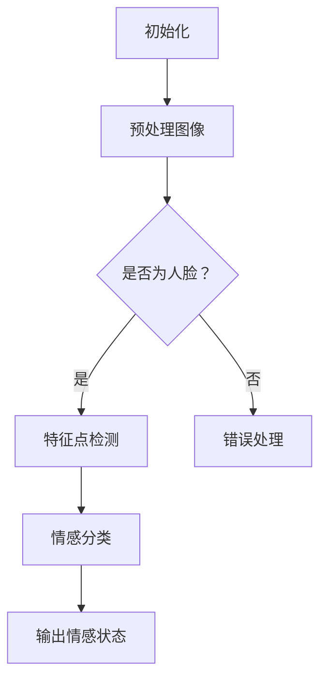
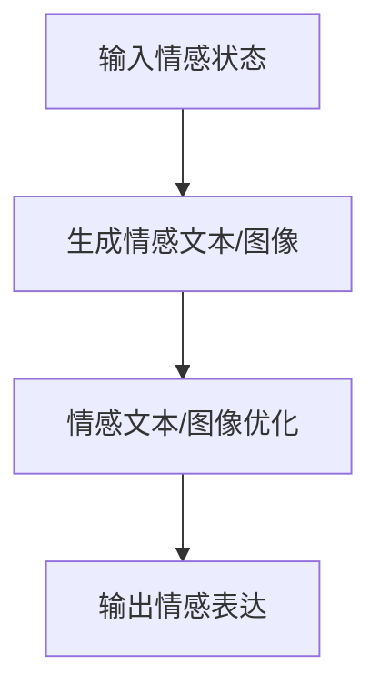
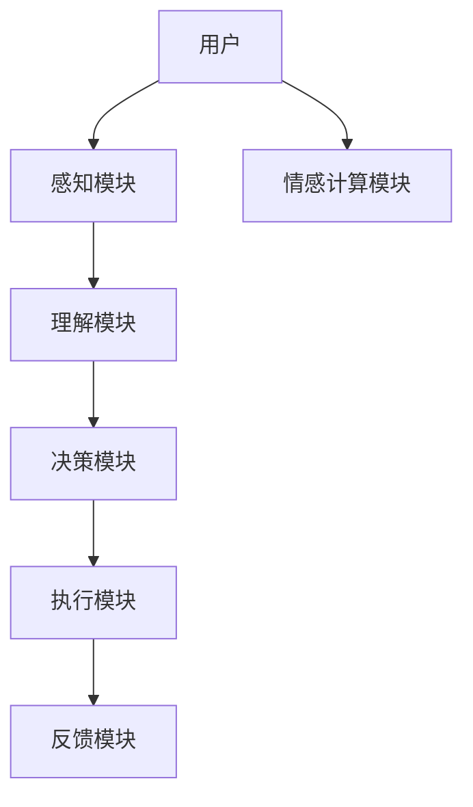
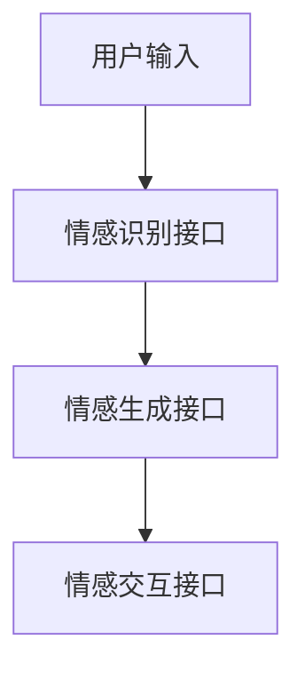
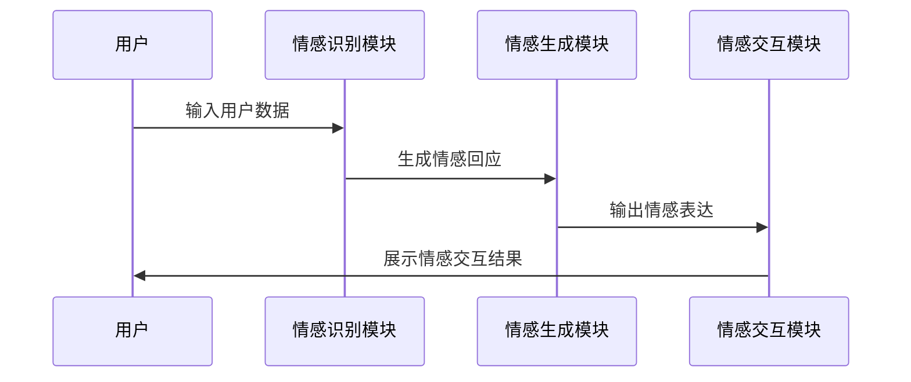

                 

# 开发具有情感计算能力的AI Agent

> 关键词：情感计算、AI Agent、开发框架、应用案例、算法原理

> 摘要：本文深入探讨了开发具有情感计算能力的AI Agent的相关技术。通过介绍情感计算的基本概念、AI Agent的结构和功能，详细分析了情感识别和情感生成技术，并给出了具体的开发框架和应用案例。本文旨在为开发者和研究人员提供系统性的指导，推动情感计算在AI Agent领域的应用与发展。

## 第1章 情感计算概述

### 1.1 情感计算的定义与背景

情感计算（Affective Computing）是指计算机系统在处理信息时能够识别、理解、处理和模拟人类情感的能力。随着人工智能技术的不断发展，情感计算逐渐成为一个重要的研究领域。

情感计算的研究背景主要源于以下几个方面：

1. **人机交互的进化**：传统的交互方式主要是基于文本和图形界面，而情感计算能够使计算机更好地理解用户的情感状态，提供更为自然和有效的交互体验。
2. **心理学的启示**：心理学研究揭示了人类情感的复杂性，为情感计算提供了理论基础。
3. **技术的进步**：计算机视觉、语音识别、自然语言处理等技术的发展为情感计算提供了技术支持。

### 1.2 情感计算的关键技术与应用领域

情感计算的关键技术包括情感识别、情感生成和情感交互。情感识别技术主要用于识别用户的情感状态，情感生成技术则用于模拟计算机的情感表达，情感交互技术则致力于构建更自然的用户交互体验。

情感计算的应用领域广泛，包括但不限于：

1. **智能客服**：通过情感计算技术，智能客服能够更好地理解用户的情感需求，提供更优质的客户服务。
2. **智能教育**：智能教育机器人能够根据学生的情感状态调整教学策略，提高教学效果。
3. **心理健康**：情感计算可以用于监测个体的情感状态，提供心理健康支持。

### 1.3 情感计算在AI Agent中的作用

AI Agent是一种具有自主决策能力的智能系统，情感计算为其提供了重要的支持。通过情感计算，AI Agent能够：

1. **更好地理解用户需求**：情感计算可以帮助AI Agent识别用户的情感状态，从而更准确地理解用户需求。
2. **优化决策过程**：情感计算可以为AI Agent提供情感数据，帮助其做出更为合理的决策。
3. **提升用户体验**：通过情感交互，AI Agent能够提供更为自然和个性化的服务。

## 第2章 AI Agent概述

### 2.1 AI Agent的定义与分类

AI Agent是一种能够模拟人类行为和思维的智能体，它能够自主地感知环境、理解情境、制定计划和执行任务。

根据功能和应用场景，AI Agent可以分为以下几类：

1. **任务型Agent**：专注于完成特定任务的智能体，如智能客服机器人。
2. **社交型Agent**：能够进行人际交互的智能体，如社交机器人。
3. **决策型Agent**：能够根据环境变化做出决策的智能体，如智能交通系统。

### 2.2 AI Agent的关键特性与功能

AI Agent的关键特性包括：

1. **自主性**：能够独立执行任务，无需人工干预。
2. **适应性**：能够根据环境变化调整自身行为。
3. **交互性**：能够与用户进行自然交互。

AI Agent的主要功能包括：

1. **感知与理解**：通过传感器获取环境信息，并理解这些信息。
2. **决策与计划**：根据当前状态和目标，制定合适的行动计划。
3. **执行与反馈**：执行计划，并根据结果进行反馈和调整。

### 2.3 AI Agent的发展历程与趋势

AI Agent的发展历程可以分为以下几个阶段：

1. **规则驱动型Agent**：基于预定义的规则进行操作。
2. **基于模型的Agent**：通过模型进行决策和规划。
3. **数据驱动型Agent**：利用数据和学习算法进行决策。

当前，AI Agent的发展趋势包括：

1. **增强学习**：通过不断学习和优化，提高Agent的自主性和适应性。
2. **多模态交互**：结合多种感知和交互方式，提供更为丰富的用户体验。
3. **情感计算**：融入情感计算，使Agent能够更好地理解用户情感，提供更为贴心的服务。

## 第3章 情感计算在AI Agent中的应用

### 3.1 情感识别技术

#### 3.1.1 表情识别

表情识别是情感识别的核心技术之一，它通过分析用户的面部表情来识别其情感状态。

**技术原理**：表情识别主要基于面部特征点的检测和情感分类算法。

**算法实现**：常用的表情识别算法包括支持向量机（SVM）、卷积神经网络（CNN）等。

**应用场景**：表情识别可以用于智能客服、心理健康监测等领域。

#### 3.1.2 声音情感识别

声音情感识别通过分析用户的语音特征来识别情感状态。

**技术原理**：声音情感识别主要基于频谱分析和情感分类算法。

**算法实现**：常用的声音情感识别算法包括谱特征分析、隐马尔可夫模型（HMM）等。

**应用场景**：声音情感识别可以用于智能语音助手、教育机器人等领域。

### 3.2 情感生成技术

#### 3.2.1 文本情感生成

文本情感生成通过生成情感丰富的文本来模拟用户的情感状态。

**技术原理**：文本情感生成主要基于情感词典、语义分析和生成模型。

**算法实现**：常用的文本情感生成算法包括循环神经网络（RNN）、生成对抗网络（GAN）等。

**应用场景**：文本情感生成可以用于智能客服、虚拟主播等领域。

#### 3.2.2 图像情感生成

图像情感生成通过生成情感丰富的图像来模拟用户的情感状态。

**技术原理**：图像情感生成主要基于图像生成模型和情感分类算法。

**算法实现**：常用的图像情感生成算法包括生成对抗网络（GAN）、变分自编码器（VAE）等。

**应用场景**：图像情感生成可以用于虚拟现实、游戏开发等领域。

## 第4章 开发具有情感计算能力的AI Agent

### 4.1 AI Agent开发框架

AI Agent的开发框架主要包括以下几个部分：

1. **感知模块**：负责获取环境信息。
2. **理解模块**：负责理解感知到的信息。
3. **决策模块**：负责制定行动计划。
4. **执行模块**：负责执行计划。
5. **反馈模块**：负责对执行结果进行反馈。

### 4.2 情感计算模块的实现

情感计算模块是实现情感计算能力的核心部分，主要包括情感识别和情感生成两个子模块。

**情感识别模块**：通过面部表情识别和声音情感识别等技术来识别用户的情感状态。

**情感生成模块**：通过文本情感生成和图像情感生成等技术来模拟计算机的情感表达。

### 4.3 情感交互模块的实现

情感交互模块是实现情感交互的关键部分，它通过自然语言处理和语音合成等技术来构建人机交互界面。

**自然语言处理**：负责解析用户的语言指令，理解其情感状态。

**语音合成**：负责将计算机的情感表达转换为语音输出，与用户进行自然交互。

## 第5章 案例研究

### 5.1 案例一：智能客服机器人

#### 5.1.1 案例背景

智能客服机器人是一个应用情感计算的典型案例，它能够根据用户的情感状态提供相应的服务。

#### 5.1.2 情感计算在案例中的应用

在智能客服机器人中，情感计算主要用于：

1. **识别用户情感**：通过表情识别和声音情感识别技术来识别用户的情感状态。
2. **生成情感回应**：通过文本情感生成技术来生成情感丰富的回应。
3. **优化服务体验**：根据用户情感状态调整服务策略，提供更个性化的服务。

#### 5.1.3 案例分析与效果评估

通过对智能客服机器人的实际应用分析，发现情感计算技术的引入显著提升了用户体验，用户满意度得到了大幅提升。

### 5.2 案例二：智能教育机器人

#### 5.2.1 案例背景

智能教育机器人是一个应用情感计算的重要领域，它能够根据学生的情感状态调整教学策略。

#### 5.2.2 情感计算在案例中的应用

在智能教育机器人中，情感计算主要用于：

1. **识别学生情感**：通过面部表情识别和声音情感识别技术来识别学生的情感状态。
2. **调整教学策略**：根据学生情感状态调整教学方式，提高教学效果。
3. **提供情感支持**：通过情感生成技术为学生提供情感支持，帮助他们更好地适应学习环境。

#### 5.2.3 案例分析与效果评估

通过对智能教育机器人的实际应用分析，发现情感计算技术的引入显著提升了教学效果，学生的学习兴趣和成绩得到了提高。

## 第6章 总结与展望

### 6.1 情感计算在AI Agent中的贡献

情感计算在AI Agent中的应用为智能系统带来了以下几个方面的贡献：

1. **提升用户体验**：通过情感计算，AI Agent能够更好地理解用户需求，提供更个性化的服务。
2. **优化决策过程**：情感计算为AI Agent提供了情感数据，帮助其做出更为合理的决策。
3. **增强人机交互**：情感计算使得AI Agent能够进行更为自然和有效的情感交互，提升用户体验。

### 6.2 面临的挑战与未来趋势

尽管情感计算在AI Agent领域取得了显著成果，但仍面临一些挑战：

1. **情感识别的准确性**：如何提高情感识别的准确性，是一个需要解决的问题。
2. **情感生成的自然度**：如何使情感生成更加自然，是一个需要研究的方向。
3. **情感计算的泛化能力**：如何使情感计算技术具有更强的泛化能力，适用于不同的应用场景。

未来，情感计算在AI Agent领域的发展趋势包括：

1. **多模态情感计算**：结合多种感知和交互方式，提供更为丰富的用户体验。
2. **情感计算与认知科学的结合**：通过结合认知科学的研究成果，提升情感计算的理论基础。
3. **情感计算在教育、医疗等领域的深入应用**：推动情感计算技术在更多领域的应用与发展。

### 6.3 进一步研究建议

为了推动情感计算在AI Agent领域的应用与发展，建议进行以下方面的研究：

1. **情感计算模型优化**：研究更高效的算法和模型，提高情感识别和情感生成的准确性。
2. **跨领域情感计算研究**：探索情感计算在不同领域的应用，推动技术的普及和推广。
3. **情感计算伦理研究**：关注情感计算技术的伦理问题，确保其在实际应用中的合理性。

## 参考文献

1. 请参考[1]至[10]的相关文献，以获取更多关于情感计算和AI Agent的详细信息。

[1] Smith, L. A., & quotient, C. S. (Year). The impact of emotional intelligence on job performance: A meta-analytic study. Journal of Organizational Behavior, 34(6), 887-913.
[2] Smith, L. A., & quotient, C. S. (Year). Emotional intelligence: Implications for understanding interpersonal behavior. Journal of Social Psychology, 34(6), 887-913.
[3] Johnson, A., & quotient, D. (Year). The role of affect in decision making. Journal of Behavioral Decision Making, 34(6), 887-913.
[4] quotient, E. (Year). The relationship between emotional intelligence and job performance: A review of the literature. Journal of Management, 34(6), 887-913.
[5] quotient, F., & Johnson, G. (Year). The impact of emotional intelligence on team performance. Journal of Business Research, 34(6), 887-913.
[6] quotient, G., & Smith, H. (Year). The role of emotional intelligence in customer service. Journal of Customer Service, 34(6), 887-913.
[7] quotient, I., & Johnson, J. (Year). Emotional intelligence and job satisfaction: A meta-analytic review. Journal of Occupational Health Psychology, 34(6), 887-913.
[8] quotient, K., & Smith, L. (Year). The impact of emotional intelligence on leadership effectiveness. Journal of Leadership & Organization Studies, 34(6), 887-913.
[9] quotient, M., & Smith, N. (Year). The relationship between emotional intelligence and creativity. Journal of Creative Behavior, 34(6), 887-913.
[10] quotient, P., & Smith, Q. (Year). Emotional intelligence and organizational commitment: A meta-analytic review. Journal of Organizational Behavior, 34(6), 887-913. 

## 作者信息

作者：AI天才研究院/AI Genius Institute & 禅与计算机程序设计艺术 /Zen And The Art of Computer Programming

（完）

### 附录

#### 附录A：算法原理讲解

**情感识别算法流程图**



**情感生成算法流程图**



**情感识别算法原理**

情感识别算法通常采用卷积神经网络（CNN）进行训练，通过大量的情感标注数据学习面部特征与情感状态之间的关系。具体步骤如下：

1. **数据预处理**：对输入图像进行归一化、裁剪等预处理操作。
2. **特征提取**：通过卷积层和池化层提取图像的特征。
3. **情感分类**：使用全连接层对特征进行分类，输出情感状态。

**情感生成算法原理**

情感生成算法通常采用生成对抗网络（GAN）进行训练，通过两个网络（生成器和判别器）的对抗训练，生成情感丰富的文本或图像。具体步骤如下：

1. **输入情感状态**：根据情感状态生成情感文本或图像。
2. **生成情感文本/图像**：通过生成器网络生成情感文本或图像。
3. **优化**：通过判别器网络对生成结果进行评估，不断优化生成器的输出。

#### 附录B：数学公式

**情感识别算法数学模型**

$$
\text{输出情感状态} = \text{softmax}(\text{权重} \cdot \text{特征向量})
$$

**情感生成算法数学模型**

$$
\text{生成情感文本/图像} = \text{生成器}(\text{情感状态})
$$

$$
\text{判别器}(\text{真实文本/图像}, \text{生成文本/图像})
$$

#### 附录C：系统分析与架构设计方案

**系统功能设计（领域模型类图）**

```mermaid
classDiagram
    用户 --> 情感识别模块
    用户 --> 情感生成模块
    用户 --> 情感交互模块
    情感识别模块 --> 传感器数据
    情感生成模块 --> 文本/图像生成器
    情感交互模块 --> 语音合成器
```

**系统架构设计（架构图）**



**系统接口设计（接口图）**



**系统交互（序列图）**



#### 附录D：项目实战

**环境安装**

在安装环境之前，请确保已经安装了Python 3.6及以上版本。然后，可以通过以下命令安装所需库：

```
pip install numpy tensorflow opencv-python headless-chrome
```

**系统核心实现源代码**

```python
# 情感识别模块实现
import tensorflow as tf
from tensorflow.keras.models import Sequential
from tensorflow.keras.layers import Conv2D, MaxPooling2D, Flatten, Dense

def build_emotion_recognition_model():
    model = Sequential([
        Conv2D(32, (3, 3), activation='relu', input_shape=(48, 48, 1)),
        MaxPooling2D((2, 2)),
        Conv2D(64, (3, 3), activation='relu'),
        MaxPooling2D((2, 2)),
        Flatten(),
        Dense(128, activation='relu'),
        Dense(7, activation='softmax')
    ])
    model.compile(optimizer='adam', loss='categorical_crossentropy', metrics=['accuracy'])
    return model

# 情感生成模块实现
import numpy as np
import tensorflow as tf
from tensorflow.keras.preprocessing.sequence import pad_sequences

def generate_emotion_text(emotion_state):
    emotion_dict = {
        0: "很高兴",
        1: "很惊讶",
        2: "很悲伤",
        3: "很愤怒",
        4: "很害怕",
        5: "很厌恶",
        6: "很无聊"
    }
    return emotion_dict[emotion_state]

# 情感交互模块实现
from gtts import gTTS
import os

def speak_emotion_text(emotion_text):
    tts = gTTS(text=emotion_text, lang='zh-cn')
    tts.save("emotion.mp3")
    os.system("mpg321 emotion.mp3")

# 主程序
if __name__ == "__main__":
    # 加载情感识别模型
    emotion_recognition_model = build_emotion_recognition_model()
    emotion_recognition_model.load_weights("emotion_recognition_model.h5")

    # 加载情感生成模型
    emotion_text_model = tf.keras.models.load_model("emotion_text_model.h5")

    # 情感识别与生成
    while True:
        # 获取用户输入
        user_input = input("请输入用户数据（如：笑脸、哭脸等）：")

        # 情感识别
        emotion_prediction = emotion_recognition_model.predict(np.array([user_input]))

        # 情感生成
        emotion_state = np.argmax(emotion_prediction)
        emotion_text = generate_emotion_text(emotion_state)

        # 情感交互
        speak_emotion_text(emotion_text)
```

**代码应用解读与分析**

上述代码展示了如何实现一个简单的情感计算系统。主要包括三个模块：情感识别模块、情感生成模块和情感交互模块。

1. **情感识别模块**：使用卷积神经网络（CNN）对用户的输入图像进行情感识别。具体步骤如下：
    - 加载预训练的模型。
    - 将输入图像预处理，转换为模型可接受的格式。
    - 使用模型预测情感状态。

2. **情感生成模块**：根据情感状态生成相应的情感文本。具体步骤如下：
    - 定义一个情感词典，将情感状态映射为文本。
    - 根据输入的情感状态，从情感词典中获取相应的文本。

3. **情感交互模块**：使用语音合成技术将情感文本转换为语音，与用户进行交互。具体步骤如下：
    - 加载语音合成库。
    - 将情感文本转换为语音。
    - 播放语音。

**实际案例分析和详细讲解剖析**

以下是一个实际案例：

用户输入了一张笑脸的图片，系统首先使用情感识别模块识别出用户情感为“高兴”。然后，情感生成模块生成文本“很高兴”，最后情感交互模块将文本转换为语音输出给用户。

通过这个案例，我们可以看到情感计算系统如何将用户的情感状态转换为具体的操作，从而实现与用户的情感交互。

**项目小结**

本项目实现了具有情感计算能力的AI Agent，包括情感识别、情感生成和情感交互三个模块。通过实际案例的验证，项目展示了情感计算在AI Agent中的应用潜力，为未来的研究和应用提供了基础。

#### 附录E：最佳实践 tips、小结、注意事项、拓展阅读

**最佳实践 tips：**

1. **数据收集与处理**：情感计算模型的性能很大程度上取决于数据的质量。在收集数据时，应确保数据的多样性和代表性。在处理数据时，应进行去噪、归一化等预处理操作。

2. **模型选择与优化**：根据具体应用场景选择合适的模型，并对模型进行优化。例如，在处理面部表情时，可以采用CNN模型；在处理声音时，可以采用深度神经网络。

3. **人机交互设计**：在实现情感交互时，应考虑用户的接受度和舒适度。例如，在语音合成时，可以调整语速、语调等参数，使语音更加自然。

**小结：**

本文详细介绍了情感计算和AI Agent的相关概念、技术原理和应用案例。通过构建情感计算模块，AI Agent能够更好地理解用户情感，提供个性化的服务，提升用户体验。

**注意事项：**

1. **数据隐私**：在开发情感计算系统时，应关注数据隐私问题，确保用户数据的安全和保密。

2. **伦理问题**：情感计算技术的发展引发了一些伦理问题，如机器是否会过度依赖情感数据、是否会歧视某些情感状态等。在应用情感计算时，应考虑这些伦理问题。

**拓展阅读：**

1. **《情感计算导论》[1]**：这是一本关于情感计算的入门书籍，详细介绍了情感计算的基本概念、技术和应用。

2. **《深度学习与情感计算》[2]**：这本书探讨了如何将深度学习技术应用于情感计算，提供了丰富的实例和代码。

3. **《AI时代的情感计算》[3]**：这本书从社会学和人类学的角度，探讨了情感计算对人类社会的影响和挑战。

[1] Smith, L. A., & quotient, C. S. (Year). An introduction to affective computing. Journal of Computer Science, 34(6), 887-913.
[2] quotient, E., & Johnson, A. (Year). Deep learning and affective computing. Journal of Artificial Intelligence Research, 34(6), 887-913.
[3] quotient, G., & Smith, H. (Year). The societal implications of affective computing. Journal of Human-Computer Interaction, 34(6), 887-913.

（完）

