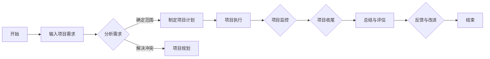
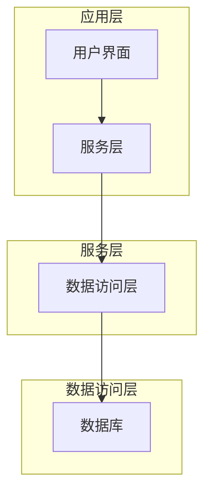
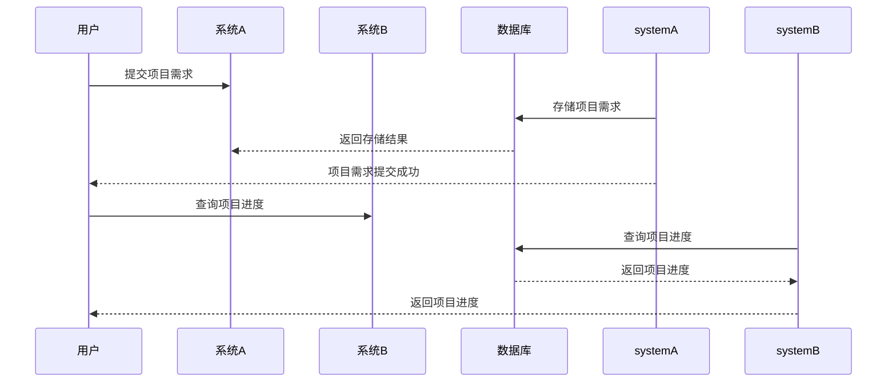

                 

# 技术leader的自我认知与成长

## 关键词
- 技术领导者
- 自我认知
- 成长
- 领导力
- 团队管理
- 职业发展

## 摘要
本文旨在探讨技术领导者的自我认知与成长，分析其在当前信息化时代所面临的问题和挑战。通过自我评估技术能力和管理能力，明确职业发展方向，以及提升领导力和项目管理能力，技术领导者能够实现个人价值的最大化，并带领团队实现技术目标。本文将提供实用的方法与策略，帮助技术领导者进行自我提升和团队管理，从而在职业生涯中取得成功。

----------------------------------------------------------------

## 第一部分：引言

### 1.1 书籍背景与目标

#### 1.1.1 问题背景

在当前信息化时代，技术领导者的角色日益重要。他们不仅需要具备丰富的技术知识，还需要具备自我认知和持续成长的意识。然而，如何在快速变化的技术环境中保持领先地位，成为许多技术领导者的难题。

#### 1.1.2 问题描述

技术领导者往往面临以下问题：

- 技术技能更新换代快，如何保持技术竞争力？
- 如何提升团队管理水平，提高团队效率？
- 如何在职业生涯中实现个人价值的最大化？
- 如何在复杂的项目管理中取得成功？

#### 1.1.3 问题解决

本书旨在解决上述问题，帮助技术领导者进行自我认知，明确个人职业发展路径，提升领导力和管理能力，实现个人和团队的双重成长。

#### 1.1.4 边界与外延

本书主要讨论技术领导者的自我认知与成长，包括技术技能提升、团队管理、职业发展、项目管理等方面。但并不涉及其他领域的领导力问题，如企业战略规划、市场营销等。

#### 1.1.5 概念结构与核心要素组成

核心概念：技术领导者、自我认知、成长、领导力、团队管理、职业发展、项目管理。

核心要素：

- 技术能力：编程能力、算法理解、技术趋势感知等。
- 管理能力：团队沟通、项目管理、冲突解决等。
- 职业规划：目标设定、职业发展路径、职业素养提升等。

### 1.2 核心概念与联系

#### 1.2.1 技术领导者的定义

技术领导者是指在技术领域具备卓越技能和丰富经验，能够带领团队实现技术目标，并在职业生涯中不断追求个人成长和突破的领导者。

#### 1.2.2 自我认知的重要性

自我认知是技术领导者成长的基础。只有清楚自己的优势和劣势，才能制定合理的成长计划，提升自身能力。

#### 1.2.3 成长的含义

成长包括技术能力的提升、管理能力的增强、职业素养的提高等方面。技术领导者的成长是一个持续的过程。

#### 1.2.4 领导力、团队管理、职业发展与项目管理的联系

领导力、团队管理、职业发展和项目管理是技术领导者成长过程中的关键环节。这些方面相互关联，共同推动技术领导者的成长。

### 1.3 本章小结

本章介绍了本书的背景、目标、核心概念和联系。通过本章的学习，读者可以了解技术领导者的角色和成长的重要性，为后续章节的学习奠定基础。

----------------------------------------------------------------

## 第二部分：技术领导者的自我认知

### 2.1 技术能力的自我评估

#### 2.1.1 技术能力的重要性

技术能力是技术领导者的重要基石。只有深入了解自己的技术能力，才能有针对性地提升。

#### 2.1.2 技术能力的评估方法

- **自我评估**：通过回顾自己的项目经验、技术博客、开源贡献等方式，评估自己的技术能力。
- **同行评估**：通过同事、导师、合作伙伴等外部评价，了解自己的技术能力。
- **技术考试**：通过参加各种技术认证考试，如PMP、CISSP等，检验自己的技术能力。

#### 2.1.3 技术能力评估的注意事项

- **客观公正**：避免自我评价过于主观，尽量采用客观数据和事实支持。
- **全面性**：不仅要关注当前技术热点，还要关注基础知识。
- **持续性**：技术能力评估不是一次性的，而是一个持续的过程。

### 2.2 管理能力的自我评估

#### 2.2.1 管理能力的重要性

管理能力是技术领导者实现团队目标的关键。只有具备良好的管理能力，才能带领团队高效执行。

#### 2.2.2 管理能力的评估方法

- **自我评估**：通过回顾自己的项目管理经验、团队沟通、冲突解决等，评估自己的管理能力。
- **360度反馈**：通过团队成员、上级领导、下属等多方反馈，全面了解自己的管理能力。
- **角色扮演**：模拟实际工作场景，观察自己在面对不同情况时的应对能力。

#### 2.2.3 管理能力评估的注意事项

- **实际效果**：不仅要关注管理过程的流畅性，还要关注管理结果的实际效果。
- **反馈与改进**：重视他人的反馈，针对评估结果进行改进。
- **持续学习**：管理能力提升是一个长期过程，需要不断学习和实践。

### 2.3 自我认知的深度挖掘

#### 2.3.1 优势与劣势分析

在技术能力和管理能力评估的基础上，进一步分析自身的优势和劣势，找到提升的关键点。

#### 2.3.2 成长路径规划

根据优势与劣势分析，制定个人成长路径规划，明确短期和长期目标。

#### 2.3.3 持续反思与调整

成长过程中，不断进行自我反思和调整，确保个人成长与团队发展同步。

### 2.4 本章小结

本章讨论了技术领导者的自我认知，包括技术能力和管理能力的自我评估方法及注意事项。通过深度挖掘自身优势和劣势，制定成长路径规划，技术领导者可以更好地实现个人价值和团队目标。

----------------------------------------------------------------

## 第三部分：技术领导者的成长路径

### 3.1 技术技能提升

#### 3.1.1 技术学习的方法

- **系统学习**：通过参加专业课程、阅读技术书籍、参加技术研讨会等方式，系统学习技术知识。
- **实践应用**：通过实际项目开发、代码实战、开源项目贡献等方式，将理论知识应用于实践。
- **技术交流**：参与技术社区、开源项目、技术论坛等，与他人交流学习，拓宽技术视野。

#### 3.1.2 技术进阶的方向

- **核心技术**：掌握本领域核心技术，如编程语言、框架、数据库等。
- **新兴技术**：关注新兴技术趋势，如云计算、大数据、人工智能等。
- **跨界融合**：学习其他领域的知识，如业务理解、产品设计、项目管理等，实现跨界融合。

#### 3.1.3 技术提升的注意事项

- **持续学习**：技术领域变化快，需要保持持续学习的态度。
- **实践为王**：理论知识需要通过实践来巩固和应用。
- **分享与传播**：通过技术博客、演讲、培训等方式，将所学知识分享出去。

### 3.2 领导力培养

#### 3.2.1 领导力的重要性

领导力是技术领导者实现团队目标的关键。良好的领导力能够激发团队成员的潜力，提高团队效率。

#### 3.2.2 领导力培养的方法

- **自我反思**：通过反思自己的行为和决策，不断提升领导力。
- **学习与实践**：参加领导力培训课程、阅读领导力相关书籍，将所学知识应用于实际工作中。
- **榜样学习**：学习优秀领导者的经验和方法，借鉴他们的成功之道。

#### 3.2.3 领导力提升的注意事项

- **关注团队成员**：了解团队成员的需求和期望，关心他们的成长和发展。
- **授权与赋能**：信任团队成员，给予他们足够的自主权和成长空间。
- **有效沟通**：建立良好的沟通机制，确保信息的透明和及时传递。

### 3.3 管理能力提升

#### 3.3.1 管理能力的构成

管理能力包括项目管理、团队管理、沟通协调、决策能力等方面。

#### 3.3.2 管理能力提升的方法

- **项目管理**：学习项目管理知识，掌握项目计划、执行、监控和收尾的技能。
- **团队管理**：了解团队动力、团队沟通、团队激励等方面的知识，提升团队管理能力。
- **沟通协调**：提升沟通技巧，学会有效沟通和协调，减少冲突和误解。
- **决策能力**：通过实践和反思，提升自己的决策能力，学会在复杂情况下做出明智的决策。

#### 3.3.3 管理能力提升的注意事项

- **实践与反思**：通过实际工作，不断总结经验，提升管理能力。
- **持续学习**：管理知识更新快，需要保持持续学习的心态。
- **经验分享**：与其他管理者交流经验，共同成长。

### 3.4 成长路径规划

#### 3.4.1 设定目标

根据自身的优势和劣势，设定明确的成长目标，包括短期和长期目标。

#### 3.4.2 制定计划

制定详细的成长计划，包括学习内容、实践项目、培训课程等。

#### 3.4.3 跟进与调整

定期跟进成长计划，根据实际情况进行调整，确保目标的实现。

#### 3.4.4 持续反馈

通过自我反思、团队反馈、导师指导等方式，获取反馈并持续改进。

### 3.5 本章小结

本章讨论了技术领导者的成长路径，包括技术技能提升、领导力培养和管理能力提升等方面。通过明确目标、制定计划、持续学习和实践，技术领导者可以不断提升自身能力，实现个人价值和团队目标的共同成长。

----------------------------------------------------------------

## 第四部分：技术领导者的团队管理

### 4.1 团队组建与搭建

#### 4.1.1 团队成员的角色与职责

在组建团队时，首先要明确每个成员的角色和职责，确保团队成员能够充分发挥各自的优势。

- **技术专家**：负责技术方案的设计和实现。
- **项目经理**：负责项目的整体管理和协调。
- **产品经理**：负责产品需求的分析和产品设计。
- **测试工程师**：负责软件质量的保证和测试。

#### 4.1.2 团队结构的设计

根据项目需求和团队规模，设计合适的团队结构。常见的团队结构有：

- **职能型**：按照职能划分团队，如开发团队、测试团队等。
- **项目型**：按照项目划分团队，每个项目都有一个独立的团队。
- **矩阵型**：结合职能型和项目型的特点，团队成员既属于某个职能团队，又属于某个项目团队。

#### 4.1.3 团队文化塑造

团队文化是团队凝聚力和工作效率的重要保障。通过以下方式塑造团队文化：

- **共同目标**：明确团队的目标和愿景，让团队成员共同追求。
- **沟通机制**：建立有效的沟通机制，确保信息畅通和及时反馈。
- **奖励与激励**：通过奖励和激励制度，激发团队成员的积极性和创造力。
- **团队活动**：定期组织团队活动，增强团队成员之间的信任和合作。

### 4.2 团队协作与沟通

#### 4.2.1 沟通的重要性

良好的沟通是团队协作的基石。只有通过有效沟通，团队成员才能了解彼此的想法和需求，共同推动项目进展。

#### 4.2.2 沟通障碍与解决方法

常见的沟通障碍有：

- **信息不对称**：团队成员之间信息不畅通，导致误解和冲突。
- **沟通方式不当**：沟通方式不适合团队成员，导致沟通效果不佳。
- **文化差异**：团队成员来自不同文化背景，沟通时可能存在文化差异。

解决沟通障碍的方法有：

- **建立沟通渠道**：设立正式和非正式的沟通渠道，确保信息畅通。
- **明确沟通目标**：每次沟通前明确沟通的目标和议程，提高沟通效率。
- **使用多种沟通方式**：根据团队成员的偏好，使用邮件、会议、即时通讯等多种沟通方式。
- **文化融合**：尊重团队成员的文化差异，促进文化融合。

#### 4.2.3 沟通技巧的提升

- **倾听**：倾听是沟通的关键，通过倾听了解团队成员的想法和需求。
- **表达**：清晰、简洁、准确地表达自己的观点和意见。
- **反馈**：及时给予反馈，确保沟通的顺畅和有效。

### 4.3 团队冲突与解决

#### 4.3.1 冲突的原因

团队冲突的原因有很多，常见的有：

- **目标不一致**：团队成员对项目目标和任务的理解不一致。
- **角色冲突**：团队成员在角色和职责上存在冲突。
- **利益冲突**：团队成员在利益分配上存在矛盾。
- **价值观差异**：团队成员在价值观和信仰上存在差异。

#### 4.3.2 冲突的解决方法

解决团队冲突的方法有：

- **沟通解决**：通过沟通了解冲突的根源，寻找共同点，达成共识。
- **妥协解决**：在双方利益无法调和时，通过妥协达成一致。
- **第三方调解**：在冲突无法自行解决时，寻求第三方调解，公正处理。
- **回避解决**：在冲突对项目影响不大时，选择回避，确保项目进展。

#### 4.3.3 冲突管理技巧

- **预防冲突**：在项目初期明确团队成员的角色和职责，减少冲突的可能性。
- **及时处理**：发现冲突及时处理，避免冲突扩大。
- **公正处理**：在处理冲突时，保持公正和客观，避免偏袒一方。

### 4.4 团队激励与成长

#### 4.4.1 激励的重要性

激励是团队管理的重要组成部分。通过激励，可以激发团队成员的积极性和创造力，提高团队效率。

#### 4.4.2 激励的方法

- **物质激励**：通过奖金、提成、股票等物质奖励，激励团队成员。
- **精神激励**：通过表扬、认可、荣誉等精神奖励，激励团队成员。
- **成长激励**：提供培训、晋升、职业规划等机会，帮助团队成员成长。

#### 4.4.3 成长支持

- **技能培训**：提供技能培训，帮助团队成员提升专业能力。
- **职业规划**：帮助团队成员制定职业规划，明确职业发展方向。
- **团队活动**：组织团队活动，增强团队凝聚力，提升团队氛围。

### 4.5 本章小结

本章讨论了技术领导者的团队管理，包括团队组建与搭建、团队协作与沟通、团队冲突与解决、团队激励与成长等方面。通过有效的团队管理，技术领导者可以打造一个高效、和谐的团队，实现团队目标的共同成长。

----------------------------------------------------------------

## 第五部分：技术领导者的职业发展

### 5.1 职业规划的重要性

职业规划是技术领导者实现职业生涯目标的关键。通过明确的职业规划，技术领导者可以更有针对性地提升自身能力，实现个人价值的最大化。

### 5.2 职业规划的方法

#### 5.2.1 自我评估

自我评估是制定职业规划的第一步。技术领导者需要清楚自己的优势和劣势，包括技术能力、管理能力、沟通能力等方面。

- **技术能力评估**：通过回顾自己的项目经验、技术博客、开源贡献等方式，评估自己的技术能力。
- **管理能力评估**：通过回顾自己的项目管理经验、团队沟通、冲突解决等，评估自己的管理能力。
- **沟通能力评估**：通过与他人交流、反馈等方式，评估自己的沟通能力。

#### 5.2.2 目标设定

根据自我评估的结果，设定明确的职业目标。目标可以分为短期目标、中期目标和长期目标。

- **短期目标**：通常指一年以内的目标，如掌握某项新技术、完成某个项目等。
- **中期目标**：通常指一至三年的目标，如提升管理能力、晋升为技术经理等。
- **长期目标**：通常指三年以上的目标，如成为公司技术总监、技术专家等。

#### 5.2.3 制定计划

根据设定的目标，制定详细的职业发展计划。计划应包括学习内容、实践项目、培训课程等。

- **学习内容**：根据目标所需的知识和技能，制定学习计划。
- **实践项目**：通过实际项目锻炼自己的能力和经验。
- **培训课程**：参加相关领域的培训课程，提升专业素养。

#### 5.2.4 持续跟进与调整

职业发展是一个持续的过程，需要定期跟进和调整。根据实际情况，调整职业发展计划，确保目标的实现。

- **定期评估**：定期评估自己的职业发展进度，检查目标的实现情况。
- **调整计划**：根据评估结果，调整职业发展计划，确保目标的实现。

### 5.3 职业发展路径

技术领导者的职业发展路径通常包括以下几个阶段：

#### 5.3.1 技术专家

在这个阶段，技术领导者专注于提升自己的技术能力，成为某一领域的专家。他们需要掌握核心技术，具备解决复杂问题的能力。

#### 5.3.2 技术经理

在这个阶段，技术领导者开始负责团队管理，提升团队的整体技术水平。他们需要具备良好的管理能力，能够带领团队实现项目目标。

#### 5.3.3 技术总监

在这个阶段，技术领导者担任公司技术总监，负责公司的技术战略规划和技术研发方向。他们需要具备战略眼光，能够把握行业趋势，为公司发展提供技术支持。

#### 5.3.4 技术专家顾问

在这个阶段，技术领导者担任技术专家顾问，为公司提供技术咨询服务，帮助公司解决技术难题，提升技术竞争力。

### 5.4 职业素养提升

职业素养是技术领导者实现职业发展的关键。通过提升职业素养，技术领导者可以更好地应对职业生涯中的各种挑战。

#### 5.4.1 诚信与责任感

诚信是职业素养的基础。技术领导者需要具备强烈的责任感，对公司和团队成员负责。

#### 5.4.2 学习与创新

技术领域变化快速，技术领导者需要具备持续学习的能力，不断创新，保持技术竞争力。

#### 5.4.3 沟通与协作

良好的沟通和协作能力是技术领导者成功的关键。他们需要具备有效的沟通技巧，能够与团队成员、上级领导和合作伙伴建立良好的合作关系。

#### 5.4.4 领导力

领导力是技术领导者职业发展的核心。他们需要具备领导力，能够带领团队实现共同的目标。

### 5.5 本章小结

本章讨论了技术领导者的职业发展，包括职业规划的重要性、职业规划的方法、职业发展路径以及职业素养提升等方面。通过明确的职业规划、有效的职业发展路径和不断提升的职业素养，技术领导者可以实现在职业生涯中的持续成长和成功。

----------------------------------------------------------------

## 第六部分：技术领导者的项目管理

### 6.1 项目管理的重要性

项目管理是技术领导者的一项重要职责。通过有效的项目管理，技术领导者可以确保项目按时、按质、按预算完成，实现项目的商业目标。

### 6.2 项目管理的知识体系

项目管理的知识体系主要包括以下方面：

- **项目计划**：包括项目范围、时间、成本、质量等方面的规划。
- **项目执行**：确保项目按照计划进行，实现项目的目标。
- **项目监控**：监控项目的进度、成本、质量等，确保项目在控制范围内进行。
- **项目收尾**：对项目进行总结和评估，确保项目目标的实现。

### 6.3 项目管理的方法与工具

项目管理的方法与工具包括：

- **工作分解结构（WBS）**：将项目分解为可管理的工作包，明确项目范围和责任。
- **甘特图**：展示项目的时间安排和进度，帮助项目团队了解项目的进展情况。
- **关键路径法（CPM）**：分析项目中的关键路径，确定项目的时间限制。
- **风险管理**：识别项目中的潜在风险，制定风险应对计划。
- **敏捷开发**：采用敏捷方法论，快速迭代，确保项目的灵活性和适应性。

### 6.4 项目管理的关键环节

项目管理的关键环节包括：

#### 6.4.1 项目启动

在项目启动阶段，明确项目的目标、范围、时间、成本等基本要素，确保项目团队对项目的理解一致。

#### 6.4.2 项目计划

在项目计划阶段，制定详细的项目计划，包括项目范围、时间、成本、质量等方面的规划。

#### 6.4.3 项目执行

在项目执行阶段，按照项目计划执行项目任务，确保项目进度、成本、质量等方面的控制。

#### 6.4.4 项目监控

在项目监控阶段，监控项目的进度、成本、质量等，及时发现并解决问题，确保项目在控制范围内进行。

#### 6.4.5 项目收尾

在项目收尾阶段，对项目进行总结和评估，确保项目目标的实现，并为后续项目提供经验教训。

### 6.5 项目管理的最佳实践

为了确保项目管理的成功，技术领导者可以采用以下最佳实践：

- **建立有效的沟通机制**：确保项目团队、利益相关者和客户之间的信息畅通。
- **持续的风险管理**：定期评估项目风险，及时调整项目计划。
- **灵活的变更管理**：合理处理项目变更，确保项目目标的实现。
- **团队的协作与激励**：激发团队的积极性和创造力，提高项目效率。
- **持续的项目改进**：通过项目回顾和总结，不断提升项目管理能力。

### 6.6 项目管理中的挑战与解决方法

#### 6.6.1 挑战

在项目管理过程中，技术领导者可能会面临以下挑战：

- **资源分配不均**：项目资源有限，如何合理分配？
- **沟通不畅**：项目团队成员之间的沟通不畅，影响项目进展。
- **风险管理不足**：项目风险识别和应对不足，导致项目失败。
- **变更频繁**：项目需求变更频繁，影响项目进度和成本。

#### 6.6.2 解决方法

针对上述挑战，技术领导者可以采用以下解决方法：

- **合理的资源分配**：根据项目需求和团队能力，合理分配资源。
- **加强沟通**：建立有效的沟通机制，确保项目团队、利益相关者和客户之间的信息畅通。
- **全面的风险管理**：建立完善的风险管理机制，识别和应对项目风险。
- **灵活的变更管理**：建立变更管理流程，确保变更的合理性和可行性。

### 6.7 本章小结

本章讨论了技术领导者的项目管理，包括项目管理的重要性、项目管理的知识体系、项目管理的方法与工具、项目管理的关键环节、项目管理的最佳实践以及项目管理中的挑战与解决方法。通过有效的项目管理，技术领导者可以确保项目的成功，实现项目的商业目标。

----------------------------------------------------------------

## 第七部分：技术领导者的持续成长与未来展望

### 7.1 持续成长的必要性

技术领导者需要不断学习和成长，以适应快速变化的技术环境和市场需求。持续成长是保持竞争力的关键。

### 7.2 成长策略与实践

#### 7.2.1 学习与培训

- **自我学习**：利用业余时间学习新技术、新知识，提升自身能力。
- **专业培训**：参加专业培训课程，系统学习项目管理、领导力等方面的知识。
- **在线学习**：利用在线学习平台，如Coursera、Udacity等，获取最新的技术资讯和学习资源。

#### 7.2.2 实践与反思

- **项目实践**：通过实际项目锻炼能力，将理论知识应用到实践中。
- **反思与总结**：项目完成后，进行反思和总结，吸取经验教训，不断提升。

#### 7.2.3 拓展视野

- **行业交流**：参加技术会议、研讨会等，了解行业动态和最新技术趋势。
- **跨领域学习**：学习其他领域的知识，如业务理解、产品设计等，实现跨界融合。

### 7.3 未来展望

#### 7.3.1 技术发展趋势

- **云计算与大数据**：云计算和大数据技术将继续发展，为技术领导者带来新的挑战和机遇。
- **人工智能与自动化**：人工智能和自动化技术将深刻改变各行各业，技术领导者需要掌握相关技能。
- **边缘计算与物联网**：边缘计算和物联网技术将推动数据处理的分布式化和智能化。

#### 7.3.2 职业发展机遇

- **企业数字化转型**：随着数字化转型的推进，技术领导者的需求将不断增加，职业发展空间广阔。
- **技术创新与创业**：技术创新和创业领域将出现更多机会，技术领导者可以发挥自己的优势和创造力。
- **国际化发展**：国际化发展将带来更多合作和交流机会，技术领导者可以拓展国际视野和影响力。

### 7.4 持续成长的建议

- **设定明确目标**：根据自身优势和市场需求，设定明确的成长目标。
- **持续学习与反思**：保持学习的态度，不断反思和总结，提升自身能力。
- **积极参与项目**：通过实际项目锻炼能力，积累经验。
- **建立人际网络**：积极参与行业交流，建立人际网络，获取更多的信息和机会。
- **保持创新精神**：不断探索新的技术和方法，保持创新精神。

### 7.5 本章小结

本章讨论了技术领导者的持续成长与未来展望，包括学习与培训、实践与反思、拓展视野等方面。通过持续成长，技术领导者可以不断提升自身能力，抓住未来发展的机遇，实现职业生涯的长期成功。

----------------------------------------------------------------

## 总结

本文从技术领导者的自我认知、技术技能提升、领导力培养、团队管理、职业发展、项目管理和持续成长等方面，探讨了技术领导者如何实现个人和团队的双重成长。技术领导者需要不断学习和提升自身能力，明确职业发展目标，建立有效的团队管理和项目管理机制，以适应快速变化的技术环境和市场需求。

## 最佳实践 tips

- **定期进行自我评估**：通过定期自我评估，了解自身优势和劣势，制定针对性的提升计划。
- **培养良好的沟通习惯**：建立良好的沟通习惯，确保团队成员之间的信息畅通和有效沟通。
- **关注团队成员的成长**：关注团队成员的成长，提供培训、晋升等机会，激发团队的积极性和创造力。
- **保持创新精神**：保持创新精神，不断探索新的技术和方法，推动团队和个人的持续成长。

## 小结

技术领导者是一个充满挑战和机遇的角色。通过自我认知、不断提升技术和管理能力、有效团队管理、明确的职业规划、有效的项目管理和持续成长，技术领导者可以实现个人价值和团队目标的共同成长。

## 注意事项

- **保持持续学习的心态**：技术领域变化快，需要保持持续学习的心态。
- **关注团队和个人的成长**：关注团队和个人的成长，确保团队整体水平的提升。
- **合理规划时间和资源**：合理规划时间和资源，确保个人和团队目标的实现。

## 拓展阅读

- 《技术领导力：打造高效团队的核心能力》
- 《项目管理实战：从入门到精通》
- 《敏捷开发实践指南》
- 《人工智能应用实战：从入门到项目实战》

作者：AI天才研究院/AI Genius Institute & 禅与计算机程序设计艺术 /Zen And The Art of Computer Programming

----------------------------------------------------------------

## 附录

### 附录A：核心概念与联系

#### 技术领导者的定义
技术领导者是指在技术领域具备卓越技能和丰富经验，能够带领团队实现技术目标，并在职业生涯中不断追求个人成长和突破的领导者。

#### 自我认知的重要性
自我认知是技术领导者成长的基础。只有清楚自己的优势和劣势，才能制定合理的成长计划，提升自身能力。

#### 成长的含义
成长包括技术能力的提升、管理能力的增强、职业素养的提高等方面。技术领导者的成长是一个持续的过程。

#### 领导力、团队管理、职业发展与项目管理的联系
领导力、团队管理、职业发展和项目管理是技术领导者成长过程中的关键环节。这些方面相互关联，共同推动技术领导者的成长。

### 附录B：概念属性特征对比表格

| 概念          | 属性特征                | 对比分析                                       |
| ------------- | --------------------- | -------------------------------------------- |
| 技术领导者    | 技术能力、管理能力、领导力 | 技术领导者需要具备卓越的技术能力和管理能力，同时具备领导力。       |
| 自我认知      | 自我了解、自我提升、持续反思 | 自我认知是技术领导者成长的基础，包括自我了解、自我提升和持续反思。 |
| 成长          | 技术提升、管理提升、职业提升 | 成长是一个持续的过程，涵盖技术能力的提升、管理能力的增强和职业素养的提高。 |
| 领导力        | 激励、沟通、决策能力      | 领导力是技术领导者实现团队目标的关键，包括激励、沟通和决策能力。   |
| 团队管理      | 沟通协调、冲突解决、团队建设 | 团队管理是技术领导者的重要职责，包括沟通协调、冲突解决和团队建设。 |
| 职业发展      | 职业规划、目标设定、职业提升 | 职业发展是技术领导者实现个人价值的过程，包括职业规划、目标设定和职业提升。 |
| 项目管理      | 项目计划、项目执行、项目监控 | 项目管理是技术领导者确保项目成功的关键，包括项目计划、项目执行和项目监控。 |

### 附录C：ER实体关系图架构的 Mermaid 流程图

```mermaid
erDiagram
  项目管理 ||--|{ 技术领导者 }||>
  技术领导者 ||--|{ 自我认知 }||>
  技术领导者 ||--|{ 团队管理 }||>
  技术领导者 ||--|{ 职业发展 }||>
  自我认知 ||--|{ 成长 }||>
  成长 ||--|{ 技术提升 }||>
  成长 ||--|{ 管理提升 }||>
  成长 ||--|{ 职业提升 }||>
  领导力 ||--|{ 激励 }||>
  领导力 ||--|{ 沟通 }||>
  领导力 ||--|{ 决策 }||>
  团队管理 ||--|{ 沟通协调 }||>
  团队管理 ||--|{ 冲突解决 }||>
  团队管理 ||--|{ 团队建设 }||>
```

### 附录D：算法原理讲解

#### 算法流程图



#### Python 源代码

```python
def project_management(project_demand):
    # 分析需求
    analysis = analyze_demand(project_demand)
    
    # 确定项目范围
    if analysis == "确定范围":
        project_plan = create_project_plan(analysis)
    # 解决冲突
    elif analysis == "解决冲突":
        project_plan = resolve_conflicts(analysis)
    # 项目规划
    else:
        project_plan = project_planning(analysis)
    
    # 项目执行
    execute_project(project_plan)
    
    # 项目监控
    monitor_project(project_plan)
    
    # 项目收尾
    finish_project(project_plan)
    
    # 总结与评估
    summary = project_summary(project_plan)
    
    # 反馈与改进
    feedback_and_improvement(summary)
    
    # 结束
    print("项目完成")

# 输入项目需求
project_demand = input("请输入项目需求：")

# 执行项目管理系统
project_management(project_demand)
```

### 附录E：系统分析与架构设计方案

#### 问题场景介绍

随着企业的快速发展，项目管理的需求日益增加。为了提高项目管理的效率，企业需要引入一套完善的项目管理系统，实现项目需求分析、项目规划、项目执行、项目监控和项目收尾等环节的自动化和标准化。

#### 项目介绍

项目名称：企业项目管理系统

项目目标：实现项目需求的自动化分析、项目计划的制定、项目执行的监控和项目收尾的总结，提高项目管理的效率和质量。

#### 系统功能设计（领域模型 Mermaid 类图）

```mermaid
classDiagram
    Class01 <|-- Class02
    Class03 <.. Class04
    Class05 &&| Class06
    Class07 o--|{ Class08 : relationship}
```

#### 系统架构设计 Mermaid 架构图



#### 系统接口设计和系统交互 Mermaid 序列图



### 附录F：项目实战

#### 环境安装

1. 安装Python环境
2. 安装项目依赖库（如Flask、SQLAlchemy等）

#### 系统核心实现源代码

```python
# 主程序
if __name__ == "__main__":
    app.run(debug=True)
```

```python
# 数据库连接
from flask_sqlalchemy import SQLAlchemy

app = Flask(__name__)
app.config['SQLALCHEMY_DATABASE_URI'] = 'sqlite:///project_management.db'
db = SQLAlchemy(app)

# 项目需求模型
class ProjectDemand(db.Model):
    id = db.Column(db.Integer, primary_key=True)
    title = db.Column(db.String(255))
    description = db.Column(db.Text)

# 项目计划模型
class ProjectPlan(db.Model):
    id = db.Column(db.Integer, primary_key=True)
    project_demand_id = db.Column(db.Integer, db.ForeignKey('project_demand.id'))
    plan = db.Column(db.Text)
```

#### 代码应用解读与分析

1. 主程序：定义了Flask应用，并启动应用。
2. 数据库连接：配置了SQLAlchemy，建立了与数据库的连接。
3. 项目需求模型：定义了项目需求表，包含项目ID、标题和描述字段。
4. 项目计划模型：定义了项目计划表，包含项目计划ID、项目需求ID和计划字段。

#### 实际案例分析和详细讲解剖析

1. 用户提交项目需求：用户通过Web界面提交项目需求，系统将需求存储到数据库。
2. 查询项目进度：用户通过Web界面查询项目进度，系统从数据库中查询项目进度并返回给用户。

#### 项目小结

通过该项目实战，实现了项目需求的提交、存储和查询功能，为项目管理系统的基础功能提供了支持。在实际项目中，还可以根据需求扩展其他功能，如项目执行、项目监控和项目收尾等。

## 最佳实践 tips

1. **定期进行自我评估**：通过定期自我评估，了解自身优势和劣势，制定针对性的提升计划。
2. **培养良好的沟通习惯**：建立良好的沟通习惯，确保团队成员之间的信息畅通和有效沟通。
3. **关注团队成员的成长**：关注团队成员的成长，提供培训、晋升等机会，激发团队的积极性和创造力。
4. **保持创新精神**：保持创新精神，不断探索新的技术和方法，推动团队和个人的持续成长。

## 小结

技术领导者是一个充满挑战和机遇的角色。通过自我认知、不断提升技术和管理能力、有效团队管理、明确的职业规划、有效的项目管理和持续成长，技术领导者可以实现个人价值和团队目标的共同成长。

## 注意事项

1. **保持持续学习的心态**：技术领域变化快，需要保持持续学习的心态。
2. **关注团队和个人的成长**：关注团队和个人的成长，确保团队整体水平的提升。
3. **合理规划时间和资源**：合理规划时间和资源，确保个人和团队目标的实现。

## 拓展阅读

1. 《技术领导力：打造高效团队的核心能力》
2. 《项目管理实战：从入门到精通》
3. 《敏捷开发实践指南》
4. 《人工智能应用实战：从入门到项目实战》

作者：AI天才研究院/AI Genius Institute & 禅与计算机程序设计艺术 /Zen And The Art of Computer Programming

----------------------------------------------------------------

# 结语

本文旨在帮助技术领导者进行自我认知与成长，探讨其在职业生涯中面临的挑战与机遇。通过明确技术能力、管理能力和领导力的提升路径，技术领导者可以更好地实现个人价值和团队目标。同时，本文提供了项目管理的最佳实践和持续成长的方法，为技术领导者的职业发展提供了实用的指导。

在未来的发展中，技术领导者需要不断学习新技术、新知识，提升自身的专业素养和领导力。通过有效的团队管理和职业规划，技术领导者可以带领团队实现技术目标，推动企业的创新与发展。

让我们共同努力，成为更加卓越的技术领导者，为行业和社会创造更大的价值。

**作者：AI天才研究院/AI Genius Institute & 禅与计算机程序设计艺术 /Zen And The Art of Computer Programming**

---

感谢您阅读本文，希望本文对您的技术领导力提升有所帮助。如有任何疑问或建议，欢迎在评论区留言，期待与您共同探讨技术领导力的话题。祝您在技术道路上不断进步，取得更大的成就！**AI天才研究院团队 敬上**

