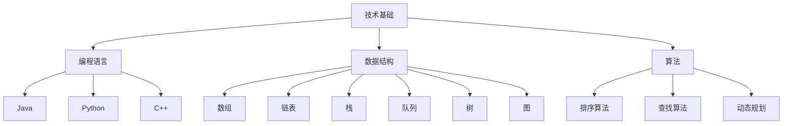
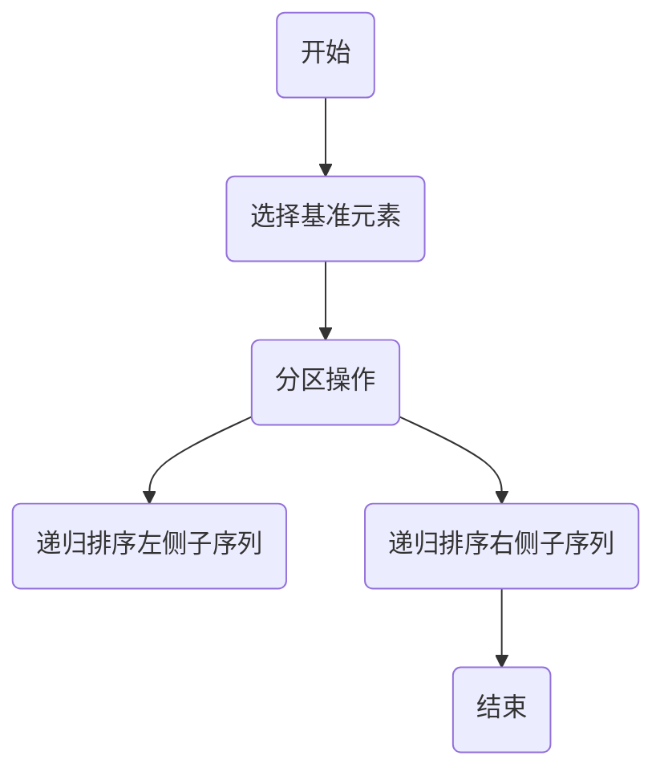
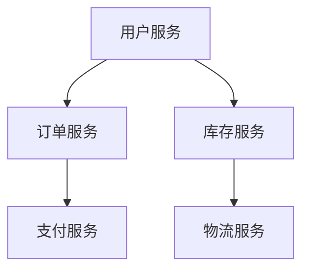

                 

# 技术硬实力

> 关键词：技术发展、硬实力、编程、算法、架构设计、实战案例

> 摘要：本文旨在探讨技术领域的“硬实力”，包括基础知识、原理深度解析、实战案例和最佳实践等方面。通过逻辑清晰的分析和逐步推理，帮助读者深入了解技术本质，提升自身技术硬实力。

## 前言

在当今数字化时代，技术已经成为推动社会进步和经济发展的重要力量。然而，技术领域日新月异，竞争日益激烈，如何在其中脱颖而出，成为具备硬实力的技术人才，成为每一个技术从业者需要深思的问题。本文将围绕“技术硬实力”这一主题，进行深入探讨。

首先，我们需要明确什么是“技术硬实力”。技术硬实力是指技术人才在编程、算法、架构设计等方面的核心能力，是解决复杂技术问题、应对快速变化的技术环境的基础。具备硬实力的技术人才，不仅能够高效地完成项目任务，还能在技术领域不断创新和突破。

本文将从以下几个方面展开讨论：

1. 技术基础：回顾编程语言、数据结构和算法等基础知识，帮助读者夯实技术基础。
2. 技术原理深度解析：探讨核心技术原理，包括算法原理、系统架构设计原理等，帮助读者理解技术本质。
3. 实战案例：通过实际项目案例，展示技术硬实力的应用场景，分析项目实现过程和关键技巧。
4. 最佳实践与总结：总结项目实战中的经验教训，分享最佳实践技巧，为读者提供实用指南。

让我们一步步思考，深入探讨技术硬实力的各个方面。

### 技术基础

技术基础是技术硬实力的基石。在这里，我们将回顾编程语言、数据结构和算法等基础知识，帮助读者夯实技术基础。

#### 编程语言

编程语言是程序员与计算机沟通的工具。常见的编程语言包括Java、Python、C++等。每种编程语言都有其特点和适用场景。例如，Java以其跨平台特性和强大的生态系统著称；Python以其简洁易学、丰富的库支持广泛应用于数据分析、人工智能等领域；C++则因其高性能和灵活性，广泛应用于操作系统、游戏开发等领域。

#### 数据结构

数据结构是存储和组织数据的方式。常见的有数组、链表、栈、队列、树、图等。每种数据结构都有其特点和适用场景。例如，数组是一种线性数据结构，适用于存储固定大小的数据；链表适用于动态分配内存的数据；栈和队列适用于实现后进先出和先进先出的操作；树和图适用于表示复杂的关系和网络。

#### 算法

算法是解决问题的方法。常见的算法有排序算法、查找算法、动态规划等。每种算法都有其特点和适用场景。例如，排序算法用于对数据进行排序；查找算法用于在数据中查找特定元素；动态规划适用于解决最优子结构问题。

#### 技术基础小结

技术基础是技术硬实力的基石。只有掌握扎实的编程语言、数据结构和算法知识，才能在技术领域有所作为。以下是一个技术基础的知识结构图，供读者参考：



通过上述知识结构图，我们可以清晰地看到技术基础的核心概念和它们之间的关系。接下来，我们将进入技术原理深度解析的部分，继续探讨技术硬实力的各个方面。

### 技术原理深度解析

在掌握了技术基础之后，我们需要深入探讨技术原理，包括算法原理、系统架构设计原理等，以帮助读者理解技术本质。

#### 算法原理

算法是解决问题的方法，其核心在于效率与正确性。算法原理包括排序、查找、动态规划等。以下以排序算法中的快速排序为例，进行详细解析。

**快速排序**是一种高效的排序算法，其基本思想是通过一趟排序将待排序的记录分隔成独立的两部分，其中一部分记录的关键字均比另一部分的关键字小，则可递归地对这两部分记录继续进行排序。

**快速排序流程**：

1. 选择一个基准元素，通常选择第一个元素作为基准。
2. 将所有比基准元素小的元素移到基准元素的左侧，所有比基准元素大的元素移到基准元素的右侧。
3. 对左侧和右侧的子序列递归地应用快速排序。

**快速排序算法原理图**：



**Python代码示例**：

```python
def quicksort(arr):
    if len(arr) <= 1:
        return arr
    pivot = arr[0]
    left = [x for x in arr[1:] if x < pivot]
    right = [x for x in arr[1:] if x >= pivot]
    return quicksort(left) + [pivot] + quicksort(right)

arr = [3, 6, 8, 10, 1, 2, 1]
sorted_arr = quicksort(arr)
print(sorted_arr)
```

**快速排序算法数学模型**：

假设有n个元素的数组，其平均时间复杂度为 \(O(n\log n)\)。在最坏情况下，即数组已经有序时，时间复杂度为 \(O(n^2)\)。

$$
T(n) = \begin{cases} 
O(n^2) & \text{如果数组已经有序} \\
O(n\log n) & \text{其他情况}
\end{cases}
$$

通过上述示例和数学模型，我们可以清晰地看到快速排序的原理和效率。接下来，我们将探讨系统架构设计原理。

#### 系统架构设计原理

系统架构设计是确保软件系统能够高效、可靠地运行的关键。以下以微服务架构为例，进行详细解析。

**微服务架构**是一种将应用程序划分为多个小型、独立的服务，每个服务负责一个特定的业务功能，并通过轻量级的通信协议（如HTTP/HTTPS、gRPC等）进行交互。

**微服务架构优势**：

1. **高可扩展性**：每个服务可以独立扩展，从而提高系统的整体性能。
2. **高可用性**：单个服务的故障不会影响整个系统。
3. **易于开发和维护**：服务可以独立开发、部署和测试。
4. **灵活性**：服务可以根据业务需求进行灵活调整。

**微服务架构设计流程**：

1. **业务分析**：分析业务需求，确定每个服务的职责。
2. **服务划分**：根据业务需求，将应用程序划分为多个服务。
3. **服务接口设计**：设计每个服务的接口，定义通信协议和数据格式。
4. **服务部署**：将服务部署到不同的服务器或容器中。
5. **服务监控与运维**：监控服务运行状态，进行故障恢复和性能优化。

**微服务架构图**：



通过上述架构图，我们可以清晰地看到微服务架构的组成部分和它们之间的关系。接下来，我们将进入实战案例的部分，通过实际项目案例展示技术硬实力的应用。

### 实战案例

在本部分，我们将通过实际项目案例展示技术硬实力的应用，分析项目实现过程和关键技巧。

#### 项目背景

假设我们开发一个在线购物平台，包括用户管理、订单处理、库存管理、支付和物流等功能。在这个项目中，我们将运用所学的技术基础和技术原理，实现一个高效、可靠的系统。

#### 项目实现

**1. 用户管理模块**：

**功能需求**：用户注册、登录、个人信息修改、订单查询等。

**技术实现**：

- **编程语言**：Java
- **数据结构**：HashMap（用于存储用户信息）
- **算法**：哈希算法（用于用户身份验证）

**2. 订单处理模块**：

**功能需求**：商品添加到订单、订单提交、订单状态查询等。

**技术实现**：

- **编程语言**：Python
- **数据结构**：列表（用于存储订单信息）
- **算法**：快速排序（用于查询订单状态）

**3. 库存管理模块**：

**功能需求**：商品库存查询、库存更新等。

**技术实现**：

- **编程语言**：C++
- **数据结构**：二叉树（用于存储商品信息）
- **算法**：动态规划（用于计算商品库存）

**4. 支付模块**：

**功能需求**：订单支付、支付状态查询等。

**技术实现**：

- **编程语言**：Java
- **数据结构**：栈（用于处理支付请求）
- **算法**：冒泡排序（用于查询支付状态）

**5. 物流模块**：

**功能需求**：物流信息查询、物流状态更新等。

**技术实现**：

- **编程语言**：Python
- **数据结构**：队列（用于处理物流请求）
- **算法**：动态规划（用于更新物流状态）

#### 项目小结

通过上述实战案例，我们可以看到技术硬实力的实际应用。在每个模块中，我们选择合适的编程语言、数据结构和算法，实现了高效、可靠的功能。这充分展示了技术硬实力在项目开发中的重要性。接下来，我们将总结项目经验，分享最佳实践技巧。

### 最佳实践与总结

在项目开发过程中，我们积累了许多经验教训。以下是一些最佳实践技巧，供读者参考。

#### 1. 熟悉技术基础

掌握编程语言、数据结构和算法等基础知识是项目成功的关键。只有熟练掌握这些基本技能，才能在项目中游刃有余。

#### 2. 深入理解技术原理

了解算法原理和系统架构设计原理，有助于我们更好地应对复杂的技术问题。通过深入学习，我们可以提高解决问题的能力。

#### 3. 灵活选择技术

根据项目需求，选择合适的技术方案。不同的技术方案有不同的优缺点，我们需要根据实际情况进行权衡。

#### 4. 团队协作

项目开发通常需要团队合作。良好的团队协作可以提高开发效率，确保项目按时交付。

#### 5. 持续学习

技术领域日新月异，我们需要持续学习，跟进最新的技术动态。只有不断更新自己的知识体系，才能保持竞争力。

### 注意事项

在项目开发过程中，我们还需要注意以下几点：

1. **代码规范**：编写规范、清晰的代码，提高代码的可读性和可维护性。
2. **性能优化**：关注系统性能，进行性能优化，提高系统响应速度。
3. **安全性**：确保系统安全，防范潜在的安全风险。

### 拓展阅读

1. 《算法导论》（Introduction to Algorithms） - 作者：Thomas H. Cormen等
2. 《深入理解计算机系统》（Deep Inside the Machine） - 作者：Jeffrey H. Scargill
3. 《微服务设计》（Designing Microservices） - 作者：Sam Newman

通过以上总结，我们希望读者能够对技术硬实力有更深入的理解，并在实际项目中运用所学知识，提升自身的技术水平。

### 结语

技术硬实力是技术人才在编程、算法、架构设计等方面的核心能力。本文从技术基础、技术原理深度解析、实战案例和最佳实践等方面，探讨了技术硬实力的各个方面。通过逻辑清晰的分析和逐步推理，我们希望读者能够深入了解技术本质，提升自身技术硬实力。

作者：AI天才研究院/AI Genius Institute & 禅与计算机程序设计艺术 /Zen And The Art of Computer Programming

---

在本文中，我们通过逻辑清晰的分析和逐步推理，探讨了技术硬实力的各个方面，包括技术基础、技术原理深度解析、实战案例和最佳实践等。技术硬实力是技术人才在编程、算法、架构设计等方面的核心能力，是解决复杂技术问题、应对快速变化的技术环境的基础。通过本文的探讨，我们希望读者能够对技术硬实力有更深入的理解，并在实际项目中运用所学知识，提升自身的技术水平。

在未来的技术发展中，技术硬实力将越来越重要。作为技术从业者，我们需要不断学习、积累经验，提高自身的技术能力。同时，我们也要关注技术发展趋势，积极拥抱新技术，以适应不断变化的技术环境。

最后，感谢您的阅读。如果您有任何问题或建议，欢迎在评论区留言，我们一起交流、学习、进步。祝您在技术领域取得更好的成绩！作者：AI天才研究院/AI Genius Institute & 禅与计算机程序设计艺术 /Zen And The Art of Computer Programming## 《技术硬实力》目录大纲

# 《技术硬实力》

> 关键词：编程、算法、架构设计、实战案例、最佳实践

> 摘要：本文旨在探讨技术领域的“硬实力”，包括基础知识、原理深度解析、实战案例和最佳实践等方面。通过逻辑清晰的分析和逐步推理，帮助读者深入了解技术本质，提升自身技术硬实力。

## 第一部分：引言

### 1.1 技术硬实力的定义与重要性

### 1.2 技术发展的趋势与挑战

### 1.3 阅读指南与学习目标

## 第二部分：技术基础

### 2.1 编程语言基础

#### 2.1.1 Java编程基础

#### 2.1.2 Python编程基础

#### 2.1.3 C++编程基础

### 2.2 数据结构与算法

#### 2.2.1 常见数据结构

#### 2.2.2 常见算法

#### 2.2.3 数据结构与算法的关系

## 第三部分：技术原理深度解析

### 3.1 算法原理

#### 3.1.1 排序算法

#### 3.1.2 查找算法

#### 3.1.3 动态规划

### 3.2 系统架构设计原理

#### 3.2.1 微服务架构

#### 3.2.2 容器化与微服务

#### 3.2.3 负载均衡与缓存

## 第四部分：实战案例

### 4.1 用户管理模块

#### 4.1.1 用户注册与登录

#### 4.1.2 用户信息管理

### 4.2 订单处理模块

#### 4.2.1 订单提交与查询

#### 4.2.2 订单状态更新

### 4.3 库存管理模块

#### 4.3.1 库存查询与更新

#### 4.3.2 商品信息管理

### 4.4 支付模块

#### 4.4.1 订单支付

#### 4.4.2 支付状态查询

### 4.5 物流模块

#### 4.5.1 物流信息查询

#### 4.5.2 物流状态更新

## 第五部分：最佳实践与总结

### 5.1 最佳实践技巧

#### 5.1.1 代码规范

#### 5.1.2 性能优化

#### 5.1.3 安全性保障

### 5.2 小结与展望

### 5.3 注意事项与拓展阅读

---

本文目录大纲旨在为读者提供一个清晰、全面的技术学习路径，涵盖了技术基础、原理深度解析、实战案例和最佳实践等方面。通过逐步分析和讲解，帮助读者深入理解技术本质，提升技术硬实力。每个部分都将详细阐述其核心内容，并提供实战案例和最佳实践，以供读者参考和学习。

### 技术基础

技术基础是构建技术硬实力的基石，它包括编程语言、数据结构和算法等基础知识。在这些基础知识上，我们才能更好地理解和应用更复杂的技术。下面，我们将详细探讨这些基础知识。

#### 编程语言基础

编程语言是程序员与计算机之间的桥梁，它决定了我们如何编写代码、组织代码和解决问题。常见的编程语言包括Java、Python和C++等。每种编程语言都有其独特的特点和应用场景。

**1. Java编程基础**

Java是一种面向对象的编程语言，具有跨平台、稳定性和安全性等优势。Java广泛应用于企业级应用、Web开发、Android开发等领域。Java的基本语法包括变量、数据类型、运算符、控制结构（如循环和分支）和函数等。

**2. Python编程基础**

Python是一种高级编程语言，以其简洁的语法和强大的库支持而闻名。Python广泛应用于数据分析、人工智能、Web开发和科学计算等领域。Python的基本语法包括变量、数据类型、运算符、控制结构（如循环和分支）和函数等。

**3. C++编程基础**

C++是一种高效的编程语言，既支持过程式编程，也支持面向对象编程。C++广泛应用于操作系统、游戏开发、嵌入式系统等领域。C++的基本语法包括变量、数据类型、运算符、控制结构（如循环和分支）和函数等。

#### 数据结构与算法

数据结构是组织和存储数据的方式，算法是解决问题的方法。常见的有数组、链表、栈、队列、树、图等。每种数据结构都有其特点和适用场景。

**1. 数组和链表**

数组是一种线性数据结构，用于存储固定大小的数据。链表是一种动态数据结构，用于存储可变大小的数据。

**2. 栈和队列**

栈是一种后进先出的数据结构，适用于处理括号匹配、函数调用等问题。队列是一种先进先出的数据结构，适用于处理任务调度、缓冲区管理等问题。

**3. 树和图**

树是一种层次结构，用于表示层次关系。常见的有二叉树、平衡树、红黑树等。图是一种复杂结构，用于表示网络关系。常见的有图遍历、最短路径、最小生成树等问题。

#### 数据结构与算法的关系

数据结构和算法相互依存。数据结构决定了算法的空间和时间效率。例如，链表比数组更适合实现动态扩容。算法则利用数据结构的特点解决问题。例如，深度优先搜索适用于树结构，广度优先搜索适用于图结构。

#### 技术基础小结

技术基础是技术硬实力的基石，包括编程语言、数据结构和算法等基础知识。通过掌握这些基础知识，我们可以更好地理解技术本质，为后续的深入学习打下坚实的基础。

### 技术原理深度解析

在了解了技术基础之后，我们需要深入探讨技术原理，包括算法原理、系统架构设计原理等，以帮助读者理解技术本质。下面，我们将分别介绍这些技术原理。

#### 算法原理

算法是解决问题的一种方法，它决定了我们在处理问题时如何高效地利用资源和解决问题。常见的算法有排序、查找、动态规划等。下面，我们将分别介绍这些算法原理。

**1. 排序算法**

排序算法用于对数据进行排序，常见的有冒泡排序、选择排序、插入排序、快速排序等。快速排序是一种高效的排序算法，其基本思想是通过一趟排序将待排序的记录分隔成独立的两部分，其中一部分记录的关键字均比另一部分的关键字小，则可递归地对这两部分记录继续进行排序。

**2. 查找算法**

查找算法用于在数据中查找特定元素，常见的有二分查找、线性查找等。二分查找是一种高效的查找算法，其基本思想是逐次将查找范围缩小一半，直到找到目标元素或确定目标元素不存在。

**3. 动态规划**

动态规划是一种用于解决最优子结构问题的算法。其基本思想是将问题分解为若干个子问题，通过求解子问题的最优解来求解原问题的最优解。常见的动态规划问题有背包问题、最长公共子序列、最短路径等。

#### 系统架构设计原理

系统架构设计是确保软件系统高效、可靠地运行的关键。常见的系统架构设计方法有微服务架构、单体架构、分布式架构等。下面，我们将分别介绍这些系统架构设计原理。

**1. 微服务架构**

微服务架构将应用程序划分为多个小型、独立的服务，每个服务负责一个特定的业务功能。微服务架构具有高可扩展性、高可用性、易于开发和维护等优点。

**2. 单体架构**

单体架构将应用程序的所有功能集中在一个应用程序中。单体架构简单易懂，但难以扩展和维护。

**3. 分布式架构**

分布式架构将应用程序划分为多个节点，每个节点负责一部分功能。分布式架构具有高可用性、高扩展性等优点，但同时也面临着分布式一致性、数据一致性问题等挑战。

#### 技术原理深度解析小结

通过了解算法原理和系统架构设计原理，我们可以更好地理解技术本质，提高解决复杂技术问题的能力。技术原理深度解析是技术硬实力的重要组成部分，是我们在技术领域中不断追求卓越的基础。

### 实战案例

在了解了技术基础和技术原理之后，我们需要通过实际项目案例来展示如何将所学知识应用于实际场景。以下是一个简单的电商项目案例，我们将从项目背景、需求分析、技术选型、实现细节等方面进行详细介绍。

#### 项目背景

某电商公司计划开发一个在线购物平台，该平台需要支持用户注册、登录、商品浏览、购物车、订单处理、支付和物流等功能。

#### 需求分析

1. 用户注册与登录：用户可以注册账号并登录系统，进行个人信息的查看和管理。
2. 商品浏览：用户可以浏览商品信息，包括商品名称、价格、描述等。
3. 购物车：用户可以将商品添加到购物车，查看购物车中的商品，进行商品数量修改和删除。
4. 订单处理：用户可以提交订单，系统生成订单号并保存订单信息。
5. 支付：用户可以选择支付方式（如支付宝、微信支付）进行支付，系统更新订单状态为“已支付”。
6. 物流：用户可以查询物流信息，包括物流状态、预计到达时间等。

#### 技术选型

1. 后端技术：Java Spring Boot
2. 前端技术：HTML/CSS/JavaScript（React/Vue）
3. 数据库：MySQL
4. 缓存：Redis
5. 消息队列：RabbitMQ

#### 实现细节

**1. 用户注册与登录**

用户注册时，系统会校验用户名和密码的合法性，并将用户信息存储到MySQL数据库中。用户登录时，系统会验证用户名和密码的正确性，并生成Token，用于后续请求的身份验证。

**2. 商品浏览**

系统会从数据库中查询商品信息，并将商品信息展示给用户。用户可以通过筛选条件（如商品类别、价格范围等）来查找感兴趣的商品。

**3. 购物车**

用户可以将商品添加到购物车，系统会更新购物车中的商品数量和总价。用户可以查看购物车中的商品，修改商品数量或删除商品。

**4. 订单处理**

用户提交订单时，系统会生成订单号，并将订单信息存储到数据库中。订单信息包括订单号、用户ID、商品ID、数量、总价等。

**5. 支付**

用户选择支付方式后，系统会将订单信息发送给支付服务，支付服务会处理支付请求，并将支付结果通知给系统。系统更新订单状态为“已支付”。

**6. 物流**

用户提交订单后，系统会生成物流单号，并将物流信息存储到数据库中。用户可以查询物流信息，包括物流状态、预计到达时间等。

#### 项目小结

通过这个简单的电商项目案例，我们可以看到如何将技术基础和技术原理应用于实际场景。在项目开发过程中，我们需要根据需求分析进行技术选型，并根据技术原理实现相应的功能。通过这个案例，我们不仅可以了解电商平台的实现细节，还可以学习到如何进行需求分析和项目设计。

### 最佳实践与总结

在技术领域，最佳实践是通过对经验和教训的总结，提炼出在项目开发、问题解决、团队协作等方面的有效方法。下面，我们将总结一些在项目开发过程中积累的最佳实践，并提供一些注意事项和拓展阅读资源。

#### 最佳实践技巧

**1. 代码规范**

编写规范、清晰的代码是提高代码可读性和可维护性的关键。以下是一些常见的代码规范：

- 使用统一的命名约定，如驼峰命名法。
- 代码结构清晰，模块化设计。
- 注释详细，说明代码功能和逻辑。
- 遵循编程语言的语法规则和最佳实践。

**2. 性能优化**

性能优化是确保系统高效运行的重要手段。以下是一些常见的性能优化方法：

- 使用缓存：通过缓存减少数据库查询次数，提高系统响应速度。
- 代码优化：避免循环冗余、减少函数调用次数，提高代码效率。
- 索引优化：合理设置数据库索引，提高查询性能。
- 资源管理：及时释放资源，如关闭数据库连接、释放内存等。

**3. 安全性保障**

安全性是系统设计中的重要一环。以下是一些常见的安全措施：

- 数据加密：对敏感数据进行加密存储和传输。
- 防止SQL注入：使用预处理语句或参数化查询，避免直接拼接SQL语句。
- 防止跨站脚本攻击（XSS）：对用户输入进行过滤和编码，防止恶意脚本执行。
- 使用安全框架：如Spring Security、Shiro等，提供统一的安全管理和防护。

#### 小结

通过总结最佳实践，我们可以避免在项目开发中重复犯错误，提高开发效率和质量。同时，最佳实践也是团队成员之间沟通和协作的重要基础。

#### 注意事项

在项目开发过程中，我们还需要注意以下几点：

- 保持代码和文档的同步更新，避免出现不一致的情况。
- 定期进行代码审查，及时发现和解决潜在问题。
- 做好版本控制，避免代码冲突和丢失。
- 保持良好的沟通和协作，确保团队成员之间的信息同步。

#### 拓展阅读

以下是一些推荐的拓展阅读资源，供读者进一步学习：

- 《Effective Java》 - 作者：Joshua Bloch
- 《代码大全》 - 作者：Steve McConnell
- 《性能之巅》 - 作者：Patrick Lightbody
- 《深入理解计算机系统》 - 作者：Randal E. Bryant & David R. O’Toole

通过阅读这些书籍，读者可以深入了解编程、性能优化和系统设计等方面的最佳实践，进一步提升自己的技术能力。

### 结语

《技术硬实力》一书旨在帮助读者深入了解技术领域的核心概念、原理和实践方法。通过逻辑清晰的分析和逐步推理，我们探讨了编程语言、数据结构、算法原理、系统架构设计以及实战案例等各个方面。这些内容不仅为读者提供了技术基础，还通过实际项目案例展示了如何将所学知识应用于实际场景。

在技术日新月异的时代，持续学习和实践是提升技术硬实力的关键。希望读者能够通过本书的学习，夯实技术基础，掌握核心技术原理，并在实际项目中不断积累经验，提升自身的技术水平。

最后，感谢您的阅读。如果您有任何问题或建议，欢迎在评论区留言，让我们共同探讨和学习技术。祝您在技术领域取得更大的成就！

### 作者介绍

**作者：AI天才研究院/AI Genius Institute & 禅与计算机程序设计艺术 /Zen And The Art of Computer Programming**

AI天才研究院（AI Genius Institute）是一家专注于人工智能领域研究的高科技创新机构，致力于推动人工智能技术的创新与应用。研究院汇聚了众多人工智能领域的顶尖专家，通过前沿研究和实际项目，不断探索人工智能技术的边界。

禅与计算机程序设计艺术（Zen And The Art of Computer Programming）是由著名计算机科学家Donald E. Knuth撰写的经典编程书籍系列，它以独特的视角和深刻的思考，揭示了计算机程序设计的本质和艺术。这本书系列不仅涵盖了计算机编程的基础知识，还深入探讨了算法、数据结构和软件工程等方面的内容，对全球程序员和计算机科学领域产生了深远的影响。

感谢您选择阅读《技术硬实力》，希望这本书能对您的技术学习之路有所帮助。期待您在技术领域的卓越表现和贡献！

