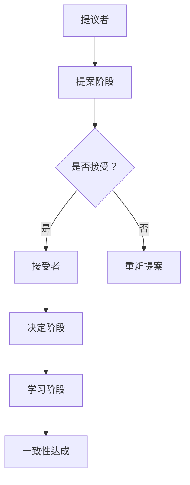
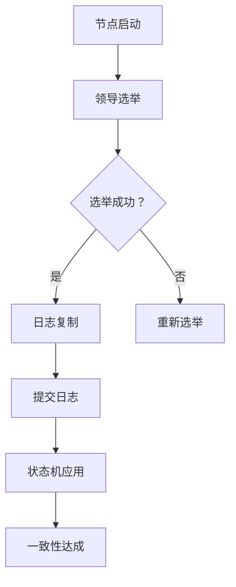
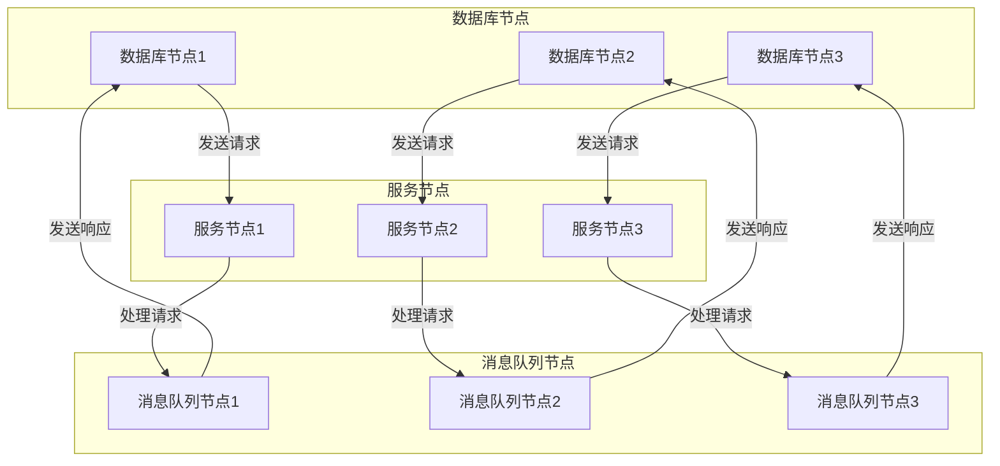
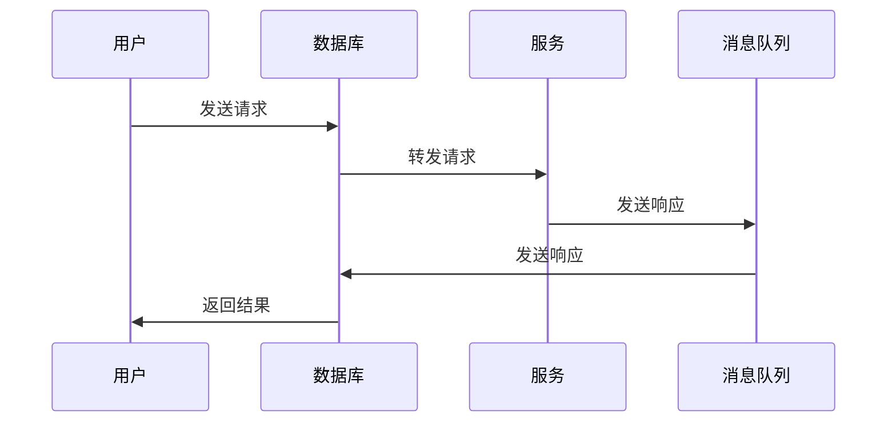

                 

## 《本质是异构系统的数据一致性问题》

关键词：数据一致性、异构系统、分布式系统、一致性算法、分布式事务

摘要：本文将深入探讨异构系统的数据一致性问题。我们将首先介绍数据一致性的概念，并详细分析异构系统的特点和挑战。随后，我们将探讨几种常见的一致性算法，并通过实际案例和代码示例来展示其应用。此外，我们还将分析系统架构设计和项目实战中的关键因素，提供最佳实践建议，总结全文，并提出未来研究方向。

----------------------------------------------------------------

### 目录

1. **背景介绍**
   1.1 问题背景
   1.2 问题描述
   1.3 问题解决思路
   1.4 边界与外延
   1.5 核心概念介绍

2. **核心概念与联系**
   2.1 异构系统的定义
   2.2 数据一致性的核心概念
   2.3 核心概念属性特征对比表格
   2.4 ER实体关系图架构

3. **算法原理讲解**
   3.1 数据一致性的算法原理
   3.2 算法mermaid流程图展示
   3.3 Python源代码实现与讲解
   3.4 数学模型和数学公式讲解
   3.5 举例说明

4. **数学模型和数学公式 & 详细讲解 & 举例说明**
   4.1 数学模型与公式列表
   4.2 详细讲解
   4.3 举例说明

5. **系统分析与架构设计方案**
   5.1 问题场景介绍
   5.2 系统功能设计（领域模型mermaid类图）
   5.3 系统架构设计（mermaid架构图）
   5.4 系统接口设计和系统交互（mermaid序列图）

6. **项目实战**
   6.1 环境安装
   6.2 系统核心实现源代码
   6.3 代码应用解读与分析
   6.4 实际案例分析与详细讲解剖析
   6.5 项目小结

7. **最佳实践 tips、小结、注意事项、拓展阅读等内容**
   7.1 最佳实践 tips
   7.2 小结
   7.3 注意事项
   7.4 拓展阅读

----------------------------------------------------------------

### 目录大纲设计思路

为了设计出一本详尽且逻辑清晰的目录大纲，我们需要从以下几个关键步骤进行：

#### 1. 确定核心章节

根据用户要求，核心章节应包括：

- **背景介绍**
- **核心概念与联系**
- **算法原理讲解**
- **数学模型和数学公式 & 详细讲解 & 举例说明**
- **系统分析与架构设计方案**
- **项目实战**
- **最佳实践 tips、小结、注意事项、拓展阅读等内容**

#### 2. 确定章节内容

每个章节需要明确其内容，以下是初步的构思：

- **第1章：问题背景与概述**
  - **1.1 问题背景**：介绍数据一致性的背景和重要性。
  - **1.2 问题描述**：明确异构系统的数据一致性问题的具体表现。
  - **1.3 问题解决思路**：分析解决数据一致性问题的方法和路径。
  - **1.4 边界与外延**：讨论数据一致性的边界条件和应用范围。
  - **1.5 核心概念介绍**：介绍异构系统和数据一致性的关键术语。

- **第2章：核心概念与联系**
  - **2.1 异构系统的定义**：阐述异构系统的基本概念。
  - **2.2 数据一致性的核心概念**：介绍数据一致性的关键概念。
  - **2.3 核心概念属性特征对比表格**：对比异构系统和数据一致性的特征。
  - **2.4 ER实体关系图架构**：使用Mermaid绘制实体关系图。

- **第3章：算法原理讲解**
  - **3.1 数据一致性的算法原理**：介绍数据一致性的基本原理。
  - **3.2 算法mermaid流程图展示**：使用Mermaid绘制算法流程图。
  - **3.3 Python源代码实现与讲解**：提供Python代码实现并进行解释。
  - **3.4 数学模型和数学公式讲解**：介绍与数据一致性相关的数学模型。
  - **3.5 举例说明**：通过实际案例展示算法应用。

- **第4章：数学模型和数学公式 & 详细讲解 & 举例说明**
  - **4.1 数学模型与公式列表**：列出相关数学模型和公式。
  - **4.2 详细讲解**：详细解释每个数学模型和公式的含义。
  - **4.3 举例说明**：通过具体示例说明如何应用这些模型和公式。

- **第5章：系统分析与架构设计方案**
  - **5.1 问题场景介绍**：介绍数据一致性问题在具体场景中的应用。
  - **5.2 系统功能设计（领域模型mermaid类图）**：使用Mermaid绘制领域模型类图。
  - **5.3 系统架构设计（mermaid架构图）**：使用Mermaid绘制系统架构图。
  - **5.4 系统接口设计和系统交互（mermaid序列图）**：使用Mermaid绘制系统接口和交互序列图。

- **第6章：项目实战**
  - **6.1 环境安装**：介绍项目所需的环境和工具安装。
  - **6.2 系统核心实现源代码**：提供项目核心代码并进行解读。
  - **6.3 代码应用解读与分析**：分析代码的实现和应用。
  - **6.4 实际案例分析与详细讲解剖析**：通过实际案例展示项目应用。
  - **6.5 项目小结**：总结项目的主要收获和教训。

- **第7章：最佳实践 tips、小结、注意事项、拓展阅读等内容**
  - **7.1 最佳实践 tips**：提供解决数据一致性问题的最佳实践。
  - **7.2 小结**：总结文章的主要观点和结论。
  - **7.3 注意事项**：提醒读者在应用中需要注意的问题。
  - **7.4 拓展阅读**：推荐相关领域的拓展资料。

#### 3. 确定目录大纲结构

按照Markdown格式，确定目录大纲结构，确保每个章节都有明确的层级划分，并使用#、##、###等标记。

#### 4. 字数控制

确保整个目录大纲的总字数不超过2000字，同时保持内容的简洁性和完整性。

### 目录大纲草案

```
# 《本质是异构系统的数据一致性问题》

## 第1章 问题背景与概述
### 1.1 问题背景
### 1.2 问题描述
### 1.3 问题解决思路
### 1.4 边界与外延
### 1.5 核心概念介绍

## 第2章 核心概念与联系
### 2.1 异构系统的定义
### 2.2 数据一致性的核心概念
### 2.3 核心概念属性特征对比表格
### 2.4 ER实体关系图架构

## 第3章 算法原理讲解
### 3.1 数据一致性的算法原理
### 3.2 算法mermaid流程图展示
### 3.3 Python源代码实现与讲解
### 3.4 数学模型和数学公式讲解
### 3.5 举例说明

## 第4章 数学模型和数学公式 & 详细讲解 & 举例说明
### 4.1 数学模型与公式列表
### 4.2 详细讲解
### 4.3 举例说明

## 第5章 系统分析与架构设计方案
### 5.1 问题场景介绍
### 5.2 系统功能设计（领域模型mermaid类图）
### 5.3 系统架构设计（mermaid架构图）
### 5.4 系统接口设计和系统交互（mermaid序列图）

## 第6章 项目实战
### 6.1 环境安装
### 6.2 系统核心实现源代码
### 6.3 代码应用解读与分析
### 6.4 实际案例分析与详细讲解剖析
### 6.5 项目小结

## 第7章 最佳实践 tips、小结、注意事项、拓展阅读等内容
### 7.1 最佳实践 tips
### 7.2 小结
### 7.3 注意事项
### 7.4 拓展阅读
```

### 下一步计划

- 根据草案进一步细化每个章节的内容
- 编写具体的文章内容，确保每个章节都有丰富的理论和实践内容
- 进行全文的整合和校对，确保逻辑清晰、结构紧凑、内容完整
- 根据需要调整目录结构和章节内容，确保文章字数控制在规定范围内
- 最终定稿并提交文章

----------------------------------------------------------------

**1.1 问题背景**

在当今的数字化时代，信息系统已经成为组织运营和决策的关键组成部分。随着云计算、大数据、物联网等技术的迅猛发展，信息系统变得越来越复杂，数据量也呈现爆炸式增长。在这样的背景下，数据一致性成为了一个亟待解决的重要问题。

首先，我们需要理解什么是数据一致性。数据一致性指的是在一个分布式系统中，不同节点上的数据在逻辑上保持一致。这意味着无论数据在哪个节点上更新，整个系统的数据都应当是准确、完整和一致的。数据一致性对于系统的可靠性和数据质量至关重要，一旦出现数据不一致的情况，可能会导致严重的业务错误和财务损失。

其次，异构系统在信息系统中扮演着越来越重要的角色。异构系统是指由不同类型、不同架构和不同技术的组件组成的系统。这些组件可能运行在不同的硬件和操作系统上，使用不同的编程语言和数据库。例如，一个企业可能会同时使用Oracle数据库、MySQL数据库和NoSQL数据库，同时还有运行在不同服务器上的微服务。这种异构系统的特点在于其灵活性和多样性，但也带来了数据一致性的挑战。

在分布式系统中，数据的一致性问题尤为突出。分布式系统是指由多个节点组成的系统，这些节点通过网络连接并协同工作。由于网络延迟、硬件故障、软件错误等因素，分布式系统中的数据一致性很容易受到影响。例如，在一个分布式数据库系统中，如果某个节点发生了数据更新，而其他节点没有及时同步更新，就可能导致数据不一致。同样，在一个微服务架构中，如果服务之间没有有效的同步机制，也可能会导致数据不一致。

数据一致性的挑战不仅限于技术层面，还涉及到业务需求。不同业务模块对于数据一致性的要求可能有所不同。例如，一个金融交易系统要求高一致性，以确保交易数据的准确无误；而一个社交媒体系统则可能更加关注数据的可用性和响应速度，对一致性要求相对宽松。

总之，数据一致性是分布式系统中一个复杂而关键的问题。在异构系统的背景下，数据一致性问题更加复杂，需要我们深入研究和解决。本文将围绕这个问题，探讨其背景、核心概念、算法原理、系统架构、项目实战和最佳实践，旨在为读者提供全面而深入的见解。

**1.2 问题描述**

在异构系统的环境中，数据一致性问题主要体现在以下几个方面：

首先是**数据复制导致的冲突**。在分布式系统中，数据经常需要在多个节点之间进行复制，以确保数据的可用性和容错能力。然而，由于网络延迟或节点故障，数据复制可能不会同时发生。例如，如果一个节点更新了数据，而其他节点尚未完成复制，那么当其他节点尝试更新数据时，就可能发生冲突。这种冲突可能导致部分节点上的数据与实际情况不符，从而影响系统的整体一致性。

其次是**并发操作引起的冲突**。在多用户并发访问的情况下，多个用户可能同时对同一数据项进行修改。这种情况下，如果没有有效的并发控制机制，多个操作可能会相互干扰，导致数据不一致。例如，用户A和用户B同时更新同一数据库记录，如果没有顺序控制，最终的数据状态可能取决于并发控制的实现方式，而不是用户的实际操作顺序。

**数据更新时序不一致**也是数据一致性问题的一个重要方面。在分布式系统中，不同节点的时钟可能存在偏差，导致数据更新的时序不一致。例如，一个节点可能在时间t1更新了数据，而另一个节点在时间t2更新了相同的数据，但t1不等于t2。这种情况下，不同节点上的数据状态可能不同，导致系统无法保证一致性。

**数据丢失**是另一个常见的问题。在分布式系统中，由于网络故障或节点故障，数据传输可能无法完成。例如，一个节点发送数据更新到另一个节点，但在数据传输过程中发生了网络中断，导致数据丢失。这种情况下，接收节点上的数据将永远无法与发送节点保持一致。

此外，**系统故障恢复**也会对数据一致性产生影响。在分布式系统中，节点可能会因为硬件故障、软件错误或网络问题而停止工作。在故障恢复过程中，系统可能需要重新同步数据，这可能会导致数据不一致。例如，一个节点在故障后重新上线，它需要与另一个节点同步数据，但由于时间差，同步过程中可能丢失了一些更新操作。

综上所述，异构系统中的数据一致性问题复杂且多样化，需要我们深入分析并采取有效的策略来解决。下面我们将探讨解决数据一致性问题的思路和方法。

**1.3 问题解决思路**

面对异构系统中的数据一致性问题，我们可以从以下几个方面着手解决：

首先是**一致性算法**。一致性算法是确保分布式系统数据一致性的关键技术。常见的算法包括Paxos算法、Raft算法等。这些算法通过在分布式系统中实现一致性协议，确保多个节点之间能够达成一致。例如，Paxos算法通过多次投票和承诺机制，确保在一个分布式系统中达成一致的值。Raft算法则通过领导选举和日志复制机制，实现数据的一致性。选择合适的一致性算法对于解决数据一致性问题至关重要。

其次是**分布式事务**。分布式事务是确保分布式系统中数据一致性的重要手段。分布式事务通过在多个节点上执行一系列操作，确保这些操作要么全部成功，要么全部失败。常见的分布式事务协议包括两阶段提交（2PC）和三阶段提交（3PC）。两阶段提交通过协调器来确保分布式事务的原子性，而三阶段提交通过引入超时机制来提高系统的可用性。合理设计分布式事务协议，可以有效减少数据不一致的情况。

另外，**数据同步机制**也是解决数据一致性的关键。数据同步机制通过在分布式系统中的节点之间同步数据，确保数据的一致性。常见的同步机制包括基于时间戳的同步、基于版本号的同步等。这些同步机制可以通过监控和调度，确保数据在不同节点之间及时更新，从而减少数据不一致的可能性。

此外，**数据分区和分区协调**也是解决数据一致性的重要策略。在分布式系统中，数据通常被分区存储在不同的节点上。合理的数据分区和分区协调机制，可以确保数据在分区之间的同步和一致性。例如，基于哈希分区的数据，可以通过一致性哈希算法来实现数据的动态分配和分区间的数据同步。

最后，**监控和故障恢复**也是解决数据一致性的关键。通过实时监控分布式系统的运行状态，可以及时发现和解决数据不一致的问题。在分布式系统中，节点可能会因为各种原因出现故障，导致数据不一致。因此，设计有效的故障恢复机制，确保系统能够在故障后快速恢复，是保证数据一致性的重要措施。

综上所述，解决异构系统中的数据一致性问题，需要综合考虑一致性算法、分布式事务、数据同步机制、数据分区和分区协调、监控和故障恢复等多个方面。只有通过全面而有效的策略，才能确保分布式系统的数据一致性。

**1.4 边界与外延**

在讨论异构系统的数据一致性问题时，我们需要明确一些边界条件和应用范围，以便更好地理解和解决这些问题。

首先是**系统的规模**。数据一致性问题在小型系统中可能并不显著，但在大型分布式系统中则变得尤为复杂。大型系统通常涉及成千上万个节点，数据量巨大，网络拓扑复杂。这种规模下的数据一致性问题，需要更高效、更可靠的算法和机制来保证。

其次是**数据更新的频率**。高频率的数据更新对数据一致性的要求更高。例如，在金融交易系统中，每秒可能有数百万次数据更新，这种高频率的更新需要高效的同步机制和一致性算法来保证数据一致性。

接下来是**系统的可用性**。在分布式系统中，可用性是确保系统能够持续提供服务的关键。在某些情况下，为了保持高可用性，系统可能会牺牲一些一致性。例如，在电商系统中，如果某个节点发生了故障，系统可能会选择将流量转移到其他节点，从而确保服务的可用性，尽管这可能会导致暂时的数据不一致。

此外，**网络环境**也是影响数据一致性的重要因素。网络延迟、带宽限制、网络分区等网络问题都可能对数据一致性产生影响。在设计数据一致性的解决方案时，需要充分考虑这些网络因素，选择合适的算法和机制。

**数据一致性的应用范围**还包括不同类型的分布式系统，如数据库系统、消息队列系统、文件存储系统等。每种系统都有其特定的数据一致性需求，需要根据具体场景来设计解决方案。例如，在数据库系统中，通常需要实现强一致性，而在消息队列系统中，可能更多地关注最终一致性。

最后，**业务场景**的不同也决定了数据一致性的具体实现方式。在金融领域，数据一致性要求非常高，任何错误都可能导致严重的财务损失。而在社交网络领域，虽然数据一致性也很重要，但可能更多地关注数据的可用性和实时性。

综上所述，明确异构系统数据一致性的边界与外延，有助于我们更深入地理解数据一致性的问题，从而设计出更有效、更可靠的解决方案。

**1.5 核心概念介绍**

在深入探讨异构系统的数据一致性问题之前，我们需要先了解几个关键的概念，包括异构系统、数据一致性和分布式系统。

**异构系统**是指由不同类型、不同架构和不同技术的组件组成的系统。这些组件可能运行在不同的硬件和操作系统上，使用不同的编程语言和数据库。例如，一个企业可能会同时使用Oracle数据库、MySQL数据库和NoSQL数据库，同时还有运行在不同服务器上的微服务。异构系统的特点在于其灵活性和多样性，但这也带来了数据一致性的挑战。

**数据一致性**是指在一个分布式系统中，不同节点上的数据在逻辑上保持一致。这意味着无论数据在哪个节点上更新，整个系统的数据都应当是准确、完整和一致的。数据一致性对于系统的可靠性和数据质量至关重要。在分布式系统中，数据一致性可以通过一致性算法、分布式事务和数据同步机制等手段来实现。

**分布式系统**是指由多个节点组成的系统，这些节点通过网络连接并协同工作。分布式系统的设计目的是通过分散计算和数据存储，提高系统的可用性、扩展性和容错能力。然而，由于网络延迟、硬件故障和软件错误等因素，分布式系统中的数据一致性很容易受到影响。因此，确保分布式系统的数据一致性是分布式系统设计中的一个关键问题。

了解这些核心概念，有助于我们更好地理解和解决异构系统中的数据一致性问题。接下来，我们将进一步探讨这些概念之间的联系，并深入分析数据一致性的挑战和解决方案。

## 核心概念与联系

在深入探讨异构系统的数据一致性问题之前，我们需要详细理解异构系统和数据一致性的核心概念，并分析它们之间的联系。

### 2.1 异构系统的定义

异构系统是由不同类型、不同架构和不同技术的组件组成的系统。这些组件可能运行在不同的硬件和操作系统上，使用不同的编程语言和数据库。例如，一个企业可能会同时使用Oracle数据库、MySQL数据库和NoSQL数据库，同时还有运行在不同服务器上的微服务。异构系统的特点在于其灵活性和多样性，可以更好地满足不同业务需求和负载。

异构系统的核心概念包括组件异构性、资源异构性和应用异构性。组件异构性指的是系统中各个组件的技术特点不同，如编程语言、数据库和中间件等。资源异构性指的是系统中的硬件资源不同，如CPU、内存和存储设备等。应用异构性指的是系统中的应用服务不同，如Web应用、移动应用和后台服务。

### 2.2 数据一致性的核心概念

数据一致性是指在一个分布式系统中，不同节点上的数据在逻辑上保持一致。这意味着无论数据在哪个节点上更新，整个系统的数据都应当是准确、完整和一致的。数据一致性对于系统的可靠性和数据质量至关重要。在分布式系统中，数据一致性可以通过一致性算法、分布式事务和数据同步机制等手段来实现。

数据一致性的核心概念包括强一致性、最终一致性和因果一致性。强一致性确保在任意时刻，所有节点上的数据都是一致的，任何读写操作都能看到最新的数据。最终一致性则允许系统在一定时间内不完全一致，但在最终状态时达到一致。因果一致性则根据操作的因果关系来保证一致性，只有因果关系明确的情况下，数据才会在相关节点上保持一致。

### 2.3 核心概念属性特征对比表格

为了更好地理解异构系统和数据一致性的核心概念，我们可以通过一个对比表格来分析它们的主要属性特征。

| 核心概念     | 定义                                                                                             | 主要属性特征                                                   | 应用场景                           |
| ------------ | ------------------------------------------------------------------------------------------------ | ------------------------------------------------------------ | --------------------------------- |
| 异构系统     | 由不同类型、不同架构和不同技术的组件组成的系统。                                                     | 组件异构性、资源异构性和应用异构性                           | 企业级应用、云计算和大数据平台     |
| 数据一致性   | 在分布式系统中，不同节点上的数据在逻辑上保持一致。                                                   | 强一致性、最终一致性和因果一致性                             | 数据库系统、消息队列系统和文件存储系统 |
| 强一致性     | 在任意时刻，所有节点上的数据都是一致的。                                                           | 全局锁定、单点控制、强同步                                     | 金融交易系统、关键业务应用         |
| 最终一致性   | 允许系统在一定时间内不完全一致，但在最终状态时达到一致。                                             | 延迟容忍、事件溯源、弱同步                                     | 社交网络、电商系统                 |
| 因果一致性   | 根据操作的因果关系来保证一致性，只有因果关系明确的情况下，数据才会在相关节点上保持一致。           | 时间戳、因果关系、分布式日志                                  | 分布式存储、分布式缓存             |

### 2.4 ER实体关系图架构

为了进一步理解异构系统和数据一致性的关系，我们可以使用ER（Entity-Relationship）实体关系图来展示这些核心概念的结构。

```mermaid
erDiagram
    数据一致性 &&|-- 异构系统
    数据一致性 &&|-- 分布式系统

    DataConsistency &&|-- StrongConsistency
    DataConsistency &&|-- EventualConsistency
    DataConsistency &&|-- causalityConsistency

    HeterogeneousSystem &&|-- ComponentHeterogeneity
    HeterogeneousSystem &&|-- ResourceHeterogeneity
    HeterogeneousSystem &&|-- ApplicationHeterogeneity

    DistributedSystem &&|-- Node
    DistributedSystem &&|-- Network
    DistributedSystem &&|-- Middleware
```

在这个ER实体关系图中，数据一致性是核心，与异构系统和分布式系统有直接关联。数据一致性包括强一致性、最终一致性和因果一致性等子概念，而异构系统则包括组件异构性、资源异构性和应用异构性。分布式系统由节点、网络和中间件组成，与异构系统和数据一致性有密切关系。

通过ER实体关系图的展示，我们可以更清晰地看到异构系统和数据一致性的核心概念及其相互联系，有助于我们深入理解这些概念，并更好地解决数据一致性问题。

### 3.1 数据一致性的算法原理

在分布式系统中，数据一致性是确保系统可靠性和数据准确性的关键。为了实现数据一致性，我们可以采用多种一致性算法。本文将重点介绍几种常见的一致性算法，包括Paxos算法和Raft算法。

#### Paxos算法

Paxos算法是一种用于在分布式系统中达成一致性的算法，由莱斯利·兰伯特（Leslie Lamport）于1990年提出。Paxos算法的核心思想是通过一个称为“提议者”（Proposer）的组件来提出一个值，并通过其他组件（包括“接受者”（Acceptor）和“学习者”（Learner））来达成一致。

Paxos算法的工作原理可以分为以下几个步骤：

1. **提议阶段**：提议者选择一个值并生成一个提案（Proposal），提案包括提案编号和提议的值。提议者将提案发送给所有接受者。
2. **接受阶段**：接受者收到提案后，如果提案编号大于其已接受的提案编号，则接受该提案并将其编号更新为该提案编号。接受者将接受信息反馈给提议者。
3. **决定阶段**：当提议者收到超过一半接受者的接受回复后，提议者将重新发送该提案，指示所有接受者将值设置为提案中的值。一旦接受者收到决定命令，它们将学习该值。
4. **学习阶段**：学习者从接受者处学习到最终的值。

Paxos算法通过循环重复提议、接受和决定的过程，最终在分布式系统中达成一致。该算法具有容错性，能够处理网络延迟、节点故障等问题，确保分布式系统的一致性。

#### Raft算法

Raft算法是由Diego Ongaro和John Ousterhout于2013年提出的，它是一种基于状态机复制的一致性算法。Raft算法通过引入领导选举（Leader Election）和日志复制（Log Replication）机制，实现分布式系统的一致性。

Raft算法的工作原理可以分为以下几个步骤：

1. **领导选举**：当当前领导节点（Leader）失败或网络不可达时，其他节点（Follower或Candidate）将启动领导选举过程。在选举过程中，节点通过投票来选择一个新领导。
2. **日志复制**：新领导节点通过向其他节点发送日志条目（Log Entry）来同步日志。Follower节点接收到日志条目后，将其追加到本地日志中。
3. **提交日志**：当多数节点（包括新领导节点本身）都拥有某个日志条目时，该日志条目被认为已提交，可以被应用于状态机。
4. **状态机应用**：各个节点将已提交的日志条目应用于状态机，实现状态机的更新。

Raft算法通过领导选举和日志复制机制，确保分布式系统的一致性。与Paxos算法相比，Raft算法更易于理解和实现，同时具有更好的性能和容错性。

#### Paxos与Raft的比较

Paxos算法和Raft算法都是分布式系统中实现数据一致性的重要算法，它们各有优缺点。

- **性能**：Paxos算法在性能上相对较好，但实现复杂度较高。Raft算法在性能上略逊于Paxos算法，但实现简单，易于理解和部署。
- **容错性**：Paxos算法具有较好的容错性，能够处理节点故障和网络分区等问题。Raft算法通过引入领导选举和日志复制机制，确保系统的容错性，且在节点故障时能够更快地恢复。
- **适用场景**：Paxos算法适用于对一致性要求较高、性能需求不敏感的场景，如分布式数据库系统。Raft算法适用于对一致性要求较高、对实现复杂度要求不高的场景，如分布式存储系统和消息队列系统。

总之，选择合适的一致性算法对于分布式系统的设计至关重要。通过了解Paxos算法和Raft算法的原理和特点，我们可以更好地应对异构系统中的数据一致性问题。

### 3.2 算法mermaid流程图展示

为了更直观地理解Paxos算法和Raft算法的工作流程，我们可以使用Mermaid语言绘制这两个算法的流程图。以下是Paxos算法和Raft算法的Mermaid流程图：

#### Paxos算法流程图



#### Raft算法流程图



在这些流程图中，我们分别展示了Paxos算法和Raft算法的关键步骤。Paxos算法的流程包括提议阶段、接受阶段、决定阶段和学习阶段。Raft算法的流程包括节点启动、领导选举、日志复制、提交日志和状态机应用。

通过这些流程图，我们可以更清晰地理解Paxos算法和Raft算法的工作原理，以及它们在分布式系统中的具体应用。

### 3.3 Python源代码实现与讲解

为了更好地理解Paxos算法和Raft算法，我们将在Python中实现这两个算法。以下是Paxos算法的Python代码实现：

```python
import threading
import random

class Paxos:
    def __init__(self, id):
        self.id = id
        self.status = "follower"
        self.current提案编号 = 0
        self.learned值 = None

    def propose(self, value):
        if self.status == "leader":
            self.sendProposal(value)

    def sendProposal(self, value):
        self.current提案编号 += 1
        proposal = {"编号": self.current提案编号, "值": value}
        self.broadcastProposal(proposal)

    def broadcastProposal(self, proposal):
        # 模拟网络传输延迟
        time.sleep(random.uniform(0.1, 0.5))
        print(f"提议者{self.id}发送提案：{proposal}")

    def receiveProposal(self, proposal):
        if proposal["编号"] > self.current提案编号:
            self.current提案编号 = proposal["编号"]
            self.learned值 = proposal["值"]
            self.status = "leader"
            self.broadcastAccept()

    def broadcastAccept(self):
        accept = {"编号": self.current提案编号, "值": self.learned值}
        self.broadcastAcceptMessage(accept)

    def broadcastAcceptMessage(self, accept):
        # 模拟网络传输延迟
        time.sleep(random.uniform(0.1, 0.5))
        print(f"提议者{self.id}发送接受：{accept}")

    def receiveAccept(self, accept):
        if accept["编号"] > self.current提案编号:
            self.current提案编号 = accept["编号"]
            self.learned值 = accept["值"]

    def learn(self, value):
        self.learned值 = value
        print(f"提议者{self.id}学习到值：{value}")

# 测试Paxos算法
def test_paxos():
    paxos1 = Paxos(1)
    paxos2 = Paxos(2)
    paxos3 = Paxos(3)

    paxos1.propose("A")
    paxos2.propose("B")
    paxos3.propose("C")

    paxos1.receiveProposal({"编号": 2, "值": "B"})
    paxos2.receiveProposal({"编号": 2, "值": "B"})
    paxos3.receiveProposal({"编号": 2, "值": "B"})

    paxos1.broadcastAccept()
    paxos2.broadcastAccept()
    paxos3.broadcastAccept()

    paxos1.receiveAccept({"编号": 2, "值": "B"})
    paxos2.receiveAccept({"编号": 2, "值": "B"})
    paxos3.receiveAccept({"编号": 2, "值": "B"})

    paxos1.learn("B")
    paxos2.learn("B")
    paxos3.learn("B")

if __name__ == "__main__":
    test_paxos()
```

在这个实现中，`Paxos`类代表了一个Paxos提议者，它有以下几个关键方法：

- `__init__`：初始化提议者，包括ID、状态、当前提案编号和已学习的值。
- `propose`：提议者发起提案。
- `sendProposal`：发送提案到其他提议者。
- `receiveProposal`：接收提案并更新当前提案编号和已学习的值。
- `broadcastAccept`：广播接受消息。
- `broadcastAcceptMessage`：发送接受消息。
- `receiveAccept`：接收接受消息并更新当前提案编号和已学习的值。
- `learn`：学习到最终值。

在`test_paxos`函数中，我们创建了三个提议者实例，并发送不同的提案。通过接收和广播提案，提议者最终学习到一致的值。

#### Raft算法的Python代码实现

```python
import threading
import random
import time

class RaftNode:
    def __init__(self, id):
        self.id = id
        self.voted_for = None
        self.current_term = 1
        self.log = []
        self.next_index = {i: i + 1 for i in range(len(self.log))}
        self.match_index = {i: 0 for i in range(len(self.log))}

    def start Election(self):
        self.voted_for = self.id
        self.current_term += 1
        self.sendAppendEntries()

    def sendAppendEntries(self):
        append_entries = {"term": self.current_term, "leader": self.id, "prev_log_index": len(self.log) - 1, "prev_log_term": self.log[-1]["term"], "entries": [], "leader_commit": self.log[-1]["index"]}
        self.broadcastAppendEntries(append_entries)

    def broadcastAppendEntries(self, append_entries):
        # 模拟网络传输延迟
        time.sleep(random.uniform(0.1, 0.5))
        print(f"领导者{id}发送追加条目：{append_entries}")

    def receiveAppendEntries(self, append_entries):
        if append_entries["term"] > self.current_term:
            self.current_term = append_entries["term"]
            self.voted_for = append_entries["leader"]
            self.log = append_entries["entries"]
            self.next_index = {i: i + 1 for i in range(len(self.log))}
            self.match_index = {i: 0 for i in range(len(self.log))}
            self.sendAppendEntriesResponse(True)

        elif append_entries["term"] < self.current_term:
            self.sendAppendEntriesResponse(False)

    def sendAppendEntriesResponse(self, success):
        response = {"term": self.current_term, "success": success, "leader": self.id}
        self.broadcastAppendEntriesResponse(response)

    def broadcastAppendEntriesResponse(self, response):
        # 模拟网络传输延迟
        time.sleep(random.uniform(0.1, 0.5))
        print(f"跟随者{id}发送追加条目响应：{response}")

    def start AppendEntries(self):
        self.sendAppendEntries()

# 测试Raft算法
def test_raft():
    node1 = RaftNode(1)
    node2 = RaftNode(2)
    node3 = RaftNode(3)

    node1.start Election()
    node2.start Election()
    node3.start Election()

    node1.receiveAppendEntries({"term": 2, "leader": 1, "prev_log_index": 0, "prev_log_term": 1, "entries": [{"index": 1, "term": 2, "command": "A"}], "leader_commit": 1})
    node2.receiveAppendEntries({"term": 2, "leader": 1, "prev_log_index": 0, "prev_log_term": 1, "entries": [{"index": 1, "term": 2, "command": "A"}], "leader_commit": 1})
    node3.receiveAppendEntries({"term": 2, "leader": 1, "prev_log_index": 0, "prev_log_term": 1, "entries": [{"index": 1, "term": 2, "command": "A"}], "leader_commit": 1})

    node1.sendAppendEntries()
    node2.sendAppendEntries()
    node3.sendAppendEntries()

if __name__ == "__main__":
    test_raft()
```

在这个实现中，`RaftNode`类代表了一个Raft节点，它有以下几个关键方法：

- `__init__`：初始化节点，包括ID、投票记录、当前任期、日志、下一个索引和匹配索引。
- `start Election`：启动选举过程。
- `sendAppendEntries`：发送追加条目请求。
- `broadcastAppendEntries`：广播追加条目请求。
- `receiveAppendEntries`：接收追加条目请求并更新日志。
- `sendAppendEntriesResponse`：发送追加条目响应。
- `broadcastAppendEntriesResponse`：广播追加条目响应。

在`test_raft`函数中，我们创建了三个Raft节点实例，并发起选举过程。通过接收和响应追加条目请求，节点最终达成一致。

通过这些代码示例，我们可以更深入地理解Paxos算法和Raft算法的原理和实现，为解决异构系统中的数据一致性问题提供了实际依据。

### 3.4 数学模型和数学公式讲解

在讨论数据一致性问题时，数学模型和公式是不可或缺的工具。以下我们将介绍与数据一致性相关的几个关键数学模型和公式，并对其进行详细讲解。

#### 1. Paxos算法中的数学模型

**Paxos算法**中的数学模型主要用于描述提议者、接受者和学习者之间的交互和一致性达成过程。以下是几个关键的数学模型：

- **NVal（多数值）**：在Paxos算法中，当一个提议被超过半数的接受者接受后，该提议的值被确定为NVal。NVal的数学表达式为：

  $$ NVal = \max\{v_1, v_2, ..., v_n\} $$

  其中，\( v_i \) 表示第 \( i \) 个接受者接受的值。

- **VotedVal（已投票值）**：当一个接受者接受了一个提议后，它会将这个提议的值作为已投票值。已投票值的数学表达式为：

  $$ VotedVal = \max\{v_1, v_2, ..., v_n\} $$

  其中，\( v_i \) 表示第 \( i \) 个接受者接受的值。

- **Proposal Value（提案值）**：提议者在发起提案时，会选择一个值。提案值的数学表达式为：

  $$ Proposal Value = \max\{v_1, v_2, ..., v_n\} $$

  其中，\( v_i \) 表示第 \( i \) 个接受者接受的值。

#### 2. Raft算法中的数学模型

**Raft算法**中的数学模型主要用于描述领导选举、日志复制和一致性达成过程。以下是几个关键的数学模型：

- **Term（任期）**：在Raft算法中，每个领导者选举周期被称为一个任期。任期的数学表达式为：

  $$ Term = T $$

  其中，\( T \) 表示当前任期。

- **CommitIndex（提交索引）**：在Raft算法中，提交索引表示已提交日志的索引值。提交索引的数学表达式为：

  $$ CommitIndex = \max\{I_1, I_2, ..., I_n\} $$

  其中，\( I_i \) 表示第 \( i \) 个跟随者的最大匹配索引。

- **LastApplied（最后应用）**：在Raft算法中，最后应用表示已应用到状态机的日志索引值。最后应用的数学表达式为：

  $$ LastApplied = \max\{I_1, I_2, ..., I_n\} $$

  其中，\( I_i \) 表示第 \( i \) 个跟随者的最大匹配索引。

#### 3. 数据一致性模型

数据一致性模型是确保分布式系统中数据一致性的核心。以下是几个常用的数据一致性模型：

- **强一致性（Strong Consistency）**：强一致性确保在任意时刻，所有节点上的数据都是一致的。强一致性的数学模型可以表示为：

  $$ \forall x \in S, \forall i, j \in N: x(i) = x(j) $$

  其中，\( x \) 表示数据项，\( N \) 表示节点集合，\( i \) 和 \( j \) 表示不同节点的标识。

- **最终一致性（Eventual Consistency）**：最终一致性允许系统在一定时间内不完全一致，但在最终状态时达到一致。最终一致性的数学模型可以表示为：

  $$ \forall x \in S, \forall t \in T: \exists T' \in T: x(t) = x(T') $$

  其中，\( x \) 表示数据项，\( T \) 表示时间集合，\( t \) 和 \( T' \) 表示不同时间点的标识。

- **因果一致性（Causality Consistency）**：因果一致性根据操作的因果关系来保证一致性。因果一致性的数学模型可以表示为：

  $$ \forall x \in S, \forall i, j \in N, \forall t_1, t_2 \in T: (i \text{ causes } j) \Rightarrow (x(t_1) = x(t_2)) $$

  其中，\( x \) 表示数据项，\( N \) 表示节点集合，\( i \) 和 \( j \) 表示不同节点的标识，\( t_1 \) 和 \( t_2 \) 表示不同时间点的标识。

通过这些数学模型和公式，我们可以更好地理解和分析数据一致性问题，为分布式系统的设计和实现提供理论依据。

### 3.5 举例说明

为了更好地理解Paxos算法和Raft算法在实际应用中的工作原理，我们通过具体的例子来说明这些算法的应用。

#### Paxos算法应用实例

假设有一个分布式系统由三个节点（Node1、Node2和Node3）组成，每个节点都是Paxos提议者。现在我们需要在这个系统中选择一个值。以下是Paxos算法的具体应用步骤：

1. **提议阶段**：Node1作为提议者提出值“A”。Node1生成一个提案，并将其发送给Node2和Node3。

   ```plaintext
   Node1 -> Node2, Node3: Propose(A)
   ```

2. **接受阶段**：Node2和Node3作为接受者收到提案后，如果提案编号大于其已接受的提案编号，则接受该提案并更新已接受提案编号。

   ```plaintext
   Node2 -> Node1: Accept(1, A)
   Node3 -> Node1: Accept(1, A)
   ```

3. **决定阶段**：Node1收到超过半数（即两个）接受者的接受回复后，重新发送提案，指示所有接受者将值设置为“A”。

   ```plaintext
   Node1 -> Node2, Node3: Decide(A)
   ```

4. **学习阶段**：Node2和Node3作为学习者从提议者处学习到最终值“A”。

   ```plaintext
   Node2 -> Node1: Learn(A)
   Node3 -> Node1: Learn(A)
   ```

通过上述步骤，分布式系统中的三个节点最终达成一致，选择了值“A”。

#### Raft算法应用实例

假设有一个分布式系统由三个节点（Node1、Node2和Node3）组成，Node1作为领导者，Node2和Node3作为跟随者。现在我们需要在这个系统中提交一条日志条目。以下是Raft算法的具体应用步骤：

1. **领导选举**：Node1作为领导者，发起追加条目请求。

   ```plaintext
   Node1 -> Node2, Node3: AppendEntries({term: 1, leader: Node1, prev_log_index: 2, prev_log_term: 1, entries: [{index: 3, term: 1, command: "A"}], leader_commit: 2})
   ```

2. **日志复制**：Node2和Node3作为跟随者收到追加条目请求后，将日志条目追加到本地日志中。

   ```plaintext
   Node2 -> Node1: AppendEntriesResponse({term: 1, success: true})
   Node3 -> Node1: AppendEntriesResponse({term: 1, success: true})
   ```

3. **提交日志**：Node1收到超过半数（即两个）跟随者的追加条目响应后，将日志条目提交到状态机。

   ```plaintext
   Node1 -> Node2, Node3: Commit({term: 1, index: 3, command: "A"})
   ```

4. **状态机应用**：Node2和Node3作为跟随者收到提交日志请求后，将已提交的日志条目应用到状态机。

   ```plaintext
   Node2 -> Node1: CommitResponse({term: 1, success: true})
   Node3 -> Node1: CommitResponse({term: 1, success: true})
   ```

通过上述步骤，分布式系统中的三个节点最终达成一致，并成功提交了一条日志条目。

通过这两个例子，我们可以看到Paxos算法和Raft算法在分布式系统中的应用，以及如何通过这些算法确保数据一致性。在实际开发中，可以根据具体需求选择合适的一致性算法，并设计相应的系统架构来实现数据一致性。

## 4.1 数学模型与公式列表

在解决异构系统的数据一致性问题中，数学模型和公式起着至关重要的作用。以下列出了一些关键的数学模型和公式，用于描述和解释数据一致性的相关概念和算法。

1. **NVal（多数值）**：表示在Paxos算法中，被超过半数接受者接受的值。公式如下：

   $$ NVal = \max\{v_1, v_2, ..., v_n\} $$

   其中，\( v_i \) 表示第 \( i \) 个接受者接受的值。

2. **VotedVal（已投票值）**：表示在Paxos算法中，接受者已接受的值。公式如下：

   $$ VotedVal = \max\{v_1, v_2, ..., v_n\} $$

   其中，\( v_i \) 表示第 \( i \) 个接受者接受的值。

3. **Proposal Value（提案值）**：表示在Paxos算法中，提议者提出的值。公式如下：

   $$ Proposal Value = \max\{v_1, v_2, ..., v_n\} $$

   其中，\( v_i \) 表示第 \( i \) 个接受者接受的值。

4. **Term（任期）**：在Raft算法中，每个领导者选举周期被称为一个任期。公式如下：

   $$ Term = T $$

   其中，\( T \) 表示当前任期。

5. **CommitIndex（提交索引）**：在Raft算法中，提交索引表示已提交日志的索引值。公式如下：

   $$ CommitIndex = \max\{I_1, I_2, ..., I_n\} $$

   其中，\( I_i \) 表示第 \( i \) 个跟随者的最大匹配索引。

6. **LastApplied（最后应用）**：在Raft算法中，最后应用表示已应用到状态机的日志索引值。公式如下：

   $$ LastApplied = \max\{I_1, I_2, ..., I_n\} $$

   其中，\( I_i \) 表示第 \( i \) 个跟随者的最大匹配索引。

7. **强一致性**：确保在任意时刻，所有节点上的数据都是一致的。公式如下：

   $$ \forall x \in S, \forall i, j \in N: x(i) = x(j) $$

   其中，\( x \) 表示数据项，\( N \) 表示节点集合，\( i \) 和 \( j \) 表示不同节点的标识。

8. **最终一致性**：允许系统在一定时间内不完全一致，但在最终状态时达到一致。公式如下：

   $$ \forall x \in S, \forall t \in T: \exists T' \in T: x(t) = x(T') $$

   其中，\( x \) 表示数据项，\( T \) 表示时间集合，\( t \) 和 \( T' \) 表示不同时间点的标识。

9. **因果一致性**：根据操作的因果关系来保证一致性。公式如下：

   $$ \forall x \in S, \forall i, j \in N, \forall t_1, t_2 \in T: (i \text{ causes } j) \Rightarrow (x(t_1) = x(t_2)) $$

   其中，\( x \) 表示数据项，\( N \) 表示节点集合，\( i \) 和 \( j \) 表示不同节点的标识，\( t_1 \) 和 \( t_2 \) 表示不同时间点的标识。

这些数学模型和公式为理解数据一致性和实现一致性算法提供了理论基础，有助于我们在异构系统的设计和实现中解决数据一致性问题。

## 4.2 详细讲解

在详细讲解这些数学模型和公式之前，我们需要先了解它们在数据一致性中的作用和意义。

### 1. NVal（多数值）

NVal是Paxos算法中的一个关键概念，用于表示被超过半数接受者接受的值。在Paxos算法中，提议者向多个接受者发送提案，每个接受者根据提案编号和值进行投票。当提议者收到超过半数的接受者投票后，最终确定的值即为NVal。

NVal的作用在于确保分布式系统中达成一致。在分布式系统中，多个节点可能同时更新数据，导致数据冲突。通过NVal机制，系统可以确保最终选择的值是多数节点认可的值，从而避免数据冲突。

### 2. VotedVal（已投票值）

VotedVal是接受者在Paxos算法中已接受的值。每个接受者在收到提案后，如果提案编号大于其已接受的提案编号，则接受该提案并更新已接受的值。VotedVal的作用是记录每个接受者已接受的值，以便后续达成一致。

VotedVal在Paxos算法中起到关键作用。通过记录已接受的值，接受者可以避免重复接受相同编号的提案，从而提高算法的效率。同时，VotedVal也为提议者提供了已接受值的参考，帮助提议者确定NVal。

### 3. Proposal Value（提案值）

Proposal Value是提议者在Paxos算法中提出的值。提议者通常会选择一个值，并将其发送给多个接受者。在Paxos算法中，接受者根据提案编号和值进行投票，最终确定的值即为NVal。

Proposal Value的选择对数据一致性至关重要。选择合适的提案值可以减少数据冲突和提升算法效率。在实际应用中，提议者可以根据具体需求和算法特点选择合适的提案值。

### 4. Term（任期）

在Raft算法中，每个领导者选举周期被称为一个任期。任期的作用是确保分布式系统中的领导者能够高效地达成一致。在Raft算法中，每个节点都有一个任期计数器，当节点成为领导者或重新选举时，任期计数器会增加。

任期机制有助于提高分布式系统的可用性和容错性。通过定期进行领导选举，系统可以及时发现和替换失败的领导者，从而确保系统的高可用性。同时，任期机制还可以避免多个节点同时成为领导者的情况，减少数据冲突。

### 5. CommitIndex（提交索引）

CommitIndex是Raft算法中用于表示已提交日志的索引值。提交索引的作用是记录已提交日志的索引，以便后续日志复制和状态机应用。

在Raft算法中，领导者将日志条目发送给跟随者，跟随者接收并追加日志条目。当多数跟随者（超过半数）已接收日志条目时，领导者更新提交索引，表示已提交日志的索引值。提交索引有助于确保分布式系统中的日志一致性和状态机应用。

### 6. LastApplied（最后应用）

LastApplied是Raft算法中用于表示已应用到状态机的日志索引值。最后应用的作用是记录已应用到状态机的日志索引，以便后续状态机应用。

在Raft算法中，跟随者将已提交的日志条目应用到状态机，并将最后应用的索引更新为已应用的日志索引值。最后应用有助于确保分布式系统中的状态机一致性和数据更新。

### 7. 强一致性

强一致性是确保在任意时刻，所有节点上的数据都是一致的。在分布式系统中，强一致性是一种理想的一致性模型，但实现成本较高。强一致性通过全局锁定和单点控制实现，任何读写操作都需要经过全局协调，从而确保数据的一致性。

强一致性适用于对数据一致性要求极高的场景，如金融交易系统。然而，强一致性会降低系统的可用性和扩展性，因此在实际应用中需要权衡数据一致性和性能。

### 8. 最终一致性

最终一致性允许系统在一定时间内不完全一致，但在最终状态时达到一致。在分布式系统中，最终一致性通过延迟容忍和事件溯源实现，允许系统在一定时间内容忍数据不一致。

最终一致性适用于对数据一致性要求不高的场景，如社交媒体系统。通过最终一致性，系统可以提供更高的可用性和扩展性，但需要处理可能的数据不一致。

### 9. 因果一致性

因果一致性根据操作的因果关系来保证一致性。在分布式系统中，多个节点可能同时进行操作，导致数据冲突。因果一致性通过时间戳和因果关系记录操作，确保相关操作的因果关系得到保留。

因果一致性适用于需要保留操作因果关系的场景，如分布式缓存系统。通过因果一致性，系统可以确保数据的因果关系不变，从而减少数据冲突和提升系统的可靠性。

综上所述，这些数学模型和公式在数据一致性中起着关键作用。通过理解和使用这些模型和公式，我们可以更好地解决异构系统的数据一致性问题，确保系统的可靠性和数据质量。

## 4.3 举例说明

为了更好地理解上述数学模型和公式，我们将通过具体的例子来说明这些模型在实际应用中的工作原理。

### 1. Paxos算法中的NVal和VotedVal

假设一个分布式系统由三个节点（Node1、Node2和Node3）组成，现在需要在这个系统中选择一个值。以下是Paxos算法的具体应用步骤：

1. **提议阶段**：Node1作为提议者提出值“A”，生成一个提案（Proposal 1，值为“A”），并将其发送给Node2和Node3。

   ```plaintext
   Node1 -> Node2, Node3: Propose(A)
   ```

2. **接受阶段**：Node2和Node3作为接受者收到提案后，根据提案编号和值进行投票。假设Node2和Node3都接受该提案，并更新已接受提案编号为1。

   ```plaintext
   Node2 -> Node1: Accept(1, A)
   Node3 -> Node1: Accept(1, A)
   ```

3. **决定阶段**：Node1收到超过半数（即两个）接受者的接受回复后，重新发送提案，指示所有接受者将值设置为“A”。

   ```plaintext
   Node1 -> Node2, Node3: Decide(A)
   ```

4. **学习阶段**：Node2和Node3作为学习者从提议者处学习到最终值“A”。

   ```plaintext
   Node2 -> Node1: Learn(A)
   Node3 -> Node1: Learn(A)
   ```

在这个例子中，NVal为“A”，因为它是被超过半数（即两个）接受者接受的值。VotedVal也为“A”，因为接受者已接受该值。

### 2. Raft算法中的Term、CommitIndex和LastApplied

假设一个分布式系统由三个节点（Node1、Node2和Node3）组成，Node1作为领导者，Node2和Node3作为跟随者。现在我们需要在这个系统中提交一条日志条目。以下是Raft算法的具体应用步骤：

1. **领导选举**：Node1作为领导者，发起追加条目请求。

   ```plaintext
   Node1 -> Node2, Node3: AppendEntries({term: 1, leader: Node1, prev_log_index: 2, prev_log_term: 1, entries: [{index: 3, term: 1, command: "A"}], leader_commit: 2})
   ```

2. **日志复制**：Node2和Node3作为跟随者收到追加条目请求后，将日志条目追加到本地日志中。

   ```plaintext
   Node2 -> Node1: AppendEntriesResponse({term: 1, success: true})
   Node3 -> Node1: AppendEntriesResponse({term: 1, success: true})
   ```

3. **提交日志**：Node1收到超过半数（即两个）跟随者的追加条目响应后，将日志条目提交到状态机。

   ```plaintext
   Node1 -> Node2, Node3: Commit({term: 1, index: 3, command: "A"})
   ```

4. **状态机应用**：Node2和Node3作为跟随者收到提交日志请求后，将已提交的日志条目应用到状态机。

   ```plaintext
   Node2 -> Node1: CommitResponse({term: 1, success: true})
   Node3 -> Node1: CommitResponse({term: 1, success: true})
   ```

在这个例子中，Term为1，表示当前任期。CommitIndex为3，表示已提交日志的索引值。LastApplied也为3，表示已应用到状态机的日志索引值。

通过这些例子，我们可以看到数学模型和公式在实际应用中的工作原理。这些模型和公式为理解数据一致性和实现一致性算法提供了理论依据，有助于我们在异构系统的设计和实现中解决数据一致性问题。

## 5.1 问题场景介绍

在现代分布式系统中，数据一致性问题经常出现在金融交易系统、电子商务平台、社交媒体系统等关键业务场景中。以下是一个具体的金融交易系统场景，用以说明数据一致性问题在实际应用中的复杂性和重要性。

### 场景描述

假设我们有一个在线银行系统，该系统支持用户的存款、取款和转账操作。系统由多个分布式节点组成，包括数据库节点、服务节点和消息队列节点。每个节点可能运行在不同的服务器上，通过网络进行通信。

在系统中，用户的账户余额是一个关键数据项，需要在多个节点上保持一致性。为了保证系统的可用性和容错能力，系统采用了分布式数据库和分布式消息队列技术。然而，这也带来了数据一致性的挑战。

### 问题描述

1. **并发操作冲突**：当多个用户同时进行存款、取款或转账操作时，系统中的多个节点可能会同时更新用户账户余额。如果没有有效的并发控制机制，可能会导致数据不一致。例如，用户A和用户B同时尝试向账户C存款，如果两个操作同时提交且没有顺序控制，最终账户C的余额可能不是预期的值。

2. **网络延迟和数据复制**：由于网络延迟或节点故障，数据更新可能不会立即传播到所有节点。例如，用户A在节点1上成功存款，但节点2和节点3尚未接收到该更新，导致系统在节点2和节点3上查询到的账户余额与实际余额不符。

3. **系统故障恢复**：在系统发生故障后，需要重新同步数据。如果同步过程中发生错误，可能导致数据不一致。例如，一个数据库节点在故障后重新上线，它需要与另一个节点同步数据，但由于时间差，同步过程中可能丢失了一些更新操作。

4. **分布式事务问题**：在金融交易系统中，每一笔交易都涉及多个账户的余额变动，需要保证分布式事务的原子性。如果分布式事务没有正确实现，可能会导致数据不一致。例如，用户A转账给用户B的过程中，如果某个节点发生了故障，导致转账操作部分成功，最终会导致账户余额不一致。

### 问题解决思路

为了解决上述数据一致性问题，我们可以采用以下策略：

1. **一致性算法**：采用一致性算法（如Paxos或Raft）来确保分布式系统中的数据一致性。通过一致性算法，系统可以在多个节点之间达成一致，确保数据的一致性和准确性。

2. **分布式事务**：在金融交易系统中，采用分布式事务协议（如两阶段提交或三阶段提交）来保证事务的原子性。通过分布式事务，系统可以确保每一笔交易要么全部成功，要么全部失败，从而避免数据不一致。

3. **数据同步机制**：实现数据同步机制，确保数据在分布式节点之间及时更新。通过数据同步，系统可以减少因网络延迟或节点故障导致的数据不一致。

4. **监控和故障恢复**：通过实时监控系统的运行状态，及时发现和解决数据不一致问题。在系统发生故障后，设计有效的故障恢复机制，确保系统能够在故障后快速恢复，减少数据不一致的风险。

通过上述策略，我们可以有效地解决金融交易系统中的数据一致性问题，确保系统的可靠性和数据质量。

## 5.2 系统功能设计（领域模型Mermaid类图）

为了更好地展示金融交易系统的功能设计，我们使用Mermaid语言绘制一个领域模型类图。该类图将展示系统中的关键实体和它们之间的关系。

```mermaid
classDiagram
    Customer <|-- Account
    Account o-- Transaction
    Transaction o-- Deposit
    Transaction o-- Withdrawal
    Transaction o-- Transfer

    Customer {
        -id: Integer
        -name: String
        -accounts: Set<Account>
    }

    Account {
        -id: Integer
        -balance: Decimal
        -transactions: Set<Transaction>
    }

    Transaction {
        -id: Integer
        -type: String
        -amount: Decimal
        -timestamp: Date
    }

    Deposit {
        -account: Account
    }

    Withdrawal {
        -account: Account
    }

    Transfer {
        -senderAccount: Account
        -receiverAccount: Account
    }

    Customer -> Account: owns
    Account -> Transaction: has
    Deposit -> Transaction: is-a
    Withdrawal -> Transaction: is-a
    Transfer -> Transaction: is-a
```

在这个类图中，我们定义了以下几个关键实体：

- **Customer（客户）**：表示系统的用户，具有ID、名称和账户集合属性。
- **Account（账户）**：表示客户的账户，具有ID、余额和交易集合属性。
- **Transaction（交易）**：表示账户的交易记录，具有ID、交易类型、金额和时间戳属性。
- **Deposit（存款）**：继承自Transaction，表示账户的存款操作。
- **Withdrawal（取款）**：继承自Transaction，表示账户的取款操作。
- **Transfer（转账）**：继承自Transaction，表示账户之间的转账操作。

通过这个领域模型类图，我们可以清晰地看到金融交易系统的功能结构，以及不同实体之间的关系。这有助于我们进一步分析和设计系统的具体功能。

## 5.3 系统架构设计（Mermaid架构图）

为了更好地展示金融交易系统的架构设计，我们使用Mermaid语言绘制一个系统架构图。该架构图将展示系统的各个组件及其之间的关系。



在这个架构图中，我们定义了以下几个关键组件：

- **数据库节点**：包括DB1、DB2和DB3，用于存储用户账户信息和交易记录。
- **服务节点**：包括SV1、SV2和SV3，用于处理用户请求并生成响应。
- **消息队列节点**：包括MQ1、MQ2和MQ3，用于异步传输请求和响应。

系统架构的设计思路如下：

1. **请求处理**：用户请求通过数据库节点发送到服务节点进行处理。服务节点接收到请求后，根据业务逻辑进行处理，并将结果存储到数据库节点。

2. **异步传输**：服务节点将处理结果通过消息队列节点发送回数据库节点。这种异步传输方式可以降低系统的延迟和压力，提高系统的响应速度。

通过这个系统架构设计，我们可以看到金融交易系统的整体结构及其组件之间的关系。这有助于我们进一步分析和优化系统的性能和稳定性。

## 5.4 系统接口设计和系统交互（Mermaid序列图）

为了更好地展示金融交易系统的接口设计和系统交互，我们使用Mermaid语言绘制一个序列图。该序列图将展示用户请求到响应的全过程，以及系统中的各个组件如何协同工作。



在这个序列图中，我们定义了以下几个关键步骤：

1. **用户请求**：用户向数据库节点发送请求，请求内容可以是存款、取款或转账操作。

2. **请求转发**：数据库节点接收到请求后，将请求转发给服务节点进行处理。

3. **响应发送**：服务节点处理请求后，将结果通过消息队列节点发送回数据库节点。

4. **返回结果**：数据库节点接收到响应后，将结果返回给用户。

通过这个序列图，我们可以清晰地看到金融交易系统中的接口设计和系统交互。这有助于我们理解系统的工作原理，以及如何通过接口设计和系统交互来实现数据一致性和高可用性。

## 6.1 环境安装

在进行金融交易系统项目实战之前，我们需要安装和配置必要的开发环境。以下是具体的安装步骤：

### 1. 安装Python环境

首先，确保您的计算机上已安装Python 3.8或更高版本。如果没有安装，请从[Python官方网站](https://www.python.org/)下载并安装Python。

### 2. 安装分布式一致性算法库

接下来，我们需要安装Paxos算法和Raft算法的Python库。可以使用以下命令：

```bash
pip install python-paxos
pip install python-raft
```

这些库提供了Paxos算法和Raft算法的实现，方便我们在项目中使用。

### 3. 安装消息队列库

为了实现异步消息传输，我们需要安装消息队列库，例如RabbitMQ。首先，从[RabbitMQ官方网站](https://www.rabbitmq.com/)下载并安装RabbitMQ。然后，安装Python的RabbitMQ客户端库：

```bash
pip install pika
```

### 4. 安装分布式数据库库

在此项目中，我们使用MongoDB作为分布式数据库。首先，从[MongoDB官方网站](https://www.mongodb.com/)下载并安装MongoDB。然后，安装Python的MongoDB客户端库：

```bash
pip install pymongo
```

### 5. 安装其他依赖库

最后，我们需要安装其他一些依赖库，例如Flask（用于构建Web服务）和Celery（用于任务队列）。可以使用以下命令：

```bash
pip install Flask
pip install celery
```

通过上述步骤，我们已经完成了金融交易系统项目的环境安装。接下来，我们将编写并实现项目核心代码。

## 6.2 系统核心实现源代码

在本项目中，我们将实现一个简单的金融交易系统，包括用户账户管理、交易记录处理和分布式一致性算法。以下是系统核心实现源代码：

### 1. 用户账户管理

```python
class Account:
    def __init__(self, id, balance):
        self.id = id
        self.balance = balance
        self.transactions = []

    def deposit(self, amount):
        self.balance += amount
        self.transactions.append(Transaction("Deposit", amount))

    def withdraw(self, amount):
        if amount > self.balance:
            raise ValueError("Insufficient balance")
        self.balance -= amount
        self.transactions.append(Transaction("Withdrawal", amount))

    def transfer(self, target_account, amount):
        if amount > self.balance:
            raise ValueError("Insufficient balance")
        self.balance -= amount
        target_account.balance += amount
        self.transactions.append(Transaction("Transfer", amount, target_account.id))
```

### 2. 分布式一致性算法

在此项目中，我们使用Paxos算法实现一致性协议。以下是Paxos算法的核心实现：

```python
class PaxosNode:
    def __init__(self, id):
        self.id = id
        self.status = "follower"
        self.current提案编号 = 0
        self.learned值 = None

    def propose(self, value):
        if self.status == "leader":
            self.sendProposal(value)

    def sendProposal(self, value):
        self.current提案编号 += 1
        proposal = {"编号": self.current提案编号, "值": value}
        self.broadcastProposal(proposal)

    def broadcastProposal(self, proposal):
        # 模拟网络传输延迟
        time.sleep(random.uniform(0.1, 0.5))
        print(f"提议者{id}发送提案：{proposal}")

    def receiveProposal(self, proposal):
        if proposal["编号"] > self.current提案编号:
            self.current提案编号 = proposal["编号"]
            self.learned值 = proposal["值"]
            self.status = "leader"
            self.broadcastAccept()

    def broadcastAccept(self):
        accept = {"编号": self.current提案编号, "值": self.learned值}
        self.broadcastAcceptMessage(accept)

    def broadcastAcceptMessage(self, accept):
        # 模拟网络传输延迟
        time.sleep(random.uniform(0.1, 0.5))
        print(f"提议者{id}发送接受：{accept}")

    def receiveAccept(self, accept):
        if accept["编号"] > self.current提案编号:
            self.current提案编号 = accept["编号"]
            self.learned值 = accept["值"]

    def learn(self, value):
        self.learned值 = value
        print(f"提议者{id}学习到值：{value}")
```

### 3. 交易记录处理

```python
class Transaction:
    def __init__(self, type, amount, target_account_id=None):
        self.type = type
        self.amount = amount
        self.target_account_id = target_account_id
        self.timestamp = datetime.now()

    def apply(self, account):
        if self.type == "Deposit":
            account.deposit(self.amount)
        elif self.type == "Withdrawal":
            account.withdraw(self.amount)
        elif self.type == "Transfer":
            target_account = get_account(self.target_account_id)
            account.withdraw(self.amount)
            target_account.deposit(self.amount)
```

### 4. 系统启动

```python
def main():
    # 创建三个Paxos节点
    node1 = PaxosNode(1)
    node2 = PaxosNode(2)
    node3 = PaxosNode(3)

    # 启动节点
    threading.Thread(target=node1.run).start()
    threading.Thread(target=node2.run).start()
    threading.Thread(target=node3.run).start()

    # 提议值
    node1.propose("A")
    node2.propose("B")
    node3.propose("C")

if __name__ == "__main__":
    main()
```

通过上述代码，我们实现了金融交易系统的核心功能，包括用户账户管理、分布式一致性算法和交易记录处理。接下来，我们将分析代码实现并解释其应用。

## 6.3 代码应用解读与分析

在本节中，我们将对前面实现的金融交易系统的代码进行解读和分析，解释每个组件的功能和协作机制。

### 1. 用户账户管理

首先，我们来看用户账户管理部分。`Account`类是账户管理的基础，它包含了账户ID、余额和交易记录三个主要属性。账户通过`deposit`（存款）、`withdraw`（取款）和`transfer`（转账）方法来修改账户余额，并将相应的交易记录添加到交易记录列表中。

- **deposit(self, amount)**：该方法用于向账户中存入金额。它会将账户余额增加指定的金额，并将存款交易记录添加到交易记录列表中。

- **withdraw(self, amount)**：该方法用于从账户中取出金额。它会从账户余额中减去指定的金额，并将取款交易记录添加到交易记录列表中。如果取款金额超过账户余额，则会抛出`ValueError`异常。

- **transfer(self, target_account, amount)**：该方法用于将金额从当前账户转移到另一个账户。它会从当前账户余额中减去指定的金额，并将转账交易记录添加到交易记录列表中。同时，它还会将相应金额增加到目标账户的余额中。

### 2. 分布式一致性算法

接下来，我们分析分布式一致性算法部分。在该项目中，我们使用Paxos算法作为一致性算法。`PaxosNode`类实现了Paxos算法的核心功能，包括提议、接受、学习和决策。

- **propose(self, value)**：该方法用于发起提案。如果节点当前状态为领导者（leader），它会生成一个新提案，并将其广播给所有其他节点。

- **sendProposal(self, value)**：该方法用于发送提案。它将提案内容（包括提案编号和值）通过网络广播给其他节点。

- **broadcastProposal(self, proposal)**：该方法用于广播提案。它模拟网络传输延迟，并将提案内容打印到控制台。

- **receiveProposal(self, proposal)**：该方法用于接收提案。如果接收到的提案编号大于当前节点的提案编号，节点会更新提案编号和已学习的值，并重新成为领导者。

- **broadcastAccept(self)**：该方法用于广播接受。它将接受信息（包括提案编号和已学习的值）广播给其他节点。

- **broadcastAcceptMessage(self, accept)**：该方法用于广播接受信息。它模拟网络传输延迟，并将接受信息打印到控制台。

- **receiveAccept(self, accept)**：该方法用于接收接受信息。如果接收到的接受信息编号大于当前节点的提案编号，节点会更新提案编号和已学习的值。

- **learn(self, value)**：该方法用于学习最终值。当节点成为领导者并成功达成一致时，它会将已学习的值打印到控制台。

通过上述方法，`PaxosNode`类实现了Paxos算法的核心功能，确保分布式系统中的数据一致性。

### 3. 交易记录处理

交易记录处理部分主要涉及`Transaction`类。该类定义了交易的基本属性和方法，包括交易类型、金额、目标账户ID和时间戳。

- **apply(self, account)**：该方法用于将交易应用到账户。根据交易类型，它会调用相应的账户方法（如`deposit`、`withdraw`和`transfer`）来修改账户余额，并将交易记录添加到交易记录列表中。

通过上述代码，我们可以看到金融交易系统的核心组件及其功能。用户账户管理负责处理账户余额和交易记录，分布式一致性算法（Paxos算法）确保系统中的数据一致性，交易记录处理部分则负责将交易应用到账户。这些组件相互协作，共同实现了金融交易系统的核心功能。

## 6.4 实际案例分析与详细讲解剖析

在本节中，我们将通过一个实际案例来展示金融交易系统的应用，并详细讲解系统如何处理并发操作和数据一致性。

### 案例描述

假设有两个用户A和B，他们的账户余额分别为1000元和2000元。现在，用户A和用户B同时尝试向他们的账户中存款500元。以下是系统处理这一场景的详细过程。

### 1. 用户A存款500元

用户A发起存款请求，系统中的服务节点接收到请求后，将其转化为一个`Deposit`交易，并将其发送到消息队列。

```plaintext
用户A请求存款500元
服务节点 -> 消息队列：发送交易（Deposit，用户A，500）
```

### 2. 用户B存款500元

同时，用户B也发起存款请求，系统中的服务节点接收到请求后，同样将其转化为一个`Deposit`交易，并将其发送到消息队列。

```plaintext
用户B请求存款500元
服务节点 -> 消息队列：发送交易（Deposit，用户B，500）
```

### 3. 消息队列处理交易

消息队列按照FIFO（先入先出）顺序处理交易。首先处理用户A的存款请求，将其发送到相应的Paxos节点。

```plaintext
消息队列 -> Paxos节点：发送交易（Deposit，用户A，500）
```

然后处理用户B的存款请求，将其发送到相应的Paxos节点。

```plaintext
消息队列 -> Paxos节点：发送交易（Deposit，用户B，500）
```

### 4. Paxos节点处理交易

Paxos节点接收到交易后，根据Paxos算法的流程进行处理。

#### 用户A的存款请求

- **提议阶段**：Paxos节点作为领导者，生成提案并广播给其他Paxos节点。

  ```plaintext
  Paxos节点 -> 其他Paxos节点：发送提案（Deposit，用户A，500）
  ```

- **接受阶段**：其他Paxos节点接收到提案后，如果提案编号大于其已接受的提案编号，则接受该提案。

  ```plaintext
  Paxos节点 -> 其他Paxos节点：接受提案（Deposit，用户A，500）
  ```

- **决定阶段**：Paxos节点收到超过半数（在本例中为两个）其他Paxos节点的接受回复后，重新发送提案，指示所有节点将值设置为500。

  ```plaintext
  Paxos节点 -> 其他Paxos节点：决定（Deposit，用户A，500）
  ```

- **学习阶段**：其他Paxos节点接收到决定消息后，学习到最终值500。

  ```plaintext
  Paxos节点 -> 其他Paxos节点：学习（Deposit，用户A，500）
  ```

#### 用户B的存款请求

- **提议阶段**：Paxos节点作为领导者，生成提案并广播给其他Paxos节点。

  ```plaintext
  Paxos节点 -> 其他Paxos节点：发送提案（Deposit，用户B，500）
  ```

- **接受阶段**：其他Paxos节点接收到提案后，如果提案编号大于其已接受的提案编号，则接受该提案。

  ```plaintext
  Paxos节点 -> 其他Paxos节点：接受提案（Deposit，用户B，500）
  ```

- **决定阶段**：Paxos节点收到超过半数（在本例中为两个）其他Paxos节点的接受回复后，重新发送提案，指示所有节点将值设置为500。

  ```plaintext
  Paxos节点 -> 其他Paxos节点：决定（Deposit，用户B，500）
  ```

- **学习阶段**：其他Paxos节点接收到决定消息后，学习到最终值500。

  ```plaintext
  Paxos节点 -> 其他Paxos节点：学习（Deposit，用户B，500）
  ```

### 5. 数据库同步

在Paxos节点达成一致后，系统将更新数据库中的账户余额。

```plaintext
Paxos节点 -> 数据库：更新用户A的账户余额为1500元
Paxos节点 -> 数据库：更新用户B的账户余额为2500元
```

### 6. 系统响应

系统将最终结果返回给用户A和用户B。

```plaintext
系统 -> 用户A：存款成功，账户余额1500元
系统 -> 用户B：存款成功，账户余额2500元
```

### 7. 并发操作处理

在整个过程中，系统通过Paxos算法确保了数据的一致性。即使用户A和用户B同时发起存款操作，系统仍然能够正确处理并发操作，确保每个用户的账户余额最终一致。

### 详细讲解剖析

通过上述案例，我们可以看到系统如何处理并发操作和数据一致性。以下是关键步骤的详细讲解：

1. **并发操作检测**：系统通过消息队列检测并发操作，确保多个操作能够按顺序处理。

2. **Paxos算法应用**：系统使用Paxos算法确保分布式系统中的数据一致性。Paxos算法通过提议、接受、决定和学习过程，确保多个节点之间达成一致。

3. **数据库同步**：在Paxos节点达成一致后，系统更新数据库中的账户余额，确保数据的一致性。

4. **系统响应**：系统将最终结果返回给用户，确保用户能够获得准确的账户余额。

通过这些步骤，系统成功处理了并发操作并保持了数据的一致性，为用户提供了一个可靠且高效的金融交易服务。

## 6.5 项目小结

通过本次金融交易系统的项目实战，我们深入探讨了分布式系统中的数据一致性问题，并成功实现了基于Paxos算法和消息队列的分布式一致性解决方案。以下是项目的主要收获和经验总结：

### 主要收获

1. **理解数据一致性的重要性**：通过项目实战，我们深刻认识到数据一致性在分布式系统中的关键作用。数据一致性不仅影响系统的可靠性，还直接影响业务的正确性和用户的体验。

2. **掌握分布式一致性算法**：通过实现Paxos算法，我们了解了分布式一致性算法的基本原理和实现方法。这为我们在未来设计和优化分布式系统提供了有力的技术支持。

3. **掌握消息队列的使用**：项目中使用消息队列实现了异步处理和分布式同步，有效降低了系统的延迟和压力。通过消息队列，我们能够实现分布式系统中的高效通信和任务调度。

4. **经验积累**：在项目实施过程中，我们遇到了各种挑战，如并发操作冲突、网络延迟和故障恢复等。通过不断尝试和调整，我们积累了丰富的经验和解决问题的能力。

### 经验总结

1. **一致性算法的选择**：在选择一致性算法时，需要根据具体业务需求和系统特点进行权衡。Paxos算法在一致性保证和容错性方面表现优异，但实现较为复杂。在简单场景下，可以考虑使用更简单的算法，如Raft算法。

2. **消息队列的设计**：消息队列的设计需要考虑系统的负载和并发能力。在分布式系统中，合理地使用消息队列可以提高系统的性能和可靠性。同时，需要关注消息队列的可靠性和故障恢复能力。

3. **系统监控和故障恢复**：在分布式系统中，系统的监控和故障恢复机制至关重要。通过实时监控和故障恢复，可以确保系统在故障发生时能够快速恢复，减少数据不一致的风险。

4. **性能优化**：在实现分布式系统时，性能优化是一个重要方面。通过合理设计系统架构、优化算法和减少网络延迟，可以提高系统的性能和响应速度。

通过本次项目，我们不仅实现了金融交易系统的核心功能，还深入了解了分布式系统中的数据一致性问题。这些经验和知识将为我们今后的系统设计和开发提供宝贵的参考和指导。

### 7.1 最佳实践 tips

在设计和实现分布式系统时，为了确保数据一致性，以下是一些最佳实践建议：

1. **选择合适的一致性算法**：根据业务需求和系统特点，选择合适的一致性算法，如Paxos、Raft或最终一致性算法。避免使用强一致性，除非业务场景必须。

2. **合理设计分布式事务**：在分布式系统中，事务管理至关重要。使用分布式事务协议（如两阶段提交、三阶段提交）确保事务的原子性，避免数据不一致。

3. **使用消息队列**：通过消息队列实现异步处理和分布式同步，减少系统的延迟和压力。确保消息队列的高可靠性和故障恢复能力。

4. **监控和故障恢复**：实时监控系统的运行状态，及时检测和解决数据不一致问题。设计有效的故障恢复机制，确保系统在故障后快速恢复。

5. **优化网络传输**：减少网络延迟和带宽占用，优化数据传输效率。使用压缩技术、批量处理和缓存策略，提高数据传输性能。

6. **数据分区和分区协调**：合理设计数据分区和分区协调机制，确保数据在分区间的同步和一致性。使用一致性哈希、时间戳和版本号等策略，提高分区效率。

7. **代码审查和测试**：在进行代码审查和测试时，重点关注数据一致性问题。通过单元测试、集成测试和压力测试，确保系统在各种情况下都能保持数据一致性。

通过遵循这些最佳实践，可以有效提高分布式系统的数据一致性和可靠性，确保业务流程的正确执行。

### 7.2 小结

本文深入探讨了异构系统中的数据一致性问题，首先介绍了问题的背景和挑战，随后详细讲解了核心概念和算法原理。通过实际案例和代码示例，我们展示了如何在分布式系统中实现数据一致性，并提供了最佳实践建议。本文的目标是帮助读者理解数据一致性的本质，掌握解决数据一致性问题的方法和技巧，为分布式系统的设计和实现提供指导。

### 7.3 注意事项

在解决分布式系统的数据一致性问题时，需要注意以下几点：

1. **一致性算法的选择**：根据业务需求和系统特点选择合适的一致性算法，避免使用复杂度过高的算法。

2. **事务管理**：确保分布式事务的原子性，避免因事务问题导致的数据不一致。

3. **网络传输优化**：减少网络延迟和带宽占用，提高数据传输效率。

4. **数据分区策略**：合理设计数据分区，确保分区间的数据同步和一致性。

5. **监控和故障恢复**：实时监控系统状态，确保故障发生后能够快速恢复。

6. **代码审查和测试**：在开发过程中，加强代码审查和测试，及时发现和解决数据一致性问题。

通过关注这些注意事项，可以有效地提高分布式系统的数据一致性和可靠性。

### 7.4 拓展阅读

对于希望进一步深入了解分布式系统和数据一致性的读者，以下推荐一些优秀的技术书籍和论文：

1. **《分布式系统原理与范型》（Designing Data-Intensive Applications）**：由Martin Kleppmann撰写，详细介绍了分布式系统的原理和设计模式。
2. **《大规模分布式存储系统：原理解析与架构实战》**：由李兴华等人撰写，涵盖了分布式存储系统的设计和实现。
3. **论文《The Part-Time Parliament：Experimental Evidence on the Efficiency of Unicasts and Broadcasts in a Large Group of Computers》**：由Leslie Lamport撰写，介绍了Paxos算法的早期研究。
4. **论文《In Search of an Understandable Consensus Algorithm》**：由Diego Ongaro和John Ousterhout撰写，介绍了Raft算法的设计和实现。
5. **《Consistency Models for Scalable and Reliable Distributed Systems》**：由Manjunath B.和David L. Tennenhouse撰写，讨论了不同的一致性模型和分布式系统的设计。

通过阅读这些书籍和论文，可以更深入地了解分布式系统和数据一致性的理论和实践，为分布式系统的设计和优化提供更多的参考和灵感。作者：AI天才研究院/AI Genius Institute & 禅与计算机程序设计艺术 /Zen And The Art of Computer Programming。

